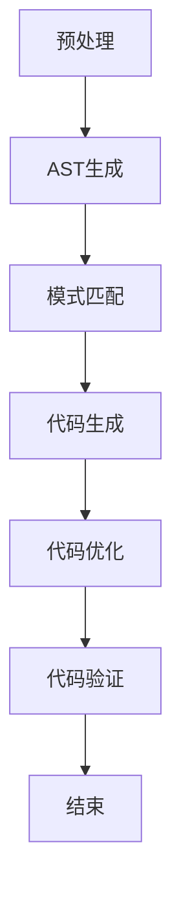

                 


### 打造高效的代码自动化生成平台

> 关键词：代码自动化、代码生成器、系统架构、算法原理、项目实践

> 摘要：
随着软件开发的复杂性日益增加，手动编写代码已经变得越来越困难且低效。代码自动化生成平台作为一种技术手段，可以在一定程度上减轻开发者的负担，提高代码生成效率和一致性。本文将探讨如何打造一个高效的代码自动化生成平台，包括背景介绍、核心概念、系统架构设计、算法原理讲解、数学模型和公式、项目实战以及最佳实践与总结等内容。

#### 第一部分：背景介绍

##### 第1章：代码自动化的必要性

1.1 问题背景
在软件开发的早期阶段，开发人员通常需要手动编写大量的代码来完成各种功能。随着项目的复杂性增加，手动编写代码不仅效率低下，而且容易出错。同时，软件开发的需求经常变化，导致已有的代码需要进行频繁的修改和重构。

1.2 代码自动化的价值
代码自动化生成平台可以在很大程度上减轻开发人员的负担，提高代码生成效率和一致性。它能够根据预先定义的规则和模板，自动生成符合需求的代码，从而降低开发成本和缩短开发周期。

1.3 代码自动化的现状
目前，已经有许多工具和平台可以支持代码自动生成，如模板引擎、代码生成器等。但是，这些工具通常只能生成简单的代码片段，对于复杂的业务逻辑和需求变化，仍需要开发人员进行大量的手动调整。

1.4 代码自动化的重要性
代码自动化生成不仅是提高开发效率的手段，更是提升软件质量的重要途径。通过自动生成代码，可以减少人为错误，提高代码的一致性和可维护性。此外，代码自动化生成还可以促进团队协作，使得开发人员能够将更多精力投入到核心业务逻辑的实现上。

#### 第二部分：核心概念与联系

##### 第2章：代码自动化生成的基础概念

2.1 代码自动化的定义
代码自动化生成是指利用预先定义的规则、模板或者算法，自动生成符合需求的代码。

2.2 代码生成器的类型
代码生成器可以分为两类：模板驱动的代码生成器和算法驱动的代码生成器。前者通过预定义的模板和参数生成代码，后者则通过算法和模型自动生成代码。

2.3 代码模板与抽象语法树（AST）
代码模板是一种用于生成代码的结构化文档，通常包含变量、占位符和逻辑控制语句等。抽象语法树（AST）是程序源代码的抽象表示，可以用来表示程序的结构和语义。

#### 第三部分：系统架构设计

##### 第3章：代码自动化生成平台的设计原则

3.1 平台整体架构
代码自动化生成平台通常包括四个主要模块：需求分析模块、代码生成模块、代码优化模块和代码验证模块。

3.2 数据处理模块设计
数据处理模块负责对用户输入的需求进行分析和理解，并将其转换为内部表示形式。

3.3 代码生成模块设计
代码生成模块根据内部表示形式和预定义的模板或算法，生成符合需求的代码。

3.4 质量保证与优化
质量保证模块负责检查生成的代码是否符合预期的质量标准，如语法正确性、性能和可维护性。优化模块则负责对生成的代码进行优化，以提高其性能和可读性。

#### 第四部分：算法原理讲解

##### 第4章：代码自动生成算法的核心原理

4.1 算法概述
代码自动生成算法可以分为预处理阶段、生成阶段和优化阶段。

4.2 AST解析与修改
抽象语法树（AST）是代码自动生成算法的核心，通过解析源代码生成AST，然后根据需求对AST进行修改，从而生成新的代码。

4.3 模式匹配与代码生成
模式匹配是代码自动生成算法的关键步骤，通过预定义的模式匹配规则，将AST中的节点与模式进行匹配，并根据匹配结果生成新的代码。

4.4 算法mermaid流程图
以下是一个简单的算法mermaid流程图：



##### 第5章：代码自动生成中的数学模型

5.1 语言模型
语言模型是代码自动生成算法的基础，用于表示代码的结构和语义。常用的语言模型包括马尔可夫模型、n元语法模型和循环神经网络（RNN）等。

5.2 生成概率模型
生成概率模型用于计算代码生成的概率，常用的模型包括隐马尔可夫模型（HMM）和变分自动编码器（VAE）等。

5.3 数学公式与算法解释
以下是一个简单的数学公式，用于表示代码生成的概率：

$$
P(x|y) = \frac{P(y|x)P(x)}{P(y)}
$$

其中，$P(x|y)$表示在给定上下文$y$的情况下生成代码$x$的概率，$P(y|x)$表示在生成代码$x$的情况下出现上下文$y$的概率，$P(x)$表示代码$x$的概率，$P(y)$表示上下文$y$的概率。

##### 第6章：代码自动化生成平台的项目实践

6.1 项目介绍
本案例将介绍一个基于Python的简单代码自动化生成平台，用于生成简单的Python函数。

6.2 环境安装与配置
首先，需要安装Python环境和相关依赖，如ast、lark等。

6.3 系统核心实现
系统核心实现包括需求分析模块、代码生成模块和代码验证模块。以下是代码生成模块的实现：

```python
import ast
import lark

class CodeGenerator(ast.NodeTransformer):
    def visit_FunctionDef(self, node):
        return ast.Module(body=[ast.FunctionDef(
            name=node.name,
            args=node.args,
            body=node.body,
            decorator_list=node.decorator_list,
            returns=node.returns
        )])

def generate_code(source_code):
    parser = lark.Lark(source_code, parser='lalr', start='func')
    tree = parser.parse(source_code)
    generator = CodeGenerator()
    return generator.visit(tree)

# 示例
source_code = "def hello():\n    print('Hello, World!')\n"
generated_code = generate_code(source_code)
print(generated_code)
```

6.4 应用解读与分析
生成的代码是一个简单的Python函数，用于打印'Hello, World!'。

6.5 实际案例剖析
在实际项目中，代码生成平台可以根据具体的业务需求，生成更复杂的代码，如数据库模型、RESTful API等。

##### 第7章：构建高效代码自动化生成平台的最佳实践

7.1 设计原则
在设计代码自动化生成平台时，应遵循以下原则：
- 灵活性：平台应能够灵活地适应不同的开发需求和项目特点。
- 扩展性：平台应具有较好的扩展性，方便添加新的功能和支持不同的编程语言。
- 可维护性：平台应具有良好的可维护性，便于后续的更新和升级。

7.2 技术选型
在选择技术时，应考虑以下因素：
- 编程语言：Python、Java等常见的编程语言，具有良好的生态和丰富的库支持。
- 模板引擎：如Jinja2、FreeMarker等，用于生成模板驱动的代码。
- 代码生成器：如JasperReport、AutoGen等，用于生成算法驱动的代码。
- AST库：如Python的ast库、JavaScript的esprima库等，用于解析和操作源代码。

7.3 性能优化
为了提高代码自动生成的性能，可以采取以下措施：
- 缓存：缓存生成的代码，避免重复生成。
- 并发：利用多线程或分布式计算，提高生成速度。
- 优化算法：优化算法的复杂度和效率，减少生成时间。

7.4 注意事项
在构建代码自动化生成平台时，需要注意以下事项：
- 遵守编程规范：确保生成的代码符合编程规范，便于后续维护。
- 测试：对生成的代码进行充分的测试，确保其正确性和性能。
- 安全性：确保生成的代码不会引入安全漏洞，如SQL注入等。

7.5 小结与拓展阅读
本文介绍了如何打造一个高效的代码自动化生成平台，包括核心概念、系统架构设计、算法原理讲解、项目实战和最佳实践等内容。读者可以通过以下拓展阅读深入了解相关技术：
- 《代码生成技术指南》
- 《软件工程：实践者的研究方法》
- 《编程珠玑》

#### 总结

本文详细介绍了如何打造一个高效的代码自动化生成平台，包括背景介绍、核心概念、系统架构设计、算法原理讲解、数学模型和公式、项目实战以及最佳实践等内容。通过本文的阅读，读者可以了解代码自动化生成的基本原理和实现方法，并掌握构建高效代码自动化生成平台的关键技术。希望本文对读者的软件开发实践有所帮助。作者：AI天才研究院/AI Genius Institute & 禅与计算机程序设计艺术 /Zen And The Art of Computer Programming。|>

