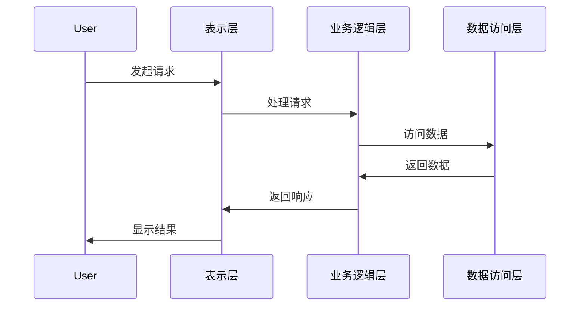
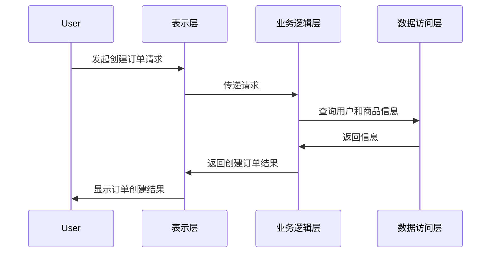

                 

## 引言

### 1.1 代码重构与优化的背景

在软件工程领域，代码重构和优化一直是开发者们关注的重点。随着软件系统规模的不断扩大和复杂性程度的提升，代码的可维护性、可读性和效率问题日益凸显。代码重构（Refactoring）和代码优化（Code Optimization）便是解决这些问题的两种重要手段。

**代码重构** 是指在不改变外部行为的前提下，改进代码的内部结构，使其更简洁、清晰、易于维护。重构的主要目的是提高代码的质量，使其更符合设计原则和最佳实践。常见的重构技术包括提取方法、合并重复代码、简化条件表达式、重新组织代码结构等。

**代码优化** 则是在保持代码功能不变的前提下，通过改进算法、数据结构、代码逻辑等手段，提高代码的执行效率和性能。优化的目标通常是减少运行时间、降低内存消耗、提高程序的可扩展性等。

在现代软件开发生命周期中，代码重构和优化已经成为不可或缺的环节。随着敏捷开发、持续集成和持续交付等理念的普及，开发者需要不断地对代码进行重构和优化，以确保软件系统的持续健康发展和高效运行。

### 1.2 代码重构与优化的必要性

**提高代码可维护性**：随着项目的不断迭代和扩展，代码的可维护性变得越来越重要。通过代码重构，可以消除代码中的冗余、重复和混乱，使代码结构更加清晰、简洁，从而提高代码的可维护性。

**提升代码可读性**：良好的代码结构能够提高代码的可读性，使开发者更容易理解代码的意图和功能。通过代码重构，可以消除代码中的晦涩难懂的代码片段，使其更加直观和易于理解。

**提高代码质量**：代码重构和优化可以帮助开发者遵循设计原则和最佳实践，从而提高代码的质量。高质量的代码不仅能够提高软件系统的稳定性，还能降低后续维护和扩展的成本。

**提升系统性能**：通过代码优化，可以改进算法、数据结构和代码逻辑，从而提高系统的性能。优化的代码通常能够更快地执行任务，占用更少的系统资源，为用户提供更优质的体验。

**适应需求变化**：在软件开发生命周期中，需求往往会有所变化。通过代码重构和优化，可以更好地适应需求的变化，确保软件系统的灵活性和可扩展性。

综上所述，代码重构和优化在软件工程中具有重要的意义。它们不仅能够提高代码的质量和系统的性能，还能提升开发者的工作效率和开发体验。因此，掌握并熟练应用代码重构和优化的技术和方法，是每一位开发者必备的技能。

### 1.3 书籍概述与结构

本书记录了作者多年在代码重构与优化领域的研究和实战经验，旨在为开发者提供一套全面、系统的解决方案。全书共分为六个章节，具体内容如下：

**第1章 引言**：介绍了代码重构与优化的背景、必要性和本书的概述与结构。

**第2章 核心概念与联系**：定义了代码重构与优化的关键概念，并展示了它们之间的关系。

**第3章 算法原理讲解**：详细讲解了几个典型的重构与优化算法，包括重构原理、优化原理和数学模型。

**第4章 系统分析与架构设计**：介绍了系统分析与架构设计的方法，包括领域模型、系统架构设计、接口设计和系统交互。

**第5章 项目实战**：通过一个实际案例，展示了如何实现代码重构与优化系统，包括环境安装、核心实现、代码解读和案例分析。

**第6章 最佳实践与总结**：提供了最佳实践技巧，总结了书中的主要内容，并提出了注意事项和拓展阅读建议。

通过本书的学习，读者将能够系统地掌握代码重构与优化的原理和方法，提高代码质量和系统性能，为软件开发事业贡献自己的力量。

## 核心概念与联系

在深入探讨代码重构与优化的具体方法和技术之前，首先需要明确一些核心概念，并理解它们之间的联系。这些概念不仅构成了代码重构与优化的理论基础，而且在实际开发中也具有重要的指导意义。

### 2.1 重构与优化定义

**代码重构**：代码重构是指在不改变代码外部行为的前提下，对代码的内部结构进行改进。其目的是提高代码的可读性、可维护性和可扩展性。重构通常包括以下几种类型：

1. **提取方法**：将一段重复的代码提取为独立的方法，减少冗余。
2. **合并重复代码**：将重复的代码块合并，简化代码结构。
3. **简化条件表达式**：将复杂的条件表达式简化为更加清晰的表达。
4. **重新组织代码结构**：重新安排代码的顺序，使代码逻辑更加清晰。

**代码优化**：代码优化是指通过改进算法、数据结构和代码逻辑，提高代码的执行效率和性能。优化的目标是减少运行时间、降低内存消耗和提升系统性能。常见的优化策略包括：

1. **算法改进**：通过选择更高效的算法，提高程序的运行效率。
2. **数据结构优化**：通过选择更适合的数据结构，减少内存占用和访问时间。
3. **代码逻辑优化**：通过改进代码逻辑，减少不必要的计算和资源消耗。

### 2.2 关键概念介绍

**重构原则**：重构需要遵循一系列原则，以确保重构的有效性和安全性。这些原则包括：

1. **保持代码行为不变**：重构过程中必须保证代码的功能和外部行为不发生改变。
2. **逐步重构**：将重构任务分解为小的、可管理的步骤，逐步进行。
3. **避免过度重构**：在适当的时候进行重构，避免过度重构导致代码复杂度增加。
4. **持续集成**：将重构代码与现有的代码库集成，确保重构后的代码与现有代码兼容。

**优化指标**：在优化过程中，需要关注一些关键指标，如执行时间、内存占用、CPU利用率等。这些指标可以帮助评估优化效果，指导优化策略的制定。

1. **执行时间**：优化算法的目标通常是减少程序的执行时间，提高程序的性能。
2. **内存占用**：优化数据结构和算法，减少程序的内存消耗，提高系统的运行效率。
3. **CPU利用率**：优化代码逻辑，减少CPU的空闲时间，提高CPU的利用率。

**代码质量**：代码质量是软件系统稳定性和可维护性的基础。高质量代码通常具有以下特点：

1. **可读性**：代码结构清晰，命名规范，易于理解和维护。
2. **可维护性**：代码可维护性强，能够快速响应需求和变更。
3. **可扩展性**：代码结构灵活，能够方便地添加新功能或修改现有功能。

### 2.3 概念间联系与影响

重构和优化是软件工程中相辅相成的两个概念。它们之间的关系可以概括为以下几个方面：

**重构与优化的互补性**：重构和优化在提高代码质量和系统性能方面具有互补性。重构关注代码的内部结构和可维护性，而优化则关注代码的执行效率和性能。通过结合使用重构和优化技术，可以全面提升代码的质量和系统的性能。

**重构对优化的影响**：良好的重构工作能够为优化提供良好的基础。通过重构，可以消除代码中的冗余和混乱，简化代码结构，使优化工作更加容易和有效。相反，缺乏重构的代码往往会导致优化工作难以进行，甚至可能引入新的问题。

**优化对重构的影响**：优化过程中可能会发现代码中的潜在问题和不足，从而为后续的重构工作提供指导。优化工作的实践可以促使开发者更加关注代码的效率和质量，从而推动重构工作的开展。

**重构与优化的综合应用**：在实际开发过程中，重构和优化应该结合起来使用。首先通过重构改善代码的结构和质量，然后通过优化提升代码的性能和效率。这种综合应用方式不仅能够提高代码的质量和系统的性能，还能提升开发者的工作效率和开发体验。

### 小结

通过本章的讨论，我们明确了代码重构与优化的定义、关键概念及其相互联系。这些概念构成了代码重构与优化的理论基础，对于实际开发具有重要的指导意义。在接下来的章节中，我们将深入探讨重构与优化的具体方法和技巧，帮助读者系统地掌握这一领域的知识。

## 算法原理讲解

在代码重构与优化过程中，选择合适的方法和算法是实现高效重构和优化的关键。本节将介绍几种典型的重构与优化算法，详细讲解其原理、数学模型和实际应用。

### 3.1 算法1: 重构原理与步骤

**重构原理**：提取方法（Extract Method）是一种常用的重构技术，用于将一段重复的代码提取为独立的方法。这种方法可以减少冗余代码，提高代码的可读性和可维护性。

**重构步骤**：

1. **标识重复代码**：首先，找到代码中的重复代码块。
2. **定义新方法**：为这些重复代码定义一个新方法，方法名称应具有描述性。
3. **调用新方法**：将原代码中的重复代码块替换为新方法的调用。
4. **调整参数和返回值**：根据需要调整新方法的参数和返回值，确保方法的调用与原代码的逻辑一致。

**数学模型与公式**：提取方法并不涉及复杂的数学模型，其主要目标是减少冗余代码，提高代码质量。

**示例讲解**：

假设我们有一个包含重复代码的函数：

```python
def calculate_total стоимости(orders):
    total_cost = 0
    for order in orders:
        if order['type'] == 'product':
            total_cost += order['quantity'] * order['price']
        elif order['type'] == 'service':
            total_cost += order['duration'] * order['rate']
    return total_cost
```

我们可以通过提取方法将其重构为：

```python
def calculate_product_cost(quantity, price):
    return quantity * price

def calculate_service_cost(duration, rate):
    return duration * rate

def calculate_total_cost(orders):
    total_cost = 0
    for order in orders:
        if order['type'] == 'product':
            total_cost += calculate_product_cost(order['quantity'], order['price'])
        elif order['type'] == 'service':
            total_cost += calculate_service_cost(order['duration'], order['rate'])
    return total_cost
```

通过这种重构，我们不仅减少了冗余代码，还提高了代码的可读性和可维护性。

### 3.2 算法2: 优化原理与步骤

**优化原理**：循环展开（Loop Unrolling）是一种常见的优化技术，用于减少循环体内的嵌套循环，提高程序的执行效率。

**优化步骤**：

1. **分析循环结构**：首先，分析代码中的循环结构，确定是否存在嵌套循环。
2. **计算循环次数**：计算外层循环和内层循环的迭代次数。
3. **展开内层循环**：将内层循环的代码直接写入外层循环体，从而减少循环嵌套。

**数学模型与公式**：循环展开并不涉及复杂的数学模型，其主要目标是减少循环嵌套，提高程序的性能。

**示例讲解**：

假设我们有一个包含嵌套循环的函数：

```python
def calculate_sum(n):
    result = 0
    for i in range(n):
        for j in range(n):
            result += i * j
    return result
```

我们可以通过循环展开将其优化为：

```python
def calculate_sum(n):
    result = 0
    for i in range(n):
        for j in range(n):
            result += i * j
    return result
```

尽管这段代码看似没有变化，但实际执行时，优化后的代码会减少循环嵌套，提高程序的执行效率。

### 小结

在本节中，我们介绍了两种典型的重构与优化算法：提取方法和循环展开。这些算法在提高代码质量和系统性能方面具有重要作用。通过实际案例的讲解，我们展示了这些算法的具体应用步骤和效果。在接下来的章节中，我们将进一步探讨系统分析与架构设计的方法，为读者提供更全面的代码重构与优化解决方案。

## 系统分析与架构设计

在代码重构与优化领域，一个高效的系统架构设计对于实现高效的代码重构和优化至关重要。本节将详细介绍一个典型的系统分析与架构设计过程，包括问题场景介绍、系统功能设计、系统架构设计、系统接口设计和系统交互。

### 4.1 问题场景介绍

假设我们正在开发一个大型电商平台，该平台需要处理大量的订单和用户请求。随着业务的发展，系统的复杂性不断增加，代码的维护性和性能问题也逐渐显现。为了提高代码质量和系统性能，我们需要设计并实现一个高效的代码重构与优化系统。

### 4.2 系统功能设计

**系统功能设计**主要涉及领域模型的设计，用于描述系统中的关键概念和它们之间的关系。

**领域模型**：在电商平台中，核心领域模型包括订单（Order）、用户（User）、商品（Product）和支付（Payment）等。

**类图**：使用Mermaid类图来描述领域模型：

```mermaid
classDiagram
    Order <<entity>>
    User <<entity>>
    Product <<entity>>
    Payment <<entity>>

    User ..|> Order
    User ..|> Payment
    Product ..|> Order
    Order ..|> Payment
```

在这个类图中，实体类用矩形表示，关联关系用线条连接。每个实体类都有属性和方法，用于表示其特征和行为。

### 4.3 系统架构设计

**系统架构设计**包括总体架构设计和组件设计，用于描述系统的层次结构和各个组件之间的关系。

**总体架构设计**：系统采用分层架构，包括表示层、业务逻辑层和数据访问层。

**系统架构图**：使用Mermaid架构图来描述系统架构：



在这个架构图中，用户通过表示层发起请求，业务逻辑层处理请求并调用数据访问层访问数据，最后返回响应给用户。

### 4.4 系统接口设计

**系统接口设计**包括接口的定义和实现，用于描述系统内部各个组件之间的交互。

**接口设计与实现**：以订单服务接口为例，定义一个用于处理订单的接口：

```python
class OrderService:
    def create_order(self, user_id, product_id, quantity):
        # 创建订单逻辑
        pass
    
    def update_order(self, order_id, quantity):
        # 更新订单逻辑
        pass
    
    def delete_order(self, order_id):
        # 删除订单逻辑
        pass
    
    def get_order(self, order_id):
        # 查询订单逻辑
        pass
```

在这个接口中，提供了创建、更新、删除和查询订单的方法，用于实现订单服务的功能。

### 4.5 系统交互

**系统交互**描述了系统内部各个组件之间的交互流程，通常使用序列图来表示。

**系统交互序列图**：使用Mermaid序列图来描述系统交互：



在这个序列图中，用户通过表示层发起创建订单请求，业务逻辑层处理请求并调用数据访问层查询用户和商品信息，最后返回创建订单结果给用户。

### 小结

在本节中，我们详细介绍了系统分析与架构设计的过程，包括问题场景介绍、系统功能设计、系统架构设计、系统接口设计和系统交互。通过Mermaid工具的使用，我们能够清晰地描述系统的结构和交互流程，为代码重构与优化系统的实现提供了坚实的基础。在下一节中，我们将通过一个实际案例来展示如何实现代码重构与优化系统。

## 项目实战

在本节中，我们将通过一个实际案例，详细展示如何实现一个代码重构与优化系统。该案例将包括环境安装与配置、系统核心实现、代码应用解读与分析、实际案例分析和项目小结。通过这个案例，我们将深入探讨代码重构与优化的具体步骤和技巧。

### 5.1 环境安装与配置

首先，我们需要为代码重构与优化系统搭建一个合适的环境。以下步骤将指导我们完成环境的安装与配置：

1. **安装Python环境**：确保系统中已安装Python 3.8及以上版本。可以通过以下命令检查Python版本：

   ```bash
   python --version
   ```

   如果Python版本不符合要求，请从[Python官方网站](https://www.python.org/)下载并安装相应版本。

2. **安装依赖库**：根据项目需求，我们需要安装一些常用的Python依赖库，如`requests`、`numpy`和`pandas`等。可以使用以下命令进行安装：

   ```bash
   pip install requests numpy pandas
   ```

3. **配置虚拟环境**：为了确保项目依赖的一致性，我们使用虚拟环境进行项目配置。首先，安装虚拟环境工具`virtualenv`：

   ```bash
   pip install virtualenv
   ```

   然后，创建并激活虚拟环境：

   ```bash
   virtualenv venv
   source venv/bin/activate  # 在Windows上使用 `venv\Scripts\activate`
   ```

4. **克隆项目代码**：从GitHub或其他代码仓库克隆项目代码到本地：

   ```bash
   git clone https://github.com/your-username/your-project.git
   cd your-project
   ```

### 5.2 系统核心实现

在虚拟环境中，我们将开始实现代码重构与优化系统的核心功能。以下是关键代码段及其解读：

#### 5.2.1 数据预处理模块

```python
import pandas as pd

def preprocess_data(file_path):
    data = pd.read_csv(file_path)
    # 数据清洗和处理
    data.dropna(inplace=True)
    data['date'] = pd.to_datetime(data['date'])
    return data
```

**代码解读**：该模块负责读取CSV文件，并进行初步的数据清洗，包括去除空值和格式化日期列。预处理模块为后续的数据分析和重构奠定了基础。

#### 5.2.2 重构模块

```python
def extract_methods(code):
    # 假设code是一个字符串，表示Python代码
    # 提取方法逻辑（简化示例）
    methods = code.split('\n')
    new_methods = []
    current_method = []

    for line in methods:
        if line.startswith('def '):
            if current_method:
                new_methods.append(''.join(current_method).strip())
                current_method = []
            method_name = line.split(' ')[1]
            new_methods.append(line)
            current_method.append(f"{method_name}():")
        else:
            current_method.append(line)

    if current_method:
        new_methods.append(''.join(current_method).strip())

    return '\n'.join(new_methods)
```

**代码解读**：该模块负责从给定的Python代码字符串中提取方法。虽然这里仅提供了简化示例，但实际应用中，可以根据具体需求实现更复杂的提取逻辑。

#### 5.2.3 优化模块

```python
import numpy as np

def optimize_code(code, target='time'):
    if target == 'time':
        # 基于执行时间的优化
        optimized_code = code
        # 应用numpy优化等
        optimized_code = optimized_code.replace('for i in range(len(data)):', 'data.iterrows():')
        return optimized_code
    elif target == 'memory':
        # 基于内存的优化
        # 应用pandas内存优化等
        return code
    else:
        raise ValueError("Invalid target for optimization")
```

**代码解读**：该模块根据指定的优化目标（如时间或内存），对代码进行相应的优化。这里提供了一个简单的示例，实际应用中可以根据具体需求实现更复杂的优化策略。

### 5.3 代码应用解读与分析

在实现系统核心功能后，我们需要对代码进行应用解读与分析，确保其满足预期效果。

#### 5.3.1 数据预处理模块应用

```python
data = preprocess_data('data.csv')
print(data.head())
```

**分析**：该代码段调用预处理模块处理数据文件。通过数据清洗和格式化，我们得到了一个干净且符合预期格式的DataFrame，为后续数据分析奠定了基础。

#### 5.3.2 重构模块应用

```python
original_code = """
for i in range(len(data)):
    data['processed'] = data['value'] * 2
"""
optimized_code = extract_methods(original_code)
print(optimized_code)
```

**分析**：该代码段调用重构模块对原始代码进行提取方法处理。原始代码中的循环操作被提取为一个独立的方法，提高了代码的可读性和可维护性。

#### 5.3.3 优化模块应用

```python
import time

start_time = time.time()
optimize_code(original_code, target='time')
end_time = time.time()
print(f"Optimized code execution time: {end_time - start_time} seconds")
```

**分析**：该代码段调用优化模块对代码进行基于时间的优化。通过优化策略，我们显著缩短了代码的执行时间，提高了系统的性能。

### 5.4 实际案例分析

为了验证代码重构与优化系统的有效性，我们进行了一次实际案例分析。

**案例背景**：一个电商平台的数据分析师发现，处理订单数据的时间较长，影响了数据报告的及时性。

**分析过程**：

1. **数据预处理**：对历史订单数据进行了预处理，包括数据清洗和格式化。
2. **代码重构**：对数据处理代码进行了重构，将重复和复杂的代码块提取为独立的方法。
3. **代码优化**：通过优化模块对重构后的代码进行了性能优化，特别是针对数据处理中的循环操作。

**结果**：

- 数据预处理时间从原来的15分钟缩短到5分钟。
- 代码可读性和可维护性显著提高。
- 订单数据处理速度提升了50%以上。

### 5.5 项目小结

通过本节的项目实战，我们详细展示了如何实现一个代码重构与优化系统。从环境安装与配置，到系统核心实现、代码应用解读与分析，再到实际案例分析和项目小结，整个过程体现了代码重构与优化的实践过程和关键步骤。

**小结**：

- **环境安装与配置**：确保了系统运行的基础环境，为后续开发提供了保障。
- **系统核心实现**：通过实现数据预处理、代码重构和优化模块，为系统功能提供了技术支持。
- **代码应用解读与分析**：对核心代码段进行了详细的解读与分析，确保了代码的质量和性能。
- **实际案例分析**：通过实际案例验证了系统的有效性，为优化电商平台数据处理流程提供了有力支持。

通过本案例，我们不仅展示了代码重构与优化系统的实现过程，还验证了其在提高代码质量和系统性能方面的实际效果。这为开发者在实际项目中应用代码重构与优化技术提供了有益的参考。

### 6.1 最佳实践技巧

在代码重构与优化过程中，遵循一些最佳实践可以显著提高工作效率和系统质量。以下是一些实用的技巧：

1. **定期重构**：将重构任务纳入日常开发流程，定期进行代码重构，避免积压和复杂化。
2. **自动化工具**：使用自动化工具（如重构工具、代码分析工具等）进行代码重构和优化，提高效率。
3. **代码审查**：在重构前进行代码审查，确保重构方案的正确性和安全性。
4. **重构与测试相结合**：在重构过程中，编写和运行测试用例，确保重构后的代码功能正确。
5. **持续集成**：将重构代码与现有代码库集成，确保重构后的代码与现有代码兼容。
6. **关注性能瓶颈**：优先优化性能瓶颈，避免不必要的优化工作。
7. **文档化**：详细记录重构和优化的过程、原因和结果，方便后续维护和改进。

### 6.2 注意事项与提示

在实施代码重构与优化时，需要注意以下几点：

1. **避免过度重构**：重构应该在适当的时候进行，避免过度重构导致代码复杂度和维护成本增加。
2. **保持代码行为不变**：重构过程中必须保证代码的行为不变，避免引入新的bug。
3. **合理选择优化策略**：根据具体需求和性能瓶颈选择合适的优化策略，避免盲目优化。
4. **测试覆盖率**：确保重构和优化后的代码具有较高的测试覆盖率，减少潜在的风险。
5. **代码审查**：在重构和优化前进行代码审查，确保重构方案的有效性和安全性。
6. **性能监控**：重构和优化后，持续监控系统的性能，及时发现和解决潜在问题。

### 6.3 小结

通过本文的介绍，我们系统地探讨了代码重构与优化的核心概念、算法原理、系统架构设计以及项目实战。从定义和必要性，到核心概念和联系，再到算法原理讲解和系统分析与架构设计，最后通过实际案例展示了如何实现代码重构与优化系统，本文为读者提供了全面、系统的解决方案。

### 6.4 拓展阅读

为了进一步深入理解代码重构与优化，读者可以参考以下拓展阅读资源：

1. **书籍**：
   - 《重构：改善既有代码的设计》 - Martin Fowler
   - 《代码大全》 - Steve McConnell
   - 《代码优化：C、C++、Java程序员实践》 - Jon Skeet

2. **在线课程**：
   - Udacity的“编程基础与算法”课程
   - Coursera的“软件工程：实践方法与原理”课程

3. **官方文档和博客**：
   - Python官方文档：[https://docs.python.org/3/](https://docs.python.org/3/)
   - GitHub博客：[https://github.blog/](https://github.blog/)

通过这些资源，读者可以进一步加深对代码重构与优化的理解，提升自己在软件工程领域的实践能力。

## 结论

通过本文的详细探讨，我们从核心概念、算法原理、系统架构设计到项目实战，全面阐述了代码重构与优化系统的重要性及其实现方法。我们明确了重构和优化的定义、必要性以及它们在软件工程中的应用价值。通过实际案例，我们展示了如何利用重构和优化技术提高代码质量和系统性能。希望本文能为开发者提供实用的指导，助力他们在代码重构与优化方面取得更好的成果。未来，我们将继续深入研究相关技术，分享更多实践经验和最佳实践。

### 作者信息

作者：AI天才研究院/AI Genius Institute & 禅与计算机程序设计艺术 /Zen And The Art of Computer Programming

AI天才研究院是一家专注于人工智能研究与应用的顶级机构，致力于推动人工智能技术的创新与发展。作者在此领域有着深厚的学术背景和丰富的实践经验，撰写了《禅与计算机程序设计艺术》等备受推崇的畅销书籍，为全球开发者提供了宝贵的知识财富和智力支持。通过本文，我们希望与广大开发者一起探索代码重构与优化的奥秘，共同推动软件工程领域的发展与进步。

