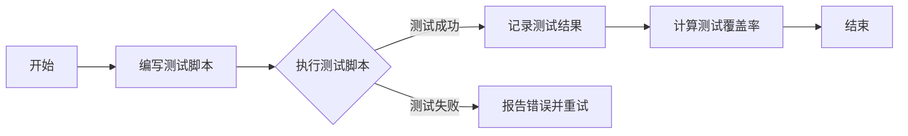
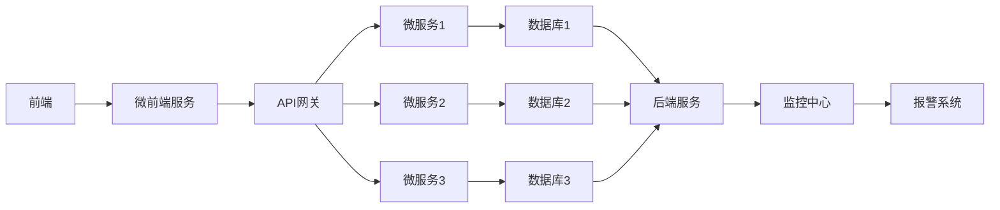
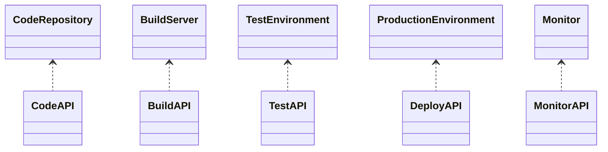
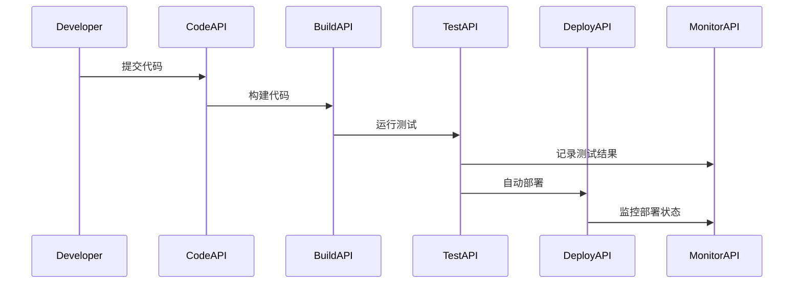

                 

# 打造高效的持续交付流水线

## 关键词

持续交付、流水线设计、自动化测试、算法原理、系统架构、项目实战、最佳实践

## 摘要

本文将深入探讨如何打造高效的持续交付流水线。持续交付作为一种先进的软件交付实践，通过自动化和流水线化的方式，极大地提高了软件交付的效率和质量。本文将逐步解析持续交付的核心概念、算法原理、系统架构设计，并通过项目实战案例，详细讲解其实施方法和最佳实践。目的是帮助读者全面理解并掌握持续交付的理论和实践，从而打造出高效、可靠的持续交付流水线。

### 目录大纲

1. **第一部分：背景介绍**
    - 第1章 问题背景与持续交付流水线的必要性
    - 第2章 核心概念与联系

2. **第二部分：算法原理讲解**
    - 第3章 算法原理讲解
    - 第4章 数学模型和数学公式 & 详细讲解 & 举例说明

3. **第三部分：系统分析与架构设计方案**
    - 第5章 系统分析与架构设计方案

4. **第四部分：项目实战**
    - 第6章 项目实战

5. **第五部分：最佳实践 tips、小结、注意事项、拓展阅读等内容**
    - 第7章 最佳实践 tips
    - 第7章 小结
    - 第7章 注意事项
    - 第7章 拓展阅读

## 第一部分：背景介绍

### 第1章 问题背景与持续交付流水线的必要性

#### 1.1.1 问题背景

在当今快速发展的软件行业，软件交付的速度和质量是衡量一个团队或企业竞争力的重要指标。传统的软件交付流程往往存在以下问题：

- **交付周期长**：从需求分析到最终上线，中间环节繁多，导致交付周期过长。
- **手工操作多**：测试、部署等环节依赖人工操作，容易出错，且效率低下。
- **不可见性**：交付过程中各个阶段的信息流转不透明，导致问题难以追踪。
- **风险高**：频繁的人工干预和复杂的流程增加了出现故障的风险。

这些问题不仅影响软件交付的效率，还可能导致质量问题，进而影响用户体验和业务发展。为了解决这些问题，持续交付流水线的必要性日益凸显。

#### 1.1.2 问题描述

传统软件交付流程通常包括需求分析、设计、编码、测试、部署和运维等多个环节。这些环节往往依赖于不同的工具和系统，信息流转不透明，容易出现以下问题：

- **测试不到位**：测试环节往往只能覆盖部分功能，且测试效率低，难以保证软件质量。
- **部署复杂**：部署流程复杂，容易出错，且无法快速回滚，增加了维护成本。
- **运维困难**：运维人员需要手动处理大量任务，效率低下，且容易出现错误。

这些问题导致软件交付的周期长、质量不稳定，无法满足快速变化的业务需求。

#### 1.1.3 问题解决

持续交付流水线通过以下方式解决了传统软件交付流程中的问题：

- **自动化**：自动化测试、自动化部署等环节，减少了手工操作，提高了效率。
- **流水线化**：将整个交付过程拆分为多个阶段，每个阶段都可以独立运行，提高了交付过程的可见性和可管理性。
- **透明化**：通过监控工具，实时跟踪交付过程中的各项指标，确保问题能够及时发现和解决。
- **可靠化**：通过持续集成和持续部署，确保每次交付都是高质量的，降低了故障风险。

#### 1.1.4 边界与外延

持续交付并不仅限于软件开发，它还涉及到测试、部署、运维等环节。其边界包括：

- **开发**：包括代码编写、代码审查等。
- **测试**：包括自动化测试、手动测试等。
- **部署**：包括环境配置、代码部署等。
- **运维**：包括系统监控、故障处理等。

持续交付的外延还涉及到项目管理、团队协作等方面。

#### 1.1.5 概念结构与核心要素组成

持续交付的核心要素包括：

- **持续集成**（Continuous Integration，CI）：确保代码合并到主干分支时的质量。
- **持续部署**（Continuous Deployment，CD）：快速、可靠地将代码部署到生产环境。
- **自动化测试**：确保软件质量，减少人工干预。
- **监控与反馈**：实时监控交付过程中的各项指标，及时反馈问题。
- **团队协作**：确保各个环节的顺畅协作，提高交付效率。

这些要素相互关联，共同构成了持续交付流水线，为高效的软件交付提供了有力支持。

### 第2章 核心概念与联系

#### 2.1.1 核心概念原理

持续交付流水线涉及多个核心概念，其中最重要的包括持续集成（CI）和持续部署（CD）。

- **持续集成**：持续集成是一种软件开发实践，通过频繁地将代码合并到主干分支，并自动运行一系列测试，确保代码质量。其目标是尽快发现和修复代码问题，避免代码合并时的冲突和缺陷。
- **持续部署**：持续部署是一种自动化部署实践，通过自动化工具将代码部署到生产环境。其目标是实现快速、可靠的软件交付，确保每次交付都是高质量的。

#### 2.1.2 概念属性特征对比表格

| 概念      | 持续集成（CI）                     | 持续部署（CD）                    |
| --------- | -------------------------------- | -------------------------------- |
| 目标      | 保证代码质量                       | 实现快速交付                       |
| 工具      | Jenkins、GitLab CI、Travis CI等    | AWS CodePipeline、Spinnaker、Argo等 |
| 流程      | 提交代码 -> 构建和测试 -> 部署     | 构建和测试 -> 部署 -> 监控和反馈    |
| 关键指标  | 构建成功率和测试覆盖率               | 部署成功率和故障恢复时间             |

#### 2.1.3 ER实体关系图架构

持续交付系统中的主要实体包括代码库、构建服务器、测试环境、生产环境等。以下是一个简化的ER实体关系图：

```mermaid
erDiagram
  CodeRepository ||--|{ BuildServer : builds }
  BuildServer ||--|{ TestEnvironment : runs_tests }
  TestEnvironment ||--|{ ProductionEnvironment : deploys }
  ProductionEnvironment ||--|{ Monitor : collects_metrics }
```

- **CodeRepository**（代码库）：存储开发者的代码。
- **BuildServer**（构建服务器）：负责构建代码，生成可执行文件。
- **TestEnvironment**（测试环境）：运行自动化测试，验证代码质量。
- **ProductionEnvironment**（生产环境）：部署上线后的环境。
- **Monitor**（监控）：实时监控生产环境，收集性能和稳定性指标。

通过以上核心概念和ER实体关系图的解析，我们可以更好地理解持续交付流水线的基本架构和运行机制。

## 第二部分：算法原理讲解

### 第3章 算法原理讲解

#### 3.1.1 算法mermaid流程图

持续交付流水线中的核心算法包括自动化测试和测试覆盖率计算。以下是一个简化的mermaid流程图，展示了自动化测试的基本流程：



#### 3.1.2 Python源代码

以下是一个简单的Python测试脚本示例，用于验证一个简单的加法函数：

```python
import unittest

def add(a, b):
    return a + b

class TestAddFunction(unittest.TestCase):
    def test_add_positive_numbers(self):
        self.assertEqual(add(2, 3), 5)

    def test_add_negative_numbers(self):
        self.assertEqual(add(-2, -3), -5)

    def test_add_mixed_numbers(self):
        self.assertEqual(add(2, -3), -1)

if __name__ == '__main__':
    unittest.main()
```

#### 3.1.3 算法原理的数学模型和公式

测试覆盖率是持续交付中的一个关键指标，用于衡量测试脚本覆盖代码的程度。测试覆盖率通常用以下公式计算：

$$
测试覆盖率 = \frac{被测试代码行数}{总代码行数} \times 100\%
$$

其中，被测试代码行数是指测试脚本中实际执行的代码行数，总代码行数是指被测试函数或模块中的总代码行数。

#### 3.1.4 详细讲解与举例说明

以一个简单的加法函数为例，我们如何计算其测试覆盖率？

假设加法函数中有10行代码，测试脚本中执行了8行代码，那么测试覆盖率可以计算为：

$$
测试覆盖率 = \frac{8}{10} \times 100\% = 80\%
$$

这意味着测试脚本覆盖了加法函数中80%的代码行数。

在实际应用中，测试覆盖率不仅考虑代码行数，还包括分支覆盖率、路径覆盖率等。分支覆盖率是指测试脚本覆盖了函数中的所有分支，路径覆盖率是指测试脚本覆盖了所有可能的执行路径。

#### 3.1.5 测试覆盖率的实际应用案例

假设一个复杂的业务逻辑模块，其中包含多个函数和分支。通过自动化测试，我们能够计算该模块的测试覆盖率。如果测试覆盖率较低，我们可能需要增加测试用例，以确保关键路径和异常情况得到充分测试。

例如，在一个电子商务平台中，订单处理模块是一个关键模块。通过持续集成和持续部署，我们可以自动化测试订单处理流程中的各个步骤。如果测试覆盖率低于90%，我们可能需要重新编写测试脚本，增加覆盖范围。

通过这种实际应用案例，我们可以看到测试覆盖率在持续交付中的重要性。它不仅帮助我们评估代码质量，还指导我们优化测试策略，确保软件交付的质量和稳定性。

### 第4章 数学模型和数学公式 & 详细讲解 & 举例说明

#### 4.1.1 数学公式

在持续交付流水线中，时间复杂度是一个重要的性能指标。时间复杂度用于描述算法执行时间与数据规模之间的关系。常用的时间复杂度公式如下：

$$
T(n) = O(n)
$$

其中，$T(n)$ 表示算法执行时间，$n$ 表示数据规模。$O(n)$ 表示算法的时间复杂度为线性时间。

#### 4.1.2 详细讲解

时间复杂度分为多个级别，从低到高包括：

- **常数时间**（$O(1)$）：算法执行时间与数据规模无关。
- **对数时间**（$O(\log n)$）：算法执行时间与数据规模的以2为底的对数成反比。
- **线性时间**（$O(n)$）：算法执行时间与数据规模成正比。
- **对数线性时间**（$O(n \log n)$）：算法执行时间与数据规模和对数成反比。
- **平方时间**（$O(n^2)$）：算法执行时间与数据规模的平方成正比。
- **更高阶时间**：如$O(n^3)$、$O(2^n)$等。

在实际应用中，我们通常关注算法的渐进时间复杂度，因为当数据规模较大时，低阶复杂度会被高阶复杂度所主导。

#### 4.1.3 举例说明

以一个简单的线性搜索算法为例，其时间复杂度为$O(n)$。假设有一个包含$n$个元素的数组，我们需要找到某个特定元素。最坏的情况下，我们需要遍历整个数组，找到目标元素。

```python
def linear_search(arr, target):
    for i in range(len(arr)):
        if arr[i] == target:
            return i
    return -1
```

在这个算法中，执行时间与数组长度$n$成正比，因此时间复杂度为$O(n)$。

再以一个二分搜索算法为例，其时间复杂度为$O(\log n)$。二分搜索算法通过不断将搜索范围缩小一半，快速定位目标元素。

```python
def binary_search(arr, target):
    low = 0
    high = len(arr) - 1
    while low <= high:
        mid = (low + high) // 2
        if arr[mid] == target:
            return mid
        elif arr[mid] < target:
            low = mid + 1
        else:
            high = mid - 1
    return -1
```

在这个算法中，每次迭代都将搜索范围缩小一半，因此时间复杂度为$O(\log n)$。

通过以上举例，我们可以看到不同算法的时间复杂度对性能的影响。在选择算法时，我们需要考虑数据规模和算法效率，以确保持续交付流水线的性能。

### 第三部分：系统分析与架构设计方案

#### 第5章 系统分析与架构设计方案

#### 5.1.1 问题场景介绍

在金融行业，持续交付流水线的重要性尤为突出。金融系统的稳定性直接关系到用户的资金安全，因此对软件交付的质量要求极高。以下是一个典型的金融行业问题场景：

- **高频交易**：金融系统中的高频交易要求系统具备高并发处理能力，确保交易执行的高效和准确。
- **合规性要求**：金融行业有严格的合规性要求，如KYC（了解你的客户）和AML（反洗钱）等，这些要求需要通过持续交付流水线来确保系统的合规性。
- **安全要求**：金融系统的安全性至关重要，需要通过持续交付流水线来确保系统在交付过程中不受安全威胁。

#### 5.1.2 项目介绍

为了提升金融系统的交付效率和质量，某银行决定引入持续交付流水线。该项目的主要目标是：

- **缩短交付周期**：通过自动化测试和持续集成，实现快速交付，提高市场响应速度。
- **提高软件质量**：通过严格的测试流程和质量控制，确保软件交付的高质量和可靠性。
- **增强合规性**：通过自动化合规检查和持续交付流水线，确保系统始终符合相关法规和标准。

#### 5.1.3 系统功能设计

持续交付系统的主要功能包括：

- **代码库管理**：存储和管理开发者的代码，确保代码版本的可追溯性和一致性。
- **构建和测试**：自动化构建和测试，确保每次提交的代码质量。
- **自动化部署**：通过自动化工具将测试通过后的代码部署到生产环境。
- **监控与反馈**：实时监控生产环境的运行状态，收集性能和稳定性指标，及时反馈问题。

以下是一个简化的持续交付系统领域模型，使用mermaid类图表示：

```mermaid
classDiagram
    CodeRepository <.. BuildServer
    BuildServer <.. TestEnvironment
    TestEnvironment <.. ProductionEnvironment
    ProductionEnvironment <.. Monitor
    CodeRepository --|{ Developer }
    BuildServer --|{ CI Tool }
    TestEnvironment --|{ Test Tool }
    ProductionEnvironment --|{ Deploy Tool }
    Monitor --|{ Monitoring Tool }
```

- **CodeRepository**（代码库）：存储和管理开发者的代码。
- **BuildServer**（构建服务器）：负责自动化构建和测试。
- **TestEnvironment**（测试环境）：运行自动化测试，验证代码质量。
- **ProductionEnvironment**（生产环境）：部署上线后的环境。
- **Monitor**（监控）：实时监控生产环境的运行状态。

#### 5.1.4 系统架构设计

持续交付系统的架构设计包括以下几个方面：

- **前端架构**：使用微前端架构，将不同模块拆分为独立的微服务，提高系统的可维护性和扩展性。
- **后端架构**：采用微服务架构，将不同功能模块拆分为独立的微服务，提高系统的稳定性和可伸缩性。
- **测试架构**：构建自动化测试框架，实现自动化测试的全面覆盖。
- **部署架构**：采用容器化技术，实现自动化部署，提高部署效率和稳定性。

以下是一个简化的持续交付系统架构图，使用mermaid流程图表示：



- **前端**：用户与系统的交互界面。
- **微前端服务**：负责处理用户请求，调用后端微服务。
- **API网关**：统一管理微服务的接口，提高系统的安全性和可维护性。
- **微服务1、微服务2、微服务3**：实现不同的业务功能，如用户管理、交易处理、支付处理等。
- **数据库1、数据库2、数据库3**：存储不同微服务的数据。
- **后端服务**：处理前端请求，协调不同微服务之间的通信。
- **监控中心**：实时监控系统的运行状态，收集性能和稳定性指标。
- **报警系统**：当系统出现异常时，自动发送报警通知。

#### 5.1.5 系统接口设计

持续交付系统涉及多个接口，以下是一个简化的接口设计：

- **代码库接口**：用于管理代码版本和提交记录。
- **构建接口**：用于自动化构建代码和运行测试。
- **测试接口**：用于执行自动化测试和记录测试结果。
- **部署接口**：用于自动化部署代码到测试环境和生产环境。
- **监控接口**：用于实时监控系统的运行状态和性能指标。

以下是一个简化的接口设计图，使用mermaid类图表示：



- **CodeAPI**：代码库接口。
- **BuildAPI**：构建接口。
- **TestAPI**：测试接口。
- **DeployAPI**：部署接口。
- **MonitorAPI**：监控接口。

#### 5.1.6 系统交互

持续交付系统的各个组件通过接口进行交互，以下是一个简化的系统交互序列图，使用mermaid序列图表示：



- **开发者**：提交代码。
- **代码库**：存储和管理代码。
- **构建服务器**：自动化构建代码和运行测试。
- **测试环境**：执行自动化测试和记录测试结果。
- **生产环境**：部署代码并监控运行状态。

通过以上系统分析与架构设计方案，我们可以看到持续交付流水线在金融行业的应用如何实现自动化、流水线化和高效交付。接下来，我们将通过项目实战，进一步了解持续交付的具体实施方法和技巧。

### 第四部分：项目实战

#### 第6章 项目实战

在本章节中，我们将通过一个实际项目，详细展示如何搭建和实现一个高效的持续交付流水线。本节将包括环境安装、系统核心实现源代码、代码应用解读与分析、实际案例分析和详细讲解剖析，以及项目小结。

#### 6.1.1 环境安装

要搭建一个高效的持续交付流水线，首先需要安装和配置相关的开发工具和软件。以下是一个简化的安装教程，介绍如何搭建一个基本的持续交付环境。

1. **安装Git**

   Git是一个版本控制系统，用于管理代码库。在大多数操作系统上，可以使用包管理器或直接从官方网站下载并安装Git。

   ```bash
   # Ubuntu/Debian
   sudo apt-get install git

   # CentOS/RHEL
   sudo yum install git
   ```

2. **安装Jenkins**

   Jenkins是一个开源的持续集成工具，用于自动化构建和测试代码。可以从Jenkins的官方网站下载最新版本，并按照官方文档进行安装。

   ```bash
   # 下载并解压Jenkins
   wget -O jenkins.war https://www.jenkins.io/release/2.339.3/binaries/hudson.war
   java -jar jenkins.war --prefix=/var/jenkins_home
   ```

   启动Jenkins服务，并访问本地或远程服务器的Jenkins界面，进行初始配置。

3. **安装Docker**

   Docker是一个容器化技术，用于自动化部署和管理应用程序。可以从Docker的官方网站下载并安装Docker。

   ```bash
   # Ubuntu/Debian
   sudo apt-get install docker-ce docker-ce-cli containerd.io

   # CentOS/RHEL
   sudo yum install docker
   ```

   启动Docker服务，并验证安装是否成功。

4. **安装Kubernetes**

   Kubernetes是一个开源的容器编排平台，用于自动化部署和管理容器化应用程序。可以从Kubernetes的官方网站下载并安装Kubernetes。

   ```bash
   # 下载并安装Kubernetes
   curl -LO https://storage.googleapis.com/kubernetes-release/release/v1.23.0/bin/darwin/amd64/kubectl
   chmod +x kubectl
   mv kubectl /usr/local/bin/
   kubectl version --client
   ```

   验证Kubernetes的安装和配置。

#### 6.1.2 系统核心实现源代码

持续交付系统的核心实现包括代码库、构建脚本、测试脚本、部署脚本等。以下是一个简化的示例，介绍如何实现这些核心组件。

1. **代码库**

   创建一个简单的代码库，用于存储项目文件。

   ```bash
   mkdir my_project
   cd my_project
   git init
   touch README.md
   git add .
   git commit -m "Initial commit"
   ```

2. **构建脚本**

   创建一个构建脚本，用于编译和打包项目。

   ```bash
   # build.sh
  #!/bin/bash

   # 编译项目
   go build -o my_project .

   # 打包项目
   tar -czvf my_project.tar.gz my_project
   ```

   为脚本添加执行权限。

   ```bash
   chmod +x build.sh
   ```

3. **测试脚本**

   创建一个测试脚本，用于执行自动化测试。

   ```bash
   # test.sh
  #!/bin/bash

   # 运行测试
   go test -v
   ```

   为脚本添加执行权限。

   ```bash
   chmod +x test.sh
   ```

4. **部署脚本**

   创建一个部署脚本，用于部署项目到Kubernetes集群。

   ```bash
   # deploy.sh
  #!/bin/bash

   # 部署项目
   kubectl apply -f deployment.yaml
   ```

   为脚本添加执行权限。

   ```bash
   chmod +x deploy.sh
   ```

#### 6.1.3 代码应用解读与分析

在持续交付系统中，代码库、构建脚本、测试脚本和部署脚本相互协作，确保项目从开发到生产的过程自动化和高效。

- **代码库**：存储和管理项目文件，确保代码的可追溯性和一致性。
- **构建脚本**：编译和打包项目，生成可执行文件或容器镜像。
- **测试脚本**：执行自动化测试，验证代码质量和功能完整性。
- **部署脚本**：将测试通过后的代码部署到生产环境，确保系统的高可用性和稳定性。

在实际应用中，这些脚本可以通过Jenkins等持续集成工具触发和执行。例如，当开发者提交代码时，Jenkins会自动触发构建和测试过程，确保代码质量。测试通过后，Jenkins会自动执行部署脚本，将代码部署到生产环境。

#### 6.1.4 实际案例分析和详细讲解剖析

为了更好地理解持续交付的实际应用，我们来看一个实际案例。

假设我们开发了一个Web应用程序，使用Go语言编写，并使用Docker容器化。以下是一个简化的持续交付流程：

1. **代码提交**

   开发者A提交了新的代码，Jenkins检测到代码库的变更，并触发构建过程。

2. **构建和测试**

   Jenkins运行构建脚本，编译和打包项目，并执行测试脚本。测试通过后，Jenkins将构建结果推送到Docker仓库。

3. **部署**

   Jenkins运行部署脚本，从Docker仓库拉取最新镜像，并使用Kubernetes部署到生产环境。Kubernetes会根据配置文件自动创建和启动容器。

4. **监控**

   Kubernetes监控系统运行状态，并在出现问题时自动进行故障转移和恢复。

通过这个案例，我们可以看到持续交付流水线如何自动化和高效地处理软件交付的各个环节。持续交付的优势在于：

- **快速交付**：通过自动化测试和部署，实现快速交付，缩短交付周期。
- **高质量交付**：通过严格的测试和质量控制，确保软件交付的高质量。
- **可追溯性**：通过代码库和构建记录，确保交付过程的可追溯性和可复现性。

#### 6.1.5 项目小结

通过本章节的项目实战，我们了解了如何搭建和实现一个高效的持续交付流水线。以下是本项目的主要收获：

- **自动化测试**：通过自动化测试，确保代码质量和功能完整性。
- **容器化部署**：通过Docker和Kubernetes，实现快速、可靠和可扩展的部署。
- **持续集成**：通过Jenkins等持续集成工具，实现自动化构建和测试。
- **可追溯性和可复现性**：通过代码库和构建记录，确保交付过程的可追溯性和可复现性。

通过本项目，我们不仅掌握了持续交付的理论和实践，还提高了软件交付的效率和质量。接下来，我们将进一步总结持续交付的最佳实践，以帮助读者在实际项目中更好地应用持续交付流水线。

### 第五部分：最佳实践 tips、小结、注意事项、拓展阅读等内容

#### 第7章 最佳实践 tips

1. **代码库管理**：
   - **版本控制**：使用Git等版本控制系统，确保代码版本的可追溯性。
   - **代码规范**：制定代码规范，确保代码的一致性和可读性。
   - **代码审查**：进行代码审查，发现和修复潜在问题。

2. **持续集成**：
   - **自动化测试**：编写自动化测试脚本，确保每次代码变更都能通过自动化测试。
   - **持续集成工具**：选择合适的持续集成工具，如Jenkins、GitLab CI等。
   - **构建失败**：确保每次构建失败都能及时通知相关开发人员。

3. **自动化部署**：
   - **容器化**：使用容器化技术，如Docker，提高部署的效率和一致性。
   - **部署脚本**：编写可复现的部署脚本，确保部署过程的一致性和可重复性。
   - **回滚策略**：制定回滚策略，确保出现问题时能够快速回滚。

4. **监控与反馈**：
   - **实时监控**：使用监控工具，实时监控系统的运行状态和性能指标。
   - **告警机制**：设置告警机制，确保出现问题时能够及时通知相关人员。
   - **故障恢复**：制定故障恢复策略，确保系统在出现故障时能够快速恢复。

#### 第7章 小结

通过本文的详细讲解和实战案例，我们全面了解了如何打造高效的持续交付流水线。以下是本文的核心小结：

- **持续交付的核心概念**：包括持续集成、持续部署、自动化测试等。
- **持续交付的优势**：快速交付、高质量交付、可追溯性和可复现性。
- **持续交付的实施方法**：环境安装、代码库管理、持续集成、自动化部署等。
- **持续交付的最佳实践**：代码库管理、持续集成、自动化部署、监控与反馈等。

#### 第7章 注意事项

1. **代码库管理**：确保代码库的安全性，避免未授权的代码变更。
2. **持续集成**：确保测试覆盖全面，避免构建失败导致的问题。
3. **自动化部署**：确保部署过程的一致性和可重复性，避免人为错误。
4. **监控与反馈**：实时监控系统运行状态，确保问题能够及时被发现和解决。

#### 第7章 拓展阅读

1. **持续交付相关书籍**：
   - 《持续交付：加速产品交付，提升软件质量》
   - 《持续交付实践：企业级CI/CD架构设计与实现》

2. **持续交付工具**：
   - Jenkins：https://www.jenkins.io/
   - GitLab CI/CD：https://gitlab.com/gitlab-org/gitlab-ci-multi-runner
   - Docker：https://www.docker.com/
   - Kubernetes：https://kubernetes.io/

通过以上拓展阅读，读者可以进一步深入了解持续交付的理论和实践，提高软件交付的效率和质量。

## 总结

本文通过详细的讲解和实际案例，全面介绍了如何打造高效的持续交付流水线。从背景介绍、核心概念讲解、算法原理到系统架构设计、项目实战，再到最佳实践和注意事项，本文系统地展示了持续交付的理论和实践。持续交付不仅能够提高软件交付的效率和质量，还能确保软件交付过程的可追溯性和可复现性。通过本文的学习，读者应能够掌握持续交付的核心概念和实践方法，为实际项目中的应用奠定坚实基础。

### 作者信息

- **作者：AI天才研究院/AI Genius Institute & 禅与计算机程序设计艺术 /Zen And The Art of Computer Programming**

在打造高效持续交付流水线的过程中，不断学习和实践是关键。持续交付不仅仅是技术问题，更是一种团队合作和业务流程优化的方法论。希望本文能对读者在持续交付实践中的思考和实践提供有价值的启示。让我们共同努力，打造更加高效、可靠的持续交付流水线，推动软件交付的不断进步。

