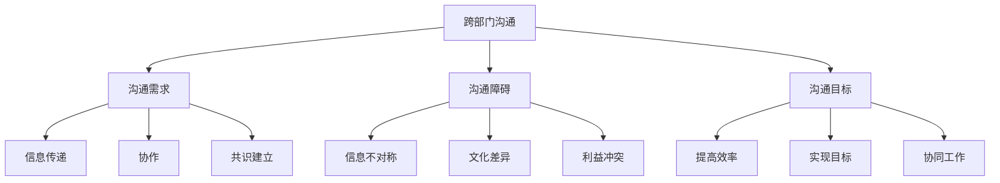
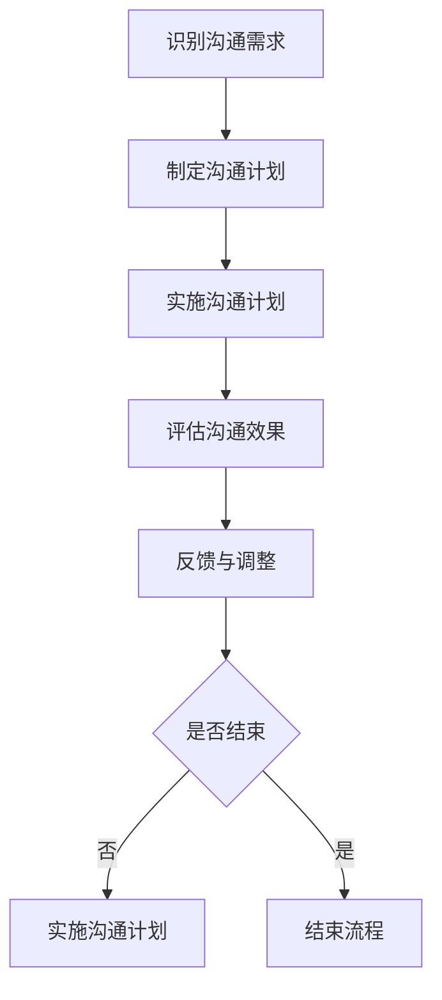
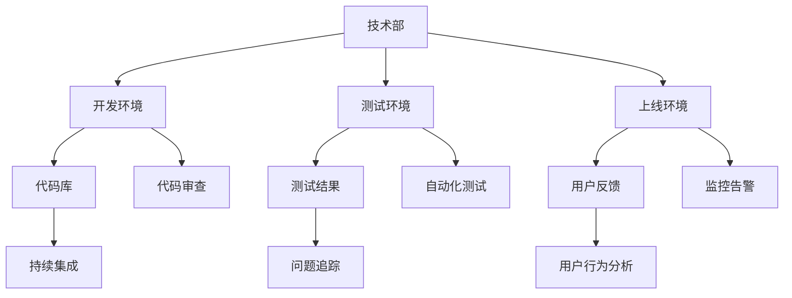
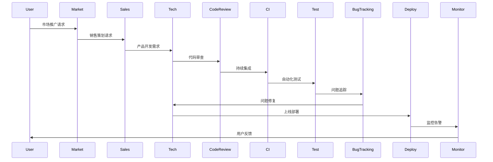

                 

### 背景介绍

#### 核心概念术语说明

**跨部门沟通**：在组织中，不同部门之间为了协调资源和解决问题所进行的沟通活动。它不仅涉及信息的传递，还包括共识的建立、资源的共享和协同工作的开展。

**沟通需求**：指在跨部门沟通中，各部门为了有效合作而产生的信息传递和协调的需求。这包括项目进展情况、任务分工、技术问题解决等方面。

**沟通障碍**：在跨部门沟通中，由于信息不对称、文化差异、利益冲突等因素导致的沟通困难。这些障碍可能表现为误解、延迟响应、决策分歧等。

**沟通目标**：跨部门沟通的最终目标是通过有效的沟通和协作，提高工作效率，实现组织目标。

#### 问题背景

在现代企业中，随着业务复杂度的增加，跨部门合作变得愈发重要。然而，跨部门沟通往往面临着一系列挑战：

1. **信息不对称**：不同部门可能拥有不同的信息来源，导致信息传递不准确或不及时。
2. **文化差异**：各部门可能拥有不同的工作习惯和文化，这可能导致沟通风格和方式的不一致。
3. **利益冲突**：各部门在资源分配、任务分工等方面可能存在利益冲突，导致沟通不畅。

#### 问题描述

跨部门沟通的问题主要体现在以下几个方面：

1. **沟通效率低下**：由于沟通需求不明确、沟通障碍多，跨部门之间的信息传递和处理变得缓慢。
2. **协作不力**：由于沟通不畅，各部门之间的协作无法有效进行，导致项目进度受阻。
3. **决策延迟**：在跨部门沟通中，由于沟通不畅，决策过程可能被拖延，影响项目进展。

#### 问题解决

为了解决跨部门沟通中的问题，可以采取以下措施：

1. **明确沟通需求**：在项目初期，明确各部门之间的沟通需求，制定详细的沟通计划。
2. **建立沟通机制**：制定一套明确的沟通流程和规则，确保信息传递的及时性和准确性。
3. **培养沟通文化**：通过培训和交流活动，提升员工沟通能力和意识，促进跨部门之间的理解与合作。
4. **利用技术工具**：借助现代化的沟通工具，如即时通讯软件、项目管理平台等，提高沟通效率和协作能力。

#### 边界与外延

**边界**：跨部门沟通的边界在于明确哪些信息需要跨部门共享，哪些问题需要跨部门解决。这有助于避免不必要的沟通负担。

**外延**：跨部门沟通的外延包括与外部合作伙伴的沟通。在某些情况下，跨部门沟通需要涉及到供应商、客户等外部利益相关者，以实现更广泛的协作。

#### 概念结构与核心要素组成

**概念结构**：

- **沟通需求**：明确各部门之间的信息传递和协作需求。
- **沟通障碍**：识别和解决信息不对称、文化差异和利益冲突等问题。
- **沟通目标**：确保信息传递的及时性、准确性和有效性，实现协同工作。

**核心要素组成**：

- **沟通计划**：制定详细的沟通计划和流程，确保沟通需求得到满足。
- **沟通工具**：利用现代化的沟通工具，提高沟通效率和协作能力。
- **沟通文化**：培养良好的沟通文化，提升员工的沟通能力和意识。

### 核心概念与联系

**核心概念**：

- **跨部门沟通**：信息传递、协作、共识建立。
- **沟通需求**：信息传递的必要性、协作的紧迫性。
- **沟通障碍**：信息不对称、文化差异、利益冲突。
- **沟通目标**：提高工作效率、实现组织目标。

**核心概念属性特征对比表格**：

| 核心概念 | 特征1 | 特征2 | 特征3 |
|----------|-------|-------|-------|
| 跨部门沟通 | 需要多个部门参与 | 信息传递、协作、共识建立 | 文化差异、利益冲突 |
| 沟通需求 | 必要性 | 紧迫性 | 多样性 |
| 沟通障碍 | 信息不对称 | 文化差异 | 利益冲突 |
| 沟通目标 | 提高效率 | 实现目标 | 协同工作 |

**ER实体关系图架构**：



### 算法原理讲解

#### 算法mermaid流程图



#### 算法原理

跨部门沟通的算法原理主要分为以下几个步骤：

1. **识别沟通需求**：通过调查和分析，明确各部门之间的沟通需求，包括信息的传递、问题的协调和资源的共享。
2. **制定沟通计划**：根据沟通需求，制定详细的沟通计划，包括沟通的频率、方式、参与人员等。
3. **实施沟通计划**：按照沟通计划进行沟通活动，确保沟通的及时性和准确性。
4. **评估沟通效果**：通过反馈和评估，了解沟通的实际效果，包括信息传递的效率、协作的效果等。
5. **反馈与调整**：根据评估结果，对沟通计划进行优化和调整，以提高沟通效果。

#### 数学模型和公式

假设跨部门沟通的效率可以用一个综合指标 \(E\) 来衡量，该指标由信息传递效率 \(I\)、协作效率 \(C\) 和共识建立效率 \(R\) 构成，即：

\[ E = I \times C \times R \]

其中：

- \( I \)：信息传递效率，可以用传递信息的准确性 \(A\) 和传递速度 \(S\) 来衡量，即 \( I = A \times S \)。
- \( C \)：协作效率，可以用协作的成功率 \(P\) 和协作的响应时间 \(T\) 来衡量，即 \( C = P \times T \)。
- \( R \)：共识建立效率，可以用共识的达成率 \(D\) 和共识的建立时间 \(M\) 来衡量，即 \( R = D \times M \)。

#### 详细讲解和举例说明

**举例说明**：

假设一个项目团队由技术部、市场和销售部组成。在项目初期，技术部需要向市场和销售部提供产品原型和技术细节，以便市场和销售部进行市场分析和销售策划。

1. **识别沟通需求**：
   - 技术部需要提供产品原型和技术细节。
   - 市场和销售部需要了解产品原型和技术细节，以便进行市场分析和销售策划。

2. **制定沟通计划**：
   - 每周进行一次技术会议，技术部向市场和销售部介绍产品原型和技术细节。
   - 每月进行一次市场和销售会议，市场和销售部向技术部反馈市场分析和销售策划的进展。

3. **实施沟通计划**：
   - 技术部按照沟通计划，每周向市场和销售部提供产品原型和技术细节。
   - 市场和销售部按照沟通计划，每月向技术部反馈市场分析和销售策划的进展。

4. **评估沟通效果**：
   - 通过市场和销售部的反馈，了解产品原型和技术细节的传递效果。
   - 通过技术部的反馈，了解市场分析和销售策划的响应速度和成功率。

5. **反馈与调整**：
   - 根据评估结果，对沟通计划进行调整，如增加沟通频率、改进沟通方式等，以提高沟通效果。

通过这个例子，我们可以看到跨部门沟通的算法原理是如何应用于实际项目中的。通过识别沟通需求、制定沟通计划、实施沟通计划、评估沟通效果和反馈与调整，技术部、市场和销售部能够实现有效的跨部门沟通，提高项目效率。

### 系统分析与架构设计方案

#### 问题场景介绍

假设某公司开发了一个新的电子商务平台，该平台需要技术部、市场和销售部等多个部门共同协作。技术部负责平台的开发和维护，市场和销售部负责市场推广和销售策划。为了确保项目的顺利进行，需要建立一套有效的跨部门沟通机制。

#### 项目介绍

**项目名称**：电子商务平台开发项目
**项目目标**：开发一个功能完善、用户体验良好的电子商务平台，提高销售额。
**项目团队**：技术部、市场部、销售部、客服部等。

#### 系统功能设计（领域模型mermaid类图）

```mermaid
classDiagram
    产品 <<Interface>>
    订单 <<Interface>>
    用户 <<Interface>>

    产品..> 技术部
    订单..> 销售部
    用户..> 市场部
```

#### 系统架构设计（mermaid架构图）



#### 系统接口设计和系统交互（mermaid序列图）



### 项目实战

#### 环境安装

1. 安装开发环境，如 Python、Node.js、Git等。
2. 配置代码库，如 GitHub、GitLab、Bitbucket等。
3. 安装测试环境，如 JMeter、Selenium等。
4. 安装上线环境，如 Docker、Kubernetes等。

#### 系统核心实现源代码

以下是一个简单的Python代码示例，用于实现用户注册功能：

```python
# 用户注册函数
def register_user(username, password):
    # 验证用户名和密码
    if not username or not password:
        return "用户名或密码不能为空"
    # 存储用户信息
    user_info = {"username": username, "password": password}
    # 保存用户信息到数据库
    save_user_to_db(user_info)
    return "注册成功"

# 测试用户注册函数
print(register_user("user1", "password1"))
```

#### 代码应用解读与分析

这段代码用于实现用户注册功能，主要步骤如下：

1. **参数验证**：检查用户名和密码是否为空。
2. **存储用户信息**：将用户名和密码存储在一个字典中。
3. **保存用户信息到数据库**：假设这里使用了一个名为 `save_user_to_db` 的函数，用于将用户信息保存到数据库。
4. **返回结果**：根据注册结果返回相应的消息。

通过这个示例，我们可以看到跨部门沟通在软件开发中的应用，如技术部需要根据市场和销售部的需求开发相应的功能，同时还需要与测试部、运维部等合作，确保功能的质量和稳定性。

### 实际案例分析和详细讲解剖析

#### 案例一：项目协调中的跨部门沟通

在一个大型项目开发中，技术部、市场部和销售部需要紧密合作。技术部负责平台开发，市场部负责市场推广，销售部负责销售策划。以下是一个实际案例的详细分析：

1. **问题背景**：项目初期，技术部已经完成了产品原型，需要市场部和销售部提供推广策略和销售计划。
2. **沟通需求**：市场部需要技术部提供产品原型和技术细节，以便进行市场分析和推广策划；销售部需要技术部提供产品原型和功能列表，以便制定销售策略。
3. **沟通障碍**：由于技术部和市场部、销售部的职责不同，可能导致信息传递不畅，如技术细节描述不清、市场策略不明确等。
4. **解决方案**：
   - **明确沟通需求**：在项目初期，召开跨部门沟通会议，明确各部门的沟通需求，制定详细的沟通计划。
   - **建立沟通机制**：设立专门的沟通渠道，如定期召开跨部门会议、使用即时通讯工具等。
   - **优化沟通方式**：采用可视化工具，如图表、流程图等，帮助各部门更直观地理解彼此的需求和问题。

#### 案例二：跨部门冲突的解决

在一个项目中，技术部和市场部因为资源分配和任务分工产生了冲突。技术部认为市场部提出的推广要求过于复杂，增加了开发难度和成本；市场部认为技术部未能及时响应市场变化，导致推广效果不佳。

1. **问题背景**：技术部和市场部在项目推进过程中产生了冲突，影响项目进度和质量。
2. **沟通需求**：技术部需要明确市场部的推广要求，以便调整开发计划；市场部需要理解技术部的开发难度，以便调整推广策略。
3. **沟通障碍**：双方对项目的期望和目标存在差异，可能导致沟通不畅和误解。
4. **解决方案**：
   - **加强沟通**：定期召开跨部门沟通会议，讨论项目进展、问题和需求，确保信息透明和及时。
   - **建立共识**：通过讨论和协商，找到双方都能接受的解决方案，如调整任务分工、资源分配等。
   - **第三方协调**：如果双方无法达成共识，可以邀请项目经理或高层领导进行调解。

#### 案例三：跨部门协作的创新实践

在一个创新项目中，技术部、市场部和销售部采取了以下创新实践，以提高跨部门协作效率：

1. **问题背景**：项目初期，各部门之间沟通不畅，项目进度缓慢，创新性难以发挥。
2. **沟通需求**：各部门需要更好地协作，实现资源的共享和创新的融合。
3. **沟通障碍**：传统沟通方式可能导致信息传递滞后、沟通效率低下。
4. **解决方案**：
   - **采用敏捷开发**：通过迭代和增量开发，提高项目进度和灵活性。
   - **建立跨部门团队**：将技术部、市场部和销售部的人员组成一个跨部门团队，共同推进项目。
   - **使用协作工具**：如 Trello、Slack 等，实时跟踪项目进展、任务分配和沟通情况。

通过以上实际案例的分析，我们可以看到跨部门沟通在项目协调、冲突解决和创新实践中的重要性。有效的跨部门沟通不仅能够提高项目效率，还能够促进各部门之间的合作和创新。

### 项目小结

#### 最佳实践 tips

1. **明确沟通需求**：在项目初期，明确各部门之间的沟通需求，制定详细的沟通计划。
2. **建立沟通机制**：设立专门的沟通渠道，如定期召开跨部门会议、使用即时通讯工具等。
3. **优化沟通方式**：采用可视化工具，如图表、流程图等，帮助各部门更直观地理解彼此的需求和问题。
4. **培养沟通文化**：通过培训和交流活动，提升员工的沟通能力和意识，促进跨部门之间的理解与合作。
5. **利用技术工具**：借助现代化的沟通工具，提高沟通效率和协作能力。

#### 注意事项

1. **避免信息不对称**：确保各部门之间信息传递的准确性和及时性。
2. **尊重文化差异**：理解各部门的工作习惯和文化，避免因文化差异导致的沟通障碍。
3. **处理利益冲突**：在资源分配和任务分工上，确保公平和合理，避免因利益冲突导致的沟通不畅。
4. **持续优化**：根据项目进展和反馈，不断优化沟通流程和工具，以提高沟通效果。

#### 拓展阅读

- 《跨部门沟通的艺术》[美]凯瑟琳·斯通
- 《项目沟通管理》[美]詹姆斯·S·坎特
- 《敏捷沟通：团队协作的艺术》[美]斯科特·贝克
- 《沟通的艺术》[美]阿尔伯特·梅拉比安

通过以上最佳实践、注意事项和拓展阅读，技术leader可以更好地进行跨部门沟通，提高项目效率和质量。

### 技术leader在跨部门沟通中的角色

#### 技术leader的角色定位

技术leader在跨部门沟通中扮演着至关重要的角色，既是技术领域的专家，也是团队协作的桥梁。他们不仅需要具备深厚的专业技术知识，还要具备出色的沟通能力和团队管理能力。

**核心职责**：

1. **技术决策**：技术leader需要根据项目需求，做出技术方面的决策，如技术架构的选择、技术方案的优化等。
2. **团队协作**：技术leader需要协调团队成员，确保项目进度和质量，促进跨部门之间的沟通与合作。
3. **资源管理**：技术leader需要合理分配技术资源，确保项目团队能够高效运作。
4. **风险控制**：技术leader需要识别项目中的技术风险，并采取相应措施进行控制和缓解。

#### 技术leader的沟通挑战

跨部门沟通中的主要挑战包括：

1. **信息不对称**：由于各部门的职责不同，可能导致信息传递的不完整或不准确。
2. **文化差异**：各部门可能有不同的工作习惯和文化背景，这可能导致沟通障碍。
3. **利益冲突**：在资源分配和任务分工上，各部门可能存在利益冲突，影响沟通效果。
4. **时间压力**：项目进度紧张时，跨部门沟通可能受到时间压力的影响，导致沟通效率低下。

#### 技术leader的沟通策略

为了克服上述挑战，技术leader可以采取以下沟通策略：

1. **建立沟通机制**：制定明确的沟通流程和规则，确保信息传递的及时性和准确性。
2. **培养团队意识**：通过培训和团队建设活动，提升团队协作意识和沟通能力。
3. **促进透明沟通**：鼓励开放和诚实的沟通，建立信任关系，减少信息不对称。
4. **利用技术工具**：借助现代化的沟通工具，提高沟通效率和协作能力。
5. **积极解决冲突**：在冲突发生时，及时介入并采取有效措施进行解决，避免影响项目进度。

### 技术leader如何提升跨部门沟通效果

#### 建立专业影响力

1. **技术权威**：通过不断学习和实践，提升自己在技术领域的专业能力和权威性，使部门成员对技术leader的意见和建议更加重视。
2. **技术分享**：定期组织技术分享会，分享最新的技术动态和最佳实践，提升团队的技术水平。
3. **技术创新**：推动技术创新，提出具有前瞻性的技术方案，提高项目的创新性和竞争力。

#### 提高团队协作意识

1. **团队建设**：通过团队活动、团队建设培训等方式，增强团队成员之间的信任和协作意识。
2. **角色明确**：明确团队中每个成员的角色和职责，确保每个人都能在自己的岗位上发挥最大的价值。
3. **目标一致**：确保团队目标的一致性，使团队成员都朝着共同的目标努力。

#### 优化沟通流程和工具

1. **流程优化**：简化沟通流程，减少不必要的环节，提高沟通效率。
2. **工具选择**：选择合适的沟通工具，如即时通讯软件、项目管理平台等，提高沟通的便捷性和效率。
3. **培训与指导**：对团队成员进行沟通技巧的培训，提高他们的沟通能力和意识。

### 技术leader跨部门沟通的最佳实践

#### 实践一：技术leader的沟通案例

在一个跨部门项目中，技术leader张先生成功解决了技术部与市场部之间的沟通障碍。以下是具体实践步骤：

1. **问题识别**：在项目初期，张先生发现技术部与市场部在需求沟通上存在明显的分歧。
2. **沟通需求分析**：通过会议和一对一交流，张先生详细了解了市场部的需求和技术部的顾虑。
3. **解决方案制定**：张先生制定了详细的沟通计划，包括定期召开需求讨论会、使用项目管理工具等。
4. **实施与跟进**：张先生监督沟通计划的执行，并定期评估沟通效果，及时进行调整。

通过这一实践，技术部与市场部之间的沟通障碍得到了有效缓解，项目进展顺利。

#### 实践二：跨部门沟通的优化方法

1. **建立跨部门沟通委员会**：设立一个跨部门沟通委员会，负责协调和监督各部门之间的沟通。
2. **定期跨部门会议**：定期召开跨部门会议，讨论项目进展、问题和需求，确保信息透明和及时。
3. **沟通工具的统一使用**：选择一个统一的沟通工具，如 Slack、Trello 等，确保各部门都能方便地使用。

#### 实践三：技术leader的沟通技巧分享

1. **倾听与反馈**：积极倾听各部门的意见和建议，给予及时的反馈，确保沟通的双向性。
2. **清晰表达**：在沟通过程中，用简洁明了的语言表达自己的观点，避免使用过于专业或模糊的术语。
3. **冲突管理**：在冲突发生时，保持冷静，采取合适的方式进行处理，避免冲突升级。

通过这些实践，技术leader可以显著提升跨部门沟通的效果，促进项目团队的高效协作。

### 技术leader跨部门沟通的未来趋势

#### 技术趋势对跨部门沟通的影响

随着技术的发展，跨部门沟通也将受到显著影响。以下是几个关键趋势：

1. **远程工作常态化**：随着远程工作的普及，技术leader需要掌握如何在远程环境中进行有效沟通。
2. **人工智能辅助沟通**：人工智能技术将提高跨部门沟通的效率，如自动化会议记录、智能问答系统等。
3. **敏捷沟通工具的发展**：敏捷开发工具的普及，如 Jira、Trello 等，将提高跨部门沟通的灵活性和响应速度。

#### 未来跨部门沟通的发展方向

1. **智能化**：利用人工智能和大数据技术，实现跨部门沟通的智能化，如自动化的沟通提醒、智能化的沟通分析等。
2. **个性化**：根据各部门和成员的沟通习惯和偏好，提供个性化的沟通服务。
3. **可视化**：通过可视化工具，如图表、数据可视化等，使跨部门沟通更加直观和易于理解。

#### 技术leader的持续学习和成长

1. **技术更新**：不断学习新技术，提升自己在技术领域的专业能力，以便更好地指导团队。
2. **沟通技能**：通过学习和实践，提高自己的沟通技能，包括倾听、表达、冲突管理等。
3. **领导力提升**：参加领导力培训，提升团队管理能力和领导力，以应对不断变化的跨部门沟通挑战。

### 总结

技术leader在跨部门沟通中发挥着关键作用。通过建立专业影响力、提高团队协作意识和优化沟通流程和工具，技术leader可以显著提升跨部门沟通的效果。未来，随着技术趋势的发展，跨部门沟通将变得更加智能化和个性化。技术leader需要持续学习和成长，以应对这些变化，确保项目团队的高效协作。作者：AI天才研究院/AI Genius Institute & 禅与计算机程序设计艺术 /Zen And The Art of Computer Programming。

