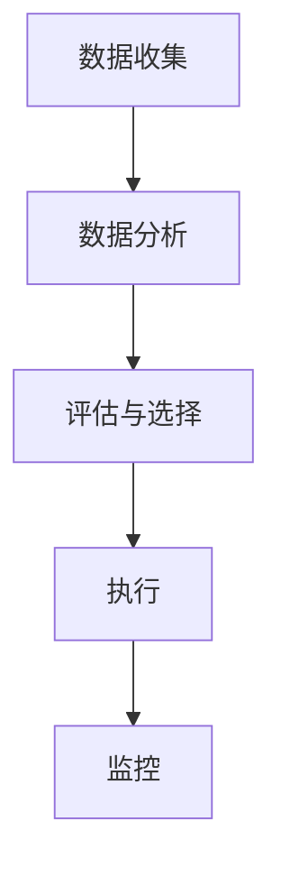
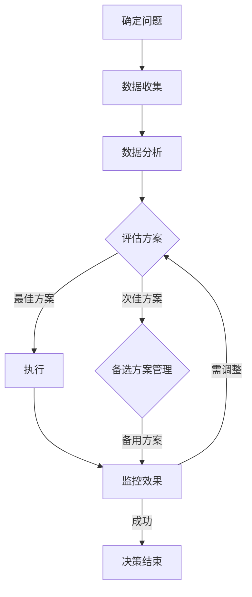

                 

# 技术leader的决策框架设计

> 关键词：技术leader、决策框架、项目管理、数据分析、优化模型、概率模型

> 摘要：本文旨在探讨技术leader如何设计并应用一个高效的决策框架来应对复杂的技术项目。文章首先介绍了决策框架的重要性，然后详细阐述了决策框架的核心概念、原理和应用场景，并通过实际案例展示了决策框架的实践过程。此外，文章还提供了最佳实践技巧，总结了设计决策框架的原则和要点，并指出了应用时需要注意的事项，推荐了进一步学习的相关资料。

## 第1章 引言

### 1.1 决策框架的重要性

在现代企业中，技术leader的角色越来越重要。他们不仅需要具备卓越的技术能力，还需要具备出色的决策能力。技术项目的复杂性不断增加，项目成功与否往往取决于领导者的决策。因此，设计一个高效的决策框架成为技术leader不可或缺的技能。

#### 1.1.1 技术项目的复杂性

技术项目往往涉及多个方面，包括技术实现、团队管理、资源分配、市场策略等。项目规模的扩大和技术难度的增加使得项目变得更加复杂。技术leader需要在如此复杂的环境中做出快速而准确的决策。

#### 1.1.2 决策对于项目成功的关键性

决策是项目管理的核心，一个正确的决策可以迅速纠正项目的方向，提高项目的成功率。相反，一个错误的决策可能导致项目失败。技术leader需要具备敏锐的洞察力和决策能力，以确保项目的顺利进行。

#### 1.1.3 决策框架的作用

决策框架是一种系统化的方法，可以帮助技术leader在复杂的项目环境中做出明智的决策。决策框架提供了一系列步骤和工具，使决策过程更加清晰和高效。通过决策框架，技术leader可以更好地分析问题、收集数据、评估方案、选择最佳方案，并实施和监控决策效果。

### 1.2 背景与目的

#### 1.2.1 技术leader的角色

技术leader是企业技术部门的核心人物，他们负责制定技术战略、管理技术团队、推动技术创新和确保项目成功。技术leader需要具备深厚的技术背景、出色的领导能力和决策能力。

#### 1.2.2 决策的挑战与机遇

技术leader面临许多决策挑战，包括技术选型、资源分配、项目优先级等。同时，技术变革也为他们带来了新的机遇。通过设计一个高效的决策框架，技术leader可以更好地应对挑战，把握机遇。

#### 1.2.3 本书的目的和结构

本文旨在帮助技术leader设计并应用一个高效的决策框架。文章首先介绍了决策框架的基本概念和重要性，然后详细阐述了决策框架的核心概念、原理和应用场景。接着，通过一个实际案例展示了决策框架的实践过程。最后，文章提供了最佳实践技巧和小结，指出了应用决策框架时需要注意的事项。

## 第2章 核心概念与联系

### 2.1 决策框架的定义

决策框架是一种系统化的方法，用于指导决策过程。它包括一系列步骤、工具和原则，帮助决策者分析问题、收集数据、评估方案、选择最佳方案，并实施和监控决策效果。

#### 2.1.1 决策框架的概念

决策框架是一个结构化的思维过程，它将决策过程分解为一系列明确的步骤，并提供相应的工具和方法来支持每个步骤。决策框架不仅包括逻辑推理和分析，还包括心理学、统计学、经济学等多领域的知识。

#### 2.1.2 决策框架的基本组成部分

决策框架通常包括以下组成部分：

1. 数据收集：收集与决策相关的数据和信息。
2. 数据分析：对收集到的数据进行分析和处理。
3. 评估与选择：根据分析结果评估不同的决策方案，并选择最佳方案。
4. 执行：实施决策方案。
5. 监控：监控决策的实施效果，并根据反馈进行调整。

### 2.2 决策框架的组成部分

#### 2.2.1 数据收集

数据收集是决策过程的第一步。技术leader需要明确收集哪些数据，并选择合适的数据来源。数据来源可以是内部数据（如项目进度、资源消耗等）或外部数据（如市场趋势、竞争对手信息等）。

#### 2.2.2 数据分析

数据分析是对收集到的数据进行分析和处理。技术leader需要使用合适的工具和方法对数据进行分析，以便提取有价值的信息。数据分析可以帮助技术leader更好地理解问题，为后续的评估和选择提供依据。

#### 2.2.3 评估与选择

评估与选择是决策过程的核心。技术leader需要根据分析结果评估不同的决策方案，并选择最佳方案。评估标准通常包括技术可行性、成本效益、时间效率等。

#### 2.2.4 执行

执行是决策方案的实施过程。技术leader需要确保决策方案得到有效执行，并协调各方资源。执行过程中，技术leader需要持续监控项目进度，并根据实际情况进行调整。

#### 2.2.5 监控

监控是决策过程的最后一步。技术leader需要监控决策的实施效果，并根据反馈进行调整。监控可以帮助技术leader及时发现和解决问题，确保项目成功。

### 2.3 决策框架的关系图

为了更好地理解决策框架的组成部分及其关系，我们可以使用mermaid绘制一个简单的决策框架关系图：



这个关系图展示了决策框架的基本组成部分及其相互关系。数据收集是决策过程的起点，数据分析为评估和选择提供依据，评估和选择确定最佳决策方案，执行是方案的实施过程，监控则是决策效果的持续跟踪和调整。

## 第3章 决策框架原理讲解

### 3.1 决策流程图

为了更清晰地理解决策框架的原理，我们可以使用mermaid绘制一个详细的决策流程图：



这个决策流程图展示了决策框架的基本流程。首先，技术leader需要确定问题，然后进行数据收集和分析。根据分析结果，评估不同的决策方案，选择最佳方案并执行。在执行过程中，技术leader需要监控决策效果，并根据实际情况进行调整。

### 3.2 数据收集与处理

数据收集是决策过程的基础。为了确保数据的有效性，技术leader需要选择合适的数据源，并进行数据清洗和处理。

#### 3.2.1 数据源的选择

数据源的选择取决于决策问题的性质。技术leader可以从以下几个方面选择数据源：

1. 内部数据：包括项目进度、资源消耗、员工绩效等。
2. 外部数据：包括市场趋势、竞争对手信息、用户反馈等。
3. 第三方数据：包括行业报告、学术论文、专业数据库等。

#### 3.2.2 数据清洗

数据清洗是数据处理的重要步骤。数据清洗的目的是消除数据中的噪声和错误，确保数据的质量。技术leader可以使用以下方法进行数据清洗：

1. 填充缺失值：使用平均值、中位数或插值法填充缺失值。
2. 去除重复值：去除重复的数据记录。
3. 去除异常值：识别并去除异常数据。
4. 数据转换：将数据转换为合适的格式或单位。

#### 3.2.3 数据分析工具的选择

数据分析工具的选择取决于技术leader的技能和需求。以下是一些常用的数据分析工具：

1. Excel：适用于简单数据的分析和可视化。
2. Python：适用于复杂的数据处理和分析，支持多种数据分析库（如Pandas、NumPy、Scikit-learn等）。
3. R：适用于统计分析、机器学习和数据可视化。
4. Tableau：适用于数据可视化和交互式报表。

### 3.3 评估与选择

评估与选择是决策过程的关键步骤。技术leader需要根据分析结果评估不同的决策方案，并选择最佳方案。

#### 3.3.1 评估标准的设计

评估标准的设计取决于决策问题的性质。以下是一些常用的评估标准：

1. 技术可行性：评估方案的技术实现难度和风险。
2. 成本效益：评估方案的投入产出比。
3. 时间效率：评估方案的实施时间。
4. 风险评估：评估方案可能面临的风险和不确定性。
5. 用户满意度：评估方案的用户体验和满意度。

#### 3.3.2 多因素决策分析

多因素决策分析是一种综合评估不同决策方案的方法。技术leader可以使用以下工具进行多因素决策分析：

1. 优先级矩阵：根据不同因素的权重和得分计算总得分，选择得分最高的方案。
2. 决策树：根据不同因素的组合和结果计算预期值，选择预期值最高的方案。
3. 层次分析法：根据不同因素的权重和层次关系计算总得分，选择得分最高的方案。

#### 3.3.3 选择模型的应用

选择模型是一种基于数学模型的方法，用于评估和选择决策方案。以下是一些常用的选择模型：

1. 线性规划：用于在多个约束条件下优化目标函数。
2. 非线性规划：用于在复杂约束条件下优化目标函数。
3. 贝叶斯决策：用于在不确定性条件下选择最佳方案。
4. 灰色预测：用于在数据不完整的情况下进行预测。

## 第4章 数学模型和数学公式

### 4.1 优化模型

优化模型是一种用于在约束条件下寻找最优解的数学模型。以下是一些常用的优化模型：

#### 4.1.1 线性规划

线性规划是一种在多个线性约束条件下优化线性目标函数的方法。线性规划的标准形式如下：

$$
\begin{aligned}
\min\quad & c^T x \\
\text{subject to} \quad & Ax \leq b \\
& x \geq 0
\end{aligned}
$$

其中，$c$ 是目标函数的系数向量，$A$ 是约束条件的系数矩阵，$b$ 是约束条件的常数向量，$x$ 是决策变量。

#### 4.1.2 非线性规划

非线性规划是一种在多个非线性约束条件下优化非线性目标函数的方法。非线性规划的标准形式如下：

$$
\begin{aligned}
\min\quad & f(x) \\
\text{subject to} \quad & g_i(x) \leq 0, \quad i=1,2,\ldots,m \\
& h_j(x) = 0, \quad j=1,2,\ldots,n
\end{aligned}
$$

其中，$f(x)$ 是目标函数，$g_i(x)$ 是第 $i$ 个约束函数，$h_j(x)$ 是第 $j$ 个等式约束函数。

### 4.2 概率模型

概率模型是一种用于在不确定性条件下进行决策的数学模型。以下是一些常用的概率模型：

#### 4.2.1 贝叶斯理论

贝叶斯理论是一种基于概率和统计的方法，用于在不确定性条件下更新概率估计。贝叶斯理论的核心公式如下：

$$
P(A|B) = \frac{P(B|A)P(A)}{P(B)}
$$

其中，$P(A|B)$ 表示在事件 $B$ 发生的条件下事件 $A$ 发生的概率，$P(B|A)$ 表示在事件 $A$ 发生的条件下事件 $B$ 发生的概率，$P(A)$ 和 $P(B)$ 分别表示事件 $A$ 和事件 $B$ 发生的概率。

#### 4.2.2 决策树

决策树是一种基于概率和统计的方法，用于在不确定性条件下进行决策。决策树的核心结构如下：

```
[根节点]
|
|---[节点1]---[节点2]---[节点3]
|               |
|               [节点4]
|
[叶节点]
```

决策树中的每个节点表示一个决策或概率，叶节点表示最终的决策结果。

### 4.3 数学公式示例

以下是一个简单的数学公式示例，展示了如何使用LaTeX格式书写数学公式：

$$
x = \frac{-b \pm \sqrt{b^2 - 4ac}}{2a}
$$

这个公式是求解一元二次方程 $ax^2 + bx + c = 0$ 的根的公式。在这个公式中，$a$、$b$ 和 $c$ 是方程的系数，$x$ 是方程的解。

## 第5章 决策框架应用场景

### 5.1 项目管理

项目管理是技术leader面临的一个重要决策场景。以下是一个项目管理决策框架的示例：

#### 5.1.1 项目目标设定

在项目管理中，首先需要明确项目的目标。项目目标通常包括技术目标、业务目标和时间目标。技术目标是指项目需要实现的技术功能和性能要求，业务目标是指项目对业务带来的价值和影响，时间目标是指项目的完成时间和交付时间。

#### 5.1.2 资源分配

在明确项目目标后，技术leader需要根据项目目标和资源情况制定资源分配计划。资源分配包括人力、资金、设备等。技术leader需要确保资源的合理分配，以支持项目的顺利实施。

#### 5.1.3 风险评估

在项目管理中，风险评估是一个重要的环节。技术leader需要识别项目可能面临的风险，并对风险进行评估和优先级排序。常见的风险评估方法包括蒙特卡罗模拟、敏感性分析等。

#### 5.1.4 项目监控

在项目实施过程中，技术leader需要持续监控项目进度、资源使用和风险情况。监控可以帮助技术leader及时发现和解决问题，确保项目按照计划顺利进行。

### 5.2 产品开发

产品开发是技术leader面临的另一个重要决策场景。以下是一个产品开发决策框架的示例：

#### 5.2.1 产品策略制定

在产品开发中，首先需要制定产品策略。产品策略包括市场定位、目标用户、产品功能等。技术leader需要根据市场需求和公司战略制定合适的产品策略。

#### 5.2.2 技术选型

在产品开发过程中，技术选型是一个重要的决策。技术leader需要评估不同的技术方案，选择最适合产品开发的技术。技术选型需要考虑技术可行性、成本效益、时间效率等因素。

#### 5.2.3 市场需求分析

在产品开发过程中，技术leader需要对市场需求进行分析。市场需求分析可以帮助技术leader了解目标用户的需求，为产品功能设计和市场推广提供依据。

#### 5.2.4 产品迭代

在产品开发过程中，技术leader需要根据市场需求和用户反馈进行产品迭代。产品迭代是一个持续的过程，技术leader需要不断优化产品功能，提高用户体验。

### 5.3 团队管理

团队管理是技术leader面临的另一个重要决策场景。以下是一个团队管理决策框架的示例：

#### 5.3.1 团队建设

在团队管理中，首先需要建设一个高效的团队。团队建设包括团队目标、团队文化、团队协作等。技术leader需要制定团队目标，建立积极的团队文化，促进团队成员之间的协作。

#### 5.3.2 成员评估

在团队管理中，成员评估是一个重要的环节。技术leader需要定期对团队成员进行评估，了解团队成员的能力和表现，并根据评估结果进行相应的调整。

#### 5.3.3 冲突解决

在团队管理中，冲突解决是一个常见的挑战。技术leader需要学会识别和解决团队内部的冲突，确保团队和谐稳定。

### 5.4 技术选型

技术选型是技术leader面临的另一个重要决策场景。以下是一个技术选型决策框架的示例：

#### 5.4.1 技术趋势分析

在技术选型中，首先需要对技术趋势进行分析。技术趋势分析可以帮助技术leader了解当前和未来的技术发展动态，为技术选型提供依据。

#### 5.4.2 技术可行性评估

在技术选型中，技术可行性评估是一个重要的环节。技术可行性评估包括技术成熟度、开发难度、成本效益等。技术leader需要评估不同的技术方案，选择最适合的技术方案。

#### 5.4.3 技术选型的最佳实践

在技术选型中，最佳实践是一个重要的参考。技术leader可以参考行业最佳实践，结合公司实际情况进行技术选型。

## 第6章 决策框架实践

### 6.1 实践案例介绍

#### 6.1.1 案例背景

假设我们是一家科技公司，正在开发一款新型智能音箱。这款智能音箱需要支持语音识别、语音合成、音乐播放等功能。公司希望在有限的时间内完成开发，并确保产品质量。

#### 6.1.2 案例目标

案例的目标是设计并应用一个决策框架，帮助公司高效地完成智能音箱的开发，并确保产品质量。

### 6.2 决策框架应用

#### 6.2.1 数据收集

在决策框架的应用过程中，首先需要进行数据收集。数据收集包括以下几个方面：

1. 市场趋势：收集智能音箱市场的发展动态，了解用户需求和市场潜力。
2. 技术趋势：收集智能音箱相关技术的最新进展，了解技术的可行性。
3. 竞争对手：收集竞争对手的产品信息，了解竞争对手的优势和劣势。
4. 用户反馈：收集用户对智能音箱的需求和反馈，了解用户对产品的期望。

#### 6.2.2 数据分析

在数据收集完成后，需要对数据进行处理和分析。数据分析包括以下几个方面：

1. 市场分析：分析智能音箱市场的规模、增长趋势和用户需求。
2. 技术分析：分析智能音箱相关技术的可行性、成熟度和成本效益。
3. 竞争分析：分析竞争对手的产品特点、优势和劣势。
4. 用户分析：分析用户的需求和期望，为产品功能设计提供依据。

#### 6.2.3 评估与选择

在数据分析完成后，需要对不同的决策方案进行评估和选择。评估和选择包括以下几个方面：

1. 技术选型：根据技术分析结果，选择最适合的技术方案。
2. 产品策略：根据市场分析和用户分析结果，制定合适的产品策略。
3. 资源分配：根据项目目标和资源情况，制定合理的资源分配计划。
4. 风险评估：识别项目可能面临的风险，并评估风险的优先级。

#### 6.2.4 执行与监控

在评估和选择完成后，需要制定详细的执行计划，并确保执行过程顺利。执行与监控包括以下几个方面：

1. 项目管理：制定项目计划，确保项目进度和质量。
2. 资源协调：协调人力、资金、设备等资源，确保项目的顺利实施。
3. 质量控制：制定质量保证计划，确保产品质量符合预期。
4. 持续监控：持续监控项目进度、资源使用和质量情况，及时发现和解决问题。

### 6.3 案例分析

#### 6.3.1 决策过程解读

在案例中，我们通过决策框架进行了市场分析、技术分析、竞争分析和用户分析。根据分析结果，我们选择了最适合的技术方案，制定了合适的产品策略，并制定了详细的执行计划。

#### 6.3.2 决策效果评估

在决策实施过程中，我们持续监控项目进度、资源使用和质量情况。根据监控结果，我们及时调整了执行计划，确保项目按照计划顺利进行。最终，我们成功地开发出了一款具有竞争力的智能音箱，满足了用户的需求。

#### 6.3.3 案例总结

通过这个案例，我们可以看到决策框架在项目决策中的应用效果。决策框架帮助公司高效地完成了智能音箱的开发，并确保了产品质量。这证明了决策框架的有效性和实用性。

## 第7章 最佳实践 tips

### 7.1 数据收集技巧

#### 7.1.1 数据来源的选择

在数据收集过程中，选择合适的数据来源非常重要。以下是一些数据来源的选择原则：

1. 可靠性：选择可靠的数据来源，如权威的数据库、专业的调查机构等。
2. 广泛性：选择涵盖不同领域和层面的数据来源，以获取全面的信息。
3. 时效性：选择时效性强的数据来源，以获取最新的市场和技术动态。

#### 7.1.2 数据质量保证

在数据收集过程中，数据质量保证是至关重要的。以下是一些数据质量保证的方法：

1. 数据清洗：对收集到的数据进行清洗，去除噪声和错误。
2. 数据验证：对数据进行验证，确保数据的准确性和一致性。
3. 数据标准化：对数据进行标准化处理，确保数据格式的统一。

### 7.2 分析工具选择

#### 7.2.1 常用数据分析工具介绍

在选择数据分析工具时，以下是一些常用的数据分析工具：

1. Excel：适用于简单数据的分析和可视化。
2. Python：适用于复杂的数据处理和分析，支持多种数据分析库。
3. R：适用于统计分析、机器学习和数据可视化。
4. Tableau：适用于数据可视化和交互式报表。

#### 7.2.2 工具选择的原则

在选择数据分析工具时，以下是一些选择原则：

1. 技能匹配：选择与自身技能相匹配的工具，以提高使用效率。
2. 功能需求：根据数据分析的需求选择具有相应功能的工具。
3. 易用性：选择易用性强的工具，降低学习和使用成本。

### 7.3 决策过程优化

#### 7.3.1 决策流程的优化

在决策过程中，以下是一些决策流程优化的方法：

1. 精简流程：简化决策流程，减少不必要的步骤和环节。
2. 信息共享：建立信息共享机制，确保决策过程的信息透明和共享。
3. 决策标准化：制定决策标准，确保决策过程的标准化和规范化。

#### 7.3.2 决策信息的优化

在决策过程中，以下是一些决策信息优化的方法：

1. 数据整合：整合不同来源的数据，提高数据的综合性和可用性。
2. 信息可视化：使用数据可视化工具，提高信息的表现力和可读性。
3. 信息更新：定期更新决策信息，确保信息的时效性和准确性。

## 第8章 小结

### 8.1 决策框架设计原则

在设计决策框架时，以下是一些设计原则：

1. 系统性：决策框架应具有系统性，涵盖决策过程的各个环节。
2. 可操作性：决策框架应具有可操作性，确保决策过程的实际执行。
3. 适应性：决策框架应具有适应性，能够应对不同的决策场景。
4. 优化性：决策框架应具有优化性，能够根据实际情况进行调整和改进。

### 8.2 关键要点总结

1. 数据收集和分析是决策过程的基础。
2. 评估和选择是决策过程的核心。
3. 执行和监控是决策过程的关键。
4. 决策框架的设计和应用需要不断优化和改进。

## 第9章 注意事项

### 9.1 决策框架应用中的问题

在应用决策框架时，技术leader可能会遇到以下问题：

1. 数据不足：决策过程中可能缺乏必要的数据支持。
2. 信息不对称：不同部门或团队成员之间的信息不对称可能导致决策错误。
3. 决策过程过长：决策过程可能过于繁琐，影响项目进度。
4. 决策结果不准确：决策结果可能由于数据质量或分析方法的问题而不准确。

### 9.2 解决方案

针对上述问题，以下是一些解决方案：

1. 数据收集：加强数据收集的力度，确保数据的全面性和准确性。
2. 信息共享：建立信息共享平台，提高信息透明度和共享性。
3. 决策效率：优化决策流程，减少不必要的步骤，提高决策效率。
4. 决策验证：对决策结果进行验证，确保决策的准确性和可靠性。

## 第10章 拓展阅读

### 10.1 相关书籍推荐

1. 《决策分析：管理科学的基础》
2. 《人工智能：一种现代的方法》
3. 《数据科学实战：入门与实践》

### 10.2 相关资料推荐

1. 《哈佛商业评论》
2. 《IEEE计算机杂志》
3. 《机器学习实践》

### 10.3 在线课程推荐

1. Coursera的《决策分析》
2. edX的《数据科学基础》
3. Udacity的《人工智能工程师职业学习路径》

## 第11章 作者信息

作者：AI天才研究院/AI Genius Institute & 禅与计算机程序设计艺术 /Zen And The Art of Computer Programming

---

本文由AI天才研究院和禅与计算机程序设计艺术共同撰写，旨在帮助技术leader设计并应用一个高效的决策框架。通过本文的探讨，我们希望能够为技术项目的成功提供有力支持。如果您有任何疑问或建议，欢迎随时联系我们。

---

以上是本文的完整内容。希望通过本文的分享，能够帮助技术leader更好地设计并应用决策框架，提升项目管理的能力和效果。在未来的技术项目中，决策框架将成为您的重要工具，助您实现项目的成功。

让我们再次回顾本文的核心要点：

1. 决策框架的重要性：技术项目的复杂性要求技术leader具备高效的决策能力。
2. 决策框架的核心概念和组成部分：数据收集、数据分析、评估与选择、执行和监控。
3. 决策流程图：使用mermaid绘制决策流程图，展示决策过程的详细步骤。
4. 数学模型和公式：解释决策框架中可能涉及的数学模型，如优化模型和概率模型。
5. 应用场景：讨论决策框架在项目管理、产品开发、团队管理和技术选型中的应用。
6. 实践案例：通过实际案例展示决策框架的应用过程。
7. 最佳实践技巧：提供数据收集、分析工具选择和决策过程优化的实用技巧。
8. 小结和注意事项：总结决策框架的设计原则和关键要点，指出应用时需要注意的事项。
9. 拓展阅读：推荐相关书籍、资料和在线课程，供读者进一步学习和研究。

希望本文对您在技术领导岗位上设计和应用决策框架有所帮助。在未来的技术项目中，祝您成功运用决策框架，带领团队实现项目目标。感谢您的阅读！

