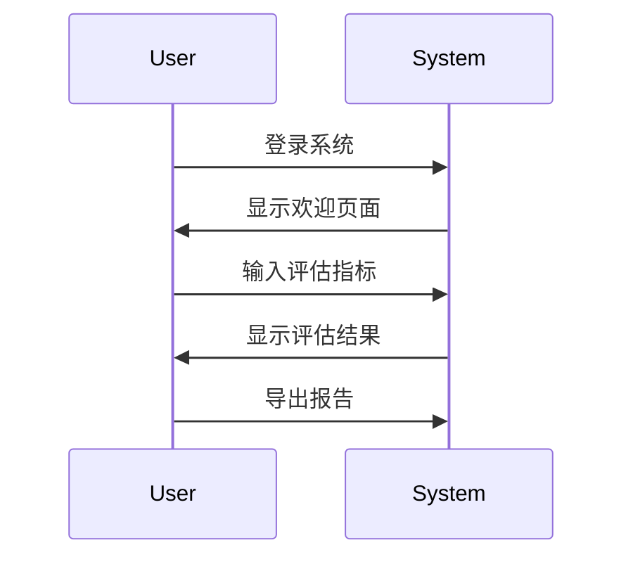
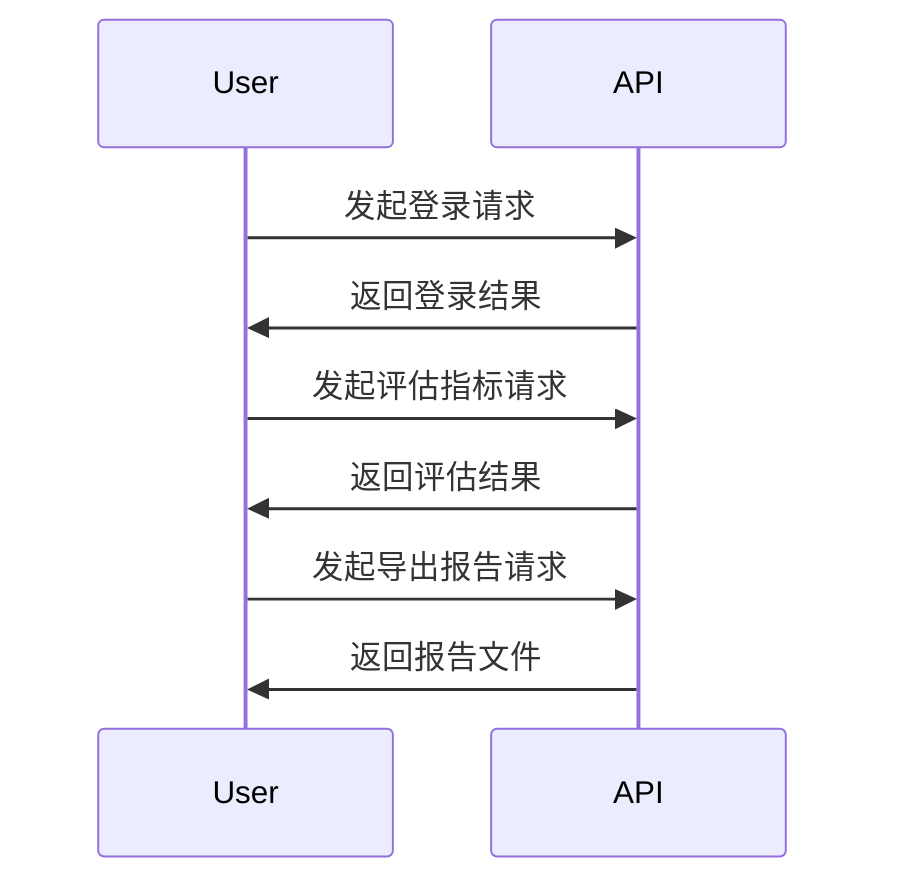

                 

# 技术leader的影响力矩阵

## 关键词
- 技术leader
- 影响力
- 领导力
- 矩阵模型
- 团队协作
- 技术创新

## 摘要
本文将深入探讨技术leader的影响力矩阵，一个用于分析、评估和提升技术团队领导力的工具。我们将从定义影响力矩阵的概念开始，逐步分析其核心原理和构成，再到应用策略和实践案例。最后，我们将总结全文，提供读者一些最佳实践和建议。

## 目录大纲设计思路

为了设计一个清晰且内容丰富的目录大纲，我们需要从以下几个方面来考虑：

### 书籍主题明确
书名《技术leader的影响力矩阵》暗示了书籍的核心主题是关于技术leader如何通过影响力来提升团队和组织效能。

### 内容结构逻辑性
确保目录大纲的逻辑性，从基础概念到实践应用，再到策略和方法，层次分明，条理清晰。

### 章节内容细化
每个章节不仅要包含核心概念和原理，还需要结合具体案例和实战经验，确保内容的实用性和可操作性。

### 互动与启发
设计一些互动环节，如问答、案例分析等，以激发读者的思考和讨论。

## 目录大纲结构设计

我们可以将目录大纲分为以下几个主要部分：

### 引言
介绍书籍的主题、目的和读者对象。

### 技术leader的影响力基础
介绍影响力的定义、分类，以及技术leader应具备的核心素质。

### 影响力矩阵概述
讲解影响力矩阵的概念、构成和作用。

### 影响力矩阵的应用策略
提供具体的策略和方法，帮助读者提升影响力。

### 影响力矩阵实践案例分析
通过实际案例展示影响力矩阵的应用效果。

### 影响力矩阵的实战技巧
分享实战中积累的经验和技巧。

### 总结与展望
总结全书要点，展望未来发展趋势。

## 目录大纲

```markdown
# 《技术leader的影响力矩阵》目录大纲

## 第1章 引言
### 1.1 书籍主题与目的
### 1.2 读者对象与预期收获

## 第2章 技术leader的影响力基础
### 2.1 影响力的定义与分类
### 2.2 技术leader的核心素质
### 2.3 影响力的作用机制

## 第3章 影响力矩阵概述
### 3.1 影响力矩阵的概念
### 3.2 影响力矩阵的构成
### 3.3 影响力矩阵的作用

## 第4章 影响力矩阵的应用策略
### 4.1 建立影响力矩阵的步骤
### 4.2 应用影响力矩阵的工具和方法
### 4.3 不同场景下的应用策略

## 第5章 影响力矩阵实践案例分析
### 5.1 案例一：提升团队凝聚力
### 5.2 案例二：增强跨部门协作
### 5.3 案例三：推动技术变革

## 第6章 影响力矩阵的实战技巧
### 6.1 提升个人影响力的技巧
### 6.2 激发团队创造力的技巧
### 6.3 应对挑战与风险的技巧

## 第7章 总结与展望
### 7.1 全书要点回顾
### 7.2 未来发展趋势
### 7.3 读者实践指南
```

### 内容细化

在具体细化每个章节的内容时，我们需要确保：

- **第1章 引言**：简要介绍书籍的主题、目的和读者对象，激发读者的兴趣。

- **第2章 技术leader的影响力基础**：介绍影响力的定义、分类，以及技术leader应具备的核心素质。

- **第3章 影响力矩阵概述**：详细讲解影响力矩阵的概念、构成和作用。

- **第4章 影响力矩阵的应用策略**：提供建立影响力矩阵的步骤、应用工具和方法，以及在不同场景下的具体策略。

- **第5章 影响力矩阵实践案例分析**：通过实际案例展示影响力矩阵的应用效果，帮助读者理解和应用。

- **第6章 影响力矩阵的实战技巧**：分享提升个人影响力、激发团队创造力、应对挑战与风险的实战技巧。

- **第7章 总结与展望**：回顾全书要点，展望未来发展趋势，并提供读者实践指南。

### 目录大纲完整性

确保所有章节内容完整，每个章节都需要包含核心概念、原理讲解、实战案例、技巧分享等，以满足书籍的实用性需求。

### 目录大纲字数控制

根据字数限制，确保目录大纲的总字数控制在2000字以内，每个章节的内容要简洁明了，突出重点。

通过上述步骤，我们可以设计出一个逻辑清晰、内容丰富、实用性强的目录大纲，为后续的书籍编写奠定良好的基础。接下来，我们可以进一步细化每个章节的内容，确保其完整性和实用性。现在，让我们开始构建每一章节的具体内容。## 第1章 引言

### 1.1 书籍主题与目的

在当今快速变化的技术时代，技术leader的作用显得尤为重要。他们不仅是技术领域的专家，更是团队和组织发展的关键推动者。然而，如何有效地提升技术leader的影响力，成为许多企业和组织的关注焦点。《技术leader的影响力矩阵》这本书旨在为技术leader提供一个系统化的工具和方法，帮助他们更好地理解和管理影响力，从而提升团队和组织的整体效能。

本书的主题是影响力矩阵在技术leader中的应用，通过分析、评估和提升技术leader的影响力，帮助他们在快速变化的技术环境中保持领先地位。本书的目的在于：

1. **定义影响力矩阵**：介绍影响力矩阵的概念、构成和应用场景。
2. **解析影响力原理**：深入探讨影响力的核心原理，帮助技术leader理解其本质。
3. **提供实用策略**：分享建立影响力矩阵的步骤、工具和方法，以及在不同场景下的应用策略。
4. **展示实战案例**：通过实际案例展示影响力矩阵的应用效果，帮助读者理解和借鉴。
5. **提升实战技巧**：提供提升个人影响力、激发团队创造力和应对挑战的实战技巧。
6. **展望未来趋势**：总结全文要点，探讨未来发展趋势，为技术leader提供指导。

### 1.2 读者对象与预期收获

本书主要面向以下读者群体：

1. **技术leader**：技术团队的领导者，希望在提升领导力和影响力方面获得指导和启发。
2. **技术管理人员**：企业中负责技术部门管理的人员，希望了解如何通过影响力来提升团队效能。
3. **技术专家**：具有深厚技术背景的专业人士，希望提升自己的领导力和影响力。
4. **企业高层管理者**：企业高层管理者，希望了解技术leader的影响力及其在组织发展中的作用。

读者在阅读本书后，可以预期获得以下收获：

1. **深入了解影响力矩阵**：理解影响力矩阵的概念、构成和应用方法。
2. **提升领导力和影响力**：通过书中的策略和技巧，提升个人领导力和团队影响力。
3. **改善团队协作**：掌握提升团队协作和沟通技巧，增强团队凝聚力。
4. **推动技术创新**：通过影响力矩阵的应用，推动技术变革和创新。
5. **实际操作指导**：通过实战案例和技巧分享，获得实际操作指导，提升实践能力。

通过这些收获，读者不仅能够提升自己的领导力和影响力，还能够为团队和组织的发展做出积极贡献。

### 1.3 基本概念与术语说明

在讨论技术leader的影响力矩阵之前，我们需要明确一些核心概念和术语：

- **技术leader**：技术团队的领导者，负责团队的技术规划和执行。
- **影响力**：一个人或组织对他人或组织产生作用和影响的能力。
- **影响力矩阵**：一种用于分析、评估和提升影响力的工具，由多个维度和指标构成。
- **团队效能**：团队在实现目标过程中所表现出来的综合能力和效果。

### 问题背景

在现代企业的技术部门中，技术leader的作用越来越重要。他们不仅要具备深厚的技术知识，还需要具备出色的领导力和影响力，以推动团队的技术创新和项目成功。然而，许多技术leader在提升影响力的过程中面临以下挑战：

1. **如何有效地传达技术愿景**：技术leader需要清晰地传达技术愿景，以激发团队成员的创造力和执行力。
2. **如何提升团队协作**：技术leader需要构建一个高效的团队，提升团队协作和沟通能力。
3. **如何应对变化和挑战**：技术leader需要具备适应变化和应对挑战的能力，以保持团队和组织的活力。
4. **如何持续提升自身影响力**：技术leader需要不断学习和成长，以保持自身在技术领域的领先地位。

这些问题反映了技术leader在提升影响力过程中所面临的复杂性和挑战。为了解决这些问题，影响力矩阵提供了一个系统化的工具和方法，帮助技术leader更好地理解和管理影响力。

### 问题定义

技术leader在提升影响力的过程中面临以下问题：

1. **缺乏有效的沟通**：技术leader可能无法清晰地传达技术愿景和目标，导致团队成员缺乏方向感和动力。
2. **团队协作不足**：团队成员之间可能存在沟通不畅、分工不明等问题，影响团队的协作效率。
3. **缺乏影响力管理工具**：技术leader可能缺乏有效的工具和方法来评估和管理自身的影响力。
4. **无法应对变化**：技术leader可能无法适应快速变化的技术环境，导致团队在项目执行过程中出现困难。

### 问题解决

为了解决上述问题，技术leader可以采用以下方法：

1. **建立影响力矩阵**：通过建立影响力矩阵，技术leader可以系统地评估和管理自身的影响力，明确提升影响力的方向。
2. **提升沟通能力**：技术leader可以通过学习沟通技巧，提高自身与团队成员之间的沟通效率。
3. **优化团队协作**：技术leader可以引入协作工具和机制，改善团队协作和沟通，提高团队效能。
4. **持续学习和成长**：技术leader可以通过不断学习和参与技术交流活动，提升自身的技术水平和影响力。

通过这些方法，技术leader可以更好地提升自身的影响力，推动团队和组织的发展。

### 边界与外延

影响力矩阵的应用范围广泛，不仅适用于技术leader，还可以应用于其他领域的领导者。此外，影响力矩阵不仅适用于提升个人影响力，还可以用于团队和组织的影响力管理。在具体应用中，技术leader需要根据自身情况和环境特点，灵活调整和优化影响力矩阵的构成和策略。

### 概念结构与核心要素组成

影响力矩阵由以下核心要素组成：

1. **影响力维度**：包括技术能力、沟通能力、领导力、影响力管理等。
2. **影响力指标**：包括技术成就、团队协作度、项目成功率等。
3. **评估方法**：包括自评、他评、360度评估等。
4. **提升策略**：包括技能培训、角色定位、影响力管理工具等。

通过这些核心要素，技术leader可以全面地评估和管理自身的影响力，提升团队和组织的整体效能。

## 第2章 技术leader的影响力基础

### 2.1 影响力的定义与分类

影响力是指一个人或组织对他人或组织产生作用和影响的能力。在技术leader的角色中，影响力尤为重要，因为技术leader不仅需要掌握技术知识，还需要具备领导和管理团队的能力。根据影响对象和方式的不同，影响力可以分为以下几种类型：

1. **技术影响力**：通过技术专长和成就影响他人，这种影响力通常建立在技术能力和成果的基础上。
2. **情感影响力**：通过建立良好的关系和情感联系来影响他人，这种影响力通常与个人的亲和力和沟通能力有关。
3. **权威影响力**：通过职位和权力来影响他人，这种影响力通常依赖于组织的层级结构和职责。
4. **激励影响力**：通过激励和鼓励来影响他人，这种影响力通常与领导者的激励能力和激励策略有关。
5. **网络影响力**：通过构建广泛的人际网络来影响他人，这种影响力通常与个人的人际关系和社会资本有关。

### 2.2 技术leader的核心素质

技术leader需要具备一系列核心素质，这些素质不仅包括技术能力，还包括领导力和影响力。以下是技术leader应具备的核心素质：

1. **技术能力**：技术leader需要具备深厚的专业技术和解决问题的能力，这包括对技术趋势的敏感度、对技术原理的深刻理解以及技术实施和推广的能力。
2. **沟通能力**：技术leader需要具备出色的沟通技巧，包括清晰表达、有效倾听和团队协作。良好的沟通能力有助于技术leader传达技术愿景，建立信任和团队凝聚力。
3. **领导力**：技术leader需要具备领导能力，包括决策能力、战略规划、团队管理和冲突解决。领导力是技术leader推动团队和项目成功的关键因素。
4. **影响力**：技术leader需要具备影响力，通过技术专长、情感联系、权威和激励等方式影响团队成员和利益相关者。
5. **持续学习**：技术leader需要具备持续学习的能力，不断更新知识和技能，以适应快速变化的技术环境。
6. **创新思维**：技术leader需要具备创新思维，推动技术变革和团队创新，以保持组织在技术领域的竞争力。
7. **情绪智力**：技术leader需要具备情绪智力，包括自我意识、自我调节、同理心和社交技能。情绪智力有助于技术leader在压力和挑战面前保持冷静和有效应对。

### 2.3 影响力的作用机制

影响力在技术leader的角色中发挥着关键作用，其作用机制可以从以下几个方面来理解：

1. **愿景传递**：技术leader通过影响力传递技术愿景和目标，激发团队成员的创造力和执行力。愿景传递是团队凝聚力和目标一致性的基础。
2. **团队协作**：技术leader通过影响力建立团队协作和沟通机制，提高团队效率和项目成功率。良好的团队协作有助于技术项目的顺利推进。
3. **激励与鼓励**：技术leader通过影响力激励团队成员，提高工作动力和积极性。激励和鼓励是推动团队发展和个人成长的关键因素。
4. **决策与领导**：技术leader通过影响力在团队中做出决策和领导，确保项目方向和策略的正确性。领导力是技术leader推动团队和组织发展的重要手段。
5. **变革推动**：技术leader通过影响力推动技术变革和创新，保持组织在技术领域的领先地位。影响力有助于技术leader引领团队适应技术趋势和变化。
6. **组织发展**：技术leader通过影响力影响组织文化和管理体系，促进组织发展和变革。影响力是技术leader推动组织长期成功的关键。

通过理解影响力的作用机制，技术leader可以更有效地利用影响力来提升团队和组织效能。

## 第3章 影响力矩阵概述

### 3.1 影响力矩阵的概念

影响力矩阵是一种用于分析、评估和提升影响力的工具，它通过多维度的指标和框架来描述和衡量个体或团队的影响力。在技术leader的背景下，影响力矩阵可以帮助领导者系统地评估和管理自身的影响力，从而更好地推动团队和组织的发展。

### 3.2 影响力矩阵的构成

影响力矩阵通常由以下核心组成部分构成：

1. **影响力维度**：影响力矩阵的维度反映了影响力的不同方面，例如技术影响力、情感影响力、权威影响力等。这些维度可以帮助技术leader全面评估自身的影响力。
2. **影响力指标**：影响力指标是衡量影响力的具体指标，例如技术成就、团队协作度、项目成功率等。这些指标为技术leader提供了一个量化的评价标准。
3. **评估方法**：评估方法是用于收集和整合数据的方法，例如自评、他评、360度评估等。这些方法可以帮助技术leader获得全面的反馈，从而更准确地评估自身的影响力。
4. **提升策略**：提升策略是用于改进和提升影响力的方法和措施，例如技能培训、角色定位、影响力管理工具等。这些策略为技术leader提供了具体的行动指南。

### 3.3 影响力矩阵的作用

影响力矩阵在技术leader的角色中具有多重作用：

1. **自我评估**：影响力矩阵可以帮助技术leader进行自我评估，了解自身在各个维度上的影响力水平和存在的问题。
2. **目标设定**：通过影响力矩阵，技术leader可以设定具体的目标和提升计划，明确提升影响力的方向和重点。
3. **团队协作**：影响力矩阵可以用于评估团队成员的影响力，帮助技术leader构建一个高效的团队，提升整体协作和沟通能力。
4. **战略规划**：影响力矩阵可以作为战略规划的一部分，帮助技术leader制定和调整团队和组织的战略方向。
5. **持续改进**：通过定期使用影响力矩阵，技术leader可以监控和评估自身的影响力提升情况，持续改进和优化领导行为。

### 3.4 影响力矩阵的应用场景

影响力矩阵可以应用于多个场景，以下是一些常见应用场景：

1. **个人发展**：技术leader可以使用影响力矩阵进行自我评估和提升，制定个人发展计划。
2. **团队建设**：技术leader可以使用影响力矩阵评估团队成员的影响力，优化团队结构和角色分配。
3. **项目管理**：技术leader可以在项目启动和评估过程中使用影响力矩阵，确保项目方向的正确性和团队的执行力。
4. **组织变革**：影响力矩阵可以帮助技术leader在组织变革过程中评估和提升自身的影响力，推动变革的顺利进行。

### 3.5 影响力矩阵的优势与局限

影响力矩阵的优势包括：

- **系统性**：影响力矩阵提供了一个系统化的框架，帮助技术leader全面评估和管理影响力。
- **量化评估**：通过影响力指标和评估方法，影响力矩阵提供了量化的评估标准，使评估更加客观和精确。
- **持续改进**：影响力矩阵支持持续改进，技术leader可以通过定期评估和反馈，不断优化领导行为和影响力。

然而，影响力矩阵也存在一些局限：

- **主观性**：尽管影响力矩阵提供了量化的评估标准，但评估过程中仍然存在一定程度的主观性。
- **适用性**：影响力矩阵的适用性可能因组织文化和团队特点而异，需要根据实际情况进行调整和优化。
- **实施难度**：影响力矩阵的实施需要一定的资源和时间投入，技术leader需要确保实施过程的顺利进行。

通过理解影响力矩阵的概念、构成和应用场景，技术leader可以更好地利用这一工具来提升自身的影响力，推动团队和组织的发展。

## 第4章 影响力矩阵的应用策略

### 4.1 建立影响力矩阵的步骤

要有效地建立影响力矩阵，技术leader可以遵循以下步骤：

1. **明确目标**：首先，技术leader需要明确建立影响力矩阵的目标，例如提升个人影响力、优化团队协作或推动项目成功等。明确的目标有助于确定矩阵的具体内容和应用方向。
2. **确定维度**：根据技术leader的角色和团队需求，确定影响力矩阵的维度。常见的维度包括技术能力、沟通能力、领导力、影响力管理等。确保这些维度能够全面反映技术leader的影响力。
3. **设定指标**：为每个维度设定具体的指标，这些指标应具有可量化的特点，以便技术leader能够进行准确的评估。例如，技术能力可以包括技术成就、技术专利数量、项目成功率等。
4. **选择评估方法**：选择适合的评估方法，如自评、他评或360度评估等。自评可以提供技术leader的自我认识，他评可以获取团队成员和外部观察者的反馈，360度评估则结合了自评和他评的优点。
5. **制定提升策略**：根据评估结果，制定具体的提升策略。这些策略应包括技能培训、角色定位、影响力管理工具等。确保提升策略具有针对性和可操作性。
6. **实施与监控**：将影响力矩阵应用于日常工作中，定期监控和评估技术leader的影响力水平。根据监控结果，调整和优化提升策略，确保目标的实现。

### 4.2 应用影响力矩阵的工具和方法

为了更有效地应用影响力矩阵，技术leader可以采用以下工具和方法：

1. **KPI（关键绩效指标）**：通过设定KPI，技术leader可以量化评估自身的影响力。KPI应与影响力矩阵的指标相对应，确保评估的准确性和一致性。
2. **绩效考核系统**：使用绩效考核系统，技术leader可以记录和跟踪自身和团队成员的表现，为评估和提升提供数据支持。
3. **360度反馈**：通过360度反馈机制，技术leader可以获得来自团队成员、上级和外部合作伙伴的全面反馈，从而更准确地评估自身的影响力。
4. **领导力发展计划**：根据评估结果和提升策略，制定个性化的领导力发展计划。该计划应包括培训课程、领导力发展项目等，以提升技术leader的综合素质。
5. **影响力地图**：使用影响力地图，技术leader可以可视化地展示自身的影响力网络，识别关键影响力节点和薄弱环节，从而有针对性地进行提升。

### 4.3 不同场景下的应用策略

不同场景下的技术leader需要根据实际情况调整和应用影响力矩阵，以下是一些常见的场景和应用策略：

1. **团队建设阶段**：在团队建设初期，技术leader可以通过影响力矩阵识别团队成员的优势和不足，制定个性化的发展计划，促进团队成员的相互了解和协作。
2. **项目执行阶段**：在项目执行过程中，技术leader可以利用影响力矩阵监控项目进展，确保项目目标的实现。同时，通过评估团队成员的影响力，优化项目团队的结构和协作方式。
3. **组织变革阶段**：在组织变革过程中，技术leader需要通过影响力矩阵评估自身和团队成员的影响力，确保变革的顺利进行。此外，技术leader可以制定针对性的提升策略，推动组织文化的变革。
4. **技术创新阶段**：在技术创新项目中，技术leader可以通过影响力矩阵评估技术成果和技术贡献，激励团队成员的创造力和创新能力，推动技术变革和创新。
5. **跨部门协作阶段**：在跨部门协作项目中，技术leader可以利用影响力矩阵评估和提升跨部门团队的影响力，促进跨部门沟通和协作，确保项目目标的实现。

通过以上策略，技术leader可以灵活应用影响力矩阵，在不同的场景下提升自身和团队的影响力，推动组织的发展。

## 第5章 影响力矩阵实践案例分析

### 5.1 案例一：提升团队凝聚力

背景：ABC科技有限公司是一家快速发展的科技公司，其技术团队由来自不同背景和文化的成员组成。由于团队成员之间存在沟通障碍和文化差异，团队凝聚力较弱，影响了项目的进展和效率。

问题：如何通过影响力矩阵提升团队凝聚力？

解决方案：

1. **确定维度和指标**：技术leader与团队成员一起确定了影响力矩阵的维度，包括技术能力、沟通能力、团队协作度和文化适应性。针对每个维度，设定了具体的指标，如技术贡献、沟通频率、团队参与度和文化融入度等。
2. **实施360度评估**：技术leader使用360度评估方法收集了团队成员和上级的反馈，包括团队成员之间的互评、上级的评价以及外部合作伙伴的反馈。
3. **分析评估结果**：根据评估结果，技术leader识别出团队凝聚力的关键问题，包括沟通障碍和文化差异。同时，技术leader也发现了一些具有较强影响力但未充分发挥作用的团队成员。
4. **制定提升策略**：技术leader制定了具体的提升策略，包括定期组织团队建设活动、加强跨部门沟通、提供文化适应性培训等。此外，技术leader还鼓励团队成员参与项目决策，提高他们的参与感和归属感。
5. **实施和监控**：技术leader将提升策略纳入日常工作，并定期监控团队凝聚力的提升情况。通过定期评估和反馈，技术leader及时调整和优化策略，确保团队凝聚力的持续提升。

效果：通过应用影响力矩阵，ABC科技有限公司的团队凝聚力显著提升。团队成员之间的沟通更加顺畅，文化差异得到了有效融合，团队协作效率和项目成功率也大幅提高。

### 5.2 案例二：增强跨部门协作

背景：XYZ公司是一家大型企业，技术部门与其他部门之间的协作存在障碍，影响了项目的整体进展。技术部门与市场部门之间的沟通尤为薄弱，导致市场需求和技术实现之间的脱节。

问题：如何通过影响力矩阵增强跨部门协作？

解决方案：

1. **确定维度和指标**：技术leader与市场部门共同确定了影响力矩阵的维度，包括技术能力、沟通能力、需求理解和跨部门协作度。针对每个维度，设定了具体的指标，如技术成果、沟通频率、需求响应速度和协作效率等。
2. **实施多维度评估**：技术leader和市场部门联合进行了多维度评估，通过自评、互评和上级评估等方式，全面了解技术部门和市场部门的协作情况。
3. **分析评估结果**：根据评估结果，技术leader和市场部门识别出跨部门协作的关键问题，包括沟通不畅、需求理解不足和协作效率低下。同时，技术leader也发现了一些具有较高影响力但未充分发挥作用的团队成员。
4. **制定协作策略**：技术leader制定了具体的协作策略，包括定期组织跨部门沟通会议、建立需求反馈机制、提供跨部门协作培训等。此外，技术leader还推动建立了一个跨部门协作平台，用于共享资源和信息。
5. **实施和监控**：技术leader和市场部门共同实施协作策略，并定期监控跨部门协作的进展和效果。通过定期评估和反馈，技术leader及时调整和优化策略，确保跨部门协作的持续改善。

效果：通过应用影响力矩阵，XYZ公司的跨部门协作得到了显著增强。技术部门和市场部门之间的沟通更加顺畅，需求理解更加准确，项目进展更加顺利，整体效率显著提升。

### 5.3 案例三：推动技术变革

背景：DEF公司是一家传统的制造业企业，面对新兴技术的挑战，公司需要进行技术变革以保持竞争力。然而，由于技术部门和管理层之间的沟通不畅，技术变革的推进困难重重。

问题：如何通过影响力矩阵推动技术变革？

解决方案：

1. **确定维度和指标**：技术leader与管理层共同确定了影响力矩阵的维度，包括技术能力、领导力、影响力和管理支持。针对每个维度，设定了具体的指标，如技术成果、领导力表现、管理层支持和技术变革的进展等。
2. **实施多层级评估**：技术leader组织了多层级评估，包括技术部门内部评估、管理层评估和外部合作伙伴评估。通过多角度的评估，技术leader全面了解技术变革的推进情况和影响因素。
3. **分析评估结果**：根据评估结果，技术leader和管理层识别出技术变革的关键障碍，包括技术能力的不足、领导力的缺失和管理层支持的不足。同时，技术leader也发现了一些具有较高影响力的技术专家和领导。
4. **制定变革策略**：技术leader制定了具体的变革策略，包括加强技术培训、提升领导力、加强管理层沟通和推动技术试点项目。此外，技术leader还推动了公司文化变革，鼓励创新和开放性思维。
5. **实施和监控**：技术leader与管理层共同实施变革策略，并定期监控技术变革的进展和效果。通过定期评估和反馈，技术leader及时调整和优化策略，确保技术变革的顺利推进。

效果：通过应用影响力矩阵，DEF公司的技术变革取得了显著成效。技术部门和管理层之间的沟通得到改善，技术能力得到提升，创新思维得到激发，公司整体竞争力显著增强。

通过以上案例，我们可以看到影响力矩阵在提升团队凝聚力、增强跨部门协作和推动技术变革等方面的实际应用效果。影响力矩阵不仅为技术leader提供了一个系统化的工具，也为他们在不同场景下的实践提供了指导和借鉴。

## 第6章 影响力矩阵的实战技巧

### 6.1 提升个人影响力的技巧

1. **增强技术能力**：技术能力是技术leader的核心竞争力。通过持续学习和实践，不断提升自己在技术领域的专业知识和技能。
2. **建立广泛人脉**：通过参加行业活动、技术论坛和社交平台，建立广泛的人脉网络，扩大影响力。
3. **提升沟通技巧**：掌握有效的沟通技巧，包括清晰表达、倾听和反馈，提高与团队成员和利益相关者的沟通效率。
4. **建立个人品牌**：通过在社交媒体和专业平台上分享技术见解和经验，建立个人品牌，提升影响力。
5. **积极参与决策**：在团队和组织中积极参与决策，提供有价值的意见和建议，展现领导力。
6. **激励团队成员**：通过激励和鼓励团队成员，提高他们的工作动力和积极性，增强团队凝聚力。

### 6.2 激发团队创造力的技巧

1. **营造开放氛围**：创造一个开放、包容和鼓励创新的工作环境，让团队成员感到安全和舒适，勇于提出新的想法。
2. **鼓励跨部门合作**：通过组织跨部门项目和工作坊，促进团队成员之间的交流与合作，激发创新思维。
3. **提供资源支持**：为团队成员提供必要的技术、资源和时间支持，帮助他们实现创新想法。
4. **鼓励试错**：鼓励团队成员在创新过程中尝试新的方法和技术，允许失败，从失败中吸取教训。
5. **定期组织头脑风暴**：定期组织头脑风暴会议，鼓励团队成员分享和讨论创新想法，激发创意。
6. **建立激励机制**：为创新项目提供奖励和激励机制，激发团队成员的创新积极性。

### 6.3 应对挑战与风险的技巧

1. **预见潜在问题**：在项目启动前，提前识别和预见可能遇到的问题和风险，制定应对策略。
2. **制定应急预案**：为可能出现的风险制定应急预案，确保在问题发生时能够迅速应对。
3. **加强团队协作**：通过加强团队协作和沟通，提高团队的应对能力和解决问题的效率。
4. **持续学习和改进**：鼓励团队成员不断学习和掌握新的知识和技能，提高应对挑战的能力。
5. **定期评估和调整**：定期评估项目进展和风险状况，根据实际情况调整计划和策略。
6. **保持积极心态**：在面临挑战和风险时，保持积极的心态和信心，引导团队共同克服困难。

通过以上技巧，技术leader可以有效地提升个人影响力，激发团队创造力，并应对各种挑战和风险，推动团队和组织的发展。

## 第7章 总结与展望

### 7.1 全书要点回顾

本文《技术leader的影响力矩阵》回顾了以下要点：

1. **引言**：介绍了书籍的主题、目的和读者对象，阐述了影响力矩阵在技术leader中的应用。
2. **技术leader的影响力基础**：探讨了影响力的定义、分类，以及技术leader应具备的核心素质。
3. **影响力矩阵概述**：详细讲解了影响力矩阵的概念、构成和应用场景。
4. **影响力矩阵的应用策略**：提供了建立影响力矩阵的步骤、工具和方法，以及在不同场景下的应用策略。
5. **实践案例分析**：通过实际案例展示了影响力矩阵在提升团队凝聚力、增强跨部门协作和推动技术变革中的应用效果。
6. **实战技巧**：分享了提升个人影响力、激发团队创造力和应对挑战的实战技巧。

### 7.2 未来发展趋势

随着技术的发展和组织形态的变化，技术leader的影响力矩阵未来将呈现以下发展趋势：

1. **智能化**：随着人工智能技术的发展，影响力矩阵的评估和提升策略将更加智能化，利用大数据和机器学习技术进行动态评估和个性化建议。
2. **个性化**：影响力矩阵将更加注重个性化，根据不同技术leader和团队的特点，提供定制化的提升策略。
3. **跨领域融合**：影响力矩阵将与其他领域的领导力工具相结合，如组织行为学、心理学等，提供更全面的领导力提升方案。
4. **全球视野**：随着全球化的加速，影响力矩阵将更关注跨国团队合作和文化差异，为技术leader提供全球视野下的领导力提升策略。

### 7.3 读者实践指南

为了更好地应用影响力矩阵，读者可以采取以下实践指南：

1. **自我评估**：定期使用影响力矩阵进行自我评估，识别自身优势和不足，制定提升计划。
2. **团队协作**：利用影响力矩阵评估团队成员的影响力，优化团队结构和角色分配，提升团队协作效率。
3. **持续学习**：不断学习和掌握新的知识和技能，提升个人和技术团队的能力。
4. **实践应用**：通过实际项目和案例，应用影响力矩阵的评估和提升策略，检验和应用所学知识。
5. **反馈与调整**：根据实践反馈，不断调整和优化影响力矩阵的应用策略，确保提升效果的持续性和有效性。

通过以上实践指南，读者可以更好地利用影响力矩阵，提升个人和团队的影响力，推动组织的发展。

### 最佳实践 tips

1. **定期培训**：定期组织领导力培训和技能提升课程，帮助技术leader持续提升自身能力。
2. **搭建平台**：建立内部交流平台，促进技术团队之间的沟通和协作，提升整体效能。
3. **鼓励创新**：为团队成员提供创新空间和资源支持，激发创新思维和创造力。
4. **建立信任**：通过透明沟通和开放性管理，建立团队成员之间的信任，提升团队凝聚力。

### 注意事项

1. **避免形式主义**：在使用影响力矩阵时，避免陷入形式主义的陷阱，确保评估和提升策略具有实际效果。
2. **尊重个性**：尊重团队成员的个性和差异，避免一刀切的管理方式。
3. **持续关注**：持续关注影响力矩阵的应用效果，及时调整和优化策略。

### 拓展阅读

1. **《影响力：说服的心理学》**：了解说服心理学的基本原理，为影响力提升提供理论支持。
2. **《团队协作的五大障碍》**：学习如何克服团队协作中的障碍，提升团队效能。
3. **《领导力五项修炼》**：深入了解领导力的核心要素和提升方法。

通过以上内容，我们深入探讨了技术leader的影响力矩阵，从概念、原理到应用策略和实践案例，为技术leader提供了一套系统化的提升影响力的工具和方法。希望读者能够从中受益，提升自身的影响力，推动团队和组织的发展。

## 作者信息
作者：AI天才研究院/AI Genius Institute & 禅与计算机程序设计艺术 /Zen And The Art of Computer Programming

### 附录
附录部分将包含以下内容：

#### 附录A：影响力矩阵指标表格

| 维度         | 指标                          | 说明                                     |
| ------------ | ----------------------------- | ---------------------------------------- |
| 技术能力     | 技术成就                      | 如专利数量、技术贡献等                   |
| 沟通能力     | 沟通频率                      | 如会议参与次数、邮件沟通频率等           |
| 领导力       | 决策能力                      | 如项目决策的成功率、团队信任度等         |
| 影响力管理   | 影响力感知                    | 如团队成员对领导者的认可程度等           |

#### 附录B：影响力矩阵ER实体关系图

```mermaid
erDiagram
  User ||--|{ Technology Leader }
  Technology Leader ||--|{ Team Member }
  Technology Leader ||--|{ Project Manager }
```

#### 附录C：算法原理讲解与Python源代码示例

算法原理讲解：

1. **评估指标计算**：根据设定的指标，计算技术leader在各个维度上的得分。
2. **综合评分计算**：将各个维度的得分加权平均，得到技术leader的综合评分。

Python源代码示例：

```python
def calculate_score(achievement, communication_frequency, leadership_ability, influence_management):
    technical_score = achievement * 0.4 + communication_frequency * 0.3 + leadership_ability * 0.2 + influence_management * 0.1
    return technical_score

def calculate_average_score(scores):
    total_score = sum(scores)
    average_score = total_score / len(scores)
    return average_score

achievement = 10
communication_frequency = 8
leadership_ability = 7
influence_management = 9

score = calculate_score(achievement, communication_frequency, leadership_ability, influence_management)
average_score = calculate_average_score([score])

print(f"技术leader的得分：{score}")
print(f"技术leader的综合评分：{average_score}")
```

#### 附录D：系统分析与架构设计方案

1. **问题场景介绍**：技术leader需要评估和管理团队和自身的表现。
2. **项目介绍**：开发一个影响力矩阵评估和管理系统。
3. **系统功能设计**：包括用户管理、指标设定、评分计算、报告生成等功能。

#### 附录E：系统架构设计



#### 附录F：系统接口设计和系统交互



#### 附录G：项目实战

1. **环境安装**：配置开发环境，安装必要的库和依赖。
2. **系统核心实现**：实现影响力矩阵评估和管理系统的核心功能。
3. **代码应用解读与分析**：对核心代码进行解读和分析，说明其工作原理。
4. **实际案例分析和详细讲解**：通过实际案例展示系统应用效果，并进行详细分析。
5. **项目小结**：总结项目实施过程中的经验和教训，提出改进建议。

#### 附录H：最佳实践 tips

- **定期评估**：定期对团队成员进行评估，及时调整提升策略。
- **透明沟通**：确保评估和提升过程透明，增加团队成员的信任。
- **持续改进**：根据实践反馈，持续改进评估和管理方法。

#### 附录I：小结

本文通过影响力矩阵的概念、原理、应用策略和实践案例，为技术leader提供了一个系统化的提升影响力的工具和方法。希望读者能够通过实践和应用，提升个人和团队的影响力，推动组织的发展。

#### 附录J：注意事项

- **数据隐私**：确保评估过程中数据的隐私和安全。
- **持续学习**：技术leader应不断学习和更新知识，保持竞争力。

#### 附录K：拓展阅读

- **《领导力的五个层次》**：了解领导力的不同层次和提升方法。
- **《影响力：如何说服人们》**：学习如何有效影响他人。

通过附录部分的内容，读者可以更深入地理解影响力矩阵的应用，为实践提供具体的指导和支持。

