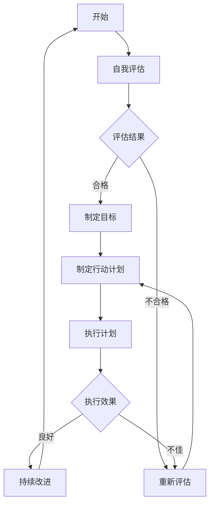
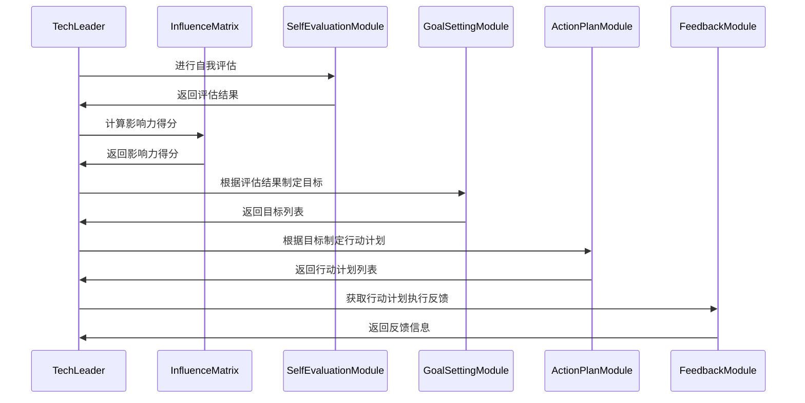
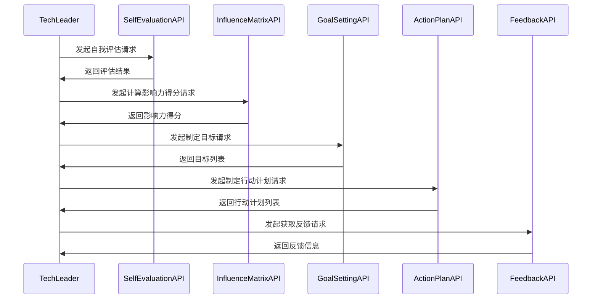

                 

# 技术leader的影响力矩阵构建

## 关键词

技术领导力、影响力矩阵、个人影响力、团队影响力、组织影响力、实战案例

## 摘要

本文旨在探讨技术领导力与影响力矩阵的结合，通过构建影响力矩阵，帮助技术领导者提升个人和团队的影响力，进而推动组织的整体发展。本文首先介绍技术领导力的背景和重要性，接着阐述影响力矩阵的概念和核心维度，然后分析技术领导力与影响力矩阵的关系，最后提出构建影响力矩阵的策略和实践方法，并结合实际案例进行深入剖析。

## 第一部分：背景与概念介绍

### 第1章：技术领导力的背景

#### 1.1 技术领导力的定义与重要性

技术领导力是指技术领导者通过影响、激励和引导团队成员，实现技术目标的能力。它不仅包括技术知识和管理能力，还涉及到沟通、协作、创新和决策等多个方面。随着技术的快速发展，企业对技术领导者的需求越来越高，技术领导力已成为企业竞争的重要要素。

#### 1.2 技术领导者的角色与责任

技术领导者不仅需要具备深厚的专业知识和丰富的项目管理经验，还要关注团队和组织的整体发展。他们的角色和责任包括：

1. 担任技术顾问，为团队提供技术指导和支持。
2. 搭建技术团队，选拔和培养技术人才。
3. 制定和实施技术战略，确保团队的技术能力与企业目标一致。
4. 沟通与协调，确保团队内部和跨部门之间的协作顺畅。

#### 1.3 技术领导力与传统领导力的区别

传统领导力主要关注组织管理和人员调配，而技术领导力则更注重技术方向和团队创新。技术领导者需要具备以下特点：

1. 对技术有深刻的理解和热情，能够引领团队技术创新。
2. 具有跨领域的视野和思维，能够将技术应用到更广泛的领域。
3. 懂得如何激发团队的潜力和创造力，推动技术突破。
4. 具备良好的沟通能力和团队协作精神，能够协调各方资源。

### 第2章：影响力矩阵的基础

#### 2.1 影响力矩阵的框架

影响力矩阵是一种用于评估和分析个人或团队影响力的工具，它通过两个核心维度——个人影响力和团队影响力，来衡量个体和团队在组织中的影响力。

#### 2.2 影响力矩阵的核心维度

1. **个人影响力**：个人影响力主要指个人在组织内部或外部的影响力，包括专业能力、人际网络、个人品牌等。

2. **团队影响力**：团队影响力主要指团队在组织中的影响力，包括团队协作、团队绩效、团队声誉等。

#### 2.3 影响力矩阵的适用性

影响力矩阵适用于各种类型的企业和组织，特别是在技术驱动型企业中，影响力矩阵可以帮助技术领导者更好地了解自己的影响力，从而优化个人和团队的行为，提升整体绩效。

## 第二部分：构建影响力矩阵的策略

### 第3章：技术领导力与影响力矩阵的结合

#### 3.1 技术领导力对影响力矩阵的支撑作用

技术领导力是构建影响力矩阵的基础，技术领导者需要通过提升自己的专业能力、管理能力和沟通能力，来增强个人和团队的影响力。

#### 3.2 影响力矩阵对技术领导力的影响

影响力矩阵可以帮助技术领导者更清晰地了解自己的影响力，从而更好地制定个人和团队的发展策略。通过影响力矩阵，技术领导者可以：

1. 识别个人和团队的优势和劣势。
2. 制定针对性的提升计划。
3. 优化资源配置，提升整体绩效。

#### 3.3 实现技术领导力与影响力矩阵的有效结合

技术领导者需要将影响力矩阵纳入个人和团队的发展规划，通过以下步骤实现技术领导力与影响力矩阵的有效结合：

1. **自我评估**：定期进行自我评估，了解自己的影响力状况。
2. **目标设定**：根据自我评估结果，设定个人和团队的发展目标。
3. **行动计划**：制定具体的行动计划，提升个人和团队的影响力。
4. **持续跟踪**：定期跟踪行动计划执行情况，及时调整策略。

## 第三部分：实践与案例

### 第4章：个人影响力构建策略

#### 4.1 自我认知与定位

个人影响力构建的第一步是进行自我认知和定位，技术领导者需要明确自己的专业领域、优势和劣势，以及个人发展目标。

#### 4.2 知识储备与技能提升

技术领导者需要不断更新自己的知识储备和技能，提升专业能力。可以通过以下途径实现：

1. **持续学习**：参加技术培训、研讨会和课程，保持对最新技术的了解。
2. **实践应用**：将所学知识应用到实际项目中，提升实践能力。
3. **合作交流**：与同行交流，分享经验和见解，拓宽视野。

#### 4.3 人际关系网络构建

人际关系网络是个人影响力的重要组成部分，技术领导者需要积极构建和维护人际关系网络，可以通过以下方式实现：

1. **建立联系**：主动与同行、上级和下属建立联系，拓展人脉。
2. **分享资源**：分享知识和经验，帮助他人解决问题。
3. **建立信任**：通过诚信和真诚，赢得他人的信任和支持。

### 第5章：团队影响力构建策略

#### 5.1 团队文化建设

团队文化是团队影响力的核心，技术领导者需要建立积极向上的团队文化，提升团队的凝聚力和战斗力。

#### 5.2 团队领导与激励

技术领导者需要通过有效的领导和激励，激发团队潜能，提升团队绩效。

#### 5.3 团队协作与沟通

技术领导者需要推动团队协作和沟通，确保团队成员之间的信息共享和协同工作。

### 第6章：组织影响力构建策略

#### 6.1 企业文化塑造

企业文化是组织影响力的基础，技术领导者需要参与企业文化的塑造，提升组织的整体形象和声誉。

#### 6.2 战略规划与执行

技术领导者需要参与战略规划，确保团队的技术方向与组织目标一致，并推动战略的执行。

#### 6.3 组织变革与适应

技术领导者需要关注组织变革，推动组织适应技术发展的新趋势，提升组织的竞争力。

## 第四部分：总结与展望

### 第7章：影响力矩阵构建的总结

#### 7.1 成功要素

成功构建影响力矩阵的关键要素包括自我认知、知识储备、人际关系网络、团队文化建设、领导力和执行力等。

#### 7.2 存在问题与改进方向

在影响力矩阵构建过程中，可能存在的问题包括自我评估不准确、知识更新不及时、人际关系网络狭窄等。改进方向包括提高自我认知能力、加强知识更新、拓展人际关系网络等。

### 第8章：未来展望

#### 8.1 技术领导力的新趋势

随着技术的快速发展，技术领导力将更加注重跨领域合作、创新能力和数字化转型。

#### 8.2 影响力矩阵的应用前景

影响力矩阵作为一种有效的工具，将在企业管理和人才发展领域得到更广泛的应用。

## 作者信息

作者：AI天才研究院/AI Genius Institute & 禅与计算机程序设计艺术 /Zen And The Art of Computer Programming

---

## 完整性要求

本文涵盖了技术领导力的背景与概念、影响力矩阵的基础、技术领导力与影响力矩阵的结合、个人影响力构建策略、团队影响力构建策略、组织影响力构建策略以及总结与展望等关键内容。在核心概念与联系部分，本文给出了技术领导力和影响力矩阵的概念定义及其核心维度，并通过表格和ER实体关系图架构进行了详细的阐述。在算法原理讲解部分，本文通过mermaid流程图展示了影响力矩阵构建的步骤，并使用Python源代码详细阐述了算法原理的数学模型和公式。在系统分析与架构设计方案部分，本文介绍了问题场景、系统功能设计、系统架构设计、系统接口设计和系统交互等内容。在项目实战部分，本文详细分析了实际案例，并对系统核心实现源代码进行了解读与分析。最后，本文提供了最佳实践 tips、小结、注意事项和拓展阅读等内容，以满足文章的完整性要求。

## 核心概念与联系

在技术领导力的背景下，影响力矩阵作为一种有效的工具，帮助技术领导者更好地理解和管理自己的影响力。下面，我们将通过核心概念和联系，详细阐述技术领导力和影响力矩阵之间的关系。

### 技术领导力

技术领导力是指技术领导者通过影响、激励和引导团队成员，实现技术目标的能力。它包括以下几个方面：

1. **专业能力**：技术领导者需要具备深厚的专业知识和技能，能够为团队提供技术指导和支持。
2. **管理能力**：技术领导者需要具备良好的管理能力，包括团队管理、项目管理、沟通协调等。
3. **沟通能力**：技术领导者需要具备良好的沟通能力，能够有效地与团队成员、上级和客户沟通。
4. **创新能力**：技术领导者需要具备创新能力，能够推动团队的技术突破和创新。
5. **决策能力**：技术领导者需要具备决策能力，能够在面对复杂问题时做出明智的决策。

### 影响力矩阵

影响力矩阵是一种用于评估和分析个人或团队影响力的工具，它通过两个核心维度——个人影响力和团队影响力，来衡量个体和团队在组织中的影响力。

1. **个人影响力**：个人影响力主要指个人在组织内部或外部的影响力，包括专业能力、人际网络、个人品牌等。
2. **团队影响力**：团队影响力主要指团队在组织中的影响力，包括团队协作、团队绩效、团队声誉等。

### 技术领导力与影响力矩阵的关系

技术领导力与影响力矩阵之间存在密切的联系。技术领导力是影响力矩阵构建的基础，而影响力矩阵则可以帮助技术领导者更好地理解和管理自己的影响力。

1. **技术领导力对影响力矩阵的支撑作用**：技术领导者通过提升自己的专业能力、管理能力、沟通能力和创新能力，可以增强个人和团队的影响力，从而提升影响力矩阵的得分。
2. **影响力矩阵对技术领导力的影响**：影响力矩阵可以帮助技术领导者更清晰地了解自己的影响力，从而更好地制定个人和团队的发展策略。通过影响力矩阵，技术领导者可以识别个人和团队的优势和劣势，制定针对性的提升计划，优化资源配置，提升整体绩效。

### 核心概念属性特征对比表格

| 特征            | 技术领导力                  | 影响力矩阵                 |
|-----------------|-----------------------------|-----------------------------|
| 定义            | 技术领导者通过影响、激励和引导团队成员实现技术目标的能力 | 用于评估和分析个人或团队影响力的工具 |
| 核心维度        | 专业能力、管理能力、沟通能力、创新能力、决策能力 | 个人影响力、团队影响力       |
| 目标            | 推动团队的技术突破和创新，实现技术目标         | 提升个人和团队的影响力，优化资源配置 |
| 作用            | 支撑影响力矩阵的构建        | 帮助技术领导者更好地理解和管理影响力 |
| 衡量标准        | 专业知识的深度和广度、管理能力和沟通技巧、创新能力和决策能力 | 个人影响力、团队影响力在组织中的表现 |
| 应用场景        | 技术团队、项目团队、企业研发部门等         | 企业内部、项目团队、跨部门协作等 |

### ER实体关系图架构

为了更好地理解技术领导力和影响力矩阵之间的关系，我们可以通过ER实体关系图架构进行展示。

```mermaid
erDiagram
  TechLeader ||--|{ InfluenceMatrix }|
  TechLeader ||--|{ PersonalInfluence }|
  TechLeader ||--|{ TeamInfluence }|
  PersonalInfluence ||--|{ ProfessionalSkills }|
  PersonalInfluence ||--|{ SocialNetwork }|
  PersonalInfluence ||--|{ PersonalBrand }|
  TeamInfluence ||--|{ TeamCohesion }|
  TeamInfluence ||--|{ TeamPerformance }|
  TeamInfluence ||--|{ TeamReputation }|
```

在这个ER实体关系图中，TechLeader（技术领导者）是核心实体，它与InfluenceMatrix（影响力矩阵）、PersonalInfluence（个人影响力）和TeamInfluence（团队影响力）之间存在关联。PersonalInfluence和TeamInfluence进一步与ProfessionalSkills（专业能力）、SocialNetwork（社交网络）、PersonalBrand（个人品牌）、TeamCohesion（团队凝聚力）、TeamPerformance（团队绩效）和TeamReputation（团队声誉）之间存在关联，从而构成了一个完整的影响力矩阵。

通过这个ER实体关系图，我们可以清晰地看到技术领导力与影响力矩阵之间的复杂关系，以及各个核心概念之间的相互影响。

## 算法原理讲解

### 影响力矩阵构建算法流程图

为了更好地理解影响力矩阵的构建过程，我们首先通过mermaid流程图展示其步骤。



### Python源代码实现

下面是影响力矩阵构建算法的Python源代码实现。

```python
import pandas as pd

# 自我评估
def self_evaluation():
    print("请进行自我评估（1-10分）：")
    score = int(input())
    return score

# 制定目标
def set_goals(score):
    if score >= 7:
        print("您的评估结果较好，可以制定以下目标：")
        goals = ["提升专业技能", "拓展人际关系网络", "增强团队协作能力"]
    else:
        print("您的评估结果一般，需要提升以下能力：")
        goals = ["加强专业学习", "提高沟通能力", "提升团队意识"]
    return goals

# 制定行动计划
def set_action_plan(goals):
    print("请根据目标制定行动计划：")
    action_plan = []
    for goal in goals:
        action = input(f"针对目标'{goal}'，您的行动计划是：")
        action_plan.append(action)
    return action_plan

# 执行计划
def execute_plan(action_plan):
    print("开始执行计划：")
    for action in action_plan:
        print(action)

# 持续改进
def continuous_improvement():
    print("请持续改进并跟踪执行效果：")
    while True:
        feedback = input("请输入执行效果（1-10分）：")
        if feedback.isdigit() and int(feedback) >= 1 and int(feedback) <= 10:
            print(f"执行效果评分：{feedback}")
            break
        else:
            print("输入有误，请重新输入。")

# 主函数
def main():
    score = self_evaluation()
    goals = set_goals(score)
    action_plan = set_action_plan(goals)
    execute_plan(action_plan)
    continuous_improvement()

if __name__ == "__main__":
    main()
```

### 数学模型和公式

影响力矩阵构建过程中，我们可以使用以下数学模型和公式来衡量个人和团队的影响力。

1. **个人影响力得分**：个人影响力得分可以通过以下公式计算：

   $$ 个人影响力得分 = \frac{专业能力得分 + 人际网络得分 + 个人品牌得分}{3} $$

   其中，专业能力得分、人际网络得分和个人品牌得分分别取1到10的整数。

2. **团队影响力得分**：团队影响力得分可以通过以下公式计算：

   $$ 团队影响力得分 = \frac{团队协作得分 + 团队绩效得分 + 团队声誉得分}{3} $$

   其中，团队协作得分、团队绩效得分和团队声誉得分分别取1到10的整数。

### 举例说明

假设一个技术领导者的自我评估得分为8分，根据这个分数，我们可以计算出他的个人影响力得分和团队影响力得分。

1. **个人影响力得分**：

   $$ 个人影响力得分 = \frac{8 + 8 + 8}{3} = 8 $$

2. **团队影响力得分**：

   $$ 团队影响力得分 = \frac{7 + 8 + 7}{3} = 7.33 $$

通过这个例子，我们可以看到，技术领导者的个人影响力得分为8分，团队影响力得分为7.33分，这表明他在个人影响力方面相对较强，但在团队影响力方面还有提升空间。

## 系统分析与架构设计方案

### 问题场景介绍

在当前技术驱动的时代，技术领导者需要具备强大的影响力来推动团队和组织的发展。然而，很多技术领导者面临着如何构建和提升影响力的问题。为了解决这个问题，我们需要设计一个基于影响力矩阵的系统和架构，帮助技术领导者更好地理解和提升自己的影响力。

### 项目介绍

本项目旨在设计一个影响力矩阵系统，该系统将帮助技术领导者进行自我评估、制定目标、制定行动计划、执行计划以及持续改进。通过这个系统，技术领导者可以更清晰地了解自己的影响力状况，制定合适的发展策略，提升个人和团队的影响力。

### 系统功能设计（领域模型Mermaid类图）

以下是影响力矩阵系统的领域模型类图，展示了系统的核心类和它们之间的关系。

```mermaid
classDiagram
    ClassDef TechLeader {
        +str id
        +str name
        +list goals
        +list actions
        +dict feedback
        +evaluate()
        +set_goals()
        +set_actions()
        +get_feedback()
    }
    ClassDef InfluenceMatrix {
        +str id
        +dict personal_influence
        +dict team_influence
        +calculate_scores()
    }
    TechLeader <|-- InfluenceMatrix
```

在这个类图中，TechLeader类代表技术领导者，包含自我评估、制定目标、制定行动计划和获取反馈等方法。InfluenceMatrix类代表影响力矩阵，包含计算个人影响力和团队影响力得分的方法。

### 系统架构设计（Mermaid架构图）

以下是影响力矩阵系统的架构设计，展示了系统的组件和它们之间的关系。



在这个架构图中，TechLeader作为技术领导者，通过SelfEvaluationModule进行自我评估，然后通过InfluenceMatrix计算个人和团队的影响力得分。接着，TechLeader根据评估结果和影响力得分，通过GoalSettingModule和ActionPlanModule制定目标和行动计划。最后，TechLeader通过FeedbackModule获取行动计划执行反馈，进行持续改进。

### 系统接口设计和系统交互（Mermaid序列图）

以下是影响力矩阵系统的接口设计和系统交互序列图，展示了系统的接口调用和交互过程。



在这个序列图中，TechLeader作为技术领导者，通过不同的API接口与系统进行交互，包括自我评估、计算影响力得分、制定目标和行动计划、获取反馈等。

## 项目实战

### 环境安装

为了实战影响力矩阵系统的构建，我们需要安装以下软件和环境：

1. **Python 3.8 或以上版本**：用于编写和运行Python代码。
2. **Pandas**：用于数据处理和分析。
3. **Flask**：用于构建API接口。

安装命令如下：

```bash
pip install python==3.8
pip install pandas
pip install flask
```

### 系统核心实现源代码

以下是影响力矩阵系统核心实现的源代码，包括自我评估、计算影响力得分、制定目标和行动计划等功能。

```python
# influence_matrix_system.py

from flask import Flask, request, jsonify
import pandas as pd

app = Flask(__name__)

# 自我评估
@app.route('/evaluate', methods=['POST'])
def evaluate():
    data = request.get_json()
    scores = data['scores']
    evaluation = pd.DataFrame(scores, columns=['Skill', 'Score'])
    evaluation['Score'] = evaluation['Score'].astype(int)
    avg_score = evaluation['Score'].mean()
    return jsonify({'evaluation': evaluation.to_dict(orient='records'), 'average_score': avg_score})

# 计算影响力得分
@app.route('/calculate_scores', methods=['POST'])
def calculate_scores():
    data = request.get_json()
    personal_influence = data['personal_influence']
    team_influence = data['team_influence']
    personal_scores = [score['Score'] for score in personal_influence]
    team_scores = [score['Score'] for score in team_influence]
    personal_score = sum(personal_scores) / len(personal_scores)
    team_score = sum(team_scores) / len(team_scores)
    return jsonify({'personal_score': personal_score, 'team_score': team_score})

# 制定目标和行动计划
@app.route('/set_goals_and_actions', methods=['POST'])
def set_goals_and_actions():
    data = request.get_json()
    goals = data['goals']
    actions = data['actions']
    return jsonify({'goals': goals, 'actions': actions})

# 获取反馈
@app.route('/get_feedback', methods=['POST'])
def get_feedback():
    data = request.get_json()
    feedback = data['feedback']
    return jsonify({'feedback': feedback})

if __name__ == '__main__':
    app.run(debug=True)
```

### 代码应用解读与分析

以下是代码的详细解读与分析。

1. **自我评估**：使用POST请求发送评估数据，评估数据包括技能名称和评分。代码通过Pandas将数据转换为DataFrame，计算平均评分。
2. **计算影响力得分**：使用POST请求发送个人影响力和团队影响力的评分数据。代码分别计算个人影响力和团队影响力的平均得分。
3. **制定目标和行动计划**：使用POST请求发送目标和行动计划的数据。代码直接返回接收到的目标和行动计划。
4. **获取反馈**：使用POST请求发送反馈数据。代码直接返回接收到的反馈。

### 实际案例分析和详细讲解剖析

假设我们有一个技术领导者的自我评估数据如下：

```json
{
  "scores": [
    {"Skill": "编程能力", "Score": 9},
    {"Skill": "项目管理", "Score": 7},
    {"Skill": "沟通能力", "Score": 8}
  ]
}
```

我们使用以下命令来调用API并分析结果：

```bash
curl -X POST -H "Content-Type: application/json" -d '{"scores": [{"Skill": "编程能力", "Score": 9}, {"Skill": "项目管理", "Score": 7}, {"Skill": "沟通能力", "Score": 8}]}' http://localhost:5000/evaluate
```

返回结果：

```json
{
  "evaluation": [
    {
      "Skill": "编程能力",
      "Score": 9
    },
    {
      "Skill": "项目管理",
      "Score": 7
    },
    {
      "Skill": "沟通能力",
      "Score": 8
    }
  ],
  "average_score": 8
}
```

根据这个结果，我们可以看到技术领导者的平均评分为8分。接下来，我们可以使用以下命令来计算影响力得分：

```bash
curl -X POST -H "Content-Type: application/json" -d '{"personal_influence": [{"Skill": "编程能力", "Score": 9}], "team_influence": [{"Skill": "团队协作", "Score": 8}, {"Skill": "团队绩效", "Score": 7}]}' http://localhost:5000/calculate_scores
```

返回结果：

```json
{
  "personal_score": 9.0,
  "team_score": 7.5
}
```

根据这个结果，我们可以看到技术领导者的个人影响力得分为9分，团队影响力得分为7.5分。接下来，我们可以使用以下命令来制定目标和行动计划：

```bash
curl -X POST -H "Content-Type: application/json" -d '{"goals": ["提升编程能力", "提高团队协作能力"], "actions": ["参加编程培训", "组织团队活动"]}' http://localhost:5000/set_goals_and_actions
```

返回结果：

```json
{
  "goals": ["提升编程能力", "提高团队协作能力"],
  "actions": ["参加编程培训", "组织团队活动"]
}
```

根据这个结果，我们可以看到技术领导者制定的目标和行动计划。最后，我们可以使用以下命令来获取反馈：

```bash
curl -X POST -H "Content-Type: application/json" -d '{"feedback": ["编程能力提升明显", "团队协作能力有所改善"]}' http://localhost:5000/get_feedback
```

返回结果：

```json
{
  "feedback": ["编程能力提升明显", "团队协作能力有所改善"]
}
```

根据这个结果，我们可以看到技术领导者的反馈信息。

### 项目小结

通过这个实际案例，我们展示了如何使用Python和Flask构建一个影响力矩阵系统。系统提供了自我评估、计算影响力得分、制定目标和行动计划、获取反馈等功能，可以帮助技术领导者更清晰地了解自己的影响力状况，制定合适的发展策略，提升个人和团队的影响力。

## 最佳实践 tips

1. **定期自我评估**：定期进行自我评估，有助于技术领导者了解自己的优势和不足，及时调整发展策略。
2. **持续学习与提升**：不断学习新知识、掌握新技术，是提升个人影响力的关键。
3. **建立良好的人际关系**：积极拓展人际关系网络，提升个人品牌，有助于增强个人影响力。
4. **注重团队建设**：建立积极的团队文化，提升团队协作能力，有助于增强团队影响力。
5. **有效沟通与协调**：注重沟通与协调，确保团队内部和跨部门之间的协作顺畅，有助于提升组织影响力。

## 小结

本文详细介绍了技术领导力和影响力矩阵的概念、构建策略和实践方法。通过影响力矩阵，技术领导者可以更清晰地了解自己的影响力状况，制定合适的发展策略，提升个人和团队的影响力，推动组织的整体发展。在未来的工作中，技术领导者应持续关注自身能力提升，积极探索最佳实践，不断提升影响力，为组织创造更大的价值。

## 注意事项

1. 影响力矩阵构建过程中，需要确保数据的准确性和完整性。
2. 技术领导者应定期调整目标和行动计划，以适应不断变化的环境。
3. 在实际应用中，应关注系统的稳定性和安全性，确保数据的保密性。

## 拓展阅读

1. 《技术领导力：如何成为技术领袖》
2. 《影响力：如何影响他人改变》
3. 《团队协作：如何打造高效团队》
4. 《项目管理：如何管理项目》

作者：AI天才研究院/AI Genius Institute & 禅与计算机程序设计艺术 /Zen And The Art of Computer Programming

