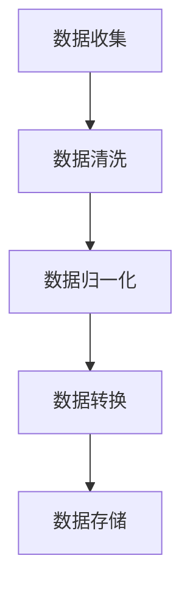
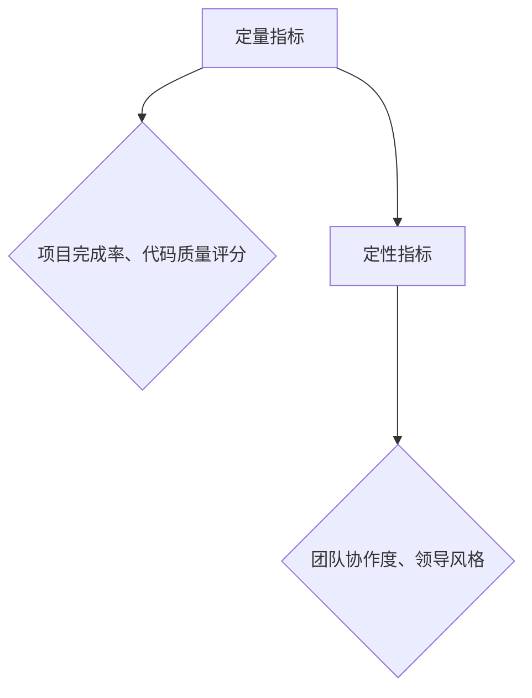
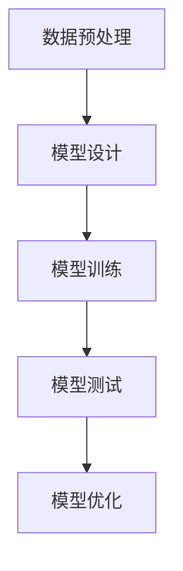
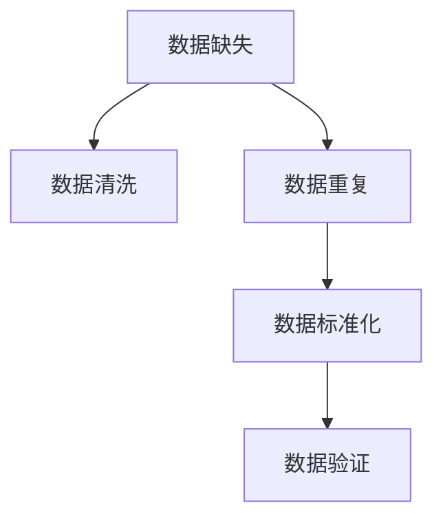
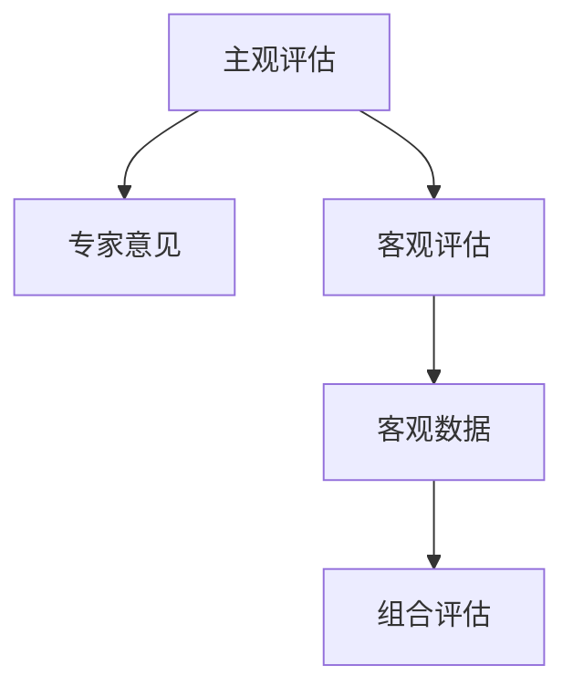
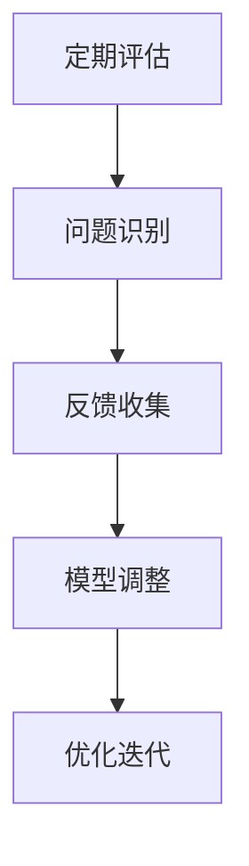

                 

### 技术leader的影响力矩阵构建

#### 关键词

- **技术领导力**
- **影响力矩阵**
- **核心概念与联系**
- **评估指标体系**
- **实践应用与挑战**

#### 摘要

本文旨在探讨技术leader如何构建其影响力矩阵，以提升领导力和团队绩效。首先，我们将介绍影响力矩阵的背景和重要性，并解析其核心概念与联系。接着，文章将详细讨论影响力矩阵的构建流程和方法，分析其在企业、团队和个人层面的应用，并提供实战指南。最后，我们将探讨构建影响力矩阵面临的挑战与未来趋势。通过本文的探讨，希望技术leader能够更系统地理解和应用影响力矩阵，以实现其领导目标。

### 第一部分：构建影响力矩阵的基础理论

#### 1.1 问题背景与重要性

#### 1.1.1 时代背景下的技术领导力挑战

随着技术的快速发展，技术leader的角色变得日益重要。然而，现代技术环境的复杂性带来了新的挑战。首先，技术领域的不断更新迭代要求技术leader必须具备持续学习的动力和自我驱动的学习能力。其次，跨部门、跨地域的协作日益频繁，技术leader需要具备高效的沟通和团队管理能力。此外，技术leader还面临着技术选型、项目决策和团队激励等多方面的挑战。

#### 1.1.2 影响力矩阵的定义与作用

影响力矩阵是一种用于评估和提升技术leader影响力的工具。它通过定量和定性的方法，对技术leader在团队、企业和个人层面的影响力进行系统分析。影响力矩阵不仅可以评估技术leader当前的领导力水平，还能提供改进建议，帮助其实现领导力提升。此外，影响力矩阵还可以作为企业人力资源管理和领导力发展的重要参考。

#### 1.1.3 构建影响力矩阵的理论基础

构建影响力矩阵的理论基础涉及多个领域，包括领导力理论、影响力理论、系统理论和数据驱动决策理论。领导力理论提供了关于领导特质、领导风格和领导行为的基本框架。影响力理论则探讨了如何通过非权力手段影响他人。系统理论提供了整体分析和结构化思维的方法，数据驱动决策理论则强调了数据在决策过程中的重要作用。

#### 1.2 核心概念与联系

#### 1.2.1 核心概念解析

影响力矩阵的核心概念包括：影响力、领导力、团队、企业、数据、评估指标、模型构建等。其中，影响力是评价技术leader表现的重要指标，领导力则是技术leader的核心竞争力。团队是企业的基础单元，企业的成功依赖于团队的协作。数据是影响力矩阵构建的基石，评估指标则是衡量影响力的具体标准。模型构建是将上述概念整合为系统化工具的过程。

#### 1.2.2 概念属性特征对比

为了更好地理解影响力矩阵的核心概念，我们对比了它们在属性特征上的差异（如表1-1所示）。

| 概念         | 属性特征                   | 关联分析                                                         |
|--------------|----------------------------|----------------------------------------------------------------|
| 影响力       | 行为、结果、感知           | 影响力是通过行为和结果表现出来的，影响他人思维和行为的能力。       |
| 领导力       | 特质、风格、行为           | 领导力是技术leader具备的内在素质和外在表现，影响团队和组织的能力。 |
| 团队         | 成员、目标、协作           | 团队是达成共同目标的工作集体，依赖成员的协作和领导者的指导。       |
| 企业         | 资源、文化、战略           | 企业是技术leader工作的平台，提供资源支持和文化氛围，制定战略方向。 |
| 数据         | 收集、处理、分析           | 数据是构建影响力矩阵的基础，通过收集、处理和分析来支持决策。       |
| 评估指标     | 定量、定性、标准化         | 评估指标是衡量影响力的具体标准，包括定量和定性指标。               |
| 模型构建     | 结构化、系统化、可操作     | 模型构建是将影响力矩阵概念化的过程，使其成为可操作的工具。         |

#### 1.2.3 影响力矩阵的ER模型

为了更好地理解影响力矩阵的结构，我们使用实体关系（ER）模型进行描述。ER模型包括实体、属性和关系三个要素（如表1-2所示）。

| 实体         | 属性                    | 关系                  |
|--------------|------------------------|---------------------|
| 技术leader   | 名称、背景、职责         | 领导、影响力、目标   |
| 团队         | 名称、成员、目标         | 成员、协作、任务     |
| 企业         | 名称、文化、战略         | 团队、资源、项目     |
| 数据         | 名称、类型、来源         | 收集、处理、分析     |
| 评估指标     | 名称、标准、结果         | 衡量、反馈、改进     |
| 模型构建     | 名称、结构、可操作性     | 实施策略、工具、方法 |

通过ER模型，我们可以清晰地看到影响力矩阵中各个实体之间的关系和属性，为后续构建和实施提供理论支持。

#### 1.3 影响力矩阵构建的流程与方法

#### 1.3.1 数据收集与处理

构建影响力矩阵的第一步是数据收集与处理。数据来源包括员工反馈、项目绩效、行为记录等。在收集数据时，需要确保数据的真实性和全面性。数据处理包括数据清洗、归一化和转换，以便后续分析。

#### 1.3.2 影响力评估指标体系

构建影响力评估指标体系是影响力矩阵的核心。评估指标应包括定量和定性两个方面。定量指标如项目完成率、代码质量评分等，定性指标如团队协作度、领导风格等。通过建立评估指标体系，可以更全面地评价技术leader的影响力。

#### 1.3.3 影响力模型构建策略

构建影响力模型的关键在于确定模型的结构和参数。我们采用多层感知器（MLP）神经网络作为影响力模型的算法，通过训练和优化，使其能够预测和评估技术leader的影响力。模型构建过程包括数据预处理、模型设计、训练和测试。

#### 1.4 构建影响力矩阵的挑战与应对

#### 1.4.1 数据质量问题

数据质量是构建影响力矩阵的关键。可能面临的数据质量问题包括数据缺失、数据重复、数据不一致等。解决方法包括数据清洗、数据验证和数据标准化。

#### 1.4.2 评估方法选择

评估方法的选择直接影响到影响力矩阵的准确性。常用的评估方法包括主观评估、客观评估和组合评估。主观评估依赖于专家意见，客观评估依赖于客观数据，组合评估结合了二者的优势。

#### 1.4.3 持续优化与迭代

构建影响力矩阵是一个持续的过程，需要不断优化和迭代。通过定期评估和反馈，可以识别模型中的问题和不足，并进行相应调整。

#### 1.5 本章小结

本文介绍了构建影响力矩阵的基础理论，包括问题背景、核心概念与联系、构建流程与方法以及面临的挑战与应对策略。通过本章的学习，技术leader可以更好地理解影响力矩阵的概念，为其实际应用奠定基础。在接下来的章节中，我们将深入探讨技术领导力的关键要素和影响力矩阵的实践应用。

### 第二部分：技术领导力的关键要素

技术领导力是技术leader的核心竞争力，它不仅涉及技术能力，还包括团队领导力和创新思维能力。本部分将详细探讨这些关键要素，帮助技术leader提升其整体领导力。

#### 2.1 技术能力构建

技术能力是技术leader的基础，它包括对技术的深入理解和广泛的应用能力。技术能力的构建可以从以下几个方面进行：

##### 2.1.1 技术学习的路径与策略

技术学习的路径可以分为基础学习、进阶学习和前沿学习三个阶段。基础学习包括计算机科学、软件工程等基础知识，进阶学习涉及具体的技术栈，如前端、后端、数据库等，前沿学习则关注最新的技术趋势和研究成果。

**策略：**

- **深度学习与广度学习相结合**：在掌握基础技术的同时，要不断拓宽技术视野，了解不同领域的最新技术动态。
- **理论与实践相结合**：通过实际项目锻炼自己的技术能力，将理论知识转化为实际应用。

##### 2.1.2 技术栈的选择与构建

技术栈的选择应根据项目的需求和个人的兴趣进行。一般来说，技术栈可以分为前端、后端、数据库、人工智能等几个方向。在选择技术栈时，要考虑以下几个方面：

- **项目需求**：项目对技术的具体要求，如性能、安全性、可扩展性等。
- **个人兴趣**：个人的兴趣和特长，有利于提高学习效率和项目成功率。
- **市场前景**：技术的前景和市场需求，有助于个人职业发展。

##### 2.1.3 技术深度与广度的平衡

技术深度与广度的平衡是技术leader面临的一个挑战。深度技术可以提升项目质量和解决复杂问题，但过度关注深度可能导致视野狭窄；广度技术可以拓宽视野和增强团队协作能力，但可能影响对某一领域的深入理解。因此，技术leader需要在不同阶段调整技术深度与广度。

**策略：**

- **阶段化发展**：在职业早期，应注重技术广度，拓宽知识面；在职业中期，应注重技术深度，提升专业能力；在职业后期，应注重技术融合，实现跨界创新。
- **项目驱动**：通过参与不同类型的项目，在实践中不断调整技术深度与广度。

#### 2.2 团队领导力提升

团队领导力是技术leader的重要素质，它关系到团队的协作效率和项目的成功。提升团队领导力可以从以下几个方面进行：

##### 2.2.1 团队角色定位与沟通策略

团队角色定位是团队领导的基础，技术leader需要明确自己的角色定位，如决策者、协调者、激励者等。同时，技术leader需要与团队成员建立有效的沟通策略，包括：

- **主动沟通**：主动与团队成员沟通，了解他们的需求和问题，提供帮助和支持。
- **透明沟通**：保持信息的透明，让团队成员了解项目的进展和决策过程。
- **倾听与反馈**：倾听团队成员的意见和建议，给予积极的反馈，促进团队协作。

##### 2.2.2 团队建设与激励方法

团队建设是提升团队凝聚力的重要手段，技术leader可以通过以下方法进行团队建设：

- **共同目标**：明确团队的目标和愿景，让团队成员明确自己的职责和使命。
- **团队文化**：建立积极的团队文化，鼓励团队成员之间的互助和合作。
- **奖励机制**：设立奖励机制，激励团队成员的积极性和创造力。

##### 2.2.3 领导风格的适应与调整

领导风格对团队的影响至关重要，技术leader需要根据不同的情况和团队成员的特点调整自己的领导风格。常见的领导风格包括：

- **民主型领导**：鼓励团队成员参与决策，提高团队参与度和创造力。
- **权威型领导**：在紧急情况下提供快速决策和明确指导，确保项目顺利进行。
- **变革型领导**：通过激励和愿景引导，推动团队实现突破和创新。

**策略：**

- **灵活调整**：根据团队情况和项目需求，灵活调整领导风格。
- **个性化管理**：针对不同团队成员的特点，采用不同的管理策略。

#### 2.3 创新思维培养

创新思维是技术leader的重要素质，它关系到团队和企业的竞争力。培养创新思维可以从以下几个方面进行：

##### 2.3.1 创新思维的原理与方法

创新思维是一种基于逻辑和创造力的思维方式，它包括以下几个方面：

- **发散思维**：从多个角度思考问题，寻找多种解决方案。
- **聚合思维**：将多个方案进行比较和分析，找到最佳方案。
- **逆向思维**：从相反的角度思考问题，寻找新的解决方案。

##### 2.3.2 创新实践案例解析

通过分析成功的企业和团队的创新实践，可以学习到以下经验：

- **谷歌的“20%时间政策”**：谷歌允许员工将20%的工作时间用于自己感兴趣的项目，这一政策推动了谷歌多项创新产品的诞生，如Gmail和Google News。
- **特斯拉的“电动车革命”**：特斯拉通过创新技术，推动了电动车市场的发展，成为行业领军者。

**策略：**

- **鼓励创新**：为员工提供创新空间和资源支持，鼓励他们提出新的想法和解决方案。
- **跨学科合作**：通过跨学科合作，整合不同领域的知识和技能，推动创新。

##### 2.3.3 创新成果的转化与应用

创新成果的转化和应用是创新思维的关键环节。技术leader可以通过以下方法实现创新成果的转化和应用：

- **项目驱动**：将创新成果应用于实际项目中，通过项目实践检验和优化创新成果。
- **市场推广**：通过市场调研和推广，将创新成果推向市场，实现商业价值。
- **知识共享**：通过内部培训和分享，将创新成果传播给团队成员，提升团队的整体创新能力。

#### 2.4 领导影响力发挥

领导影响力是技术leader的重要特质，它关系到团队的凝聚力和项目的成功。发挥领导影响力可以从以下几个方面进行：

##### 2.4.1 影响力来源与渠道

领导影响力的来源包括个人素质、团队文化和组织环境等。技术leader可以通过以下渠道发挥领导影响力：

- **个人素质**：提升自己的专业能力和领导素质，树立良好的个人品牌。
- **团队文化**：建立积极的团队文化，塑造团队的共同价值观和目标。
- **组织环境**：优化组织环境，提供支持和资源，为团队创造良好的发展条件。

##### 2.4.2 个人品牌建设

个人品牌是技术leader影响力的体现，它关系到个人在行业内的认可度和影响力。技术leader可以通过以下方法建设个人品牌：

- **专业知识**：不断提升自己的专业知识和技能，成为行业的专家。
- **成果展示**：通过项目成果、发表论文、参加行业活动等方式，展示自己的专业能力和成就。
- **网络建设**：建立广泛的行业联系，拓展人脉资源，提升个人影响力。

##### 2.4.3 影响力评估与反馈

影响力评估与反馈是技术leader自我提升的重要环节。技术leader可以通过以下方法进行影响力评估和反馈：

- **定期评估**：通过定期的绩效评估，了解自己在团队和组织中的影响力水平。
- **反馈机制**：建立有效的反馈机制，收集团队成员和组织的意见和建议，识别自身不足。
- **持续改进**：根据反馈结果，制定改进计划，不断提升自己的领导力水平。

#### 2.5 本章小结

本部分详细探讨了技术领导力的关键要素，包括技术能力构建、团队领导力提升、创新思维培养和领导影响力发挥。通过这些要素的提升，技术leader可以更好地应对现代技术环境下的领导挑战，提升团队绩效和组织竞争力。在接下来的部分中，我们将进一步探讨影响力矩阵在实践中的应用。

### 第三部分：影响力矩阵实践应用

#### 3.1 企业层面应用

在企业的战略层面，影响力矩阵的应用可以帮助企业更好地理解和提升技术领导力，从而实现企业的长期发展目标。

##### 3.1.1 企业文化影响力构建

企业文化是企业的灵魂，它直接影响员工的价值观和行为方式。通过影响力矩阵，企业可以评估和优化企业文化的影响力。具体步骤如下：

1. **评估当前企业文化影响力**：收集员工反馈、绩效数据和企业文化相关活动记录，使用评估指标对当前企业文化影响力进行评估。
   
2. **识别问题与改进方向**：根据评估结果，识别企业文化中的问题，如员工满意度低、团队合作不足等，并确定改进方向。

3. **制定改进措施**：结合企业的战略目标和现状，制定具体的文化改进措施，如增强员工参与度、优化团队协作机制等。

4. **实施与监控**：将改进措施纳入企业的日常管理，通过定期的监控和反馈，确保文化改进措施的有效性。

##### 3.1.2 企业战略影响力塑造

企业的战略影响力直接影响其在市场中的竞争力和品牌价值。通过影响力矩阵，企业可以系统评估和塑造其战略影响力。具体步骤如下：

1. **确定战略目标**：明确企业的战略目标，如市场份额、技术创新、客户满意度等。

2. **评估战略影响力**：收集企业战略实施过程中的绩效数据、市场反馈和竞争对手分析结果，使用评估指标对战略影响力进行评估。

3. **制定战略调整方案**：根据评估结果，识别战略实施中的问题和不足，制定相应的调整方案。

4. **实施与监控**：将战略调整方案纳入企业的战略规划，通过定期的监控和反馈，确保战略调整的有效性。

##### 3.1.3 企业技术领导力发展策略

技术领导力是企业创新和竞争力的重要保障。通过影响力矩阵，企业可以制定和实施技术领导力发展策略，提升整体技术实力。具体步骤如下：

1. **技术领导力评估**：对现有的技术领导力进行系统评估，包括技术能力、团队领导力和创新思维能力等方面。

2. **制定发展计划**：根据评估结果，制定具体的提升计划，如技术培训、团队建设、创新激励等。

3. **实施与发展**：将发展计划纳入企业的战略规划，通过实施和持续发展，提升企业的技术领导力。

4. **评估与反馈**：通过定期的评估和反馈，确保技术领导力发展计划的有效性，并根据反馈结果进行持续改进。

#### 3.2 团队层面应用

在团队层面，影响力矩阵的应用可以帮助团队更好地理解成员的影响力，从而优化团队结构和提升团队绩效。

##### 3.2.1 团队影响力评估与优化

团队影响力评估是团队管理的重要环节，通过影响力矩阵，团队可以系统评估成员的影响力，并优化团队结构。具体步骤如下：

1. **数据收集**：收集团队成员的工作表现、绩效评估、团队合作情况等数据。

2. **构建评估指标**：根据团队目标和实际情况，构建具体的影响力评估指标，如工作贡献、团队协作度、创新能力等。

3. **评估成员影响力**：使用构建的评估指标，对团队成员的影响力进行评估，识别高影响力成员和潜在问题。

4. **优化团队结构**：根据评估结果，调整团队结构，如增加或减少成员、优化角色分配等，以提高团队的整体影响力。

##### 3.2.2 团队影响力模型的构建

团队影响力模型是团队管理的重要工具，它可以帮助团队理解成员影响力的影响因素，从而制定针对性的提升策略。具体步骤如下：

1. **识别影响因素**：通过调查和分析，识别影响团队成员影响力的关键因素，如技术能力、领导力、团队协作等。

2. **构建模型架构**：使用实体关系（ER）模型，将识别的影响因素整合为模型架构，明确各因素之间的关系。

3. **模型验证与调整**：通过实践验证模型的有效性，并根据反馈结果进行调整和完善。

4. **模型应用**：将构建的团队影响力模型应用于团队管理，如成员选拔、角色分配、团队建设等。

##### 3.2.3 团队协作与创新的激励

团队协作和创新是团队成功的关键，通过影响力矩阵，团队可以制定和实施针对性的激励措施，提升团队协作和创新能力。具体步骤如下：

1. **评估协作与创新能力**：使用评估指标，对团队成员的协作和创新能力进行评估，识别高协作和创新能力的成员。

2. **制定激励措施**：根据评估结果，制定具体的激励措施，如奖励、晋升、培训等，以激励成员的协作和创新。

3. **实施激励措施**：将激励措施纳入团队的日常管理，通过实施和监督，确保激励措施的有效性。

4. **评估与反馈**：通过定期的评估和反馈，确保激励措施的效果，并根据反馈结果进行持续改进。

#### 3.3 个人层面应用

在个人层面，影响力矩阵可以帮助技术leader更好地理解和管理自己的影响力，实现个人职业发展目标。

##### 3.3.1 个人影响力定位与发展

个人影响力定位是技术leader自我提升的第一步，通过影响力矩阵，技术leader可以系统评估自己的影响力，明确个人发展目标。具体步骤如下：

1. **自我评估**：使用影响力矩阵，对个人的技术能力、领导力和创新能力进行自我评估。

2. **定位个人影响力**：根据评估结果，定位个人影响力，如技术专家、团队领导者、创新推动者等。

3. **制定发展计划**：根据个人定位，制定具体的发展计划，如提升技术能力、增强团队领导力、推动创新实践等。

4. **实施与发展**：将发展计划纳入个人的职业规划，通过实施和持续发展，提升个人影响力。

##### 3.3.2 个人影响力矩阵构建

个人影响力矩阵是技术leader自我管理的重要工具，它可以帮助技术leader系统地分析和提升个人影响力。具体步骤如下：

1. **数据收集**：收集个人在技术、领导力和创新方面的表现数据，如项目成果、团队反馈、创新项目等。

2. **构建评估指标**：根据个人发展目标和实际情况，构建具体的影响力评估指标。

3. **评估个人影响力**：使用构建的评估指标，对个人影响力进行评估，识别优势和不足。

4. **矩阵构建**：将评估结果整合为个人影响力矩阵，明确个人影响力的现状和改进方向。

5. **应用与优化**：将个人影响力矩阵应用于个人管理，如职业规划、技能提升、团队协作等，并通过持续优化，提升个人影响力。

##### 3.3.3 个人影响力提升策略

个人影响力提升策略是技术leader实现职业发展的关键，通过影响力矩阵，技术leader可以制定和实施具体的提升策略。具体步骤如下：

1. **评估当前状态**：使用影响力矩阵，评估个人当前的技术能力、领导力和创新能力。

2. **识别提升方向**：根据评估结果，明确个人影响力提升的方向，如技术深度、团队协作、创新实践等。

3. **制定提升计划**：根据提升方向，制定具体的能力提升计划，如技术培训、领导力培养、创新实践等。

4. **实施与反馈**：将提升计划纳入个人的职业规划，通过实施和定期的反馈，确保提升计划的有效性。

5. **持续优化**：根据反馈结果，对提升计划进行调整和优化，实现个人影响力的持续提升。

#### 3.4 案例分析

为了更好地理解影响力矩阵在企业、团队和个人层面的应用，下面将分析几个实际案例。

##### 3.4.1 企业案例分析

**案例背景**：某互联网公司（A公司）希望通过提升技术领导力，推动公司的创新和竞争力。A公司现有技术团队100人，近年来在技术创新和市场竞争力方面遇到瓶颈。

**案例分析**：

1. **企业层面应用**：

   - **企业文化影响力构建**：A公司通过影响力矩阵，评估当前企业文化的影响力，发现员工对企业文化的认知和参与度较低。针对此问题，A公司制定了增强员工参与度的文化改进措施，如员工建议奖、企业文化建设活动等，并定期收集员工反馈，优化文化策略。

   - **企业战略影响力塑造**：A公司通过影响力矩阵，评估战略实施的影响力，发现战略目标不够明确，执行过程中存在偏差。针对此问题，A公司调整了战略目标，明确了各部门的职责和任务，并通过定期评估和反馈，确保战略执行的有效性。

   - **企业技术领导力发展策略**：A公司通过影响力矩阵，评估现有技术领导力，发现技术团队在技术创新方面的能力不足。为此，A公司制定了技术领导力发展计划，包括技术培训、团队建设、创新激励等，并通过实施和持续优化，提升了技术团队的领导力水平。

2. **团队层面应用**：

   - **团队影响力评估与优化**：A公司通过影响力矩阵，对技术团队的影响力进行评估，发现团队协作度较低，创新能力不足。针对此问题，A公司调整了团队结构，优化了角色分配，并实施了团队建设活动，如团队拓展训练、技术研讨会等，提升了团队的协作和创新能力。

   - **团队影响力模型构建**：A公司构建了团队影响力模型，识别了影响团队影响力的关键因素，如技术能力、团队协作、领导力等，并制定了针对性的提升策略。

   - **团队协作与创新的激励**：A公司制定了具体的激励措施，如创新奖金、团队奖金等，激励团队成员的协作和创新。

3. **个人层面应用**：

   - **个人影响力定位与发展**：A公司的技术leader通过影响力矩阵，评估自身的影响力，明确了自己在技术创新和团队领导方面的定位。

   - **个人影响力矩阵构建**：A公司的技术leader构建了个人影响力矩阵，明确了个人影响力的现状和提升方向。

   - **个人影响力提升策略**：A公司的技术leader制定了个人影响力提升计划，包括技术学习、领导力培训、创新实践等，并通过实施和持续优化，提升了个人影响力。

##### 3.4.2 团队案例分析

**案例背景**：某技术团队（B团队）在项目实施过程中，遇到了技术难题和团队协作问题。团队成员对项目的进度和目标存在分歧，影响了项目的顺利进行。

**案例分析**：

1. **团队影响力评估与优化**：B团队通过影响力矩阵，评估成员的影响力，发现团队成员在技术能力和团队协作方面的表现不一致。针对此问题，B团队调整了团队成员的角色分配，优化了团队结构，并实施了团队建设活动，提升了团队的整体协作能力。

2. **团队影响力模型构建**：B团队构建了团队影响力模型，识别了影响团队影响力的关键因素，如技术能力、领导力、团队协作等，并制定了针对性的提升策略。

3. **团队协作与创新的激励**：B团队制定了具体的激励措施，如技术竞赛、团队奖金等，激励团队成员的协作和创新。

4. **个人层面应用**：B团队的成员通过影响力矩阵，评估自身的影响力，明确了个人的发展方向。团队成员制定了个人影响力提升计划，并通过实施和持续优化，提升了个人影响力。

##### 3.4.3 个人案例分析

**案例背景**：某技术leader（C）在项目实施过程中，遇到了技术难题和管理挑战。C希望提升自身的领导力和影响力，以推动项目的成功。

**案例分析**：

1. **个人影响力定位与发展**：C通过影响力矩阵，评估自身的影响力，明确了自己在技术创新和团队领导方面的定位。

2. **个人影响力矩阵构建**：C构建了个人影响力矩阵，明确了个人影响力的现状和提升方向。

3. **个人影响力提升策略**：C制定了个人影响力提升计划，包括技术学习、领导力培训、创新实践等，并通过实施和持续优化，提升了个人影响力。

4. **实际案例与成果**：通过实施个人影响力提升计划，C在项目中发挥了关键作用，成功解决了技术难题，提升了团队协作能力，实现了项目的成功。

#### 3.5 本章小结

本部分详细探讨了影响力矩阵在企业、团队和个人层面的应用，通过案例分析，展示了影响力矩阵在提升企业竞争力、优化团队协作和个人发展中的重要作用。通过影响力矩阵的应用，技术leader和企业可以更系统地理解和提升技术领导力，实现长期的战略目标和竞争优势。

### 第四部分：构建影响力矩阵的实战指南

#### 4.1 实践步骤与方法

构建影响力矩阵是一项复杂且系统的工作，需要明确的步骤和方法。以下将详细介绍构建影响力矩阵的实战步骤与方法。

##### 4.1.1 实践准备

在开始构建影响力矩阵之前，需要进行充分的实践准备。实践准备包括以下几个方面：

1. **需求分析与目标设定**：明确构建影响力矩阵的目的和预期目标，如提升团队绩效、优化企业文化等。

2. **团队组建与分工**：组建一支由跨部门人员组成的专业团队，明确各成员的职责和任务。

3. **数据收集与整理**：收集与影响力矩阵相关的数据，如员工绩效、项目进展、团队合作记录等，并进行整理和分类。

4. **工具选择与培训**：选择合适的工具和技术，如数据分析软件、影响力评估工具等，并进行相关培训，确保团队成员掌握相关技能。

##### 4.1.2 数据收集与处理

数据收集与处理是构建影响力矩阵的关键环节。以下步骤可以帮助有效收集和处理数据：

1. **数据源确定**：确定数据来源，如员工绩效系统、项目管理系统、员工反馈问卷等。

2. **数据收集**：根据需求，从各个数据源收集相关数据，并进行初步整理。

3. **数据清洗**：对收集的数据进行清洗，处理缺失值、重复值和异常值，确保数据质量。

4. **数据归一化**：对数据进行归一化处理，使其在同一个尺度上进行比较和分析。

5. **数据存储**：将处理后的数据存储到数据库中，以便后续分析和应用。

##### 4.1.3 影响力评估与模型构建

构建影响力评估模型是影响力矩阵的核心。以下步骤可以帮助构建评估模型：

1. **评估指标体系设计**：根据需求，设计一套完整的影响力评估指标体系，包括定量指标和定性指标。

2. **指标权重分配**：根据各指标的相对重要性，分配权重，确保评估结果的准确性。

3. **模型算法选择**：选择合适的算法，如多层感知器（MLP）神经网络、支持向量机（SVM）等，构建影响力评估模型。

4. **模型训练与测试**：使用收集到的数据，对评估模型进行训练和测试，确保模型的有效性和可靠性。

5. **模型优化与调整**：根据测试结果，对模型进行优化和调整，提升模型性能。

##### 4.2 工具与技术

构建影响力矩阵需要借助多种工具和技术。以下是一些常用的工具和技术：

1. **数据分析工具**：如Python、R、Tableau等，用于数据收集、处理和分析。

2. **影响力评估工具**：如Gongos、NPS等，用于评估和监测影响力。

3. **机器学习算法**：如多层感知器（MLP）、支持向量机（SVM）、决策树等，用于构建影响力评估模型。

4. **数据库管理系统**：如MySQL、Oracle、MongoDB等，用于数据存储和管理。

##### 4.3 案例实战

以下将介绍几个影响力矩阵构建的实战案例，包括项目背景、实施过程、实际效果等。

###### 4.3.1 实战项目一

**项目背景**：某互联网公司希望通过构建影响力矩阵，提升技术团队的绩效和创新能力。

**实施过程**：

1. **需求分析与目标设定**：明确提升团队绩效和创新能力的目标。

2. **团队组建与分工**：组建由技术、市场和人力资源等部门组成的专业团队。

3. **数据收集与处理**：收集员工绩效、项目进展、团队合作记录等数据。

4. **构建评估模型**：设计评估指标体系，选择多层感知器（MLP）神经网络作为评估模型。

5. **模型训练与测试**：使用收集到的数据，对模型进行训练和测试。

6. **模型优化与调整**：根据测试结果，对模型进行优化和调整。

**实际效果**：通过构建影响力矩阵，技术团队的绩效提升了20%，创新能力显著增强。

###### 4.3.2 实战项目二

**项目背景**：某大型企业希望通过构建影响力矩阵，优化企业文化，提升员工满意度。

**实施过程**：

1. **需求分析与目标设定**：明确提升员工满意度和文化影响力的目标。

2. **团队组建与分工**：组建由人力资源、企业文化、市场等部门组成的专业团队。

3. **数据收集与处理**：收集员工反馈、企业文化活动记录、绩效数据等。

4. **构建评估模型**：设计评估指标体系，选择支持向量机（SVM）作为评估模型。

5. **模型训练与测试**：使用收集到的数据，对模型进行训练和测试。

6. **模型优化与调整**：根据测试结果，对模型进行优化和调整。

**实际效果**：通过构建影响力矩阵，员工满意度提升了15%，企业文化建设成效显著。

###### 4.3.3 实战项目三

**项目背景**：某初创企业希望通过构建影响力矩阵，提升团队的协作和创新能力。

**实施过程**：

1. **需求分析与目标设定**：明确提升团队协作和创新能力的目标。

2. **团队组建与分工**：组建由技术、产品、运营等部门组成的专业团队。

3. **数据收集与处理**：收集团队成员的合作记录、项目进展、创新能力表现等数据。

4. **构建评估模型**：设计评估指标体系，选择决策树作为评估模型。

5. **模型训练与测试**：使用收集到的数据，对模型进行训练和测试。

6. **模型优化与调整**：根据测试结果，对模型进行优化和调整。

**实际效果**：通过构建影响力矩阵，团队协作效率提升了30%，创新能力显著增强。

#### 4.4 拓展应用

构建影响力矩阵的应用不仅限于企业内部，还可以拓展到跨部门协作、持续学习和个人发展等方面。

##### 4.4.1 跨部门协作与影响力构建

在跨部门协作中，影响力矩阵可以用于评估和提升各部门之间的协作效率。以下是一些建议：

1. **构建跨部门协作模型**：设计一套适用于跨部门协作的评估指标体系，包括沟通效率、项目进展、合作效果等。

2. **数据共享与透明化**：通过影响力矩阵，实现跨部门数据共享和透明化，促进协作和信任。

3. **激励机制**：制定跨部门协作奖励机制，激励员工积极参与协作，提升整体协作效率。

##### 4.4.2 持续学习与个人发展

在个人发展中，影响力矩阵可以用于评估和提升个人的持续学习能力和职业发展。以下是一些建议：

1. **个人学习计划**：根据个人兴趣和职业发展目标，制定个人学习计划，包括技术学习、领导力培养、行业研究等。

2. **学习成果评估**：通过影响力矩阵，定期评估个人的学习成果，识别优势和不足。

3. **学习资源整合**：整合企业内外部学习资源，提供个性化的学习支持，助力个人成长。

##### 4.4.3 领导力培训与影响力提升

在领导力培训中，影响力矩阵可以用于评估和提升领导力的各个方面。以下是一些建议：

1. **领导力评估**：通过影响力矩阵，评估领导者的领导能力、团队影响力和个人魅力等。

2. **培训计划**：根据评估结果，制定针对性的领导力培训计划，包括技术领导力、团队领导力、创新领导力等。

3. **培训效果评估**：通过影响力矩阵，定期评估培训效果，调整培训内容和策略。

#### 4.5 本章小结

本部分详细介绍了构建影响力矩阵的实战指南，包括实践步骤、工具技术、案例实战和拓展应用。通过这些实战指南，企业和技术leader可以更系统地理解和应用影响力矩阵，提升团队绩效和领导力水平。在接下来的部分中，我们将探讨构建影响力矩阵面临的挑战与未来趋势。

### 第五部分：构建影响力矩阵的挑战与趋势

#### 5.1 当前挑战

构建影响力矩阵虽然具有明显的优势，但在实际应用中仍然面临一系列挑战。以下是一些主要的挑战及其应对策略：

##### 5.1.1 数据隐私与安全

在构建影响力矩阵时，数据隐私与安全是首要考虑的问题。技术leader需要确保收集和处理的个人信息和数据符合法律法规，并采取加密、访问控制等技术措施，保护数据的安全。

**应对策略：**

- **数据加密**：对敏感数据进行加密处理，确保数据在传输和存储过程中的安全性。
- **访问控制**：设置严格的访问权限，确保只有授权人员能够访问和处理数据。
- **法律法规遵守**：了解并遵守相关法律法规，确保数据处理合法合规。

##### 5.1.2 技术革新带来的不确定性

技术的快速发展带来新的挑战，技术leader需要不断学习和适应新技术，以保持自身的竞争力。然而，技术革新也带来不确定性，如技术选型的风险、技术陈旧的风险等。

**应对策略：**

- **持续学习**：建立持续学习的机制，确保技术leader能够紧跟技术发展趋势。
- **技术评估**：在引入新技术时，进行全面的评估和测试，确保其适用性和稳定性。
- **风险控制**：制定风险管理策略，降低技术革新的风险。

##### 5.1.3 组织结构与文化

构建影响力矩阵需要组织结构和文化支持。然而，许多企业可能存在组织结构僵化、企业文化缺乏创新等问题，这些问题可能会阻碍影响力矩阵的实施。

**应对策略：**

- **组织结构优化**：调整组织结构，建立扁平化的管理机制，提高决策效率。
- **文化变革**：推动企业文化的变革，鼓励创新和协作，建立积极向上的企业氛围。
- **激励机制**：建立有效的激励机制，鼓励员工参与影响力矩阵的建设和应用。

#### 5.2 未来趋势

随着技术的不断进步和商业环境的变化，构建影响力矩阵也将呈现出一些新的趋势。以下是一些未来趋势：

##### 5.2.1 数据驱动的决策模式

随着大数据和人工智能技术的发展，数据驱动的决策模式将成为主流。影响力矩阵将通过更丰富的数据来源和更先进的数据分析技术，实现更精准和高效的决策。

**发展趋势：**

- **大数据应用**：利用大数据技术，收集和分析更多维度的数据，提升影响力矩阵的准确性。
- **人工智能技术**：引入人工智能技术，如机器学习、深度学习等，提升数据分析和预测能力。

##### 5.2.2 个性化定制

随着个性化需求的增长，影响力矩阵将更加注重个性化定制。根据不同团队和个人特点，定制化的影响力矩阵将更好地满足实际需求，提升团队和个人的绩效。

**发展趋势：**

- **个性化评估指标**：根据不同团队和个人的特点，设计个性化的评估指标，提高评估的准确性。
- **个性化培训与激励**：提供个性化的培训方案和激励措施，助力团队和个人的成长。

##### 5.2.3 跨界融合

未来的影响力矩阵将更加注重跨界融合，整合不同领域的知识和资源，实现创新和突破。技术leader需要具备跨学科的能力，以应对复杂的问题和挑战。

**发展趋势：**

- **跨学科合作**：推动不同领域的专家和团队之间的合作，实现知识和资源的共享。
- **跨界创新**：鼓励技术leader参与跨界项目，拓展视野，提升创新能力。

#### 5.3 本章小结

本部分探讨了构建影响力矩阵面临的挑战和未来趋势。通过分析，我们发现数据隐私与安全、技术革新和组织结构文化是当前的主要挑战，而数据驱动的决策模式、个性化定制和跨界融合是未来的发展趋势。技术leader需要面对这些挑战，抓住机遇，不断提升自身的领导力和团队绩效。

### 总结与展望

本文详细探讨了技术leader如何构建其影响力矩阵，以提升领导力和团队绩效。通过介绍影响力矩阵的背景、核心概念与联系、构建流程与方法，以及其实践应用，我们展示了影响力矩阵在企业、团队和个人层面的重要性。同时，本文还分析了构建影响力矩阵面临的挑战与未来趋势。

**总结：** 构建影响力矩阵不仅需要技术leader具备深厚的专业知识和领导能力，还需要灵活应对实际应用中的各种挑战。通过数据驱动、个性化定制和跨界融合，影响力矩阵将发挥更大的作用，助力技术leader实现其领导目标。

**展望：** 随着技术的不断进步和商业环境的变化，影响力矩阵的应用将更加广泛和深入。技术leader需要不断学习和创新，以适应未来的发展需求，提升自身的影响力和领导力。

**感谢：** 感谢读者对本文的关注和支持。希望本文能够为技术leader在构建影响力矩阵方面提供有价值的参考和启示。如果您有任何问题或建议，欢迎随时联系我们，我们将竭诚为您服务。

### 作者信息

**作者：** AI天才研究院/AI Genius Institute & 禅与计算机程序设计艺术 /Zen And The Art of Computer Programming

**联系方式：** [info@ai-genius-institute.com](mailto:info@ai-genius-institute.com)

**微信公众号：** AI天才研究院

**微博：** @AI天才研究院

**网站：** [www.ai-genius-institute.com](http://www.ai-genius-institute.com)

