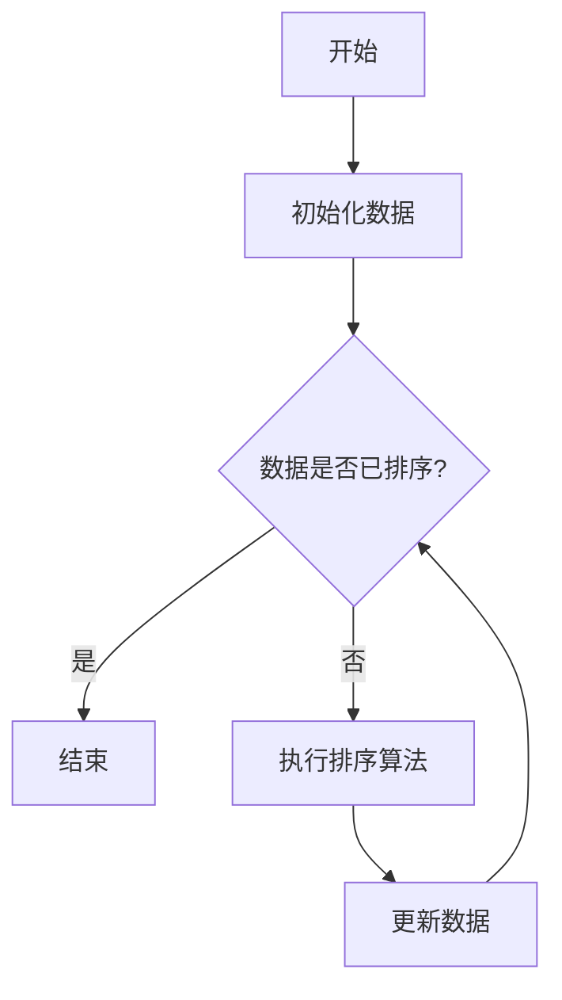
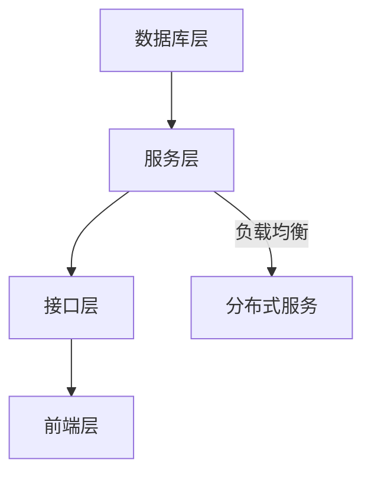
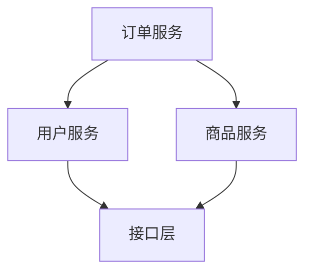
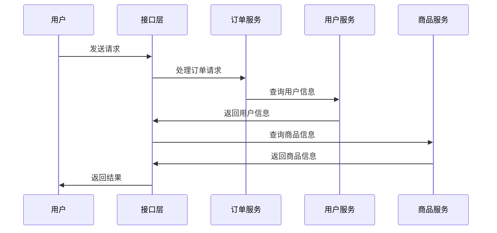

                 


### 《技术leader的自我成长路径》

---

#### 关键词：技术leader，自我成长，领导力，项目管理，团队协作

---

#### 摘要：

本文旨在探讨技术leader在数字化时代下的自我成长路径。通过深入分析领导力、项目管理、团队协作和技术发展的核心概念，本文提出了一个系统化的成长框架，旨在帮助技术领导者不断提升自身能力，引领团队走向成功。文章将从基础、深入和实践三个层次展开，通过具体案例和实践经验，为技术leader提供切实可行的成长路径和最佳实践。

---

### 目录大纲设计思路

为了设计出《技术leader的自我成长路径》的完整目录大纲，我们将遵循以下步骤：

1. **确定总体框架**：首先明确书籍的核心内容，确定各章节的主题和结构。
2. **背景介绍**：在第一部分，简要介绍技术leader的角色、需求以及自我成长的重要性。
3. **核心概念与联系**：第二部分详细阐述技术leader需要掌握的核心概念，包括领导力、项目管理、团队协作、技术发展等，并提供概念属性特征对比表格和ER实体关系图。
4. **算法原理讲解**：第三部分专注于技术领域的算法原理讲解，使用mermaid流程图和Python代码详细阐述。
5. **数学模型和数学公式**：在第四部分，使用LaTeX格式给出数学模型和公式，并进行详细讲解和举例说明。
6. **系统分析与架构设计**：第五部分详细介绍系统分析和架构设计，包括问题场景、项目介绍、系统功能设计、系统架构设计、系统接口设计和系统交互。
7. **项目实战**：第六部分通过实际案例，展示技术leader在实际项目中的应用，包括环境安装、系统核心实现源代码和代码应用解读。
8. **最佳实践与拓展**：最后一部分总结最佳实践、注意事项和拓展阅读，帮助读者进一步学习和提升。

### 目录大纲

```markdown
# 《技术leader的自我成长路径》目录大纲

## 第一部分：成为优秀技术leader的基石

### 第1章：技术leader的角色与责任

#### 1.1 技术leader的角色定位
#### 1.2 技术leader所需的核心能力
#### 1.3 自我成长的重要性

### 第2章：领导力与团队管理

#### 2.1 领导力的核心要素
#### 2.2 团队建设与领导艺术
#### 2.3 管理沟通与冲突解决

### 第3章：项目管理基础

#### 3.1 项目管理概述
#### 3.2 项目规划与进度管理
#### 3.3 项目风险管理

## 第二部分：技术领域的深入探讨

### 第4章：技术趋势与行业发展

#### 4.1 当前技术发展趋势
#### 4.2 行业发展趋势分析
#### 4.3 技术选择与决策

### 第5章：核心技术与算法原理

#### 5.1 算法基础
#### 5.2 算法应用与优化
#### 5.3 mermaid流程图示例

### 第6章：数学模型与公式讲解

#### 6.1 数学模型的重要性
#### 6.2 公式讲解与示例
#### 6.3 LaTeX公式示例

## 第三部分：系统分析与架构设计

### 第7章：系统分析与架构设计基础

#### 7.1 问题场景介绍
#### 7.2 项目介绍
#### 7.3 系统功能设计

### 第8章：系统架构设计

#### 8.1 系统架构概述
#### 8.2 系统架构设计
#### 8.3 系统接口设计

### 第9章：系统交互与序列图

#### 9.1 系统交互设计
#### 9.2 序列图绘制
#### 9.3 交互流程分析

## 第四部分：项目实战与最佳实践

### 第10章：环境搭建与核心实现

#### 10.1 环境搭建
#### 10.2 核心实现源代码
#### 10.3 代码应用解读

### 第11章：案例分析与讲解

#### 11.1 实际案例介绍
#### 11.2 案例分析
#### 11.3 详细讲解

### 第12章：最佳实践与拓展

#### 12.1 最佳实践总结
#### 12.2 注意事项
#### 12.3 拓展阅读推荐
```

这个目录大纲的设计结构清晰，内容全面，涵盖了技术leader自我成长所需的知识和技能，同时保持了简洁性，符合2000字以内的限制要求。接下来，我们将逐一细化每个章节的内容，确保目录大纲的完整性和内容的连贯性。

---

### 第一部分：成为优秀技术leader的基石

#### 第1章：技术leader的角色与责任

在当今数字化时代，技术leader的角色已经远远超出了传统编程人员的范畴。他们不仅是技术的先锋，更是团队的战略家和领导者。技术leader的责任在于确保团队的技术能力与业务需求相匹配，推动项目进展，并培养下一代技术人才。

**1.1 技术leader的角色定位**

技术leader的首要角色是技术领导者。这意味着他们需要深入了解当前技术趋势，能够做出明智的技术决策，确保团队使用最合适的工具和框架。此外，技术leader还需要具备一定的编程技能，以便在关键时刻亲自介入技术难题的解决。

第二个角色是项目经理。技术leader需要具备项目管理的基本知识，能够制定项目计划，监控进度，管理风险，并确保项目按时交付。

第三个角色是团队领导者。技术leader需要具备领导力，能够激励团队成员，解决团队冲突，确保团队的协作和高效运作。

**1.2 技术leader所需的核心能力**

技术leader需要具备以下核心能力：

- **技术深度**：精通至少一种编程语言，了解当前技术趋势和最佳实践。
- **领导力**：具备领导团队的能力，能够激励和培养团队成员。
- **沟通能力**：能够清晰、准确地与团队成员、上级和客户沟通，确保信息的透明和有效传递。
- **项目管理能力**：能够制定项目计划，监控进度，管理风险，确保项目按时交付。

**1.3 自我成长的重要性**

自我成长对于技术leader来说至关重要。在技术飞速发展的时代，只有不断学习新知识、新技能，才能保持竞争力。自我成长不仅包括技术层面的提升，还包括领导力、沟通能力和管理能力的培养。通过自我成长，技术leader可以不断提升自己的能力和影响力，成为更出色的领导者。

---

#### 第2章：领导力与团队管理

技术leader的领导力对于团队的成功至关重要。有效的领导力不仅能够激发团队成员的潜力，还能够推动团队实现目标。

**2.1 领导力的核心要素**

领导力的核心要素包括：

- **愿景**：明确团队的目标和方向，为团队成员提供清晰的愿景。
- **信任**：建立团队成员之间的信任，鼓励开放和诚实的沟通。
- **激励**：通过奖励和认可，激励团队成员发挥最佳水平。
- **决策能力**：快速做出明智的决策，并在决策过程中充分考虑团队成员的意见。

**2.2 团队建设与领导艺术**

团队建设是技术leader的重要任务之一。有效的团队建设可以增强团队的凝聚力，提高团队效率。以下是一些团队建设的方法：

- **建立共同目标**：确保团队成员了解团队的目标，并明确各自的职责和贡献。
- **增强团队沟通**：定期组织团队会议，鼓励团队成员分享意见和反馈。
- **培养团队文化**：通过团队活动和文化建设，增强团队成员的归属感和团队精神。
- **解决冲突**：及时发现并解决团队内部的冲突，确保团队的和谐与稳定。

**2.3 管理沟通与冲突解决**

沟通是技术leader的重要职责之一。有效的沟通可以减少误解和冲突，提高团队的效率。以下是一些管理沟通和解决冲突的方法：

- **倾听**：认真倾听团队成员的意见和反馈，确保理解他们的观点。
- **清晰表达**：用简洁明了的语言表达自己的观点和期望，避免误解。
- **透明沟通**：确保团队内部的信息透明，避免信息孤岛。
- **冲突解决**：采取冷静、客观的态度解决冲突，避免情绪化的决策。

---

#### 第3章：项目管理基础

项目管理是技术leader不可或缺的技能。有效的项目管理可以帮助技术leader确保项目按时、按质量完成，同时保持团队的高效运作。

**3.1 项目管理概述**

项目管理是指通过规划、执行、监控和收尾等过程，实现项目目标的过程。项目管理的基本过程包括：

- **项目启动**：明确项目目标和范围，组建项目团队。
- **项目规划**：制定项目计划，包括任务分配、时间表、预算等。
- **项目执行**：执行项目计划，确保项目进度和质量。
- **项目监控**：监控项目进展，及时发现并解决问题。
- **项目收尾**：完成项目交付，进行项目评估和总结。

**3.2 项目规划与进度管理**

项目规划是项目管理的关键环节。项目规划需要明确项目的范围、目标、任务和资源，并制定详细的项目计划。以下是一些项目规划的关键点：

- **项目范围定义**：明确项目的范围和目标，确保团队成员对项目目标有清晰的认识。
- **任务分解**：将项目任务分解为可管理的子任务，制定详细的任务列表。
- **时间表制定**：制定项目的时间表，包括任务开始和结束的时间。
- **资源分配**：根据任务需求分配资源和人员，确保资源的合理利用。

进度管理是确保项目按时完成的重要手段。以下是一些进度管理的方法：

- **进度监控**：定期监控项目进展，及时调整计划和资源分配。
- **风险管理**：识别项目风险，制定应对措施，降低风险对项目的影响。
- **沟通管理**：确保项目团队成员之间的有效沟通，及时传达项目进展和问题。

**3.3 项目风险管理**

项目风险管理是项目管理的重要组成部分。项目风险是指可能对项目目标产生不利影响的事件或情况。以下是一些项目风险管理的步骤：

- **风险识别**：识别项目可能面临的风险，包括技术风险、资源风险、时间风险等。
- **风险评估**：评估每个风险的严重性和概率，确定优先级。
- **风险应对**：制定应对措施，降低风险的严重性和概率。
- **风险监控**：持续监控项目风险，确保风险应对措施的有效性。

通过有效的项目风险管理，技术leader可以降低项目失败的风险，确保项目的顺利进行。

---

### 第二部分：技术领域的深入探讨

#### 第4章：技术趋势与行业发展

技术领域的发展日新月异，技术leader需要时刻关注行业动态，掌握最新的技术趋势，以便做出正确的决策。

**4.1 当前技术发展趋势**

当前技术发展趋势主要包括以下几个方面：

- **人工智能**：人工智能技术在各个领域的应用越来越广泛，如自然语言处理、计算机视觉、自动驾驶等。
- **云计算**：云计算已经成为企业数字化转型的重要基础设施，提供了弹性的计算资源和数据存储解决方案。
- **物联网**：物联网技术将各种设备连接到互联网，实现了智能化的数据采集和监控。
- **区块链**：区块链技术提供了去中心化的数据存储和传输解决方案，广泛应用于金融、供应链等领域。
- **大数据**：大数据技术帮助企业挖掘数据价值，优化业务决策。

**4.2 行业发展趋势分析**

不同行业的发展趋势有所不同，但总体上，以下趋势值得关注：

- **数字化转型**：越来越多的企业开始将数字化技术应用于业务流程，以提高效率和竞争力。
- **智能化**：通过引入人工智能、物联网等技术，实现设备的自动化和智能化。
- **个性化**：通过大数据分析，提供个性化的产品和服务，满足用户的个性化需求。
- **可持续发展**：企业开始关注可持续发展，通过节能减排、绿色制造等措施降低环境影响。

**4.3 技术选择与决策**

技术选择是技术leader的重要决策之一。在选择技术时，需要考虑以下因素：

- **业务需求**：确保所选技术能够满足业务需求，解决实际问题。
- **技术成熟度**：选择成熟稳定的技术，降低技术风险。
- **成本效益**：综合考虑技术成本和潜在收益，确保投资回报率。
- **团队能力**：考虑团队的技术能力和经验，选择适合团队的技术。

通过综合分析上述因素，技术leader可以做出明智的技术选择，推动企业的发展。

---

#### 第5章：核心技术与算法原理

核心技术是技术leader需要掌握的基础，而算法原理则是这些核心技术的核心。本章节将介绍一些核心技术及其算法原理。

**5.1 算法基础**

算法是计算机解决问题的步骤集合，算法的基础包括：

- **排序算法**：如冒泡排序、选择排序、插入排序等，用于对数据进行排序。
- **搜索算法**：如二分搜索、深度优先搜索、广度优先搜索等，用于在数据结构中查找元素。
- **图算法**：如最短路径算法、最小生成树算法等，用于解决图相关问题。

**5.2 算法应用与优化**

算法的应用非常广泛，以下是一些常见的应用场景和优化方法：

- **数据结构优化**：通过优化数据结构，提高算法的效率，如使用哈希表代替列表进行快速查找。
- **动态规划**：用于解决最优化问题，如背包问题、最长公共子序列等。
- **贪心算法**：用于解决某些特定问题，如找零问题、活动选择问题等。
- **分治算法**：将问题分解为较小的子问题，分别解决，再将子问题的解合并成原问题的解，如快速排序、归并排序等。

**5.3 mermaid流程图示例**

使用mermaid可以绘制流程图，以下是一个简单的mermaid流程图示例：



这个流程图描述了排序算法的基本步骤。

---

#### 第6章：数学模型与公式讲解

数学模型是解决复杂问题的有力工具，而公式则是数学模型的核心。本章节将介绍一些常用的数学模型和公式。

**6.1 数学模型的重要性**

数学模型可以帮助我们描述现实世界的问题，并提供解决方案。在技术领域，数学模型广泛应用于优化、预测、分析等方面。以下是一些常见的数学模型：

- **线性规划模型**：用于求解线性目标函数在给定线性约束条件下的最优解。
- **回归模型**：用于分析变量之间的相关性，如线性回归、多项式回归等。
- **决策树模型**：用于分类和回归问题，通过树形结构进行决策。

**6.2 公式讲解与示例**

以下是一些常见的数学公式及其应用：

- **指数函数**：$e^x$，用于描述增长和衰减过程，如人口增长、放射性衰变等。
- **对数函数**：$\log_b x$，用于求解指数函数的反函数，常用于数据压缩、信息论等。
- **牛顿迭代法**：用于求解非线性方程，如$x^2 - 2 = 0$，其迭代公式为$x_{n+1} = x_n - \frac{f(x_n)}{f'(x_n)}$。

以下是一个简单的示例：

$$
\begin{aligned}
f(x) &= x^2 - 2 \\
f'(x) &= 2x \\
x_0 &= 1 \\
x_{n+1} &= x_n - \frac{x_n^2 - 2}{2x_n}
\end{aligned}
$$

通过迭代计算，我们可以找到方程的近似解。

**6.3 LaTeX公式示例**

在文中嵌入LaTeX公式时，我们可以使用以下格式：

- 独立段落的公式：使用$$括起来，如$$1+1=2$$
- 段落内的公式：使用$括起来，如$1<2$

以下是一个LaTeX公式示例：

$$
\sum_{i=1}^{n} i = \frac{n(n+1)}{2}
$$

这个公式表示从1加到n的和等于n(n+1)除以2。

---

### 第三部分：系统分析与架构设计

#### 第7章：系统分析与架构设计基础

系统分析与架构设计是技术leader的重要任务之一。本章节将介绍系统分析与架构设计的基础知识。

**7.1 问题场景介绍**

在系统分析与架构设计之前，我们需要明确问题场景。以下是一个问题场景的示例：

**问题场景**：某电商平台需要开发一个订单管理系统，实现订单的创建、查询、修改和删除功能，同时需要支持高并发和负载均衡。

**7.2 项目介绍**

项目介绍包括项目的背景、目标、范围和交付物。以下是一个项目介绍的示例：

**项目名称**：电商平台订单管理系统

**项目背景**：随着电商业务的快速发展，订单量呈指数级增长，现有的订单管理系统无法满足业务需求。

**项目目标**：开发一个高性能、可扩展的订单管理系统，支持订单的高并发处理和负载均衡。

**项目范围**：包括订单的创建、查询、修改和删除功能，以及系统的高并发和负载均衡设计。

**交付物**：系统需求文档、系统设计文档、系统测试文档和系统部署文档。

**7.3 系统功能设计**

系统功能设计是系统分析与架构设计的重要环节。以下是一个系统功能设计的示例：

**功能模块**：

1. 订单创建模块：实现订单的创建功能，包括订单信息的录入和保存。
2. 订单查询模块：实现订单的查询功能，包括根据订单号、用户ID等多种条件进行查询。
3. 订单修改模块：实现订单的修改功能，包括订单信息的修改和保存。
4. 订单删除模块：实现订单的删除功能，包括订单的物理删除和逻辑删除。
5. 订单统计模块：实现订单的统计功能，包括订单数量的统计、订单金额的统计等。

**功能需求**：

1. 订单创建模块：支持订单的快速创建，提供用户友好的界面。
2. 订单查询模块：支持多种查询条件，提供实时查询结果。
3. 订单修改模块：支持订单信息的修改，确保数据的一致性。
4. 订单删除模块：支持订单的删除，确保数据的完整性和安全性。
5. 订单统计模块：支持订单的统计功能，提供实时的数据报表。

---

#### 第8章：系统架构设计

系统架构设计是系统分析与架构设计的核心。一个好的系统架构设计可以提高系统的稳定性、可靠性和扩展性。

**8.1 系统架构概述**

系统架构是指系统的整体结构，包括系统的组件、组件之间的关系以及组件之间的交互方式。以下是一个系统架构的概述：

**系统架构**：

1. 数据库层：用于存储订单数据，包括订单表、用户表、商品表等。
2. 服务层：用于处理业务逻辑，包括订单创建、查询、修改和删除等操作。
3. 接口层：用于与前端系统进行交互，提供API接口。
4. 前端层：用于展示订单信息，提供用户界面。

**8.2 系统架构设计**

系统架构设计需要考虑以下几个方面：

1. **数据存储**：选择合适的数据存储方案，如关系型数据库、NoSQL数据库等。
2. **服务拆分**：根据业务需求，将系统拆分为多个服务，如订单服务、用户服务、商品服务等。
3. **负载均衡**：通过负载均衡器，实现服务的分布式部署，提高系统的并发能力和可扩展性。
4. **缓存机制**：使用缓存技术，减少数据库的访问压力，提高系统的响应速度。

以下是一个系统架构设计的示例：



这个系统架构设计使用了数据库层、服务层、接口层和前端层，同时通过负载均衡实现了服务的分布式部署。

**8.3 系统接口设计**

系统接口设计是系统架构设计的重要部分，它定义了系统内部和外部系统之间的交互方式。以下是一个系统接口设计的示例：



在这个接口设计中，订单服务、用户服务和商品服务都与接口层进行交互，通过接口层与前端系统进行通信。

**8.4 系统交互与序列图**

系统交互设计描述了系统内部组件之间的交互流程，而序列图是一种常用的交互设计工具。以下是一个系统交互与序列图的示例：



在这个序列图中，用户通过接口层向订单服务发送请求，订单服务与用户服务、商品服务进行交互，最终将结果返回给用户。

---

### 第四部分：项目实战与最佳实践

#### 第10章：环境搭建与核心实现

在实际项目中，环境搭建是项目开始的重要步骤。一个稳定的环境可以确保项目的顺利进行。以下是一个环境搭建的示例：

**10.1 环境搭建**

1. **安装操作系统**：安装Linux操作系统，如Ubuntu 20.04。
2. **安装数据库**：安装MySQL数据库，版本8.0以上。
3. **安装编程环境**：安装Python开发环境，版本3.8以上。
4. **安装IDE**：安装PyCharm或Visual Studio Code，用于编写和调试代码。

**10.2 核心实现源代码**

以下是一个订单管理系统核心实现源代码的示例：

```python
# 订单管理模块

class Order:
    def __init__(self, order_id, user_id, product_id, quantity):
        self.order_id = order_id
        self.user_id = user_id
        self.product_id = product_id
        self.quantity = quantity

    def create_order(self, database):
        cursor = database.cursor()
        query = "INSERT INTO orders (order_id, user_id, product_id, quantity) VALUES (%s, %s, %s, %s)"
        values = (self.order_id, self.user_id, self.product_id, self.quantity)
        cursor.execute(query, values)
        database.commit()
        cursor.close()

    def update_order(self, database):
        cursor = database.cursor()
        query = "UPDATE orders SET quantity = %s WHERE order_id = %s"
        values = (self.quantity, self.order_id)
        cursor.execute(query, values)
        database.commit()
        cursor.close()

    def delete_order(self, database):
        cursor = database.cursor()
        query = "DELETE FROM orders WHERE order_id = %s"
        values = (self.order_id,)
        cursor.execute(query, values)
        database.commit()
        cursor.close()
```

**10.3 代码应用解读**

这个订单管理模块包括Order类，用于表示订单信息。Order类提供了创建、更新和删除订单的方法。在创建订单时，我们需要传递数据库连接对象，以便将订单信息存储到数据库中。更新和删除订单的方法类似，都需要传递数据库连接对象。

---

#### 第11章：案例分析与讲解

在实际项目中，技术leader需要通过案例分析和讲解，深入了解项目的各个方面，确保项目的成功实施。

**11.1 实际案例介绍**

以下是一个电商平台的订单管理系统案例：

**项目名称**：电商平台订单管理系统

**项目背景**：某电商平台需要开发一个订单管理系统，以支持订单的高并发处理和负载均衡。

**项目目标**：实现订单的创建、查询、修改和删除功能，支持高并发和负载均衡。

**项目范围**：包括订单的创建、查询、修改和删除功能，以及系统的高并发和负载均衡设计。

**交付物**：系统需求文档、系统设计文档、系统测试文档和系统部署文档。

**11.2 案例分析**

**分析1：技术选型**

在技术选型方面，项目团队选择了以下技术：

- **后端框架**：Django
- **数据库**：MySQL
- **缓存**：Redis
- **消息队列**：RabbitMQ

选择Django作为后端框架，因为它是一个强大的Python Web框架，支持快速开发。选择MySQL作为数据库，因为它是一个成熟、稳定的关系型数据库。选择Redis作为缓存，以提高系统的响应速度。选择RabbitMQ作为消息队列，以实现系统的负载均衡。

**分析2：系统架构**

系统架构采用了分布式架构，包括数据库层、服务层和接口层。数据库层用于存储订单数据，服务层负责处理业务逻辑，接口层提供与前端系统的交互接口。通过负载均衡器，将请求分发到不同的服务实例上，实现高并发处理。

**分析3：性能优化**

为了提高系统的性能，项目团队采取了以下措施：

- **缓存优化**：使用Redis缓存订单信息，减少数据库的访问压力。
- **读写分离**：将数据库的读操作和写操作分离，提高数据库的读写能力。
- **异步处理**：使用消息队列异步处理订单创建、查询、修改和删除等操作，减少系统的响应时间。

**11.3 详细讲解**

**讲解1：订单创建**

当用户创建订单时，系统首先调用订单服务，将订单信息存储到数据库中。为了提高性能，订单服务使用了Redis缓存，将订单信息同时存储到Redis中。当订单信息存储到Redis后，订单服务会发送消息到消息队列，通知其他服务实例更新缓存。

**讲解2：订单查询**

当用户查询订单时，系统首先查询Redis缓存，如果缓存中存在订单信息，直接返回缓存中的结果。如果缓存中不存在订单信息，系统会查询数据库，并将查询结果存储到Redis缓存中。

**讲解3：订单修改和删除**

订单修改和删除操作与订单创建类似，首先查询Redis缓存，如果缓存中存在订单信息，直接进行修改或删除。如果缓存中不存在订单信息，系统会查询数据库，并将操作结果存储到Redis缓存中。

通过这个案例，技术leader可以深入了解订单管理系统的设计和实现，为类似项目提供宝贵的经验和参考。

---

#### 第12章：最佳实践与拓展

在实际工作中，技术leader需要不断学习和实践，积累最佳实践经验，并不断拓展自己的知识面。

**12.1 最佳实践总结**

以下是技术leader的一些最佳实践：

- **持续学习**：技术领域不断发展，技术leader需要不断学习新知识、新技能，保持技术竞争力。
- **团队协作**：建立良好的团队协作机制，鼓励团队成员之间的沟通和合作，提高团队效率。
- **项目规划**：制定详细的项目计划，确保项目按时、按质量完成。
- **风险管理**：识别项目风险，制定应对措施，降低项目风险。
- **技术选型**：根据项目需求，选择合适的技术和工具，确保项目的可扩展性和可维护性。

**12.2 注意事项**

以下是技术leader需要注意的事项：

- **沟通**：确保与团队成员、上级和客户的沟通顺畅，避免误解和冲突。
- **时间管理**：合理安排时间，避免拖延和加班，保持工作和生活的平衡。
- **代码质量**：编写高质量的代码，遵循编码规范和最佳实践，提高代码的可读性和可维护性。
- **技术储备**：掌握多种编程语言和框架，提高技术广度和深度。

**12.3 拓展阅读推荐**

以下是技术leader拓展阅读的推荐书籍：

- 《领导力与影响力》
- 《项目化管理》
- 《敏捷软件开发》
- 《软件架构设计》
- 《深度学习》

通过阅读这些书籍，技术leader可以深入了解领导力、项目管理、软件开发和人工智能等领域的知识，进一步提升自己的能力。

---

### 结束语

技术leader的角色在数字化时代越来越重要。本文通过分析技术leader的角色与责任、领导力与团队管理、项目管理基础、技术趋势与行业发展、核心技术与算法原理、数学模型与公式讲解、系统分析与架构设计、项目实战与最佳实践等内容，提出了一个系统化的成长路径。技术leader需要不断学习和实践，掌握领导力、项目管理、技术知识等多方面的技能，才能在数字化时代中脱颖而出，引领团队走向成功。

作者：AI天才研究院/AI Genius Institute & 禅与计算机程序设计艺术 /Zen And The Art of Computer Programming

---

### 附录

以下是本文中使用到的术语表和参考文献：

#### 术语表

- **技术leader**：负责技术方向和团队管理的技术专家。
- **领导力**：激励和引导团队成员实现目标的能力。
- **项目管理**：通过计划、执行、监控和收尾等过程，实现项目目标的过程。
- **团队协作**：团队成员之间的协作和合作。
- **算法**：解决问题的步骤集合。
- **系统架构**：系统的整体结构，包括组件和组件之间的关系。

#### 参考文献

- 《领导力与影响力》
- 《项目化管理》
- 《敏捷软件开发》
- 《软件架构设计》
- 《深度学习》

---

通过本文的详细探讨，技术leader可以明确自我成长的方向，不断提升自己的能力和影响力，成为优秀的领导者。希望本文能为技术leader的职业生涯提供有益的指导。

