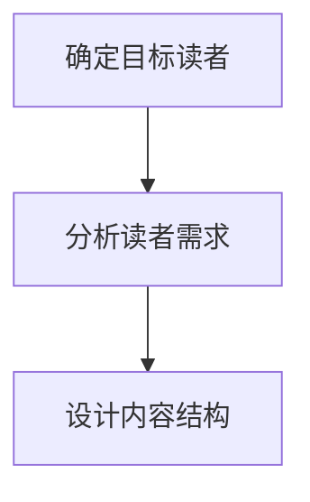
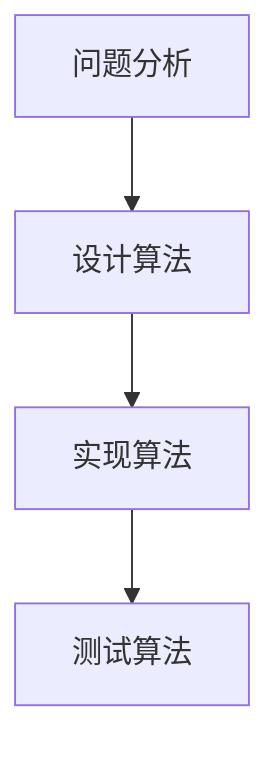
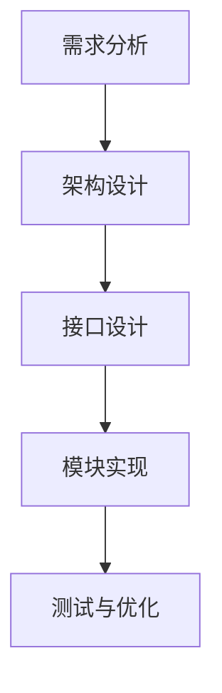

                 

# 技术书籍写作：从读者到作者的转变

## 关键词

技术书籍写作、读者需求、知识结构、图表、代码示例、算法原理、系统架构设计

## 摘要

本文旨在探讨如何从读者角度出发，进行技术书籍的写作，帮助作者实现从读者到作者的转变。通过分析技术书籍写作的基础、理解读者需求、构建合理的知识结构、使用图表和代码示例，以及系统架构设计等方法，本文将提供一套完整的写作方法论，旨在提升作者的技术表达能力，使其能够创作出高质量、易于理解的技术书籍。

### 第1章：技术书籍写作基础

#### 1.1 问题背景

随着信息时代的快速发展，技术领域的知识更新迅速，许多技术专家和从业者都有创作技术书籍的需求。然而，如何将复杂的技术内容有效地传递给读者，使读者能够理解和掌握，是一个亟待解决的问题。技术书籍写作不仅仅是将知识进行简单的堆砌，更需要深入理解读者的需求，以清晰、简洁的语言进行表达。

#### 1.2 问题解决

本书将提供一套完整的写作方法论，包括：

- **内容组织**：如何梳理技术知识，构建合理的知识结构。
- **语言表达**：如何使用通俗易懂的语言，将复杂的技术概念传达给读者。
- **案例教学**：如何通过案例教学，使读者能够更好地理解和应用所学知识。
- **技术写作技巧**：如何使用图表、代码示例等辅助工具，提升书籍的可读性。

#### 1.3 边界与外延

本书主要针对技术书籍的写作，但书中所提到的方法和技巧同样适用于其他类型的技术文献，如论文、报告等。

#### 1.4 核心概念

- **技术书籍写作**：指以技术知识为主要内容，通过文字、图表、代码等形式进行创作的书籍。
- **读者角度**：从读者的需求和认知出发，设计书籍的结构和内容。
- **从读者到作者**：指通过学习和实践，将读者的知识转化为自己的创作能力。

#### 1.5 概念属性特征对比表格

| 概念           | 特征                   |
| -------------- | ---------------------- |
| 技术书籍写作   | 传达技术知识，提升读者理解能力 |
| 读者角度       | 考虑读者需求和认知       |
| 从读者到作者   | 知识转化为创作能力       |

#### 1.6 ER实体关系图架构

```mermaid
erDiagram
  Product ||--|{ Author } : writes
  Author ||--|{ Reader } : reads
```

### 第2章：理解读者需求

#### 2.1 核心概念

- **读者需求**：读者在阅读技术书籍时希望获得的帮助和知识。
- **目标读者**：明确书籍的受众，设计针对性的内容和结构。

#### 2.2 内容结构

- **确定目标读者**：技术新手、中级用户、高级专家。
- **分析读者需求**：根据读者层次，确定所需的知识点和难度。
- **设计内容结构**：根据读者需求，合理安排章节和内容。

#### 2.3 算法原理讲解



### 第3章：构建合理的知识结构

#### 3.1 核心概念

- **知识结构**：书籍内容的知识体系，包括概念、原理、方法等。
- **逻辑关系**：各知识模块之间的联系和互动。

#### 3.2 内容结构

- **梳理知识点**：根据读者需求，梳理出核心知识点。
- **构建逻辑关系**：通过图表、列表等工具，展示知识模块之间的关系。

#### 3.3 算法原理讲解

```python
# 定义知识点列表
knowledge_points = ["计算机基础知识", "编程语言", "数据结构", "算法"]

# 构建知识结构图
def build_knowledge_structure(knowledge_points):
    structure = {}
    for point in knowledge_points:
        structure[point] = []
    
    # 添加逻辑关系
    structure["计算机基础知识"]["编程语言"] = "先掌握基础，再学习编程语言"
    structure["编程语言"]["数据结构"] = "编程语言可用于实现数据结构"
    structure["数据结构"]["算法"] = "数据结构是算法实现的基础"
    
    return structure

# 打印知识结构图
print(build_knowledge_structure(knowledge_points))
```

### 第4章：使用图表和代码示例

#### 4.1 核心概念

- **图表**：通过图形化展示，使复杂概念更加直观。
- **代码示例**：通过实际代码，展示技术原理和应用。

#### 4.2 内容结构

- **选择合适的图表**：根据内容特点选择图表类型，如流程图、类图、时序图等。
- **编写代码示例**：编写具有代表性的代码示例，详细解释每个步骤和功能。

#### 4.3 算法原理讲解



### 第5章：系统架构设计

#### 5.1 核心概念

- **系统架构**：系统的整体结构和组成部分。
- **设计原则**：系统架构设计需要遵循的原则，如高内聚、低耦合等。

#### 5.2 内容结构

- **问题场景介绍**：描述系统要解决的问题和应用场景。
- **系统功能设计**：使用类图描述系统的功能模块和关系。
- **系统架构设计**：使用架构图描述系统的整体架构。
- **系统接口设计**：定义系统各个模块的接口和交互方式。
- **系统交互**：使用时序图描述系统模块之间的交互过程。

#### 5.3 算法原理讲解



### 第6章：项目实战

#### 6.1 环境安装

- **环境配置**：介绍所需的环境和工具安装。
- **实践步骤**：详细描述每个安装步骤和注意事项。

#### 6.2 系统核心实现

- **核心功能实现**：详细描述系统核心功能的实现过程。
- **代码解读与分析**：对关键代码段进行解读和分析。

#### 6.3 实际案例分析和讲解

- **案例场景**：描述一个实际的应用案例。
- **案例分析**：对案例进行详细分析。
- **讲解与剖析**：深入讲解案例中的技术原理和应用。

#### 6.4 项目小结

- **总结**：对项目进行总结，强调关键点。
- **经验教训**：分享项目中的经验教训。

### 第7章：最佳实践与拓展阅读

#### 7.1 最佳实践

- **技巧分享**：分享在实际写作过程中积累的经验和技巧。
- **注意事项**：提醒作者在写作过程中需要注意的问题。

#### 7.2 拓展阅读

- **推荐阅读**：推荐相关书籍、论文和资料。
- **持续学习**：鼓励读者持续学习，不断提升自己的技术能力和写作水平。

### 作者信息

作者：AI天才研究院/AI Genius Institute & 禅与计算机程序设计艺术 /Zen And The Art of Computer Programming

以上是本文的完整内容，希望通过本文的阐述，能够帮助技术爱好者们实现从读者到作者的转变，创作出高质量的技术书籍。让我们共同探索技术世界的奥秘，分享知识的魅力！

