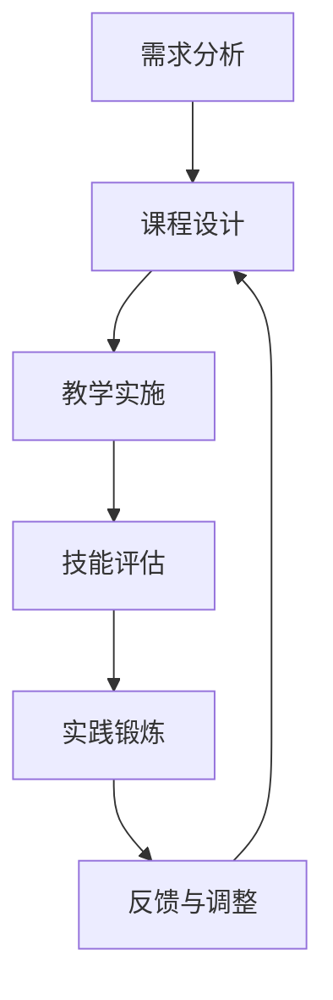

                 

# 技术人才培养的系统方法

## 关键词
技术人才、培养系统、教育策略、心理因素、技术整合、实战案例

## 摘要
本文旨在探讨技术人才培养的系统方法，通过对当前技术人才市场的需求分析、心理和行为学理论的应用、技术整合策略的探讨，以及实际案例的剖析，为读者提供一套全面、实用的技术人才培养指南。文章从背景介绍、核心概念、心理和行为学分析、技术整合策略、系统化培养方法、实战案例等多角度进行深入探讨，旨在帮助教育者和企业更好地培养和挖掘技术人才。

## 目录

### 第1章 背景与重要性

#### 1.1 问题背景
- 技术人才需求的增长与缺口
- 企业对技术人才的需求变化
- 技术变革对人才的影响

#### 1.2 问题描述
- 技术人才培养的现状
- 技术人才培养面临的挑战

#### 1.3 问题解决
- 技术人才培养的系统方法概述

#### 1.4 边界与外延
- 研究范围界定
- 研究内容的限定

#### 1.5 核心概念与要素组成
- 技术人才培养的定义
- 技术人才培养的关键要素

### 第2章 基本概念与理论

#### 2.1 核心理论框架
- 技术人才的定义与分类
- 技术人才培养的理论基础

#### 2.2 核心概念属性特征对比
- 技术能力与技能的区别
- 教育与培训的差异

#### 2.3 ER模型图
- 技术人才模型的构建
- 技术人才培养要素的关系

### 第3章 心理与行为学分析

#### 3.1 心理学理论在人才培养中的应用
- 学习动机理论
- 成长理论

#### 3.2 行为分析及其影响
- 技术人才行为模式
- 企业行为对人才的影响

#### 3.3 案例分析
- 成功案例剖析
- 失败案例反思

### 第4章 技术整合策略

#### 4.1 技术在教育中的应用
- 现代教育技术的发展
- 技术在人才培养中的作用

#### 4.2 技术整合的具体实施
- 教学方法的改革
- 技术工具的选择与应用

#### 4.3 遇到的挑战与解决策略
- 技术整合的难点
- 应对策略与建议

### 第5章 系统化培养方法

#### 5.1 培养过程的步骤
- 培养目标的确立
- 培养路径的设计

#### 5.2 发展过程的mermaid流程图
- 培养过程的可视化展示
- 流程中的关键环节

#### 5.3 算法原理与实现
- 培养算法的基本原理
- Python代码的实现

### 第6章 实战案例

#### 6.1 案例介绍
- 案例选择的背景
- 案例的具体情况

#### 6.2 案例分析
- 案例中的培养策略
- 案例中的技术整合

#### 6.3 案例剖析
- 案例的成功与不足
- 案例的启示

### 第7章 最佳实践与小结

#### 7.1 最佳实践分享
- 成功的实践策略
- 实践中的注意事项

#### 7.2 小结
- 文章的主要观点
- 技术人才培养的系统方法的总结

#### 7.3 注意事项
- 培养过程中可能遇到的问题
- 应对策略与建议

#### 7.4 拓展阅读
- 相关书籍推荐
- 研究方向展望

### 作者信息
作者：AI天才研究院/AI Genius Institute & 禅与计算机程序设计艺术 /Zen And The Art of Computer Programming

# 第1章 背景与重要性

## 1.1 问题背景

在当今快速发展的信息技术时代，技术人才的需求不断增长，而人才缺口也日益明显。根据全球市场研究公司的数据，全球技术人才短缺预计将在2020年达到8500万人的规模，这一趋势在中国尤为显著。随着人工智能、大数据、云计算等技术的蓬勃发展，企业对于技术人才的需求也在不断变化，不仅需要具备扎实的编程技能，还需要具备解决复杂问题的能力和创新思维。

首先，技术人才需求的增长源于技术变革的加速。现代技术的发展速度远超以往，新的技术标准和应用场景不断涌现，这对人才的能力提出了更高的要求。传统的教育和培训模式已经难以满足企业的需求，必须寻找新的培养方法来提升技术人才的素质。

其次，企业对技术人才的需求也在发生变化。过去，企业更注重人才的特定技能，如编程语言、数据库管理等，而现在，企业更看重的是人才的跨学科能力和解决问题的能力。例如，数据分析专家不仅需要掌握数据分析工具，还需要了解业务逻辑和用户需求，这要求培养的人才具备更广泛的知识背景和更强的综合能力。

最后，技术变革对人才的影响也是不可忽视的。随着人工智能的快速发展，许多传统的职业正面临被替代的风险，而新的职业岗位也在不断涌现。这要求人才必须具备快速学习和适应变化的能力，以应对不断变化的工作环境。

## 1.2 问题描述

技术人才培养的现状令人担忧。首先，教育体系的滞后使得学校培养的人才难以满足企业的需求。尽管高校在课程设置和教学内容上做了很多改革，但与市场的需求仍存在较大差距。其次，企业内部的人才培养机制也不尽完善，很多企业过于依赖外部招聘，缺乏系统化的人才培养计划。

技术人才培养面临的主要挑战包括：

1. **教育与市场需求脱节**：高校课程设置和教学内容难以跟上技术发展的步伐，导致毕业生与市场需求的脱节。学生往往在毕业时掌握的技能与实际工作需求不符，需要企业进行再培训。

2. **人才培养体系不完善**：企业缺乏系统化的人才培养体系，培训内容往往侧重于技能培训，而忽视了对员工综合素质和跨学科能力的培养。

3. **人才流失问题**：由于企业内部培养机制的不完善，很多优秀人才容易流失。企业没有给予员工足够的成长空间和发展机会，导致员工感到缺乏动力和归属感。

4. **技术更新速度过快**：技术的快速迭代使得人才培养的周期缩短，企业需要不断更新培训内容，这增加了人才培养的难度和成本。

## 1.3 问题解决

面对上述问题，我们需要采取系统性的方法来培养技术人才。以下是一些可能的解决方案：

1. **改革教育体系**：高校应该加强与企业的合作，共同制定课程设置和教学内容。通过校企合作，高校可以更准确地把握市场需求，调整教学计划，使学生的知识结构更加贴近实际工作需求。

2. **建立企业内部培训体系**：企业应建立系统化、持续性的内部培训体系，不仅包括技术技能的培训，还应注重员工的综合素质和跨学科能力的培养。例如，可以通过内部导师制度、项目制学习和跨部门交流等方式，提升员工的综合能力。

3. **提供成长空间和发展机会**：企业应重视员工的职业发展规划，提供明确的晋升通道和职业发展机会，使员工看到自己的未来和成长空间，从而增强员工的归属感和忠诚度。

4. **关注技术更新与持续学习**：企业应建立持续学习的机制，鼓励员工不断更新知识和技能。可以通过组织技术研讨会、内部分享会、在线学习平台等方式，为员工提供学习和成长的平台。

5. **政府和社会力量的参与**：政府和社会组织应积极参与技术人才培养，通过政策引导、资金支持和资源整合，促进技术人才的培养和发展。

通过上述措施，我们可以逐步建立起一套系统化、多层次的技术人才培养体系，为企业和社会培养出更多高素质的技术人才。

## 1.4 边界与外延

在本文的研究中，我们将对技术人才培养的系统方法进行详细探讨。为了确保研究的深入和系统性，我们需要明确本文的研究范围和内容的限定。

首先，本文的研究范围主要集中在以下几个方面：

1. **技术人才的定义与分类**：本文将探讨技术人才在不同行业和领域中的定义与分类，以明确技术人才所需具备的技能和素质。

2. **教育体系的改革与优化**：本文将分析高校课程设置和教学内容与市场需求之间的差距，并提出具体的改革措施，以提高毕业生的就业竞争力和适应能力。

3. **企业内部培训体系的建设**：本文将探讨企业如何建立系统化、持续性的内部培训体系，以及如何通过内部导师制度、项目制学习和跨部门交流等方式提升员工的综合素质和跨学科能力。

4. **技术更新与持续学习**：本文将探讨企业如何关注技术更新，建立持续学习的机制，并通过组织技术研讨会、内部分享会、在线学习平台等方式为员工提供学习和成长的平台。

其次，本文的内容限定如下：

1. **研究方法**：本文将采用文献综述、案例分析、对比分析等方法，对现有研究进行系统梳理，并结合具体案例进行分析和探讨。

2. **研究对象**：本文的研究对象主要包括高校、企业和社会组织，将重点关注这些机构在技术人才培养方面的实践和经验。

3. **研究深度**：本文将深入探讨技术人才培养的系统方法，包括教育策略、心理和行为学因素、技术整合策略等方面的内容。

4. **研究广度**：本文将结合国内外相关研究，对比分析不同地区和国家的技术人才培养模式，以期为我国技术人才培养提供有益的借鉴和启示。

通过明确本文的研究范围和内容限定，我们可以更有针对性地探讨技术人才培养的系统方法，为企业和教育机构提供实践指导和理论支持。

## 1.5 核心概念与要素组成

在探讨技术人才培养的系统方法之前，我们需要明确几个核心概念和要素，这些概念和要素构成了技术人才培养的基本框架和理论基础。

### 技术人才的定义与分类

首先，我们来看看技术人才的定义。技术人才是指在某一技术领域具备专业知识和技能，能够进行创新性研究和实践，解决复杂技术问题的人才。根据技术领域的不同，技术人才可以划分为多个类别，如软件开发工程师、数据科学家、人工智能专家、网络安全工程师等。

每个类别的人才所需具备的技能和素质有所不同。例如，软件开发工程师需要熟练掌握编程语言、软件设计模式、开发工具等，而数据科学家则需要具备统计学、机器学习、数据库管理等多方面的知识和技能。

### 教育与培训

教育是培养技术人才的基础。高等教育机构在技术人才的培养中扮演着重要角色。高校的课程设置和教学内容直接影响到毕业生的技能和素质。为了满足市场需求，高校应不断调整课程设置，增加实践环节，加强学科交叉融合。

除了传统的课堂教学，培训也是培养技术人才的重要手段。企业内部培训、在线学习平台、技能竞赛等都是有效的培训方式。通过培训，员工可以更新知识、提升技能，以适应技术发展的需求。

### 心理与行为学因素

心理与行为学因素在技术人才培养中同样重要。学习动机、成长心态、团队合作能力等都是影响技术人才成长的重要因素。心理学家提出的学习动机理论，如自我决定理论、目标设定理论等，为培养技术人才提供了理论依据。例如，通过设定明确的目标和提供积极的反馈，可以增强学生的学习动机，促进其学习和成长。

### 技术整合策略

随着技术的快速发展，技术整合策略在技术人才培养中发挥着越来越重要的作用。技术整合不仅涉及技术工具的应用，还包括教学方法、管理模式等多个方面。例如，将人工智能技术应用于教育领域，可以通过智能学习平台、个性化推荐系统等，提高教学效果和学习体验。

### 系统化培养方法

系统化培养方法是技术人才培养的关键。一个完整的培养体系应包括教育、培训、心理辅导、技术整合等多个环节，形成一个闭环系统。通过系统化的培养方法，可以确保技术人才在知识、技能、心理和行为等方面得到全面的发展。

### 综合素质培养

综合素质培养是技术人才培养的重要目标。除了专业技能，技术人才还需要具备良好的沟通能力、团队协作能力、创新思维能力等。这些综合素质的提升，不仅有助于技术人才在职场中的发展，也有助于他们在面对复杂问题时提供更全面的解决方案。

通过明确这些核心概念和要素，我们可以更好地理解技术人才培养的系统方法，为实际操作提供指导。接下来，本文将详细探讨这些核心概念在技术人才培养中的应用和实现方法。

## 第2章 基本概念与理论

在探讨技术人才培养的系统方法之前，我们需要了解几个关键理论框架，这些框架为我们提供了理论基础和分析工具。

### 技术人才的定义与分类

技术人才的定义和分类是理解技术人才培养的首要问题。技术人才通常是指在某一技术领域具备专业知识和技能，能够进行创新性研究和实践，解决复杂技术问题的人才。技术人才可以按不同的标准进行分类：

1. **按领域分类**：如软件开发工程师、数据科学家、人工智能专家、网络安全工程师等。
2. **按技能水平分类**：初级人才、中级人才、高级人才等。
3. **按岗位分类**：研发人员、技术人员、技术经理等。

在技术人才的分类中，不同类型的人才所需具备的技能和素质有所不同。软件开发工程师需要掌握编程语言、软件开发工具、设计模式等，而数据科学家则需要具备数学、统计学、机器学习等多方面的知识。

### 技术人才培养的理论基础

技术人才培养的理论基础主要包括以下几个方面：

1. **能力本位教育理论**：能力本位教育理论强调教育应以培养人的能力为核心，注重学生在实际工作中的应用能力。这种理论指导下，教育内容和方法更加贴近实际工作需求，有助于提升毕业生的就业竞争力。

2. **终身教育理论**：终身教育理论认为教育不应局限于学校阶段，而应贯穿人的一生。随着技术的快速发展，终身教育尤为重要。通过终身学习，技术人才可以不断更新知识和技能，以适应职业发展需求。

3. **学习动机理论**：学习动机理论是探讨个体学习动力来源的理论。常见的动机理论包括自我决定理论、目标设定理论等。在技术人才培养中，了解和学习动机理论有助于激发学生的学习兴趣和积极性，提高学习效果。

4. **社会化学习理论**：社会化学习理论认为学习是个体在与社会互动中实现知识共享和技能提升的过程。在技术人才培养中，社会化学习理论强调通过团队协作、项目实践等方式，促进知识传递和技能提升。

### ER模型图

ER（实体-关系）模型图是用于描述数据实体及其之间关系的图形化工具，常用于数据库设计和信息系统的架构设计。在技术人才培养中，ER模型图可以帮助我们理解人才培养的要素及其相互关系。

以下是一个简化的技术人才培养ER模型图：

```
[
  "实体": [
    "学生",
    "课程",
    "教师",
    "企业",
    "实践项目"
  ],
  "关系": [
    {
      "实体1": "学生",
      "实体2": "课程",
      "关系类型": "学习",
      "描述": "学生通过学习课程获取知识和技能"
    },
    {
      "实体1": "教师",
      "实体2": "课程",
      "关系类型": "授课",
      "描述": "教师通过授课将知识传授给学生"
    },
    {
      "实体1": "学生",
      "实体2": "实践项目",
      "关系类型": "参与",
      "描述": "学生通过参与实践项目提升实际操作能力"
    },
    {
      "实体1": "企业",
      "实体2": "实践项目",
      "关系类型": "提供",
      "描述": "企业提供实践项目，学生通过项目实践积累工作经验"
    }
  ]
]
```

### 核心概念属性特征对比

在技术人才培养中，几个核心概念之间的属性特征对比有助于我们更清晰地理解这些概念之间的关系和作用。以下是技术人才、教育、培训等核心概念的属性特征对比：

1. **技术人才**：
   - **技能**：专业知识和技能，如编程、数据分析等。
   - **素质**：综合素质，如沟通能力、团队协作能力等。
   - **目标**：解决复杂技术问题，推动技术创新。

2. **教育**：
   - **形式**：课堂教学、实验实践等。
   - **内容**：基础知识、专业知识等。
   - **目标**：培养学生的基本素质和技能，为就业和职业发展打下基础。

3. **培训**：
   - **形式**：企业内训、在线培训等。
   - **内容**：专业技能提升、岗位能力培养等。
   - **目标**：提高员工的工作技能和职业素养，满足企业需求。

通过上述对比，我们可以看到，教育和技术培训是技术人才培养的两个重要环节，教育侧重于基础知识的学习和综合素质的培养，而培训则侧重于专业技能的提升和实际操作能力的锻炼。

综上所述，技术人才培养的系统方法需要基于以上核心概念和理论基础，通过科学的设计和实施，确保技术人才在知识、技能、素质等方面得到全面发展。

## 第3章 心理与行为学分析

在技术人才培养的过程中，心理和行为学因素扮演着至关重要的角色。学习动机、成长心态、团队合作能力等都是影响技术人才成长的重要因素。了解和应用这些心理学理论，可以帮助教育者和企业更有效地培养技术人才。

### 3.1 心理学理论在人才培养中的应用

心理学理论在技术人才培养中有着广泛的应用。以下是一些重要的心理学理论：

1. **自我决定理论**：自我决定理论认为，个体的内在动机是影响学习效果的关键因素。在技术人才培养中，教育者和企业可以通过创设有利于自主学习的环境，激发学生的内在动机，如提供明确的目标、鼓励自主探索和自主学习等。

2. **目标设定理论**：目标设定理论指出，设定明确、具体的目标可以显著提高学习效果。在技术人才培养中，教育者和企业可以帮助学生设定短期和长期目标，并通过定期反馈和调整，确保目标的实现。

3. **成长心态理论**：成长心态理论认为，个体对学习过程的认知态度会影响其学习效果。具有成长心态的人相信能力可以通过努力和学习得到提升，因此在面对挑战时更加积极。在教育和技术培训中，培养成长心态可以帮助技术人才更好地应对复杂问题。

4. **团队动力学理论**：团队动力学理论探讨团队内部的动力和互动机制。在技术人才培养中，通过构建良好的团队文化，增强团队成员之间的信任和协作，可以提高团队的整体绩效。

### 3.2 行为分析及其影响

行为分析是心理学研究的重要方法，通过对个体行为的观察和分析，可以揭示行为背后的心理机制。在技术人才培养中，行为分析有助于理解技术人才的行为模式及其对培养过程的影响。

1. **技术学习行为**：技术人才在学习过程中表现出不同的行为模式。例如，一些人才可能表现出较强的自主学习能力，能够主动查找资料、解决问题，而另一些人则可能依赖外部指导和帮助。通过分析这些行为模式，教育者和企业可以制定个性化的培养计划，提升学习效果。

2. **问题解决行为**：技术人才在解决技术问题时，通常需要运用一系列策略和技巧。行为分析可以帮助识别这些策略和技巧，并通过案例教学和模拟训练，提升技术人才的问题解决能力。

3. **团队协作行为**：技术人才的团队合作能力对项目成功至关重要。行为分析可以揭示团队成员在沟通、分工和协作中的行为特点，从而优化团队结构和协作流程，提高团队绩效。

### 3.3 案例分析

为了更好地理解心理和行为学在技术人才培养中的应用，我们可以通过以下案例进行分析：

**案例1：高校课程改革**

某高校在进行课程改革时，引入了自我决定理论和目标设定理论。通过设置明确的学习目标和提供自主学习的资源，学生的内在动机得到了显著提升。同时，通过定期反馈和目标调整，学生的学习效果也得到了显著提高。

**案例2：企业内部培训**

某企业针对员工的技术培训，引入了团队动力学理论。通过构建积极向上的团队文化，增强团队成员之间的信任和协作，企业的整体绩效得到了显著提升。同时，通过行为分析和模拟训练，员工的问题解决能力和团队合作能力也得到了有效提升。

通过这些案例分析，我们可以看到，心理和行为学理论在技术人才培养中的应用，不仅有助于提升学习效果，还可以优化团队协作和问题解决过程，从而提高整体培养质量。

总之，心理与行为学因素在技术人才培养中具有重要作用。通过应用心理学理论，教育者和企业可以更有效地培养技术人才，提高人才培养的质量和效率。

## 第4章 技术整合策略

随着技术的飞速发展，教育领域也在不断变革，新技术在教育中的应用已经成为提升教育质量、促进教育创新的重要手段。技术整合策略的核心在于将现代技术有效融入教育过程中，以提高学习效果和学生的综合素质。以下将详细探讨技术整合在教育中的具体实施方法、面临的挑战及其解决方案。

### 4.1 技术在教育中的应用

技术在教育中的应用可以分为以下几个方面：

1. **数字化教学资源**：随着互联网和云计算技术的发展，数字化教学资源如电子书、在线课程、虚拟实验室等日益丰富。这些资源不仅为学生提供了多样化的学习途径，也大大丰富了教学内容和形式。

2. **在线学习平台**：在线学习平台为学习者提供了灵活的学习时间和地点，使得学习不再受时间和空间的限制。通过在线学习平台，学生可以自主安排学习计划，进行个性化学习，同时教师可以实时监控学生的学习进度和效果。

3. **人工智能辅助教学**：人工智能技术在教育中的应用逐渐普及，如智能辅导系统、自适应学习平台等。这些系统能够根据学生的学习行为和进度，提供个性化的学习建议和资源，帮助学生更高效地学习。

4. **虚拟现实与增强现实**：虚拟现实（VR）和增强现实（AR）技术为教育带来了全新的学习体验。通过VR和AR技术，学生可以身临其境地参与历史事件、科学实验等，从而加深对知识的理解和记忆。

### 4.2 技术整合的具体实施

技术整合的具体实施涉及以下几个方面：

1. **教学方法的改革**：教师应不断探索和尝试新的教学方法，如项目式学习、翻转课堂等，将技术工具和教学目标有机结合，提高教学效果。例如，通过在线平台提供教学视频和资料，学生可以自主学习和复习，教师则可以在课堂上进行讨论和互动。

2. **课程设计**：在课程设计中，应考虑如何将技术工具和教学内容有机结合。例如，在计算机科学课程中，可以引入编程学习平台，让学生进行在线编程练习和项目开发；在历史课程中，可以使用虚拟现实技术，让学生身临其境地体验历史事件。

3. **教师培训**：为了确保技术整合的顺利进行，教师需要接受相关的技术培训，了解和掌握各种技术工具的使用方法。同时，教师应具备将技术工具应用于教学的能力，能够根据教学需求灵活调整和应用技术工具。

4. **学生能力培养**：技术整合不仅是为了提高学习效果，更重要的是培养学生的信息素养和技术能力。在技术整合的过程中，应注重培养学生的批判性思维、创新能力、团队协作能力等综合素质。

### 4.3 遇到的挑战与解决策略

尽管技术整合在教育中具有巨大的潜力，但在实际实施过程中也面临一些挑战：

1. **技术设备不足**：一些学校由于资金和技术条件的限制，缺乏足够的数字化设备和网络基础设施，这影响了技术整合的顺利进行。解决策略是政府和社会组织应加大对教育的投入，提供资金和技术支持，改善学校的教育设施。

2. **教师技术能力不足**：一些教师缺乏使用技术工具的经验，无法有效将技术应用于教学。解决策略是加强对教师的培训，提供专业的技术支持和服务，帮助教师提升技术能力。

3. **学生适应困难**：一些学生可能对新技术不熟悉，适应过程中遇到困难。解决策略是学校应提供必要的技术培训和支持，帮助学生逐步适应新技术。

4. **数据安全和隐私保护**：随着技术整合的推进，学生的个人信息和数据安全问题日益突出。解决策略是加强网络安全教育，建立健全的数据安全管理制度，确保学生个人信息的安全。

总之，技术整合策略在教育中的应用有助于提升教育质量，促进教育创新。通过科学的设计和实施，可以有效克服面临的挑战，实现技术和教育深度融合，为培养高素质的技术人才奠定坚实基础。

## 第5章 系统化培养方法

在技术人才的培养过程中，系统化培养方法是一个关键因素。一个有效的系统化培养方法不仅能够确保技术人才在知识和技能上的全面发展，还能提升其综合素质和创新能力。本章节将详细介绍系统化培养方法的步骤，并通过mermaid流程图和Python代码解释，说明如何实现这一培养过程。

### 5.1 培养过程的步骤

系统化培养方法可以分为以下几个步骤：

1. **需求分析**：首先，进行需求分析，了解技术人才所需的知识和技能，以及市场对技术人才的需求。这一步骤的目的是明确培养的目标和方向。

2. **课程设计**：根据需求分析结果，设计符合培养目标的课程体系。课程设计应涵盖基础知识、专业技能和综合素质培养，确保技术人才在多方面得到全面发展。

3. **教学实施**：按照设计的课程体系进行教学实施。教学过程中，应采用多样化的教学方法，如案例教学、项目制学习、翻转课堂等，以提高教学效果。

4. **技能评估**：在教学过程中，定期对技术人才的技能进行评估，了解其掌握情况，并针对不足进行补充培训。

5. **实践锻炼**：提供实践锻炼机会，如实习、项目开发等，让学生在真实环境中应用所学知识和技能，提升实际操作能力。

6. **反馈与调整**：通过定期反馈，了解教学效果和学生的实际需求，对培养方法进行调整和优化，确保培养目标的实现。

### 5.2 培养过程的mermaid流程图

为了更好地展示系统化培养过程，我们可以使用mermaid流程图进行可视化。以下是一个简化的mermaid流程图示例：



在这个流程图中，每个步骤都是相互关联的，形成一个闭环系统。通过这样的设计，可以确保培养过程的连续性和系统性。

### 5.3 算法原理与Python代码实现

为了更详细地说明系统化培养方法，我们可以将其视为一个算法过程，并使用Python代码进行实现。以下是一个简单的Python算法示例：

```python
# 系统化培养方法算法

def systemized_cultivation():
    # 需求分析
    demand_analysis()

    # 课程设计
    course_design()

    # 教学实施
    teaching_implementation()

    # 技能评估
    skill_evaluation()

    # 实践锻炼
    practical_training()

    # 反馈与调整
    feedback_and_adjustment()

    # 算法结束
    print("系统化培养完成")

# 子函数定义

def demand_analysis():
    print("进行需求分析...")
    # 实现需求分析逻辑

def course_design():
    print("设计课程...")
    # 实现课程设计逻辑

def teaching_implementation():
    print("教学实施...")
    # 实现教学实施逻辑

def skill_evaluation():
    print("进行技能评估...")
    # 实现技能评估逻辑

def practical_training():
    print("实践锻炼...")
    # 实现实践锻炼逻辑

def feedback_and_adjustment():
    print("反馈与调整...")
    # 实现反馈与调整逻辑

# 算法执行
systemized_cultivation()
```

在这个Python代码中，我们定义了一个系统化培养方法的算法，并实现了相应的子函数。通过执行这个算法，可以模拟出系统化培养方法的全过程。

### 数学模型与公式

为了更深入地理解系统化培养方法，我们还可以引入一些数学模型和公式。以下是一个简单的线性回归模型，用于预测技术人才的培养效果：

$$
y = \beta_0 + \beta_1x_1 + \beta_2x_2 + ... + \beta_nx_n + \epsilon
$$

其中，$y$ 表示培养效果，$x_1, x_2, ..., x_n$ 表示影响培养效果的因素（如课程设计、教学实施、技能评估、实践锻炼等），$\beta_0, \beta_1, \beta_2, ..., \beta_n$ 表示这些因素的权重，$\epsilon$ 表示随机误差。

通过这个模型，我们可以分析每个因素对培养效果的影响，并据此调整培养策略，提高培养效果。

### 5.4 算法应用与讲解

为了更直观地展示算法的应用，我们可以通过一个具体案例进行讲解。以下是一个简单的案例，说明如何使用系统化培养方法培养一名软件开发工程师：

1. **需求分析**：首先，对市场需求和软件开发工程师所需的知识和技能进行需求分析，确定培养目标。

2. **课程设计**：根据需求分析结果，设计包含编程语言、软件工程、数据库管理等多个模块的课程体系。

3. **教学实施**：按照课程体系进行教学实施，采用项目制学习和翻转课堂等教学方法，提高学习效果。

4. **技能评估**：定期对学生的编程技能进行评估，根据评估结果调整教学计划和内容。

5. **实践锻炼**：提供软件开发项目，让学生在真实环境中应用所学知识和技能，提升实际操作能力。

6. **反馈与调整**：通过学生和企业的反馈，不断优化培养方法，确保培养目标的实现。

通过这个案例，我们可以看到，系统化培养方法在培养技术人才中的应用，如何通过科学的设计和实施，提高培养效果。

总之，系统化培养方法是技术人才培养的关键。通过明确培养目标、设计合理的课程体系、采用多样化的教学方法、定期评估和反馈，我们可以确保技术人才在知识和技能上得到全面发展。同时，通过引入数学模型和算法，可以进一步优化培养方法，提高培养效果。

## 第6章 实战案例

为了更好地理解技术人才培养的系统方法，我们将在本章节中通过一个具体的实战案例进行详细剖析。本案例将涵盖项目背景、培养策略、具体实施和效果评估等方面，以期对技术人才培养的实际操作提供有价值的参考。

### 6.1 项目背景

某知名互联网公司计划推出一款新型社交应用，该应用需要具备高并发处理能力、强大的数据分析和安全保护功能。为了确保项目的成功，公司决定对开发团队进行系统化的技术人才培养，以提升团队的整体技术能力和创新能力。

### 6.2 培养策略

在项目启动阶段，公司制定了一套详细的培养策略，主要包括以下几个方面：

1. **需求分析**：首先，公司对项目需求进行深入分析，明确技术人才所需具备的知识和技能，包括前端开发、后端开发、数据库管理、数据分析、网络安全等。

2. **课程设计**：根据需求分析结果，设计包含基础课程和进阶课程的培养体系。基础课程涵盖编程语言、数据结构、算法等基础知识，进阶课程则专注于具体的技能培训，如前端框架（如React、Vue.js）、后端框架（如Django、Spring Boot）、大数据处理（如Hadoop、Spark）等。

3. **教学方法**：采用项目制学习和翻转课堂等教学方法，让学生在真实项目中应用所学知识和技能。项目制学习通过实际项目推动学生自主学习和团队合作，而翻转课堂则通过课前自学和课堂讨论，提高学习效果。

4. **技能评估**：在培养过程中，定期对学员的技能进行评估，包括笔试、实操考核和项目评审等。评估结果将作为学员晋升和奖励的依据。

5. **实践锻炼**：提供实际项目参与机会，让学生在真实环境中锻炼和提升技能。公司还邀请外部专家进行技术分享和指导，以拓宽学员的视野。

6. **反馈与调整**：通过学员、导师和项目经理的反馈，不断优化培养策略，确保培养目标的有效实现。

### 6.3 具体实施

在项目实施过程中，公司严格按照培养策略进行操作，具体实施步骤如下：

1. **课程安排**：首先，为学员安排了为期三个月的基础课程培训，涵盖Java编程、数据结构与算法、数据库管理等基础知识。课程采用线上和线下相结合的方式，确保学员能够充分掌握基础知识。

2. **项目启动**：在基础课程结束后，公司启动了一个小型项目，让学员在实际项目中应用所学知识。该项目是一个简单的社交应用，功能包括用户注册、登录、好友关系建立等。

3. **技能提升**：针对学员在项目过程中遇到的困难和问题，公司安排了进阶课程培训，包括前端框架React、后端框架Spring Boot等。通过这些培训，学员的技能水平得到了显著提升。

4. **团队协作**：在项目开发过程中，学员被分为多个小组，每个小组负责不同的模块开发。通过团队合作，学员不仅提高了技能，还学会了如何有效地沟通和协作。

5. **定期评估**：在每个项目阶段，公司都会对学员的技能进行评估，包括笔试、实操考核和项目评审等。评估结果作为学员晋升和奖励的依据。

6. **实战锻炼**：在项目开发过程中，学员还参与了多个实际项目，包括公司内部系统优化、第三方项目开发等。通过这些实战锻炼，学员的技能和经验得到了进一步积累。

### 6.4 效果评估

经过一年的培养，公司的开发团队在技能水平和创新能力上取得了显著提升，具体表现在以下几个方面：

1. **项目交付**：在培养期间，开发团队成功交付了多个项目，包括社交应用、内部管理系统等。项目质量得到了客户的高度认可，为公司带来了良好的经济效益。

2. **技能提升**：通过系统化的培养，学员的技能水平得到了显著提升。根据评估结果，学员在编程、数据库管理、数据分析等方面的能力有了明显的提高。

3. **团队合作能力**：在项目开发过程中，学员的团队合作能力得到了锻炼和提升。通过团队合作，学员学会了如何有效地沟通、分工和协作，提高了项目的完成效率。

4. **创新能力**：通过实战锻炼和专家指导，学员的创新能力得到了激发和提升。在项目开发过程中，学员提出了多个创新性的解决方案，为公司带来了新的技术突破。

5. **员工满意度**：通过系统化的培养，员工对公司的认同感和归属感得到了提升，员工满意度显著提高。

综上所述，该实战案例充分展示了技术人才培养的系统方法的实际应用效果。通过科学的需求分析、课程设计、教学方法、技能评估、实践锻炼和反馈调整，公司成功培养了一支高素质的软件开发团队，为公司的长远发展奠定了坚实基础。

## 第7章 最佳实践与小结

在技术人才培养的过程中，最佳实践和总结能够为教育者和企业提供宝贵的经验，有助于提升人才培养的效果和效率。以下是一些关键的最佳实践、小结、注意事项以及拓展阅读建议。

### 最佳实践

1. **需求导向**：培养策略应紧密围绕市场需求进行设计，确保培养的人才具备企业所需的技能和素质。定期与行业专家和用人企业进行沟通，了解最新的技术趋势和人才需求。

2. **课程设置多样化**：课程设置应涵盖基础知识、专业技能和综合素质培养，采用多样化的教学方法，如项目制学习、翻转课堂、在线学习等，以满足不同学习者的需求。

3. **实践机会**：提供丰富的实践机会，如实习、项目开发、竞赛等，让学生在真实环境中应用所学知识和技能，提升实际操作能力。

4. **个性化培养**：针对不同学员的特点和需求，制定个性化的培养计划，提供定制化的培训内容和资源，确保每位学员都能得到充分的发展。

5. **持续学习机制**：建立持续学习的机制，鼓励员工不断更新知识和技能，通过定期培训、技术分享会、在线学习平台等方式，提升整体团队的技术水平和创新能力。

### 小结

技术人才培养的系统方法强调从需求分析、课程设计、教学方法、实践机会、个性化培养到持续学习机制的全方位考虑。通过科学的设计和实施，可以有效提升技术人才的综合素质和创新能力，满足企业和市场的需求。

### 注意事项

1. **重视基础**：在培养过程中，不要忽视基础知识的学习和巩固，基础知识的扎实程度直接影响技术人才的长远发展。

2. **关注心理健康**：培养过程中应关注学员的心理健康，通过心理辅导和团队建设活动，提升学员的心理素质和抗压能力。

3. **加强校企合作**：加强与企业的合作，通过校企联合培养、实习实践等途径，提高人才的实践能力和职业素养。

4. **持续跟踪与反馈**：培养过程中要定期跟踪学员的进步情况，及时给予反馈和指导，确保培养目标的实现。

### 拓展阅读

1. **《人工智能：一种现代的方法》**：作者：Stuart Russell & Peter Norvig
   - 该书详细介绍了人工智能的基本概念、技术方法和应用场景，是学习人工智能的入门经典。

2. **《深度学习》**：作者：Ian Goodfellow、Yoshua Bengio & Aaron Courville
   - 本书系统地介绍了深度学习的理论、算法和应用，是深度学习领域的权威著作。

3. **《编程思维》**：作者：Jeffrey C. Wayne
   - 本书通过生动有趣的故事和实例，阐述了编程思维的核心概念和培养方法，适合初学者阅读。

4. **《人月神话》**：作者：Frederick P. Brooks Jr.
   - 本书从软件工程的角度探讨了项目管理、团队合作和技术创新等问题，对技术人才培养具有重要启示。

通过以上最佳实践、小结、注意事项和拓展阅读，我们可以更全面地理解技术人才培养的系统方法，为实际操作提供有益的参考。希望这些内容能够帮助教育者和企业更好地培养和挖掘技术人才，推动我国信息技术产业的持续发展。

### 作者信息

作者：AI天才研究院/AI Genius Institute & 禅与计算机程序设计艺术 /Zen And The Art of Computer Programming

