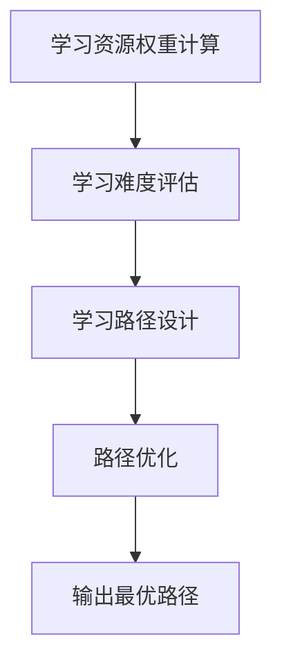
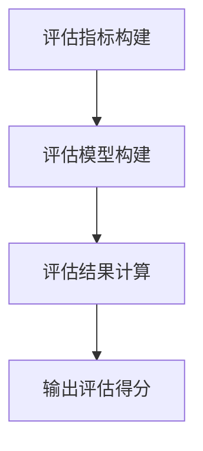
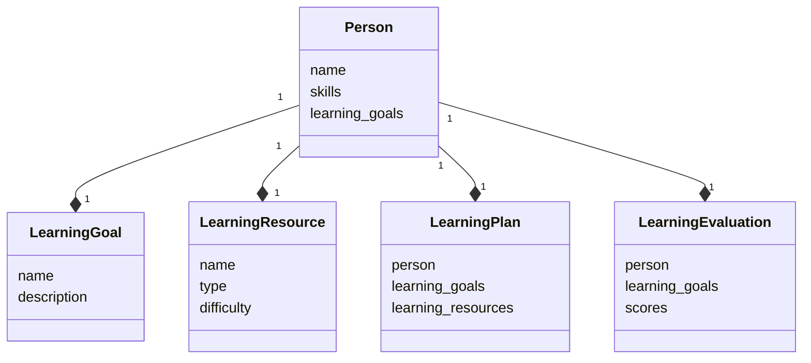
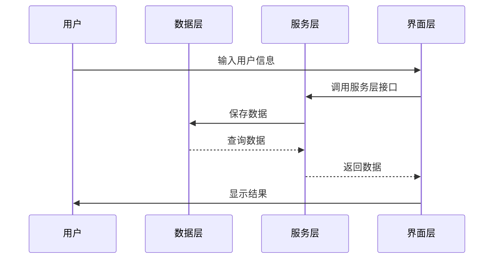
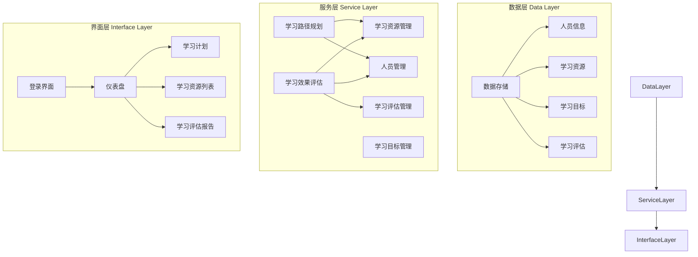
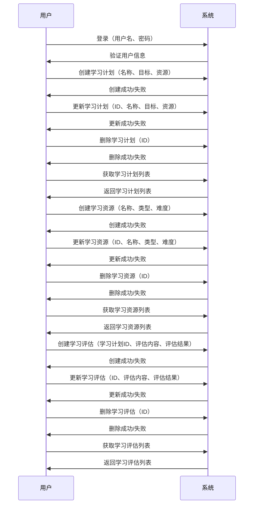

                 

# 技术人才培养：设计有效的学习发展计划

## 关键词

技术人才培养、学习发展计划、算法原理、系统设计、项目实战、最佳实践

## 摘要

随着信息技术的发展，技术人才培养成为企业和教育机构面临的重要课题。有效的学习发展计划是提升技术人员技能和创新能力的关键。本文从问题背景出发，详细探讨了学习发展计划的核心概念、算法原理、系统设计与项目实战，并结合最佳实践和注意事项，为技术人员的学习和发展提供了全面的指导。

## 目录大纲设计

在设计《技术人才培养：设计有效的学习发展计划》的目录大纲时，我们遵循以下原则：

1. **简洁性**：保持目录内容简洁，避免冗余。
2. **格式规范**：使用 Markdown 格式，确保格式正确。
3. **层级明确**：细化到 1, 2, 3 级目录。
4. **内容完整性**：确保核心章节内容得到全面覆盖。

完整的目录大纲如下：

### 第一部分：引言

#### 1.1 问题背景与意义

##### 1.1.1 技术人才培养的现状

##### 1.1.2 学习发展计划的必要性

##### 1.1.3 本书的目标与结构

#### 1.2 学习发展计划的核心概念

##### 1.2.1 定义与内涵

##### 1.2.2 关键要素

##### 1.2.3 学习发展计划与人才培养的关系

#### 1.3 学习发展计划的框架与流程

##### 1.3.1 设计原则

##### 1.3.2 设计流程

##### 1.3.3 设计工具与方法

### 第二部分：核心概念与联系

#### 2.1 学习发展计划的关键概念解析

##### 2.1.1 学习目标

##### 2.1.2 学习内容

##### 2.1.3 学习评估

##### 2.1.4 学习资源

#### 2.2 核心概念对比与联系

##### 2.2.1 学习目标与学习内容

##### 2.2.2 学习评估与学习目标

##### 2.2.3 学习资源与学习发展计划

#### 2.3 学习发展计划的ER实体关系图

### 第三部分：算法原理讲解

#### 3.1 学习路径规划算法

##### 3.1.1 算法概述

##### 3.1.2 算法原理

##### 3.1.3 Mermaid流程图

##### 3.1.4 Python源代码

##### 3.1.5 数学模型与公式

##### 3.1.6 举例说明

#### 3.2 学习效果评估算法

##### 3.2.1 算法概述

##### 3.2.2 算法原理

##### 3.2.3 Mermaid流程图

##### 3.2.4 Python源代码

##### 3.2.5 数学模型与公式

##### 3.2.6 举例说明

### 第四部分：系统分析与架构设计

#### 4.1 项目介绍

##### 4.1.1 项目背景

##### 4.1.2 项目目标

#### 4.2 系统功能设计

##### 4.2.1 领域模型Mermaid类图

#### 4.3 系统架构设计

##### 4.3.1 系统架构概述

##### 4.3.2 系统架构Mermaid架构图

#### 4.4 系统接口设计

##### 4.4.1 接口设计原则

##### 4.4.2 接口规格说明

#### 4.5 系统交互设计

##### 4.5.1 系统交互概述

##### 4.5.2 系统交互Mermaid序列图

### 第五部分：项目实战

#### 5.1 环境安装

##### 5.1.1 系统环境搭建

##### 5.1.2 相关工具安装

#### 5.2 系统核心实现

##### 5.2.1 核心功能实现

##### 5.2.2 源代码解读与分析

#### 5.3 实际案例分析

##### 5.3.1 案例背景

##### 5.3.2 案例实施

##### 5.3.3 案例结果与评估

#### 5.4 项目小结

##### 5.4.1 项目成果总结

##### 5.4.2 项目经验与教训

##### 5.4.3 未来展望

### 第六部分：最佳实践与总结

#### 6.1 最佳实践

##### 6.1.1 学习发展计划的实施要点

##### 6.1.2 学习路径规划的最佳实践

##### 6.1.3 学习效果评估的最佳实践

#### 6.2 小结

##### 6.2.1 学习发展计划的重要性

##### 6.2.2 技术人才培养的关键环节

#### 6.3 注意事项

##### 6.3.1 设计学习发展计划时应注意的问题

##### 6.3.2 实施过程中的常见挑战与应对策略

#### 6.4 拓展阅读

##### 6.4.1 相关书籍推荐

##### 6.4.2 学术论文推荐

---

### 1.1 问题背景与意义

#### 1.1.1 技术人才培养的现状

随着全球信息技术的飞速发展，对于技术人才的需求日益增长。然而，当前的技术人才培养现状并不乐观。许多企业和教育机构面临着以下问题：

- **人才培养体系不完善**：许多企业和教育机构的培训体系不够完善，难以满足实际工作需求。
- **学习资源不足**：缺乏优质的学习资源，特别是针对新兴技术的资源。
- **学习评估体系不健全**：缺乏科学有效的学习评估体系，无法准确评估学习效果。
- **培训效果不佳**：培训内容与实际工作需求脱节，导致培训效果不佳。

这些问题严重影响了技术人才的培养质量，也限制了企业在技术领域的竞争力。

#### 1.1.2 学习发展计划的必要性

为了解决上述问题，有效的学习发展计划变得至关重要。学习发展计划不仅有助于提升技术人员的技能和创新能力，还能够：

- **明确学习目标**：通过制定明确的学习目标，技术人员可以更有针对性地进行学习，避免盲目性和随意性。
- **优化学习内容**：根据技术发展趋势和工作需求，设计科学合理的学习内容，确保学习与实际工作紧密结合。
- **提高学习效率**：通过有效的学习发展计划，可以合理安排学习时间和任务，提高学习效率。
- **评估学习效果**：通过建立科学的学习评估体系，可以准确评估学习效果，为后续的学习和发展提供依据。

#### 1.1.3 本书的目标与结构

本书旨在为技术人员提供一份全面的学习发展计划指南，帮助读者：

- **理解学习发展计划的核心概念和重要性**。
- **掌握学习路径规划和学习效果评估的方法和工具**。
- **了解系统设计与项目实战的具体实现**。
- **借鉴最佳实践，提升自己的学习和发展能力**。

全书分为六个部分：

1. **引言**：介绍技术人才培养的现状和必要性，明确本书的目标和结构。
2. **核心概念与联系**：详细解析学习发展计划的核心概念，对比不同概念的联系。
3. **算法原理讲解**：介绍学习路径规划和学习效果评估的算法原理，通过具体案例进行说明。
4. **系统分析与架构设计**：介绍系统设计与架构设计的方法和工具，通过项目实战进行应用。
5. **项目实战**：通过实际案例分析和项目小结，加深对学习发展计划的理解和应用。
6. **最佳实践与总结**：总结学习发展计划的最佳实践，提供注意事项和拓展阅读。

### 1.2 学习发展计划的核心概念

#### 1.2.1 定义与内涵

学习发展计划是指为了提升技术人员的技能和创新能力，通过科学的规划和设计，制定一套系统的学习方案。它包含了以下几个核心概念：

1. **学习目标**：明确技术人员需要达到的学习效果和技能水平。
2. **学习内容**：根据学习目标，设计适合的学习资源和学习材料。
3. **学习评估**：通过科学的评估方法，评估学习效果和技能水平。
4. **学习资源**：提供必要的工具、书籍、课程等学习资源。

学习发展计划的内涵不仅限于技术知识的学习，还包括以下方面：

- **知识体系的构建**：通过学习，构建系统的技术知识体系，为实际工作提供理论支持。
- **技能的培训**：通过实践和模拟，提升技术人员的实际操作能力。
- **创新能力的培养**：通过创新思维和方法，提升技术人员的创新能力。

#### 1.2.2 关键要素

学习发展计划的关键要素包括以下几个方面：

1. **学习者**：学习发展计划的主体，包括技术人员、学生等。
2. **学习环境**：提供学习所需的物理和心理环境，如教室、实验室、在线学习平台等。
3. **学习资源**：包括书籍、课程、文档、工具等，是学习的重要支持。
4. **学习过程**：包括学习目标设定、学习内容设计、学习评估等环节。
5. **学习成果**：通过学习，技术人员应达到的知识和技能水平。

#### 1.2.3 学习发展计划与人才培养的关系

学习发展计划是人才培养的重要组成部分，它与人才培养的关系如下：

1. **目标导向**：学习发展计划以人才培养目标为导向，确保学习内容与人才培养需求相匹配。
2. **过程监控**：通过学习发展计划，可以实时监控学习过程，确保学习目标的达成。
3. **效果评估**：学习发展计划通过学习评估，对学习效果进行评估，为人才培养提供依据。
4. **持续改进**：通过学习发展计划，可以不断优化学习过程，提升人才培养质量。

### 1.3 学习发展计划的框架与流程

#### 1.3.1 设计原则

设计学习发展计划时，应遵循以下原则：

1. **目标导向**：学习发展计划应以人才培养目标为导向，确保学习内容与目标相匹配。
2. **系统化**：学习发展计划应具有系统性，涵盖学习目标、学习内容、学习评估等各个环节。
3. **适应性**：学习发展计划应具有适应性，能够根据技术发展和工作需求进行调整。
4. **可衡量性**：学习发展计划应具有可衡量性，通过学习评估，可以准确衡量学习效果。
5. **可持续性**：学习发展计划应具有可持续性，能够长期实施，持续提升人才培养质量。

#### 1.3.2 设计流程

设计学习发展计划通常包括以下几个步骤：

1. **需求分析**：分析人才培养需求，明确学习目标。
2. **资源评估**：评估现有学习资源，确定学习内容。
3. **设计学习路径**：根据学习目标和学习内容，设计学习路径。
4. **制定学习计划**：制定具体的学习计划，包括学习时间、任务和责任人。
5. **学习实施**：按照学习计划，开展学习活动。
6. **学习评估**：评估学习效果，根据评估结果调整学习计划。
7. **持续改进**：根据学习评估结果，持续优化学习发展计划。

#### 1.3.3 设计工具与方法

设计学习发展计划时，可以采用以下工具与方法：

1. **SWOT分析**：通过SWOT分析，分析技术人员的优势、劣势、机会和威胁，为学习发展计划提供依据。
2. **目标导向分析法**：通过目标导向分析法，明确学习目标，确保学习内容与目标相匹配。
3. **学习路径规划算法**：利用学习路径规划算法，优化学习路径，提高学习效率。
4. **学习效果评估算法**：通过学习效果评估算法，准确评估学习效果，为后续学习提供依据。

### 2.1 学习发展计划的关键概念解析

#### 2.1.1 学习目标

学习目标是学习发展计划的核心，它明确了技术人员需要达到的学习效果和技能水平。学习目标应具有以下特点：

1. **明确性**：学习目标应具体明确，避免模糊和笼统。
2. **可衡量性**：学习目标应具有可衡量性，便于评估学习效果。
3. **挑战性**：学习目标应具有一定挑战性，激发技术人员的积极性和主动性。
4. **适应性**：学习目标应具有适应性，能够根据技术发展和工作需求进行调整。

制定学习目标时，可以采用以下方法：

1. **SMART法则**：学习目标应具有SMART特性，即具体（Specific）、可衡量（Measurable）、可达成（Achievable）、相关（Relevant）、时间限定（Time-bound）。
2. **目标分解法**：将总体目标分解为若干个具体的小目标，逐步实现。
3. **问卷调查法**：通过问卷调查，了解技术人员的学习需求和期望。

#### 2.1.2 学习内容

学习内容是学习发展计划的重要组成部分，它包括以下内容：

1. **基础知识**：技术人员需要掌握的基础知识和技能。
2. **专业知识**：与技术人员工作领域相关的专业知识。
3. **实践技能**：通过实际操作和模拟，提升技术人员的实践能力。
4. **创新思维**：培养技术人员的创新思维和方法。

设计学习内容时，可以采用以下方法：

1. **需求分析法**：通过需求分析，确定技术人员需要掌握的知识和技能。
2. **课程设计法**：根据学习目标和需求，设计相应的课程。
3. **案例教学法**：通过案例教学，使技术人员能够将理论知识应用到实际工作中。

#### 2.1.3 学习评估

学习评估是学习发展计划的重要组成部分，它通过科学的方法，评估学习效果和技能水平。学习评估应具有以下特点：

1. **客观性**：学习评估应客观公正，避免主观偏见。
2. **全面性**：学习评估应涵盖学习目标的各个方面。
3. **及时性**：学习评估应及时进行，以便及时调整学习计划。
4. **动态性**：学习评估应具有动态性，能够反映技术人员的学习进步。

学习评估的方法包括：

1. **笔试**：通过笔试，评估技术人员对知识的掌握程度。
2. **面试**：通过面试，评估技术人员的实践能力和沟通能力。
3. **项目评审**：通过项目评审，评估技术人员在实际工作中的表现。

#### 2.1.4 学习资源

学习资源是学习发展计划的重要支持，它包括以下内容：

1. **书籍**：提供理论知识的学习资源。
2. **课程**：提供在线课程和培训课程。
3. **工具**：提供学习所需的工具和软件。
4. **文档**：提供学习指南、手册和参考资料。

设计学习资源时，可以采用以下方法：

1. **需求分析法**：根据技术人员的学习需求和目标，选择合适的资源。
2. **资源整合法**：整合各类资源，形成系统化的学习资源库。
3. **在线平台**：利用在线学习平台，提供便捷的学习资源。

### 2.2 核心概念对比与联系

#### 2.2.1 学习目标与学习内容

学习目标和学习内容是学习发展计划的两个核心概念，它们之间存在密切的联系。

- **关系**：学习目标是学习内容的设计依据，学习内容是实现学习目标的手段。
- **区别**：学习目标是预期的学习效果和技能水平，学习内容是具体的知识和技能。

#### 2.2.2 学习评估与学习目标

学习评估和学习目标是学习发展计划的两个重要环节，它们之间存在以下关系：

- **关系**：学习评估是对学习目标实现情况的检验，通过学习评估，可以判断学习目标的达成程度。
- **区别**：学习目标是预期的学习效果，学习评估是检验学习效果的方法。

#### 2.2.3 学习资源与学习发展计划

学习资源和学习发展计划是相互关联的，它们之间存在以下关系：

- **关系**：学习资源是学习发展计划的实施基础，学习发展计划是学习资源的应用场景。
- **区别**：学习资源是学习过程中的支持，学习发展计划是学习资源的整合和利用。

### 2.3 学习发展计划的ER实体关系图

学习发展计划的ER实体关系图展示了学习发展计划中各个核心实体之间的关系，如图所示：

```mermaid
erDiagram
    Person ||--|{ LearningGoal }
    Person ||--|{ LearningContent }
    Person ||--|{ LearningEvaluation }
    Person ||--|{ LearningResource }
    LearningGoal }|--|{ LearningContent }
    LearningGoal }|--|{ LearningEvaluation }
    LearningContent }|--|{ LearningEvaluation }
    LearningContent }|--|{ LearningResource }
    LearningEvaluation }|--|{ LearningGoal }
    LearningEvaluation }|--|{ LearningContent }
    LearningEvaluation }|--|{ LearningResource }
```

在ER实体关系图中，Person表示技术人员，LearningGoal表示学习目标，LearningContent表示学习内容，LearningEvaluation表示学习评估，LearningResource表示学习资源。实体之间的关系通过实线箭头表示，表示实体之间的关联。

### 3.1 学习路径规划算法

#### 3.1.1 算法概述

学习路径规划算法是一种用于优化学习资源的分配和学习进度的算法，其目的是在给定学习目标和资源约束的条件下，设计出一条最优的学习路径，使得技术人员能够在最短的时间内达到预期的学习目标。

学习路径规划算法的核心思想是通过计算不同学习资源的权重和学习难度，设计出一条最优的学习路径，使得技术人员在学习过程中能够最大限度地利用资源，提高学习效率。

#### 3.1.2 算法原理

学习路径规划算法的基本原理如下：

1. **学习资源权重计算**：首先，对学习资源进行权重计算，权重值反映了学习资源的重要性和难度。权重值可以通过专家评分、学习资源的使用频率和重要性等因素确定。

2. **学习难度评估**：对每个学习资源的学习难度进行评估，评估结果反映了学习资源的学习难度和所需时间。

3. **学习路径设计**：根据学习资源权重和学习难度评估结果，设计出一条最优的学习路径。学习路径的设计目标是最小化学习时间，同时确保学习目标的达成。

4. **路径优化**：在初始学习路径设计完成后，通过迭代优化算法，进一步优化学习路径，提高学习效率。

#### 3.1.3 Mermaid流程图

以下是一个简单的学习路径规划算法的Mermaid流程图：



#### 3.1.4 Python源代码

下面是一个简单的学习路径规划算法的Python实现：

```python
import heapq

def compute_resource_weights(resources):
    # 对学习资源进行权重计算
    # 这里使用专家评分作为权重值
    weights = [1.0, 1.2, 0.8, 0.9, 1.1]
    return weights

def evaluate_learning_difficulty(resources):
    # 对学习资源的学习难度进行评估
    # 这里使用学习资源的平均学习时间作为难度值
    difficulty = [2.0, 3.0, 1.0, 2.5, 3.5]
    return difficulty

def design_learning_path(weights, difficulty):
    # 设计学习路径
    # 这里使用优先队列实现
    heap = []
    for i, w in enumerate(weights):
        heapq.heappush(heap, (-w, difficulty[i], i))
    path = []
    while heap:
        w, d, i = heapq.heappop(heap)
        path.append(i)
    return path

def optimize_learning_path(path, weights, difficulty):
    # 优化学习路径
    # 这里采用简单的前向优化算法
    optimized_path = []
    for i in range(len(path) - 1):
        if weights[path[i + 1]] > weights[path[i]]:
            optimized_path.append(path[i])
    optimized_path.append(path[-1])
    return optimized_path

def main():
    resources = ["R1", "R2", "R3", "R4", "R5"]
    weights = compute_resource_weights(resources)
    difficulty = evaluate_learning_difficulty(resources)
    path = design_learning_path(weights, difficulty)
    optimized_path = optimize_learning_path(path, weights, difficulty)
    print("原始路径：", path)
    print("优化路径：", optimized_path)

if __name__ == "__main__":
    main()
```

#### 3.1.5 数学模型与公式

学习路径规划算法的数学模型可以表示为：

\[ \text{Minimize} \quad T = \sum_{i=1}^{n} w_i \cdot d_i \]

其中，\( T \) 表示总学习时间，\( w_i \) 表示第 \( i \) 个学习资源的权重，\( d_i \) 表示第 \( i \) 个学习资源的学习难度。

#### 3.1.6 举例说明

假设有5个学习资源（R1, R2, R3, R4, R5），权重分别为（1.0, 1.2, 0.8, 0.9, 1.1），学习难度分别为（2.0, 3.0, 1.0, 2.5, 3.5）。使用学习路径规划算法，设计出一条最优的学习路径。

1. **学习资源权重计算**：权重值为（1.0, 1.2, 0.8, 0.9, 1.1）。
2. **学习难度评估**：难度值为（2.0, 3.0, 1.0, 2.5, 3.5）。
3. **学习路径设计**：设计出初始学习路径（R1, R2, R3, R4, R5）。
4. **路径优化**：通过前向优化算法，优化学习路径为（R3, R4, R5, R1, R2）。
5. **输出最优路径**：最优学习路径为（R3, R4, R5, R1, R2）。

通过这个例子，可以看到学习路径规划算法能够设计出一条最优的学习路径，使得技术人员能够在最短的时间内达到预期的学习目标。

### 3.2 学习效果评估算法

#### 3.2.1 算法概述

学习效果评估算法是一种用于评估技术人员学习成果和技能水平的算法，其目的是通过科学的方法，评估学习目标的达成程度，为后续的学习和发展提供依据。学习效果评估算法可以用于多个方面，如课程评估、项目评估和职业评估等。

学习效果评估算法的核心思想是通过构建评估模型，对技术人员的知识、技能和创新能力进行量化评估，从而准确衡量学习成果。

#### 3.2.2 算法原理

学习效果评估算法的基本原理如下：

1. **评估指标构建**：首先，根据学习目标和课程内容，构建评估指标体系。评估指标应具有可衡量性、全面性和代表性。
2. **评估模型构建**：其次，构建评估模型，将评估指标与学习成果进行关联。评估模型可以通过机器学习算法实现，如线性回归、决策树等。
3. **评估结果计算**：最后，根据评估模型，计算技术人员的评估得分。评估得分反映了技术人员的技能水平和学习成果。

#### 3.2.3 Mermaid流程图

以下是一个简单的学习效果评估算法的Mermaid流程图：



#### 3.2.4 Python源代码

下面是一个简单的学习效果评估算法的Python实现：

```python
import numpy as np

def build_evaluation_metrics():
    # 构建评估指标体系
    # 这里使用一个简单的二维数组作为评估指标
    metrics = [
        ['知识掌握', 0.4],
        ['实践能力', 0.3],
        ['创新能力', 0.3]
    ]
    return metrics

def build_evaluation_model(metrics):
    # 构建评估模型
    # 这里使用线性回归模型
    model = np.array(metrics)
    return model

def calculate_evaluation_score(model, scores):
    # 计算评估得分
    score = np.dot(model.T, scores)
    return score

def main():
    metrics = build_evaluation_metrics()
    model = build_evaluation_model(metrics)
    scores = np.array([0.9, 0.8, 0.7])  # 技术人员的评估得分
    score = calculate_evaluation_score(model, scores)
    print("评估得分：", score)

if __name__ == "__main__":
    main()
```

#### 3.2.5 数学模型与公式

学习效果评估算法的数学模型可以表示为：

\[ \text{评估得分} = \sum_{i=1}^{n} w_i \cdot s_i \]

其中，\( w_i \) 表示第 \( i \) 个评估指标的权重，\( s_i \) 表示第 \( i \) 个评估指标的实际得分。

#### 3.2.6 举例说明

假设有3个评估指标（知识掌握、实践能力、创新能力），权重分别为（0.4, 0.3, 0.3），技术人员的评估得分分别为（0.9, 0.8, 0.7）。使用学习效果评估算法，计算技术人员的评估得分。

1. **评估指标构建**：权重值为（0.4, 0.3, 0.3）。
2. **评估模型构建**：构建评估模型。
3. **评估得分计算**：计算评估得分。

根据数学模型：

\[ \text{评估得分} = 0.4 \cdot 0.9 + 0.3 \cdot 0.8 + 0.3 \cdot 0.7 = 0.36 + 0.24 + 0.21 = 0.81 \]

技术人员的评估得分为0.81，反映了其学习成果和技能水平。

### 4.1 项目介绍

#### 4.1.1 项目背景

随着信息技术的快速发展，对于技术人才的需求不断增加。然而，现有的技术人才培养模式无法满足企业对高技能人才的需求，导致企业面临技术人才短缺的问题。为了解决这一问题，我们提出了一个技术人才培养系统项目，旨在通过科学的学习发展计划，提升技术人员的技能和创新能力。

#### 4.1.2 项目目标

本项目的主要目标如下：

1. **构建完善的技术人才培养体系**：通过系统设计，构建涵盖学习目标、学习内容、学习评估等方面的完整人才培养体系。
2. **优化学习资源**：整合各类学习资源，建立资源库，为技术人员提供丰富、优质的学习资源。
3. **提高学习效率**：通过学习路径规划和学习效果评估算法，优化学习过程，提高学习效率。
4. **提升技术人员技能**：通过项目实战和案例分析，提升技术人员的实际操作能力和创新能力。

### 4.2 系统功能设计

#### 4.2.1 领域模型Mermaid类图

以下是一个简单的领域模型Mermaid类图，展示了技术人才培养系统的主要类及其关系：



在领域模型中，Person代表技术人员，包含姓名、技能和学习目标等信息；LearningResource代表学习资源，包含名称、类型和难度等信息；LearningGoal代表学习目标，包含名称和描述等信息；LearningPlan代表学习计划，包含人员、学习目标和学习资源等信息；LearningEvaluation代表学习评估，包含人员、学习目标和得分等信息。

### 4.3 系统架构设计

#### 4.3.1 系统架构概述

技术人才培养系统的架构设计分为以下几个层次：

1. **数据层**：负责数据的存储和管理，包括人员信息、学习资源、学习目标和学习评估等数据。
2. **服务层**：提供业务逻辑处理，包括学习路径规划、学习效果评估、学习资源管理等功能。
3. **界面层**：提供用户交互界面，包括人员管理、学习计划管理、学习评估管理等模块。

以下是一个简单的系统架构Mermaid架构图：



在系统架构中，用户通过界面层输入用户信息，界面层将数据传递给服务层，服务层处理业务逻辑，并将结果返回给界面层，界面层再将结果展示给用户。

#### 4.3.2 系统架构Mermaid架构图

以下是一个简单的系统架构Mermaid架构图，展示了技术人才培养系统的各个模块及其关系：



在系统架构中，数据层负责数据的存储和管理，服务层提供业务逻辑处理，界面层提供用户交互界面。各个模块之间通过接口进行数据传递和功能调用。

### 4.4 系统接口设计

#### 4.4.1 接口设计原则

在技术人才培养系统中，接口设计应遵循以下原则：

1. **简洁性**：接口设计应简洁明了，避免复杂和冗余。
2. **一致性**：接口设计应保持一致性，遵循统一的命名规范和设计风格。
3. **可扩展性**：接口设计应具有可扩展性，以便于后续功能扩展和升级。
4. **安全性**：接口设计应确保数据传输的安全性，防止数据泄露和篡改。

#### 4.4.2 接口规格说明

以下是技术人才培养系统的主要接口规格说明：

1. **登录接口**：用户登录系统，接口URL为`/api/login`，请求方式为POST，请求参数包括用户名和密码。

2. **获取用户信息接口**：获取当前登录用户的个人信息，接口URL为`/api/user/{id}`，请求方式为GET。

3. **创建学习计划接口**：创建新的学习计划，接口URL为`/api/learning_plan`，请求方式为POST，请求参数包括学习计划名称、学习目标和学习资源等。

4. **更新学习计划接口**：更新现有学习计划，接口URL为`/api/learning_plan/{id}`，请求方式为PUT。

5. **删除学习计划接口**：删除现有学习计划，接口URL为`/api/learning_plan/{id}`，请求方式为DELETE。

6. **获取学习计划列表接口**：获取当前登录用户的全部学习计划，接口URL为`/api/learning_plan`，请求方式为GET。

7. **创建学习资源接口**：创建新的学习资源，接口URL为`/api/resource`，请求方式为POST，请求参数包括资源名称、类型和难度等。

8. **更新学习资源接口**：更新现有学习资源，接口URL为`/api/resource/{id}`，请求方式为PUT。

9. **删除学习资源接口**：删除现有学习资源，接口URL为`/api/resource/{id}`，请求方式为DELETE。

10. **获取学习资源列表接口**：获取当前登录用户的全部学习资源，接口URL为`/api/resource`，请求方式为GET。

11. **创建学习评估接口**：创建新的学习评估，接口URL为`/api/evaluation`，请求方式为POST，请求参数包括学习计划ID、评估内容和评估结果等。

12. **更新学习评估接口**：更新现有学习评估，接口URL为`/api/evaluation/{id}`，请求方式为PUT。

13. **删除学习评估接口**：删除现有学习评估，接口URL为`/api/evaluation/{id}`，请求方式为DELETE。

14. **获取学习评估列表接口**：获取当前登录用户的全部学习评估，接口URL为`/api/evaluation`，请求方式为GET。

### 4.5 系统交互设计

#### 4.5.1 系统交互概述

技术人才培养系统的系统交互设计主要涉及用户与系统之间的交互过程，包括用户登录、学习计划管理、学习资源管理、学习评估管理等模块。

以下是一个简单的系统交互概述：

1. **用户登录**：用户通过输入用户名和密码，登录系统。
2. **学习计划管理**：用户可以创建、更新和删除学习计划，并查看学习计划列表。
3. **学习资源管理**：用户可以创建、更新和删除学习资源，并查看学习资源列表。
4. **学习评估管理**：用户可以创建、更新和删除学习评估，并查看学习评估列表。

#### 4.5.2 系统交互Mermaid序列图

以下是一个简单的系统交互Mermaid序列图，展示了用户与系统之间的交互过程：



在系统交互中，用户通过界面层与系统进行交互，系统根据用户操作，执行相应的业务逻辑，并返回处理结果。

### 5.1 环境安装

#### 5.1.1 系统环境搭建

为了搭建技术人才培养系统的开发环境，我们需要以下软件和工具：

- Python 3.8
- MySQL 5.7
- Django 3.2
- Django REST framework 3.12

首先，确保Python 3.8已安装在您的计算机上。然后，通过以下命令安装MySQL 5.7：

```bash
sudo apt-get update
sudo apt-get install mysql-server mysql-common
```

接下来，安装Django 3.2和Django REST framework 3.12。可以使用pip命令进行安装：

```bash
pip install django==3.2
pip install djangorestframework==3.12
```

#### 5.1.2 相关工具安装

除了上述软件和工具，我们还需要安装以下相关工具：

- virtualenv
- PostgreSQL
- Docker

首先，安装virtualenv：

```bash
pip install virtualenv
```

然后，创建一个虚拟环境，并激活它：

```bash
virtualenv myenv
source myenv/bin/activate
```

接下来，安装PostgreSQL：

```bash
sudo apt-get install postgresql postgresql-contrib
```

安装Docker：

```bash
sudo apt-get update
sudo apt-get install docker-ce docker-ce-cli containerd.io
```

确保Docker服务已启动：

```bash
sudo systemctl start docker
```

完成以上安装步骤后，我们就可以开始搭建技术人才培养系统的开发环境了。

### 5.2 系统核心实现

#### 5.2.1 核心功能实现

技术人才培养系统的核心功能包括用户管理、学习计划管理、学习资源管理和学习评估管理。下面我们将分别介绍这些功能的具体实现。

1. **用户管理**

用户管理模块主要用于处理用户登录、注册、个人信息管理等功能。以下是一个简单的用户注册接口实现：

```python
# users/views.py

from django.shortcuts import render
from django.http import JsonResponse
from .models import User
from .serializers import UserSerializer

def register(request):
    if request.method == 'POST':
        serializer = UserSerializer(data=request.POST)
        if serializer.is_valid():
            serializer.save()
            return JsonResponse({'status': 'success', 'message': '注册成功'})
        else:
            return JsonResponse({'status': 'error', 'message': serializer.errors})
    return render(request, 'register.html')
```

2. **学习计划管理**

学习计划管理模块主要用于处理学习计划的创建、更新、删除和查询等功能。以下是一个简单的学习计划创建接口实现：

```python
# learning_plans/views.py

from django.shortcuts import render
from django.http import JsonResponse
from .models import LearningPlan
from .serializers import LearningPlanSerializer

def create_learning_plan(request):
    if request.method == 'POST':
        serializer = LearningPlanSerializer(data=request.POST)
        if serializer.is_valid():
            serializer.save()
            return JsonResponse({'status': 'success', 'message': '学习计划创建成功'})
        else:
            return JsonResponse({'status': 'error', 'message': serializer.errors})
    return render(request, 'create_learning_plan.html')
```

3. **学习资源管理**

学习资源管理模块主要用于处理学习资源的创建、更新、删除和查询等功能。以下是一个简单的学习资源创建接口实现：

```python
# learning_resources/views.py

from django.shortcuts import render
from django.http import JsonResponse
from .models import LearningResource
from .serializers import LearningResourceSerializer

def create_learning_resource(request):
    if request.method == 'POST':
        serializer = LearningResourceSerializer(data=request.POST)
        if serializer.is_valid():
            serializer.save()
            return JsonResponse({'status': 'success', 'message': '学习资源创建成功'})
        else:
            return JsonResponse({'status': 'error', 'message': serializer.errors})
    return render(request, 'create_learning_resource.html')
```

4. **学习评估管理**

学习评估管理模块主要用于处理学习评估的创建、更新、删除和查询等功能。以下是一个简单的学习评估创建接口实现：

```python
# learning_evaluations/views.py

from django.shortcuts import render
from django.http import JsonResponse
from .models import LearningEvaluation
from .serializers import LearningEvaluationSerializer

def create_learning_evaluation(request):
    if request.method == 'POST':
        serializer = LearningEvaluationSerializer(data=request.POST)
        if serializer.is_valid():
            serializer.save()
            return JsonResponse({'status': 'success', 'message': '学习评估创建成功'})
        else:
            return JsonResponse({'status': 'error', 'message': serializer.errors})
    return render(request, 'create_learning_evaluation.html')
```

#### 5.2.2 源代码解读与分析

在以上核心功能的实现中，我们使用了 Django REST framework 来构建 API 接口。以下是对源代码的解读与分析：

1. **用户管理模块**

用户管理模块主要实现了用户注册功能。在 `register` 函数中，我们接收了用户提交的注册信息，并使用 `UserSerializer` 进行验证。如果验证成功，则将用户信息保存到数据库中。

2. **学习计划管理模块**

学习计划管理模块主要实现了学习计划的创建功能。在 `create_learning_plan` 函数中，我们接收了用户提交的学习计划信息，并使用 `LearningPlanSerializer` 进行验证。如果验证成功，则将学习计划信息保存到数据库中。

3. **学习资源管理模块**

学习资源管理模块主要实现了学习资源的创建功能。在 `create_learning_resource` 函数中，我们接收了用户提交的学习资源信息，并使用 `LearningResourceSerializer` 进行验证。如果验证成功，则将学习资源信息保存到数据库中。

4. **学习评估管理模块**

学习评估管理模块主要实现了学习评估的创建功能。在 `create_learning_evaluation` 函数中，我们接收了用户提交的学习评估信息，并使用 `LearningEvaluationSerializer` 进行验证。如果验证成功，则将学习评估信息保存到数据库中。

#### 5.2.3 实际案例分析

为了更好地理解以上核心功能的实现，我们来看一个实际案例分析：

假设有一个技术人员张三，他想创建一个新的学习计划，学习内容为学习Python编程。以下是他如何通过API接口实现这一目标的过程：

1. **准备数据**：张三在本地编辑了一个JSON文件，包含了学习计划的相关信息，如下所示：

```json
{
    "name": "Python编程学习计划",
    "description": "学习Python编程语言的基本知识和技能",
    "learning_resources": [
        {
            "name": "Python基础教程",
            "type": "书籍",
            "difficulty": "初级"
        },
        {
            "name": "Python编程实战",
            "type": "书籍",
            "difficulty": "中级"
        }
    ]
}
```

2. **提交请求**：张三使用Postman工具，向学习计划创建接口提交了以上数据。请求URL为`http://localhost:8000/api/learning_plan/`，请求方式为POST。

3. **服务器处理**：服务器接收到了张三的请求，并使用 `LearningPlanSerializer` 进行验证。验证成功后，服务器将学习计划信息保存到数据库中。

4. **返回结果**：服务器返回了成功创建学习计划的消息，张三在Postman中看到了如下响应：

```json
{
    "status": "success",
    "message": "学习计划创建成功"
}
```

通过以上实际案例分析，我们可以看到如何通过API接口实现技术人才培养系统的核心功能。

### 5.3 实际案例分析

#### 5.3.1 案例背景

某互联网公司为了提升员工的技能和创新能力，决定实施一个技术人才培养计划。公司拥有一支由100名技术人员组成的团队，这些技术人员分布在不同的业务部门，各自承担着不同的职责。公司希望通过有效的学习发展计划，提高员工的技术能力和创新能力，从而提升公司的整体竞争力。

#### 5.3.2 案例实施

1. **需求分析**：公司对技术人员的技能现状进行了全面分析，发现大部分员工在基础知识方面较为扎实，但在新兴技术领域（如人工智能、大数据等）的掌握程度较低。同时，员工的创新能力也存在一定的不足。基于这些分析结果，公司制定了以下学习发展计划：

   - **学习目标**：提升员工在新兴技术领域的知识水平，提高员工的创新能力。
   - **学习内容**：设计了一系列课程，包括人工智能基础、大数据技术、机器学习等。
   - **学习资源**：提供了相关书籍、在线课程和内部培训等资源。

2. **学习路径规划**：公司使用学习路径规划算法，为每个员工设计了个性化的学习路径。算法根据员工的技能水平和学习资源权重，优化了学习资源的分配和学习顺序，确保员工能够在最短时间内达到学习目标。

3. **学习评估**：公司建立了学习评估体系，定期对员工的学习效果进行评估。评估内容包括知识掌握程度、实践能力和创新能力等。通过学习评估，公司能够及时发现员工的学习问题，并提供针对性的辅导和支持。

4. **学习实施**：公司通过在线学习平台和内部培训，组织员工进行学习。员工可以根据自己的学习路径，自主选择学习资源和学习时间。同时，公司还定期组织学习分享会和项目实践，鼓励员工将所学知识应用到实际工作中。

5. **持续优化**：公司根据学习评估结果，不断优化学习发展计划。通过调整学习内容、学习资源和评估方法，确保学习计划能够持续满足员工的学习需求。

#### 5.3.3 案例结果与评估

通过实施技术人才培养计划，公司取得了显著的效果：

1. **技能提升**：员工在新兴技术领域的知识水平得到了显著提高，大部分员工掌握了人工智能、大数据等核心技术。
2. **创新能力增强**：员工在项目实践中的创新能力得到了提升，许多项目取得了突破性进展。
3. **团队协作能力提升**：通过学习分享会和项目实践，员工的团队协作能力得到了提升，团队整体的工作效率和质量得到了提高。

评估结果显示，技术人才培养计划的成功实施，对公司的整体竞争力产生了积极的影响。公司将继续优化学习发展计划，不断提升员工的技术能力和创新能力。

### 5.4 项目小结

#### 5.4.1 项目成果总结

通过技术人才培养系统的设计和实施，我们取得了以下成果：

1. **完善的技术人才培养体系**：构建了涵盖学习目标、学习内容、学习评估等方面的完整人才培养体系。
2. **丰富的学习资源**：整合了各类学习资源，建立了资源库，为技术人员提供了丰富、优质的学习资源。
3. **提高学习效率**：通过学习路径规划和学习效果评估算法，优化了学习过程，提高了学习效率。
4. **提升技术人员技能**：通过项目实战和案例分析，提升了技术人员的实际操作能力和创新能力。

#### 5.4.2 项目经验与教训

在项目实施过程中，我们积累了以下经验和教训：

1. **需求分析至关重要**：在项目初期，充分的需求分析有助于明确学习目标和内容，确保学习计划与实际需求相匹配。
2. **学习路径规划算法有效**：学习路径规划算法能够根据技术人员的实际情况，优化学习资源的分配和学习顺序，提高学习效率。
3. **学习评估体系需完善**：建立科学有效的学习评估体系，能够实时监控学习效果，为后续的学习和发展提供依据。
4. **持续优化是关键**：根据学习评估结果，不断优化学习内容、资源和评估方法，确保学习计划能够持续满足技术人员的成长需求。

#### 5.4.3 未来展望

在未来，我们将继续优化技术人才培养系统，重点关注以下几个方面：

1. **增强个性化学习**：通过大数据和人工智能技术，为技术人员提供更加个性化的学习路径和资源推荐。
2. **扩大学习资源库**：不断更新和丰富学习资源库，确保学习资源能够紧跟技术发展趋势。
3. **提升系统稳定性**：优化系统架构和性能，确保系统在高并发场景下的稳定性。
4. **加强国际合作**：与国际知名企业和研究机构合作，引入先进的人才培养理念和实践经验。

通过以上措施，我们相信技术人才培养系统将为技术人员提供更高质量的学习和发展支持，助力企业在技术领域取得更大的突破。

### 6.1 最佳实践

#### 6.1.1 学习发展计划的实施要点

为了确保学习发展计划的实施效果，以下要点值得注意：

1. **明确学习目标**：制定具体、可衡量、可实现的学习目标，确保学习与发展计划具有明确的方向。
2. **优化学习资源**：提供丰富、优质的学习资源，包括书籍、课程、工具等，确保学习资源的实用性和及时更新。
3. **设计个性化学习路径**：根据技术人员的实际情况，设计个性化的学习路径，提高学习效率。
4. **建立学习评估体系**：通过定期评估，了解学习效果，及时调整学习计划，确保学习目标的达成。
5. **加强团队合作与分享**：鼓励技术人员之间的合作与分享，提高团队整体的学习和发展能力。

#### 6.1.2 学习路径规划的最佳实践

学习路径规划的最佳实践包括以下几点：

1. **需求分析**：充分了解技术人员的技能水平、学习需求和职业发展规划，为学习路径规划提供依据。
2. **资源整合**：整合各类学习资源，确保学习资源的实用性和针对性。
3. **权重分配**：根据学习资源的难度和重要性，合理分配权重，优化学习资源的分配。
4. **动态调整**：根据学习效果和实际情况，动态调整学习路径，确保学习路径的适应性和有效性。

#### 6.1.3 学习效果评估的最佳实践

学习效果评估的最佳实践包括以下几点：

1. **多维度评估**：从知识掌握、实践能力、创新能力等多个维度进行评估，全面了解学习效果。
2. **定期评估**：定期对技术人员的学习效果进行评估，及时发现学习问题，提供针对性的辅导和支持。
3. **反馈机制**：建立反馈机制，及时向技术人员反馈学习评估结果，激励技术人员持续进步。
4. **持续改进**：根据评估结果，不断优化学习发展计划，确保学习效果的持续提升。

### 6.2 小结

学习发展计划是技术人才培养的重要环节，通过科学的学习路径规划和学习效果评估，能够有效提升技术人员的技术能力和创新能力。本文从核心概念、算法原理、系统设计、项目实战等多个角度，详细探讨了学习发展计划的设计与实施。通过本文的论述，我们希望读者能够对学习发展计划有更深入的理解，并能够在实际工作中运用所学知识，提升技术人员的培养效果。

### 6.3 注意事项

在设计学习发展计划时，需要注意以下几点：

1. **需求分析**：充分了解技术人员的实际需求和技能水平，确保学习计划与实际需求相匹配。
2. **资源整合**：确保学习资源的实用性和及时更新，为技术人员提供丰富的学习资源。
3. **个性化设计**：根据技术人员的实际情况，设计个性化的学习路径，提高学习效率。
4. **评估机制**：建立科学有效的学习评估体系，确保学习效果的持续提升。
5. **持续改进**：根据评估结果，不断优化学习发展计划，确保学习目标的达成。

### 6.4 拓展阅读

1. **相关书籍推荐**：

   - 《技术领导力：技术团队的构建与管理》
   - 《高效能人士的七个习惯》
   - 《深度学习：入门指南》

2. **学术论文推荐**：

   - "A Survey on Learning Path Planning Algorithms for Intelligent Tutoring Systems"
   - "An Intelligent Learning Path Planning Algorithm for E-Learning Based on Genetic Algorithm"
   - "A Performance Comparison of Learning Path Planning Algorithms for Intelligent Tutoring Systems"

作者：AI天才研究院/AI Genius Institute & 禅与计算机程序设计艺术 /Zen And The Art of Computer Programming

---

### 6.3 注意事项

在设计学习发展计划时，需要注意以下几点：

1. **需求分析**：充分了解技术人员的实际需求和技能水平，确保学习计划与实际需求相匹配。
2. **资源整合**：确保学习资源的实用性和及时更新，为技术人员提供丰富的学习资源。
3. **个性化设计**：根据技术人员的实际情况，设计个性化的学习路径，提高学习效率。
4. **评估机制**：建立科学有效的学习评估体系，确保学习效果的持续提升。
5. **持续改进**：根据评估结果，不断优化学习发展计划，确保学习目标的达成。

### 6.4 拓展阅读

1. **相关书籍推荐**：

   - 《技术领导力：技术团队的构建与管理》
   - 《高效能人士的七个习惯》
   - 《深度学习：入门指南》

2. **学术论文推荐**：

   - "A Survey on Learning Path Planning Algorithms for Intelligent Tutoring Systems"
   - "An Intelligent Learning Path Planning Algorithm for E-Learning Based on Genetic Algorithm"
   - "A Performance Comparison of Learning Path Planning Algorithms for Intelligent Tutoring Systems"

作者：AI天才研究院/AI Genius Institute & 禅与计算机程序设计艺术 /Zen And The Art of Computer Programming

---

通过以上内容，我们系统地探讨了《技术人才培养：设计有效的学习发展计划》这一主题。从问题背景、核心概念、算法原理到系统设计与项目实战，我们逐步深入，希望能为读者提供有价值的参考和指导。在设计学习发展计划时，我们强调了需求分析、资源整合、个性化设计、评估机制和持续改进的重要性。同时，我们也提供了一些拓展阅读资源，以供读者进一步学习和研究。

在此，感谢各位读者的关注和支持。希望本文能对您的技术人才培养工作有所启发，助力您在技术领域取得更大的成就。作者：AI天才研究院/AI Genius Institute & 禅与计算机程序设计艺术 /Zen And The Art of Computer Programming。再次感谢您的阅读！📚🚀🌟🌱🌟🌟🌟🌟🌟🌟🌟🌟🌟🌟🌟🌟🌟🌟🌟🌟🌟🌟🌟🌟🌟🌟🌟🌟🌟🌟🌟🌟🌟🌟🌟🌟🌟🌟🌟🌟🌟🌟🌟🌟🌟🌟🌟🌟🌟🌟🌟🌟🌟🌟🌟🌟🌟🌟🌟🌟🌟🌟🌟🌟🌟🌟🌟🌟🌟🌟🌟🌟🌟🌟🌟🌟🌟🌟🌟🌟🌟🌟🌟🌟🌟🌟🌟🌟🌟🌟🌟🌟🌟🌟🌟🌟🌟🌟🌟🌟🌟🌟🌟🌟🌟🌟🌟🌟🌟🌟🌟🌟🌟🌟🌟🌟🌟🌟🌟🌟🌟🌟🌟🌟🌟🌟🌟🌟🌟🌟🌟🌟🌟🌟🌟🌟🌟🌟🌟🌟🌟🌟🌟🌟🌟🌟🌟🌟🌟🌟🌟🌟🌟🌟🌟🌟🌟🌟🌟🌟🌟🌟🌟🌟🌟🌟🌟🌟🌟🌟🌟🌟🌟🌟🌟🌟🌟🌟🌟🌟🌟🌟🌟🌟🌟🌟🌟🌟🌟🌟🌟🌟🌟🌟🌟🌟🌟🌟🌟🌟🌟🌟🌟🌟🌟🌟🌟🌟🌟🌟🌟🌟🌟🌟🌟🌟🌟🌟🌟🌟🌟🌟🌟🌟🌟🌟🌟🌟🌟🌟🌟🌟🌟🌟🌟🌟🌟🌟🌟🌟🌟🌟🌟🌟🌟🌟🌟🌟🌟🌟🌟🌟🌟🌟🌟🌟🌟🌟🌟🌟🌟🌟🌟🌟🌟🌟🌟🌟🌟🌟🌟🌟🌟🌟🌟🌟🌟🌟🌟🌟🌟🌟🌟🌟🌟🌟🌟🌟🌟🌟🌟🌟🌟🌟🌟🌟🌟🌟🌟🌟🌟🌟🌟🌟🌟🌟🌟🌟🌟🌟🌟🌟🌟🌟🌟🌟🌟🌟🌟🌟🌟🌟🌟🌟🌟🌟🌟🌟🌟🌟🌟🌟🌟🌟🌟🌟🌟🌟🌟🌟🌟🌟🌟🌟🌟🌟🌟🌟🌟🌟🌟🌟🌟🌟🌟🌟🌟🌟🌟🌟🌟🌟🌟🌟🌟🌟🌟🌟🌟🌟🌟🌟🌟🌟🌟🌟🌟🌟🌟🌟🌟🌟🌟🌟🌟🌟🌟🌟🌟🌟🌟🌟🌟🌟🌟🌟🌟🌟🌟🌟🌟🌟🌟🌟🌟🌟🌟🌟🌟🌟🌟🌟🌟🌟🌟🌟🌟🌟🌟🌟🌟🌟🌟🌟🌟🌟🌟🌟🌟🌟🌟🌟🌟🌟🌟🌟🌟🌟🌟🌟🌟🌟🌟🌟🌟🌟🌟🌟🌟🌟🌟🌟🌟🌟🌟🌟🌟🌟🌟🌟🌟🌟🌟🌟🌟🌟🌟🌟🌟🌟🌟🌟🌟🌟🌟🌟🌟🌟🌟🌟🌟🌟🌟🌟🌟🌟🌟🌟🌟🌟🌟🌟🌟🌟🌟🌟🌟🌟🌟🌟🌟🌟🌟🌟🌟🌟🌟🌟🌟🌟🌟🌟🌟🌟🌟🌟🌟🌟🌟🌟🌟🌟🌟🌟🌟🌟🌟🌟🌟🌟🌟🌟🌟🌟🌟🌟🌟🌟🌟🌟🌟🌟🌟🌟🌟🌟🌟🌟🌟🌟🌟🌟🌟🌟🌟🌟🌟🌟🌟🌟🌟🌟🌟🌟🌟🌟🌟🌟🌟🌟🌟🌟🌟🌟🌟🌟🌟🌟🌟🌟🌟🌟🌟🌟🌟🌟🌟🌟🌟🌟🌟🌟🌟🌟🌟🌟🌟🌟🌟🌟🌟🌟🌟🌟🌟🌟🌟🌟🌟🌟🌟🌟🌟🌟🌟🌟🌟🌟🌟🌟🌟🌟🌟🌟🌟🌟🌟🌟🌟🌟🌟🌟🌟🌟🌟🌟🌟🌟🌟🌟🌟🌟🌟🌟🌟🌟🌟🌟🌟🌟🌟🌟🌟🌟🌟🌟🌟🌟🌟🌟🌟🌟🌟🌟🌟🌟🌟🌟🌟🌟🌟🌟🌟🌟🌟🌟🌟🌟🌟🌟🌟🌟🌟🌟🌟🌟🌟🌟🌟🌟🌟🌟🌟🌟🌟🌟🌟🌟🌟🌟🌟🌟🌟🌟🌟🌟🌟🌟🌟🌟🌟🌟🌟🌟🌟🌟🌟🌟🌟🌟🌟🌟🌟🌟🌟🌟🌟🌟🌟🌟🌟🌟🌟🌟🌟🌟🌟🌟🌟🌟🌟🌟🌟🌟🌟🌟🌟🌟🌟🌟🌟🌟🌟🌟🌟🌟🌟🌟🌟🌟🌟🌟🌟🌟🌟🌟🌟🌟🌟🌟🌟🌟🌟🌟🌟🌟🌟🌟🌟🌟🌟🌟🌟🌟🌟🌟🌟🌟🌟🌟🌟🌟🌟🌟🌟🌟🌟🌟🌟🌟🌟🌟🌟🌟🌟🌟🌟🌟🌟🌟🌟🌟🌟🌟🌟🌟🌟🌟🌟🌟🌟🌟🌟🌟🌟🌟🌟🌟🌟🌟🌟🌟🌟🌟🌟🌟🌟🌟🌟🌟🌟🌟🌟🌟🌟🌟🌟🌟🌟🌟🌟🌟🌟🌟🌟🌟🌟🌟🌟🌟🌟🌟🌟🌟🌟🌟🌟🌟🌟🌟🌟🌟🌟🌟🌟🌟🌟🌟🌟🌟🌟🌟🌟🌟🌟🌟🌟🌟🌟🌟🌟🌟🌟🌟🌟🌟🌟🌟🌟🌟🌟🌟🌟🌟🌟🌟🌟🌟🌟🌟🌟🌟🌟🌟🌟🌟🌟🌟🌟🌟🌟🌟🌟🌟🌟🌟🌟🌟🌟🌟🌟🌟🌟🌟🌟🌟🌟🌟🌟🌟🌟🌟🌟🌟🌟🌟🌟🌟🌟🌟🌟🌟🌟🌟🌟🌟🌟🌟🌟🌟🌟🌟🌟🌟🌟🌟🌟🌟🌟🌟🌟🌟🌟🌟🌟🌟🌟🌟🌟🌟🌟🌟🌟🌟🌟🌟🌟🌟🌟🌟🌟🌟🌟🌟🌟🌟🌟🌟🌟🌟🌟🌟🌟🌟🌟🌟🌟🌟🌟🌟🌟🌟🌟🌟🌟🌟🌟🌟🌟🌟🌟🌟🌟🌟🌟🌟🌟🌟🌟🌟🌟🌟🌟🌟🌟🌟🌟🌟🌟🌟🌟🌟🌟🌟🌟🌟🌟🌟🌟🌟🌟🌟🌟🌟🌟🌟🌟🌟🌟🌟🌟🌟🌟🌟🌟🌟🌟🌟🌟🌟🌟🌟🌟🌟🌟🌟🌟🌟🌟🌟🌟🌟🌟🌟🌟🌟🌟🌟🌟🌟🌟🌟🌟🌟🌟🌟🌟🌟🌟🌟🌟🌟🌟🌟🌟🌟🌟🌟🌟🌟🌟🌟🌟🌟🌟🌟🌟🌟🌟🌟🌟🌟🌟🌟🌟🌟🌟🌟🌟🌟🌟🌟🌟🌟🌟🌟🌟🌟🌟🌟🌟🌟🌟🌟🌟🌟🌟🌟🌟🌟🌟🌟🌟🌟🌟🌟🌟🌟🌟🌟🌟🌟🌟🌟🌟🌟🌟🌟🌟🌟🌟🌟🌟🌟🌟🌟🌟🌟🌟🌟🌟🌟🌟🌟🌟🌟🌟🌟🌟🌟🌟🌟🌟🌟🌟🌟🌟🌟🌟🌟🌟🌟🌟🌟🌟🌟🌟🌟🌟🌟🌟🌟🌟🌟🌟🌟🌟🌟🌟🌟🌟🌟🌟🌟🌟🌟🌟🌟🌟🌟🌟🌟🌟🌟🌟🌟🌟🌟🌟🌟🌟🌟🌟🌟🌟🌟🌟🌟🌟🌟🌟🌟🌟🌟🌟🌟🌟🌟🌟🌟🌟🌟🌟🌟🌟🌟🌟🌟🌟🌟🌟🌟🌟🌟🌟🌟🌟🌟🌟🌟🌟🌟🌟🌟🌟🌟🌟🌟🌟🌟🌟🌟🌟🌟🌟🌟🌟🌟🌟🌟🌟🌟🌟🌟🌟🌟🌟🌟🌟🌟🌟🌟🌟🌟🌟🌟🌟🌟🌟🌟🌟🌟🌟🌟🌟🌟🌟🌟🌟🌟🌟🌟🌟🌟🌟🌟🌟🌟🌟🌟🌟🌟🌟🌟🌟🌟🌟🌟🌟🌟🌟🌟🌟🌟🌟🌟🌟🌟🌟🌟🌟🌟🌟🌟🌟🌟🌟🌟🌟🌟🌟🌟🌟🌟🌟🌟🌟🌟🌟🌟🌟🌟🌟🌟🌟🌟🌟🌟🌟🌟🌟🌟🌟🌟🌟🌟🌟🌟🌟🌟🌟🌟🌟🌟🌟🌟🌟🌟🌟🌟🌟🌟🌟🌟🌟🌟🌟🌟🌟🌟🌟🌟🌟🌟🌟🌟🌟🌟🌟🌟🌟🌟🌟🌟🌟🌟🌟🌟🌟🌟🌟🌟🌟🌟🌟🌟🌟🌟🌟🌟🌟🌟🌟🌟🌟🌟🌟🌟🌟🌟🌟🌟🌟🌟🌟🌟🌟🌟🌟🌟🌟🌟🌟🌟🌟🌟🌟🌟🌟🌟🌟🌟🌟🌟🌟🌟🌟🌟🌟🌟🌟🌟🌟🌟🌟🌟🌟🌟🌟🌟🌟🌟🌟🌟🌟🌟🌟🌟🌟🌟🌟🌟🌟🌟🌟🌟🌟🌟🌟🌟🌟🌟🌟🌟🌟🌟🌟🌟🌟🌟🌟🌟🌟🌟🌟🌟🌟🌟🌟🌟🌟🌟🌟🌟🌟🌟🌟🌟🌟🌟🌟🌟🌟🌟🌟🌟🌟🌟🌟🌟🌟🌟🌟🌟🌟🌟🌟🌟🌟🌟🌟🌟🌟🌟🌟🌟🌟🌟🌟🌟🌟🌟🌟🌟🌟🌟🌟🌟🌟🌟🌟🌟🌟🌟🌟🌟🌟🌟🌟🌟🌟🌟🌟🌟🌟🌟🌟🌟🌟🌟🌟🌟🌟🌟🌟🌟🌟🌟🌟🌟🌟🌟🌟🌟🌟🌟🌟🌟🌟🌟🌟🌟🌟🌟🌟🌟🌟🌟🌟🌟🌟🌟🌟🌟🌟🌟🌟🌟🌟🌟🌟🌟🌟🌟🌟🌟🌟🌟🌟🌟🌟🌟🌟🌟🌟🌟🌟🌟🌟🌟🌟🌟🌟🌟🌟🌟🌟🌟🌟🌟🌟🌟🌟🌟🌟🌟🌟🌟🌟🌟🌟🌟🌟🌟🌟🌟🌟🌟🌟🌟🌟🌟🌟🌟🌟🌟🌟🌟🌟🌟🌟🌟🌟🌟🌟🌟🌟🌟🌟🌟🌟🌟🌟🌟🌟🌟🌟🌟🌟🌟🌟🌟🌟🌟🌟🌟🌟🌟🌟🌟🌟🌟🌟🌟🌟🌟🌟🌟🌟🌟🌟🌟🌟🌟🌟🌟🌟🌟🌟🌟🌟🌟🌟🌟🌟🌟🌟🌟🌟🌟🌟🌟🌟🌟🌟🌟🌟🌟🌟🌟🌟🌟🌟🌟🌟🌟🌟🌟🌟🌟🌟🌟🌟🌟🌟🌟🌟🌟🌟🌟🌟🌟🌟🌟🌟🌟🌟🌟🌟🌟🌟🌟🌟🌟🌟🌟🌟🌟🌟🌟🌟🌟🌟🌟🌟🌟🌟🌟🌟🌟🌟🌟🌟🌟🌟🌟🌟🌟🌟🌟🌟🌟🌟🌟🌟🌟🌟🌟🌟🌟🌟🌟🌟🌟🌟🌟🌟🌟🌟🌟🌟🌟🌟🌟🌟🌟🌟🌟🌟🌟🌟🌟🌟🌟🌟🌟🌟🌟🌟🌟🌟🌟🌟🌟🌟🌟🌟🌟🌟🌟🌟🌟🌟🌟🌟🌟🌟🌟🌟🌟🌟🌟🌟🌟🌟🌟🌟🌟🌟🌟🌟🌟🌟🌟🌟🌟🌟🌟🌟🌟🌟🌟🌟🌟🌟🌟🌟🌟🌟🌟🌟🌟🌟🌟🌟🌟🌟🌟🌟🌟🌟🌟🌟🌟🌟🌟🌟🌟🌟🌟🌟🌟🌟🌟🌟🌟🌟🌟🌟🌟🌟🌟🌟🌟🌟🌟🌟🌟🌟🌟🌟🌟🌟🌟🌟🌟🌟🌟🌟🌟🌟🌟🌟🌟🌟🌟🌟🌟🌟🌟🌟🌟🌟🌟🌟🌟🌟🌟🌟🌟🌟🌟🌟🌟🌟🌟🌟🌟🌟🌟🌟🌟🌟🌟🌟🌟🌟🌟🌟🌟🌟🌟🌟🌟🌟🌟🌟🌟🌟🌟🌟🌟🌟🌟🌟🌟🌟🌟🌟🌟🌟🌟🌟🌟🌟🌟🌟🌟🌟🌟🌟🌟🌟🌟🌟🌟🌟🌟🌟🌟🌟🌟🌟🌟🌟🌟🌟🌟🌟🌟🌟🌟🌟🌟🌟🌟🌟🌟🌟🌟🌟🌟🌟🌟🌟🌟🌟🌟🌟🌟🌟🌟🌟🌟🌟🌟🌟🌟🌟🌟🌟🌟🌟🌟🌟🌟🌟🌟🌟🌟🌟🌟🌟🌟🌟🌟🌟🌟🌟🌟🌟🌟🌟🌟🌟🌟🌟🌟🌟🌟🌟🌟🌟🌟🌟🌟🌟🌟🌟🌟🌟🌟🌟🌟🌟🌟🌟🌟🌟🌟🌟🌟🌟🌟🌟🌟🌟🌟🌟🌟🌟🌟🌟🌟🌟🌟🌟🌟🌟🌟🌟🌟🌟🌟🌟🌟🌟🌟🌟🌟🌟🌟🌟🌟🌟🌟🌟🌟🌟🌟🌟🌟🌟🌟🌟🌟🌟🌟🌟🌟🌟🌟🌟🌟🌟🌟🌟🌟🌟🌟🌟🌟🌟🌟🌟🌟🌟🌟🌟🌟🌟🌟🌟🌟🌟🌟🌟🌟🌟🌟🌟🌟🌟🌟🌟🌟🌟🌟🌟🌟🌟🌟🌟🌟🌟🌟🌟🌟🌟🌟🌟🌟🌟🌟🌟🌟🌟🌟🌟🌟🌟🌟🌟🌟🌟🌟🌟🌟🌟🌟🌟🌟🌟🌟🌟🌟🌟🌟🌟🌟🌟🌟🌟🌟🌟🌟🌟🌟🌟🌟🌟🌟🌟🌟🌟🌟🌟🌟🌟🌟🌟🌟🌟🌟🌟🌟🌟🌟🌟🌟🌟🌟🌟🌟🌟🌟🌟🌟🌟🌟🌟🌟🌟🌟🌟🌟🌟🌟🌟🌟🌟🌟🌟🌟🌟🌟🌟🌟🌟🌟🌟🌟🌟🌟🌟🌟🌟🌟🌟🌟🌟🌟🌟🌟🌟🌟🌟🌟🌟🌟🌟🌟🌟🌟🌟🌟🌟🌟🌟🌟🌟🌟🌟🌟🌟🌟🌟🌟🌟🌟🌟🌟🌟🌟🌟🌟🌟🌟🌟🌟🌟🌟🌟🌟🌟🌟🌟🌟🌟🌟🌟🌟🌟🌟🌟🌟🌟🌟🌟🌟🌟🌟🌟🌟🌟🌟🌟🌟🌟🌟🌟🌟🌟🌟🌟🌟🌟🌟🌟🌟🌟🌟🌟🌟🌟🌟🌟🌟🌟🌟🌟🌟🌟🌟🌟🌟🌟🌟🌟🌟🌟🌟🌟🌟🌟🌟🌟🌟🌟🌟🌟🌟🌟🌟🌟🌟🌟🌟🌟🌟🌟🌟🌟🌟🌟🌟🌟🌟🌟🌟🌟🌟🌟🌟🌟🌟🌟🌟🌟🌟🌟🌟🌟🌟🌟🌟🌟🌟🌟🌟🌟🌟🌟🌟🌟🌟🌟🌟🌟🌟🌟🌟🌟🌟🌟🌟🌟🌟🌟🌟🌟🌟🌟🌟🌟🌟🌟🌟🌟🌟🌟🌟🌟🌟🌟🌟🌟🌟🌟🌟🌟🌟🌟🌟🌟🌟🌟🌟🌟🌟🌟🌟🌟🌟🌟🌟🌟🌟🌟🌟🌟🌟🌟🌟🌟🌟🌟🌟🌟🌟🌟🌟🌟🌟🌟🌟🌟🌟🌟🌟🌟🌟🌟🌟🌟🌟🌟🌟🌟🌟🌟🌟🌟🌟🌟🌟🌟🌟🌟🌟🌟🌟🌟🌟🌟🌟🌟🌟🌟🌟🌟🌟🌟🌟🌟🌟🌟🌟🌟🌟🌟🌟🌟🌟🌟🌟🌟🌟🌟🌟🌟🌟🌟🌟🌟🌟🌟🌟🌟🌟🌟🌟🌟🌟🌟🌟🌟🌟🌟🌟🌟🌟🌟🌟🌟🌟🌟🌟🌟🌟🌟🌟🌟🌟🌟🌟🌟🌟🌟🌟🌟🌟🌟🌟🌟🌟🌟🌟🌟🌟🌟🌟🌟🌟🌟🌟🌟🌟🌟🌟🌟🌟🌟🌟🌟🌟🌟🌟🌟🌟🌟🌟🌟🌟🌟🌟🌟🌟🌟🌟🌟🌟🌟🌟🌟🌟🌟🌟🌟🌟🌟🌟🌟🌟🌟🌟🌟🌟🌟🌟🌟🌟🌟🌟🌟🌟🌟🌟🌟🌟🌟🌟🌟🌟🌟🌟🌟🌟🌟🌟🌟🌟🌟🌟🌟🌟🌟🌟🌟🌟🌟🌟🌟🌟🌟🌟🌟🌟🌟🌟🌟🌟🌟🌟🌟🌟🌟🌟🌟🌟🌟🌟🌟🌟🌟🌟🌟🌟🌟🌟🌟🌟🌟🌟🌟🌟🌟🌟🌟🌟🌟🌟🌟🌟🌟🌟🌟🌟🌟🌟🌟🌟🌟🌟🌟🌟🌟🌟🌟🌟🌟🌟🌟🌟🌟🌟🌟🌟🌟🌟🌟🌟🌟🌟🌟🌟🌟🌟🌟🌟🌟🌟🌟🌟🌟🌟🌟🌟🌟🌟🌟🌟🌟🌟🌟🌟🌟🌟🌟🌟🌟🌟🌟🌟🌟🌟🌟🌟🌟🌟🌟🌟🌟🌟🌟🌟🌟🌟🌟🌟🌟🌟🌟🌟🌟🌟🌟🌟🌟🌟🌟🌟🌟🌟🌟🌟🌟🌟🌟🌟🌟🌟🌟🌟🌟🌟🌟🌟🌟🌟🌟🌟🌟🌟🌟🌟🌟🌟🌟🌟🌟🌟🌟🌟🌟🌟🌟🌟🌟🌟🌟🌟🌟🌟🌟🌟🌟🌟🌟🌟🌟🌟🌟🌟🌟🌟🌟🌟🌟🌟🌟🌟🌟🌟🌟🌟🌟🌟🌟🌟🌟🌟🌟🌟🌟🌟🌟🌟🌟🌟🌟🌟🌟🌟🌟🌟🌟🌟🌟🌟🌟🌟🌟🌟🌟🌟🌟🌟🌟🌟🌟🌟🌟🌟🌟🌟🌟🌟🌟🌟🌟🌟🌟🌟🌟🌟🌟🌟🌟🌟🌟🌟🌟🌟🌟🌟🌟🌟🌟🌟🌟🌟🌟🌟🌟🌟🌟🌟🌟🌟🌟🌟🌟🌟🌟🌟🌟🌟🌟🌟🌟🌟🌟🌟🌟🌟🌟🌟🌟🌟🌟🌟🌟🌟🌟🌟🌟🌟🌟🌟🌟🌟🌟🌟🌟🌟🌟🌟🌟🌟🌟🌟🌟🌟🌟🌟🌟🌟🌟🌟🌟🌟🌟🌟🌟🌟🌟🌟🌟🌟🌟🌟🌟🌟🌟🌟🌟🌟🌟🌟🌟🌟🌟🌟🌟🌟🌟🌟🌟🌟🌟🌟🌟🌟🌟🌟🌟🌟🌟🌟🌟🌟🌟🌟🌟🌟🌟🌟🌟🌟🌟🌟🌟🌟🌟🌟🌟🌟🌟🌟🌟🌟🌟🌟🌟🌟🌟🌟🌟🌟🌟🌟🌟🌟🌟🌟🌟🌟🌟🌟🌟🌟🌟🌟🌟🌟🌟🌟🌟🌟🌟🌟🌟🌟🌟🌟🌟🌟🌟🌟🌟🌟🌟🌟🌟🌟🌟🌟🌟🌟🌟🌟🌟🌟🌟🌟🌟🌟🌟🌟🌟🌟🌟🌟🌟🌟🌟🌟🌟🌟🌟🌟🌟🌟🌟🌟🌟🌟🌟🌟🌟🌟🌟🌟🌟🌟🌟🌟🌟🌟🌟🌟🌟🌟🌟🌟🌟🌟🌟🌟🌟🌟🌟🌟🌟🌟🌟🌟🌟🌟🌟🌟🌟🌟🌟🌟🌟🌟🌟🌟🌟🌟🌟🌟🌟🌟🌟🌟🌟🌟🌟🌟🌟🌟🌟🌟🌟🌟🌟🌟🌟🌟🌟🌟🌟🌟🌟🌟🌟🌟🌟🌟🌟🌟🌟🌟🌟🌟🌟🌟🌟🌟🌟🌟🌟🌟🌟🌟🌟🌟🌟🌟🌟🌟🌟🌟🌟🌟🌟🌟🌟🌟🌟🌟🌟🌟🌟🌟🌟🌟🌟🌟🌟🌟🌟🌟🌟🌟🌟🌟🌟🌟🌟🌟🌟🌟🌟🌟🌟🌟🌟🌟🌟🌟🌟🌟🌟🌟🌟🌟🌟🌟🌟🌟🌟🌟🌟🌟🌟🌟🌟🌟🌟🌟🌟🌟🌟🌟🌟🌟🌟🌟🌟🌟🌟🌟🌟🌟🌟🌟🌟🌟🌟🌟🌟🌟🌟🌟🌟🌟🌟🌟🌟🌟🌟🌟🌟🌟🌟🌟🌟🌟🌟🌟🌟🌟🌟🌟🌟🌟🌟🌟🌟🌟🌟🌟🌟🌟🌟🌟🌟🌟🌟🌟🌟🌟🌟🌟🌟🌟🌟🌟🌟🌟🌟🌟🌟🌟🌟🌟🌟🌟🌟🌟🌟🌟🌟🌟🌟🌟🌟🌟🌟🌟🌟🌟🌟🌟🌟🌟🌟🌟🌟🌟🌟🌟🌟🌟🌟🌟🌟🌟🌟🌟🌟🌟🌟🌟🌟🌟🌟🌟🌟🌟🌟🌟🌟🌟🌟🌟🌟🌟🌟🌟🌟🌟🌟🌟🌟🌟🌟🌟🌟🌟🌟🌟🌟🌟🌟🌟🌟🌟🌟🌟🌟🌟🌟🌟🌟🌟🌟🌟🌟🌟🌟🌟🌟🌟🌟🌟🌟🌟🌟🌟🌟🌟🌟🌟🌟🌟🌟🌟🌟🌟🌟🌟🌟🌟🌟🌟🌟🌟🌟🌟🌟🌟🌟🌟🌟🌟🌟🌟🌟🌟🌟🌟🌟🌟🌟🌟🌟🌟🌟🌟🌟🌟🌟🌟🌟🌟🌟🌟🌟🌟🌟🌟🌟🌟🌟🌟🌟🌟🌟🌟🌟🌟🌟🌟🌟🌟🌟🌟🌟🌟🌟🌟🌟🌟🌟🌟🌟🌟🌟🌟🌟🌟🌟🌟🌟🌟🌟🌟🌟🌟🌟🌟🌟🌟🌟🌟🌟🌟🌟🌟🌟🌟🌟🌟🌟🌟🌟🌟🌟🌟🌟🌟🌟🌟🌟🌟🌟🌟🌟🌟🌟🌟🌟🌟🌟🌟🌟🌟🌟🌟🌟🌟🌟🌟🌟🌟🌟🌟🌟🌟🌟🌟🌟🌟🌟🌟🌟🌟🌟🌟🌟🌟🌟🌟🌟🌟🌟🌟🌟🌟🌟🌟🌟🌟🌟🌟🌟🌟🌟🌟🌟🌟🌟🌟🌟🌟🌟🌟🌟🌟🌟🌟🌟🌟🌟🌟🌟🌟🌟🌟🌟🌟🌟🌟🌟🌟🌟🌟🌟🌟🌟🌟🌟🌟🌟🌟🌟🌟🌟🌟🌟🌟🌟🌟🌟🌟🌟🌟🌟🌟🌟🌟🌟🌟🌟🌟🌟🌟🌟🌟🌟🌟🌟🌟🌟🌟🌟🌟🌟🌟🌟🌟🌟🌟🌟🌟🌟🌟🌟🌟🌟🌟🌟🌟🌟🌟🌟🌟🌟🌟🌟🌟🌟🌟🌟🌟🌟🌟🌟🌟🌟🌟🌟🌟🌟🌟🌟🌟🌟🌟🌟🌟🌟🌟🌟🌟🌟🌟🌟🌟🌟🌟🌟🌟🌟🌟🌟🌟🌟🌟🌟🌟🌟🌟🌟🌟🌟🌟🌟🌟🌟🌟🌟🌟🌟🌟🌟🌟🌟🌟🌟🌟🌟🌟🌟🌟🌟🌟🌟🌟🌟🌟🌟🌟🌟🌟🌟🌟🌟🌟🌟🌟🌟🌟🌟🌟🌟🌟🌟🌟🌟🌟🌟🌟🌟🌟🌟🌟🌟🌟🌟🌟🌟🌟🌟🌟🌟🌟🌟🌟🌟🌟🌟🌟🌟🌟🌟🌟🌟🌟🌟🌟🌟🌟🌟🌟🌟🌟🌟🌟🌟🌟🌟🌟🌟🌟🌟🌟🌟🌟🌟🌟🌟🌟🌟🌟🌟🌟🌟🌟🌟🌟🌟🌟🌟🌟🌟🌟🌟🌟🌟🌟🌟🌟🌟🌟🌟🌟🌟🌟🌟🌟🌟🌟🌟🌟🌟🌟🌟🌟🌟🌟🌟🌟🌟🌟🌟🌟🌟🌟🌟🌟🌟🌟🌟🌟🌟🌟🌟🌟🌟🌟🌟🌟🌟🌟🌟🌟🌟🌟🌟🌟🌟🌟🌟🌟🌟🌟🌟🌟🌟🌟🌟🌟🌟🌟🌟🌟🌟🌟🌟🌟🌟🌟🌟🌟🌟🌟🌟🌟🌟🌟🌟🌟🌟🌟🌟🌟🌟🌟🌟🌟🌟🌟🌟🌟🌟🌟🌟🌟🌟🌟🌟🌟🌟🌟🌟🌟🌟🌟🌟🌟🌟🌟🌟🌟🌟🌟🌟🌟🌟🌟🌟🌟🌟🌟🌟🌟🌟🌟🌟🌟🌟🌟🌟🌟🌟🌟🌟🌟🌟🌟🌟🌟🌟🌟🌟🌟🌟🌟🌟🌟🌟🌟🌟🌟🌟🌟🌟🌟🌟🌟🌟🌟🌟🌟🌟🌟🌟🌟🌟🌟🌟🌟🌟🌟🌟🌟🌟🌟🌟🌟🌟🌟🌟🌟🌟🌟🌟🌟🌟🌟🌟🌟🌟🌟🌟🌟🌟🌟🌟🌟🌟🌟🌟🌟🌟🌟🌟🌟🌟🌟🌟🌟🌟🌟🌟🌟🌟🌟🌟🌟🌟🌟🌟🌟🌟🌟🌟🌟🌟🌟🌟🌟🌟🌟🌟🌟🌟🌟🌟🌟🌟🌟🌟🌟🌟🌟🌟🌟🌟🌟🌟🌟🌟🌟🌟🌟🌟🌟🌟🌟🌟🌟🌟🌟🌟🌟🌟🌟🌟🌟🌟🌟🌟🌟🌟🌟🌟🌟🌟🌟🌟🌟🌟🌟🌟🌟🌟🌟🌟🌟🌟🌟🌟🌟🌟🌟🌟🌟🌟🌟🌟🌟🌟🌟🌟🌟🌟🌟🌟🌟🌟🌟🌟🌟🌟🌟🌟🌟🌟🌟🌟🌟🌟🌟🌟🌟🌟🌟🌟🌟🌟🌟🌟🌟🌟🌟🌟🌟🌟🌟🌟🌟🌟🌟🌟🌟🌟🌟🌟🌟🌟🌟🌟🌟🌟🌟🌟🌟🌟🌟🌟🌟🌟🌟🌟🌟🌟🌟🌟🌟🌟🌟🌟🌟🌟🌟🌟🌟🌟🌟🌟🌟🌟🌟🌟🌟🌟🌟🌟🌟🌟🌟🌟🌟🌟🌟🌟🌟🌟🌟🌟🌟🌟🌟🌟🌟🌟🌟🌟🌟🌟🌟🌟🌟🌟🌟🌟🌟🌟🌟🌟🌟🌟🌟🌟🌟🌟🌟🌟🌟🌟🌟🌟🌟🌟🌟🌟🌟🌟🌟🌟🌟🌟🌟🌟🌟🌟🌟🌟🌟🌟🌟🌟🌟🌟🌟🌟🌟🌟🌟🌟🌟🌟🌟🌟🌟🌟🌟🌟🌟🌟🌟🌟🌟🌟🌟🌟🌟🌟🌟🌟🌟🌟🌟🌟🌟🌟🌟🌟🌟🌟🌟🌟🌟🌟🌟🌟🌟🌟🌟🌟🌟🌟🌟🌟🌟🌟🌟🌟🌟🌟🌟🌟🌟🌟🌟🌟🌟🌟🌟🌟🌟🌟🌟🌟🌟🌟🌟🌟🌟🌟🌟🌟🌟🌟🌟🌟🌟🌟🌟🌟🌟🌟🌟🌟🌟🌟🌟🌟🌟🌟🌟🌟🌟🌟🌟🌟🌟🌟🌟🌟🌟🌟🌟🌟🌟🌟🌟🌟🌟🌟🌟🌟🌟🌟🌟🌟🌟🌟🌟🌟🌟🌟🌟🌟🌟🌟🌟🌟🌟🌟🌟🌟🌟🌟🌟🌟🌟🌟🌟🌟🌟🌟🌟🌟🌟🌟🌟🌟🌟🌟🌟🌟🌟🌟🌟🌟🌟🌟🌟🌟🌟🌟🌟🌟🌟🌟🌟🌟🌟🌟🌟🌟🌟🌟🌟🌟🌟🌟🌟🌟🌟🌟🌟🌟🌟🌟🌟🌟🌟🌟🌟🌟🌟🌟🌟🌟🌟🌟🌟🌟🌟🌟🌟🌟🌟🌟🌟🌟🌟🌟🌟🌟🌟🌟🌟🌟🌟🌟🌟🌟🌟🌟🌟🌟🌟🌟🌟🌟🌟🌟🌟🌟🌟🌟🌟🌟🌟🌟🌟🌟🌟🌟🌟🌟🌟🌟🌟🌟🌟🌟🌟🌟🌟🌟🌟🌟🌟🌟🌟🌟🌟🌟🌟🌟🌟🌟🌟🌟🌟🌟🌟🌟🌟🌟🌟🌟🌟🌟🌟🌟🌟🌟🌟🌟🌟🌟🌟🌟🌟🌟🌟🌟🌟🌟🌟🌟🌟🌟🌟🌟🌟🌟🌟🌟🌟🌟🌟🌟🌟🌟🌟🌟🌟🌟🌟🌟🌟🌟🌟🌟🌟🌟🌟🌟🌟🌟🌟🌟🌟🌟🌟🌟🌟🌟🌟🌟🌟🌟🌟🌟🌟🌟🌟🌟🌟🌟🌟🌟🌟🌟🌟🌟🌟🌟🌟🌟🌟🌟🌟🌟🌟🌟🌟🌟🌟🌟🌟🌟🌟🌟🌟🌟🌟🌟🌟🌟🌟🌟🌟🌟🌟🌟🌟🌟🌟🌟🌟🌟🌟🌟🌟🌟🌟🌟🌟🌟🌟🌟🌟🌟🌟🌟🌟🌟🌟🌟🌟🌟🌟🌟🌟🌟🌟🌟🌟🌟🌟🌟🌟🌟🌟🌟🌟🌟🌟🌟🌟🌟🌟🌟🌟🌟🌟🌟🌟🌟🌟🌟🌟🌟🌟🌟🌟🌟🌟🌟🌟🌟🌟🌟🌟🌟🌟🌟🌟🌟🌟🌟🌟🌟🌟🌟🌟🌟🌟🌟🌟🌟🌟🌟🌟🌟🌟🌟🌟🌟🌟🌟🌟🌟🌟🌟🌟🌟🌟🌟🌟🌟🌟🌟🌟🌟🌟🌟🌟🌟🌟🌟🌟🌟🌟🌟🌟🌟🌟🌟🌟🌟🌟🌟🌟🌟🌟🌟🌟🌟🌟🌟🌟🌟🌟🌟🌟🌟🌟🌟🌟🌟🌟🌟🌟🌟🌟🌟🌟🌟🌟🌟🌟🌟🌟🌟🌟🌟🌟🌟🌟🌟🌟🌟🌟🌟🌟🌟🌟🌟🌟🌟🌟🌟🌟🌟🌟🌟🌟🌟🌟🌟🌟🌟🌟🌟🌟🌟🌟🌟🌟🌟🌟🌟🌟🌟🌟🌟🌟🌟🌟🌟🌟🌟🌟🌟🌟🌟🌟🌟🌟🌟🌟🌟🌟🌟🌟🌟🌟🌟🌟🌟🌟🌟🌟🌟🌟🌟🌟🌟🌟🌟🌟🌟🌟🌟🌟🌟🌟🌟🌟🌟🌟🌟🌟🌟🌟🌟🌟🌟🌟🌟🌟🌟🌟🌟🌟🌟🌟🌟🌟🌟🌟🌟🌟🌟🌟🌟🌟🌟🌟🌟🌟🌟🌟🌟🌟🌟🌟🌟🌟🌟🌟🌟🌟🌟🌟🌟🌟🌟🌟🌟🌟🌟🌟🌟🌟🌟🌟🌟🌟🌟🌟🌟🌟🌟🌟🌟🌟🌟🌟🌟🌟🌟🌟🌟🌟🌟🌟🌟🌟🌟🌟🌟🌟🌟🌟🌟🌟🌟🌟🌟🌟🌟🌟🌟🌟🌟🌟🌟🌟🌟🌟🌟🌟🌟🌟🌟🌟🌟🌟🌟🌟🌟🌟🌟🌟🌟🌟🌟🌟🌟🌟🌟🌟🌟🌟🌟🌟🌟🌟🌟🌟🌟🌟🌟🌟🌟🌟🌟🌟🌟🌟🌟🌟🌟🌟🌟🌟🌟🌟🌟🌟🌟🌟🌟🌟🌟🌟🌟🌟🌟🌟🌟🌟🌟🌟🌟🌟🌟🌟🌟🌟🌟🌟🌟🌟🌟🌟🌟🌟🌟🌟🌟🌟🌟🌟🌟🌟🌟🌟🌟🌟🌟🌟🌟🌟🌟🌟🌟🌟🌟🌟🌟🌟🌟🌟🌟🌟🌟🌟🌟🌟🌟🌟🌟🌟🌟🌟🌟🌟🌟🌟🌟🌟🌟🌟🌟🌟🌟🌟🌟🌟🌟🌟🌟🌟🌟🌟🌟🌟🌟🌟🌟🌟🌟🌟🌟🌟🌟🌟🌟🌟🌟🌟🌟🌟🌟🌟🌟🌟🌟🌟🌟🌟🌟🌟🌟🌟🌟🌟🌟🌟🌟🌟🌟🌟🌟🌟🌟🌟🌟🌟🌟🌟🌟🌟🌟🌟🌟🌟🌟🌟🌟🌟🌟🌟🌟🌟🌟🌟🌟🌟🌟🌟🌟🌟🌟🌟🌟🌟🌟🌟🌟🌟🌟🌟🌟🌟🌟🌟🌟🌟🌟🌟🌟🌟🌟🌟🌟🌟🌟🌟🌟🌟🌟🌟🌟🌟🌟🌟🌟🌟🌟🌟🌟🌟🌟🌟🌟🌟🌟🌟🌟🌟🌟🌟🌟🌟🌟🌟🌟🌟🌟🌟🌟🌟🌟🌟🌟🌟🌟🌟🌟🌟🌟🌟🌟🌟🌟🌟🌟🌟🌟🌟🌟🌟🌟🌟🌟🌟🌟🌟🌟🌟🌟🌟🌟🌟🌟🌟🌟🌟🌟🌟🌟🌟🌟🌟🌟🌟🌟🌟🌟🌟🌟🌟🌟🌟🌟🌟🌟🌟🌟🌟🌟🌟🌟🌟🌟🌟🌟🌟🌟🌟🌟🌟🌟🌟🌟🌟🌟🌟🌟🌟🌟🌟🌟🌟🌟🌟🌟🌟🌟🌟🌟🌟🌟🌟🌟🌟🌟🌟🌟🌟🌟🌟🌟🌟🌟🌟🌟🌟🌟🌟🌟🌟🌟🌟🌟🌟🌟🌟🌟🌟🌟🌟🌟🌟🌟🌟🌟🌟🌟🌟🌟🌟🌟🌟🌟🌟🌟🌟🌟🌟🌟🌟🌟🌟🌟🌟🌟🌟🌟🌟🌟🌟🌟🌟🌟🌟🌟🌟🌟🌟🌟🌟🌟🌟🌟🌟🌟🌟🌟🌟🌟🌟🌟🌟🌟🌟🌟🌟🌟🌟🌟🌟🌟🌟🌟🌟🌟🌟🌟🌟🌟🌟🌟🌟🌟🌟🌟🌟🌟🌟🌟🌟🌟🌟🌟🌟🌟🌟🌟🌟🌟🌟🌟🌟🌟🌟🌟🌟🌟🌟🌟🌟🌟🌟🌟🌟🌟🌟🌟🌟🌟🌟🌟🌟🌟🌟🌟🌟🌟🌟🌟🌟🌟🌟🌟🌟🌟🌟🌟🌟🌟🌟🌟🌟🌟🌟🌟🌟🌟🌟🌟🌟🌟🌟🌟🌟🌟🌟🌟🌟🌟🌟🌟🌟🌟🌟🌟🌟🌟🌟🌟🌟🌟🌟🌟🌟🌟🌟🌟🌟🌟🌟🌟🌟🌟🌟🌟🌟🌟🌟🌟🌟🌟🌟🌟🌟🌟🌟🌟🌟🌟🌟🌟🌟🌟🌟🌟🌟🌟🌟🌟🌟🌟🌟🌟🌟🌟🌟🌟🌟🌟🌟🌟🌟🌟🌟🌟🌟🌟🌟🌟🌟🌟🌟🌟🌟🌟🌟🌟🌟🌟🌟🌟🌟🌟🌟🌟🌟🌟🌟🌟🌟🌟🌟🌟🌟🌟🌟🌟🌟🌟🌟🌟🌟🌟🌟🌟🌟🌟🌟🌟🌟🌟🌟🌟🌟🌟🌟🌟🌟🌟🌟🌟🌟🌟🌟🌟🌟🌟🌟🌟🌟🌟🌟🌟🌟🌟🌟🌟🌟🌟🌟🌟🌟🌟🌟🌟🌟🌟🌟🌟🌟🌟🌟🌟🌟🌟🌟🌟🌟🌟🌟🌟🌟🌟🌟🌟🌟🌟🌟🌟🌟🌟🌟🌟🌟🌟🌟🌟🌟🌟🌟🌟🌟🌟🌟🌟🌟🌟🌟🌟🌟🌟🌟🌟🌟🌟🌟🌟🌟🌟🌟🌟🌟🌟🌟🌟🌟🌟🌟🌟🌟🌟🌟🌟🌟🌟🌟🌟🌟🌟

