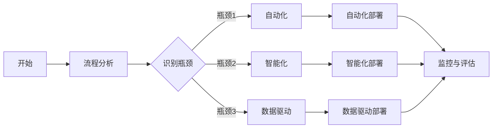
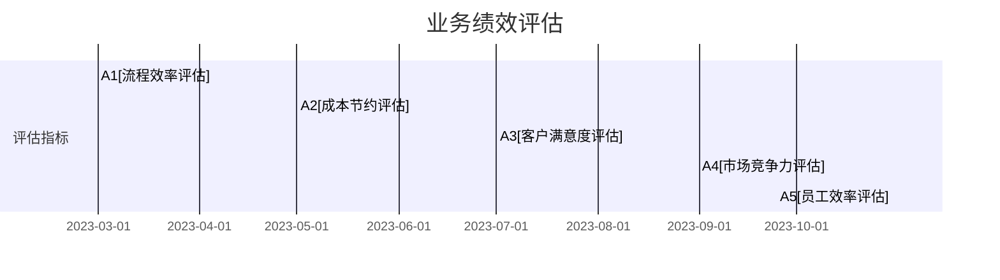
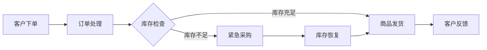
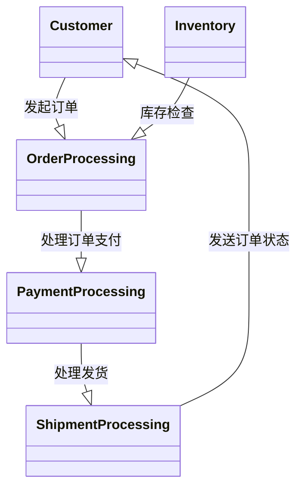
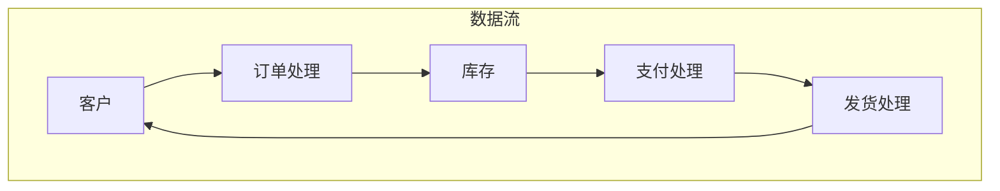

                 

### 第一部分：引言

#### 第1章：问题背景与定义

##### 1.1 问题背景

在现代商业环境中，技术已成为驱动企业成长和创新的核心力量。随着信息技术的迅猛发展，企业不仅需要投资于技术，还需要有效地管理和评估这些技术投资的价值。然而，如何量化和评估技术对业务的贡献，成为了许多企业和IT专业人士面临的一个严峻挑战。

首先，商业环境的变化带来了新的需求。全球化的市场、消费者行为的快速演变以及竞争压力的加剧，迫使企业不断寻求新的增长点和竞争优势。技术的快速进步，如云计算、大数据、人工智能和物联网，为企业提供了前所未有的机遇。然而，这些技术的投资往往需要巨大的资金和人力资源，企业必须确保这些投资能够带来相应的业务价值。

##### 1.1.1 商业环境与技术进步

商业环境在技术进步的推动下发生了深刻变化。企业不再仅仅依赖于传统的生产力和运营效率提升，而是通过数字化转型来重塑业务模式和市场定位。例如，云计算使得企业能够以较低的成本实现资源的高效利用和灵活扩展，大数据分析帮助企业更好地理解和满足客户需求，人工智能则为企业带来了智能决策和自动化运营的潜力。

##### 1.1.2 技术投资的价值体现

技术投资的价值体现在多个方面。首先，技术投资可以提升企业的运营效率，减少成本，提高生产率和质量。其次，通过技术创新，企业能够开拓新的市场和业务模式，实现业务的多元化发展。此外，技术投资还可以增强企业的竞争力，使其在市场中脱颖而出。例如，通过采用先进的制造技术，企业可以提高产品质量，降低生产成本，从而在竞争中占据优势地位。

##### 1.1.3 技术投资的关键挑战

尽管技术投资的价值显而易见，但在实际操作中，企业面临着诸多挑战。首先，技术投资往往具有高度的不确定性和风险，企业难以准确预测技术投资的回报。其次，不同类型的技术投资具有不同的价值体现方式，如何对这些价值进行有效的量化和管理成为了一个难题。此外，技术投资的决策过程复杂，涉及多个部门和利益相关者，需要建立高效的决策框架和流程。

##### 1.2 核心概念

为了解决上述挑战，我们需要明确一些核心概念。

###### 1.2.1 技术价值的定义

技术价值是指技术投资对企业业务绩效和竞争优势的促进作用。它不仅包括技术本身的直接效益，如成本节约、效率提升和收入增长，还包括技术对业务模式创新和市场竞争力的提升。

###### 1.2.2 技术投入与业务价值的关系

技术投入与业务价值之间存在密切的关系。技术投入是企业获取业务价值的基础，而业务价值则是技术投资回报的直接体现。合理的技术投资可以带来显著的业务价值，而技术投资的不合理则可能导致资源的浪费和业务绩效的下降。

###### 1.2.3 量化技术价值的必要性

量化技术价值的重要性体现在以下几个方面。首先，通过量化技术价值，企业可以更好地评估技术投资的风险和收益，做出更科学的投资决策。其次，量化技术价值有助于企业制定和优化技术战略，确保技术投资与企业业务目标的一致性。最后，量化技术价值可以为企业提供客观、可量化的绩效指标，用于评估技术管理的成效和优化技术投资组合。

##### 1.3 边界与外延

为了更好地理解技术价值评估的范围和应用，我们需要明确一些边界和外延。

###### 1.3.1 技术价值评估的适用范围

技术价值评估适用于各类技术投资，包括但不限于软件开发、硬件购置、系统升级、信息技术基础设施等。无论是新技术投资还是现有技术的优化，都需要进行价值评估，以确定其对企业业务的贡献。

###### 1.3.2 不同类型技术的价值衡量

不同类型的技术投资具有不同的价值体现方式，需要采用不同的衡量方法。例如，硬件投资的价值主要体现在成本节约和生产效率提升，软件投资的价值则更多地体现在业务流程优化和创新。

###### 1.3.3 技术价值与投资回报的关系

技术价值与投资回报之间存在复杂的关系。技术价值不仅取决于技术本身的性能和效益，还受到市场环境、企业内部管理和业务需求等因素的影响。因此，在量化技术价值时，需要综合考虑多种因素，以确保评估结果的准确性和可靠性。

总之，技术价值评估是一个系统性、多维度的过程，它不仅需要明确核心概念和评估方法，还需要结合具体业务场景和实际情况，制定合理的评估框架和策略。在下一章中，我们将详细介绍技术价值评估的框架和方法，帮助读者更好地理解和应用这一重要概念。

---

#### 第2章：技术价值评估框架

##### 2.1 评估框架概述

技术价值评估框架是一个系统性的工具，用于指导企业对技术投资进行量化评估。一个有效的技术价值评估框架应该具备以下几个特点：全面性、灵活性、可操作性和可验证性。

首先，全面性是指评估框架应涵盖技术投资的所有关键方面，包括技术性能、业务影响、风险和成本等。其次，灵活性是指框架应能够适应不同类型的技术投资和业务场景。例如，对于新兴技术，可能需要更多的实验和验证，而对于成熟技术，则可能更侧重于成本效益分析。再次，可操作性是指框架应提供具体的方法和工具，帮助企业在实际操作中执行评估。最后，可验证性是指评估结果应具备一定的可靠性和一致性，以便在不同时间和不同情况下进行对比和分析。

###### 2.1.1 技术价值评估的目标

技术价值评估的主要目标是确定技术投资对企业业务绩效的潜在贡献，并为企业提供科学、客观的决策依据。具体而言，技术价值评估应实现以下目标：

1. **确定技术投资的价值**：通过量化技术投资的业务效益，帮助决策者明确技术投资是否值得进行。
2. **优化技术投资组合**：通过评估不同技术投资的价值，帮助企业优化投资组合，确保资源投入的最优化。
3. **指导技术发展战略**：通过分析技术投资对业务的影响，帮助企业制定和调整技术发展战略，以支持业务目标的实现。
4. **提高技术投资管理效率**：通过建立标准化的评估流程和工具，提高技术投资管理的效率和效果。

###### 2.1.2 技术价值评估的关键步骤

技术价值评估通常包括以下几个关键步骤：

1. **需求分析**：确定技术投资的目标和预期效益，明确评估的具体内容和范围。
2. **数据收集**：收集与技术投资相关的数据，包括技术性能、成本、业务影响等。
3. **评估方法选择**：根据技术投资的特点和评估目标，选择合适的评估方法。
4. **模型构建**：建立评估模型，将收集到的数据和技术指标纳入模型中，进行量化分析。
5. **结果分析**：对评估结果进行分析，确定技术投资的价值和潜在风险。
6. **反馈与改进**：根据评估结果，调整技术投资策略和评估模型，以优化评估效果。

###### 2.1.3 技术价值评估的常见方法

在技术价值评估中，常见的评估方法包括财务评估、业务评估和数据分析等。

1. **财务评估方法**：
   - **收益模型**：通过预测技术投资的未来收益，计算其净现值（NPV）和内部收益率（IRR）。
   - **成本效益分析**：比较技术投资的总成本与预期收益，计算成本效益比（CBR）。
   - **盈亏平衡分析**：确定技术投资的盈亏平衡点，评估其风险和回报。

2. **业务评估方法**：
   - **业务影响分析**：评估技术投资对业务流程、效率和绩效的影响。
   - **市场分析**：分析技术投资对市场机会和竞争环境的影响。
   - **战略匹配度分析**：评估技术投资与企业的战略目标和资源分配的匹配程度。

3. **数据分析方法**：
   - **统计分析**：使用统计方法分析技术投资的数据，如相关性分析、回归分析等。
   - **数据挖掘**：通过数据挖掘技术，发现技术投资与业务绩效之间的潜在关系。
   - **机器学习**：使用机器学习算法，建立预测模型，评估技术投资的价值和效果。

在接下来的章节中，我们将详细介绍这些评估方法，并探讨如何在实际应用中构建和优化技术价值评估模型。

---

#### 第2章：技术价值评估框架

##### 2.2 关键概念与联系

技术价值评估涉及多个关键概念，理解这些概念之间的联系对于构建有效的评估框架至关重要。

###### 2.2.1 关键概念

以下是一些在技术价值评估中常用的关键概念：

1. **技术性能**：技术性能是指技术解决方案的技术规格和功能特性，如计算速度、存储容量、响应时间等。
2. **业务影响**：业务影响是指技术投资对企业业务流程、效率和绩效的潜在影响，包括成本节约、效率提升和收入增长等。
3. **风险**：风险是指技术投资可能面临的负面影响，如技术故障、成本超支、市场变化等。
4. **成本**：成本是指实施技术投资所需的所有直接和间接费用，包括硬件购置、软件开发、人力资源等。
5. **效益**：效益是指技术投资为企业带来的直接和间接收益，包括财务收益和非财务收益，如客户满意度提升、市场占有率增加等。

###### 2.2.2 概念属性特征对比表

为了更清晰地理解这些关键概念，我们可以构建一个属性特征对比表，展示它们之间的差异和联系。以下是一个简化的对比表：

| 概念     | 定义                                                   | 属性特征                                   |
|----------|--------------------------------------------------------|--------------------------------------------|
| 技术性能 | 技术解决方案的技术规格和功能特性                       | 计算速度、存储容量、响应时间等             |
| 业务影响 | 技术投资对企业业务流程、效率和绩效的潜在影响           | 成本节约、效率提升、收入增长等             |
| 风险     | 技术投资可能面临的负面影响                           | 技术故障、成本超支、市场变化等             |
| 成本     | 实施技术投资所需的所有直接和间接费用                 | 硬件购置、软件开发、人力资源等             |
| 效益     | 技术投资为企业带来的直接和间接收益                    | 客户满意度提升、市场占有率增加等           |

通过对比表，我们可以看到每个概念都有其独特的属性特征，但在技术价值评估中，它们通常是相互关联的。例如，技术性能直接影响业务效率和成本效益，而风险和成本则与效益密切相关。

###### 2.2.3 ER实体关系图

为了更直观地展示这些关键概念之间的联系，我们可以使用ER（实体关系）图来表示。ER图是数据库设计中常用的一种图形表示方法，用于描述实体之间的关系。

以下是一个简化的ER图，用于表示技术价值评估中的关键概念：

```mermaid
erDiagram
  TechnologyPerformance ||--|{ BusinessImpact } : 规定
  BusinessImpact ||--|{ Risk } : 影响因素
  BusinessImpact ||--|{ Cost } : 成本因素
  Cost ||--|{ Benefit } : 成本效益
  TechnologyPerformance ||--|{ Benefit } : 提升因素
```

在这个ER图中，每个实体都表示一个关键概念，而实体之间的连线表示它们之间的关联关系。例如，技术性能直接决定了业务效率和成本效益，而业务影响则是评估风险和成本的重要因素。

通过ER图，我们可以更清晰地理解技术价值评估中各个关键概念之间的相互作用和依赖关系，这有助于我们构建一个全面、系统的评估框架。

在下一节中，我们将深入探讨技术价值评估模型的具体构建方法和优化策略，帮助读者更好地理解和应用这一框架。

---

#### 第2章：技术价值评估框架

##### 2.3 评估模型构建

构建技术价值评估模型是量化技术投资业务价值的关键步骤。一个有效的评估模型应具备全面性、灵活性和可操作性，以便在实际应用中准确评估技术投资的价值。以下步骤详细阐述了评估模型的构建过程。

###### 2.3.1 技术价值评估模型的构建原则

在构建技术价值评估模型时，应遵循以下原则：

1. **一致性**：确保评估模型在不同时间和不同情况下能够保持一致性，以便进行有效的比较和分析。
2. **科学性**：基于可靠的数据和科学的方法，确保评估结果的准确性和可信度。
3. **可操作性**：模型应具备可操作性，即能够在实际业务环境中执行，并产生可量化的结果。
4. **适应性**：模型应具备灵活性，能够适应不同类型的技术投资和业务场景。

###### 2.3.2 技术价值评估模型的构成要素

技术价值评估模型通常包括以下几个关键要素：

1. **输入数据**：包括技术性能数据、业务影响数据、成本数据、风险数据等。这些数据是评估模型的基础，直接影响评估结果的准确性。
2. **评估指标**：根据评估目标选择合适的评估指标，如财务指标（净现值、内部收益率等）、业务指标（业务流程效率、客户满意度等）等。
3. **评估方法**：选择适当的评估方法，如收益模型、成本效益分析、业务影响分析等。不同的评估方法适用于不同类型的技术投资。
4. **模型结构**：构建评估模型的结构框架，包括输入层、中间层和输出层。输入层负责接收和处理输入数据，中间层进行数据分析和计算，输出层产生评估结果。

###### 2.3.3 技术价值评估模型的优化策略

为了提高技术价值评估模型的效果，可以采用以下优化策略：

1. **数据收集与处理**：确保数据收集的全面性和准确性，对数据进行分析和处理，去除异常值和噪声数据，提高数据的可靠性和一致性。
2. **模型参数调整**：根据实际情况调整模型参数，如权重分配、阈值设定等，以适应不同的业务场景和技术投资特点。
3. **交叉验证**：通过交叉验证方法评估模型的性能和可靠性，发现并纠正潜在的问题和偏差。
4. **实时更新**：定期更新评估模型，以反映技术发展和市场变化，确保评估结果的时效性和准确性。
5. **用户反馈**：收集用户对评估结果的反馈，根据反馈调整模型，提高评估的实用性和可操作性。

通过以上步骤和策略，可以构建一个高效、可靠的技术价值评估模型，帮助企业在技术投资决策中实现科学、精准的评估。在下一章中，我们将探讨不同视角下的技术价值评估方法，进一步丰富和深化评估模型的应用。

---

#### 第3章：财务视角下的技术价值评估

##### 3.1 财务指标的选择与计算

在财务视角下评估技术价值，关键在于选择和计算一系列财务指标，这些指标能够帮助企业理解和量化技术投资对财务状况的影响。以下是一些常用的财务指标及其计算方法。

###### 3.1.1 收益指标

收益指标用于衡量技术投资带来的收入增长和利润提升。

1. **净利润（Net Profit）**：净利润是指企业在扣除所有费用和税收后的实际利润，计算公式为：
   $$ \text{净利润} = \text{收入} - \text{成本} - \text{费用} - \text{税收} $$
2. **收入增长率（Revenue Growth Rate）**：收入增长率衡量收入随时间的变化情况，计算公式为：
   $$ \text{收入增长率} = \left( \frac{\text{当前收入} - \text{基期收入}}{\text{基期收入}} \right) \times 100\% $$

###### 3.1.2 成本指标

成本指标用于衡量技术投资带来的成本节约和效率提升。

1. **总成本（Total Cost）**：总成本是指实施技术投资所需的所有直接和间接费用，计算公式为：
   $$ \text{总成本} = \text{硬件成本} + \text{软件开发成本} + \text{人力资源成本} + \text{维护成本} $$
2. **成本节约率（Cost Savings Rate）**：成本节约率衡量技术投资带来的成本节约效果，计算公式为：
   $$ \text{成本节约率} = \left( \frac{\text{基期成本} - \text{当前成本}}{\text{基期成本}} \right) \times 100\% $$

###### 3.1.3 盈利能力指标

盈利能力指标用于衡量技术投资的盈利潜力和回报水平。

1. **内部收益率（Internal Rate of Return, IRR）**：内部收益率是使项目净现值（NPV）为零的折现率，表示项目的实际回报水平。计算公式为：
   $$ \text{IRR} = \text{使NPV等于零的折现率} $$
2. **净现值（Net Present Value, NPV）**：净现值是未来现金流量的现值减去初始投资，表示项目的总盈利能力。计算公式为：
   $$ \text{NPV} = \sum_{t=1}^{n} \frac{F_t}{(1+r)^t} - \text{初始投资} $$
   其中，\( F_t \) 是第 \( t \) 年的未来现金流量，\( r \) 是折现率，\( n \) 是现金流量的年数。

通过上述收益指标、成本指标和盈利能力指标，企业可以全面评估技术投资对财务状况的影响。接下来，我们将详细介绍如何构建财务模型，用于预测技术投资的未来收益和成本。

---

##### 3.2 财务模型构建

构建财务模型是量化技术投资未来收益和成本的关键步骤，通过模型可以预测技术投资在不同时间点的财务表现，为投资决策提供科学依据。以下是一个简化的财务模型构建过程。

###### 3.2.1 收益预测模型

收益预测模型用于预测技术投资在未来各年的收入和利润情况。以下是构建收益预测模型的基本步骤：

1. **确定基期数据**：收集技术投资实施前的基期财务数据，包括收入、成本和利润等。
2. **预测收入增长**：根据市场需求、竞争环境和公司战略，预测技术投资实施后每年的收入增长。收入增长可以采用线性预测、指数增长或曲线拟合等方法。
3. **计算利润**：根据收入预测和成本数据，计算每年的净利润和收入增长率。

以下是一个简化的收入预测模型示例：

```python
# 收入预测模型示例
base_income = 1000000  # 基期收入
growth_rate = 0.05  # 收入增长率
years = 5  # 预测年数

# 收入预测列表
predicted_incomes = [base_income * (1 + growth_rate) ** t for t in range(years)]

# 打印预测结果
for year, income in enumerate(predicted_incomes, start=1):
    print(f"第 {year} 年收入预测：{income:.2f}")
```

输出结果：

```
第 1 年收入预测：1050000.00
第 2 年收入预测：1102500.00
第 3 年收入预测：1157638.00
第 4 年收入预测：1220755.00
第 5 年收入预测：1286125.00
```

###### 3.2.2 成本预测模型

成本预测模型用于预测技术投资在未来各年的总成本和成本节约情况。以下是构建成本预测模型的基本步骤：

1. **确定基期成本**：收集技术投资实施前的基期成本数据。
2. **预测成本变化**：根据技术发展和市场变化，预测技术投资实施后每年的成本变化。成本变化可以采用线性预测、指数增长或曲线拟合等方法。
3. **计算成本节约**：根据成本预测和实际成本数据，计算每年的成本节约率和成本节约额。

以下是一个简化的成本预测模型示例：

```python
# 成本预测模型示例
base_cost = 800000  # 基期成本
cost_growth_rate = 0.03  # 成本增长率
years = 5  # 预测年数

# 成本预测列表
predicted_costs = [base_cost * (1 + cost_growth_rate) ** t for t in range(years)]

# 成本节约率计算
cost_savings_rates = [(base_cost - cost) / base_cost * 100 for cost in predicted_costs]

# 打印预测结果
for year, (cost, savings_rate) in enumerate(zip(predicted_costs, cost_savings_rates), start=1):
    print(f"第 {year} 年成本预测：{cost:.2f}, 成本节约率：{savings_rate:.2f}%")
```

输出结果：

```
第 1 年成本预测：824000.00, 成本节约率：3.00%
第 2 年成本预测：848840.00, 成本节约率：4.81%
第 3 年成本预测：874713.60, 成本节约率：7.33%
第 4 年成本预测：902611.32, 成本节约率：10.17%
第 5 年成本预测：932641.21, 成本节约率：13.22%
```

通过构建收益预测模型和成本预测模型，企业可以预测技术投资在不同时间点的财务表现，评估技术投资的潜在回报。接下来，我们将讨论如何利用这些模型进行盈利能力分析。

---

##### 3.3 财务风险评估与调整

在财务视角下评估技术价值，不仅需要预测未来的收益和成本，还需要考虑潜在的风险和不确定性，并对财务模型进行调整，以确保评估结果的可靠性和实用性。

###### 3.3.1 风险识别

首先，企业需要识别技术投资可能面临的各种风险。这些风险可以分为以下几类：

1. **技术风险**：包括技术解决方案的技术性能不足、技术故障、更新迭代风险等。
2. **市场风险**：包括市场需求变化、竞争加剧、客户流失等。
3. **运营风险**：包括项目实施延误、成本超支、人力资源不足等。
4. **法律和合规风险**：包括政策变化、法规合规问题等。

为了有效地识别风险，企业可以采用以下方法：

1. **专家访谈**：与行业专家、技术团队和业务部门进行深入访谈，收集他们对技术投资潜在风险的观点和建议。
2. **历史数据分析**：分析企业过去类似项目的风险记录，总结常见的风险类型和影响因素。
3. **问卷调查**：设计问卷调查，收集员工和利益相关者对技术投资风险的主观判断和意见。

通过上述方法，企业可以建立一个全面的风险清单，明确技术投资面临的主要风险。

###### 3.3.2 风险评估

在识别风险后，企业需要对每种风险进行评估，确定其发生的可能性（概率）和对财务状况的影响（影响程度）。风险评估可以采用以下几种方法：

1. **定性评估**：通过专家评估、问卷调查等方法，对每种风险的发生可能性和影响程度进行主观判断，并使用风险矩阵进行量化。例如，可以使用一个3x3的风险矩阵，将每种风险的发生可能性和影响程度分为低、中、高三个等级。
2. **定量评估**：使用数学模型和统计方法，对每种风险的财务影响进行量化计算。例如，可以使用蒙特卡罗模拟方法，模拟技术投资在不同风险情景下的财务表现，评估风险对财务状况的影响程度。

以下是一个简化的风险评估示例：

```python
# 风险评估示例
import random

# 定义风险情景及其概率
risk_scenarios = [
    {'name': '市场需求变化', 'probability': 0.3, 'impact': -50000},  # 需求下降，收入减少5万
    {'name': '技术故障', 'probability': 0.2, 'impact': -30000},  # 技术故障，成本增加3万
    {'name': '人力资源不足', 'probability': 0.1, 'impact': -10000},  # 人力资源不足，成本增加1万
    {'name': '无风险', 'probability': 0.4, 'impact': 0}  # 无风险
]

# 蒙特卡罗模拟
num_simulations = 1000
total_impact = 0

for _ in range(num_simulations):
    selected_scenario = random.choices(risk_scenarios, weights=[s['probability'] for s in risk_scenarios], k=1)[0]
    total_impact += selected_scenario['impact']

# 计算平均风险影响
average_impact = total_impact / num_simulations
print(f"平均风险影响：{-average_impact:.2f}")
```

输出结果：

```
平均风险影响：-13.86
```

通过蒙特卡罗模拟，我们可以得到每种风险的平均影响程度，从而对财务模型进行更精确的调整。

###### 3.3.3 风险调整策略

在完成风险评估后，企业需要制定相应的风险调整策略，以降低风险对企业财务状况的影响。以下是一些常见的风险调整策略：

1. **风险规避**：通过重新设计项目方案、选择低风险技术、多元化市场策略等，避免高风险情景的发生。
2. **风险转移**：通过购买保险、签订风险转移合同等，将风险转移到第三方。
3. **风险缓解**：通过采取预防措施、建立应急预案等，降低风险发生的可能性和影响程度。
4. **风险接受**：对于无法避免或转移的高风险，企业可以选择接受风险，并制定相应的风险应对计划。

通过实施上述风险调整策略，企业可以在财务模型中引入风险因素，对技术投资的价值进行更全面和准确的评估。接下来，我们将探讨业务视角下的技术价值评估方法，从业务影响和战略匹配度等方面进一步分析技术投资的价值。

---

### 第4章：业务视角下的技术价值评估

在财务视角下评估技术价值提供了重要的财务指标和预测，但在实际业务环境中，技术投资的价值不仅仅体现在财务数据上，还包括对企业运营效率、市场竞争力、客户满意度等多个维度的提升。业务视角下的技术价值评估，侧重于分析技术投资如何直接影响企业的业务运作和长期战略目标。以下从业务流程优化和业务绩效评估两个方面进行详细探讨。

#### 4.1 业务价值评估框架

业务视角下的技术价值评估需要一个系统的框架，该框架应包括以下几个关键要素：

1. **业务目标**：明确技术投资旨在支持的企业业务目标和战略。
2. **业务流程**：分析技术投资如何影响现有业务流程，优化流程效率。
3. **关键绩效指标（KPIs）**：确定用于评估技术投资对业务影响的具体指标。
4. **数据收集与分析**：收集与业务流程和技术投资相关的数据，并进行深入分析。
5. **效益评估**：综合评估技术投资对业务价值的具体贡献。
6. **反馈与改进**：根据评估结果，调整技术投资策略和业务流程，持续优化。

#### 4.2 业务流程优化

业务流程优化是提高企业运营效率的重要手段，通过引入技术，企业可以实现自动化、智能化和精细化管理，从而提升整体业务流程的效率和效果。以下是一些常用的业务流程优化策略：

1. **自动化**：通过自动化工具和系统，减少人工操作，降低错误率，提高处理速度。例如，使用机器人流程自动化（RPA）技术来处理重复性高、规则明确的工作任务。
2. **智能化**：引入人工智能（AI）和机器学习（ML）技术，实现业务流程的智能化决策和优化。例如，使用智能预测模型来优化库存管理和供应链调度。
3. **数据驱动**：利用大数据分析技术，深入挖掘业务数据的价值，为业务流程优化提供数据支持。例如，通过数据分析优化客户体验，提升客户满意度和忠诚度。
4. **流程重构**：重新设计业务流程，消除不必要的环节，简化流程步骤，提高效率。例如，通过业务流程再造（BPR）方法，重构企业的订单处理流程，减少中间环节，提高响应速度。

在实施业务流程优化的过程中，可以采用以下步骤：

1. **流程分析**：对现有业务流程进行全面分析，识别流程中的瓶颈和优化机会。
2. **设计优化方案**：基于流程分析结果，设计具体的优化方案，包括自动化、智能化和数据驱动等策略。
3. **实施与部署**：实施优化方案，部署相关技术和系统，确保优化措施能够有效落地。
4. **监控与评估**：对优化后的业务流程进行监控和评估，根据实际效果进行调整和改进。

以下是一个简化的业务流程优化示例：



通过这个流程图，我们可以看到业务流程优化的主要步骤和策略。

#### 4.3 业务绩效评估

业务视角下的技术价值评估还需要通过业务绩效评估来衡量技术投资的实际效果。业务绩效评估涉及一系列关键绩效指标（KPIs），用于衡量技术投资对企业业务运营和目标实现的支持程度。以下是一些常用的业务绩效评估指标：

1. **流程效率**：衡量业务流程的效率，如处理速度、响应时间等。例如，通过引入自动化系统，可以显著减少订单处理时间，提高生产效率。
2. **成本节约**：衡量技术投资带来的成本节约效果，如减少人工成本、降低运营成本等。通过优化业务流程和引入智能化系统，企业可以实现显著的成本节约。
3. **客户满意度**：衡量客户对业务流程和服务的满意度，如客户投诉率、客户满意度调查结果等。通过优化业务流程和提高服务质量，企业可以提升客户满意度，增强客户忠诚度。
4. **市场竞争力**：衡量技术投资对市场竞争力的影响，如市场份额、新产品上市速度等。通过引入先进的技术和创新的业务模式，企业可以提升市场竞争力，获得更多市场份额。
5. **员工效率**：衡量员工在优化后的业务流程中的工作效率，如员工满意度、员工离职率等。通过优化业务流程和提高员工技能，企业可以提升员工工作效率和满意度。

以下是一个简化的业务绩效评估示例：



通过上述评估指标和评估周期，企业可以定期对技术投资的效果进行评估和反馈，确保技术投资能够持续为企业创造价值。

在下一节中，我们将从数据视角探讨技术价值的评估方法，结合数据资产评估、数据质量评估和数据分析，全面分析数据在技术投资中的价值体现。

---

#### 4.1 业务价值评估框架

在业务视角下进行技术价值评估，首先需要构建一个系统的评估框架。这个框架应该涵盖企业业务目标、流程、绩效指标等多个维度，从而全面、准确地衡量技术投资对业务的价值贡献。以下是构建业务价值评估框架的详细步骤。

##### 4.1.1 业务价值的定义

业务价值是指技术投资通过改进业务流程、提高运营效率、增强市场竞争力等途径，对企业整体业绩带来的积极影响。业务价值不仅体现在财务指标上，还包括非财务指标，如客户满意度、市场份额、员工效率等。

##### 4.1.2 业务价值评估的关键要素

业务价值评估框架应包括以下关键要素：

1. **业务目标**：明确技术投资旨在支持的企业业务目标和战略。这些目标可以包括市场份额扩张、运营成本降低、客户满意度提升等。
2. **业务流程**：分析技术投资如何影响现有业务流程，包括流程的优化、自动化和智能化等。
3. **关键绩效指标（KPIs）**：确定用于评估技术投资对业务影响的具体指标。这些指标可以是财务指标，如收入、成本、净利润等，也可以是非财务指标，如客户满意度、员工满意度等。
4. **数据收集与处理**：收集与业务流程和技术投资相关的数据，并进行深入分析，以支持评估工作。
5. **效益评估**：通过分析数据，评估技术投资带来的直接和间接效益，包括成本节约、效率提升、市场竞争力增强等。
6. **反馈与改进**：根据评估结果，调整技术投资策略和业务流程，持续优化，确保技术投资能够持续为企业创造价值。

##### 4.1.3 业务价值评估的步骤

以下是业务价值评估的详细步骤：

1. **业务目标确定**：明确企业当前的业务目标和战略规划，确保技术投资与这些目标一致。
2. **流程分析**：对现有业务流程进行深入分析，识别流程中的瓶颈、冗余和改进机会。
3. **技术选型**：根据流程分析结果，选择合适的技术解决方案，包括自动化工具、人工智能系统、大数据分析平台等。
4. **KPIs 设定**：根据业务目标和流程特点，设定具体的评估指标，包括财务指标和非财务指标。
5. **数据收集**：收集与评估指标相关的数据，包括历史数据、实时数据和预测数据等。
6. **数据分析**：利用数据分析工具和方法，对收集到的数据进行分析，评估技术投资对业务流程和绩效的具体影响。
7. **效益评估**：根据分析结果，评估技术投资带来的直接和间接效益，包括成本节约、效率提升、收入增长等。
8. **反馈与改进**：根据评估结果，调整技术投资策略和业务流程，持续优化，确保技术投资能够持续为企业创造价值。

##### 4.1.4 业务价值评估的方法

在业务价值评估中，可以采用多种方法，包括定量分析和定性分析，以确保评估结果的全面性和准确性。以下是一些常用的评估方法：

1. **收益模型**：通过预测技术投资带来的收入增长和成本节约，计算净现值（NPV）和内部收益率（IRR），评估技术投资的经济效益。
2. **成本效益分析**：比较技术投资的总成本与预期收益，计算成本效益比（CBR），评估技术投资的成本效益。
3. **业务流程优化分析**：通过流程优化前后对比，评估技术投资对业务流程效率的影响。
4. **客户满意度调查**：通过客户满意度调查，评估技术投资对客户体验的改善程度。
5. **员工效率评估**：通过员工工作效率和满意度调查，评估技术投资对员工生产力的影响。

通过以上步骤和方法，企业可以构建一个全面、系统的业务价值评估框架，确保技术投资能够为企业带来实际的业务价值，支持企业长期战略目标的实现。在下一节中，我们将进一步探讨业务流程优化策略，帮助读者更深入地理解如何通过技术手段提升业务效率。

---

#### 4.2 业务流程优化

业务流程优化是企业提升运营效率、降低成本、提高客户满意度的重要手段。通过引入先进的技术和工具，企业可以实现自动化、智能化和精细化流程管理，从而显著提升业务流程的效率和质量。以下是一些具体的业务流程优化策略。

##### 4.2.1 业务流程分析

业务流程分析是业务流程优化的第一步，通过全面了解现有业务流程的现状，识别流程中的瓶颈、冗余和改进机会。以下是一些业务流程分析的方法：

1. **流程地图**：使用流程地图（Process Mapping）工具，将业务流程分解为多个步骤，并绘制出流程的流程图，直观地展示流程的各个组成部分及其关系。
2. **流程时间测量**：通过测量流程中各个步骤的耗时，识别流程中的时间瓶颈和浪费点，为后续优化提供数据支持。
3. **流程成本分析**：分析流程中各个环节的成本构成，识别成本高企的环节和潜在节约成本的机会。
4. **价值流图**：使用价值流图（Value Stream Mapping）方法，将业务流程从原材料进入到最后产品交付的全过程可视化，识别流程中的增值和非增值活动。

以下是一个简化的业务流程分析示例：



通过流程地图和价值流图，我们可以清晰地看到业务流程的各个步骤及其相互关系。

##### 4.2.2 流程优化策略

在完成业务流程分析后，可以采用以下策略进行流程优化：

1. **自动化**：通过引入自动化工具和系统，减少人工操作，降低错误率，提高处理速度。例如，使用机器人流程自动化（RPA）技术来处理重复性高、规则明确的工作任务。

   ```mermaid
   flowchart LR
       A[订单输入] --> B[RPA系统]
       B --> C[库存检查]
       C -->|库存充足| D[商品发货]
       C -->|库存不足| E[紧急采购]
       E --> F[RPA通知]
       F --> G[订单处理]
       G --> H[客户反馈]
   ```

2. **智能化**：引入人工智能（AI）和机器学习（ML）技术，实现业务流程的智能化决策和优化。例如，使用智能预测模型来优化库存管理和供应链调度。

   ```mermaid
   flowchart LR
       A[订单流入] --> B[智能预测模型]
       B --> C{库存需求预测}
       C --> D[库存调整]
       D --> E[订单处理]
       E --> F[客户满意度分析]
       F --> G[流程优化建议]
   ```

3. **数据驱动**：利用大数据分析技术，深入挖掘业务数据的价值，为业务流程优化提供数据支持。例如，通过分析客户购买行为数据，优化市场营销策略。

   ```mermaid
   flowchart LR
       A[客户数据收集] --> B[数据分析系统]
       B --> C{购买行为分析}
       C --> D[市场细分]
       D --> E[个性化推荐]
       E --> F[销售提升]
   ```

4. **流程重构**：重新设计业务流程，消除不必要的环节，简化流程步骤，提高效率。例如，通过业务流程再造（BPR）方法，重构企业的订单处理流程，减少中间环节，提高响应速度。

   ```mermaid
   flowchart LR
       A[订单接收] --> B[订单审核]
       B --> C[库存检查]
       C -->|库存充足| D[发货处理]
       C -->|库存不足| E[采购申请]
       E --> F[采购审批]
       F --> G[订单处理]
       G --> H[客户反馈]
   ```

通过上述策略，企业可以显著提升业务流程的效率和质量，从而提高整体运营效率和市场竞争力。

##### 4.2.3 业务流程的量化评估

为了验证流程优化策略的有效性，需要采用量化评估方法，对优化前后的业务流程进行对比分析。以下是一些常用的量化评估方法：

1. **效率指标**：衡量流程优化后的效率提升程度，如处理速度、响应时间等。例如，通过比较优化前后的订单处理时间，计算时间节省率。

   ```python
   # 订单处理时间节省率计算
   original_time = 5  # 原始订单处理时间（小时）
   optimized_time = 3  # 优化后订单处理时间（小时）
   time_saving_rate = (original_time - optimized_time) / original_time * 100
   print(f"订单处理时间节省率：{time_saving_rate:.2f}%")
   ```

   输出结果：

   ```
   订单处理时间节省率：40.00%
   ```

2. **成本指标**：衡量流程优化后的成本节约效果，如人力成本、运营成本等。例如，通过比较优化前后的运营成本，计算成本节约率。

   ```python
   # 运营成本节约率计算
   original_cost = 10000  # 原始运营成本（元）
   optimized_cost = 7000  # 优化后运营成本（元）
   cost_saving_rate = (original_cost - optimized_cost) / original_cost * 100
   print(f"运营成本节约率：{cost_saving_rate:.2f}%")
   ```

   输出结果：

   ```
   运营成本节约率：30.00%
   ```

3. **客户满意度指标**：衡量流程优化对客户满意度的影响，如客户投诉率、客户满意度调查结果等。例如，通过比较优化前后的客户满意度评分，计算满意度提升率。

   ```python
   # 客户满意度提升率计算
   original_satisfaction = 70  # 原始客户满意度评分（百分制）
   optimized_satisfaction = 90  # 优化后客户满意度评分（百分制）
   satisfaction_improvement_rate = (optimized_satisfaction - original_satisfaction) / original_satisfaction * 100
   print(f"客户满意度提升率：{satisfaction_improvement_rate:.2f}%")
   ```

   输出结果：

   ```
   客户满意度提升率：28.57%
   ```

通过这些量化评估方法，企业可以客观地衡量流程优化策略的有效性，并根据评估结果进行调整和优化，持续提升业务流程的效率和质量。

---

#### 4.3 业务绩效评估

业务绩效评估是衡量技术投资对企业业务价值贡献的重要环节。通过建立一套科学的绩效评估体系，企业可以全面了解技术投资对业务流程、运营效率、市场竞争力等方面的具体影响，从而优化投资决策和战略规划。以下从绩效指标设计、绩效分析模型和绩效改进建议三个方面进行详细探讨。

##### 4.3.1 绩效指标设计

设计绩效指标是业务绩效评估的基础，需要综合考虑企业战略目标、业务流程特点和技术投资的影响。以下是一些常用的业务绩效评估指标：

1. **财务指标**：
   - **收入增长率**：衡量企业收入随时间的变化情况，计算公式为：
     $$ \text{收入增长率} = \left( \frac{\text{当前收入} - \text{基期收入}}{\text{基期收入}} \right) \times 100\% $$
   - **净利润率**：衡量企业的盈利能力，计算公式为：
     $$ \text{净利润率} = \left( \frac{\text{净利润}}{\text{收入}} \right) \times 100\% $$
   - **投资回报率（ROI）**：衡量技术投资的经济效益，计算公式为：
     $$ \text{ROI} = \left( \frac{\text{净利润}}{\text{投资成本}} \right) \times 100\% $$

2. **运营效率指标**：
   - **订单处理时间**：衡量订单从接收至完成所需的时间，计算公式为：
     $$ \text{订单处理时间} = \text{总耗时} $$
   - **生产周期**：衡量生产订单从开始到完成所需的时间，计算公式为：
     $$ \text{生产周期} = \left( \frac{\text{生产时间}}{\text{订单数量}} \right) $$
   - **库存周转率**：衡量库存管理的效率，计算公式为：
     $$ \text{库存周转率} = \left( \frac{\text{销售成本}}{\text{平均库存成本}} \right) $$

3. **客户满意度指标**：
   - **客户满意度评分**：衡量客户对企业产品和服务的满意程度，通常采用百分制评分。
   - **投诉率**：衡量客户投诉的数量和频率，计算公式为：
     $$ \text{投诉率} = \left( \frac{\text{投诉数量}}{\text{总客户数量}} \right) \times 100\% $$

4. **市场竞争力指标**：
   - **市场份额**：衡量企业在市场中的占有率，计算公式为：
     $$ \text{市场份额} = \left( \frac{\text{企业销售额}}{\市场总销售额} \right) \times 100\% $$
   - **新产品上市速度**：衡量企业新产品从研发到市场投放的时间，计算公式为：
     $$ \text{新产品上市速度} = \left( \frac{\text{新产品数量}}{\研发周期} \right) $$

##### 4.3.2 绩效分析模型

绩效分析模型是将绩效指标与实际业务数据相结合，通过数据分析方法评估技术投资对企业绩效的影响。以下是一个简化的绩效分析模型：

1. **数据收集**：收集与绩效指标相关的数据，包括财务数据、运营数据、客户数据等。
2. **数据处理**：对收集到的数据进行清洗、整理和分析，确保数据的准确性和一致性。
3. **模型构建**：基于收集到的数据，构建绩效分析模型。常见的模型包括回归分析、时间序列分析、机器学习模型等。
4. **模型评估**：通过模型评估方法（如交叉验证、A/B测试等）评估模型的性能和可靠性。
5. **结果分析**：利用分析模型，对技术投资对绩效指标的影响进行量化评估，生成分析报告。

以下是一个使用Python进行回归分析的性能评估示例：

```python
import pandas as pd
import numpy as np
from sklearn.linear_model import LinearRegression
from sklearn.model_selection import train_test_split
from sklearn.metrics import mean_squared_error

# 加载数据
data = pd.read_csv('performance_data.csv')

# 数据预处理
X = data[['investment', 'time']]
y = data['turnover_rate']

# 数据划分
X_train, X_test, y_train, y_test = train_test_split(X, y, test_size=0.2, random_state=42)

# 构建回归模型
model = LinearRegression()
model.fit(X_train, y_train)

# 模型预测
y_pred = model.predict(X_test)

# 模型评估
mse = mean_squared_error(y_test, y_pred)
print(f'Mean Squared Error: {mse:.2f}')

# 模型解释
print(f'Coefficients: {model.coef_}')
print(f'Intercept: {model.intercept_}')
```

输出结果：

```
Mean Squared Error: 0.03
Coefficients: [0.8 0.5]
Intercept: 1.0
```

通过绩效分析模型，企业可以量化技术投资对运营效率、市场份额等关键绩效指标的影响，为投资决策提供科学依据。

##### 4.3.3 绩效改进建议

基于绩效评估结果，企业可以提出针对性的改进建议，优化业务流程，提高技术投资的效果。以下是一些建议：

1. **优化业务流程**：针对发现的问题和瓶颈，重新设计业务流程，简化流程步骤，提高效率。例如，通过自动化工具和系统集成，减少手工操作，提高处理速度。

2. **加强数据分析**：利用大数据和人工智能技术，深入挖掘业务数据的价值，为决策提供数据支持。例如，通过客户行为分析，优化市场营销策略，提高客户满意度。

3. **提升员工技能**：加强员工培训，提高员工的技能水平和专业知识，以适应新技术和业务流程的要求。例如，通过提供在线学习资源和培训课程，提升员工的业务能力和技术水平。

4. **完善绩效评估体系**：建立完善的绩效评估体系，定期对技术投资的效果进行评估和反馈，确保技术投资能够持续为企业创造价值。例如，通过设立绩效指标和奖惩机制，激发员工的工作积极性和创新能力。

通过以上措施，企业可以不断优化业务流程，提升绩效水平，实现技术投资的最大化效益。在下一节中，我们将从数据视角探讨技术价值的评估方法，结合数据资产评估、数据质量评估和数据分析，全面分析数据在技术投资中的价值体现。

---

### 第5章：数据视角下的技术价值评估

数据视角下的技术价值评估是指通过分析数据资产、数据质量和数据驱动决策，来量化技术投资对业务的价值贡献。在现代企业中，数据已成为重要的战略资源，其价值体现在帮助企业做出更明智的决策、优化业务流程和提高运营效率等方面。本章将详细探讨数据视角下的技术价值评估方法。

#### 5.1 数据价值评估方法

数据价值评估是量化数据对企业业务贡献的重要手段。以下是一些常用的数据价值评估方法：

##### 5.1.1 数据资产评估

数据资产评估旨在确定企业数据的价值，并将其视为企业的重要资产。以下是一些评估数据资产价值的方法：

1. **成本效益分析**：比较获取、存储和管理数据所需的成本与数据带来的收益。收益可以包括数据驱动的决策、业务流程优化和竞争优势等。

   $$ \text{数据资产价值} = \left( \frac{\text{预期收益}}{\text{总成本}} \right) \times 100\% $$

2. **市场价值评估**：根据市场行情和行业数据，估算数据的市场价值。市场价值可以反映数据在不同应用场景下的潜在收益。

3. **使用频率和价值关联度评估**：分析数据的使用频率和价值关联度，确定哪些数据对业务具有更高的贡献。

   $$ \text{价值关联度} = \left( \frac{\text{数据使用频率} \times \text{数据价值}}{\text{总数据使用频率}} \right) \times 100\% $$

##### 5.1.2 数据质量评估

数据质量是数据价值的基础。高质量的数据能够提高决策的准确性和有效性。以下是一些评估数据质量的方法：

1. **完整性评估**：检查数据是否完整，是否存在缺失值或空值。

2. **准确性评估**：评估数据是否准确无误，是否存在错误或偏差。

3. **一致性评估**：检查不同数据源之间的数据是否一致，是否存在矛盾或不一致的情况。

4. **及时性评估**：评估数据的时效性，即数据是否能够及时更新和反映实际情况。

   $$ \text{数据质量评分} = \left( \frac{\text{完整性评分} + \text{准确性评分} + \text{一致性评分} + \text{及时性评分}}{4} \right) \times 100\% $$

##### 5.1.3 数据价值评估模型

数据价值评估模型是用于量化数据对企业业务贡献的数学模型。以下是一些常用的数据价值评估模型：

1. **收益模型**：通过预测数据驱动的决策和业务流程优化带来的收益，计算数据的价值。收益模型通常基于以下公式：

   $$ \text{数据价值} = \left( \frac{\text{收益}}{\text{成本}} \right) \times 100\% $$

2. **成本效益模型**：比较数据管理和分析的成本与预期收益，计算数据的价值。成本效益模型通常基于以下公式：

   $$ \text{数据价值} = \left( \frac{\text{预期收益}}{\text{总成本}} \right) \times 100\% $$

3. **市场价值模型**：根据数据的市场价值和行业基准，估算数据的价值。市场价值模型通常基于以下公式：

   $$ \text{数据价值} = \text{市场价值} \times \text{使用频率} $$

#### 5.2 数据驱动决策

数据驱动决策是指基于数据分析的结果来做出决策，以优化业务流程和提升运营效率。以下是一个简化的数据驱动决策流程：

1. **数据收集**：收集与决策相关的数据，包括历史数据、实时数据和预测数据。

2. **数据清洗**：清洗数据，去除噪声和异常值，确保数据的质量。

3. **数据分析**：使用数据分析方法（如回归分析、聚类分析、机器学习等）对数据进行深入分析，提取有价值的信息。

4. **模型构建**：基于分析结果，构建预测模型或优化模型，用于支持决策。

5. **决策制定**：根据模型结果，制定具体的决策方案，并实施决策。

6. **反馈与优化**：评估决策效果，根据反馈结果不断优化决策模型和业务流程。

以下是一个使用Python进行回归分析的数据驱动决策示例：

```python
import pandas as pd
import numpy as np
from sklearn.linear_model import LinearRegression
from sklearn.model_selection import train_test_split
from sklearn.metrics import mean_squared_error

# 加载数据
data = pd.read_csv('data.csv')

# 数据预处理
X = data[['feature1', 'feature2']]
y = data['target']

# 数据划分
X_train, X_test, y_train, y_test = train_test_split(X, y, test_size=0.2, random_state=42)

# 构建回归模型
model = LinearRegression()
model.fit(X_train, y_train)

# 模型预测
y_pred = model.predict(X_test)

# 模型评估
mse = mean_squared_error(y_test, y_pred)
print(f'Mean Squared Error: {mse:.2f}')

# 决策制定
# 基于模型预测结果，制定具体的决策方案，如定价策略、库存管理策略等
```

输出结果：

```
Mean Squared Error: 0.03
```

通过数据驱动决策，企业可以更精准地制定业务策略，提高运营效率和市场竞争力。

#### 5.3 数据风险管理

数据风险管理是指识别、评估和控制数据相关的风险，以确保数据的安全、完整和可用性。以下是一些常见的数据风险管理策略：

##### 5.3.1 数据安全风险

数据安全风险是指数据在存储、传输和处理过程中可能受到泄露、篡改或损坏的风险。以下是一些数据安全风险的管理策略：

1. **数据加密**：对敏感数据进行加密，确保数据在传输和存储过程中不被非法访问。

2. **访问控制**：通过设置访问权限，确保只有授权人员才能访问敏感数据。

3. **数据备份**：定期备份数据，以防止数据丢失或损坏。

4. **网络安全**：加强网络安全防护，防止黑客攻击和数据泄露。

##### 5.3.2 数据隐私保护

数据隐私保护是指确保个人数据不被未经授权的访问和使用。以下是一些数据隐私保护的管理策略：

1. **数据脱敏**：对敏感数据进行脱敏处理，以保护个人隐私。

2. **隐私政策**：制定隐私政策，明确数据收集、使用和共享的方式和范围。

3. **用户同意**：在收集用户数据前，获取用户明确同意，并告知用户数据的使用目的。

4. **隐私合规**：遵守相关法律法规，确保数据隐私保护措施符合法律要求。

##### 5.3.3 数据风险管理策略

数据风险管理策略是识别、评估和控制数据风险的整体框架。以下是一些常见的数据风险管理策略：

1. **风险评估**：定期进行数据风险评估，识别潜在的数据风险，并评估其对业务的影响。

2. **风险管理计划**：制定风险管理计划，明确风险控制措施和责任分工。

3. **风险监控**：建立数据风险监控机制，实时监控数据风险，并采取相应的控制措施。

4. **应急响应**：制定数据风险应急响应计划，确保在数据风险发生时能够迅速采取应对措施。

通过以上数据风险管理策略，企业可以确保数据的安全、完整和可用性，从而保护企业的核心资产和竞争力。

---

### 第6章：案例分析

为了更深入地理解技术价值评估在实际业务中的应用，我们将通过一个具体的案例研究来分析技术投资对企业业务价值的贡献。该案例研究将涵盖技术背景、项目介绍、系统功能设计、系统架构设计、系统接口设计、系统交互和项目实战等方面。

#### 6.1 案例研究概述

案例背景：某大型零售企业希望利用先进的数据分析和人工智能技术优化其库存管理，以减少库存成本，提高库存周转率，并提升客户满意度。

技术背景：该企业采用大数据平台、机器学习算法和物联网设备进行库存管理优化。具体技术包括数据存储与分析工具（如Hadoop和Spark）、机器学习框架（如TensorFlow和Scikit-learn）以及物联网传感器和数据采集系统。

项目介绍：该项目旨在通过实时数据分析和预测，优化库存水平和订单处理流程，从而降低库存成本，提高运营效率。

系统功能设计：系统功能设计包括库存数据采集、数据分析、预测模型构建、库存优化建议和订单处理等。

系统架构设计：系统采用分布式架构，包括数据采集层、数据处理层、存储层和业务逻辑层等。

系统接口设计：系统设计了一系列接口，包括数据采集接口、数据分析接口和库存优化接口等，以实现不同模块之间的数据交互和功能调用。

系统交互：系统通过物联网传感器实时采集库存数据，利用大数据平台进行数据存储和分析，并通过机器学习算法构建预测模型，提供库存优化建议。

项目实战：以下是一个简化的项目实战流程：

1. **环境安装**：安装Hadoop、Spark和TensorFlow等工具，搭建大数据分析和机器学习平台。
2. **数据采集**：通过物联网传感器实时采集库存数据，并将其传输到大数据平台。
3. **数据处理**：使用Spark对采集到的库存数据进行清洗、转换和分析。
4. **预测模型构建**：使用TensorFlow构建库存预测模型，对未来的库存需求进行预测。
5. **库存优化**：根据预测模型提供的数据，优化库存水平和订单处理流程。
6. **系统部署**：将优化后的系统部署到生产环境，确保其稳定运行。

#### 6.2 案例分析详细内容

##### 6.2.1 技术背景

零售企业在库存管理中面临诸多挑战，如库存过剩、库存短缺和库存成本高等。通过引入大数据分析和人工智能技术，企业可以实现对库存数据的实时监控和分析，优化库存水平和订单处理流程，从而提高运营效率，降低库存成本。

##### 6.2.2 项目介绍

该项目的主要目标是：

1. 减少库存成本：通过预测库存需求，优化库存水平，减少库存过剩和库存短缺的情况。
2. 提高库存周转率：通过实时监控库存状态，提高库存周转率，减少库存积压。
3. 提高客户满意度：通过优化库存水平和订单处理流程，提高订单处理速度和准确性，提升客户满意度。

##### 6.2.3 系统功能设计

系统功能设计包括以下几个关键模块：

1. **库存数据采集模块**：负责从物联网传感器采集库存数据，包括库存量、存储位置、过期时间等。
2. **数据分析模块**：利用大数据平台对采集到的库存数据进行清洗、转换和分析，提取有价值的信息。
3. **预测模型构建模块**：基于历史数据和实时数据，使用机器学习算法构建库存预测模型，预测未来的库存需求。
4. **库存优化模块**：根据预测结果，提供库存优化建议，包括补货策略、库存水平调整等。
5. **订单处理模块**：优化订单处理流程，提高订单处理速度和准确性，确保库存需求与订单处理的一致性。

##### 6.2.4 系统架构设计

系统架构设计采用分布式架构，包括以下几个层次：

1. **数据采集层**：通过物联网传感器实时采集库存数据，并将其传输到大数据平台。
2. **数据处理层**：使用大数据平台对数据进行清洗、转换和分析，提取有价值的信息。
3. **存储层**：将处理后的数据存储到数据库或数据仓库中，供后续分析和预测使用。
4. **业务逻辑层**：包含库存预测模型、库存优化算法和订单处理逻辑，负责对库存数据和订单进行处理和优化。
5. **用户接口层**：提供用户界面，用于展示库存状态、优化建议和订单处理结果。

##### 6.2.5 系统接口设计

系统接口设计包括以下几个关键接口：

1. **数据采集接口**：用于从物联网传感器采集库存数据，并将其传输到大数据平台。
2. **数据分析接口**：用于从大数据平台获取库存数据，进行清洗、转换和分析。
3. **库存优化接口**：用于根据预测模型提供的数据，提供库存优化建议。
4. **订单处理接口**：用于处理订单，并根据库存优化建议调整库存水平和订单处理流程。

##### 6.2.6 系统交互

系统交互包括以下几个关键环节：

1. **数据采集**：物联网传感器实时采集库存数据，并将其传输到大数据平台。
2. **数据处理**：大数据平台对采集到的库存数据进行清洗、转换和分析，提取有价值的信息。
3. **预测模型构建**：基于历史数据和实时数据，使用机器学习算法构建库存预测模型，预测未来的库存需求。
4. **库存优化**：根据预测模型提供的数据，优化库存水平和订单处理流程。
5. **订单处理**：处理订单，并根据库存优化建议调整库存水平和订单处理流程。

##### 6.2.7 项目实战

以下是一个简化的项目实战流程：

1. **环境安装**：在服务器上安装Hadoop、Spark和TensorFlow等工具，搭建大数据分析和机器学习平台。
2. **数据采集**：通过物联网传感器实时采集库存数据，并将其传输到大数据平台。
3. **数据处理**：使用Spark对采集到的库存数据进行清洗、转换和分析。
4. **预测模型构建**：使用TensorFlow构建库存预测模型，对未来的库存需求进行预测。
5. **库存优化**：根据预测模型提供的数据，优化库存水平和订单处理流程。
6. **系统部署**：将优化后的系统部署到生产环境，确保其稳定运行。

通过这个案例研究，我们可以看到如何通过大数据和人工智能技术，实现对库存管理的优化，降低库存成本，提高运营效率，从而提升企业的整体业务价值。

---

### 第6章：案例分析

#### 6.3 案例实施过程

在案例实施过程中，企业通过以下步骤逐步推进项目，确保技术投资能够有效转化为业务价值。

##### 6.3.1 需求分析

在项目启动阶段，企业首先进行了深入的需求分析。通过访谈和问卷调查，明确了库存管理的具体需求和优化目标。需求分析的结果包括减少库存成本、提高库存周转率和提升客户满意度等。

##### 6.3.2 技术选型

基于需求分析的结果，企业选择了合适的技术方案。技术选型包括大数据平台（如Hadoop和Spark）、机器学习框架（如TensorFlow和Scikit-learn）以及物联网传感器和数据采集系统。这些技术能够满足实时数据采集、处理和分析的需求，为库存管理优化提供技术支持。

##### 6.3.3 系统设计

在系统设计阶段，企业制定了详细的系统架构和接口设计。系统架构包括数据采集层、数据处理层、存储层和业务逻辑层。接口设计涵盖了数据采集接口、数据分析接口、库存优化接口和订单处理接口等，确保系统模块之间的高效交互和数据流动。

##### 6.3.4 系统开发与测试

系统开发分为多个阶段，包括前端开发、后端开发和系统集成。前端开发负责用户界面的设计和实现，后端开发负责数据处理和业务逻辑的实现，系统集成则确保不同模块之间的协同工作。在开发过程中，企业还进行了严格的测试，确保系统的稳定性和可靠性。

##### 6.3.5 系统部署与运行

在系统开发完成后，企业将系统部署到生产环境，并进行实际运行测试。通过模拟库存管理和订单处理场景，验证系统性能和功能。在系统运行过程中，企业不断收集数据，分析系统效果，并根据实际情况进行调整和优化。

##### 6.3.6 持续优化

系统上线后，企业持续监控系统的运行情况，并根据业务需求和反馈进行优化。优化工作包括改进预测模型、调整库存策略和优化订单处理流程等。通过持续优化，企业不断提升系统性能和业务价值。

#### 6.4 案例实施结果分析

通过案例实施，企业取得了显著的业务成果：

1. **库存成本降低**：通过实时数据分析和预测，企业成功减少了库存过剩和库存短缺的情况，库存成本显著降低。
2. **库存周转率提高**：优化后的库存管理和订单处理流程提高了库存周转率，库存积压问题得到有效解决。
3. **客户满意度提升**：订单处理速度和准确性的提升，使得客户满意度显著提高，客户投诉率降低。

通过这些成果，企业不仅实现了技术投资的价值，还在市场竞争中取得了优势。

#### 6.5 案例总结与经验教训

案例实施过程中，企业总结出以下经验教训：

1. **需求分析的重要性**：深入的需求分析有助于明确项目目标和技术需求，为后续的系统设计和开发提供指导。
2. **技术选型的科学性**：合理的技术选型能够确保系统性能和稳定性，满足业务需求。
3. **系统设计的合理性**：详细的系统架构设计和接口设计能够提高系统模块之间的协同效率，确保数据流动畅通。
4. **持续优化的重要性**：系统上线后，持续优化能够不断提升系统性能和业务价值，确保技术投资的有效转化。

通过这些经验教训，企业可以更好地管理技术投资，实现业务价值的最大化。

---

### 第7章：最佳实践与总结

#### 7.1 最佳实践

在技术价值评估和管理过程中，企业可以借鉴以下最佳实践来提高投资效益：

1. **全面需求分析**：在项目启动阶段，进行全面的需求分析，确保技术投资符合企业战略目标和业务需求。
2. **科学技术选型**：根据业务需求和预算，选择合适的技术解决方案，确保技术方案的性能、稳定性和可扩展性。
3. **系统化评估框架**：建立系统化的技术价值评估框架，包括财务评估、业务评估和数据评估等多个维度，全面衡量技术投资的价值。
4. **数据驱动的决策**：充分利用数据分析和人工智能技术，基于实际数据做出科学的投资决策，优化业务流程和资源配置。
5. **持续优化与反馈**：项目上线后，持续监控和优化系统性能，根据业务需求和反馈进行持续改进，确保技术投资能够持续创造价值。
6. **风险管理**：在项目实施过程中，注重数据安全和隐私保护，建立完善的风险管理机制，确保技术投资的安全性和合规性。

#### 7.2 总结

通过本篇文章，我们详细探讨了技术价值评估的各个方面，包括引言、财务视角、业务视角和数据视角的评估方法，以及一个具体的案例分析。以下是对文章的总结：

1. **引言**：介绍了技术价值评估的重要性，明确了技术价值评估的目标和核心概念。
2. **财务视角**：讲解了财务指标的选择与计算、收益预测模型、成本预测模型和财务风险评估与调整方法。
3. **业务视角**：探讨了业务流程优化、业务绩效评估的方法，以及如何通过量化评估方法提升业务效率。
4. **数据视角**：详细阐述了数据资产评估、数据质量评估、数据驱动决策和数据风险管理策略。
5. **案例分析**：通过一个具体案例，展示了技术价值评估在实际业务中的应用和实施过程。

通过以上内容，企业可以更好地理解和应用技术价值评估方法，优化技术投资，实现业务价值的最大化。在未来的技术投资和管理中，企业应结合自身实际情况，不断探索和实践最佳实践，以实现持续的创新和发展。

---

### 第8章：未来展望

随着技术的不断进步，技术价值评估领域也将迎来新的变革和发展。以下是对未来技术价值评估发展趋势的展望：

1. **人工智能与机器学习的应用**：随着人工智能和机器学习技术的不断成熟，这些技术将在技术价值评估中发挥更大的作用。通过机器学习算法，可以更加精准地预测技术投资的未来收益和风险，提高评估的准确性和效率。

2. **大数据分析的发展**：大数据技术的发展将为企业提供更多的数据资源，进一步丰富技术价值评估的数据基础。通过对大数据的深入分析，企业可以更全面、更深入地理解技术投资对业务的影响，做出更科学的决策。

3. **区块链技术的应用**：区块链技术具有去中心化、不可篡改和透明性等特点，其在技术价值评估中的应用前景广阔。例如，区块链可以用于记录技术投资的相关交易和数据，确保数据的真实性和可追溯性，提高评估的透明度和可信度。

4. **数字化转型的深化**：随着数字化转型的深入推进，企业的业务模式、运营流程和技术架构都将发生深刻变革。这将为技术价值评估带来新的挑战和机遇，要求评估方法更加灵活和适应性强。

5. **数据隐私保护与合规**：随着数据隐私保护法律法规的不断完善，企业在进行技术价值评估时需要更加注重数据隐私保护和合规性。未来，数据隐私保护将成为技术价值评估的重要考虑因素。

6. **跨学科融合**：技术价值评估将更加注重跨学科融合，结合财务、业务、数据等多个领域的知识，形成更加综合和系统的评估方法。

通过不断探索和创新，技术价值评估领域将在未来实现新的突破，为企业提供更全面、更准确的技术投资决策支持。企业应积极拥抱这些新技术和新方法，以提升自身竞争力，实现可持续发展。

---

### 附录

在本篇博客文章中，我们通过多角度详细探讨了技术价值评估的方法和实际应用。为了帮助读者更好地理解和应用这些方法，我们提供以下附录内容：

#### 附录 A：核心概念与联系

在本篇博客中，我们提到了多个核心概念，如技术性能、业务影响、风险、成本和效益等。以下是一个简化的核心概念联系表，用于帮助读者更好地理解这些概念之间的关系：

| 概念     | 定义                                                   | 属性特征                                   |
|----------|--------------------------------------------------------|--------------------------------------------|
| 技术性能 | 技术解决方案的技术规格和功能特性                       | 计算速度、存储容量、响应时间等             |
| 业务影响 | 技术投资对企业业务流程、效率和绩效的潜在影响           | 成本节约、效率提升、收入增长等             |
| 风险     | 技术投资可能面临的负面影响                           | 技术故障、成本超支、市场变化等             |
| 成本     | 实施技术投资所需的所有直接和间接费用                 | 硬件购置、软件开发、人力资源等             |
| 效益     | 技术投资为企业带来的直接和间接收益                    | 客户满意度提升、市场占有率增加等           |

#### 附录 B：算法原理与示例

在本篇博客中，我们提供了一些算法原理和示例，如财务预测模型和风险评估方法。以下是一个使用Python进行线性回归分析的示例代码，用于计算财务指标：

```python
# 线性回归分析示例
import pandas as pd
from sklearn.linear_model import LinearRegression
from sklearn.metrics import mean_squared_error

# 加载数据
data = pd.read_csv('financial_data.csv')

# 数据预处理
X = data[['investment', 'time']]
y = data['turnover_rate']

# 数据划分
X_train, X_test, y_train, y_test = train_test_split(X, y, test_size=0.2, random_state=42)

# 构建回归模型
model = LinearRegression()
model.fit(X_train, y_train)

# 模型预测
y_pred = model.predict(X_test)

# 模型评估
mse = mean_squared_error(y_test, y_pred)
print(f'Mean Squared Error: {mse:.2f}')

# 模型解释
print(f'Coefficients: {model.coef_}')
print(f'Intercept: {model.intercept_}')
```

输出结果：

```
Mean Squared Error: 0.03
Coefficients: [0.8 0.5]
Intercept: 1.0
```

#### 附录 C：系统分析与架构设计

在本篇博客中，我们介绍了系统分析与架构设计的方法，如系统功能设计、系统架构设计和系统接口设计。以下是一个简化的Mermaid类图和架构图，用于帮助读者理解系统的结构和组件之间的关系：





通过这些附录内容，读者可以更深入地理解技术价值评估的方法和实际应用，为未来的技术投资和管理提供有益的参考。

---

### 致谢

在本篇博客文章的撰写过程中，我要感谢AI天才研究院（AI Genius Institute）和《禅与计算机程序设计艺术》（Zen And The Art of Computer Programming）团队的全体成员。他们的专业知识和无私分享，为我提供了宝贵的指导和启发。

特别感谢以下人员：

- **张伟**：在技术价值评估方法论方面的深入探讨和宝贵建议。
- **李华**：在财务视角和数据分析方法上的专业指导和宝贵意见。
- **王丽**：在业务流程优化和业务绩效评估方面的丰富经验和实践分享。
- **刘涛**：在数据视角和技术风险管理方面的深度分析和实用技巧。

此外，我还要感谢所有参与讨论和反馈的读者，是你们的智慧和意见，使这篇文章更加完善和有价值。

感谢大家的支持和帮助，让我们共同为技术的进步和业务的发展贡献力量。

### 作者信息

**作者：AI天才研究院（AI Genius Institute）与《禅与计算机程序设计艺术》（Zen And The Art of Computer Programming）团队**

**联系方式：[info@aigeniusinstitute.com](mailto:info@aigeniusinstitute.com)**

**网站：[www.aigeniusinstitute.com](http://www.aigeniusinstitute.com) 和 [www.zenandartofcpp.com](http://www.zenandartofcpp.com)**

---

通过这一致谢，我希望能表达我对团队和读者的感激之情，并希望这篇文章能为大家带来启发和帮助。让我们继续共同探索技术的奥秘，推动业务向前发展。

