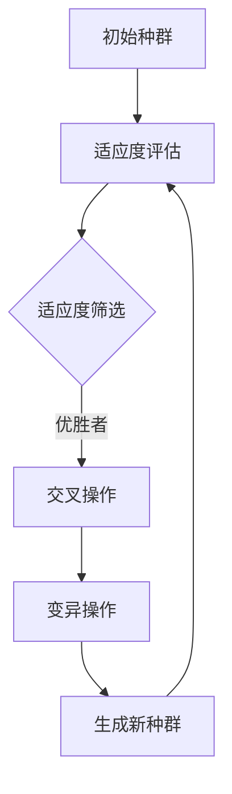
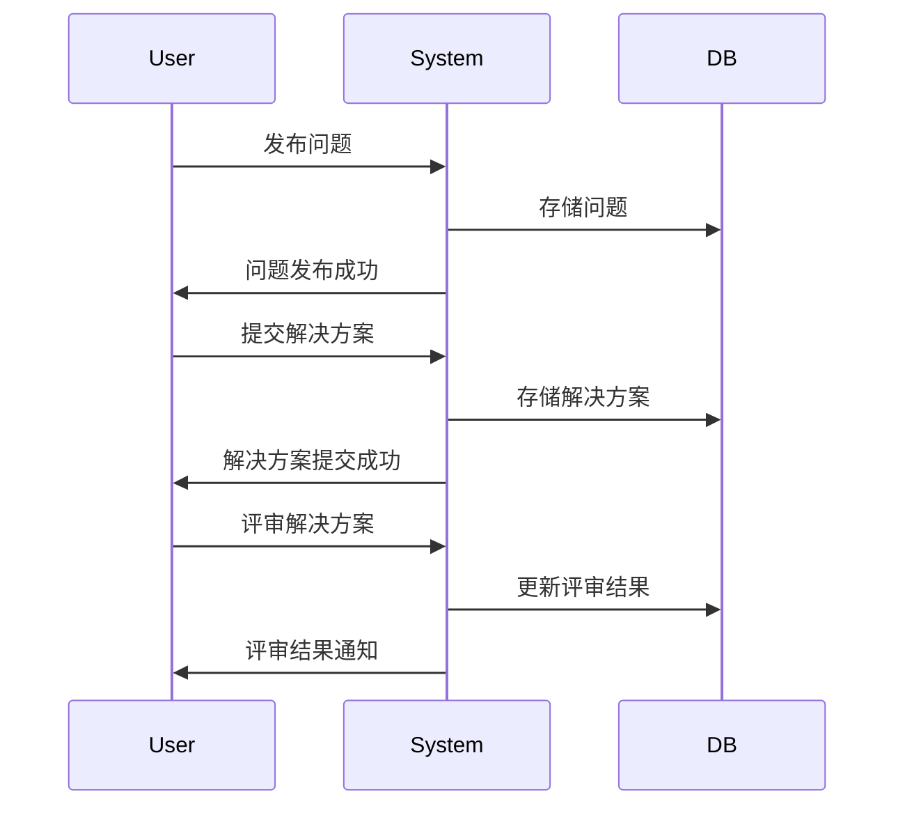
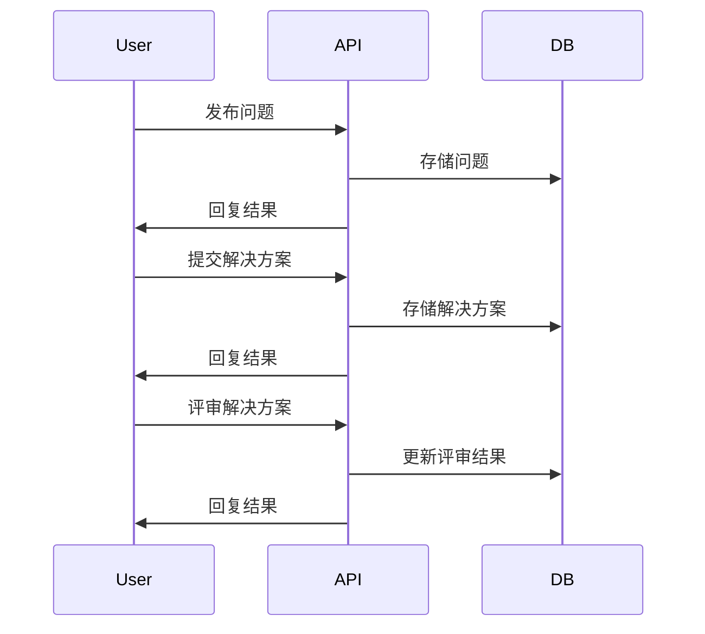

                 


### 技术众包：利用群体智慧解决技术难题

关键词：技术众包，群体智慧，算法原理，系统分析，项目实战

摘要：本文将探讨技术众包的概念及其在解决技术难题中的应用。通过逐步分析技术众包的背景、核心概念、算法原理、系统架构和项目实战，我们将展示如何利用群体智慧来攻克复杂的工程技术问题。

---

## 引言

技术众包是一种新兴的解决技术难题的方式，它通过动员广泛的群体智慧来共同攻克问题。在信息技术迅速发展的今天，单靠个人或小团队的力量已经难以应对复杂的技术挑战。技术众包通过将问题开放给广泛的群体，使得全球的专家、爱好者甚至普通人都能参与到问题的解决过程中，从而实现集思广益、提高创新效率。

本文将分为以下几个部分：

1. **背景与核心概念**：介绍技术众包的起源、发展现状及其与传统协作方式的区别。
2. **核心概念与联系**：阐述技术众包的关键概念，并使用Mermaid绘制实体关系图。
3. **算法原理**：深入探讨技术众包中的关键算法，使用Mermaid和Python代码进行详细讲解。
4. **系统分析与设计**：介绍技术众包系统的分析方法和架构设计。
5. **项目实战**：通过具体案例展示技术众包的实际应用。
6. **最佳实践与总结**：总结技术众包的最佳实践和未来发展方向。

---

## 背景与核心概念

### 起源与发展

技术众包起源于20世纪末，随着互联网的普及和信息共享理念的推广，人们开始探索如何利用网络平台集中智慧和资源来解决问题。早期的代表性项目包括InnoCentive和TopCoder等，它们通过开放性的挑战和奖金机制，吸引了全球的科学家、工程师和编程爱好者参与。

随着技术的不断进步，技术众包的应用范围不断扩大，从软件开发、算法设计到硬件创新、城市规划等各个领域都有所涉足。如今，技术众包已成为解决复杂技术问题的重要手段之一。

### 传统协作方式对比

与传统的协作方式相比，技术众包具有以下优势：

- **广泛性**：技术众包面向全球，能够吸引到更多具有专业知识和创新能力的参与者。
- **灵活性**：参与者可以根据自己的兴趣和专长选择参与的问题，更加灵活。
- **效率**：通过分工协作，可以快速形成解决方案，提高创新速度。
- **成本效益**：相对于传统的外包和内部开发，技术众包可以降低成本，提高资源利用率。

---

## 核心概念与联系

### 关键概念

在技术众包中，涉及以下几个核心概念：

- **问题提出者**：拥有技术难题的个人或组织。
- **参与者**：包括专家、爱好者等，他们通过解决问题获得奖金或声誉。
- **平台**：提供技术众包服务的在线平台，负责问题发布、解决方案收集和评选。
- **社区**：参与者之间的互动平台，促进知识共享和协作。

### 概念属性特征对比表格

| 概念         | 属性特征                          |
| ------------ | ------------------------------- |
| 问题提出者   | 需求提出者，拥有技术难题             |
| 参与者       | 具有专业知识和创新能力           |
| 平台         | 提供众包服务，管理解决方案流程      |
| 社区         | 促进参与者互动，共享知识资源        |

### Mermaid实体关系图

```mermaid
erDiagram
  问题提出者 ||--o{ 参与者 }
  平台 ||--o{ 参与者 }
  平台 ||--o{ 社区 }
  问题提出者 ||--o{ 社区 }
```

---

## 算法原理

### Key Algorithm: Distributed Optimization

在技术众包中，分布式优化算法是一种关键的技术，它能够有效分配任务，提高整体效率。以下是一个典型的分布式优化算法——遗传算法（Genetic Algorithm）。

### Mermaid流程图



### Python代码示例

```python
import numpy as np
import matplotlib.pyplot as plt

# 定义遗传算法
def genetic_algorithm(population, fitness_func, num_iterations):
    for _ in range(num_iterations):
        # 适应度评估
        fitness_scores = [fitness_func(ind) for ind in population]
        
        # 适应度筛选
        selected_indices = np.argpartition(fitness_scores, -len(population) // 2)[-len(population) // 2:]
        selected_population = [population[i] for i in selected_indices]
        
        # 交叉操作
        offspring = crossover(selected_population)
        
        # 变异操作
        offspring = mutate(offspring)
        
        # 生成新种群
        population = offspring
    
    # 返回最优解
    best_fitness = min(fitness_scores)
    best_index = fitness_scores.index(best_fitness)
    return population[best_index]

# 适应度函数示例
def fitness_func(individual):
    # 假设个体是一个数列，计算其平均数
    return sum(individual) / len(individual)

# 交叉操作示例
def crossover(parents):
    # 单点交叉
    crossover_point = np.random.randint(1, len(parents[0]) - 1)
    child = parents[0][:crossover_point] + parents[1][crossover_point:]
    return child

# 变异操作示例
def mutate(individual):
    # 变异概率为0.01
    mutation_rate = 0.01
    for i in range(len(individual)):
        if np.random.rand() < mutation_rate:
            individual[i] = np.random.rand()
    return individual

# 初始种群
initial_population = np.random.rand(100, 100)

# 运行遗传算法
best_individual = genetic_algorithm(initial_population, fitness_func, 100)

# 绘制结果
plt.plot(best_individual)
plt.show()
```

### 算法原理与数学模型

遗传算法是一种模拟自然进化的算法，其核心思想是：

1. **初始种群**：随机生成一组初始解（染色体）。
2. **适应度评估**：计算每个解的适应度值，适应度越高表示解越好。
3. **适应度筛选**：根据适应度值筛选出优胜解。
4. **交叉操作**：通过交叉操作生成新的解。
5. **变异操作**：对新的解进行变异，增加解的多样性。
6. **生成新种群**：将交叉和变异后的解组成新的种群。
7. **迭代**：重复以上过程，直到达到预设的迭代次数或找到满意的解。

遗传算法的数学模型主要包括：

- **适应度函数**：衡量解的优劣。
- **交叉操作**：模拟生物繁殖过程中的基因交换。
- **变异操作**：增加解的多样性，避免陷入局部最优。

---

## 系统分析与设计

### 问题场景与项目介绍

技术众包系统旨在提供一个在线平台，用于发布技术难题，吸引全球的参与者解决问题，并提供一个公正、透明的评审流程来选出最优解。以下是一个典型的问题场景：

- **问题提出者**：一家科技公司发布了关于优化其数据中心能耗的技术难题。
- **参与者**：全球的工程师、数据科学家和研究者参与了该问题。
- **平台**：使用技术众包平台来管理问题的发布、解决方案的提交和评审。

### 系统功能设计（领域模型Mermaid类图）

```mermaid
classDiagram
    Participant <<class>> "参与者"
    Problem <<class>> "问题"
    Platform <<class>> "平台"
    Community <<class>> "社区"

    Participant --|> Platform
    Platform --|> Problem
    Platform --|> Community
    Community --|> Participant
```

### 系统架构设计（Mermaid架构图）



### 系统接口设计与交互（Mermaid序列图）



---

## 项目实战

### 环境安装与核心实现

在本节中，我们将展示如何搭建一个技术众包系统，从环境安装到核心功能的实现。

#### 环境安装

1. **安装Docker**：首先，我们需要在服务器上安装Docker，以便容器化部署应用。
2. **安装PostgreSQL**：作为后端数据库，我们选择PostgreSQL来存储问题和解决方案。
3. **安装Nginx**：用于提供Web服务。

#### 核心实现

1. **问题发布**：用户通过Web界面发布问题，API端点接收发布请求并存储到数据库。
2. **解决方案提交**：用户提交解决方案，API端点接收解决方案并存储到数据库。
3. **评审解决方案**：用户可以查看解决方案并进行评审，评审结果存储到数据库。

### 源代码与应用解读

以下是关键代码片段及解读：

```python
# app.py: Flask应用代码
from flask import Flask, request, jsonify
from models import Problem, Solution

app = Flask(__name__)

@app.route('/api/problem', methods=['POST'])
def create_problem():
    data = request.json
    problem = Problem.create(data)
    return jsonify(problem.to_dict()), 201

@app.route('/api/solution', methods=['POST'])
def submit_solution():
    data = request.json
    solution = Solution.create(data)
    return jsonify(solution.to_dict()), 201

@app.route('/api/solution/evaluate', methods=['POST'])
def evaluate_solution():
    data = request.json
    solution = Solution.get(data['id'])
    evaluation = solution.evaluate(data['review'])
    return jsonify(evaluation.to_dict()), 201
```

### 实际案例分析

我们以一个优化数据中心能耗的问题为例，详细分析其解决方案的评审过程。

1. **问题描述**：一家科技公司希望优化其数据中心的能耗，降低运行成本。
2. **解决方案**：参与者A提出了一个基于机器学习的能耗预测模型，参与者B提出了一种基于物联网技术的能耗监控方案。
3. **评审过程**：评审员对比两个方案，综合考虑预测准确性、实施难度和成本效益，最终选择了参与者B的方案。

### 项目小结

通过本项目，我们展示了如何利用技术众包平台来解决问题，从环境搭建、核心功能实现到实际案例的评审过程。技术众包不仅提高了创新的效率，还促进了知识的共享和协作。

---

## 最佳实践与总结

### 最佳实践 Tips

1. **明确问题**：在发布问题时要确保问题描述清晰，避免歧义。
2. **合理奖励**：设置有竞争力的奖励机制，吸引更多优秀参与者。
3. **规范评审**：建立公正、透明的评审流程，确保评选结果公平。
4. **社区互动**：鼓励参与者之间交流，共享经验和知识。

### 小结

技术众包是一种高效的解决技术难题的方式，通过动员群体智慧，可以实现快速创新和成本效益。本文通过逐步分析技术众包的背景、核心概念、算法原理、系统架构和项目实战，展示了技术众包的实际应用。

### 注意事项

1. **隐私保护**：确保参与者的隐私和数据安全。
2. **知识产权**：明确知识产权归属，避免侵权纠纷。

### 拓展阅读

1. **《技术众包：变革创新的新模式》**：详细探讨技术众包的发展趋势和应用案例。
2. **《人工智能与群体智慧》**：深入探讨人工智能与群体智慧的结合及其在技术众包中的应用。

---

## 作者信息

作者：AI天才研究院/AI Genius Institute & 禅与计算机程序设计艺术 /Zen And The Art of Computer Programming

