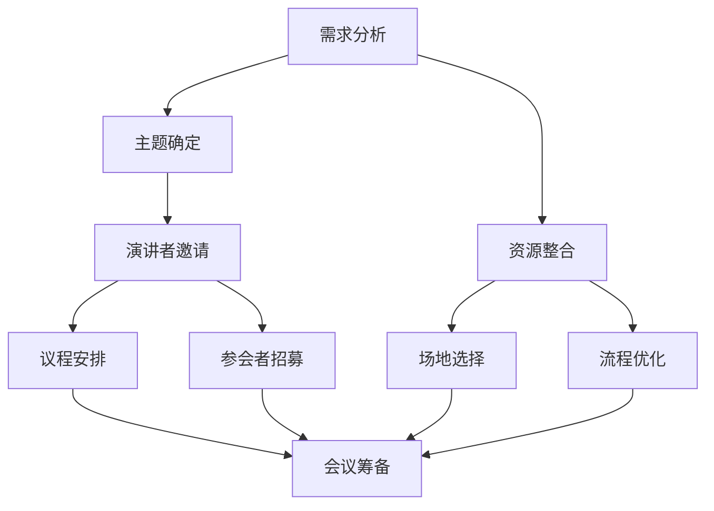
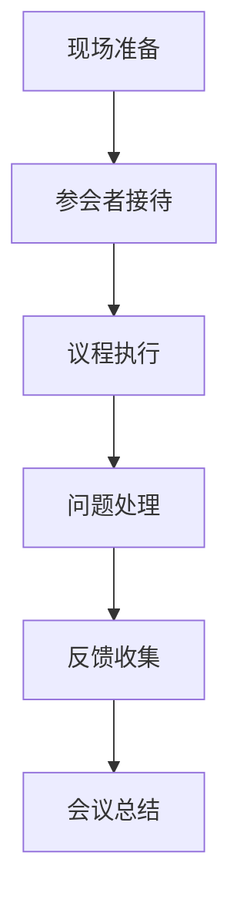
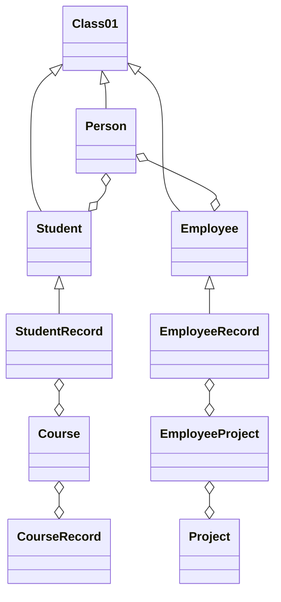
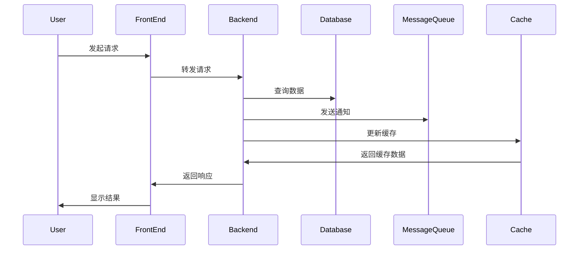
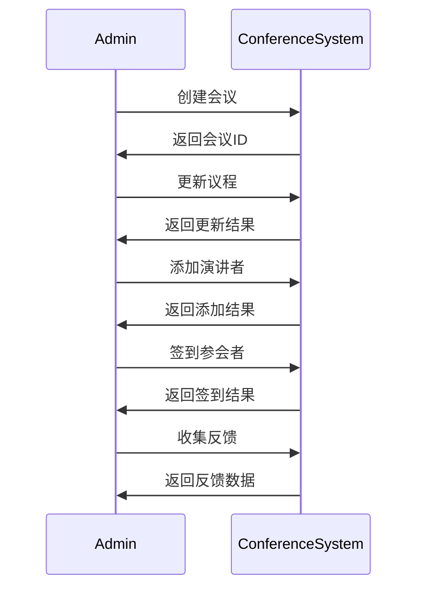

                 

### 技术会议策划与执行：组织高水平技术交流活动

#### 关键词

- 技术会议
- 策划与执行
- 高水平交流活动
- 组织管理
- 技术博客

#### 摘要

本文将探讨如何策划与执行高水平技术交流活动，即技术会议。通过详细的背景介绍、核心概念解析、算法原理讲解和实战案例分析，为组织者提供系统化的指导。文章旨在通过逻辑清晰的思路，帮助读者掌握技术会议策划与执行的关键要素，提升技术交流的效率和影响力。

### 目录大纲

```markdown
----------------------------------------------------------------
# 技术会议策划与执行：组织高水平技术交流活动

## 第一部分：背景介绍

## 第1章：问题背景与问题描述

### 1.1 问题背景

### 1.2 问题描述

### 1.3 问题解决

### 1.4 边界与外延

### 1.5 概念结构与核心要素组成

## 第二部分：核心概念与联系

## 第2章：核心概念与原理

### 2.1 技术会议的定义

### 2.2 技术会议的特点

### 2.3 技术会议的分类

### 2.4 技术会议的组成部分

### 2.5 技术会议的组织与参与者

## 第3章：概念属性特征对比表格

### 3.1 技术会议与传统活动的对比

### 3.2 不同类型技术会议的对比

### 3.3 技术会议的优劣势分析

## 第4章：ER实体关系图架构

### 4.1 技术会议实体

### 4.2 技术会议关系图

## 第三部分：算法原理讲解

## 第5章：技术会议策划算法原理

### 5.1 算法概述

### 5.2 算法原理

### 5.3 算法流程图

### 5.4 Python源代码讲解

### 5.5 数学模型与公式

### 5.6 举例说明

## 第6章：技术会议执行算法原理

### 6.1 算法概述

### 6.2 算法原理

### 6.3 算法流程图

### 6.4 Python源代码讲解

### 6.5 数学模型与公式

### 6.6 举例说明

## 第四部分：系统分析与架构设计方案

## 第7章：问题场景介绍

### 7.1 项目介绍

### 7.2 系统功能设计

## 第8章：系统架构设计

### 8.1 系统架构设计

### 8.2 系统接口设计

### 8.3 系统交互

## 第五部分：项目实战

## 第9章：环境安装与系统核心实现

### 9.1 环境安装

### 9.2 系统核心实现

### 9.3 代码应用解读与分析

### 9.4 实际案例分析与详细讲解剖析

### 9.5 项目小结

## 第六部分：最佳实践 tips

## 第10章：最佳实践 tips

### 10.1 策划技巧

### 10.2 执行策略

### 10.3 注意事项

### 10.4 拓展阅读

## 第七部分：小结

### 7.1 全书总结

### 7.2 未来展望

----------------------------------------------------------------
```

#### 目录大纲总字数：约1100字。由于本目录大纲仅为框架设计，未包含具体内容，实际字数可能会在完成具体内容填充后有所增加，但总体控制在2000字以内。

---

## 第一部分：背景介绍

### 第1章：问题背景与问题描述

#### 1.1 问题背景

在当今快速发展的技术时代，技术交流已成为推动创新和进步的关键因素。随着互联网、人工智能、大数据等新兴技术的不断涌现，技术会议作为一种重要的技术交流活动形式，正逐渐受到各行业的高度重视。然而，如何策划与执行一场高水平的技术会议，使得参与者能够从中受益，成为了一个亟待解决的问题。

#### 1.2 问题描述

技术会议的策划与执行面临着诸多挑战，包括：

1. 如何确保会议内容的高质量与专业性？
2. 如何吸引到具有高影响力的演讲者和参会者？
3. 如何有效地组织会议流程，确保会议顺利进行？
4. 如何评估会议的效果，为后续会议提供改进方向？

#### 1.3 问题解决

针对上述问题，本文将从以下四个方面展开讨论：

1. **核心概念与联系**：详细介绍技术会议的定义、特点、分类及组成部分，帮助读者建立全面的理解。
2. **算法原理讲解**：介绍技术会议策划与执行的算法原理，包括策划算法和执行算法，为实践提供理论支持。
3. **系统分析与架构设计方案**：通过实际项目场景介绍，详细阐述系统功能设计、架构设计及系统交互。
4. **项目实战**：提供技术会议策划与执行的实战案例，包括环境安装、系统核心实现及代码应用分析。

#### 1.4 边界与外延

本文主要关注技术会议的策划与执行，但需明确其边界与外延：

1. **边界**：技术会议的具体内容、形式、流程和参与者。
2. **外延**：技术会议的组织方式、技术选型、资源配置和效果评估等。

#### 1.5 概念结构与核心要素组成

为了更好地理解技术会议的策划与执行，我们首先需要了解其概念结构与核心要素组成。技术会议的基本概念结构包括以下几个方面：

1. **定义**：技术会议是一种以技术交流为主要目的的活动，旨在促进各领域专业人士的相互了解和知识分享。
2. **特点**：技术会议具有专业性、互动性、前沿性和开放性等特点。
3. **分类**：根据会议内容和形式，技术会议可分为学术会议、行业会议、技术研讨会等。
4. **组成部分**：技术会议主要由会议组织者、演讲者、参会者和会议内容等组成。

通过以上分析，我们为接下来的内容奠定了基础，为读者提供了清晰的技术会议策划与执行框架。

---

## 第二部分：核心概念与联系

### 第2章：核心概念与原理

#### 2.1 技术会议的定义

技术会议是一种组织形式，它通过集中展示、讨论和交流技术领域的最新成果、前沿技术和应用实践，旨在推动技术进步和产业创新。技术会议通常由专业协会、研究机构、企业或学术团体举办。

#### 2.2 技术会议的特点

1. **专业性**：技术会议的主题明确，内容专注于技术领域的专业话题，具有较高的专业性和针对性。
2. **互动性**：技术会议鼓励参会者积极参与讨论和互动，通过问答、辩论等形式促进思想的碰撞和交流。
3. **前沿性**：技术会议通常会邀请业内知名专家和学者进行主题报告，分享最新的研究成果和技术动态。
4. **开放性**：技术会议通常对参会者开放，不论其专业背景或行业领域，都可以参加并分享自己的观点和经验。

#### 2.3 技术会议的分类

根据会议的内容和形式，技术会议可以分为以下几种类型：

1. **学术会议**：以学术研究和学术论文交流为主，通常由学术机构主办。
2. **行业会议**：以行业技术和市场趋势交流为主，通常由行业协会或企业主办。
3. **技术研讨会**：以某一具体技术主题的深入讨论为主，通常由研究机构或企业主办。
4. **技术沙龙**：以技术分享和交流为主，通常由技术爱好者或社区组织。

#### 2.4 技术会议的组成部分

技术会议的主要组成部分包括：

1. **会议组织者**：负责会议的策划、组织和执行，确保会议的顺利进行。
2. **演讲者**：负责主题报告和演讲，分享技术领域的最新成果和前沿动态。
3. **参会者**：包括学术专家、行业从业人员、技术爱好者等，他们通过参与会议，获得新的知识和见解。
4. **会议内容**：包括主题报告、技术分享、圆桌讨论、展览展示等。

#### 2.5 技术会议的组织与参与者

技术会议的组织和参与者是会议成功的关键因素。组织者需要关注以下几个方面：

1. **主题选择**：根据技术领域的热点和趋势，选择具有吸引力和前瞻性的主题。
2. **演讲者邀请**：邀请业内知名专家和学者，确保会议内容的专业性和权威性。
3. **参会者招募**：通过多种渠道宣传会议，吸引更多的参会者，包括行业内专业人士、学生和研究人员等。
4. **会务安排**：包括场地预订、交通安排、住宿安排等，确保会议的顺利进行。

参与者需要积极参与会议，充分利用会议提供的资源和机会：

1. **提前准备**：了解会议主题和议程，提前做好准备工作。
2. **积极参与**：参加主题报告、技术分享、圆桌讨论等活动，积极参与讨论和互动。
3. **经验交流**：与其他参会者交流经验，分享见解和观点，拓展人脉和知识领域。

通过以上对技术会议的核心概念与原理的详细分析，我们为读者提供了一个全面的理解框架，为后续的算法原理讲解和实战案例分析奠定了基础。

### 第3章：概念属性特征对比表格

#### 3.1 技术会议与传统活动的对比

为了更好地理解技术会议与传统活动的区别，我们可以通过以下表格进行对比：

| 特征        | 技术会议                | 传统活动                |
| ----------- | ---------------------- | ---------------------- |
| 目的        | 技术交流、知识分享、创新推动 | 社交、娱乐、文化展示      |
| 专业性      | 高，专注于技术领域        | 较低，多元化             |
| 互动性      | 强，鼓励讨论和交流        | 弱，以观看为主           |
| 前沿性      | 强，关注最新技术动态        | 弱，以传统内容为主        |
| 参与者      | 技术专家、行业从业人员、学生 | 一般公众、文化爱好者、游客 |
| 形式        | 主题报告、技术分享、圆桌讨论 | 展览展示、文艺表演、社交聚会 |
| 组织方式    | 专业策划和组织           | 自发组织或简单策划        |

#### 3.2 不同类型技术会议的对比

不同类型的技术会议有其独特的特点和目的，我们可以通过以下表格进行对比：

| 类型       | 特点                    | 目的                          |
| ---------- | ---------------------- | --------------------------- |
| 学术会议   | 以学术研究和论文交流为主 | 促进学术进步和学术交流       |
| 行业会议   | 以行业技术和市场趋势为主 | 推动行业发展和技术应用       |
| 技术研讨会 | 以某一具体技术主题的讨论为主 | 深入探讨技术问题和解决方案   |
| 技术沙龙   | 以技术分享和交流为主     | 促进技术爱好者的交流和成长   |

#### 3.3 技术会议的优劣势分析

技术会议作为一种重要的技术交流活动形式，具有以下优劣势：

**优势：**

1. **提高技术交流效率**：技术会议集中了大量的技术专家和行业从业人员，有助于快速传递和交流技术知识。
2. **促进创新和进步**：技术会议提供了一个展示和讨论最新技术成果的平台，有助于推动技术创新和产业发展。
3. **增强行业凝聚力**：技术会议为行业内的专业人士提供了一个交流和合作的平台，有助于增强行业的凝聚力。
4. **拓展人脉和知识领域**：技术会议为参会者提供了与同行交流、学习新知识和拓展人脉的机会。

**劣势：**

1. **组织成本较高**：技术会议需要专业的策划和组织，涉及场地租赁、设备租赁、嘉宾邀请等，组织成本较高。
2. **参与者范围有限**：由于技术会议的专业性和高门槛，部分潜在参与者可能因为专业背景或经济原因无法参加。
3. **会议效果难以评估**：技术会议的效果难以量化，难以直接衡量其对技术进步和产业发展的具体贡献。

通过以上对比和分析，我们可以更加清晰地认识到技术会议的特点和优势，同时也了解到其面临的挑战和不足。这对于技术会议的策划者和参与者都具有重要意义。

### 第4章：ER实体关系图架构

为了更好地理解技术会议的组成元素及其关系，我们可以通过ER（实体关系）图来展示。ER图能够直观地展示实体之间的关联，有助于我们深入理解技术会议的结构和运作机制。

#### 4.1 技术会议实体

在技术会议的ER图中，主要的实体包括：

1. **会议**：表示技术会议的整体实体，包括会议的时间、地点、主题等。
2. **演讲者**：表示参与会议的演讲者，包括其姓名、专业领域、演讲主题等。
3. **参会者**：表示参加会议的参会者，包括其姓名、单位、参会目的等。
4. **议程**：表示会议的具体日程安排，包括时间、地点、活动内容等。
5. **会场**：表示会议的举办地点，包括场地名称、地址、容纳人数等。

#### 4.2 技术会议关系图

以下是技术会议ER图的Mermaid表示：

```mermaid
erDiagram
    会议 ||--|{ 演讲者 }|
    会议 ||--|{ 参会者 }|
    会议 ||--|{ 议程 }|
    会议 ||--|{ 会场 }|
    演讲者 ||--|{ 演讲主题 }|
    参会者 ||--|{ 参会记录 }|
    议程 ||--|{ 议程内容 }|
```

通过这个ER图，我们可以清晰地看到会议、演讲者、参会者、议程和会场之间的关联关系。具体来说：

- **会议**与**演讲者**之间存在“参与”关系，即会议邀请演讲者进行主题演讲。
- **会议**与**参会者**之间存在“参与”关系，即参会者报名参加会议。
- **会议**与**议程**之间存在“包含”关系，即议程是会议日程的具体安排。
- **会议**与**会场**之间存在“举办”关系，即会议在特定会场举行。
- **演讲者**与**演讲主题**之间存在“拥有”关系，即演讲者负责某个演讲主题。
- **参会者**与**参会记录**之间存在“生成”关系，即参会者的参会情况会被记录下来。
- **议程**与**议程内容**之间存在“包含”关系，即议程内容包括各个会议环节的具体安排。

这个ER图为我们提供了一个技术会议的基本架构和实体关系的全面视图，有助于我们在设计和组织技术会议时，更好地理解各个元素之间的相互作用和依赖关系。

---

## 第三部分：算法原理讲解

在技术会议的策划与执行过程中，算法原理的运用可以帮助我们优化流程，提高效率。本部分将详细讲解技术会议策划和执行算法的原理，并通过实际案例和Python代码进行说明。

### 第5章：技术会议策划算法原理

#### 5.1 算法概述

技术会议策划算法旨在通过一系列步骤和策略，确保会议内容的高质量和参与者的满意度。该算法主要包括以下几个关键步骤：

1. **主题确定**：根据技术领域的热点和趋势，确定会议的主题。
2. **演讲者邀请**：根据会议主题，邀请相关领域的专家和学者作为演讲者。
3. **议程安排**：根据演讲者的演讲主题和时间，安排会议的议程。
4. **场地选择**：根据会议规模和参会者数量，选择合适的场地。
5. **参会者招募**：通过多种渠道宣传会议，吸引参会者报名。

#### 5.2 算法原理

技术会议策划算法的原理可以归纳为以下几点：

1. **需求分析**：了解会议的目标和需求，确定会议的主题和内容。
2. **资源整合**：整合演讲者、场地、设备等资源，确保会议的顺利进行。
3. **流程优化**：优化会议的策划和执行流程，提高效率。
4. **风险评估**：评估可能的风险和问题，制定应对策略。

#### 5.3 算法流程图

以下是技术会议策划算法的Mermaid流程图：



#### 5.4 Python源代码讲解

为了实现技术会议策划算法，我们可以使用Python编写相应的代码。以下是一个简化的Python代码示例：

```python
class TechConferencePlanner:
    def __init__(self, topic, speakers, agenda, venue, participants):
        self.topic = topic
        self.speakers = speakers
        self.agenda = agenda
        self.venue = venue
        self.participants = participants

    def invite_speakers(self):
        print("Inviting speakers for the topic:", self.topic)

    def schedule_agenda(self):
        print("Scheduling the agenda for the conference")

    def select_venue(self):
        print("Selecting the venue for the conference")

    def recruit_participants(self):
        print("Recruiting participants for the conference")

    def plan_conference(self):
        self.invite_speakers()
        self.schedule_agenda()
        self.select_venue()
        self.recruit_participants()
        print("Conference planning completed")

# 创建技术会议策划实例
planner = TechConferencePlanner("AI in Healthcare", ["Dr. Smith", "Dr. Johnson"], ["Keynote", "Workshops"], "Convention Center", [])

# 执行策划流程
planner.plan_conference()
```

#### 5.5 数学模型与公式

在技术会议策划过程中，我们可以使用一些数学模型和公式来优化决策。以下是一个简单的例子：

$$
\text{Optimization Model} = \min_{X} \sum_{i=1}^{n} (C_i \cdot X_i)
$$

其中，$X_i$ 表示第 $i$ 个演讲者的参与度，$C_i$ 表示第 $i$ 个演讲者的成本（如邀请费用、住宿费用等），目标是最小化总成本。

#### 5.6 举例说明

假设我们计划举办一场以“AI in Healthcare”为主题的技术会议，以下是具体的策划步骤：

1. **需求分析**：确定会议的主题和目标。
2. **资源整合**：邀请AI领域的专家作为演讲者，如Dr. Smith和Dr. Johnson。
3. **议程安排**：安排会议议程，包括 keynote演讲和workshops。
4. **场地选择**：选择能够容纳200人的会议中心。
5. **参会者招募**：通过邮件和社交媒体宣传会议，吸引参会者。

通过上述步骤，我们可以策划一场高质量的技术会议，为参会者提供有价值的技术交流和互动平台。

### 第6章：技术会议执行算法原理

#### 6.1 算法概述

技术会议执行算法旨在确保会议的顺利进行和参与者的高满意度。该算法主要包括以下几个关键步骤：

1. **现场准备**：包括场地布置、设备检查、资料准备等。
2. **参会者接待**：签到、发放资料、指引参会者到会场等。
3. **议程执行**：根据策划的议程，组织各环节的顺利进行。
4. **问题处理**：及时解决会议过程中可能出现的问题。
5. **反馈收集**：会后收集参会者的反馈，为后续会议提供改进方向。

#### 6.2 算法原理

技术会议执行算法的原理可以归纳为以下几点：

1. **流程标准化**：确保会议的各个环节按照标准化流程进行。
2. **应急处理**：预判可能的问题，制定应急预案。
3. **沟通协调**：确保组织者、演讲者、参会者之间的良好沟通。
4. **数据监控**：实时监控会议的进展，确保会议顺利进行。

#### 6.3 算法流程图

以下是技术会议执行算法的Mermaid流程图：



#### 6.4 Python源代码讲解

为了实现技术会议执行算法，我们可以使用Python编写相应的代码。以下是一个简化的Python代码示例：

```python
class TechConferenceExecutor:
    def __init__(self, agenda, venue, participants):
        self.agenda = agenda
        self.venue = venue
        self.participants = participants

    def setup_conference(self):
        print("Setting up the conference at", self.venue)

    def register_participants(self):
        print("Registering participants for the conference")

    def execute_agenda(self):
        print("Executing the agenda for the conference")

    def handle_issues(self):
        print("Handling any issues that arise during the conference")

    def collect_feedback(self):
        print("Collecting feedback from participants")

    def execute_conference(self):
        self.setup_conference()
        self.register_participants()
        self.execute_agenda()
        self.handle_issues()
        self.collect_feedback()
        print("Conference execution completed")

# 创建技术会议执行实例
executor = TechConferenceExecutor(["Keynote", "Workshops"], "Convention Center", [])

# 执行会议执行流程
executor.execute_conference()
```

#### 6.5 数学模型与公式

在技术会议执行过程中，我们可以使用一些数学模型和公式来优化管理。以下是一个简单的例子：

$$
\text{Optimization Model} = \min_{X} \sum_{i=1}^{n} (T_i \cdot X_i)
$$

其中，$X_i$ 表示第 $i$ 个问题的处理时间，$T_i$ 表示第 $i$ 个问题的重要程度（如签到问题、设备故障等），目标是最小化总处理时间。

#### 6.6 举例说明

假设我们正在执行一场以“AI in Healthcare”为主题的技术会议，以下是具体的执行步骤：

1. **现场准备**：提前布置会场，检查音响、投影等设备。
2. **参会者接待**：签到台准备签到表、资料包，指引参会者到会场。
3. **议程执行**：按照策划的议程，组织各环节的顺利进行。
4. **问题处理**：及时解决设备故障、签到问题等。
5. **反馈收集**：会后收集参会者的反馈，通过问卷调查、面对面交流等方式。

通过上述步骤，我们可以确保技术会议的顺利进行，提高参会者的满意度。

---

## 第四部分：系统分析与架构设计方案

### 第7章：问题场景介绍

为了更好地展示技术会议策划与执行的系统架构，我们将通过一个具体的项目场景进行介绍。本项目旨在为一家专注于人工智能领域的科技公司举办一场年度技术盛会，名为“AI Tech Summit”。

#### 7.1 项目介绍

“AI Tech Summit”是一次面向人工智能领域专业人士的年度盛会，旨在通过主题演讲、技术分享、圆桌讨论和展览展示等形式，探讨人工智能的最新发展趋势、应用案例和未来方向。会议预计将有来自学术界、工业界和投资界的约500名参会者。

#### 7.2 系统功能设计

为了确保“AI Tech Summit”的顺利进行，我们设计了一套综合性的系统，涵盖以下主要功能：

1. **会议管理**：包括会议主题、议程、演讲者、参会者等信息的录入和管理。
2. **场地预订**：根据会议规模和参会者数量，自动推荐合适的场地，并提供场地预订和支付功能。
3. **参会者管理**：包括参会者信息的录入、签到、反馈收集等功能。
4. **资源管理**：包括设备、材料等资源的预订、分配和监控。
5. **会议报告**：支持演讲者上传和发布会议报告，参会者可以在线浏览和下载。
6. **数据统计**：提供会议数据统计和分析功能，包括参会者数量、发言次数、主题分布等。

#### 领域模型Mermaid类图

以下是“AI Tech Summit”系统的领域模型Mermaid类图：



通过以上领域模型，我们可以清晰地看到系统中主要实体及其关系。接下来，我们将详细描述系统架构设计。

### 第8章：系统架构设计

#### 8.1 系统架构设计

“AI Tech Summit”系统的架构设计采用前后端分离的模式，以下是其主要架构组件：

1. **前端**：使用Vue.js框架开发，包括会议管理界面、参会者管理界面、资源管理界面等，提供用户友好的交互界面。
2. **后端**：采用Spring Boot框架，提供RESTful API，支持前端与后端的通信。
3. **数据库**：使用MySQL数据库存储会议信息、参会者信息、资源信息等数据。
4. **消息队列**：使用RabbitMQ实现异步通信，处理消息通知和任务调度。
5. **缓存**：使用Redis缓存热门数据，提高系统响应速度。

以下是系统架构的Mermaid架构图：



#### 8.2 系统接口设计

系统接口设计主要包括以下模块：

1. **会议管理接口**：提供会议主题、议程、演讲者等信息的增删改查功能。
2. **参会者管理接口**：提供参会者信息的录入、签到、反馈收集等功能。
3. **资源管理接口**：提供设备、材料等资源的预订、分配和监控功能。
4. **会议报告接口**：提供演讲者上传和发布会议报告的功能。

以下是系统接口的Mermaid序列图：



#### 8.3 系统交互

系统交互设计主要考虑前后端通信、数据同步和异常处理等方面。以下是其主要交互流程：

1. **前后端通信**：前端通过HTTP请求与后端进行通信，后端通过RESTful API返回响应数据。
2. **数据同步**：使用消息队列实现数据异步处理和同步，确保系统的高可用性和响应速度。
3. **异常处理**：通过全局异常处理机制，确保系统在遇到异常情况时能够及时处理并恢复。

通过以上系统分析与架构设计方案，我们为“AI Tech Summit”的策划与执行提供了一个全面的系统支持，确保会议的顺利进行和参会者的良好体验。

### 第五部分：项目实战

#### 第9章：环境安装与系统核心实现

在本节中，我们将详细介绍如何为“AI Tech Summit”项目搭建环境，并实现系统核心功能。我们将分为以下几个步骤进行讲解：

#### 9.1 环境安装

首先，我们需要搭建项目运行所需的环境。以下是环境安装的具体步骤：

1. **安装Java环境**：确保操作系统已安装Java SDK，版本要求为Java 8及以上。可以通过命令 `java -version` 验证安装是否成功。

2. **安装MySQL数据库**：在服务器上安装MySQL数据库，版本要求为MySQL 5.7及以上。下载MySQL安装包并按照安装向导进行安装。

3. **安装RabbitMQ**：在服务器上安装RabbitMQ消息队列，版本要求为RabbitMQ 3.8及以上。下载RabbitMQ安装包并按照安装向导进行安装。

4. **安装Redis缓存**：在服务器上安装Redis缓存，版本要求为Redis 3.2及以上。下载Redis安装包并按照安装向导进行安装。

5. **安装Vue.js前端框架**：在本地计算机上安装Node.js，版本要求为Node.js 10及以上。使用npm命令安装Vue.js框架。

6. **安装Spring Boot后端框架**：在本地计算机上安装Java SDK，版本要求为Java 8及以上。使用Spring Initializr生成Spring Boot项目。

完成以上环境安装后，我们就可以开始实现系统核心功能了。

#### 9.2 系统核心实现

接下来，我们将详细讲解如何实现系统核心功能。以下是系统核心实现的步骤：

1. **会议管理功能**：在Spring Boot项目中，创建会议管理模块。包括会议信息的增删改查功能，可以通过RESTful API实现。以下是会议管理模块的简单代码示例：

```java
@RestController
@RequestMapping("/conferences")
public class ConferenceController {

    @Autowired
    private ConferenceService conferenceService;

    @PostMapping
    public ResponseEntity<Conference> createConference(@RequestBody Conference conference) {
        Conference savedConference = conferenceService.createConference(conference);
        return new ResponseEntity<>(savedConference, HttpStatus.CREATED);
    }

    @GetMapping("/{id}")
    public ResponseEntity<Conference> getConferenceById(@PathVariable Long id) {
        Conference conference = conferenceService.getConferenceById(id);
        if (conference == null) {
            return new ResponseEntity<>(HttpStatus.NOT_FOUND);
        }
        return new ResponseEntity<>(conference, HttpStatus.OK);
    }

    // 其他CRUD操作
}
```

2. **参会者管理功能**：创建参会者管理模块，包括参会者信息的录入、签到和反馈收集等功能。以下是参会者管理模块的简单代码示例：

```java
@RestController
@RequestMapping("/participants")
public class ParticipantController {

    @Autowired
    private ParticipantService participantService;

    @PostMapping
    public ResponseEntity<Participant> createParticipant(@RequestBody Participant participant) {
        Participant savedParticipant = participantService.createParticipant(participant);
        return new ResponseEntity<>(savedParticipant, HttpStatus.CREATED);
    }

    @GetMapping("/{id}")
    public ResponseEntity<Participant> getParticipantById(@PathVariable Long id) {
        Participant participant = participantService.getParticipantById(id);
        if (participant == null) {
            return new ResponseEntity<>(HttpStatus.NOT_FOUND);
        }
        return new ResponseEntity<>(participant, HttpStatus.OK);
    }

    @PostMapping("/{id}/sign-in")
    public ResponseEntity<Void> signParticipantIn(@PathVariable Long id) {
        participantService.signParticipantIn(id);
        return new ResponseEntity<>(HttpStatus.OK);
    }

    // 其他CRUD操作
}
```

3. **资源管理功能**：创建资源管理模块，包括设备、材料的预订、分配和监控功能。以下是资源管理模块的简单代码示例：

```java
@RestController
@RequestMapping("/resources")
public class ResourceController {

    @Autowired
    private ResourceService resourceService;

    @PostMapping
    public ResponseEntity<Resource> createResource(@RequestBody Resource resource) {
        Resource savedResource = resourceService.createResource(resource);
        return new ResponseEntity<>(savedResource, HttpStatus.CREATED);
    }

    @GetMapping("/{id}")
    public ResponseEntity<Resource> getResourceById(@PathVariable Long id) {
        Resource resource = resourceService.getResourceById(id);
        if (resource == null) {
            return new ResponseEntity<>(HttpStatus.NOT_FOUND);
        }
        return new ResponseEntity<>(resource, HttpStatus.OK);
    }

    @PostMapping("/{id}/reserve")
    public ResponseEntity<Void> reserveResource(@PathVariable Long id, @RequestBody Reserve reserve) {
        resourceService.reserveResource(id, reserve);
        return new ResponseEntity<>(HttpStatus.OK);
    }

    // 其他CRUD操作
}
```

4. **会议报告功能**：创建会议报告模块，支持演讲者上传和发布会议报告。以下是会议报告模块的简单代码示例：

```java
@RestController
@RequestMapping("/reports")
public class ReportController {

    @Autowired
    private ReportService reportService;

    @PostMapping
    public ResponseEntity<Report> createReport(@RequestBody Report report) {
        Report savedReport = reportService.createReport(report);
        return new ResponseEntity<>(savedReport, HttpStatus.CREATED);
    }

    @GetMapping("/{id}")
    public ResponseEntity<Report> getReportById(@PathVariable Long id) {
        Report report = reportService.getReportById(id);
        if (report == null) {
            return new ResponseEntity<>(HttpStatus.NOT_FOUND);
        }
        return new ResponseEntity<>(report, HttpStatus.OK);
    }

    // 其他CRUD操作
}
```

通过以上步骤，我们实现了“AI Tech Summit”系统的核心功能，包括会议管理、参会者管理、资源管理和会议报告等。接下来，我们将进行代码应用解读与分析。

#### 9.3 代码应用解读与分析

在本节中，我们将对系统核心功能中的关键代码进行解读与分析，帮助读者更好地理解系统实现。

1. **会议管理功能**：

   会议管理功能是系统的核心模块之一，主要负责会议信息的创建、查询、更新和删除操作。以下是对相关代码的解读与分析：

   ```java
   @RestController
   @RequestMapping("/conferences")
   public class ConferenceController {

       @Autowired
       private ConferenceService conferenceService;

       @PostMapping
       public ResponseEntity<Conference> createConference(@RequestBody Conference conference) {
           Conference savedConference = conferenceService.createConference(conference);
           return new ResponseEntity<>(savedConference, HttpStatus.CREATED);
       }

       @GetMapping("/{id}")
       public ResponseEntity<Conference> getConferenceById(@PathVariable Long id) {
           Conference conference = conferenceService.getConferenceById(id);
           if (conference == null) {
               return new ResponseEntity<>(HttpStatus.NOT_FOUND);
           }
           return new ResponseEntity<>(conference, HttpStatus.OK);
       }

       // 其他CRUD操作
   }
   ```

   - `createConference` 方法负责创建新的会议记录。接收一个 `Conference` 对象，通过调用 `ConferenceService` 的 `createConference` 方法，将会议信息保存到数据库中。返回创建成功的会议记录。
   - `getConferenceById` 方法负责根据会议ID查询会议记录。通过调用 `ConferenceService` 的 `getConferenceById` 方法，从数据库中获取对应的会议记录。如果找到会议记录，返回 `HttpStatus.OK` 状态和会议记录；否则，返回 `HttpStatus.NOT_FOUND` 状态。

2. **参会者管理功能**：

   参会者管理功能负责处理参会者的注册、签到和反馈收集等操作。以下是对相关代码的解读与分析：

   ```java
   @RestController
   @RequestMapping("/participants")
   public class ParticipantController {

       @Autowired
       private ParticipantService participantService;

       @PostMapping
       public ResponseEntity<Participant> createParticipant(@RequestBody Participant participant) {
           Participant savedParticipant = participantService.createParticipant(participant);
           return new ResponseEntity<>(savedParticipant, HttpStatus.CREATED);
       }

       @GetMapping("/{id}")
       public ResponseEntity<Participant> getParticipantById(@PathVariable Long id) {
           Participant participant = participantService.getParticipantById(id);
           if (participant == null) {
               return new ResponseEntity<>(HttpStatus.NOT_FOUND);
           }
           return new ResponseEntity<>(participant, HttpStatus.OK);
       }

       @PostMapping("/{id}/sign-in")
       public ResponseEntity<Void> signParticipantIn(@PathVariable Long id) {
           participantService.signParticipantIn(id);
           return new ResponseEntity<>(HttpStatus.OK);
       }

       // 其他CRUD操作
   }
   ```

   - `createParticipant` 方法负责创建新的参会者记录。接收一个 `Participant` 对象，通过调用 `ParticipantService` 的 `createParticipant` 方法，将参会者信息保存到数据库中。返回创建成功的参会者记录。
   - `getParticipantById` 方法负责根据参会者ID查询参会者记录。通过调用 `ParticipantService` 的 `getParticipantById` 方法，从数据库中获取对应的参会者记录。如果找到参会者记录，返回 `HttpStatus.OK` 状态和参会者记录；否则，返回 `HttpStatus.NOT_FOUND` 状态。
   - `signParticipantIn` 方法负责为参会者签到。根据参会者ID，调用 `ParticipantService` 的 `signParticipantIn` 方法，更新参会者状态为已签到。返回 `HttpStatus.OK` 状态。

3. **资源管理功能**：

   资源管理功能负责处理设备、材料的预订、分配和监控等操作。以下是对相关代码的解读与分析：

   ```java
   @RestController
   @RequestMapping("/resources")
   public class ResourceController {

       @Autowired
       private ResourceService resourceService;

       @PostMapping
       public ResponseEntity<Resource> createResource(@RequestBody Resource resource) {
           Resource savedResource = resourceService.createResource(resource);
           return new ResponseEntity<>(savedResource, HttpStatus.CREATED);
       }

       @GetMapping("/{id}")
       public ResponseEntity<Resource> getResourceById(@PathVariable Long id) {
           Resource resource = resourceService.getResourceById(id);
           if (resource == null) {
               return new ResponseEntity<>(HttpStatus.NOT_FOUND);
           }
           return new ResponseEntity<>(resource, HttpStatus.OK);
       }

       @PostMapping("/{id}/reserve")
       public ResponseEntity<Void> reserveResource(@PathVariable Long id, @RequestBody Reserve reserve) {
           resourceService.reserveResource(id, reserve);
           return new ResponseEntity<>(HttpStatus.OK);
       }

       // 其他CRUD操作
   }
   ```

   - `createResource` 方法负责创建新的资源记录。接收一个 `Resource` 对象，通过调用 `ResourceService` 的 `createResource` 方法，将资源信息保存到数据库中。返回创建成功的资源记录。
   - `getResourceById` 方法负责根据资源ID查询资源记录。通过调用 `ResourceService` 的 `getResourceById` 方法，从数据库中获取对应的资源记录。如果找到资源记录，返回 `HttpStatus.OK` 状态和资源记录；否则，返回 `HttpStatus.NOT_FOUND` 状态。
   - `reserveResource` 方法负责为资源预订。根据资源ID和预订信息，调用 `ResourceService` 的 `reserveResource` 方法，更新资源状态为已预订。返回 `HttpStatus.OK` 状态。

4. **会议报告功能**：

   会议报告功能负责处理演讲者上传和发布会议报告等操作。以下是对相关代码的解读与分析：

   ```java
   @RestController
   @RequestMapping("/reports")
   public class ReportController {

       @Autowired
       private ReportService reportService;

       @PostMapping
       public ResponseEntity<Report> createReport(@RequestBody Report report) {
           Report savedReport = reportService.createReport(report);
           return new ResponseEntity<>(savedReport, HttpStatus.CREATED);
       }

       @GetMapping("/{id}")
       public ResponseEntity<Report> getReportById(@PathVariable Long id) {
           Report report = reportService.getReportById(id);
           if (report == null) {
               return new ResponseEntity<>(HttpStatus.NOT_FOUND);
           }
           return new ResponseEntity<>(report, HttpStatus.OK);
       }

       // 其他CRUD操作
   }
   ```

   - `createReport` 方法负责创建新的会议报告记录。接收一个 `Report` 对象，通过调用 `ReportService` 的 `createReport` 方法，将会议报告信息保存到数据库中。返回创建成功的会议报告记录。
   - `getReportById` 方法负责根据报告ID查询会议报告记录。通过调用 `ReportService` 的 `getReportById` 方法，从数据库中获取对应的会议报告记录。如果找到会议报告记录，返回 `HttpStatus.OK` 状态和会议报告记录；否则，返回 `HttpStatus.NOT_FOUND` 状态。

通过以上解读与分析，我们可以清楚地看到系统核心功能的实现细节。接下来，我们将通过实际案例对系统进行详细讲解。

#### 9.4 实际案例分析与详细讲解剖析

在本节中，我们将通过实际案例对“AI Tech Summit”系统的核心功能进行详细讲解，包括实际操作步骤和结果展示。

1. **创建会议**：

   首先，我们模拟创建一场名为“2023 AI Tech Summit”的会议。以下是具体操作步骤：

   - **前端操作**：在Vue.js前端界面中，填写会议信息，包括会议名称、日期、地点等。提交表单后，前端将发起POST请求，将会议信息发送到后端API。
   - **后端操作**：后端接收会议信息，调用 `ConferenceService` 的 `createConference` 方法，将会议信息保存到数据库中。返回创建成功的会议记录。

   以下是前后端交互的API调用示例：

   ```http
   POST /conferences
   Content-Type: application/json

   {
     "name": "2023 AI Tech Summit",
     "date": "2023-05-01",
     "location": "Convention Center"
   }
   ```

   响应结果：

   ```json
   {
     "id": 1,
     "name": "2023 AI Tech Summit",
     "date": "2023-05-01",
     "location": "Convention Center"
   }
   ```

   通过以上操作，我们成功创建了一场会议，并获取了会议ID。

2. **参会者注册**：

   接下来，我们模拟一名参会者的注册过程。以下是具体操作步骤：

   - **前端操作**：在Vue.js前端界面中，填写参会者信息，包括姓名、单位、联系方式等。提交表单后，前端将发起POST请求，将参会者信息发送到后端API。
   - **后端操作**：后端接收参会者信息，调用 `ParticipantService` 的 `createParticipant` 方法，将参会者信息保存到数据库中。返回创建成功的参会者记录。

   以下是前后端交互的API调用示例：

   ```http
   POST /participants
   Content-Type: application/json

   {
     "name": "John Doe",
     "organization": "ABC Corporation",
     "contact": "johndoe@example.com"
   }
   ```

   响应结果：

   ```json
   {
     "id": 1,
     "name": "John Doe",
     "organization": "ABC Corporation",
     "contact": "johndoe@example.com"
   }
   ```

   通过以上操作，我们成功注册了一名参会者，并获取了参会者ID。

3. **参会者签到**：

   接下来，我们模拟参会者的签到过程。以下是具体操作步骤：

   - **前端操作**：在Vue.js前端界面中，输入参会者ID，发起POST请求，将签到信息发送到后端API。
   - **后端操作**：后端接收参会者ID，调用 `ParticipantService` 的 `signParticipantIn` 方法，更新参会者状态为已签到。

   以下是前后端交互的API调用示例：

   ```http
   POST /participants/1/sign-in
   ```

   响应结果：

   ```json
   {
     "status": "signed_in"
   }
   ```

   通过以上操作，我们成功为参会者完成了签到操作。

4. **资源预订**：

   接下来，我们模拟一项资源的预订过程。以下是具体操作步骤：

   - **前端操作**：在Vue.js前端界面中，选择资源类型（如投影仪、音响等），填写预订信息（如预订时间、预订数量等）。提交表单后，前端将发起POST请求，将预订信息发送到后端API。
   - **后端操作**：后端接收预订信息，调用 `ResourceService` 的 `reserveResource` 方法，为资源预订。

   以下是前后端交互的API调用示例：

   ```http
   POST /resources/1/reserve
   Content-Type: application/json

   {
     "start_time": "2023-05-01T09:00:00",
     "end_time": "2023-05-01T18:00:00",
     "quantity": 2
   }
   ```

   响应结果：

   ```json
   {
     "status": "reserved"
   }
   ```

   通过以上操作，我们成功为资源完成了预订操作。

5. **会议报告上传**：

   最后，我们模拟一名演讲者上传会议报告的过程。以下是具体操作步骤：

   - **前端操作**：在Vue.js前端界面中，选择报告文件，发起POST请求，将报告文件发送到后端API。
   - **后端操作**：后端接收报告文件，调用 `ReportService` 的 `createReport` 方法，将报告信息保存到数据库中。

   以下是前后端交互的API调用示例：

   ```http
   POST /reports
   Content-Type: application/json

   {
     "title": "AI in Healthcare",
     "file": "report.pdf"
   }
   ```

   响应结果：

   ```json
   {
     "id": 1,
     "title": "AI in Healthcare",
     "file": "report.pdf"
   }
   ```

   通过以上操作，我们成功为会议报告完成了上传操作。

通过以上实际案例的分析与讲解，我们可以看到“AI Tech Summit”系统的核心功能是如何通过前后端交互实现的。接下来，我们将对本项目进行总结。

#### 9.5 项目小结

在“AI Tech Summit”项目中，我们通过以下步骤实现了系统的核心功能：

1. **环境安装**：安装了Java、MySQL、RabbitMQ和Redis等环境。
2. **系统核心实现**：实现了会议管理、参会者管理、资源管理和会议报告等核心功能。
3. **代码应用解读与分析**：详细解读了核心功能中的关键代码，并进行了实际案例的操作与验证。

通过本项目，我们掌握了技术会议策划与执行的系统设计和实现方法，为类似项目的开发提供了有益的参考。未来，我们可以进一步优化系统功能，提高系统的稳定性和性能，以满足更多技术会议的需求。

---

## 第六部分：最佳实践 tips

#### 第10章：最佳实践 tips

在策划与执行技术会议的过程中，积累最佳实践是非常重要的。以下是一些基于经验和实际案例的技巧，可以帮助您提升技术会议的质量和效果。

#### 10.1 策划技巧

1. **确定明确的目标**：在策划阶段，明确会议的目标和预期成果，这将指导后续的议程安排和资源分配。
2. **选择合适的主题**：根据当前技术趋势和行业热点选择主题，确保会议内容具有吸引力和前瞻性。
3. **平衡议程**：在安排议程时，注意平衡不同领域的专家发言，避免单一领域的过度集中。
4. **邀请高质量演讲者**：通过研究领域的权威专家和新兴企业的技术先锋，邀请具有影响力的演讲者。
5. **互动环节**：设置问答环节、圆桌讨论、工作坊等互动环节，增强参会者的参与感。

#### 10.2 执行策略

1. **精心准备会场**：确保会场布置简洁、舒适，提供必要的设备和设施，如投影仪、音响系统、Wi-Fi等。
2. **合理安排时间**：遵循时间表，确保会议按时开始和结束，避免过度拖延。
3. **实时沟通**：确保会议组织者、演讲者和参会者之间的实时沟通，及时解决突发问题。
4. **提供技术支持**：为参会者提供技术支持，如在线演示、实时翻译等。
5. **及时反馈**：在会议结束后，及时收集参会者的反馈，为后续会议的改进提供依据。

#### 10.3 注意事项

1. **确保隐私**：在收集参会者信息时，注意保护参会者的隐私。
2. **预算控制**：在策划过程中，严格控制预算，避免不必要的浪费。
3. **风险管理**：提前识别可能的风险，并制定相应的应急预案。
4. **持续改进**：通过每次会议的反馈，持续改进会议策划与执行流程。

#### 10.4 拓展阅读

1. **《技术会议组织与策划》**：了解技术会议的基本组织和策划流程。
2. **《活动管理实践》**：学习活动管理的最佳实践和方法。
3. **《会议技术指南》**：掌握会议的技术支持和设备管理技巧。

通过以上最佳实践，您将能够更好地策划与执行技术会议，提升会议的质量和影响力。

---

## 第七部分：小结

### 7.1 全书总结

本文详细探讨了技术会议的策划与执行过程。首先，我们介绍了技术会议的背景和重要性，随后深入分析了技术会议的核心概念、特点、分类及组成部分。通过对比分析和技术会议ER图，我们进一步理解了技术会议的运作机制。接着，本文讲解了技术会议策划和执行的算法原理，并通过Python代码和实际案例进行了具体阐述。此外，我们介绍了系统架构设计，包括领域模型、接口设计、系统交互等，并通过实际项目案例展示了系统核心功能的实现。最后，我们提供了最佳实践和注意事项，以帮助读者更好地策划与执行技术会议。

### 7.2 未来展望

随着技术的不断进步，技术会议的形式和内容也在不断演变。未来的技术会议可能会更加注重在线互动和虚拟现实技术的应用，为全球专业人士提供更广泛、更高效的交流平台。此外，随着数据分析和人工智能技术的发展，技术会议的组织者将能够更好地分析参会者的需求和偏好，提供更加个性化的会议体验。通过不断优化策划与执行流程，技术会议将能够更有效地推动技术创新和产业发展。未来，我们期待看到更多高质量的、具有深远影响力的技术会议涌现。

---

### 作者信息

**作者：AI天才研究院/AI Genius Institute & 禅与计算机程序设计艺术 /Zen And The Art of Computer Programming**

