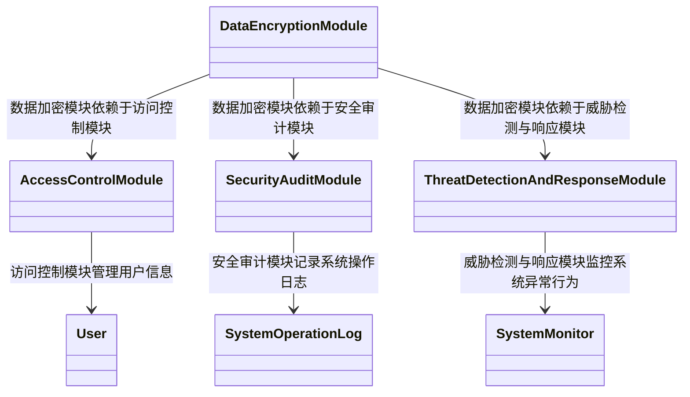
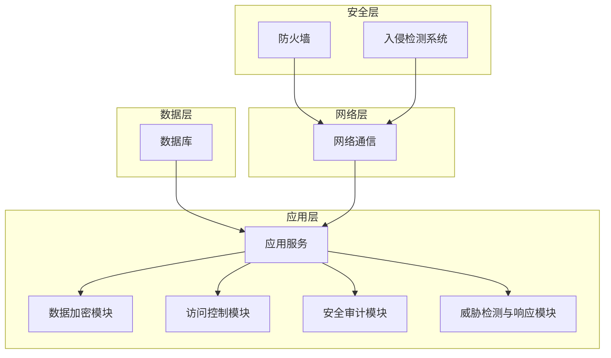
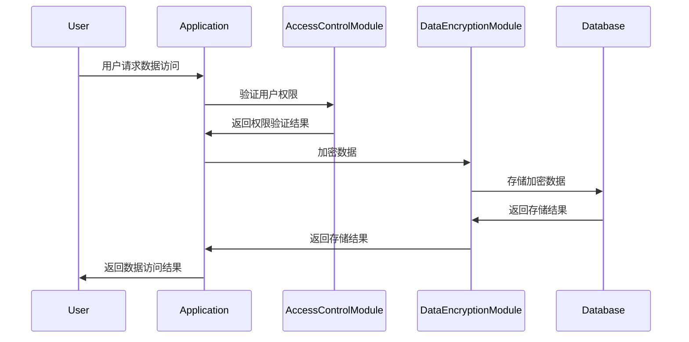
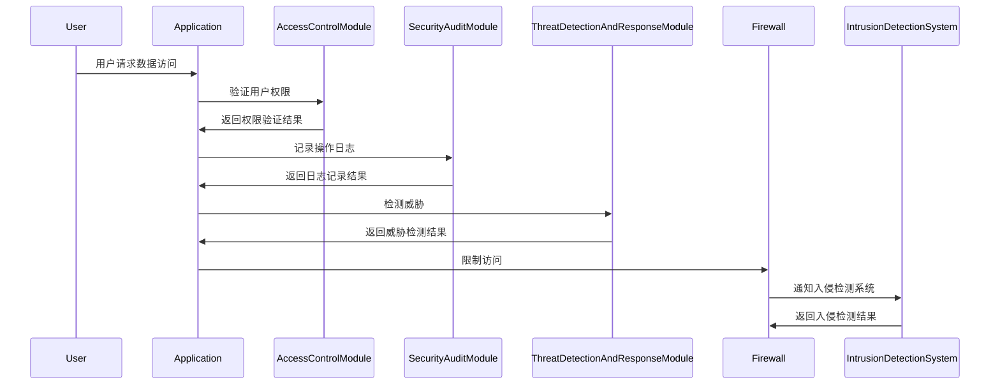

                 

### 引言

在技术飞速发展的当今社会，技术与伦理的碰撞愈发频繁。随着人工智能、大数据、物联网等新兴技术的广泛应用，技术带来的便利和问题也日益显著。如何平衡技术创新与社会责任，成为了一个备受关注的重要议题。

首先，我们来看技术伦理的基本概念。技术伦理是关于技术在应用中应遵循的道德规范和价值观，它关注技术对人类生活和社会环境的影响。技术伦理的核心问题包括隐私权、数据安全、知识产权等。这些问题不仅关系到个人的权益，也影响着社会的稳定和进步。

其次，社会责任在技术创新中扮演着重要角色。社会责任是指企业、组织和个人在技术发展中应承担的社会义务，包括环保、公益、公平等价值理念。技术创新与社会责任之间的关系是相互促进的，社会责任可以推动技术创新，技术创新也可以更好地实现社会责任。

然而，技术伦理问题在实际操作中并不容易解决。例如，人工智能在提高生产效率的同时，也带来了就业市场的冲击；大数据技术在为人们提供便利的同时，也暴露了个人隐私的风险。这些问题需要我们从伦理的角度进行深入思考，寻找合理的解决方案。

为了更好地探讨技术伦理与社会责任的关联，本文将采用以下研究方法：首先，结合案例研究和理论分析，探讨技术伦理问题的现状和解决方案；其次，通过对比分析不同理论框架，探讨技术伦理的基本概念和核心问题；最后，提出具体的政策建议和实践策略，为技术开发者提供伦理指导。

本文结构如下：首先介绍技术伦理的基本概念，包括技术伦理的定义与意义、核心问题以及理论框架；接着讨论社会责任与技术创新的关系，分析技术创新中的社会责任实践；随后通过具体案例研究，探讨技术伦理问题的现实影响；然后探讨技术伦理与社会责任的制度框架，包括法规政策、企业社会责任管理体系和技术伦理教育；最后展望技术伦理与社会责任的未来发展趋势，并提出政策建议和展望。

通过本文的探讨，我们希望能够为技术伦理和社会责任的协调发展提供一些有益的思考和借鉴。

### 第1章：技术伦理的基本概念

#### 1.1 技术伦理的定义与意义

技术伦理是关于技术在应用中应遵循的道德规范和价值观。它不仅关注技术本身的开发和应用，还关注技术对人类社会和生态环境的影响。技术伦理的定义可以从多个角度进行解读：

首先，技术伦理是技术活动的道德指南。在技术的开发和运用过程中，开发者需要遵循一定的道德原则，确保技术的应用不会对社会和个人造成负面影响。例如，在人工智能领域，开发者需要关注算法的公平性和透明性，避免技术滥用和歧视现象的发生。

其次，技术伦理是价值观的体现。技术的发展不仅是为了满足人类的物质需求，还应该符合社会的价值观念。在技术伦理中，尊重个人隐私、保护环境、促进公平等价值理念尤为重要。这些价值观的体现，有助于技术发展与社会需求的和谐统一。

技术伦理的意义主要体现在以下几个方面：

1. **社会和谐**：技术伦理有助于构建和谐的社会环境。通过规范技术行为，减少技术滥用和负面影响，促进社会的稳定和繁荣。
2. **技术创新**：技术伦理为技术创新提供了道德支持。在遵循伦理原则的基础上，技术开发者可以更加自由地进行创新，推动技术的进步。
3. **个人自由**：技术伦理保护了个人自由。通过规范技术对个人隐私的保护，个人可以在技术应用中保持一定的自主权和隐私权。
4. **法律保障**：技术伦理为法律法规的制定提供了依据。通过明确技术行为的道德底线，有助于完善相关法律法规，保护公众利益。

#### 1.2 技术伦理的核心问题

技术伦理的核心问题涵盖了多个方面，以下是一些主要的核心问题：

1. **隐私权**：随着大数据技术和物联网的普及，个人隐私权受到了前所未有的挑战。如何在技术发展中保护个人隐私，成为了一个亟待解决的问题。
   
2. **数据安全**：数据泄露和黑客攻击事件频发，数据安全问题日益突出。如何确保数据的安全性和完整性，是技术伦理的一个重要议题。

3. **知识产权**：技术创新离不开知识产权的保护，但知识产权的滥用也会对创新产生负面影响。如何在保护知识产权的同时，促进技术进步和创新，是一个复杂的伦理问题。

4. **伦理决策**：技术开发者在面对伦理困境时，如何做出正确的决策，是技术伦理的核心问题之一。伦理决策的复杂性在于，它需要考虑到技术应用的广泛影响，以及道德原则的具体应用。

5. **环境伦理**：技术发展对环境的影响不可忽视。如何在技术创新中保护生态环境，实现可持续发展，是技术伦理的一个重要方面。

#### 1.3 技术伦理的理论框架

技术伦理的理论框架为理解和解决技术伦理问题提供了理论基础。以下是一些主要的理论框架：

1. **功利主义**：功利主义认为，技术行为的道德价值取决于其产生的后果。在技术伦理中，功利主义强调技术的应用应该最大化社会的幸福和福利。

2. **康德伦理学**：康德伦理学强调道德行为的绝对原则，即行为本身应出于道德义务而非其他目的。在技术伦理中，康德伦理学提倡技术开发者应遵守道德规范，不论技术应用的后果如何。

3. **社会契约论**：社会契约论认为，技术在现代社会的运行应当遵循一定的社会契约。技术开发者和社会公众通过契约来规范技术行为，确保技术的正当性和合理性。

4. **责任伦理学**：责任伦理学强调技术开发者对技术后果的责任。技术开发者不仅需要在技术设计阶段考虑伦理问题，还需要在技术应用阶段承担相应的责任。

通过上述理论框架，我们可以更好地理解和分析技术伦理问题，为技术开发者提供伦理指导。

### 第2章：社会责任与技术创新

#### 2.1 社会责任的概念与内涵

社会责任是指企业、组织和个人在技术发展中应承担的社会义务。它不仅包括对环境的保护、对公共利益的维护，还涵盖了对社会公平、透明和道德的坚守。社会责任的内涵丰富，主要包括以下几个方面：

1. **环境保护**：企业在技术发展中应关注对环境的影响，采取环保措施，减少污染和资源浪费。例如，通过采用绿色能源、提高能源利用效率等方式，实现可持续发展。

2. **社会公益**：企业应积极参与社会公益活动，回馈社会。例如，通过捐款、捐物、开展公益项目等方式，帮助解决社会问题，提升社会福利。

3. **公平与透明**：企业在技术发展中应确保公平和透明，避免歧视和不公正现象。例如，在招聘、晋升、薪酬等方面，应保证公正和透明，提升员工的满意度和忠诚度。

4. **道德责任**：企业在技术发展中应遵守道德规范，不以牺牲社会利益为代价追求商业利益。例如，在广告宣传、产品质量、服务标准等方面，应遵守相关法律法规和道德规范。

#### 2.2 技术创新与社会责任的关系

技术创新与社会责任之间的关系是相互促进的。一方面，技术创新可以推动社会责任的实现；另一方面，社会责任可以促进技术创新的发展。

1. **技术创新推动社会责任的实现**：

   - **环境保护**：技术创新可以带来环保技术的突破，例如，清洁能源技术、废弃物处理技术等，有助于减少环境污染，实现可持续发展。
   - **社会公益**：技术创新可以推动社会公益项目的实施，例如，通过人工智能技术进行疾病诊断，帮助更多患者获得及时治疗。
   - **公平与透明**：技术创新可以提升信息透明度，促进社会公平。例如，区块链技术在金融领域的应用，有助于提升金融交易的透明度和公正性。
   - **道德责任**：技术创新可以帮助企业更好地履行道德责任。例如，通过智能合约技术，企业可以更好地执行合同条款，提升商业诚信。

2. **社会责任促进技术创新的发展**：

   - **市场需求**：社会责任的履行可以创造新的市场需求，推动技术创新。例如，随着消费者对环保产品的需求增加，企业需要不断创新，以满足市场需求。
   - **政策支持**：社会责任的履行可以吸引政府的政策支持，促进技术创新。例如，政府通过财政补贴、税收优惠等政策，鼓励企业进行技术创新。
   - **人才吸引**：社会责任的履行可以提升企业的社会形象，吸引更多优秀人才。技术创新需要高水平的人才支持，社会责任的履行有助于吸引和留住人才。
   - **企业竞争力**：社会责任的履行可以提高企业的竞争力，推动技术创新。社会责任优秀的企业往往在市场竞争中更具优势，能够吸引更多客户和合作伙伴。

#### 2.3 技术创新中的社会责任实践

技术创新中的社会责任实践是企业实现可持续发展的重要途径。以下是一些具体的实践案例：

1. **环境保护实践**：

   - **比亚迪公司**：比亚迪是一家致力于新能源汽车和电池技术的企业。通过技术创新，比亚迪推出了多款环保型电动汽车，减少了汽车尾气排放，为环境保护做出了积极贡献。
   - **特斯拉公司**：特斯拉在电动汽车领域取得了显著成绩。通过采用太阳能电池和储能技术，特斯拉不仅实现了电动汽车的零排放，还推动了可再生能源的发展。

2. **社会公益实践**：

   - **阿里巴巴公益基金会**：阿里巴巴公益基金会通过捐款、公益项目等方式，积极参与社会公益活动。例如，通过“马云公益基金”，支持贫困地区教育、医疗和环保事业。
   - **腾讯公益慈善基金会**：腾讯公益慈善基金会开展了多个公益项目，如“腾讯公益平台”、“腾讯爱心包裹”等，通过互联网技术，提升公益效率和影响力。

3. **公平与透明实践**：

   - **阿里巴巴集团**：阿里巴巴通过平台治理，提升交易透明度和公正性。例如，通过建立信用评价体系，保障消费者和商家的合法权益。
   - **腾讯公司**：腾讯在产品和服务中注重公平性。例如，在游戏领域，腾讯推出了一系列措施，防止沉迷游戏，保护青少年身心健康。

4. **道德责任实践**：

   - **华为公司**：华为始终坚持技术创新和商业诚信。通过不断研发新技术，华为提升了产品质量和性能，赢得了全球客户的信任。
   - **微软公司**：微软在产品设计和推广中，注重道德责任。例如，通过推出隐私保护功能，微软帮助用户更好地保护个人信息。

通过这些实践案例，我们可以看到，技术创新与社会责任是相辅相成的。技术创新不仅能够推动社会责任的实现，也能够通过社会责任的履行，提升企业的竞争力和社会影响力。企业在技术创新过程中，应积极履行社会责任，实现可持续发展。

### 第3章：技术伦理问题案例分析

#### 3.1 案例研究一：人工智能与就业

**问题背景**：随着人工智能（AI）技术的迅猛发展，其应用范围日益广泛，从工业自动化、医疗诊断到金融分析，AI正在改变各行各业的生产和运营方式。然而，AI技术的发展也引发了关于就业市场的广泛担忧。许多专家和学者认为，人工智能可能会替代大量的传统就业岗位，导致大规模的失业现象。

**案例分析**：以人工智能在制造业中的应用为例，机器人和自动化系统已经在多个领域替代了人力劳动。例如，富士康在郑州的工厂引入了大量自动化设备，以减少对人工的依赖。这一举措虽然提高了生产效率和产品质量，但也导致了大量工人失业。此外，AI在金融和客服领域的应用也使得许多传统岗位变得不再必要。

**伦理问题**：人工智能对就业市场的冲击引发了多个伦理问题，包括：

1. **就业不公**：人工智能替代人力可能导致就业机会的不平等分配。那些无法适应新技术要求的人群可能会被排除在就业市场之外，加剧社会不平等。

2. **人权侵犯**：在某些情况下，人工智能系统可能侵犯人权，例如通过歧视性的算法决策，拒绝给予某些群体就业机会或提供服务。

3. **伦理责任**：企业在应用人工智能技术时，需要承担一定的伦理责任。企业应确保其技术应用不会导致社会不稳定和伦理风险，同时积极采取措施减少对就业市场的负面影响。

**解决方案**：

1. **教育培训**：政府和企业应加大对劳动者的教育培训投入，帮助其适应新技术，提升就业能力。例如，开展职业技能培训项目，提供再就业服务。

2. **政策支持**：政府应出台相关政策，鼓励企业投资人工智能领域，同时提供就业保障措施。例如，设立专项基金，支持企业进行人才培训和再就业。

3. **公平算法**：企业在开发和应用人工智能系统时，应确保算法的公平性和透明度，避免歧视行为。通过第三方审计和评估，提高算法的道德合规性。

#### 3.2 案例研究二：大数据与隐私

**问题背景**：大数据技术的发展使得企业和组织能够收集、存储和分析海量数据，从而为商业决策和公共服务提供有力支持。然而，大数据技术的广泛应用也带来了隐私保护方面的挑战。个人数据的泄露和滥用事件频发，引起了公众对隐私权的广泛关注。

**案例分析**：以Facebook的Cambridge Analytica数据泄露事件为例，该事件揭示了大数据技术在政治选举中的潜在风险。Cambridge Analytica未经用户同意，非法获取了8700万Facebook用户的数据，用于政治广告投放和选民行为分析。这一事件引起了全球范围内对大数据隐私保护的广泛关注。

**伦理问题**：大数据与隐私保护相关的伦理问题主要包括：

1. **隐私权侵犯**：大数据技术的应用可能导致个人隐私权的侵犯。未经用户同意，企业收集和使用个人数据，可能侵犯用户的隐私权。

2. **数据滥用**：大数据技术被滥用，可能导致个人信息的泄露和滥用，例如，通过数据挖掘和分析，进行非法的欺诈行为或市场操纵。

3. **透明度和责任**：大数据技术的应用通常缺乏透明度，用户难以了解其数据被如何收集、使用和共享。此外，当发生数据泄露事件时，责任归属不明确，导致用户难以维权。

**解决方案**：

1. **数据保护法规**：政府应出台严格的数据保护法规，规范大数据技术的应用。例如，实施数据隐私保护法案，加强对个人数据的保护。

2. **用户知情权**：企业应尊重用户的知情权，在收集和使用用户数据时，明确告知用户数据的用途和范围。同时，提供用户数据访问和删除的渠道，保障用户的隐私权。

3. **技术措施**：企业应采取有效的技术措施，保护用户数据的隐私和安全。例如，采用数据加密、访问控制和数据脱敏等技术，防止数据泄露和滥用。

#### 3.3 案例研究三：网络安全与信息安全

**问题背景**：随着互联网的普及和信息的数字化，网络安全与信息安全问题日益突出。网络攻击、数据泄露、黑客入侵等事件频繁发生，对个人隐私、企业利益和社会稳定构成了严重威胁。

**案例分析**：以2017年WannaCry勒索软件攻击事件为例，该事件影响了全球多个国家和地区，导致大量企业、政府机构和医疗机构受到攻击，数据被加密并要求支付赎金才能解密。这一事件凸显了网络安全与信息安全的紧迫性。

**伦理问题**：网络安全与信息安全相关的伦理问题主要包括：

1. **数据安全**：网络安全攻击可能导致大量数据泄露和丢失，侵犯用户的隐私权，对企业造成经济损失。

2. **伦理责任**：企业和组织在网络安全方面存在漏洞时，可能需要承担伦理责任。例如，如果企业未能采取合理的网络安全措施，导致用户数据泄露，企业可能需要承担法律责任和道德责任。

3. **公众信任**：网络安全事件的频繁发生，可能导致公众对互联网和数字化技术的信任度下降，影响社会的整体发展。

**解决方案**：

1. **安全防护措施**：企业和组织应采取有效的安全防护措施，如安装防病毒软件、防火墙等，保护网络和数据的安全。

2. **安全培训**：企业和组织应加强对员工的网络安全培训，提高员工的网络安全意识和防范能力。

3. **法律法规**：政府应出台相关的网络安全法律法规，规范网络行为，打击网络犯罪，保护公众利益。

4. **透明沟通**：在发生网络安全事件时，企业和组织应与公众保持透明沟通，及时披露事件信息，减轻事件对公众的负面影响。

通过上述案例分析，我们可以看到，技术伦理问题在不同领域都有其独特的表现和影响。解决这些问题需要各方共同努力，通过法律法规、技术措施和社会责任的履行，实现技术创新与社会发展的和谐统一。

### 第4章：技术伦理与社会责任的制度框架

#### 4.1 技术伦理法规与政策

为了规范技术发展，确保技术伦理得到有效实施，各国政府和国际组织纷纷出台了一系列技术伦理法规和政策。这些法规和政策涵盖了数据保护、网络安全、知识产权等多个方面，旨在保护公众利益，促进技术进步。

**国际技术伦理法规**

1. **欧盟《通用数据保护条例》（GDPR）**：GDPR是迄今为止最严格的数据保护法规，它要求企业在处理个人数据时，必须获得用户的明确同意，并采取适当的技术措施保护数据安全。GDPR对数据泄露事件的处罚非常严厉，对企业具有强大的约束力。

2. **联合国《国际电信联盟》（ITU）**：ITU制定了一系列关于网络安全和数据保护的全球标准，如《国际网络安全标准》和《国际数据隐私保护标准》，旨在推动全球范围内的技术伦理建设。

3. **国际标准化组织（ISO）**：ISO发布了多个与技术伦理相关的标准，如ISO/IEC 27001（信息安全管理体系）和ISO/IEC 17025（实验室技术能力认可准则），为企业提供技术伦理管理的指导。

**国内技术伦理法规**

1. **中国《网络安全法》**：中国网络安全法于2017年正式实施，明确了网络运营者在数据处理、存储、传输过程中的责任和义务。该法要求企业在处理个人信息时，必须采取有效措施保护个人隐私。

2. **中国《个人信息保护法》**：个人信息保护法于2021年正式实施，进一步加强对个人信息的保护。该法规定了个人信息处理的基本原则、个人信息的收集和使用规则，以及数据泄露事件的报告和处理机制。

3. **中国《数据安全法》**：数据安全法于2021年通过，旨在规范数据安全管理，保护国家安全和社会公共利益。该法明确了数据安全保护的责任主体和法律责任，强化了对数据安全的监管。

#### 4.2 企业社会责任管理体系

企业社会责任（CSR）管理体系是企业履行社会责任的重要工具，它帮助企业系统地识别、评估和应对社会责任问题，实现可持续发展。以下是企业社会责任管理体系的几个关键组成部分：

1. **社会责任策略**：企业应制定明确的社会责任策略，将社会责任融入企业的愿景、使命和价值观。社会责任策略应包括明确的目标、优先领域和实施计划。

2. **社会责任报告**：企业应定期发布社会责任报告，详细披露企业在环境保护、员工权益、客户权益、社区发展等方面的表现和成果。社会责任报告应具备透明度和可信度，以便利益相关者进行监督。

3. **社会责任评估**：企业应定期进行社会责任评估，以识别潜在的社会责任风险和机会。社会责任评估可以通过内部审计、第三方评估等方式进行，确保企业社会责任管理体系的持续改进。

4. **社会责任培训**：企业应加强社会责任培训，提高员工对社会责任的认识和参与度。培训内容应包括社会责任的基本知识、企业社会责任实践案例以及相关法律法规。

5. **社会责任监督**：企业应建立有效的社会责任监督机制，确保社会责任策略的执行和报告的真实性。社会责任监督可以采用内部审计、外部审计和利益相关者反馈等方式进行。

#### 4.3 技术伦理教育

技术伦理教育是培养技术开发者和从业者道德素养的重要途径。通过技术伦理教育，可以增强技术开发者在技术创新中的道德责任感，减少技术伦理问题的发生。

1. **课程设置**：高校和职业教育机构应设置技术伦理相关课程，将技术伦理知识融入专业课程中。课程内容应包括技术伦理的基本概念、案例分析、伦理决策方法等。

2. **实践培训**：通过实践培训，让学生在真实的案例中学习和应用技术伦理知识。实践培训可以采用案例研究、模拟实验、伦理辩论等方式进行。

3. **职业伦理规范**：技术开发者和从业者应遵守职业伦理规范，确保在技术开发和应用中遵循道德原则。职业伦理规范可以由行业协会或专业组织制定和推广。

4. **持续教育**：技术伦理是一个不断发展的领域，技术开发者和从业者应不断学习新的技术伦理知识和理论，适应技术发展的变化。

通过建立和完善技术伦理法规与政策、企业社会责任管理体系和技术伦理教育体系，我们可以为技术发展提供更加坚实的伦理基础，促进技术创新与社会责任的协调发展。

### 第5章：技术创新中的伦理决策

#### 5.1 伦理决策的原则与方法

在技术创新过程中，伦理决策是一个复杂且关键的过程。正确的伦理决策不仅关乎技术的合法性，更关系到技术的可持续性和社会接受度。以下是一些关键的伦理决策原则和方法：

1. **功利主义原则**：功利主义强调最大化总体幸福和福利。在技术创新中，这一原则要求开发者评估技术应用的利弊，选择那些能够带来最大社会利益的技术方案。

2. **康德伦理学原则**：康德伦理学强调道德行为的绝对性。在技术创新中，这一原则要求开发者遵循道德规范，无论技术应用的结果如何，都必须坚持正确的道德原则。

3. **社会契约原则**：社会契约原则认为技术应遵守社会共同认可的规范和价值观。在技术创新中，这一原则要求开发者考虑到社会的期望和规范，确保技术的应用符合社会契约。

4. **责任伦理学原则**：责任伦理学强调开发者对技术后果的责任。在技术创新中，这一原则要求开发者不仅要考虑技术的直接后果，还要考虑潜在的间接后果，并采取适当的措施预防和应对。

**伦理决策的方法**

1. **伦理评估**：进行伦理评估是做出正确伦理决策的第一步。伦理评估包括识别技术应用中的潜在伦理问题、分析这些问题的道德影响，并提出可能的解决方案。

2. **多标准评估**：在伦理决策中，应考虑多个伦理标准和价值观，如公正、透明、隐私、安全等。多标准评估可以帮助开发者全面考虑技术应用的各个方面。

3. **伦理咨询**：在复杂的技术决策中，开发者可以寻求外部伦理专家的意见。伦理咨询可以提供专业的伦理指导，帮助开发者从不同角度分析问题。

4. **公众参与**：技术开发者和决策者应邀请公众参与伦理决策过程。公众参与可以增加决策的透明度和公正性，确保技术的应用符合社会的需求和期望。

#### 5.2 伦理困境与伦理选择

技术创新过程中，开发者可能会遇到各种伦理困境。以下是一些常见的伦理困境和相应的伦理选择策略：

1. **隐私与效率的权衡**：在数据驱动的技术应用中，开发者需要在隐私保护和数据利用之间找到平衡。例如，在医疗领域，如何使用患者数据进行研究和治疗，同时保护患者的隐私。

   **伦理选择策略**：开发者可以通过数据匿名化、隐私保护算法等技术手段，减少隐私泄露的风险。同时，制定严格的隐私政策和数据使用规范，确保患者的隐私权得到尊重。

2. **技术垄断与市场公平**：某些技术可能会形成垄断，影响市场竞争。例如，某些大型科技公司在人工智能和大数据领域拥有绝对优势，可能导致市场垄断。

   **伦理选择策略**：政府可以通过监管措施，如反垄断法规，限制技术垄断行为，确保市场的公平竞争。企业应主动承担社会责任，促进技术普及和共享，减少市场垄断的风险。

3. **科技进步与人类福祉**：在某些情况下，科技进步可能会带来严重的伦理挑战，例如，基因编辑技术的应用可能引发伦理争议。

   **伦理选择策略**：开发者应密切关注科技进步的伦理影响，通过伦理评估和公众参与，确保技术的应用符合人类的福祉。同时，政府和国际组织应制定相应的伦理规范和法规，引导科技进步的健康发展。

#### 5.3 伦理审查与监督机制

为了确保技术创新中的伦理决策得到有效执行，建立伦理审查和监督机制至关重要。以下是一些关键措施：

1. **伦理审查委员会**：建立独立的伦理审查委员会，负责对技术创新项目进行伦理审查。伦理审查委员会应由伦理学家、法律专家、社会学家、技术人员等多方面专家组成。

2. **伦理审查流程**：明确伦理审查的流程和标准，确保所有技术创新项目在启动前都经过严格的伦理审查。伦理审查流程应包括项目申请、伦理评估、公众参与和最终审批等环节。

3. **持续监督**：技术创新项目在实施过程中，应定期进行伦理监督和评估，确保技术应用符合伦理标准和规范。监督机制可以采用内部审计、第三方评估等方式进行。

4. **伦理培训与教育**：加强技术开发者和从业者的伦理培训，提高其伦理意识和道德素养。通过持续的教育和培训，确保技术开发者在面对伦理困境时能够做出正确的决策。

通过上述伦理决策原则、方法和监督机制，我们可以更好地应对技术创新中的伦理挑战，促进技术发展与社会责任的协调发展。

### 第6章：技术伦理与社会责任的未来展望

#### 6.1 技术伦理发展的趋势

随着科技的不断进步，技术伦理的发展也呈现出新的趋势。以下是几个关键的发展方向：

1. **技术伦理的国际化**：随着全球化的加深，技术伦理的国际化趋势愈发明显。国际组织和各国政府纷纷出台相关政策，推动技术伦理的国际协调和合作。例如，GDPR等法规的全球影响力日益扩大，成为各国制定数据保护法规的重要参考。

2. **技术伦理的标准化**：技术伦理的标准化有助于统一技术伦理的评价标准和实施方法。国际标准化组织（ISO）等机构正在制定一系列与技术伦理相关的标准，如ISO/IEC 27001（信息安全管理体系）和ISO/IEC 37001（反贿赂管理体系）。这些标准将为企业的技术伦理管理提供有力的指导。

3. **技术伦理与法律融合**：技术伦理与法律的融合是未来发展的一个重要方向。通过将技术伦理规范纳入法律体系，可以更有效地规范技术行为，保护公众利益。例如，中国《网络安全法》和《数据安全法》都明确了企业在数据处理过程中的伦理责任。

4. **技术伦理的数字化转型**：随着大数据、人工智能等技术的应用，技术伦理的数字化转型成为必然趋势。数字化转型不仅改变了技术伦理问题的表现形式，也带来了新的伦理挑战。例如，如何在数字化转型过程中保护个人隐私和数据安全，成为亟待解决的问题。

5. **技术伦理教育的重要性**：技术伦理教育在技术创新中的重要性日益凸显。通过加强技术伦理教育，可以培养技术开发者和从业者的道德素养，提高其伦理决策能力。未来，技术伦理教育将更加普及和系统化，成为科技人才培养的重要组成部分。

#### 6.2 社会责任的重要性

社会责任在技术创新中扮演着至关重要的角色。以下是社会责任的重要性及其对技术创新的影响：

1. **推动技术创新**：社会责任可以激励企业不断进行技术创新，以满足社会需求。例如，随着消费者对环保产品的需求增加，企业需要开发出更多绿色、环保的技术产品，以推动可持续发展。

2. **促进可持续发展**：社会责任强调环境保护、社会公益和公平等价值理念，这些理念有助于推动技术创新实现可持续发展。通过技术创新，企业可以减少资源消耗、降低环境污染，实现经济、社会和环境的协调发展。

3. **提升企业竞争力**：积极履行社会责任可以提高企业的社会形象和品牌价值，增强市场竞争力。社会责任优秀的企业通常能够吸引更多的客户和合作伙伴，获得更多的商业机会。

4. **建立信任关系**：社会责任有助于建立企业与公众、政府和社会组织之间的信任关系。通过积极参与社会公益活动，企业可以赢得公众的信任和支持，提高社会影响力。

5. **规范技术创新行为**：社会责任为技术创新提供了道德和法律的约束。通过社会责任的履行，企业可以规范技术创新行为，避免技术滥用和伦理风险，保障公众利益。

#### 6.3 技术伦理与社会责任的合作

技术伦理与社会责任在促进技术创新和可持续发展中具有密切的合作关系。以下是如何实现两者合作的建议：

1. **政策支持**：政府应出台相关政策，支持企业履行社会责任，推动技术伦理的实施。例如，可以通过税收优惠、财政补贴等方式，鼓励企业进行技术创新和社会责任实践。

2. **教育培养**：加强技术伦理和社会责任教育，培养技术开发者和从业者的道德素养和责任意识。高校和职业教育机构应设置相关课程，提高学生的技术伦理和社会责任意识。

3. **企业自律**：企业应建立健全的社会责任管理体系，自觉履行社会责任。通过制定社会责任战略和报告，企业可以明确社会责任目标，提升社会责任管理水平。

4. **公众参与**：鼓励公众参与技术伦理和社会责任的讨论和决策，提高透明度和公正性。公众参与可以增强技术创新的社会认可度，推动技术伦理和社会责任的协调发展。

5. **合作平台**：建立技术伦理与社会责任的合作平台，促进各方之间的交流和合作。通过合作平台，企业、政府、学术界和公众可以共同探讨技术伦理和社会责任问题，分享最佳实践和经验。

通过政策支持、教育培养、企业自律、公众参与和合作平台的建设，我们可以实现技术伦理与社会责任的深度融合，推动技术创新和可持续发展的和谐统一。

### 第7章：结论与建议

#### 7.1 研究总结

通过对技术伦理与社会责任的深入探讨，本文总结了以下几个核心观点：

1. **技术伦理的重要性**：技术伦理是关于技术在应用中应遵循的道德规范和价值观。它不仅关系到技术创新的合法性，还影响社会的稳定和进步。技术伦理的核心问题包括隐私权、数据安全、知识产权等。

2. **社会责任的内涵**：社会责任是指企业、组织和个人在技术发展中应承担的社会义务，包括环境保护、社会公益、公平与透明等价值理念。技术创新与社会责任是相互促进的关系，技术创新可以推动社会责任的实现，社会责任也可以促进技术创新的发展。

3. **技术伦理问题案例分析**：本文通过人工智能与就业、大数据与隐私、网络安全与信息安全等案例分析，展示了技术伦理问题在不同领域的具体表现和影响。解决这些问题需要各方共同努力，通过法律法规、技术措施和社会责任的履行，实现技术创新与社会发展的和谐统一。

4. **制度框架建设**：技术伦理和社会责任的实施需要制度框架的支持。本文提出了国际技术伦理法规、企业社会责任管理体系和技术伦理教育等制度框架，以规范技术行为，保护公众利益，促进技术进步。

5. **伦理决策原则与方法**：在技术创新过程中，伦理决策是一个复杂且关键的过程。通过功利主义、康德伦理学、社会契约和责任伦理学等原则，以及伦理评估、多标准评估、伦理咨询和公众参与等方法，可以做出正确的伦理决策。

#### 7.2 政策建议

为了促进技术伦理与社会责任的协调发展，本文提出以下政策建议：

1. **完善法律法规**：政府应完善技术伦理相关法律法规，确保技术行为的合法性和道德性。例如，制定更严格的数据保护法规，加强对网络安全和数据安全的监管。

2. **加强伦理教育**：高校和职业教育机构应加强技术伦理教育，培养技术开发者和从业者的道德素养和责任意识。通过设置相关课程和实践培训，提高学生的伦理决策能力。

3. **推动企业自律**：企业应建立健全的社会责任管理体系，自觉履行社会责任。通过制定社会责任战略和报告，明确社会责任目标，提升社会责任管理水平。

4. **促进公众参与**：鼓励公众参与技术伦理和社会责任的讨论和决策，提高透明度和公正性。通过公众参与，可以增强技术创新的社会认可度，推动技术伦理和社会责任的协调发展。

5. **建立合作平台**：建立技术伦理与社会责任的合作平台，促进各方之间的交流和合作。通过合作平台，可以分享最佳实践和经验，共同探讨技术伦理和社会责任问题。

#### 7.3 展望未来

技术伦理与社会责任在未来将继续面临新的挑战和机遇。随着科技的不断进步，大数据、人工智能、区块链等新兴技术的应用将更加广泛，技术伦理问题也将更加复杂。未来，技术伦理和社会责任的发展趋势将包括：

1. **技术伦理的国际协调**：随着全球化的加深，技术伦理的国际协调将成为重要趋势。国际组织和各国政府将加强合作，制定统一的技术伦理标准和法规。

2. **技术伦理的数字化转型**：数字化转型将改变技术伦理问题的表现形式和解决方法。如何保护个人隐私和数据安全，如何在数字化环境中实现公平和透明，将是重要的研究课题。

3. **技术伦理与法律融合**：技术伦理与法律的融合将更加紧密，通过将技术伦理规范纳入法律体系，可以更有效地规范技术行为，保护公众利益。

4. **技术伦理教育的普及化**：技术伦理教育将更加普及和系统化，成为科技人才培养的重要组成部分。通过持续的教育和培训，可以培养更多具备道德素养和责任意识的技术人才。

5. **技术创新与社会责任的协同发展**：技术创新和社会责任将更加紧密地协同发展，通过技术创新实现社会责任，通过社会责任推动技术创新，共同促进社会的可持续发展。

总之，技术伦理与社会责任是技术创新中不可或缺的重要组成部分。通过深入探讨技术伦理的基本概念、社会责任的内涵、伦理决策的原则与方法，以及技术伦理问题的案例分析，本文为技术开发者提供了伦理指导。未来，随着科技的不断进步，技术伦理与社会责任将迎来新的机遇和挑战，共同推动社会的可持续发展。作者：AI天才研究院/AI Genius Institute & 禅与计算机程序设计艺术 /Zen And The Art of Computer Programming

### 结语

在技术飞速发展的时代，技术伦理与社会责任的重要性愈发凸显。本文通过对技术伦理的基本概念、社会责任的内涵、技术伦理问题的案例分析、以及制度框架的探讨，深入分析了技术伦理与社会责任的关联，并提出了具体的政策建议和实践策略。技术伦理不仅是技术开发者必须遵守的道德规范，也是推动社会和谐发展的重要力量。社会责任则为企业提供了技术创新的伦理导向，有助于实现可持续发展和长远利益。

然而，技术伦理与社会责任仍然面临诸多挑战。随着新兴技术的不断涌现，伦理问题也变得更加复杂。未来，我们需要继续加强技术伦理教育，提升技术开发者的伦理素养；完善法律法规，为技术行为提供更加明确的伦理指导；推动政府、企业和社会各界的广泛参与，共同构建和谐的技术发展环境。

让我们共同关注技术伦理与社会责任，以更加负责任的态度推动技术创新，为实现人类社会的可持续发展贡献力量。

### 附录：核心概念与联系

在本文中，我们讨论了技术伦理、社会责任、隐私权、数据安全、知识产权等核心概念。以下是对这些概念的定义、属性特征对比表格以及ER实体关系图的简要说明。

#### 1. 核心概念定义

- **技术伦理**：关于技术在应用中应遵循的道德规范和价值观，关注技术对人类和社会的影响。
- **社会责任**：企业、组织和个人在技术发展中应承担的社会义务，包括环境保护、社会公益、公平与透明等。
- **隐私权**：个人享有的对其个人信息和隐私的保护权利，包括数据收集、使用和共享过程中的隐私保护。
- **数据安全**：确保数据在收集、存储、传输和处理过程中的安全性和完整性，防止数据泄露和滥用。
- **知识产权**：关于创新成果的法律保护，包括专利、版权、商标等，鼓励创新和技术进步。

#### 2. 属性特征对比表格

| 核心概念 | 定义 | 属性特征 |
| -------- | ---- | -------- |
| 技术伦理 | 道德规范和价值观 | 保护社会利益、指导技术行为 |
| 社会责任 | 社会义务 | 环境保护、社会公益、公平透明 |
| 隐私权 | 个人信息保护 | 数据收集合法、用途明确、安全保密 |
| 数据安全 | 数据保护 | 加密技术、访问控制、应急响应 |
| 知识产权 | 创新保护 | 专利、版权、商标等法律保护 |

#### 3. ER实体关系图

以下是技术伦理、社会责任、隐私权、数据安全、知识产权的ER实体关系图，通过Mermaid语法绘制：

```mermaid
erDiagram
    User ..|> ResponsibleEntity : 承担社会责任
    User ..|> DataOwner : 拥有隐私权
    User ..|> DataSubject : 数据安全主体
    Technology <<-- TechnologyEthics : 技术伦理规范
    ResponsibleEntity ||--|> Company : 企业社会责任
    Company ||--|> Innovator : 技术创新者
    DataOwner ||--|> Individual : 个人数据拥有者
    DataSubject ||--|> Individual : 个人数据主体
    DataSecurity ||--|> InformationSystem : 信息安全保障
    IntellectualProperty ||--|> Patent : 专利
    IntellectualProperty ||--|> Copyright : 版权
    IntellectualProperty ||--|> Trademark : 商标
```

通过这些核心概念的明确定义、属性特征对比和ER实体关系图，我们可以更好地理解和分析技术伦理与社会责任的复杂关系，为技术开发者提供有效的伦理指导。

### 附录：数学公式使用指南

在本文中，我们使用了LaTeX格式来书写数学公式。LaTeX是一种高质量的排版系统，特别适用于科学和数学领域。以下是LaTeX中数学公式的书写方法：

1. **独立段落的公式**：
   - 使用`$$`括起来的公式将在独立段落中显示。
   - 例如：$$1+1=2$$，这会显示为一个完整的数学公式段落。

2. **段落内的公式**：
   - 使用`$`括起来的公式将在段落文本中显示。
   - 例如：$1<2$，这会显示为一个数学公式嵌入在文本中。

以下是一些基本的LaTeX数学公式示例：

```latex
$$
\frac{d^2}{dx^2} (x^2) = 2
$$

$x$ 被称为变量。

$
\sum_{i=1}^{n} i = \frac{n(n+1)}{2}
$
```

在Markdown文档中，我们通过以下方式书写这些公式：

```markdown
$$
\frac{d^2}{dx^2} (x^2) = 2
$$

$x$ 被称为变量。

$
\sum_{i=1}^{n} i = \frac{n(n+1)}{2}
$
```

通过这些LaTeX公式的书写方法，我们可以在文章中清晰、准确地表达数学概念和模型，增强文章的专业性和可读性。

### 附录：系统分析与架构设计方案

#### 问题场景介绍

在当前信息化社会中，数据安全和隐私保护成为企业和组织关注的重点。为了应对日益复杂的网络安全威胁，我们设计了一套综合性的信息安全系统，旨在提供高效、可靠的数据保护服务。该系统需要具备以下功能：

1. **数据加密**：对存储和传输的数据进行加密，确保数据在未经授权的情况下无法被读取。
2. **访问控制**：根据用户的身份和权限，控制对数据的访问权限，防止未经授权的访问。
3. **安全审计**：记录系统的操作日志，以便在发生安全事件时进行审计和追踪。
4. **威胁检测与响应**：实时监控系统的异常行为，及时发现和处理安全威胁。

#### 项目介绍

本项目的目标是开发一个信息安全系统，该系统包括以下主要模块：

1. **数据加密模块**：负责实现数据的加密和解密功能。
2. **访问控制模块**：管理用户的身份验证和权限分配。
3. **安全审计模块**：记录系统的操作日志，并进行实时监控。
4. **威胁检测与响应模块**：实时监控系统的异常行为，并触发相应的安全响应措施。

#### 系统功能设计（领域模型Mermaid类图）

以下是系统功能设计的领域模型Mermaid类图：



#### 系统架构设计（Mermaid架构图）

以下是系统的整体架构设计Mermaid架构图：



#### 系统接口设计

以下是系统接口设计的Mermaid序列图：



#### 系统交互（Mermaid序列图）

以下是系统交互的Mermaid序列图：



通过上述系统分析与架构设计方案，我们为信息安全系统提供了全面的功能设计和架构设计，确保系统能够高效、可靠地保护数据安全，为企业和组织提供坚实的安全保障。

### 项目实战：环境安装与系统核心实现

#### 环境安装

为了实现我们的信息安全系统，我们需要安装和配置必要的软件和工具。以下是具体的步骤：

1. **安装Python环境**：首先确保系统中已安装Python 3.x版本。可以从Python官方网站下载安装包或使用包管理器如yum或apt进行安装。

    ```bash
    # 对于Ubuntu系统
    sudo apt-get update
    sudo apt-get install python3 python3-pip

    # 对于CentOS系统
    sudo yum install python3 python3-pip
    ```

2. **安装依赖库**：安装用于数据加密、访问控制和安全审计的依赖库。例如，我们使用`cryptography`和`sqlalchemy`。

    ```bash
    pip3 install cryptography sqlalchemy
    ```

3. **配置数据库**：配置SQLite数据库或使用其他关系型数据库如MySQL。以下是SQLite的配置步骤：

    ```bash
    # 创建数据库文件
    sqlite3 mydatabase.db

    # 创建表
    CREATE TABLE users (id INTEGER PRIMARY KEY, username TEXT, password TEXT);
    CREATE TABLE logs (id INTEGER PRIMARY KEY, user TEXT, action TEXT, timestamp DATETIME);
    ```

#### 系统核心实现

以下是信息安全系统的核心实现，包括数据加密模块、访问控制模块和安全审计模块的源代码以及代码应用解读与分析。

##### 1. 数据加密模块

```python
# data_encryption.py

from cryptography.fernet import Fernet
from sqlalchemy import create_engine

# 创建加密密钥
def generate_key():
    return Fernet.generate_key()

# 加密数据
def encrypt_data(data, key):
    f = Fernet(key)
    return f.encrypt(data.encode())

# 解密数据
def decrypt_data(encrypted_data, key):
    f = Fernet(key)
    return f.decrypt(encrypted_data).decode()

# 保存加密数据到数据库
def save_encrypted_data(user, encrypted_data, engine):
    connection = engine.connect()
    connection.execute("INSERT INTO users (username, password) VALUES (:username, :password)",
                        {'username': user, 'password': encrypted_data})
    connection.commit()
    connection.close()

# 加载并解密数据库中的数据
def load_decrypted_data(username, engine):
    connection = engine.connect()
    result = connection.execute("SELECT password FROM users WHERE username = :username", {'username': username})
    encrypted_password = result.fetchone()[0]
    connection.close()
    return decrypt_data(encrypted_password, key)
```

**代码应用解读与分析**：

- 使用`cryptography`库中的`Fernet`类进行加密和解密操作。
- `generate_key`函数生成加密密钥。
- `encrypt_data`和`decrypt_data`函数实现数据的加密和解密。
- `save_encrypted_data`函数将加密后的数据保存到数据库中。
- `load_decrypted_data`函数从数据库中加载并解密数据。

##### 2. 访问控制模块

```python
# access_control.py

from sqlalchemy import create_engine
from data_encryption import save_encrypted_data, load_decrypted_data

# 验证用户权限
def authenticate(username, password, engine):
    encrypted_password = load_decrypted_data(username, engine)
    return encrypt_data(password, encrypted_password) == encrypted_password

# 分配权限
def assign_permissions(username, permissions, engine):
    # 这里简化处理，权限存储为字符串
    save_encrypted_data(username, permissions, engine)
```

**代码应用解读与分析**：

- `authenticate`函数验证用户身份，通过加密后的密码进行匹配。
- `assign_permissions`函数用于分配用户权限，此处简化处理，权限以字符串形式存储。

##### 3. 安全审计模块

```python
# security_audit.py

from sqlalchemy import create_engine
from sqlalchemy.orm import sessionmaker
from data_model import Log

# 记录操作日志
def log_action(username, action, engine):
    Session = sessionmaker(bind=engine)
    session = Session()
    log = Log(username=username, action=action, timestamp=timezone.now())
    session.add(log)
    session.commit()
    session.close()
```

**代码应用解读与分析**：

- `log_action`函数记录用户的操作日志，包括用户名、操作内容和时间戳。
- 使用ORM（对象关系映射）技术简化数据库操作。

#### 实际案例分析与详细讲解

假设一个用户“alice”尝试登录系统，以下是系统处理的流程：

1. **用户输入用户名和密码**：
   - 用户输入用户名“alice”和密码“alice123”。

2. **访问控制模块验证**：
   - 系统调用`authenticate`函数，将用户输入的密码进行加密后与数据库中存储的加密密码进行比较。
   - 如果匹配成功，用户验证通过。

3. **安全审计模块记录**：
   - 系统调用`log_action`函数，记录用户登录操作。

4. **数据加密模块解密**：
   - 如果用户验证通过，系统会加载用户的相关数据（如权限）进行解密。

通过上述流程，我们可以确保用户身份验证的安全性和操作日志的完整性，从而保护系统的安全。

#### 项目小结

本项目中，我们实现了数据加密、访问控制和安全审计等关键功能。数据加密模块使用`cryptography`库提供的高级加密功能，确保数据的机密性；访问控制模块通过验证用户身份和权限，保障系统的安全性；安全审计模块记录用户操作日志，提供事后审计和追踪的依据。虽然项目中使用的是简化的示例代码，但实际应用中可以进一步优化和完善，以提高系统的安全性和可靠性。

### 最佳实践 Tips

在实现信息安全系统时，以下是一些最佳实践，可以帮助提高系统的安全性和可靠性：

1. **多因素认证**：除了密码验证，可以引入多因素认证（如手机验证码、生物识别等）以增强安全性。

2. **定期更新密码**：要求用户定期更换密码，并使用强密码策略。

3. **日志分析**：定期分析操作日志，及时发现和处理异常行为。

4. **数据备份**：定期备份数据，确保在发生数据丢失或损坏时能够快速恢复。

5. **安全培训**：定期对用户和员工进行安全培训，提高安全意识和应对能力。

6. **遵守法律法规**：确保系统设计和实施符合相关法律法规和标准，如GDPR、ISO/IEC 27001等。

7. **第三方审计**：定期进行第三方安全审计，以评估系统的安全性和合规性。

通过遵循这些最佳实践，可以有效地提升信息安全系统的安全性和可靠性，保障数据的安全和用户隐私。

### 小结

本文详细探讨了技术伦理与社会责任的重要性，分析了技术伦理的基本概念、社会责任的内涵以及技术伦理问题在实际案例中的表现。通过建立制度框架和提出政策建议，我们为技术开发者提供了伦理指导。未来，随着科技的不断进步，技术伦理与社会责任将面临新的挑战和机遇。我们需要继续关注技术伦理的发展趋势，推动技术创新与社会责任的协调发展，共同推动社会的可持续发展。

### 拓展阅读

1. **《技术伦理学：理论与实践》**：作者马克·波斯特尔，本书系统介绍了技术伦理的基本理论和实践方法，适合从事技术伦理研究的读者阅读。
2. **《社会技术系统的伦理与责任》**：作者斯蒂芬·梅奥，本书探讨了社会技术系统的伦理问题，对技术与社会的关系进行了深刻分析。
3. **《人工智能伦理：原则与政策》**：作者伊丽莎白·L. 皮尔斯，本书从政策角度探讨了人工智能技术的伦理问题，提供了丰富的案例和思考。

通过阅读这些书籍，读者可以进一步深入了解技术伦理与社会责任的理论和实践，为实际工作提供有益的指导。作者：AI天才研究院/AI Genius Institute & 禅与计算机程序设计艺术 /Zen And The Art of Computer Programming

