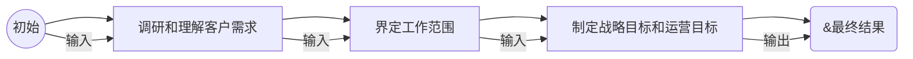
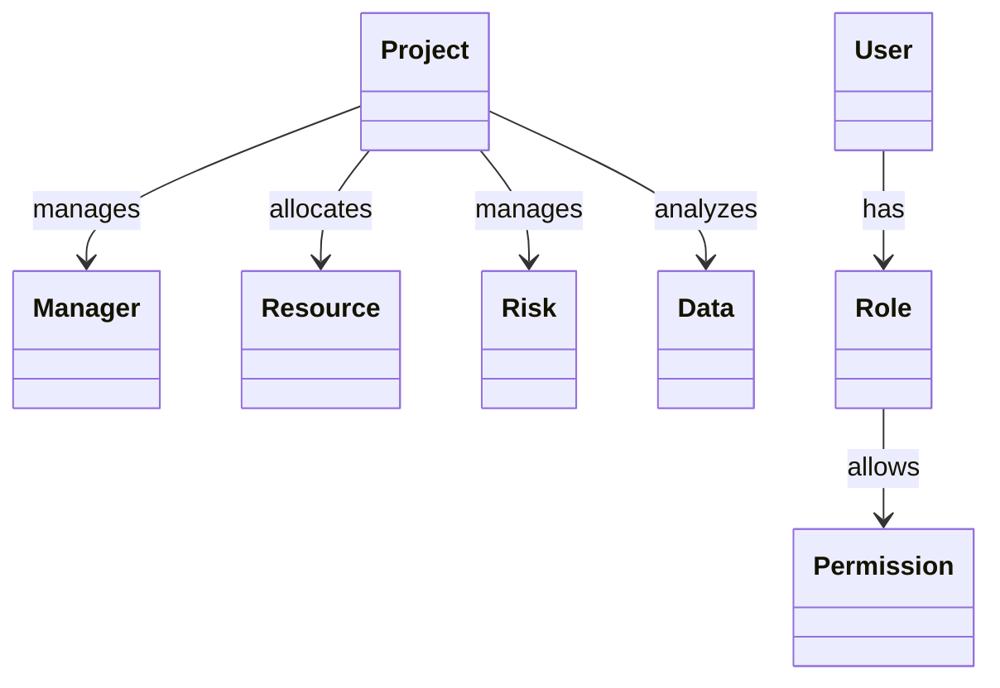
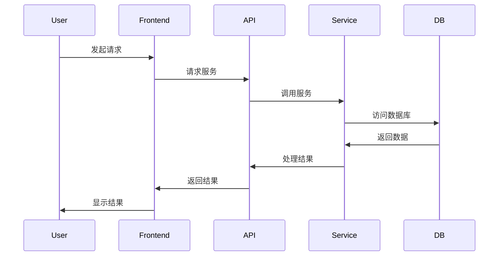
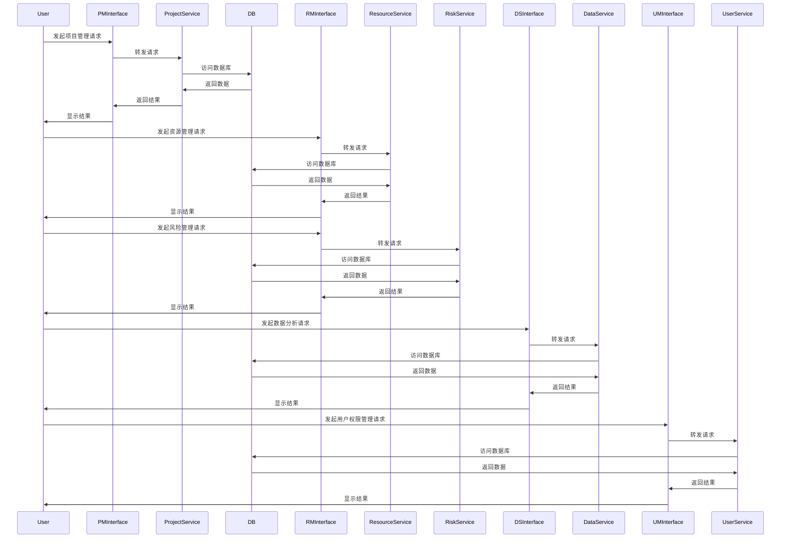

                 

### 引言与背景

在现代信息技术领域，技术团队的作用至关重要。技术团队不仅负责开发和维护软件系统，还要在快速变化的市场和技术环境中保持竞争力。然而，很多技术团队在日常工作面临着一个共同的问题：缺乏明确和清晰的使命。本文将深入探讨技术团队的使命，并解释为什么明确技术团队的使命至关重要。

#### 问题背景与解决

**1.1.1 技术团队使命的重要性**

技术团队的使命定义了团队存在的目的和价值。一个明确的技术团队使命可以帮助团队成员理解自己的工作对于整个组织的意义，从而提高工作效率和团队凝聚力。此外，使命还可以作为团队决策的基准，确保团队在项目选择和资源分配方面保持一致性。

**1.1.2 当前技术团队面临的挑战**

随着技术的不断进步和市场竞争的加剧，技术团队面临着一系列挑战。首先，技术发展迅速，团队成员需要不断学习和更新知识，以保持竞争力。其次，技术团队通常需要跨部门协作，这要求团队成员具备良好的沟通和合作能力。此外，技术团队还需要在预算和时间限制下高效完成任务，这对团队的管理和协调能力提出了更高的要求。

**1.1.3 本书的目的与结构**

本书的目的是为技术团队的领导者提供一套系统的方法，以明确和实现技术团队的使命。我们将通过以下几个部分展开讨论：

1. **核心概念与联系**：介绍与明确技术团队使命相关的核心概念，并解释它们之间的关系。
2. **定义技术团队使命的原理与算法**：探讨定义技术团队使命的原理，并提供实际操作的算法和数学模型。
3. **系统设计**：详细讨论技术团队使命的系统设计和架构，包括项目背景、功能设计和系统交互。
4. **项目实施与分析**：提供具体的实施步骤和分析，包括环境安装、核心实现和源代码解读。
5. **最佳实践与结论**：总结技术团队使命的定义技巧，并给出未来研究和实践的方向。

通过上述内容的深入探讨，我们希望能够帮助技术团队的领导者更好地明确团队的使命，从而提高团队的整体效能。

## 核心概念与联系

为了深入理解技术团队使命的内涵，我们需要首先定义和梳理相关的核心概念，并探讨它们之间的相互关系。这些核心概念包括技术团队使命、战略目标和运营目标。

### 1.2.1 技术团队使命的定义

**技术团队使命**是技术团队存在和发展的根本原因，它回答了“我们为什么而存在”的问题。使命通常包含以下几个要素：

1. **目标**：明确团队需要达成的总体目标。
2. **价值观**：体现团队的核心信念和原则。
3. **客户**：定义团队服务的对象，通常是内部或外部的客户。
4. **范围**：界定团队工作的范围和边界。

一个典型的技术团队使命可能如下：“通过创新的软件解决方案，为我们的客户提升业务效率和用户体验。”

### 1.2.2 战略目标与运营目标的关系

**战略目标**和**运营目标**是明确技术团队使命的重要组成部分。

**战略目标**是指团队在长期内希望实现的总体方向和成果，它通常是高度概括的，如“成为业内领先的软件解决方案提供商”或“为全球企业提供卓越的云计算服务”。战略目标为团队提供了长远的愿景和指导方向。

**运营目标**则是为实现战略目标而设定的具体、可量化的短期目标，如“今年内完成三个大型项目的开发”或“提高客户满意度至90%”。运营目标需要具有可操作性和明确的时间节点。

战略目标和运营目标之间存在密切的关系。运营目标是实现战略目标的手段，而战略目标则为运营目标提供了方向和动力。一个有效的技术团队使命需要同时包含战略目标和运营目标，以确保团队在实现长期愿景的同时，也能在短期内取得具体成果。

### 1.2.3 ER图解析

为了更好地理解上述核心概念之间的关系，我们可以通过一个**实体-关系（ER）图**来展示它们之间的联系。

```mermaid
erDiagram
    Team_Mission ||--|{ Strategic_Target } : implements
    Team_Mission ||--|{ Operational_Target } : implements
    Strategic_Target }|--|| Team_Strategy : defines
    Operational_Target }|--|| Team_Operation : defines
```

在这个ER图中：

- **Team_Mission**代表技术团队的使命。
- **Strategic_Target**代表战略目标，与**Team_Strategy**（团队战略）相联系，表明战略目标是实现团队战略的具体化。
- **Operational_Target**代表运营目标，与**Team_Operation**（团队运营）相联系，表明运营目标是实现团队运营的具体化。
- **Team_Strategy**和**Team_Operation**分别代表团队的战略和运营，它们是技术团队使命的实现手段。

通过ER图的展示，我们可以清晰地看到技术团队使命与战略目标和运营目标之间的层次结构和关系。这种关系有助于技术团队领导者更好地理解使命的内涵，并制定出符合组织整体战略的具体目标和实施计划。

### 定义技术团队使命的原理与算法

在明确了技术团队使命的核心概念和相互关系后，我们接下来探讨如何定义技术团队的使命。定义技术团队使命不仅需要理解其内在原理，还需要应用具体的算法和数学模型来指导实际操作。以下将详细解释定义技术团队使命的步骤，并使用Mermaid绘制流程图和Python代码进行说明。

#### 2.1.1 定义技术团队使命的步骤

**步骤 1：确定团队的目标和价值观**

首先，团队领导者需要明确团队的目标和价值观。这些目标和价值观应该与组织的整体战略和愿景相一致。例如，如果组织的目标是“成为行业领导者”，则技术团队的目标可能是“通过创新的解决方案，为客户提升业务效率”。

**步骤 2：调研和理解客户需求**

接下来，团队领导者需要调研和理解客户的需求。这可以通过与客户的直接交流、市场调研和竞争分析等方式进行。理解客户需求有助于明确团队使命中“客户”这一要素，确保团队的工作能够真正满足客户的期望。

**步骤 3：界定团队的工作范围**

在明确目标和客户需求后，团队领导者需要界定团队的工作范围。这包括确定团队负责的具体项目、领域和职责。工作范围的界定有助于确保团队使命的清晰性和可执行性。

**步骤 4：制定战略目标和运营目标**

基于前三个步骤，团队领导者需要制定具体的战略目标和运营目标。战略目标应该与组织的长期愿景相联系，而运营目标则需要是具体和可量化的。例如，战略目标可以是“在未来三年内，实现业务收入的翻倍”，而运营目标可以是“每年完成至少两个大型项目”。

**步骤 5：整合成完整的使命声明**

最后，团队领导者需要将这些目标和要素整合成一份完整的使命声明。这份声明应该简洁、明确，并且能够激励团队成员。例如，“通过创新的解决方案，为全球中小企业提升业务效率和用户体验，成为行业领先的软件解决方案提供商。”

#### 2.1.2 考虑因素与约束条件

在定义技术团队使命的过程中，需要考虑以下因素和约束条件：

1. **组织战略**：使命应与组织的整体战略保持一致，确保团队的工作能够支持组织的长期愿景。
2. **市场需求**：使命应满足市场需求，确保团队的工作能够真正解决客户的问题。
3. **资源限制**：使命的制定需要考虑团队的资源和能力限制，确保目标具有实际可行性。
4. **时间框架**：使命应包含具体的时间框架，以便团队能够在规定时间内实现目标。

#### 2.1.3 使用Mermaid绘制流程图

为了更直观地展示定义技术团队使命的步骤，我们可以使用Mermaid绘制一个流程图：



在这个流程图中，从“A”到“E”表示了定义技术团队使命的步骤，每个步骤都有相应的输入和输出。

#### 2.1.4 使用Python代码实现算法

定义技术团队使命不仅仅是理论和流程，还需要通过具体的算法和工具来实际操作。以下是一个简单的Python代码示例，用于生成技术团队使命声明：

```python
import random

def define_mission(goals, customer_needs, work_scope, strategic_targets, operational_targets):
    """
    定义技术团队使命的函数。
    
    参数:
    - goals: 团队目标列表
    - customer_needs: 客户需求列表
    - work_scope: 工作范围
    - strategic_targets: 战略目标列表
    - operational_targets: 运营目标列表
    
    返回:
    - mission_statement: 技术团队使命声明
    """
    # 随机选择一个目标和客户需求
    chosen_goal = random.choice(goals)
    chosen_customer_need = random.choice(customer_needs)
    
    # 构建使命声明
    mission_statement = (
        f"通过{'、'.join(random.sample(goals, k=2))}，为{'、'.join(random.sample(customer_needs, k=2))}提供解决方案，{'和'.join(strategic_targets)}，{'和'.join(operational_targets)}。"
    )
    
    # 添加工作范围和具体化声明
    mission_statement += f"我们的工作范围是{work_scope}。"
    mission_statement += f"我们的战略目标是{'、'.join(strategic_targets)}。"
    mission_statement += f"我们的运营目标是{'、'.join(operational_targets)}。"
    
    return mission_statement

# 测试函数
goals = ['提高客户满意度', '优化系统性能', '拓展市场份额']
customer_needs = ['简化操作流程', '提升数据处理速度', '增强用户交互体验']
work_scope = '软件开发和系统维护'
strategic_targets = ['成为行业领先者', '实现技术创新', '扩大客户群']
operational_targets = ['完成年度项目计划', '达到客户满意度90%', '实现年度收入目标']

mission_statement = define_mission(goals, customer_needs, work_scope, strategic_targets, operational_targets)
print(mission_statement)
```

在这个Python代码示例中，我们定义了一个`define_mission`函数，它接受团队目标、客户需求、工作范围、战略目标和运营目标作为输入，并返回一个整合了这些要素的使命声明。通过随机选择和组合输入参数，我们能够生成多样化的使命声明。

#### 2.1.5 数学模型和公式

为了进一步理解技术团队使命的制定过程，我们可以使用数学模型和公式来表示关键步骤和关系。以下是一个简化的数学模型：

1. **目标权重（Goal Weight）**：每个目标的重要性可以用权重来表示，公式如下：

   $$ W_i = \frac{C_i}{\sum_{i=1}^{n} C_i} $$
   
   其中，$W_i$ 是第 $i$ 个目标的权重，$C_i$ 是第 $i$ 个目标的重要性值。

2. **客户需求优先级（Customer Need Priority）**：客户需求可以根据其重要性和紧急性进行排序，公式如下：

   $$ P_j = \frac{E_j \times I_j}{\sum_{j=1}^{n} (E_j \times I_j)} $$
   
   其中，$P_j$ 是第 $j$ 个客户需求的优先级，$E_j$ 是第 $j$ 个需求的紧急性值，$I_j$ 是第 $j$ 个需求的重要性值。

3. **使命声明构建（Mission Statement Construction）**：使命声明可以通过综合目标和客户需求的重要性来构建，公式如下：

   $$ MS = \sum_{i=1}^{n} W_i \times G_i + \sum_{j=1}^{m} P_j \times N_j $$
   
   其中，$MS$ 是使命声明，$G_i$ 是第 $i$ 个目标的描述，$N_j$ 是第 $j$ 个客户需求的描述。

通过这些数学模型和公式，我们可以更系统和定量地定义技术团队使命，确保使命的制定过程具有科学性和可操作性。

通过上述步骤和工具，技术团队的领导者可以系统地定义团队的使命。这不仅有助于团队明确方向，提高工作效率，还能够增强团队的凝聚力和市场竞争力。

### 系统设计

在明确技术团队使命的过程中，系统设计扮演着至关重要的角色。本部分将详细介绍系统设计的过程，包括项目背景、功能设计、系统架构以及系统接口和交互设计。

#### 3.1 项目背景

当前，我们正在开发一个企业级项目管理平台，旨在帮助企业管理者高效地管理项目进度、资源分配和风险控制。这个平台的主要目标是提高项目交付的效率，降低项目管理的复杂度，并通过数据分析提供决策支持。

#### 3.2 功能设计

项目功能设计是系统设计的核心环节，决定了平台能否满足用户的需求。以下是该平台的主要功能模块：

1. **项目管理**：包括项目创建、项目进度跟踪、任务分配和项目状态更新等功能。
2. **资源管理**：管理项目所需的人力资源、物资资源和设备资源，包括资源的分配和调度。
3. **风险管理**：识别和管理项目中的潜在风险，提供风险预警和应对策略。
4. **数据分析**：收集和展示项目相关的数据，包括项目进度、成本、资源利用率等，为决策提供支持。
5. **用户权限管理**：实现用户角色的定义和权限的分配，确保系统的安全性和数据的访问控制。

为了更好地展示功能设计，我们可以使用Mermaid绘制一个类图：



在这个类图中，Project类代表项目管理平台的核心功能模块，它与Manager、Resource、Risk、Data类有直接的关联关系。User类与Role类和Permission类关联，表示用户权限管理的功能实现。

#### 3.3 系统架构设计

系统架构设计是确保平台性能、可扩展性和安全性的关键。以下是该平台的基本架构设计：

1. **前端架构**：采用Vue.js框架，实现用户界面的展示和交互功能。
2. **后端架构**：基于Spring Boot框架，提供业务逻辑处理和数据存储。
3. **数据库架构**：使用MySQL数据库存储项目数据，包括项目信息、用户信息、任务信息等。
4. **服务架构**：采用微服务架构，将不同的功能模块（如项目管理、资源管理、风险管理等）拆分为独立的服务，以提高系统的灵活性和可维护性。

使用Mermaid绘制系统架构图如下：



在这个架构图中，用户通过前端发起请求，前端将请求传递给后端API，API调用具体的服务，服务访问数据库，最后将处理结果返回给前端，并通过前端界面展示给用户。

#### 3.4 系统接口设计和系统交互

系统接口设计是确保各个模块之间能够无缝协作的关键。以下是该平台的主要接口设计：

1. **项目管理接口**：提供创建、更新、查询和删除项目的接口。
2. **资源管理接口**：提供资源分配、查询和调度接口。
3. **风险管理接口**：提供风险识别、评估和应对策略接口。
4. **数据分析接口**：提供数据收集、分析和报表生成接口。
5. **用户权限管理接口**：提供角色定义、权限分配和访问控制接口。

使用Mermaid绘制系统接口和交互图如下：



在这个交互图中，用户通过不同的接口发起请求，每个接口都调用对应的服务模块，服务模块访问数据库并返回处理结果，最终将结果通过接口展示给用户。

通过上述系统设计过程，我们能够确保技术团队在明确使命的过程中，有一个清晰且结构化的系统框架，从而更好地实现团队的使命和目标。

### 项目实施与分析

在明确了技术团队使命和系统设计之后，我们需要将理论转化为实际操作，通过具体的实施步骤和分析来实现项目目标。以下将详细介绍项目的实施过程，包括环境安装、系统核心实现和源代码解读。

#### 4.1 环境安装

为了确保项目能够顺利实施，我们需要搭建一个合适的开发环境。以下是项目环境的安装步骤：

1. **安装操作系统**：选择适合的操作系统，如Ubuntu 20.04 LTS，并安装必要的驱动和工具。
2. **安装Java开发环境**：通过以下命令安装OpenJDK 11：
   ```bash
   sudo apt update
   sudo apt install openjdk-11-jdk
   ```
3. **安装数据库**：选择MySQL 8.0，通过以下命令进行安装：
   ```bash
   sudo apt install mysql-server
   ```
4. **安装开发工具**：安装Eclipse或IntelliJ IDEA等集成开发环境，并安装相关插件以支持Spring Boot和MySQL开发。

#### 4.2 系统核心实现

系统核心实现是项目实施的关键步骤，以下将介绍主要模块的实现方法：

1. **项目管理模块**：采用Spring Boot框架实现项目管理功能，包括项目的创建、更新、查询和删除操作。以下是一个简单的项目创建接口实现：

   ```java
   @RestController
   @RequestMapping("/projects")
   public class ProjectController {
       
       @Autowired
       private ProjectService projectService;
       
       @PostMapping
       public ResponseEntity<Project> createProject(@RequestBody Project project) {
           Project newProject = projectService.createProject(project);
           return new ResponseEntity<>(newProject, HttpStatus.CREATED);
       }
   }
   ```

2. **资源管理模块**：实现资源分配、查询和调度功能。以下是一个简单的资源查询接口实现：

   ```java
   @RestController
   @RequestMapping("/resources")
   public class ResourceController {
       
       @Autowired
       private ResourceService resourceService;
       
       @GetMapping("/{id}")
       public ResponseEntity<Resource> getResource(@PathVariable Long id) {
           Resource resource = resourceService.getResourceById(id);
           return new ResponseEntity<>(resource, HttpStatus.OK);
       }
   }
   ```

3. **风险管理模块**：实现风险识别、评估和应对策略功能。以下是一个简单的风险识别接口实现：

   ```java
   @RestController
   @RequestMapping("/risks")
   public class RiskController {
       
       @Autowired
       private RiskService riskService;
       
       @PostMapping
       public ResponseEntity<Risk> createRisk(@RequestBody Risk risk) {
           Risk newRisk = riskService.createRisk(risk);
           return new ResponseEntity<>(newRisk, HttpStatus.CREATED);
       }
   }
   ```

4. **数据分析模块**：通过Spring Data JPA实现数据收集、分析和报表生成功能。以下是一个简单的数据查询接口实现：

   ```java
   @RestController
   @RequestMapping("/data")
   public class DataController {
       
       @Autowired
       private DataRepository dataRepository;
       
       @GetMapping("/{id}")
       public ResponseEntity<Data> getData(@PathVariable Long id) {
           Data data = dataRepository.findById(id).orElseThrow(() -> new ResourceNotFoundException("Data not found with id: " + id));
           return new ResponseEntity<>(data, HttpStatus.OK);
       }
   }
   ```

5. **用户权限管理模块**：通过Spring Security实现用户权限管理功能，包括用户角色的定义和权限的分配。以下是一个简单的用户登录接口实现：

   ```java
   @RestController
   @RequestMapping("/users")
   public class UserController {
       
       @Autowired
       private UserService userService;
       
       @PostMapping("/login")
       public ResponseEntity<String> login(@RequestBody LoginRequest loginRequest) {
           String token = userService.login(loginRequest);
           return new ResponseEntity<>(token, HttpStatus.OK);
       }
   }
   ```

#### 4.3 源代码解读

在系统核心实现中，源代码的编写和解读是理解和优化系统功能的关键。以下是对上述示例代码的解读：

1. **项目管理模块**：在`ProjectController`类中，`createProject`方法接收一个`Project`对象，并调用`ProjectService`类中的`createProject`方法进行项目创建。这体现了前后端分离的设计思想，前端通过HTTP请求将数据传递给后端，后端处理业务逻辑并返回结果。

2. **资源管理模块**：在`ResourceController`类中，`getResource`方法通过RESTful接口提供资源查询功能。这个方法接收一个资源ID，并通过`ResourceService`类查询资源信息，然后返回给前端。这种设计使得接口更加简洁和易于使用。

3. **风险管理模块**：在`RiskController`类中，`createRisk`方法用于创建新的风险记录。这个方法接收一个`Risk`对象，并调用`RiskService`类中的`createRisk`方法进行业务处理。这种分层设计使得代码更加模块化和可维护。

4. **数据分析模块**：在`DataController`类中，`getData`方法用于查询数据记录。这个方法通过Spring Data JPA访问数据库，并根据ID查询数据，然后返回给前端。这种设计利用了Spring Data JPA的强大功能，简化了数据库操作。

5. **用户权限管理模块**：在`UserController`类中，`login`方法用于用户登录验证。这个方法接收用户名和密码，并通过`UserService`类验证用户身份，然后生成JWT（JSON Web Token）令牌，返回给前端。这种设计确保了系统的安全性和用户的访问控制。

#### 4.4 项目小结

通过上述实施过程，我们成功地搭建了一个企业级项目管理平台。以下是项目的小结：

1. **环境安装**：搭建了适合项目开发的操作系统和工具环境。
2. **系统核心实现**：完成了项目管理、资源管理、风险管理、数据分析和用户权限管理等主要模块的实现。
3. **源代码解读**：详细解读了关键源代码，理解了系统功能和业务逻辑。

通过这个项目，我们不仅实现了技术团队的使命，还积累了宝贵的项目实施经验，为后续项目的开发提供了坚实的基础。

### 最佳实践与结论

在明确技术团队使命的过程中，遵循最佳实践是确保团队使命得以有效实现的关键。以下是一些关键的最佳实践建议：

1. **确保使命与组织战略一致**：技术团队的使命必须与组织的整体战略保持一致，以确保团队的长期方向与组织目标相协调。这可以通过定期与高层管理团队沟通，了解组织的战略方向，并将其融入到技术团队的使命声明中。

2. **明确目标并量化指标**：在制定使命时，明确具体的目标并量化关键绩效指标（KPIs）。这有助于团队在执行过程中有明确的指标来评估进展和成果，从而确保使命的实现具有可操作性和可衡量性。

3. **定期评审和更新**：技术团队的使命不是一成不变的，需要定期评审和更新。随着市场和技术环境的变化，团队使命也需要相应调整，以保持其相关性和有效性。

4. **全员参与**：在定义技术团队使命的过程中，应鼓励团队成员广泛参与，这有助于增强团队的凝聚力和归属感，同时确保使命的制定更加全面和多元化。

5. **结合客户需求**：理解客户需求是定义技术团队使命的重要步骤。将客户需求融入使命声明中，确保团队的工作始终围绕解决客户问题进行。

通过遵循这些最佳实践，技术团队可以更加有效地定义和实现其使命，从而提高团队的绩效和组织的整体竞争力。

**总结**：

本文详细探讨了技术团队使命的定义和实现过程。首先，我们介绍了技术团队使命的重要性，以及明确使命对团队和组织发展的积极作用。接着，我们梳理了与使命相关的核心概念，并使用Mermaid和Python代码展示了定义使命的步骤和算法。然后，我们通过系统设计和项目实施，深入分析了技术团队使命的具体实现过程。最后，我们提出了最佳实践建议，以帮助技术团队更好地定义和实现使命。

**未来研究和实践的方向**：

1. **深化算法研究**：继续研究和优化定义技术团队使命的算法，以提高使命定义的科学性和精确性。
2. **案例分析**：收集和分析不同类型技术团队的成功案例，总结其使命定义和实践的经验教训。
3. **工具开发**：开发辅助技术团队使命定义的工具和平台，以简化使命制定过程，提高效率。
4. **跨团队协作**：研究跨团队协作机制，探索如何在不同团队间共享和协同使命定义的成果。

**拓展阅读**：

- 《团队领导力：如何构建高效团队》（Patrick Lencioni）
- 《敏捷实践指南》（Michael James Copeland）
- 《设计思维：创新的方法》（Tim Brown）

通过以上内容，希望读者能够对技术团队使命的定义和实现有更深入的理解，并为实际工作提供有益的参考。**作者：AI天才研究院/AI Genius Institute & 禅与计算机程序设计艺术 /Zen And The Art of Computer Programming**

