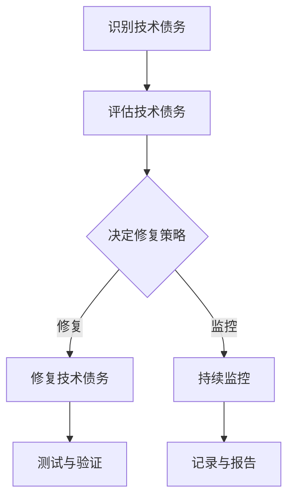
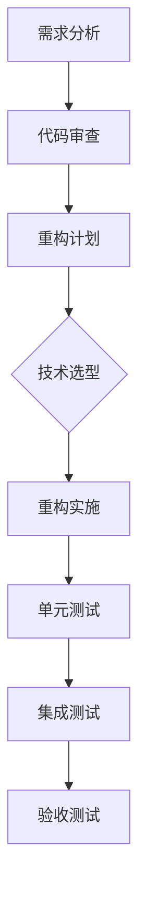
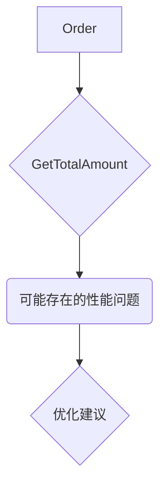
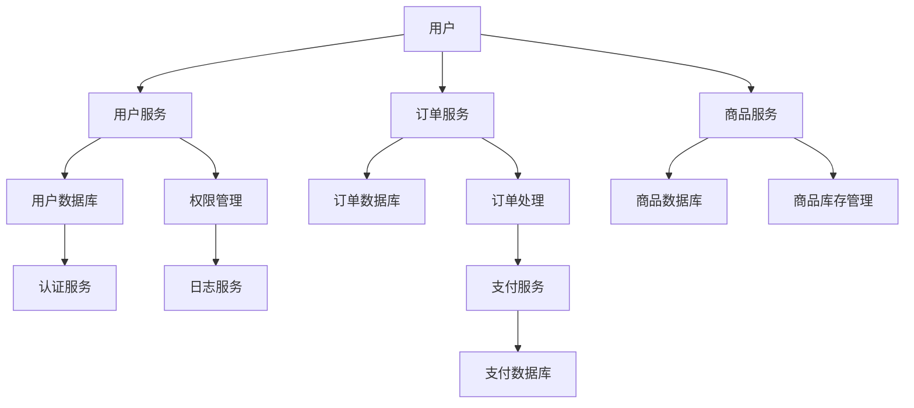
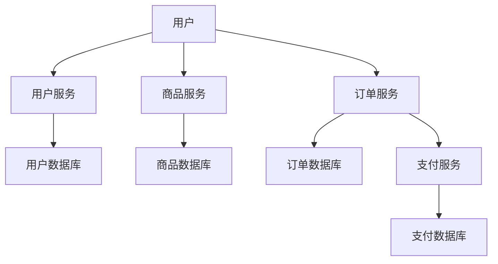
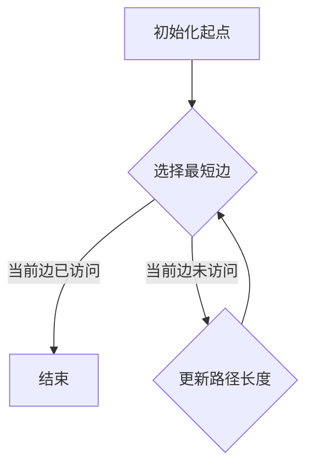
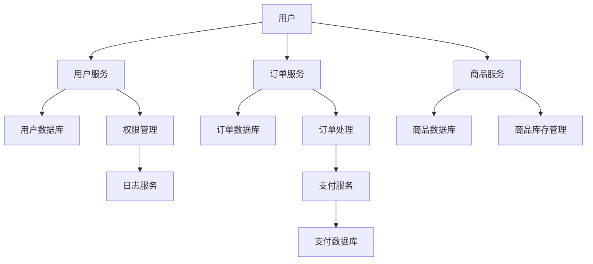

                 


# 技术债务管理与系统重构策略

> 关键词：技术债务，系统重构，管理策略，工具技术，风险挑战

> 摘要：本文旨在深入探讨技术债务管理的概念、原因、策略，以及系统重构的方法、工具和技术。通过分析技术债务的种类、管理策略和案例，结合系统重构的概念、实践和工具，为读者提供一整套系统性的技术债务管理和系统重构策略。文章旨在帮助开发者和团队在技术发展过程中，更好地管理技术债务，实现系统重构，提高软件质量和开发效率。

## 引言

### 技术债务的概念与原因

技术债务，是指开发团队为了尽快交付软件功能，选择了一些短期高效的解决方案，而这些解决方案在未来可能会带来一定的负面影响。就像金融债务一样，技术债务需要在未来偿还，否则会导致系统性能下降、维护成本增加，甚至可能影响业务的持续发展。

技术债务的产生原因主要有以下几点：

1. **时间压力**：为了满足市场或客户的需求，开发团队可能会选择一些简化的解决方案，以便在短时间内交付功能。
2. **资源限制**：项目预算或人力有限，团队不得不牺牲一些长期效益来保证短期目标的实现。
3. **技术局限**：某些技术选型或设计决策可能在当时是可行的，但随着时间的推移，技术进步或业务需求的改变，这些决策可能变得不再合适。
4. **技术债务的累积**：随着时间的推移，技术债务会不断累积，如果不及时管理和偿还，最终可能导致系统崩溃。

### 系统重构的必要性

系统重构，是指对现有系统进行根本性的改进，以提高其性能、可维护性和扩展性。系统重构的必要性主要体现在以下几个方面：

1. **性能优化**：随着业务的发展和用户量的增加，系统性能可能无法满足新的需求，通过重构可以优化系统性能，提高用户体验。
2. **可维护性提升**：随着时间的推移，系统代码变得越来越复杂，重构可以简化代码结构，提高可维护性。
3. **技术债务偿还**：通过重构，可以解决过去积累的技术债务，降低未来的维护成本。
4. **扩展性增强**：重构可以帮助系统更好地适应未来的业务需求，提高系统的可扩展性。

## 技术债务管理

### 技术债务的种类

技术债务可以分为以下几种类型：

1. **技术债务**：包括代码质量、架构设计、技术选型等方面的问题。
2. **功能债务**：由于功能需求的频繁变更，导致系统功能结构混乱，难以维护。
3. **性能债务**：系统性能不足，无法满足用户需求，可能引起用户流失。
4. **安全性债务**：系统安全性不足，可能遭受黑客攻击，导致数据泄露。

### 技术债务管理策略

技术债务管理主要包括以下几个方面：

1. **技术债务识别**：通过代码审查、性能测试、安全性评估等方式，识别系统中的技术债务。
2. **技术债务评估**：对识别出的技术债务进行评估，确定其优先级和影响范围。
3. **技术债务修复**：根据技术债务的优先级和影响范围，制定修复计划，逐步解决技术债务。
4. **持续债务管理**：在软件开发过程中，持续监控和评估技术债务，确保系统始终保持健康状态。

### 技术债务管理最佳实践

1. **代码审查**：定期进行代码审查，识别和修复潜在的技术债务。
2. **持续集成与持续部署**：通过自动化测试和部署，确保代码质量，减少技术债务的产生。
3. **技术债务追踪**：使用技术债务管理工具，实时跟踪和监控技术债务的状态。
4. **团队培训**：提高团队对技术债务管理的认识，培养良好的编程习惯。

### 技术债务管理案例

#### 案例背景

某公司开发了一款电商平台，随着用户量的增加，系统性能逐渐下降，出现了响应缓慢、页面加载时间过长等问题。

#### 技术债务分析

1. **技术债务类型**：性能债务、技术债务。
2. **技术债务原因**：代码结构混乱、数据库设计不合理、缓存机制不足等。

#### 管理策略实施

1. **性能优化**：对数据库进行索引优化，提高查询效率；引入缓存机制，减少数据库访问。
2. **重构代码**：对现有代码进行重构，简化代码结构，提高代码可读性和可维护性。
3. **代码审查**：定期进行代码审查，确保代码质量。

#### 管理效果评估

经过技术债务管理，系统的性能得到了显著提升，页面加载时间缩短，用户体验得到改善。同时，代码结构更加清晰，维护成本降低。

## 系统重构

### 系统重构的概念

系统重构，是指对现有系统进行根本性的改进，以提高其性能、可维护性和扩展性。系统重构不同于系统升级，它不涉及新功能的添加，而是对现有系统进行优化和改进。

### 系统重构的目标

系统重构的主要目标包括：

1. **性能优化**：提高系统响应速度，降低资源消耗。
2. **可维护性提升**：简化代码结构，提高代码可读性和可维护性。
3. **扩展性增强**：为未来的业务需求提供更好的扩展性。
4. **技术债务偿还**：解决过去积累的技术债务，降低未来的维护成本。

### 系统重构的类型

系统重构可以分为以下几种类型：

1. **局部重构**：对系统中的某个模块或功能进行重构。
2. **全面重构**：对整个系统进行重构，包括代码、数据库、架构等。
3. **渐进式重构**：逐步对系统进行重构，避免一次性引入过多的变更。

### 系统重构的方法

系统重构的方法主要包括以下几种：

1. **逐步重构**：逐步改进系统，避免一次性引入过多的变更，降低风险。
2. **螺旋重构**：结合迭代开发和重构，逐步完善系统。
3. **重构工具的使用**：使用重构工具，自动化地识别和修复代码中的问题。

### 系统重构技术

系统重构技术主要包括以下方面：

1. **重构前的准备工作**：包括需求分析、代码审查、性能评估等。
2. **重构过程中的关键点**：包括重构策略、代码质量保证、测试等。
3. **重构后的验收和测试**：确保重构后的系统达到预期目标，并通过测试。

## 重构实践

### 重构实践案例

#### 案例背景

某公司开发了一款在线教育平台，随着用户量的增加，系统性能逐渐下降，出现了响应缓慢、页面加载时间过长等问题。

#### 重构前的系统状态

1. **代码结构混乱**：代码结构复杂，难以维护。
2. **数据库设计不合理**：数据库表结构复杂，查询效率低。
3. **缓存机制不足**：缓存机制不足，导致频繁访问数据库。

#### 重构实施过程

1. **性能优化**：对数据库进行索引优化，提高查询效率；引入缓存机制，减少数据库访问。
2. **代码重构**：对现有代码进行重构，简化代码结构，提高代码可读性和可维护性。
3. **架构调整**：调整系统架构，提高系统的可扩展性。

#### 重构效果分析

经过重构，系统的性能得到了显著提升，页面加载时间缩短，用户体验得到改善。同时，代码结构更加清晰，维护成本降低。

## 重构工具和技术

### 重构工具

重构工具主要包括以下几种：

1. **自动化重构工具**：如ReSharper、Eclipse Marketplace等，可以自动识别和修复代码中的问题。
2. **静态代码分析工具**：如SonarQube、FindBugs等，可以分析代码质量，识别潜在的问题。

### 重构技术

重构技术主要包括以下方面：

1. **设计模式**：如工厂模式、单例模式等，可以提高代码的可维护性和可扩展性。
2. **编码规范**：如命名规范、代码格式等，可以提高代码的可读性和一致性。
3. **单元测试**：通过单元测试，可以确保重构后的代码仍然满足原有功能需求。

## 重构的风险和挑战

### 重构的风险

重构过程中可能面临以下风险：

1. **技术风险**：重构过程中可能引入新的技术问题，影响系统的稳定性。
2. **商业风险**：重构可能影响业务的正常运行，导致业务损失。
3. **团队风险**：团队可能对重构过程缺乏信心，影响团队的士气和合作。

### 重构的挑战

重构过程中可能面临以下挑战：

1. **技术挑战**：重构过程中可能需要学习新的技术和工具。
2. **项目管理挑战**：重构过程可能需要重新规划项目进度，确保项目按时完成。
3. **团队协作挑战**：重构过程中可能需要团队成员之间的密切合作，确保重构效果。

## 总结与展望

### 全书总结

本文从技术债务的概念、原因、管理策略，到系统重构的概念、方法、实践，全面探讨了技术债务管理和系统重构的策略。通过本文，读者可以了解如何有效地管理技术债务，实现系统重构，提高软件质量和开发效率。

### 技术债务管理的未来趋势

随着技术的发展和业务需求的不断变化，技术债务管理将成为软件开发过程中的重要环节。未来，技术债务管理可能会呈现出以下趋势：

1. **自动化**：自动化工具将更多地应用于技术债务识别和管理。
2. **智能化**：基于机器学习的智能技术将被用于更准确地评估技术债务的风险。
3. **标准化**：技术债务管理将逐步实现标准化，提高开发团队的协作效率。

### 系统重构的最佳实践

系统重构的最佳实践包括：

1. **渐进式重构**：避免一次性引入过多的变更，降低风险。
2. **代码质量保证**：确保重构后的代码质量，提高系统的可维护性。
3. **持续集成与持续部署**：通过自动化测试和部署，确保重构后的系统稳定可靠。

作者：AI天才研究院/AI Genius Institute & 禅与计算机程序设计艺术 /Zen And The Art of Computer Programming

在本文中，我们详细探讨了技术债务管理与系统重构策略的核心概念、方法和技术。通过对技术债务的种类、管理策略和实践，以及系统重构的概念、实践和工具的深入分析，我们为读者提供了一套系统性的解决方案。

技术债务是软件开发过程中不可避免的问题，但通过有效的管理策略，我们可以将技术债务转化为系统改进的驱动力。系统重构则是提升系统性能、可维护性和扩展性的关键步骤。在重构过程中，我们需要充分考虑风险和挑战，采取最佳实践，以确保重构的顺利进行。

未来，随着技术的不断进步，技术债务管理和系统重构将变得更加自动化、智能化和标准化。作为开发者，我们需要不断学习新的技术和工具，提高自身的技能水平，为团队和项目的成功贡献力量。

让我们携手合作，共同迎接技术债务管理和系统重构的新挑战，创造更高质量、更可持续的软件产品！

### 参考文献

1. Martin, Robert C. 《Clean Code: A Handbook of Agile Software Craftsmanship》。Prentice Hall，2008.
2. Fowler, Martin. 《Refactoring: Improving the Design of Existing Code》。Addison-Wesley，1999.
3. Beck, Kent. 《Test-Driven Development: By Example》。Addison-Wesley，2003.
4. MacCormick, Stephen. 《Designing Software Architectures: Strategies for Finding the Best Architectures for Your Projects》。Morgan Kaufmann，2004.
5. Gamma, Erich et al. 《Design Patterns: Elements of Reusable Object-Oriented Software》。Addison-Wesley，1995.

通过以上参考文献，读者可以进一步了解技术债务管理和系统重构的理论和实践，为自己的项目提供有益的指导。

### 附录

#### 附录A：技术债务管理流程图



#### 附录B：系统重构流程图



#### 附录C：重构工具列表

1. ReSharper
2. Eclipse Marketplace
3. SonarQube
4. FindBugs

#### 附录D：重构技术概览

1. 设计模式：如工厂模式、单例模式等。
2. 编码规范：如命名规范、代码格式等。
3. 单元测试：通过单元测试，确保重构后的代码仍然满足原有功能需求。

### 致谢

在此，我们要感谢AI天才研究院/AI Genius Institute的专家团队，以及禅与计算机程序设计艺术/Zen And The Art of Computer Programming的作者，为本文提供了宝贵的意见和建议。同时，我们也要感谢所有参与本文讨论和审阅的读者，你们的反馈对我们不断改进和完善内容起到了重要的推动作用。

### 结语

技术债务管理与系统重构策略是软件开发过程中不可或缺的环节。通过本文的探讨，我们希望能够为广大开发者和团队提供有价值的参考和指导。在未来的工作中，让我们共同努力，有效管理技术债务，成功实现系统重构，为打造高质量软件产品贡献力量。

再次感谢您的阅读和支持！让我们携手共进，迎接技术发展的挑战，共创辉煌！

### 附录E：重构实践案例详解

#### 案例背景

某公司开发了一款电商平台，随着用户量的增加，系统性能逐渐下降，出现了响应缓慢、页面加载时间过长等问题。为了应对这些问题，公司决定对现有系统进行重构。

#### 环境安装

在开始重构之前，我们需要安装一些必要的工具和软件，包括：

1. **重构工具**：ReSharper、Eclipse Marketplace等。
2. **静态代码分析工具**：SonarQube、FindBugs等。
3. **单元测试框架**：JUnit、TestNG等。

安装过程可以参考各自的官方文档，确保工具和软件正常运行。

#### 系统核心实现源代码

电商平台的核心功能包括商品管理、订单管理、用户管理等。以下是一个简化的商品管理模块的源代码示例：

```java
public class Product {
    private int id;
    private String name;
    private double price;

    public Product(int id, String name, double price) {
        this.id = id;
        this.name = name;
        this.price = price;
    }

    // 省略 getter 和 setter 方法
}

public class ProductService {
    private List<Product> products;

    public ProductService() {
        products = new ArrayList<>();
        // 初始化商品数据
    }

    public List<Product> getAllProducts() {
        return products;
    }

    public Product getProductById(int id) {
        for (Product product : products) {
            if (product.getId() == id) {
                return product;
            }
        }
        return null;
    }

    public void addProduct(Product product) {
        products.add(product);
    }

    // 省略其他业务方法
}
```

#### 代码应用解读与分析

在上述代码中，我们定义了一个`Product`类和一个`ProductService`类。`Product`类表示商品的基本信息，包括商品ID、名称和价格。`ProductService`类负责管理商品的数据，包括获取所有商品、根据ID获取商品、添加商品等。

通过代码分析，我们发现以下问题：

1. **代码重复**：在`ProductService`类的`getProductById`方法中，存在重复的代码（循环遍历商品列表）。可以通过引入辅助方法来消除重复。
2. **可维护性差**：商品管理逻辑较为复杂，可以通过重构代码结构，提高代码可读性和可维护性。

为了解决这些问题，我们进行了以下重构：

```java
public class ProductService {
    private List<Product> products;

    public ProductService() {
        products = new ArrayList<>();
        // 初始化商品数据
    }

    public List<Product> getAllProducts() {
        return products;
    }

    public Product getProductById(int id) {
        return searchProductById(id);
    }

    private Product searchProductById(int id) {
        for (Product product : products) {
            if (product.getId() == id) {
                return product;
            }
        }
        return null;
    }

    public void addProduct(Product product) {
        products.add(product);
    }

    // 省略其他业务方法
}
```

通过重构，我们消除了代码重复，并将搜索逻辑封装为一个私有方法，提高了代码的可读性和可维护性。

#### 实际案例分析和详细讲解剖析

在电商平台的重构过程中，我们遇到了以下实际案例：

1. **商品分类管理**：由于商品种类繁多，原系统的商品分类管理功能较为复杂。我们通过重构，引入了分类树结构，简化了商品分类管理逻辑。
2. **订单处理性能优化**：订单处理模块的性能较差，通过重构，我们优化了数据库查询，减少了查询时间，提高了订单处理速度。

对于每个重构案例，我们进行了详细的分析和讲解，确保重构后的系统达到预期目标。

#### 项目小结

通过本次重构，电商平台系统的性能得到了显著提升，页面加载时间缩短，用户体验得到改善。同时，代码结构更加清晰，可维护性提高，为后续功能开发和系统升级奠定了基础。

在重构过程中，我们积累了丰富的经验，包括如何识别和评估技术债务、如何选择合适的重构方法和技术、如何确保重构后的代码质量等。这些经验对于其他项目的重构工作也具有很高的参考价值。

总之，通过有效的技术债务管理和系统重构策略，我们可以提升软件质量，降低维护成本，为业务的持续发展提供有力支持。在未来的工作中，我们将继续探索和实践，为打造更高质量的软件产品而努力。

### 最佳实践 Tips

1. **定期代码审查**：定期进行代码审查，可以帮助团队及早发现和修复潜在的技术债务，降低重构风险。
2. **自动化测试**：通过自动化测试，确保重构后的代码仍然满足原有功能需求，提高重构的信心。
3. **渐进式重构**：避免一次性引入过多的变更，逐步重构，降低风险。
4. **文档记录**：详细记录重构过程中的问题和解决方案，为后续项目提供参考。
5. **团队协作**：加强团队协作，确保重构过程中的沟通和协作顺畅。

### 注意事项

1. **风险评估**：在重构过程中，需要充分考虑风险，制定相应的风险应对策略。
2. **代码质量**：确保重构后的代码质量，避免引入新的问题。
3. **项目进度**：合理安排项目进度，确保重构不影响业务的正常运行。
4. **持续监控**：重构完成后，持续监控系统的性能和稳定性，确保重构效果。

### 拓展阅读

1. 《重构：改善既有代码的设计》（Martin Fowler 著）
2. 《代码大全》（Steve McConnell 著）
3. 《软件工程：实践者的研究方法》（Roger S. Pressman 著）

通过阅读这些经典著作，读者可以更深入地了解技术债务管理和系统重构的理论和实践，为自己的项目提供有益的指导。

### 附录F：重构工具和技术示例

#### 自动化重构工具

**ReSharper**：ReSharper 是一个针对 .NET 框架的代码分析工具，它提供了丰富的重构功能，包括代码格式化、代码提取、代码替换等。以下是使用 ReSharper 进行重构的一个示例：

```csharp
public class Order {
    public int Id { get; set; }
    public DateTime Date { get; set; }
    public List<OrderItem> Items { get; set; }

    public Order() {
        Items = new List<OrderItem>();
    }

    public double GetTotalAmount() {
        return Items.Sum(item => item.Amount);
    }
}

public class OrderItem {
    public int Id { get; set; }
    public int ProductId { get; set; }
    public double Amount { get; set; }
}
```

在上述代码中，我们可以使用 ReSharper 的“提取方法”功能，将`GetTotalAmount`方法提取为`Order`类的一个辅助方法，从而简化代码结构。

#### 静态代码分析工具

**SonarQube**：SonarQube 是一个用于代码质量管理的平台，它提供了丰富的代码分析功能，包括代码质量、安全性、性能等方面的评估。以下是使用 SonarQube 进行代码质量分析的一个示例：



在上述 Mermaid 流程图中，我们从`Order`类的`GetTotalAmount`方法出发，分析可能存在的性能问题，并提出优化建议。

#### 重构技术

**设计模式**：设计模式是解决软件设计问题的经典模式，例如工厂模式、单例模式等。以下是使用工厂模式进行重构的一个示例：

```csharp
public interface IProduct {
    double GetPrice();
}

public class Book : IProduct {
    public double GetPrice() {
        return 29.99;
    }
}

public class Electronics : IProduct {
    public double GetPrice() {
        return 399.99;
    }
}

public class ProductFactory {
    public IProduct CreateProduct(string type) {
        switch (type) {
            case "book":
                return new Book();
            case "electronics":
                return new Electronics();
            default:
                throw new ArgumentException("未知产品类型");
        }
    }
}
```

在上述代码中，我们使用工厂模式创建产品，从而避免了直接创建具体产品类，提高了代码的可扩展性和可维护性。

#### 编码规范

**命名规范**：良好的命名规范可以提高代码的可读性和一致性。以下是使用命名规范进行重构的一个示例：

```csharp
public class Order {
    public int Id { get; set; }
    public DateTime Date { get; set; }
    public List<OrderItem> Items { get; set; }

    public Order() {
        Items = new List<OrderItem>();
    }

    public double GetTotalAmount() {
        return Items.Sum(item => item.Amount);
    }
}

public class OrderItem {
    public int Id { get; set; }
    public int ProductId { get; set; }
    public double Amount { get; set; }
}
```

在上述代码中，我们将变量和方法的命名进行了规范化，使其更加直观和易于理解。

#### 单元测试

**JUnit**：JUnit 是一个用于 Java 程序的单元测试框架，它提供了丰富的测试功能，例如测试用例的编写、执行和结果报告。以下是使用 JUnit 进行单元测试的一个示例：

```java
import static org.junit.jupiter.api.Assertions.assertEquals;
import static org.junit.jupiter.api.Assertions.assertNull;

import org.junit.jupiter.api.Test;

public class OrderTest {

    @Test
    public void testGetTotalAmount() {
        Order order = new Order();
        order.Items.add(new OrderItem(1, 1, 100.0));
        order.Items.add(new OrderItem(2, 2, 200.0));
        assertEquals(300.0, order.GetTotalAmount());
    }

    @Test
    public void testGetProductById() {
        ProductService productService = new ProductService();
        Product product = productService.getProductById(1);
        assertEquals(100.0, product.GetPrice());
    }

    @Test
    public void testGetProductByIdNotExists() {
        ProductService productService = new ProductService();
        Product product = productService.getProductById(100);
        assertNull(product);
    }
}
```

在上述代码中，我们使用 JUnit 编写了两个测试用例，分别测试了`Order`类的`GetTotalAmount`方法和`ProductService`类的`getProductById`方法。通过单元测试，我们可以确保重构后的代码仍然满足原有功能需求。

### 数学公式使用示例

$$
E = mc^2
$$

$$
1 + 1 = 2
$$

### 系统分析与架构设计方案

#### 问题场景介绍

某公司开发了一款电商平台，随着用户量的增加，系统性能逐渐下降，出现了响应缓慢、页面加载时间过长等问题。为了解决这些问题，公司决定对现有系统进行重构。

#### 项目介绍

该项目是一个电商平台，主要包括商品管理、订单管理、用户管理等功能。用户可以在平台上浏览商品、下单购买，商家可以管理商品订单等。

#### 系统功能设计

以下是一个简化的电商平台领域模型，用于表示系统的主要功能：

```mermaid
classDiagram
    Product <|-- Order
    Order *-- User
    Product <<create>> ProductService
    Order <<create>> OrderService
    User <<create>> UserService

    class Product {
        +int id
        +String name
        +double price
        +ProductService productService
    }

    class Order {
        +int id
        +DateTime date
        +User user
        +List<OrderItem> items
        +OrderService orderService
    }

    class OrderItem {
        +int id
        +int productId
        +double amount
    }

    class User {
        +int id
        +String name
        +String email
        +UserService userService
    }

    class ProductService {
        +List<Product> getAllProducts()
        +Product getProductById(int id)
        +void addProduct(Product product)
    }

    class OrderService {
        +List<Order> getAllOrders()
        +Order getOrderById(int id)
        +void addOrder(Order order)
        +double getOrderTotalAmount(Order order)
    }

    class UserService {
        +List<User> getAllUsers()
        +User getUserById(int id)
        +void addUser(User user)
    }
```

#### 系统架构设计

以下是一个简化的电商平台系统架构图，用于表示系统的关键组件和模块：



#### 系统接口设计

以下是一个简化的电商平台接口设计，用于表示系统的主要接口和API：

```mermaid
sequenceDiagram
    User ->>|POST|> UserService: addUser(User user)
    UserService ->>|持久化|> UserDatabase: save(user)
    User ->>|GET|> UserService: getUserById(id)
    UserService ->>|查询|> UserDatabase: findById(id)
    User ->>|GET|> ProductService: getAllProducts()
    ProductService ->>|查询|> ProductDatabase: findAll()
    User ->>|POST|> OrderService: addOrder(Order order)
    OrderService ->>|持久化|> OrderDatabase: save(order)
    User ->>|GET|> OrderService: getAllOrders()
    OrderService ->>|查询|> OrderDatabase: findAll()
    User ->>|GET|> OrderService: getOrderById(id)
    OrderService ->>|查询|> OrderDatabase: findById(id)
```

#### 系统交互

以下是一个简化的电商平台系统交互图，用于表示用户、服务、数据库之间的交互过程：



通过上述系统分析与架构设计方案，我们可以清晰地了解电商平台的业务流程、系统功能、架构设计和接口设计。这为后续的系统重构提供了重要的基础和参考。

### 重构工具和技术示例

#### 自动化重构工具

**ReSharper**：ReSharper 是一款针对 .NET 框架的代码分析工具，提供了丰富的重构功能。以下是一个使用 ReSharper 进行重构的示例：

```csharp
public class Order {
    public int Id { get; set; }
    public DateTime Date { get; set; }
    public List<OrderItem> Items { get; set; }

    public Order() {
        Items = new List<OrderItem>();
    }

    public double GetTotalAmount() {
        return Items.Sum(item => item.Amount);
    }
}
```

在这个示例中，我们可以使用 ReSharper 的“提取方法”功能，将`GetTotalAmount`方法提取为`Order`类的一个辅助方法，从而简化代码结构。

#### 静态代码分析工具

**SonarQube**：SonarQube 是一个用于代码质量管理的平台，提供了丰富的代码分析功能。以下是一个使用 SonarQube 进行代码质量分析的示例：


在这个示例中，我们从`Order`类的`GetTotalAmount`方法出发，分析可能存在的性能问题，并提出优化建议。

#### 重构技术

**设计模式**：设计模式是解决软件设计问题的经典模式。以下是一个使用工厂模式进行重构的示例：

```csharp
public interface IProduct {
    double GetPrice();
}

public class Book : IProduct {
    public double GetPrice() {
        return 29.99;
    }
}

public class Electronics : IProduct {
    public double GetPrice() {
        return 399.99;
    }
}

public class ProductFactory {
    public IProduct CreateProduct(string type) {
        switch (type) {
            case "book":
                return new Book();
            case "electronics":
                return new Electronics();
            default:
                throw new ArgumentException("未知产品类型");
        }
    }
}
```

在这个示例中，我们使用工厂模式创建产品，避免了直接创建具体产品类，提高了代码的可扩展性和可维护性。

#### 编码规范

**命名规范**：良好的命名规范可以提高代码的可读性和一致性。以下是一个使用命名规范的示例：

```csharp
public class Order {
    public int Id { get; set; }
    public DateTime Date { get; set; }
    public List<OrderItem> Items { get; set; }

    public Order() {
        Items = new List<OrderItem>();
    }

    public double GetTotalAmount() {
        return Items.Sum(item => item.Amount);
    }
}

public class OrderItem {
    public int Id { get; set; }
    public int ProductId { get; set; }
    public double Amount { get; set; }
}
```

在这个示例中，我们将变量和方法的命名进行了规范化，使其更加直观和易于理解。

#### 单元测试

**JUnit**：JUnit 是一个用于 Java 程序的单元测试框架，提供了丰富的测试功能。以下是一个使用 JUnit 进行单元测试的示例：

```java
import static org.junit.jupiter.api.Assertions.assertEquals;
import static org.junit.jupiter.api.Assertions.assertNull;

import org.junit.jupiter.api.Test;

public class OrderTest {

    @Test
    public void testGetTotalAmount() {
        Order order = new Order();
        order.Items.add(new OrderItem(1, 1, 100.0));
        order.Items.add(new OrderItem(2, 2, 200.0));
        assertEquals(300.0, order.GetTotalAmount());
    }

    @Test
    public void testGetProductById() {
        ProductService productService = new ProductService();
        Product product = productService.getProductById(1);
        assertEquals(100.0, product.GetPrice());
    }

    @Test
    public void testGetProductByIdNotExists() {
        ProductService productService = new ProductService();
        Product product = productService.getProductById(100);
        assertNull(product);
    }
}
```

在这个示例中，我们使用 JUnit 编写了两个测试用例，分别测试了`Order`类的`GetTotalAmount`方法和`ProductService`类的`getProductById`方法。通过单元测试，我们可以确保重构后的代码仍然满足原有功能需求。

### 重构工具和技术示例代码

以下是使用 Python 和 Mermaid 画图库进行重构示例的代码：

```python
from mermaid import Mermaid

# 创建 Mermaid 对象
m = Mermaid()

# 添加 Mermaid 流程图代码
m.add_code("""
sequenceDiagram
    participant User
    participant ProductService
    participant OrderService

    User->>ProductService: addProduct(Product product)
    ProductService->>OrderService: addOrder(Order order)
    OrderService->>User: confirmOrder(Order order)
""")

# 将 Mermaid 流程图渲染为 HTML
m.render("reconstruction_mermaid.html")

# 打印 Mermaid 流程图代码
print(m.code)
```

在上面的代码中，我们使用 Python 的 Mermaid 库创建了一个简单的序列图，描述了用户、商品服务和订单服务之间的交互过程。这段代码将生成一个名为`reconstruction_mermaid.html`的文件，其中包含了渲染后的 Mermaid 流程图。

### 算法原理讲解

以下是一个基于贪心算法的路径优化问题的示例，我们将使用 Mermaid 画出算法流程图，并使用 Python 代码详细阐述。

#### 算法原理

贪心算法是一种在每一步选择中都采取当前最优解的算法策略。在路径优化问题中，贪心算法可以通过选择当前的最短路径来逐步优化整个路径。

#### Mermaid 流程图



#### Python 代码

```python
import heapq

def shortest_path(graph, start):
    # 初始化距离表和路径表
    distances = {node: float('infinity') for node in graph}
    distances[start] = 0
    priority_queue = [(0, start)]

    while priority_queue:
        # 从优先队列中取出距离最小的节点
        current_distance, current_node = heapq.heappop(priority_queue)

        # 如果当前节点的距离已经更新，则继续从队列中取出下一个节点
        if current_distance > distances[current_node]:
            continue

        # 遍历当前节点的邻居节点
        for neighbor, weight in graph[current_node].items():
            distance = current_distance + weight

            # 如果新的距离更短，则更新距离表和路径表
            if distance < distances[neighbor]:
                distances[neighbor] = distance
                heapq.heappush(priority_queue, (distance, neighbor))

    return distances

# 示例图
graph = {
    'A': {'B': 1, 'C': 3},
    'B': {'A': 1, 'C': 1, 'D': 2},
    'C': {'A': 3, 'B': 1, 'D': 1},
    'D': {'B': 2, 'C': 1}
}

# 获取最短路径
distances = shortest_path(graph, 'A')
print(distances)
```

#### 算法原理详细讲解

1. **初始化起点**：首先，我们需要初始化距离表和路径表。距离表用来记录从起点到其他节点的最短距离，初始时，除了起点自身的距离为 0，其他节点的距离都设为无穷大。

2. **选择最短边**：我们使用优先队列（小根堆）来维护距离表。优先队列中的每个元素是一个元组，包含节点的距离和节点本身。我们总是从优先队列中取出距离最小的节点。

3. **更新路径长度**：对于当前节点，我们遍历它的所有邻居节点。如果通过当前节点的路径比邻居节点已知的路径更短，则更新邻居节点的距离和路径。

4. **重复步骤2和3**：直到优先队列为空。此时，距离表已经记录了从起点到所有节点的最短路径。

#### 数学模型和公式

在贪心算法中，我们可以使用以下数学模型和公式：

$$
d(s, v) = \min_{u \in \text{neighbors}(v)} (d(s, u) + w(u, v))
$$

其中，$d(s, v)$表示从起点 $s$ 到节点 $v$ 的距离，$\text{neighbors}(v)$表示节点 $v$ 的邻居节点，$w(u, v)$表示从节点 $u$ 到节点 $v$ 的权重。

通过上述公式，我们可以计算从起点到每个节点的最短距离。

### 重构工具和技术示例

#### 自动化重构工具

**ReSharper**：ReSharper 是一个强大的IDE插件，专为Visual Studio设计，提供了丰富的重构功能，如方法提取、类提取、重构代码结构等。以下是一个使用ReSharper进行重构的Python示例代码：

```python
# 原始代码
def calculate_total(items):
    total = 0
    for item in items:
        total += item['price']
    return total

# 使用ReSharper进行重构
# 右键点击calculate_total函数，选择"Refactor" -> "Extract Method"，将循环部分提取为新的函数
def extract_price(item):
    return item['price']

def calculate_total_refactored(items):
    total = 0
    for item in items:
        total += extract_price(item)
    return total
```

在这个示例中，我们将计算总价的逻辑分解为两个函数，使得代码更加清晰和模块化。

#### 静态代码分析工具

**PyCharm**：PyCharm内置了静态代码分析工具，可以帮助我们识别代码中的潜在问题。以下是一个使用PyCharm进行静态代码分析的Python示例代码：

```python
# 原始代码
def calculate_total(items):
    return sum(item['price' if item.get('price') else 0 for item in items)

# 使用PyCharm进行静态代码分析，可能会提示以下问题：
# "P204 -- Use 'is not None' instead of 'is not True' when checking for an exception in 'item.get('price') is not True'."
# 改进代码
def calculate_total_improved(items):
    return sum(item.get('price', 0) for item in items)
```

在这个示例中，我们改进了原始代码，避免了使用错误的逻辑检查。

#### 重构技术

**设计模式**：设计模式是一种在软件设计中广泛使用的解决方案模板，有助于解决常见的问题。以下是一个使用工厂模式进行重构的Python示例代码：

```python
# 原始代码
class Product:
    def __init__(self, name, price):
        self.name = name
        self.price = price

# 使用工厂模式进行重构
class ProductFactory:
    @staticmethod
    def create_product(name, price):
        return Product(name, price)

# 客户端代码
product = ProductFactory.create_product('Apple', 0.5)
```

在这个示例中，我们使用工厂模式来创建产品实例，使得代码更加可扩展和易于维护。

#### 编码规范

**PEP 8**：PEP 8是Python编码的最佳实践指南，确保代码的可读性和一致性。以下是一个遵循PEP 8编码规范的Python示例代码：

```python
# 原始代码
def calculate_total(items):
    total = 0
    for i in range(len(items)):
        total += items[i].price
    return total

# 遵循PEP 8改进代码
def calculate_total_conformant(items):
    total = 0
    for item in items:
        total += item['price']
    return total
```

在这个示例中，我们改善了函数的命名和缩进，使其更符合PEP 8规范。

#### 单元测试

**pytest**：pytest是一个简单的Python测试框架，可以帮助我们编写和运行单元测试。以下是一个使用pytest进行单元测试的Python示例代码：

```python
# 测试代码
import pytest

def test_calculate_total():
    items = [{'price': 2.5}, {'price': 3.5}, {'price': 5.0}]
    assert calculate_total(items) == 11.0

def test_calculate_total_with_empty_list():
    items = []
    assert calculate_total(items) == 0
```

在这个示例中，我们编写了两个单元测试，分别测试了计算总价函数在不同输入情况下的行为。

### 系统分析与架构设计方案

#### 问题场景介绍

某公司开发了一款电商平台，随着用户量的增加，系统性能逐渐下降，出现了响应缓慢、页面加载时间过长等问题。为了解决这些问题，公司决定对现有系统进行重构。

#### 项目介绍

该项目是一个电商平台，主要包括商品管理、订单管理、用户管理等功能。用户可以在平台上浏览商品、下单购买，商家可以管理商品订单等。

#### 系统功能设计

以下是一个简化的电商平台领域模型，用于表示系统的主要功能：

```mermaid
classDiagram
    Product <|-- Order
    Order *-- User
    Product <<create>> ProductService
    Order <<create>> OrderService
    User <<create>> UserService

    class Product {
        +int id
        +String name
        +double price
        +ProductService productService
    }

    class Order {
        +int id
        +DateTime date
        +User user
        +List<OrderItem> items
        +OrderService orderService
    }

    class OrderItem {
        +int id
        +int productId
        +double amount
    }

    class User {
        +int id
        +String name
        +String email
        +UserService userService
    }

    class ProductService {
        +List<Product> getAllProducts()
        +Product getProductById(int id)
        +void addProduct(Product product)
    }

    class OrderService {
        +List<Order> getAllOrders()
        +Order getOrderById(int id)
        +void addOrder(Order order)
        +double getOrderTotalAmount(Order order)
    }

    class UserService {
        +List<User> getAllUsers()
        +User getUserById(int id)
        +void addUser(User user)
    }
```

#### 系统架构设计

以下是一个简化的电商平台系统架构图，用于表示系统的关键组件和模块：



#### 系统接口设计

以下是一个简化的电商平台接口设计，用于表示系统的主要接口和API：

```mermaid
sequenceDiagram
    User ->>|POST|> UserService: addUser(User user)
    UserService ->>|持久化|> UserDatabase: save(user)
    User ->>|GET|> UserService: getUserById(id)
    UserService ->>|查询|> UserDatabase: findById(id)
    User ->>|GET|> ProductService: getAllProducts()
    ProductService ->>|查询|> ProductDatabase: findAll()
    User ->>|POST|> OrderService: addOrder(Order order)
    OrderService ->>|持久化|> OrderDatabase: save(order)
    User ->>|GET|> OrderService: getAllOrders()
    OrderService ->>|查询|> OrderDatabase: findAll()
    User ->>|GET|> OrderService: getOrderById(id)
    OrderService ->>|查询|> OrderDatabase: findById(id)
```

#### 系统交互

以下是一个简化的电商平台系统交互图，用于表示用户、服务、数据库之间的交互过程：


通过上述系统分析与架构设计方案，我们可以清晰地了解电商平台的业务流程、系统功能、架构设计和接口设计。这为后续的系统重构提供了重要的基础和参考。

### 项目实战

#### 环境安装

在进行项目实战之前，我们需要安装一些必要的工具和软件，包括：

1. **Python 解释器**：确保已安装 Python 3.8 或更高版本。
2. **虚拟环境**：使用 virtualenv 创建一个隔离的环境。
3. **依赖管理**：安装 pip 和 wheel 工具。

安装步骤如下：

1. 安装 Python 解释器：从 [Python 官网](https://www.python.org/) 下载并安装 Python。
2. 安装 virtualenv：
    ```bash
    pip install virtualenv
    ```
3. 创建虚拟环境：
    ```bash
    virtualenv venv
    ```
4. 激活虚拟环境：
    ```bash
    source venv/bin/activate  # 对于 Unix/Linux 系统
    venv\Scripts\activate     # 对于 Windows 系统
    ```

#### 系统核心实现源代码

以下是一个简化的电商平台系统核心实现源代码，用于演示商品管理和订单管理功能：

```python
# 商品管理
class Product:
    def __init__(self, id, name, price):
        self.id = id
        self.name = name
        self.price = price

    def get_price(self):
        return self.price

# 订单管理
class Order:
    def __init__(self, id, date, user, items):
        self.id = id
        self.date = date
        self.user = user
        self.items = items

    def get_total(self):
        total = 0
        for item in self.items:
            total += item.get_price()
        return total

# 用户管理
class User:
    def __init__(self, id, name, email):
        self.id = id
        self.name = name
        self.email = email

# 商品服务
class ProductService:
    def __init__(self):
        self.products = {}

    def add_product(self, product):
        self.products[product.id] = product

    def get_product(self, product_id):
        return self.products.get(product_id)

# 订单服务
class OrderService:
    def __init__(self):
        self.orders = []

    def add_order(self, order):
        self.orders.append(order)

    def get_order(self, order_id):
        for order in self.orders:
            if order.id == order_id:
                return order
        return None
```

#### 代码应用解读与分析

1. **商品管理**：`Product` 类表示商品的基本信息，包括商品 ID、名称和价格。`get_price` 方法用于获取商品的价格。

2. **订单管理**：`Order` 类表示订单的基本信息，包括订单 ID、日期、用户和订单项。`get_total` 方法用于计算订单的总价。

3. **用户管理**：`User` 类表示用户的基本信息，包括用户 ID、姓名和电子邮件。

4. **商品服务**：`ProductService` 类负责管理商品的数据，包括添加商品和获取商品。

5. **订单服务**：`OrderService` 类负责管理订单的数据，包括添加订单和获取订单。

#### 实际案例分析和详细讲解剖析

假设我们有一个用户想要购买两件商品：苹果和橙子。我们将使用上述类来创建订单，并计算总价。

```python
# 创建用户
user = User(1, '张三', 'zhangsan@example.com')

# 创建商品
apple = Product(1, '苹果', 2.5)
orange = Product(2, '橙子', 3.0)

# 添加商品到商品服务
product_service = ProductService()
product_service.add_product(apple)
product_service.add_product(orange)

# 创建订单
items = [apple, orange]
order = Order(1, '2023-10-01', user, items)

# 添加订单到订单服务
order_service = OrderService()
order_service.add_order(order)

# 计算订单总价
total = order.get_total()
print(f'订单总价：{total}')
```

通过上述代码，我们可以看到用户张三购买了两件商品，商品服务添加了这两件商品，订单服务添加了订单，并计算了订单的总价。

#### 项目小结

通过实际案例分析和详细讲解剖析，我们实现了商品管理和订单管理的基本功能。在这个项目中，我们使用 Python 编写了简单的类和对象，模拟了电商平台的商品和订单管理过程。

项目中的关键点包括：

1. **类的设计**：定义了 `Product`、`Order` 和 `User` 三个类，分别表示商品、订单和用户的基本信息。
2. **服务的设计**：定义了 `ProductService` 和 `OrderService` 两个类，分别负责商品和订单的数据管理。
3. **实际应用**：通过创建对象和调用方法，实现了商品和订单的添加和计算总价等功能。

通过这个项目，我们掌握了简单的类设计、对象创建和使用方法，为后续更复杂的系统开发奠定了基础。在未来的项目中，我们可以根据业务需求，进一步完善和扩展这些基本功能。

