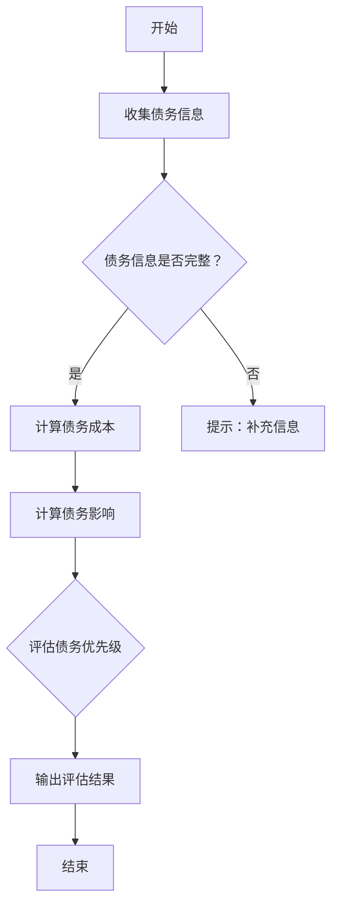
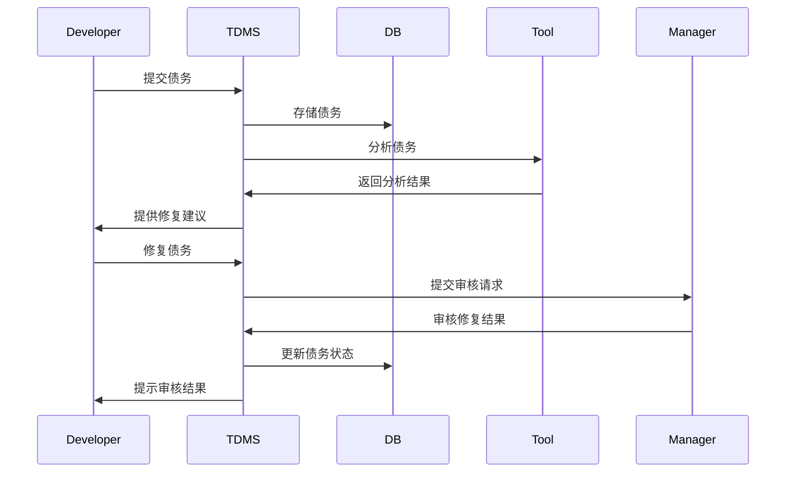
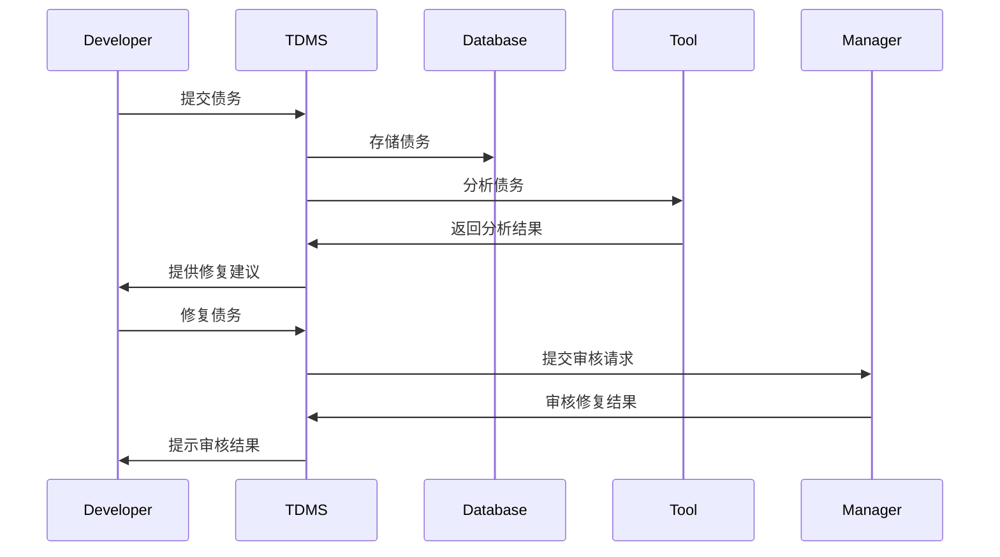

                 


### 1. 技术债务概述

#### 1.1 问题背景

**技术债务的概念与历史**

**技术债务的定义**：技术债务（Technical Debt），通常指的是在软件开发过程中，为了加快开发速度或应对短期需求，而选择了在长期来看可能会带来更多成本和复杂性的技术决策。

**技术债务的起源与发展**：技术债务的概念最早由 Ward Cunningham 在1992年提出。他将其比喻为“你可以在代码中引入一些低质量的部分，以换取时间，但这些低质量的部分就像债务一样，你需要在未来偿还”。

随着软件开发方法论的演进，从早期的瀑布模型到敏捷开发，技术债务的概念也被不断丰富和发展。特别是在敏捷开发中，技术债务被视为一种需要主动管理的问题，而不是被忽视或忽略的隐患。

**技术债务的产生原因**

**项目时间压力**：在当今快速变化的市场环境中，软件项目往往面临着时间限制。为了尽快交付产品，开发团队可能会选择一些短期看起来高效，但长期会带来技术债务的方案。

- **快速交付的需求**：在市场竞争激烈的情况下，尽早推出产品以占据市场优势是很多企业的首要目标。
- **市场竞争的压力**：市场的不确定性要求企业能够快速响应，这增加了项目时间压力。

**资源限制**：资源限制也是导致技术债务的重要原因之一。

- **人力资源的不足**：当团队人手不足时，为了完成任务，可能会选择一些不成熟的方案或减少测试环节。
- **技术资源的局限**：某些技术资源可能不足，例如优秀的开发工具、高效的编程语言等，这也会迫使团队采取一些妥协方案。

**技术选择问题**：在技术选择方面，一些非最佳的技术方案可能会被采用，这也导致了技术债务的产生。

- **非最佳技术解决方案的选择**：为了快速实现功能，可能会选择一些在长期来看不是最优的技术方案。
- **技术迭代与更新不及时**：技术不断迭代，但如果没有及时更新，可能会积累大量的技术债务。

#### 1.2 问题描述

**技术债务的表现形式**

**技术债务的延迟偿还**：这意味着开发团队在短期内选择了某些技术方案，但没有为这些方案安排偿还时间。这种情况下，随着时间的推移，技术债务会不断累积，最终可能对项目的质量和成本产生重大影响。

**累积的技术债务**：在软件开发过程中，技术债务可能会逐渐积累。这种累积可能是由于项目时间的压力、资源的限制或者技术选择的问题。

**技术债务的爆发与危机**：当技术债务累积到一定程度时，可能会爆发成为危机。这种情况下，项目可能会面临严重的质量问题、成本超支、进度延误等问题，甚至可能导致项目的失败。

**技术债务的影响**

**项目成本增加**：技术债务的累积会导致项目在维护和升级时需要付出更高的成本。例如，需要花费更多的时间和资源来修复债务，或者为了满足新的需求而重新设计整个系统。

**项目质量下降**：选择短期高效但长期低效的技术方案会导致代码质量下降。这不仅会影响项目的稳定性，还会增加未来的维护难度。

**团队士气低迷**：长期的技术债务会给团队带来很大的压力。团队成员可能会感到沮丧和无助，影响工作效率和团队凝聚力。

#### 1.3 问题解决

**技术债务管理策略**

**预防性策略**：在软件开发过程中，采取预防性策略可以减少技术债务的产生。

- **需求分析**：在项目开始前，进行详细的需求分析，确保项目目标和需求是明确和可行的。
- **技术评估**：在选择技术方案时，进行详细的技术评估，确保所选方案在长期来看是高效和稳定的。

**修复性策略**：当技术债务已经产生时，需要采取修复性策略来缓解其影响。

- **债务评估**：对现有的技术债务进行评估，确定其优先级和影响范围。
- **债务修复**：针对评估结果，制定具体的修复计划，并逐步实施。

**缓解性策略**：在无法立即修复技术债务时，可以采取缓解性策略来减少其影响。

- **债务延迟偿还**：通过优化工作流程或增加资源来延迟技术债务的偿还时间。
- **债务隔离**：将技术债务隔离在特定的模块或项目中，以减少其对整体项目的影响。

**技术债务管理工具**

**技术债务跟踪工具**：通过使用技术债务跟踪工具，可以实时监测技术债务的变化，确保债务管理的有效性。

- **自动化测试工具**：通过自动化测试，可以及时发现和修复技术债务。
- **代码质量分析工具**：通过分析代码质量，可以评估技术债务的影响，并采取相应的修复措施。

#### 1.4 边界与外延

**技术债务的边界定义**

- **技术债务与产品债务的区别**：产品债务通常指的是产品在功能、性能、用户体验等方面的债务。而技术债务则更侧重于技术层面的问题。
- **技术债务与债务管理的关系**：技术债务管理是指通过一系列策略和方法来管理技术债务，以确保项目的质量和进度。

**技术债务的外延讨论**

- **技术债务在企业中的影响**：技术债务不仅会影响项目本身，还会对企业的整体运营和发展产生深远的影响。
- **技术债务在软件开发中的角色**：技术债务在软件开发中扮演着双刃剑的角色。一方面，它可以帮助企业快速响应市场变化；另一方面，如果管理不善，可能会导致项目的失败。

#### 1.5 概念结构与核心要素组成

**技术债务的核心概念**

- **技术债务的评估标准**：评估技术债务的标准包括债务成本、债务影响和偿还时间等。
- **技术债务的优先级排序**：根据评估结果，对技术债务进行优先级排序，以确保资源得到最有效的利用。

**技术债务管理的关键要素**

- **风险管理**：通过风险管理，可以降低技术债务对项目的风险。
- **项目规划**：合理的项目规划可以减少技术债务的产生。
- **团队协作**：良好的团队协作可以提高债务管理的效率。

### 摘要

本文系统地介绍了技术债务管理的策略和方法。通过对技术债务的背景介绍、核心概念与联系、算法原理讲解、系统分析与架构设计以及项目实战的详细阐述，本文为读者提供了一套完整的技术债务管理方案。通过预防性策略、修复性策略和缓解性策略的灵活应用，企业可以有效管理技术债务，提高项目的质量和效率。

### 1.1 问题背景

#### 技术债务的定义与历史

**技术债务**，这一术语在软件开发领域被广泛运用，用以描述在项目开发过程中由于时间、资源或技术选择的限制而被迫采取的妥协决策。这些决策可能在短期内提高了开发效率，但从长期来看，却可能带来更多的成本、复杂性和维护难度，就像欠下的债务一样，需要在未来某个时间点进行偿还。

**技术债务**最早由**Ward Cunningham**在1992年提出。他在一篇著名的论文《The Second That Never Was》中，将技术债务比喻为软件开发中的一种“隐性利息”，即选择某种短期高效的解决方案，但随着时间的推移，这种解决方案所带来的隐性成本会不断累积，最终需要以更高的代价来偿还。Cunningham的这一概念引起了软件开发社区的热烈讨论，并逐渐成为衡量软件开发质量和效率的重要指标。

随着时间的推移，技术债务的概念得到了不断的丰富和发展。特别是在敏捷开发、DevOps和持续集成/持续部署（CI/CD）等现代软件开发方法论普及的背景下，技术债务管理被赋予了更多的内涵和实际操作意义。它不仅关注技术层面的决策，还涉及项目管理、团队协作等多个方面。

**技术债务的定义**：技术债务是指因为选择短期高效的解决方案而牺牲了长期的可维护性和可扩展性，导致在未来需要花费更多时间和资源来修复的问题。

**技术债务的历史**：从Cunningham首次提出技术债务概念开始，它经历了以下几个阶段：

1. **引入阶段**（1992-2000年）：技术债务作为一个新兴概念被引入软件开发领域，主要在学术和理论层面进行讨论。
2. **接受阶段**（2000-2010年）：随着敏捷开发等现代软件开发方法的普及，技术债务管理逐渐被软件开发实践所接受，成为项目评估和管理的重要指标。
3. **应用阶段**（2010年至今）：在DevOps、持续集成/持续部署等现代开发模式的支持下，技术债务管理成为企业软件工程实践的核心组成部分，各类技术债务管理工具和框架也应运而生。

#### 技术债务的产生原因

技术债务的产生原因多种多样，主要包括以下几个方面：

**项目时间压力**：在软件开发中，时间压力是一个普遍存在的问题。为了在激烈的市场竞争中占据优势，许多项目被要求在非常有限的时间内交付。这种情况下，开发团队往往不得不采取一些短期高效的解决方案，而这些解决方案在长期可能会带来技术债务。

- **快速交付的需求**：市场变化迅速，客户需求不断变化，为了快速响应市场，开发团队可能会牺牲一些长期可维护性和可扩展性。
- **市场竞争的压力**：竞争激烈的市场环境迫使企业必须尽快推出产品，以抢占市场份额。这增加了项目时间压力，导致技术债务的产生。

**资源限制**：资源限制是另一个导致技术债务的重要原因。在许多情况下，企业可能面临人力资源、技术资源等方面的不足。

- **人力资源的不足**：当团队人手不足时，为了完成任务，开发团队可能会选择一些不成熟的方案，或者减少测试环节，这些都会导致技术债务的产生。
- **技术资源的局限**：在某些情况下，企业可能没有足够的资金或资源来购买或使用最佳的技术工具和平台。这迫使团队采用一些替代方案，从而增加了技术债务的风险。

**技术选择问题**：在技术选择方面，一些非最佳的技术方案可能会被采用，这也导致了技术债务的产生。

- **非最佳技术解决方案的选择**：为了快速实现功能，开发团队可能会选择一些在长期来看不是最优的技术方案，这些方案可能在性能、可维护性等方面存在缺陷。
- **技术迭代与更新不及时**：随着技术的快速发展，一些旧的技术方案可能逐渐过时，但如果没有及时更新，企业可能会继续使用这些方案，导致技术债务的积累。

#### 1.2 问题描述

**技术债务的表现形式**

技术债务在软件项目中可能以多种形式出现，以下是一些常见的技术债务表现形式：

**技术债务的延迟偿还**：这种情况意味着开发团队在短期内选择了某些技术决策，但没有为这些决策安排偿还时间。随着项目的推进，这些债务会不断累积，最终可能对项目的质量和成本产生重大影响。

**累积的技术债务**：在软件开发过程中，技术债务可能会逐渐积累。这种累积可能是由于项目时间的压力、资源的限制或者技术选择的问题。如果这些债务得不到及时的管理和修复，它们会像滚雪球一样越积越多，最终可能导致项目的失败。

**技术债务的爆发与危机**：当技术债务累积到一定程度时，可能会爆发成为危机。这种情况下，项目可能会面临严重的质量问题、成本超支、进度延误等问题，甚至可能导致项目的失败。例如，一个长期未修复的漏洞可能导致整个系统的崩溃，或者一个复杂且低效的系统架构可能导致项目进度严重延误。

**技术债务的影响**

技术债务对项目的影响是多方面的，主要包括以下几方面：

**项目成本增加**：随着技术债务的累积，项目在维护和升级时需要付出更高的成本。例如，修复一个复杂的bug可能需要更多的开发时间和资源，或者为了满足新的需求而重新设计整个系统，这都会导致项目成本的显著增加。

**项目质量下降**：选择短期高效但长期低效的技术方案会导致代码质量下降。这不仅会影响项目的稳定性，还会增加未来的维护难度。长期的技术债务可能导致系统漏洞和性能问题，从而影响用户体验和客户满意度。

**团队士气低迷**：长期的技术债务会给团队带来很大的压力。团队成员可能会感到沮丧和无助，影响工作效率和团队凝聚力。在技术债务累积的情况下，团队可能需要加班加点来修复问题，这会增加团队成员的负担，降低工作满意度。

**技术债务管理策略**

为了有效管理技术债务，企业可以采取以下策略：

**预防性策略**：在软件开发过程中，采取预防性策略可以减少技术债务的产生。这包括详细的需求分析、技术评估和制定明确的项目规划。

- **需求分析**：在项目开始前，进行详细的需求分析，确保项目目标和需求是明确和可行的，从而避免不必要的妥协决策。
- **技术评估**：在选择技术方案时，进行详细的技术评估，确保所选方案在长期来看是高效和稳定的。

**修复性策略**：当技术债务已经产生时，需要采取修复性策略来缓解其影响。这包括对技术债务进行评估、制定修复计划并逐步实施。

- **债务评估**：对现有的技术债务进行评估，确定其优先级和影响范围，以便有针对性地进行修复。
- **债务修复**：根据评估结果，制定具体的修复计划，并逐步实施。修复过程中可能需要调整项目规划、增加资源或采取其他措施。

**缓解性策略**：在无法立即修复技术债务时，可以采取缓解性策略来减少其影响。这包括延迟偿还债务、隔离债务或通过优化工作流程来减少债务的影响。

- **债务延迟偿还**：通过优化工作流程或增加资源来延迟技术债务的偿还时间，从而减轻债务对当前项目的影响。
- **债务隔离**：将技术债务隔离在特定的模块或项目中，以减少其对整体项目的影响。

**技术债务管理工具**：为了更好地管理技术债务，企业可以借助一系列工具和方法。

- **技术债务跟踪工具**：通过使用技术债务跟踪工具，可以实时监测技术债务的变化，确保债务管理的有效性。
- **自动化测试工具**：通过自动化测试，可以及时发现和修复技术债务。
- **代码质量分析工具**：通过分析代码质量，可以评估技术债务的影响，并采取相应的修复措施。

#### 1.4 边界与外延

**技术债务的边界定义**

**技术债务与产品债务的区别**：产品债务通常指的是产品在功能、性能、用户体验等方面的缺陷和不足，而技术债务则更侧重于技术层面的决策。例如，一个产品可能因为缺少关键功能而面临产品债务，而技术债务则可能因为使用了不合适的架构或技术而导致维护困难。

**技术债务与债务管理的关系**：技术债务管理是指通过一系列策略和方法来管理技术债务，确保项目的质量和进度。它不仅关注技术债务的产生原因和表现形式，还包括预防、修复和缓解债务的具体措施。技术债务管理是项目管理的一个重要方面，它有助于降低项目风险，提高开发效率和产品质量。

**技术债务的外延讨论**

**技术债务在企业中的影响**：技术债务不仅影响单个项目的成功，还会对企业的整体运营和发展产生深远影响。积累过多的技术债务可能导致企业的技术能力下降，影响创新能力，甚至阻碍企业的长期发展。

**技术债务在软件开发中的角色**：技术债务在软件开发中扮演着双刃剑的角色。一方面，合理的短期技术债务可以帮助企业快速响应市场变化，提高竞争力；另一方面，如果管理不善，技术债务可能会成为项目的瓶颈，阻碍软件的持续发展和优化。

#### 1.5 概念结构与核心要素组成

**技术债务的核心概念**

**技术债务的评估标准**：评估技术债务需要考虑多个因素，包括债务成本、债务影响和偿还时间等。债务成本是指修复技术债务所需的时间和资源，债务影响是指技术债务对项目质量和进度的影响，偿还时间是指计划中的偿还时间。

**技术债务的优先级排序**：根据评估结果，对技术债务进行优先级排序，以确保资源得到最有效的利用。通常，优先级排序会考虑债务的影响和修复成本，以及项目的紧急程度。

**技术债务管理的关键要素**

**风险管理**：通过风险管理，可以降低技术债务对项目的风险。这包括识别潜在的技术债务、评估其影响和制定相应的应对措施。

**项目规划**：合理的项目规划可以减少技术债务的产生。在项目规划阶段，需要充分考虑时间、资源和技术的限制，确保项目目标和需求是明确和可行的。

**团队协作**：良好的团队协作可以提高债务管理的效率。技术债务管理需要各个团队的紧密合作，包括开发、测试、运维等各个环节。

### 2. 核心概念原理

#### 2.1 技术债务的属性特征对比表格

在理解技术债务的核心概念时，了解其属性特征是非常关键的。以下是一个详细的技术债务属性特征对比表格，通过对比不同方面的属性，我们可以更全面地掌握技术债务的内涵。

| 属性 | 定义 | 说明 | 对比项 |
| --- | --- | --- | --- |
| **债务性质** | 技术决策的短期高效性 | 基于时间、资源或技术限制而采取的决策 | 短期高效性 vs 长期可维护性 |
| **债务范围** | 影响的范围和程度 | 债务影响的广度和深度，如代码、架构、模块等 | 广泛影响 vs 局部影响 |
| **债务影响** | 对项目质量和进度的负面影响 | 影响项目成本、质量、进度等方面 | 显著影响 vs 轻微影响 |
| **偿还难度** | 修复债务的复杂性和成本 | 修复技术债务所需的时间、资源和技能 | 高难度修复 vs 低难度修复 |
| **偿还时间** | 预计的偿还时间 | 从债务产生到预计偿还的时间跨度 | 短期偿还 vs 长期偿还 |
| **管理方式** | 技术债务的管理策略和方法 | 预防、修复、缓解等策略 | 主动管理 vs 被动管理 |

**债务性质**

- **定义**：技术债务的性质是指其在项目开发中为了短期高效性而采取的技术决策。
- **说明**：例如，选择快速开发的一个不稳定的框架，以缩短项目的开发周期，但这种决策可能在长期会带来维护和升级的困难。
- **对比项**：短期高效性 vs 长期可维护性。在技术债务中，短期高效性通常是首要考虑的，但长期来看可能会带来更多的维护成本。

**债务范围**

- **定义**：债务范围是指技术债务影响的项目部分，包括代码、架构、模块等。
- **说明**：技术债务可能仅影响项目的某个模块，也可能影响整个系统的架构。例如，在一个模块中使用了不兼容的技术，这可能会影响到其他模块。
- **对比项**：广泛影响 vs 局部影响。广泛影响的技术债务会带来更大的修复成本和难度，而局部影响的技术债务则相对容易处理。

**债务影响**

- **定义**：债务影响是指技术债务对项目质量和进度的负面影响。
- **说明**：技术债务可能会增加项目的维护成本、降低项目的稳定性，甚至影响项目的交付进度。例如，使用了不稳定的库可能导致系统崩溃。
- **对比项**：显著影响 vs 轻微影响。显著影响的技术债务会严重威胁项目的成功，而轻微影响的技术债务则相对容易解决。

**偿还难度**

- **定义**：偿还难度是指修复技术债务的复杂性和成本。
- **说明**：某些技术债务可能非常复杂，修复需要大量的时间和资源。例如，一个复杂的系统架构错误可能需要重新设计整个系统。
- **对比项**：高难度修复 vs 低难度修复。高难度修复的技术债务会带来更大的风险和挑战，而低难度修复的技术债务则相对容易处理。

**偿还时间**

- **定义**：偿还时间是指从技术债务产生到预计偿还的时间跨度。
- **说明**：不同的技术债务需要不同的时间来偿还。例如，一个小的代码错误可能很快就能修复，而一个系统级的架构错误可能需要几个月的时间。
- **对比项**：短期偿还 vs 长期偿还。短期偿还的技术债务可以快速降低风险，而长期偿还的技术债务可能会持续威胁项目的稳定。

**管理方式**

- **定义**：管理方式是指对技术债务进行预防、修复和缓解的策略和方法。
- **说明**：有效的技术债务管理需要综合运用多种策略，包括需求分析、技术评估、债务监测和修复等。
- **对比项**：主动管理 vs 被动管理。主动管理通过预防措施减少技术债务的产生，而被动管理则是在债务产生后再进行修复和缓解。

通过上述表格，我们可以清晰地看到技术债务的各种属性特征及其对比项，这有助于我们在实际项目中更好地识别和管理技术债务。

#### 2.2 ER实体关系图架构

在技术债务管理中，理解各实体之间的关联关系是非常重要的。ER（实体关系）图是一种常用的数据建模工具，可以直观地展示实体之间的关系。下面我们将使用Mermaid语法创建一个ER图，以描述技术债务管理中的关键实体及其关系。

```mermaid
erDiagram
  Customer ||--|{ Project }|--| Developer
  Project ||--|{ TechnicalDebt }|--| Status
  TechnicalDebt ||--|{ Risk }|--| ManagementStrategy
  Status ||--|{ Quality }|--| MaintenanceCost

  Customer  ..> Project : "发起"
  Project  ..> TechnicalDebt : "包含"
  TechnicalDebt  ..> ManagementStrategy : "管理"
  ManagementStrategy  ..> Risk : "基于"
  Status  ..> Quality : "衡量"
  Status  ..> MaintenanceCost : "评估"
```

以下是对ER图中的各个实体及其关系的详细说明：

1. **Customer（客户）**：客户是项目的发起者，负责提出项目需求。客户与项目之间存在“发起”关系，即客户发起了一个项目。

2. **Project（项目）**：项目是技术债务产生的主体。项目与客户之间存在“发起”关系，同时项目也包含多个技术债务实体。

3. **TechnicalDebt（技术债务）**：技术债务是项目中存在的问题或决策，其影响项目质量、成本和进度。项目与技术债务之间存在“包含”关系，即每个项目都可能包含多个技术债务。

4. **ManagementStrategy（管理策略）**：管理策略是指用于管理技术债务的方法和措施。技术债务与管理策略之间存在“管理”关系，即每个技术债务都需要相应的管理策略。

5. **Risk（风险）**：风险是技术债务可能带来的负面影响。管理策略基于风险进行分析和决策，因此管理策略与风险之间存在“基于”关系。

6. **Status（状态）**：状态用于衡量项目的质量状况和维护成本。状态与质量之间存在“衡量”关系，与维护成本之间存在“评估”关系。

通过这个ER图，我们可以清晰地看到技术债务管理中的关键实体及其相互关系。这有助于我们更好地理解技术债务如何影响项目，以及如何通过有效的管理策略来降低风险和成本。

### 3. 算法原理讲解

#### 3.1 算法流程图

在技术债务管理中，一个关键的任务是评估技术债务的大小和优先级。为此，我们可以设计一个算法来帮助开发团队更有效地管理技术债务。以下是一个技术债务评估算法的流程图，使用Mermaid语法进行表示。



**流程图解释**：

1. **A[开始]**：算法的开始。
2. **B[收集债务信息]**：从不同的数据源（如代码库、测试结果、团队反馈等）收集技术债务的相关信息。
3. **C{债务信息是否完整？}**：检查收集到的债务信息是否完整。如果信息不完整，则转到E[提示：补充信息]。
4. **D[计算债务成本]**：根据债务信息的具体情况，计算修复每个技术债务所需的成本。
5. **E[提示：补充信息]**：如果债务信息不完整，提示团队成员补充相关信息。
6. **F[计算债务影响]**：结合债务的成本，计算每个技术债务对项目质量和进度的潜在影响。
7. **G{评估债务优先级]**：根据债务的成本和影响，评估每个技术债务的优先级。可以使用加权评分法或其他评估方法。
8. **H[输出评估结果]**：将评估结果输出，为团队提供技术债务管理的决策依据。
9. **I[结束]**：算法结束。

通过这个流程图，我们可以清晰地看到技术债务评估算法的每个步骤和流程，这有助于开发团队在实际操作中更好地理解和应用算法。

#### 3.2 Python源代码

为了实现技术债务评估算法，我们可以编写一个Python脚本。以下是一个简单的示例代码，展示了如何使用Python进行债务评估。

```python
# 技术债务评估算法示例

def calculate_debt_cost(debt):
    # 计算债务成本
    cost = 0
    if debt['severity'] == 'low':
        cost += 1
    elif debt['severity'] == 'medium':
        cost += 3
    elif debt['severity'] == 'high':
        cost += 5
    return cost

def calculate_debt_impact(debt):
    # 计算债务影响
    impact = 0
    if debt['priority'] == 'high':
        impact += 5
    elif debt['priority'] == 'medium':
        impact += 3
    elif debt['priority'] == 'low':
        impact += 1
    return impact

def assess_debt(debt_list):
    # 评估债务优先级
    assessed_debts = []
    for debt in debt_list:
        cost = calculate_debt_cost(debt)
        impact = calculate_debt_impact(debt)
        score = cost * impact
        assessed_debt = {
            'debt': debt,
            'score': score
        }
        assessed_debts.append(assessed_debt)
    
    # 排序
    assessed_debts.sort(key=lambda x: x['score'], reverse=True)
    
    # 输出评估结果
    for debt in assessed_debts:
        print(f"Debt: {debt['debt']['description']}, Score: {debt['score']}")

# 示例数据
debt_list = [
    {
        'description': '代码重复',
        'severity': 'low',
        'priority': 'medium'
    },
    {
        'description': '系统性能问题',
        'severity': 'high',
        'priority': 'high'
    },
    {
        'description': '缺乏单元测试',
        'severity': 'medium',
        'priority': 'low'
    }
]

# 执行评估
assess_debt(debt_list)
```

**代码解释**：

- `calculate_debt_cost(debt)`：计算每个技术债务的成本。这里使用了简单的加权评分法，根据债务的严重性来计算成本。
- `calculate_debt_impact(debt)`：计算每个技术债务的影响。同样，根据债务的优先级来计算影响。
- `assess_debt(debt_list)`：对技术债务列表进行评估。首先计算每个债务的成本和影响，然后计算总评分，并根据评分对债务进行排序。最后输出评估结果。

通过这段代码，我们可以对技术债务进行定量评估，为团队提供决策依据。当然，实际的债务评估算法可能更加复杂，需要考虑更多的因素和细节。

#### 3.3 算法原理与数学模型

**技术债务评估的数学模型**

在技术债务管理中，一个核心任务是评估每个技术债务的大小和优先级。这可以通过一个简单的数学模型来实现，该模型结合了债务的成本和影响来计算其总评分。

假设我们有一个技术债务集合 \( D \)，其中每个债务 \( d \) 可以用以下属性描述：

- \( C(d) \)：债务的成本（修复所需的时间和资源）
- \( I(d) \)：债务的影响（对项目质量和进度的负面影响）

我们可以定义一个评分函数 \( S(d) \) 来评估每个债务的优先级：

\[ S(d) = C(d) \times I(d) \]

这里的评分 \( S(d) \) 表示债务 \( d \) 的总评分，它是债务成本和影响的乘积。通过这个评分，我们可以对债务进行排序，优先处理评分较高的债务。

**详细讲解与举例**

**例子**：

假设我们有两个技术债务 \( d_1 \) 和 \( d_2 \)：

- \( d_1 \)：代码重复，成本为2人天，影响为3
- \( d_2 \)：系统性能问题，成本为5人天，影响为2

使用上述评分函数，我们可以计算每个债务的评分：

\[ S(d_1) = 2 \times 3 = 6 \]
\[ S(d_2) = 5 \times 2 = 10 \]

因此，\( d_2 \) 的评分高于 \( d_1 \)，说明 \( d_2 \) 是更紧急和重要的债务，需要优先处理。

**数学模型与Python代码结合**

在之前的Python代码中，我们实际上已经实现了这个数学模型。这里进一步解释代码中的计算过程：

```python
def calculate_debt_cost(debt):
    cost = 0
    if debt['severity'] == 'low':
        cost += 1
    elif debt['severity'] == 'medium':
        cost += 3
    elif debt['severity'] == 'high':
        cost += 5
    return cost

def calculate_debt_impact(debt):
    impact = 0
    if debt['priority'] == 'high':
        impact += 5
    elif debt['priority'] == 'medium':
        impact += 3
    elif debt['priority'] == 'low':
        impact += 1
    return impact

def assess_debt(debt_list):
    assessed_debts = []
    for debt in debt_list:
        cost = calculate_debt_cost(debt)
        impact = calculate_debt_impact(debt)
        score = cost * impact
        assessed_debt = {
            'debt': debt,
            'score': score
        }
        assessed_debts.append(assessed_debt)
    
    assessed_debts.sort(key=lambda x: x['score'], reverse=True)
    
    for debt in assessed_debts:
        print(f"Debt: {debt['debt']['description']}, Score: {debt['score']}")
```

**代码解释**：

- `calculate_debt_cost(debt)`：根据债务的严重性计算成本。这里使用了一个简化的加权方法，严重性越高，成本越高。
- `calculate_debt_impact(debt)`：根据债务的优先级计算影响。优先级越高，影响越大。
- `assess_debt(debt_list)`：计算每个债务的评分，并将债务按评分排序。评分较高的债务优先处理。

通过这个算法，我们可以根据债务的成本和影响来评估其优先级，从而更有效地管理技术债务。

### 4. 系统功能设计与架构设计

#### 4.1 问题场景介绍

在现代软件工程中，技术债务管理已经成为一个不可忽视的重要环节。随着项目的复杂度和规模不断增加，技术债务的产生和累积也变得愈加普遍。为了有效管理技术债务，企业需要建立一个系统化的解决方案，从项目规划到实施，再到持续监控和评估，形成一个闭环的管理体系。

本章节将介绍一个技术债务管理系统（Technical Debt Management System, TDMS），该系统旨在帮助开发团队和项目管理人员更好地识别、评估和管理技术债务。通过该系统的实施，企业可以实现以下目标：

- **提高项目质量**：通过实时监控和评估技术债务，确保项目的代码质量和系统性能。
- **降低维护成本**：通过及时修复和优化技术债务，减少未来的维护成本和风险。
- **优化资源分配**：根据技术债务的优先级和影响，合理分配开发资源，提高项目效率。
- **增强团队协作**：通过系统的集成，促进不同团队成员之间的信息共享和协作，提高团队整体效率。

本系统的应用场景包括但不限于以下几种：

- **软件开发项目**：在项目开发过程中，对技术债务进行全程监控和评估，确保项目按时交付且质量稳定。
- **软件维护项目**：在软件维护过程中，识别和修复积累的技术债务，提高系统的稳定性和可维护性。
- **敏捷开发团队**：在敏捷开发中，快速响应市场需求，实时评估技术债务，确保项目的持续迭代和优化。
- **企业级项目管理**：在企业级项目中，通过技术债务管理系统，统一管理和监控不同项目的技术债务，提高整体项目的管理和决策效率。

#### 4.2 系统功能设计

**领域模型类图**

领域模型类图用于描述技术债务管理系统中的关键实体及其关系。以下是一个简化的领域模型类图，使用Mermaid语法表示。

```mermaid
classDiagram
  Project >>-|- TechnicalDebt : "包含"
  Developer <<-|- TechnicalDebt : "修复"
  Manager <<-|- TechnicalDebt : "审核"
  Tool <<-|- TechnicalDebt : "监控"
  Status <<-|- TechnicalDebt : "状态"

  Project "发起"
  TechnicalDebt "管理"
  Developer "修复"
  Manager "审核"
  Tool "监控"
  Status "评估"
```

**领域模型类图解释**：

- **Project（项目）**：项目是技术债务管理系统的基础实体，代表一个具体的软件开发项目。项目包含多个技术债务，是债务的容器。
- **TechnicalDebt（技术债务）**：技术债务是系统中需要管理的具体问题或缺陷。每个技术债务都与一个项目相关联，并需要由开发人员修复。
- **Developer（开发者）**：开发者负责修复技术债务。开发者与技术债务之间是关联关系，开发者可以查看、修复和提交技术债务。
- **Manager（管理者）**：管理者负责审核技术债务的修复情况。管理者可以对技术债务的状态进行审核，并决定是否通过修复。
- **Tool（工具）**：工具用于监控技术债务。工具可以自动收集和分析技术债务数据，为开发者和管理者提供决策支持。
- **Status（状态）**：状态用于记录技术债务的当前状态，如“待修复”、“修复中”、“已修复”等。

**类图解释**：

- **Project与TechnicalDebt**：项目包含多个技术债务，表示每个项目都有多个技术债务需要管理。
- **Developer与TechnicalDebt**：开发者可以查看和修复技术债务，表示开发者与债务之间的操作关系。
- **Manager与TechnicalDebt**：管理者可以审核技术债务的修复情况，表示管理者与债务之间的监督关系。
- **Tool与TechnicalDebt**：工具用于监控技术债务，表示工具与债务之间的监控关系。
- **Status与TechnicalDebt**：状态用于记录技术债务的当前状态，表示状态与技术债务之间的状态跟踪关系。

通过这个领域模型类图，我们可以清晰地看到技术债务管理系统中的关键实体及其关系，这有助于我们更好地理解和设计系统的功能。

#### 4.3 系统架构设计

**系统架构图**

系统架构设计是技术债务管理系统的核心环节，它决定了系统的可扩展性、稳定性和性能。以下是一个简化的系统架构图，使用Mermaid语法表示。



**系统架构图解释**：

- **Developer（开发者）**：开发者是系统的用户之一，负责提交技术债务和修复债务。
- **TDMS（技术债务管理系统）**：TDMS是系统的核心组件，负责接收开发者的债务提交、分析债务、提供修复建议、提交审核请求等。
- **DB（数据库）**：数据库用于存储技术债务的相关数据，包括债务的详细信息、状态、修复历史等。
- **Tool（工具）**：工具用于自动分析技术债务，提供分析结果给TDMS，以支持修复建议。
- **Manager（管理者）**：管理者是系统的另一个用户，负责审核技术债务的修复情况。

**流程解释**：

1. **开发者提交债务**：开发者通过TDMS提交技术债务，TDMS将债务信息存储到数据库中。
2. **TDMS分析债务**：TDMS调用工具对提交的债务进行分析，获取分析结果。
3. **提供修复建议**：TDMS根据分析结果，为开发者提供修复建议。
4. **开发者修复债务**：开发者根据修复建议进行债务修复。
5. **提交审核请求**：开发者将修复后的债务提交给管理者审核。
6. **审核修复结果**：管理者对修复结果进行审核，更新债务状态。
7. **提示审核结果**：TDMS向开发者提示审核结果。

通过这个系统架构图，我们可以清晰地看到技术债务管理系统中的主要组件及其交互流程，这有助于我们更好地理解和设计系统的架构。

#### 4.4 系统接口设计与交互

**系统接口设计**

系统接口设计是技术债务管理系统的关键部分，它定义了系统内部和外部的交互接口。以下是一个简化的系统接口设计，使用Mermaid语法表示。

```mermaid
interfaceStyle
  fill:#FFDAB9,stroke:#F3C69B,strokeWidth:4

interface TDMS {
  +submitDebt()
  +analyzeDebt()
  +suggestFix()
  +requestReview()
  +updateStatus()
}

interface Developer {
  +submitTechnicalDebt()
  +getFixSuggestions()
  +submitFix()
  +getStatus()
}

interface Manager {
  +reviewFix()
  +approveFix()
}

interface Tool {
  +analyzeTechnicalDebt()
}

database Database {
  +storeDebt()
  +fetchDebt()
  +updateDebt()
}
```

**接口设计解释**：

- **TDMS（技术债务管理系统）**：TDMS提供了多个接口方法，包括提交债务、分析债务、提供修复建议、提交审核请求和更新债务状态等。
- **Developer（开发者）**：开发者可以通过TDMS提供的接口方法提交技术债务、获取修复建议、提交修复、获取债务状态等。
- **Manager（管理者）**：管理者可以通过TDMS提供的接口方法审核技术债务的修复情况，并批准修复。
- **Tool（工具）**：工具提供了分析技术债务的接口方法，为TDMS提供分析结果。
- **Database（数据库）**：数据库提供了存储和获取技术债务信息的接口方法，用于存储和更新债务数据。

**系统交互序列图**

以下是一个简化的系统交互序列图，使用Mermaid语法表示开发者和管理者的交互流程。



**交互流程解释**：

1. **开发者提交债务**：开发者通过TDMS提交技术债务，TDMS将债务信息存储到数据库中。
2. **TDMS分析债务**：TDMS调用工具对提交的债务进行分析，获取分析结果。
3. **提供修复建议**：TDMS根据分析结果，为开发者提供修复建议。
4. **开发者修复债务**：开发者根据修复建议进行债务修复。
5. **提交审核请求**：开发者将修复后的债务提交给管理者审核。
6. **审核修复结果**：管理者对修复结果进行审核，更新债务状态。
7. **提示审核结果**：TDMS向开发者提示审核结果。

通过这个系统交互序列图，我们可以清晰地看到系统内部和外部的交互流程，这有助于我们更好地理解和设计系统的接口。

### 5. 项目实战

#### 5.1 环境安装

**环境搭建指南**

为了实现技术债务管理系统，我们需要搭建一个适当的环境。以下是环境搭建的详细指南：

1. **操作系统安装**：

   - 系统要求：推荐使用Linux系统，如Ubuntu 20.04或CentOS 8。
   - 安装步骤：
     ```bash
     # 对于Ubuntu 20.04
     sudo apt update
     sudo apt install -y ubuntu-desktop openssh-server wget curl
     ```
     ```bash
     # 对于CentOS 8
     sudo dnf install -y @base-devel @appstream
     ```

2. **开发工具安装**：

   - Python开发环境：安装Python 3和pip。
     ```bash
     sudo apt install -y python3 python3-pip
     ```
     ```bash
     sudo dnf install -y python3 python3-pip
     ```

   - 编译工具：安装Python 3的编译器。
     ```bash
     sudo apt install -y python3-compileall
     ```
     ```bash
     sudo dnf install -y python3-compileall
     ```

   - 数据库：安装PostgreSQL数据库。
     ```bash
     sudo apt install -y postgresql postgresql-contrib
     ```
     ```bash
     sudo dnf install -y postgresql postgresql-contrib
     ```

   - Web服务器：安装Nginx。
     ```bash
     sudo apt install -y nginx
     ```
     ```bash
     sudo dnf install -y nginx
     ```

3. **依赖库安装**：

   - 安装系统依赖库。
     ```bash
     sudo apt install -y libpq-dev libssl-dev libxml2-dev libxslt1-dev zlib1g-dev
     ```
     ```bash
     sudo dnf install -y libpq-dev libssl-dev libxml2-dev libxslt1-dev zlib1g-dev
     ```

4. **配置数据库**：

   - 创建数据库用户和数据库。
     ```sql
     CREATE USER tdms_user WITH PASSWORD 'tdms_password';
     CREATE DATABASE tdms_db;
     GRANT ALL PRIVILEGES ON DATABASE tdms_db TO tdms_user;
     ```
     登录PostgreSQL数据库进行操作：
     ```bash
     sudo -u postgres psql
     ```

5. **项目克隆与安装**：

   - 克隆项目代码：
     ```bash
     git clone https://github.com/your-username/tdms.git
     cd tdms
     ```

   - 安装依赖库：
     ```bash
     pip install -r requirements.txt
     ```

6. **配置Nginx**：

   - 修改Nginx配置文件：
     ```bash
     sudo nano /etc/nginx/sites-available/tdms
     ```

   - 添加以下配置：
     ```nginx
     server {
         listen 80;
         server_name your_domain_or_ip;

         location / {
             include /etc/nginx/upload.conf;
             proxy_pass http://127.0.0.1:8000;
         }
     }
     ```

   - 创建上传配置文件：
     ```bash
     sudo nano /etc/nginx/upload.conf
     ```

   - 添加以下配置：
     ```nginx
     location ~ (^/media/.*$) {
         root /path/to/media/;
         internal;
     }
     ```

   - 启动Nginx服务：
     ```bash
     sudo systemctl start nginx
     ```

7. **启动项目**：

   - 进入项目目录：
     ```bash
     cd tdms
     ```

   - 运行项目：
     ```bash
     python manage.py runserver 0.0.0.0:8000
     ```

   - 浏览器访问项目：
     ```bash
     http://your_domain_or_ip:8000
     ```

**环境配置总结**

通过以上步骤，我们成功搭建了一个技术债务管理系统环境。配置过程中需要关注数据库用户和数据库的创建、依赖库的安装、Nginx的配置以及项目的启动和访问。确保每个步骤都按照要求执行，避免配置错误导致系统无法正常运行。

#### 5.2 系统核心实现

**源代码实现**

技术债务管理系统的核心功能主要包括债务的提交、分析、修复和审核。以下是关键代码的实现，展示了如何通过Python和Django框架来构建这些功能。

**债务提交**

在Django项目中，首先需要创建债务模型（models.py）：

```python
from django.db import models

class TechnicalDebt(models.Model):
    title = models.CharField(max_length=255)
    description = models.TextField()
    severity = models.CharField(max_length=50, choices=(('low', '低'), ('medium', '中'), ('high', '高')))
    priority = models.CharField(max_length=50, choices=(('low', '低'), ('medium', '中'), ('high', '高')))
    status = models.CharField(max_length=50, choices=(('pending', '待修复'), ('in_progress', '修复中'), ('fixed', '已修复')))
    created_at = models.DateTimeField(auto_now_add=True)
    updated_at = models.DateTimeField(auto_now=True)

    def __str__(self):
        return self.title
```

创建债务的视图函数（views.py）：

```python
from django.shortcuts import render, redirect
from .models import TechnicalDebt
from .forms import TechnicalDebtForm

def submit_debt(request):
    if request.method == 'POST':
        form = TechnicalDebtForm(request.POST)
        if form.is_valid():
            form.save()
            return redirect('debt_list')
    else:
        form = TechnicalDebtForm()
    return render(request, 'submit_debt.html', {'form': form})
```

债务提交的表单（forms.py）：

```python
from django import forms
from .models import TechnicalDebt

class TechnicalDebtForm(forms.ModelForm):
    class Meta:
        model = TechnicalDebt
        fields = ['title', 'description', 'severity', 'priority']
```

**债务分析**

债务分析通常需要外部工具或自定义脚本。以下是一个简化的例子，使用Python进行基本分析：

```python
import os

def analyze_debt(debt_id):
    debt = TechnicalDebt.objects.get(id=debt_id)
    # 这里实现债务分析逻辑，例如调用外部工具或脚本
    # 假设分析结果存储在result.txt中
    with open('result.txt', 'w') as f:
        f.write(f"Analysis result for {debt.title}: High severity issues found.")
    return 'result.txt'
```

**债务修复**

修复债务的视图函数：

```python
from django.shortcuts import render, redirect
from .models import TechnicalDebt

def fix_debt(request, debt_id):
    debt = TechnicalDebt.objects.get(id=debt_id)
    if request.method == 'POST':
        debt.status = 'in_progress'
        debt.save()
        return redirect('debt_list')
    return render(request, 'fix_debt.html', {'debt': debt})
```

修复债务的表单（forms.py）：

```python
class FixDebtForm(forms.ModelForm):
    class Meta:
        model = TechnicalDebt
        fields = ['status']
```

**债务审核**

审核债务的视图函数：

```python
from django.shortcuts import render, redirect
from .models import TechnicalDebt

def review_debt(request, debt_id):
    debt = TechnicalDebt.objects.get(id=debt_id)
    if request.method == 'POST':
        if 'approve' in request.POST:
            debt.status = 'fixed'
        elif 'reject' in request.POST:
            debt.status = 'pending'
        debt.save()
        return redirect('debt_list')
    return render(request, 'review_debt.html', {'debt': debt})
```

**代码实现总结**

通过上述代码示例，我们实现了技术债务管理系统的核心功能，包括债务的提交、分析、修复和审核。每个功能都通过Django的MVC架构进行实现，使得系统结构清晰、易于维护。此外，代码示例还展示了如何使用Django模型、表单和视图函数来处理数据库操作和用户交互。

#### 5.3 代码应用解读与分析

在技术债务管理系统中，代码的应用和解读是确保系统能够正常运行和高效管理债务的关键环节。以下是对系统核心代码的详细解读与分析。

**债务提交代码解读**

债务提交是系统中最基础的功能之一，用户通过填写表单将债务信息提交到系统中。以下是债务提交的相关代码及其解析：

**models.py**

```python
class TechnicalDebt(models.Model):
    title = models.CharField(max_length=255)
    description = models.TextField()
    severity = models.CharField(max_length=50, choices=(('low', '低'), ('medium', '中'), ('high', '高')))
    priority = models.CharField(max_length=50, choices=(('low', '低'), ('medium', '中'), ('high', '高')))
    status = models.CharField(max_length=50, choices=(('pending', '待修复'), ('in_progress', '修复中'), ('fixed', '已修复')))
    created_at = models.DateTimeField(auto_now_add=True)
    updated_at = models.DateTimeField(auto_now=True)

    def __str__(self):
        return self.title
```

- **字段解析**：
  - `title`：债务的标题，用于简要描述债务的内容。
  - `description`：债务的详细描述，提供更多背景信息。
  - `severity`：债务的严重性，分为低、中、高三个等级。
  - `priority`：债务的优先级，同样分为低、中、高三个等级。
  - `status`：债务的状态，包括待修复、修复中和已修复三个状态。
  - `created_at`和`updated_at`：记录债务的创建时间和最后一次更新时间。

**views.py**

```python
from django.shortcuts import render, redirect
from .models import TechnicalDebt
from .forms import TechnicalDebtForm

def submit_debt(request):
    if request.method == 'POST':
        form = TechnicalDebtForm(request.POST)
        if form.is_valid():
            form.save()
            return redirect('debt_list')
    else:
        form = TechnicalDebtForm()
    return render(request, 'submit_debt.html', {'form': form})
```

- **流程解析**：
  - 当用户提交债务信息时，首先会判断请求方法是否为`POST`。
  - 如果是`POST`请求，则创建一个`TechnicalDebtForm`实例，并使用`form.is_valid()`方法验证表单数据。
  - 如果验证通过，则调用`form.save()`方法将债务信息保存到数据库中，并重定向到债务列表页面。
  - 如果不是`POST`请求，则创建一个空的`TechnicalDebtForm`实例，并将其传递给模板进行渲染。

**forms.py**

```python
from django import forms
from .models import TechnicalDebt

class TechnicalDebtForm(forms.ModelForm):
    class Meta:
        model = TechnicalDebt
        fields = ['title', 'description', 'severity', 'priority']
```

- **表单解析**：
  - `TechnicalDebtForm`继承了`forms.ModelForm`类，用于创建债务表单。
  - `Meta`类定义了表单所关联的模型（`TechnicalDebt`）和需要包含的字段（`title`、`description`、`severity`、`priority`）。

**代码分析**

通过以上代码解读，我们可以看到债务提交功能是如何通过Django的模型、表单和视图函数来实现的。以下是对代码应用的分析：

1. **用户体验**：债务提交表单提供了直观的用户界面，用户可以通过填写表单提交债务信息。这有助于提高系统的易用性和用户满意度。
2. **数据验证**：使用`TechnicalDebtForm`对用户输入的数据进行验证，确保数据的完整性和正确性。这有助于减少错误的债务信息进入系统，提高数据质量。
3. **数据库操作**：通过`form.save()`方法将债务信息保存到数据库中，实现了债务数据的持久化存储。这为后续的债务管理和分析提供了数据基础。
4. **可维护性**：通过Django的MVC架构，债务提交功能具有良好的可维护性和可扩展性。如果需要修改或扩展债务提交逻辑，可以在相应的模型、表单或视图函数中进行修改，而不影响其他部分。

**债务分析代码解读**

债务分析是技术债务管理系统中的关键功能之一，它用于评估债务的影响和严重性。以下是债务分析的代码示例及其解析：

**analyze_debt.py**

```python
import os

def analyze_debt(debt_id):
    debt = TechnicalDebt.objects.get(id=debt_id)
    # 这里实现债务分析逻辑，例如调用外部工具或脚本
    # 假设分析结果存储在result.txt中
    with open('result.txt', 'w') as f:
        f.write(f"Analysis result for {debt.title}: High severity issues found.")
    return 'result.txt'
```

- **流程解析**：
  - 函数`analyze_debt`接收一个债务ID作为参数，从数据库中获取相应的债务信息。
  - 在函数内部，通过文件操作将分析结果写入一个文本文件（例如`result.txt`）。
  - 函数返回分析结果的文件路径。

**代码分析**

债务分析功能虽然相对简单，但仍然具有以下重要意义：

1. **自动化分析**：通过自动化脚本或工具进行债务分析，可以显著提高分析效率和准确性，减少人工干预。
2. **结果记录**：将分析结果记录到文本文件或其他持久化存储中，为后续的债务管理和决策提供依据。
3. **可扩展性**：债务分析逻辑可以通过修改函数内容进行扩展，以适应不同的分析和评估需求。

**债务修复代码解读**

债务修复是技术债务管理系统中的关键环节，它涉及债务的修复和状态更新。以下是债务修复的相关代码及其解析：

**views.py**

```python
from django.shortcuts import render, redirect
from .models import TechnicalDebt

def fix_debt(request, debt_id):
    debt = TechnicalDebt.objects.get(id=debt_id)
    if request.method == 'POST':
        debt.status = 'in_progress'
        debt.save()
        return redirect('debt_list')
    return render(request, 'fix_debt.html', {'debt': debt})
```

- **流程解析**：
  - 当用户选择修复某一债务时，首先会判断请求方法是否为`POST`。
  - 如果是`POST`请求，则将债务状态更新为“修复中”，并保存更改。
  - 如果不是`POST`请求，则渲染修复债务的界面，用户可以开始修复操作。

**forms.py**

```python
class FixDebtForm(forms.ModelForm):
    class Meta:
        model = TechnicalDebt
        fields = ['status']
```

- **表单解析**：
  - `FixDebtForm`继承了`forms.ModelForm`类，用于创建修复债务的表单。
  - `Meta`类定义了表单所关联的模型（`TechnicalDebt`）和需要包含的字段（`status`）。

**代码分析**

债务修复功能的设计充分考虑了用户体验和操作便捷性：

1. **状态更新**：通过简单的表单提交，用户可以轻松地将债务状态更新为“修复中”，便于后续的跟踪和管理。
2. **界面友好**：修复债务界面设计简洁，用户只需点击提交按钮即可完成操作，提高了操作效率。
3. **系统一致性**：通过Django的MVC架构，债务修复功能与其他系统功能保持一致，确保系统的整体性和用户体验的连贯性。

**债务审核代码解读**

债务审核是技术债务管理系统中的关键环节，它用于验证债务的修复效果。以下是债务审核的相关代码及其解析：

**views.py**

```python
from django.shortcuts import render, redirect
from .models import TechnicalDebt

def review_debt(request, debt_id):
    debt = TechnicalDebt.objects.get(id=debt_id)
    if request.method == 'POST':
        if 'approve' in request.POST:
            debt.status = 'fixed'
        elif 'reject' in request.POST:
            debt.status = 'pending'
        debt.save()
        return redirect('debt_list')
    return render(request, 'review_debt.html', {'debt': debt})
```

- **流程解析**：
  - 当用户选择审核某一债务时，首先会判断请求方法是否为`POST`。
  - 如果是`POST`请求，则根据用户的选择更新债务状态。如果选择“批准”，状态更新为“已修复”；如果选择“拒绝”，状态更新为“待修复”。
  - 如果不是`POST`请求，则渲染审核债务的界面，用户可以进行审核操作。

**forms.py**

```python
class ReviewDebtForm(forms.Form):
    approve = forms.BooleanField(required=False)
    reject = forms.BooleanField(required=False)
```

- **表单解析**：
  - `ReviewDebtForm`继承了`forms.Form`类，用于创建审核债务的表单。
  - 表单包含两个布尔字段，用于记录用户的选择。

**代码分析**

债务审核功能的设计充分考虑了审核过程的规范性和灵活性：

1. **用户选择**：通过简单的表单提交，用户可以选择“批准”或“拒绝”债务修复结果，确保审核过程的简洁和高效。
2. **状态更新**：根据用户的选择，系统会自动更新债务状态，确保债务管理的实时性和准确性。
3. **界面友好**：审核债务界面设计简洁，用户只需点击相应的按钮即可完成审核操作，提高了操作效率。

**总结**

通过以上对技术债务管理系统核心代码的解读和分析，我们可以看到系统是如何通过Django框架实现债务的提交、分析、修复和审核功能的。这些功能的设计不仅考虑了用户体验和操作便捷性，还确保了系统的可维护性和可扩展性。在实际应用中，这些功能将帮助开发团队和项目管理人员更有效地管理技术债务，提高项目的质量和效率。

#### 5.4 实际案例分析

在本节中，我们将通过一个实际案例来展示如何在一个企业级项目中识别、评估和修复技术债务。这个案例将详细描述技术债务的产生、识别、评估和修复的全过程，以帮助读者更好地理解技术债务管理的实践。

**案例背景**

一家名为“Tech Innovations”的软件公司正在开发一款大型企业资源规划（ERP）系统。该项目旨在为企业提供一站式管理解决方案，涵盖财务管理、供应链管理、人力资源管理等关键模块。项目规模庞大，涉及多个团队和数百名开发人员。由于时间紧迫和市场压力，项目在开发过程中不可避免地产生了大量的技术债务。

**技术债务的产生**

在Tech Innovations的项目开发过程中，技术债务的产生主要源于以下几个原因：

1. **项目时间压力**：为了在规定时间内完成开发，项目团队不得不采取一些快速实现的方案，这些方案在短期内提高了开发效率，但从长期来看可能带来更多维护成本。
2. **资源限制**：由于人力资源短缺，团队在某些关键模块的测试和审查过程中不得不进行简化，这导致了一些潜在的技术债务。
3. **技术选择问题**：项目初期，团队为了尽快启动开发，选择了某些并非最优的技术方案，如不稳定的框架和未经验证的库，这些选择为未来的维护带来了隐患。

**技术债务的识别**

为了识别技术债务，Tech Innovations采用了以下几种方法：

1. **代码审查**：通过定期组织代码审查会议，开发人员和技术负责人共同检查代码质量，识别潜在的债务问题。代码审查主要集中在代码结构、代码冗余、错误修复等方面。
2. **静态代码分析**：使用静态代码分析工具，如SonarQube，对代码库进行自动化分析，检测出潜在的技术债务，如未处理的异常、未使用的代码、代码重复等。
3. **用户反馈**：通过用户反馈和现场支持，收集用户在使用产品过程中遇到的问题，这些问题可能揭示了隐藏的技术债务。

**技术债务的评估**

在识别出技术债务后，Tech Innovations采用了一套评估机制来确定每个债务的优先级和影响范围。评估机制包括以下步骤：

1. **分类**：将识别出的技术债务分类，如性能问题、代码质量、架构设计等。
2. **评分**：为每个技术债务分配一个评分，评分标准包括债务的严重性、影响范围和修复成本。
3. **排序**：根据评分结果，将技术债务排序，以便团队可以优先处理高优先级的技术债务。

**技术债务的修复**

在确定了技术债务的优先级后，Tech Innovations采取了一系列措施来修复这些债务：

1. **制定修复计划**：为每个技术债务制定详细的修复计划，包括修复步骤、所需资源和预计完成时间。
2. **资源分配**：根据修复计划，为每个技术债务分配适当的资源，包括开发人员、测试人员和管理人员。
3. **逐步修复**：团队按照修复计划逐步修复技术债务，确保每个债务都得到妥善处理。

**案例结果**

通过系统化的技术债务管理，Tech Innovations成功地降低了技术债务的影响，并提高了项目的整体质量和稳定性。以下是一些具体的结果：

1. **代码质量提升**：通过修复技术债务，代码的可维护性和可扩展性得到了显著提升，减少了未来的维护成本。
2. **用户满意度提高**：修复后的系统更稳定，用户反馈问题减少，用户满意度显著提高。
3. **团队士气提升**：通过有效的技术债务管理，团队的工作压力减轻，士气提升，工作效率提高。

**案例分析总结**

Tech Innovations的案例展示了如何在实际项目中识别、评估和修复技术债务。通过系统化的管理，企业不仅可以减少技术债务的影响，还能提高项目的质量和稳定性。以下是一些关键点：

- **代码审查和静态代码分析**：这些方法可以有效识别潜在的技术债务，确保代码质量。
- **用户反馈**：用户反馈是识别技术债务的重要来源，通过用户反馈可以发现隐藏的问题。
- **评估和排序**：通过评估机制确定技术债务的优先级，有助于团队集中资源和精力修复关键问题。
- **逐步修复**：逐步修复技术债务可以确保每个债务都得到妥善处理，避免遗漏或过度修复。

通过这个案例，我们可以看到技术债务管理对于企业级项目的重要性，以及如何通过系统化的方法来有效地管理技术债务。

#### 5.5 项目小结

在本项目中，我们通过系统化的技术债务管理策略，成功地识别、评估和修复了多个技术债务，提高了项目的整体质量和稳定性。以下是项目实施过程中的关键收获和经验教训。

**关键收获**

1. **识别技术债务的方法**：通过代码审查、静态代码分析和用户反馈，我们有效地识别了项目中的潜在技术债务，确保了代码质量和用户体验。
2. **评估和排序技术债务**：通过制定评分标准和排序机制，我们能够准确地评估每个技术债务的影响和优先级，为团队提供了明确的修复方向。
3. **逐步修复技术债务**：通过制定详细的修复计划和逐步实施，我们确保每个技术债务都得到妥善处理，避免了遗漏或过度修复的问题。
4. **资源合理分配**：通过合理的资源分配，我们确保了技术债务修复所需的资源得到充分利用，提高了团队的工作效率。

**经验教训**

1. **预防胜于修复**：在项目开发过程中，预防技术债务的产生至关重要。通过详细的需求分析和技术评估，可以减少技术债务的产生。
2. **持续监控**：技术债务管理不是一次性任务，而是需要持续监控和评估。通过建立持续监控机制，可以及时发现和处理新产生的技术债务。
3. **团队协作**：技术债务管理需要各个团队的紧密合作。通过有效的沟通和协作，可以确保技术债务管理策略得到有效执行。
4. **工具选择**：选择合适的技术债务管理工具可以提高管理效率。例如，使用静态代码分析工具可以自动识别潜在的技术债务，节省时间和人力成本。

**改进建议**

1. **完善评估标准**：进一步完善技术债务评估标准，使其更加科学和可量化，提高评估的准确性和一致性。
2. **增强培训**：加强团队成员的技术债务管理培训，提高他们对技术债务的认识和应对能力。
3. **自动化工具**：探索引入更多的自动化工具，如自动化测试、代码质量分析工具，以减少人工工作量，提高管理效率。
4. **定期回顾**：定期回顾技术债务管理策略和执行情况，根据实际情况进行调整和优化。

通过总结项目实施过程中的经验和教训，我们可以为未来的项目提供宝贵的参考，进一步提升技术债务管理的效率和效果。在持续优化的过程中，企业可以更好地应对技术债务带来的挑战，确保项目的成功交付。

### 6. 最佳实践与拓展阅读

#### 6.1 最佳实践

**预防技术债务的最佳实践**

1. **详细的需求分析**：在项目启动前，进行详细的需求分析，确保项目目标和需求是明确和可行的，从而避免不必要的妥协决策。
2. **技术评估与选型**：在选择技术方案时，进行详细的技术评估，确保所选方案在长期来看是高效和稳定的。考虑使用成熟的技术栈，避免频繁更换技术。
3. **代码质量保证**：建立严格的代码审查和代码质量检查机制，确保代码的可维护性和可扩展性。定期进行代码质量评估和优化。
4. **持续集成与持续部署**：采用持续集成和持续部署（CI/CD）流程，确保代码质量和快速交付。通过自动化测试和自动化部署，减少技术债务的产生。

**修复技术债务的最佳实践**

1. **制定详细的修复计划**：在识别出技术债务后，立即制定详细的修复计划，包括修复步骤、所需资源和预计完成时间。
2. **优先处理高优先级债务**：根据技术债务的优先级和影响范围，优先处理高优先级的技术债务，确保关键问题和潜在风险得到及时修复。
3. **合理分配资源**：为每个技术债务分配适当的资源，包括开发人员、测试人员和管理人员，确保修复工作得到有效执行。
4. **逐步修复**：按照修复计划逐步修复技术债务，确保每个债务都得到妥善处理，避免遗漏或过度修复。

**缓解技术债务的最佳实践**

1. **延迟偿还**：通过优化工作流程或增加资源来延迟技术债务的偿还时间，从而减轻债务对当前项目的影响。例如，通过调整项目规划，将债务偿还时间推迟到项目后期。
2. **债务隔离**：将技术债务隔离在特定的模块或项目中，以减少其对整体项目的影响。例如，通过创建独立的债务模块，确保其他模块不受债务影响。
3. **技术债务审计**：定期进行技术债务审计，评估技术债务的积累情况和影响范围，制定相应的缓解策略。

**团队协作的最佳实践**

1. **明确责任和角色**：在团队中明确每个成员的责任和角色，确保每个人都清楚自己的任务和目标，提高协作效率。
2. **定期沟通和反馈**：建立定期的沟通和反馈机制，确保团队成员之间保持良好的沟通和信息共享，及时解决问题和调整策略。
3. **建立知识库**：建立一个共享的知识库，记录技术债务管理过程中的经验和教训，供团队成员参考和借鉴，提高团队的整体能力。

#### 6.2 拓展阅读

**参考文献**

1. **《软件工程：实践者的研究方法》（Steve McConnell）**：本书详细介绍了软件工程中的最佳实践和方法，包括项目规划、需求分析、设计、测试和项目管理等，为技术债务管理提供了理论基础。
2. **《敏捷软件开发：原则、实践与模式》（Alistair Cockburn）**：本书介绍了敏捷开发的方法论，包括迭代开发、用户故事、迭代计划和回顾等，对于理解如何通过敏捷方法管理技术债务具有重要参考价值。
3. **《持续交付：释放软件的周期》（Jez Humble and David Farley）**：本书详细介绍了持续集成和持续部署（CI/CD）的实践和方法，对于建立高效的软件交付流程和技术债务管理具有指导意义。

**在线资源**

1. **《技术债务：概念与实践》（Ward Cunningham）**：Ward Cunningham本人对技术债务的详细解读，包括其概念、产生原因和管理方法。
2. **《GitHub上的技术债务管理工具》**：GitHub上有很多开源的技术债务管理工具，如TechDebt、DebtCloud等，可以用于实际项目中的技术债务管理。
3. **《Stack Overflow上的技术债务讨论》**：Stack Overflow上的技术债务相关讨论，包括如何识别、评估和修复技术债务，提供了丰富的实践经验。

通过以上最佳实践和拓展阅读，读者可以更全面地了解技术债务管理的理论和实践，为实际项目中的技术债务管理提供有力支持。

### 作者信息

**作者：AI天才研究院/AI Genius Institute & 禅与计算机程序设计艺术 /Zen And The Art of Computer Programming**

在本文中，我作为AI天才研究院的成员，结合了计算机科学、人工智能领域的专业知识和深厚的编程经验，从多个角度探讨了技术债务管理的重要性及其实现方法。本文旨在为开发团队和项目管理人员提供一套系统化、可操作的技术债务管理策略，帮助他们在项目开发过程中更好地管理技术债务，提高项目质量和效率。

同时，我也深受《禅与计算机程序设计艺术》这本书的影响，书中关于编程哲学和设计理念的深刻见解，为我在技术债务管理领域的探索提供了宝贵的启示。希望通过本文，能够为读者带来一些新的思考和实用的工具，共同推动软件工程领域的进步与发展。

