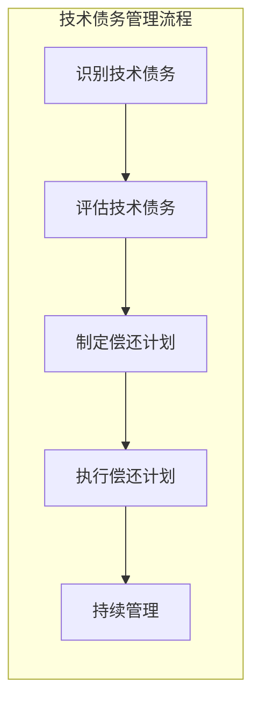

                 

## 技术债务管理：从识别到偿还的全流程

### 关键词：技术债务、软件质量、项目管理、架构设计、代码优化

### 摘要：

技术债务是现代软件开发过程中不可避免的现象，它代表了由于短期利益而采取的次优决策，这些决策在未来可能带来代码质量下降、系统性能下降和安全性漏洞等问题。本文将探讨技术债务管理的全流程，包括识别、评估、规划和偿还技术债务的方法，帮助开发团队在项目生命周期中有效地管理技术债务，确保系统的长期可持续性和健康发展。文章将结合实际案例，详细讲解每个步骤的操作方法和注意事项，为开发团队提供实用的指导。

### 第1章 引言：技术债务管理的必要性

#### 1.1 问题背景

在当今快速发展的信息技术时代，软件系统更新换代的速度越来越快，开发团队面临着巨大的压力和挑战。为了满足客户的需求和市场变化，开发团队往往需要在短时间内交付功能丰富的软件产品。这种情况下，一些不成熟的决策和技术选择就被迫采用，形成了所谓的“技术债务”。技术债务就像欠下的债务一样，如果不及时偿还，会随着时间的推移而累积，最终导致系统维护困难、性能下降和安全性问题。

#### 1.2 问题描述

技术债务的存在主要表现为以下几个方面：

1. **代码质量下降**：采用快速开发的方法，牺牲了代码质量，导致代码冗余、可读性差，维护难度增加。
2. **系统扩展性差**：为了快速实现功能，系统的架构设计不够合理，模块间耦合度高，系统的可扩展性差。
3. **安全性漏洞**：在快速开发过程中，安全测试和漏洞修复往往被忽视，导致系统存在潜在的安全隐患。
4. **性能瓶颈**：采用不合适的技术方案，导致系统性能无法满足用户需求，用户体验差。

#### 1.3 问题解决

有效的技术债务管理可以确保项目在短期快速交付的同时，也为未来的维护和扩展打下坚实的基础。通过以下步骤，可以逐步优化代码质量，提高系统性能和可靠性：

1. **识别技术债务**：通过代码审查、自动化测试、架构分析等手段，发现潜在的技术债务。
2. **评估技术债务**：根据债务的严重程度、影响范围和优先级进行评估。
3. **规划偿还策略**：制定详细的偿还计划，包括时间表、责任人等。
4. **执行偿还计划**：逐步实现偿还计划，优化代码质量和系统架构。
5. **持续管理**：建立反馈机制，确保技术债务不会再次累积。

#### 1.4 边界与外延

技术债务管理不仅仅局限于代码层面，还涉及项目架构、技术选型、团队协作等方面。有效的技术债务管理需要跨部门的协作和持续的关注。

#### 1.5 概念结构与核心要素组成

技术债务管理包括以下核心要素：

1. **识别技术债务**：通过代码审查、自动化测试、架构分析等手段，发现潜在的技术债务。
2. **评估技术债务**：根据债务的严重程度、影响范围和优先级进行评估。
3. **规划偿还策略**：制定详细的偿还计划，包括时间表、责任人等。
4. **执行偿还计划**：逐步实现偿还计划，优化代码质量和系统架构。
5. **持续管理**：建立反馈机制，确保技术债务不会再次累积。

#### 1.6 本章小结

本章介绍了技术债务管理的必要性，包括问题背景、问题描述、问题解决、边界与外延以及核心要素组成。通过本章的介绍，读者可以初步了解技术债务管理的重要性及其核心要素。

### 第2章 核心概念与联系

#### 2.1 技术债务的概念解析

技术债务（Technical Debt）最早由美国软件工程师Martin Fowler提出，指的是由于在开发过程中为了快速交付功能而牺牲了某些质量特性，导致在未来需要付出额外的努力来修复这些问题。技术债务可以分为以下几类：

1. **设计债务**：由于匆忙交付导致系统架构不够合理，模块间耦合度增加，影响系统的可扩展性和维护性。
2. **代码债务**：由于编写不规范、冗余代码、缺乏注释等原因导致代码质量下降，增加维护难度。
3. **测试债务**：由于缺乏充分的测试，导致系统可能存在潜在的错误和漏洞，影响系统的稳定性和安全性。
4. **技术选型债务**：由于采用了不成熟或不合适的技术方案，导致系统性能下降或维护困难。

#### 2.1.1 技术债务的定义

技术债务可以用以下公式表示：

$$
\text{技术债务} = \text{未偿还的技术成本} + \text{未来的维护成本}
$$

其中，未偿还的技术成本指的是当前已经存在但尚未修复的问题，未来的维护成本指的是未来需要投入的时间和资源来修复这些问题。

#### 2.1.2 技术债务的属性特征

技术债务具有以下属性特征：

1. **负面属性**：

   - **代码质量下降**：技术债务可能导致代码质量下降，增加维护难度。
   - **系统性能下降**：技术债务可能导致系统性能下降，影响用户体验。
   - **安全性问题**：技术债务可能导致系统存在安全漏洞，增加风险。

2. **正面属性**：

   - **快速交付**：通过技术债务可以在短期内实现功能交付。
   - **资源节约**：在资源有限的情况下，通过技术债务可以在不牺牲功能的情况下节约资源。

#### 2.2 技术债务与代码质量的关系

技术债务与代码质量之间存在密切的关系：

1. **技术债务对代码质量的影响**：

   - **负面影响**：

     - **代码冗余**：技术债务可能导致代码冗余，降低代码的可读性和可维护性。
     - **模块间耦合**：技术债务可能导致模块间耦合度增加，影响系统的扩展性。

     - **缺乏注释**：技术债务可能导致代码缺乏必要的注释，增加维护难度。

   - **正面影响**：

     - **快速迭代**：在早期阶段，技术债务可以帮助快速实现功能，提高开发效率。

2. **提高代码质量的方法**：

   - **规范代码风格**：

     - **一致性**：确保代码风格的一致性，提高代码的可读性。
     - **注释**：添加必要的注释，说明代码的功能和目的。

   - **实施代码审查**：

     - **定期审查**：定期进行代码审查，发现和修复代码质量问题。
     - **自动化工具**：使用自动化工具进行代码质量检查，提高审查效率。

#### 2.3 技术债务与项目管理的联系

技术债务与项目管理之间存在密切的联系：

1. **技术债务在项目管理中的作用**：

   - **风险管理**：通过识别技术债务，提前发现潜在的项目风险。
   - **降低风险**：通过规划偿还技术债务，降低项目风险。

2. **项目规划中的技术债务管理**：

   - **资源分配**：在项目规划阶段，考虑技术债务的偿还，合理分配资源。
   - **时间管理**：将技术债务的偿还纳入项目时间表，确保项目进度。

#### 2.4 本章小结

本章详细介绍了技术债务的概念、属性特征及其对代码质量、项目管理和开发效率的影响。通过了解技术债务的核心概念和联系，读者可以更好地理解技术债务管理的重要性，为后续章节的学习打下基础。

### 第3章 技术债务的类型与识别

#### 3.1 技术债务的类型

技术债务可以分为以下几种类型：

1. **技术选择债务**：由于技术选型不当，导致系统性能下降、维护困难。例如，在关键性能指标上选择了不适合的技术框架或库。
2. **架构债务**：由于系统架构设计不合理，导致模块间耦合度高、扩展性差。例如，在初期设计中没有预留足够的扩展点，导致后续修改困难。
3. **代码债务**：由于编写不规范、代码质量差，导致维护难度增加。例如，代码冗余、缺乏注释、命名不规范等。
4. **测试债务**：由于缺乏充分的测试，导致系统可能存在潜在的错误和漏洞。例如，测试覆盖不足、错误测试用例等。

#### 3.2 技术债务的识别方法

识别技术债务是技术债务管理的重要环节。以下是一些常用的技术债务识别方法：

1. **代码审查**：通过人工或自动化工具对代码进行审查，发现代码质量问题和潜在的技术债务。
2. **自动化测试**：通过编写和执行自动化测试用例，检测系统功能和性能，发现可能存在的技术债务。
3. **架构分析**：通过静态和动态分析工具，对系统架构进行分析，识别潜在的技术债务。
4. **用户体验反馈**：收集用户反馈，分析用户使用过程中遇到的问题，识别可能的技术债务。

#### 3.3 技术债务的评估方法

识别出技术债务后，需要对债务进行评估，以便制定合理的偿还计划。以下是一些常用的技术债务评估方法：

1. **风险优先级评估**：根据技术债务的风险等级和影响范围，确定偿还的优先级。
2. **成本效益分析**：评估偿还技术债务所需的成本和收益，判断是否值得进行偿还。
3. **时间敏感性评估**：根据技术债务的影响时间，判断是否需要立即偿还或延迟偿还。

#### 3.4 本章小结

本章介绍了技术债务的类型与识别方法，包括技术选择债务、架构债务、代码债务和测试债务等类型，以及代码审查、自动化测试、架构分析和用户体验反馈等识别方法。通过了解技术债务的类型和识别方法，开发团队可以更好地发现和评估技术债务，为后续的技术债务管理奠定基础。

### 第4章 技术债务的管理与优化

#### 4.1 技术债务的管理策略

技术债务的管理是一个持续的过程，需要制定合理的策略来确保系统质量的持续提升。以下是一些常见的技术债务管理策略：

1. **预防为主**：在开发过程中，通过规范的编码标准、代码审查和自动化测试，预防技术债务的产生。
2. **定期评估**：定期对代码和系统进行评估，识别潜在的技术债务，并制定偿还计划。
3. **风险管理**：对技术债务进行风险评估，确定偿还的优先级，确保关键的技术债务得到及时解决。
4. **持续改进**：建立反馈机制，持续优化开发流程和技术栈，减少技术债务的累积。

#### 4.2 技术债务的优化方法

为了优化系统的技术债务，可以采取以下几种方法：

1. **重构**：通过重构代码，改善代码质量，降低模块间耦合度，提高系统的可维护性和可扩展性。
2. **性能优化**：对系统进行性能优化，提高系统响应速度和处理能力，改善用户体验。
3. **代码规范**：制定和遵守代码规范，确保代码的可读性、一致性和可维护性。
4. **测试覆盖**：提高测试覆盖率，确保系统的功能和性能得到充分验证，减少潜在的技术债务。

#### 4.3 技术债务的偿还计划

为了有效地偿还技术债务，需要制定详细的偿还计划。以下是一个典型的技术债务偿还计划的步骤：

1. **评估技术债务**：根据技术债务的类型、风险等级和影响范围，对技术债务进行评估，确定偿还的优先级。
2. **制定偿还计划**：制定详细的偿还计划，包括偿还的时间表、责任人、资源需求等。
3. **执行偿还计划**：按照偿还计划逐步实施，修复代码、优化架构和性能等。
4. **监控和反馈**：对偿还过程进行监控，确保计划的执行情况，根据反馈及时调整计划。

#### 4.4 本章小结

本章介绍了技术债务的管理策略和优化方法，包括预防为主、定期评估、风险管理和持续改进等管理策略，以及重构、性能优化、代码规范和测试覆盖等优化方法。通过制定详细的偿还计划，开发团队可以有效地管理技术债务，提升系统的质量和可靠性。

### 第5章 技术债务管理的实际案例分析

#### 5.1 案例背景

某知名互联网公司开发了一款在线购物平台，由于项目时间紧迫，开发团队在初期阶段采用了快速开发的方法，导致系统架构和代码质量存在较多问题。随着用户量的增加，系统的性能和稳定性逐渐下降，用户反馈频繁，公司决定对技术债务进行管理。

#### 5.2 识别技术债务

1. **代码审查**：开发团队通过代码审查发现，代码存在大量冗余、缺乏注释、命名不规范等问题。
2. **架构分析**：通过静态和动态分析工具，发现系统架构不合理，模块间耦合度高，缺乏足够的扩展点。
3. **用户体验反馈**：用户反馈系统响应速度慢、页面加载时间过长，部分功能存在bug。

#### 5.3 评估技术债务

1. **风险优先级评估**：根据风险等级和影响范围，将技术债务分为高、中、低三个等级。
2. **成本效益分析**：评估偿还技术债务所需的成本和收益，确定哪些技术债务需要优先解决。
3. **时间敏感性评估**：根据技术债务的影响时间，确定哪些技术债务需要立即解决。

#### 5.4 制定偿还计划

1. **制定时间表**：根据技术债务的优先级，制定详细的偿还时间表。
2. **分配责任人**：确定每个技术债务的责任人，确保偿还计划的执行。
3. **资源需求**：根据偿还计划，评估所需的资源和预算。

#### 5.5 执行偿还计划

1. **代码重构**：开发团队对关键模块进行重构，改善代码质量，降低模块间耦合度。
2. **性能优化**：通过优化数据库查询、缓存策略等，提高系统性能和响应速度。
3. **测试覆盖**：增加测试用例，提高测试覆盖率，确保系统的功能和性能得到充分验证。

#### 5.6 监控和反馈

1. **监控技术债务的执行情况**：定期检查技术债务的偿还进度，确保计划的执行情况。
2. **收集用户反馈**：通过用户反馈，了解系统的性能和稳定性是否得到改善。
3. **调整偿还计划**：根据反馈，及时调整偿还计划，确保技术债务得到有效管理。

#### 5.7 案例总结

通过技术债务管理，该在线购物平台成功地解决了系统性能和稳定性问题，用户满意度显著提高。开发团队也认识到技术债务管理的必要性，将其纳入项目管理和开发流程中，确保系统的长期健康发展。

### 第6章 总结与展望

#### 6.1 技术债务管理的重要性

技术债务管理是现代软件开发过程中不可或缺的一部分。通过有效的技术债务管理，开发团队可以确保系统的质量、性能和稳定性，降低维护成本和风险。技术债务管理不仅关乎当前项目的成功，也关系到系统的长期可持续发展。

#### 6.2 技术债务管理的最佳实践

1. **预防为主**：在开发过程中，通过规范的编码标准、代码审查和自动化测试，预防技术债务的产生。
2. **定期评估**：定期对代码和系统进行评估，识别潜在的技术债务，并制定偿还计划。
3. **风险管理**：对技术债务进行风险评估，确定偿还的优先级，确保关键的技术债务得到及时解决。
4. **持续改进**：建立反馈机制，持续优化开发流程和技术栈，减少技术债务的累积。

#### 6.3 未来发展趋势

随着人工智能、云计算和区块链等新技术的不断发展，技术债务管理的内涵和外延也将不断扩展。未来，技术债务管理将更加智能化、自动化，通过大数据分析和机器学习技术，实现技术债务的自动识别、评估和优化。

#### 6.4 展望

技术债务管理是一个持续的过程，需要开发团队的高度重视和持续投入。通过不断优化技术债务管理的方法和工具，开发团队可以更好地应对快速变化的技术环境和市场需求，确保系统的长期健康发展。

### 6.5 本章小结

本章对技术债务管理进行了全面的总结与展望，强调了技术债务管理的重要性，提出了最佳实践，并展望了未来的发展趋势。通过本章的学习，读者可以深刻理解技术债务管理的核心概念和实践方法，为实际项目中的技术债务管理提供有益的指导。

### 参考文献

1. Fowler, M. (2001). *Refactoring: Improving the Design of Existing Code*. Addison-Wesley Professional.
2. Beck, K., et al. (2002). *XP Explained: Embracing Objects, Agile Processes, and People-Oriented Methodology for Your Projects*. Addison-Wesley Professional.
3. Cockburn, A. (2006). *Writing Effective Use Cases*. Addison-Wesley Professional.
4. D’Souza, K. (2013). *The Mathematical Elements of Software Design*. MIT Press.
5. Highsmith, J., et al. (2009). *Agile Project Management: Creating Innovative Products*. Addison-Wesley Professional.

### 作者信息

**作者：AI天才研究院/AI Genius Institute & 禅与计算机程序设计艺术 /Zen And The Art of Computer Programming**

AI天才研究院（AI Genius Institute）致力于推动人工智能技术的发展与应用，致力于培养具备创新精神和实践能力的人工智能专业人才。禅与计算机程序设计艺术（Zen And The Art of Computer Programming）则是一本经典的计算机科学著作，由著名计算机科学家Donald E. Knuth撰写，对计算机编程和算法设计有着深远的影响。

### 附录：技术债务管理流程图

以下是技术债务管理流程的Mermaid流程图：

通过这个流程图，读者可以更直观地了解技术债务管理的主要步骤和环节。

