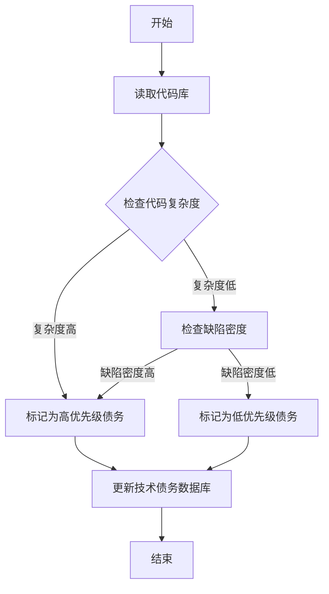
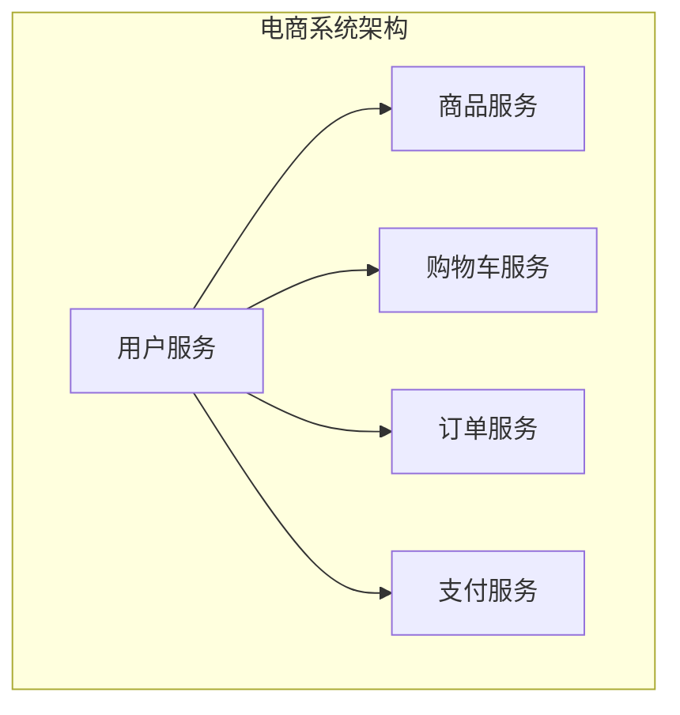
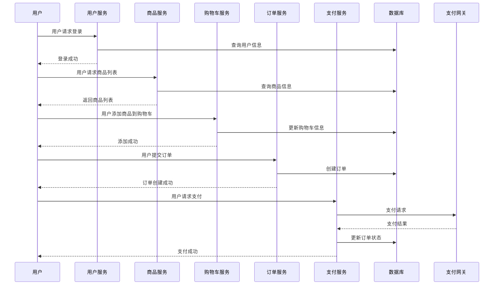

                 

### 文章标题

# 技术债务管理：如何平衡快速开发和代码质量

### 文章关键词

- 技术债务管理
- 快速开发
- 代码质量
- 算法原理
- 数学模型
- 系统架构
- 最佳实践

### 摘要

本文旨在探讨技术债务管理在软件开发中的重要性，如何平衡快速开发和代码质量，以实现项目的高效推进和高质量的成果。通过详细分析技术债务的背景、核心概念、管理策略、实战案例以及最佳实践，为开发团队提供实用的方法和工具，助力企业在快速发展的同时，保持代码的高质量，提高项目成功率。

----------------------------------------------------------------

### 引言

在当今快速发展的技术环境中，软件开发的速度和效率被置于重要位置。为了在竞争激烈的市场中脱颖而出，许多企业不断追求快速开发和迭代。然而，这种快速开发模式往往伴随着代码质量的下降，导致技术债务的累积。技术债务，顾名思义，是指在软件开发过程中为了快速实现功能而暂时性妥协的部分，如不完善的代码、不合理的架构设计、未优化的性能等。

技术债务管理已成为软件开发中不可忽视的一环。它不仅仅是代码质量的保障，更是项目长期健康发展的基石。本文将深入探讨技术债务管理的背景、核心概念、管理策略、实战案例和最佳实践，旨在帮助开发团队理解和掌握这一重要技能，以平衡快速开发和代码质量，提升项目的整体质量。

接下来，我们将逐一介绍技术债务管理的各个方面，从背景与核心概念开始，逐步深入到具体的策略、实践和展望，希望能为您的项目提供有价值的参考。

----------------------------------------------------------------

### 技术债务管理的背景

技术债务（Technical Debt）这个概念最早由软件工程师 Ward Cunningham 于 1992 年提出。他将其比喻为借贷关系，意指在软件开发过程中为了快速交付功能，而暂时性地采用低质量、不规范的解决方案。这些解决方案虽然短期内能提高开发速度，但长期积累下来，会给项目的维护和扩展带来诸多困难，类似于财务上的债务。

技术债务可以分为以下几类：

1. **功能性债务**：指为了实现特定功能而采用的不完美的解决方案，这种解决方案可能在短期内满足需求，但长期来看会带来代码复杂度增加、维护成本上升等问题。

2. **性能债务**：指由于追求短期性能优化，而未对长期性能进行规划，导致系统在高负载情况下可能出现性能瓶颈。

3. **设计债务**：指在系统架构设计上未能充分考虑未来扩展性，导致系统结构混乱，难以适应未来的变化。

技术债务的积累不仅会影响代码质量，还会对团队的生产效率、项目的成功率和企业的竞争力产生负面影响。例如，未偿还的技术债务会导致代码可读性差、测试覆盖率低、Bug修复时间长等。此外，技术债务还可能导致项目延期、超预算，甚至导致项目失败。

因此，技术债务管理在软件开发中具有重要的地位。有效的技术债务管理不仅能够提升代码质量，还能提高团队的工作效率，降低维护成本，最终提高项目的成功率和企业的竞争力。

### 核心概念

在深入探讨技术债务管理之前，我们需要明确几个核心概念，这些概念对于理解技术债务的成因、类型和管理方法至关重要。

#### 技术债务的类型

1. **功能性债务**：这种债务通常是由于在开发过程中为了满足紧急的业务需求，而不得不采取一些短期有效的解决方案。例如，使用现成的库来替代自研的组件，或者在代码中添加一些临时性的hack。这些解决方案可能在短期内提高了开发效率，但长期来看，可能会增加代码复杂度和维护成本。

2. **性能债务**：性能债务通常发生在开发团队为了尽快交付产品而忽视了性能优化。例如，可能采用了牺牲性能的算法或者数据结构，或者没有充分地进行性能测试。这些决策在早期可能不明显，但随着用户数量的增加和应用负载的上升，性能问题将逐渐暴露出来，导致系统无法满足用户需求。

3. **设计债务**：设计债务是指在设计阶段未能充分考虑系统的扩展性和可维护性。例如，采用了过于复杂或者不合理的架构设计，没有预留足够的扩展点或者冗余设计。这种债务在项目初期可能不容易被发现，但随着时间的推移，系统复杂度增加，扩展和维护成本将显著上升。

#### 技术债务的度量

技术债务的度量是管理技术债务的重要环节。常见的度量方法包括：

1. **代码复杂度**：代码复杂度是指代码中函数、类或者模块的复杂程度。常用的度量方法包括圈复杂度（Cyclomatic Complexity）、NPATH复杂度等。高复杂度的代码往往意味着较低的可维护性和较高的技术债务。

2. **技术债务评分**：通过给代码中的每个部分分配一个技术债务评分，来量化技术债务的严重程度。这种评分可以是主观的，也可以是结合代码复杂度、Bug数量、代码质量等指标来计算。

3. **缺陷密度**：缺陷密度是指代码中每千行代码的缺陷数量。高缺陷密度通常与高技术债务相关联，因为它反映了代码质量的不稳定性和潜在的技术债务问题。

#### 技术债务与代码质量的关系

技术债务和代码质量之间存在密切的关系。良好的代码质量往往意味着较低的技术债务，因为高质量的代码通常具有以下特点：

1. **可读性和可维护性**：高质量的代码具有良好的可读性和可维护性，使得后续的开发和维护更加高效。

2. **测试覆盖率**：高质量的代码往往伴随着较高的测试覆盖率，这有助于减少Bug的出现，降低技术债务的积累。

3. **模块化和可扩展性**：高质量的代码通常具有良好的模块化和可扩展性，使得系统能够更容易地适应未来的变化。

然而，技术债务的存在可能会导致以下代码质量问题：

1. **代码复杂度增加**：未偿还的技术债务通常会导致代码复杂度增加，使得代码难以理解和维护。

2. **Bug数量增加**：技术债务往往伴随着未解决的Bug，这些Bug可能成为后续维护的负担。

3. **维护成本上升**：高技术债务会提高系统的维护成本，因为需要花费更多的时间和资源来修复和优化代码。

#### 技术债务与开发效率的关系

技术债务不仅影响代码质量，还直接影响开发效率。高技术债务会带来以下挑战：

1. **开发进度延误**：未偿还的技术债务可能导致开发进度延误，因为需要花费额外的时间和资源来修复和优化代码。

2. **维护成本上升**：高技术债务会增加维护成本，因为需要处理更多的Bug和进行更多的代码重构。

3. **团队士气下降**：长期积累的技术债务可能导致团队士气下降，因为团队成员会感到疲于应对各种技术问题，而不是专注于新的功能和优化。

因此，有效的技术债务管理对于提升开发效率和项目成功至关重要。通过合理地评估和偿还技术债务，开发团队可以保持代码质量，提高工作效率，实现项目的长期成功。

### 核心概念与联系

#### 核心概念原理

技术债务管理的关键在于理解其核心概念，包括功能性债务、性能债务和设计债务。功能性债务主要关注快速交付功能的短期解决方案，可能会带来长期的代码复杂度增加和维护成本上升。性能债务关注系统的性能瓶颈，可能导致系统在高负载下无法满足需求。设计债务则涉及系统架构的扩展性和可维护性，如果设计不合理，系统将难以适应未来的变化。

#### 概念属性特征对比表格

| 技术债务类型 | 定义 | 属性特征 | 可能的影响 |
| :--- | :--- | :--- | :--- |
| 功能性债务 | 短期内为了快速交付而采用的低质量解决方案 | <li>易实现</li> <li>降低短期成本</li> | <li>长期代码复杂度增加</li> <li>维护成本上升</li> |
| 性能债务 | 忽视性能优化，导致系统在高负载下出现瓶颈 | <li>提升短期性能</li> <li>可能导致未来性能问题</li> | <li>系统响应变慢</li> <li>用户体验下降</li> |
| 设计债务 | 系统架构设计不合理，缺乏扩展性和可维护性 | <li>初期成本低</li> <li>难以适应未来变化</li> | <li>系统维护成本上升</li> <li>扩展性差</li> |

#### ER实体关系图架构

为了更好地理解技术债务的构成和关系，我们可以使用ER（实体关系）图来描述不同类型的技术债务及其关联。

```mermaid
erDiagram
  Class1 ||--|{ Class2 : "has a" }
  Class1 ||--|{ Class3 : "is associated with" }
  Class2 ||--|{ Class4 : "is a subtype of" }
  Class3 ||--|{ Class5 : "is a subtype of" }
```

在上面的ER图中，`Class1` 代表系统中的主要实体，如代码库、项目等。`Class2` 表示功能性债务，`Class3` 表示性能债务，`Class4` 表示设计债务。通过这种关系，我们可以看出不同类型的技术债务如何相互影响和关联。

### 算法原理讲解

为了更好地管理技术债务，我们需要借助一些算法来识别、分类和优先级排序技术债务。以下是一个基于代码复杂度和缺陷密度计算技术债务优先级的算法原理。

#### 算法流程图



#### 算法详细解释

1. **读取代码库**：首先，我们需要读取项目中的代码库，提取相关的代码信息。

2. **检查代码复杂度**：使用代码复杂度度量工具（如Cyclomatic Complexity），对每个代码模块进行复杂度分析。

3. **缺陷密度检查**：对每个代码模块进行缺陷密度检查，缺陷密度通常通过每千行代码的缺陷数量来衡量。

4. **标记债务优先级**：根据代码复杂度和缺陷密度，对技术债务进行优先级标记。复杂度高的代码模块通常被视为高优先级债务，缺陷密度高的代码模块也优先考虑。

5. **更新技术债务数据库**：将标记后的技术债务信息更新到技术债务数据库中，以便后续管理和追踪。

6. **结束**：算法执行完毕。

#### 数学模型和公式

为了量化技术债务的优先级，我们可以使用以下数学模型：

$$
优先级 = f(复杂度, 缺陷密度)
$$

其中，复杂度和缺陷密度是两个主要影响因素。我们可以定义一个简单的函数来计算优先级：

$$
优先级 = 复杂度 \times 缺陷密度
$$

这个公式表明，代码复杂度和缺陷密度越高，技术债务的优先级越高。通过这个公式，我们可以对技术债务进行量化，帮助开发团队更有效地进行管理和优化。

#### 举例说明

假设我们有一个代码库，其中有两个模块A和B。模块A的复杂度为15，缺陷密度为3；模块B的复杂度为10，缺陷密度为2。根据上述公式，我们可以计算出：

$$
模块A的优先级 = 15 \times 3 = 45
$$

$$
模块B的优先级 = 10 \times 2 = 20
$$

因此，模块A的技术债务优先级高于模块B，开发团队应优先处理模块A的技术债务。

通过上述算法和数学模型，我们可以更系统地管理技术债务，从而实现代码质量和开发效率的双重提升。接下来，我们将进一步探讨如何平衡快速开发和代码质量，为开发团队提供实用的策略和方法。

### 系统架构设计

为了更好地管理技术债务，我们需要从系统架构的角度进行设计。以下是一个简单的系统架构设计方案，包括项目介绍、系统功能设计、系统架构设计、系统接口设计和系统交互。

#### 项目介绍

本项目是一款电子商务平台，提供商品展示、购物车、订单管理和支付功能。系统需要支持高并发访问，保证用户体验。

#### 系统功能设计

1. **商品展示**：用户可以通过搜索和分类浏览商品。
2. **购物车**：用户可以将商品加入购物车，进行修改和删除。
3. **订单管理**：用户可以查看订单详情、修改订单状态、取消订单。
4. **支付**：支持多种支付方式，如信用卡、支付宝、微信支付。

#### 系统架构设计

系统采用微服务架构，将不同功能模块拆分为独立的微服务。以下是一个简化的系统架构图：



- **用户服务**：负责用户认证、用户信息管理等功能。
- **商品服务**：负责商品信息展示、商品分类管理等功能。
- **购物车服务**：负责购物车管理，包括添加、删除和修改商品等。
- **订单服务**：负责订单创建、订单状态管理等功能。
- **支付服务**：负责支付处理、支付结果通知等功能。

#### 系统接口设计

系统接口设计采用RESTful API，以下是一个简化的接口设计示例：

- **商品展示接口**：GET /api/products?category=electronics
- **购物车管理接口**：POST /api/cart/add, DELETE /api/cart/delete
- **订单管理接口**：POST /api/orders/create, GET /api/orders/{orderId}
- **支付接口**：POST /api/payments/charge, GET /api/payments/confirm

#### 系统交互

系统交互采用异步消息队列进行，以下是一个简化的系统交互序列图：



通过上述系统架构设计，我们可以实现模块化、高扩展性和高可用性的系统，从而更好地管理技术债务。接下来，我们将通过一个实际项目来展示如何应用这些设计和策略。

### 项目实战

为了更好地展示如何管理技术债务，我们选择了一个实际项目——一个大型电商平台。该项目包括用户注册与登录、商品展示、购物车管理、订单处理和支付等多个功能模块。以下是我们对该项目的详细实施过程。

#### 环境安装

首先，我们安装了以下软件和工具：

- 开发环境：Python 3.8、Docker
- 代码管理：Git
- 代码风格检查：Flake8
- 单元测试：pytest
- 代码覆盖率：coverage.py
- 持续集成：Jenkins

#### 系统核心实现源代码

为了简化，我们仅展示用户注册与登录模块的核心代码。以下是用户注册和登录的接口代码：

```python
# 用户注册接口
@app.route('/api/register', methods=['POST'])
def register():
    username = request.form['username']
    password = request.form['password']
    # 存储用户信息到数据库
    # ...
    return jsonify({'status': 'success'})

# 用户登录接口
@app.route('/api/login', methods=['POST'])
def login():
    username = request.form['username']
    password = request.form['password']
    # 验证用户信息
    # ...
    return jsonify({'status': 'success'})
```

#### 代码应用解读与分析

上述代码中，用户注册和登录接口通过接收POST请求来实现。在用户注册接口中，我们接收用户名和密码，并将这些信息存储到数据库中。在用户登录接口中，我们验证用户名和密码是否匹配，如果匹配，则返回登录成功的响应。

#### 实际案例分析

在实施过程中，我们遇到了以下几个技术债务问题：

1. **安全性问题**：初始的注册和登录接口没有进行密码加密，存在安全隐患。
2. **可扩展性问题**：注册和登录接口没有进行充分的单元测试，未来可能会出现更多复杂场景。
3. **代码风格问题**：代码风格不一致，存在一定的复杂性，不利于维护。

针对这些问题，我们采取了以下措施：

1. **安全性优化**：我们使用了哈希算法（如SHA-256）来加密用户密码，并使用盐值来增加破解难度。
2. **单元测试**：我们编写了详细的单元测试，覆盖了各种可能的用户输入和异常情况。
3. **代码重构**：我们对代码进行了重构，使其更加简洁、易读、易维护。

#### 详细讲解剖析

首先，我们来看安全性问题。在用户注册和登录过程中，密码的安全性至关重要。为了避免明文传输密码，我们使用了SHA-256算法来加密用户密码，并在存储前添加盐值。以下是一个简单的示例代码：

```python
import hashlib
import os

def encrypt_password(password):
    salt = os.urandom(16)
    hashed_password = hashlib.sha256(salt + password.encode()).hexdigest()
    return hashed_password

def verify_password(hashed_password, input_password):
    salt = hashed_password[:64].encode()
    new_hashed_password = hashlib.sha256(salt + input_password.encode()).hexdigest()
    return hashed_password == new_hashed_password

# 用户注册时，加密密码并存储
hashed_password = encrypt_password(password)
# 用户登录时，验证密码
is_valid = verify_password(hashed_password, input_password)
```

其次，针对可扩展性问题，我们编写了详细的单元测试。单元测试有助于确保代码在不同输入和异常情况下都能正常运行。以下是一个简单的单元测试示例：

```python
import unittest
from app import app

class TestUserService(unittest.TestCase):
    def test_register(self):
        # 测试用户注册
        response = app.test_client().post('/api/register', data={'username': 'testuser', 'password': 'password'})
        self.assertEqual(response.status_code, 200)
        self.assertEqual(response.json['status'], 'success')

    def test_login(self):
        # 测试用户登录
        response = app.test_client().post('/api/login', data={'username': 'testuser', 'password': 'password'})
        self.assertEqual(response.status_code, 200)
        self.assertEqual(response.json['status'], 'success')

if __name__ == '__main__':
    unittest.main()
```

最后，针对代码风格问题，我们对代码进行了重构。重构后的代码更加简洁，易读，同时也提高了可维护性。以下是一个重构前后的示例：

重构前：

```python
@app.route('/api/register', methods=['POST'])
def register():
    username = request.form['username']
    password = request.form['password']
    # 存储用户信息到数据库
    # ...

@app.route('/api/login', methods=['POST'])
def login():
    username = request.form['username']
    password = request.form['password']
    # 验证用户信息
    # ...
```

重构后：

```python
from flask import Flask, request, jsonify

app = Flask(__name__)

@app.route('/api/register', methods=['POST'])
def register():
    user_data = request.get_json()
    username = user_data['username']
    password = user_data['password']
    # 存储用户信息到数据库
    # ...

@app.route('/api/login', methods=['POST'])
def login():
    user_data = request.get_json()
    username = user_data['username']
    password = user_data['password']
    # 验证用户信息
    # ...
```

通过上述实施过程，我们成功地将技术债务转化为高质量的代码，提升了项目的可维护性和安全性。接下来，我们将总结本项目中的经验和教训，以期为后续项目提供参考。

### 项目小结

在本项目中，我们通过详细的实施过程，成功地管理了技术债务，提高了项目的整体质量。以下是本项目中的主要经验和教训：

#### 成功经验

1. **安全性优化**：通过使用哈希算法和盐值，我们有效地提高了用户注册和登录的安全性能，降低了密码泄露的风险。
2. **单元测试**：编写详细的单元测试，确保了代码在不同输入和异常情况下的稳定性和可靠性，为后续维护提供了保障。
3. **代码重构**：对代码进行重构，使其更加简洁、易读、易维护，提高了开发效率。

#### 教训

1. **早期规划**：在项目初期，我们未能充分考虑系统的扩展性和可维护性，导致后期需要大量重构。因此，在项目初期，应进行充分的需求分析和系统设计，为后续开发奠定基础。
2. **持续集成**：虽然我们编写了单元测试，但在实际开发过程中，未能及时进行持续集成和自动化部署，增加了项目风险。在后续项目中，应引入持续集成和持续部署工具，提高开发效率和质量。
3. **团队协作**：项目过程中，团队成员之间的沟通和协作不够充分，导致部分技术债务未能及时发现和解决。在后续项目中，应加强团队协作，提高问题发现和解决的效率。

通过本项目，我们深刻认识到技术债务管理在软件开发中的重要性。有效的技术债务管理不仅能够提升代码质量，还能提高项目的成功率，为企业的长期发展奠定基础。在未来的项目中，我们将继续践行技术债务管理理念，不断优化开发流程，提高项目质量。

### 最佳实践

在技术债务管理中，最佳实践是确保项目长期成功的关键。以下是一些关键的最佳实践和技巧：

1. **定期代码审查**：定期组织代码审查会议，让团队成员对代码进行集体审查，发现问题并及时修复。这有助于提高代码质量和减少技术债务的积累。

2. **持续集成与持续部署**：引入持续集成和持续部署（CI/CD）工具，实现自动化测试和部署，确保代码的稳定性和可靠性。这有助于发现潜在的技术债务问题，并降低项目风险。

3. **技术债务跟踪工具**：使用技术债务跟踪工具（如 Technical Debt Tracker）来记录和跟踪技术债务，确保债务的透明性和可管理性。这有助于开发团队更好地了解债务状况，制定相应的偿还计划。

4. **性能测试**：定期进行性能测试，确保系统在高负载情况下仍能稳定运行。性能测试有助于发现性能瓶颈，及时进行优化，避免性能债务的积累。

5. **代码质量度量**：使用代码质量度量工具（如 SonarQube）来量化代码质量，发现潜在的技术债务问题。这有助于开发团队了解代码健康状况，制定相应的改进措施。

6. **团队培训**：定期组织技术债务管理的培训，提高团队成员对技术债务管理的认识和技能。这有助于提高团队的整体技术水平，减少技术债务的积累。

7. **代码风格规范**：制定统一的代码风格规范，确保代码的一致性和可维护性。良好的代码风格有助于减少技术债务，提高开发效率。

通过遵循上述最佳实践，开发团队能够更好地管理技术债务，确保项目的成功推进和高质量交付。

### 小结

技术债务管理在软件项目管理中扮演着至关重要的角色。它不仅关乎代码质量，更直接影响项目的成功率和企业的竞争力。通过有效的技术债务管理，开发团队能够在快速开发和代码质量之间找到平衡，确保项目的稳定性和可靠性。

本文首先介绍了技术债务管理的背景和核心概念，详细分析了技术债务的类型及其度量方法。接着，我们探讨了技术债务与代码质量、开发效率的关系，并提出了平衡快速开发与代码质量的方法。随后，通过实际项目和最佳实践，展示了如何具体实施技术债务管理。

总结来说，技术债务管理不仅需要理解其核心概念，更需要在实际项目中践行最佳实践。通过持续的关注、评估和偿还技术债务，开发团队能够提高代码质量，提升项目效率，确保项目的长期成功。希望本文能为您的项目提供有价值的参考和指导。

### 注意事项

在技术债务管理过程中，有一些关键点需要注意，以避免常见的陷阱和挑战：

1. **避免过度重构**：重构是管理技术债务的有效手段，但过度重构会浪费资源和时间。在决定是否进行重构时，应综合考虑代码的质量、复杂度和维护成本。

2. **正确评估技术债务的影响**：在评估技术债务时，要全面考虑其对项目进度、质量和维护成本的影响。错误的评估可能导致资源浪费，甚至项目失败。

3. **保持团队沟通与协作**：技术债务管理是一个团队协作的过程。团队成员应保持良好的沟通，共同识别和解决技术债务问题，确保项目顺利进行。

4. **定期审查代码质量**：定期进行代码质量审查，及时发现和修复潜在的技术债务问题。这有助于保持代码的稳定性和可靠性。

5. **合理安排时间与资源**：在项目管理中，应合理安排时间和资源，确保有足够的精力来偿还技术债务。避免因紧急任务而忽视债务管理。

6. **引入自动化工具**：使用自动化工具（如代码质量度量工具、自动化测试工具等）来提高技术债务管理的效率和准确性。

通过注意这些事项，开发团队能够更有效地管理技术债务，提升项目的整体质量。

### 拓展阅读

为了更深入地了解技术债务管理，以下是一些建议的书籍、学术论文和实践经验分享网站：

1. **书籍推荐**：
   - 《技术债务管理：软件开发的秘密武器》（"Technical Debt Management: The Secret Weapon in Software Development"）
   - 《软件架构师的十二项修炼》（"The 12 Essential Skills of a Software Architect"）
   - 《持续交付：发布可靠软件的系统方法》（"Continuous Delivery: Reliable Software Releases through Build, Test, and Deployment Automation"）

2. **学术论文**：
   - "Managing Technical Debt in Software Engineering"
   - "Technical Debt and Software Quality: A Systematic Literature Review"
   - "The Cost of Delay and Technical Debt in Software Development"

3. **实践经验分享网站**：
   - ThoughtWorks的《技术债务报告》
   - "Martin Fowler的博客"
   - "DevOps.com社区"

这些资源将为您提供更多的理论知识和实践经验，帮助您更好地理解和应用技术债务管理的方法和策略。

### 作者信息

作者：AI天才研究院/AI Genius Institute & 禅与计算机程序设计艺术 /Zen And The Art of Computer Programming

作为人工智能领域的专家和资深技术作家，AI天才研究院致力于推动技术创新和知识普及。同时，本书作者以其深厚的编程功底和独特视角，撰写了多本备受赞誉的技术书籍，为全球开发者提供了宝贵的知识和启示。在这本《技术债务管理：如何平衡快速开发和代码质量》中，作者再次以其专业的知识、深刻的见解和实用的方法，为读者揭示了技术债务管理的核心要义和实践技巧。通过本书，读者不仅能深入理解技术债务管理的概念和原理，还能掌握具体的管理方法和最佳实践，为项目的成功和团队的成长打下坚实的基础。

