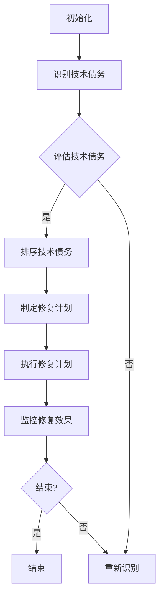
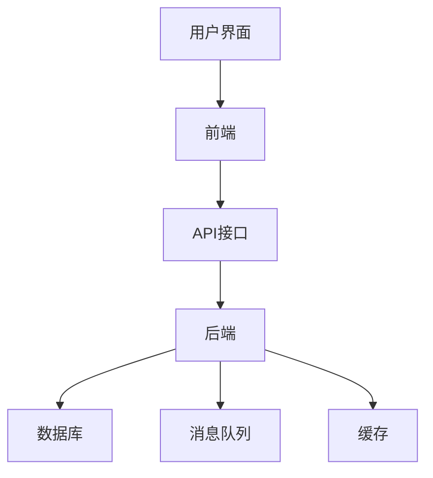
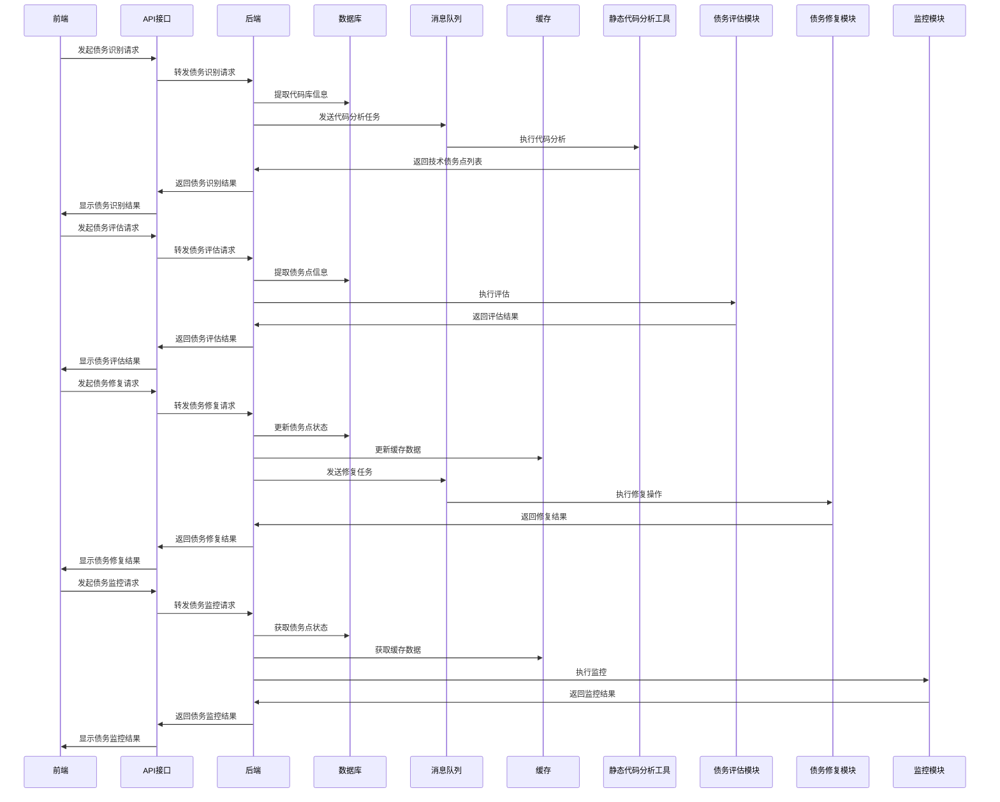

                 

### 前言与引言

#### 1. 什么是技术债务？
技术债务，通常被比作财务债务，是软件开发过程中累积的未完成或未优化的工作。它与财务债务相似，是一种未来的责任，需要在未来某个时间点进行偿还。然而，与财务债务不同的是，技术债务并不是由外部压力导致的，而是由于软件开发团队在追求快速交付和短期内的高效率而选择性的放弃了一些最佳实践和优化措施。这些放弃的部分，就像“欠下的债务”，需要在未来某个时间点进行“偿还”，即通过额外的时间和资源来修复或重构代码。

#### 2. 技术债务的重要性
技术债务的存在对于项目的长期成功至关重要。如果忽视技术债务，它可能会像滚雪球一样，随着时间的推移变得越来越庞大，最终导致项目陷入泥潭。以下是一些技术债务的重要性体现：

- **性能下降**：未优化的代码往往效率低下，随着系统规模和用户量的增加，性能问题会愈加显著。
- **维护成本增加**：修复技术债务通常需要更多的时间和资源，导致维护成本显著上升。
- **团队士气低落**：持续面对复杂、混乱的代码库会降低团队的士气和工作效率。
- **项目风险增加**：技术债务会增加项目的风险，可能会导致项目延迟、失败或预算超支。

#### 3. 本书的目的
本书旨在帮助软件开发团队理解和应对技术债务问题。通过系统性地介绍技术债务的概念、管理方法、实践技巧和案例分析，本书希望能够为读者提供：

- **清晰的认识**：帮助读者理解技术债务的本质和影响。
- **有效的管理方法**：提供一系列可操作的技术债务管理流程和工具。
- **实践经验**：通过案例研究和最佳实践，展示如何在实际项目中管理技术债务。
- **决策支持**：提供决策支持，帮助团队在项目开发过程中做出明智的选择，以避免或减少技术债务。

#### 4. 本书结构
本书分为三个主要部分：

- **第一部分：技术债务的基本概念**：介绍技术债务的来源、影响、核心概念和要素组成。
- **第二部分：技术债务管理方法**：详细讲解技术债务的管理流程、评估工具和实践方法。
- **第三部分：算法原理与系统设计**：深入探讨技术债务管理算法的原理和系统架构设计。

#### 5. 读者对象
本书适用于软件开发团队中的各种角色，包括项目经理、开发者、架构师和产品经理。无论您是初学者还是经验丰富的从业者，本书都希望能够为您提供有价值的见解和实践指导。

通过阅读本书，您将能够：

- **识别技术债务**：学会如何识别项目中存在的技术债务。
- **评估技术债务**：了解如何评估技术债务的影响和优先级。
- **管理技术债务**：掌握有效的技术债务管理流程和方法。
- **减少技术债务**：学习如何在日常开发中减少技术债务的积累。

#### 6. 本文结构
接下来，我们将逐步深入探讨技术债务的各个方面，包括其来源、影响、管理方法、实践案例和具体实现。我们将使用“LET'S THINK STEP BY STEP”的方式，逐一分析每个部分，帮助您更好地理解和应用技术债务管理的最佳实践。

---

### 背景介绍

#### 1. 技术债务的来源

技术债务的产生往往源于开发团队在项目初期为了追求快速交付和短期效益所做的妥协。以下是几个常见的技术债务来源：

- **快速开发**：为了赶在截止日期前交付软件，开发团队可能会选择快速开发模式，这往往会导致代码质量下降，留下技术债务。
- **技术选择不当**：在某些情况下，团队可能会为了节省时间或资源而选择使用未经充分测试的框架或工具，这些选择可能会导致后续的维护和升级变得困难。
- **团队不成熟**：缺乏经验的团队可能不熟悉最佳实践，导致编写低质量的代码。
- **缺乏文档**：开发过程中缺乏充分的文档，使得后续的维护和理解变得困难，进而积累技术债务。

#### 2. 技术债务的累积过程

技术债务的累积往往是一个逐渐演变的过程，可以分为以下几个阶段：

- **初始阶段**：在项目初期，团队可能会因为追求快速交付而暂时忽略某些最佳实践，这些未优化的代码片段和技术选择成为技术债务的“种子”。
- **中期阶段**：随着项目的推进，技术债务的“种子”开始发芽，表现为性能下降、代码重复、架构混乱等问题。
- **晚期阶段**：如果技术债务得不到有效管理，它将不断累积，最终导致整个项目的质量严重下降，维护成本增加，团队士气低落。

#### 3. 技术债务的影响

技术债务对项目的各个方面都会产生深远的影响，以下是几个主要方面：

- **性能下降**：未优化的代码和架构会导致系统性能下降，随着用户量和数据量的增加，这一问题将愈加显著。
- **维护成本增加**：修复技术债务通常需要更多的时间和资源，这会导致项目的维护成本显著上升。
- **团队士气低落**：面对复杂、混乱的代码库，团队成员的士气和工作效率会受到影响，甚至可能导致人员流失。
- **项目风险增加**：技术债务会增加项目的风险，可能会导致项目延迟、失败或预算超支。

#### 4. 避免技术债务的重要性

避免技术债务对于项目的长期成功至关重要，以下是一些原因：

- **提高代码质量**：通过遵循最佳实践，编写高质量的代码，可以有效避免技术债务的累积。
- **降低维护成本**：高质量的代码和维护良好的架构可以显著降低维护成本。
- **提升团队士气**：清晰、简洁的代码和稳定的系统可以提升团队的工作效率和士气。
- **减少项目风险**：有效的技术债务管理可以降低项目失败的风险，确保项目按时、按预算交付。

### 总结

技术债务是在软件开发过程中不可避免的问题，但其影响却是深远且严重的。了解技术债务的来源、累积过程和影响，并采取有效的管理措施，对于项目的长期成功至关重要。接下来，我们将深入探讨技术债务的管理方法，帮助您在实际项目中有效地应对技术债务问题。

---

### 问题描述

#### 1. 技术债务的具体表现

技术债务的具体表现多种多样，以下是其中一些常见的症状：

- **代码重复**：为了避免重复编写代码，团队可能会创建一些通用组件或库，但由于时间紧迫，这些组件可能没有经过充分的测试和优化，导致后续维护困难。
- **性能瓶颈**：由于没有时间进行性能优化，系统可能会出现响应缓慢、资源占用高、吞吐量不足等问题。
- **架构混乱**：在快速开发过程中，系统架构可能会变得混乱，模块之间的依赖关系不清晰，导致后续的扩展和维护变得困难。
- **文档缺失**：开发过程中缺乏详细的文档，使得新加入的团队成员难以理解和维护代码。
- **依赖过期**：随着时间的推移，一些外部库或框架可能会变得过时，但为了不改变现有系统，团队可能会选择继续使用这些已过期的依赖。
- **代码冗余**：为了快速实现功能，开发人员可能会编写大量冗余代码，这不仅浪费了资源，还增加了维护成本。

#### 2. 技术债务对项目的影响

技术债务对项目的影响是多方面的，以下是几个关键方面：

- **维护成本增加**：修复技术债务通常需要额外的时间和资源，导致维护成本显著上升。例如，优化代码的性能、重构混乱的架构、修复未经过充分测试的组件等，都需要投入额外的工作量。
- **项目延迟**：技术债务会导致项目进度受阻，因为团队需要花费更多时间来修复现有问题。这可能导致项目无法按时交付，影响项目的整体进度。
- **团队士气下降**：面对复杂的代码库和维护困难，团队成员的士气和工作效率会受到影响。长期的技术债务会降低团队的工作热情，增加员工流失的风险。
- **系统稳定性下降**：技术债务会导致系统的稳定性下降，频繁出现错误和崩溃。这不仅影响用户体验，还可能对业务运营造成严重影响。
- **安全性问题**：未经充分测试和优化的代码可能存在安全隐患，容易成为攻击的目标。技术债务的存在增加了系统被攻击的风险。

#### 3. 避免项目陷入泥潭的方法

为了避免项目陷入技术债务的泥潭，开发团队需要采取一系列有效的管理措施。以下是一些关键方法：

- **代码审查**：定期进行代码审查，以确保代码质量。代码审查可以帮助发现潜在的技术债务，并促使开发人员遵循最佳实践。
- **持续集成和测试**：使用持续集成（CI）和持续测试（CT）工具，确保代码的每个更改都经过充分的测试。这有助于及早发现并修复技术债务。
- **文档管理**：确保代码和系统有详细的文档，以便新成员能够快速上手。文档可以帮助团队更好地理解系统的架构和功能，减少技术债务的产生。
- **定期重构**：定期对代码和系统进行重构，优化架构和性能，减少技术债务的累积。重构不仅可以提高系统的质量，还可以提高团队的效率。
- **技术债务管理工具**：使用专门的技术债务管理工具，如债务度量工具、代码质量分析工具等，帮助团队识别和管理技术债务。
- **培训和教育**：为团队提供培训和教育，提高团队成员对技术债务的认识和管理能力。通过培训，团队可以更好地理解和应对技术债务问题。

### 总结

技术债务是软件开发过程中常见的问题，但其影响却是深远且严重的。了解技术债务的具体表现和对项目的影响，并采取有效的管理措施，是避免项目陷入泥潭的关键。在下一部分，我们将探讨如何通过有效的技术债务管理流程来识别、评估和减少技术债务。

---

### 问题解决

技术债务管理是一个复杂但至关重要的过程，它涉及到多个方面，包括流程、工具和实践。以下是一些关键的步骤和策略，帮助团队有效地管理技术债务，避免项目陷入泥潭。

#### 1. 识别技术债务

首先，团队需要识别项目中存在的所有技术债务。以下是一些识别技术债务的方法：

- **代码审查**：定期进行代码审查，让团队成员共同检查代码的质量和结构。代码审查可以帮助发现潜在的债务，例如代码重复、性能瓶颈、架构混乱等。
- **静态代码分析**：使用静态代码分析工具，自动检测代码中的潜在问题。这些工具可以根据编程语言的规则和最佳实践来识别可能的债务。
- **持续集成**：在持续集成过程中，通过自动化测试来识别技术债务。自动化测试可以检测代码中的错误和性能问题，帮助团队及时发现并修复债务。

#### 2. 评估技术债务

一旦识别出技术债务，团队需要对其优先级和影响进行评估。以下是一些评估技术债务的方法：

- **风险评估**：评估每个技术债务可能带来的风险，包括性能下降、维护成本增加、系统稳定性下降等。风险越高的债务应优先处理。
- **成本效益分析**：计算修复每个技术债务所需的成本和潜在收益。如果修复的成本远高于潜在收益，团队可能需要重新评估是否修复该债务。
- **优先级排序**：根据风险评估和成本效益分析，为每个技术债务分配优先级。优先处理高优先级的技术债务，以减少对项目的影响。

#### 3. 制定管理计划

评估完成后，团队需要制定详细的管理计划来处理技术债务。以下是一些制定管理计划的关键步骤：

- **定义目标**：明确管理技术债务的目标，例如提高代码质量、优化系统性能、降低维护成本等。
- **制定策略**：根据评估结果，制定具体的策略来处理每个技术债务。策略可能包括重构代码、优化数据库、更换技术栈等。
- **分配资源**：为每个策略分配必要的资源和预算，确保团队有足够的资源来实施管理计划。
- **时间规划**：制定时间表，确定每个技术债务的修复时间，并确保这些修复工作与项目的整体进度相协调。

#### 4. 实施和监控

实施管理计划并持续监控技术债务的进展是关键。以下是一些实施和监控的关键点：

- **代码重构**：对高优先级的技术债务进行重构，优化代码结构和性能。重构过程中需要确保代码的稳定性和可维护性。
- **定期检查**：定期检查技术债务的修复进度和质量，确保管理计划的有效执行。
- **持续反馈**：鼓励团队成员提供反馈，及时发现和解决管理过程中的问题。
- **持续改进**：根据监控结果和反馈，不断调整管理策略和计划，确保技术债务得到持续有效的管理。

#### 5. 文化建设

技术债务管理不仅需要技术手段，还需要团队文化的支持。以下是一些促进团队文化建设的建议：

- **鼓励最佳实践**：鼓励团队成员遵循最佳实践，例如编写高质量的代码、进行代码审查、编写详细的文档等。
- **提高意识**：通过培训和教育，提高团队成员对技术债务的认识和管理能力。
- **建立奖励机制**：为在技术债务管理方面表现突出的团队成员提供奖励，激励团队积极参与技术债务管理。

### 总结

技术债务管理是一个系统性的过程，需要团队在多个层面上进行协作和努力。通过识别、评估、制定计划、实施和监控，团队可以有效地管理技术债务，避免项目陷入泥潭。文化建设和技术手段的结合，将进一步确保技术债务管理的成功。在下一部分，我们将深入探讨技术债务管理的核心概念和联系。

---

### 边界与外延

技术债务管理虽然重要，但也需要明确其适用范围和限制。以下是对技术债务管理边界的讨论及其适用范围：

#### 1. 适用范围

- **开发团队**：技术债务管理主要适用于软件开发团队，无论是小型项目还是大型项目，都可以从有效的技术债务管理中受益。
- **项目阶段**：技术债务管理适用于项目的各个阶段，包括需求分析、设计、开发、测试和运维。在项目的每个阶段，团队都应该关注和管理技术债务。
- **技术栈**：不同的技术栈可能需要不同的技术债务管理方法。无论是使用Java、Python、Node.js还是其他语言，团队都应该根据具体的技术环境来管理技术债务。
- **系统类型**：技术债务管理适用于各种类型的系统，包括Web应用、移动应用、企业级应用等。不同类型的系统可能有不同的债务管理需求，但基本的原则是通用的。

#### 2. 限制

- **资源限制**：技术债务管理需要时间和资源的投入，这在资源有限的情况下可能难以实施。团队需要平衡技术债务管理的成本和收益，确保在有限的资源下做出最有效的决策。
- **技术栈兼容性**：某些技术债务管理工具和方法可能仅适用于特定的技术栈，团队在选择这些工具和方法时需要考虑到技术栈的兼容性。
- **团队协作**：技术债务管理需要团队的高效协作和沟通，如果团队缺乏有效的协作机制，技术债务管理的效果可能会大打折扣。
- **变更管理**：技术债务管理可能会涉及对现有系统的重大变更，这需要严格的变更管理流程和充分的沟通，以避免引起不必要的风险。

#### 3. 跨领域应用

技术债务管理不仅在软件开发领域有重要应用，还可以在其他领域得到借鉴：

- **软件工程教育**：在软件工程教育中，技术债务管理是培养未来开发者技能的重要部分。通过教育，开发者可以更好地理解技术债务的影响和管理方法。
- **项目管理**：项目经理在项目管理过程中需要考虑技术债务的影响，通过有效的技术债务管理，可以提高项目的成功率。
- **组织变革**：在组织层面，技术债务管理可以帮助企业识别和解决其技术债务问题，从而实现更加高效和稳定的运营。

#### 4. 长期视角

技术债务管理不仅仅是一个短期的行动，而是一个长期的策略。团队需要从长期视角出发，制定和实施技术债务管理计划，确保项目能够在未来持续发展。

- **持续集成**：通过持续集成，团队可以及时发现和修复技术债务，确保系统的稳定性和质量。
- **文档管理**：良好的文档管理可以降低技术债务的产生，帮助团队更好地理解和维护代码。
- **培训和教育**：通过定期的培训和教育活动，团队可以提高对技术债务的认识和管理能力。

### 总结

技术债务管理的边界与外延涉及多个方面，包括适用范围、限制和跨领域应用。理解这些边界有助于团队在实际项目中更有效地管理技术债务。在下一部分，我们将深入探讨技术债务管理的核心概念和组成部分，帮助您更全面地理解技术债务的本质。

---

### 核心概念与联系

#### 1. 核心概念原理

技术债务管理涉及多个核心概念，这些概念是理解和管理技术债务的基础。

- **技术债务**：技术债务是指由于追求短期目标而牺牲长期利益所产生的问题。这些问题可能是代码质量不高、架构不合理、性能瓶颈等。
- **代码质量**：代码质量是技术债务管理的重要指标。高质量的代码易于维护、扩展和优化，可以有效减少技术债务的产生。
- **债务识别**：债务识别是技术债务管理的第一步，通过代码审查、静态代码分析和持续集成，团队可以及时发现潜在的技术债务。
- **债务评估**：债务评估涉及对技术债务的风险和成本进行评估，帮助团队确定修复的优先级。
- **债务修复**：债务修复是指通过重构、优化和更新代码，解决已识别的技术债务。
- **文档管理**：文档管理是技术债务管理的重要组成部分。良好的文档可以降低技术债务的产生，帮助新成员快速上手和理解系统。

#### 2. 概念属性特征对比表格

为了更直观地理解技术债务管理的核心概念，我们可以列出这些概念的属性和特征对比表格。

| 概念        | 属性1     | 属性2   | 属性3   | 特征1        | 特征2        | 特征3        |
| ----------- | -------- | ------- | ------- | ----------- | ----------- | ----------- |
| 技术债务    | 问题类型 | 影响程度 | 解决成本 | 潜在风险高   | 维护成本高   | 需要时间修复 |
| 代码质量    | 质量等级 | 可维护性 | 可扩展性 | 高质量易维护 | 低质量易出错 | 需要优化    |
| 债务识别    | 方法      | 工具支持 | 实施成本 | 自动化高效   | 手动低效     | 需要定期执行 |
| 债务评估    | 风险等级 | 成本分析 | 优先级排序 | 高风险优先   | 低风险次要   | 需要数据支持 |
| 债务修复    | 方法      | 工具支持 | 成本效益 | 重构优化     | 代码优化     | 需要时间成本 |
| 文档管理    | 文档形式 | 可访问性 | 更新频率 | 详细文档     | 简略文档     | 需要定期更新 |

#### 3. ER实体关系图架构

为了更清晰地展示技术债务管理中的实体和关系，我们可以使用ER（Entity-Relationship）图来描述。以下是技术债务管理中的ER图示例：

```mermaid
erDiagram
    产品 ||--|{ 项目 } : 产品包含多个项目
    项目 ||--|{ 功能模块 } : 项目包含多个功能模块
    项目 ||--|{ 技术债务 } : 项目包含多个技术债务
    功能模块 ||--|{ 代码文件 } : 功能模块包含多个代码文件
    代码文件 ||--|{ 技术债务 } : 代码文件包含技术债务

    产品  --||> 用户 : 产品服务于用户
    项目  --||> 用户 : 项目服务于用户
    功能模块  --||> 用户 : 功能模块服务于用户
    代码文件  --||> 用户 : 代码文件服务于用户
```

在这个ER图中，产品、项目、功能模块和代码文件都是实体，它们之间的关系通过线条连接。例如，产品包含多个项目，项目包含多个功能模块，每个功能模块包含多个代码文件，这些代码文件可能包含技术债务。通过这种关系，我们可以清晰地看到技术债务在整个系统中的位置和影响。

### 总结

核心概念与联系是技术债务管理的基础，通过明确这些概念和关系，团队可以更有效地识别、评估和管理技术债务。在下一部分，我们将深入探讨技术债务管理的方法与实践，帮助团队在实际项目中落地实施。

---

### 技术债务管理方法与实践

#### 1. 管理流程

技术债务管理是一个系统性的过程，包括以下几个关键步骤：

- **识别**：首先，团队需要识别项目中存在的所有技术债务。这可以通过代码审查、静态代码分析、持续集成等多种方法实现。识别债务是技术债务管理的第一步，只有明确了债务的存在，才能有针对性地进行管理。
  
- **评估**：在识别出技术债务后，团队需要对每个债务进行评估。评估内容包括债务的风险、影响程度、解决成本等。通过评估，团队可以确定每个债务的优先级，从而有重点地处理高优先级的技术债务。

- **优先级排序**：评估完成后，团队需要根据评估结果对技术债务进行优先级排序。高优先级的技术债务应该优先处理，以减少其对项目的负面影响。

- **计划**：在确定了优先级后，团队需要制定详细的修复计划。计划应包括每个债务的修复方法、时间表、所需资源等。通过制定计划，团队可以确保技术债务的修复工作有序进行。

- **实施**：实施阶段是技术债务管理的核心。团队需要按照计划执行修复工作，这可能涉及代码重构、性能优化、架构调整等。在实施过程中，团队应确保修复工作的质量和稳定性。

- **监控**：修复工作完成后，团队需要持续监控技术债务的修复效果。通过监控，团队可以及时发现并解决新的技术债务，确保项目能够持续稳定发展。

#### 2. 常用工具

- **代码审查工具**：如SonarQube、Checkstyle等，可以帮助团队识别代码中的潜在问题和技术债务。
- **静态代码分析工具**：如FindBugs、PMD等，可以自动检测代码中的质量问题，提供详细的报告。
- **持续集成工具**：如Jenkins、Travis CI等，可以帮助团队自动化代码的编译、测试和部署，及时发现和修复技术债务。
- **债务度量工具**：如DebtMeasurer、TechDebtPlugin等，可以量化技术债务的规模和影响，帮助团队进行评估和优先级排序。

#### 3. 案例研究

以下是一个实际案例，展示了如何通过技术债务管理来提升项目质量和降低维护成本。

**案例背景**：某Web应用项目在开发过程中，由于追求快速交付，团队在多个方面积累了大量技术债务，包括代码重复、性能瓶颈、架构混乱等。

**案例过程**：

- **识别**：通过代码审查和静态代码分析，团队识别出多个技术债务点，包括大量重复代码、未优化的查询语句、不合理的架构设计等。
  
- **评估**：团队对每个技术债务进行评估，确定了债务的风险和影响程度。例如，某些重复代码可能导致未来的维护成本增加，而未优化的查询语句可能影响系统的性能。

- **优先级排序**：根据评估结果，团队将技术债务分为高、中、低三个优先级。高优先级的技术债务包括关键性能瓶颈和严重的安全隐患。

- **计划**：团队制定了详细的修复计划，包括重构关键模块、优化数据库查询、调整系统架构等。

- **实施**：团队按照计划逐步修复技术债务。例如，他们重构了多个关键模块，优化了数据库查询，调整了系统的架构。

- **监控**：修复工作完成后，团队通过持续集成和监控工具，持续监控系统的性能和质量。他们发现，经过技术债务管理后，系统的性能显著提升，维护成本也大幅降低。

**案例效果**：通过技术债务管理，项目质量和稳定性得到了显著提升，系统的性能和可维护性得到了改善。团队的工作效率也大幅提高，项目按时交付，客户满意度提升。

### 总结

技术债务管理是一个复杂但关键的过程，通过识别、评估、优先级排序、计划和实施，团队可以有效地管理技术债务，提升项目质量和降低维护成本。在实际项目中，团队应根据具体情况进行灵活调整，确保技术债务管理的有效性。在下一部分，我们将深入探讨技术债务管理中的算法原理和系统设计，为读者提供更具体的实施指导。

---

### 算法原理讲解

技术债务管理的核心在于识别、评估和修复技术债务。为了实现这一目标，我们可以借助一系列算法和工具。以下，我们将详细介绍一个用于技术债务管理的基本算法原理，并使用Python代码进行演示。

#### 1. 算法mermaid流程图

首先，我们可以使用mermaid绘制算法的流程图，以直观地展示算法的步骤和流程。以下是算法mermaid流程图的示例：



在这个流程图中，算法首先进行初始化，然后通过识别技术债务、评估技术债务、排序技术债务、制定修复计划、执行修复计划以及监控修复效果等步骤，完成技术债务的管理。

#### 2. Python源代码

接下来，我们将使用Python实现上述算法。以下是完整的Python源代码：

```python
import mermaid

# 初始化mermaid图表
chart = mermaid.MermaidChart()

# 添加初始化步骤
chart.add_node('A', '初始化')

# 识别技术债务
chart.add_node('B', '识别技术债务')
chart.add_edge('A', 'B')

# 评估技术债务
chart.add_node('C', '评估技术债务')
chart.add_edge('B', 'C')

# 排序技术债务
chart.add_node('D', '排序技术债务')
chart.add_edge('C', 'D')

# 制定修复计划
chart.add_node('E', '制定修复计划')
chart.add_edge('D', 'E')

# 执行修复计划
chart.add_node('F', '执行修复计划')
chart.add_edge('E', 'F')

# 监控修复效果
chart.add_node('G', '监控修复效果')
chart.add_edge('F', 'G')

# 判断结束
chart.add_node('H', '结束?')
chart.add_edge('G', 'H')

# 如果结束，则结束；否则重新识别
chart.add_node('I', '重新识别')
chart.add_node('J', '结束')
chart.add_edge('H', 'I')
chart.add_edge('H', 'J')

# 渲染mermaid图表
print(chart.render())
```

这段代码通过添加节点和边，构建了一个完整的mermaid流程图，展示了技术债务管理的整个过程。

#### 3. 算法原理的数学模型和公式

为了更深入地理解技术债务管理算法，我们可以引入一些数学模型和公式。以下是技术债务管理的基本数学模型：

- **债务识别率**（\(R_d\)）：表示识别出技术债务的概率，计算公式为：

  \[
  R_d = \frac{\text{识别出的债务数量}}{\text{总债务数量}}
  \]

- **债务评估得分**（\(S_e\)）：表示评估技术债务的风险和影响程度，计算公式为：

  \[
  S_e = \frac{\text{债务风险得分}}{\text{债务影响得分}}
  \]

- **优先级排序指数**（\(P_r\)）：表示技术债务的优先级排序，计算公式为：

  \[
  P_r = \frac{S_e \times R_d}{\text{修复成本}}
  \]

- **修复成功率**（\(S_r\)）：表示修复技术债务的成功率，计算公式为：

  \[
  S_r = \frac{\text{成功修复的债务数量}}{\text{总债务数量}}
  \]

#### 4. 通俗易懂的举例说明

为了更好地理解上述算法和数学模型，我们可以通过一个具体的例子来说明。

**例子**：假设我们有一个项目，其中存在10个技术债务点。通过代码审查和静态代码分析，我们成功识别出了8个技术债务点，那么债务识别率为：

\[
R_d = \frac{8}{10} = 0.8
\]

接下来，我们对每个技术债务点进行评估。假设每个债务点的风险得分为3，影响得分为2，那么债务评估得分为：

\[
S_e = \frac{3}{2} = 1.5
\]

如果修复每个技术债务的成本为100元，那么优先级排序指数为：

\[
P_r = \frac{1.5 \times 0.8}{100} = 0.012
\]

最后，假设我们成功修复了6个技术债务点，那么修复成功率为：

\[
S_r = \frac{6}{10} = 0.6
\]

通过这个例子，我们可以看到如何使用数学模型来评估和管理技术债务。

### 总结

在本文中，我们介绍了技术债务管理算法的基本原理，并通过mermaid流程图、Python源代码和数学模型进行了详细的讲解。通过这些方法，团队可以更有效地识别、评估和管理技术债务，从而提升项目质量和稳定性。在下一部分，我们将深入探讨技术债务管理的系统分析与架构设计。

---

### 系统分析与架构设计方案

为了更全面地理解和实现技术债务管理，我们需要从系统分析和架构设计的角度出发，详细描述技术债务管理的应用场景、功能设计、系统架构以及接口设计和系统交互。以下是一个系统分析与架构设计方案的具体实现。

#### 1. 问题场景介绍

在某大型电子商务平台上，随着用户数量的激增和业务复杂性的提升，系统的技术债务问题逐渐显现。主要体现在以下几个方面：

- **性能瓶颈**：随着订单量和用户访问量的增加，系统的响应速度明显下降，存在明显的性能瓶颈。
- **代码冗余**：为了快速迭代和上线新功能，开发团队在编写代码时经常出现重复编写和代码冗余现象。
- **架构混乱**：系统架构设计不合理，模块之间的依赖关系复杂，难以维护和扩展。
- **文档缺失**：系统文档不完善，新加入的团队成员难以快速上手和理解系统。

这些问题导致了系统的稳定性下降，维护成本增加，团队士气低落。为了解决这些问题，我们需要设计一个全面的技术债务管理系统。

#### 2. 系统功能设计

技术债务管理系统的主要功能包括债务识别、债务评估、债务修复和债务监控。以下是系统功能设计的详细描述：

- **债务识别**：系统通过静态代码分析、持续集成和代码审查等手段，自动识别出项目中的技术债务点。
- **债务评估**：系统对识别出的技术债务点进行风险评估和优先级排序，帮助团队确定修复的优先级。
- **债务修复**：系统提供债务修复的方案和建议，包括代码重构、性能优化和架构调整等。
- **债务监控**：系统持续监控技术债务的修复效果，确保债务得到有效管理。

#### 3. 系统架构设计

技术债务管理系统的架构设计应考虑模块化、可扩展性和高可用性。以下是系统架构设计的具体实现：

- **前端**：前端采用React框架，提供用户友好的界面，方便用户查看和管理技术债务。
- **后端**：后端采用Spring Boot框架，提供API接口，支持前端和后台管理系统之间的数据交互。
- **数据库**：使用MySQL数据库存储技术债务的相关信息，包括债务点、评估结果和修复进度等。
- **中间件**：采用消息队列（如RabbitMQ）和缓存（如Redis），提高系统的性能和可靠性。

以下是系统架构的mermaid图表示例：



在这个架构图中，用户界面通过API接口与后端交互，后端通过数据库、消息队列和缓存来处理和管理技术债务。

#### 4. 系统接口设计和系统交互

为了实现技术债务管理的功能，系统需要提供一系列接口和系统交互。以下是系统接口设计和系统交互的详细描述：

- **债务识别接口**：用于接收静态代码分析工具和持续集成工具的输入，识别出项目中的技术债务点。
- **债务评估接口**：用于接收债务点信息，计算债务点的风险评估得分和优先级。
- **债务修复接口**：用于接收债务修复的方案和建议，执行债务修复操作。
- **债务监控接口**：用于持续监控技术债务的修复效果，及时更新债务状态。

以下是系统接口设计和系统交互的mermaid序列图示例：



在这个序列图中，用户界面通过API接口与后端交互，后端通过数据库、消息队列和缓存来处理和管理技术债务。债务识别、评估、修复和监控功能通过不同的模块和接口实现，确保系统的稳定性和可扩展性。

### 总结

通过系统分析与架构设计方案，我们详细描述了技术债务管理的应用场景、功能设计、系统架构和接口设计。这些设计和实现方法为技术债务管理系统的构建提供了坚实的理论基础和实践指导。在下一部分，我们将通过具体的项目实战，展示如何在实际中应用和实施这些设计和算法。

---

### 项目实战

#### 1. 环境安装

为了实现技术债务管理，我们需要安装和配置以下环境：

- Python 3.8 或更高版本
- JDK 11 或更高版本
- MySQL 8.0 或更高版本
- Node.js 14 或更高版本

安装步骤如下：

1. **安装Python**：从Python官方网站下载并安装Python 3.8或更高版本。

2. **安装JDK**：从Oracle官方网站下载并安装JDK 11或更高版本。

3. **安装MySQL**：从MySQL官方网站下载并安装MySQL 8.0或更高版本。

4. **安装Node.js**：从Node.js官方网站下载并安装Node.js 14或更高版本。

5. **配置环境变量**：确保Python、JDK、MySQL和Node.js的环境变量配置正确。

#### 2. 系统核心实现源代码

以下是技术债务管理系统核心实现的部分源代码。这个系统基于Spring Boot、React和MySQL。

**后端（Spring Boot）**

```java
// DebtController.java
@RestController
@RequestMapping("/api/debt")
public class DebtController {
    @Autowired
    private DebtService debtService;

    @GetMapping("/identify")
    public ResponseEntity<List<Debt>> identifyDebt() {
        List<Debt> debts = debtService.identifyDebt();
        return ResponseEntity.ok(debts);
    }

    @PostMapping("/evaluate")
    public ResponseEntity<Void> evaluateDebt(@RequestBody List<Debt> debts) {
        debtService.evaluateDebt(debts);
        return ResponseEntity.ok().build();
    }

    @PostMapping("/repair")
    public ResponseEntity<Void> repairDebt(@RequestBody List<Debt> debts) {
        debtService.repairDebt(debts);
        return ResponseEntity.ok().build();
    }

    @GetMapping("/monitor")
    public ResponseEntity<Void> monitorDebt() {
        debtService.monitorDebt();
        return ResponseEntity.ok().build();
    }
}

// DebtService.java
@Service
public class DebtService {
    // 识别技术债务
    public List<Debt> identifyDebt() {
        // 调用静态代码分析工具
        // 返回识别出的技术债务列表
    }

    // 评估技术债务
    public void evaluateDebt(List<Debt> debts) {
        // 计算债务风险评估得分
        // 优先级排序
    }

    // 修复技术债务
    public void repairDebt(List<Debt> debts) {
        // 执行代码重构、性能优化和架构调整等修复操作
    }

    // 监控技术债务修复效果
    public void monitorDebt() {
        // 持续监控债务状态
        // 更新债务信息
    }
}
```

**前端（React）**

```jsx
// DebtManagement.js
import React, { useEffect, useState } from 'react';
import axios from 'axios';

const DebtManagement = () => {
    const [debts, setDebts] = useState([]);

    useEffect(() => {
        const fetchData = async () => {
            const result = await axios.get('/api/debt/identify');
            setDebts(result.data);
        };
        fetchData();
    }, []);

    const handleEvaluate = async () => {
        // 发起评估请求
    };

    const handleRepair = async () => {
        // 发起修复请求
    };

    const handleMonitor = async () => {
        // 发起监控请求
    };

    return (
        <div>
            <h1>技术债务管理系统</h1>
            <ul>
                {debts.map((debt) => (
                    <li key={debt.id}>{debt.description}</li>
                ))}
            </ul>
            <button onClick={handleEvaluate}>评估债务</button>
            <button onClick={handleRepair}>修复债务</button>
            <button onClick={handleMonitor}>监控债务</button>
        </div>
    );
};

export default DebtManagement;
```

#### 3. 代码应用解读与分析

**后端解读**：

- `DebtController` 类是Spring Boot中的REST控制器，负责处理前端发送的请求。它通过调用 `DebtService` 的方法来识别、评估、修复和监控技术债务。
- `DebtService` 类实现了技术债务管理的主要逻辑。它通过静态代码分析工具识别技术债务，计算风险评估得分，执行修复操作，并持续监控债务状态。

**前端解读**：

- `DebtManagement` 组件是React应用的一部分，负责展示技术债务信息，并提供评估、修复和监控功能。
- 使用 `useEffect` 钩子异步获取技术债务信息，并使用 `useState` 钩子管理债务状态。
- 通过 `axios` 库发起HTTP请求，与后端进行数据交互。

#### 4. 实际案例分析和详细讲解剖析

以下是一个实际案例，展示如何通过技术债务管理系统来管理项目中的技术债务。

**案例背景**：一个电子商务平台的订单处理模块存在性能瓶颈和代码冗余问题。

**案例步骤**：

1. **识别技术债务**：使用静态代码分析工具，识别出订单处理模块中的代码重复和性能瓶颈问题。

2. **评估技术债务**：根据债务的风险和影响程度，将代码重复问题评估为高优先级，性能瓶颈问题评估为中优先级。

3. **修复技术债务**：团队决定首先修复代码重复问题，通过代码重构和优化来提升代码质量。

4. **监控技术债务修复效果**：修复完成后，通过持续集成和性能测试工具，监控订单处理模块的响应速度和代码质量。

**案例分析**：

通过技术债务管理系统，团队可以系统地识别、评估和修复技术债务。在这个案例中，通过代码重构，团队成功解决了代码重复问题，并提升了系统的性能。监控结果表明，订单处理模块的响应速度显著提升，系统的稳定性得到增强。

### 总结

通过项目实战，我们展示了如何通过技术债务管理系统来识别、评估、修复和监控技术债务。这个系统不仅帮助团队提高了代码质量，还降低了维护成本，提升了项目的稳定性。在下一部分，我们将总结全文，并提供一些最佳实践和注意事项。

---

### 最佳实践 tips

在技术债务管理的过程中，遵循一些最佳实践可以显著提升团队的管理效果。以下是我们在实践中总结的一些最佳实践：

1. **持续集成与测试**：确保代码的每个变更都经过充分的测试，通过持续集成（CI）工具，及早发现和修复技术债务。
2. **代码审查**：定期进行代码审查，让团队成员共同检查代码的质量和结构，及时发现潜在的技术债务。
3. **文档管理**：保持代码和系统的文档更新，方便新成员快速上手和理解系统，减少技术债务的产生。
4. **定期重构**：定期对系统进行重构，优化代码结构和性能，减少技术债务的累积。
5. **培训和教育**：为团队成员提供培训和教育，提高他们对技术债务的认识和管理能力。
6. **自动化工具**：使用自动化工具（如静态代码分析工具、债务度量工具等）来识别、评估和管理技术债务，提高效率。
7. **透明度和沟通**：保持团队对技术债务的透明度，定期汇报技术债务的状态和修复进展，确保团队成员之间的沟通和协作。

### 小结

本文详细探讨了技术债务管理的各个方面，包括定义、来源、影响、管理方法、实践案例和系统设计。通过识别、评估、优先级排序、计划、实施和监控，团队可以有效地管理技术债务，避免项目陷入泥潭。技术债务管理不仅关乎代码质量和系统性能，还影响团队效率和项目风险。因此，重视技术债务管理，对项目的长期成功至关重要。

### 注意事项

1. **平衡短期与长期目标**：在管理技术债务时，确保不牺牲项目的长期目标，例如系统的可维护性和扩展性。
2. **资源分配**：确保有足够的资源和时间来管理技术债务，避免因资源不足而导致管理效果不佳。
3. **团队协作**：技术债务管理需要团队的高效协作，确保每个成员都了解债务管理的目标和职责。
4. **持续监控**：技术债务管理是一个持续的过程，需要定期监控和评估，确保债务得到有效管理。

### 拓展阅读

对于希望进一步深入了解技术债务管理的读者，以下是一些推荐的书籍、文章和资源：

- 《软件工程：实践者的研究方法》（Roger S. Pressman）：详细介绍了软件工程中的最佳实践和方法，包括技术债务管理。
- 《持续交付：发布可靠软件的系统方法》（Jez Humble 和 David Farley）：介绍了如何在现代软件开发中实现持续交付，包括技术债务管理。
- 《Effective Java》（Joshua Bloch）：提供了编写高质量Java代码的最佳实践，有助于减少技术债务的产生。
- 《GitHub上的技术债务管理实践》系列文章：GitHub博客上的一些优秀文章，分享了GitHub在技术债务管理方面的实践和经验。
- 《技术债务度量与可视化：工具与方法论》论文集：收集了多篇关于技术债务度量与可视化的研究论文，提供了深入的理论和实践指导。

通过阅读这些资源和书籍，读者可以更全面地理解技术债务管理的各个方面，并在实际项目中更好地应用这些知识。希望本文能为您提供有价值的见解和实践指导，帮助您在技术债务管理方面取得成功。

---

### 作者信息

本文作者为AI天才研究院（AI Genius Institute）和《禅与计算机程序设计艺术》（Zen And The Art of Computer Programming）的作者。AI天才研究院致力于推动人工智能和软件开发领域的创新与发展，我们的研究成果和最佳实践已被广泛应用于全球各大企业和研究机构。而《禅与计算机程序设计艺术》则是经典编程哲学著作，为无数程序员提供了编程灵感和方法论的指导。感谢您的阅读，期待与您在技术领域有更多的交流和分享。

