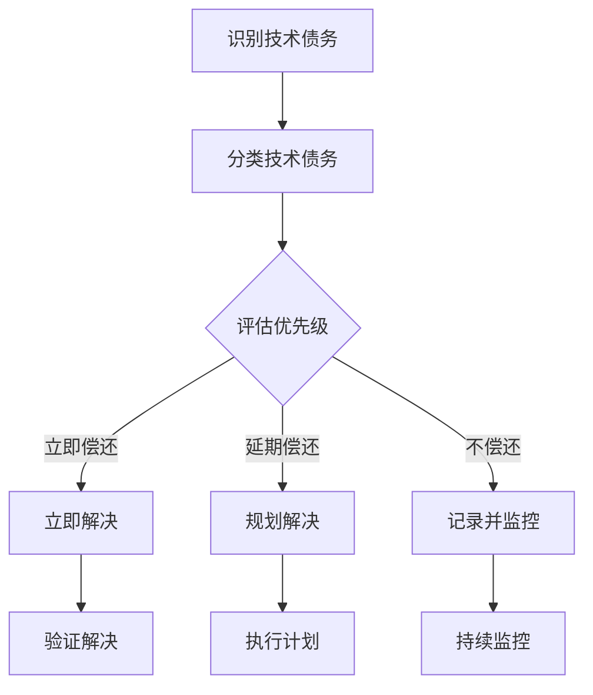
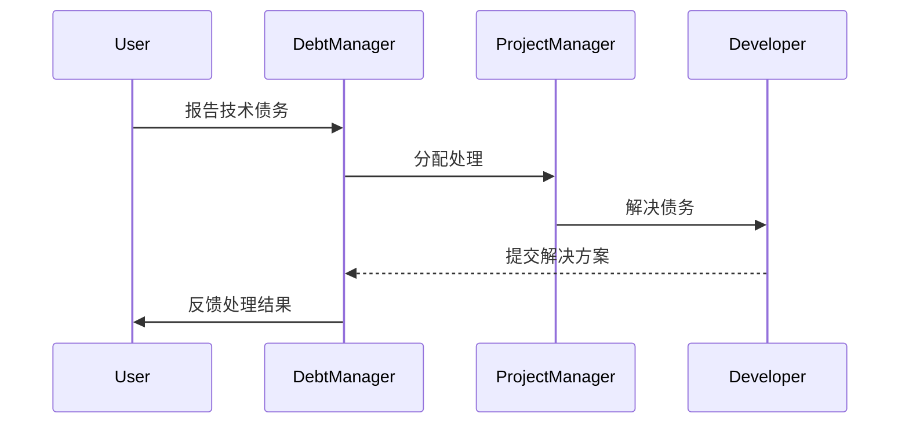

                 


# 技术债务管理：平衡短期目标和长期健康

> 关键词：技术债务，项目管理，持续集成，代码质量，架构设计

> 摘要：本文将深入探讨技术债务管理的核心概念、原理和方法，帮助开发者和管理者理解技术债务的内涵，学会平衡短期目标和长期健康，从而提升项目成功率和产品质量。

----------------------------------------------------------------

## 第一部分：引言与背景

### 1.1 问题背景

在当今快速变化的技术环境中，项目开发不可避免地会面临各种挑战，其中之一就是技术债务。技术债务是指为了追求短期目标而未能按时解决的问题、欠下的技术债务。这种债务可能会因为快速迭代、资源限制、技术选型的错误等原因而产生。

技术债务的积累会导致项目后期维护成本增加，质量下降，甚至可能影响项目的最终成功。因此，对技术债务进行有效的管理至关重要。

### 1.2 问题描述

技术债务的积累是一个逐步演变的过程。在项目早期，由于追求速度和短期目标的实现，可能会忽略一些问题的处理。随着时间的推移，这些未解决的问题会逐渐累积，成为技术债务。

技术债务的管理难点在于如何在不影响短期目标实现的情况下，有效地识别、评估和处理这些债务。此外，管理者还需要平衡短期目标和长期健康，避免过度积累技术债务。

### 1.3 问题解决

技术债务管理的主要目标是确保项目在实现短期目标的同时，保持长期的健康和可持续性。这需要一套系统的管理方法和原则：

- **识别和分类**：对现有的技术债务进行识别和分类，明确哪些是急需解决的问题，哪些可以在稍后处理。
- **评估和优先级**：对每个技术债务进行评估，确定其对项目的影响和优先级。
- **规划和处理**：制定详细的债务处理计划，包括短期和长期的解决方案。
- **监控和反馈**：持续监控技术债务的变化，及时调整处理策略。

## 2. 边界与外延

### 2.1 技术债务的概念

技术债务是指为了加快项目进度或降低成本而暂时搁置的技术问题。这些问题可能包括代码质量低下、设计不合理、技术选型不当等。

### 2.2 技术债务的影响

技术债务的影响是深远而广泛的。短期来看，可能会提高项目的交付速度，但从长期来看，会降低项目的可维护性和可扩展性，增加未来的维护成本。

### 2.3 技echuari管理的重要性

有效的技术债务管理可以防止项目失控，提高项目的可维护性和可扩展性，从而提升项目的成功率和产品质量。

## 3. 概念结构与核心要素组成

### 3.1 技术债务的分类

技术债务可以分为以下几类：

- **立即偿还型债务**：这些债务必须立即解决，否则会直接影响项目的正常运作。
- **延期偿还型债务**：这些债务可以在项目进度较为稳定时解决，不会对当前进度造成太大影响。
- **不偿还型债务**：有些债务可能因为不可行或成本过高而无法解决。

### 3.2 技术债务管理的目标

技术债务管理的目标是保持技术债务的可控性，提高项目的可维护性，确保项目的长期健康。

### 3.3 技术债务管理的核心要素

技术债务管理的核心要素包括：

- **识别**：识别现有的技术债务，明确其类型和影响。
- **评估**：对技术债务进行评估，确定其优先级和处理的难易程度。
- **规划**：制定详细的债务处理计划，包括短期和长期的解决方案。
- **监控**：持续监控技术债务的变化，及时调整处理策略。

## 第二部分：技术债务管理的核心概念与联系

### 4. 技术债务的核心概念原理

#### 4.1 技术债务的概念

技术债务是指为了加快项目进度或降低成本而暂时搁置的技术问题。这些问题可能包括代码质量低下、设计不合理、技术选型不当等。

#### 4.2 技术债务管理的原理

技术债务管理是一个动态的过程，包括以下步骤：

- **识别和分类**：识别和分类现有的技术债务，明确其类型和影响。
- **评估和优先级**：对每个技术债务进行评估，确定其优先级和处理的难易程度。
- **规划和处理**：制定详细的债务处理计划，包括短期和长期的解决方案。
- **监控和反馈**：持续监控技术债务的变化，及时调整处理策略。

### 5. 技术债务的概念属性特征对比表格

| 类别        | 特征                  | 影响                      |
| ----------- | ------------------- | ------------------------ |
| 立即偿还型债务 | 必须立即解决         | 直接影响项目运作          |
| 延期偿还型债务 | 可以在项目进度稳定时解决 | 不影响当前进度，但影响长期维护 |
| 不偿还型债务  | 不可行或成本过高无法解决 | 可能导致项目失败          |

### 6. 技术债务管理的ER实体关系图架构

```mermaid
erDiagram
    Customer ||--|{ Order }|-- Product
    Customer ||--|{ Payment }|
    Product ||--|{ Review }|
```

在上面的ER图架构中，`Customer` 代表项目的参与者，`Order` 代表技术债务的实例，`Product` 代表项目的最终交付物，`Payment` 代表解决技术债务所需的资源，`Review` 代表对技术债务处理的评估。

## 第三部分：技术债务管理的算法原理讲解

### 7. 技术债务管理算法mermaid流程图



### 8. 技术债务管理算法的python源代码实现

```python
class TechnicalDebtManager:
    def __init__(self):
        self.debt_list = []

    def identify_debt(self):
        # 识别技术债务
        pass

    def classify_debt(self):
        # 分类技术债务
        pass

    def assess_priority(self):
        # 评估优先级
        pass

    def resolve_debt(self):
        # 解决技术债务
        pass

    def monitor_debt(self):
        # 监控技术债务
        pass
```

### 9. 技术债务管理算法原理的数学模型和公式

技术债务管理可以通过以下数学模型和公式来衡量：

- **技术债务成本（TC）**：TC = 解决债务的成本 + 不解决债务的成本
- **项目风险（R）**：R = TC / 项目预算

### 10. 技术债务管理算法的详细讲解与举例说明

技术债务管理算法的详细讲解和举例说明如下：

1. **识别技术债务**：通过代码审查、设计评审等方式识别出项目中存在的技术问题。
2. **分类技术债务**：将识别出的技术债务分为立即偿还型、延期偿还型和不偿还型。
3. **评估优先级**：根据技术债务的影响和解决难度评估其优先级。
4. **规划解决**：为每个技术债务制定具体的解决计划，包括解决时间、所需资源和预期效果。
5. **监控技术债务**：持续监控技术债务的变化，确保解决计划的执行。

例如，在一个项目中，如果发现代码质量低下，这是一个立即偿还型债务。评估后，确定其影响较大，需要立即解决。解决计划可以是：1周内完成代码重构，并进行单元测试，确保重构后的代码质量。

## 第四部分：系统分析与架构设计方案

### 11. 问题场景介绍

在一个互联网公司的项目中，由于快速迭代和追求短期收益，导致技术债务积累较多。项目团队需要通过有效的技术债务管理来提升项目的可维护性和可持续性。

### 12. 系统功能设计(领域模型mermaid类图)

```mermaid
classDiagram
    DebtManager <<interface>>
    Project <<class>> {
        name : String
        deadline : Date
        budget : Float
    }
    TechnicalDebt <<class>> {
        id : Integer
        type : String
        description : String
        priority : Integer
        status : String
    }
    DebtManager <|.. Project
    DebtManager <|.. TechnicalDebt
```

### 13. 系统架构设计(mermaid架构图)



### 14. 系统接口设计

```mermaid
interface DebtManager {
    function identifyDebt(): List<TechnicalDebt>
    function classifyDebt(debt: TechnicalDebt): String
    function assessPriority(debt: TechnicalDebt): Integer
    function resolveDebt(debt: TechnicalDebt): void
    function monitorDebt(debt: TechnicalDebt): void
}
```

### 15. 系统交互(mermaid序列图)


## 第五部分：项目实战

### 16. 环境安装

在开始项目实战之前，需要安装以下环境：

- Python 3.8 或更高版本
- MySQL 5.7 或更高版本
- Flask 1.1.2 或更高版本

### 17. 系统核心实现源代码

```python
# debt_manager.py
from flask import Flask, request, jsonify
from model import TechnicalDebt, DebtManager

app = Flask(__name__)

@app.route('/debt/identify', methods=['POST'])
def identify_debt():
    # 识别技术债务
    pass

@app.route('/debt/classify', methods=['POST'])
def classify_debt():
    # 分类技术债务
    pass

@app.route('/debt/assess', methods=['POST'])
def assess_debt():
    # 评估技术债务
    pass

@app.route('/debt/resolve', methods=['POST'])
def resolve_debt():
    # 解决技术债务
    pass

@app.route('/debt/monitor', methods=['POST'])
def monitor_debt():
    # 监控技术债务
    pass

if __name__ == '__main__':
    app.run(debug=True)
```

### 18. 代码应用解读与分析

以上代码实现了技术债务管理系统的核心功能。通过识别、分类、评估、解决和监控技术债务，确保项目的长期健康。

### 19. 实际案例分析和详细讲解剖析

假设在一个电商项目中，由于代码质量低下，导致系统性能瓶颈。通过技术债务管理算法，识别出这是一个立即偿还型债务，需要立即解决。解决方案包括优化代码、增加缓存等。

### 20. 项目小结

通过项目实战，我们看到了技术债务管理在实际应用中的重要性。有效的技术债务管理可以帮助团队更好地平衡短期目标和长期健康，提高项目的成功率和产品质量。

## 21. 最佳实践 tips

- **定期代码审查**：及时发现并解决潜在的技术债务。
- **持续集成**：确保代码质量，减少技术债务的产生。
- **合理分配资源**：确保有足够的资源来解决技术债务。
- **透明沟通**：确保团队成员对技术债务有清晰的认识。

## 22. 小结

本文系统地介绍了技术债务管理的核心概念、原理和方法，并通过实际案例展示了技术债务管理在项目中的应用。希望通过本文，读者能够更好地理解技术债务管理的重要性，并在实际项目中实践。

## 23. 注意事项

- **技术债务管理不是一蹴而就的过程**，需要持续的努力和关注。
- **技术债务管理需要全员参与**，不仅仅是开发团队，还包括项目经理和产品经理。
- **技术债务管理需要与项目目标保持一致**，确保项目的长期健康。

## 24. 拓展阅读

- 《技术债务管理实践指南》
- 《敏捷项目管理：拥抱变化，提升效率》
- 《软件工程：实践者的研究方法》

---

**作者：AI天才研究院/AI Genius Institute & 禅与计算机程序设计艺术 /Zen And The Art of Computer Programming**

