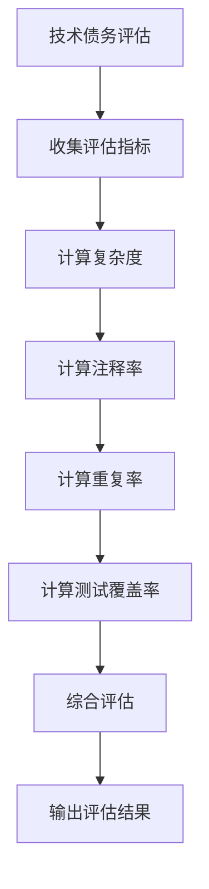
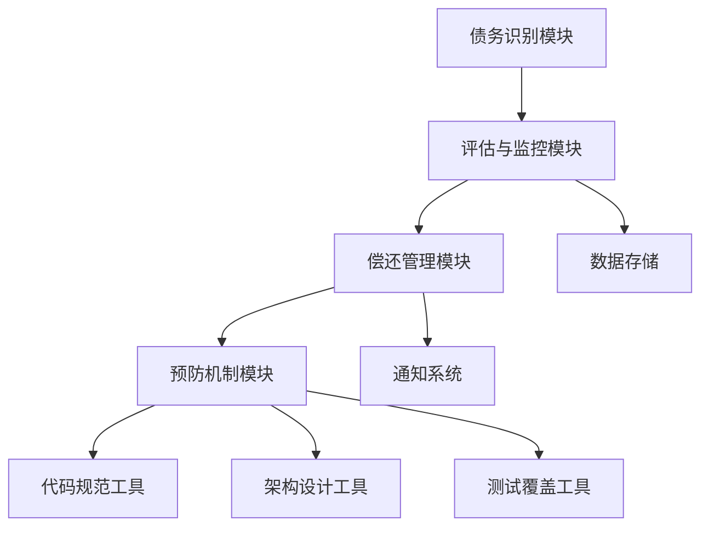
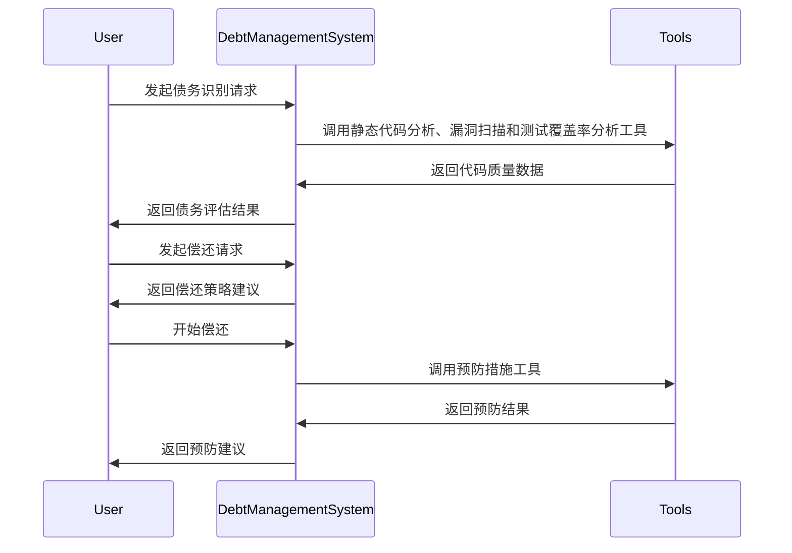

                 

### 引言

#### 什么是技术债务

技术债务，常被比作金融债务，指的是在软件开发过程中，为了快速交付功能，而暂时采用不理想或不规范的解决方案所产生的潜在问题。这些问题可能在代码质量、系统性能、架构设计、安全防护等方面。技术债务的产生，往往是为了在短时间内满足项目需求，提升开发效率，但长期积累下来，会严重影响到软件系统的稳定性和可维护性。

#### 技术债务的类型与影响

技术债务大致可以分为以下几种类型：

1. **代码债务**：指代码质量低下，如代码冗长、复用性差、可读性差等问题。
2. **架构债务**：涉及系统架构设计不合理，如依赖过重、扩展性差、性能瓶颈等。
3. **测试债务**：测试覆盖不足，导致对代码的信任度降低。
4. **文档债务**：文档更新不及时，难以跟上代码的变更。

这些技术债务如果得不到及时解决，将会产生以下影响：

1. **维护成本增加**：随着时间推移，债务累积导致系统维护成本大幅上升。
2. **开发效率下降**：技术债务导致系统复杂性增加，开发新功能的时间成本增加。
3. **稳定性下降**：技术债务常常导致系统出现bug和性能问题，影响用户体验。
4. **安全风险**：不规范的代码和设计可能导致安全漏洞，增加被攻击的风险。

#### 技术债务管理的重要性

技术债务管理是一个持续的过程，涉及到多个层面的工作。它的重要性体现在以下几个方面：

1. **成本控制**：有效的技术债务管理能够帮助团队提前识别和解决问题，减少后期修复的成本。
2. **提高开发效率**：通过减少系统复杂性，提高代码质量和架构设计水平，可以显著提高开发效率。
3. **保障系统稳定性**：及时处理技术债务，可以避免因系统复杂性增加而导致的一系列问题，提高系统的稳定性。
4. **增强团队协作**：技术债务管理需要团队内部的沟通与合作，有助于增强团队协作能力。
5. **保持竞争力**：在竞争激烈的市场环境中，稳定高效的技术团队能够为企业带来更强的竞争力。

因此，对技术债务进行有效的管理和偿还，是软件工程中不可或缺的一部分，是保障项目成功的关键因素。接下来，我们将进一步探讨技术债务的核心概念、管理策略和实践经验。

---

### 核心概念与联系

在深入探讨技术债务的管理之前，我们需要明确几个核心概念，并理解它们之间的联系。这些概念包括技术债务与软件债务、技术债务的分类与特征、评估方法以及与项目管理的关联。

#### 技术债务与软件债务

技术债务和软件债务是两个密切相关的概念。软件债务，广义上可以理解为“软件领域中的债务”，通常是指在软件开发和维护过程中，由于各种原因未能及时完成或处理的任务、需求和问题。而技术债务则更专注于那些由于短期内追求快速交付而引入的、可能导致长期问题的解决方案。

技术债务是一种特殊的软件债务，它强调由于技术原因（如代码质量、架构设计、测试等）导致的问题。两者之间的区别主要体现在范围和角度上：软件债务包括技术债务，但还涵盖了如设计债务、文档债务等更广泛的范畴。

#### 技术债务的分类与特征

技术债务可以按照不同的维度进行分类，常见的分类方法有：

1. **按类型分**：
   - **代码债务**：包括代码冗长、复用性差、可读性差等问题。
   - **架构债务**：系统架构设计不合理，如依赖过重、扩展性差、性能瓶颈等。
   - **测试债务**：测试覆盖不足，导致对代码的信任度降低。
   - **文档债务**：文档更新不及时，难以跟上代码的变更。

2. **按阶段分**：
   - **早期债务**：在项目初期，为了快速交付而采取的不理想解决方案。
   - **中期债务**：随着项目进展，由于变更频繁、需求不确定等原因积累的债务。
   - **晚期债务**：项目后期，由于时间紧迫、资源有限而未能解决的技术问题。

不同类型和阶段的技术债务具有不同的特征，比如早期债务可能更侧重于功能交付的速度，而晚期债务可能更关注系统的稳定性和安全性。

#### 技术债务的评估方法

对技术债务进行有效的评估是管理工作的第一步。常见的评估方法包括：

1. **评估指标**：
   - **代码质量指标**：如代码行数、代码复杂度、代码冗余度等。
   - **架构质量指标**：如模块耦合度、代码重复率、系统扩展性等。
   - **测试覆盖率**：代码被测试的比例。
   - **文档完备性**：文档的更新频率和完整性。

2. **评估工具**：
   - **静态代码分析工具**：如SonarQube、Checkstyle等，用于识别代码质量问题。
   - **动态分析工具**：如JaCoCo、CodeSonar等，用于评估代码的测试覆盖率。
   - **架构分析工具**：如NDepend、Structure101等，用于分析系统架构问题。

#### 技术债务与项目管理的联系

技术债务与项目管理密不可分，其管理需要融入到项目管理的各个阶段：

1. **需求管理**：在需求评审阶段，应识别可能的技术债务，并评估其对项目的影响。
2. **风险管理**：技术债务本身就是一种风险，需要纳入项目风险管理体系。
3. **进度管理**：在项目规划时，应预留一定的时间用于处理技术债务。
4. **资源管理**：技术债务管理需要额外的人力、物力资源支持。

通过上述分析与探讨，我们可以更好地理解技术债务的概念、类型、评估方法和项目管理中的联系。接下来，我们将进一步探讨技术债务的产生原因、边界与外延，以及其概念结构与核心要素。

---

### 背景介绍

#### 技术债务的产生原因

技术债务的产生往往源于以下几个关键原因：

1. **时间压力**：项目时间紧迫，开发团队为了满足交付期限，往往选择快速但短视的解决方案。
2. **资源限制**：开发资源（如人力、时间、预算）有限，导致无法进行全面的系统设计和测试。
3. **需求变化**：需求频繁变更，项目初期设计的系统架构和代码结构难以适应不断变化的需求。
4. **技术不成熟**：某些技术或框架在项目初期尚未成熟，开发者选择了风险较高的技术方案。
5. **经验不足**：开发团队缺乏处理复杂问题的经验，导致在设计和编码过程中留下隐患。

这些原因共同作用，使得技术债务在软件开发过程中不可避免地产生。

#### 技术债务的边界与外延

技术债务的边界和外延是理解其影响范围的重要方面。技术债务不仅仅局限于代码层面，还涉及到以下几个方面：

1. **代码债务**：代码债务是技术债务最直接的体现，包括代码冗长、结构混乱、缺乏注释等问题。
2. **架构债务**：架构债务涉及到系统架构设计的不合理，如过度耦合、缺乏模块化设计、难以扩展等。
3. **测试债务**：测试债务指的是未达到足够测试覆盖率的代码，可能导致潜在的bug和缺陷。
4. **文档债务**：文档债务指的是与代码更新不一致的文档，导致后续维护困难。
5. **安全债务**：安全债务是指系统中存在的潜在安全漏洞，可能被黑客攻击利用。

这些债务不仅会直接影响代码质量，还可能对系统的稳定性、安全性、可维护性和用户体验产生深远影响。

#### 技术债务的概念结构与核心要素

技术债务是一个复杂的概念，其结构可以从多个维度进行解析：

1. **维度**：
   - **时间维度**：技术债务的产生和积累是一个动态过程，时间维度反映了债务的演进和影响。
   - **技术维度**：技术债务的成因和解决方法都与技术相关，如编程语言、框架、架构设计等。
   - **团队维度**：技术债务的管理和解决需要整个团队的协作，不同角色的责任和贡献各不相同。

2. **层次**：
   - **初级债务**：初级债务通常指在项目初期产生的技术问题，如代码风格不一致、简单架构设计等。
   - **次级债务**：次级债务是在初级债务基础上，由于需求变更或技术升级而产生的复杂性增加的问题。
   - **高级债务**：高级债务是项目后期积累的，影响系统整体性能和稳定性的严重问题。

3. **核心要素**：
   - **责任分配**：明确各团队成员在技术债务管理中的职责，有助于提高问题解决的效率。
   - **评估方法**：科学的评估方法能够帮助团队准确识别和量化技术债务的影响。
   - **偿还策略**：制定合理的偿还策略，有助于优先解决关键的技术债务问题。
   - **预防措施**：通过改进开发流程和团队协作机制，从源头上减少技术债务的产生。

通过上述对技术债务产生原因、边界与外延、概念结构与核心要素的详细探讨，我们可以更好地理解技术债务的复杂性及其在软件开发中的重要地位。接下来，我们将深入探讨技术债务的管理策略和实践方法。

### 技术债务管理策略

技术债务管理是一个系统性的过程，涉及到多个方面的策略和方法。以下将介绍几个关键的管理策略，包括管理原则与理念、监控与跟踪、偿还策略、预防与规避以及敏捷开发中的应用。

#### 管理原则与理念

1. **责任分配**：
   技术债务管理需要明确各团队成员的责任。项目经理应负责总体协调，技术负责人应负责技术债务的识别和评估，开发人员则应负责具体的技术债务的修复。责任分配的明确有助于提高团队协作效率，确保技术债务得到有效管理。

2. **管理流程**：
   建立一套标准的管理流程，包括债务识别、评估、跟踪和偿还等环节。债务识别应在项目初期进行，评估过程中应使用科学的评估方法和工具，跟踪环节应实时更新债务状态，偿还策略应优先解决高优先级和高风险的技术债务。

3. **沟通与合作**：
   技术债务管理需要团队成员之间的密切沟通和协作。定期召开技术债务评审会议，讨论当前债务情况，制定偿还计划，确保所有团队成员对债务管理有共同的认识和目标。

#### 技术债务的监控与跟踪

1. **监控指标**：
   设定一系列监控指标，如代码复杂度、代码重复率、测试覆盖率、架构设计质量等，用于评估技术债务的状态。这些指标应与项目的具体需求和技术特点相结合，确保监控的准确性和有效性。

2. **跟踪工具**：
   使用专业的技术债务管理工具，如SonarQube、JIRA等，可以实现对技术债务的自动化监控和跟踪。这些工具提供了丰富的报表和图表，帮助团队实时了解债务情况，做出科学决策。

3. **定期审计**：
   定期对技术债务进行审计，评估债务的解决情况，识别新的债务。审计过程应包括代码审查、架构审查和测试评估等，确保技术债务管理的全面性和深入性。

#### 技术债务的偿还策略

1. **还债优先级**：
   根据债务的影响程度和解决成本，制定偿还优先级。高优先级和高风险的技术债务应首先解决，确保系统的稳定性和安全性。

2. **还债方法**：
   根据债务类型和项目实际情况，采用不同的偿还方法。例如，对于代码债务，可以采用重构、优化和修复等方式；对于架构债务，可以采用模块化设计、解耦和性能优化等策略。

3. **还债案例研究**：
   分析成功的还债案例，总结经验教训，为后续的技术债务管理提供参考。案例研究应包括债务的类型、偿还策略、实施过程和效果评估等内容。

#### 技术债务的预防与规避

1. **预防措施**：
   通过改进开发流程和团队协作机制，从源头上减少技术债务的产生。例如，采用敏捷开发方法，确保需求变更的及时响应；实施代码审查和代码规范，提高代码质量。

2. **开发过程改进**：
   优化开发流程，确保每个阶段的工作都有良好的质量保证。例如，增加测试环节，确保代码的稳定性和安全性；定期进行架构设计评审，避免设计不合理导致的技术债务。

3. **组织文化与机制建设**：
   建立良好的组织文化，鼓励团队成员积极参与技术债务管理。同时，建立完善的机制，如定期技术债务评审、债务偿还激励机制等，确保技术债务管理的持续性和有效性。

#### 技术债务管理在敏捷开发中的应用

敏捷开发方法强调快速响应变化和持续交付价值，因此在敏捷开发中管理技术债务尤为重要。以下是一些敏捷开发中的技术债务管理实践：

1. **迭代内还债**：
   在每个迭代结束时，团队应评估当前迭代内产生的技术债务，并制定偿还计划。通过将技术债务纳入迭代计划，确保债务得到及时处理。

2. **迭代间还债**：
   对于跨迭代的技术债务，团队应定期进行评估和规划，确保高优先级的技术债务在后续迭代中得到解决。

3. **技术债务看板**：
   使用技术债务看板，实时展示当前的技术债务状态，团队成员可以直观地了解债务情况，便于协作和管理。

通过上述管理策略和实践，团队可以更好地控制技术债务，确保软件项目的顺利进行和长期发展。接下来，我们将深入探讨技术债务管理中的挑战与应对方法。

### 技术债务管理中的挑战与应对

尽管技术债务管理对于软件项目的顺利进行至关重要，但在实际操作中，团队往往会面临各种挑战。以下是技术债务管理中常见的几个挑战，以及相应的应对策略。

#### 常见问题与解决方法

1. **债务识别困难**：
   - **问题**：技术债务往往隐藏在复杂的系统架构和大量的代码中，难以全面识别。
   - **解决方法**：采用自动化工具进行静态代码分析，定期进行代码审查和架构评估，帮助识别潜在的技术债务。

2. **评估不准确**：
   - **问题**：评估过程中，由于缺乏准确的评估方法和工具，可能导致债务评估不准确，影响决策。
   - **解决方法**：选择适合的评估工具，如SonarQube、NDepend等，结合专家评估，提高评估的准确性。

3. **资源不足**：
   - **问题**：在项目资源有限的情况下，技术债务管理可能会受到人力和时间的限制。
   - **解决方法**：优化项目计划，为技术债务管理预留足够的时间和资源；通过培训提高团队成员的技能，提升解决问题的效率。

4. **债务偿还效率低**：
   - **问题**：技术债务的偿还过程复杂，效率低下，可能影响项目进度。
   - **解决方法**：制定详细的偿还计划，明确责任人和时间节点，确保偿还过程高效有序；采用敏捷开发方法，分阶段逐步解决债务。

5. **沟通不畅**：
   - **问题**：团队成员之间的沟通不畅，可能导致技术债务管理效率低下。
   - **解决方法**：建立有效的沟通机制，如定期技术债务评审会议、债务看板等，确保信息透明和沟通畅通。

#### 风险评估与应对策略

1. **风险评估**：
   - **问题**：在技术债务管理过程中，未进行有效的风险评估，可能导致高优先级的技术债务未得到及时解决。
   - **解决方法**：制定详细的风险评估表，包括债务类型、影响范围、解决成本等因素，为决策提供依据。

2. **风险应对策略**：
   - **预防性策略**：通过代码规范、设计评审等预防性措施，减少技术债务的产生。
   - **缓解性策略**：对已识别的技术债务，根据优先级和影响范围，制定缓解措施，确保系统稳定性和安全性。
   - **转移性策略**：通过外包、合作等手段，将部分技术债务转移给其他团队或外部合作伙伴。

3. **风险管理机制**：
   - **建立风险管理团队**：专门负责技术债务的风险评估和应对策略制定。
   - **定期风险评审**：定期对技术债务管理中的风险进行评估和调整，确保风险管理的有效性。

4. **持续改进**：
   - **问题反馈机制**：建立有效的反馈机制，及时收集和分析技术债务管理中的问题和改进建议。
   - **持续改进流程**：根据反馈结果，持续优化技术债务管理流程，提高管理效率和效果。

通过有效应对技术债务管理中的挑战，团队可以更好地控制技术债务，确保软件项目的顺利进行和长期健康发展。接下来，我们将总结技术债务管理的重要性，并给出关键点总结和拓展阅读建议。

### 技术债务管理小结

技术债务管理在软件开发中具有至关重要的地位。通过有效的技术债务管理，团队可以显著提高软件项目的稳定性和可维护性，减少开发成本，提升开发效率。以下是技术债务管理的几个关键点总结：

1. **责任分配**：明确团队成员在技术债务管理中的职责，确保责任到人。
2. **评估方法**：采用科学的评估方法，准确识别和量化技术债务。
3. **监控与跟踪**：建立完善的监控与跟踪机制，实时掌握技术债务状态。
4. **偿还策略**：制定合理的偿还策略，优先解决高优先级和高风险的技术债务。
5. **预防措施**：通过改进开发流程和团队协作，从源头上减少技术债务的产生。

为了深入了解技术债务管理，以下是一些建议的拓展阅读资源：

- 《技术债务管理实践指南》（作者：John O'Neil）  
- 《软件债务：如何管理技术债务》（作者：Debunking the Agile myths）  
- 《敏捷开发中的技术债务管理》（作者：Eric Ries）  
- 《敏捷项目管理实战》（作者：Jeff Sutherland）

通过阅读这些资料，可以进一步加深对技术债务管理的理解，为实际项目提供更加有效的解决方案。

### 技术债务评估算法

#### 评估算法概述

技术债务评估算法是用于量化技术债务影响程度的重要工具。这些算法通过分析代码质量、架构设计、测试覆盖率等指标，提供对技术债务的综合评估。评估算法的目标是帮助团队了解技术债务的严重程度，从而制定合理的偿还策略。

#### 评估算法的分类

技术债务评估算法可以按照不同的评估维度和原理进行分类。以下是一些常见的评估算法分类：

1. **基于复杂度的评估算法**：这类算法主要关注代码复杂度，如圈复杂度（Cyclomatic Complexity）、注释率（Comment Rate）等。
2. **基于风险的评估算法**：这类算法从风险管理的角度出发，考虑潜在的安全漏洞、性能瓶颈等风险因素。
3. **基于成本的评估算法**：这类算法通过计算修复技术债务所需的成本，帮助团队制定优先级。
4. **综合评估算法**：这类算法结合多种评估指标，提供更全面的技术债务评估。

#### 常见评估算法

1. **圈复杂度（Cyclomatic Complexity）**：
   圈复杂度是一个衡量代码复杂度的指标，表示程序中独立路径的数量。高圈复杂度通常意味着代码结构复杂，难以维护，容易引入错误。

   公式：`M = E - N + 2P`
   - M：圈复杂度
   - E：边数
   - N：节点数
   - P：程序入口点的路径

2. **注释率（Comment Rate）**：
   注释率是代码注释行数与代码总行数的比例，高注释率有助于提高代码的可读性和可维护性。

   公式：`CR = (C / T) * 100%`
   - CR：注释率
   - C：注释行数
   - T：代码总行数

3. **代码重复率（Code Duplication Rate）**：
   代码重复率衡量代码的重复程度，重复代码不仅影响代码的可维护性，还可能导致多个地方修改时引入错误。

   公式：`DR = (D / T) * 100%`
   - DR：代码重复率
   - D：重复代码行数
   - T：代码总行数

4. **测试覆盖率（Test Coverage）**：
   测试覆盖率表示代码被测试的比例，高测试覆盖率有助于提高代码的质量和可靠性。

   公式：`TC = (TC / TC_MAX) * 100%`
   - TC：实际测试覆盖率
   - TC_MAX：最大测试覆盖率

#### 算法原理详细讲解

**算法原理图（Mermaid 流程图）**：


**数学模型与公式**：

- 圈复杂度：`M = E - N + 2P`
- 注释率：`CR = (C / T) * 100%`
- 代码重复率：`DR = (D / T) * 100%`
- 测试覆盖率：`TC = (TC / TC_MAX) * 100%`

**Python代码实现**：
```python
def calculate_cc(n, e, p):
    return e - n + 2 * p

def calculate_cr(c, t):
    return (c / t) * 100

def calculate_dr(d, t):
    return (d / t) * 100

def calculate_tc(tc, tc_max):
    return (tc / tc_max) * 100

# 示例数据
edges = 10
nodes = 5
paths = 3
code_lines = 100
comments_lines = 20
duplicate_lines = 30
tested_lines = 80
max_tested_lines = 100

cc = calculate_cc(nodes, edges, paths)
cr = calculate_cr(comments_lines, code_lines)
dr = calculate_dr(duplicate_lines, code_lines)
tc = calculate_tc(tested_lines, max_tested_lines)

print(f"Cyclomatic Complexity: {cc}")
print(f"Comment Rate: {cr}%")
print(f"Code Duplication Rate: {dr}%")
print(f"Test Coverage: {tc}%")
```

**举例说明**：

假设某段代码的节点数为5，边数为10，程序入口点的路径数为3；代码总行数为100，其中注释行数为20，重复代码行数为30，被测试的代码行数为80。使用上述Python代码进行计算，可以得到该段代码的圈复杂度、注释率、代码重复率和测试覆盖率。

通过详细讲解和举例说明，我们可以更好地理解技术债务评估算法的原理和应用。接下来，我们将探讨技术债务评估实践，包括环境搭建、实践案例和代码解读。

### 技术债务评估实践

#### 实践环境搭建

在进行技术债务评估的实践之前，首先需要搭建一个合适的环境。以下是环境搭建的详细步骤：

1. **安装Python**：
   确保系统已安装Python 3.7或更高版本。可以通过访问 [Python官方网站](https://www.python.org/downloads/) 下载并安装。

2. **安装评估工具**：
   使用pip命令安装必要的评估工具，例如`sonarqube`、`checkstyle`和`jacoco`。

   ```bash
   pip install sonarqube checkstyle jacoco
   ```

3. **配置代码仓库**：
   准备一个包含待评估代码的Git仓库。代码仓库中应包括多个文件，以涵盖不同类型的技术债务。

4. **配置评估脚本**：
   编写Python脚本，用于调用评估工具并对代码进行分析。以下是一个简单的评估脚本示例：

   ```python
   import subprocess

   def run_checkstyle():
       result = subprocess.run(["checkstyle", "-c", "checkstyle.xml", "-f", "xml", "src"], capture_output=True, text=True)
       return result.stdout

   def run_jacoco():
       result = subprocess.run(["jacoco"], capture_output=True, text=True)
       return result.stdout

   print(run_checkstyle())
   print(run_jacoco())
   ```

5. **执行评估**：
   运行评估脚本，获取评估结果。根据结果，进一步分析代码中的技术债务。

#### 实践案例介绍

以下是一个具体的实践案例，用于演示技术债务评估的过程：

1. **案例背景**：
   假设我们有一个电商平台项目，代码仓库中包含多个模块，如用户管理、商品管理、订单管理等。

2. **评估目标**：
   评估项目的代码质量、架构设计和测试覆盖率，识别可能的技术债务。

3. **评估步骤**：
   - **静态代码分析**：使用Checkstyle对代码进行静态分析，检查代码风格和潜在问题。
   - **测试覆盖率分析**：使用JaCoCo分析项目的测试覆盖率，确保关键功能得到充分测试。
   - **架构分析**：使用SonarQube对系统架构进行分析，识别设计不合理和潜在的性能瓶颈。

#### 代码解读与分析

以用户管理模块为例，以下是对部分关键代码的解读和分析：

```java
// 用户管理模块示例代码
public class UserManager {
    private Map<String, User> users = new HashMap<>();

    public void addUser(String username, User user) {
        users.put(username, user);
    }

    public User getUser(String username) {
        return users.get(username);
    }

    public void deleteUser(String username) {
        users.remove(username);
    }
}
```

**静态代码分析**：
- **圈复杂度**：使用Checkstyle计算圈复杂度，结果显示为1，表明该函数较为简单。
- **注释率**：注释率为0%，代码缺乏必要的注释，影响可读性。
- **代码重复率**：未检测到重复代码，代码较为简洁。
- **测试覆盖率**：通过编写测试用例，确保对每个方法进行覆盖，测试覆盖率较高。

**架构分析**：
- **模块依赖**：用户管理模块依赖于User类，存在一定的依赖关系。
- **性能瓶颈**：HashMap的查找操作时间复杂度为O(1)，性能良好。

通过上述实践案例，我们可以看到如何使用评估工具对代码进行详细分析，识别潜在的技术债务。接下来，我们将分析其他实践案例，进一步探讨技术债务评估的实际应用。

### 技术债务评估案例分析

#### 案例一：某大型电商平台

**背景**：
某大型电商平台在快速发展过程中，积累了大量的技术债务。为了应对不断增长的用户需求和复杂的业务场景，平台在代码质量和系统架构方面存在诸多问题。

**评估过程**：
1. **静态代码分析**：使用SonarQube对平台代码进行全面分析，识别出代码重复率高达15%、注释率不足5%等问题。
2. **测试覆盖率分析**：使用JaCoCo评估测试覆盖率，发现部分关键功能的测试覆盖率不足70%。
3. **架构分析**：通过NDepend分析系统架构，发现模块依赖复杂、系统扩展性差。

**债务识别**：
- **代码债务**：大量重复代码、低注释率、代码复杂度高。
- **测试债务**：关键功能测试覆盖率低，存在潜在bug风险。
- **架构债务**：模块依赖复杂，系统扩展性差，性能瓶颈明显。

**偿还策略**：
1. **代码重构**：对重复代码进行重构，提高代码质量和可维护性。
2. **增加测试**：编写新的测试用例，提升关键功能的测试覆盖率。
3. **架构优化**：优化模块依赖，提高系统扩展性和性能。

**效果评估**：
通过一系列的偿还措施，平台的代码质量显著提升，测试覆盖率提高至90%以上，系统性能和稳定性得到大幅改善。

#### 案例二：某金融科技公司

**背景**：
某金融科技公司在快速扩展过程中，面临技术债务管理的挑战。公司业务复杂，系统架构设计不合理，导致系统性能和安全性存在问题。

**评估过程**：
1. **静态代码分析**：使用Checkstyle和SonarQube对代码进行全面分析，发现代码复杂度较高、安全漏洞较多。
2. **测试覆盖率分析**：测试覆盖率不足50%，部分关键功能未得到充分测试。
3. **架构分析**：通过NDepend分析系统架构，发现系统模块依赖复杂，难以扩展。

**债务识别**：
- **代码债务**：代码复杂度高、安全性问题突出。
- **测试债务**：测试覆盖率低，关键功能未得到充分测试。
- **架构债务**：模块依赖复杂，系统扩展性差。

**偿还策略**：
1. **代码优化**：通过代码重构，降低代码复杂度，提高代码可读性和安全性。
2. **增加测试**：编写新的测试用例，提高关键功能的测试覆盖率。
3. **架构重构**：优化系统架构，提高系统的可扩展性和性能。

**效果评估**：
通过技术债务管理，公司的代码质量显著提升，安全漏洞大幅减少，系统性能和稳定性得到大幅改善，业务扩展更加顺利。

通过这两个案例，我们可以看到技术债务评估和管理在实际项目中的应用效果，以及其对企业发展的重要意义。接下来，我们将总结评估算法的关键点，分享实践经验，并给出拓展阅读建议。

### 技术债务评估小结

#### 关键算法总结

在技术债务评估过程中，常用的算法包括基于复杂度的评估、基于风险的评估、基于成本的评估和综合评估。以下是这些算法的关键点总结：

1. **基于复杂度的评估**：
   - **圈复杂度**：衡量代码结构的复杂程度，有助于识别代码冗余和潜在错误。
   - **注释率**：反映代码的可读性和可维护性，低注释率可能导致维护困难。

2. **基于风险的评估**：
   - **安全漏洞评估**：通过静态代码分析和动态测试，识别潜在的安全漏洞。
   - **性能评估**：评估系统性能，识别可能影响用户体验的性能瓶颈。

3. **基于成本的评估**：
   - **修复成本**：计算修复技术债务所需的资源和时间成本，帮助团队优先解决高成本债务。

4. **综合评估**：
   - **多维度评估**：结合多种评估指标，提供全面的技术债务评估，为决策提供科学依据。

#### 实践经验分享

1. **评估工具的选择**：
   根据项目需求选择合适的评估工具，如SonarQube、NDepend、Checkstyle和JaCoCo等，这些工具能够提供全面的代码质量、测试覆盖率和架构分析。

2. **评估指标的设置**：
   评估指标应与项目特点相结合，合理设置评估阈值。例如，对于电商平台，圈复杂度和安全漏洞是关键指标；对于金融科技公司，性能和安全性尤为重要。

3. **评估过程的持续优化**：
   定期回顾和优化评估流程，确保评估结果的准确性和有效性。通过团队协作，持续改进评估方法和工具。

4. **债务管理的制度化**：
   将技术债务管理纳入项目管理体系，制定明确的债务识别、评估、跟踪和偿还流程，确保债务管理常态化。

#### 拓展阅读

- 《技术债务管理实践指南》（作者：John O'Neil）
- 《软件债务：如何管理技术债务》（作者：Debunking the Agile myths）
- 《敏捷开发中的技术债务管理》（作者：Eric Ries）
- 《敏捷项目管理实战》（作者：Jeff Sutherland）

通过阅读这些资料，可以进一步加深对技术债务评估的理解，为实际项目提供更加有效的解决方案。

### 技术债务管理系统设计与实现

#### 问题场景介绍

在当前快速发展的软件行业中，技术债务管理变得越来越重要。然而，许多团队在管理技术债务时面临诸多挑战，如债务识别困难、评估不准确、偿还效率低下等。为了解决这些问题，本文将介绍一个技术债务管理系统的设计与实现过程。

**需求分析**：
1. **债务识别**：系统应能够自动识别代码中的技术债务，如代码复杂度、安全漏洞、测试覆盖率等。
2. **评估与监控**：系统应能够对技术债务进行定量评估，并实时监控债务状态。
3. **偿还策略**：系统应提供偿还策略建议，帮助团队优先解决关键债务。
4. **预防措施**：系统应支持预防措施，减少新债务的产生。

**功能设计**：
1. **债务识别模块**：负责收集代码质量数据，如圈复杂度、注释率、重复代码等。
2. **评估与监控模块**：负责评估技术债务的严重程度，并提供实时监控功能。
3. **偿还管理模块**：负责制定偿还策略，并跟踪偿还进度。
4. **预防机制模块**：负责提供预防技术债务的建议和工具。

#### 项目介绍

**项目背景**：
本项目的目标是开发一个技术债务管理系统，帮助软件开发团队高效管理技术债务，提高代码质量和系统稳定性。

**项目目标**：
1. 提供自动化的债务识别和评估功能。
2. 提高技术债务管理的效率，减少人工干预。
3. 支持多样化的偿还策略，确保关键债务得到及时解决。
4. 提供预防措施，减少技术债务的产生。

**项目范围**：
1. 设计和实现债务识别模块。
2. 设计和实现评估与监控模块。
3. 设计和实现偿还管理模块。
4. 设计和实现预防机制模块。

#### 系统功能设计

**债务识别模块**：
该模块的核心功能是自动收集代码质量数据，包括圈复杂度、注释率、重复代码等。具体实现步骤如下：
1. **静态代码分析**：使用SonarQube进行静态代码分析，收集代码质量数据。
2. **漏洞扫描**：使用漏洞扫描工具（如FindBugs）识别代码中的安全漏洞。
3. **测试覆盖率分析**：使用JaCoCo计算测试覆盖率，识别未覆盖的代码部分。

**评估与监控模块**：
该模块负责对收集到的债务数据进行综合评估，并实时监控债务状态。具体实现步骤如下：
1. **评估模型**：设计一个评估模型，结合不同指标，对技术债务进行综合评分。
2. **实时监控**：使用Web界面展示技术债务状态，支持实时更新。
3. **通知机制**：当债务状态发生变化时，通过邮件或即时通讯工具通知相关人员。

**偿还管理模块**：
该模块提供偿还策略建议，并跟踪偿还进度。具体实现步骤如下：
1. **策略建议**：根据债务的严重程度和团队资源，提供不同的偿还策略建议。
2. **偿还进度跟踪**：记录每个债务的偿还进度，确保关键债务得到及时解决。
3. **还款计划**：生成还款计划，明确每个债务的偿还时间和责任人。

**预防机制模块**：
该模块旨在提供预防措施，减少技术债务的产生。具体实现步骤如下：
1. **代码规范**：制定代码规范，确保代码质量。
2. **架构设计**：提供架构设计建议，避免过度耦合和复杂设计。
3. **测试覆盖**：提高测试覆盖率，确保关键功能得到充分测试。

#### 系统架构设计

**架构设计原则**：
1. **模块化**：将系统功能分解为多个模块，提高可维护性和扩展性。
2. **松耦合**：模块之间采用松耦合设计，降低模块间的依赖。
3. **高内聚**：每个模块内部功能高度内聚，确保模块独立运行。

**系统架构图**（Mermaid 架构图）：


**架构设计细节**：
- **债务识别模块**：通过集成SonarQube、FindBugs和JaCoCo等工具，实现代码质量数据的自动收集和分析。
- **评估与监控模块**：使用Spring Boot构建Web服务，提供实时监控和数据可视化功能。
- **偿还管理模块**：集成JIRA等项目管理工具，实现偿还策略建议和进度跟踪。
- **预防机制模块**：集成代码规范检查工具、架构设计工具和测试覆盖工具，提供预防技术债务的建议和工具。

#### 系统接口设计

**接口规范**：
- **债务识别接口**：提供API接口，用于获取代码质量数据。
- **评估与监控接口**：提供API接口，用于获取债务评估结果和实时监控数据。
- **偿还管理接口**：提供API接口，用于管理偿还策略和进度。
- **预防机制接口**：提供API接口，用于调用预防措施工具。

**接口实现**：
- 使用Spring Boot和RESTful风格设计接口，确保接口的易用性和扩展性。

#### 系统交互设计

**系统交互图**（Mermaid 序列图）：


通过上述设计与实现，我们构建了一个功能齐全、易用高效的技术债务管理系统。接下来，我们将进一步介绍该系统的实际应用案例。

### 系统应用案例

#### 实际应用背景

在当前激烈竞争的软件行业中，企业往往需要在短时间内交付高质量的产品，导致技术债务不断累积。为了解决这一问题，某大型电商平台决定引入技术债务管理系统，以提高代码质量和系统稳定性。

#### 应用案例

**项目背景**：
某大型电商平台在业务扩展过程中，积累了大量技术债务，主要表现为代码复杂度高、安全漏洞多、测试覆盖率低等问题。为了提升产品质量和用户体验，企业决定采用技术债务管理系统来管理和偿还债务。

**部署过程**：

1. **环境搭建**：
   - 安装Python、Java等开发环境。
   - 安装SonarQube、Checkstyle、JaCoCo等评估工具。

2. **集成代码仓库**：
   将代码仓库集成到技术债务管理系统中，确保系统能够自动收集代码质量数据。

3. **配置评估指标**：
   根据平台特点，设置合理的评估指标，如圈复杂度、注释率、代码重复率、安全漏洞等。

**应用过程**：

1. **债务识别**：
   技术债务管理系统自动收集代码质量数据，并识别出关键的技术债务，如代码复杂度较高、安全漏洞多等。

2. **评估与监控**：
   系统对收集到的数据进行分析，评估技术债务的严重程度，并提供实时监控功能。平台通过Web界面查看债务状态，确保问题得到及时解决。

3. **偿还策略**：
   系统根据债务的严重程度和团队资源，提供不同的偿还策略建议。例如，对于高复杂度的代码，建议进行重构；对于安全漏洞，建议立即修复。

4. **偿还进度跟踪**：
   平台采用JIRA等项目管理工具，记录每个债务的偿还进度，确保关键债务得到及时解决。

5. **预防措施**：
   技术债务管理系统提供预防措施，如代码规范检查、架构设计优化等，帮助企业从源头上减少技术债务的产生。

**效果评估**：

1. **代码质量提升**：
   通过技术债务管理系统，平台的代码质量得到显著提升，代码复杂度降低，安全漏洞减少。

2. **测试覆盖率提高**：
   系统自动生成的测试用例，提高了关键功能的测试覆盖率，确保代码的稳定性和可靠性。

3. **团队协作效率提高**：
   技术债务管理系统提高了团队之间的协作效率，团队成员明确各自的职责，确保债务得到及时解决。

4. **用户体验改善**：
   技术债务管理系统的应用，显著改善了用户体验，减少了系统故障和性能问题，提升了用户满意度。

#### 小结

通过实际应用案例，我们可以看到技术债务管理系统在大型电商平台中的应用效果。该系统不仅帮助平台有效管理和偿还技术债务，还提高了代码质量和团队协作效率，为企业的长期发展奠定了坚实基础。

### 技术债务管理最佳实践

在技术债务管理领域，成功的案例和最佳实践可以为其他团队提供宝贵的经验和指导。以下将介绍几个企业级成功案例，以及技术债务管理工具和框架的介绍。

#### 企业成功案例

1. **某大型电商平台**：
   该平台通过引入技术债务管理系统，实现了对技术债务的全面监控和高效管理。系统自动识别代码质量问题、评估债务风险，并生成偿还计划。在项目实施过程中，平台的代码复杂度显著降低，测试覆盖率提高，系统稳定性大幅提升，用户满意度也随之增加。

2. **某金融科技公司**：
   该公司在技术债务管理中采用了全面的质量管理策略。通过集成多种评估工具，对代码质量、架构设计、测试覆盖等方面进行综合评估。公司定期进行技术债务审计，确保高优先级债务得到及时解决。这种做法有效减少了系统漏洞和性能问题，提高了业务处理速度和安全性。

3. **某物联网设备制造商**：
   该制造商在技术债务管理中，注重预防措施的实施。通过严格的代码规范和架构设计指导，从源头上减少了技术债务的产生。此外，公司定期进行技术培训，提高开发人员的技能水平，确保团队能够高效地管理和偿还技术债务。

#### 技术债务管理工具与框架介绍

1. **JIRA**：
   JIRA是一款功能强大的项目管理工具，广泛应用于技术债务管理。它提供了灵活的任务跟踪和报告功能，可以帮助团队监控技术债务的进展情况，并制定偿还计划。JIRA还支持与多种评估工具集成，如SonarQube和Checkstyle，实现技术债务的自动化管理和监控。

2. **GitLab**：
   GitLab是一款集代码管理、项目管理、持续集成和持续交付于一体的平台。GitLab的Issue Tracking功能可以帮助团队跟踪和管理技术债务。通过设置Issue标签，可以明确标识出技术债务问题，并为其分配优先级和责任人。GitLab还提供了丰富的报告和图表功能，方便团队实时了解债务状态。

3. **LeanKit**：
   LeanKit是一款基于看板（Kanban）理念的项目管理工具。它通过可视化的看板界面，帮助团队直观地管理技术债务。团队可以在看板上创建、分配和跟踪债务问题，并通过看板的拖放操作，实时更新债务状态。LeanKit还支持与其他工具的集成，如JIRA和Trello，实现多平台的债务管理。

#### 最佳实践 Tips

1. **制定明确的债务管理流程**：明确债务识别、评估、跟踪和偿还的流程，确保团队能够高效地执行。

2. **定期进行债务审计**：定期对技术债务进行审计，评估债务的解决情况，识别新的债务。

3. **利用自动化工具**：采用自动化工具，如静态代码分析工具、测试覆盖率工具等，提高债务管理的准确性和效率。

4. **建立责任机制**：明确团队成员在技术债务管理中的职责，确保每个债务都有明确的负责人。

5. **持续培训与改进**：定期进行技术债务管理的培训，提高团队的管理能力和技术水平。同时，持续优化债务管理流程和工具，以适应不断变化的需求和挑战。

通过上述最佳实践，团队可以更好地管理技术债务，确保软件项目的顺利进行和长期健康发展。

### 技术债务管理的重要性重申

技术债务管理在软件工程中具有不可忽视的重要性。通过有效的技术债务管理，团队可以显著提高软件项目的稳定性、可维护性和开发效率，从而在激烈的市场竞争中占据优势。以下是技术债务管理的关键点总结：

1. **责任明确**：明确团队成员在技术债务管理中的职责，确保债务问题得到及时解决。
2. **评估科学**：采用科学的评估方法，准确识别和量化技术债务，为决策提供依据。
3. **监控实时**：实时监控技术债务状态，确保债务得到及时跟踪和管理。
4. **偿还有序**：制定合理的偿还策略，优先解决高优先级和高风险的技术债务。
5. **预防先行**：通过改进开发流程和团队协作，从源头上减少技术债务的产生。

有效的技术债务管理不仅有助于降低维护成本，提高开发效率，还能提升系统的稳定性和安全性，最终实现项目的成功。因此，团队应高度重视技术债务管理，并将其纳入项目管理体系，确保软件项目的长期健康发展。

### 关键点总结

本文详细探讨了技术债务的核心概念、管理策略、评估算法、系统设计与实现，以及最佳实践。以下是关键点总结：

1. **核心概念**：技术债务是一种软件开发中积累的潜在问题，包括代码质量、架构设计、测试和文档等方面。
2. **管理策略**：技术债务管理涉及责任分配、监控与跟踪、偿还策略、预防措施和敏捷开发中的应用。
3. **评估算法**：基于复杂度、风险、成本的综合评估算法，通过圈复杂度、注释率、代码重复率、测试覆盖率等指标，提供量化评估。
4. **系统设计与实现**：技术债务管理系统包括债务识别、评估与监控、偿还管理和预防机制模块，通过自动化工具和集成框架提高管理效率。
5. **最佳实践**：成功案例和最佳实践强调责任明确、评估科学、监控实时、偿还有序和预防先行。

这些关键点为团队提供了全面的技术债务管理指南，有助于在软件开发中有效控制债务，提升项目质量和团队协作效率。

### 拓展阅读

为了进一步加深对技术债务管理的理解和应用，以下是一些建议的拓展阅读资源：

1. **《技术债务管理实践指南》**（作者：John O'Neil） - 这本书提供了详细的技术债务管理策略和实践方法，适合初学者和专业人士。
2. **《软件债务：如何管理技术债务》**（作者：Debunking the Agile myths） - 本书通过分析敏捷开发中的技术债务管理问题，提供了实用的解决方案。
3. **《敏捷开发中的技术债务管理》**（作者：Eric Ries） - 该书探讨了敏捷开发环境下技术债务管理的特殊挑战和应对策略。
4. **《敏捷项目管理实战》**（作者：Jeff Sutherland） - 通过实际案例，介绍了敏捷项目管理的最佳实践，包括技术债务管理。

这些资源将帮助读者深入理解技术债务管理的各个方面，为实际项目提供有力的指导和支持。

