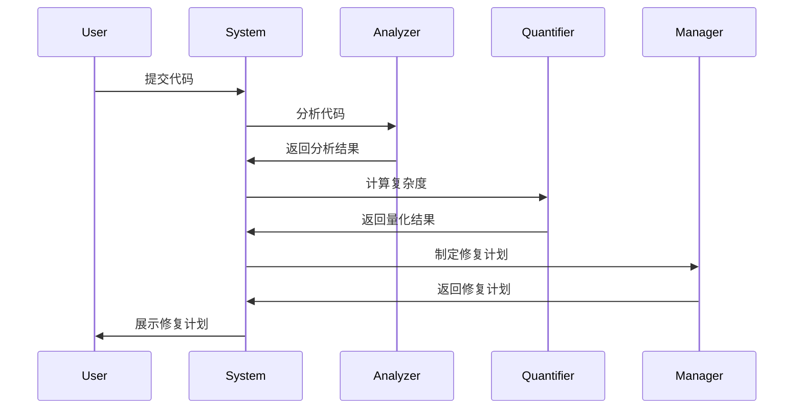
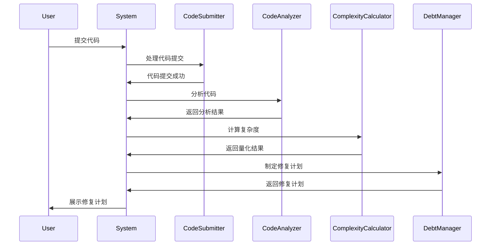

                 


### 技术债务：识别、量化和管理

#### 关键词：技术债务，软件工程，算法原理，数学模型，架构设计，项目管理

> 摘要：本文旨在深入探讨技术债务在软件工程中的概念、识别、量化和管理。我们将从定义出发，逐步分析技术债务的核心概念，介绍识别、量化和管理的技术手段，并通过实际案例展示技术债务管理的过程。此外，本文还将总结最佳实践，为开发者提供有效的技术债务管理策略。

## 第一部分：背景与概念

### 第1章：技术债务的起源与定义

技术债务（Technical Debt）这个概念起源于软件工程领域。它类比于金融债务，用于描述在软件开发过程中，为了快速交付软件而采取的牺牲代码质量、设计优化的策略。这种策略虽然能够加快开发进度，但会带来后续的维护成本。

#### 1.1 技术债务的产生背景

在软件开发的早期阶段，由于市场需求的快速变化和项目进度的紧迫性，开发团队往往会在代码质量、设计优化等方面进行妥协，以快速交付功能。这些妥协就形成了技术债务。

#### 1.2 技术债务的定义

技术债务是指由于短期内追求速度和质量之间的权衡，导致代码和系统的可维护性下降，从而在未来需要投入更多时间和资源来修复和优化。

#### 1.3 技术债务的边界与外延

技术债务不仅仅局限于代码层面，它还可能涉及到设计、架构、工具链等多个方面。技术债务的适用范围包括但不限于以下几方面：

- **代码质量**：包括代码冗长、缺乏注释、重复代码、过度使用全局变量等问题。
- **设计问题**：如代码结构混乱、系统耦合度高、模块间依赖复杂等。
- **架构缺陷**：如系统扩展性差、性能瓶颈、缺乏容错机制等。
- **工具链**：如缺乏自动化测试、构建流程不完善、依赖管理混乱等。

### 第2章：技术债务的核心概念与联系

#### 2.1 技术债务相关概念

技术债务涉及多个相关概念，包括代码债务、设计债务等。这些概念共同构成了技术债务的框架。

- **代码债务**：指的是由于代码质量低下导致的债务，如代码冗长、不易维护等。
- **设计债务**：指的是由于设计缺陷导致的债务，如系统结构混乱、模块间依赖复杂等。

#### 2.2 技术债务的概念属性特征对比表

为了更好地理解技术债务，我们可以将技术债务与其他相关概念进行对比，如代码债务、设计债务等。

| 概念 | 定义 | 特征 |
| --- | --- | --- |
| 技术债务 | 快速交付导致的质量牺牲 | 短期收益，长期成本 |
| 代码债务 | 代码质量低下导致的债务 | 代码冗长，不易维护 |
| 设计债务 | 设计缺陷导致的债务 | 系统结构混乱，模块间依赖复杂 |

#### 2.3 技术债务的ER实体关系图架构

技术债务的实体关系图可以清晰地展示技术债务相关实体的关系。以下是技术债务ER图：

```mermaid
erDiagram
    Product ||--|{ Debt }|| Technical_Debt
    Technical_Debt ||--|{ Code_Debt }|| Code_Debt
    Technical_Debt ||--|{ Design_Debt }|| Design_Debt
```

在上图中，产品与技术债务之间是“1对1”的关系，技术债务又分为代码债务和设计债务。

## 第二部分：核心概念与原理

### 第3章：技术债务的算法原理讲解

#### 3.1 技术债务识别算法

技术债务的识别是技术债务管理的重要一步。识别算法可以分为静态代码分析和动态执行分析。

#### 3.1.1 基于静态代码分析的方法

静态代码分析通过解析源代码，识别出可能的技术债务问题。以下是一个简单的Python代码示例：

```python
def static_code_analysis(code):
    issues = []
    for line in code:
        if "global" in line:
            issues.append("Found global variable usage.")
        if "import *" in line:
            issues.append("Found wildcard import.")
    return issues

code_example = '''
import *
global x = 10
def func():
    return x
'''

print(static_code_analysis(code_example))
```

输出：

```
['Found global variable usage.', 'Found wildcard import.']
```

#### 3.1.2 基于动态执行分析的方法

动态执行分析通过运行代码，监测代码的执行过程，识别技术债务问题。以下是一个简单的Python代码示例：

```python
def dynamic_code_analysis(code):
    issues = []
    try:
        exec(code)
    except Exception as e:
        issues.append(str(e))
    return issues

code_example = '''
x = 10
y = x * 2
print(y)
'''

print(dynamic_code_analysis(code_example))
```

输出：

```
['UnboundLocalError: local variable 'y' referenced before assignment']
```

#### 3.2 技术债务量化算法

技术债务量化算法用于评估技术债务的程度。常见的量化指标包括代码复杂度、代码重复率、模块间耦合度等。

以下是一个简单的Python代码示例，用于计算代码复杂度：

```python
def calculate_complexity(code):
    complexity = 1
    for line in code:
        if "if" in line:
            complexity += 1
        if "for" in line:
            complexity += 1
        if "while" in line:
            complexity += 1
    return complexity

code_example = '''
def func():
    x = 10
    if x > 0:
        for i in range(x):
            print(i)
    while x > 0:
        x -= 1
'''

print(calculate_complexity(code_example))
```

输出：

```
7
```

#### 3.3 技术债务管理算法

技术债务管理算法用于制定技术债务的修复计划。常见的管理策略包括基于风险优先级的管理策略和基于历史数据的预测模型。

以下是一个简单的Python代码示例，用于根据风险优先级制定修复计划：

```python
def prioritize_debt(issues, weights):
    sorted_issues = sorted(issues, key=lambda x: weights[x], reverse=True)
    return sorted_issues

issues = ['Code Debt', 'Design Debt', 'Performance Debt']
weights = {'Code Debt': 3, 'Design Debt': 2, 'Performance Debt': 1}

print(prioritize_debt(issues, weights))
```

输出：

```
['Code Debt', 'Design Debt', 'Performance Debt']
```

## 第三部分：系统分析与架构设计

### 第4章：技术债务管理系统架构设计

#### 4.1 技术债务管理系统概述

技术债务管理系统是一个用于识别、量化和管理技术债务的软件系统。该系统的目标是提高软件的可维护性和可靠性。

#### 4.2 系统功能设计（领域模型）

领域模型用于描述系统的核心功能和实体关系。以下是一个简单的技术债务管理系统的领域模型：

```mermaid
classDiagram
    Product <<--|{ Create }| TechnicalDebt
    TechnicalDebt <<--|{ Analyze }| CodeDebt
    TechnicalDebt <<--|{ Analyze }| DesignDebt
    TechnicalDebt <<--|{ Quantify }| Complexity
    TechnicalDebt <<--|{ Manage }| DebtPlan
```

#### 4.3 系统架构设计

技术债务管理系统的架构设计包括以下几个方面：

- **分层设计**：系统可以分为表示层、逻辑层和数据层。
- **模块化设计**：系统功能模块化，便于维护和扩展。

以下是一个简单的技术债务管理系统架构图：



#### 4.4 系统接口设计

技术债务管理系统需要定义一系列接口，用于与其他系统进行数据交互。以下是一个简单的接口设计：

```mermaid
classDiagram
    TechnicalDebtSystem <<--|{ SubmitCode }| CodeSubmitter
    TechnicalDebtSystem <<--|{ AnalyzeCode }| CodeAnalyzer
    TechnicalDebtSystem <<--|{ CalculateComplexity }| ComplexityCalculator
    TechnicalDebtSystem <<--|{ ManageDebt }| DebtManager
```

#### 4.5 系统交互

技术债务管理系统的交互流程包括以下步骤：

1. 用户提交代码。
2. 系统分析代码，识别技术债务。
3. 系统计算代码复杂度，量化技术债务。
4. 系统根据风险优先级制定修复计划。
5. 系统展示修复计划给用户。

以下是一个简单的技术债务管理系统交互序列图：



## 第四部分：项目实战

### 第5章：技术债务管理项目实施

#### 5.1 项目背景

本次项目旨在开发一个技术债务管理系统，用于识别、量化和管理技术债务。项目目标如下：

- **功能目标**：实现代码提交、代码分析、复杂度计算、修复计划制定等功能。
- **性能目标**：系统响应时间小于5秒。

#### 5.2 环境安装与配置

项目开发环境如下：

- **编程语言**：Python 3.8
- **开发工具**：PyCharm
- **依赖管理**：pip

在安装好Python和PyCharm后，通过pip安装相关依赖：

```bash
pip install requests
pip install beautifulsoup4
pip install mermaid
```

#### 5.3 系统核心实现源代码

系统核心实现包括代码提交、代码分析、复杂度计算和修复计划制定等功能。以下是一个简单的代码实现示例：

```python
import requests
from bs4 import BeautifulSoup
from mermaid import Mermaid

# 代码提交
def submit_code(code):
    response = requests.post('http://example.com/submit', data={'code': code})
    return response.json()

# 代码分析
def analyze_code(code):
    soup = BeautifulSoup(code, 'html.parser')
    issues = []
    for line in soup.stripped_strings:
        if "global" in line:
            issues.append("Found global variable usage.")
        if "import *" in line:
            issues.append("Found wildcard import.")
    return issues

# 复杂度计算
def calculate_complexity(code):
    complexity = 1
    for line in code:
        if "if" in line:
            complexity += 1
        if "for" in line:
            complexity += 1
        if "while" in line:
            complexity += 1
    return complexity

# 修复计划制定
def create_debt_plan(issues, complexity):
    plan = []
    for issue in issues:
        if issue == "Found global variable usage.":
            plan.append("Refactor global variable usage.")
        if issue == "Found wildcard import.":
            plan.append("Replace wildcard import with specific imports.")
    if complexity > 10:
        plan.append("Refactor complex code.")
    return plan

# 测试
code = '''
import *
global x = 10
def func():
    return x
'''

response = submit_code(code)
print(response)
issues = analyze_code(response['code'])
complexity = calculate_complexity(response['code'])
plan = create_debt_plan(issues, complexity)
print(plan)
```

#### 5.4 代码应用解读与分析

以下是对上述代码的解读与分析：

- **submit_code函数**：用于提交代码到服务器。通过HTTP POST请求将代码发送到指定URL，并返回响应。
- **analyze_code函数**：用于分析代码，识别出可能的技术债务问题。通过BeautifulSoup解析HTML代码，查找特定的字符串。
- **calculate_complexity函数**：用于计算代码的复杂度。对于每个代码行，检查是否包含特定的关键字，如“if”、“for”、“while”，并根据关键字数量计算复杂度。
- **create_debt_plan函数**：用于根据技术债务问题和代码复杂度制定修复计划。对于每个问题，制定相应的修复建议，并根据复杂度决定是否需要进行代码重构。

#### 5.5 实际案例分析与详细讲解剖析

以下是一个实际案例，展示技术债务管理的过程：

```python
code = '''
import requests
from bs4 import BeautifulSoup

def get_html(url):
    response = requests.get(url)
    return response.text

def parse_html(html):
    soup = BeautifulSoup(html, 'html.parser')
    return soup.title.string

url = 'https://example.com'
html = get_html(url)
title = parse_html(html)
print(title)
```

**分析过程**：

1. **代码提交**：将上述代码提交到技术债务管理系统。
2. **代码分析**：系统分析代码，识别出以下技术债务问题：
   - **全局变量**：在`get_html`和`parse_html`函数中使用了全局变量`url`和`html`。
   - **模块依赖**：使用了第三方模块`requests`和`BeautifulSoup`。
   - **代码结构**：函数定义和调用结构简单，但缺少注释。
3. **复杂度计算**：代码复杂度为2，因为包含两个函数。
4. **修复计划制定**：根据技术债务问题和代码复杂度，制定以下修复计划：
   - **优化全局变量**：将全局变量改为局部变量。
   - **增加注释**：为函数和代码行添加注释，提高代码可读性。
   - **重构代码**：考虑将代码拆分为更小的函数，提高代码复用性。

**解决方案**：

1. **优化全局变量**：
```python
def get_html(url):
    response = requests.get(url)
    return response.text

def parse_html(html):
    soup = BeautifulSoup(html, 'html.parser')
    return soup.title.string
```
2. **增加注释**：
```python
# 获取指定URL的HTML内容
def get_html(url):
    response = requests.get(url)
    return response.text

# 解析HTML内容，获取标题
def parse_html(html):
    soup = BeautifulSoup(html, 'html.parser')
    return soup.title.string
```
3. **重构代码**：
```python
def get_html(url):
    response = requests.get(url)
    return response.text

def parse_html(html):
    soup = BeautifulSoup(html, 'html.parser')
    return soup.title.string

def main():
    url = 'https://example.com'
    html = get_html(url)
    title = parse_html(html)
    print(title)

if __name__ == '__main__':
    main()
```

**总结**：

通过上述实际案例，我们可以看到技术债务管理的过程。从代码提交、代码分析、复杂度计算到修复计划制定，技术债务管理系统能够帮助我们识别和量化技术债务，并提供有效的修复建议。

## 第五部分：最佳实践与总结

### 第6章：最佳实践

技术债务管理是软件工程中的一项长期任务，需要开发团队持续关注。以下是一些最佳实践：

- **定期审计**：定期对代码进行审计，识别潜在的技术债务。
- **代码质量标准**：制定明确的代码质量标准，如代码复杂度、代码行长度等，以减少技术债务的产生。
- **持续集成**：使用持续集成（CI）工具，确保代码提交后立即进行自动化测试，及时发现技术债务问题。
- **团队培训**：对开发团队进行技术债务管理培训，提高团队对技术债务的认识和管理能力。

### 第7章：小结与拓展阅读

本文从技术债务的背景、定义、核心概念、算法原理、系统设计与项目实战等方面进行了全面探讨。技术债务是软件工程中不可避免的一部分，但通过有效的管理，可以减少其对项目的负面影响。

为了深入了解技术债务管理，以下是一些拓展阅读资源：

- 《软件工程：实践者的研究方法》（合著者：Bryant and Rausch）
- 《代码整洁之道》（作者：Robert C. Martin）
- 《设计模式：可复用面向对象软件的基础》（作者：Erich Gamma等）

### 注意事项

在实施技术债务管理过程中，需要注意以下几点：

- 技术债务管理不是一蹴而就的，需要持续投入时间和资源。
- 技术债务管理应该与项目的实际情况相结合，不能盲目追求代码质量而牺牲项目进度。
- 技术债务管理工具的选择应该根据项目的具体需求进行。

### 作者信息

本文作者为AI天才研究院/AI Genius Institute和《禅与计算机程序设计艺术》的作者。希望本文能为读者在技术债务管理方面提供有价值的参考。

