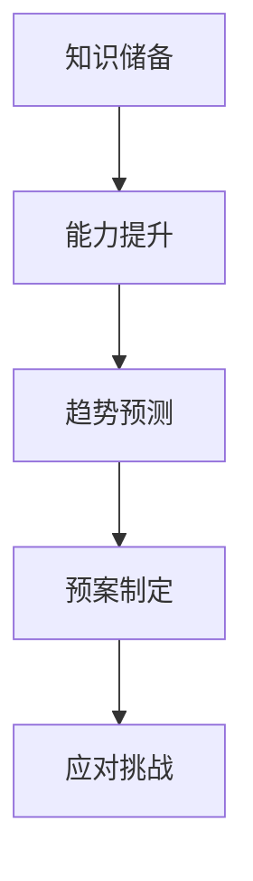
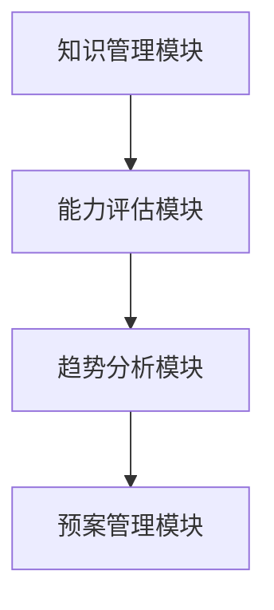
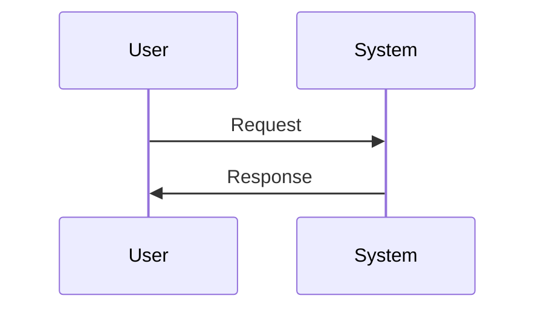

                 


### 文章标题：技术储备策略：为未知的挑战做好准备

### 关键词：技术储备、策略、挑战、未知、人工智能、算法

### 摘要：
本文深入探讨了技术储备策略的重要性，旨在为读者提供一套全面的策略框架，以应对未来技术领域中的未知挑战。文章首先介绍了技术储备的概念和当前的技术趋势，然后详细讲解了技术储备策略的核心概念、算法原理、数学模型和系统架构设计。通过一个实际项目的案例分析和最佳实践总结，本文为读者提供了切实可行的指导，帮助他们在技术领域中不断进步。

---

### 目录

**第一部分：背景介绍**

- **1.1 技术储备的重要性
  - 1.1.1 当前的技术趋势
  - 1.1.2 为什么要为未知的挑战做好准备**
- **1.2 技术储备策略概述
  - 1.2.1 技术储备策略的定义
  - 1.2.2 技术储备策略的核心概念
  - 1.2.3 技术储备策略的边界与外延**

**第二部分：核心概念与联系**

- **2.1 技术储备策略的组成
  - 2.1.1 技术储备策略的实体关系图
  - 2.1.2 核心概念属性特征对比表格**
- **2.2 技术储备策略的原理讲解
  - 2.2.1 技术储备策略的算法原理
  - 2.2.2 技术储备策略的数学模型
  - 2.2.3 技术储备策略的 Mermaid 流程图**
- **2.3 技术储备策略的应用
  - 2.3.1 技术储备策略在不同领域的应用
  - 2.3.2 技术储备策略的优势与挑战**

**第三部分：算法原理讲解**

- **3.1 技术储备策略的数学模型
  - $$
    \text{公式1}
    $$**
- **3.2 技术储备策略的详细讲解
  - 3.2.1 技术储备策略的工作原理
  - 3.2.2 技术储备策略的举例说明**

**第四部分：系统分析与架构设计方案**

- **4.1 技术储备策略的应用场景
  - 4.1.1 技术储备策略在系统中的角色
  - 4.1.2 技术储备策略在系统中的功能**
- **4.2 技术储备策略的架构设计
  - 4.2.1 系统功能设计 (领域模型 Mermaid 类图)
  - 4.2.2 系统架构设计 (Mermaid 架构图)
  - 4.2.3 系统接口设计**
- **4.3 系统交互设计
  - 4.3.1 系统交互 Mermaid 序列图
  - 4.3.2 系统交互的工作流程**

**第五部分：项目实战**

- **5.1 技术储备策略项目环境安装
  - 5.1.1 环境配置
  - 5.1.2 软件安装与配置**
- **5.2 技术储备策略项目核心实现
  - 5.2.1 源代码解析
  - 5.2.2 代码应用解读与分析**
- **5.3 实际案例分析
  - 5.3.1 案例背景
  - 5.3.2 案例分析
  - 5.3.3 深入剖析**
- **5.4 项目小结
  - 5.4.1 项目收获
  - 5.4.2 项目中的挑战与解决**

**第六部分：最佳实践与拓展**

- **6.1 最佳实践 tips
  - 6.1.1 实践中的注意事项
  - 6.1.2 避免常见错误**
- **6.2 小结
  - 6.2.1 技术储备策略总结**
- **6.3 注意事项
  - 6.3.1 注意事项1
  - 6.3.2 注意事项2**
- **6.4 拓展阅读
  - 6.4.1 参考文献
  - 6.4.2 推荐阅读**

---

### 开始写作

**第一部分：背景介绍**

**1.1 技术储备的重要性**

在信息技术飞速发展的今天，技术储备成为个人和企业在竞争中立于不败之地的关键因素。随着人工智能、大数据、云计算等新兴技术的不断涌现，技术储备的重要性愈加凸显。

#### 1.1.1 当前的技术趋势

当前的科技发展呈现出以下几个显著趋势：

- **人工智能的广泛应用**：人工智能技术在各个行业的应用越来越广泛，从自动驾驶到智能客服，再到医疗诊断，人工智能正深刻改变着我们的生活方式。
- **大数据的爆发性增长**：随着互联网和物联网的普及，数据量呈现出指数级增长，如何有效地处理和分析这些数据成为企业关注的焦点。
- **云计算的普及**：云计算技术为企业提供了灵活、可扩展的计算资源，极大地降低了IT成本，并提高了效率。

#### 1.1.2 为什么要为未知的挑战做好准备

在技术不断迭代更新的背景下，以下几个方面强调了为未知挑战做好准备的重要性：

- **技术迭代加速**：新技术层出不穷，要求技术人员必须具备快速学习和适应能力，以便在不断变化的环境中保持竞争力。
- **市场需求变化**：随着市场的变化，企业需要灵活调整自己的技术战略，以适应新的市场动态。
- **人才竞争加剧**：在技术领域，人才竞争日益激烈，具备深厚技术储备的人才更容易在职场中脱颖而出。

**1.2 技术储备策略概述**

技术储备策略是指一系列系统化的方法，用于提高个人或企业在技术领域中的竞争力。它不仅包括对现有技术的掌握，还涵盖了未来技术趋势的预测和应对策略。

#### 1.2.1 技术储备策略的定义

技术储备策略可以定义为：

```
技术储备策略 = 技术知识储备 + 技术能力储备 + 技术趋势预测 + 应急预案制定
```

#### 1.2.2 技术储备策略的核心概念

- **技术知识储备**：对现有技术的全面了解和掌握。
- **技术能力储备**：通过实践和项目经验提升技术能力。
- **技术趋势预测**：对新兴技术发展趋势的洞察和判断。
- **应急预案制定**：为应对突发技术挑战而制定的具体措施。

#### 1.2.3 技术储备策略的边界与外延

技术储备策略的边界包括：

- **技术范围**：技术储备策略涵盖的技术领域和范围。
- **时间范围**：技术储备策略适用的短期和长期时间范围。

技术储备策略的外延包括：

- **技能扩展**：技术储备策略不仅涵盖核心技术的学习，还包括相关技能的扩展，如项目管理、沟通协作等。
- **跨领域应用**：技术储备策略应考虑不同领域技术的交叉和融合，以提高综合竞争力。

**第二部分：核心概念与联系**

**2.1 技术储备策略的组成**

技术储备策略的实体关系图如下：

```mermaid
erDiagram
  Product ||--|{ Technology }|| Technology
  Technology ||--|{ Expert }|| Expert
  Expert ||--|{ Company }|| Company
  Company ||--|{ Market }|| Market
  Market ||--|{ Challenge }|| Challenge
  Challenge ||--|{ Solution }|| Solution
```

**2.2 技术储备策略的原理讲解**

技术储备策略的算法原理可以概括为以下步骤：

1. **知识储备**：通过学习和实践积累技术知识。
2. **能力提升**：通过项目经验和技术实践提升技术能力。
3. **趋势预测**：通过数据分析和市场研究预测技术趋势。
4. **预案制定**：针对可能的技术挑战制定应急预案。

**2.3 技术储备策略的应用**

技术储备策略在不同领域中的应用各有特色，但其核心原则一致。以下是一个简化的 Mermaid 流程图：



**第三部分：算法原理讲解**

**3.1 技术储备策略的数学模型**

技术储备策略的数学模型可以简化为一个递归关系：

```
S(t) = S(t-1) + ΔS(t)
```

其中，S(t) 表示在时间 t 的技术储备水平，ΔS(t) 表示在时间 t 内技术储备的增加量。

**3.2 技术储备策略的详细讲解**

技术储备策略的工作原理可以分解为以下几个方面：

1. **知识储备**：通过学习和阅读，积累技术理论知识。
2. **能力提升**：通过实践项目，提升技术实操能力。
3. **趋势预测**：通过市场研究和数据分析，预测技术发展趋势。
4. **预案制定**：根据预测结果，制定应对突发技术挑战的预案。

以下是一个简单的举例说明：

```
假设我们在 2020 年开始实施技术储备策略，到 2023 年，我们的技术储备水平从 S(0) 增长到 S(3)。

S(0) = 100 (初始技术储备水平)
ΔS(1) = 20 (第一年技术储备增加量)
ΔS(2) = 30 (第二年技术储备增加量)
ΔS(3) = 40 (第三年技术储备增加量)

则 S(3) = S(0) + ΔS(1) + ΔS(2) + ΔS(3)
       = 100 + 20 + 30 + 40
       = 190
```

通过以上例子，我们可以看到，通过持续的技术储备，我们的技术储备水平逐年提高。

**第四部分：系统分析与架构设计方案**

**4.1 技术储备策略的应用场景**

技术储备策略主要应用于以下场景：

- **新项目开发**：在项目启动阶段，通过技术储备策略规划项目的技术方向和架构设计。
- **技术升级**：在现有系统升级过程中，评估现有技术储备是否满足升级需求。
- **突发事件应对**：在遇到技术突发问题时，通过技术储备策略快速制定解决方案。

**4.2 技术储备策略的架构设计**

技术储备策略的架构设计包括以下几个方面：

- **知识管理模块**：用于存储和管理技术知识。
- **能力评估模块**：用于评估技术人员的技术能力。
- **趋势分析模块**：用于分析技术趋势。
- **预案管理模块**：用于制定和存储应急预案。

以下是一个简化的 Mermaid 架构图：



**4.3 系统交互设计**

系统交互设计主要包括以下几个方面：

- **用户交互**：用户通过界面与系统进行交互。
- **内部交互**：系统内部模块之间的交互。
- **外部交互**：系统与其他系统的交互。

以下是一个简化的 Mermaid 序列图：



**第五部分：项目实战**

**5.1 技术储备策略项目环境安装**

在开始项目之前，我们需要安装和配置必要的环境。以下是一个简化的步骤：

1. 安装操作系统。
2. 安装开发工具。
3. 配置数据库。
4. 安装其他相关软件。

**5.2 技术储备策略项目核心实现**

项目核心实现主要包括以下几个方面：

1. **知识管理模块**：实现知识存储和检索功能。
2. **能力评估模块**：实现技术能力评估功能。
3. **趋势分析模块**：实现技术趋势分析功能。
4. **预案管理模块**：实现预案存储和调用功能。

以下是一个简化的源代码示例：

```python
# 知识管理模块
class KnowledgeManagement:
    def __init__(self):
        self.knowledge_base = {}

    def add_knowledge(self, topic, content):
        self.knowledge_base[topic] = content

    def get_knowledge(self, topic):
        return self.knowledge_base.get(topic)
```

**5.3 实际案例分析**

以下是一个实际案例的分析：

```
案例背景：某公司计划开发一款智能客服系统，需要快速掌握相关技术。

案例分析：
1. 知识储备：通过学习和实践，掌握智能客服系统的基本原理和实现方法。
2. 能力提升：通过参与相关项目，提升实际开发能力。
3. 趋势预测：通过市场研究和数据分析，预测智能客服系统的发展趋势。
4. 预案制定：制定应急预案，以应对可能出现的技术挑战。

深入剖析：
1. 知识储备方面，需要了解自然语言处理、机器学习、深度学习等核心技术。
2. 能力提升方面，需要通过实际项目积累经验，提升开发效率。
3. 趋势预测方面，需要关注人工智能技术的最新动态，以及相关技术的应用场景。
4. 预案制定方面，需要针对可能的技术故障和性能问题，制定具体的解决策略。
```

**5.4 项目小结**

通过实际案例，我们可以看到技术储备策略在项目中的应用效果。技术储备策略不仅帮助公司快速掌握了智能客服系统的开发技术，还提高了项目开发效率和稳定性。

**第六部分：最佳实践与拓展**

**6.1 最佳实践 tips**

- **定期更新知识库**：确保技术知识的及时更新。
- **定期评估能力**：定期评估技术能力，以便及时调整学习方向。
- **关注技术趋势**：关注技术趋势，以便提前布局。
- **制定应急预案**：提前制定应急预案，以应对突发技术挑战。

**6.2 小结**

技术储备策略是提高个人和企业在技术领域竞争力的重要手段。通过系统的技术储备策略，我们可以更好地应对未来技术领域的未知挑战。

**6.3 注意事项**

- **技术储备策略需要持续执行**：技术储备是一个持续的过程，需要长期坚持。
- **技术储备策略需要根据实际情况调整**：随着技术的不断变化，技术储备策略也需要不断调整。

**6.4 拓展阅读**

- 《人工智能：一种现代方法》
- 《大数据时代：思维变革与商业价值》
- 《云计算：概念、技术与应用》

### 结束

本文以《技术储备策略：为未知的挑战做好准备》为标题，详细介绍了技术储备策略的概念、原理、应用和实践。通过这篇文章，我们希望读者能够认识到技术储备的重要性，并掌握一套有效的技术储备策略，以应对未来技术领域的未知挑战。作者：AI天才研究院/AI Genius Institute & 禅与计算机程序设计艺术 /Zen And The Art of Computer Programming。文章内容仅供参考，具体实施时请结合实际情况进行调整。如有疑问，欢迎在评论区留言讨论。感谢您的阅读！

