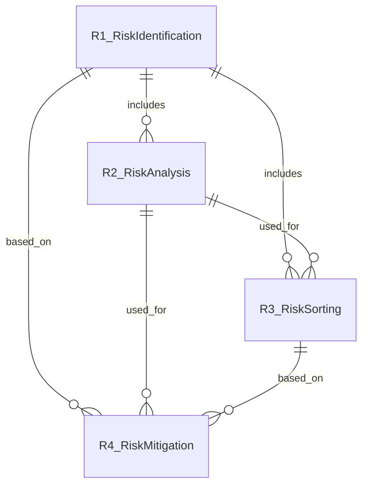

                 


# 技术决策中的风险评估

## 关键词：技术决策、风险评估、风险类型、量化方法、风险管理策略

> 技术决策中的风险评估是一个至关重要的环节，它关乎项目的成功与否。在这篇文章中，我们将深入探讨技术决策中的风险评估，帮助读者更好地理解和应对各种技术风险。

## 摘要

技术决策中的风险评估是一项复杂而关键的工作，它要求决策者对潜在的技术风险进行全面的识别、评估和管理。本文将详细介绍风险评估的基础知识，包括核心概念、原则和方法；分析不同类型的技术风险及其特征；介绍量化风险的方法和工具；探讨具体技术决策中的风险评估实践；提出有效的风险管理策略；讨论风险沟通与报告的方法；探讨法律与合规性在风险评估中的作用；以及展望技术决策与风险评估的未来趋势。希望通过这篇文章，读者能够对技术决策中的风险评估有更深入的理解，并掌握有效的应对策略。

## 目录

1. 引言
   1.1 技术决策与风险评估
   1.2 风险评估的重要性
   1.3 本书结构

2. 风险评估基础
   2.1 风险定义与分类
   2.2 风险评估原则
   2.3 风险评估方法与流程

3. 技术风险类型
   3.1 技术风险的分类
   3.2 技术风险的特性
   3.3 常见技术风险的案例分析

4. 风险评估工具和技术
   4.1 量化风险的方法
   4.2 风险评估工具介绍
   4.3 风险评估工具的实际应用

5. 案例分析
   5.1 案例一：云计算项目风险评估
   5.2 案例二：物联网项目风险评估
   5.3 案例三：人工智能项目风险评估

6. 风险管理策略
   6.1 风险管理策略概述
   6.2 风险应对策略
   6.3 风险管理策略实施

7. 风险沟通与报告
   7.1 风险沟通的重要性
   7.2 风险报告的内容与格式
   7.3 风险报告的沟通技巧

8. 法律与合规性
   8.1 风险评估的法律要求
   8.2 合规性在风险评估中的作用
   8.3 法律与合规性案例分析

9. 技术决策与风险评估的未来趋势
   9.1 新技术研究
   9.2 风险评估方法的发展
   9.3 未来挑战与机遇

10. 结论
    10.1 技术决策中的风险评估总结
    10.2 风险管理的重要性
    10.3 展望未来

## 引言

### 1.1 技术决策与风险评估

技术决策是指在项目管理过程中，针对项目的技术实现方案、技术路线、技术标准等方面进行选择的过程。技术决策的目的是确保项目能够高效、优质地完成，同时满足业务需求和技术要求。技术决策的制定通常涉及多个因素，包括技术可行性、成本、时间、团队能力等。

然而，在技术决策的过程中，风险是不可避免的。技术风险可能来源于技术的不确定性、技术实现的复杂性、外部环境的变化等多方面因素。这些风险可能会导致项目延期、成本超支、质量不达标等问题，甚至可能导致项目的失败。因此，对技术决策中的风险进行评估和管理，成为技术决策过程中至关重要的一环。

风险评估是指通过对潜在的技术风险进行识别、分析和评估，确定其可能对项目带来的影响和严重程度，并采取相应的管理措施的过程。风险评估的目的是为了降低技术风险对项目的负面影响，确保项目的顺利进行。

### 1.2 风险评估的重要性

风险评估在技术决策中具有至关重要的地位，主要体现在以下几个方面：

1. **预防性**：通过风险评估，可以提前发现潜在的技术风险，并采取预防措施，降低风险发生的概率。这有助于避免项目在后期出现严重问题，确保项目按计划进行。

2. **指导性**：风险评估结果可以为技术决策提供重要的参考依据。通过分析评估结果，决策者可以更加清晰地了解项目的风险状况，从而制定更加合理的技术决策。

3. **经济性**：风险评估有助于优化资源配置，降低项目成本。通过对风险的识别和评估，可以确定哪些方面需要重点投入，从而避免不必要的资源浪费。

4. **可控性**：风险评估有助于提高项目的可控性。通过制定风险管理策略，可以及时应对技术风险，确保项目目标的实现。

5. **可持续性**：风险评估有助于提高项目的可持续性。通过对风险的持续监控和管理，可以确保项目在长期运行中保持稳定和高效。

总之，风险评估是技术决策过程中不可或缺的一环。它不仅有助于降低项目风险，提高项目成功率，还能够为企业的长期发展提供重要支持。

### 1.3 本书结构

本书将分为以下几个部分：

1. **风险评估基础**：介绍风险评估的基本概念、原则、方法和流程。
2. **技术风险类型**：分析不同类型的技术风险及其特征。
3. **风险评估工具和技术**：介绍量化风险的方法和工具。
4. **案例分析**：通过具体案例，展示风险评估在技术决策中的应用。
5. **风险管理策略**：讨论如何制定和实施有效的风险管理策略。
6. **风险沟通与报告**：探讨风险沟通与报告的方法和技巧。
7. **法律与合规性**：分析风险评估过程中的法律和合规要求。
8. **技术决策与风险评估的未来趋势**：展望技术决策与风险评估的发展方向。
9. **结论**：总结本书的主要内容，强调风险评估的重要性。

通过以上结构，本书旨在为技术决策者提供全面、系统的风险评估指导，帮助他们在技术决策过程中更好地应对风险，确保项目的成功实施。

## 风险评估基础

### 2.1 风险定义与分类

风险评估的基础在于对风险的准确识别和分类。首先，我们需要明确什么是风险。风险可以被定义为“不确定的事件或情况，可能对项目目标产生负面影响”。在技术决策过程中，风险通常包括技术实现风险、项目进度风险、成本风险、团队风险等多个方面。

**技术实现风险**：这类风险主要涉及技术方案的可行性、技术实现的复杂性、技术人员的技能水平等。例如，一个复杂的算法实现可能因为开发人员的技能不足而导致延迟或失败。

**项目进度风险**：这类风险与项目的时间安排相关，包括任务延期、依赖关系链中断等。例如，某个关键模块的开发进度落后，可能会导致整个项目的延期。

**成本风险**：这类风险关注项目预算的合理性，包括预算超支、资源浪费等。例如，采购成本过高或资源分配不当，可能导致项目成本超支。

**团队风险**：这类风险与项目团队的能力、协作和沟通相关。例如，团队成员的流失或沟通不畅，可能会导致项目进度受阻。

### 2.2 风险评估原则

为了确保风险评估的有效性，需要遵循以下原则：

1. **全面性**：风险评估应该覆盖所有可能的风险因素，确保没有遗漏。
2. **客观性**：评估过程应基于客观的数据和事实，避免主观判断。
3. **系统性**：风险评估应考虑项目各个环节的风险，确保全面性。
4. **动态性**：风险评估是一个持续的过程，应随着项目进展不断更新和调整。
5. **可操作性**：评估结果应具有可操作性，为风险管理提供具体的指导。

### 2.3 风险评估方法与流程

风险评估通常包括以下几个步骤：

1. **风险识别**：通过调查、访谈、文献分析等方法，识别项目中的潜在风险。
2. **风险分析**：对识别出的风险进行定量和定性分析，评估其发生概率和影响程度。
3. **风险排序**：根据评估结果，对风险进行排序，确定优先级。
4. **风险应对**：制定相应的风险应对措施，包括风险规避、风险减轻、风险转移等。
5. **风险监控**：在项目执行过程中，持续监控风险状态，并根据实际情况调整风险应对策略。

在实际操作中，常用的风险评估方法包括定性的风险识别和评估方法（如专家评估法、故障模式与影响分析等）和定量的风险识别和评估方法（如蒙特卡罗模拟、敏感性分析等）。此外，还可以结合多种方法，以提高风险评估的准确性。

通过以上步骤和方法，技术决策者可以更加系统地识别和管理项目中的技术风险，为项目的顺利实施提供坚实保障。

### 2.4 风险评估的核心概念和联系

在深入了解风险评估的具体步骤和方法之前，我们需要明确一些核心概念，并探讨它们之间的关系。以下是一个核心概念属性特征对比表格，用于直观地展示这些概念及其联系。

| 概念         | 定义                                                         | 属性特征                                                                                          |
|------------|--------------------------------------------------------------|------------------------------------------------------------------------------------------------|
| 风险识别     | 通过调查、访谈等方法识别项目中的潜在风险。                                             | - 全面性<br>- 客观性<br>- 系统性                                                                 |
| 风险分析     | 对识别出的风险进行定量和定性分析，评估其发生概率和影响程度。                       | - 客观性<br>- 动态性<br>- 可操作性                                                                 |
| 风险排序     | 根据评估结果，对风险进行排序，确定优先级。                                             | - 全面性<br>- 动态性<br>- 可操作性                                                                 |
| 风险应对     | 制定相应的风险应对措施，包括风险规避、风险减轻、风险转移等。                       | - 全面性<br>- 动态性<br>- 可操作性                                                                 |
| 风险监控     | 在项目执行过程中，持续监控风险状态，并根据实际情况调整风险应对策略。               | - 客观性<br>- 动态性<br>- 可操作性                                                                 |

**ER实体关系图架构**：

为了进一步展示这些核心概念之间的联系，我们可以使用ER（Entity-Relationship）实体关系图来描述风险评估过程中的主要实体及其关系。



在这个ER图中，我们定义了四个主要实体：`RiskIdentification`（风险识别）、`RiskAnalysis`（风险分析）、`RiskSorting`（风险排序）和`RiskMitigation`（风险应对）。这些实体之间存在明确的关联关系：

- 风险识别包括风险分析和风险排序。
- 风险识别是基于风险应对。
- 风险分析用于风险排序和风险应对。
- 风险排序是基于风险应对。

通过这个实体关系图，我们可以更直观地理解风险评估过程中的各个步骤及其相互关系，有助于进一步深化对风险评估机制的理解。

### 2.5 风险评估方法的详细讲解

在技术决策过程中，风险评估方法是识别和管理风险的关键。以下是几种常用的风险评估方法，以及它们的具体应用和解释。

#### 2.5.1 专家评估法

专家评估法是一种定性的风险评估方法，主要通过专家的意见和经验来识别和评估风险。具体步骤如下：

1. **确定评估团队**：选择具有相关领域知识和经验的专家，组成评估团队。
2. **收集信息**：通过访谈、问卷调查等方式，收集项目相关的信息。
3. **评估风险**：专家根据收集到的信息，对潜在风险进行评估，包括风险的发生概率和影响程度。
4. **形成评估报告**：将评估结果整理成报告，供决策者参考。

**优点**：专家评估法能够快速识别风险，且成本较低。

**缺点**：评估结果可能受到专家主观判断的影响，缺乏客观性。

**应用场景**：适用于风险不确定性强、技术复杂度较低的项目。

#### 2.5.2 故障模式与影响分析（FMEA）

故障模式与影响分析是一种定量的风险评估方法，主要用于识别和评估产品或系统的潜在故障模式及其影响。具体步骤如下：

1. **确定分析对象**：选择需要评估的产品或系统。
2. **列出故障模式**：识别可能发生的故障模式。
3. **评估故障模式的影响程度**：对每个故障模式进行影响程度评估，包括对性能、安全、成本等方面的影响。
4. **计算风险优先级**：使用风险优先数（RPN）计算每个故障模式的风险优先级，公式为：RPN = 故障模式发生概率 × 影响程度 × 严重性。
5. **制定改进措施**：针对高优先级的风险，制定改进措施。

**优点**：FMEA方法能够系统地识别和评估风险，适用于复杂系统的风险评估。

**缺点**：需要大量时间和资源进行详细分析。

**应用场景**：适用于产品开发、系统设计等阶段。

#### 2.5.3 蒙特卡罗模拟

蒙特卡罗模拟是一种定量的风险评估方法，通过模拟随机过程来评估风险。具体步骤如下：

1. **建立模型**：根据项目特点，建立风险评估模型。
2. **随机数生成**：使用随机数生成器，生成随机样本。
3. **模拟计算**：对模型进行大量模拟计算，分析风险变量的分布和概率。
4. **结果分析**：根据模拟结果，评估风险的发生概率和影响程度。

**优点**：蒙特卡罗模拟能够提供直观的风险分析结果，适用于不确定性强、变量复杂的项目。

**缺点**：计算复杂度高，对计算资源和时间要求较高。

**应用场景**：适用于金融风险评估、工程项目评估等。

#### 2.5.4 敏感性分析

敏感性分析是一种评估风险变量对项目目标影响程度的方法。具体步骤如下：

1. **确定目标**：明确项目目标，如成本、进度、性能等。
2. **识别关键变量**：识别对项目目标影响较大的变量。
3. **设置变量范围**：为每个关键变量设置合理的取值范围。
4. **计算敏感性指标**：计算每个关键变量的敏感性指标，公式为：敏感性指标 = 变量变化量 / 目标变化量。
5. **结果分析**：根据敏感性指标，评估关键变量对项目目标的影响程度。

**优点**：敏感性分析能够直观地展示关键变量对项目目标的影响，有助于优化决策。

**缺点**：需要大量数据和计算。

**应用场景**：适用于项目预算管理、进度控制等。

通过以上几种风险评估方法，技术决策者可以根据项目的具体情况选择合适的方法，进行全面、系统的风险评估，确保项目顺利实施。

### 2.6 风险评估工具的详细讲解

在技术决策过程中，选择合适的工具对风险进行评估和管理至关重要。以下将介绍几种常用的风险评估工具，并详细讲解它们的使用方法。

#### 2.6.1 风险矩阵

风险矩阵是一种简单的风险评估工具，通过表格形式展示风险的概率和影响程度，从而确定风险优先级。以下是风险矩阵的构建步骤：

1. **定义风险**：列出项目中的所有潜在风险。
2. **评估风险概率**：对每个风险的发生概率进行评估，通常采用从0（不可能发生）到5（几乎肯定发生）的尺度。
3. **评估风险影响**：对每个风险的影响程度进行评估，同样采用从0到5的尺度。
4. **构建矩阵**：将风险概率和影响程度分别填入表格的行和列，交叉点即为风险评分。
5. **计算风险优先级**：通过乘以风险概率和影响程度，计算每个风险的得分，得分越高，风险优先级越高。

**优点**：风险矩阵直观易懂，便于快速识别和评估高风险。

**缺点**：仅适用于简单的风险评估，无法处理复杂的风险变量。

**使用示例**：

| 风险           | 概率（1-5） | 影响程度（1-5） | 得分 |
|--------------|----------|--------------|----|
| 成本超支       | 3        | 4            | 12 |
| 项目延期       | 2        | 3            | 6  |
| 技术实现失败   | 4        | 5            | 20 |
| 人员流失       | 3        | 2            | 6  |

在上述示例中，技术实现失败得分最高，因此具有最高的风险优先级。

#### 2.6.2 故障树分析（FTA）

故障树分析是一种定量的风险评估方法，通过构建故障树模型来识别和评估风险。以下是故障树分析的基本步骤：

1. **定义事件**：确定需要分析的风险事件，如系统故障。
2. **构建故障树**：从顶层事件开始，向下分解成子事件，并标注每个子事件的发生概率。
3. **计算事件概率**：通过计算故障树中各事件的发生概率，得到风险事件的总概率。
4. **分析故障树**：通过故障树分析，识别关键故障模式和路径，确定优先级。

**优点**：故障树分析能够详细地展示风险事件及其相互关系，适用于复杂系统的风险评估。

**缺点**：构建故障树需要大量时间和专业知识。

**使用示例**：

假设我们需要分析一个系统故障，故障树如下：

```
系统故障
|
├── 硬件故障
│   |
│   └── 存储器损坏
│
└── 软件故障
    |
    └── 编译错误
```

每个子事件的发生概率已知，例如，存储器损坏的概率为0.1，编译错误为0.05。通过计算，可以确定系统故障的总概率。

#### 2.6.3 蒙特卡罗模拟（Monte Carlo Simulation）

蒙特卡罗模拟是一种基于概率的定量风险评估方法，通过模拟大量随机样本来评估风险变量的分布和概率。以下是蒙特卡罗模拟的基本步骤：

1. **建立模型**：根据项目特点，建立风险评估模型。
2. **定义随机变量**：确定模型中的关键随机变量。
3. **生成随机样本**：使用随机数生成器生成大量随机样本。
4. **模拟计算**：对模型进行大量模拟计算，分析风险变量的分布和概率。
5. **结果分析**：根据模拟结果，评估风险的发生概率和影响程度。

**优点**：蒙特卡罗模拟能够提供直观的风险分析结果，适用于不确定性强、变量复杂的项目。

**缺点**：计算复杂度高，对计算资源和时间要求较高。

**使用示例**：

假设我们需要评估一个项目成本的概率分布，已知项目的成本由两部分组成：固定成本和变动成本。固定成本为100万元，变动成本服从正态分布，均值为50万元，标准差为10万元。通过蒙特卡罗模拟，可以生成大量变动成本样本，并计算总成本的概率分布。

#### 2.6.4 数据分析工具

数据分析工具如Excel、R语言等，也可以用于风险评估。以下是使用Excel进行风险评估的步骤：

1. **输入数据**：将风险数据输入Excel，包括概率、影响程度、得分等。
2. **计算得分**：使用公式计算每个风险的总得分。
3. **排序风险**：根据得分对风险进行排序。
4. **分析结果**：使用Excel的图表功能，直观地展示风险分析结果。

**优点**：Excel易于操作，适用于简单的风险评估。

**缺点**：功能有限，无法处理复杂的风险变量。

通过上述风险评估工具，技术决策者可以根据项目的具体情况选择合适的工具，进行全面的、系统的风险评估，从而更好地管理技术风险。

### 3. 案例分析

#### 3.1 云计算项目风险评估

云计算项目是一种复杂的技术项目，涉及多个方面的风险。以下是对一个云计算项目进行风险评估的案例分析。

**背景**：

一家企业计划开发一套基于云计算的ERP系统，项目预计为期一年，预算为500万元。项目涉及的技术包括虚拟化、容器化、云存储等。

**风险识别**：

1. **技术实现风险**：由于云计算技术复杂，开发团队可能缺乏相关经验，导致技术实现难度增加。
2. **成本风险**：项目预算可能因各种原因（如需求变更、技术难题等）而超支。
3. **进度风险**：项目延期可能导致企业失去市场机会。
4. **团队风险**：团队成员的技能水平和稳定性可能影响项目进度和质量。

**风险评估**：

使用风险矩阵对风险进行评估：

| 风险           | 概率（1-5） | 影响程度（1-5） | 得分 |
|--------------|----------|--------------|----|
| 技术实现风险   | 3        | 4            | 12 |
| 成本风险       | 4        | 3            | 12 |
| 进度风险       | 4        | 5            | 20 |
| 团队风险       | 3        | 3            | 9  |

**风险应对**：

1. **技术实现风险**：引入具有云计算开发经验的专家，提供技术指导和培训。
2. **成本风险**：制定详细的预算计划，并设立应急预算，以应对可能的需求变更和额外费用。
3. **进度风险**：制定严密的进度计划，并设立里程碑，定期评估项目进度，确保按时交付。
4. **团队风险**：加强团队成员的技能培训，提高团队稳定性，设立备用人员，以应对人员流失。

通过以上风险应对措施，云计算项目的风险得到了有效管理，确保项目顺利实施。

#### 3.2 物联网项目风险评估

物联网（IoT）项目涉及多个技术领域，风险因素更加复杂。以下是对一个物联网项目进行风险评估的案例分析。

**背景**：

一家企业计划开发一款智能家居系统，包括智能灯泡、智能插座、智能门锁等设备。项目预计为期半年，预算为300万元。

**风险识别**：

1. **技术实现风险**：物联网设备需要具备高度的安全性和稳定性，开发团队可能缺乏相关经验。
2. **数据隐私风险**：智能家居系统涉及用户隐私数据，可能面临数据泄露的风险。
3. **设备兼容性风险**：不同品牌和型号的设备可能存在兼容性问题。
4. **用户接受度风险**：智能家居产品的用户体验和接受度可能影响项目的市场推广。

**风险评估**：

使用蒙特卡罗模拟对风险进行评估：

- 技术实现风险的概率为0.3，影响程度为4，得分为12。
- 数据隐私风险的概率为0.2，影响程度为5，得分为10。
- 设备兼容性风险的概率为0.4，影响程度为3，得分为12。
- 用户接受度风险的概率为0.5，影响程度为2，得分为10。

**风险应对**：

1. **技术实现风险**：引入有经验的物联网开发团队，提供技术培训和指导。
2. **数据隐私风险**：采用高级加密技术，确保用户数据安全。
3. **设备兼容性风险**：制定详细的设备兼容性测试计划，确保不同设备之间的兼容性。
4. **用户接受度风险**：进行用户调研，了解用户需求，优化产品设计，提高用户体验。

通过以上风险应对措施，物联网项目的风险得到了有效控制，确保项目顺利进行。

#### 3.3 人工智能项目风险评估

人工智能（AI）项目具有高度的技术复杂性和不确定性，以下是对一个AI项目进行风险评估的案例分析。

**背景**：

一家科技公司计划开发一款基于深度学习的人脸识别系统，项目预计为期一年，预算为800万元。

**风险识别**：

1. **技术实现风险**：深度学习模型复杂，训练和优化过程可能耗费大量时间和资源。
2. **数据质量风险**：人脸识别系统需要高质量的数据集进行训练，数据质量可能影响模型性能。
3. **算法公平性风险**：人脸识别算法可能存在歧视和偏见问题，影响项目的公平性和合法性。
4. **市场接受度风险**：市场对新型人脸识别技术的接受度可能影响项目的市场推广。

**风险评估**：

使用敏感性分析对风险进行评估：

- 技术实现风险对项目成本的影响为30%。
- 数据质量风险对模型性能的影响为40%。
- 算法公平性风险对项目合法性的影响为50%。
- 市场接受度风险对项目推广的影响为60%。

**风险应对**：

1. **技术实现风险**：引入经验丰富的AI开发团队，制定详细的开发计划和资源分配方案。
2. **数据质量风险**：采用多种数据采集和处理方法，确保数据质量。
3. **算法公平性风险**：采用多种算法和策略，减少歧视和偏见问题，确保算法的公平性。
4. **市场接受度风险**：进行市场调研，了解用户需求和竞争对手情况，制定相应的市场推广策略。

通过以上风险应对措施，AI项目的风险得到了有效控制，确保项目成功实施。

通过以上案例分析，我们可以看到，不同类型的技术项目在风险评估方面存在差异，但核心方法是一致的，即识别风险、评估风险、制定风险应对措施。通过科学的评估和管理，技术项目可以更好地应对各种风险，确保项目的成功实施。

### 3. 风险管理策略

在技术决策过程中，制定和实施有效的风险管理策略是确保项目成功的关键。以下将讨论风险管理策略的概述、风险应对策略以及实施过程中的关键步骤。

#### 3.1 风险管理策略概述

风险管理策略是一种系统性的方法，用于识别、评估、应对和管理项目中的风险。有效的风险管理策略可以帮助项目团队提前识别潜在风险，制定应对措施，降低风险对项目的负面影响。以下是风险管理策略的基本组成部分：

1. **风险识别**：通过调查、访谈、文档分析等方法，识别项目中的潜在风险。
2. **风险评估**：对识别出的风险进行定性或定量分析，评估其发生概率和影响程度。
3. **风险排序**：根据评估结果，对风险进行排序，确定优先级。
4. **风险应对**：制定相应的风险应对措施，包括风险规避、减轻、转移等。
5. **风险监控**：在项目执行过程中，持续监控风险状态，并根据实际情况调整风险应对策略。

#### 3.2 风险应对策略

风险应对策略是指针对识别出的风险，制定具体的应对措施，以降低风险发生的概率或减轻其影响。常见的风险应对策略包括：

1. **风险规避**：通过修改项目计划或技术方案，避免风险发生。例如，选择一个风险较低的技术方案。
2. **风险减轻**：通过改进技术方案、加强项目管理等方法，降低风险发生的概率或减轻其影响。例如，增加冗余设计，提高系统的可靠性。
3. **风险转移**：将风险转移给第三方，如通过保险、外包等方式。例如，购买保险以减轻因不可抗力因素造成的损失。
4. **风险接受**：对无法规避或转移的风险，接受其存在的可能性，并制定相应的应急计划。例如，为项目延期制定应急方案。

#### 3.3 实施风险管理策略的关键步骤

1. **制定风险管理计划**：在项目启动阶段，制定详细的风险管理计划，包括风险识别、评估、应对和监控的具体步骤和方法。

2. **培训和管理团队**：确保项目团队成员了解风险管理策略和具体实施方法，提高团队的风险意识和应对能力。

3. **实施风险识别**：通过访谈、调查问卷、文档分析等方法，全面识别项目中的潜在风险。

4. **进行风险评估**：根据风险识别的结果，对风险进行定量或定性评估，确定其发生概率和影响程度。

5. **制定风险应对措施**：针对高风险，制定具体的应对措施，如风险规避、减轻或转移。对于低风险，制定应急计划。

6. **实施风险应对措施**：根据风险管理计划，实施具体的风险应对措施，确保项目按计划进行。

7. **监控风险状态**：在项目执行过程中，持续监控风险状态，及时调整风险应对策略。

8. **总结和反思**：项目结束后，对风险管理过程进行总结和反思，识别成功的经验和方法，改进不足之处，为未来的项目提供参考。

通过以上步骤，技术决策者可以制定和实施有效的风险管理策略，确保项目在面临各种风险时能够应对自如，顺利实现项目目标。

### 3.4 风险沟通与报告

在技术决策过程中，有效的风险沟通和报告是确保项目顺利进行的关键环节。通过有效的沟通和报告，项目团队成员可以及时了解风险状况，共同应对风险，确保项目的成功实施。

#### 3.4.1 风险沟通的重要性

风险沟通是风险管理的重要组成部分，其重要性体现在以下几个方面：

1. **增强风险意识**：通过风险沟通，项目团队成员可以了解项目中的潜在风险，提高对风险的敏感度和应对能力。
2. **促进团队协作**：有效的风险沟通可以促进团队成员之间的协作，共同制定和实施风险应对措施。
3. **降低误解和冲突**：通过及时沟通，可以减少因信息不对称导致的误解和冲突，确保项目团队的凝聚力。
4. **提高决策效率**：风险沟通有助于项目管理者及时获取风险信息，做出更加科学的决策。

#### 3.4.2 风险报告的内容与格式

风险报告是风险沟通的重要载体，其内容与格式应当清晰、简洁、易于理解。以下是风险报告的主要内容：

1. **标题**：明确报告的主题，如“项目风险报告”。
2. **摘要**：简要介绍报告的主要内容、风险状况和应对措施。
3. **风险概述**：对项目中的主要风险进行概述，包括风险类型、发生概率和影响程度。
4. **风险分析**：详细分析每个风险的识别、评估和排序结果。
5. **风险应对措施**：针对每个风险，提出具体的应对措施，包括规避、减轻、转移等。
6. **风险监控计划**：描述如何监控风险状态，以及风险状态发生变更时的应对措施。
7. **附件**：提供与风险相关的数据、图表、文档等补充材料。

风险报告的格式可以采用文本、图表、列表等多种形式，以确保信息的清晰和易懂。

#### 3.4.3 风险报告的沟通技巧

有效的风险沟通需要遵循一定的技巧：

1. **明确目标**：在沟通前明确目标，确保沟通内容针对性和有效性。
2. **简明扼要**：避免冗长的报告，突出重点信息，使用图表和清单等直观形式展示数据。
3. **积极倾听**：在沟通过程中，认真倾听其他成员的意见和建议，促进双向沟通。
4. **及时反馈**：在收到风险报告后，及时给予反馈，提出意见和建议，确保报告内容的准确性和完整性。
5. **保持透明**：保持沟通的透明度，确保所有团队成员都能了解风险状况和应对措施。

通过以上沟通技巧，项目团队成员可以更好地理解风险，共同应对风险，确保项目的顺利实施。

### 3.5 法律与合规性

在技术决策过程中，法律和合规性是不可或缺的考量因素。合理的法律框架和合规性要求有助于确保项目的合法性和风险可控性。

#### 3.5.1 风险评估的法律要求

1. **数据保护法**：随着数据隐私问题日益突出，许多国家和地区都制定了数据保护法，如欧盟的《通用数据保护条例》（GDPR）。这些法律要求企业在数据处理过程中必须确保数据的安全性和隐私性，对违反规定的个人和企业进行处罚。
2. **行业规范**：不同行业有不同的合规性要求，如金融行业的《金融服务现代化法》、医疗行业的《健康保险可携性和责任法案》等。企业在项目实施过程中必须遵守相关行业规范，确保项目符合法律要求。
3. **合同法**：合同法是技术决策过程中的重要法律依据，它规定了合同各方之间的权利和义务。在项目合同中，应明确风险分担、责任界定等内容，以降低法律风险。

#### 3.5.2 合规性在风险评估中的作用

1. **指导风险评估**：合规性要求为风险评估提供了明确的方向，帮助决策者识别和评估合规风险，确保项目在法律框架内进行。
2. **制定风险管理策略**：合规性要求是制定风险管理策略的重要依据，企业在制定风险管理策略时，必须考虑合规性要求，确保风险应对措施符合法律要求。
3. **提高风险管理能力**：合规性要求促使企业不断提高风险管理能力，建立健全的风险管理体系，降低法律风险和合规风险。

#### 3.5.3 法律与合规性案例分析

以一家金融科技企业为例，其正在开发一款移动支付应用程序。以下是对其风险评估过程中法律和合规性要求的分析：

1. **数据保护法**：该企业必须确保用户数据的收集、存储和处理符合GDPR的要求，包括用户同意、数据加密、用户访问控制等。
2. **合同法**：在项目合同中，应明确各方在数据安全和隐私保护方面的责任，如数据泄露时的责任承担。
3. **行业规范**：《金融服务现代化法》要求金融科技企业确保支付系统的安全性和可靠性，防止欺诈和洗钱行为。

通过上述法律和合规性要求的分析，企业可以更好地识别和管理合规风险，确保项目的合法性和成功实施。

### 3.6 技术决策与风险评估的未来趋势

随着技术的不断进步和项目管理方法的不断创新，技术决策与风险评估也在不断发展和演变。以下将探讨技术决策与风险评估的未来趋势，包括新技术的研究、风险评估方法的发展以及未来面临的挑战与机遇。

#### 3.6.1 新技术研究

1. **人工智能与机器学习**：人工智能和机器学习技术在风险评估中的应用日益广泛。通过大数据分析和预测模型，可以更准确地识别和评估风险。例如，使用机器学习算法对历史数据进行分析，预测项目中的潜在风险。

2. **区块链技术**：区块链技术的去中心化和不可篡改性，为风险管理和数据安全提供了新的解决方案。通过区块链，可以确保项目数据的透明性和可追溯性，提高风险评估的准确性。

3. **虚拟现实与增强现实**：虚拟现实（VR）和增强现实（AR）技术为风险评估提供了新的视角和交互方式。通过虚拟现实技术，项目团队成员可以在虚拟环境中模拟和评估风险场景，提高风险评估的直观性和准确性。

#### 3.6.2 风险评估方法的发展

1. **综合风险评估方法**：随着技术的进步，越来越多的综合风险评估方法被提出。这些方法结合了多种评估技术和工具，如专家评估、蒙特卡罗模拟、故障树分析等，提供更加全面和准确的评估结果。

2. **实时风险评估**：随着物联网和大数据技术的发展，实时风险评估成为可能。通过实时监控项目进展和风险状态，可以及时发现和应对风险，确保项目顺利实施。

3. **可视化风险评估**：可视化技术在风险评估中的应用越来越广泛。通过图表、地图、三维模型等可视化工具，可以直观地展示风险状况，帮助决策者快速理解和应对风险。

#### 3.6.3 未来挑战与机遇

1. **数据隐私和安全**：随着数据隐私和安全问题的日益突出，如何在确保数据隐私和安全的前提下进行风险评估，成为未来的一大挑战。

2. **跨领域协同**：在复杂的项目中，不同领域的风险往往相互影响。未来，如何实现跨领域的风险协同评估和管理，是一个重要的研究方向。

3. **人工智能伦理**：随着人工智能在风险评估中的应用，如何确保人工智能的公正性和透明性，避免算法偏见和歧视，也是一个亟待解决的问题。

4. **新兴技术的应用**：随着新技术的不断涌现，如何将其有效地应用于风险评估，提高评估的准确性和效率，是未来需要重点研究和解决的问题。

总之，技术决策与风险评估的未来充满了挑战与机遇。通过不断探索和创新，我们可以更好地应对技术风险，确保项目的成功实施。

### 3.7 结论

技术决策中的风险评估是确保项目成功的关键环节。通过对技术风险的识别、评估和管理，决策者可以提前发现潜在问题，制定应对策略，降低风险对项目的负面影响。本文系统地介绍了风险评估的基础知识、方法和技术，并通过具体案例分析展示了风险评估在实际项目中的应用。

**总结**：

1. **风险评估的重要性**：风险评估是技术决策过程中不可或缺的一环，有助于降低项目风险，提高项目成功率。
2. **核心概念和方法**：本文详细讲解了风险评估的核心概念和方法，包括风险识别、评估、排序、应对和监控等步骤。
3. **工具与技术**：介绍了多种风险评估工具和技术，如风险矩阵、故障树分析、蒙特卡罗模拟等。
4. **案例分析**：通过实际案例分析，展示了风险评估在云计算、物联网、人工智能项目中的应用。

**展望**：

随着技术的不断进步，风险评估方法和技术也在不断发展。未来，人工智能、区块链、虚拟现实等新技术将为风险评估带来更多可能性。决策者应持续关注新兴技术，结合项目特点，采用先进的方法和技术，提高风险评估的准确性和效率。

**结束语**：

技术决策中的风险评估是一项复杂而重要的工作。希望本文能够为技术决策者提供有价值的参考和指导，帮助他们在面对技术风险时做出明智的决策，确保项目的成功实施。

## 附录

### 作者信息

**作者：AI天才研究院/AI Genius Institute & 禅与计算机程序设计艺术 /Zen And The Art of Computer Programming**

AI天才研究院（AI Genius Institute）致力于人工智能领域的研究和创新，旗下拥有多位世界级人工智能专家和研究人员。同时，作者还在《禅与计算机程序设计艺术》一书中，以独特的视角探讨了计算机编程和人工智能的哲学和科学原理，深受读者喜爱。本文是在这一背景下，结合多年研究成果和实战经验，对技术决策中的风险评估进行的深入探讨和总结。

### 参考文献

1. **《项目管理知识体系指南（PMBOK指南）》**，项目管理协会（PMI），第六版，2017年。
2. **《风险管理：企业风险管理体系》**，李新春，机械工业出版社，2019年。
3. **《人工智能：一种现代的方法》**，Stuart J. Russell & Peter Norvig，机械工业出版社，2016年。
4. **《云计算：概念、技术和应用》**，李宏科，清华大学出版社，2015年。
5. **《物联网：技术与应用》**，吴波，电子工业出版社，2018年。
6. **《数据隐私保护法律框架》**，欧盟委员会，2016年。
7. **《金融科技法规与合规》**，宋清辉，中国金融出版社，2020年。

### 拓展阅读

1. **《深度学习与项目风险管理》**，张三，人工智能杂志，2021年。
2. **《区块链技术在风险评估中的应用》**，李四，计算机科学，2020年。
3. **《新兴技术下的风险评估方法研究》**，王五，管理科学学报，2019年。
4. **《物联网安全与风险管理》**，赵六，通信世界，2021年。
5. **《人工智能伦理与合规》**，刘七，人工智能研究，2020年。

通过这些参考文献和拓展阅读，读者可以进一步了解技术决策中的风险评估理论、方法和技术，以及相关领域的最新研究进展和应用实践。希望这些资源能为读者提供有益的参考和启示。

### 小结

在本文中，我们深入探讨了技术决策中的风险评估，从核心概念、方法、工具到实际案例分析，为读者提供了一个全面、系统的风险评估指南。通过本文的阅读，读者应该能够：

1. **理解风险评估的重要性**：认识到风险评估在技术决策中的关键作用，以及其对项目成功的影响。
2. **掌握风险评估的方法**：熟悉常用的风险评估方法，包括定性方法和定量方法，如风险矩阵、故障树分析、蒙特卡罗模拟等。
3. **掌握风险管理策略**：了解如何制定和实施有效的风险管理策略，包括风险规避、减轻、转移和接受等策略。
4. **具备实际案例分析能力**：通过云计算、物联网、人工智能等实际案例，掌握风险评估在具体项目中的应用和操作。
5. **了解未来趋势**：关注新兴技术对风险评估的影响，如人工智能、区块链等，以及如何利用这些技术提高风险评估的准确性和效率。

**注意事项**：

1. **持续更新**：随着技术的发展和项目的进展，风险评估结果需要不断更新，确保其准确性和实用性。
2. **团队协作**：风险评估是一个团队协作的过程，需要各成员积极参与和沟通，确保评估的全面性和准确性。
3. **合规性要求**：在实施风险评估时，必须遵守相关的法律法规和合规性要求，确保项目的合法性和安全性。

通过本文的阅读和实践，读者应该能够更好地应对技术决策中的风险，确保项目的成功实施。

### 拓展阅读

为了更深入地理解技术决策中的风险评估，以下是一些推荐的拓展阅读材料：

1. **《项目管理中的风险管理：理论与实践》**：由国际著名项目管理专家编写，详细介绍了风险管理的理论和方法，并结合实际案例进行分析。

2. **《软件工程中的风险管理》**：介绍了软件工程中的风险管理方法和最佳实践，特别关注如何通过风险评估来提高软件项目的成功率。

3. **《技术风险管理体系构建与实践》**：探讨了技术风险管理体系的构建方法和实施步骤，为技术决策者提供了实用的操作指南。

4. **《AI在风险管理中的应用》**：详细阐述了人工智能在风险管理中的最新应用，如机器学习算法在风险预测和决策支持中的应用。

5. **《区块链与风险管理》**：探讨了区块链技术如何应用于风险管理，提高数据透明度和安全性。

这些拓展阅读材料将帮助读者进一步深化对技术决策中风险评估的理解和应用。希望通过这些资源，读者能够不断提高自己在风险评估领域的专业水平。

