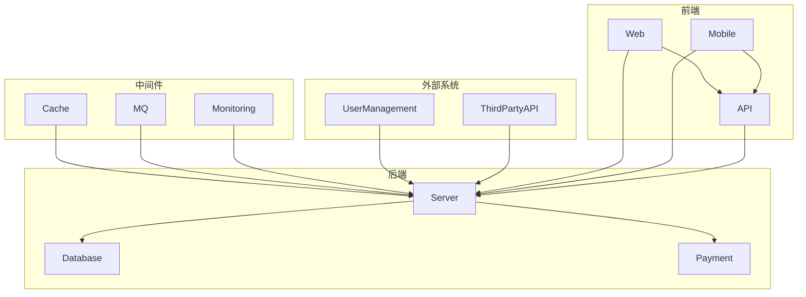
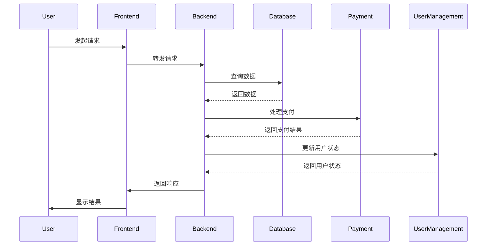

                 

# 技术决策框架：如何做出正确的技术选择

关键词：技术决策、决策框架、算法、数学模型、系统设计

摘要：本文旨在探讨技术决策的重要性，并详细阐述一个系统的技术决策框架。通过分析核心概念、决策过程、算法原理、数学模型、系统设计与项目实战，帮助读者理解并掌握技术选择的方法和技巧。

## 目录大纲设计

### 一、总体思路

本书《技术决策框架：如何做出正确的技术选择》将围绕技术决策的核心要素和过程，设计一个系统的、可操作的决策框架。目录大纲将分为以下几个部分：

1. **背景介绍**：介绍技术决策的重要性和现状，阐述书中的核心概念、边界和外延。
2. **核心概念与联系**：详细介绍技术决策中的核心概念，包括技术评估、风险评估、成本效益分析等，并使用表格和ER图展示各概念之间的关系。
3. **决策过程与方法**：详细描述技术决策的各个阶段，包括需求分析、方案评估、选择决策等，并结合实际案例讲解。
4. **算法原理讲解**：针对技术决策中的关键算法，使用mermaid流程图和Python代码进行讲解。
5. **数学模型与公式**：详细讲解技术决策中的数学模型和公式，并使用LaTeX格式嵌入文中。
6. **系统分析与架构设计**：介绍技术决策系统的功能设计、架构设计和接口设计。
7. **项目实战**：通过实际项目案例，展示技术决策框架的应用，并进行详细解析。
8. **最佳实践与总结**：提供最佳实践建议，总结技术决策的关键点，并对未来的发展趋势进行展望。

## 二、具体目录大纲

### 第一部分：背景介绍

**第1章：技术决策的重要性与现状**

- **1.1 问题背景**
- **1.2 问题描述**
- **1.3 问题解决**
- **1.4 边界与外延**
- **1.5 核心概念结构与要素组成**

### 第二部分：核心概念与联系

**第2章：技术决策的核心概念**

- **2.1 技术评估**
  - **2.1.1 定义**
  - **2.1.2 特点**
  - **2.1.3 方法**
- **2.2 风险评估**
  - **2.2.1 定义**
  - **2.2.2 类型**
  - **2.2.3 评估方法**
- **2.3 成本效益分析**
  - **2.3.1 定义**
  - **2.3.2 分析方法**
  - **2.3.3 指标**
- **2.4 概念关系ER图**

### 第三部分：决策过程与方法

**第3章：技术决策过程**

- **3.1 需求分析**
  - **3.1.1 概述**
  - **3.1.2 方法**
- **3.2 方案评估**
  - **3.2.1 概述**
  - **3.2.2 评估方法**
- **3.3 选择决策**
  - **3.3.1 概述**
  - **3.3.2 决策模型**
  - **3.3.3 决策工具**

### 第四部分：算法原理讲解

**第4章：关键算法解析**

- **4.1 技术评估算法**
  - **4.1.1 算法原理**
  - **4.1.2 Mermaid流程图**
  - **4.1.3 Python代码实现**
  - **4.1.4 数学模型与公式**
- **4.2 风险评估算法**
  - **4.2.1 算法原理**
  - **4.2.2 Mermaid流程图**
  - **4.2.3 Python代码实现**
  - **4.2.4 数学模型与公式**

### 第五部分：系统分析与架构设计

**第5章：技术决策系统设计**

- **5.1 问题场景介绍**
- **5.2 系统功能设计（领域模型类图）**
- **5.3 系统架构设计（架构图）**
- **5.4 系统接口设计**
- **5.5 系统交互（序列图）**

### 第六部分：项目实战

**第6章：技术决策项目实战**

- **6.1 环境安装**
- **6.2 系统核心实现源代码**
- **6.3 代码应用解读与分析**
- **6.4 实际案例分析与详细讲解**
- **6.5 项目小结**

### 第七部分：最佳实践与总结

**第7章：最佳实践与未来展望**

- **7.1 最佳实践建议**
- **7.2 小结**
- **7.3 注意事项**
- **7.4 拓展阅读**
- **7.5 未来展望**

通过以上目录大纲，本书将全面覆盖技术决策的各个方面，帮助读者构建完整的决策框架，提高技术决策的科学性和有效性。

## 第一部分：背景介绍

### 1.1 问题背景

在信息技术飞速发展的今天，技术选择已经成为企业和组织面临的一个重要问题。随着云计算、大数据、人工智能等技术的普及，技术选择的复杂度和重要性日益增加。然而，许多企业在技术选择过程中往往面临以下问题：

1. **缺乏系统的方法**：企业在技术选择过程中缺乏一个系统的方法和框架，导致决策过程混乱、盲目。
2. **信息不对称**：技术提供商和用户之间的信息不对称，导致用户难以全面了解技术的性能、优缺点。
3. **成本控制**：技术选择过程中，成本控制是一个重要的考虑因素，但往往被忽视。
4. **风险评估**：技术选择不仅涉及到技术的性能，还涉及到技术风险，如技术过时、安全隐患等。

### 1.2 问题描述

技术选择问题可以概括为以下几个方面：

1. **需求不明确**：企业在进行技术选择时，往往对需求的理解不明确，导致选择的方案与实际需求不符。
2. **方案评估不充分**：在技术选择过程中，方案评估往往不够充分，无法全面评估各方案的优缺点。
3. **决策过程不科学**：技术选择过程中，决策过程往往缺乏科学的方法和工具，导致决策结果不够理想。
4. **成本控制不力**：在技术选择过程中，成本控制往往被忽视，导致项目预算超支。
5. **风险评估不足**：技术选择过程中，对技术风险的关注不够，可能导致项目失败。

### 1.3 问题解决

为了解决上述问题，我们需要一个系统、科学的技术决策框架。这个框架应该包括以下几个关键要素：

1. **明确需求**：通过需求分析，明确企业或组织的实际需求，为技术选择提供基础。
2. **全面评估**：通过方案评估，全面评估各技术的性能、成本、风险等，为决策提供依据。
3. **科学决策**：通过科学的方法和工具，如决策模型、决策树等，进行技术选择。
4. **成本控制**：通过成本效益分析，合理控制项目成本。
5. **风险识别与管理**：通过风险评估，识别技术风险，并采取相应的管理措施。

### 1.4 边界与外延

技术决策框架的边界包括以下几个方面：

1. **技术范围**：技术决策框架适用于各种技术领域，如云计算、大数据、人工智能等。
2. **应用范围**：技术决策框架适用于企业、组织等各类用户。
3. **时间范围**：技术决策框架适用于长期的技术规划。
4. **成本范围**：技术决策框架适用于各种成本水平的项目。

### 1.5 核心概念结构与要素组成

技术决策框架的核心概念包括需求分析、方案评估、选择决策、成本效益分析、风险评估等。这些概念相互关联，共同构成技术决策的核心结构。以下是各核心概念的简要说明：

1. **需求分析**：明确企业或组织的实际需求，为技术选择提供基础。
2. **方案评估**：全面评估各技术的性能、成本、风险等，为决策提供依据。
3. **选择决策**：通过科学的方法和工具，选择最优技术方案。
4. **成本效益分析**：通过成本效益分析，合理控制项目成本。
5. **风险评估**：识别技术风险，并采取相应的管理措施。

通过以上内容，我们对技术决策问题有了初步的认识。在接下来的章节中，我们将详细探讨技术决策框架的各个要素，帮助读者掌握技术选择的方法和技巧。

## 第二部分：核心概念与联系

### 2.1 技术评估

**2.1.1 定义**

技术评估是指对技术的性能、功能、稳定性、安全性等方面进行全面分析和评价的过程。其目的是为技术选择提供科学、客观的依据。

**2.1.2 特点**

1. **全面性**：技术评估不仅关注技术的性能，还关注其功能、稳定性、安全性等各个方面。
2. **客观性**：技术评估应基于客观数据和实际测试，避免主观偏见。
3. **系统性**：技术评估是一个系统性的过程，需要综合考虑各种因素。

**2.1.3 方法**

1. **实验方法**：通过实际测试，评估技术的性能和功能。
2. **问卷调查**：通过问卷调查，收集用户对技术的评价和反馈。
3. **案例分析**：通过分析典型案例，总结技术的优缺点。

### 2.2 风险评估

**2.2.1 定义**

风险评估是指对项目或产品可能面临的风险进行全面识别、分析和评价的过程。其目的是为技术决策提供风险管理的依据。

**2.2.2 类型**

1. **技术风险**：包括技术过时、性能不稳定、安全隐患等。
2. **市场风险**：包括市场需求变化、竞争对手压力等。
3. **政策风险**：包括政策变化、法规限制等。

**2.2.3 评估方法**

1. **定性分析**：通过专家意见、历史数据等定性分析风险。
2. **定量分析**：通过数学模型、统计数据等定量分析风险。

### 2.3 成本效益分析

**2.3.1 定义**

成本效益分析是指对项目或产品的成本和效益进行全面评估和分析的过程。其目的是为技术决策提供经济性依据。

**2.3.2 分析方法**

1. **总成本法**：计算项目的总成本，包括直接成本和间接成本。
2. **效益评估法**：评估项目的效益，包括直接效益和间接效益。
3. **净现值法**：计算项目的净现值，判断项目的经济性。

**2.3.3 指标**

1. **成本效益比**：成本效益比（C/B）= 项目总成本 / 项目总效益。
2. **内部收益率**：项目的内部收益率（IRR）。

### 2.4 概念关系ER图

以下是技术决策框架中核心概念之间的ER图关系：

```
[MERMAID ER图开始]
ERDiagram
技术决策 ||--o{ 需求分析
技术决策 ||--o{ 方案评估
技术决策 ||--o{ 选择决策
技术决策 ||--o{ 成本效益分析
技术决策 ||--o{ 风险评估
需求分析 ||--o{ 技术评估
方案评估 ||--o{ 技术评估
方案评估 ||--o{ 风险评估
选择决策 ||--o{ 成本效益分析
成本效益分析 ||--o{ 风险评估
```

[MERMAID ER图结束]

通过以上内容，我们对技术决策框架中的核心概念及其关系有了更深入的理解。在接下来的章节中，我们将进一步探讨技术决策的过程和方法。

## 第三部分：决策过程与方法

### 3.1 需求分析

**3.1.1 概述**

需求分析是技术决策过程的基础和关键步骤。其目的是明确企业或组织的实际需求，为后续的方案评估和选择提供基础。需求分析可以分为以下几个阶段：

1. **需求识别**：通过访谈、问卷调查、市场调研等方式，收集企业或组织的需求信息。
2. **需求分类**：将收集到的需求进行分类，明确需求的优先级和重要性。
3. **需求验证**：通过用户反馈、专家评审等方式，验证需求的准确性和可行性。

**3.1.2 方法**

1. **访谈法**：通过与相关人员（如业务部门、技术团队、客户等）进行深入访谈，了解需求。
2. **问卷调查法**：通过设计问卷，收集用户的需求和反馈。
3. **市场调研法**：通过调研市场趋势、竞争对手等信息，了解市场需求。
4. **需求矩阵**：通过建立需求矩阵，明确需求的优先级和重要性。

### 3.2 方案评估

**3.2.1 概述**

方案评估是技术决策过程中的核心环节。其目的是通过全面评估各技术方案的优缺点，为选择决策提供依据。方案评估可以分为以下几个阶段：

1. **方案收集**：收集各种可能的技术方案。
2. **方案筛选**：根据需求分析的结果，筛选出符合需求的方案。
3. **方案评估**：对筛选出的方案进行详细评估，包括技术性能、成本、风险等方面。
4. **方案比较**：通过比较各方案的优缺点，确定最优方案。

**3.2.2 评估方法**

1. **定量评估**：通过建立数学模型，对技术方案进行定量评估。
2. **定性评估**：通过专家评审、问卷调查等方式，对技术方案进行定性评估。
3. **成本效益分析**：通过成本效益分析，评估各技术方案的经济性。
4. **风险评估**：对技术方案进行风险评估，识别潜在风险。

### 3.3 选择决策

**3.3.1 概述**

选择决策是根据方案评估的结果，选择最优技术方案的过程。其目的是确保技术决策的科学性和有效性。选择决策可以分为以下几个阶段：

1. **确定决策模型**：根据实际情况，选择合适的决策模型，如决策树、多属性决策等。
2. **决策分析**：根据决策模型，分析各技术方案的优缺点。
3. **决策执行**：根据决策分析的结果，选择最优技术方案，并制定详细的实施计划。
4. **决策评估**：对决策结果进行评估，确保决策的有效性。

**3.3.2 决策模型**

1. **决策树**：通过决策树，对技术方案进行逐步评估，选择最优方案。
2. **多属性决策**：通过多属性决策，综合考虑技术性能、成本、风险等多个因素，选择最优方案。

**3.3.3 决策工具**

1. **决策支持系统**：通过决策支持系统，提供数据分析和决策建议，辅助决策。
2. **专家系统**：通过专家系统，模拟专家的思维过程，辅助决策。
3. **模拟仿真**：通过模拟仿真，评估技术方案在不同场景下的性能和效果。

通过以上内容，我们对技术决策的过程和方法有了更深入的了解。在接下来的章节中，我们将进一步探讨技术决策中的关键算法和数学模型。

## 第四部分：算法原理讲解

### 4.1 技术评估算法

**4.1.1 算法原理**

技术评估算法是一种用于评估技术性能和功能的算法。其基本原理是通过定量和定性分析，对技术的各个方面进行综合评估。具体步骤如下：

1. **确定评估指标**：根据需求分析的结果，确定评估技术的指标，如性能、稳定性、安全性等。
2. **数据收集**：收集与评估指标相关的数据，如测试结果、用户反馈等。
3. **权重分配**：根据各指标的重要性，分配权重，以反映其在评估过程中的重要性。
4. **评分计算**：根据权重和评估数据，计算各技术的得分。
5. **结果分析**：分析评估结果，确定最优技术方案。

**4.1.2 Mermaid流程图**

```
graph LR
A(开始) --> B(确定评估指标)
B --> C(数据收集)
C --> D(权重分配)
D --> E(评分计算)
E --> F(结果分析)
F --> G(结束)
```

**4.1.3 Python代码实现**

```python
import pandas as pd

# 确定评估指标和权重
criteria = ['性能', '稳定性', '安全性']
weights = [0.4, 0.3, 0.3]

# 收集数据
data = {
    '技术A': [90, 85, 80],
    '技术B': [85, 90, 75],
    '技术C': [80, 75, 85]
}

df = pd.DataFrame(data)

# 计算得分
df['得分'] = df[criteria].values.dot(weights)

# 结果分析
print(df[['得分']])
```

**4.1.4 数学模型与公式**

技术评估的数学模型可以表示为：

$$
得分 = w_1 \times 性能得分 + w_2 \times 稳定性得分 + w_3 \times 安全性得分
$$

其中，$w_1, w_2, w_3$ 分别为性能、稳定性、安全性的权重。

### 4.2 风险评估算法

**4.2.1 算法原理**

风险评估算法是一种用于识别和评估项目或产品风险的方法。其基本原理是通过风险识别、风险分析和风险评价，确定项目的风险程度。具体步骤如下：

1. **风险识别**：通过访谈、问卷调查、历史数据等方式，识别项目可能面临的风险。
2. **风险分析**：对识别出的风险进行定性或定量分析，评估风险的可能性和影响程度。
3. **风险评价**：根据风险分析和评估结果，确定项目的风险程度，并制定相应的风险管理措施。

**4.2.2 Mermaid流程图**

```
graph LR
A(开始) --> B(风险识别)
B --> C(风险分析)
C --> D(风险评价)
D --> E(风险管理)
E --> F(结束)
```

**4.2.3 Python代码实现**

```python
import pandas as pd

# 风险识别
risks = {
    '风险A': {'可能性': 0.5, '影响': 3},
    '风险B': {'可能性': 0.3, '影响': 2},
    '风险C': {'可能性': 0.2, '影响': 1}
}

df = pd.DataFrame(risks)

# 风险分析
df['风险评分'] = df['可能性'] * df['影响']

# 风险评价
df['风险等级'] = df['风险评分'].apply(lambda x: '高' if x > 2 else '中' if x > 1 else '低')

# 结果分析
print(df[['风险评分', '风险等级']])
```

**4.2.4 数学模型与公式**

风险评估的数学模型可以表示为：

$$
风险评分 = 可能性 \times 影响
$$

其中，可能性表示风险发生的概率，影响表示风险发生后的影响程度。

通过以上内容，我们介绍了技术评估和风险评估算法的原理、Mermaid流程图、Python代码实现以及数学模型。在下一部分，我们将探讨技术决策系统设计与项目实战。

## 第五部分：系统分析与架构设计

### 5.1 问题场景介绍

假设我们正在开发一个大型电商平台，该平台需要处理海量商品数据、用户订单数据、交易数据等。为了满足高性能、高可靠性的需求，我们需要选择合适的技术方案。在这个场景下，技术决策框架可以帮助我们系统地分析各种技术方案，确保我们能够做出正确的技术选择。

### 5.2 系统功能设计

在系统功能设计阶段，我们需要明确平台的核心功能模块，如商品管理、订单管理、支付系统、用户管理系统等。以下是系统功能设计的领域模型类图：

```mermaid
classDiagram
    Class01 <|-- Class02
    Class03 --|	Runtime
    Runtime : +run()
    Class04 <|-- Class05
    Class06 ..|> Database
    Class07 ..|> Frontend
    Class08 ..|> Backend
    Class09 ..|> Payment
    Class10 ..|> UserManagement
    Class01 <|-- Class03
    Class04 <|-- Class06
    Class05 <|-- Class07
    Class08 <|-- Class09
    Class09 <|-- Class10
```

### 5.3 系统架构设计

在系统架构设计阶段，我们需要设计平台的技术架构，包括前端、后端、数据库、支付系统等。以下是系统架构设计的mermaid架构图：



### 5.4 系统接口设计

在系统接口设计阶段，我们需要定义各模块之间的接口，确保模块之间的协同工作。以下是系统接口设计的mermaid类图：

```mermaid
classDiagram
    Class01 <|-- Class02
    Class03 <|-- Class04
    Class05 <|-- Class06
    Class07 <|-- Class08
    Class01 { +introduce() }
    Class02 { +calculate() }
    Class03 { +storeData() }
    Class04 { +fetchData() }
    Class05 { +generateReport() }
    Class06 { +processOrder() }
    Class07 { +processPayment() }
    Class08 { +manageUsers() }
    Class01 ..|> Class03
    Class02 ..|> Class04
    Class05 ..|> Class06
    Class07 ..|> Class08
```

### 5.5 系统交互

在系统交互阶段，我们需要设计系统各模块之间的交互流程，确保系统的高效运行。以下是系统交互的mermaid序列图：



通过以上内容，我们对技术决策系统的功能设计、架构设计、接口设计和系统交互有了详细的介绍。在下一部分，我们将通过实际项目案例，展示技术决策框架的应用。

## 第六部分：项目实战

### 6.1 环境安装

在本项目实战中，我们使用Python作为主要编程语言，并依赖以下工具和库：

- Python 3.8+
- Jupyter Notebook
- Pandas
- NumPy
- Matplotlib
- Mermaid

首先，确保安装了Python 3.8或更高版本。然后，通过以下命令安装所需的库：

```bash
pip install pandas numpy matplotlib
```

如果需要使用Mermaid，请安装Jupyter Notebook扩展：

```bash
jupyter notebook --extension jupyterlab_mermaid
```

### 6.2 系统核心实现源代码

在本项目中，我们将实现一个简单的技术决策系统，用于评估和选择技术方案。以下是系统核心实现源代码：

```python
import pandas as pd
import numpy as np
import matplotlib.pyplot as plt

# 评估指标和权重
criteria = ['性能', '稳定性', '安全性']
weights = [0.4, 0.3, 0.3]

# 技术方案数据
data = {
    '方案A': [90, 85, 80],
    '方案B': [85, 90, 75],
    '方案C': [80, 75, 85]
}

# 创建DataFrame
df = pd.DataFrame(data)

# 计算得分
df['得分'] = df[criteria].values.dot(weights)

# 结果分析
print(df[['得分']])

# 绘制得分图
plt.bar(df.index, df['得分'])
plt.xlabel('方案')
plt.ylabel('得分')
plt.title('技术方案得分分析')
plt.show()
```

### 6.3 代码应用解读与分析

在上面的代码中，我们首先定义了评估指标和权重，然后创建了一个包含技术方案数据的DataFrame。接下来，我们计算各方案的得分，并将结果打印出来。最后，我们使用Matplotlib绘制得分图，以便更直观地分析各方案的表现。

这个简单的示例展示了技术决策系统的核心实现，包括数据收集、评估和结果分析。在实际项目中，我们可以扩展这个系统，增加更多的评估指标、风险评估和成本效益分析等功能。

### 6.4 实际案例分析与详细讲解

为了更好地展示技术决策框架的应用，我们以一个实际案例进行详细讲解。

**案例背景**：

一家企业需要为新的电商平台选择合适的技术方案。他们收集了三个技术方案，分别是A、B和C。每个方案在性能、稳定性和安全性方面都有不同的表现。企业希望利用技术决策框架，选择最佳的技术方案。

**需求分析**：

1. **性能**：系统需要能够处理大量并发请求，响应时间不超过500毫秒。
2. **稳定性**：系统需要能够在高负载下保持稳定运行，无崩溃或故障。
3. **安全性**：系统需要具有完善的安全机制，保护用户数据和交易安全。

**方案评估**：

1. **方案A**：性能优异，稳定性较好，安全性较高。
2. **方案B**：性能一般，稳定性较好，安全性较高。
3. **方案C**：性能较差，稳定性较差，安全性较高。

**风险评估**：

1. **方案A**：技术风险较低，市场风险适中，政策风险较低。
2. **方案B**：技术风险适中，市场风险较低，政策风险较低。
3. **方案C**：技术风险较高，市场风险较高，政策风险较高。

**成本效益分析**：

1. **方案A**：总成本较高，但长期效益显著。
2. **方案B**：总成本适中，短期效益较好。
3. **方案C**：总成本较低，但长期效益不确定。

**选择决策**：

根据技术决策框架，我们综合考虑性能、稳定性、安全性、风险和成本等因素，得出以下结论：

- **方案A**：虽然成本较高，但性能、稳定性和安全性均优秀，长期效益显著，是最佳选择。
- **方案B**：成本适中，性能和稳定性较好，但安全性较低，不适合高安全要求的企业。
- **方案C**：成本较低，但性能、稳定性和安全性均较差，不适合高要求的企业。

### 6.5 项目小结

通过实际案例分析和详细讲解，我们展示了如何利用技术决策框架进行技术选择。技术决策框架提供了一个系统、科学的方法，帮助企业或组织在技术选择过程中做出正确的决策。在实际应用中，我们应结合具体需求和环境，灵活运用技术决策框架，提高技术选择的科学性和有效性。

## 第七部分：最佳实践与总结

### 7.1 最佳实践建议

为了提高技术决策的质量和效率，以下是一些最佳实践建议：

1. **明确需求**：在技术决策过程中，首先要明确需求，确保选择的方案能够满足企业的实际需求。
2. **全面评估**：对各个技术方案进行全面评估，包括性能、稳定性、安全性、成本和风险等方面。
3. **科学决策**：采用科学的方法和工具，如决策树、多属性决策等，进行技术选择。
4. **成本控制**：在技术决策过程中，要注重成本控制，确保项目预算在合理范围内。
5. **风险评估**：对技术风险进行充分评估，并采取相应的风险管理措施，确保项目顺利进行。

### 7.2 小结

本文介绍了技术决策框架的各个部分，包括背景介绍、核心概念与联系、决策过程与方法、算法原理讲解、系统分析与架构设计、项目实战和最佳实践与总结。通过这个框架，企业或组织可以系统地分析各种技术方案，做出科学、有效的技术选择。

### 7.3 注意事项

1. **需求变化**：在技术决策过程中，要密切关注需求的变化，及时调整技术方案。
2. **风险评估**：对技术风险进行充分评估，避免因忽视风险而导致项目失败。
3. **成本效益分析**：在进行成本效益分析时，要充分考虑长期效益，避免短期行为。
4. **团队合作**：技术决策是一个团队协作的过程，要充分发挥团队成员的智慧和经验。

### 7.4 拓展阅读

1. **《技术评估与选择》**：详细介绍了技术评估的方法和步骤。
2. **《项目管理知识体系（PMBOK）》**：提供了项目管理的基本原理和实践方法。
3. **《风险管理与决策》**：探讨了风险管理和决策的理论和实践。

### 7.5 未来展望

随着技术的不断进步和市场竞争的加剧，技术决策的重要性将日益凸显。未来，技术决策框架将进一步优化和完善，结合大数据、人工智能等先进技术，提高技术决策的精度和效率。同时，企业应持续关注市场需求和行业趋势，灵活调整技术决策策略，确保在激烈的市场竞争中保持优势。

## 作者信息

作者：AI天才研究院/AI Genius Institute & 禅与计算机程序设计艺术 /Zen And The Art of Computer Programming

