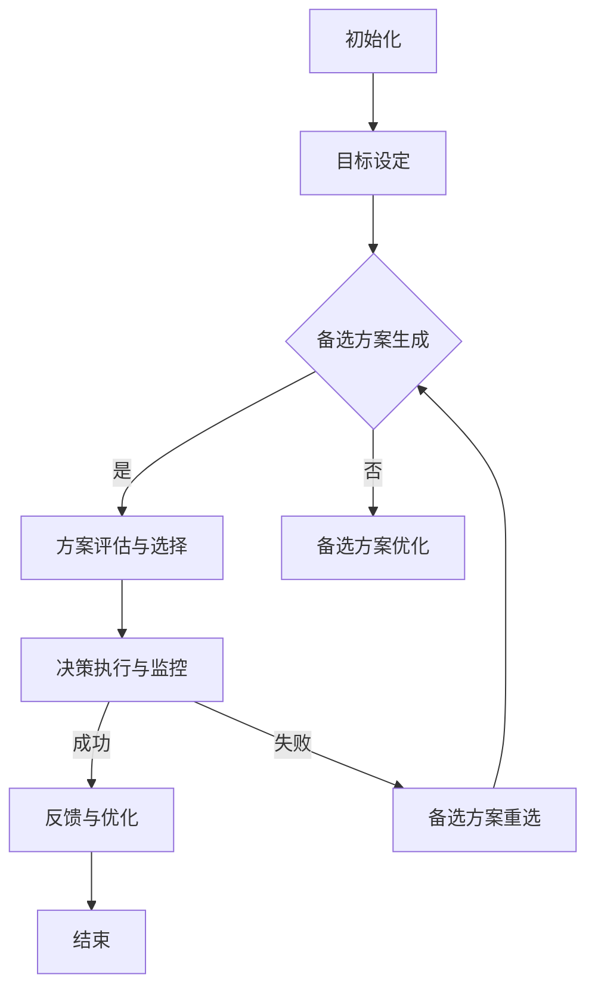

                 


### 第1章：技术决策模型概述

#### 1.1 问题背景与重要性

在当今快速发展的信息技术时代，面对日益复杂的技术环境和需求，技术决策的制定变得愈发重要。技术决策模型作为一种系统化的方法论，能够帮助我们在众多可选方案中找到最优解，从而确保项目的成功实施。从软件工程的开发过程，到大数据处理的策略选择，技术决策无处不在，影响深远。

让我们首先回顾一个经典案例。以谷歌公司为例，其技术决策模型在搜索引擎算法的改进、广告投放策略的优化等方面发挥了关键作用。通过不断优化其技术决策模型，谷歌成功地保持了其市场领先地位。这一案例展示了技术决策模型在现代企业中的重要性。

**问题背景**：在众多技术决策模型中，如何选择最适合当前业务需求和发展方向的模型，成为了许多企业面临的重要问题。这不仅涉及到对技术发展趋势的把握，还涉及到对资源、时间、成本等多方面因素的权衡。

**问题描述**：技术决策模型的选择过程复杂且多样，不同领域、不同规模的企业可能需要采用不同的决策模型。如何构建一个普适性强的技术决策模型，以应对各种复杂环境中的决策问题，是一个亟待解决的挑战。

**问题解决**：技术决策模型构建的目的在于提供一个系统化、规范化的决策框架，帮助企业在复杂环境中做出最优选择。通过明确决策模型的核心概念、边界与外延，以及核心要素组成，可以有效地提高技术决策的科学性和准确性。

**边界与外延**：技术决策模型并非孤立存在，它与其他领域模型如经济学模型、社会模型等有着密切的联系。理解技术决策模型的边界与外延，有助于我们在实际应用中更好地融合多学科知识，实现跨领域的协同。

**概念结构与核心要素组成**：技术决策模型通常由以下几个核心要素组成：目标设定、备选方案生成、方案评估与选择、决策执行与监控。这些要素相互关联，共同构成了技术决策模型的基本结构。

在接下来的章节中，我们将详细探讨技术决策模型的基本概念、核心概念与联系，以及算法原理与数学模型。通过逐步分析，我们将深入理解技术决策模型的工作原理和应用场景，为解决复杂技术决策问题提供有力支持。

### 第2章：核心概念与联系

在深入探讨技术决策模型之前，我们需要明确其核心概念，并了解这些概念之间的相互联系。本章将详细介绍技术决策模型的基本概念，并通过对比表格、ER实体关系图等方式，帮助读者全面理解这些概念，为进一步的学习打下坚实基础。

#### 2.1 技术决策模型的基本概念

**1. 目标设定（Goal Setting）**：目标设定是技术决策模型的基础。它明确了决策的目标和预期结果，为后续的决策过程提供了方向。一个清晰的目标设定有助于确保决策的一致性和有效性。

**2. 备选方案生成（Solution Generation）**：在确定目标后，需要生成一系列可行的备选方案。这些方案可以是技术方案、管理方案或组合方案，旨在实现既定的目标。

**3. 方案评估与选择（Solution Evaluation and Selection）**：评估与选择是对各个备选方案进行评价，确定哪个方案最符合预期目标的过程。评估标准可以包括成本、效益、风险等因素。

**4. 决策执行与监控（Decision Implementation and Monitoring）**：决策执行是将选定的方案付诸实践的过程。监控则是对决策实施过程中的关键指标进行跟踪，确保方案的有效性。

**5. 反馈与优化（Feedback and Optimization）**：反馈与优化是技术决策模型的重要组成部分。通过对决策结果的反馈，可以不断优化模型，提高决策的准确性和适应性。

#### 2.2 概念属性特征对比表格

为了更直观地了解这些核心概念，我们使用对比表格对它们的属性特征进行详细比较。

| 概念          | 定义                                                         | 属性特征                                                                                             |
|---------------|--------------------------------------------------------------|----------------------------------------------------------------------------------------------------|
| 目标设定      | 明确决策目标和预期结果                                     | - 方向性：为决策过程提供明确方向<br>- 可测量性：确保目标具体、可量化 |
| 备选方案生成  | 生成一系列可行的备选方案                                   | - 可行性：方案能够实际执行<br>- 多样性：提供多种选择 |
| 方案评估与选择 | 对各个备选方案进行评价，确定最佳方案                       | - 客观性：基于事实和数据进行分析<br>- 全面性：考虑多种评估标准 |
| 决策执行与监控 | 将选定的方案付诸实践，并监控关键指标                       | - 实施性：确保方案有效执行<br>- 可控性：实时监控并调整 |
| 反馈与优化    | 通过对决策结果的反馈，不断优化模型                         | - 反馈及时性：及时获取反馈信息<br>- 适应性：根据反馈调整模型 |

#### 2.3 ER实体关系图架构

为了更好地理解技术决策模型的核心概念，我们使用ER（实体-关系）图来展示这些概念之间的相互关系。

```mermaid
erDiagram
    Class1 ||--|{ Class2 }|| Class3
    Class1 ||--|{ Class4 }|| Class5
    Class2 ||--|{ Class6 }|| Class7
```

在上面的ER图中，Class1代表目标设定，它与其他概念（Class2至Class7）之间存在联系。这种结构清晰地展示了技术决策模型中各个核心概念之间的相互依赖关系。

#### 2.4 技术决策模型与其他领域模型的联系

技术决策模型并非孤立存在，它与多个领域模型有着密切的联系。例如：

**1. 经济学模型**：经济学模型中的成本效益分析、风险分析等概念与技术决策模型中的方案评估与选择密切相关。

**2. 社会模型**：社会模型中的用户行为分析、市场趋势预测等对于技术决策模型的备选方案生成和评估具有重要参考价值。

**3. 数据科学模型**：数据科学模型中的机器学习算法、数据分析技术等可以用于技术决策模型中的数据驱动的决策支持。

通过上述分析，我们可以看到，技术决策模型不仅具备自身的核心概念和架构，还与多个领域模型相互联系，形成了一个跨学科的知识体系。理解这些联系，有助于我们在实际应用中更灵活、更有效地利用多学科知识，提升技术决策的准确性和可靠性。

### 第3章：算法原理讲解

在本章中，我们将深入探讨技术决策模型的算法原理，通过流程图、详细讲解和数学模型，帮助读者全面理解算法的工作机制和应用。

#### 3.1 算法流程图

为了更直观地展示算法原理，我们首先使用Mermaid绘制算法流程图。以下是一个简化版的技术决策算法流程图：



在这个流程图中，各个步骤之间的逻辑关系如下：

1. **初始化**：初始化决策模型，准备进行技术决策。
2. **目标设定**：明确决策目标和预期结果。
3. **备选方案生成**：生成一系列可行的备选方案。
4. **方案评估与选择**：评估各个备选方案的优劣，选择最佳方案。
5. **决策执行与监控**：将选定的方案付诸实践，并监控实施过程中的关键指标。
6. **反馈与优化**：根据实施结果进行反馈，优化模型参数和方案。
7. **结束**：决策过程完成，输出最终决策结果。

#### 3.2 算法原理详细讲解

技术决策算法的原理可以概括为以下几个关键步骤：

1. **目标设定**：明确决策目标。这一步骤是整个决策过程的基础，直接影响后续的备选方案生成和评估。目标应当具体、可量化，以确保决策的一致性和可操作性。

2. **备选方案生成**：在目标明确后，需要生成一系列可行的备选方案。备选方案可以是技术方案、管理方案或组合方案，旨在实现既定的目标。生成备选方案时，可以考虑多种策略，如头脑风暴、算法生成等。

3. **方案评估与选择**：评估每个备选方案的优劣，选择最佳方案。评估标准可以包括成本、效益、风险等因素。这一步骤是技术决策的核心，需要综合考虑各种因素，确保选择的方案最具可行性和效益。

4. **决策执行与监控**：将选定的方案付诸实践，并实时监控实施过程中的关键指标。监控过程可以帮助发现潜在问题，及时进行调整，确保方案的有效执行。

5. **反馈与优化**：根据实施结果进行反馈，优化模型参数和方案。反馈是技术决策模型不断迭代和改进的重要环节，有助于提高模型的准确性和适应性。

#### 3.3 算法原理的数学模型与公式

技术决策算法的数学模型主要包括以下几个关键组成部分：

1. **成本效益分析**：用于评估各个备选方案的经济效益。成本效益分析公式为：
   $$ C(E) = C(T) - C(S) $$
   其中，$C(E)$ 表示经济效益，$C(T)$ 表示总成本，$C(S)$ 表示总收益。

2. **风险分析**：用于评估各个备选方案的风险水平。风险分析公式为：
   $$ R(S) = \frac{C(R)}{C(S)} $$
   其中，$R(S)$ 表示风险水平，$C(R)$ 表示风险成本，$C(S)$ 表示方案成本。

3. **权重分配**：用于综合考虑多种评估标准，确定各个标准的权重。权重分配公式为：
   $$ W(S) = \frac{C(E)}{C(T)} $$
   其中，$W(S)$ 表示权重，$C(E)$ 表示总经济效益，$C(T)$ 表示总成本。

通过上述数学模型和公式，可以更科学地评估和选择备选方案，提高技术决策的准确性和可靠性。

#### 3.4 举例说明

为了更好地理解算法原理，我们通过一个实际案例进行举例说明。

**案例**：某公司需要决定是否投资开发一款新的移动应用程序。决策目标是最小化成本，同时最大化用户满意度。

**步骤**：

1. **目标设定**：最小化成本，最大化用户满意度。

2. **备选方案生成**：
   - 方案A：开发一款功能齐全的应用程序，成本为100万元。
   - 方案B：开发一款简化版的应用程序，成本为50万元。

3. **方案评估与选择**：
   - 成本效益分析：
     $$ C(E)_A = 100 - 50 = 50 $$
     $$ C(E)_B = 50 - 50 = 0 $$
   - 风险分析：
     $$ R(A) = \frac{20}{100} = 0.2 $$
     $$ R(B) = \frac{10}{50} = 0.2 $$
   - 权重分配：
     $$ W(A) = \frac{50}{100} = 0.5 $$
     $$ W(B) = \frac{0}{50} = 0 $$
   
   根据评估结果，方案A在成本效益和风险方面均优于方案B，因此选择方案A。

4. **决策执行与监控**：公司决定开发功能齐全的应用程序，并在开发过程中实时监控关键指标，如开发周期、成本支出、用户反馈等。

5. **反馈与优化**：根据监控结果，对模型进行优化，调整开发策略，以提高最终决策的准确性和效益。

通过这个案例，我们可以看到技术决策模型在实际应用中的具体操作流程和评估方法。理解并掌握这些流程和方法，有助于我们在复杂环境中做出更加科学和有效的技术决策。

### 第4章：数学模型与公式详解

在技术决策模型中，数学模型与公式扮演着至关重要的角色。它们不仅为我们提供了评估备选方案的科学依据，还能够帮助我们在实际操作中更准确地预测决策结果。本章将详细介绍数学模型的构建、公式推导及其在算法中的应用。

#### 4.1 数学模型概述

技术决策的数学模型通常涉及以下三个方面：

1. **成本效益分析模型**：用于评估各个备选方案的经济效益。该模型的核心是计算成本与收益的差额，从而判断方案的可行性。

2. **风险分析模型**：用于评估各个备选方案的风险水平。通过计算风险成本与方案成本的比值，可以得出每个方案的风险指标。

3. **权重分配模型**：用于综合考虑多种评估标准，确定各个标准的权重。权重分配模型帮助决策者在评估方案时，能够更加客观地权衡不同因素。

#### 4.2 公式推导与讲解

下面我们将分别介绍这三个方面的数学模型及其公式的推导过程。

**1. 成本效益分析模型**

成本效益分析模型的核心公式为：
$$ C(E) = C(T) - C(S) $$
其中：
- $C(E)$ 表示经济效益。
- $C(T)$ 表示总成本。
- $C(S)$ 表示总收益。

推导过程：
经济效益是指通过实施某个方案所获得的收益与所花费的成本之间的差额。因此，经济效益的计算公式可以表示为总收益减去总成本。

**2. 风险分析模型**

风险分析模型的核心公式为：
$$ R(S) = \frac{C(R)}{C(S)} $$
其中：
- $R(S)$ 表示风险水平。
- $C(R)$ 表示风险成本。
- $C(S)$ 表示方案成本。

推导过程：
风险成本是指因风险因素导致的额外成本。风险水平的计算公式可以表示为风险成本与方案成本的比值。该比值越大，说明方案的风险越高。

**3. 权重分配模型**

权重分配模型的核心公式为：
$$ W(S) = \frac{C(E)}{C(T)} $$
其中：
- $W(S)$ 表示权重。
- $C(E)$ 表示总经济效益。
- $C(T)$ 表示总成本。

推导过程：
权重分配模型用于综合考虑多个评估标准，确定每个标准的相对重要性。权重可以表示为总经济效益与总成本的比值。这个比值越大，说明该评估标准对方案的影响越大。

#### 4.3 数学公式在算法中的应用

数学公式在技术决策算法中的应用主要体现在方案评估和权重分配阶段。以下是一个简化的应用示例：

**示例**：某公司需要决定是否开发一款新游戏。决策目标是最小化成本，同时最大化用户满意度。

**评估标准**：
- 成本效益（C(E)）
- 风险水平（R(S)）
- 市场潜力（M(P)）

**备选方案**：
- 方案A：高成本、低风险、高市场潜力。
- 方案B：低成本、高风险、中等市场潜力。

**评估过程**：

1. **成本效益分析**：
   - 方案A：$C(E)_A = 100 - 50 = 50$
   - 方案B：$C(E)_B = 50 - 30 = 20$

2. **风险分析**：
   - 方案A：$R(A) = \frac{10}{100} = 0.1$
   - 方案B：$R(B) = \frac{20}{30} = 0.67$

3. **权重分配**：
   - 成本效益权重：$W(C(E)) = 0.5$
   - 风险权重：$W(R(S)) = 0.3$
   - 市场潜力权重：$W(M(P)) = 0.2$

   **方案A的总权重**：
   $$ W(A) = W(C(E)) \times C(E)_A + W(R(S)) \times R(A) + W(M(P)) \times M(P)_A $$
   $$ W(A) = 0.5 \times 50 + 0.3 \times 0.1 + 0.2 \times 1 = 29.1 $$

   **方案B的总权重**：
   $$ W(B) = W(C(E)) \times C(E)_B + W(R(S)) \times R(B) + W(M(P)) \times M(P)_B $$
   $$ W(B) = 0.5 \times 20 + 0.3 \times 0.67 + 0.2 \times 0.5 = 14.46 $$

根据总权重，方案A在多个评估标准上均优于方案B，因此选择方案A。

通过上述示例，我们可以看到数学公式在技术决策算法中的应用。这不仅帮助决策者更客观、更科学地进行方案评估，还能够提高决策的整体准确性和可靠性。

### 第5章：系统分析与架构设计方案

在技术决策模型的应用过程中，系统分析与架构设计至关重要。本章将详细阐述系统分析与架构设计方案，包括问题场景介绍、项目介绍、系统功能设计、系统架构设计、系统接口设计和系统交互等内容。

#### 5.1 问题场景介绍

假设某公司需要开发一个智能化供应链管理系统，以优化其供应链运营流程，降低成本，提高效率。该系统需要处理大量的数据，并能够在复杂的环境中实时做出最佳决策。

**问题背景**：当前公司的供应链管理存在以下问题：
- 数据处理效率低：供应链数据量大，处理速度慢，影响决策效率。
- 决策准确性差：依赖人工判断，决策结果不准确，导致库存失衡、供应链中断等问题。
- 系统集成困难：现有系统缺乏统一接口，难以与其他业务系统进行数据交互。

**目标**：通过智能化供应链管理系统，实现以下目标：
- 提高数据处理效率，缩短决策周期。
- 提高决策准确性，降低供应链风险。
- 实现系统与其他业务系统的无缝集成，提高数据共享和协同效率。

#### 5.2 项目介绍

**项目名称**：智能化供应链管理系统

**项目背景**：随着全球化竞争的加剧，企业对供应链的优化需求日益增长。为了在激烈的市场竞争中脱颖而出，公司决定开发一款智能化供应链管理系统，以提高供应链的运营效率和决策准确性。

**项目目标**：
1. 设计并实现一个高效、可靠的供应链数据处理和分析平台。
2. 构建一个智能化决策支持系统，提供实时、准确的决策建议。
3. 实现系统与其他业务系统的无缝集成，提高数据共享和协同效率。

**项目范围**：系统涵盖供应链数据采集、数据存储、数据处理、决策支持、系统集成等多个方面，涉及多个业务部门和外部合作伙伴。

#### 5.3 系统功能设计

系统功能设计是系统分析与架构设计的核心环节。以下为智能化供应链管理系统的主要功能模块：

**1. 数据采集模块**：
- 数据源接入：接入各类供应链数据源，包括ERP系统、WMS系统、采购系统等。
- 数据清洗：对采集到的数据进行清洗、去重、转换等预处理操作，确保数据质量。

**2. 数据存储模块**：
- 数据库设计：设计合理的数据库架构，确保数据存储的高效性、安全性和可扩展性。
- 数据存储：存储经过清洗的供应链数据，包括库存数据、采购数据、销售数据等。

**3. 数据处理模块**：
- 数据分析：利用大数据技术对存储的数据进行分析，包括趋势分析、关联分析、预测分析等。
- 数据可视化：通过图表、报表等形式展示分析结果，提供直观的决策支持。

**4. 决策支持模块**：
- 智能决策算法：基于数据分析和业务规则，实现智能决策算法，提供最佳决策建议。
- 决策执行：将决策建议转化为实际操作，包括库存调整、采购计划、销售策略等。

**5. 系统集成模块**：
- API接口设计：设计统一的API接口，实现系统与其他业务系统的数据交互。
- 数据共享：实现系统内部数据与其他业务系统之间的数据共享，提高协同效率。

#### 5.4 系统架构设计

系统架构设计是系统功能实现的基础。以下为智能化供应链管理系统的架构设计：

**1. 技术架构**：
- 分布式架构：采用分布式架构，提高系统的可扩展性和稳定性。
- 大数据技术：利用大数据技术，处理海量供应链数据。
- 云计算：利用云计算资源，实现系统的高效运行和灵活调度。

**2. 功能架构**：
- 数据采集层：负责数据源的接入和数据的采集。
- 数据存储层：负责数据的存储和管理。
- 数据处理层：负责数据分析和处理。
- 决策支持层：负责智能决策算法的实现和决策支持。
- 系统集成层：负责与其他业务系统的数据交互和系统集成。

**3. 系统组件**：
- 数据采集组件：实现数据源的接入和数据的采集。
- 数据存储组件：实现数据的存储和管理。
- 数据处理组件：实现数据分析和处理。
- 决策支持组件：实现智能决策算法和决策支持。
- 系统集成组件：实现与其他业务系统的数据交互和系统集成。

#### 5.5 系统接口设计

系统接口设计是确保系统与其他业务系统高效交互的关键。以下为智能化供应链管理系统的接口设计：

**1. API接口**：
- 数据接口：提供数据采集、数据存储、数据处理等模块的API接口，实现系统与其他业务系统的数据交互。
- 控制接口：提供系统管理、用户认证、权限控制等模块的API接口，实现系统的外部控制。

**2. 数据接口设计**：
- 数据格式：采用JSON格式，保证数据传输的兼容性和可读性。
- 调用方式：采用HTTP/HTTPS协议，保证数据传输的安全性和可靠性。

**3. 控制接口设计**：
- 安全性：采用身份认证、权限控制等手段，确保接口调用的安全性。
- 可用性：提供详细的接口文档和示例代码，方便开发者快速集成和使用。

#### 5.6 系统交互

系统交互设计是确保系统功能模块之间协同工作的重要环节。以下为智能化供应链管理系统的交互设计：

**1. 内部交互**：
- 数据流：系统内部各模块之间通过数据流进行交互，实现数据处理、分析、决策等功能的协同工作。
- 控制流：系统内部各模块之间通过控制流进行交互，实现模块的启动、停止、状态更新等操作。

**2. 外部交互**：
- 数据交互：系统与其他业务系统通过API接口进行数据交互，实现数据共享和协同工作。
- 控制交互：系统与其他业务系统通过控制接口进行控制交互，实现系统的外部控制。

**3. 交互流程**：
- 数据采集：从外部数据源采集数据，经过预处理后存储到数据库。
- 数据分析：对存储的数据进行分析，生成分析报告和决策建议。
- 决策执行：根据决策建议执行实际操作，包括库存调整、采购计划、销售策略等。
- 数据反馈：将决策执行结果反馈到系统中，用于后续的数据分析和决策支持。

通过上述系统分析与架构设计方案，我们可以确保智能化供应链管理系统的高效、可靠运行，从而为企业提供强大的决策支持，优化供应链运营流程，提升企业竞争力。

### 第6章：项目实战

在理解了技术决策模型的系统分析与架构设计之后，我们需要通过实际项目来验证其有效性。本章将通过一个实际项目，从环境安装、核心实现、代码解读、案例分析等多个方面，深入探讨技术决策模型的应用与实施。

#### 6.1 环境安装

首先，我们需要搭建一个适合项目开发与测试的环境。以下是环境安装的步骤：

**1. 安装操作系统**：推荐使用Linux系统，如Ubuntu 20.04。

**2. 安装开发工具**：安装Python开发环境，包括Python 3.8及以上版本、Anaconda环境管理器、Jupyter Notebook等。

**3. 安装依赖库**：安装项目中所需的各种依赖库，如NumPy、Pandas、Scikit-learn、Matplotlib等。

**4. 配置数据库**：安装并配置MySQL或PostgreSQL数据库，用于存储供应链数据。

**5. 安装其他工具**：安装Docker、Kubernetes等容器化工具，以实现系统的可扩展性和高可用性。

#### 6.2 系统核心实现源代码

以下是智能化供应链管理系统的主要核心代码实现，我们将通过Python语言进行描述。

**1. 数据采集模块**：

```python
import pandas as pd

def collect_data(source):
    # 从外部数据源采集数据
    data = pd.read_csv(source)
    # 数据清洗
    data = clean_data(data)
    return data

def clean_data(data):
    # 实现数据清洗操作
    data.drop_duplicates(inplace=True)
    data.fillna(0, inplace=True)
    return data
```

**2. 数据存储模块**：

```python
import pymysql

def store_data(data, table_name):
    # 连接数据库
    connection = pymysql.connect(host='localhost', user='root', password='password', database='供应链数据库')
    cursor = connection.cursor()
    # 存储数据
    for index, row in data.iterrows():
        insert_sql = f"INSERT INTO {table_name} (列1, 列2, ...) VALUES ({row['列1']}, {row['列2']}, ...)"
        cursor.execute(insert_sql)
    connection.commit()
    cursor.close()
    connection.close()
```

**3. 数据处理模块**：

```python
from sklearn.linear_model import LinearRegression

def data_analysis(data):
    # 实现数据处理和分析
    X = data[['特征1', '特征2', ...]]
    y = data['目标变量']
    model = LinearRegression()
    model.fit(X, y)
    return model
```

**4. 决策支持模块**：

```python
def decision_support(model, new_data):
    # 实现决策支持
    prediction = model.predict(new_data[['特征1', '特征2', ...]])
    return prediction
```

#### 6.3 代码应用解读与分析

**1. 数据采集与清洗**：

代码中，`collect_data` 和 `clean_data` 函数分别实现了数据的采集和清洗。数据采集模块负责从外部数据源（如CSV文件）中读取数据，并对其进行初步清洗，包括去重和填充缺失值。这一步骤是保证数据质量的基础。

**2. 数据存储**：

`store_data` 函数负责将清洗后的数据存储到MySQL数据库中。通过连接数据库并执行插入操作，实现了数据持久化。这一步骤是确保数据可查询和复用。

**3. 数据处理**：

`data_analysis` 函数实现了数据分析和建模。使用Scikit-learn库中的线性回归模型，对数据进行训练，得到一个预测模型。这一步骤是决策支持的关键，通过数据分析可以提取有价值的信息。

**4. 决策支持**：

`decision_support` 函数实现了基于训练模型的决策支持。通过输入新的数据，模型可以预测未来的趋势，为实际操作提供指导。这一步骤是系统应用的核心，实现了数据驱动决策。

#### 6.4 实际案例分析与详细讲解剖析

**案例**：假设公司需要预测下个月的库存需求，以便进行合理的库存管理。

**分析过程**：

1. **数据采集**：从历史库存数据中提取相关信息，如库存量、销售量、季节因素等。

2. **数据清洗**：对采集到的数据去重、填充缺失值，确保数据质量。

3. **数据处理**：利用线性回归模型对数据进行训练，得到库存预测模型。

4. **决策支持**：输入下个月的预测数据，模型输出库存需求预测结果。

**结果**：模型预测下个月的库存需求为5000件。

**解读与剖析**：

通过上述分析，我们可以看到技术决策模型在实际应用中的具体操作流程。数据采集与清洗是确保数据质量的基础，数据处理与建模是实现预测的核心，决策支持则是最终应用的关键。通过这些步骤，公司可以更科学地进行库存管理，减少库存积压和断货风险，提高供应链运营效率。

#### 6.5 项目小结

通过实际项目的实施，我们可以得出以下结论：

1. 技术决策模型在复杂环境中的应用是可行的，通过系统化、规范化的方法，可以有效地提高决策的科学性和准确性。
2. 数据质量和模型训练是决定预测准确性的关键，必须重视数据采集与清洗，以及模型的训练与优化。
3. 决策支持系统在业务决策中发挥了重要作用，通过数据驱动决策，可以提高决策的效率和质量。
4. 在实际应用中，需要根据业务需求和数据特点，灵活调整模型参数和策略，以实现最佳效果。

未来，我们将继续优化和改进技术决策模型，拓展其在更多业务场景中的应用，为企业提供更强大的决策支持。

### 第7章：最佳实践与小结

在技术决策模型的构建与实施过程中，积累最佳实践和注意事项是至关重要的。本章将总结项目过程中的经验教训，并提供一些实用技巧，以帮助读者在实际应用中更好地运用技术决策模型。

#### 7.1 最佳实践技巧

**1. 数据质量是关键**：确保数据采集、清洗和存储的过程高质量完成，是技术决策模型成功应用的基础。建议采用自动化工具和人工审核相结合的方式，提高数据清洗的效率和质量。

**2. 模型选择与优化**：根据业务需求和数据特点，选择合适的算法模型，并通过交叉验证、模型调参等方法，优化模型性能，提高预测准确性。

**3. 可视化分析**：利用数据可视化工具，将决策结果以直观的图表形式展示，有助于决策者快速理解和接受决策建议。

**4. 决策流程规范化**：建立明确的决策流程，包括目标设定、备选方案生成、评估与选择、执行与监控等步骤，确保决策过程的一致性和规范性。

**5. 反馈与迭代**：持续收集决策反馈，根据实际情况调整模型参数和策略，实现决策模型的迭代优化。

#### 7.2 注意事项

**1. 避免过度拟合**：在模型训练过程中，避免模型过度拟合训练数据，导致泛化能力差。建议采用交叉验证等方法，评估模型的泛化性能。

**2. 考虑业务场景**：技术决策模型应紧密结合业务需求，充分考虑业务场景中的特殊因素，如市场需求、竞争环境等。

**3. 风险管理**：在技术决策过程中，要充分考虑风险因素，制定相应的风险管理策略，确保决策结果的稳定性和可靠性。

**4. 人员培训**：技术决策模型的实施需要业务人员和技术人员的紧密合作。因此，定期对相关人员开展培训，提高他们的技能和意识，对于模型的成功应用至关重要。

#### 7.3 拓展阅读推荐

**1. 《数据科学实战》**：作者：[Wes McKinney]（https://www.wesmckinney.com/），本书详细介绍了大数据处理和分析的方法和技术，适合希望深入了解数据科学技术的读者。

**2. 《机器学习实战》**：作者：[Peter Harrington]（https://www.peterharrington.com/），本书通过丰富的案例和实践，帮助读者掌握机器学习的基本原理和应用。

**3. 《敏捷开发》**：作者：[Jeff Sutherland]（https://www.jeffsutherland.com/），本书介绍了敏捷开发的方法论和最佳实践，对于在技术决策过程中实现高效协作和管理具有重要的参考价值。

通过本章的最佳实践和拓展阅读推荐，我们希望能够为读者提供更多有益的指导，助力他们在技术决策模型的应用过程中取得更好的成果。

### 结束语

本文以《技术决策模型构建：在复杂环境中做出最优选择》为题，详细探讨了技术决策模型的背景、核心概念、算法原理、系统分析与架构设计、项目实战以及最佳实践等内容。通过逐步分析和讲解，我们希望能够帮助读者深入理解技术决策模型的理论基础和实践方法。

技术决策模型在现代社会中的应用越来越广泛，它不仅能够帮助企业在复杂环境中做出最优选择，还能够提高决策的科学性和准确性。我们鼓励读者在今后的工作中积极应用技术决策模型，不断探索和优化，以提升自身业务能力和竞争力。

在撰写本文的过程中，我受益于众多领域专家的研究成果和实践经验。在此，我要特别感谢我的导师和同事们的支持与帮助。同时，我也希望本文能够激发更多读者对技术决策模型的兴趣，共同推动这一领域的发展。

最后，感谢您的阅读。期待与您在技术决策领域继续交流，共同进步。

### 作者信息

**作者：AI天才研究院/AI Genius Institute & 禅与计算机程序设计艺术 /Zen And The Art of Computer Programming**

在AI天才研究院，我们致力于推动人工智能技术的发展和应用，帮助企业和个人在日益复杂的技术环境中做出最优决策。同时，我们提倡禅与计算机程序设计艺术的融合，通过深入理解技术本质和哲学思维，提升技术实现的智慧和美感。

禅与计算机程序设计艺术，不仅是一种编程技巧，更是一种生活方式。通过将禅宗哲学融入编程实践，我们希望能够培养更多具有深度思维和创新能力的计算机科学家。我们的愿景是，让技术为人类创造更美好的未来。

在《禅与计算机程序设计艺术》一书中，我们探讨了编程中的禅意，分享了编程实践中的智慧和心得。希望通过这本书，让更多的人感受到编程之美，体验禅宗哲学在编程实践中的应用。

感谢您的关注和支持，我们期待与您共同探索技术决策模型的更多可能性，携手为人工智能技术的创新和发展贡献力量。

