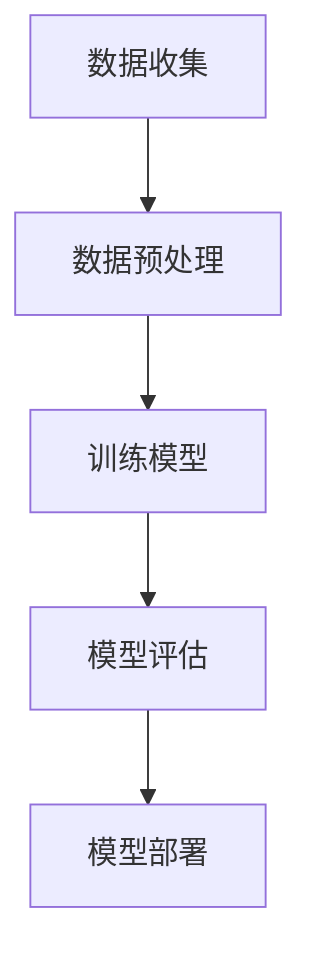
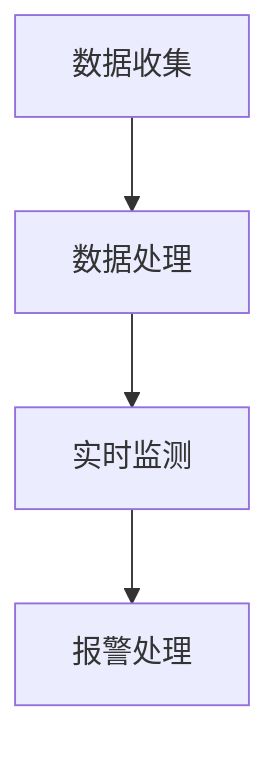
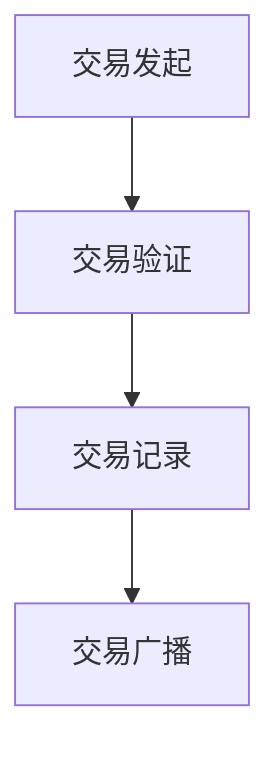

                 

### 技术决策：在不确定中做出最佳选择

关键词：技术决策、不确定性、风险管理、数据分析、最佳实践

摘要：在快速变化的IT行业，技术决策变得越来越重要。本文将探讨如何在不确定性中做出最佳的技术决策。通过分析技术决策的定义、框架、不确定性处理、数据的重要性、技术趋势与未来展望、实际案例和最佳实践，我们希望能为读者提供有价值的指导。

### 目录大纲

----------------------------------------------------------------

## 第一部分：技术决策概述

### 第1章：技术决策的定义与重要性

#### 1.1 技术决策的定义

#### 1.2 技术决策的重要性

#### 1.3 技术决策的常见挑战

### 第2章：技术决策的框架与方法

#### 2.1 技术决策的框架

#### 2.2 技术决策的方法

#### 2.3 技术评估工具

### 第3章：不确定性的处理

#### 3.1 不确定性的来源

#### 3.2 风险管理策略

#### 3.3 适应性规划

### 第4章：技术决策中的数据

#### 4.1 数据的重要性

#### 4.2 数据收集与分析

#### 4.3 数据可视化

### 第5章：技术趋势与未来展望

#### 5.1 当前技术趋势

#### 5.2 未来技术展望

#### 5.3 对技术趋势的应对策略

### 第6章：技术决策的实际案例

#### 6.1 案例一：人工智能在医疗领域的应用

#### 6.2 案例二：物联网技术在家居安全中的应用

#### 6.3 案例三：区块链技术在金融行业的应用

### 第7章：技术决策的最佳实践与策略

#### 7.1 最佳实践一：全面评估与准备

#### 7.2 最佳实践二：持续学习和适应

#### 7.3 策略一：建立有效的沟通机制

#### 7.4 策略二：灵活调整和优化决策

#### 7.5 小结

----------------------------------------------------------------

接下来，我们将一步步深入分析每个章节，以帮助读者更好地理解技术决策的各个方面。

## 第一部分：技术决策概述

### 第1章：技术决策的定义与重要性

#### 1.1 技术决策的定义

技术决策是指在选择、设计和实施技术解决方案时所做出的决策。这些决策涉及到各种技术领域，如软件开发、网络安全、云计算、大数据、人工智能等。

#### 1.2 技术决策的重要性

技术决策的重要性不言而喻。在当今快速变化的科技时代，技术决策的正确性直接影响着组织的竞争力、效率和生存能力。以下是技术决策的重要性体现：

1. **驱动创新**：技术决策可以推动组织的创新，提高产品的市场竞争力。
2. **优化资源**：通过合理的决策，可以优化资源配置，提高效率。
3. **降低风险**：正确的技术决策可以帮助企业规避潜在的技术风险。
4. **提高客户满意度**：良好的技术决策可以提升用户体验，增加客户满意度。
5. **适应变化**：技术决策能够帮助企业适应快速变化的市场需求和技术进步。

#### 1.3 技术决策的常见挑战

尽管技术决策非常重要，但在实际操作中，技术决策面临许多挑战：

1. **信息不足**：决策者可能缺乏必要的信息和数据来做出明智的决策。
2. **复杂性**：技术的复杂性和多样性使得决策变得复杂。
3. **时间压力**：技术决策往往需要在紧迫的时间内完成，增加了决策的难度。
4. **利益冲突**：不同部门或个人之间的利益冲突可能会影响决策的质量。
5. **不确定性**：技术未来发展的不确定性使得决策更加困难。

接下来，我们将探讨技术决策的框架与方法，帮助读者了解如何在实际中应对这些挑战。

### 第2章：技术决策的框架与方法

#### 2.1 技术决策的框架

技术决策的框架是一个系统化的方法，用于指导决策过程。一个基本的技术决策框架通常包括以下步骤：

1. **问题识别**：明确需要解决的问题或机会。
2. **信息收集**：收集与决策相关的数据和信息。
3. **方案生成**：列出可能的解决方案。
4. **方案评估**：评估每个方案的优势和劣势。
5. **决策制定**：选择最佳的解决方案。
6. **实施监控**：执行决策，并监控结果。

#### 2.2 技术决策的方法

在技术决策中，有多种方法可以使用，包括：

1. **成本效益分析（CBA）**：评估不同方案的财务影响。
2. **决策树分析**：通过图形化展示决策路径和结果。
3. **多属性决策分析（MADA）**：考虑多个属性（如成本、效率、可靠性等）。
4. **情景分析**：模拟不同的未来情景，评估其对决策的影响。
5. **专家咨询**：咨询领域专家的意见。

#### 2.3 技术评估工具

技术评估工具可以帮助决策者更好地理解和评估不同方案。常见的评估工具包括：

1. **SWOT分析**：评估解决方案的 strengths（优势）、weaknesses（劣势）、opportunities（机会）和 threats（威胁）。
2. **Pareto分析**：识别最重要的问题或因素。
3. **决策矩阵**：将不同方案的属性进行比较。
4. **成本效益比（C/B）**：评估每个方案的投入与产出比。

通过这些框架和方法，决策者可以更加系统化和科学地进行技术决策。接下来，我们将讨论如何处理技术决策中的不确定性。

### 第3章：不确定性的处理

#### 3.1 不确定性的来源

技术决策中的不确定性来源于多个方面，包括：

1. **技术复杂性**：技术的复杂性和不确定性增加了决策的难度。
2. **市场变化**：市场需求和竞争环境的变化可能影响决策的有效性。
3. **数据不足**：缺乏足够的数据和信息可能导致决策的不确定性。
4. **外部因素**：政治、经济和社会等因素可能影响技术决策。
5. **技术进步**：技术的快速进步可能导致现有决策过时。

#### 3.2 风险管理策略

为了处理不确定性，可以采用以下风险管理策略：

1. **风险识别**：识别可能的风险和不确定性因素。
2. **风险评估**：评估每个风险的可能性和影响。
3. **风险缓解**：采取措施减轻或避免风险。
4. **风险监控**：持续监控风险的变化，及时调整决策。

#### 3.3 适应性规划

适应性规划是一种应对不确定性的策略，它包括：

1. **灵活规划**：设计灵活的规划，以适应未来的变化。
2. **迭代开发**：采用迭代的方法，逐步调整和优化决策。
3. **敏捷实践**：采用敏捷开发等实践，以快速响应变化。
4. **持续学习**：通过学习和反馈，不断提高决策能力。

通过这些策略，决策者可以更好地应对技术决策中的不确定性，从而做出更加明智的决策。

### 第4章：技术决策中的数据

#### 4.1 数据的重要性

数据是技术决策的基础。准确、及时和可靠的数据可以帮助决策者做出更加明智的决策。以下是数据在技术决策中的重要性：

1. **支持分析**：数据可以支持对各种方案的分析和评估。
2. **提供证据**：数据可以作为决策的依据，减少主观偏见。
3. **优化决策**：通过数据驱动的分析，可以找到最优的解决方案。
4. **预测未来**：数据可以帮助预测未来的趋势和变化。

#### 4.2 数据收集与分析

数据收集和分析是技术决策的关键步骤。以下是数据收集与分析的关键点：

1. **数据来源**：确定数据来源，包括内部数据和外部数据。
2. **数据质量**：确保数据的质量，包括准确性、完整性、及时性和一致性。
3. **数据分析**：使用统计分析、机器学习等方法对数据进行分析。
4. **数据可视化**：通过图表、仪表板等工具，使数据更容易理解和分析。

#### 4.3 数据可视化

数据可视化是使数据更加直观和易于理解的重要工具。以下是数据可视化的关键：

1. **图表类型**：选择合适的图表类型，如柱状图、折线图、饼图等。
2. **色彩使用**：合理使用颜色，以突出重要信息和趋势。
3. **交互性**：增加交互性，使用户可以自定义视图和分析。
4. **简洁性**：保持图表的简洁性，避免过多的信息和装饰。

通过数据收集与分析，以及数据可视化，决策者可以更好地理解和利用数据，从而做出更加明智的技术决策。

### 第5章：技术趋势与未来展望

#### 5.1 当前技术趋势

当前，技术正在快速发展，以下是一些重要的技术趋势：

1. **人工智能（AI）**：AI正在改变许多行业，包括医疗、金融、零售等。
2. **物联网（IoT）**：物联网设备的大量增加正在改变人们的日常生活和工作方式。
3. **云计算**：云服务变得越来越普及，为企业提供了更多的灵活性和成本效益。
4. **区块链**：区块链技术正在被广泛应用于金融、供应链和身份验证等领域。
5. **大数据**：大数据技术正在帮助企业和组织更好地理解和利用大量数据。

#### 5.2 未来技术展望

未来，技术将继续发展，以下是一些可能的发展方向：

1. **量子计算**：量子计算有望解决传统计算机无法处理的问题。
2. **边缘计算**：边缘计算将使数据处理更加分散和高效。
3. **生物计算**：生物计算利用生物分子进行计算，具有极高的计算能力。
4. **元宇宙**：元宇宙是一个虚拟的3D世界，可能会改变人们的社交、工作和娱乐方式。
5. **可持续发展技术**：随着对环境保护的重视，可持续发展技术将得到更多关注。

#### 5.3 对技术趋势的应对策略

为了应对这些技术趋势，企业可以采取以下策略：

1. **技术创新**：投资于新技术的研究和开发，保持竞争力。
2. **人才培养**：培养具有新技术知识和技能的人才。
3. **合作与联盟**：与其他企业合作，共同开发新技术。
4. **持续监控**：持续关注技术趋势，及时调整战略。

通过这些策略，企业可以更好地应对技术趋势，抓住机遇，实现可持续发展。

### 第6章：技术决策的实际案例

#### 6.1 案例一：人工智能在医疗领域的应用

在医疗领域，人工智能的应用正在改变传统的医疗模式。以下是一个实际案例：

**案例背景**：一家医院希望利用人工智能技术提升诊断准确率和效率。

**问题描述**：医院面临的问题是如何利用现有的医疗数据和影像资料，提高疾病诊断的准确性和速度。

**问题解决**：医院决定采用人工智能技术，开发一个智能诊断系统。

**边界与外延**：这个系统需要处理大量的医疗数据，包括病历、影像、基因等，同时需要考虑到医疗伦理和隐私保护。

**核心概念与联系**：

- **核心概念**：人工智能、机器学习、深度学习、医疗数据
- **概念属性特征对比表格**：

| 特性 | 人工智能 | 机器学习 | 深度学习 |
| --- | --- | --- | --- |
| 定义 | 人工智能是指使计算机具有人类智能的学科 | 机器学习是人工智能的一个分支，关注如何让计算机从数据中学习 | 深度学习是机器学习的一种方法，使用多层神经网络进行学习 |
| 应用 | 广泛应用于各种领域，如医疗、金融、零售等 | 主要应用于模式识别、预测等任务 | 广泛应用于图像识别、语音识别等复杂任务 |

- **ER实体关系图架构**：

```mermaid
erDiagram
  Patient ||--|{ Diagnosis }|-- Diagnosis
  Diagnosis ||--|{ MedicalData }|-- MedicalData
  MedicalData ||--|{ Image }|-- Image
```

**算法原理讲解**：

算法原理：使用深度学习算法对医疗影像进行自动诊断。

- **算法mermaid流程图**：



- **Python源代码**：

```python
# 加载图像数据
import tensorflow as tf
from tensorflow.keras.preprocessing.image import ImageDataGenerator

train_datagen = ImageDataGenerator(rescale=1./255)
train_generator = train_datagen.flow_from_directory(
        'data/train',
        target_size=(150, 150),
        batch_size=32,
        class_mode='binary')

# 构建模型
model = tf.keras.Sequential([
    tf.keras.layers.Conv2D(32, (3, 3), activation='relu', input_shape=(150, 150, 3)),
    tf.keras.layers.MaxPooling2D(2, 2),
    tf.keras.layers.Conv2D(64, (3, 3), activation='relu'),
    tf.keras.layers.MaxPooling2D(2, 2),
    tf.keras.layers.Conv2D(128, (3, 3), activation='relu'),
    tf.keras.layers.MaxPooling2D(2, 2),
    tf.keras.layers.Conv2D(128, (3, 3), activation='relu'),
    tf.keras.layers.MaxPooling2D(2, 2),
    tf.keras.layers.Flatten(),
    tf.keras.layers.Dense(512, activation='relu'),
    tf.keras.layers.Dense(1, activation='sigmoid')
])

# 训练模型
model.compile(loss='binary_crossentropy',
              optimizer='adam',
              metrics=['accuracy'])

model.fit(
      train_generator,
      steps_per_epoch=100,
      epochs=15,
      verbose=2)
```

- **算法原理的数学模型和公式**：

深度学习模型的数学模型如下：

$$
\hat{y} = \sigma(W_1 \cdot \phi(W_0 \cdot x))
$$

其中，$x$ 是输入数据，$\phi$ 是激活函数（如ReLU函数），$W_0$ 和 $W_1$ 是模型的权重。

**举例说明**：

假设我们有一个输入图像，模型会对其进行处理，然后输出一个概率值，表示图像是否为特定疾病的标志。如果概率值大于0.5，则认为图像是病态的。

#### 6.2 案例二：物联网技术在家居安全中的应用

在家庭安全领域，物联网（IoT）技术的应用日益广泛。以下是一个实际案例：

**案例背景**：一个家庭希望提高家居的安全性，防止入侵和火灾。

**问题描述**：家庭需要一种可靠的安全系统，包括入侵检测、火灾报警等功能。

**问题解决**：家庭决定采用物联网技术，安装一套智能安全系统。

**边界与外延**：系统需要集成多种传感器，如门窗传感器、烟雾传感器、摄像头等，同时需要考虑系统的可靠性和用户体验。

**核心概念与联系**：

- **核心概念**：物联网、传感器、智能家居、安全系统
- **概念属性特征对比表格**：

| 特性 | 物联网 | 传感器 | 智能家居 |
| --- | --- | --- | --- |
| 定义 | 物联网是指通过网络连接的物理设备和系统 | 传感器是一种能够感知外部环境并将其转化为电信号的设备 | 智能家居是指通过物联网技术实现家庭设备自动化的系统 |
| 应用 | 广泛应用于工业、医疗、家庭等领域 | 广泛应用于环境监测、健康监测、家居安全等领域 | 广泛应用于家庭安全、能源管理、娱乐等领域 |

- **ER实体关系图架构**：

```mermaid
erDiagram
  Home ||--|{ SecuritySystem }|-- SecuritySystem
  SecuritySystem ||--|{ Sensor }|-- Sensor
  Sensor ||--|{ Camera }|-- Camera
  Sensor ||--|{ SmokeSensor }|-- SmokeSensor
```

**算法原理讲解**：

算法原理：使用物联网技术实现传感器数据的实时监测和分析。

- **算法mermaid流程图**：



- **Python源代码**：

```python
# 加载传感器数据
import numpy as np
import pandas as pd

data = pd.read_csv('sensor_data.csv')
data.head()
```

- **算法原理的数学模型和公式**：

物联网技术的数学模型主要涉及传感器数据的处理和分析。具体模型取决于传感器类型和处理方法。

**举例说明**：

假设我们有一个烟雾传感器，它会在检测到烟雾时输出一个高电平信号。系统会实时监测传感器数据，当检测到连续多个高电平信号时，系统会触发报警，通知家庭成员。

#### 6.3 案例三：区块链技术在金融行业的应用

在金融行业，区块链技术的应用正在改变传统的金融模式。以下是一个实际案例：

**案例背景**：一家银行希望提高交易的安全性和透明度。

**问题描述**：银行需要一种可靠的安全系统，能够确保交易数据的不可篡改性和透明性。

**问题解决**：银行决定采用区块链技术，建立一个去中心化的交易系统。

**边界与外延**：系统需要处理大量的交易数据，同时需要考虑到数据隐私和安全性。

**核心概念与联系**：

- **核心概念**：区块链、加密货币、智能合约、金融交易
- **概念属性特征对比表格**：

| 特性 | 区块链 | 加密货币 | 智能合约 |
| --- | --- | --- | --- |
| 定义 | 区块链是一种去中心化的分布式数据库 | 加密货币是一种使用区块链技术实现的数字货币 | 智能合约是一种在区块链上执行的自动执行协议 |
| 应用 | 广泛应用于金融、供应链、身份验证等领域 | 主要应用于数字货币交易 | 广泛应用于金融交易、合同执行等领域 |

- **ER实体关系图架构**：

```mermaid
erDiagram
  Bank ||--|{ Blockchain }|-- Blockchain
  Blockchain ||--|{ Transaction }|-- Transaction
  Blockchain ||--|{ SmartContract }|-- SmartContract
```

**算法原理讲解**：

算法原理：使用区块链技术实现去中心化的交易记录。

- **算法mermaid流程图**：



- **Python源代码**：

```python
# 安装区块链库
!pip install python-blockchain

# 创建区块链
from blockchain import Blockchain

blockchain = Blockchain()

# 添加交易
def add_transaction(sender, receiver, amount):
    blockchain.add_transaction(sender, receiver, amount)

# 签名交易
from blockchain import Transaction

transaction = Transaction(sender="Alice", receiver="Bob", amount=10)
transaction.sign(sender="Alice")

# 添加签名交易到区块链
blockchain.add_transaction(transaction)

# 打印区块链
print(blockchain)
```

- **算法原理的数学模型和公式**：

区块链技术的数学模型主要涉及加密算法和数据结构。具体模型取决于区块链的实现方式。

**举例说明**：

假设Alice想要向Bob转账10个比特币。Alice创建一个交易，并将其签名。然后，交易被添加到区块链中，并通过网络广播给所有节点。所有节点会验证交易的有效性，并将其记录在区块链上。

### 第7章：技术决策的最佳实践与策略

#### 7.1 最佳实践一：全面评估与准备

全面评估与准备是技术决策的重要步骤。以下是一些最佳实践：

1. **需求分析**：明确项目需求和目标。
2. **风险评估**：识别潜在的风险和挑战。
3. **资源规划**：确保有足够的资源（人力、资金、技术等）。
4. **时间规划**：制定详细的时间表和里程碑。

#### 7.2 最佳实践二：持续学习和适应

技术领域不断变化，持续学习和适应至关重要。以下是一些建议：

1. **技术培训**：定期参加培训，更新知识和技能。
2. **持续监控**：关注技术趋势和市场动态。
3. **反馈与改进**：从项目实践中学习和改进。

#### 7.3 策略一：建立有效的沟通机制

有效的沟通是成功技术决策的关键。以下是一些建议：

1. **明确目标**：确保所有团队成员都了解项目目标和预期结果。
2. **定期会议**：定期召开会议，讨论进展和问题。
3. **透明沟通**：鼓励团队成员分享想法和问题，建立信任。

#### 7.4 策略二：灵活调整和优化决策

技术决策需要灵活性和适应性。以下是一些建议：

1. **迭代开发**：采用迭代方法，逐步调整和优化决策。
2. **反馈循环**：定期评估决策效果，并根据反馈进行调整。
3. **敏捷实践**：采用敏捷开发等实践，快速响应变化。

#### 7.5 小结

通过最佳实践和策略，决策者可以更好地应对技术决策中的挑战，提高决策的质量和效果。

### 结论

在不确定的环境中做出最佳的技术决策是一项挑战，但通过合理的框架和方法、有效的数据分析和适应策略，我们可以提高决策的质量。希望本文能为读者提供有价值的指导和启示。

### 拓展阅读

1. 《人工智能：一种现代方法》 - Stuart Russell & Peter Norvig
2. 《深度学习》 - Ian Goodfellow、Yoshua Bengio & Aaron Courville
3. 《区块链技术指南》 - 长铗
4. 《软件工程：实践者的研究方法》 - Roger S. Pressman & Bruce R. Maxim

### 注意事项

1. 技术决策需要全面评估和准备。
2. 持续学习和适应是成功的关键。
3. 建立有效的沟通机制，促进团队协作。

### 作者信息

作者：AI天才研究院/AI Genius Institute & 禅与计算机程序设计艺术 /Zen And The Art of Computer Programming

本文由AI天才研究院/AI Genius Institute和禅与计算机程序设计艺术/Zen And The Art of Computer Programming共同撰写，旨在为读者提供有价值的指导。如有任何问题或建议，请随时联系我们。

