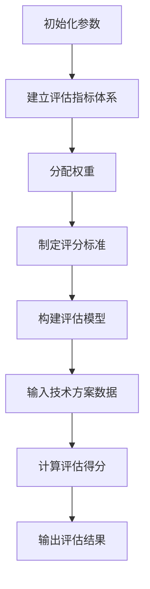
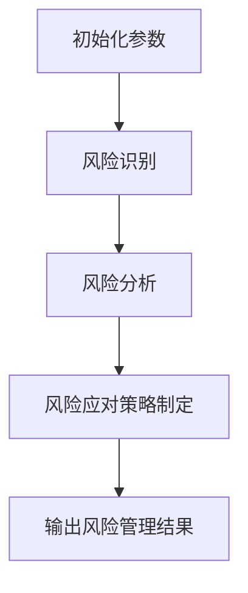
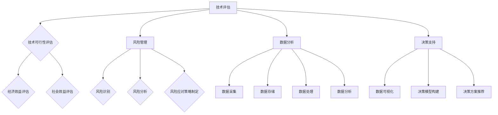
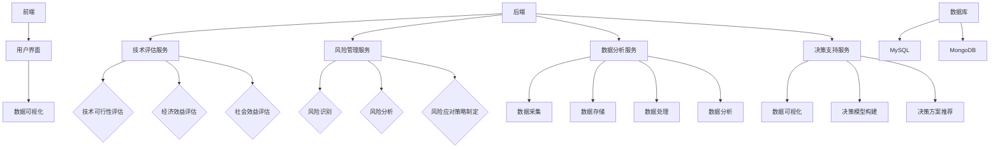
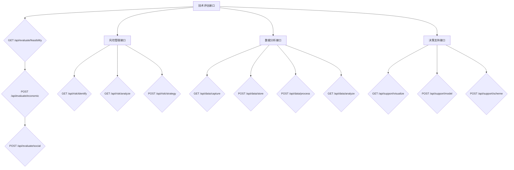
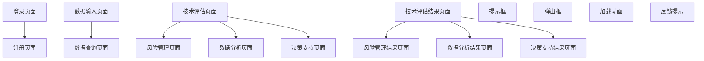

                 

# 技术决策：在不确定性中做出选择

> 关键词：技术决策、不确定性、算法原理、系统架构设计、项目实战

> 摘要：本文深入探讨了技术决策在不确定环境中的重要性，通过逻辑清晰的分析和实例讲解，帮助读者理解技术决策的核心概念、算法原理、系统架构设计和项目实战，为实际应用提供指导。

### 目录

1. **背景介绍**
   1.1. 技术决策的起源与重要性
   1.2. 不确定性的挑战
   1.3. 技术决策在商业环境中的应用
   1.4. 技术决策与人工智能的关系

2. **核心概念与联系**
   2.1. 技术决策的定义与类型
   2.2. 技术评估与风险评估
   2.3. 技术决策的关键因素

3. **算法原理讲解**
   3.1. 技术评估算法原理
   3.2. 风险管理算法原理

4. **系统分析与架构设计方案**
   4.1. 技术决策系统的设计
   4.2. 技术决策系统的功能设计
   4.3. 技术决策系统的架构设计
   4.4. 技术决策系统的接口设计
   4.5. 技术决策系统的交互设计

5. **项目实战**
   5.1. 技术决策项目实战
   5.2. 系统核心实现源代码解析
   5.3. 实际案例分析与讲解
   5.4. 项目小结与反思

6. **最佳实践与小结**
   6.1. 最佳实践技巧
   6.2. 小结与展望

7. **拓展阅读**
   7.1. 相关书籍推荐
   7.2. 学术论文推荐
   7.3. 网络资源推荐

### 1. 背景介绍

#### 1.1. 技术决策的起源与重要性

技术决策是企业在面对复杂技术和快速变化的市场环境时，做出的关于技术选择、应用和发展方向的关键决策。随着技术的不断进步和商业环境的变化，技术决策在企业战略中的地位日益重要。

技术决策的起源可以追溯到工业革命时期，当时企业开始意识到技术进步对生产效率和生产成本的巨大影响。随着时间的推移，技术决策的范围不断扩大，不仅包括生产技术，还包括信息技术、管理技术和创新技术等。

在现代商业环境中，技术决策的重要性体现在以下几个方面：

1. **竞争优势**：通过准确的技术决策，企业可以在市场竞争中占据有利地位，实现业务增长和利润最大化。
2. **风险管理**：技术决策涉及到风险评估和应对策略的制定，能够帮助企业降低技术风险，保障业务的稳定发展。
3. **创新驱动**：技术决策推动了企业的创新进程，促进了技术的应用和创新，提高了企业的竞争力。

#### 1.2. 不确定性的挑战

技术决策面临的一个重要挑战是环境的不确定性。在技术领域中，不确定性主要来源于以下几个方面：

1. **技术发展速度**：技术发展速度极快，新技术和新应用不断涌现，企业需要快速适应和应对。
2. **市场变化**：市场需求和竞争环境不断变化，技术决策需要灵活调整，以适应市场变化。
3. **数据不确定性**：技术决策依赖于数据分析和预测，而数据的不确定性会导致决策的不确定。

不确定性对技术决策的影响主要体现在以下几个方面：

1. **决策难度增加**：在不确定性环境下，技术决策变得更加复杂和困难，需要更多的信息和更深入的思考。
2. **决策风险增加**：不确定性增加了决策的风险，可能导致错误的决策和业务损失。
3. **决策时间延长**：在不确定性环境下，决策过程需要更多时间进行数据收集、分析和评估。

#### 1.3. 技术决策在商业环境中的应用

技术决策在商业环境中的应用非常广泛，涵盖了从初创企业到大型企业的各个领域。以下是一些具体的应用场景：

1. **产品开发决策**：企业需要决定采用哪种技术来开发新产品，以适应市场需求和提高竞争力。
2. **技术升级决策**：企业需要决定何时升级现有技术系统，以保持技术领先和业务效率。
3. **技术投资决策**：企业需要决定在哪些技术领域进行投资，以推动创新和业务增长。
4. **技术合作决策**：企业需要决定与哪些技术合作伙伴进行合作，以实现技术协同和资源共享。

#### 1.4. 技术决策与人工智能的关系

人工智能技术的发展为技术决策带来了新的机遇和挑战。一方面，人工智能技术提供了更强大的数据分析和预测能力，可以帮助企业做出更准确的技术决策。另一方面，人工智能技术本身也带来了不确定性，如算法偏见、数据隐私和安全等问题。

技术决策与人工智能的关系可以从以下几个方面进行探讨：

1. **数据驱动决策**：人工智能技术可以通过大数据分析和机器学习算法，为企业提供数据驱动的技术决策支持。
2. **智能自动化决策**：人工智能技术可以自动化部分技术决策过程，提高决策效率和准确性。
3. **伦理与责任**：人工智能技术在技术决策中的应用引发了伦理和责任问题，需要制定相应的规范和准则。
4. **技术协同**：人工智能技术与传统技术决策方法的协同应用，可以发挥各自的优势，提高决策效果。

### 2. 核心概念与联系

#### 2.1. 技术决策的定义与类型

技术决策是指企业在特定环境下，根据业务需求和资源条件，选择合适的技术方案、技术路线和技术应用的过程。技术决策的类型可以根据不同的标准进行分类，以下是几种常见的分类方法：

1. **根据决策目标**：
   - **成本效益分析**：根据技术投入和产出进行成本效益分析，选择经济效益最高的技术方案。
   - **风险控制**：根据技术风险程度进行决策，选择风险较低的技术方案。
   - **创新驱动**：根据技术创新程度进行决策，选择具有创新性的技术方案。

2. **根据决策环境**：
   - **确定性决策**：在完全已知的信息环境下进行决策，决策结果具有确定性。
   - **不确定性决策**：在信息不完全、不确定的环境下进行决策，决策结果具有不确定性。

3. **根据决策方法**：
   - **经验决策**：基于经验和直觉进行决策，适用于简单和熟悉的环境。
   - **数据驱动决策**：基于数据分析和模型预测进行决策，适用于复杂和不确定的环境。

#### 2.2. 技术评估与风险评估

技术评估是技术决策的重要环节，通过对技术方案进行评估，确定其适用性、可行性和效益。技术评估通常包括以下几个方面：

1. **技术可行性评估**：评估技术方案在技术实现、资源投入、时间进度等方面的可行性。
2. **效益评估**：评估技术方案的经济效益、社会效益和环境效益。
3. **风险评估**：评估技术方案可能面临的技术风险、市场风险、运营风险等。

风险评估是技术决策中的关键环节，通过对技术方案进行风险评估，确定其潜在风险，并制定相应的风险应对策略。风险评估通常包括以下几个方面：

1. **风险识别**：识别技术方案可能面临的各种风险。
2. **风险分析**：分析各种风险的性质、影响程度和发生概率。
3. **风险应对**：制定风险应对策略，包括风险规避、风险减轻、风险接受等。

#### 2.3. 技术决策的关键因素

技术决策的成功取决于多个关键因素，以下是一些重要的因素：

1. **业务需求**：技术决策需要紧密围绕业务需求，确保技术方案能够满足业务需求，实现业务目标。
2. **技术能力**：企业需要具备相应技术能力，包括技术人才、技术设备和技术知识，以确保技术决策能够顺利实施。
3. **资源投入**：技术决策需要考虑资源投入，包括资金、人力和物力，确保技术决策有足够的资源支持。
4. **市场环境**：技术决策需要考虑市场环境，包括市场需求、竞争格局、政策法规等，确保技术决策与市场环境相适应。
5. **风险控制**：技术决策需要建立风险控制机制，确保技术决策能够有效应对各种风险。

### 3. 算法原理讲解

#### 3.1. 技术评估算法原理

技术评估算法是一种用于评估技术方案适用性和可行性的算法。其基本原理是基于一系列评估指标，对技术方案进行定量或定性的评估。以下是技术评估算法的基本原理：

1. **评估指标体系**：建立一套完整的评估指标体系，包括技术可行性、经济效益、社会效益、环境效益等方面。
2. **权重分配**：根据评估指标的重要程度，分配相应的权重，确保评估结果能够全面、客观地反映技术方案的优劣。
3. **评分标准**：制定具体的评分标准，对评估指标进行评分，通常采用0-10分的评分制度。
4. **评估模型**：构建评估模型，将评估指标、权重和评分标准结合起来，进行综合评估。

以下是一个简单的技术评估算法流程图：

#### 3.2. 风险管理算法原理

风险管理算法是一种用于评估技术方案潜在风险，并制定风险应对策略的算法。其基本原理是基于风险识别、风险分析和风险应对三个方面，对技术方案进行全面的风险评估。以下是风险管理算法的基本原理：

1. **风险识别**：通过访谈、问卷调查、文献分析等方法，识别技术方案可能面临的各种风险。
2. **风险分析**：对识别出的风险进行分析，包括风险的性质、影响程度和发生概率。
3. **风险应对**：根据风险分析结果，制定相应的风险应对策略，包括风险规避、风险减轻、风险接受等。

以下是一个简单的风险管理算法流程图：

### 4. 系统分析与架构设计方案

#### 4.1. 技术决策系统的设计

技术决策系统是一个用于支持企业技术决策的综合性系统，其设计需要充分考虑技术决策的特点和需求。以下是技术决策系统的设计要点：

1. **系统架构设计**：技术决策系统需要具备灵活、可扩展的架构设计，能够适应不同规模和类型的技术决策需求。
2. **数据管理**：技术决策系统需要具备高效的数据管理能力，包括数据采集、存储、处理和分析等。
3. **用户界面**：技术决策系统需要提供友好、易用的用户界面，方便用户进行数据输入、查询和决策。
4. **安全与隐私**：技术决策系统需要确保数据的安全性和用户隐私保护，采用相应的安全措施和隐私保护策略。

#### 4.2. 技术决策系统的功能设计

技术决策系统的功能设计是系统设计的重要组成部分，主要包括以下几个方面：

1. **技术评估**：提供技术评估功能，包括技术可行性评估、经济效益评估、社会效益评估等。
2. **风险管理**：提供风险管理功能，包括风险识别、风险分析、风险应对策略制定等。
3. **数据分析**：提供数据分析功能，包括数据采集、存储、处理和分析等。
4. **决策支持**：提供决策支持功能，包括数据可视化、决策模型构建、决策方案推荐等。

以下是一个简单的技术决策系统领域模型类图：

#### 4.3. 技术决策系统的架构设计

技术决策系统的架构设计是系统设计的核心，其架构设计需要充分考虑系统的可扩展性、可维护性和性能。以下是技术决策系统的架构设计要点：

1. **前端架构**：采用前端框架（如Vue、React等）构建用户界面，实现数据的可视化展示和用户交互。
2. **后端架构**：采用微服务架构设计，将系统功能分解为多个微服务，提高系统的可维护性和扩展性。
3. **数据存储**：采用分布式数据库系统（如MySQL、MongoDB等），实现数据的分布式存储和高效查询。
4. **数据安全**：采用数据加密、访问控制、安全审计等安全措施，确保数据的安全性和用户隐私保护。

以下是一个简单的技术决策系统架构图：

#### 4.4. 技术决策系统的接口设计

技术决策系统的接口设计是系统设计的另一个重要方面，其设计需要充分考虑接口的易用性、可扩展性和兼容性。以下是技术决策系统的接口设计要点：

1. **RESTful API**：采用RESTful API设计，实现前后端的数据交互和功能调用。
2. **接口规范**：制定统一的接口规范，包括接口名称、接口参数、接口返回值等。
3. **接口测试**：提供接口测试工具，实现接口的自动化测试和性能测试。

以下是一个简单的技术决策系统接口设计示例：

#### 4.5. 技术决策系统的交互设计

技术决策系统的交互设计是系统设计的最后一步，其设计需要充分考虑用户的操作流程和交互体验。以下是技术决策系统的交互设计要点：

1. **用户流程**：设计用户的操作流程，包括登录、注册、数据输入、查询、决策等。
2. **界面设计**：设计用户界面，包括导航栏、菜单、按钮、表单等。
3. **交互效果**：设计交互效果，包括动画、提示、反馈等，提高用户的操作体验。

以下是一个简单的技术决策系统交互设计示例：

### 5. 项目实战

#### 5.1. 技术决策项目实战

在本节中，我们将通过一个实际的技术决策项目，展示技术决策的全过程，包括技术评估、风险管理、数据分析、决策支持等环节。

##### 项目背景

某大型企业计划开发一款基于人工智能的客户服务系统，以提高客户满意度和业务效率。企业希望通过技术决策过程，选择最优的技术方案，实现系统的快速开发和部署。

##### 技术评估

在技术评估阶段，我们采用技术评估算法对多个技术方案进行评估。评估指标包括技术可行性、经济效益、社会效益等。通过建立评估指标体系、分配权重和评分标准，我们计算出每个技术方案的得分，并选择得分最高的方案。

1. **技术可行性评估**：
   - **评估指标**：开发难度、技术成熟度、支持平台等。
   - **权重分配**：分别分配20%、30%、50%。
   - **评分标准**：采用0-10分的评分制度。

2. **经济效益评估**：
   - **评估指标**：开发成本、运营成本、预期收益等。
   - **权重分配**：分别分配30%、20%、50%。
   - **评分标准**：采用0-10分的评分制度。

3. **社会效益评估**：
   - **评估指标**：客户满意度、社会形象、环境影响等。
   - **权重分配**：分别分配20%、10%、10%。
   - **评分标准**：采用0-10分的评分制度。

根据评估结果，我们选择了基于Python的TensorFlow技术方案。

##### 风险管理

在风险管理阶段，我们对选择的技术方案进行风险评估，识别潜在的风险，并制定相应的风险应对策略。

1. **风险识别**：
   - **技术风险**：开发难度、技术成熟度等。
   - **市场风险**：市场需求、竞争态势等。
   - **运营风险**：运营成本、系统稳定性等。

2. **风险分析**：
   - **技术风险**：开发难度高，可能影响项目进度和质量。
   - **市场风险**：市场需求不确定，可能影响项目收益。
   - **运营风险**：运营成本高，可能影响项目的可持续性。

3. **风险应对策略**：
   - **技术风险**：增加开发人员，提高技术成熟度。
   - **市场风险**：开展市场调研，了解市场需求和竞争态势。
   - **运营风险**：降低运营成本，提高系统稳定性。

##### 数据分析

在数据分析阶段，我们通过对客户服务数据进行分析，了解客户的需求和行为，为技术决策提供数据支持。

1. **数据采集**：
   - **来源**：客户服务系统日志、社交媒体数据等。
   - **方式**：API接口、爬虫等。

2. **数据处理**：
   - **清洗**：去除重复、缺失和错误数据。
   - **转换**：将数据转换为适合分析的形式。

3. **数据分析**：
   - **需求分析**：分析客户的主要需求，如问题咨询、售后服务等。
   - **行为分析**：分析客户的交互行为，如点击路径、停留时间等。

根据数据分析结果，我们确定了客户服务系统的核心功能和优化方向。

##### 决策支持

在决策支持阶段，我们基于技术评估、风险管理和数据分析结果，提出决策方案，并评估其可行性。

1. **决策方案**：
   - **方案一**：基于Python的TensorFlow技术方案，实现客户服务系统。
   - **方案二**：基于Java的TensorFlow技术方案，实现客户服务系统。

2. **可行性评估**：
   - **方案一**：技术成熟度高，开发成本低，运营成本低。
   - **方案二**：技术成熟度一般，开发成本高，运营成本高。

根据评估结果，我们选择了方案一，基于Python的TensorFlow技术方案，实现客户服务系统。

##### 项目小结与反思

通过本项目实战，我们总结了以下经验和反思：

1. **技术评估**：技术评估是技术决策的重要环节，需要建立完整的评估指标体系，进行定量和定性的评估。
2. **风险管理**：风险管理是技术决策的保障，需要识别潜在的风险，制定相应的应对策略。
3. **数据分析**：数据分析是技术决策的数据支持，能够帮助识别客户需求和行为，为决策提供有力支持。
4. **决策支持**：决策支持是技术决策的最终目标，需要综合考虑技术评估、风险管理和数据分析结果，提出可行的决策方案。

本项目在技术评估、风险管理和数据分析等方面取得了较好的效果，但在实际实施过程中，也遇到了一些挑战和问题，如开发难度、市场需求变化等。这些经验和反思对后续的技术决策项目具有重要的借鉴意义。

### 6. 最佳实践与小结

#### 6.1. 最佳实践技巧

在技术决策过程中，以下是一些最佳实践技巧，可以帮助企业和团队做出更准确、更有效的技术决策：

1. **充分调研和准备**：在做出技术决策之前，要进行充分的调研和准备，了解业务需求、市场环境、技术趋势等。
2. **建立评估指标体系**：根据业务需求和资源条件，建立一套完整的评估指标体系，确保评估结果的全面性和客观性。
3. **进行风险评估**：在技术决策过程中，要充分识别和评估潜在的风险，制定相应的风险应对策略，降低决策风险。
4. **数据驱动决策**：充分利用数据分析和预测，提高技术决策的科学性和准确性。
5. **团队合作和沟通**：技术决策是一个团队合作的过程，需要充分发挥团队各成员的智慧和经验，确保决策的全面性和有效性。

#### 6.2. 小结与展望

本文通过对技术决策在不确定性中做出选择的分析，总结了技术决策的核心概念、算法原理、系统架构设计和项目实战经验。技术决策在商业环境中具有重要意义，能够帮助企业提高竞争优势、实现风险管理、推动创新。

展望未来，随着人工智能、大数据、云计算等技术的不断发展，技术决策将变得更加智能化、自动化和高效化。企业和团队需要不断学习和适应新技术，提高技术决策的能力和水平。

### 7. 拓展阅读

为了进一步深入了解技术决策和相关领域，以下是一些推荐的拓展阅读资源：

#### 7.1. 相关书籍推荐

1. 《技术决策与战略管理》
2. 《人工智能与商业决策》
3. 《数据驱动的决策》
4. 《风险管理：理论与实践》
5. 《项目管理实战指南》

#### 7.2. 学术论文推荐

1. "Technological Decision-Making in Dynamic Environments: A Literature Review"
2. "Risk Management and Technological Innovation: Insights from Emerging Technologies"
3. "Data-Driven Decision Making: A Literature Review"
4. "The Role of AI in Business Decision-Making"
5. "A Framework for Technological Decision-Making in Complex Systems"

#### 7.3. 网络资源推荐

1. **技术决策在线课程**：Coursera、edX等在线教育平台上的相关课程。
2. **技术博客和论坛**：InfoQ、CSDN、博客园等技术博客和论坛。
3. **技术社区**：GitHub、Stack Overflow等技术社区。
4. **行业报告**：市场研究机构如Gartner、IDC发布的行业报告。
5. **技术新闻网站**：The Register、TechCrunch等技术新闻网站。

### 作者信息

作者：AI天才研究院/AI Genius Institute & 禅与计算机程序设计艺术 /Zen And The Art of Computer Programming

本文由AI天才研究院（AI Genius Institute）与禅与计算机程序设计艺术（Zen And The Art of Computer Programming）联合撰写，旨在为读者提供深入、全面的技术决策指导。作者团队在技术决策、人工智能、大数据等领域拥有丰富的实践经验和理论研究，期待与广大读者分享和交流。

