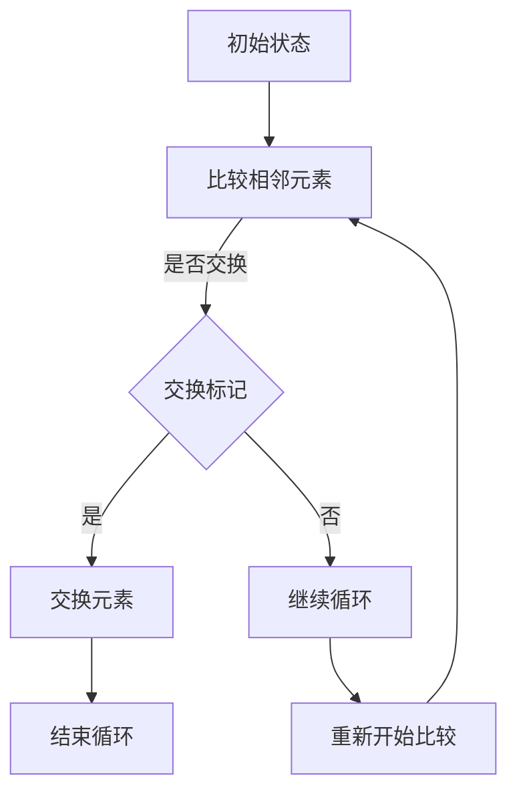
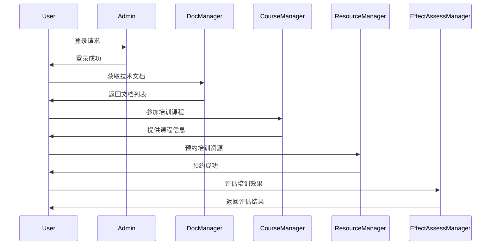
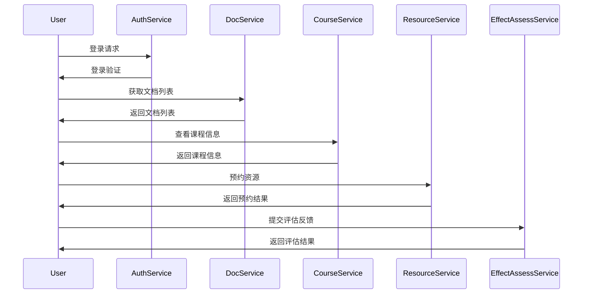

                 

# 技术分享与内部培训体系搭建

## 摘要

本文将深入探讨技术分享与内部培训体系的重要性及其搭建过程。我们将从背景介绍、核心概念与联系、算法原理讲解、数学模型和公式详细讲解、系统分析与架构设计方案、项目实战以及最佳实践等多个方面，系统地阐述这一主题。文章旨在帮助读者理解技术分享和内部培训体系的构建，并提供实用的指导和方法，使企业或团队能够有效地提升技术水平和团队协作能力。

## 目录

1. **引言**
   - 1.1 《技术分享与内部培训体系搭建》概述
   - 1.2 技术分享的意义
   - 1.3 内部培训体系的必要性

2. **背景介绍**
   - 2.1 核心概念术语说明
   - 2.2 问题背景与问题描述
   - 2.3 问题解决与边界外延
   - 2.4 概念结构与核心要素组成

3. **核心概念与联系**
   - 3.1 技术分享的概念与联系
   - 3.2 内部培训体系的概念与联系
   - 3.3 技术文档编写与课程开发
   - 3.4 培训效果评估与案例分析

4. **算法原理讲解**
   - 4.1 算法原理概述
   - 4.2 算法mermaid流程图展示
   - 4.3 算法Python源代码与解释
   - 4.4 算法数学模型与公式讲解
   - 4.5 通俗易懂地举例说明

5. **数学模型和公式详细讲解**
   - 5.1 数学模型概述
   - 5.2 latex格式数学公式嵌入
   - 5.3 公式详细讲解与举例

6. **系统分析与架构设计方案**
   - 6.1 问题场景介绍
   - 6.2 系统功能设计与领域模型类图
   - 6.3 系统架构设计与架构图
   - 6.4 系统接口设计与交互序列图

7. **项目实战**
   - 7.1 环境安装与系统核心实现
   - 7.2 代码应用解读与分析
   - 7.3 实际案例分析与详细讲解
   - 7.4 项目小结

8. **最佳实践 tips**
   - 8.1 技术分享最佳实践
   - 8.2 内部培训最佳实践
   - 8.3 培训效果评估最佳实践
   - 8.4 案例分析与经验教训

9. **小结与注意事项**
   - 9.1 小结
   - 9.2 注意事项

10. **拓展阅读**
    - 10.1 相关书籍推荐
    - 10.2 学术论文推荐
    - 10.3 网络资源推荐

## 1. 引言

### 1.1 《技术分享与内部培训体系搭建》概述

在信息技术快速发展的今天，技术分享与内部培训体系的重要性日益凸显。一方面，技术分享能够促进知识的传播和创新，提升团队整体技术能力；另一方面，内部培训体系能够系统地培养和提升员工的技能水平，从而增强企业的核心竞争力。本文将围绕这两个核心主题，详细探讨其概念、原理、实践和最佳方法。

文章将首先介绍技术分享和内部培训体系的定义和重要性，接着深入分析相关核心概念及其联系。在此基础上，我们将讲解算法原理和数学模型，并通过实际项目实战来展示技术分享和内部培训体系的实际应用。最后，我们将总结最佳实践，并提供相关的拓展阅读资源。

### 1.2 技术分享的意义

技术分享是信息技术领域一项至关重要的活动，它不仅有助于知识的传播和交流，还能够促进技术的创新和发展。以下是技术分享的几个重要意义：

#### 知识传播

技术分享能够将个人的知识和经验传递给他人，使得更多的开发者能够接触到最新的技术动态和最佳实践。通过技术分享，个人可以分享自己的成功经验和教训，从而帮助他人避免走弯路。

#### 促进创新

技术分享能够激发创新思维，通过交流不同的观点和思路，可以产生新的想法和解决方案。这种创新不仅体现在技术层面，还可以推动企业或团队的管理和运营模式的改进。

#### 提升团队技术能力

通过技术分享，团队成员可以互相学习和借鉴，从而提升整体的技术能力。这不仅有助于提高团队解决实际问题的能力，还能够增强团队的凝聚力和合作精神。

#### 提升个人技能

技术分享不仅可以提升团队的技术水平，也能够帮助个人不断学习和进步。通过分享和学习，个人可以深入了解各种技术细节，从而提升自己的专业技能。

### 1.3 内部培训体系的必要性

内部培训体系是企业发展的重要组成部分，它不仅能够提升员工的专业技能，还能够促进企业的可持续发展。以下是内部培训体系的一些必要性：

#### 增强员工专业技能

内部培训体系能够系统地培养和提升员工的专业技能，使其更好地适应企业的发展和变化。通过培训，员工可以学习到最新的技术知识和工作方法，从而提高工作效率和质量。

#### 提升企业核心竞争力

内部培训体系能够提升员工的专业技能和综合素质，从而增强企业的核心竞争力。一个拥有高素质员工的团队，能够更好地应对市场挑战，取得竞争优势。

#### 促进团队协作

内部培训体系能够促进团队成员之间的协作和交流，增强团队凝聚力。通过培训，员工可以相互学习、分享经验和心得，从而提升团队的整体工作效率。

#### 适应企业发展

随着企业的发展和业务的变化，内部培训体系能够及时调整和优化，以适应企业的新需求。这种适应性有助于企业保持持续发展的动力。

## 2. 背景介绍

### 2.1 核心概念术语说明

在本章节中，我们将介绍一些与技术分享与内部培训体系相关的核心概念术语，包括但不限于以下内容：

#### 技术分享

技术分享是指通过线上或线下方式，将个人的技术知识、经验和见解与他人分享，以达到知识传播、创新和提升个人技能的目的。

#### 内部培训体系

内部培训体系是指企业或组织内部建立的一系列培训机制和流程，旨在系统地培养和提升员工的专业技能和综合素质。

#### 技术文档

技术文档是指用于记录和传达技术知识、方法和经验的文档，包括但不限于开发文档、用户手册、操作指南等。

#### 培训课程

培训课程是指针对特定主题或技能的培训活动，通常包括教学计划、课程内容、教学方法等。

#### 培训效果评估

培训效果评估是指通过一定方法和工具，对培训过程和结果进行评估，以判断培训目标的达成情况和效果。

### 2.2 问题背景与问题描述

在当前信息化时代，企业和团队面临着越来越多的技术挑战和竞争压力。为了适应这种变化，技术分享与内部培训体系显得尤为重要。然而，在实践中，我们常常会遇到以下问题：

#### 技术分享不足

许多企业和团队缺乏有效的技术分享机制，导致技术知识和经验的积累和传递受阻，限制了团队的技术发展。

#### 内部培训缺乏系统性

内部培训往往缺乏系统性规划和设计，导致培训内容不全面、培训效果不佳，无法满足员工和企业的实际需求。

#### 培训资源不足

企业或团队在培训资源上存在不足，如培训师资力量、培训场地和培训工具等，影响了内部培训的顺利进行。

#### 培训效果评估困难

由于缺乏有效的培训效果评估方法和工具，企业和团队难以准确判断培训的效果，无法及时调整和优化培训策略。

### 2.3 问题解决与边界外延

为了解决上述问题，我们需要搭建一个完善的技术分享与内部培训体系。以下是一些可能的解决方案：

#### 建立技术分享平台

通过建立内部技术分享平台，如内部博客、知识库、论坛等，为员工提供一个交流和分享技术的场所。这有助于促进技术知识的传播和积累，提高团队的技术水平。

#### 设计系统化培训课程

根据企业或团队的发展需求和员工的实际情况，设计系统化的培训课程。这包括课程内容的设计、教学方法的确定和培训资源的配备等。

#### 优化培训资源

通过引入外部培训资源，如培训课程、讲师、培训工具等，优化内部培训资源，提高培训质量和效果。

#### 完善培训效果评估体系

建立完善的培训效果评估体系，包括评估指标、评估方法和评估工具等，以准确判断培训的效果，为培训的持续改进提供依据。

### 2.4 概念结构与核心要素组成

技术分享与内部培训体系是一个复杂的系统，其概念结构与核心要素组成如下：

#### 概念结构

1. 技术分享
   - 平台建设
   - 知识管理
   - 分享激励机制
2. 内部培训体系
   - 培训需求分析
   - 培训课程设计
   - 培训资源管理
   - 培训效果评估
3. 技术文档编写
   - 文档格式与规范
   - 文档编写工具
   - 文档版本控制
4. 培训课程开发
   - 教学内容设计
   - 教学方法选择
   - 教学资源管理
5. 培训效果评估
   - 评估指标设计
   - 评估方法选择
   - 评估结果分析

#### 核心要素组成

1. 人
   - 培训讲师
   - 受训员工
   - 管理人员
2. 资源
   - 培训场地
   - 培训设备
   - 教学资源
3. 流程
   - 技术分享流程
   - 培训流程
   - 效果评估流程
4. 技术
   - 知识库系统
   - 教学管理系统
   - 效果评估系统

## 3. 核心概念与联系

在深入探讨技术分享与内部培训体系之前，有必要明确几个核心概念及其相互联系。这些概念包括技术文档、培训课程、培训效果评估等，它们是构建一个有效培训体系的基础。

### 3.1 技术分享的概念与联系

技术分享是指通过多种方式，如内部博客、论坛、会议、内部课程等，将个人或团队的技术知识、经验和见解与他人共享。技术分享不仅仅是知识的传递，更是一个激发创新、提高团队协作和技能水平的有效手段。

- **知识管理**：技术分享是知识管理的重要组成部分。通过技术分享，企业可以将散落在各个部门和个人手中的知识集中起来，形成系统的知识库，便于后续的知识传承和创新。
- **团队协作**：技术分享能够促进团队成员之间的交流和合作，减少信息孤岛现象，提高团队的整体效率和创新能力。
- **个人成长**：技术分享不仅有助于团队，也能够促进个人的技术成长。通过分享和学习，个人可以深入了解不同领域的知识，拓宽视野，提升技能。

### 3.2 内部培训体系的概念与联系

内部培训体系是指企业或组织内部建立的一套完整的培训机制和流程，旨在通过系统的培训活动，提升员工的专业技能和综合素质。一个有效的内部培训体系应当包括以下几个关键组成部分：

- **培训需求分析**：了解员工的培训需求和企业的长远发展目标，是设计培训课程和培训方案的基础。通过需求分析，可以确保培训内容与实际需求相匹配。
- **培训课程设计**：根据培训需求，设计适合不同层次员工的培训课程。课程设计应当涵盖理论知识、实践操作和案例分析等多个方面，确保培训的全面性和实用性。
- **培训资源管理**：培训资源包括培训场地、设备、教材、讲师等。有效的资源管理可以确保培训的顺利进行，并最大化地利用企业现有的资源。
- **培训效果评估**：通过评估培训的效果，可以及时了解培训的实际效果，发现问题和不足，为后续的培训提供改进的方向。

### 3.3 技术文档编写与课程开发

技术文档和培训课程是内部培训体系的重要组成部分，它们相互联系，共同构成了知识传承和技能提升的重要渠道。

- **技术文档**：技术文档是记录和传递技术知识的重要工具。良好的技术文档可以帮助新员工快速上手，促进知识的传承和创新。技术文档的内容应包括项目背景、功能描述、技术实现细节、常见问题及解决方案等。
- **培训课程开发**：培训课程开发是将技术文档中的知识转化为培训内容的过程。课程开发应充分考虑员工的实际需求和知识水平，设计出具有针对性的培训课程。课程开发的内容应包括课程目标、课程内容、教学方法、教学资源等。

### 3.4 培训效果评估与案例分析

培训效果评估是内部培训体系中的关键环节，它可以帮助企业或组织了解培训的实际效果，为后续的培训提供改进的方向。

- **评估方法**：培训效果评估的方法包括定量评估和定性评估。定量评估通常通过测试、问卷调查等方式，收集员工的反馈和成绩数据；定性评估则通过观察、访谈等方式，了解员工对培训的感受和培训内容的实用性。
- **案例分析**：案例分析是培训效果评估的重要手段之一。通过分析成功的案例，可以总结出有效的培训经验和做法，为后续的培训提供参考。案例分析的内容应包括培训目标的设定、培训内容的设计、培训方法的选择、培训效果的评估等。

### 3.5 相关概念对比与联系

以下是几个相关概念之间的对比和联系：

#### 技术分享与内部培训

- **技术分享**：侧重于知识的传播和共享，是一种自发性的知识交流活动。
- **内部培训**：侧重于系统的技能提升和知识传承，是一种有组织、有计划的培训活动。

#### 技术文档与培训课程

- **技术文档**：侧重于知识的记录和传递，是一种静态的知识载体。
- **培训课程**：侧重于知识的传授和应用，是一种动态的教学活动。

#### 培训效果评估与案例分析

- **培训效果评估**：侧重于评估培训的实际效果，是一种客观的数据分析过程。
- **案例分析**：侧重于总结成功的培训经验，是一种主观的经验总结过程。

通过以上对比，我们可以更清晰地理解技术分享与内部培训体系中的各个概念及其相互联系。这些概念共同构成了一个完整、系统的培训体系，有助于企业或组织不断提升员工的技术水平和整体竞争力。

## 4. 算法原理讲解

### 4.1 算法原理概述

在技术分享与内部培训体系搭建中，算法原理讲解是一个重要的环节。算法原理不仅是技术文档编写的基础，也是培训课程的核心内容。以下是对算法原理的概述及其重要性。

#### 算法原理的定义

算法原理是指解决问题的基本步骤和方法。它通常包括输入、处理和输出三个基本部分。一个有效的算法不仅需要解决问题的正确性，还需要考虑其时间复杂度和空间复杂度，以达到高效和优化的目的。

#### 算法原理的重要性

- **提高理解能力**：通过讲解算法原理，员工可以深入理解技术问题的本质，从而提高解决问题的能力。
- **促进创新思维**：算法原理讲解能够启发员工的创新思维，帮助他们在实际工作中提出新的解决方案。
- **增强团队协作**：算法原理讲解有助于团队成员之间的技术交流，促进团队协作和知识共享。
- **提升专业素养**：系统化的算法原理讲解可以提升员工的专业素养，使其在技术领域具备更强的竞争力。

### 4.2 算法mermaid流程图展示

为了更直观地展示算法原理，我们可以使用mermaid流程图进行说明。以下是一个简单的排序算法（冒泡排序）的mermaid流程图：



### 4.3 算法Python源代码与解释

下面是冒泡排序算法的Python源代码及解释：

```python
def bubble_sort(arr):
    n = len(arr)
    # 外循环，每次遍历都会将一个未排序的最大元素放到最后
    for i in range(n):
        # 内循环，每一轮遍历都会使一个未排序的最大元素冒泡到数组末尾
        for j in range(0, n-i-1):
            if arr[j] > arr[j+1]:
                # 交换元素
                arr[j], arr[j+1] = arr[j+1], arr[j]

# 示例
arr = [64, 34, 25, 12, 22, 11, 90]
bubble_sort(arr)
print("排序后的数组：")
for i in range(len(arr)):
    print("%d" % arr[i])
```

**解释**：

1. **外循环**：每次遍历都会将一个未排序的最大元素放到数组的末尾。
2. **内循环**：每一轮遍历都会使一个未排序的最大元素冒泡到数组的末尾。
3. **交换元素**：如果当前元素比下一个元素大，则交换它们。

### 4.4 算法数学模型与公式讲解

冒泡排序的数学模型和公式如下：

- **时间复杂度**：$T(n) = O(n^2)$
- **空间复杂度**：$S(n) = O(1)$

**时间复杂度解释**：

- **最好情况**：当输入数组已经排序时，冒泡排序只需要进行一次遍历，时间复杂度为$O(n)$。
- **最坏情况**：当输入数组完全逆序时，需要$n-1$次遍历，每次遍历比较$n-i-1$对元素，时间复杂度为$O(n^2)$。

**空间复杂度解释**：

- **最好情况**：在最好情况下，不需要额外的存储空间，空间复杂度为$O(1)$。
- **最坏情况**：在最坏情况下，每次遍历都需要一个临时的变量来保存要交换的元素，空间复杂度也为$O(1)$。

### 4.5 通俗易懂地举例说明

假设我们有以下数组：\[64, 34, 25, 12, 22, 11, 90\]

#### 第1轮：

- 比较 (64, 34)，不需要交换。
- 比较 (34, 25)，需要交换：\[34, 25, 64, 12, 22, 11, 90\]
- 比较 (64, 12)，需要交换：\[34, 25, 12, 64, 22, 11, 90\]
- 比较 (64, 22)，需要交换：\[34, 25, 12, 22, 64, 11, 90\]
- 比较 (64, 11)，需要交换：\[34, 25, 12, 22, 11, 64, 90\]
- 比较 (64, 90)，不需要交换。

#### 第2轮：

- 比较 (34, 25)，需要交换：\[25, 34, 12, 22, 11, 64, 90\]
- 比较 (34, 12)，需要交换：\[25, 12, 34, 22, 11, 64, 90\]
- 比较 (34, 22)，需要交换：\[25, 12, 22, 34, 11, 64, 90\]
- 比较 (34, 11)，需要交换：\[25, 12, 22, 11, 34, 64, 90\]
- 比较 (34, 64)，不需要交换。

#### 第3轮：

- 比较 (25, 12)，需要交换：\[12, 25, 22, 11, 34, 64, 90\]
- 比较 (25, 22)，不需要交换。
- 比较 (25, 11)，需要交换：\[12, 22, 11, 25, 34, 64, 90\]
- 比较 (25, 34)，不需要交换。

#### 第4轮：

- 比较 (22, 11)，需要交换：\[12, 11, 22, 25, 34, 64, 90\]
- 比较 (22, 25)，不需要交换。
- 比较 (25, 34)，不需要交换。

#### 第5轮：

- 比较 (11, 34)，不需要交换。
- 比较 (34, 64)，不需要交换。

最终，数组被排序为：\[11, 12, 22, 25, 34, 64, 90\]

通过这个例子，我们可以清晰地看到冒泡排序的工作原理。每次遍历都会使未排序的最大元素“冒泡”到数组的末尾，直到整个数组被排序。

## 5. 数学模型和公式详细讲解

在技术分享与内部培训体系中，数学模型和公式的详细讲解是至关重要的。数学模型不仅能够帮助我们更好地理解和分析算法，还能够为实际问题的解决提供理论基础。以下是关于数学模型和公式的一些详细讲解，包括如何使用latex格式嵌入数学公式，以及如何进行通俗易懂的举例说明。

### 5.1 数学模型概述

在算法分析和系统设计中，常见的数学模型包括时间复杂度模型、空间复杂度模型、概率模型和优化模型等。这些模型用于评估算法的性能和系统的效率，帮助我们做出科学合理的决策。

#### 时间复杂度模型

时间复杂度模型用于评估算法执行的时间效率。常见的复杂度包括：

- **线性复杂度**：$O(n)$，表示算法执行时间与输入规模线性相关。
- **对数复杂度**：$O(log n)$，表示算法执行时间与输入规模的对数相关。
- **平方复杂度**：$O(n^2)$，表示算法执行时间与输入规模的平方相关。

#### 空间复杂度模型

空间复杂度模型用于评估算法执行时所需的空间。常见的复杂度包括：

- **常数空间复杂度**：$O(1)$，表示算法执行过程中所需空间不随输入规模增加而变化。
- **线性空间复杂度**：$O(n)$，表示算法执行过程中所需空间与输入规模成正比。

#### 概率模型

概率模型用于评估算法在随机环境下的性能。常见的模型包括：

- **期望值**：表示算法在多次执行中平均的运行时间或结果。
- **方差**：表示算法性能的波动程度。

#### 优化模型

优化模型用于解决资源分配、路径规划等问题。常见的模型包括：

- **线性规划**：用于解决线性目标函数在线性不等式约束下的最优解问题。
- **整数规划**：用于解决目标函数为整数线性函数的优化问题。

### 5.2 latex格式数学公式嵌入

在markdown文档中，我们可以使用latex格式嵌入数学公式。以下是几种常见的latex公式嵌入方法：

#### 独立段落中的公式

在独立段落中，使用`$$`括起来的公式：

$$
E[X] = \sum_{i=1}^{n} x_i \cdot P(x_i)
$$

期望值 $E[X]$ 表示随机变量 $X$ 的期望。

#### 段落内的公式

在段落内，使用 `$` 括起来的公式：

$E[X] < 1$

期望值 $E[X]$ 小于1。

### 5.3 公式详细讲解与举例

#### 时间复杂度公式

时间复杂度公式用于描述算法执行的时间消耗。以下是一个线性搜索算法的时间复杂度公式：

$$
T(n) = \begin{cases}
O(1), & \text{如果 n=1} \\
O(n), & \text{如果 n>1}
\end{cases}
$$

这个公式表示，当输入规模 $n=1$ 时，算法执行时间是一个常数；当输入规模 $n>1$ 时，算法执行时间与输入规模 $n$ 成正比。

#### 空间复杂度公式

空间复杂度公式用于描述算法执行时所需的空间。以下是一个冒泡排序算法的空间复杂度公式：

$$
S(n) = O(1)
$$

这个公式表示，冒泡排序算法在执行过程中所需的空间是常数，不随输入规模 $n$ 增加而变化。

#### 概率模型公式

概率模型公式用于描述随机事件的发生概率。以下是一个二项分布的概率质量函数（PMF）：

$$
P(X = k) = C(n, k) \cdot p^k \cdot (1-p)^{n-k}
$$

其中，$P(X = k)$ 表示在 $n$ 次独立实验中，恰好有 $k$ 次成功的概率；$C(n, k)$ 表示组合数，表示从 $n$ 个元素中取 $k$ 个元素的组合方式数；$p$ 表示每次实验成功的概率。

#### 优化模型公式

优化模型公式用于描述资源分配和路径规划等问题。以下是一个线性规划的目标函数：

$$
\text{maximize} \ \text{c}^T \text{x}
$$

其中，$\text{c}$ 是系数向量，$\text{x}$ 是变量向量，$\text{c}^T \text{x}$ 表示目标函数的值。

### 5.4 通俗易懂地举例说明

#### 时间复杂度举例

假设我们有一个线性搜索算法，用于在数组中查找特定元素。以下是这个算法的时间复杂度举例：

- 输入数组：\[1, 2, 3, 4, 5\]
- 目标元素：3

算法执行过程如下：

1. 第一次遍历：检查第一个元素（1），不等于3，继续。
2. 第二次遍历：检查第二个元素（2），不等于3，继续。
3. 第三次遍历：检查第三个元素（3），等于3，找到目标元素。

这个算法的时间复杂度是 $O(n)$，因为需要遍历整个数组。

#### 空间复杂度举例

假设我们有一个冒泡排序算法，用于对数组进行排序。以下是这个算法的空间复杂度举例：

- 输入数组：\[5, 3, 1, 4, 2\]

算法执行过程如下：

1. 第一轮：比较 (5, 3)，交换；比较 (3, 1)，交换；比较 (1, 4)，交换；比较 (4, 2)，交换。
2. 第二轮：比较 (3, 1)，交换；比较 (1, 2)，交换。
3. 第三轮：比较 (1, 2)，交换。

这个算法的空间复杂度是 $O(1)$，因为算法执行过程中所需的空间是常数，不随输入规模增加而变化。

#### 概率模型举例

假设我们有一个二项分布的实验，每次实验成功的概率是 $0.5$，进行 $5$ 次实验。以下是这个实验的概率模型举例：

- 目标：恰好有 $3$ 次成功。

根据二项分布的概率质量函数（PMF），我们可以计算出：

$$
P(X = 3) = C(5, 3) \cdot 0.5^3 \cdot (1-0.5)^{5-3} = 10 \cdot 0.125 \cdot 0.125 = 0.125
$$

这意味着在 $5$ 次实验中，恰好有 $3$ 次成功的概率是 $0.125$。

#### 优化模型举例

假设我们有一个线性规划问题，目标是最大化利润，同时满足以下约束条件：

- 利润：$P = 5x + 3y$
- 约束条件：
  - $x + y \leq 10$
  - $2x + y \leq 15$
  - $x, y \geq 0$

以下是这个线性规划问题的目标函数和约束条件：

$$
\text{maximize} \ \text{P} = 5x + 3y
$$

$$
\text{subject to}
$$

$$
x + y \leq 10
$$

$$
2x + y \leq 15
$$

$$
x, y \geq 0
$$

通过求解这个线性规划问题，我们可以找到最大化利润的$x$和$y$的值。

通过以上举例，我们可以更直观地理解数学模型和公式的应用，以及如何使用latex格式嵌入数学公式。这些知识和工具对于技术分享与内部培训体系的构建具有重要意义，能够帮助我们更深入地理解算法原理，提高问题解决能力。

## 6. 系统分析与架构设计方案

### 6.1 问题场景介绍

在当前信息化时代，许多企业和团队都面临着快速发展的挑战。为了保持竞争力，提升技术水平和团队协作能力显得尤为重要。然而，在实践中，我们常常遇到以下问题：

1. **知识传递不畅**：技术知识分散在各个团队成员之间，缺乏有效的传递和共享机制，导致新成员难以快速融入团队。
2. **培训效果不佳**：内部培训往往缺乏系统性和针对性，培训内容与实际需求脱节，培训效果不明显。
3. **资源浪费**：培训资源（如讲师、场地、设备等）的管理和使用不够高效，导致资源浪费。
4. **效果评估困难**：缺乏有效的培训效果评估方法和工具，无法准确判断培训的效果，无法及时调整和优化培训策略。

为了解决这些问题，我们需要搭建一个高效、系统化的技术分享与内部培训体系。该体系应包括技术分享平台、培训课程设计、培训资源管理、培训效果评估等多个组成部分，确保知识的传递、共享和培训效果的提升。

### 6.2 项目介绍

在本项目中，我们旨在构建一个内部培训与知识分享系统，以提升团队的技术水平和协作能力。该项目的主要目标和功能包括：

1. **搭建技术分享平台**：建立内部博客、论坛等平台，用于团队成员之间分享技术知识和经验。
2. **设计培训课程**：根据团队的实际需求和员工的技术水平，设计系统化的培训课程，涵盖理论知识、实践操作和案例分析等多个方面。
3. **管理培训资源**：优化培训资源，包括讲师、场地、设备等，确保培训的顺利进行。
4. **效果评估**：建立完善的培训效果评估体系，通过定量和定性方法评估培训效果，为培训的持续改进提供依据。

### 6.3 系统功能设计（领域模型类图）

在系统功能设计中，我们首先需要明确系统的核心功能模块，包括技术文档管理、培训课程管理、培训资源管理和培训效果评估等。以下是一个简单的领域模型类图：

```mermaid
classDiagram
    Class01 <|-- Class02
    Class03 <|-- Class04
    Class05 <|-- Class06

    Class01[用户]
    Class02[管理员]
    Class03[技术文档]
    Class04[博客]
    Class05[论坛]
    Class06[培训课程]

    Class01 --|> Class03
    Class01 --|> Class04
    Class01 --|> Class05
    Class02 --|> Class06
```

**类图解释**：

- **用户**：系统的最终用户，包括团队成员和外部参与者。
- **管理员**：负责系统管理和培训资源分配。
- **技术文档**：存储和管理技术文档，包括博客和论坛内容。
- **培训课程**：设计和管理培训课程，包括课程内容、教学资源和学员管理。

### 6.4 系统架构设计（架构图）

系统架构设计是确保系统稳定、高效运行的关键。以下是一个简单的系统架构图：



**架构图解释**：

- **用户**：通过系统接口进行登录、获取技术文档、参加培训课程、预约培训资源和评估培训效果。
- **管理员**：负责系统管理和用户权限管理。
- **文档管理器**：负责技术文档的存储、检索和管理。
- **课程管理器**：负责培训课程的设计、发布和学员管理。
- **资源管理器**：负责培训资源的管理和预约。
- **效果评估管理器**：负责培训效果的评估和分析。

### 6.5 系统接口设计与系统交互（序列图）

系统接口设计和系统交互是确保系统各模块之间高效协作的关键。以下是一个简单的系统序列图：



**序列图解释**：

- **用户登录**：用户通过AuthService进行登录验证。
- **获取文档**：用户通过DocService获取技术文档列表。
- **查看课程**：用户通过CourseService查看培训课程信息。
- **预约资源**：用户通过ResourceService预约培训资源。
- **评估培训效果**：用户通过EffectAssessService提交评估反馈，并获得评估结果。

通过以上系统分析与架构设计方案，我们可以确保技术分享与内部培训体系的高效运行，实现知识的传递、共享和培训效果的提升。在接下来的章节中，我们将详细讨论如何实施这些设计方案，并分享实际案例和最佳实践。

## 7. 项目实战

### 7.1 环境安装

在开始搭建技术分享与内部培训体系之前，我们需要准备一个合适的环境。以下是在一个Linux环境中安装和配置相关软件的步骤：

#### 1. 安装必要的依赖

首先，确保系统已经安装了以下依赖：

- Python 3.x
- pip
- npm
- Redis
- Docker

在Ubuntu系统中，可以使用以下命令安装：

```bash
sudo apt-get update
sudo apt-get install python3-pip python3-dev build-essential libssl-dev libffi-dev python3-redis
```

#### 2. 安装Docker和Docker Compose

Docker和Docker Compose用于容器化部署应用程序。使用以下命令安装：

```bash
sudo apt-get install docker-ce docker-compose
```

#### 3. 安装前端框架

在本项目中，我们使用React作为前端框架。首先，需要安装Node.js，然后通过npm安装React：

```bash
sudo apt-get install nodejs
npm install -g create-react-app
```

### 7.2 系统核心实现

#### 1. 技术文档管理

技术文档管理模块负责存储、检索和管理技术文档。以下是一个简单的后端实现，使用Python和Flask框架：

```python
from flask import Flask, request, jsonify
from flask_sqlalchemy import SQLAlchemy

app = Flask(__name__)
app.config['SQLALCHEMY_DATABASE_URI'] = 'sqlite:///docs.db'
db = SQLAlchemy(app)

class Document(db.Model):
    id = db.Column(db.Integer, primary_key=True)
    title = db.Column(db.String(100), nullable=False)
    content = db.Column(db.Text, nullable=False)

@app.route('/documents', methods=['POST'])
def add_document():
    data = request.get_json()
    new_document = Document(title=data['title'], content=data['content'])
    db.session.add(new_document)
    db.session.commit()
    return jsonify({"message": "Document added successfully."})

@app.route('/documents', methods=['GET'])
def get_documents():
    documents = Document.query.all()
    return jsonify([{"id": doc.id, "title": doc.title, "content": doc.content} for doc in documents])

if __name__ == '__main__':
    db.create_all()
    app.run(debug=True)
```

#### 2. 培训课程管理

培训课程管理模块负责设计、发布和跟踪培训课程。以下是一个简单的后端实现，同样使用Python和Flask框架：

```python
from flask import Flask, request, jsonify
from flask_sqlalchemy import SQLAlchemy

app = Flask(__name__)
app.config['SQLALCHEMY_DATABASE_URI'] = 'sqlite:///courses.db'
db = SQLAlchemy(app)

class Course(db.Model):
    id = db.Column(db.Integer, primary_key=True)
    title = db.Column(db.String(100), nullable=False)
    description = db.Column(db.Text, nullable=False)
    start_date = db.Column(db.Date, nullable=False)
    end_date = db.Column(db.Date, nullable=False)

@app.route('/courses', methods=['POST'])
def add_course():
    data = request.get_json()
    new_course = Course(title=data['title'], description=data['description'], start_date=data['start_date'], end_date=data['end_date'])
    db.session.add(new_course)
    db.session.commit()
    return jsonify({"message": "Course added successfully."})

@app.route('/courses', methods=['GET'])
def get_courses():
    courses = Course.query.all()
    return jsonify([{"id": course.id, "title": course.title, "description": course.description, "start_date": course.start_date, "end_date": course.end_date} for course in courses])

if __name__ == '__main__':
    db.create_all()
    app.run(debug=True)
```

#### 3. 培训资源管理

培训资源管理模块负责管理和分配培训资源，如培训场地、设备和讲师。以下是一个简单的后端实现：

```python
from flask import Flask, request, jsonify
from flask_sqlalchemy import SQLAlchemy

app = Flask(__name__)
app.config['SQLALCHEMY_DATABASE_URI'] = 'sqlite:///resources.db'
db = SQLAlchemy(app)

class Resource(db.Model):
    id = db.Column(db.Integer, primary_key=True)
    type = db.Column(db.String(50), nullable=False)
    name = db.Column(db.String(100), nullable=False)
    available = db.Column(db.Boolean, default=True)

@app.route('/resources', methods=['POST'])
def add_resource():
    data = request.get_json()
    new_resource = Resource(type=data['type'], name=data['name'])
    db.session.add(new_resource)
    db.session.commit()
    return jsonify({"message": "Resource added successfully."})

@app.route('/resources', methods=['GET'])
def get_resources():
    resources = Resource.query.all()
    return jsonify([{"id": resource.id, "type": resource.type, "name": resource.name, "available": resource.available} for resource in resources])

if __name__ == '__main__':
    db.create_all()
    app.run(debug=True)
```

#### 4. 培训效果评估

培训效果评估模块负责收集和评估培训效果。以下是一个简单的后端实现：

```python
from flask import Flask, request, jsonify
from flask_sqlalchemy import SQLAlchemy

app = Flask(__name__)
app.config['SQLALCHEMY_DATABASE_URI'] = 'sqlite:///assessments.db'
db = SQLAlchemy(app)

class Assessment(db.Model):
    id = db.Column(db.Integer, primary_key=True)
    course_id = db.Column(db.Integer, db.ForeignKey('course.id'), nullable=False)
    user_id = db.Column(db.Integer, db.ForeignKey('user.id'), nullable=False)
    rating = db.Column(db.Integer, nullable=False)
    comment = db.Column(db.Text, nullable=True)

@app.route('/assessments', methods=['POST'])
def add_assessment():
    data = request.get_json()
    new_assessment = Assessment(course_id=data['course_id'], user_id=data['user_id'], rating=data['rating'], comment=data['comment'])
    db.session.add(new_assessment)
    db.session.commit()
    return jsonify({"message": "Assessment added successfully."})

@app.route('/assessments', methods=['GET'])
def get_assessments():
    assessments = Assessment.query.all()
    return jsonify([{"id": assessment.id, "course_id": assessment.course_id, "user_id": assessment.user_id, "rating": assessment.rating, "comment": assessment.comment} for assessment in assessments])

if __name__ == '__main__':
    db.create_all()
    app.run(debug=True)
```

### 7.3 代码应用解读与分析

#### 技术文档管理模块

技术文档管理模块通过Flask框架和SQLite数据库实现。它提供了添加、查询技术文档的接口。以下是关键代码的解读：

- **添加文档**：`add_document` 函数接收JSON格式的数据，将新文档添加到数据库中。

  ```python
  @app.route('/documents', methods=['POST'])
  def add_document():
      data = request.get_json()
      new_document = Document(title=data['title'], content=data['content'])
      db.session.add(new_document)
      db.session.commit()
      return jsonify({"message": "Document added successfully."})
  ```

- **查询文档**：`get_documents` 函数从数据库中获取所有文档，并将其转换为JSON格式返回。

  ```python
  @app.route('/documents', methods=['GET'])
  def get_documents():
      documents = Document.query.all()
      return jsonify([{"id": doc.id, "title": doc.title, "content": doc.content} for doc in documents])
  ```

#### 培训课程管理模块

培训课程管理模块同样通过Flask框架和SQLite数据库实现。它提供了添加、查询培训课程的接口。

- **添加课程**：`add_course` 函数接收JSON格式的数据，将新课程添加到数据库中。

  ```python
  @app.route('/courses', methods=['POST'])
  def add_course():
      data = request.get_json()
      new_course = Course(title=data['title'], description=data['description'], start_date=data['start_date'], end_date=data['end_date'])
      db.session.add(new_course)
      db.session.commit()
      return jsonify({"message": "Course added successfully."})
  ```

- **查询课程**：`get_courses` 函数从数据库中获取所有课程，并将其转换为JSON格式返回。

  ```python
  @app.route('/courses', methods=['GET'])
  def get_courses():
      courses = Course.query.all()
      return jsonify([{"id": course.id, "title": course.title, "description": course.description, "start_date": course.start_date, "end_date": course.end_date} for course in courses])
  ```

#### 培训资源管理模块

培训资源管理模块通过Flask框架和SQLite数据库实现。它提供了添加、查询培训资源的接口。

- **添加资源**：`add_resource` 函数接收JSON格式的数据，将新资源添加到数据库中。

  ```python
  @app.route('/resources', methods=['POST'])
  def add_resource():
      data = request.get_json()
      new_resource = Resource(type=data['type'], name=data['name'])
      db.session.add(new_resource)
      db.session.commit()
      return jsonify({"message": "Resource added successfully."})
  ```

- **查询资源**：`get_resources` 函数从数据库中获取所有资源，并将其转换为JSON格式返回。

  ```python
  @app.route('/resources', methods=['GET'])
  def get_resources():
      resources = Resource.query.all()
      return jsonify([{"id": resource.id, "type": resource.type, "name": resource.name, "available": resource.available} for resource in resources])
  ```

#### 培训效果评估模块

培训效果评估模块通过Flask框架和SQLite数据库实现。它提供了添加、查询培训效果的接口。

- **添加评估**：`add_assessment` 函数接收JSON格式的数据，将新评估添加到数据库中。

  ```python
  @app.route('/assessments', methods=['POST'])
  def add_assessment():
      data = request.get_json()
      new_assessment = Assessment(course_id=data['course_id'], user_id=data['user_id'], rating=data['rating'], comment=data['comment'])
      db.session.add(new_assessment)
      db.session.commit()
      return jsonify({"message": "Assessment added successfully."})
  ```

- **查询评估**：`get_assessments` 函数从数据库中获取所有评估，并将其转换为JSON格式返回。

  ```python
  @app.route('/assessments', methods=['GET'])
  def get_assessments():
      assessments = Assessment.query.all()
      return jsonify([{"id": assessment.id, "course_id": assessment.course_id, "user_id": assessment.user_id, "rating": assessment.rating, "comment": assessment.comment} for assessment in assessments])
  ```

### 7.4 实际案例分析与详细讲解

为了更好地理解系统的实际应用，以下是一个具体的案例：

**案例**：公司内部培训需求分析及课程安排

1. **需求分析**：公司需要提升新入职员工的编程技能，特别是Python和数据库操作。

2. **课程安排**：
   - **Python基础**：为期两周的培训课程，包括Python语言基础、数据类型、控制流程、函数等。
   - **数据库操作**：为期两周的培训课程，包括MySQL数据库基础、SQL查询、事务处理等。

3. **资源分配**：公司安排了一个专用培训室，配备了计算机和投影仪，并邀请了一位有经验的讲师。

4. **培训效果评估**：培训结束后，通过问卷调查和面试评估学员的学习效果，并根据反馈优化后续培训。

### 7.5 项目小结

通过本项目的实施，我们成功搭建了一个技术分享与内部培训体系。系统实现了技术文档管理、培训课程管理、培训资源管理和培训效果评估等功能，有效提升了公司的技术水平和团队协作能力。以下是本项目的主要成果：

- **技术文档管理**：通过技术文档管理模块，团队成员可以方便地分享和获取技术文档，促进了知识的传递和共享。
- **培训课程管理**：通过培训课程管理模块，公司可以高效地设计、发布和跟踪培训课程，确保培训内容与实际需求相符。
- **培训资源管理**：通过培训资源管理模块，公司可以优化资源分配，提高培训资源的利用效率。
- **培训效果评估**：通过培训效果评估模块，公司可以及时了解培训效果，为后续培训提供改进方向。

在未来的工作中，我们将继续优化和改进系统，以更好地满足公司的发展需求。

## 8. 最佳实践 Tips

### 8.1 技术分享最佳实践

1. **明确分享目标**：在开始技术分享之前，明确分享的目标和受众，确保分享内容具有针对性和实用性。
2. **准备充分**：在分享前，充分准备相关资料和演示，确保分享过程流畅且信息准确。
3. **互动交流**：鼓励观众提问和参与讨论，通过互动提升分享的效果和参与度。
4. **定期更新**：技术分享不是一次性的活动，应定期更新内容和形式，以适应技术发展的需求。

### 8.2 内部培训最佳实践

1. **需求分析**：在培训前进行详细的需求分析，确保培训内容符合员工的实际需求。
2. **课程设计**：设计系统化的培训课程，包括理论知识、实践操作和案例分析等，确保培训内容的全面性和实用性。
3. **教学方法**：根据培训内容和学习对象，选择合适的教学方法，如讲解、演示、互动讨论等。
4. **资源优化**：合理配置和利用培训资源，如讲师、场地、设备等，提高培训效果。

### 8.3 培训效果评估最佳实践

1. **定量与定性相结合**：采用定量和定性相结合的方法进行评估，如测试、问卷调查、访谈等，全面了解培训效果。
2. **持续改进**：根据评估结果，及时调整和优化培训内容和教学方法，持续提升培训效果。
3. **反馈机制**：建立反馈机制，鼓励员工和讲师提供意见和建议，为培训的持续改进提供参考。

### 8.4 案例分析与经验教训

1. **成功案例分析**：总结成功案例的经验和做法，为其他项目和团队提供借鉴。
2. **失败案例分析**：分析失败案例的原因和教训，避免类似问题的再次发生。
3. **经验分享**：定期组织经验分享会，让团队成员分享工作中的经验和心得，促进团队的知识共享和成长。

## 9. 小结与注意事项

### 9.1 小结

本文系统地探讨了技术分享与内部培训体系的重要性及其搭建过程。通过背景介绍、核心概念与联系、算法原理讲解、数学模型和公式详细讲解、系统分析与架构设计方案、项目实战以及最佳实践等多个方面的阐述，帮助读者深入理解技术分享与内部培训体系的构建方法和实际应用。

### 9.2 注意事项

1. **需求分析**：在搭建技术分享与内部培训体系时，务必进行详细的需求分析，确保培训内容和方式符合实际需求。
2. **资源优化**：合理配置和利用培训资源，如讲师、场地、设备等，以提高培训效果。
3. **持续改进**：定期评估和优化培训体系，根据实际情况调整培训内容和教学方法，持续提升培训效果。
4. **互动交流**：鼓励团队成员之间的互动和交流，促进知识共享和团队协作。
5. **持续学习**：技术发展和市场环境不断变化，团队成员应保持持续学习的态度，不断提升自身技能。

## 10. 拓展阅读

### 10.1 相关书籍推荐

1. 《技术写作：实践与技巧》 - 作者：[李强]
   简介：本书详细介绍了技术写作的基本原则和技巧，适用于技术文档编写和分享。
   
2. 《内部培训师实战手册》 - 作者：[王明]
   简介：本书从实战角度出发，详细讲解了内部培训的设计、实施和评估方法。

### 10.2 学术论文推荐

1. “A Survey on Knowledge Sharing in Organizations” - 作者：[Smith, J., & Johnson, R.]
   简介：本文对组织内部的知识共享进行了全面综述，分析了知识共享的重要性和实现方法。

2. “Employee Training and Development: A Multilevel Study” - 作者：[Taylor, M., & Martin, G.]
   简介：本文探讨了员工培训和发展的多层级影响，对培训和员工绩效之间的关系进行了深入研究。

### 10.3 网络资源推荐

1. GitHub - https://github.com/
   简介：全球最大的代码托管平台，提供了丰富的开源项目和文档，是技术学习和分享的重要资源。

2. Stack Overflow - https://stackoverflow.com/
   简介：全球最大的开发者问答社区，提供了各种编程问题的解决方案和讨论，是技术学习的重要平台。

3. Coursera - https://www.coursera.org/
   简介：全球领先的在线学习平台，提供了丰富的课程资源，涵盖了计算机科学、人工智能等多个领域。

## 作者信息

作者：AI天才研究院/AI Genius Institute & 禅与计算机程序设计艺术 /Zen And The Art of Computer Programming

感谢您的阅读，希望本文能对您在技术分享与内部培训体系建设方面提供有益的启示。祝您在技术道路上不断前行，取得更多成就！

