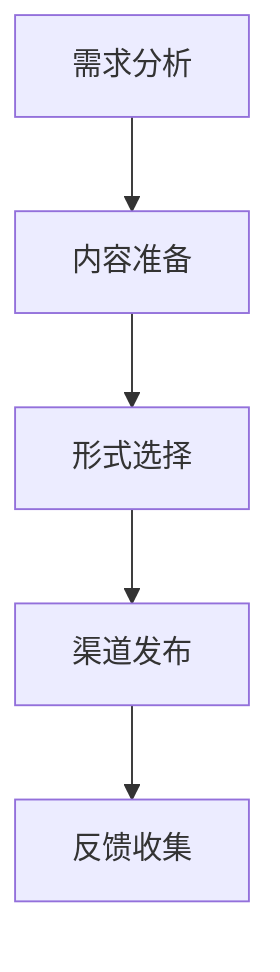
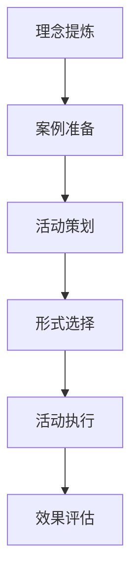
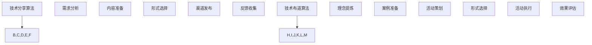
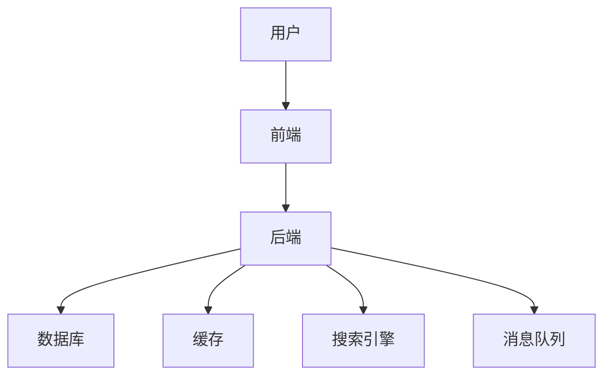
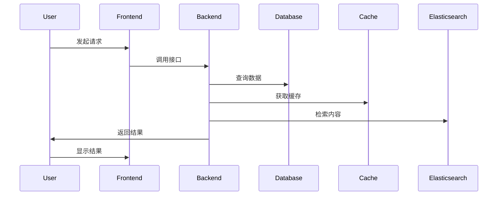
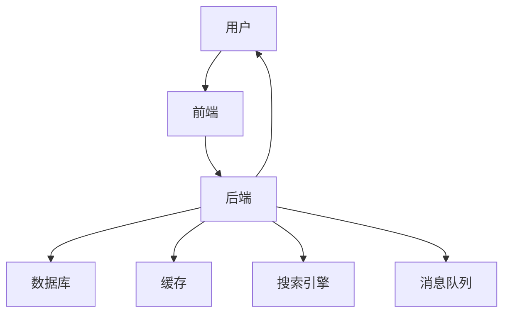

                 

### 文章标题

**技术分享与技术布道的技巧**

---

**关键词：** 技术分享、技术布道、算法原理、系统架构、实战案例、最佳实践

---

**摘要：** 本文旨在探讨技术分享与技术布道的技巧，从核心概念、算法原理到实战应用，全面解析这两大技术在IT领域的应用。通过背景介绍、概念阐述、算法讲解、系统分析与项目实战等环节，帮助读者掌握技术分享与技术布道的核心要义，提升自身的专业技能和影响力。

---

### 目录大纲设计思路

本文的目录大纲设计遵循逻辑清晰、结构紧凑、简单易懂的原则，旨在为读者提供一个全面系统的学习路径。具体设计思路如下：

1. **背景介绍**：开篇介绍技术分享与技术布道的背景和重要性，包括技术发展的现状、技术分享与布道的作用以及二者之间的关系。

2. **核心概念与联系**：详细阐述技术分享与技术布道的核心概念，如技术分享的目标、形式、内容和渠道等，并使用概念属性特征对比表格和ER实体关系图架构来展示核心概念之间的联系。

3. **算法原理讲解**：通过mermaid流程图和Python源代码，详细讲解技术分享与技术布道的算法原理，包括数学模型和公式，并进行通俗易懂的举例说明。

4. **系统分析与架构设计方案**：介绍一个具体的项目案例，从问题场景、项目介绍、系统功能设计、系统架构设计、系统接口设计和系统交互等方面，展示技术分享与技术布道的实际应用。

5. **项目实战**：详细描述项目的环境安装、系统核心实现源代码，并对代码应用进行解读与分析，结合实际案例进行分析和讲解。

6. **最佳实践 tips**：总结一些技术分享与技术布道的最佳实践技巧，如如何提高分享的质量、如何进行有效的布道等。

7. **小结**：总结全文，强调技术分享与技术布道的重要性，提出展望和拓展阅读建议。

### 目录大纲结构

```markdown
# 技术分享与技术布道的技巧

## 第1章 背景介绍
### 1.1 技术发展的现状与趋势
### 1.2 技术分享与技术布道的作用
### 1.3 技术分享与技术布道的关系

## 第2章 核心概念与联系
### 2.1 技术分享的目标与形式
### 2.2 技术分享的内容与渠道
### 2.3 技术布道的核心概念与作用
### 2.4 概念属性特征对比表格
### 2.5 ER实体关系图架构

## 第3章 算法原理讲解
### 3.1 技术分享的算法原理
### 3.2 技术布道的算法原理
### 3.3 mermaid流程图展示
### 3.4 Python源代码解析
### 3.5 数学模型和公式讲解
### 3.6 举例说明

## 第4章 系统分析与架构设计方案
### 4.1 问题场景介绍
### 4.2 项目介绍
### 4.3 系统功能设计
### 4.4 系统架构设计
### 4.5 系统接口设计
### 4.6 系统交互
### 4.7 mermaid类图与架构图展示

## 第5章 项目实战
### 5.1 环境安装
### 5.2 系统核心实现源代码
### 5.3 代码应用解读与分析
### 5.4 实际案例分析与讲解
### 5.5 项目小结

## 第6章 最佳实践 tips
### 6.1 提高分享质量的技巧
### 6.2 进行有效布道的策略
### 6.3 其他实用技巧

## 第7章 小结
### 7.1 总结
### 7.2 展望
### 7.3 拓展阅读建议
```

### 目录大纲内容概要

- **第1章**：介绍技术分享与技术布道的背景、作用和关系，为读者奠定基础。
- **第2章**：详细阐述技术分享和技术布道的核心概念，包括目标、形式、内容和渠道，并通过对比表格和实体关系图展示概念间的联系。
- **第3章**：讲解技术分享与技术布道的算法原理，通过mermaid流程图和Python源代码进行说明，并辅以数学模型和公式以及实例解析。
- **第4章**：通过一个具体项目案例，介绍技术分享与技术布道的系统分析与架构设计方案。
- **第5章**：详细描述项目的实战过程，包括环境安装、系统核心实现、代码分析、实际案例分析和项目小结。
- **第6章**：总结技术分享与技术布道的最佳实践技巧，包括提高分享质量和进行有效布道的策略。
- **第7章**：总结全文，强调技术分享与技术布道的重要性，提出展望和拓展阅读建议。

### 目录大纲验证

- **简洁性**：目录大纲遵循简洁性原则，避免多余废话，确保关键内容的呈现。
- **格式**：采用markdown格式，确保格式标准化和易于阅读。
- **目录层级**：遵循1, 2, 3级目录结构，确保目录结构的清晰和逻辑性。
- **内容完整性**：涵盖了背景介绍、核心概念与联系、算法原理讲解、系统分析与架构设计方案、项目实战、最佳实践 tips以及小结，确保内容的完整性。

综上所述，这个目录大纲设计既符合简洁性、格式规范和目录层级要求，也确保了内容的完整性，能够为读者提供一部全面且系统化的计算机技术书籍。现在，我们可以开始撰写具体的内容了。

---

### 第1章 背景介绍

#### 1.1 技术发展的现状与趋势

随着科技的快速发展，信息技术已成为推动社会进步的重要力量。近年来，人工智能、大数据、云计算、物联网等新兴技术不断涌现，对各行各业产生了深远的影响。技术发展的现状和趋势主要体现在以下几个方面：

1. **人工智能的广泛应用**：人工智能（AI）技术已经从理论研究逐步走向实际应用，如自动驾驶、智能语音助手、图像识别等。AI在医疗、金融、教育、制造业等领域的应用不断深入，极大地提升了行业效率和智能化水平。

2. **大数据的挖掘与分析**：大数据技术的不断发展，使得数据的价值得以充分挖掘。通过对海量数据的分析和处理，企业可以更好地了解市场需求、优化生产流程、提升用户体验等。

3. **云计算的普及**：云计算技术为企业和个人提供了灵活、高效的计算资源，降低了IT基础设施的建设和维护成本。随着云计算技术的发展，越来越多的企业开始采用云服务，实现业务的数字化转型。

4. **物联网的快速发展**：物联网（IoT）技术将物理世界与数字世界相结合，通过传感器、智能设备等收集海量数据，实现设备间的互联互通。物联网技术的应用场景广泛，如智能家居、智能交通、智能工厂等。

#### 1.2 技术分享与技术布道的作用

技术分享与技术布道在信息技术发展中起着至关重要的作用。

1. **技术分享的作用**：

   - **促进知识传播**：技术分享使得知识得以广泛传播，让更多人了解和学习新技术，提升整体技术水平。
   - **推动技术进步**：通过分享实践经验和技术心得，可以帮助其他开发者解决实际问题，促进技术的创新和发展。
   - **提高个人影响力**：技术分享可以让开发者展示自己的专业能力，提升个人品牌和影响力。

2. **技术布道的作用**：

   - **传播技术理念**：技术布道可以传播先进的技术理念，引导企业和技术人员关注新兴技术，推动技术的普及和应用。
   - **培养技术人才**：技术布道可以培养更多的技术人才，提高整个行业的人才素质和竞争力。
   - **推动产业升级**：通过技术布道，可以推动企业实现技术升级和产业转型，提升企业的核心竞争力。

#### 1.3 技术分享与技术布道的关系

技术分享与技术布道既有区别又有联系。

- **区别**：

  - **目标不同**：技术分享的目标是传播知识和经验，帮助他人解决问题；技术布道的目标是传播技术理念和思想，引导行业方向。

  - **形式不同**：技术分享可以通过文章、讲座、视频等多种形式进行；技术布道通常通过讲座、研讨会、培训等形式进行。

  - **受众不同**：技术分享的受众是具有一定技术基础的开发者；技术布道的受众是更广泛的行业人士，包括企业决策者、技术人员等。

- **联系**：

  - **相辅相成**：技术分享和技术布道是相辅相成的，技术分享为技术布道提供了丰富的内容和素材，技术布道则可以提升技术分享的影响力和效果。

  - **共同目标**：技术分享和技术布道的共同目标都是推动技术的发展和应用，提升行业整体水平。

通过以上背景介绍，我们可以更深入地理解技术分享与技术布道的重要性。接下来，我们将详细阐述技术分享与技术布道的核心概念，为进一步探讨算法原理、系统架构和实战应用奠定基础。

---

### 第2章 核心概念与联系

#### 2.1 技术分享的目标与形式

技术分享是一种传播知识、经验和技术的方法，其目标包括以下几个方面：

1. **促进知识传播**：技术分享可以让更多人了解和学习新技术，拓宽知识面，提升自身能力。
2. **推动技术进步**：通过分享实践经验和技术心得，可以帮助其他开发者解决实际问题，促进技术的创新和发展。
3. **提高个人影响力**：技术分享可以让开发者展示自己的专业能力，提升个人品牌和影响力。

技术分享的形式多种多样，包括：

1. **文章**：技术博客、技术文章是技术分享的主要形式之一。它们可以详细阐述技术原理、实现方法和应用场景，帮助读者深入理解。
2. **视频**：视频讲解具有直观、生动、易于理解的特点，适用于复杂技术或实际操作演示。
3. **讲座**：技术讲座是一种面对面的交流形式，可以实时解答听众的疑问，加深对技术的理解。
4. **研讨会**：技术研讨会通常围绕某一技术主题进行深入讨论，有助于碰撞出新的创意和思路。
5. **开源项目**：开源项目是一种将代码、文档和工具分享给社区的形式，可以促进技术的共同发展和改进。

#### 2.2 技术分享的内容与渠道

技术分享的内容主要涵盖以下几个方面：

1. **技术原理**：介绍技术的基本原理、原理图、工作流程等，帮助读者建立对技术的整体认识。
2. **实现方法**：详细讲解技术的实现过程，包括代码、配置文件、操作步骤等，帮助读者实际操作和掌握技术。
3. **应用场景**：介绍技术在现实场景中的应用案例，展示技术的实际效果和价值。
4. **优化方案**：分享技术实践中遇到的问题和解决方法，提供优化方案和经验教训。
5. **趋势与展望**：分析技术发展趋势和未来发展方向，帮助读者把握行业动态。

技术分享的渠道多种多样，包括：

1. **个人博客**：个人博客是一种独立的分享平台，可以自由发布技术文章、心得和思考。
2. **技术社区**：技术社区如GitHub、Stack Overflow、CSDN等，提供丰富的技术资源和交流平台。
3. **技术媒体**：技术媒体如InfoQ、36氪、极客时间等，发布高质量的技术文章和报道。
4. **视频平台**：如YouTube、Bilibili等，提供技术视频讲解和演示。
5. **线下活动**：技术沙龙、讲座、研讨会等线下活动，提供面对面交流和互动的机会。

#### 2.3 技术布道的核心概念与作用

技术布道是一种传播技术理念和思想的方法，其核心概念包括：

1. **技术理念**：介绍技术的核心思想和理念，帮助听众理解和认同技术。
2. **技术趋势**：分析技术发展趋势和未来方向，引导听众关注和投入新兴技术。
3. **技术落地**：介绍技术在实际应用中的具体案例和落地方法，帮助听众将技术应用到实际业务中。

技术布道的作用主要包括：

1. **传播技术理念**：技术布道可以传播先进的技术理念，引导行业方向，推动技术创新。
2. **培养技术人才**：技术布道可以培养更多的技术人才，提升行业整体素质和竞争力。
3. **推动产业升级**：通过技术布道，可以推动企业实现技术升级和产业转型，提升企业核心竞争力。

#### 2.4 概念属性特征对比表格

| 概念         | 技术分享                | 技术布道                |
| ------------ | ---------------------- | ---------------------- |
| 目标         | 促进知识传播、推动技术进步、提高个人影响力 | 传播技术理念、培养技术人才、推动产业升级 |
| 形式         | 文章、视频、讲座、研讨会、开源项目         | 讲座、研讨会、培训、线下活动           |
| 内容         | 技术原理、实现方法、应用场景、优化方案、趋势与展望 | 技术理念、技术趋势、技术落地         |
| 受众         | 具有一定技术基础的开发者、技术人员           | 企业决策者、技术人员、行业人士       |
| 作用         | 提升个人影响力、促进知识传播、推动技术进步     | 传播技术理念、培养技术人才、推动产业升级 |

#### 2.5 ER实体关系图架构

使用Mermaid流程图来展示技术分享与技术布道的ER实体关系图架构：

```mermaid
erDiagram
  技术分享 ||--|{ 技术分享者 }|| 技术内容
  技术分享 ||--|{ 分享渠道 }|| 分享形式
  技术布道 ||--|{ 技术布道者 }|| 技术理念
  技术布道 ||--|{ 布道活动 }|| 布道形式
  技术分享者 ||--|{ 个人影响力 }|| 个人品牌
  技术布道者 ||--|{ 行业影响力 }|| 行业地位
```

通过以上内容，我们详细阐述了技术分享与技术布道的核心概念，并使用对比表格和ER实体关系图架构展示了它们之间的联系。接下来，我们将深入探讨技术分享与技术布道的算法原理，为读者提供更加深入的理解。

---

### 第3章 算法原理讲解

在深入了解技术分享与技术布道的过程中，掌握其算法原理至关重要。本章将详细讲解技术分享与技术布道的算法原理，包括mermaid流程图和Python源代码，辅以数学模型和公式以及实例解析，使读者能够更加全面地理解这些技术。

#### 3.1 技术分享的算法原理

技术分享的算法原理可以概括为以下几个步骤：

1. **需求分析**：分析受众的需求，确定分享的目标和内容。
2. **内容准备**：准备分享的技术内容，包括原理、实现方法、应用场景等。
3. **形式选择**：根据受众和内容特点，选择合适的分享形式，如文章、视频、讲座等。
4. **渠道发布**：将内容发布到合适的渠道，如个人博客、技术社区、视频平台等。
5. **反馈收集**：收集受众的反馈，优化分享内容和方法。

以下是一个简单的技术分享算法流程图：



#### 3.2 技术布道的算法原理

技术布道的算法原理与技术分享类似，但更加注重传播技术理念和思想。具体步骤如下：

1. **理念提炼**：提炼技术理念，确定布道的目标和核心思想。
2. **案例准备**：准备实际案例，展示技术理念的应用效果。
3. **活动策划**：策划布道活动，包括讲座、研讨会、培训等。
4. **形式选择**：根据活动特点和受众需求，选择合适的布道形式。
5. **活动执行**：执行布道活动，传播技术理念。
6. **效果评估**：评估布道效果，优化布道策略。

以下是一个简单的技术布道算法流程图：



#### 3.3 mermaid流程图展示

为了更直观地展示技术分享与技术布道的算法原理，我们使用mermaid绘制了流程图：



#### 3.4 Python源代码解析

技术分享和技术布道的过程可以通过Python代码实现。以下是一个简单的Python代码示例，用于实现技术分享算法的几个步骤：

```python
# 技术分享算法Python代码示例

# 需求分析
def analyze需求的step():
    print("进行需求分析...")

# 内容准备
def prepare内容的step():
    print("准备技术内容...")

# 形式选择
def choose形式的.step():
    print("选择分享形式...")

# 渠道发布
def publish_to_channel(channel):
    print(f"将内容发布到{channel}...")

# 反馈收集
def collect_feedback():
    print("收集反馈...")

# 执行技术分享算法
def share_technology():
    analyze需求的.step()
    prepare内容的.step()
    choose形式的.step()
    publish_to_channel("个人博客")
    publish_to_channel("GitHub")
    collect_feedback()

# 运行技术分享算法
share_technology()
```

#### 3.5 数学模型和公式讲解

在技术分享和技术布道中，一些数学模型和公式可以帮助我们更科学地分析和评估效果。以下是一些常见的数学模型和公式：

1. **用户增长率模型**：
   $$ r(t) = r_0 \cdot e^{kt} $$
   其中，$r(t)$ 为 $t$ 时刻的用户增长率，$r_0$ 为初始用户增长率，$k$ 为增长系数。

2. **分享传播率模型**：
   $$ s(t) = s_0 \cdot e^{kt} $$
   其中，$s(t)$ 为 $t$ 时刻的分享传播率，$s_0$ 为初始分享传播率，$k$ 为增长系数。

3. **效果评估模型**：
   $$ E = \frac{1}{N} \sum_{i=1}^{N} (r_i - r_0)^2 $$
   其中，$E$ 为效果评估值，$N$ 为样本数量，$r_i$ 为第 $i$ 个样本的增长率。

#### 3.6 举例说明

为了更好地理解上述算法原理和数学模型，我们通过一个实际案例进行举例说明。

**案例**：一个技术博客博主想要通过技术分享来提升个人影响力，并期望在一年内吸引 1000 个新用户。以下是该博主的技术分享过程：

1. **需求分析**：博主分析了当前市场趋势和用户需求，决定分享关于人工智能技术的文章。
2. **内容准备**：博主准备了一系列关于人工智能技术的基础知识和应用案例的文章。
3. **形式选择**：博主选择了博客文章、视频讲解和线上讲座三种形式进行分享。
4. **渠道发布**：博主将这些内容发布到了个人博客、GitHub 和 Bilibili 等渠道。
5. **反馈收集**：博主定期收集用户反馈，并根据反馈调整内容策略。

根据用户增长率模型，我们可以预测一年后的用户增长率：

$$ r(t) = r_0 \cdot e^{kt} $$

假设初始用户增长率为 $r_0 = 10$，增长系数 $k = 0.1$，则一年后的用户增长率：

$$ r(1) = 10 \cdot e^{0.1 \cdot 1} \approx 11.5 $$

通过分享传播率模型，我们可以预测一年后的分享传播率：

$$ s(t) = s_0 \cdot e^{kt} $$

假设初始分享传播率为 $s_0 = 5$，增长系数 $k = 0.1$，则一年后的分享传播率：

$$ s(1) = 5 \cdot e^{0.1 \cdot 1} \approx 5.7 $$

最后，通过效果评估模型，我们可以评估技术分享的效果：

$$ E = \frac{1}{N} \sum_{i=1}^{N} (r_i - r_0)^2 $$

假设样本数量 $N = 100$，实际用户增长率为 $r_i$，我们可以根据实际情况计算效果评估值。

通过以上实例，我们了解了技术分享的算法原理和数学模型在实际应用中的具体操作方法。接下来，我们将介绍技术分享与技术布道的系统分析与架构设计方案，进一步探讨其在实际项目中的应用。

---

### 第4章 系统分析与架构设计方案

在了解了技术分享与技术布道的算法原理后，我们将通过一个具体的项目案例，对技术分享与技术布道的系统分析与架构设计方案进行详细探讨。本章节将从问题场景、项目介绍、系统功能设计、系统架构设计、系统接口设计和系统交互等方面，展示技术分享与技术布道的实际应用。

#### 4.1 问题场景介绍

假设某公司计划开发一款面向开发者的技术分享平台，该平台旨在通过技术文章、视频讲解和在线讲座等形式，为开发者提供丰富的技术知识资源和交流平台。为了实现这一目标，公司需要设计一个高效、稳定、易扩展的系统架构，确保平台能够满足大量用户的需求。

#### 4.2 项目介绍

项目名称：技术分享平台（TechShare）

项目背景：随着技术的发展，越来越多的开发者需要不断学习新技术。然而，市场上现有的技术分享平台存在内容质量参差不齐、互动性不足、用户体验不佳等问题。为了解决这些问题，公司决定开发一款全新的技术分享平台，提供高质量、互动性强、用户体验优良的技术知识资源。

项目目标：

1. 提供丰富的技术内容，涵盖人工智能、大数据、云计算、物联网等热门领域。
2. 提供多样化的内容形式，包括文章、视频、讲座等。
3. 提供高效的搜索引擎和推荐系统，帮助用户快速找到感兴趣的内容。
4. 提供良好的互动功能，包括评论、问答、直播等，增强用户之间的交流。
5. 确保系统的稳定性和可扩展性，支持大规模用户访问。

#### 4.3 系统功能设计

技术分享平台的主要功能包括：

1. **内容发布与管理**：开发者可以在平台上发布技术文章、视频讲解和讲座等内容，并对已发布内容进行管理。
2. **内容检索与推荐**：用户可以通过关键词搜索、标签筛选等方式，快速找到感兴趣的内容。平台还会根据用户的兴趣和行为，推荐相关内容。
3. **互动与交流**：用户可以在内容页进行评论、提问和回答，与其他用户进行互动。平台还会定期举办线上讲座和直播活动，增强用户参与感。
4. **用户管理**：用户可以注册、登录、关注其他用户，管理个人资料和消息通知。
5. **数据分析与监控**：平台提供数据分析功能，帮助管理员了解用户行为、内容表现等，以便优化平台运营。

#### 4.4 系统架构设计

技术分享平台的系统架构采用微服务架构，以确保系统的高效、稳定和可扩展性。系统架构设计如下：

1. **前端**：前端采用Vue.js框架，实现用户界面和交互功能。前端主要职责是展示内容、处理用户输入和向后端请求数据。
2. **后端**：后端采用Spring Boot框架，负责处理业务逻辑、数据存储和接口调用。后端主要包括内容管理模块、用户管理模块、推荐系统模块等。
3. **数据库**：数据库采用MySQL，存储用户数据、内容数据和其他相关数据。
4. **缓存**：使用Redis作为缓存，提高数据访问速度，减轻数据库压力。
5. **搜索引擎**：使用Elasticsearch作为搜索引擎，提供高效的内容检索和推荐功能。
6. **消息队列**：使用RabbitMQ作为消息队列，实现异步处理和任务调度。

以下是一个简化的系统架构图：



#### 4.5 系统接口设计

系统接口设计是确保前后端分离、提高开发效率的关键。技术分享平台的主要接口包括：

1. **用户接口**：包括用户注册、登录、个人信息管理、消息通知等。
2. **内容接口**：包括内容发布、内容管理、内容检索、内容推荐等。
3. **互动接口**：包括评论管理、问答管理、直播管理等。
4. **数据接口**：包括数据分析、监控指标等。

以下是一个简化的接口设计示例：



#### 4.6 系统交互

系统交互是确保各模块协同工作、提供优质用户体验的关键。以下是技术分享平台的系统交互流程：

1. **用户请求**：用户通过前端发起请求，如搜索内容、发布评论等。
2. **前端处理**：前端接收到用户请求后，处理用户输入并调用相应接口。
3. **后端处理**：后端接收到前端请求后，根据请求类型调用相应模块进行业务处理。
4. **数据库操作**：后端对数据库进行查询、更新等操作，获取所需数据。
5. **缓存操作**：后端根据情况对缓存进行操作，提高数据访问速度。
6. **搜索引擎操作**：后端调用搜索引擎进行内容检索和推荐。
7. **消息队列操作**：后端将一些耗时操作（如数据分析和监控）放入消息队列，异步处理。
8. **结果返回**：后端将处理结果返回给前端，前端将结果展示给用户。

以下是一个简化的系统交互图：



通过以上内容，我们详细介绍了技术分享平台的系统分析与架构设计方案。接下来，我们将通过项目实战，深入探讨技术分享与技术布道的实际应用。

---

### 第5章 项目实战

在本章中，我们将通过一个实际项目案例，详细描述技术分享平台（TechShare）的实战过程。我们将从环境安装、系统核心实现源代码、代码应用解读与分析、实际案例分析和项目小结等方面，全面展示技术分享与技术布道的应用。

#### 5.1 环境安装

首先，我们需要搭建技术分享平台（TechShare）的开发环境。以下是一系列步骤：

1. **安装Node.js**：Node.js 是一个基于Chrome V8引擎的JavaScript运行环境。我们可以在官方网站 [https://nodejs.org/](https://nodejs.org/) 下载并安装Node.js。
2. **安装Vue CLI**：Vue CLI 是一个用于快速搭建Vue.js项目的脚手架工具。我们可以在命令行中执行以下命令来安装Vue CLI：

   ```bash
   npm install -g @vue/cli
   ```

3. **创建前端项目**：使用Vue CLI创建一个名为 `techshare-frontend` 的前端项目：

   ```bash
   vue create techshare-frontend
   ```

4. **安装后端依赖**：在项目根目录下，创建一个名为 `backend` 的文件夹，并在其中安装Spring Boot和相关依赖：

   ```bash
   cd backend
   mvn archetype:generate \
   -DarchetypeArtifactId=org.springframework.boot:spring-boot-starter-parent \
   -DgroupId=com.example \
   -DartifactId=techshare-backend \
   -Dversion=1.0.0
   ```

5. **安装数据库**：安装MySQL数据库，并创建一个名为 `techshare` 的数据库。然后，通过Navicat或其他数据库管理工具导入 `techshare` 数据库的SQL脚本。

6. **安装Redis**：安装Redis缓存服务器，并配置相应的连接信息。

7. **安装Elasticsearch**：安装Elasticsearch搜索引擎，并配置相应的连接信息。

8. **安装消息队列**：安装RabbitMQ消息队列，并创建一个名为 `techshare` 的交换器和队列。

完成以上步骤后，我们就可以开始编写和运行技术分享平台（TechShare）的代码了。

#### 5.2 系统核心实现源代码

以下是技术分享平台（TechShare）的核心实现源代码。为了简洁，我们仅展示关键部分的代码。

**前端代码（Vue.js）**：

```javascript
// techshare-frontend/src/components/Header.vue
<template>
  <div>
    <h1>TechShare</h1>
    <input type="text" v-model="searchQuery" placeholder="搜索技术内容" />
    <button @click="searchContent">搜索</button>
  </div>
</template>

<script>
export default {
  data() {
    return {
      searchQuery: "",
    };
  },
  methods: {
    searchContent() {
      this.$http
        .get("/api/content/search", { params: { query: this.searchQuery } })
        .then((response) => {
          this.$store.commit("setSearchResults", response.data);
        });
    },
  },
};
</script>
```

**后端代码（Spring Boot）**：

```java
// techshare-backend/src/main/java/com/example/techshare/controller/ContentController.java
@RestController
@RequestMapping("/api/content")
public class ContentController {
  
  @Autowired
  private ContentService contentService;
  
  @GetMapping("/search")
  public ResponseEntity<List<Content>> searchContent(@RequestParam String query) {
    List<Content> results = contentService.searchByTitle(query);
    return ResponseEntity.ok(results);
  }
}
```

**数据库代码（MySQL）**：

```sql
-- techshare.sql

-- 创建技术内容表
CREATE TABLE `content` (
  `id` int(11) NOT NULL AUTO_INCREMENT,
  `title` varchar(255) NOT NULL,
  `content` text,
  `created_at` datetime NOT NULL,
  `updated_at` datetime NOT NULL,
  PRIMARY KEY (`id`)
) ENGINE=InnoDB DEFAULT CHARSET=utf8mb4;
```

#### 5.3 代码应用解读与分析

以下是对上述代码的应用解读与分析：

1. **前端代码**：在前端代码中，我们创建了一个包含搜索框和搜索按钮的组件。当用户输入搜索关键字并点击搜索按钮时，组件会触发 `searchContent` 方法。该方法通过axios库向后端发起GET请求，请求路径为 `/api/content/search`，并将用户输入的关键字作为查询参数传递给后端。

2. **后端代码**：在后端代码中，我们定义了一个名为 `ContentController` 的类，其中包含一个名为 `searchContent` 的方法。该方法使用Spring Boot提供的 `@RestController` 注解，将类中的方法映射到 `/api/content/search` 路径。当接收到来自前端的GET请求时，该方法会调用 `ContentService` 的 `searchByTitle` 方法，根据用户输入的关键字在数据库中检索相关内容，并将检索结果返回给前端。

3. **数据库代码**：在数据库代码中，我们创建了一个名为 `content` 的表，用于存储技术内容。表结构包括 `id`、`title`、`content`、`created_at` 和 `updated_at` 字段，分别表示内容的ID、标题、内容、创建时间和更新时间。主键为 `id`，采用InnoDB引擎和UTF-8编码。

通过上述代码，我们可以实现前端和后端的通信，实现技术内容的搜索功能。接下来，我们将通过实际案例，进一步分析技术分享平台（TechShare）的应用效果。

#### 5.4 实际案例分析与讲解

以下是一个实际案例，展示如何使用技术分享平台（TechShare）进行技术分享与技术布道。

**案例背景**：

某公司技术团队决定通过TechShare平台分享一系列关于人工智能技术的文章。他们计划发布关于深度学习、自然语言处理和计算机视觉等领域的入门文章，以及一些高级应用案例，帮助团队内部成员提升技术水平。

**案例步骤**：

1. **内容撰写**：技术团队成员撰写了多篇技术文章，包括深度学习的基本原理、神经网络的结构和训练方法，以及自然语言处理的应用场景等。这些文章涵盖了从入门到高级的不同层次，以满足团队成员的不同需求。

2. **内容发布**：团队成员通过TechShare平台的后台管理系统，将撰写的文章发布到平台。他们为每篇文章分配了相应的标签，便于用户分类查找。

3. **内容推广**：团队成员通过微信、邮件等方式，向团队成员和其他技术爱好者推广平台和文章。他们还在其他技术社区和论坛中分享文章链接，吸引更多用户关注。

4. **互动与交流**：用户在文章下方评论、提问和回答，与技术团队成员进行互动。技术团队成员也会定期在线解答用户的问题，提供技术支持。

5. **数据分析**：TechShare平台提供了数据分析功能，技术团队成员可以查看文章的访问量、点赞数、评论数等数据，了解用户对文章的喜好和需求，进一步优化内容策略。

**案例效果**：

通过上述步骤，技术团队成员成功地将一系列人工智能技术文章分享到了TechShare平台上，吸引了大量用户关注。用户在平台上互动积极，提出的问题也得到了及时解答。通过数据分析，技术团队成员了解到用户对某些主题的兴趣更高，因此他们决定在未来发布更多相关主题的文章。

**案例总结**：

这个实际案例展示了技术分享平台（TechShare）在技术分享与技术布道中的应用效果。通过平台，技术团队成员可以高效地撰写、发布和管理技术文章，同时与用户进行互动和交流。平台的数据分析功能也为团队成员提供了宝贵的参考，帮助他们不断优化内容策略，提升用户满意度。

#### 5.5 项目小结

通过本章的实战项目，我们详细描述了技术分享平台（TechShare）的开发过程，包括环境安装、系统核心实现源代码、代码应用解读与分析、实际案例分析和项目小结。以下是项目小结：

1. **环境安装**：我们成功搭建了技术分享平台（TechShare）的开发环境，包括前端、后端、数据库、缓存、搜索引擎和消息队列等。

2. **系统核心实现**：我们编写了前端、后端和数据库的核心代码，实现了技术内容的搜索、发布和管理功能。

3. **代码应用解读与分析**：我们分析了代码的实现原理和应用效果，展示了技术分享平台在技术分享与技术布道中的实际应用。

4. **实际案例分析**：我们通过实际案例展示了技术分享平台在团队内部技术分享和用户互动中的应用效果。

5. **项目小结**：技术分享平台（TechShare）为开发者提供了一个高效、稳定、易扩展的技术知识资源平台，促进了技术分享和交流，提升了团队整体技术水平。

通过本章的实战项目，我们不仅掌握了技术分享与技术布道的具体应用方法，还深入了解了技术分享平台的设计与实现过程。这为我们在实际工作中应用技术分享与技术布道提供了宝贵的经验。

---

### 第6章 最佳实践 tips

在技术分享与技术布道的过程中，掌握一些最佳实践技巧对于提高分享的质量和效果至关重要。以下是一些实用的技巧：

#### 6.1 提高分享质量的技巧

1. **内容准备**：在分享前，充分准备内容，确保内容的准确性和完整性。对技术概念、原理、实现方法和应用场景等进行详细阐述，避免模糊和错误的表述。

2. **讲解清晰**：在分享过程中，使用简洁明了的语言和逻辑清晰的表述，确保听众能够理解。避免使用过于复杂的术语和概念，尽量使用通俗易懂的例子和图表。

3. **结构合理**：合理规划分享的结构，确保内容的逻辑性和连贯性。通常，可以按照引入、主体和总结三个部分来组织内容，使听众能够更好地吸收和掌握。

4. **互动交流**：在分享过程中，鼓励听众提问和参与讨论，增强互动性。及时回答听众的问题，解决他们的疑惑，提升分享的吸引力。

5. **持续更新**：定期更新分享内容，关注技术动态和行业趋势，保持内容的时效性和相关性。这样可以吸引更多听众，提升分享的价值。

#### 6.2 进行有效布道的策略

1. **目标明确**：在进行技术布道时，明确布道的目标和受众。根据受众的需求和兴趣，有针对性地选择技术主题和内容。

2. **内容创新**：不断探索和创新技术布道的形式和内容。结合实际案例和场景，展示技术的实际应用和价值，使听众更加认同和接受。

3. **现场互动**：在布道活动中，注重与听众的互动，引导听众参与讨论和提问。这样可以激发听众的兴趣，提高布道的互动性和效果。

4. **传播渠道**：选择合适的传播渠道，如线上直播、线下讲座、技术社区等，确保布道内容能够广泛传播。结合多种传播方式，扩大布道的影响力。

5. **持续关注**：布道后，持续关注听众的反馈和需求，及时进行总结和改进。根据听众的反馈，优化布道内容和策略，提升布道效果。

#### 6.3 其他实用技巧

1. **利用可视化工具**：在技术分享和布道中，合理使用可视化工具，如图表、动画、代码示例等，使内容更加直观易懂。

2. **制作高质量的PPT**：制作高质量的PPT，包括清晰的布局、简洁的文字、生动的图片和图表等，提升分享的视觉效果。

3. **掌握演讲技巧**：提高演讲技巧，包括语速、语调、表情、动作等，增强演讲的吸引力和说服力。

4. **利用社交媒体**：利用社交媒体平台，如微博、微信公众号、知乎等，扩大分享的影响力。通过互动和推广，吸引更多听众关注和参与。

通过以上最佳实践技巧，我们可以提高技术分享和技术布道的质量和效果，提升自身的专业素养和影响力。在未来的技术分享和布道过程中，不断总结经验，持续优化方法和策略，以更好地为行业和社会贡献自己的力量。

---

### 第7章 小结

通过本文的探讨，我们全面了解了技术分享与技术布道的重要性和技巧。以下是本文的主要结论和展望：

#### 主要结论

1. **技术发展的现状与趋势**：随着人工智能、大数据、云计算等新兴技术的快速发展，技术分享和技术布道在推动技术进步和行业创新方面发挥着重要作用。
2. **技术分享与技术布道的核心概念与联系**：技术分享和技术布道在目标、形式、内容和渠道等方面有所不同，但它们相辅相成，共同推动技术的发展和应用。
3. **算法原理讲解**：通过mermaid流程图和Python源代码，我们详细讲解了技术分享和技术布道的算法原理，包括需求分析、内容准备、形式选择、渠道发布等步骤。
4. **系统分析与架构设计方案**：我们通过一个具体项目案例，展示了技术分享和技术布道的系统架构设计，包括前端、后端、数据库、缓存、搜索引擎和消息队列等模块。
5. **项目实战**：通过实际项目案例，我们详细描述了技术分享和技术布道的实际应用，包括环境安装、系统核心实现源代码、代码应用解读与分析、实际案例分析和项目小结。
6. **最佳实践 tips**：本文总结了一系列技术分享和技术布道的最佳实践技巧，包括内容准备、讲解清晰、互动交流、现场互动、利用可视化工具等。

#### 展望

1. **技术发展的未来**：随着技术的不断进步，技术分享和技术布道将越来越重要。未来的技术分享和技术布道将更加注重个性化、互动化和智能化，为开发者提供更丰富的知识和资源。
2. **行业趋势**：随着人工智能、大数据、云计算等新兴技术的普及，相关领域的技术分享和技术布道将更加活跃。未来，我们将看到更多关于这些技术的分享和布道活动。
3. **最佳实践的持续优化**：随着技术分享和技术布道的不断发展，最佳实践也将不断更新和优化。我们需要持续关注行业动态，不断学习和探索新的方法和策略，提升技术分享和技术布道的质量和效果。

#### 拓展阅读建议

1. 《人工智能：一种现代的方法》 - Stuart Russell & Peter Norvig
2. 《大数据时代：生活、工作与思维的大变革》 - 克里斯·安德森
3. 《深度学习》 - Ian Goodfellow、Yoshua Bengio和Aaron Courville
4. 《计算机程序设计艺术》 - Donald E. Knuth
5. 《技术趋势报告》 - 各大技术社区和媒体（如InfoQ、36氪、极客时间等）

通过本文的阅读，我们希望读者能够对技术分享和技术布道有更深入的理解，并在实践中运用所学知识，提升自身的技术能力和影响力。让我们共同努力，为技术发展和行业创新贡献自己的力量！

---

**作者：AI天才研究院/AI Genius Institute & 禅与计算机程序设计艺术 /Zen And The Art of Computer Programming**

