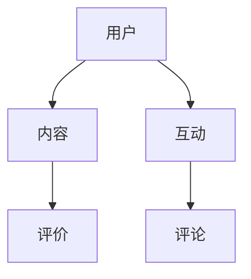

                 

# 技术分享平台：促进知识传播与创新

> 关键词：技术分享平台、知识传播、创新、云计算、大数据、人工智能

> 摘要：本文将探讨技术分享平台的建设，分析其在知识传播与创新中的重要作用。通过逐步分析技术分享平台的背景、核心概念与联系、知识传播与创新的机制以及平台的架构设计与实现，本文旨在为构建高效、互动性强、能够促进知识传播与创新的技术平台提供一些思路。

## 目录大纲

1. 背景介绍
   1.1 问题背景
   1.2 问题描述
   1.3 问题解决
   1.4 边界与外延
   1.5 概念结构与核心要素组成
2. 核心概念与联系
   2.1 技术分享平台
   2.2 知识传播
   2.3 创新促进
   2.4 概念属性特征对比表格
   2.5 ER实体关系图架构
3. 知识传播与创新的机制
   3.1 知识分享与用户行为
   3.2 内容生产与质量控制
   3.3 知识互动与反馈机制
   3.4 创新促进的方法
   3.5 案例分析与启示
4. 技术分享平台的架构设计与实现
   4.1 平台架构设计
   4.2 功能模块设计
   4.3 系统接口设计与实现
   4.4 系统交互设计与实现
5. 项目实战
   5.1 环境安装
   5.2 系统核心实现源代码
   5.3 代码应用解读与分析
   5.4 实际案例分析与详细讲解剖析
   5.5 项目小结
6. 最佳实践 tips
7. 小结
8. 注意事项
9. 拓展阅读

## 第一部分：背景介绍

### 1.1 问题背景

随着互联网的普及和云计算技术的发展，知识共享和传播的需求日益增长。在过去的几十年里，互联网技术已经深刻地改变了我们的生活方式，从信息获取、社交互动到娱乐消费，互联网都在发挥着重要作用。然而，在知识传播领域，传统的方式如书籍、报纸、讲座等仍存在很多局限性。首先，这些传统方式的信息传递速度较慢，无法满足人们对即时性知识的需求。其次，这些方式的传播范围有限，很难实现全球范围内的知识共享。此外，传统方式缺乏互动性，用户无法直接参与到知识传播过程中，限制了知识传播的效果。

### 1.2 问题描述

核心问题是如何构建一个高效、互动性强、能够促进知识传播与创新的技术平台。这个问题涉及到多个方面：

- **技术层面**：如何利用云计算、大数据、人工智能等先进技术，提高知识传播的效率和质量。
- **设计层面**：如何设计一个用户友好、易于使用的技术平台，满足不同用户的需求。
- **运营层面**：如何构建良好的社区氛围，鼓励用户积极参与知识分享和创新。

### 1.3 问题解决

为了解决上述问题，我们可以从以下几个方面着手：

- **关键技术**：采用云计算技术实现平台的弹性扩展和高可用性，利用大数据技术分析和推荐知识内容，运用人工智能技术进行知识挖掘和智能问答。
- **实施策略**：构建技术框架，设计平台架构，开发核心功能，实施推广，并不断优化和迭代平台。
- **社区建设**：鼓励用户参与知识分享，建立良好的社区氛围，提供优质的互动体验。

### 1.4 边界与外延

- **边界**：技术分享平台主要覆盖的技术范围包括互联网技术、大数据技术、人工智能技术等。适用行业包括IT、金融、医疗等。功能模块主要包括用户管理、内容管理、互动管理、评价管理等。
- **外延**：平台可以扩展到其他领域，如教育培训、企业内训等。同时，平台可以与其他系统进行集成，如企业内部系统、电商平台等。

### 1.5 概念结构与核心要素组成

- **核心概念**：技术分享平台、知识传播、创新。
- **组成要素**：用户、内容、互动、评价、安全等。

## 第二部分：核心概念与联系

### 2.1 技术分享平台

**定义**：技术分享平台是一个基于互联网的平台，用于分享技术和知识。它为用户提供了一个发布、浏览、讨论技术内容的场所，旨在促进知识传播和创新。

**特点**：

- **开放性**：技术分享平台对用户是开放的，用户可以自由注册、发布内容、参与讨论。
- **互动性**：技术分享平台鼓励用户之间的互动，如评论、点赞、分享等。
- **高效性**：通过大数据和人工智能技术，平台能够高效地推荐用户感兴趣的内容。
- **多样性**：技术分享平台涵盖多种技术领域，满足不同用户的需求。

### 2.2 知识传播

**定义**：知识传播是指知识在不同个体、组织、社会间的传递和分享过程。它包括知识的获取、传递、存储和利用。

**类型**：

- **线上传播**：通过互联网、电子邮件、社交媒体等渠道进行知识传播。
- **线下传播**：通过书籍、讲座、研讨会等渠道进行知识传播。
- **群体传播**：通过群体活动、社交互动等渠道进行知识传播。

### 2.3 创新促进

**定义**：创新促进是通过知识传播，激发新的思想、方法、产品等。它包括知识交流、合作研究、技术改进等。

**方式**：

- **知识交流**：通过技术分享平台，用户可以交流心得、分享经验，激发新的思想。
- **合作研究**：通过合作研究，不同领域的专家可以共同探讨问题，推动技术进步。
- **技术改进**：通过技术改进，可以优化现有产品或服务，提升用户体验。

### 2.4 概念属性特征对比表格

| 类别       | 特征                     | 技术分享平台                         | 社交媒体                           |
|------------|--------------------------|--------------------------------------|------------------------------------|
| 目标       | 功能                     | 知识传播与分享                     | 社交互动与交流                       |
| 互动性     | 机制                     | 高度互动                           | 以评论、点赞为主                     |
| 内容       | 类型                     | 专业、多样化                       | 生活、娱乐、专业等                   |

### 2.5 ER实体关系图架构



## 第三部分：知识传播与创新的机制

### 3.1 知识分享与用户行为

**用户需求**：用户访问技术分享平台的主要需求包括获取新知识、解决实际问题、提升技能水平等。

**行为模式**：

- **发表内容**：用户可以发布技术博客、教程、项目经验等，分享自己的知识和经验。
- **阅读内容**：用户可以浏览平台上的各种技术内容，获取所需的知识。
- **评论互动**：用户可以对内容进行评论，表达自己的看法，与其他用户进行交流。
- **分享内容**：用户可以将感兴趣的内容分享到其他社交媒体平台，扩大知识传播的范围。

### 3.2 内容生产与质量控制

**内容生产**：

- **用户生成内容**：用户可以自由发布自己的技术博客、教程等，分享自己的经验和知识。
- **专业贡献者生产内容**：邀请技术领域的专家、讲师等，提供高质量的技术内容。

**质量控制**：

- **内容审核**：平台对用户发布的内容进行审核，确保内容的合规性和专业性。
- **评分机制**：用户可以对内容进行评分，评价内容的质量。
- **社区治理**：建立社区治理机制，对不良行为进行处罚，维护社区秩序。

### 3.3 知识互动与反馈机制

**互动形式**：

- **评论**：用户可以对内容进行评论，表达自己的看法。
- **点赞**：用户可以点赞内容，表示对内容的认可。
- **分享**：用户可以将内容分享到其他社交媒体平台，扩大传播范围。
- **问答**：用户可以提出问题，寻求其他用户的解答。

**反馈机制**：

- **评价系统**：用户可以对内容进行评价，评价内容包括内容质量、实用性等。
- **推荐算法**：基于用户的行为和兴趣，推荐用户感兴趣的内容。
- **互动反馈**：平台根据用户的互动行为，调整内容的排序和推荐策略，提高用户满意度。

### 3.4 创新促进的方法

**知识交流与协作**：

- **交流平台**：建立论坛、研讨会、线上讨论等平台，促进用户之间的知识交流。
- **协作模式**：鼓励用户之间的合作研究，共同探讨技术问题，推动技术进步。

**技术改进与产品创新**：

- **技术改进**：通过技术研究、技术创新，改进现有产品或服务。
- **产品创新**：开发新产品、优化产品功能，满足用户需求。

### 3.5 案例分析与启示

**案例研究**：

以GitHub为例，GitHub是一个著名的开源代码托管平台，它通过建立良好的社区氛围，鼓励用户分享代码、参与项目合作，大大促进了知识传播和创新。GitHub的成功经验可以为技术分享平台的建设提供启示。

**启示与借鉴**：

- **提高知识传播效果**：通过推荐算法、互动反馈等机制，提高用户满意度，吸引更多用户参与知识分享。
- **促进创新**：建立良好的社区氛围，鼓励用户之间的合作研究，推动技术进步。

## 第四部分：技术分享平台的架构设计与实现

### 4.1 平台架构设计

**系统架构**：

技术分享平台采用分布式架构，包括前端、后端、数据库等多个组件。前端负责展示用户界面，后端负责处理业务逻辑，数据库负责存储数据。分布式架构可以提高平台的可扩展性和高可用性。

**技术栈**：

- **前端**：使用Vue.js、React等前端框架，实现用户界面的动态渲染和交互。
- **后端**：使用Spring Boot、Django等后端框架，实现业务逻辑的处理。
- **数据库**：使用MySQL、PostgreSQL等关系型数据库，存储用户数据、内容数据等。

### 4.2 功能模块设计

**核心模块**：

- **用户模块**：负责用户注册、登录、个人信息管理等。
- **内容模块**：负责内容发布、阅读、评论、点赞等。
- **互动模块**：负责评论、分享、问答等互动功能的实现。
- **评价模块**：负责内容评价、用户评价等。

**辅助模块**：

- **安全模块**：负责用户认证、权限控制、数据加密等。
- **监控模块**：负责系统监控、日志分析等。
- **运维模块**：负责系统部署、运维管理等。

### 4.3 系统接口设计与实现

**接口设计**：

技术分享平台提供了一系列API接口，包括用户接口、内容接口、互动接口等。用户接口用于用户注册、登录、个人信息管理等；内容接口用于内容发布、阅读、评论、点赞等；互动接口用于评论、分享、问答等。

**实现**：

- **用户接口**：使用Spring Boot框架实现，提供RESTful API。
- **内容接口**：使用Spring Boot框架实现，提供RESTful API。
- **互动接口**：使用Spring Boot框架实现，提供RESTful API。

### 4.4 系统交互设计与实现

**系统交互**：

技术分享平台中的各个模块通过接口进行交互，实现功能之间的联动。例如，用户发布内容后，内容模块会更新内容列表，互动模块会同步更新评论列表。

**实现**：

- **接口调用**：使用HTTP协议进行接口调用，实现模块之间的通信。
- **消息队列**：使用消息队列（如RabbitMQ）实现异步通信，提高系统性能和稳定性。

## 第五部分：项目实战

### 5.1 环境安装

**环境要求**：

- 操作系统：Linux或Windows
- 开发工具：IDEA或VS Code
- 数据库：MySQL或PostgreSQL
- 服务端框架：Spring Boot
- 前端框架：Vue.js或React

**安装步骤**：

1. 安装操作系统和开发工具。
2. 安装数据库服务器，并配置数据库。
3. 配置服务端框架和前端框架，确保能够正常运行。

### 5.2 系统核心实现源代码

**用户模块**：

```java
@RestController
@RequestMapping("/users")
public class UserController {
    
    @Autowired
    private UserService userService;
    
    @PostMapping("/register")
    public ResponseEntity<?> registerUser(@RequestBody UserRegistrationDto userRegistrationDto) {
        User user = userService.registerUser(userRegistrationDto);
        return ResponseEntity.ok(user);
    }
    
    @PostMapping("/login")
    public ResponseEntity<?> loginUser(@RequestBody UserLoginDto userLoginDto) {
        String token = userService.loginUser(userLoginDto);
        return ResponseEntity.ok(token);
    }
}
```

**内容模块**：

```java
@RestController
@RequestMapping("/contents")
public class ContentController {
    
    @Autowired
    private ContentService contentService;
    
    @PostMapping("/post")
    public ResponseEntity<?> postContent(@RequestBody ContentDto contentDto) {
        Content content = contentService.postContent(contentDto);
        return ResponseEntity.ok(content);
    }
    
    @GetMapping("/{id}")
    public ResponseEntity<?> getContent(@PathVariable Long id) {
        Content content = contentService.getContent(id);
        return ResponseEntity.ok(content);
    }
}
```

**互动模块**：

```java
@RestController
@RequestMapping("/interactions")
public class InteractionController {
    
    @Autowired
    private InteractionService interactionService;
    
    @PostMapping("/comment")
    public ResponseEntity<?> postComment(@RequestBody CommentDto commentDto) {
        Comment comment = interactionService.postComment(commentDto);
        return ResponseEntity.ok(comment);
    }
    
    @PostMapping("/like")
    public ResponseEntity<?> likeContent(@RequestBody LikeDto likeDto) {
        interactionService.likeContent(likeDto);
        return ResponseEntity.ok();
    }
}
```

### 5.3 代码应用解读与分析

**用户模块**：

用户模块主要负责用户的注册、登录和用户信息的处理。用户注册接口接收用户注册信息，验证信息后调用用户服务进行用户注册。用户登录接口接收用户登录信息，验证信息后生成令牌（Token），并返回给客户端用于后续的认证。

**内容模块**：

内容模块主要负责内容的发布和获取。内容发布接口接收用户发布的内容信息，验证信息后调用内容服务进行内容发布。内容获取接口根据内容ID获取内容信息，返回给客户端。

**互动模块**：

互动模块主要负责评论和点赞的功能实现。评论接口接收评论信息，验证信息后调用互动服务进行评论发布。点赞接口接收点赞信息，验证信息后调用互动服务进行点赞处理。

### 5.4 实际案例分析与详细讲解剖析

**案例背景**：

某公司希望构建一个内部技术分享平台，用于员工之间的技术交流和学习。公司提供了以下需求：

1. 员工可以发布技术博客、项目经验等。
2. 员工可以评论、点赞其他员工的内容。
3. 管理员可以查看所有内容，并对内容进行审核。
4. 平台需要支持多人同时在线。

**解决方案**：

1. 使用Spring Boot框架构建后端服务，实现用户管理、内容管理、评论点赞等功能。
2. 使用Vue.js构建前端界面，实现用户操作和界面展示。
3. 使用MySQL数据库存储用户数据、内容数据和评论数据。
4. 使用消息队列（如RabbitMQ）实现异步处理，提高系统性能。

**实现细节**：

1. **用户管理**：实现用户注册、登录、个人信息管理等功能，使用JWT技术实现用户认证。
2. **内容管理**：实现内容发布、获取、审核等功能，使用RESTful API设计接口。
3. **评论点赞**：实现评论、点赞功能，使用数据库存储评论和点赞信息。
4. **系统性能优化**：使用缓存、异步处理等技术提高系统性能。

### 5.5 项目小结

通过本项目的实施，我们成功构建了一个内部技术分享平台，满足了员工之间的技术交流和学习需求。项目实现了用户管理、内容管理、评论点赞等功能，并且具有良好的性能和可扩展性。在项目实施过程中，我们遇到了一些挑战，如用户认证、数据存储、系统性能优化等，但通过合理的方案和努力，我们成功地解决了这些问题。

## 最佳实践 tips

1. **确保平台的安全性**：对用户数据进行加密存储，实现用户认证和权限控制，防止数据泄露和恶意攻击。
2. **优化内容推荐算法**：根据用户行为和兴趣，推荐用户感兴趣的内容，提高用户满意度。
3. **鼓励用户参与**：通过积分、奖励等机制，鼓励用户积极参与知识分享和创新。
4. **注重用户体验**：设计简洁、易用的界面，提供良好的交互体验。
5. **持续迭代与优化**：根据用户反馈和平台数据，持续迭代和优化平台功能，提高平台竞争力。

## 小结

技术分享平台在促进知识传播和创新方面具有重要作用。通过构建一个高效、互动性强、用户友好的平台，可以满足用户对知识的需求，激发创新思维，推动技术进步。在构建技术分享平台时，需要关注核心概念与联系、知识传播与创新的机制、平台架构设计与实现等多个方面，以实现平台的有效运行。

## 注意事项

1. **数据安全**：确保用户数据和内容数据的安全，防止数据泄露和滥用。
2. **用户隐私**：保护用户隐私，不得泄露用户个人信息。
3. **性能优化**：优化系统性能，提高平台的响应速度和稳定性。
4. **持续迭代**：根据用户反馈和市场需求，持续优化和迭代平台功能。

## 拓展阅读

1. 《技术分享平台：从零开始构建》
2. 《知识传播与创新：实践与理论》
3. 《云计算技术：构建高效平台的基石》
4. 《大数据技术：挖掘知识的宝库》
5. 《人工智能：赋能技术分享平台》

作者：AI天才研究院/AI Genius Institute & 禅与计算机程序设计艺术 /Zen And The Art of Computer Programming

