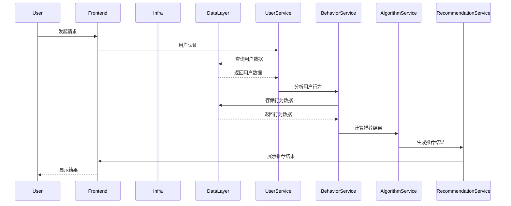

                 

### 引言

#### 第1章: 技术分享文化背景

##### 1.1 问题背景

随着技术的快速发展，知识更新速度日益加快，信息变得愈发重要。在这个信息化时代，技术分享文化的兴起显得尤为重要。技术分享不仅有助于个人知识的积累与提升，还能促进团队整体技能水平的提升。然而，在实际操作中，技术分享文化并非总是能够顺利建立，其背后涉及诸多因素。

首先，技术快速发展的背景下，知识更新的速度令人瞠目结舌。无论是新兴技术的涌现，还是现有技术的迭代更新，都要求团队成员具备快速学习和适应能力。这无疑增加了知识分享的需求，因为只有通过不断分享和交流，才能确保团队成员始终站在技术前沿。

其次，团队氛围建设对于知识分享的影响不可小觑。一个开放、包容、尊重差异的团队氛围，能够激发团队成员的分享意愿，促进知识交流。相反，如果团队氛围压抑、封闭，成员之间的交流受限，知识分享的效率必然低下。

因此，本文旨在探讨技术分享文化的重要性，分析团队氛围对知识分享的影响，并提出相应的建设策略。通过本文的讨论，希望能够为读者提供一个清晰、实用的框架，以帮助他们在实际工作中构建起知识共享的团队氛围。

##### 1.2 问题描述

当前，技术分享文化在许多团队中仍存在一些问题。首先，技术分享文化的现状并不乐观。一些团队缺乏正式的技术分享机制，成员间的知识交流更多的是依赖个人意愿和偶然的机会。这种缺乏系统性和规律性的知识分享方式，难以满足团队成员对技术提升的需求。

其次，团队氛围对知识分享的影响尤为显著。在一个开放、支持创新、鼓励分享的团队氛围中，成员更愿意分享自己的知识和经验。然而，许多团队中仍然存在一些不利于知识分享的因素，如竞争压力、安全顾虑、时间不足等。这些问题导致团队成员在知识分享上存在顾虑，从而影响了整体的知识传播效率。

为了解决上述问题，我们需要对技术分享文化进行系统定义，并探讨如何建设一个支持知识共享的团队氛围。本文将首先介绍技术分享文化的定义和特点，然后分析团队氛围的建设策略和影响因素。通过这些探讨，我们希望能够为建立知识共享的团队氛围提供一些有益的思路。

##### 1.3 问题解决

要解决技术分享文化在团队中存在的问题，我们需要从多个方面入手，系统性地推进技术分享文化的建设。

首先，明确技术分享文化的定义。技术分享文化是一种强调知识交流、资源共享、合作共赢的文化氛围。它不仅包括技术知识的传播，还涵盖了技能、经验、思维方式等软性知识的分享。通过明确这一概念，可以帮助团队成员更好地理解技术分享文化的重要性和价值。

其次，制定建设团队氛围的策略。一个良好的团队氛围是技术分享文化得以落地的基础。为此，团队需要营造一个开放、包容、尊重差异的环境。具体策略包括：建立知识共享平台，鼓励团队成员分享经验与技巧，组织团队建设活动，以及提供职业发展机会等。

再次，制定和实施激励机制。激励是推动技术分享的重要动力。团队可以通过奖励与认可、职业发展机会、培训与技能提升等多种方式，激励成员积极参与技术分享。同时，还需要注意激励机制的设计，确保其公平、透明，能够真正激发成员的分享意愿。

最后，不断评估和改进。技术分享文化和团队氛围的建设是一个持续的过程。团队需要定期评估分享效果，发现问题并进行改进。通过这种动态调整，可以确保技术分享文化的不断优化和提升。

通过上述策略，我们可以逐步建立起一个支持知识共享的团队氛围，从而促进技术分享文化的繁荣发展。

##### 1.4 边界与外延

在深入探讨技术分享文化之前，有必要明确其边界与外延，以确保我们能够全面、准确地理解这一概念。

首先，技术分享文化的范畴。技术分享文化不仅涉及技术知识的传播，还包括与技术创新、问题解决、经验交流等相关的软性知识。它是一种跨领域的文化现象，可以应用于不同类型的企业和团队中。

其次，团队氛围的影响因素。团队氛围不仅受到团队内部成员的性格、价值观、沟通方式等因素的影响，还受到外部环境如企业文化、管理层风格、工作压力等因素的制约。这些因素共同作用，决定了团队氛围的开放程度和支持性水平。

明确技术分享文化的边界与外延，有助于我们更准确地把握其内涵和实际应用场景。通过了解这些边界和影响因素，我们可以更有针对性地制定建设策略，推动技术分享文化的落地实施。

##### 1.5 概念结构与核心要素组成

技术分享文化和团队氛围是一个复杂系统，其成功建立和运作依赖于多个核心概念和要素的协同作用。首先，从技术分享文化的结构来看，它包括知识传播机制、分享平台、激励机制和分享文化价值观等核心要素。知识传播机制负责确保知识的有效传递和共享；分享平台则是知识交流的具体场所；激励机制则激励成员积极参与分享活动；分享文化价值观则贯穿整个文化氛围，引导成员的行为和态度。

团队氛围的核心要素包括开放性、包容性、支持性、沟通效率和协作精神等。开放性鼓励成员分享知识和经验，包容性尊重成员的不同观点和贡献，支持性为成员提供心理和物质支持，沟通效率保证信息流畅传递，协作精神则强调团队共同进步和合作。

通过理解这些概念结构和核心要素，我们可以更系统地构建和优化技术分享文化和团队氛围，从而实现知识共享和团队协同的最大化效益。

#### 第2章: 核心概念与联系

##### 2.1 技术分享文化

**技术分享文化的定义**：

技术分享文化，指的是一种鼓励团队成员之间通过知识、经验、技能的交流与共享，以促进团队整体技能水平提升和创新能力增强的氛围和机制。它不仅强调技术知识的传播，还涵盖创新思维、问题解决方法和协作技能等软性知识的分享。

**技术分享文化的属性特征对比表格**：

| 特征            | 说明                                                         |
|-----------------|--------------------------------------------------------------|
| 知识共享性      | 强调知识从个体到集体的传递和积累，促进团队整体技能提升。         |
| 激励性          | 通过奖励和认可机制，激发成员分享知识和经验的积极性。             |
| 开放性          | 倡导开放、包容的态度，鼓励多样化的知识交流和思维碰撞。           |
| 互动性          | 通过多种形式的活动和平台，促进成员之间的互动和知识交流。         |
| 持续性          | 通过制度和文化的建设，确保技术分享活动能够长期持续和深入发展。   |

**技术分享文化与团队氛围的联系**：

技术分享文化是团队氛围的重要组成部分，二者相互促进、相辅相成。一方面，技术分享文化为团队氛围注入了活力和动力，通过知识的共享和交流，增强了团队的凝聚力和创新力。另一方面，团队氛围为技术分享文化提供了土壤和保障，一个开放、包容、支持性的团队氛围能够有效激发成员的分享意愿，提高知识传播的效率。

##### 2.2 团队氛围

**团队氛围的定义**：

团队氛围，指的是团队成员在长期合作中形成的共同心理和行为特征，包括团队的价值观、态度、行为规范、人际关系等。它不仅反映了团队成员的心理状态，还影响了团队的工作效率和创新能力。

**团队氛围的属性特征对比表格**：

| 特征            | 说明                                                         |
|-----------------|--------------------------------------------------------------|
| 开放性          | 团队成员之间能够自由交流意见，共享信息和资源。                 |
| 包容性          | 团队成员能够接受和尊重不同的观点和贡献，形成多元化思维。       |
| 支持性          | 团队成员之间相互支持，共同面对挑战，共同分享成功和失败。       |
| 沟通效率        | 团队成员之间的沟通顺畅，能够高效传递和接收信息。               |
| 协作精神        | 团队成员能够协同工作，共同追求团队目标。                       |
| 创新力          | 团队氛围鼓励创新，支持成员提出新想法和解决方案。               |

**技术分享文化与团队氛围的联系**：

团队氛围对技术分享文化有着深远的影响。一个开放、包容、支持性的团队氛围，能够鼓励成员分享知识和经验，提高知识传播的效率和效果。同时，技术分享文化的建立也有助于塑造和维护积极的团队氛围，通过知识的交流和共享，增强团队的凝聚力和协作精神，推动团队的整体发展。

##### 2.3 技术分享文化与团队氛围的联系

技术分享文化是团队氛围的重要组成部分，二者之间的相互关系体现在以下几个方面：

首先，技术分享文化能够促进团队氛围的建设。通过鼓励知识共享、经验交流和创新思维的碰撞，技术分享文化能够增强团队成员之间的沟通和协作，形成开放、包容和支持性的团队氛围。

其次，团队氛围对技术分享文化具有反作用。一个积极、健康的团队氛围能够激发成员的分享意愿，降低知识共享的障碍，从而提升技术分享文化的效果。反之，一个压抑、封闭的团队氛围则会抑制知识分享，影响技术分享文化的建设。

最后，技术分享文化与团队氛围相互影响、相互促进。技术分享文化的推广和完善，有助于加强团队的凝聚力和创新能力，进而优化团队氛围。而良好的团队氛围又为技术分享文化提供了有力的支持和保障，推动其持续发展。

通过上述分析，我们可以看到，技术分享文化与团队氛围之间的紧密联系，二者相辅相成，共同构建了一个支持知识共享和团队协同发展的生态系统。

##### 2.3.1 二者对知识分享的影响

技术分享文化和团队氛围对知识分享的影响可以分别从个体和整体两个层面进行分析。

首先，从个体层面来看，技术分享文化能够激发成员的分享意愿，提升其知识分享的行为频率和质量。具体来说，技术分享文化通过奖励与认可、职业发展机会、培训与技能提升等激励机制，使得成员在分享过程中获得满足感和成就感，从而增强其分享的积极性和主动性。此外，技术分享文化的开放性和包容性特点，也使得成员更容易在团队中找到分享知识和经验的动力，降低分享过程中的心理障碍。

而团队氛围则通过营造一个支持性、鼓励创新和知识交流的环境，进一步促进个体知识分享的行为。在一个开放、包容的团队氛围中，成员之间的信任和合作精神得到加强，分享知识和经验成为团队文化的一部分。这种氛围能够降低知识共享过程中的风险和不确定性，提高成员的知识传播效率。

其次，从整体层面来看，技术分享文化和团队氛围共同作用，能够提升整个团队的知识传播效率和效果。技术分享文化通过建立共享平台、组织分享活动等方式，提供了一个系统化、结构化的知识传播渠道，使得知识能够在团队内部迅速传播和应用。而良好的团队氛围则为技术分享文化提供了坚实的支撑，通过增强团队成员之间的互动和协作，使得知识共享的过程更加顺畅和高效。

具体来说，良好的团队氛围能够通过以下几个方面提升知识分享的整体效果：

1. **沟通效率**：在一个沟通顺畅的团队中，信息传递的障碍较少，成员能够及时获取和分享知识，减少信息滞后和误解的可能性。
2. **协作精神**：团队协作精神强，成员之间更愿意为共同的目标而努力，知识分享成为团队协作的一部分，从而提高知识的应用和转化效率。
3. **持续激励**：良好的团队氛围能够通过奖励和认可机制，持续激发成员的分享意愿，保持知识分享的活力和持续性。

综上所述，技术分享文化和团队氛围在知识分享中发挥着重要作用。通过二者的共同作用，可以有效地提升团队的知识传播效率和效果，推动团队的创新和发展。

### 第3章: 建立知识共享的团队氛围

#### 3.1 核心原则

建立知识共享的团队氛围需要遵循一些核心原则，这些原则不仅能够确保知识分享的有效性，还能够营造一个积极、健康的团队文化。

**3.1.1 开放共享**

开放共享是知识共享的基石。一个开放的团队氛围鼓励成员畅所欲言，分享自己的知识和经验。为了实现这一原则，团队需要建立透明的沟通机制，提供多种分享平台，如内部论坛、知识库、技术沙龙等。同时，团队领导者应该倡导和鼓励成员分享，通过个人示范和制度保障，消除成员的顾虑和障碍。

**3.1.2 尊重差异**

尊重差异是促进知识共享的关键。每个成员都有自己独特的知识和经验，团队应该尊重这些差异，并鼓励成员在差异中学习和成长。通过尊重差异，团队可以形成多元化的思维，促进创新和问题解决。为了实现这一原则，团队需要建立包容性文化，避免偏见和歧视，同时通过交流和合作，发现和利用成员之间的互补优势。

**3.1.3 激励创新**

激励创新是知识共享的重要动力。一个鼓励创新的团队氛围能够激发成员的积极性和创造力，推动知识分享的不断深入。为了实现这一原则，团队可以通过设立创新奖项、提供职业发展机会、开展培训和学习活动等方式，激励成员持续学习和创新。此外，领导者应该为创新提供支持和资源，降低成员的创新风险和成本。

#### 3.2 实践方法

**3.2.1 团队建设活动**

团队建设活动是建立知识共享氛围的有效手段。通过组织多样化的团队活动，如团队拓展训练、技术竞赛、主题分享会等，可以增强团队成员之间的互动和信任，促进知识分享。例如，技术竞赛可以激发成员的学习热情和竞争意识，主题分享会则提供了一个平台，让成员能够分享自己的经验和见解。

**3.2.2 知识共享平台建设**

知识共享平台是知识传播的重要渠道。团队可以建立内部知识库、技术博客、内部论坛等平台，为成员提供分享和获取知识的便捷途径。这些平台不仅方便成员记录和整理自己的知识和经验，还可以方便其他成员查阅和应用。此外，团队还可以定期组织知识更新和审查，确保知识库的准确性和时效性。

**3.2.3 鼓励员工分享经验与技巧**

鼓励员工分享经验与技巧是知识共享的核心。团队可以通过多种方式激发成员的分享意愿，如设立分享积分制度、提供分享奖金、设立分享奖项等。此外，领导者应该为分享创造机会，例如在会议、培训、项目总结等场合，鼓励成员分享自己的经验和见解。通过这种方式，不仅可以提升团队成员的技能水平，还可以增强团队的凝聚力和协作精神。

#### 3.3 案例分析

**3.3.1 成功案例分享**

某知名科技公司通过建立内部知识库和定期组织技术分享会，成功构建了知识共享的团队氛围。公司设置了专门的分享积分制度，鼓励员工分享知识和经验。此外，公司还设立了分享奖项，每年对贡献突出的员工进行表彰和奖励。这些措施极大地激发了员工的分享意愿，知识传播效率大幅提高，团队的整体技能水平得到了显著提升。

**3.3.2 失败案例分析**

某初创公司曾尝试推动知识共享，但由于缺乏有效的激励机制和沟通平台，最终未能成功。公司虽然组织了多次分享会，但参与度不高，知识传播效果不佳。分析原因，主要是公司缺乏明确的分享目标和激励机制，同时团队氛围不够开放，员工分享意愿较低。通过这一案例，我们可以看到，缺乏明确的策略和有效的执行手段，知识共享很难取得成功。

#### 3.4 评估与改进

**3.4.1 团队氛围评估指标**

为了评估团队氛围的改善效果，团队可以设立一系列评估指标，包括：

1. **知识分享频率**：通过统计员工分享知识和经验的次数，评估知识传播的活跃度。
2. **知识分享质量**：通过评估分享内容的专业性和实用性，衡量知识分享的质量。
3. **员工参与度**：通过调查员工参与知识分享活动的积极性，评估团队氛围的开放性和包容性。
4. **沟通效率**：通过测量团队成员之间的沟通频率和质量，评估团队内部的沟通效率。

**3.4.2 团队氛围改进策略**

基于评估结果，团队可以采取以下改进策略：

1. **优化激励机制**：通过调整奖励制度，提高分享的回报，激发员工的分享意愿。
2. **加强沟通平台建设**：提供更多的沟通渠道和工具，确保知识传播的便捷性和高效性。
3. **组织培训和学习活动**：通过培训和学习活动，提升团队成员的知识水平和技能。
4. **营造开放、包容的团队氛围**：通过倡导和落实团队文化，营造一个支持知识分享和创新的氛围。

通过这些改进策略，团队可以不断优化知识共享的团队氛围，促进知识的有效传播和应用，提升团队的整体竞争力。

### 第4章: 技术分享文化的机制设计

#### 4.1 内部激励机制

内部激励机制是推动技术分享文化的重要手段。有效的激励机制能够激发团队成员的分享意愿，提高知识传播的效率和效果。以下是几种常见的内部激励机制：

**4.1.1 奖励与认可**

奖励与认可是最直接、最有效的激励机制之一。团队可以通过设立技术分享奖项，对贡献突出的成员进行表彰和奖励。例如，每年评选出“最佳分享奖”、“知识传播先锋”等荣誉称号，并给予一定的奖金或奖品。此外，团队还可以在内部通讯或团队会议上公开表扬和感谢分享者，提高其成就感和社会认可度。

**4.1.2 职业发展机会**

职业发展机会是激励团队成员分享知识的重要手段。团队可以通过为分享者提供更多的职业发展机会，如晋升、培训、项目负责等，来激励其积极参与知识分享。例如，团队可以设立“技术专家”或“知识管理专员”等职位，专门负责知识收集、整理和传播工作。同时，团队还可以为分享者提供参加外部技术会议、研讨会等机会，扩大其专业视野和职业发展空间。

**4.1.3 培训与技能提升**

培训与技能提升是激励团队成员持续分享的重要方式。团队可以定期组织技术培训、专题讲座、技能竞赛等活动，提高成员的专业技能和知识水平。通过这些活动，不仅能够提升成员的个人能力，还可以促进知识分享和传播。例如，团队可以邀请外部专家进行技术讲座，或者组织内部成员进行技术分享和交流，从而推动知识的传播和应用。

#### 4.2 外部激励机制

外部激励机制是通过与外部社区、合作伙伴等建立合作关系，来推动技术分享文化的一种方式。以下是一些常见的外部激励机制：

**4.2.1 社区参与**

社区参与是外部激励机制的典型形式。团队可以鼓励成员积极参与外部技术社区，如GitHub、Stack Overflow、专业论坛等，分享自己的知识和经验。通过这些平台，成员不仅可以获得社区的认可和赞誉，还可以扩大自己的专业影响力。此外，团队还可以设立外部分享奖励，对在技术社区中表现突出的成员进行表彰和奖励。

**4.2.2 公开演讲与培训**

公开演讲与培训是另一种有效的外部激励机制。团队可以鼓励成员参加外部技术会议、研讨会、公开演讲等活动，分享自己的研究成果和经验。这不仅有助于提升成员的个人品牌和影响力，还可以为团队带来更多的曝光机会。此外，团队还可以邀请外部专家进行培训，分享最新的技术趋势和研究成果，促进团队成员的技能提升和知识更新。

**4.2.3 与外部合作**

与外部合作是推动技术分享文化的重要手段。团队可以通过与高校、科研机构、同行企业等建立合作关系，共同开展技术研究和项目开发。通过这种合作，团队不仅可以获得更多的资源和支持，还可以促进知识的共享和交流。例如，团队可以与高校联合举办技术研讨会，邀请专家和学者共同探讨技术问题，推动知识的传播和应用。

#### 4.2.4 资源与支持

为了确保技术分享文化能够长期持续和深入发展，团队还需要提供必要的资源和支持。以下是几种常见的资源与支持方式：

**4.2.4.1 知识库建设**

知识库是知识分享的重要平台。团队可以建立内部知识库，收集和整理成员的分享内容，并提供便捷的查询和检索功能。此外，团队还可以定期更新知识库，确保知识的时效性和准确性。

**4.2.4.2 技术支持**

技术支持是知识分享的重要保障。团队可以设立专门的技术支持团队，为成员提供技术问题和知识分享的咨询服务。这不仅能够解决成员在分享过程中的技术难题，还可以提高知识分享的效率和质量。

**4.2.4.3 时间和空间支持**

时间和空间支持是知识分享的重要保障。团队可以合理安排工作时间，确保成员有足够的自由时间和空间进行知识分享和交流。例如，团队可以设立专门的分享时间，定期组织分享会和技术讨论，促进成员之间的互动和合作。

### 第5章: 知识共享的团队氛围维护

#### 5.1 面临的挑战

在维护知识共享的团队氛围过程中，团队会面临多种挑战，这些挑战不仅影响知识共享的效率和效果，还可能对团队的整体氛围产生负面影响。以下是几种主要的挑战及其原因：

**5.1.1 知识共享的风险**

知识共享存在一定的风险，主要包括以下几个方面：

1. **知识产权风险**：在分享知识时，可能会涉及公司的商业秘密或敏感信息，如果处理不当，可能导致知识产权泄露。
2. **知识过时风险**：技术知识更新迅速，分享的知识可能很快变得过时，影响其应用价值。
3. **信息不对称风险**：知识共享过程中，信息传递可能存在不对称，导致知识理解和应用上的误差。

**5.1.2 团队成员的抵触情绪**

团队成员可能对知识共享存在抵触情绪，原因包括：

1. **竞争压力**：分享知识可能会被视为对自己的知识和技能的挑战，导致团队成员产生竞争心理。
2. **时间压力**：团队成员可能认为分享知识会占用大量个人时间和精力，影响自身的工作进度。
3. **安全顾虑**：团队成员可能担心自己的知识和经验被他人利用或剽窃，从而影响个人的职业发展。

**5.1.3 知识共享的持续性**

知识共享的持续性是一个长期问题，主要包括：

1. **知识更新不足**：随着时间的推移，团队成员的知识和经验可能会逐渐陈旧，导致知识共享的质量下降。
2. **缺乏激励机制**：如果缺乏有效的激励机制，团队成员可能会逐渐失去分享的意愿和动力。
3. **沟通渠道不畅**：知识共享需要有效的沟通渠道和平台，如果这些渠道不畅，知识共享的效率会受到影响。

#### 5.2 解决方案

为了应对上述挑战，团队需要采取一系列策略和措施，以维护知识共享的团队氛围，具体解决方案如下：

**5.2.1 建立信任机制**

建立信任机制是维护知识共享氛围的关键。团队可以通过以下几个方面建立信任：

1. **透明沟通**：保持沟通的透明度，确保团队成员了解知识共享的重要性和目的，减少误解和猜疑。
2. **共享责任**：明确团队成员在知识共享中的责任和义务，促进共同参与和合作。
3. **尊重隐私**：在知识共享过程中，尊重成员的隐私权，确保其个人敏感信息不被泄露。

**5.2.2 提高团队成员的参与度**

提高团队成员的参与度是确保知识共享持续性的重要策略。团队可以通过以下几个方面提高成员的参与度：

1. **激励机制**：通过奖励和认可机制，激励成员积极参与知识分享和交流。
2. **参与机会**：为成员提供参与知识共享的多种机会，如技术分享会、内部培训、项目合作等。
3. **沟通与反馈**：定期与成员进行沟通，了解他们的需求和意见，及时反馈知识共享的效果和改进建议。

**5.2.3 长期知识共享策略**

为了确保知识共享的长期性和有效性，团队需要制定和实施一系列长期策略：

1. **知识库建设**：建立和维护内部知识库，确保知识的系统化和持久化存储。
2. **持续培训**：定期组织技术培训和知识更新，提升团队成员的专业技能和知识水平。
3. **文化营造**：通过文化活动和文化宣传，营造支持知识共享的团队氛围，使知识共享成为团队文化的一部分。

通过上述策略和措施，团队可以有效地应对知识共享过程中的挑战，维护一个积极、健康、可持续的知识共享氛围。

### 第6章: 团队氛围与知识共享的实际应用

#### 6.1 项目介绍

为了更好地理解和应用团队氛围与知识共享，我们可以通过一个具体的项目实例来进行说明。本项目旨在开发一款基于人工智能的智能推荐系统，用于提升电商平台的用户满意度。项目背景如下：

随着互联网电商行业的迅猛发展，用户对个性化推荐服务的要求越来越高。为了满足这一需求，本项目旨在通过人工智能技术，实现精准的用户行为分析和个性化推荐。项目目标包括：

1. **提升用户满意度**：通过个性化的推荐服务，提高用户在电商平台上的购物体验和满意度。
2. **增加用户留存率**：通过不断优化推荐算法，提高用户对平台的粘性和忠诚度。
3. **促进销售增长**：通过精准推荐，促进用户购买行为，提升平台的销售业绩。

项目采用的技术栈主要包括：Python、TensorFlow、Scikit-learn等机器学习库，以及Docker、Kubernetes等容器化技术。项目架构设计遵循微服务架构，确保系统的高可用性和可扩展性。

#### 6.2 系统功能设计

系统功能设计是项目成功的关键之一。本项目的主要功能模块包括：

1. **用户行为分析模块**：负责收集和解析用户的浏览、搜索、购买等行为数据，为推荐算法提供输入。
2. **推荐算法模块**：基于用户行为数据和商品信息，采用协同过滤、基于内容的推荐等算法，生成个性化的推荐结果。
3. **推荐结果展示模块**：将推荐结果以直观的方式展示给用户，提高用户的点击和购买率。
4. **数据管理模块**：负责存储和管理用户数据、商品数据以及推荐算法的模型参数，确保数据的完整性和安全性。

以下是领域模型mermaid类图，展示系统的主要类和类之间的关系：

```mermaid
classDiagram
    User <<类>> "用户"
    Product <<类>> "商品"
    Behavior <<类>> "用户行为"
    Recommendation <<类>> "推荐结果"
    Analytics <<类>> "用户行为分析模块"
    Algorithm <<类>> "推荐算法模块"
    Display <<类>> "推荐结果展示模块"
    DataManager <<类>> "数据管理模块"

    User o-- Behavior
    Behavior o-- Analytics
    Analytics o-- Algorithm
    Algorithm o-- Recommendation
    Recommendation o-- Display
    Product o-- Recommendation
    DataManager o-- User
    DataManager o-- Product
    DataManager o-- Recommendation
```

通过上述类图，我们可以清晰地看到各个功能模块之间的关联，以及数据流动的路径。

#### 6.3 系统架构设计

系统架构设计是确保项目高效运行的基础。本项目采用微服务架构，主要分为以下几个层次：

1. **基础设施层**：包括服务器、网络、存储等硬件资源，以及Docker、Kubernetes等容器化技术，提供系统运行的基础环境。
2. **数据层**：包括用户行为数据库、商品数据库和推荐模型参数数据库，负责存储和管理系统的数据。
3. **服务层**：包括用户行为分析服务、推荐算法服务、推荐结果展示服务等多个微服务，通过API接口进行通信和协作。
4. **前端层**：包括用户界面和推荐结果展示页面，与用户进行交互，提供直观的推荐体验。

以下是系统架构mermaid架构图，展示系统的整体架构和层次关系：



通过上述架构图，我们可以清晰地看到系统各部分之间的交互关系和数据处理流程。

#### 6.4 系统实现

系统实现是项目落地的重要阶段。以下是系统的核心实现部分：

**6.4.1 环境安装**

首先，我们需要搭建项目运行的环境。以下是安装步骤：

1. **安装Docker**：在服务器上安装Docker，版本要求为19.03及以上。
   ```bash
   sudo apt-get update
   sudo apt-get install docker.io
   sudo systemctl start docker
   sudo systemctl enable docker
   ```
2. **安装Kubernetes**：在服务器上安装Kubernetes，版本要求为1.20及以上。
   ```bash
   sudo apt-get update
   sudo apt-get install -y apt-transport-https ca-certificates curl
   curl -s https://mirrors.aliyun.com/kubernetes/apt/doc/apt-key.gpg | sudo apt-key add -
   sudo apt-add-repository "deb https://mirrors.aliyun.com/kubernetes/apt/ubuntu/`lsb_release -cs`/kubernetes-xenial/ apt-transport-https"
   sudo apt-get update
   sudo apt-get install -y kubelet kubeadm kubectl
   sudo systemctl enable kubelet
   ```

**6.4.2 系统核心实现**

以下是系统的核心实现部分，主要包括用户行为分析、推荐算法和推荐结果展示。

**用户行为分析**：

用户行为分析模块负责收集和解析用户在电商平台上的行为数据。以下是使用Python实现的用户行为数据收集和分析的代码示例：

```python
import pandas as pd
from sklearn.model_selection import train_test_split

# 读取用户行为数据
data = pd.read_csv('user_behavior_data.csv')

# 数据预处理
data['timestamp'] = pd.to_datetime(data['timestamp'])
data.sort_values('timestamp', inplace=True)

# 提取用户行为特征
features = ['user_id', 'product_id', 'behavior', 'timestamp']
X = data[features]
y = data['behavior']

# 划分训练集和测试集
X_train, X_test, y_train, y_test = train_test_split(X, y, test_size=0.2, random_state=42)
```

**推荐算法**：

推荐算法模块采用基于内容的推荐算法，以下是使用Scikit-learn库实现的代码示例：

```python
from sklearn.metrics.pairwise import cosine_similarity
import numpy as np

# 计算用户和商品之间的相似度矩阵
user_similarity_matrix = cosine_similarity(X_train['user_id'].values.reshape(-1, 1), X_train['user_id'].values.reshape(-1, 1))
product_similarity_matrix = cosine_similarity(X_train['product_id'].values.reshape(-1, 1), X_train['product_id'].values.reshape(-1, 1))

# 为每个用户生成推荐列表
def generate_recommendations(user_id, similarity_matrix, data):
    user_similarity = similarity_matrix[user_id]
    sorted_indices = np.argsort(user_similarity)[::-1]
    recommendations = []
    for index in sorted_indices:
        if index != user_id:
            recommendations.append(data.iloc[index]['product_id'])
    return recommendations[:10]

recommendations = [generate_recommendations(i, user_similarity_matrix, X_train) for i in range(len(user_similarity_matrix))]
```

**推荐结果展示**：

推荐结果展示模块负责将推荐结果以直观的方式展示给用户。以下是使用Django框架实现的推荐结果展示的代码示例：

```python
from django.shortcuts import render

def recommend_products(request):
    user_id = request.GET.get('user_id')
    user_recommendations = recommendations[int(user_id)]
    return render(request, 'recommendation.html', {'user_recommendations': user_recommendations})
```

通过上述实现，我们可以看到系统核心功能的代码结构和执行流程。

#### 6.5 实际案例分析

**6.5.1 案例一：技术分享提升团队能力**

在项目开发过程中，团队成员通过定期组织技术分享会，分享自己在机器学习和推荐系统方面的知识和经验。这不仅提升了团队成员的专业技能，还促进了团队成员之间的知识交流和协作。具体来说，通过技术分享，团队成员：

1. **学习了新的算法和模型**：分享了最新的推荐算法和技术动态，如基于深度学习的推荐系统，提升了团队在推荐系统开发方面的技术水平。
2. **优化了系统性能**：通过分享性能优化的技巧和经验，团队成员共同探讨并实现了系统性能的显著提升。
3. **促进了团队协作**：技术分享不仅提高了个人技能，还增强了团队的凝聚力，促进了团队成员之间的合作和交流。

**6.5.2 案例二：知识共享促进项目进展**

项目团队建立了内部知识库，收集和整理了项目开发过程中的技术文档、代码示例、问题解决方案等。这些知识库不仅方便了团队成员的查阅和应用，还提高了项目的开发效率。具体来说，通过知识共享，项目团队：

1. **提高了问题解决效率**：团队成员在遇到技术问题时，可以快速查阅知识库中的相关文档和解决方案，减少了问题的解决时间。
2. **减少了重复工作**：知识库中记录了项目开发中的经验和教训，团队成员可以避免重复犯错，提高了工作的连续性和稳定性。
3. **促进了知识传承**：新加入的团队成员可以通过查阅知识库，快速了解项目的整体情况和开发流程，缩短了学习和适应的时间。

#### 6.6 项目小结

通过本项目的实际应用，我们可以看到团队氛围与知识共享在项目开发中的重要作用。通过建立开放、包容、支持性的团队氛围，项目团队在技术分享和知识交流方面取得了显著成效，不仅提升了团队能力和项目进展，还促进了团队的创新和协作。

在项目过程中，我们也遇到了一些挑战，如知识共享的风险、团队成员的抵触情绪等。通过建立信任机制、优化激励机制和提供必要支持，团队有效地应对了这些挑战，确保了知识共享的顺利进行。

总之，通过本项目的成功实施，我们验证了团队氛围与知识共享对项目开发的重要性和可行性，为后续项目的开展提供了宝贵的经验和启示。

### 第7章: 最佳实践与总结

#### 7.1 最佳实践

在建设知识共享的团队氛围过程中，许多团队通过实践总结出了有效的方法和策略。以下是几种值得借鉴的最佳实践：

**7.1.1 成功的团队氛围建设实践**

1. **阿里巴巴**：阿里巴巴通过“老师傅带徒弟”的方式，鼓励资深员工分享经验和知识，形成了“传帮带”的团队文化。此外，公司还设立了“阿里味儿”平台，促进内部知识交流。
2. **谷歌**：谷歌注重员工的个人成长和知识分享，通过“20% 时间政策”，鼓励员工用部分工作时间进行个人项目和知识分享，推动了创新和知识传播。

**7.1.2 知识共享的有效策略**

1. **明确目标和激励机制**：确保团队成员明确知识共享的目标和价值，通过奖励和认可机制激励成员积极参与知识分享。
2. **建立知识共享平台**：提供便捷、易用的知识共享平台，如内部论坛、知识库等，确保知识的系统化和持久化存储。
3. **组织多样化的活动**：定期组织技术分享会、团队建设活动等，促进团队成员之间的互动和知识交流。

**7.1.3 持续改进的方法**

1. **定期评估与反馈**：定期对知识共享的效果进行评估，收集成员的反馈，持续优化知识共享策略。
2. **引入外部资源**：通过与外部专家、社区的合作，引入新的知识和视角，促进团队的持续学习和成长。
3. **文化宣传与培训**：通过文化宣传和培训，增强团队成员对知识共享的认知和参与度，营造支持知识共享的团队氛围。

#### 7.2 小结

技术分享文化在团队中具有重要作用，它不仅能够提升团队的整体技能水平和创新能力，还能增强团队的凝聚力和协作精神。通过建立开放、包容、支持性的团队氛围，团队可以更有效地进行知识共享，促进个人的成长和团队的发展。

团队氛围的维护是确保知识共享持续性的关键。团队需要建立信任机制、提供必要的支持和资源，不断优化激励机制，确保知识共享的顺利进行。

在未来，随着技术的不断进步和组织形式的变化，知识共享和团队氛围的建设也将面临新的挑战和机遇。团队需要不断创新和实践，持续提升知识共享的效果，以应对快速变化的外部环境，实现持续发展和竞争优势。

#### 7.3 注意事项

在推广知识共享文化的过程中，团队需要关注以下几个关键因素，以确保知识共享的顺利进行和效果的最大化：

**7.3.1 可能遇到的问题及解决方法**

1. **知识共享的风险**：知识共享可能导致公司商业秘密的泄露。解决方法：建立明确的知识产权保护机制，对敏感信息进行加密和分类管理，确保知识共享的安全。
2. **团队成员的抵触情绪**：部分成员可能担心分享知识会暴露自己的不足或增加工作负担。解决方法：通过培训和沟通，消除成员的顾虑，建立信任机制，让成员认识到知识共享的价值和意义。
3. **知识更新不及时**：随着时间的推移，知识可能会过时，影响其应用价值。解决方法：定期组织知识更新和审查，确保知识库的时效性和准确性。
4. **缺乏激励机制**：如果缺乏有效的激励机制，成员可能会逐渐失去分享的意愿。解决方法：建立和完善激励机制，通过奖励和认可、职业发展机会等方式，激励成员积极参与知识分享。

**7.3.2 推广知识共享文化的关键因素**

1. **领导者的支持**：领导者的支持是知识共享文化成功推广的关键。领导者需要明确表达对知识共享的支持，并通过个人行为和决策来示范和引导。
2. **团队氛围**：一个开放、包容、支持性的团队氛围能够有效促进知识共享。团队需要通过多种方式营造这样的氛围，如组织团队建设活动、建立沟通平台等。
3. **有效的激励机制**：激励机制是推动知识共享的重要动力。团队需要设计合理的激励机制，确保其公平、透明，能够真正激发成员的分享意愿。
4. **资源的支持**：知识共享需要相应的资源支持，如时间、技术平台、培训机会等。团队需要确保这些资源能够充足和有效利用。

通过关注这些关键因素，团队可以更有效地推广知识共享文化，促进团队的持续发展和创新。

#### 7.4 拓展阅读

为了进一步深入了解技术分享文化和团队氛围建设，读者可以参考以下相关书籍和学术论文：

**7.4.1 相关书籍推荐**

1. 《人月神话》（《The Mythical Man-Month》）——Frederick P. Brooks
2. 《团队协作工具箱》（《The Team Handbook》）——Lyssa Adkins
3. 《卓有成效的管理者》（《The Effective Manager》）——Peter Drucker

**7.4.2 学术论文精选**

1. "The Knowledge Management Function: A Framework for Developing a Knowledge Management Strategy" by Ivo J. Ivanov
2. "Creating a Knowledge Sharing Culture in Organizations" by Elizabeth S. Bailey
3. "The Role of Trust in Knowledge Sharing: An Integrative Review of Empirical Research" by Astrid M. G. Kruusem

通过阅读这些书籍和论文，读者可以更全面、深入地理解技术分享文化和团队氛围建设的理论与实践，为实际工作提供有益的指导。

