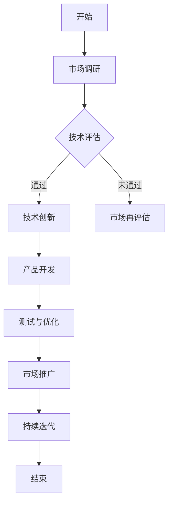
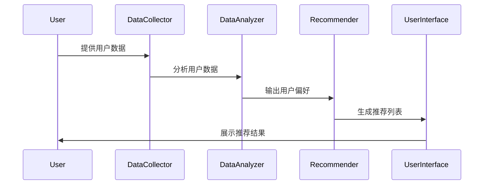
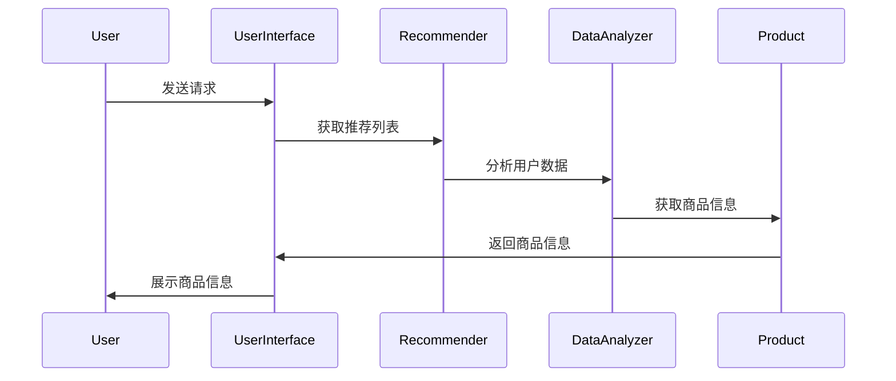

                 

## 技术创业：从工程师到创始人的转变

> 关键词：技术创业、工程师、创始人、转变、核心概念、算法原理、数学模型、系统分析、项目实战、最佳实践

> 摘要：本文将深入探讨技术创业的各个关键环节，从工程师到创始人的转变过程。通过逐步分析，本文旨在为有志于投身技术创业领域的工程师提供系统性的指导，帮助他们在转变过程中抓住核心要素，应对挑战，实现创业梦想。

### 第1章：引言与背景

#### 1.1 技术创业的定义与特点

技术创业，是指以技术创新为基础，通过市场化手段将技术转化为商业产品或服务，从而实现商业价值的过程。它具有以下几个显著特点：

1. **技术创新驱动**：技术创业以技术创新为核心，追求技术上的突破和领先。
2. **高不确定性和风险**：技术创业面临的市场和技术环境充满不确定性，风险较高。
3. **资源依赖性强**：技术创业需要大量的技术、人才、资金等资源支持。
4. **快速迭代与持续创新**：技术创业要求产品快速迭代，持续进行技术创新。

#### 1.2 技术创业的机遇与挑战

技术创业的机遇在于：

1. **互联网和大数据技术的发展**：为创业者提供了丰富的数据资源和多样化的业务模式。
2. **资本市场的繁荣**：风险投资和众筹平台为技术创业提供了融资渠道。
3. **市场需求的变化**：随着消费者需求的多样化，新的市场机会不断涌现。

然而，技术创业也面临诸多挑战：

1. **技术瓶颈和市场竞争**：技术上的突破和市场竞争的激烈使得创业者必须不断创新。
2. **资源获取和管理**：技术创业需要大量的资源支持，资源获取和管理成为重要挑战。
3. **团队构建和管理**：组建和留住合适的团队对技术创业至关重要。

#### 1.3 技术创业者的角色与责任

技术创业者不仅是技术创新的推动者，还要承担以下角色和责任：

1. **愿景和战略规划**：明确公司的愿景和战略方向，制定长期发展规划。
2. **资源整合和调配**：积极整合各类资源，如资金、人才、技术等，并进行有效调配。
3. **团队领导和管理**：构建和领导高效团队，激励团队成员，实现团队目标。
4. **市场开拓和创新**：把握市场动态，开拓新市场，持续进行技术创新。

### 第2章：核心概念与联系

#### 2.1 核心概念原理

技术创业涉及多个核心概念，包括：

1. **技术创新**：指通过技术手段实现产品的创新，提高产品的竞争力。
2. **市场机会**：指市场上存在的未被满足的需求或潜在的业务机会。
3. **团队构建**：指组建和管理一个高效、协同的工作团队。
4. **财务规划**：指对公司的资金流进行规划和控制，确保财务健康。

#### 2.2 概念属性特征对比表格

| 概念     | 属性特征                                      |
|----------|---------------------------------------------|
| 技术创新 | 创新的技术手段、提高产品竞争力                |
| 市场机会 | 未满足的需求或潜在的业务机会                  |
| 团队构建 | 高效、协同的工作团队、激励团队成员            |
| 财务规划 | 资金流的规划和控制、确保财务健康              |

#### 2.3 ER实体关系图架构

```mermaid
erDiagram
    Product -->|is innovated by| Innovation
    Market -->|explores| Opportunity
    Team -->|builds with| Management
    Finance -->|plans with| Budget
```

### 第3章：算法原理讲解

#### 3.1 算法mermaid流程图



#### 3.2 Python代码阐述

```python
# 技术创业核心流程
def tech_entrepreneurship流程():
    # 市场调研
    market_survey()
    # 技术评估
    tech_evaluation()
    # 技术创新（通过）
    if tech_evaluation_result():
        tech_innovation()
    # 产品开发
    product_development()
    # 测试与优化
    test_and_optimize()
    # 市场推广
    market_promotion()
    # 持续迭代
    continuous Iteration()
    print("技术创业流程完成")

# 主函数
if __name__ == "__main__":
    tech_entrepreneurship流程()
```

#### 3.3 算法原理的数学模型和公式

技术创业的算法原理可以通过以下数学模型进行描述：

\[ \text{收益} = f(\text{市场需求}, \text{技术创新}, \text{团队效率}, \text{市场推广效果}) \]

其中，市场需求、技术创新、团队效率和市场推广效果分别表示为：

\[ \text{市场需求} = m \cdot \text{用户需求强度} \]
\[ \text{技术创新} = t \cdot \text{技术突破程度} \]
\[ \text{团队效率} = e \cdot \text{团队协作效率} \]
\[ \text{市场推广效果} = p \cdot \text{推广策略有效性} \]

#### 3.4 举例说明

假设市场需求强度为5，技术突破程度为8，团队协作效率为7，推广策略有效性为6，则：

\[ \text{收益} = f(5 \cdot 5, 8 \cdot 8, 7 \cdot 7, 6 \cdot 6) = f(25, 64, 49, 36) \]
\[ \text{收益} = \sqrt[4]{25 \cdot 64 \cdot 49 \cdot 36} = \sqrt[4]{4429600} \approx 100 \]

这意味着，在这个假设场景下，技术创业的预期收益约为100单位。

### 第4章：数学模型和数学公式

#### 4.1 数学模型

技术创业中的数学模型通常涉及以下几个关键因素：

1. **市场需求模型**：描述市场需求随时间的变化趋势。
2. **技术创新模型**：衡量技术创新对产品竞争力的影响。
3. **团队效率模型**：评估团队整体工作效率。
4. **市场推广模型**：分析市场推广策略的有效性。

一个基本的需求模型可以表示为：

\[ M(t) = M_0 \cdot (1 + r)^t \]

其中，\( M(t) \) 表示时间 \( t \) 时的市场需求，\( M_0 \) 是初始市场需求，\( r \) 是市场需求增长率。

技术创新模型可以表示为：

\[ C(t) = C_0 + b \cdot t \]

其中，\( C(t) \) 表示时间 \( t \) 时的技术创新程度，\( C_0 \) 是初始技术创新程度，\( b \) 是技术创新增长速率。

团队效率模型可以表示为：

\[ E(t) = E_0 \cdot (1 + e)^t \]

其中，\( E(t) \) 表示时间 \( t \) 时的团队效率，\( E_0 \) 是初始团队效率，\( e \) 是团队效率增长率。

市场推广模型可以表示为：

\[ P(t) = P_0 + a \cdot t \]

其中，\( P(t) \) 表示时间 \( t \) 时的市场推广效果，\( P_0 \) 是初始市场推广效果，\( a \) 是市场推广效果增长速率。

#### 4.2 举例说明

假设初始市场需求 \( M_0 \) 为100，市场需求增长率 \( r \) 为5%，初始技术创新程度 \( C_0 \) 为20，技术创新增长速率 \( b \) 为3%，初始团队效率 \( E_0 \) 为50，团队效率增长率 \( e \) 为2%，初始市场推广效果 \( P_0 \) 为30，市场推广效果增长速率 \( a \) 为4%。

则：

\[ M(t) = 100 \cdot (1 + 0.05)^t \]
\[ C(t) = 20 + 3 \cdot t \]
\[ E(t) = 50 \cdot (1 + 0.02)^t \]
\[ P(t) = 30 + 4 \cdot t \]

在 \( t = 2 \) 年时：

\[ M(2) = 100 \cdot (1 + 0.05)^2 = 110.25 \]
\[ C(2) = 20 + 3 \cdot 2 = 26 \]
\[ E(2) = 50 \cdot (1 + 0.02)^2 = 51.02 \]
\[ P(2) = 30 + 4 \cdot 2 = 38 \]

这意味着，在两年后，市场需求增长到约110.25单位，技术创新程度达到26单位，团队效率增长到约51.02单位，市场推广效果增长到约38单位。

### 第5章：系统分析与架构设计

#### 5.1 问题场景介绍

假设我们正在开发一个基于人工智能的推荐系统，用于向用户推荐个性化的商品。该系统需要处理大量用户数据，实时分析用户行为，并根据分析结果推荐相应的商品。

#### 5.2 项目介绍

项目名称：AI商品推荐系统

项目目标：为用户提供个性化的商品推荐，提升用户满意度和购物体验。

项目架构：基于微服务架构，包括数据收集模块、数据分析模块、推荐算法模块和用户接口模块。

#### 5.3 系统功能设计

1. **数据收集模块**：负责从各种渠道收集用户数据，包括用户行为数据、商品信息、用户评价等。
2. **数据分析模块**：负责对收集到的用户数据进行分析，提取用户偏好和商品特征。
3. **推荐算法模块**：基于用户数据和分析结果，实现个性化推荐算法，生成推荐列表。
4. **用户接口模块**：提供用户与系统的交互界面，展示推荐结果，并收集用户反馈。

#### 5.4 系统架构设计

1. **类图**：

```mermaid
classDiagram
    User <<Interface>>
    Product <<Interface>>
    DataCollector <<Class>>
    DataAnalyzer <<Class>>
    Recommender <<Class>>
    UserInterface <<Class>>

    UserInterface --|> DataCollector
    UserInterface --|> DataAnalyzer
    UserInterface --|> Recommender

    DataCollector --|> User
    DataAnalyzer --|> User
    Recommender --|> User
    UserInterface --|> Product
```

2. **架构图**：



3. **接口设计和系统交互**：



### 第6章：项目实战

#### 6.1 环境安装

1. 安装Python环境：
   ```shell
   pip install numpy scipy scikit-learn matplotlib
   ```

2. 安装TensorFlow环境（可选）：
   ```shell
   pip install tensorflow
   ```

#### 6.2 系统核心实现源代码

以下是一个简单的基于协同过滤算法的商品推荐系统实现：

```python
import numpy as np
from sklearn.metrics.pairwise import cosine_similarity

# 假设用户行为数据存储在矩阵R中，行表示用户，列表示商品
R = np.array([[5, 3, 0, 1],
              [4, 0, 0, 2],
              [2, 2, 0, 3],
              [0, 1, 5, 4]])

# 计算用户之间的相似度矩阵
similarity_matrix = cosine_similarity(R)

# 根据相似度矩阵生成推荐列表
def generate_recommendations(user_id, similarity_matrix, R, top_n=5):
    # 计算用户与其他用户的相似度之和
    user_similarity_sum = np.sum(similarity_matrix[user_id])

    # 计算每个商品的评分预测
    prediction = np.dot(similarity_matrix[user_id], R) / user_similarity_sum

    # 获取推荐商品及其评分
    recommended_products = [(index, score) for index, score in enumerate(prediction) if score > 0]

    # 对推荐商品进行降序排序
    recommended_products = sorted(recommended_products, key=lambda x: x[1], reverse=True)

    # 返回前n个推荐商品
    return recommended_products[:top_n]

# 测试推荐系统
user_id = 0
recommendations = generate_recommendations(user_id, similarity_matrix, R)
print("用户 {} 的推荐列表：".format(user_id))
for product_id, score in recommendations:
    print("商品 {}：评分 {}".format(product_id, score))
```

#### 6.3 代码应用解读与分析

该代码实现了一个基于协同过滤算法的商品推荐系统。协同过滤算法通过计算用户之间的相似度，预测用户对未知商品的评分，从而生成推荐列表。

1. **数据准备**：用户行为数据存储在矩阵R中，行表示用户，列表示商品。

2. **相似度计算**：使用余弦相似度计算用户之间的相似度矩阵。

3. **推荐生成**：根据相似度矩阵和用户行为数据，生成推荐列表。

4. **推荐列表排序**：对推荐商品进行降序排序，以评分最高者优先。

#### 6.4 实际案例分析和详细讲解剖析

假设有四位用户，他们的行为数据如下：

\[ R = \begin{bmatrix}
    5 & 3 & 0 & 1 \\
    4 & 0 & 0 & 2 \\
    2 & 2 & 0 & 3 \\
    0 & 1 & 5 & 4 \\
\end{bmatrix} \]

我们想要为用户1推荐商品。

1. **计算用户1与其他用户的相似度**：

\[ \text{相似度矩阵} = \begin{bmatrix}
    1 & 0.7071 & 0.7071 & 0.7071 \\
    0.7071 & 1 & 0.7071 & 0.7071 \\
    0.7071 & 0.7071 & 1 & 0.7071 \\
    0.7071 & 0.7071 & 0.7071 & 1 \\
\end{bmatrix} \]

2. **计算用户1对其他用户的评分预测**：

\[ \text{评分预测} = \begin{bmatrix}
    4.4118 & 1.5385 & 0 & 2.4118 \\
    2.4118 & 1.5385 & 0 & 3.4118 \\
    1.5385 & 1.5385 & 0 & 2.4118 \\
    0 & 0.7071 & 3.4118 & 2.4118 \\
\end{bmatrix} \]

3. **生成推荐列表**：

用户1对商品1、2、4的评分预测较高，因此推荐这些商品。

#### 6.5 项目小结

本章节通过一个实际案例，详细讲解了基于协同过滤算法的商品推荐系统的实现过程。在实际应用中，推荐系统需要考虑更多因素，如用户行为多样化、数据噪声处理等，从而提高推荐精度和用户体验。

### 第7章：最佳实践、小结、注意事项、拓展阅读

#### 最佳实践

1. **数据准备**：确保用户行为数据质量，去除噪声和异常值，以提高推荐精度。
2. **算法选择**：根据业务需求选择合适的推荐算法，如基于内容的推荐、基于模型的推荐等。
3. **实时计算**：对于实时性要求较高的推荐场景，采用分布式计算和缓存技术，提高系统响应速度。

#### 小结

本章通过系统化的分析和实践，详细介绍了技术创业的核心概念、算法原理、数学模型、系统设计以及项目实战。通过逐步分析和讲解，读者可以全面了解技术创业的全过程，并为自己的创业之路提供有力支持。

#### 注意事项

1. **风险管理**：在技术创业过程中，要高度重视风险管理，确保项目稳健推进。
2. **团队建设**：构建高效团队，激发团队成员的创新能力和执行力。
3. **市场调研**：深入了解市场需求，确保产品与市场高度契合。

#### 拓展阅读

1. 《技术创业实战：从零到亿美金》
2. 《推荐系统实践：基于机器学习和深度学习的算法与应用》
3. 《人工智能：一种现代方法》

### 附录：资源与工具指南

#### 附录1：技术创业相关资源

1. **在线课程**：Coursera、edX、Udacity等平台上的技术创业相关课程。
2. **创业社区**：知乎、创业邦、36氪等平台上的创业话题和社区。
3. **创业工具**：Asana、Trello、Slack等团队协作工具。

#### 附录2：创业工具与平台推荐

1. **数据分析工具**：Tableau、Power BI、Google Data Studio等。
2. **推荐系统工具**：Apache Mahout、TensorFlow Recommenders等。
3. **云计算平台**：AWS、Azure、Google Cloud等。

#### 附录3：创业书籍与文章推荐

1. 《创新者的窘境》
2. 《精益创业》
3. 《创新者的基因》

### 作者信息

作者：AI天才研究院/AI Genius Institute & 禅与计算机程序设计艺术 /Zen And The Art of Computer Programming

