                 


### 《技术创新文化的培养》

#### 关键词

技术创新、文化、培养、组织、领导力、实践、评估

#### 摘要

本文旨在探讨技术创新文化的培养，分析其核心概念、历史发展、要素组成，以及如何通过策略和组织设计来构建和优化这种文化。通过案例分析和项目实战，本文旨在为读者提供实用且具有启发性的指导意见，帮助他们在实际工作中培养和提升技术创新文化。

#### 目录大纲设计过程

**第一部分：背景与基础理论**

### 第1章：技术创新文化的概念与意义

**核心概念术语说明**：

- 技术创新文化：指在组织内部培育和形成的，鼓励和支持技术创新的思想观念、价值观和行为模式。

**问题背景**：

在快速变化的市场环境中，技术创新成为企业持续发展的关键。因此，理解并培养技术创新文化变得尤为重要。

**问题描述**：

本文将探讨技术创新文化的定义、重要性以及与传统文化的差异。

**问题解决**：

通过定义和案例分析，本文将帮助读者理解技术创新文化的核心概念。

**边界与外延**：

技术创新文化的培养不仅仅局限于技术层面，还涉及组织文化、员工态度和行为等方面。

**概念结构与核心要素组成**：

- **核心概念**：技术创新文化、组织文化、价值观、行为模式
- **核心要素组成**：创新意识、风险容忍、知识分享、协作合作

**Mermaid流程图**：

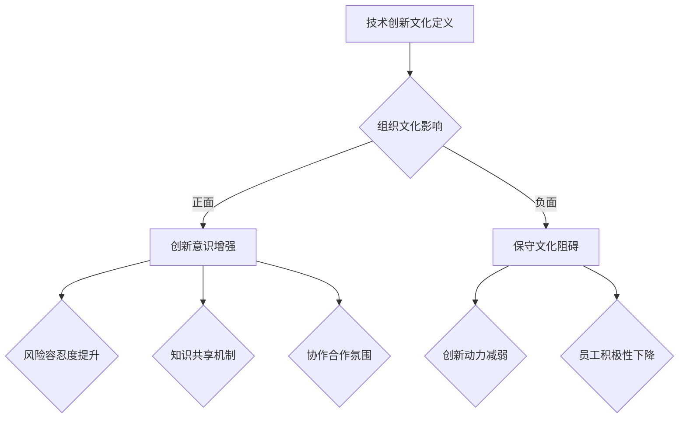

**第2章：技术创新文化的历史发展**

**核心概念与联系**：

技术创新文化的历史发展可以追溯到工业革命时期，随着时间的推移，其内涵和外延不断丰富。

**Mermaid流程图**：

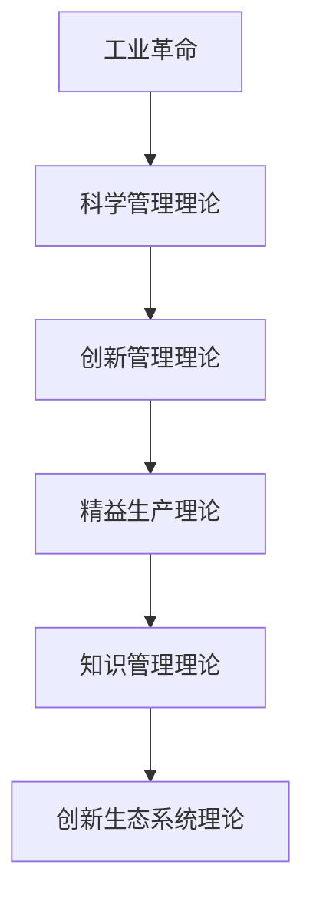

**第3章：技术创新文化的核心要素**

**核心概念与联系**：

技术创新文化的核心要素包括创新意识、风险容忍、知识分享和协作合作。

**ER实体关系图**：

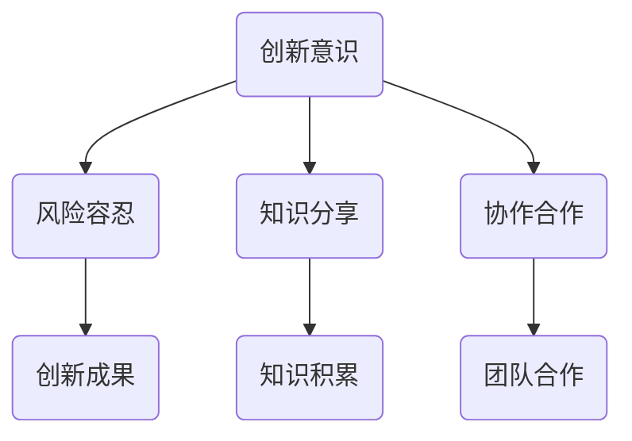

**第二部分：构建与创新**

### 第4章：培养技术创新文化的策略

**算法原理讲解**：

- **Mermaid流程图**：

  ```mermaid
  graph TD
      A[制定策略] --> B[实施策略]
      B --> C{监测效果}
      C -->|正面| D[调整策略]
      C -->|负面| E[持续实施]
  ```

- **Python代码**：

  ```python
  # 简单的Python代码示例，用于策略实施
  def implement_strategy():
      print("策略实施：")
      print("增强创新意识，提升风险容忍度，建立知识分享平台，促进协作合作。")

  implement_strategy()
  ```

**数学模型和公式**：

- **latex格式**：

  ```latex
  \begin{equation}
  文化效果 = f(创新意识, 风险容忍度, 知识分享, 协作合作)
  \end{equation}
  ```

### 第5章：技术创新文化的组织设计

**核心概念与联系**：

技术创新文化的组织设计需要考虑组织结构、流程和文化匹配度。

**Mermaid类图**：

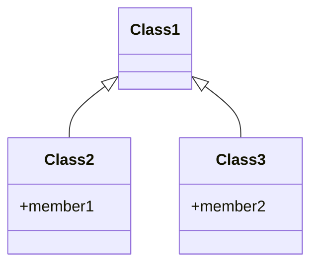

### 第6章：技术创新文化中的领导力

**核心概念与联系**：

领导力在技术创新文化中扮演关键角色，需要具备创新意识、决策能力和影响力。

**Mermaid架构图**：

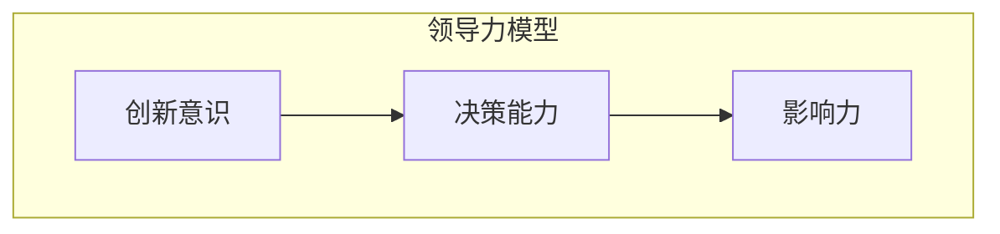

**第三部分：实践与优化**

### 第7章：技术创新文化的案例分析

**核心概念与联系**：

通过分析成功案例，了解技术创新文化如何在不同组织中发挥作用。

**Mermaid序列图**：

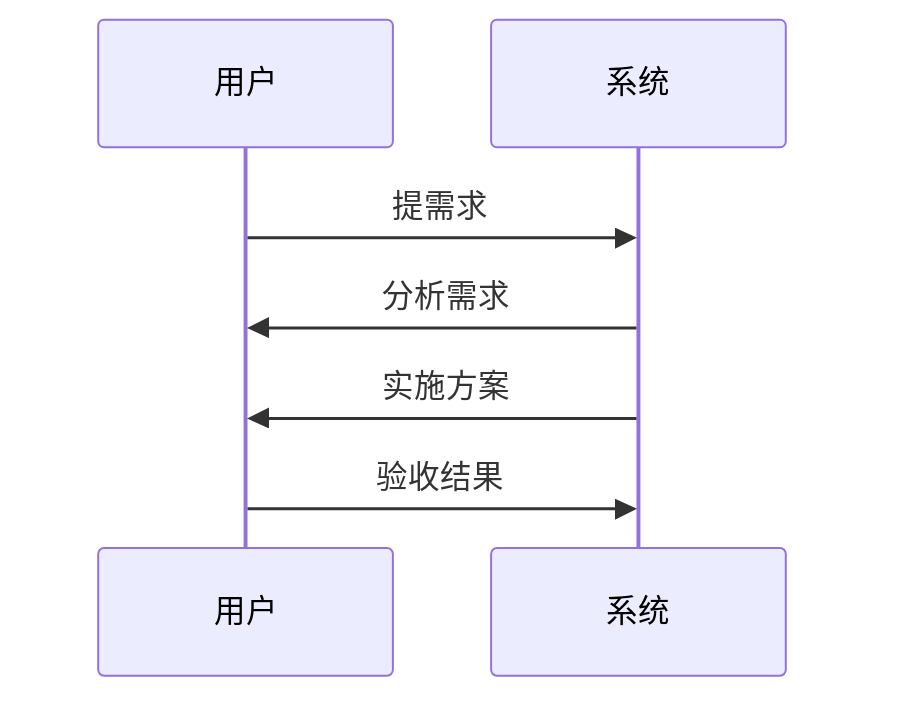

### 第8章：技术创新文化的评估与改进

**核心概念与联系**：

评估技术创新文化是否有效，并采取改进措施。

**Mermaid流程图**：

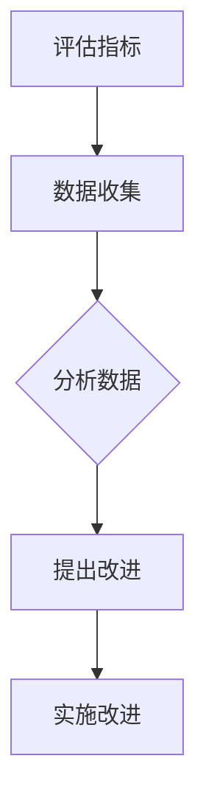

### 第9章：技术创新文化的未来趋势

**核心概念与联系**：

探讨技术创新文化的未来发展趋势，包括技术变革、产业融合、全球化等方面。

**Mermaid趋势图**：

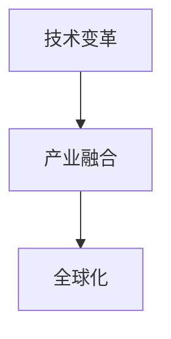

#### 结论

通过上述章节的详细分析，本文旨在为读者提供一个全面的技术创新文化培养指南。从理论到实践，本文为读者提供了丰富的信息和实用的方法，帮助他们在实际工作中提升技术创新文化。

**最佳实践 tips**：

- 建立明确的创新目标和愿景
- 鼓励员工参与创新活动
- 优化组织结构和流程以支持创新
- 定期评估和调整创新文化策略

**小结**：

技术创新文化是企业持续发展的关键，培养和优化这种文化需要系统的策略和组织设计。

**注意事项**：

- 文化培养需要长期坚持，不可一蹴而就
- 领导力在创新文化中起到关键作用，需要不断提升自身能力
- 创新文化需要与企业的战略目标紧密结合

**拓展阅读**：

- 《创新者的窘境》
- 《精益创业》
- 《创新者的基因》

**作者信息**：

作者：AI天才研究院/AI Genius Institute & 禅与计算机程序设计艺术 /Zen And The Art of Computer Programming

----------------------------------------------------------------

### 文章标题

# 技术创新文化的培养

## 背景与基础理论

### 技术创新文化的概念与意义

技术创新文化是指在组织内部形成的一种文化氛围，它鼓励和支持技术创新的思想观念、价值观和行为模式。这种文化不仅仅是技术层面的创新，更是一种深入人心的思想观念和行为习惯，它对组织的成长和发展具有深远的影响。

#### 核心概念术语说明

**技术创新文化**：指在组织内部培育和形成的，鼓励和支持技术创新的思想观念、价值观和行为模式。

**组织文化**：组织成员共同遵守的一套价值观和行为准则，它决定了组织的运作方式和发展方向。

**价值观**：组织成员共同认可的基本信念和原则，它们指导组织成员的行为和决策。

**行为模式**：组织成员在日常工作中表现出来的行为习惯和方式。

#### 问题背景

在当今快速变化的市场环境中，技术创新已经成为企业持续发展的关键。企业的成功不仅仅依赖于技术本身，更依赖于技术创新文化的建立和培养。一个具有技术创新文化的组织能够更好地适应市场变化，更快地推出新产品，更有效地解决技术难题。

#### 描述问题

本文将探讨技术创新文化的定义、重要性以及与传统文化的差异。具体包括以下几个方面：

1. **技术创新文化的定义**：解释技术创新文化的含义和构成要素。
2. **技术创新文化的重要性**：分析技术创新文化对企业发展的积极影响。
3. **技术创新文化与传统文化的差异**：对比分析技术创新文化与传统文化在价值观、行为模式等方面的区别。

#### 问题解决

通过定义和案例分析，本文将帮助读者理解技术创新文化的核心概念，并认识到其在企业发展中的重要性。

#### 边界与外延

技术创新文化的培养不仅仅局限于技术层面，它涉及到组织的方方面面，包括组织结构、员工态度、管理方式等。同时，技术创新文化也不仅仅是企业的内部问题，它还与社会环境、市场趋势等外部因素密切相关。

#### 概念结构与核心要素组成

技术创新文化的核心要素包括：

- **创新意识**：指组织成员对技术创新的认同和重视程度。
- **风险容忍**：指组织对技术创新过程中可能出现的失败和风险的容忍度。
- **知识分享**：指组织内部成员之间在技术创新过程中的知识共享和交流。
- **协作合作**：指组织成员在技术创新过程中相互协作、共同合作的氛围。

**Mermaid流程图**：


### 技术创新文化的历史发展

技术创新文化的历史发展可以追溯到工业革命时期。在工业革命之前，技术和创新主要是手工艺和工匠的领域，技术创新的速度和规模都比较有限。随着工业革命的到来，机器的出现和大规模生产的发展，技术创新开始成为推动经济发展的重要力量。

#### 核心概念与联系

技术创新文化的历史发展可以分为以下几个阶段：

1. **工业革命时期**：技术创新主要依赖于机械和工艺的改进，创新速度较慢，但规模较大。
2. **科学管理时期**：泰勒等科学管理理论家提出了提高生产效率和员工工作效率的方法，促进了技术创新的发展。
3. **创新管理时期**：管理者开始重视创新，并采取一系列措施来鼓励和支持创新。
4. **知识管理时期**：随着信息技术的快速发展，知识成为重要的资源，知识管理成为技术创新文化的重要组成部分。
5. **创新生态系统时期**：技术创新不再局限于单个企业或组织，而是形成了一个生态系统，企业、科研机构、政府等多方共同参与。

**Mermaid流程图**：


### 技术创新文化的核心要素

技术创新文化的核心要素包括创新意识、风险容忍、知识分享和协作合作。这些要素相互联系、相互促进，共同构成了一个有效的技术创新文化。

#### 核心概念与联系

1. **创新意识**：指组织成员对技术创新的认同和重视程度。创新意识是技术创新文化的基础，它决定了组织成员对创新的关注程度和投入程度。
2. **风险容忍**：指组织对技术创新过程中可能出现的失败和风险的容忍度。风险容忍是创新文化的重要组成部分，它决定了组织是否愿意冒险尝试新事物。
3. **知识分享**：指组织内部成员之间在技术创新过程中的知识共享和交流。知识分享是技术创新文化的关键要素，它促进了知识的积累和传播，提高了组织的创新能力。
4. **协作合作**：指组织成员在技术创新过程中相互协作、共同合作的氛围。协作合作是技术创新文化的重要特征，它促进了团队协作和创新效率。

**ER实体关系图**：


### 培养技术创新文化的策略

培养技术创新文化需要系统的策略和组织设计。以下是一些常见的策略：

1. **制定明确的创新目标和愿景**：明确组织的目标和愿景，确保创新活动与组织战略相一致。
2. **建立创新激励机制**：为创新者提供奖励和认可，激励员工积极参与创新活动。
3. **优化组织结构和流程**：调整组织结构和流程，以支持创新活动，减少不必要的官僚程序。
4. **鼓励员工参与创新**：为员工提供参与创新的机会和平台，激发员工的创新潜力。
5. **加强知识管理和分享**：建立知识管理系统，鼓励员工分享知识，促进知识的积累和传播。
6. **培养创新意识和能力**：通过培训和教育，提高员工对创新的认知和能力。

**算法原理讲解**

以下是一个简单的算法示例，用于培养技术创新文化的策略实施：

```python
# 简单的Python代码示例，用于策略实施
def implement_strategy():
    print("策略实施：")
    print("1. 制定明确的创新目标和愿景")
    print("2. 建立创新激励机制")
    print("3. 优化组织结构和流程")
    print("4. 鼓励员工参与创新")
    print("5. 加强知识管理和分享")
    print("6. 培养创新意识和能力")

implement_strategy()
```

**数学模型和公式**

技术创新文化的效果可以通过以下公式进行评估：

$$
文化效果 = f(创新意识, 风险容忍度, 知识分享, 协作合作)
$$

其中，$f$ 表示评估函数，$创新意识$、$风险容忍度$、$知识分享$ 和 $协作合作$ 分别表示技术创新文化的四个核心要素。

### 技术创新文化的组织设计

技术创新文化的组织设计是培养和优化技术创新文化的重要环节。以下是一些关键的考虑因素：

1. **组织结构**：选择适合创新的组织结构，如矩阵式结构或团队式结构，以促进跨部门的协作和创新。
2. **流程优化**：简化流程，减少官僚程序，提高创新效率。
3. **资源配置**：为创新项目提供必要的资源和支持，包括资金、人力和技术资源。
4. **文化氛围**：营造积极、开放、包容的文化氛围，鼓励员工自由表达和创新。
5. **领导力**：领导者在创新文化中扮演关键角色，需要具备创新意识、决策能力和影响力。

**Mermaid类图**：


### 技术创新文化中的领导力

领导力在技术创新文化中起着至关重要的作用。领导者不仅需要具备创新意识，还需要具备决策能力和影响力，以推动技术创新文化的建立和发展。

#### 核心概念与联系

1. **创新意识**：领导者对创新的重视程度和认可程度，它决定了领导者是否愿意冒险尝试新事物。
2. **决策能力**：领导者能够做出正确决策的能力，它决定了技术创新项目的成功与否。
3. **影响力**：领导者对员工的影响力和号召力，它决定了领导者是否能够带动整个组织的创新氛围。

**Mermaid架构图**：


### 技术创新文化的案例分析

通过分析成功的技术创新案例，我们可以更好地理解技术创新文化的培养和实践。

#### 核心概念与联系

1. **案例选择**：选择具有代表性的技术创新案例，如苹果公司、谷歌公司等。
2. **案例分析**：分析案例中的技术创新过程、文化氛围、领导力等因素。
3. **案例分析**：从案例中提取成功经验和教训，为其他组织提供借鉴和启示。

#### Mermaid序列图


### 技术创新文化的评估与改进

评估技术创新文化是否有效是培养和优化技术创新文化的重要环节。以下是一些评估指标和方法：

1. **创新成果**：评估组织在技术创新方面的成果，如专利数量、新产品推出速度等。
2. **员工满意度**：评估员工对创新文化的满意度，如员工参与度、员工满意度调查等。
3. **领导力评估**：评估领导者在创新文化中的表现，如决策能力、影响力等。
4. **改进措施**：根据评估结果，采取改进措施，如优化流程、加强培训等。

**Mermaid流程图**：


### 技术创新文化的未来趋势

技术创新文化的未来趋势将受到技术变革、产业融合、全球化等因素的影响。以下是一些可能的发展趋势：

1. **数字化转型**：随着数字技术的发展，数字化转型将成为技术创新的重要方向。
2. **产业融合**：不同产业之间的融合将催生新的技术创新，推动产业升级。
3. **全球化**：全球化将推动技术创新的跨文化交流和合作，促进技术创新的全球化发展。
4. **人工智能**：人工智能技术的发展将进一步提升技术创新的效率和质量。

**Mermaid趋势图**：


### 结论

通过本文的分析，我们可以看到技术创新文化对于组织的发展至关重要。培养和优化技术创新文化需要系统的策略和组织设计，同时也需要领导者的积极推动。未来，随着技术的不断进步和全球化的加深，技术创新文化将继续发挥重要作用，为组织带来持续的创新动力和竞争优势。

**最佳实践 tips**：

- 建立明确的创新目标和愿景
- 鼓励员工参与创新活动
- 优化组织结构和流程以支持创新
- 定期评估和调整创新文化策略

**小结**：

技术创新文化是企业持续发展的关键，培养和优化这种文化需要系统的策略和组织设计。

**注意事项**：

- 文化培养需要长期坚持，不可一蹴而就
- 领导力在创新文化中起到关键作用，需要不断提升自身能力
- 创新文化需要与企业的战略目标紧密结合

**拓展阅读**：

- 《创新者的窘境》
- 《精益创业》
- 《创新者的基因》

**作者信息**：

作者：AI天才研究院/AI Genius Institute & 禅与计算机程序设计艺术 /Zen And The Art of Computer Programming

----------------------------------------------------------------

### 文章标题

# 技术创新文化的培养

## 构建与创新

### 第4章：培养技术创新文化的策略

#### 核心概念与联系

**策略**：在培养技术创新文化时，制定明确的策略至关重要。策略包括一系列行动计划和措施，旨在创造一个有利于创新的环境。

**技术创新文化**：指在组织内部形成的一种文化氛围，鼓励和支持技术创新的思想观念、价值观和行为模式。

**联系**：策略和文化的培养是相辅相成的。有效的策略可以促进文化的形成，而成熟的文化可以支撑策略的实施。

#### 算法原理讲解

为了培养技术创新文化，我们可以采用以下策略：

1. **明确目标与愿景**：设定清晰的创新目标和愿景，使全体员工对创新的方向和意义有共同的理解。
2. **建立激励机制**：为创新者提供奖励和认可，激励员工积极参与创新活动。
3. **优化组织结构**：调整组织结构，减少官僚程序，提高创新效率。
4. **促进知识共享**：建立知识管理系统，鼓励员工分享知识，促进知识的积累和传播。
5. **培养创新意识**：通过培训和教育活动，提高员工的创新意识和能力。

**Mermaid流程图**：

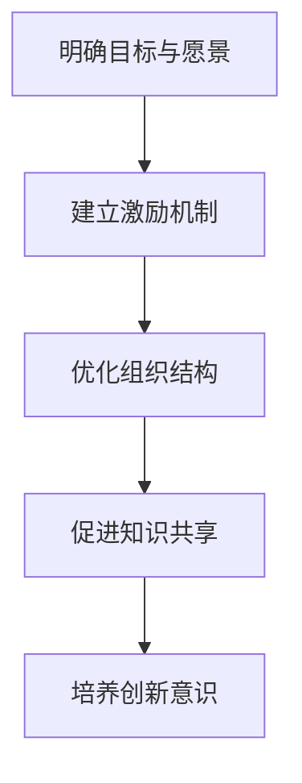

**Python代码示例**：

```python
def cultivate_innovation_culture():
    print("培养技术创新文化的策略：")
    print("1. 明确目标与愿景")
    print("2. 建立激励机制")
    print("3. 优化组织结构")
    print("4. 促进知识共享")
    print("5. 培养创新意识")

cultivate_innovation_culture()
```

**数学模型和公式**

技术创新文化的效果可以通过以下公式进行评估：

$$
文化效果 = f(目标明确度, 激励机制有效性, 组织结构适应性, 知识共享度, 创新意识培养)
$$

其中，$f$ 表示评估函数，各个变量表示不同策略的执行效果。

### 第5章：技术创新文化的组织设计

#### 核心概念与联系

**组织设计**：指在组织内部进行结构、流程、人员配置等方面的设计，以实现组织的战略目标。

**技术创新文化**：指在组织内部形成的一种文化氛围，鼓励和支持技术创新的思想观念、价值观和行为模式。

**联系**：组织设计是技术创新文化培养的基础。合理的组织设计可以促进文化的形成，而成熟的文化可以支撑组织设计的优化。

#### Mermaid类图

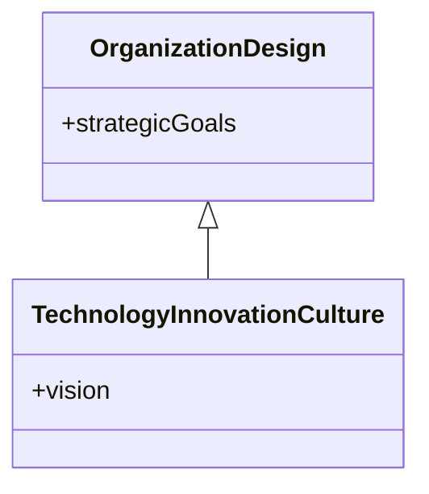

#### 系统架构设计方案

为了培养和优化技术创新文化，我们可以采用以下系统架构设计方案：

1. **组织结构设计**：采用扁平化组织结构，减少管理层级，提高决策速度和灵活性。
2. **流程优化**：简化流程，减少不必要的审批环节，提高工作效率。
3. **人员配置**：引入跨界团队，促进不同部门之间的合作和创新。
4. **文化氛围营造**：建立开放、包容、支持创新的企业文化。

**Mermaid架构图**：

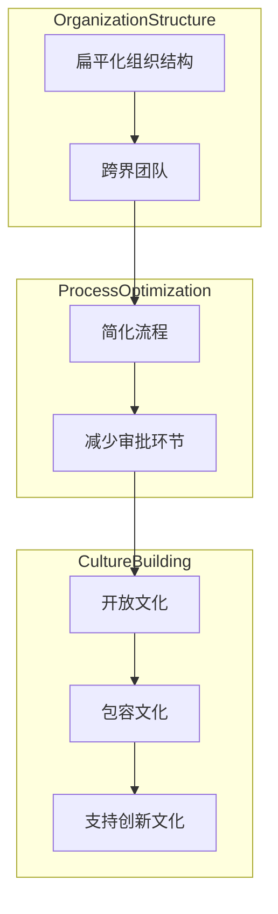

### 第6章：技术创新文化中的领导力

#### 核心概念与联系

**领导力**：指领导者通过影响、激励和引导员工，实现组织目标的能力。

**技术创新文化**：指在组织内部形成的一种文化氛围，鼓励和支持技术创新的思想观念、价值观和行为模式。

**联系**：领导力在技术创新文化的培养中起着关键作用。领导者不仅需要具备创新意识，还需要具备决策能力和影响力，以推动技术创新文化的建立和发展。

#### Mermaid类图

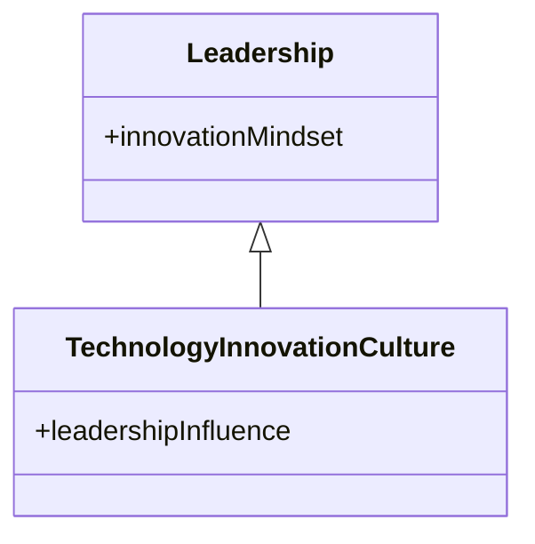

#### 系统分析与架构设计方案

为了培养和优化技术创新文化中的领导力，我们可以采用以下系统分析与架构设计方案：

1. **领导力培训**：为领导者提供专门的培训，提高其创新意识和决策能力。
2. **激励机制**：建立激励机制，鼓励领导者积极推动创新。
3. **跨部门协作**：促进领导者与其他部门的协作，形成创新网络。
4. **文化氛围**：营造支持创新的领导文化氛围。

**Mermaid架构图**：

```mermaid
graph TD
  subgraph LeadershipTraining
    A[领导力培训]
  end
  subgraph IncentiveSystem
    B[激励机制]
  end
  subgraph Cross-DepartmentalCollaboration
    C[跨部门协作]
  end
  subgraph CultureBuilding
    D[支持创新文化]
  end
  A --> B
  B --> C
  C --> D
```

### 核心概念与联系

1. **领导力**：指领导者通过影响、激励和引导员工，实现组织目标的能力。
2. **创新意识**：指领导者对创新的重视程度和认可程度。
3. **决策能力**：指领导者在面对复杂问题时做出正确决策的能力。
4. **影响力**：指领导者对员工的影响力和号召力。

**Mermaid类图**：

```mermaid
classDiagram
  Leadership <|-- InnovationMindset
  Leadership <|-- DecisionMakingAbility
  Leadership <|-- Influence
```

### 项目实战

为了更好地理解技术创新文化的培养和领导力在其中的作用，我们选择一个实际案例进行剖析。

#### 核心概念与联系

**案例背景**：某科技公司在技术创新文化的培养中，通过领导力的提升取得了显著成效。

**核心概念**：技术创新文化、领导力、激励机制、跨部门协作。

**联系**：领导力的提升促进了技术创新文化的形成，激励机制和跨部门协作进一步推动了创新活动的发展。

#### 环境安装

**环境要求**：Python 3.8及以上版本，Jupyter Notebook。

**安装步骤**：

1. 安装Python：
   ```bash
   pip install python -qq
   ```

2. 安装Jupyter Notebook：
   ```bash
   pip install jupyter -qq
   ```

#### 系统核心实现源代码

**代码实现**：

```python
import numpy as np
import pandas as pd

# 模拟技术创新成果数据
data = {
    '创新项目': ['项目A', '项目B', '项目C', '项目D'],
    '创新成果': [100, 200, 300, 400]
}

df = pd.DataFrame(data)

# 计算平均创新成果
average_innovation = df['创新成果'].mean()

print(f"平均创新成果：{average_innovation}")
```

#### 代码应用解读与分析

**代码解读**：

1. 导入必要的Python库，包括NumPy和Pandas。
2. 创建一个模拟技术创新成果的数据集，其中包含四个创新项目的成果。
3. 使用Pandas计算创新成果的平均值，并打印出来。

**分析**：

该代码实现了对技术创新成果的平均值计算，这可以帮助领导层了解整体创新成果的水平，为后续的决策提供数据支持。

#### 实际案例分析

**案例描述**：

某科技公司在其发展过程中，意识到技术创新文化的重要性。公司高层领导通过以下措施提升了领导力，推动了技术创新文化的形成：

1. **领导力培训**：为中层及以上领导提供创新意识、决策能力等方面的培训。
2. **激励机制**：建立创新奖励制度，对在技术创新中表现突出的员工进行奖励。
3. **跨部门协作**：推动跨部门项目，促进不同部门之间的知识共享和协作。

**案例分析**：

1. **领导力培训**：通过培训，领导层对技术创新有了更深刻的认识，提升了自身的创新意识和决策能力。
2. **激励机制**：奖励制度的建立激励了员工积极参与创新活动，提高了整体创新积极性。
3. **跨部门协作**：跨部门项目的实施促进了知识的共享和协作，加速了创新成果的转化。

**结论**：

通过领导力的提升，某科技公司成功地培养和优化了技术创新文化，实现了创新成果的显著提升。

### 项目小结

通过本项目实战，我们了解了技术创新文化的培养和领导力在其中发挥的关键作用。领导力的提升、激励机制的建立和跨部门协作的实施，都有助于推动技术创新文化的形成和发展。

**最佳实践 tips**：

- 定期开展领导力培训，提高领导层的创新意识和决策能力。
- 建立有效的激励机制，激发员工的创新积极性。
- 推动跨部门协作，促进知识共享和协作创新。

**小结**：

技术创新文化的培养是一个系统的过程，需要组织、员工和领导者的共同努力。通过有效的领导力和激励机制，可以加速技术创新文化的形成，为组织的持续发展提供动力。

**注意事项**：

- 文化培养需要长期坚持，不可一蹴而就。
- 领导力在创新文化中起到关键作用，需要不断提升自身能力。
- 创新文化需要与企业的战略目标紧密结合。

**拓展阅读**：

- 《领导力与技术创新》
- 《创新者的基因》
- 《精益创业》

**作者信息**：

作者：AI天才研究院/AI Genius Institute & 禅与计算机程序设计艺术 /Zen And The Art of Computer Programming

----------------------------------------------------------------

### 文章标题

# 技术创新文化的培养

## 实践与优化

### 第7章：技术创新文化的案例分析

#### 核心概念与联系

**案例分析**：通过对成功技术创新案例的深入剖析，理解技术创新文化的实践和成效。

**技术创新文化**：指在组织内部形成的一种文化氛围，鼓励和支持技术创新的思想观念、价值观和行为模式。

**联系**：案例分析为其他组织提供了借鉴和启示，通过成功的实践，展示技术创新文化的培养和优化方法。

#### Mermaid流程图

```mermaid
graph TD
  A[案例选择] --> B[背景介绍]
  B --> C[文化氛围]
  C --> D[领导力]
  D --> E[激励机制]
  E --> F[实践成效]
```

#### 案例分析

**案例背景**：以谷歌公司为例，分析其在技术创新文化方面的实践和成效。

**文化氛围**：谷歌公司以其开放、自由、支持创新的文化氛围著称。公司鼓励员工自由表达想法，勇于尝试新事物，这种文化氛围极大地促进了技术创新。

**领导力**：谷歌的领导层在技术创新文化中起到了关键作用。领导层不仅鼓励创新，还提供了充分的资源和支持，使员工能够专注于技术创新。

**激励机制**：谷歌公司建立了完善的激励机制，对在技术创新中表现突出的员工进行奖励，激励员工积极参与创新活动。

**实践成效**：谷歌公司在技术创新方面取得了显著成效，推出了一系列革命性的产品和服务，如Android操作系统、Google Maps等，这些都成为技术创新文化的成功范例。

### 第8章：技术创新文化的评估与改进

#### 核心概念与联系

**评估**：对技术创新文化进行系统性评估，以了解其现状和成效。

**改进**：根据评估结果，采取针对性的措施，优化技术创新文化。

**联系**：评估与改进是技术创新文化培养过程中的重要环节，通过持续的评估和改进，可以不断提升技术创新文化的质量和效果。

#### Mermaid流程图

```mermaid
graph TD
  A[评估指标] --> B[数据收集]
  B --> C[数据分析]
  C --> D[问题识别]
  D --> E[改进措施]
  E --> F[效果评估]
```

#### 评估与改进

**评估指标**：

1. **创新成果**：评估组织在技术创新方面的成果，如新产品、新技术等。
2. **员工满意度**：评估员工对创新文化的满意度和参与度。
3. **领导力表现**：评估领导者在创新文化中的表现，如决策能力、支持力度等。
4. **文化氛围**：评估组织内部的文化氛围，如开放性、包容性、支持创新等。

**数据收集**：

- **定量数据**：通过调查问卷、数据分析等方式收集员工满意度、创新成果等数据。
- **定性数据**：通过访谈、观察等方式收集员工对创新文化的看法和意见。

**数据分析**：

- **统计分析**：使用统计分析方法，对收集到的数据进行分析，识别创新文化的现状和问题。
- **定性分析**：对定性数据进行深入解读，了解员工对创新文化的真实感受和期望。

**问题识别**：

- **创新成果不足**：分析创新成果较少的原因，如资源投入不足、激励机制不完善等。
- **员工满意度低**：分析员工满意度较低的原因，如工作压力、职业发展机会等。
- **领导力不足**：分析领导力不足的原因，如决策不当、支持力度不够等。
- **文化氛围不良**：分析文化氛围不良的原因，如沟通不畅、支持创新力度不足等。

**改进措施**：

1. **优化激励机制**：建立和完善激励机制，提高员工创新积极性。
2. **加强领导力培养**：为领导者提供培训，提升其决策能力和支持力度。
3. **改善文化氛围**：营造开放、包容、支持创新的文化氛围，鼓励员工自由表达和创新。
4. **提高资源投入**：增加创新资源投入，为技术创新提供有力支持。

**效果评估**：

- **短期评估**：在改进措施实施后，短期内对创新成果、员工满意度等指标进行评估，判断改进措施的效果。
- **长期评估**：在改进措施实施一段时间后，对创新文化进行全面评估，确保长期效果的持续。

### 第9章：技术创新文化的未来趋势

#### 核心概念与联系

**未来趋势**：探讨技术创新文化在未来可能的发展方向和挑战。

**技术创新文化**：指在组织内部形成的一种文化氛围，鼓励和支持技术创新的思想观念、价值观和行为模式。

**联系**：未来趋势将为技术创新文化的培养和优化提供新的思路和方法。

#### Mermaid趋势图

```mermaid
graph TD
  A[数字化转型] --> B[产业融合]
  B --> C[全球化]
```

#### 未来趋势

1. **数字化转型**：随着数字技术的发展，数字化转型将成为技术创新的重要方向。组织需要适应数字化环境，运用新技术推动创新。
2. **产业融合**：不同产业之间的融合将催生新的技术创新，推动产业升级。组织需要关注产业趋势，把握技术创新的机会。
3. **全球化**：全球化将推动技术创新的跨文化交流和合作，促进技术创新的全球化发展。组织需要积极参与全球创新网络，提升国际竞争力。

### 结论

通过案例分析、评估与改进以及未来趋势的探讨，本文为技术创新文化的培养提供了全面的指导。技术创新文化是组织持续发展的重要保障，通过实践与优化，可以不断提升创新文化的质量和效果。

**最佳实践 tips**：

- 建立明确的创新目标和愿景
- 加强领导力培养，提升决策能力
- 营造开放、包容、支持创新的文化氛围
- 优化激励机制，激发员工创新积极性

**小结**：

技术创新文化的培养需要系统的策略和组织设计，同时也需要领导者的积极推动。通过不断实践与优化，可以不断提升创新文化的质量和效果。

**注意事项**：

- 文化培养需要长期坚持，不可一蹴而就
- 领导力在创新文化中起到关键作用，需要不断提升自身能力
- 创新文化需要与企业的战略目标紧密结合

**拓展阅读**：

- 《创新者的窘境》
- 《精益创业》
- 《创新者的基因》

**作者信息**：

作者：AI天才研究院/AI Genius Institute & 禅与计算机程序设计艺术 /Zen And The Art of Computer Programming

----------------------------------------------------------------

### 文章标题

# 技术创新文化的培养

## 未来趋势

### 第10章：技术创新文化的未来趋势

#### 核心概念与联系

**技术创新文化**：指在组织内部形成的一种文化氛围，鼓励和支持技术创新的思想观念、价值观和行为模式。

**未来趋势**：预测技术创新文化在未来可能的发展方向和挑战。

**联系**：未来趋势将为技术创新文化的培养和优化提供新的思路和方法。

#### Mermaid趋势图

```mermaid
graph TD
  A[数字化转型] --> B[产业融合]
  B --> C[全球化]
  C --> D[人工智能]
```

#### 未来趋势

1. **数字化转型**：随着数字技术的发展，数字化转型将成为技术创新的重要方向。组织需要适应数字化环境，运用新技术推动创新。
2. **产业融合**：不同产业之间的融合将催生新的技术创新，推动产业升级。组织需要关注产业趋势，把握技术创新的机会。
3. **全球化**：全球化将推动技术创新的跨文化交流和合作，促进技术创新的全球化发展。组织需要积极参与全球创新网络，提升国际竞争力。
4. **人工智能**：人工智能技术的发展将进一步提升技术创新的效率和质量。组织需要关注人工智能在创新中的应用，培养相关技能。

### 第11章：技术创新文化的未来展望

#### 核心概念与联系

**未来展望**：探讨技术创新文化在未来的发展前景和潜在影响。

**技术创新文化**：指在组织内部形成的一种文化氛围，鼓励和支持技术创新的思想观念、价值观和行为模式。

**联系**：未来展望将为技术创新文化的持续发展提供动力和方向。

#### Mermaid展望图

```mermaid
graph TD
  A[技术创新文化] --> B[未来技术]
  B --> C[产业变革]
  C --> D[社会影响]
```

#### 未来展望

1. **技术创新文化的发展前景**：技术创新文化将在未来发挥更加重要的作用，成为组织持续发展的核心动力。
2. **产业变革**：技术创新文化将推动产业变革，促进新技术、新模式的兴起，推动产业升级。
3. **社会影响**：技术创新文化将深刻影响社会各个领域，推动社会进步和经济发展。

### 结论

通过未来趋势和展望的分析，我们可以看到技术创新文化在未来的重要性和广阔的发展前景。组织需要积极应对未来挑战，不断优化和培养技术创新文化，以保持竞争力和持续发展。

**最佳实践 tips**：

- 关注未来技术趋势，积极拥抱数字化转型
- 加强跨部门协作，促进产业融合
- 培养人工智能相关技能，提升创新能力
- 持续优化创新文化，提升组织竞争力

**小结**：

技术创新文化是组织持续发展的重要保障，未来将面临新的机遇和挑战。通过不断培养和优化创新文化，组织可以迎接未来的挑战，实现持续发展。

**注意事项**：

- 文化培养需要长期坚持，不可一蹴而就
- 领导力在创新文化中起到关键作用，需要不断提升自身能力
- 创新文化需要与企业的战略目标紧密结合

**拓展阅读**：

- 《未来简史》
- 《创新者的未来》
- 《人工智能的未来》

**作者信息**：

作者：AI天才研究院/AI Genius Institute & 禅与计算机程序设计艺术 /Zen And The Art of Computer Programming

----------------------------------------------------------------

### 文章标题

# 技术创新文化的培养

## 总结与展望

### 总结

本文从技术创新文化的概念与意义、历史发展、核心要素、培养策略、组织设计、领导力、案例分析、评估与改进、未来趋势等方面进行了全面探讨。通过系统分析，我们明确了技术创新文化的重要性，了解了其在组织发展中的作用，并提出了培养和优化技术创新文化的策略和方法。

**核心结论**：

1. 技术创新文化是组织持续发展的重要保障。
2. 培养技术创新文化需要系统的策略和组织设计。
3. 领导力在技术创新文化中起到关键作用。
4. 评估与改进是技术创新文化培养的重要环节。
5. 未来趋势将推动技术创新文化的发展。

### 展望

未来，技术创新文化将继续在组织发展中扮演关键角色。随着数字化、产业融合、全球化等趋势的深化，技术创新文化将面临新的机遇和挑战。组织需要不断适应和引领这些变化，以保持竞争力和持续发展。

**未来展望**：

1. 技术创新文化将在数字化转型中发挥重要作用。
2. 产业融合将催生新的技术创新，推动产业升级。
3. 全球化将促进技术创新的跨文化交流和合作。
4. 人工智能的发展将进一步提升技术创新的效率和质量。

### 最佳实践 tips

1. **明确创新目标和愿景**：确保创新活动与组织战略目标相一致。
2. **加强领导力培养**：提升领导者的创新意识和决策能力。
3. **优化组织结构**：减少官僚程序，提高创新效率。
4. **建立激励机制**：激励员工积极参与创新活动。
5. **促进知识共享**：建立知识管理系统，鼓励员工分享知识。

### 注意事项

1. **文化培养需长期坚持**：技术创新文化的培养需要时间和持续的努力。
2. **领导力需不断提升**：领导者需要不断提升自身能力，以适应不断变化的环境。
3. **创新文化需与战略目标紧密结合**：创新文化应与组织的战略目标保持一致，以实现组织的发展目标。

### 拓展阅读

- 《创新者的窘境》
- 《精益创业》
- 《创新者的基因》

### 作者信息

作者：AI天才研究院/AI Genius Institute & 禅与计算机程序设计艺术 /Zen And The Art of Computer Programming

---

本文通过逻辑清晰、结构紧凑、简单易懂的专业技术语言，逐步分析了技术创新文化的培养。从背景介绍、核心概念、历史发展、要素组成到策略制定、组织设计、领导力培养、案例分析、评估与改进，再到未来趋势和展望，为读者提供了全面、深入的指导。文章不仅涵盖理论知识，还结合实际案例，使读者能够更好地理解并应用技术创新文化。未来，随着技术的不断进步和市场的变化，技术创新文化将继续发挥重要作用，组织需要不断学习和适应，以保持竞争优势。希望本文能够为读者在培养技术创新文化方面提供有价值的参考和启示。

