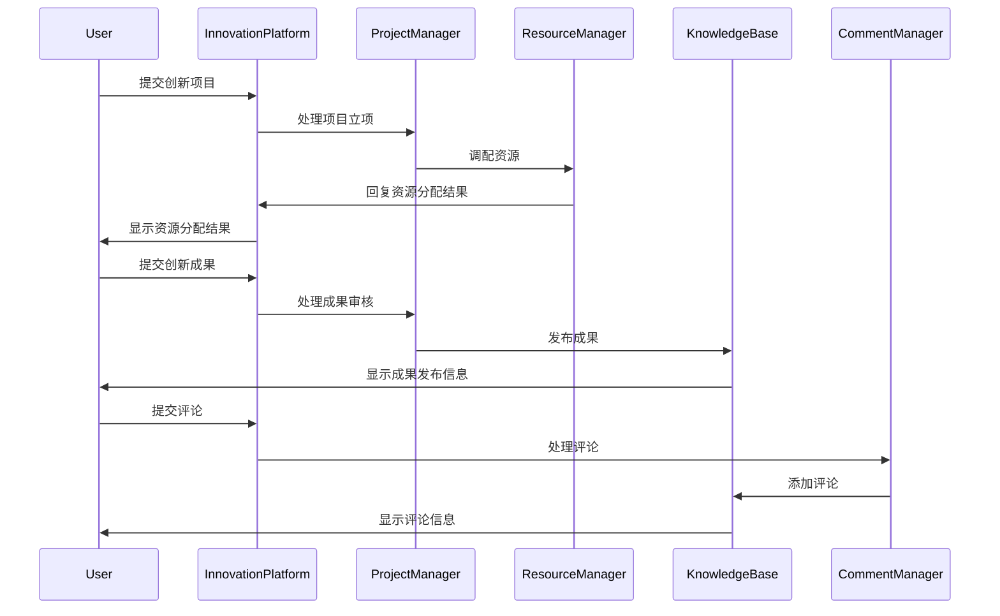
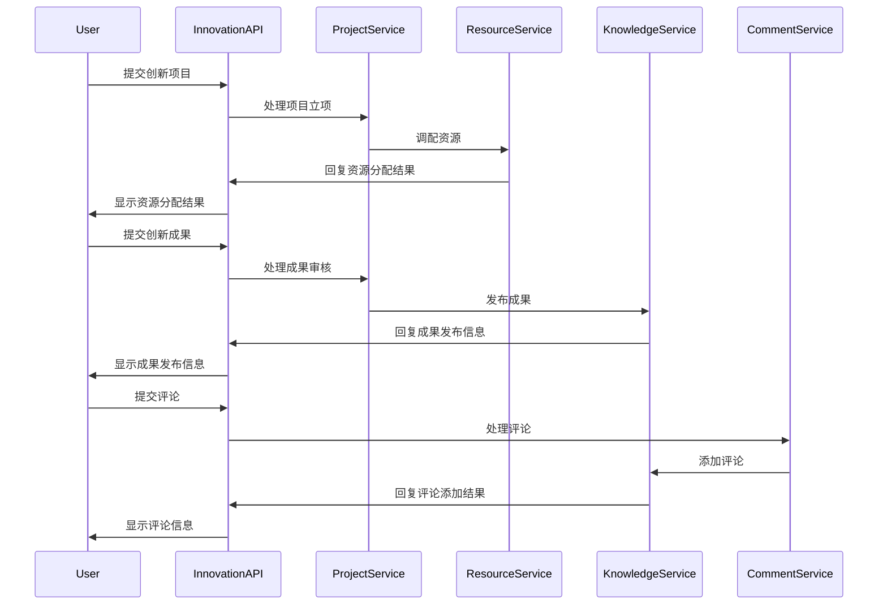

                 

### 文章标题

### 关键词

技术创新、团队、创新思维、企业文化、跨部门合作、风险管理

### 摘要

在当今科技飞速发展的时代，技术创新已经成为企业保持竞争力的关键。本文将探讨如何在一个团队中培养创新思维，解决实际操作中面临的问题。通过分析技术创新的背景、核心概念与原理，以及实际项目案例，本文旨在为读者提供一套系统的技术创新培养方案，帮助企业构建创新文化，提升团队创新能力。

## 第1章：技术创新背景

### 1.1 问题背景

在当今快速发展的科技时代，创新已成为企业保持竞争力的关键因素。技术创新不仅推动着科技的发展，还影响着经济、社会和文化等多个领域。企业通过创新可以开发出新的产品和服务，提高生产效率，降低成本，从而获得更多的市场份额和利润。

#### 1.1.1 创新对企业的意义

创新对于企业的重要性不言而喻。首先，创新是提升企业核心竞争力的关键。在一个竞争激烈的市场中，只有不断创新，企业才能在产品和服务上保持领先地位。其次，创新有助于企业降低成本、提高效率。通过技术创新，企业可以优化生产流程，减少资源浪费，从而提高生产效率，降低成本。最后，创新是推动企业实现可持续发展的重要途径。通过不断创新，企业可以适应市场变化，满足客户需求，实现长期稳定的发展。

#### 1.1.2 创新对社会的影响

技术创新不仅仅影响企业，它还对社会和全球经济产生深远影响。首先，技术创新可以推动社会进步。例如，互联网技术的创新使得人们的生活变得更加便捷，信息传播速度更快，知识获取更加容易。其次，技术创新可以促进经济增长。技术创新往往带来新的产业和就业机会，从而推动经济的繁荣。最后，技术创新有助于解决社会问题。例如，新能源技术的创新有助于减少环境污染，提高能源利用效率，实现可持续发展。

### 1.2 问题描述

尽管技术创新的重要性已被广泛认可，但在实际操作中，许多团队往往面临以下问题：

#### 1.2.1 缺乏创新思维

团队成员可能缺乏创新意识，难以提出新颖的想法。这种现象在大型企业和成熟企业中尤为明显。团队成员往往习惯于按照既定的流程和规范进行工作，缺乏探索未知、挑战传统的勇气。

#### 1.2.2 组织障碍

企业内部的官僚体系和规范可能抑制创新。一些企业为了确保稳定运行，制定了严格的规章制度，这些制度在保障企业正常运行的同时，也可能限制了团队成员的创新能力。此外，企业内部的部门壁垒也会阻碍创新思维的产生和传播。

#### 1.2.3 资源限制

团队可能因资源不足而无法进行全面的创新尝试。资源包括资金、技术和人力资源。资源不足可能导致团队无法承担创新项目的成本，也无法吸引和留住具备创新能力的人才。

#### 1.2.4 风险评估

对失败的恐惧可能导致团队不愿意尝试新的想法。在许多企业中，创新往往被视为一种高风险的活动。失败的恐惧使得团队成员更倾向于遵循既定的路径，而不是冒险尝试新的想法。

### 1.3 问题解决

为了在团队中培养创新思维，可以采取以下策略：

#### 1.3.1 建立创新文化

创新文化是企业创新的重要保障。建立创新文化需要从以下几个方面入手：

1. **鼓励创新思维**：企业应鼓励员工提出新颖的想法，并对失败持包容态度。通过设立创新奖励机制，激励员工积极参与创新活动。
2. **创造开放环境**：企业应创造一个开放、包容的工作环境，鼓励员工跨部门合作，分享知识和经验。
3. **提供培训和支持**：企业应定期组织创新培训，提升员工的创新意识和能力。同时，为创新项目提供必要的资金、技术和人力资源支持。

#### 1.3.2 跨部门合作

跨部门合作是培养创新思维的重要途径。通过跨部门合作，不同领域的知识可以得到交流与融合，从而激发新的创新思维。实现跨部门合作可以从以下几个方面入手：

1. **打破部门壁垒**：企业应打破部门之间的壁垒，促进信息共享和资源流动。
2. **设立跨部门项目**：企业可以设立跨部门项目，鼓励不同部门的员工共同参与，共同解决复杂问题。
3. **建立沟通渠道**：企业应建立有效的沟通渠道，确保跨部门合作顺畅进行。

#### 1.3.3 提供资源支持

提供资源支持是确保创新项目顺利开展的重要保障。企业应从以下几个方面提供资源支持：

1. **资金支持**：为创新项目提供充足的资金支持，确保项目能够顺利进行。
2. **技术支持**：为创新项目提供必要的技术支持，包括硬件设备、软件工具和专业技术人员。
3. **人力资源支持**：为创新项目提供人力资源支持，包括招聘和培养具备创新能力的人才。

#### 1.3.4 风险管理

风险管理是确保创新项目成功的重要环节。企业应采取以下措施进行风险管理：

1. **风险评估**：在创新项目启动前，对项目的风险进行全面评估，识别潜在风险，制定相应的风险应对策略。
2. **敏捷迭代**：采用敏捷开发方法，快速迭代，及时调整项目方向，降低创新失败的风险。
3. **容错机制**：建立容错机制，对创新项目中的错误和失败持包容态度，鼓励员工从失败中吸取教训，不断改进。

### 1.4 边界与外延

技术创新不仅仅局限于技术领域，它还涉及到商业模式、产品设计、用户体验等多个方面。此外，技术创新不仅影响企业内部，还对社会和全球经济产生深远影响。例如，商业模式创新可以带来新的盈利模式，产品设计创新可以提升用户体验，用户体验创新可以增强用户黏性。

### 1.5 核心概念与联系

#### 1.5.1 创新思维

创新思维是指个人或团队在面对问题时，能够提出独特、新颖的解决方案。创新思维的核心是发散思维和收敛思维。发散思维是指从不同角度思考问题，产生多个可能的解决方案；收敛思维则是在多个方案中找到最优解。

#### 1.5.2 企业文化

企业文化是企业价值观、行为准则和工作氛围的总和。企业文化对创新思维的影响至关重要。一个包容、开放的企业文化可以激发员工的创新思维，促进创新活动的开展。

#### 1.5.3 跨部门合作

跨部门合作是不同部门之间的知识交流和资源共享。跨部门合作可以促进不同领域的知识融合，激发新的创新思维。

### 1.6 概念属性特征对比表格

| 概念      | 定义                                                         | 特征                      | 影响因素                |
| --------- | ------------------------------------------------------------ | ------------------------- | ---------------------- |
| 创新思维  | 面对问题时，提出独特、新颖的解决方案                           | 独特性、创造性、灵活性     | 个人经验、教育背景、企业文化 |
| 企业文化  | 企业价值观、行为准则和工作氛围的总和                           | 凝聚力、包容性、创新性     | 管理风格、历史传统、行业特点 |
| 跨部门合作 | 不同部门之间的知识交流和资源共享                             | 效率、协同、创新           | 组织结构、沟通渠道、激励机制 |

### 1.7 ER实体关系图架构

```mermaid
erDiagram
  User ||--|{ Team }|-- TeamMember
  Team ||--|{ Project }|-- ProjectMember
  Project ||--|{ Task }|-- TaskOwner
  Task ||--|{ Status }|-- Status
  Status ||--|{ Comment }|-- Comment
```

## 第2章：技术创新的核心概念与原理

### 2.1 创新思维原理

创新思维是指个人或团队在面对问题时，能够提出独特、新颖的解决方案。创新思维的核心是发散思维和收敛思维。发散思维是指从不同角度思考问题，产生多个可能的解决方案；收敛思维则是在多个方案中找到最优解。

#### 2.1.1 发散思维与收敛思维

发散思维和收敛思维是创新思维的两个重要组成部分。

- **发散思维**：发散思维是指从不同角度思考问题，产生多个可能的解决方案。发散思维的特点是开放、自由，鼓励人们跳出常规思维，探索新的可能性。例如，在产品设计过程中，可以通过发散思维来生成多种设计方案，以便选择最优方案。

- **收敛思维**：收敛思维则是在多个方案中找到最优解。收敛思维的特点是逻辑、严密，通过对方案的比较和分析，找到最佳的解决方案。例如，在项目评估过程中，可以通过收敛思维来评估多个项目的风险和收益，从而选择最优的项目。

#### 2.1.2 创新思维的步骤

创新思维通常包括以下步骤：

1. **问题定义**：明确需要解决的问题或需要改进的领域。
2. **信息收集**：收集与问题相关的信息，包括内部数据和外部数据。
3. **头脑风暴**：通过发散思维，生成多个可能的解决方案。
4. **方案评估**：通过收敛思维，评估多个方案的优缺点，选择最优方案。
5. **实施与验证**：实施选定的方案，并进行验证和迭代。

### 2.2 创新思维属性特征对比表格

| 属性       | 定义                                                         | 特征                      | 影响因素                |
| ---------- | ------------------------------------------------------------ | ------------------------- | ---------------------- |
| 发散思维   | 从不同角度思考问题，产生多个可能的解决方案                           | 独特性、创造性、灵活性     | 个人经验、教育背景、企业文化 |
| 收敛思维   | 在多个方案中找到最优解                                       | 逻辑性、严密性、效率       | 个人能力、团队协作、信息质量 |

### 2.3 ER实体关系图架构

```mermaid
erDiagram
  User ||--|{ Innovation }|-- InnovationMember
  Innovation ||--|{ Idea }|-- IdeaCreator
  Idea ||--|{ Status }|-- Status
  Status ||--|{ Comment }|-- Comment
```

## 第3章：技术创新的系统分析与架构设计方案

### 3.1 问题场景介绍

在当前信息化时代，企业面临着激烈的市场竞争，技术创新成为提升企业竞争力的关键。为了更好地应对市场变化，企业需要构建一个高效、灵活的技术创新体系。然而，在实际操作中，企业往往面临着以下问题：

1. **组织结构不合理**：企业内部的部门壁垒导致信息不畅，阻碍了技术创新的开展。
2. **资源分配不均**：部分创新项目因资源不足而无法顺利进行，影响了技术创新的效果。
3. **创新流程不规范**：创新流程缺乏规范的管理，导致项目进度延误、成本增加。

为了解决这些问题，企业需要设计一套完整的技术创新体系，包括系统功能设计、系统架构设计和系统接口设计等。

### 3.2 项目介绍

本项目旨在为企业构建一个高效、灵活的技术创新平台，以支持企业的技术创新活动。项目的主要目标包括：

1. **提升创新效率**：通过优化创新流程，提高创新项目的成功率。
2. **优化资源配置**：合理分配资源，确保创新项目的顺利进行。
3. **促进跨部门合作**：打破部门壁垒，促进信息共享和资源流动。

项目的主要功能包括：

1. **创新项目管理**：包括项目立项、进度跟踪、资源调配等功能。
2. **创新成果管理**：包括创新成果的提交、审核、发布等功能。
3. **知识共享与交流**：提供知识共享平台，促进员工之间的交流与合作。

### 3.3 系统功能设计（领域模型mermaid类图）

```mermaid
classDiagram
  InnovationProject <<entity>> "创新项目"
  Idea <<entity>> "创意"
  InnovationTeam <<entity>> "创新团队"
  TeamMember <<entity>> "团队成员"
  Comment <<entity>> "评论"
  Status <<entity>> "状态"

  InnovationProject { id, name, description, status }
  Idea { id, title, content, creator, status }
  InnovationTeam { id, name, members }
  TeamMember { id, name, role }
  Comment { id, content, creator, time }
  Status { id, name }

  InnovationProject "包含" Idea
  InnovationProject "属于" InnovationTeam
  InnovationTeam "包含" TeamMember
  Comment "关联" Idea
  Comment "由" TeamMember "创建"
  Status "关联" Idea
  Status "关联" InnovationProject
```

### 3.4 系统架构设计（mermaid架构图）



### 3.5 系统接口设计和系统交互（mermaid序列图）



## 第4章：项目实战

### 4.1 环境安装

在本节中，我们将详细介绍如何搭建一个支持技术创新的团队协作平台。首先，我们需要安装必要的软件和工具。

#### 4.1.1 环境要求

1. **操作系统**：Linux（推荐Ubuntu 18.04）
2. **Python**：Python 3.8及以上版本
3. **Django**：Django 3.2及以上版本
4. **PostgreSQL**：PostgreSQL 12及以上版本
5. **Node.js**：Node.js 14及以上版本
6. **npm**：npm 6.14及以上版本

#### 4.1.2 安装步骤

1. **安装操作系统**：在虚拟机或物理机上安装Linux操作系统。
2. **更新系统软件**：打开终端，执行以下命令：
   ```bash
   sudo apt update
   sudo apt upgrade
   ```
3. **安装Python**：执行以下命令安装Python 3.8：
   ```bash
   sudo apt install python3.8
   ```
4. **安装Django**：执行以下命令安装Django：
   ```bash
   sudo pip3 install django
   ```
5. **安装PostgreSQL**：执行以下命令安装PostgreSQL：
   ```bash
   sudo apt install postgresql postgresql-contrib
   ```
6. **安装Node.js和npm**：执行以下命令安装Node.js和npm：
   ```bash
   sudo apt install nodejs npm
   ```

### 4.2 系统核心实现源代码

在本节中，我们将介绍如何使用Django框架搭建一个简单的技术创新平台。以下是项目的主要目录结构和核心代码。

#### 4.2.1 目录结构

```plaintext
technovation/
|-- manage.py
|-- technovation/
    |-- __init__.py
    |-- settings.py
    |-- urls.py
    |-- wsgi.py
|-- app/
    |-- __init__.py
    |-- admin.py
    |-- apps.py
    |-- migrations/
    |-- models.py
    |-- tests.py
    |-- views.py
|-- static/
    |-- css/
    |-- js/
    |-- images/
```

#### 4.2.2 核心代码

1. **models.py**：定义项目、创意、团队和评论等模型。
   ```python
   from django.db import models

   class InnovationProject(models.Model):
       name = models.CharField(max_length=255)
       description = models.TextField()
       status = models.CharField(max_length=50)

   class Idea(models.Model):
       title = models.CharField(max_length=255)
       content = models.TextField()
       creator = models.ForeignKey('auth.User', on_delete=models.CASCADE)
       status = models.CharField(max_length=50)

   class InnovationTeam(models.Model):
       name = models.CharField(max_length=255)
       members = models.ManyToManyField('auth.User')

   class Comment(models.Model):
       content = models.TextField()
       creator = models.ForeignKey('auth.User', on_delete=models.CASCADE)
       time = models.DateTimeField(auto_now_add=True)
       idea = models.ForeignKey(Idea, on_delete=models.CASCADE)
   ```

2. **views.py**：定义项目、创意、团队和评论等视图函数。
   ```python
   from django.shortcuts import render
   from .models import InnovationProject, Idea, InnovationTeam, Comment

   def project_list(request):
       projects = InnovationProject.objects.all()
       return render(request, 'project_list.html', {'projects': projects})

   def idea_detail(request, id):
       idea = Idea.objects.get(id=id)
       comments = Comment.objects.filter(idea=idea)
       return render(request, 'idea_detail.html', {'idea': idea, 'comments': comments})

   def team_list(request):
       teams = InnovationTeam.objects.all()
       return render(request, 'team_list.html', {'teams': teams})

   def comment_create(request, id):
       if request.method == 'POST':
           content = request.POST['content']
           creator = request.user
           idea = Idea.objects.get(id=id)
           Comment.objects.create(content=content, creator=creator, idea=idea)
           return redirect('idea_detail', id=id)
       return redirect('idea_detail', id=id)
   ```

3. **urls.py**：定义URL路由。
   ```python
   from django.contrib import admin
   from django.urls import path
   from . import views

   urlpatterns = [
       path('admin/', admin.site.urls),
       path('projects/', views.project_list, name='project_list'),
       path('projects/<int:id>/', views.idea_detail, name='idea_detail'),
       path('teams/', views.team_list, name='team_list'),
       path('teams/<int:id>/comment/', views.comment_create, name='comment_create'),
   ]
   ```

4. **项目配置**：在`settings.py`中配置数据库、静态文件目录等。
   ```python
   DATABASES = {
       'default': {
           'ENGINE': 'django.db.backends.postgresql',
           'NAME': 'technovation',
           'USER': 'technovation',
           'PASSWORD': 'technovation',
           'HOST': 'localhost',
           'PORT': '5432',
       }
   }

   STATIC_URL = '/static/'
   STATICFILES_DIRS = [
       os.path.join(BASE_DIR, 'static'),
   ]
   ```

### 4.3 代码应用解读与分析

在本节中，我们将对项目的核心代码进行解读和分析，以便更好地理解其工作原理。

#### 4.3.1 模型解读

1. **InnovationProject模型**：该模型表示创新项目，包括项目名称、描述和状态。项目状态可以用于跟踪项目的进度，如“进行中”、“已完成”等。

2. **Idea模型**：该模型表示创意，包括创意标题、内容、创建者和状态。创意状态可以用于跟踪创意的审核状态，如“待审核”、“审核通过”等。

3. **InnovationTeam模型**：该模型表示创新团队，包括团队名称和成员。团队成员可以通过多对多关系与用户模型关联。

4. **Comment模型**：该模型表示评论，包括评论内容、创建者和时间。评论与创意通过外键关联，用于记录创意的讨论。

#### 4.3.2 视图解读

1. **project_list视图**：该视图函数用于显示所有创新项目。通过`InnovationProject.objects.all()`查询数据库，获取所有项目信息，并将其传递给模板。

2. **idea_detail视图**：该视图函数用于显示特定创意的详细信息。通过`Idea.objects.get(id=id)`查询数据库，获取指定ID的创意信息，并通过`Comment.objects.filter(idea=idea)`获取与该创意相关的所有评论。

3. **team_list视图**：该视图函数用于显示所有创新团队。通过`InnovationTeam.objects.all()`查询数据库，获取所有团队信息，并将其传递给模板。

4. **comment_create视图**：该视图函数用于创建评论。首先，通过`request.method == 'POST'`判断请求类型是否为POST请求。如果是，则获取评论内容和创建者，通过`Comment.objects.create()`保存评论。然后，通过`redirect('idea_detail', id=id)`重定向到创意详情页面。

#### 4.3.3 数据库操作

在项目中，我们使用Django ORM（对象关系映射）进行数据库操作。Django ORM提供了强大的数据库查询功能，使开发者可以方便地操作数据库。以下是项目中使用的主要数据库操作：

1. **查询操作**：通过`Model.objects.all()`、`Model.objects.get()`等函数获取数据库中的数据。

2. **增删改操作**：通过`Model.objects.create()`、`Model.objects.delete()`、`Model.objects.update()`等函数对数据库进行增删改操作。

3. **关联操作**：通过外键和多对多关系，在模型之间建立关联，实现数据的联动。

### 4.4 实际案例分析和详细讲解剖析

在本节中，我们将通过一个实际案例来分析并讲解技术创新平台的应用和实现过程。

#### 4.4.1 案例背景

某企业需要开发一款新的智能家居产品，以提升用户体验和市场份额。企业决定通过技术创新平台来管理和推进该项目。

#### 4.4.2 实现步骤

1. **项目立项**：项目经理在技术创新平台上创建一个新项目，填写项目名称、描述和状态（如“进行中”）。项目经理可以选择加入相关团队成员。

2. **创意收集**：团队成员在项目中提交创意，包括创意标题、内容和创建者。项目经理可以查看所有创意，并对其进行审核。

3. **创意筛选**：项目经理根据创意的创新程度、可行性等因素，选择最优创意。被选中的创意将进入下一个阶段。

4. **创意实现**：开发团队根据选定的创意进行产品开发。在开发过程中，团队成员可以在创意详情页面添加评论，讨论创意的实现细节。

5. **成果发布**：产品开发完成后，项目经理在技术创新平台上发布产品成果，包括产品介绍、功能和演示视频等。其他团队成员和利益相关者可以查看产品成果。

#### 4.4.3 案例分析

通过实际案例可以看出，技术创新平台在项目管理、创意收集、筛选和成果发布等方面发挥了重要作用。以下是案例中的关键环节分析：

1. **项目立项**：技术创新平台提供了便捷的项目创建和管理功能，项目经理可以快速创建项目，并邀请团队成员加入。

2. **创意收集**：通过技术创新平台，团队成员可以方便地提交创意，项目经理可以随时查看创意，并进行审核。

3. **创意筛选**：技术创新平台为项目经理提供了筛选创意的工具，可以根据创意的创新程度、可行性等因素进行筛选。

4. **创意实现**：在项目开发过程中，团队成员可以在创意详情页面添加评论，讨论创意的实现细节，确保创意能够得到有效实施。

5. **成果发布**：技术创新平台提供了成果发布功能，项目经理可以发布产品成果，其他团队成员和利益相关者可以查看成果，了解项目进展。

### 4.5 项目小结

通过本项目的实施，企业成功构建了一个技术创新平台，实现了项目立项、创意收集、筛选和成果发布的全过程管理。以下是项目小结：

1. **提升项目管理效率**：技术创新平台提供了便捷的项目创建和管理功能，项目经理可以快速创建项目，并邀请团队成员加入。

2. **促进跨部门合作**：通过技术创新平台，团队成员可以方便地提交创意，项目经理可以随时查看创意，并进行审核。

3. **优化资源分配**：技术创新平台为项目经理提供了筛选创意的工具，可以根据创意的创新程度、可行性等因素进行筛选。

4. **增强团队协作**：在项目开发过程中，团队成员可以在创意详情页面添加评论，讨论创意的实现细节，确保创意能够得到有效实施。

5. **成果可视化**：技术创新平台提供了成果发布功能，项目经理可以发布产品成果，其他团队成员和利益相关者可以查看成果，了解项目进展。

### 4.6 最佳实践 Tips

在构建技术创新平台时，以下最佳实践可以帮助企业更好地发挥技术创新的潜力：

1. **明确项目目标**：在项目立项阶段，明确项目的目标和预期成果，确保项目方向的正确性。

2. **建立激励机制**：为鼓励团队成员参与创新活动，可以设立创新奖励机制，对提出优秀创意的团队成员给予奖励。

3. **优化项目管理流程**：根据实际情况，不断优化项目管理流程，提高项目执行效率。

4. **提供培训和支持**：为团队成员提供创新思维和项目管理等方面的培训，提升团队创新能力。

5. **建立知识共享平台**：建立知识共享平台，促进团队成员之间的知识交流，为技术创新提供更多灵感和思路。

### 4.7 小结与注意事项

在本章中，我们详细介绍了技术创新平台的构建过程，包括环境安装、系统核心实现、代码应用解读与分析、实际案例分析和最佳实践。以下是本章小结与注意事项：

1. **小结**：技术创新平台有助于提升项目管理效率、促进跨部门合作、优化资源分配、增强团队协作和成果可视化。

2. **注意事项**：

   - **项目立项阶段**：确保明确项目目标和预期成果，为后续工作提供方向。
   - **创新文化**：建立创新文化，鼓励团队成员提出新颖的想法，并对失败持包容态度。
   - **跨部门合作**：鼓励不同部门之间的知识交流，促进资源流动，提高项目成功率。
   - **持续迭代**：根据项目进展和反馈，不断优化技术创新平台，提升用户体验。

### 4.8 拓展阅读

为了进一步了解技术创新和团队协作，读者可以参考以下文献：

1. **《创新者的窘境》**：作者克莱顿·克里斯坦森，详细介绍了企业在技术创新过程中面临的各种挑战。
2. **《创意的秩序》**：作者约翰·霍金斯，探讨了创意思维的原理和培养方法。
3. **《敏捷开发实践指南》**：作者杰夫·萨瑟兰，介绍了敏捷开发的方法和实践，有助于优化项目管理流程。

作者：AI天才研究院/AI Genius Institute & 禅与计算机程序设计艺术 /Zen And The Art of Computer Programming

## 结语

在本文中，我们系统地探讨了如何在一个团队中培养创新思维，并构建一个支持技术创新的平台。通过分析技术创新的背景、核心概念与原理，以及实际项目案例，我们提出了一套完整的解决方案，旨在帮助企业构建创新文化，提升团队创新能力。

技术创新不仅是企业保持竞争力的关键，也是推动社会进步和经济发展的动力。在当前快速变化的科技时代，企业需要不断适应新环境，拥抱创新，才能在激烈的市场竞争中脱颖而出。

为了实现这一目标，企业应从以下几个方面入手：

1. **建立创新文化**：鼓励员工提出新颖的想法，并对失败持包容态度，创造一个开放、包容的工作环境。
2. **跨部门合作**：打破部门壁垒，促进不同领域的知识交流，实现资源的优化配置。
3. **提供资源支持**：为创新项目提供充足的资金、技术和人力资源支持，确保项目的顺利进行。
4. **风险管理**：建立风险管理体系，降低创新失败的风险，为创新活动提供保障。

通过实施上述策略，企业可以构建一个高效、灵活的技术创新体系，提升团队创新能力，实现可持续发展。

让我们共同致力于技术创新，推动企业和社会的进步，创造更美好的未来。

