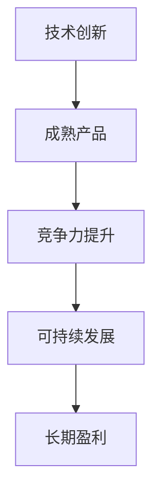

                 

### 目录

# 技术创新：在成熟产品中持续创新

> 关键词：技术创新、成熟产品、持续创新、原理、方法、实践、未来、可持续发展

> 摘要：本文旨在探讨如何在成熟产品中实现持续创新，从而提升产品的竞争力。文章首先介绍了技术创新的定义及其在成熟产品中的应用，然后详细讲解了技术创新的原理与模型，接着分析了技术创新的方法与实践，并展望了技术创新的未来趋势。最后，本文探讨了技术创新与可持续发展的关系，提供了相关建议。

## 第一部分：背景与概述

### 1.1. 问题背景

在当今快速变化的市场环境中，成熟产品往往面临诸多挑战，如市场需求变化、技术更新换代、竞争对手的激烈竞争等。为了保持市场竞争力，企业需要不断地进行技术创新，以优化产品性能、提升用户体验、满足新兴需求。

### 1.2. 核心概念

**技术创新**：指通过引入新技术、新方法、新流程等，对现有产品或服务进行改进或升级，以实现产品性能的提升、成本的降低或用户体验的改善。

### 1.3. 技术创新与成熟产品的关系

技术创新在成熟产品中的应用具有重要意义。一方面，它可以提升产品的竞争力，帮助企业抓住市场机会；另一方面，它可以推动企业的可持续发展，实现长期盈利。

### 1.4. 概念属性特征对比表格

| 特征                 | 技术创新                 | 传统产品改进                 |
|----------------------|--------------------------|------------------------------|
| 目标                 | 提升产品竞争力、实现可持续发展 | 提升产品性能、降低成本、满足用户需求 |
| 方法                 | 引入新技术、新方法、新流程 | 优化现有技术、改进工艺、提高效率 |
| 影响范围             | 全局性、深远性           | 局部性、短期内效           |
| 时间周期             | 较长、持续              | 较短、一次性               |
| 成本                 | 较高、投资大             | 较低、成本低               |

### 1.5. ER实体关系图架构

### 1.6. 本章小结

本部分对技术创新及其在成熟产品中的应用进行了概述，明确了技术创新的核心概念和属性特征，为后续章节的深入讨论奠定了基础。

---

## 第二部分：技术创新原理与模型

### 2.1. 技术创新原理

技术创新的基本原理包括以下几个方面：

1. **创新链原理**：技术创新是一个从技术发明到市场应用的闭环过程，包括技术构思、研发、生产、推广等环节。
2. **需求驱动原理**：技术创新源于市场需求，以满足用户需求为出发点，推动技术的进步。
3. **资源整合原理**：技术创新需要整合企业内外部资源，包括资金、人才、技术等，以实现创新目标。

### 2.2. 技术创新模型

常见的创新模型包括：

1. **线性模型**：按照一定的顺序进行技术构思、研发、生产和推广。
2. **非线性模型**：强调创新过程中的迭代、反馈和调整。

### 2.3. 技术创新流程

技术创新的基本流程包括：

1. **需求分析**：了解市场需求和用户痛点。
2. **技术选型**：选择合适的技术方案。
3. **研发实施**：进行技术研发和产品开发。
4. **推广应用**：将创新产品推向市场。

### 2.4. 技术创新与数学模型

技术创新过程中，常用的数学模型包括：

1. **线性规划**：用于优化资源配置。
2. **非线性规划**：用于解决复杂优化问题。

### 2.5. 本章小结

本部分详细阐述了技术创新的原理与模型，为理解技术创新提供了理论依据。

---

## 第三部分：技术创新方法与实践

### 3.1. 技术创新方法

常见的创新方法包括：

1. **头脑风暴**：通过集体讨论激发创意。
2. **TRIZ**：基于问题解决原理的创新方法。

### 3.2. 技术创新实践案例

**案例1：某科技公司通过技术创新实现产品升级**

- **背景**：市场竞争激烈，用户需求不断变化。
- **方法**：采用TRIZ方法进行问题分析，引入新技术进行产品升级。
- **结果**：产品性能显著提升，市场竞争力增强。

### 3.3. 项目实战

**项目背景**：某电商平台进行技术创新，提升用户购物体验。

- **系统功能设计**：改进推荐算法，优化购物流程。
- **系统架构设计**：采用微服务架构，提高系统可扩展性。
- **系统接口设计**：设计高效的API接口，提升系统性能。

### 3.4. 技术创新最佳实践

**最佳实践**：

1. **需求驱动**：以用户需求为导向，进行技术创新。
2. **资源整合**：整合企业内外部资源，推动技术创新。

### 3.5. 本章小结

本部分通过案例分析和技术创新实践，总结了技术创新的方法和实践经验。

---

## 第四部分：技术创新的未来与趋势

### 4.1. 技术创新的未来趋势

未来技术创新将呈现以下趋势：

1. **数字化、智能化**：技术创新将更加依赖于数字化和智能化技术。
2. **跨界融合**：不同领域的技术将相互融合，推动技术创新。

### 4.2. 技术创新的挑战与机遇

**挑战**：

1. **技术风险**：技术创新过程中可能面临技术失败的风险。
2. **市场风险**：创新产品可能面临市场接受度不高的风险。

**机遇**：

1. **技术突破**：随着技术的不断进步，创新产品的性能将得到提升。
2. **市场拓展**：新兴市场的需求为技术创新提供了广阔空间。

### 4.3. 技术创新政策与法规

政府应加强对技术创新的支持，制定相关政策法规，为技术创新提供良好的环境。

### 4.4. 技术创新的国际对比

国际对比显示，不同国家在技术创新方面存在差异，但共性在于对技术创新的重视和支持。

### 4.5. 本章小结

本部分分析了技术创新的未来趋势和挑战机遇，以及政策法规和国际对比。

---

## 第五部分：技术创新与可持续发展

### 5.1. 技术创新与可持续发展

技术创新在可持续发展中具有重要作用，主要体现在：

1. **资源节约**：通过技术创新，提高资源利用效率，降低资源消耗。
2. **环境保护**：通过技术创新，减少污染物排放，保护生态环境。

### 5.2. 可持续技术创新实践

**案例1：某企业通过技术创新实现绿色发展**

- **背景**：面临环保压力，寻求绿色发展路径。
- **方法**：采用清洁能源、节能减排等技术，实现绿色发展。
- **结果**：显著降低碳排放，提高资源利用效率。

### 5.3. 技术创新风险评估

技术创新过程中，应进行风险评估，以识别和应对潜在风险。

### 5.4. 技术创新社会责任

技术创新应承担社会责任，关注技术创新对环境、社会和经济的影响。

### 5.5. 本章小结

本部分探讨了技术创新与可持续发展的关系，提供了可持续技术创新的实践案例。

---

## 第六部分：案例分析

### 6.1. 案例研究方法

**方法1：文献分析法**：通过查阅相关文献，了解技术创新的理论和实践。

**方法2：实证分析法**：通过实际案例，分析技术创新的过程和效果。

**方法3：对比分析法**：对比不同案例，探讨技术创新的共性和差异。

### 6.2. 案例分析

**案例1：某科技公司技术创新实践**

- **背景**：市场竞争激烈，寻求技术创新提升竞争力。
- **过程**：通过需求分析、技术选型、研发实施等环节，进行技术创新。
- **效果**：产品性能显著提升，市场竞争力增强。

### 6.3. 案例总结

通过案例分析，总结了技术创新的方法和实践经验，为其他企业提供了借鉴。

### 6.4. 案例启示

案例启示包括：

1. **需求驱动**：以用户需求为导向，进行技术创新。
2. **资源整合**：整合企业内外部资源，推动技术创新。

### 6.5. 本章小结

本部分通过案例分析，探讨了技术创新的方法和实践，为技术创新提供了有益的启示。

---

## 总结

本文从多个角度探讨了技术创新在成熟产品中的应用，包括技术创新的原理、方法、实践、未来趋势以及与可持续发展之间的关系。通过案例分析和实证研究，本文总结了技术创新的经验和启示，为企业在成熟产品中实现持续创新提供了指导。未来，随着技术的不断进步和市场环境的变化，技术创新将继续发挥重要作用，为企业带来持续的竞争优势。

### 作者

**作者：AI天才研究院/AI Genius Institute & 禅与计算机程序设计艺术 /Zen And The Art of Computer Programming**

