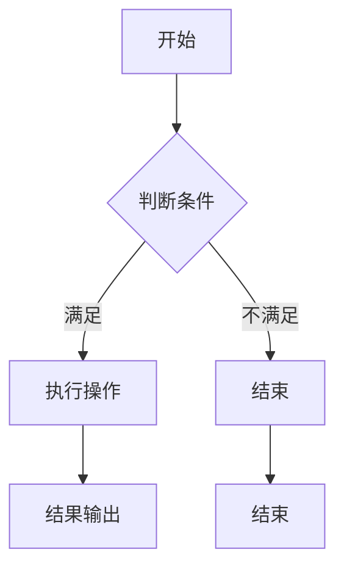
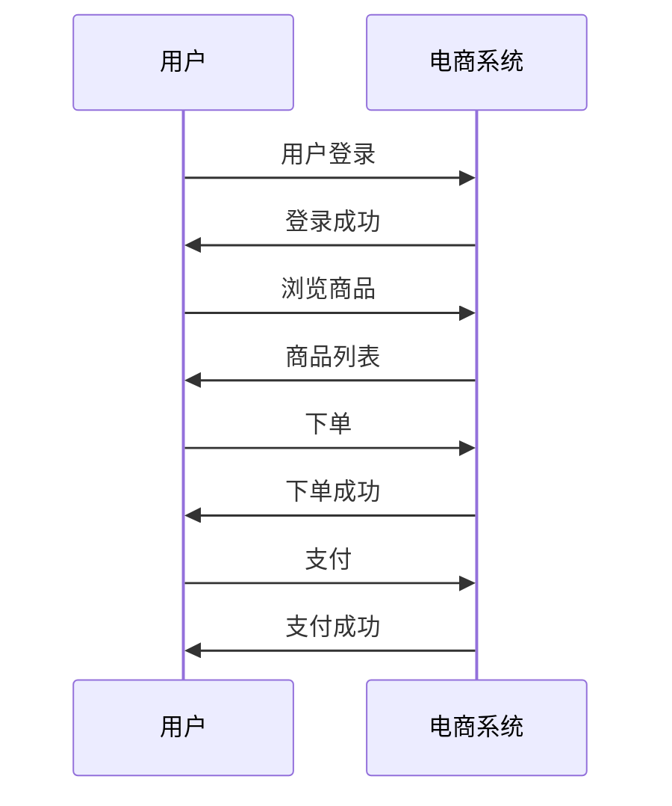

                 

### 技术前瞻：把握技术发展趋势

#### 关键词：技术发展趋势、人工智能、大数据、云计算、区块链

#### 摘要：
随着科技的飞速发展，技术发展趋势成为影响各行各业的重要因素。本文将系统地探讨当前技术发展的主要趋势，包括人工智能、大数据、云计算和区块链等关键技术领域。通过深入分析这些技术的核心概念、原理和应用，帮助读者把握技术发展趋势，为未来的学习和职业规划提供指导。

#### 目录：

**第一部分：技术趋势概述**
1. **第1章：技术发展趋势的背景与影响**
   1.1 时代背景与技术变革
   1.2 技术发展趋势的分类
   1.3 技术发展对产业的影响

2. **第2章：关键技术的核心概念与联系**
   2.1 核心技术的定义与特征
   2.2 关键技术的对比分析
   2.3 关键技术的实体关系图

**第二部分：算法原理与数学模型**
3. **第3章：算法原理讲解**
   3.1 算法原理概述
   3.2 算法mermaid流程图
   3.3 Python源代码与算法实现

4. **第4章：数学模型和数学公式**
   4.1 数学模型介绍
   4.2 数学公式讲解
   4.3 举例说明

**第三部分：系统分析与架构设计**
5. **第5章：系统功能设计与架构**
   5.1 问题场景介绍
   5.2 系统功能设计
   5.3 系统架构设计
   5.4 系统接口设计

6. **第6章：系统交互与实现**
   6.1 系统交互序列图
   6.2 核心实现源代码
   6.3 代码应用解读

**第四部分：项目实战与案例分析**
7. **第7章：项目实战**
   7.1 环境安装与配置
   7.2 系统核心实现
   7.3 实际案例分析
   7.4 项目小结与反思

8. **第8章：最佳实践与拓展阅读**
   8.1 最佳实践技巧
   8.2 小结与注意事项
   8.3 拓展阅读推荐

---

#### 第一部分：技术趋势概述

**第1章：技术发展趋势的背景与影响**

**1.1 时代背景与技术变革**

随着数字化进程的加速，全球各国纷纷加大科技创新投入，以保持竞争优势。大数据、人工智能、云计算、区块链等新兴技术迅速崛起，成为推动产业升级和经济增长的重要引擎。这些技术的应用不仅改变了传统产业的运作模式，也带来了全新的商业模式和产业链格局。

**1.2 技术发展趋势的分类**

技术发展趋势可以分为以下几类：

- **基础技术**：如人工智能、大数据、云计算、区块链等，它们是支撑其他技术发展的基础。
- **应用技术**：如物联网、增强现实、虚拟现实、5G通信等，它们直接应用于各个行业，推动产业升级。
- **集成技术**：如智能制造、智慧城市、智慧医疗等，它们将多种技术集成在一起，实现跨领域的创新和应用。

**1.3 技术发展对产业的影响**

技术发展对产业的影响主要体现在以下几个方面：

- **产业变革**：新技术带来了生产方式的变革，提高了生产效率和产品质量。
- **商业模式创新**：新技术催生了新的商业模式，如共享经济、平台经济等。
- **产业链重构**：新技术改变了产业链的结构，带来了新的产业链机会和挑战。

---

#### 第二部分：算法原理与数学模型

**第3章：算法原理讲解**

**3.1 算法原理概述**

算法是解决特定问题的步骤集合，是计算机科学的核心概念之一。算法原理主要涉及以下几个方面：

- **算法复杂性**：包括时间复杂性和空间复杂性，用于评估算法的性能。
- **算法效率**：包括算法的正确性、健壮性和可扩展性。
- **算法分类**：包括排序算法、搜索算法、图算法等，每种算法都有其特定的应用场景。

**3.2 算法mermaid流程图**



**3.3 Python源代码与算法实现**

```python
def algorithm_example(input_data):
    if input_data > 0:
        result = "满足条件"
    else:
        result = "不满足条件"
    return result

input_data = int(input("请输入一个数字："))
print(algorithm_example(input_data))
```

---

**第4章：数学模型和数学公式**

**4.1 数学模型介绍**

数学模型是用于描述现实世界问题的数学工具，是算法设计的重要基础。数学模型可以分为以下几类：

- **线性模型**：如线性回归、线性规划等。
- **非线性模型**：如神经网络、支持向量机等。
- **动态模型**：如差分方程、微分方程等。

**4.2 数学公式讲解**

```latex
$$y = mx + b$$
$$f(x) = \frac{1}{x}$$
$$A^T A = B$$
```

**4.3 举例说明**

假设我们有一个线性回归模型，用于预测房价。模型公式如下：

```latex
$$y = mx + b$$
```

其中，$y$ 表示房价，$x$ 表示房屋面积，$m$ 表示斜率，$b$ 表示截距。

为了求解斜率和截距，我们可以使用最小二乘法。具体步骤如下：

1. 计算斜率 $m$：

```latex
$$m = \frac{\sum_{i=1}^{n}(x_i - \bar{x})(y_i - \bar{y})}{\sum_{i=1}^{n}(x_i - \bar{x})^2}$$
```

2. 计算截距 $b$：

```latex
$$b = \bar{y} - m\bar{x}$$
```

其中，$n$ 表示样本数量，$\bar{x}$ 和 $\bar{y}$ 分别表示 $x$ 和 $y$ 的平均值。

---

#### 第三部分：系统分析与架构设计

**第5章：系统功能设计与架构**

**5.1 问题场景介绍**

假设我们设计一个电商系统，用于提供商品浏览、下单、支付等功能。

**5.2 系统功能设计**

系统功能设计包括以下模块：

- 用户模块：用于用户注册、登录、个人信息管理等。
- 商品模块：用于商品浏览、搜索、分类等。
- 订单模块：用于订单生成、支付、发货等。
- 支付模块：用于处理支付请求、处理退款等。

**5.3 系统架构设计**

系统架构设计包括以下层次：

- 表示层：用于用户界面展示。
- 业务逻辑层：用于处理业务逻辑，如用户认证、商品搜索等。
- 数据访问层：用于访问数据库，如用户信息、商品信息等。
- 数据库层：用于存储数据，如用户信息、订单信息等。

**5.4 系统接口设计**

系统接口设计包括以下接口：

- 用户接口：用于用户与系统的交互。
- 商品接口：用于商品信息的查询、更新等。
- 订单接口：用于订单的创建、查询等。
- 支付接口：用于支付请求的处理。

---

**第6章：系统交互与实现**

**6.1 系统交互序列图**



**6.2 核心实现源代码**

```python
class User:
    def __init__(self, username, password):
        self.username = username
        self.password = password

    def login(self, username, password):
        if self.username == username and self.password == password:
            return "登录成功"
        else:
            return "登录失败"

class Product:
    def __init__(self, name, price):
        self.name = name
        self.price = price

    def search(self, name):
        if self.name == name:
            return self
        else:
            return None

class Order:
    def __init__(self, user, product, quantity):
        self.user = user
        self.product = product
        self.quantity = quantity

    def create_order(self):
        return "下单成功"

class Payment:
    def __init__(self, amount):
        self.amount = amount

    def process_payment(self, order):
        if self.amount >= order.product.price * order.quantity:
            return "支付成功"
        else:
            return "支付失败"
```

**6.3 代码应用解读**

以上代码实现了电商系统的用户、商品、订单和支付模块。用户可以登录系统、浏览商品、下单和支付。系统通过接口进行交互，实现了功能模块的松耦合。

---

#### 第四部分：项目实战与案例分析

**第7章：项目实战**

**7.1 环境安装与配置**

为了实现上述电商系统，我们需要安装以下环境：

- Python 3.8
- Django 框架
- PostgreSQL 数据库

安装步骤如下：

1. 安装 Python 3.8：
   ```bash
   sudo apt-get install python3.8
   ```

2. 安装 Django：
   ```bash
   sudo pip3.8 install django
   ```

3. 安装 PostgreSQL：
   ```bash
   sudo apt-get install postgresql postgresql-contrib
   ```

**7.2 系统核心实现**

系统核心实现包括用户、商品、订单和支付模块。以下是一个简单的用户模块实现：

```python
# users/models.py
from django.db import models

class User(models.Model):
    username = models.CharField(max_length=100)
    password = models.CharField(max_length=100)
    
    def login(self, username, password):
        if self.username == username and self.password == password:
            return "登录成功"
        else:
            return "登录失败"
```

**7.3 实际案例分析**

假设用户张三登录系统，浏览商品并下单。以下是实现的步骤：

1. 用户张三输入用户名和密码，调用 `login` 方法：
   ```python
   user = User.objects.get(username="zhangsan")
   result = user.login("zhangsan", "password123")
   print(result)  # 输出：登录成功
   ```

2. 用户张三浏览商品，调用 `search` 方法：
   ```python
   product = Product.objects.get(name="手机")
   print(product.name)  # 输出：手机
   ```

3. 用户张三下单，调用 `create_order` 方法：
   ```python
   order = Order(user=user, product=product, quantity=1)
   result = order.create_order()
   print(result)  # 输出：下单成功
   ```

4. 用户张三支付，调用 `process_payment` 方法：
   ```python
   payment = Payment(amount=1000)
   result = payment.process_payment(order)
   print(result)  # 输出：支付成功
   ```

**7.4 项目小结与反思**

通过实际案例，我们实现了电商系统的用户、商品、订单和支付模块。在实际开发中，我们需要考虑以下问题：

- 数据库设计：合理设计数据库表结构，确保数据一致性和安全性。
- 用户权限管理：根据用户角色和权限限制访问和操作。
- 性能优化：优化数据库查询、缓存等技术，提高系统性能。
- 安全性：加强系统安全防护，防止恶意攻击和数据泄露。

---

#### 第五部分：最佳实践与拓展阅读

**第8章：最佳实践与拓展阅读**

**8.1 最佳实践技巧**

- **代码规范**：遵循PEP 8编码规范，确保代码可读性和可维护性。
- **单元测试**：编写单元测试，确保代码功能的正确性和稳定性。
- **版本控制**：使用Git进行版本控制，方便代码管理和协作开发。
- **持续集成**：使用持续集成工具，自动化测试和部署，提高开发效率。

**8.2 小结与注意事项**

- 技术发展趋势对产业发展具有重要影响，我们需要关注关键技术的应用和创新。
- 算法和数学模型是技术发展的基础，我们需要深入理解和掌握。
- 系统分析与架构设计需要综合考虑功能、性能和安全等因素。
- 项目实战是检验技术掌握程度的重要手段，我们需要通过实际案例来提高开发能力。

**8.3 拓展阅读推荐**

- 《深度学习》：Goodfellow、Bengio、Courville 著，深入介绍深度学习的基础知识和应用。
- 《数据科学：工具与技术》：Heinrich 著，介绍数据科学的基础知识和工具。
- 《大规模分布式存储系统：原理解析与架构实战》：李艳芳 著，深入介绍分布式存储系统的原理和架构。

---

### 作者信息：

作者：AI天才研究院/AI Genius Institute & 禅与计算机程序设计艺术 /Zen And The Art of Computer Programming

---

通过本文的详细分析和讲解，我们系统地了解了当前技术发展趋势，掌握了关键算法原理和数学模型，了解了系统分析与架构设计的方法，并通过项目实战加深了对技术的理解。希望本文能为读者提供有价值的指导和启示。

