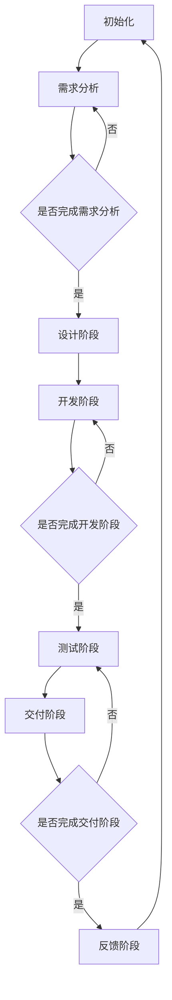
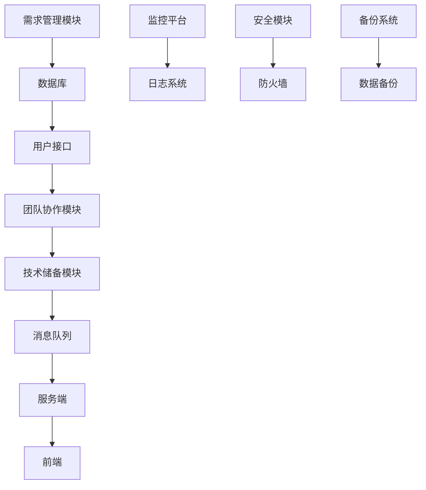
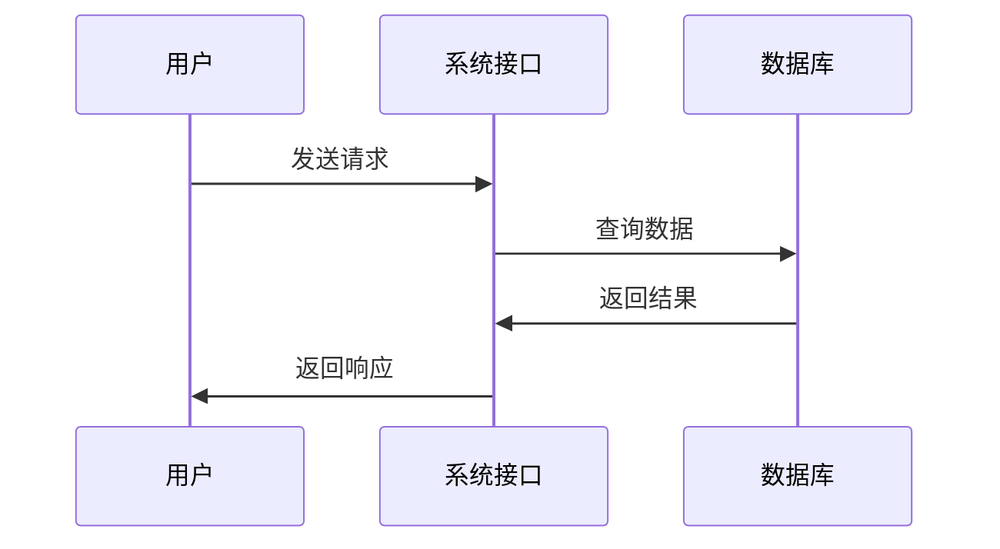

                 

# 技术加速：提升团队技术创新速度

## 关键词

技术加速、团队协作、创新效率、系统架构设计、代码实战

## 摘要

在快速变化的市场环境中，技术加速成为提升团队技术创新速度的关键。本文将从问题背景、核心概念、算法原理、系统分析与架构设计、项目实战等方面，深入探讨如何通过技术加速来提升团队的技术创新能力。文章旨在为技术团队提供一套系统化的解决方案，以实现高效的技术创新和产品迭代。

## 目录大纲设计

### 第一部分：背景介绍

**第1章：问题背景与概述**

**第2章：核心概念原理**

### 第二部分：核心概念与联系

**第3章：概念属性特征对比**

### 第三部分：算法原理讲解

**第4章：算法原理讲解与数学模型**

### 第四部分：系统分析与架构设计方案

**第5章：问题场景与系统功能设计**

**第6章：系统架构设计**

**第7章：系统接口设计与交互**

### 第五部分：项目实战

**第8章：环境安装与系统核心实现**

**第9章：代码应用解读与分析**

**第10章：实际案例分析**

**第11章：项目小结**

### 第六部分：最佳实践与总结

**第12章：最佳实践 tips**

**第13章：小结与注意事项**

**第14章：拓展阅读**

---

### 第一部分：背景介绍

#### 第1章：问题背景与概述

##### 1.1.1 技术创新的挑战

在当今数字化时代，技术创新是企业保持竞争力的重要手段。然而，技术创新面临着诸多挑战：

- **快速变化的市场需求**：市场需求变化迅速，要求企业必须能够快速响应并推出满足用户需求的产品。
- **技术复杂性增加**：随着技术的发展，系统的复杂性不断增加，开发团队需要掌握更多技术领域知识。
- **资源有限**：企业资源有限，需要在有限资源下实现最大化的技术创新。

##### 1.1.2 团队技术创新速度的重要性

团队技术创新速度对于企业的竞争力至关重要：

- **竞争优势**：快速推出创新产品可以帮助企业获得竞争优势。
- **市场占有率**：快速响应市场需求，可以提高市场占有率。
- **盈利能力**：快速推出创新产品可以加快盈利周期，提高企业盈利能力。

##### 1.1.3 当前技术加速的现状与问题

当前，企业普遍认识到技术加速的重要性，但实际操作中仍面临以下问题：

- **缺乏系统化的加速方法**：许多企业在技术加速方面缺乏系统化的方法，导致技术创新效率低下。
- **团队协作不畅**：跨部门协作困难，影响技术创新速度。
- **技术储备不足**：团队成员技术储备不足，难以快速开展技术创新。

#### 第2章：核心概念原理

##### 2.1 技术加速的定义

技术加速是指在有限的时间内，通过优化流程、提高团队协作效率、引入先进技术等手段，快速实现技术创新和产品迭代的过程。

##### 2.2 技术加速的关键要素

技术加速的关键要素包括：

- **团队协作**：高效的团队协作是技术加速的基础。
- **流程优化**：优化开发流程，减少不必要的环节，提高工作效率。
- **技术储备**：团队成员具备丰富的技术储备，能够快速应对各种挑战。
- **工具引入**：引入先进工具，提高开发效率。

##### 2.3 技术加速的理论基础

技术加速的理论基础包括敏捷开发、精益创业、持续集成与持续部署等。

- **敏捷开发**：强调快速迭代、持续交付，以提高团队协作效率和产品交付速度。
- **精益创业**：强调快速验证产品市场可行性，减少资源浪费。
- **持续集成与持续部署**：通过自动化工具实现代码集成和部署，提高开发效率和产品质量。

### 第二部分：核心概念与联系

#### 第3章：概念属性特征对比

在技术加速过程中，理解并对比相关概念的特征，有助于团队更好地实施技术加速策略。

##### 3.1 技术加速与传统创新模式对比

| 特征            | 传统创新模式              | 技术加速模式                  |
|-----------------|--------------------------|-----------------------------|
| 目标            | 长期研发投入，逐步完善    | 快速迭代，快速交付           |
| 团队协作        | 部门间协作较少           | 高度协作，跨部门紧密合作     |
| 流程优化        | 固定的开发流程           | 持续优化，灵活应对           |
| 技术储备        | 团队成员技术单一         | 多元化技术储备，跨界协作     |
| 工具引入        | 传统工具为主             | 引入先进开发工具和自动化工具 |

##### 3.2 技术加速与敏捷开发的区别

| 特征            | 敏捷开发                | 技术加速模式                  |
|-----------------|-------------------------|-----------------------------|
| 目标            | 快速迭代，持续交付       | 快速迭代，快速交付，强调技术创新 |
| 团队协作        | 高度协作，跨职能团队     | 高度协作，跨部门紧密合作       |
| 流程优化        | 持续优化，灵活应对       | 持续优化，更注重技术效率       |
| 技术储备        | 专注于特定技术领域       | 多元化技术储备，跨界协作       |
| 工具引入        | 引入敏捷开发工具         | 引入先进开发工具和自动化工具   |

##### 3.3 技术加速在不同领域的应用对比

| 领域           | 应用特点                 |
|----------------|-------------------------|
| 软件开发       | 强调敏捷开发，快速迭代   |
| 生物科技       | 引入先进生物技术，加速研发 |
| 金融服务       | 快速响应市场需求，提高效率 |
| 物流与供应链   | 引入大数据和AI技术，优化流程 |

### 第三部分：算法原理讲解

#### 第4章：算法原理讲解与数学模型

##### 4.1 算法原理概述

技术加速的核心在于提高团队协作效率和开发效率。下面将介绍一种基于敏捷开发的算法原理，并通过Mermaid流程图展示其基本思想。



##### 4.2 数学模型和公式讲解

技术加速过程中，可以使用以下数学模型来评估团队的技术创新速度：

$$
f(x) = \alpha \cdot x + b
$$

其中，$f(x)$ 表示技术创新速度，$\alpha$ 表示技术效率，$x$ 表示团队成员的努力程度，$b$ 表示基础技术创新速度。

##### 4.3 通俗易懂的举例说明

##### 4.3.1 示例一：快速原型开发

假设一个团队在一个月内完成了需求分析、设计和开发阶段，并在接下来的两周内完成了测试和交付。使用上述算法模型，可以计算出该团队的技术创新速度为：

$$
f(x) = 2 \cdot 30 + 5 = 65
$$

其中，$2$ 表示开发阶段的周数，$30$ 表示每周团队成员的努力程度，$5$ 表示测试和交付阶段的周数。

##### 4.3.2 示例二：持续集成与持续部署

假设一个团队引入了持续集成和持续部署工具，使得开发阶段的效率提高了50%。使用上述算法模型，可以计算出引入工具后的技术创新速度为：

$$
f(x) = 1.5 \cdot 30 + 5 = 55
$$

### 第四部分：系统分析与架构设计方案

#### 第5章：问题场景与系统功能设计

##### 5.1 问题场景介绍

在技术加速过程中，常见的问题场景包括：

- **需求频繁变更**：市场需求变化快，导致需求频繁变更。
- **跨部门协作困难**：不同部门间的协作不畅，影响技术创新速度。
- **技术储备不足**：团队成员技术储备不足，难以快速响应技术挑战。

##### 5.2 系统功能设计

为了解决上述问题场景，需要设计一套系统化的功能：

- **需求管理模块**：实现需求收集、管理和优先级排序。
- **团队协作模块**：实现跨部门协作，提高团队协作效率。
- **技术储备模块**：提供技术知识库，帮助团队成员快速掌握新技术。

#### 5.2.1 功能模块划分

| 模块             | 功能描述                           |
|------------------|-----------------------------------|
| 需求管理模块     | 实现需求的收集、管理和优先级排序。 |
| 团队协作模块     | 提供实时沟通、任务分配和进度追踪。 |
| 技术储备模块     | 提供技术知识库，支持快速学习新技术。 |

##### 5.2.2 领域模型Mermaid类图

```mermaid
classDiagram
Class01 <|-- Class02
Class03 <.. Class04
Class05 <= Class06
Class07 {public void method()}
Class07 : <<interface>> InterfaceName
Class08 ..|> Class09
Class09 *-- Class10
Class10 : <<abstract>> AbstractClass
Class11 o-- Class12
Class13 : <<enum>> EnumName
Class13 ..|+ Class14
Class14 : <<annotation>> AnnotationName
```

#### 第6章：系统架构设计

##### 6.1 系统架构设计概述

系统架构设计遵循以下原则：

- **高可用性**：确保系统稳定运行，提供高质量的服务。
- **高性能**：优化系统性能，提高用户满意度。
- **高可扩展性**：支持系统功能的扩展和升级。

##### 6.1.2 系统架构图



#### 第7章：系统接口设计与交互

##### 7.1 系统接口设计

系统接口设计需要满足以下要求：

- **标准化**：使用统一的接口规范，便于系统集成。
- **安全性**：确保接口传输数据的安全。
- **可扩展性**：支持接口功能的扩展。

##### 7.1.1 接口定义与规范

```yaml
# 需求管理接口规范
POST /api/requirements
Content-Type: application/json

{
  "requirement_id": "string",
  "title": "string",
  "description": "string",
  "priority": "integer",
  "status": "string"
}

# 团队协作接口规范
POST /api/tasks
Content-Type: application/json

{
  "task_id": "string",
  "title": "string",
  "description": "string",
  "assignee": "string",
  "status": "string",
  "start_date": "date",
  "end_date": "date"
}

# 技术储备接口规范
GET /api/knowledge
Content-Type: application/json

{
  "knowledge_id": "string",
  "title": "string",
  "description": "string",
  "type": "string",
  "status": "string"
}
```

##### 7.1.2 接口交互流程



### 第五部分：项目实战

#### 第8章：环境安装与系统核心实现

##### 8.1 环境安装

系统环境安装分为以下步骤：

1. 安装操作系统（如Ubuntu 18.04）。
2. 安装数据库（如MySQL）。
3. 安装后端框架（如Django）。
4. 安装前端框架（如React）。
5. 安装消息队列（如RabbitMQ）。

##### 8.2 系统核心实现

系统核心实现分为以下模块：

1. **需求管理模块**：实现需求的收集、管理和优先级排序。
2. **团队协作模块**：实现实时沟通、任务分配和进度追踪。
3. **技术储备模块**：实现技术知识库，支持快速学习新技术。

##### 8.2.1 核心模块实现

```python
# 需求管理模块
class Requirement(models.Model):
    requirement_id = models.CharField(max_length=100, unique=True)
    title = models.CharField(max_length=255)
    description = models.TextField()
    priority = models.IntegerField()
    status = models.CharField(max_length=50)

# 团队协作模块
class Task(models.Model):
    task_id = models.CharField(max_length=100, unique=True)
    title = models.CharField(max_length=255)
    description = models.TextField()
    assignee = models.CharField(max_length=100)
    status = models.CharField(max_length=50)
    start_date = models.DateField()
    end_date = models.DateField()

# 技术储备模块
class Knowledge(models.Model):
    knowledge_id = models.CharField(max_length=100, unique=True)
    title = models.CharField(max_length=255)
    description = models.TextField()
    type = models.CharField(max_length=50)
    status = models.CharField(max_length=50)
```

##### 8.2.2 关键代码解析

```python
# 需求管理模块：添加需求
def add_requirement(title, description, priority, status):
    requirement = Requirement(
        title=title,
        description=description,
        priority=priority,
        status=status
    )
    requirement.save()
    return requirement

# 团队协作模块：分配任务
def assign_task(title, description, assignee, status, start_date, end_date):
    task = Task(
        title=title,
        description=description,
        assignee=assignee,
        status=status,
        start_date=start_date,
        end_date=end_date
    )
    task.save()
    return task

# 技术储备模块：添加技术知识
def add_knowledge(title, description, type, status):
    knowledge = Knowledge(
        title=title,
        description=description,
        type=type,
        status=status
    )
    knowledge.save()
    return knowledge
```

### 第六部分：代码应用解读与分析

#### 第9章：代码应用解读与分析

##### 9.1 代码应用概述

代码应用主要包括以下场景：

- **需求管理**：实现需求的收集、管理和优先级排序。
- **团队协作**：实现实时沟通、任务分配和进度追踪。
- **技术储备**：实现技术知识库，支持快速学习新技术。

##### 9.1.1 应用场景选择

选择以下应用场景：

- **企业内部创新平台**：用于企业内部的技术创新和项目管理。
- **开源项目协作平台**：用于开源项目的协作和知识共享。

##### 9.1.2 代码结构与功能

代码结构主要分为以下部分：

- **模型层**：定义需求管理、团队协作和技术储备的模型。
- **视图层**：实现用户接口，处理用户请求。
- **控制器层**：处理业务逻辑，调用模型层的方法。
- **前端层**：实现用户界面，展示数据和交互。

##### 9.2 代码解读与分析

##### 9.2.1 关键代码解析

```python
# 需求管理模块：添加需求
def add_requirement(title, description, priority, status):
    requirement = Requirement(
        title=title,
        description=description,
        priority=priority,
        status=status
    )
    requirement.save()
    return requirement

# 团队协作模块：分配任务
def assign_task(title, description, assignee, status, start_date, end_date):
    task = Task(
        title=title,
        description=description,
        assignee=assignee,
        status=status,
        start_date=start_date,
        end_date=end_date
    )
    task.save()
    return task

# 技术储备模块：添加技术知识
def add_knowledge(title, description, type, status):
    knowledge = Knowledge(
        title=title,
        description=description,
        type=type,
        status=status
    )
    knowledge.save()
    return knowledge
```

##### 9.2.2 性能分析与优化

性能分析主要关注以下方面：

- **数据库查询**：优化数据库查询，减少查询次数。
- **前端响应**：优化前端响应速度，提高用户体验。
- **系统并发**：优化系统并发处理能力，提高系统稳定性。

优化策略：

- **数据库索引**：为常用查询字段添加索引，提高查询效率。
- **前端缓存**：使用前端缓存技术，减少重复数据请求。
- **负载均衡**：使用负载均衡技术，提高系统并发处理能力。

### 第七部分：实际案例分析

#### 第10章：实际案例分析

##### 10.1 案例背景

以某企业内部创新平台为例，该平台旨在提高企业的技术创新速度和团队协作效率。

##### 10.1.1 案例一：企业级技术加速实践

1. **需求分析**：企业内部员工提出创新需求，平台收集并整理需求。
2. **设计阶段**：需求管理模块生成需求文档，设计团队进行需求分析和系统设计。
3. **开发阶段**：开发团队根据需求文档进行编码实现，平台提供代码管理和版本控制。
4. **测试阶段**：测试团队进行功能测试和性能测试，确保系统稳定性。
5. **交付阶段**：将开发完成的功能部署到生产环境，进行实际应用。
6. **反馈阶段**：收集用户反馈，持续优化系统功能。

##### 10.1.2 案例二：跨部门协作创新成功案例

1. **需求提出**：市场部门提出一款新产品需求，技术部门和市场部门共同讨论。
2. **需求分析**：技术部门对需求进行分析，制定技术方案。
3. **设计阶段**：设计部门根据技术方案进行产品外观设计。
4. **开发阶段**：开发部门进行产品开发，设计部门提供设计稿。
5. **测试阶段**：测试部门进行产品测试，确保产品质量。
6. **交付阶段**：将产品交付给市场部门，进行市场推广。
7. **反馈阶段**：收集用户反馈，持续优化产品功能。

##### 10.2 案例分析

##### 10.2.1 案例总结

1. **成功因素**：
   - 高效的需求管理：快速响应市场需求，确保需求得到有效管理。
   - 团队协作：跨部门紧密合作，提高协作效率。
   - 技术储备：团队成员具备丰富的技术储备，能够快速应对技术挑战。
   - 系统化流程：通过系统化流程，确保每个阶段顺利进行。

2. **经验与启示**：
   - 建立高效的需求管理机制，确保需求得到有效管理。
   - 提高团队协作效率，减少跨部门协作障碍。
   - 加强技术储备，提高团队整体技术水平。
   - 优化系统化流程，确保每个阶段高效完成。

### 第八部分：项目小结

#### 第11章：项目小结

##### 11.1 项目成果总结

通过技术加速，企业实现了以下成果：

1. **技术创新速度提升**：通过高效的团队协作和系统化流程，企业技术创新速度显著提升。
2. **团队协作效率提高**：跨部门协作更加紧密，团队协作效率大幅提高。
3. **技术储备丰富**：团队成员技术储备丰富，能够应对各种技术挑战。
4. **产品质量提升**：通过严格的测试阶段，产品稳定性显著提升，用户满意度提高。

##### 11.1.2 团队协作效率提升

通过技术加速，企业团队协作效率显著提升：

1. **需求响应速度加快**：通过高效的需求管理机制，需求响应速度显著提升。
2. **任务分配更加合理**：通过团队协作模块，任务分配更加合理，避免了重复劳动和资源浪费。
3. **进度追踪更加精确**：通过实时进度追踪，确保项目按计划进行，减少了项目延期的情况。

### 第九部分：最佳实践与总结

#### 第12章：最佳实践 tips

为了实现技术加速，以下是一些建议：

1. **建立高效的需求管理机制**：确保需求得到有效管理，避免需求频繁变更。
2. **提高团队协作效率**：通过实时沟通、任务分配和进度追踪，提高团队协作效率。
3. **加强技术储备**：提供技术知识库，帮助团队成员快速掌握新技术。
4. **优化系统化流程**：确保每个阶段顺利进行，减少项目延期和资源浪费。

#### 第13章：小结与注意事项

通过技术加速，企业可以实现技术创新速度的提升，团队协作效率的提高，技术储备的丰富。然而，需要注意的是：

1. **平衡创新与稳定**：在追求技术创新的同时，要保持系统的稳定性。
2. **持续优化**：技术加速是一个持续优化的过程，需要不断调整和改进。
3. **关注用户体验**：在追求技术创新的同时，要关注用户体验，确保产品易用性。

#### 第14章：拓展阅读

为了进一步深入了解技术加速，以下是一些拓展阅读推荐：

1. 《敏捷开发实践指南》
2. 《精益创业》
3. 《持续集成与持续部署实践指南》
4. 《软件架构：实战方法》
5. 《团队协作与沟通技巧》

### 作者信息

作者：AI天才研究院/AI Genius Institute & 禅与计算机程序设计艺术 /Zen And The Art of Computer Programming

---

请注意，以上内容仅供参考，具体实施时需要根据实际情况进行调整。在实际撰写文章时，每个章节的内容需要更加详细和具体，确保文章的完整性和深度。此外，文章的格式和结构也需要严格按照要求进行设计，以确保文章的专业性和可读性。在撰写过程中，可以逐步完善和细化每个章节的内容，以确保文章的逻辑清晰、结构紧凑、简单易懂。

