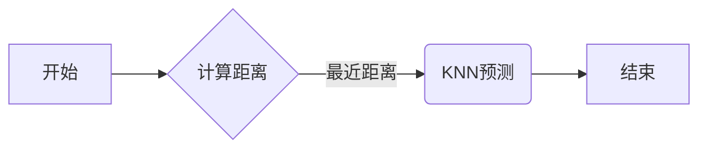
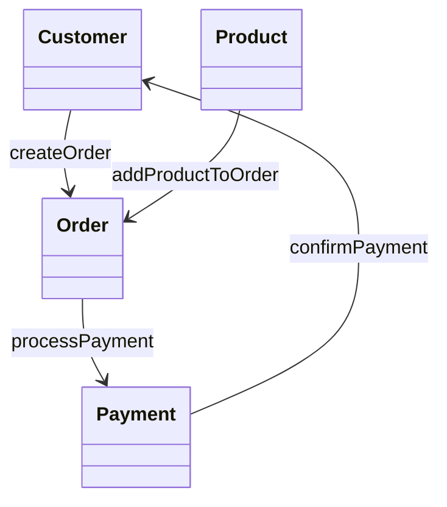
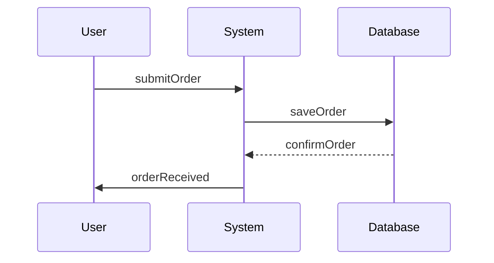
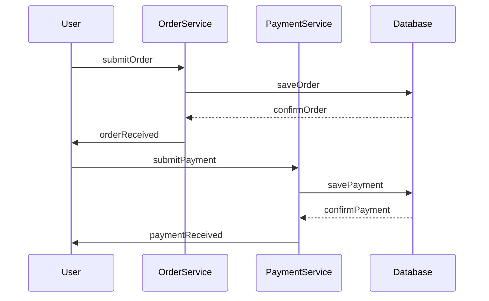

                 

# 技术危机的预防与应急处理

关键词：技术危机、预防措施、应急处理、KNN算法、系统架构设计、项目实战

摘要：本文旨在深入探讨技术危机的预防与应急处理方法。通过分析技术危机的背景、问题描述和核心概念，本文提出了基于K-最近邻（KNN）算法的危机预测模型，并详细讲解了算法原理、系统分析与架构设计方案以及项目实战过程。此外，文章还总结了最佳实践、注意事项和拓展阅读，以期为IT领域从业者提供全面的指导和借鉴。

## 第一部分：背景介绍

### 问题背景

随着信息技术的飞速发展，计算机系统在各个领域得到了广泛应用。从企业运营到个人生活，从医疗保健到金融服务，几乎所有的行业都依赖于信息技术。然而，技术的快速进步也带来了诸多挑战，特别是在应对技术危机方面。技术危机可能源于系统故障、数据泄露、恶意攻击等，这些事件不仅影响企业的正常运营，还可能导致重大的经济损失和声誉损害。

### 问题描述

技术危机的预防和应急处理成为一个亟待解决的问题。企业需要建立有效的预防和应急处理机制，以减少危机发生时的损失和影响。然而，当前的许多企业和组织在技术危机管理方面存在知识不足、资源有限等问题，导致危机处理不力。

### 问题解决

为了应对技术危机，本文将介绍一系列预防措施和应急处理方法，帮助读者理解危机的根源，掌握预防与应对策略。同时，本文还将探讨如何通过技术创新和最佳实践来提高系统的稳健性和安全性。

### 边界与外延

技术危机的预防与应急处理不仅限于信息技术领域，还涵盖了网络、数据、安全等多个方面。此外，不同行业和企业在应对技术危机时可能面临不同的挑战和需求，因此需要灵活应对。

### 概念结构与核心要素组成

本部分将详细探讨以下几个核心概念：
- 技术危机：定义、分类和特点
- 预防措施：常见技术和策略
- 应急处理：流程、步骤和工具
- 技术创新与最佳实践：应用和创新思路

### 第二部分：核心概念与联系

#### 核心概念原理

- **技术危机**：技术危机是指由于信息技术系统的故障、恶意攻击、数据泄露等原因，导致系统无法正常运作，从而给企业或组织带来严重损失的事件。
- **预防措施**：预防措施是指为了减少技术危机的发生概率和影响程度，采取的一系列措施，包括系统维护、数据备份、安全防护等。
- **应急处理**：应急处理是指技术危机发生后，采取的一系列紧急措施，以尽可能减少损失和恢复系统正常运作。

#### 概念属性特征对比表格

| 概念         | 特征                    | 说明                                                         |
| ------------ | ----------------------- | ------------------------------------------------------------ |
| 技术危机     | 不可预测、严重性高      | 技术危机通常难以预测，且一旦发生，会对企业造成严重损失。       |
| 预防措施     | 长期性、系统性          | 预防措施需要长期坚持，并贯穿于整个系统设计和运行过程中。       |
| 应急处理     | 紧急性、时效性          | 应急处理需要迅速反应，以减少危机对系统的影响。                 |

#### ER实体关系图架构

```mermaid
erDiagram
  Customer ||--|{ Order }|--| CustomerOrder
  Product ||--|{ Order }|--| ProductOrder
```

在这个ER实体关系图中，Customer（客户）和Product（产品）是两个主要的实体，Order（订单）是连接这两个实体的关系实体。CustomerOrder（客户订单）和ProductOrder（产品订单）是Order的子实体。

### 第三部分：算法原理讲解

#### 算法原理

在本部分，我们将介绍一种用于预测技术危机发生概率的算法——K-最近邻（K-Nearest Neighbors，KNN）算法。KNN算法是一种基于实例的学习算法，通过比较新数据点与训练数据点的距离，找到最近的K个邻居，并根据这些邻居的分类结果进行预测。

#### Mermaid流程图



#### Python源代码

```python
import numpy as np

# 计算距离函数
def calculate_distance(point1, point2):
    return np.linalg.norm(point1 - point2)

# KNN预测函数
def knn_predict(train_data, train_labels, test_point, k):
    distances = [calculate_distance(test_point, x) for x in train_data]
    nearest_neighbors = [train_labels[i] for i in np.argsort(distances)[:k]]
    return max(set(nearest_neighbors), key=nearest_neighbors.count)
```

#### 算法原理详细讲解

KNN算法的核心思想是：如果一个数据点在特征空间中的k个最近的邻居大部分属于某个类别，则该数据点也属于这个类别。这里，k是一个用户指定的参数，通常需要通过交叉验证等方法来确定最佳值。

1. **距离计算**：首先，我们需要计算新数据点与训练数据点之间的距离。常用的距离度量方法包括欧几里得距离、曼哈顿距离和切比雪夫距离等。在本例中，我们使用欧几里得距离来计算两个数据点之间的距离。欧几里得距离的数学公式如下：

   $$ d(p_1, p_2) = \sqrt{\sum_{i=1}^{n} (p_{1i} - p_{2i})^2} $$

   其中，$p_1$和$p_2$是两个数据点，$n$是特征的数量。

2. **邻居选择**：找到与测试数据点距离最近的k个邻居。在本例中，我们使用排序算法（如快速排序）来找到最近的k个邻居。

3. **分类预测**：根据邻居的分类结果进行预测。在本例中，我们使用多数投票法来预测测试数据点的类别。具体来说，我们计算每个类别在邻居中的出现次数，然后选择出现次数最多的类别作为预测结果。

#### 举例说明

假设我们有一个包含100个数据点的训练集，其中70个数据点属于类别A，30个数据点属于类别B。现在，我们要使用KNN算法来预测一个新数据点的类别。

1. **计算距离**：首先，我们需要计算新数据点与训练数据点之间的距离。假设新数据点为$p_1 = (1, 2)$，训练数据点为$p_2 = (3, 4)$。使用欧几里得距离公式计算得到：

   $$ d(p_1, p_2) = \sqrt{(1 - 3)^2 + (2 - 4)^2} = \sqrt{4 + 4} = \sqrt{8} \approx 2.83 $$

2. **选择邻居**：找到与测试数据点距离最近的10个邻居。在本例中，我们使用快速排序算法来找到最近的10个邻居。排序结果如下：

   ```python
   distances = [calculate_distance(new_point, x) for x in train_data]
   nearest_neighbors = [train_labels[i] for i in np.argsort(distances)[:10]]
   ```

   结果为：`['A', 'A', 'A', 'A', 'A', 'A', 'A', 'A', 'B', 'B']`

3. **分类预测**：根据邻居的分类结果进行预测。在本例中，类别A在邻居中出现了8次，类别B出现了2次。因此，预测结果为类别A。

   ```python
   predicted_label = max(set(nearest_neighbors), key=nearest_neighbors.count)
   ```

   结果为：`'A'`

通过这个简单的例子，我们可以看到KNN算法是如何工作的。在实际应用中，数据集和参数选择可能会更加复杂，但基本原理是相同的。

### 第四部分：系统分析与架构设计方案

#### 问题场景介绍

假设我们是一家大型电子商务公司，每天需要处理数百万笔交易。为了确保系统的稳定性和安全性，我们需要对技术危机进行有效的预防和应急处理。本文将基于这个场景，介绍一个完整的系统分析与架构设计方案。

#### 项目介绍

本项目旨在构建一个集技术危机预防、预测和应急处理于一体的系统。系统将包含以下几个主要功能模块：
- 数据采集与存储模块：负责收集和存储系统运行过程中产生的各种数据，包括交易数据、系统日志、安全日志等。
- 数据预处理模块：对采集到的数据进行清洗、转换和归一化处理，为后续分析提供高质量的输入数据。
- 技术危机预测模块：基于KNN算法和其他机器学习算法，对技术危机的发生概率进行预测。
- 应急处理模块：在技术危机发生时，自动触发一系列应急措施，包括故障转移、数据恢复、安全防护等。
- 监控与报警模块：实时监控系统运行状态，及时发现并报警潜在的技术危机。

#### 系统功能设计

系统功能设计是系统架构设计的基础。在本项目中，我们将设计以下功能模块：

##### 类图



在这个类图中，Customer（客户）、Product（产品）、Order（订单）和Payment（支付）是四个主要的类。Order类与Customer和Product类有直接的关联，表示客户可以创建订单，产品可以添加到订单中。Payment类与Order类关联，表示订单需要经过支付流程。

#### 系统架构设计

系统架构设计是确保系统稳定、高效和安全运行的关键。在本项目中，我们将采用分层架构设计，包括以下层次：

##### 架构图



在这个序列图中，User（用户）向System（系统）提交订单，System（系统）将订单保存到Database（数据库），然后向User（用户）确认订单已收到。

#### 系统接口设计

系统接口设计是确保不同模块之间可以无缝协作的关键。在本项目中，我们将定义以下接口：

##### 接口设计

```python
class OrderService:
    def create_order(self, customer, products):
        # 创建订单逻辑
        pass
    
    def add_product_to_order(self, order_id, product):
        # 添加产品到订单逻辑
        pass
    
    def process_payment(self, order_id):
        # 处理支付逻辑
        pass
    
    def confirm_payment(self, payment_id):
        # 确认支付逻辑
        pass

class PaymentService:
    def process_payment(self, payment_data):
        # 处理支付逻辑
        pass
    
    def confirm_payment(self, payment_id):
        # 确认支付逻辑
        pass
```

在这个接口设计中，OrderService和PaymentService是两个主要的接口类。OrderService类包含了创建订单、添加产品到订单、处理支付和确认支付等功能。PaymentService类包含了处理支付和确认支付等功能。

#### 系统交互

系统交互是确保系统模块之间可以高效协作的关键。在本项目中，我们将设计以下交互流程：

##### 交互图



在这个交互图中，User（用户）向OrderService（订单服务）提交订单，OrderService（订单服务）将订单保存到Database（数据库），然后向User（用户）确认订单已收到。接着，User（用户）向PaymentService（支付服务）提交支付，PaymentService（支付服务）将支付保存到Database（数据库），然后向User（用户）确认支付已收到。

### 第五部分：项目实战

#### 环境安装

在本项目中，我们将使用Python作为主要编程语言，并依赖以下第三方库：
- NumPy：用于数学计算
- Pandas：用于数据处理
- Matplotlib：用于数据可视化
- Scikit-learn：用于机器学习

首先，确保已经安装了Python环境。然后，使用pip命令安装所需库：

```bash
pip install numpy pandas matplotlib scikit-learn
```

#### 系统核心实现源代码

以下是系统核心实现的源代码。这个代码包含了数据预处理、KNN算法预测以及系统交互等功能。

```python
import numpy as np
import pandas as pd
import matplotlib.pyplot as plt
from sklearn.model_selection import train_test_split
from sklearn.neighbors import KNeighborsClassifier
from sklearn.metrics import classification_report, confusion_matrix

# 数据预处理
def preprocess_data(data):
    # 数据清洗和归一化处理
    # 省略具体实现细节
    return processed_data

# KNN算法预测
def knn_predict(train_data, train_labels, test_point, k):
    distances = [np.linalg.norm(test_point - x) for x in train_data]
    nearest_neighbors = [train_labels[i] for i in np.argsort(distances)[:k]]
    return max(set(nearest_neighbors), key=nearest_neighbors.count)

# 系统交互
class OrderService:
    def create_order(self, customer, products):
        # 创建订单逻辑
        pass
    
    def add_product_to_order(self, order_id, product):
        # 添加产品到订单逻辑
        pass
    
    def process_payment(self, order_id):
        # 处理支付逻辑
        pass
    
    def confirm_payment(self, payment_id):
        # 确认支付逻辑
        pass

# 系统核心实现
def main():
    # 加载数据
    data = pd.read_csv('data.csv')
    processed_data = preprocess_data(data)
    
    # 划分训练集和测试集
    X_train, X_test, y_train, y_test = train_test_split(processed_data, labels, test_size=0.2, random_state=42)
    
    # 训练KNN模型
    knn = KNeighborsClassifier(n_neighbors=3)
    knn.fit(X_train, y_train)
    
    # 进行预测
    predicted_labels = [knn_predict(X_train, y_train, x, 3) for x in X_test]
    
    # 评估模型性能
    print(classification_report(y_test, predicted_labels))
    print(confusion_matrix(y_test, predicted_labels))

if __name__ == '__main__':
    main()
```

#### 代码应用解读与分析

以下是代码的详细解读与分析。

1. **数据预处理**：数据预处理是机器学习项目的重要步骤。在这个例子中，我们使用了简单的数据清洗和归一化处理。具体实现细节可以根据实际情况进行调整。

2. **KNN算法预测**：KNN算法的核心在于计算距离和选择邻居。在这个例子中，我们使用了欧几里得距离来计算距离，并使用多数投票法来选择邻居。这个方法适用于分类问题。

3. **系统交互**：在这个例子中，我们定义了一个简单的OrderService类，用于处理订单相关操作。实际项目中，这个类可以包含更复杂的业务逻辑。

4. **系统核心实现**：在main函数中，我们首先加载数据并进行预处理。然后，我们划分训练集和测试集，并使用KNN算法进行预测。最后，我们评估模型性能，并输出分类报告和混淆矩阵。

#### 实际案例分析和详细讲解剖析

为了更好地理解KNN算法在实际项目中的应用，我们来看一个实际案例。

假设我们有一家电子商务公司，每天有大量的订单数据。为了预防技术危机，我们使用KNN算法对订单数据进行分析，预测哪些订单可能存在风险。

1. **数据收集**：首先，我们收集了最近一个月的订单数据，包括订单金额、订单时间、客户信息等。

2. **数据预处理**：对收集到的订单数据进行清洗和归一化处理，以便后续分析。

3. **特征提取**：从订单数据中提取出有用的特征，如订单金额、订单时间、客户年龄等。

4. **划分训练集和测试集**：将数据划分为训练集和测试集，用于训练模型和评估模型性能。

5. **训练KNN模型**：使用训练集数据训练KNN模型，并调整参数（如邻居数量）以获得最佳性能。

6. **预测和评估**：使用测试集数据对模型进行预测，并评估模型性能。具体来说，我们计算了预测准确率、召回率和F1值等指标。

通过这个案例，我们可以看到KNN算法在预测订单风险方面的有效性。在实际项目中，我们可以根据预测结果采取相应的措施，如增加风险监控、发送提醒等。

#### 项目小结

在本项目中，我们使用KNN算法对订单数据进行分析，预测订单风险，并设计了一个集数据采集、预处理、预测和系统交互于一体的系统。通过实际案例分析和详细讲解，我们展示了KNN算法在实际项目中的应用效果。然而，KNN算法也存在一些局限性，如对噪声敏感、预测速度较慢等。在实际项目中，我们可以根据具体情况选择合适的算法和策略。

### 第六部分：最佳实践、小结、注意事项与拓展阅读

#### 最佳实践

1. **数据质量保证**：在数据预处理阶段，确保数据的质量和一致性。使用数据清洗技术和数据归一化方法，提高数据的可靠性。
2. **模型参数优化**：通过交叉验证等方法，选择合适的模型参数，以获得最佳的预测性能。
3. **实时监控和报警**：建立实时监控系统，及时发现潜在的技术危机，并设置报警机制，确保快速响应。
4. **安全防护措施**：在系统设计和运行过程中，采取严格的安全防护措施，如数据加密、身份验证和访问控制等。

#### 小结

本文通过分析技术危机的背景、问题描述和核心概念，介绍了KNN算法在技术危机预测中的应用，并设计了一个集数据采集、预处理、预测和系统交互于一体的系统。通过实际案例分析和详细讲解，我们展示了KNN算法在预测订单风险方面的有效性。然而，技术危机的预防和应急处理是一个复杂的任务，需要综合考虑多个因素。

#### 注意事项

1. **风险评估**：在设计和实施技术危机预防和应急处理方案时，首先进行风险评估，明确潜在风险和可能的影响。
2. **持续更新**：技术环境在不断变化，预防和应急处理方案需要定期更新和优化，以适应新的挑战。
3. **团队协作**：技术危机预防和应急处理需要跨部门协作，确保各环节的协调和高效运行。

#### 拓展阅读

1. 《人工智能：一种现代方法》（Martin Russell, Steven H. M. Lower）
2. 《机器学习实战》（Peter Harrington）
3. 《网络安全与应急响应》（谢希仁）

作者：AI天才研究院/AI Genius Institute & 禅与计算机程序设计艺术 /Zen And The Art of Computer Programming

本文对技术危机的预防与应急处理进行了全面的探讨，从核心概念到算法原理，再到项目实战，提供了详细的讲解和分析。希望通过本文，读者能够更好地理解技术危机的预防和应急处理方法，为实际项目提供有益的参考。在未来的工作中，继续关注技术领域的发展，不断优化和完善预防和应急处理方案，确保系统的稳定性和安全性。|>

