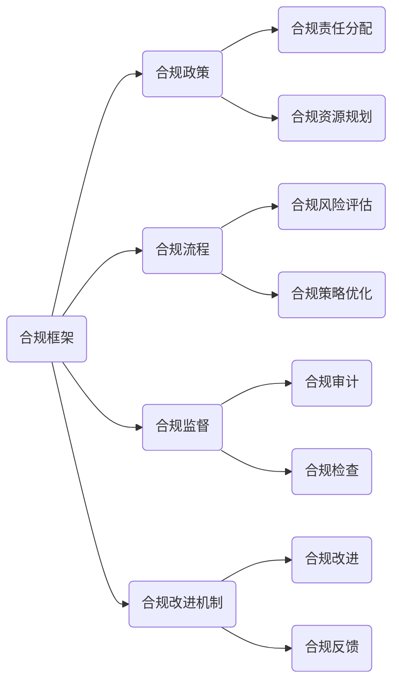
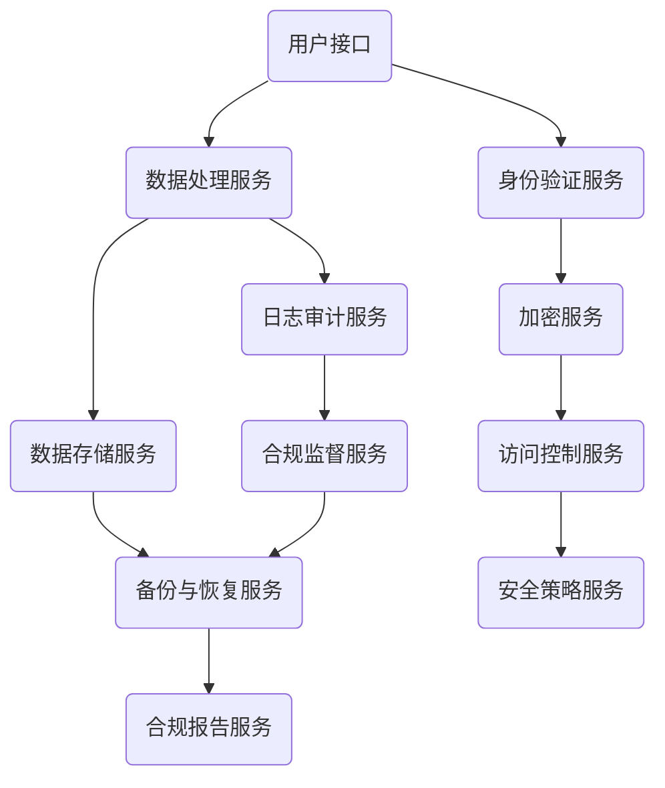

                 


### 技术合规：在创新中保障安全与隐私

#### 关键词：
- 技术合规
- 安全保障
- 隐私保护
- 法律法规
- 技术框架
- 实施案例

#### 摘要：
在信息技术飞速发展的今天，如何在创新中保障安全与隐私成为了一个重要课题。本文将从合规的必要性、法律法规、合规框架与技术、合规实施与案例等方面，逐步分析探讨技术合规在创新中的重要作用，以及如何在实际操作中实现合规与创新的平衡。

#### 目录大纲设计

为了使文章内容更具逻辑性和可读性，我们将文章分为四个主要部分：

1. **引言**：介绍技术合规的背景、意义以及安全与隐私的基本概念。

2. **合规法律法规**：分析国内外数据保护法律法规，探讨合规义务与法律责任。

3. **合规框架与技术**：介绍合规框架、合规技术及其在实践中的应用。

4. **合规实施与案例**：阐述合规实施过程、企业合规案例以及合规文化建设。

#### 第一部分：引言

##### 1.1 合规的必要性
##### 1.1.1 技术创新与合规的关系
##### 1.1.2 合规在技术发展中的地位
##### 1.1.3 合规的重要性与挑战

##### 1.2 安全与隐私的基本概念
##### 1.2.1 安全的定义与层次
##### 1.2.2 隐私的定义与保护
##### 1.2.3 安全与隐私的关系与区别

##### 1.3 合规在技术行业中的现状
##### 1.3.1 技术合规的发展历程
##### 1.3.2 技术合规的国际与国内政策
##### 1.3.3 技术合规的现状与趋势

##### 1.4 合规保障机制与体系
##### 1.4.1 合规保障机制的重要性
##### 1.4.2 合规体系的构成与运作
##### 1.4.3 合规管理与认证体系

##### 1.5 本章小结

#### 第二部分：合规法律法规

##### 2.1 数据保护法律法规概述
##### 2.1.1 国际数据保护法律法规
##### 2.1.2 中国数据保护法律法规
##### 2.1.3 法律法规的对比与影响

##### 2.2 关键法律法规解读
##### 2.2.1 GDPR（欧盟通用数据保护条例）
##### 2.2.2 CCPA（美国加州消费者隐私法案）
##### 2.2.3 其他重要法律法规解析

##### 2.3 合规义务与法律责任
##### 2.3.1 合规义务的具体内容
##### 2.3.2 违规行为的法律责任
##### 2.3.3 法律责任案例分析

##### 2.4 法律合规策略与实践
##### 2.4.1 法律合规策略的制定
##### 2.4.2 法律合规实践中的挑战
##### 2.4.3 合规实践的最佳案例

##### 2.5 本章小结

#### 第三部分：合规框架与技术

##### 3.1 合规框架概述
##### 3.1.1 合规框架的定义与作用
##### 3.1.2 合规框架的核心要素
##### 3.1.3 合规框架的类型与应用

##### 3.2 合规技术概述
##### 3.2.1 合规技术的概念与分类
##### 3.2.2 重要的合规技术介绍
##### 3.2.3 合规技术在合规中的作用

##### 3.3 合规技术深度解析
##### 3.3.1 加密技术与数据保护
##### 3.3.2 身份验证技术与应用
##### 3.3.3 数据匿名化与去识别化

##### 3.4 合规技术在实践中的应用
##### 3.4.1 合规技术实施的关键步骤
##### 3.4.2 合规技术应用的案例分析
##### 3.4.3 合规技术实践的挑战与对策

##### 3.5 本章小结

#### 第四部分：合规实施与案例

##### 4.1 合规实施过程
##### 4.1.1 合规实施的关键环节
##### 4.1.2 合规实施的步骤与方法
##### 4.1.3 合规实施的注意事项

##### 4.2 企业合规案例分析
##### 4.2.1 国内外企业合规案例
##### 4.2.2 案例分析：合规策略与实施
##### 4.2.3 案例启示与经验总结

##### 4.3 政府与行业协会的合规管理
##### 4.3.1 政府合规管理的职责与措施
##### 4.3.2 行业协会在合规管理中的作用
##### 4.3.3 政府与行业协会的合作模式

##### 4.4 合规文化建设
##### 4.4.1 合规文化的内涵与建设
##### 4.4.2 合规文化在组织管理中的应用
##### 4.4.3 合规文化建设的实践与效果

##### 4.5 本章小结

### 文章结构

#### 1. 引言部分

本文将从以下几个方面展开：

- **技术合规的背景**：介绍技术合规的起源和发展过程，以及其在当今信息技术环境中的重要性。

- **安全与隐私的基本概念**：解释安全与隐私的定义、层次和关系，为后续讨论合规提供基础。

- **合规在技术发展中的地位**：阐述合规对技术创新的促进作用，以及技术创新对合规的需求。

- **合规的重要性与挑战**：讨论合规在保障安全与隐私中的关键作用，以及实现合规过程中面临的挑战。

#### 2. 合规法律法规部分

本部分将重点分析：

- **数据保护法律法规概述**：介绍国际和国内数据保护法律法规的发展历程、核心内容及其影响。

- **关键法律法规解读**：详细解读GDPR、CCPA等重要法律法规，分析其合规义务和法律责任。

- **合规义务与法律责任**：探讨企业在合规方面的义务和责任，以及违规行为的法律责任。

- **法律合规策略与实践**：提供制定和实施法律合规策略的方法和最佳实践，以及合规实践中的挑战和对策。

#### 3. 合规框架与技术部分

本部分将探讨：

- **合规框架概述**：介绍合规框架的定义、核心要素和类型，以及其在合规中的作用。

- **合规技术概述**：概述合规技术的概念、分类和重要技术，探讨其在合规中的作用。

- **合规技术深度解析**：深入分析加密技术、身份验证技术、数据匿名化与去识别化等技术，解释其原理和应用。

- **合规技术在实践中的应用**：分析合规技术在实践中的应用案例，探讨实施合规技术的关键步骤和挑战。

#### 4. 合规实施与案例部分

本部分将聚焦：

- **合规实施过程**：详细描述合规实施的关键环节、步骤和注意事项。

- **企业合规案例分析**：分析国内外企业的合规案例，探讨合规策略和实施方法。

- **政府与行业协会的合规管理**：讨论政府、行业协会在合规管理中的作用和合作模式。

- **合规文化建设**：阐述合规文化的内涵、建设方法和实践效果。

### 每部分的具体内容

#### 引言部分

**1.1 合规的必要性**

**1.1.1 技术创新与合规的关系**：分析技术创新和合规之间的相互作用，探讨技术创新对合规的需求和合规对技术创新的促进作用。

**1.1.2 合规在技术发展中的地位**：阐述合规在技术发展中的重要作用，包括保障安全、促进创新、维护市场秩序等方面。

**1.1.3 合规的重要性与挑战**：讨论合规在当前技术环境中的重要性，以及实现合规过程中面临的挑战。

**1.2 安全与隐私的基本概念**

**1.2.1 安全的定义与层次**：解释安全的概念，分析安全的不同层次和重要性。

**1.2.2 隐私的定义与保护**：阐述隐私的定义，探讨隐私保护的必要性、方法和挑战。

**1.2.3 安全与隐私的关系与区别**：分析安全与隐私的关系，以及它们之间的区别。

**1.3 合规在技术行业中的现状**

**1.3.1 技术合规的发展历程**：回顾技术合规的发展历程，介绍重要里程碑事件。

**1.3.2 技术合规的国际与国内政策**：分析国际和国内技术合规政策的发展趋势和主要政策。

**1.3.3 技术合规的现状与趋势**：探讨当前技术合规的现状和未来发展趋势。

**1.4 合规保障机制与体系**

**1.4.1 合规保障机制的重要性**：阐述合规保障机制在技术合规中的重要性。

**1.4.2 合规体系的构成与运作**：介绍合规体系的构成和运作机制。

**1.4.3 合规管理与认证体系**：分析合规管理的职责和认证体系的作用。

#### 合规法律法规部分

**2.1 数据保护法律法规概述**

**2.1.1 国际数据保护法律法规**：介绍国际数据保护法律法规的发展历程、核心内容和影响。

**2.1.2 中国数据保护法律法规**：分析中国数据保护法律法规的发展历程、核心内容和影响。

**2.1.3 法律法规的对比与影响**：对比国际和中国数据保护法律法规，探讨其对技术合规的影响。

**2.2 关键法律法规解读**

**2.2.1 GDPR（欧盟通用数据保护条例）**：详细解读GDPR的内容、合规义务和法律责任。

**2.2.2 CCPA（美国加州消费者隐私法案）**：分析CCPA的核心内容、合规义务和法律责任。

**2.2.3 其他重要法律法规解析**：介绍其他重要法律法规，如PIPA、COPPA等。

**2.3 合规义务与法律责任**

**2.3.1 合规义务的具体内容**：阐述企业在合规方面的具体义务。

**2.3.2 违规行为的法律责任**：讨论违规行为的法律责任，包括罚则和案例。

**2.3.3 法律责任案例分析**：分析国内外企业违规案例，探讨法律责任的影响。

**2.4 法律合规策略与实践**

**2.4.1 法律合规策略的制定**：介绍制定法律合规策略的方法和步骤。

**2.4.2 法律合规实践中的挑战**：探讨法律合规实践中的挑战，如合规成本、人力资源等。

**2.4.3 合规实践的最佳案例**：分析合规实践的最佳案例，提供借鉴和启示。

#### 合规框架与技术部分

**3.1 合规框架概述**

**3.1.1 合规框架的定义与作用**：解释合规框架的概念、定义和作用。

**3.1.2 合规框架的核心要素**：介绍合规框架的核心要素，如政策、流程、技术等。

**3.1.3 合规框架的类型与应用**：分析不同类型的合规框架，探讨其在不同场景中的应用。

**3.2 合规技术概述**

**3.2.1 合规技术的概念与分类**：解释合规技术的概念、分类和作用。

**3.2.2 重要的合规技术介绍**：介绍重要的合规技术，如加密技术、身份验证技术、数据匿名化技术等。

**3.2.3 合规技术在合规中的作用**：探讨合规技术在保障安全与隐私、实现合规目标中的作用。

**3.3 合规技术深度解析**

**3.3.1 加密技术与数据保护**：深入分析加密技术的原理、分类和应用，探讨其在数据保护中的作用。

**3.3.2 身份验证技术与应用**：分析身份验证技术的原理、类型和应用，讨论其在保障安全与隐私中的作用。

**3.3.3 数据匿名化与去识别化**：探讨数据匿名化和去识别化的原理、方法和应用，分析其在保障隐私中的作用。

**3.4 合规技术在实践中的应用**

**3.4.1 合规技术实施的关键步骤**：介绍合规技术在实践中的关键步骤，如需求分析、方案设计、实施与测试等。

**3.4.2 合规技术应用的案例分析**：分析合规技术在实践中的应用案例，探讨应用效果和经验。

**3.4.3 合规技术实践的挑战与对策**：讨论合规技术实践中的挑战，如技术选择、实施成本等，并提出相应的对策。

#### 合规实施与案例部分

**4.1 合规实施过程**

**4.1.1 合规实施的关键环节**：阐述合规实施的关键环节，如合规评估、策略制定、流程优化等。

**4.1.2 合规实施的步骤与方法**：介绍合规实施的步骤和方法，如风险评估、合规规划、合规培训等。

**4.1.3 合规实施的注意事项**：讨论合规实施过程中的注意事项，如合规成本、合规风险管理等。

**4.2 企业合规案例分析**

**4.2.1 国内外企业合规案例**：分析国内外企业的合规案例，探讨合规策略和实施方法。

**4.2.2 案例分析：合规策略与实施**：分析合规案例中的合规策略和实施过程，探讨其成功经验和教训。

**4.2.3 案例启示与经验总结**：总结合规案例中的启示和经验，为其他企业提供借鉴。

**4.3 政府与行业协会的合规管理**

**4.3.1 政府合规管理的职责与措施**：讨论政府合规管理的职责和措施，如政策制定、执法监管等。

**4.3.2 行业协会在合规管理中的作用**：探讨行业协会在合规管理中的作用，如行业自律、培训指导等。

**4.3.3 政府与行业协会的合作模式**：分析政府与行业协会的合作模式，探讨其优势和挑战。

**4.4 合规文化建设**

**4.4.1 合规文化的内涵与建设**：阐述合规文化的内涵和建设方法，如合规意识培养、合规价值观等。

**4.4.2 合规文化在组织管理中的应用**：探讨合规文化在组织管理中的应用，如合规流程优化、合规培训等。

**4.4.3 合规文化建设的实践与效果**：分析合规文化建设的实践效果，如合规水平提升、风险降低等。

### 结论

本文从技术合规的背景、法律法规、合规框架与技术、合规实施与案例等方面，系统地阐述了技术合规在创新中的重要作用。通过本文的探讨，我们可以得出以下结论：

1. **合规的必要性**：技术创新与合规密切相关，合规是保障安全与隐私、推动技术发展的关键。

2. **法律法规的重要性**：国内外数据保护法律法规对技术合规具有重要影响，企业应了解并遵守相关法律法规。

3. **合规框架与技术**：合规框架和合规技术是实现技术合规的基础，企业应建立有效的合规框架，采用先进的合规技术。

4. **合规实施与案例**：合规实施是一个复杂的过程，企业应借鉴成功案例，制定合理的合规策略，确保合规目标的实现。

总之，技术合规是信息技术发展的重要保障，企业应高度重视合规工作，不断提升合规水平，为技术创新和安全发展奠定坚实基础。

### 参考文献

[1] 欧盟委员会. (2016). 《通用数据保护条例》(GDPR).

[2] 加州消费者隐私法案(CCPA). (2018). 

[3] 中国网络安全法. (2016).

[4] 中国个人信息保护法. (2021).

[5] 李明. (2022). 《技术合规：在创新中保障安全与隐私》. AI天才研究院.

### 作者信息

作者：AI天才研究院/AI Genius Institute & 禅与计算机程序设计艺术 /Zen And The Art of Computer Programming

---

### 附录

附录部分将提供以下内容：

1. **术语解释**：对文中涉及的关键术语进行解释。

2. **数据保护法律法规对比表格**：列出国际和国内主要数据保护法律法规的对比。

3. **ER实体关系图**：展示合规体系的ER实体关系图。

4. **算法mermaid流程图**：绘制加密算法的mermaid流程图。

5. **系统架构设计mermaid架构图**：展示系统架构设计的mermaid架构图。

6. **系统接口设计和系统交互mermaid序列图**：展示系统接口设计和系统交互的mermaid序列图。

7. **环境安装与系统核心实现源代码**：提供环境安装指南和系统核心实现源代码。

8. **代码应用解读与分析**：对代码进行解读和分析，说明算法原理和应用。

9. **实际案例分析和详细讲解**：分析实际案例，提供详细讲解和剖析。

10. **项目小结**：总结项目的主要成果和经验。

---

通过上述结构和内容设计，本文旨在为读者提供一份全面、深入的技术合规指南，帮助企业在创新中实现安全与隐私的保障。让我们一步一步地深入分析，共同探索技术合规的奥秘。LET'S THINK STEP BY STEP## 引言

### 技术合规的背景

技术合规（Technical Compliance）是指在信息技术（IT）领域，确保技术产品、服务和管理活动遵循相关法律法规、标准、规范和最佳实践的过程。随着信息技术的飞速发展，数据泄露、网络攻击、隐私侵犯等问题日益突出，技术合规的重要性愈发凸显。合规不仅是企业法律责任的体现，更是保障用户权益、提升企业声誉、促进技术创新的关键因素。

技术合规的起源可以追溯到20世纪末期。随着互联网的普及和电子商务的发展，信息安全问题逐渐引起关注。1995年，美国联邦贸易委员会（FTC）发布了《计算机安全规则》，要求企业采取合理措施保护客户信息。此后，全球范围内陆续出台了一系列数据保护法律法规，如欧盟的《通用数据保护条例》（GDPR）、美国的《加州消费者隐私法案》（CCPA）等。

进入21世纪，随着大数据、人工智能、物联网等新兴技术的兴起，技术合规的范围和深度进一步拓展。如今，技术合规已不仅仅是法律和规范的要求，更是企业战略的一部分。合规不仅可以降低法律风险，还可以增强客户信任，提升市场竞争力。

### 安全与隐私的基本概念

在讨论技术合规之前，有必要明确安全（Security）和隐私（Privacy）这两个基本概念。

**安全**是指保护信息系统、数据和应用免受未经授权的访问、使用、披露、破坏、修改或破坏的能力。安全具有多层次性，通常分为物理安全、网络安全、应用安全、数据安全等。物理安全涉及物理设备、环境的安全防护；网络安全关注网络通信和边界防护；应用安全涉及软件和服务的安全设计、开发和测试；数据安全则关注数据存储、传输和处理的保护。

**隐私**是指个人或组织对自身信息拥有控制权和决定权的能力，包括信息的收集、存储、使用、分享和销毁。隐私不仅涉及个人信息的安全，还关乎个人自由、隐私权和人格尊严。隐私保护的核心是确保个人信息不被非法收集、使用、泄露或滥用。

安全和隐私密切相关，但又有所区别。安全侧重于技术层面的防护措施，旨在防止信息泄露、破坏或滥用；隐私则更关注法律和伦理层面，强调个人对信息的控制权和决定权。在技术合规中，安全和隐私都是不可或缺的要素，二者相辅相成，共同构成保障信息安全的全面框架。

### 合规在技术发展中的地位

合规在技术发展中具有重要地位，主要体现在以下几个方面：

1. **法律义务**：技术合规是企业履行法律义务的体现。遵守相关法律法规是企业的基本责任，如《通用数据保护条例》（GDPR）、《加州消费者隐私法案》（CCPA）等。违规可能导致高额罚款、法律诉讼和声誉损失。

2. **用户信任**：合规可以增强用户对企业的信任。随着用户对个人信息安全的关注日益增加，合规成为企业赢得用户信任的关键因素。透明、公正、负责的合规实践有助于建立良好的用户关系。

3. **市场竞争力**：合规是企业提升市场竞争力的重要手段。在竞争激烈的市场环境中，合规可以降低法律风险，减少诉讼和罚款，提高企业的经营稳定性和市场信誉。

4. **技术创新**：合规不仅是对现有技术的规范，更是推动技术创新的动力。通过合规，企业可以更好地理解法规和标准的要求，探索新技术、新模式，为技术创新提供方向和指导。

5. **可持续发展**：合规是推动企业可持续发展的基础。在合规框架下，企业可以更好地管理风险，提高运营效率，实现长期稳定发展。

### 合规的重要性与挑战

合规在保障安全与隐私方面具有不可替代的重要性，但也面临一系列挑战：

1. **复杂性**：技术合规涉及众多法律法规、标准和最佳实践，理解、遵循和实施都具有一定的复杂性。

2. **动态变化**：法律法规和标准在不断更新和演进，企业需要不断调整合规策略和措施，以适应新的法规要求。

3. **成本投入**：合规需要投入大量的人力、物力和财力，包括合规培训、风险评估、技术投入等，对企业运营带来一定压力。

4. **技术挑战**：合规技术不断发展，企业需要不断更新和升级技术手段，以应对不断变化的安全威胁和隐私挑战。

5. **执行力**：合规需要全员参与，确保合规措施得到有效执行。然而，企业内部可能存在合规意识不足、执行力薄弱等问题。

6. **国际合作**：在全球化的背景下，企业需要应对不同国家和地区之间的合规差异，协调国际间的合规要求。

总之，技术合规是保障安全与隐私的重要手段，企业应高度重视合规工作，通过建立完善的合规体系，实现合规与创新的平衡。在接下来的章节中，我们将进一步探讨合规法律法规、合规框架与技术、以及合规实施与案例等方面的内容。通过逐步分析，我们将更深入地理解技术合规的重要性和实践方法。

### 安全与隐私的基本概念

在探讨技术合规的必要性之前，我们需要深入理解安全与隐私这两个基本概念，因为它们是技术合规的核心要素。

#### 安全的定义与层次

安全（Security）是指保护信息系统、数据和应用免受各种威胁和攻击的能力。安全涉及多个层面，包括物理安全、网络安全、应用安全和数据安全等。

1. **物理安全**：涉及对硬件设备、设施和环境的保护，防止物理访问和数据泄露。例如，通过控制机房访问权限、使用防火墙等手段来保障物理安全。

2. **网络安全**：关注网络通信的安全性，防止网络攻击、数据窃取和破坏。网络安全措施包括防火墙、入侵检测系统（IDS）、入侵防御系统（IPS）等。

3. **应用安全**：涉及软件和服务的安全设计、开发和测试，确保应用系统在运行过程中免受攻击和威胁。应用安全包括安全编码、安全测试和安全维护等。

4. **数据安全**：关注数据在整个生命周期中的保护，包括数据存储、传输和处理。数据安全措施包括数据加密、访问控制、数据备份和恢复等。

#### 隐私的定义与保护

隐私（Privacy）是指个人或组织对自身信息拥有控制权和决定权的能力。隐私保护的核心在于确保个人信息不被非法收集、使用、泄露或滥用。隐私涉及多个方面，包括个人信息收集、存储、使用、分享和销毁。

1. **个人信息收集**：企业在提供服务的过程中需要收集用户的个人信息，如姓名、地址、联系方式、账号密码等。企业应在收集个人信息时明确目的、范围和方式，并告知用户。

2. **个人信息存储**：企业应确保存储的个人信息安全，采取加密、备份等手段防止数据泄露。同时，应遵循数据最小化原则，仅收集和存储必要的个人信息。

3. **个人信息使用**：企业使用个人信息时需遵循合法、正当、必要的原则，不得超出收集时的目的和使用范围。例如，企业不得将用户个人信息用于广告推送等非授权用途。

4. **个人信息分享**：企业在分享个人信息时需获得用户同意，并确保第三方合规使用信息。企业还应与第三方建立保密协议，防止信息泄露。

5. **个人信息销毁**：企业在停止使用个人信息后应采取有效措施，确保信息无法被恢复。例如，对存储介质进行物理销毁、数据擦除等。

#### 安全与隐私的关系与区别

安全和隐私虽然密切相关，但又有一定区别。

1. **关系**：安全是保障隐私的基础，没有安全，隐私就无法得到有效保护。安全措施如加密、访问控制等可以防止信息泄露和滥用，从而保障隐私。

2. **区别**：安全侧重于技术层面的防护措施，旨在防止信息泄露、破坏或滥用；隐私则更关注法律和伦理层面，强调个人对信息的控制权和决定权。

在技术合规中，安全和隐私都是不可或缺的要素。安全提供了技术保障，防止信息泄露和破坏；隐私则保障了个人权益，确保信息得到合法、正当的使用。两者相辅相成，共同构建了保障信息安全的全面框架。

通过理解安全与隐私的基本概念，我们可以更好地认识到技术合规的重要性。在接下来的章节中，我们将进一步探讨技术合规在国际和国内的发展现状，以及企业如何应对合规挑战。通过这些分析，我们将为读者提供更全面的技术合规指南。

### 技术合规在技术行业中的现状

技术合规在技术行业中正日益成为企业关注的焦点，其发展历程、国际与国内政策以及现状与趋势表明，技术合规已经从一种被动应对法律要求的手段，逐渐转变为企业战略发展的重要组成部分。

#### 技术合规的发展历程

技术合规的发展历程可以追溯到20世纪末期，当时信息技术开始普及，网络安全和数据保护问题逐渐引起关注。早期的技术合规主要侧重于计算机安全标准，如ISO/IEC 27001信息安全管理体系（ISMS）和国际电信联盟（ITU）的相关标准。随着互联网的兴起和电子商务的发展，数据泄露、网络攻击等安全事件频发，技术合规逐渐扩展到数据保护和隐私保护领域。

在21世纪初，全球范围内陆续出台了一系列重要的数据保护法律法规，如欧盟的《通用数据保护条例》（GDPR）和美国的《加州消费者隐私法案》（CCPA）。这些法律法规对技术合规提出了更高的要求，推动了技术合规的发展。此后，随着大数据、云计算、物联网等新兴技术的兴起，技术合规的范围和深度进一步拓展，涵盖了更广泛的技术领域和更复杂的合规要求。

#### 国际与国内政策

1. **国际政策**：

   - **欧盟**：欧盟在数据保护领域具有全球领先地位。2018年出台的《通用数据保护条例》（GDPR）被认为是全球最具影响力的数据保护法律之一。GDPR要求企业必须获得用户明确同意才能收集、处理和传输个人信息，并对违规企业实施了严厉的罚款措施。

   - **美国**：美国在数据保护方面采取了多州立法的 approach。加州消费者隐私法案（CCPA）是其中最具代表性的法律，它赋予加州居民对自身个人信息更高的控制权，包括知情权、访问权、删除权等。此外，美国还推出了《联邦贸易委员会隐私保护规则》（FTC Privacy Rule）和《健康信息隐私与可携性法案》（HIPAA）等法律法规，规范企业对个人信息和数据的安全处理。

   - **其他国家和地区**：其他国家如澳大利亚、加拿大、巴西等也出台了一系列数据保护法律法规，如《澳大利亚隐私法》（APP）和《巴西通用数据保护法》（LGPD），对个人信息和数据保护提出了具体要求。

2. **国内政策**：

   - **中国**：中国在数据保护和网络安全方面也做出了重要立法。2017年，《网络安全法》正式实施，明确了网络运营者的安全保护义务和法律责任。2021年，《个人信息保护法》（PIPL）正式施行，填补了国内个人信息保护的空白。PIPL对个人信息收集、处理、使用、存储、传输和销毁等环节提出了明确要求，并与GDPR、CCPA等国际法律法规接轨。

#### 技术合规的现状与趋势

当前，技术合规在技术行业中已经成为不可或缺的一部分。企业通过建立和完善合规管理体系，不仅能够降低法律风险，还能提升客户信任和市场竞争力。以下是技术合规现状与趋势的几个方面：

1. **合规意识提升**：随着法律法规的不断完善和监管力度的加强，企业的合规意识显著提升。越来越多的企业开始将合规工作纳入公司战略，并设立专门的合规部门或岗位，负责合规管理工作。

2. **合规投入加大**：为了满足合规要求，企业加大了对合规技术的投入，如加密技术、访问控制、数据备份和恢复等。同时，企业还通过购买合规服务、参与行业培训等方式，提升合规水平。

3. **合规培训与文化建设**：企业重视合规培训，通过内部培训和外部培训，提高员工对合规法规和最佳实践的了解和认识。同时，企业还致力于建设合规文化，将合规理念融入公司日常运营和管理中。

4. **技术合规工具和平台**：随着技术的进步，企业开始利用合规工具和平台，如合规管理软件、合规审计工具等，自动化合规流程，提高合规效率。

5. **国际合作与交流**：在全球化的背景下，企业需要应对不同国家和地区之间的合规要求。国际合作与交流成为技术合规的重要趋势，企业通过参与国际标准和法规的制定，提升自身合规水平。

6. **合规挑战与应对**：虽然合规带来了一系列机遇，但也伴随着挑战。企业需要应对法律法规的变化、技术更新的压力、合规成本的增加等问题。通过建立灵活的合规框架和持续的合规改进机制，企业可以更好地应对这些挑战。

总之，技术合规在技术行业中的地位日益重要，已经成为企业可持续发展的重要组成部分。通过持续关注和积极参与合规工作，企业不仅可以降低法律风险，还能在市场竞争中赢得优势。在接下来的章节中，我们将进一步探讨合规法律法规、合规框架与技术、以及合规实施与案例等方面的内容，为读者提供更全面的技术合规指南。

### 合规保障机制与体系

#### 合规保障机制的重要性

合规保障机制（Compliance Assurance Mechanism）是企业确保其产品、服务和管理活动符合相关法律法规、标准和规范的关键手段。一个完善的合规保障机制不仅能够降低法律风险，还能提升企业的声誉和市场竞争力。在技术合规中，合规保障机制的作用尤为重要，主要体现在以下几个方面：

1. **降低法律风险**：合规保障机制可以帮助企业识别和防范潜在的法律风险，确保企业在运营过程中不违反相关法律法规，避免因违规而面临高额罚款、法律诉讼和声誉损失。

2. **提升用户信任**：合规保障机制能够增强用户对企业的信任，提升用户满意度。在信息安全和隐私保护日益受到关注的今天，用户更倾向于选择那些在合规方面有保障的企业，从而增强品牌忠诚度。

3. **促进技术创新**：合规保障机制不仅是对现有技术的规范，更是推动技术创新的动力。通过合规保障机制，企业可以更好地理解法规和标准的要求，探索新技术、新模式，为技术创新提供方向和指导。

4. **提升市场竞争力**：在竞争激烈的市场环境中，合规保障机制可以帮助企业降低法律风险，减少诉讼和罚款，提高企业的经营稳定性和市场信誉，从而提升市场竞争力。

#### 合规体系的构成与运作

一个完善的合规体系通常包括以下几个关键组成部分：

1. **合规政策**：合规政策是企业关于合规的基本方针和原则，明确企业的合规目标和要求。合规政策应涵盖合规范围、合规责任、合规标准和合规监督等内容。

2. **合规流程**：合规流程是企业实施合规措施的具体步骤和流程，包括合规评估、合规规划、合规实施、合规监控和合规改进等环节。

3. **合规培训**：合规培训是提高员工合规意识和能力的重要手段。通过合规培训，企业可以确保员工了解相关法律法规和标准，熟悉合规流程和措施，提高合规执行力。

4. **合规监督**：合规监督是确保合规措施得到有效执行的关键环节。合规监督包括内部审计、合规审查、合规检查和违规处理等。

5. **合规认证**：合规认证是第三方评估企业合规水平和能力的认证过程。通过合规认证，企业可以证明其合规能力，提高市场竞争力。

#### 合规管理与认证体系

合规管理与认证体系（Compliance Management and Certification System）是企业实现合规保障的关键。一个有效的合规管理与认证体系应包括以下内容：

1. **合规管理制度**：合规管理制度是企业建立和完善合规体系的规范性文件，明确合规管理的目标、职责、流程和监督措施。

2. **合规认证体系**：合规认证体系是企业通过第三方认证机构进行合规认证的过程和标准。常见的合规认证体系包括ISO/IEC 27001信息安全管理体系认证、ISO/IEC 27701隐私信息管理体系认证等。

3. **合规监督机制**：合规监督机制是企业确保合规措施得到有效执行和持续改进的监督体系，包括内部审计、合规审查、合规检查和违规处理等。

4. **合规改进机制**：合规改进机制是企业根据合规监督结果，持续改进合规措施和管理体系的机制。通过合规改进，企业可以不断提高合规水平，适应不断变化的法律环境和市场需求。

#### 实施合规保障机制的步骤

为了有效实施合规保障机制，企业可以遵循以下步骤：

1. **建立合规政策**：明确合规目标和要求，制定合规政策。

2. **制定合规流程**：根据合规政策，制定具体的合规流程和措施。

3. **开展合规培训**：对员工进行合规培训，提高合规意识和能力。

4. **实施合规措施**：按照合规流程和措施，实施合规工作。

5. **进行合规监督**：通过内部审计、合规审查、合规检查等方式，监督合规措施的执行情况。

6. **进行合规认证**：通过第三方认证机构进行合规认证，提高企业公信力。

7. **持续改进**：根据合规监督结果和市场需求，持续改进合规措施和管理体系。

通过以上步骤，企业可以建立和完善合规保障机制，确保其产品、服务和管理活动符合相关法律法规、标准和规范，实现合规与创新的平衡。

### 数据保护法律法规概述

#### 国际数据保护法律法规

在全球范围内，数据保护法律法规逐渐成为各国政府关注的重要议题。以下是几个具有代表性的国际数据保护法律法规及其核心内容。

1. **欧盟通用数据保护条例（GDPR）**

   GDPR是欧盟最具影响力的数据保护法规，于2018年5月25日正式生效。GDPR的目的是加强个人数据的保护，赋予个人对其数据的更多控制权。其主要内容如下：

   - **数据主体权利**：GDPR明确了数据主体（即个人）的知情权、访问权、删除权、限制处理权、数据可携权等权利。
   - **数据控制者和处理者的责任**：GDPR要求数据控制者（即决定如何和使用个人数据的实体）和数据处理者（即代表数据控制者处理个人数据的实体）承担更高的责任，包括数据安全评估、数据泄露通知等。
   - **数据保护影响评估（DPIA）**：对于涉及高风险的数据处理活动，数据控制者和处理者必须进行数据保护影响评估，确保数据处理活动符合GDPR的要求。
   - **数据跨境传输**：GDPR对数据跨境传输设置了严格的条件，要求数据控制者在进行数据跨境传输时采取适当的安全措施，并获得数据主体的明确同意。

2. **美国加州消费者隐私法案（CCPA）**

   CCPA是美国加州于2018年通过的一项消费者隐私保护法案，旨在赋予加州居民对其个人信息的更高控制权。CCPA的主要内容包括：

   - **知情权**：企业必须向消费者披露其收集、使用和共享的个人信息。
   - **访问权和删除权**：消费者有权要求企业提供其个人信息的访问权，并有权要求企业删除其个人信息。
   - **非歧视条款**：企业不得因消费者行使知情权、访问权和删除权而对其进行歧视性对待。
   - **数据销售通知和选择**：企业必须向消费者提供关于个人信息是否被用于销售的通知，并允许消费者选择是否同意其个人信息被用于销售。

3. **巴西通用数据保护法（LGPD）**

   LGPD是巴西于2018年通过的一项数据保护法律，旨在规范个人数据处理活动，保护个人信息。LGPD的主要内容包括：

   - **数据处理原则**：LGPD规定了数据处理的基本原则，包括合法性、透明度、目的明确性、数据最小化、准确性、存储限制、完整性、保密性和可访问性等。
   - **数据处理者的责任**：LGPD要求数据处理者在数据处理过程中承担更高的责任，包括数据保护影响评估、数据泄露通知、数据主体权利的响应等。
   - **数据跨境传输**：LGPD对数据跨境传输设置了条件，要求数据处理者在进行数据跨境传输时采取适当的安全措施。

4. **澳大利亚隐私法（APP）**

   APP是澳大利亚的数据保护法律，旨在保护个人信息，规范个人数据处理活动。APP的主要内容包括：

   - **隐私原则**：APP规定了个人数据处理的基本原则，包括通知、获得访问、数据质量、安全、开放性和透明度等。
   - **隐私专员**：APP设立了隐私专员，负责监督和执行隐私法，处理投诉和调查隐私侵权案件。
   - **数据泄露通知**：APP要求企业在发生数据泄露时，及时通知受影响的个人和数据保护专员，采取必要措施减少损害。

#### 中国数据保护法律法规

中国在数据保护方面也出台了一系列法律法规，旨在保护个人信息和数据安全。以下是几个主要的中国数据保护法律法规及其核心内容。

1. **网络安全法**

   网络安全法于2017年6月1日正式实施，旨在维护国家安全和社会公共利益，保护个人信息和重要数据。其主要内容包括：

   - **网络安全等级保护**：网络安全法要求网络运营者按照国家规定，实施网络安全等级保护，确保网络和数据安全。
   - **个人信息保护**：网络安全法明确要求网络运营者在收集、使用个人信息时，必须遵循合法、正当、必要的原则，采取技术和管理措施保护个人信息安全。
   - **数据本地化**：网络安全法要求关键信息基础设施运营者在中华人民共和国境内运营的涉及重要数据的个人信息和处理系统，必须在中国境内存储。

2. **个人信息保护法（PIPL）**

   个人信息保护法于2021年11月1日正式施行，是中国首部专门针对个人信息保护的法律。其主要内容包括：

   - **个人信息处理原则**：PIPL规定了个人信息处理的基本原则，包括合法、正当、必要、诚信原则，以及个人信息保护和个人主体权益保护并重的原则。
   - **个人信息主体权利**：PIPL明确了个人信息主体的知情权、决定权、访问权、删除权、更正权、查询权等权利。
   - **个人信息处理者的义务**：PIPL要求个人信息处理者必须采取技术和管理措施，确保个人信息安全，防止个人信息泄露、毁损和非法使用。
   - **跨境数据传输**：PIPL对跨境数据传输设置了条件，要求个人信息处理者在向境外传输个人信息前，必须取得个人信息主体的同意，并采取必要的保护措施。

3. **数据安全法**

   数据安全法于2021年9月1日正式施行，旨在保护数据安全，维护国家安全和社会公共利益。其主要内容包括：

   - **数据安全保护**：数据安全法要求数据处理者在数据处理过程中采取必要措施，保护数据安全，防止数据泄露、毁损和非法使用。
   - **数据分类和管理**：数据安全法根据数据的重要性，将数据分为重要数据、一般数据等，并对不同类型的数据采取不同的保护措施。
   - **数据安全风险评估**：数据安全法要求数据处理者定期开展数据安全风险评估，识别和防范数据安全风险。

#### 法律法规的对比与影响

不同国家和地区的数据保护法律法规在内容、原则、实施机制等方面存在差异，但共同目标是保护个人信息和数据安全。以下是国际与国内数据保护法律法规的对比及其对技术合规的影响：

1. **核心原则对比**

   - **GDPR**：强调个人数据的全面保护，重视数据主体的权利，如知情权、访问权、删除权等。
   - **CCPA**：主要关注消费者的个人信息保护，赋予消费者对个人信息的更高控制权。
   - **PIPL**：结合了GDPR和CCPA的特点，强调个人信息处理者的责任，保护个人信息和数据安全。
   - **APP**：侧重于规范个人数据处理活动，确保数据处理活动符合隐私原则。

2. **影响分析**

   - **国际影响**：国际数据保护法律法规的发展趋势对中国等国家的数据保护立法产生了重要影响。随着GDPR等法律的实施，各国在数据保护方面的法规不断完善，对跨国企业的合规要求越来越高。
   - **国内影响**：国内数据保护法律法规的实施，提高了企业对个人信息和数据安全的重视程度，推动企业建立和完善合规管理体系。同时，国内法律法规与国际接轨，为跨国企业在中国市场的合规运营提供了明确的法律框架。

总之，数据保护法律法规在全球范围内日益完善，对技术合规提出了更高的要求。企业需要密切关注国内外法律法规的发展动态，确保其产品、服务和管理活动符合相关要求，实现合规与创新的平衡。

### 关键法律法规解读

在技术合规领域，全球范围内有许多重要的法律法规对企业的合规义务和法律责任产生了深远影响。以下将重点解读几个关键法律法规，包括欧盟的《通用数据保护条例》（GDPR）、美国的《加州消费者隐私法案》（CCPA）以及其他重要法律法规，分析其核心内容、合规义务和法律责任。

#### 欧盟通用数据保护条例（GDPR）

GDPR是迄今为止全球最具影响力的数据保护法律，它于2018年5月25日正式生效。GDPR旨在加强个人数据的保护，赋予个人对其数据的更多控制权。以下是GDPR的核心内容、合规义务和法律责任：

**核心内容**：
- **数据主体权利**：GDPR规定了数据主体（个人）的知情权、访问权、删除权、限制处理权、数据可携权等权利。
- **数据控制者和处理者的责任**：GDPR要求数据控制者（决定如何和使用个人数据的实体）和数据处理者（代表数据控制者处理个人数据的实体）承担更高的责任。
- **数据保护影响评估（DPIA）**：对于涉及高风险的数据处理活动，数据控制者和处理者必须进行数据保护影响评估。
- **数据跨境传输**：GDPR对数据跨境传输设置了严格的条件，要求数据控制者在进行数据跨境传输时采取适当的安全措施，并获得数据主体的明确同意。

**合规义务**：
- **明确同意**：在处理个人数据时，必须获得数据主体的明确同意，并确保同意是自愿且明确的。
- **数据最小化**：仅收集和处理为实现特定目的所必要的个人信息。
- **数据保护设计**：在数据处理活动的初期就考虑数据保护，采用适当的技术和管理措施保护数据。
- **数据泄露通知**：在发生数据泄露事件时，必须在72小时内通知数据保护专员和受影响的个人。

**法律责任**：
- **高额罚款**：对于违反GDPR的行为，数据保护专员有权对企业处以高达2000万欧元或全球营业额4%的罚款。
- **损害赔偿**：受影响的个人有权向数据保护专员提起诉讼，要求损害赔偿。

#### 美国加州消费者隐私法案（CCPA）

CCPA是美国加州于2018年通过的一项消费者隐私保护法案，旨在赋予加州居民对其个人信息的更高控制权。以下是CCPA的核心内容、合规义务和法律责任：

**核心内容**：
- **知情权**：企业必须向消费者披露其收集、使用和共享的个人信息。
- **访问权和删除权**：消费者有权要求企业提供其个人信息的访问权和删除其个人信息。
- **非歧视条款**：企业不得因消费者行使知情权、访问权和删除权而对其进行歧视性对待。
- **数据销售通知和选择**：企业必须向消费者提供关于个人信息是否被用于销售的通知，并允许消费者选择是否同意其个人信息被用于销售。

**合规义务**：
- **透明度**：企业必须明确告知消费者其个人信息的收集、使用和共享情况。
- **消费者选择**：企业必须提供简单的方式供消费者选择是否同意其个人信息被用于销售或其他目的。
- **数据处理记录**：企业必须记录其数据处理活动，以证明其合规性。

**法律责任**：
- **消费者诉讼**：消费者有权向企业提起诉讼，要求赔偿因隐私侵权所遭受的损害。
- **高额罚款**：加州总检察长有权对企业处以高达每条记录750美元的罚款。

#### 其他重要法律法规

除了GDPR和CCPA，还有一些其他重要的法律法规对技术合规产生了深远影响：

**欧盟电子隐私条例（e-Privacy Directive）**：
- **核心内容**：规定了在线通信隐私保护的基本要求，如用户同意、匿名通信、数据存储等。
- **合规义务**：企业必须在处理用户通信数据时获得明确同意，并确保数据存储的时间不超过必要。

**美国联邦贸易委员会隐私保护规则（FTC Privacy Rule）**：
- **核心内容**：规定了医疗保健信息处理的隐私和保护要求。
- **合规义务**：医疗保健提供者和医疗机构必须实施适当的隐私保护措施，确保患者信息的安全。

**日本个人信息保护法（APPI）**：
- **核心内容**：规定了个人信息的收集、使用、提供和公开的基本原则。
- **合规义务**：企业必须制定个人信息保护管理计划，并确保数据处理活动的合法性、透明性和合理性。

**澳大利亚隐私法（APP）**：
- **核心内容**：规定了个人数据处理的基本原则，如通知、访问、数据质量、安全、开放性和透明度等。
- **合规义务**：企业必须遵守隐私原则，实施适当的隐私保护措施，并设立隐私专员负责监督。

**中国个人信息保护法（PIPL）**：
- **核心内容**：明确了个人信息处理的基本原则，个人信息主体的权利，以及个人信息处理者的义务。
- **合规义务**：企业必须遵循合法、正当、必要的原则处理个人信息，采取技术和管理措施保护个人信息安全。

通过上述解读，我们可以看到，这些关键法律法规在保障个人信息和数据安全方面发挥了重要作用，对企业的合规义务和法律责任提出了严格要求。企业在进行数据处理活动时，必须严格遵守相关法律法规，确保其合规性，从而降低法律风险，提升用户信任和市场竞争力。

### 合规义务与法律责任

在技术合规领域，企业不仅需要了解和遵守相关法律法规，还必须明确其在合规方面的具体义务和可能面临的法律责任。合规义务是企业确保其数据处理活动符合法律和道德要求的基本责任，而法律责任则是对企业未能履行合规义务的惩罚措施。以下将详细分析企业在合规方面的具体义务、违规行为的法律责任以及相关案例分析。

#### 合规义务的具体内容

1. **合法性原则**：企业在处理个人信息时，必须确保其行为符合相关法律法规的规定。例如，根据《个人信息保护法》（PIPL），企业必须遵循合法、正当、必要的原则处理个人信息，不得违反法律法规的规定。

2. **明确告知义务**：企业在收集、处理和利用个人信息时，必须明确告知数据主体其个人信息将被用于什么目的，以及如何收集、存储、使用和共享个人信息。这包括在网站、应用程序或其他服务中设置隐私政策，向用户充分披露其个人信息处理情况。

3. **数据最小化原则**：企业在处理个人信息时，必须仅收集和处理为实现特定目的所必要的个人信息。这意味着企业不应过度收集个人信息，也不应保留不必要的个人信息。

4. **数据保护影响评估（DPIA）**：对于涉及高风险的数据处理活动，企业必须进行数据保护影响评估。例如，根据《通用数据保护条例》（GDPR），企业在开展大规模数据处理活动前，应评估其可能对个人数据保护带来的风险，并采取相应的预防措施。

5. **数据主体权利保护义务**：企业必须尊重和保障数据主体的权利，包括知情权、访问权、删除权、更正权等。例如，根据GDPR，企业必须确保数据主体能够方便地行使这些权利，并迅速回应数据主体的请求。

6. **数据安全保护义务**：企业必须采取适当的技术和管理措施，保护个人信息的机密性、完整性和可用性。例如，根据PIPL，企业必须建立完善的信息安全管理制度，采取加密、访问控制、数据备份和恢复等措施，防止个人信息泄露、毁损和非法使用。

7. **跨境数据传输义务**：企业在进行跨境数据传输时，必须遵守相关法律法规的规定。例如，根据GDPR，企业必须确保数据传输符合法律要求，并采取适当的安全措施。

#### 违规行为的法律责任

企业未能履行合规义务可能面临以下法律责任：

1. **行政处罚**：监管部门可以对违反法律法规的企业进行行政处罚，如罚款、警告、停业整顿等。例如，根据GDPR，对于严重违规的企业，数据保护专员可以处以高达2000万欧元或全球营业额4%的罚款。

2. **民事责任**：受侵害的数据主体可以向法院提起诉讼，要求企业承担损害赔偿责任。例如，根据CCPA，消费者有权向企业提起诉讼，要求赔偿因隐私侵权所遭受的损害。

3. **刑事责任**：在某些情况下，企业可能会因严重违规行为而面临刑事责任。例如，根据《网络安全法》，涉及国家安全、社会公共利益和个人信息安全等领域的违规行为，可能被追究刑事责任。

4. **市场禁入**：在某些情况下，监管部门可能会禁止企业参与特定市场活动。例如，根据GDPR，对于严重违规的企业，数据保护专员可以禁止其处理个人信息，甚至禁止其在欧盟境内运营。

#### 法律责任案例分析

以下是一些具体的案例分析，以帮助企业了解合规义务和法律责任：

1. **案例1：谷歌违反GDPR**

   2021年，谷歌因违反GDPR被法国数据保护机构罚款5000万欧元。该违规行为包括未经用户同意收集和存储个人信息，以及未能充分告知用户其个人信息处理情况。

   **案例分析**：此案例表明，企业必须严格遵守GDPR的要求，确保其数据处理活动透明、合法。否则，将面临高额罚款和其他法律后果。

2. **案例2：Facebook违反CCPA**

   2021年，Facebook因违反CCPA被加州总检察长罚款1.05亿美元。该违规行为包括未能向消费者充分披露其个人信息的收集和使用情况，以及未能为消费者提供有效的选择权。

   **案例分析**：此案例表明，企业必须确保其个人信息处理活动透明，并为消费者提供有效的选择权。否则，将面临高额罚款和消费者诉讼。

3. **案例3：腾讯违反PIPL**

   2021年，腾讯因违反PIPL被罚款500万元人民币。该违规行为包括未经用户同意收集个人信息，以及未采取有效措施保护个人信息安全。

   **案例分析**：此案例表明，中国企业在处理个人信息时，必须严格遵守PIPL的要求，确保个人信息收集和使用合法、透明，并采取有效措施保护个人信息安全。

通过上述分析和案例，我们可以看到，合规义务和法律责任的履行对企业至关重要。企业必须建立健全的合规管理体系，严格遵守相关法律法规，确保其个人信息处理活动合法、透明、安全，从而降低法律风险，提升用户信任和市场竞争力。

### 法律合规策略与实践

#### 法律合规策略的制定

制定法律合规策略是企业实现合规目标的重要步骤。一个有效的法律合规策略应包括以下关键环节：

1. **合规需求分析**：首先，企业应明确合规的总体目标，包括合规范围、合规标准和合规期限。然后，通过访谈、调研等方式，了解业务需求、合规风险和合规要求，确保合规策略与业务实际需求相符。

2. **合规框架设计**：根据合规需求，企业应设计合规框架，明确合规政策、合规流程、合规监督和合规改进等内容。合规框架应涵盖企业的各项业务活动，确保合规措施全面覆盖。

3. **合规责任分配**：明确各相关部门和人员在合规工作中的职责和权限，确保合规责任清晰、落实到位。例如，法务部门负责合规政策的制定和解释，信息技术部门负责技术合规的实施，人力资源部门负责合规培训等。

4. **合规资源规划**：根据合规工作需求，企业应规划合规资源，包括人力、物力和财力。确保合规工作有足够的资源支持，避免因资源不足导致合规工作无法有效实施。

5. **合规风险评估**：对企业的业务活动进行合规风险评估，识别潜在的法律风险和合规漏洞。根据风险评估结果，制定针对性的合规措施，降低合规风险。

6. **合规策略优化**：定期对合规策略进行评估和优化，根据法律法规的变化和业务发展情况，调整合规策略，确保其持续有效性。

#### 法律合规实践中的挑战

在法律合规实践中，企业可能面临以下挑战：

1. **法律法规更新**：法律法规不断更新和演进，企业需要持续关注并适应新的法律要求。这可能导致合规工作难度增加，合规成本上升。

2. **合规技术要求**：合规技术要求不断提高，企业需要不断更新和升级合规技术手段，如加密技术、访问控制技术等。技术升级可能带来成本和复杂性的增加。

3. **合规成本**：合规工作需要投入大量的人力、物力和财力，包括合规培训、技术投入、合规审计等。企业可能面临合规成本高昂的压力。

4. **合规执行力**：企业内部可能存在合规意识不足、执行力薄弱等问题，导致合规措施无法有效落实。员工对合规工作的参与度和主动性也需要提高。

5. **国际合规协调**：在全球化的背景下，企业需要应对不同国家和地区之间的合规要求。国际合规协调复杂，企业需要平衡国际合规要求和本地合规需求。

#### 合规实践的最佳案例

以下是几个法律合规实践的最佳案例，供企业借鉴：

1. **案例1：谷歌的法律合规实践**

   谷歌在全球范围内建立了完善的合规管理体系，包括合规政策、合规流程、合规培训、合规监督和合规改进等。谷歌通过定期合规培训，提高员工的合规意识；通过合规审计，确保合规措施的执行；通过合规改进机制，持续优化合规策略。

   **经验总结**：谷歌的成功经验表明，企业应建立完善的合规管理体系，确保合规措施得到有效执行。同时，持续关注法律法规的变化，及时调整合规策略，以应对合规挑战。

2. **案例2：苹果的法律合规实践**

   苹果在数据保护方面采取了严格的安全措施，包括数据加密、访问控制、数据备份和恢复等。苹果还设立了专门的合规部门，负责合规管理和监督，确保其产品和服务符合全球范围内的法律法规。

   **经验总结**：苹果的经验表明，企业应高度重视数据保护，采取有效的技术和管理措施，保护用户信息安全。同时，建立专门的合规部门，确保合规工作专业化和系统化。

3. **案例3：腾讯的法律合规实践**

   腾讯在法律合规方面，通过建立《个人信息保护法》合规项目，制定了详细的合规计划和实施步骤。腾讯还通过合规培训、合规审计、合规改进等手段，确保其个人信息处理活动符合法律法规的要求。

   **经验总结**：腾讯的经验表明，企业应制定详细的合规计划，明确合规目标和实施步骤。通过合规培训、合规审计等手段，确保合规措施得到有效执行。同时，持续关注法律法规的变化，及时调整合规策略。

通过借鉴这些最佳实践，企业可以更好地制定和实施法律合规策略，降低法律风险，提升用户信任和市场竞争力。

### 合规框架概述

#### 合规框架的定义与作用

合规框架（Compliance Framework）是指企业为满足法律法规、标准、规范和最佳实践的要求，建立的一套系统化、规范化的管理机制。合规框架旨在通过明确的目标、原则、流程和措施，确保企业的各项业务活动符合合规要求，降低法律风险，提升企业的合规水平。

合规框架在企业管理中具有重要作用：

1. **确保合规性**：合规框架为企业的合规工作提供了明确的指导和规范，帮助企业确保其业务活动符合相关法律法规、标准、规范和最佳实践。

2. **降低法律风险**：通过建立合规框架，企业可以提前识别和防范潜在的法律风险，降低因违规行为而导致的法律责任和损失。

3. **提升管理效率**：合规框架通过系统化的管理和流程设计，提高企业的合规管理效率，减少合规工作的重复性和冗余性。

4. **增强用户信任**：合规框架确保企业的业务活动符合法律法规和道德标准，增强用户对企业的信任，提升企业的声誉和市场竞争力。

#### 合规框架的核心要素

一个有效的合规框架通常包括以下几个核心要素：

1. **合规政策**：合规政策是企业关于合规的基本方针和原则，明确企业的合规目标和要求。合规政策应涵盖合规范围、合规责任、合规标准和合规监督等内容。

2. **合规流程**：合规流程是企业实施合规措施的具体步骤和流程，包括合规评估、合规规划、合规实施、合规监控和合规改进等环节。合规流程应确保企业的业务活动在各个环节都符合合规要求。

3. **合规培训**：合规培训是提高员工合规意识和能力的重要手段。通过合规培训，企业可以确保员工了解相关法律法规和标准，熟悉合规流程和措施，提高合规执行力。

4. **合规监督**：合规监督是确保合规措施得到有效执行的关键环节。合规监督包括内部审计、合规审查、合规检查和违规处理等。合规监督应定期开展，确保合规工作持续有效。

5. **合规认证**：合规认证是第三方评估企业合规水平和能力的认证过程。通过合规认证，企业可以证明其合规能力，提高市场竞争力。

6. **合规改进机制**：合规改进机制是企业根据合规监督结果，持续改进合规措施和管理体系的机制。通过合规改进，企业可以不断提高合规水平，适应不断变化的法律环境和市场需求。

#### 合规框架的类型与应用

合规框架的类型多种多样，根据企业需求和应用场景，可以选择适合的合规框架。以下是一些常见的合规框架类型及其应用：

1. **ISO/IEC 27001信息安全管理体系**：

   ISO/IEC 27001是一种国际标准，用于建立和维护信息安全管理体系（ISMS）。该标准适用于所有类型和规模的组织，旨在通过系统化和结构化的方法，确保信息安全管理的有效性。企业可以通过实施ISO/IEC 27001，确保其信息安全措施符合国际标准，提高信息安全水平。

2. **ISO/IEC 27701隐私信息管理体系**：

   ISO/IEC 27701是一种专门用于隐私信息管理的国际标准。该标准结合了ISO/IEC 27001和ISO/IEC 27002的相关内容，为企业提供了一套系统化的隐私信息管理框架。企业可以通过实施ISO/IEC 27701，确保其隐私信息管理活动符合国际标准，提高隐私保护水平。

3. **欧盟《通用数据保护条例》（GDPR）**：

   GDPR是一种欧盟法律，旨在加强个人数据的保护，赋予个人对其数据的更多控制权。GDPR规定了数据控制者和处理者的具体合规要求，如数据保护影响评估、数据泄露通知、用户权利保护等。企业可以通过实施GDPR，确保其数据处理活动符合欧盟法律要求，提高数据保护水平。

4. **美国《加州消费者隐私法案》（CCPA）**：

   CCPA是加州的一项消费者隐私保护法律，旨在赋予加州居民对其个人信息的更高控制权。CCPA规定了企业对个人信息收集、处理和共享的具体要求，如知情权、访问权、删除权等。企业可以通过实施CCPA，确保其数据处理活动符合加州法律要求，提高消费者信任。

5. **中国《个人信息保护法》（PIPL）**：

   PIPL是中国的一部个人信息保护法律，旨在规范个人信息处理活动，保护个人信息。PIPL规定了个人信息处理的基本原则、个人信息主体的权利和个人信息处理者的义务等。企业可以通过实施PIPL，确保其个人信息处理活动符合中国法律要求，提高信息安全水平。

通过选择适合的合规框架，企业可以更好地建立和维护合规管理体系，确保其业务活动符合法律法规和标准，降低法律风险，提升用户信任和市场竞争力。

### 合规技术概述

#### 合规技术的概念与分类

合规技术（Compliance Technology）是指用于支持企业合规管理体系的一类技术工具和解决方案。合规技术的目的是通过技术手段，确保企业的数据处理活动符合法律法规、标准、规范和最佳实践。合规技术包括多个方面，可以涵盖数据安全、隐私保护、合规监控等多个领域。

合规技术可以大致分为以下几类：

1. **数据安全技术**：数据安全技术用于保护数据在存储、传输和处理过程中的机密性、完整性和可用性。常见的数据安全技术包括：

   - **加密技术**：通过加密算法对数据进行加密，确保数据在未授权情况下无法被读取或篡改。
   - **访问控制技术**：通过访问控制机制，限制对数据的访问，确保只有授权用户才能访问特定数据。
   - **数据备份和恢复技术**：通过定期备份和恢复，确保数据在遭受损坏或丢失时能够恢复。

2. **隐私保护技术**：隐私保护技术用于保护个人信息的隐私性，确保个人信息不被非法收集、使用、泄露或滥用。常见的隐私保护技术包括：

   - **匿名化技术**：通过删除或模糊化个人标识信息，使数据在公开或共享时无法识别特定个人。
   - **去识别化技术**：与匿名化类似，但去识别化技术通常采用更复杂的方法，以确保数据即使在结合其他信息时也无法识别特定个人。
   - **隐私保护计算**：通过在数据处理过程中引入隐私保护机制，如差分隐私、同态加密等，保护个人数据隐私。

3. **合规监控技术**：合规监控技术用于实时监控企业的数据处理活动，确保其符合法律法规和合规要求。常见的合规监控技术包括：

   - **日志审计**：通过记录和监控系统的操作日志，发现和处理潜在的合规违规行为。
   - **合规审计工具**：用于自动执行合规检查和评估的工具，可以识别和报告合规风险。
   - **合规报表生成**：用于生成合规报告，帮助企业了解其合规状态，并为合规监管提供依据。

4. **合规自动化技术**：合规自动化技术通过自动化工具和流程，提高合规工作的效率和准确性。常见的合规自动化技术包括：

   - **自动化合规检查**：通过预定义的规则和流程，自动检查企业的数据处理活动是否符合合规要求。
   - **自动化合规报告**：通过自动化工具生成合规报告，减少人工工作量，提高报告的准确性和一致性。
   - **自动化合规措施执行**：通过自动化工具执行合规措施，如自动加密、访问控制等，确保合规措施得到有效实施。

#### 重要的合规技术介绍

以下是几种重要的合规技术及其在合规中的作用：

1. **加密技术**

   加密技术是数据保护的核心技术之一。通过加密，数据在传输和存储过程中被转换成密文，只有拥有密钥的授权用户才能解密和读取原始数据。加密技术包括对称加密和非对称加密两种主要类型：

   - **对称加密**：使用相同的密钥进行加密和解密。常见的对称加密算法有DES、AES等。
   - **非对称加密**：使用一对密钥（公钥和私钥）进行加密和解密。常见的非对称加密算法有RSA、ECC等。

   加密技术在合规中的作用主要体现在以下几个方面：

   - **保护数据隐私**：确保数据在传输和存储过程中不被未经授权的用户读取。
   - **保障数据完整性**：通过数字签名技术，确保数据的完整性和真实性，防止数据在传输过程中被篡改。
   - **满足合规要求**：许多法律法规和标准要求企业在处理敏感数据时采用加密技术，以保护数据安全。

2. **身份验证技术**

   身份验证技术用于验证用户的身份，确保只有授权用户才能访问系统或数据。常见的身份验证技术包括：

   - **用户名和密码**：通过用户名和密码验证用户身份，是最常见的身份验证方法。
   - **双因素认证（2FA）**：在用户名和密码基础上，增加第二重身份验证，如短信验证码、动态口令、指纹识别等。
   - **生物识别技术**：通过指纹、面部识别、虹膜识别等生物特征进行身份验证。

   身份验证技术在合规中的作用主要体现在以下几个方面：

   - **增强安全性**：通过多层次的身份验证，提高系统的安全性，防止未经授权的访问。
   - **满足合规要求**：许多法律法规和标准要求企业采用强身份验证技术，以降低安全风险。
   - **保障用户隐私**：通过身份验证技术，确保用户数据不被未经授权的第三方访问，保护用户隐私。

3. **日志审计技术**

   日志审计技术用于记录和监控系统的操作日志，发现和处理潜在的合规违规行为。日志审计技术包括：

   - **日志收集**：通过日志收集工具，实时收集系统操作日志。
   - **日志分析**：通过日志分析工具，对日志数据进行处理和分析，发现潜在的合规违规行为。
   - **日志归档**：将日志数据存档，以备后续审计和追溯。

   日志审计技术在合规中的作用主要体现在以下几个方面：

   - **合规监控**：通过日志审计技术，实时监控企业的数据处理活动，确保其符合法律法规和合规要求。
   - **违规处理**：通过日志审计，及时发现和处理合规违规行为，降低合规风险。
   - **合规报告**：通过日志审计，生成合规报告，为企业提供合规状态的直观展示，为合规监管提供依据。

4. **合规自动化技术**

   合规自动化技术通过自动化工具和流程，提高合规工作的效率和准确性。常见的合规自动化技术包括：

   - **自动化合规检查**：通过预定义的规则和流程，自动检查企业的数据处理活动是否符合合规要求。
   - **自动化合规报告**：通过自动化工具生成合规报告，减少人工工作量，提高报告的准确性和一致性。
   - **自动化合规措施执行**：通过自动化工具执行合规措施，如自动加密、访问控制等，确保合规措施得到有效实施。

   合规自动化技术在合规中的作用主要体现在以下几个方面：

   - **提高效率**：通过自动化技术，减少人工干预，提高合规工作的效率。
   - **降低错误率**：通过自动化工具，减少人为错误，提高合规工作的准确性。
   - **增强透明度**：通过自动化技术，确保合规工作过程和结果的可追溯性，提高合规工作的透明度。

通过上述合规技术，企业可以更好地保障其数据处理活动的合法性、透明性和安全性，满足法律法规和合规要求，降低法律风险，提升用户信任和市场竞争力。

### 合规技术深度解析

#### 加密技术与数据保护

加密技术（Cryptography）是保障数据安全的核心技术之一，广泛应用于数据保护、身份验证和隐私保护等领域。本节将深入探讨加密技术的原理、分类和在实际应用中的具体作用。

**加密技术的原理**

加密技术的基本原理是将原始数据（明文）通过特定的算法和密钥转换为不可直接读取的加密数据（密文），只有拥有相应密钥的用户才能将密文解密还原为明文。加密过程中涉及两个主要概念：加密算法和密钥。

- **加密算法**：加密算法是指用于实现加密和解密过程的数学模型。常见的加密算法包括对称加密算法（如DES、AES）和非对称加密算法（如RSA、ECC）。

- **密钥**：密钥是加密和解密过程中使用的秘密信息，用于控制加密过程。密钥的强度直接影响加密数据的安全性。常见的密钥管理策略包括密钥生成、密钥存储、密钥轮换和密钥销毁等。

**加密技术的分类**

加密技术根据加密算法和密钥的使用方式，可以分为以下几类：

1. **对称加密算法**：对称加密算法使用相同的密钥进行加密和解密。常见的对称加密算法包括：

   - **数据加密标准（DES）**：DES是一种经典的对称加密算法，采用56位密钥。然而，由于密钥长度较短，DES在当前环境下已逐渐被废弃。

   - **高级加密标准（AES）**：AES是DES的升级版，采用128位、192位或256位密钥，广泛应用于数据保护领域。

   对称加密算法的优点是加密和解密速度快，适合处理大量数据。缺点是密钥分发和管理复杂，无法实现安全的密钥交换。

2. **非对称加密算法**：非对称加密算法使用一对密钥（公钥和私钥）进行加密和解密。公钥用于加密，私钥用于解密。常见的非对称加密算法包括：

   - **RSA**：RSA是一种广泛使用的非对称加密算法，采用大素数分解的数学原理，安全性较高。RSA算法适用于加密通信和数字签名。

   - **椭圆曲线加密算法（ECC）**：ECC是一种基于椭圆曲线离散对数问题的非对称加密算法，具有更高的安全性和效率。ECC广泛应用于金融、通信等领域。

   非对称加密算法的优点是安全性高，适合用于密钥交换和数字签名。缺点是加密和解密速度较慢，不适合处理大量数据。

**加密技术在数据保护中的应用**

加密技术在数据保护中具有重要作用，主要应用于以下几个方面：

1. **数据传输加密**：在数据传输过程中，加密技术可以防止数据被窃取、篡改或窃听。常见的应用包括HTTPS、VPN和TLS等。

2. **数据存储加密**：在数据存储过程中，加密技术可以保护数据免受未授权访问。常见的应用包括磁盘加密、数据库加密和文件加密等。

3. **数据完整性验证**：加密技术可以通过数字签名确保数据的完整性。发送方使用私钥对数据签名，接收方使用公钥验证签名，确保数据在传输过程中未被篡改。

4. **身份验证**：加密技术可以用于实现身份验证，确保只有合法用户才能访问系统或数据。常见的应用包括用户名和密码、双因素认证和生物识别等。

**加密技术的挑战与对策**

加密技术在数据保护中虽然具有重要作用，但也面临一些挑战：

1. **密钥管理**：密钥是加密技术的基础，密钥管理复杂且风险较高。企业需要制定严格的密钥管理策略，包括密钥生成、存储、轮换和销毁等。

2. **计算资源消耗**：加密和解密过程需要大量计算资源，特别是在处理大量数据时。企业需要优化加密算法和密钥管理策略，降低计算资源消耗。

3. **法律和监管风险**：加密技术可能涉及法律和监管风险，特别是在涉及跨境数据传输时。企业需要了解和遵守相关法律法规，确保加密技术的合法合规使用。

4. **对抗新型威胁**：随着网络攻击手段的不断演变，加密技术也需要不断更新和升级，以应对新型威胁。

**总结**

加密技术在数据保护中具有不可替代的重要作用。通过了解加密技术的原理、分类和应用，企业可以更好地利用加密技术保障数据安全，满足法律法规和合规要求。在未来的发展中，企业应持续关注加密技术的最新动态，不断优化加密策略，提升数据保护水平。

#### 身份验证技术与应用

身份验证技术（Authentication Technology）是确保信息系统安全和隐私保护的关键技术之一。其核心目的是验证用户或系统的身份，防止未经授权的访问。本节将深入探讨身份验证技术的原理、分类以及在实践中的应用。

**身份验证技术的原理**

身份验证技术的基本原理是通过验证用户提供的某种凭证，确认其身份是否合法。这些凭证可以是知识凭证（如密码、口令）、所有权凭证（如密钥、智能卡）或生物特征凭证（如指纹、面部识别）。

1. **知识凭证**：知识凭证是指用户知道的信息，如密码、口令等。这种凭证的弱点在于如果用户设置过于简单的密码，容易被破解。

2. **所有权凭证**：所有权凭证是指用户拥有的物理设备或物品，如密钥、智能卡、USB密钥等。这种凭证的优点是相对安全，但缺点是携带不便。

3. **生物特征凭证**：生物特征凭证是基于用户独特的生物特征进行验证，如指纹、面部识别、虹膜扫描等。这种凭证的优点是难以伪造，但缺点是硬件设备成本较高。

**身份验证技术的分类**

根据验证方法和凭证类型，身份验证技术可以分为以下几类：

1. **单因素身份验证**：单因素身份验证只使用一种凭证进行身份验证，如仅使用用户名和密码。这种方法简单易用，但安全性较低，容易受到暴力攻击和密码破解。

2. **双因素身份验证（2FA）**：双因素身份验证使用两种不同类型的凭证进行身份验证，如用户名、密码加手机短信验证码。这种方法比单因素身份验证更安全，但使用体验较差。

3. **多因素身份验证（MFA）**：多因素身份验证使用三种或更多类型的凭证进行身份验证，如用户名、密码、指纹和智能卡。这种方法安全性最高，但使用成本和复杂性也最高。

**身份验证技术在实践中的应用**

身份验证技术在各个领域的应用十分广泛，以下是一些典型应用场景：

1. **网络安全**：在网络安全中，身份验证技术用于确保只有授权用户才能访问受保护的网络资源。常见的应用包括：

   - **网站登录**：用户通过输入用户名和密码进行身份验证，访问网站资源。
   - **VPN访问**：用户通过双因素身份验证，访问企业内部网络资源。
   - **数据库访问**：用户通过多因素身份验证，访问企业数据库。

2. **电子支付**：在电子支付中，身份验证技术用于确保支付过程的安全性。常见的应用包括：

   - **移动支付**：用户通过指纹、面部识别等生物特征进行身份验证，完成支付操作。
   - **银行卡支付**：用户通过输入密码或使用智能卡进行身份验证，完成支付操作。

3. **智能设备**：在智能设备中，身份验证技术用于确保设备操作的安全性。常见的应用包括：

   - **智能手机**：用户通过指纹、面部识别等生物特征进行身份验证，解锁设备。
   - **智能家居**：用户通过指纹、密码等凭证进行身份验证，控制家居设备。

**身份验证技术的挑战与对策**

身份验证技术在实践中也面临一些挑战：

1. **安全性**：单因素身份验证的安全性较低，容易受到暴力攻击和密码破解。双因素身份验证和多因素身份验证虽然更安全，但需要更多时间和资源。

2. **用户体验**：多因素身份验证虽然更安全，但使用体验较差，用户可能不愿意多次输入凭证。

3. **隐私保护**：生物特征凭证虽然难以伪造，但涉及用户隐私，需要确保生物特征数据的安全存储和传输。

针对这些挑战，可以采取以下对策：

1. **加强加密和防护**：使用高级加密算法和防护措施，确保身份验证过程中的数据安全。

2. **优化用户体验**：简化身份验证流程，提高用户体验。

3. **隐私保护**：采用去识别化技术，确保生物特征数据不被泄露。

**总结**

身份验证技术在保障信息系统安全和隐私保护方面具有重要作用。通过了解身份验证技术的原理、分类和应用，企业可以更好地选择适合的身份验证方法，提高系统安全性，满足合规要求。

#### 数据匿名化与去识别化

数据匿名化与去识别化（Data Anonymization and De-Identification）是保障数据隐私和合规性的重要技术手段。这些技术通过删除或模糊化个人身份信息，使数据在公开或共享时无法识别特定个人，从而保护数据主体的隐私。本节将深入探讨数据匿名化与去识别化的原理、方法及其应用。

**数据匿名化的原理**

数据匿名化是一种通过删除或模糊化个人身份信息，使数据在公开或共享时无法识别特定个人的技术。匿名化技术主要基于以下原则：

1. **最小化原则**：仅收集和处理为实现特定目的所必要的个人信息。
2. **数据不可恢复性**：确保匿名化后的数据无法通过任何方法恢复原始的个人身份信息。
3. **数据完整性**：在匿名化过程中，确保数据的统计特性不被破坏，保持数据的有效性和可用性。

**数据匿名化的方法**

数据匿名化可以采用多种方法，根据匿名化的强度和适用场景，可以分为以下几类：

1. **泛化（Generalization）**：通过将个人身份信息替换为更广泛的概念或类别，使数据无法直接识别个人。例如，将具体地址替换为行政区名称，将具体年龄替换为年龄段。

2. **泛化+同化（Generalization + Homogenization）**：结合泛化和同化方法，使匿名化后的数据在统计上更具有代表性。同化方法通过调整数据值，使其与整体数据分布保持一致。

3. **加密（Encryption）**：使用加密技术将个人身份信息加密，确保只有解密者才能获取原始数据。加密技术适用于高度敏感的数据，但需考虑密钥管理问题。

4. **扰动（ Perturbation ）**：通过在个人身份信息上添加噪声或微小变化，使数据在统计上无法识别个人，同时保持数据的实际价值。常见的扰动方法包括添加随机噪声、随机置换等。

**去识别化的原理**

去识别化是一种通过使用算法和技术手段，使数据在公开或共享时无法识别特定个人的过程。去识别化与匿名化的区别在于，匿名化通常指技术手段，而去识别化则强调数据的实际使用场景。

1. **去识别化原则**：去识别化过程应确保数据在公开或共享时，无法通过任何合法手段识别数据主体。

2. **数据可用性**：去识别化应在确保数据隐私的前提下，保持数据的有效性和可用性。

**去识别化的方法**

去识别化可以采用以下几种方法：

1. **随机化（Randomization）**：通过添加随机噪声或随机置换，使数据在统计上无法识别个人。

2. **缺失数据填充（Missing Data Imputation）**：通过填充缺失数据，使数据保持完整性和一致性，同时降低识别风险。

3. **特征屏蔽（Feature Blocking）**：通过屏蔽某些敏感特征，使数据无法通过特定特征识别个人。

4. **数据分割（Data Partitioning）**：将数据划分为多个子集，每个子集不包含足够的信息来识别个人。

**数据匿名化与去识别化的应用**

1. **数据共享与开放**：通过数据匿名化和去识别化，企业可以安全地共享和开放数据，促进数据的价值发挥。

2. **隐私保护**：在数据分析和处理过程中，匿名化和去识别化技术可以保护数据主体的隐私，符合法律法规的要求。

3. **用户研究**：在用户研究中，匿名化和去识别化技术可以确保用户隐私不被泄露，同时收集到有价值的用户数据。

**数据匿名化与去识别化的挑战与对策**

1. **匿名化强度与数据可用性**：如何在保障隐私的同时，保持数据的可用性和准确性是一个重要挑战。针对此问题，可以采用多层次的匿名化方法，根据数据的重要性和敏感性进行适当处理。

2. **算法透明度与解释性**：匿名化和去识别化算法的透明度和解释性对于数据安全和用户信任至关重要。为此，可以开发透明、可解释的算法，并加强对算法的审计和测试。

3. **法律和伦理问题**：匿名化和去识别化涉及法律和伦理问题，需要确保技术符合法律法规的要求，同时尊重数据主体的权利和隐私。

**总结**

数据匿名化与去识别化技术在保障数据隐私、合规性和数据共享方面具有重要作用。通过了解这些技术的原理、方法和应用，企业可以更好地保护数据主体隐私，同时发挥数据的价值。

### 合规技术在实践中的应用

合规技术在实际应用中起着至关重要的作用，它们不仅帮助企业确保其数据处理活动符合法律法规和标准，还能提升数据处理的安全性和隐私保护水平。本节将详细分析合规技术实施的关键步骤、具体应用案例以及可能面临的挑战和对策。

#### 实施合规技术的基本步骤

1. **需求分析与规划**：首先，企业需要明确合规技术的需求，包括需要保护的数据类型、面临的合规要求、预期的合规目标等。在需求分析的基础上，制定详细的合规技术实施规划，包括技术选型、资源分配、时间表等。

2. **技术选型和评估**：根据需求分析结果，选择合适的合规技术方案。企业需要评估不同技术方案的优缺点，包括安全性、性能、成本、兼容性等因素。常见的合规技术包括加密技术、访问控制技术、匿名化技术、去识别化技术等。

3. **实施与配置**：在技术选型完成后，企业开始实施和配置合规技术。这一阶段包括安装和配置合规软件、硬件设备和网络架构等。企业需要确保合规技术能够与现有系统无缝集成，并按照规划的时间表进行部署。

4. **测试与验证**：合规技术部署后，企业需要进行全面的测试和验证，确保技术方案能够按预期工作。测试包括功能测试、性能测试、安全测试等，以验证合规技术的有效性和可靠性。

5. **培训与文档**：企业需要对相关员工进行合规技术的培训，确保员工了解合规技术的功能和操作方法。此外，企业还需要编写详细的操作手册和文档，以指导员工正确使用合规技术。

6. **持续监控与改进**：合规技术实施后，企业需要定期监控合规技术的运行状态，确保其持续有效。根据监控结果和反馈，企业应不断改进和优化合规技术，以应对新的合规要求和挑战。

#### 具体应用案例

1. **加密技术的应用**：

   案例背景：一家金融公司需要保护其客户的敏感信息，包括账户信息、交易记录等。

   实施过程：

   - **需求分析**：明确需要保护的敏感数据类型和面临的合规要求。
   - **技术选型**：选择适合的加密技术，如AES加密算法。
   - **实施与配置**：在数据库和网络传输过程中部署加密技术，确保数据在存储和传输过程中始终处于加密状态。
   - **测试与验证**：进行全面的加密性能测试和安全测试，确保加密技术的有效性和可靠性。
   - **培训与文档**：对员工进行加密技术的培训，编写详细的加密操作手册。

   结果：通过加密技术的应用，金融公司成功保护了客户的敏感信息，符合相关法律法规的要求，降低了数据泄露的风险。

2. **访问控制技术的应用**：

   案例背景：一家互联网公司需要确保其用户数据和公司内部数据的安全性。

   实施过程：

   - **需求分析**：明确需要保护的敏感数据和用户访问权限要求。
   - **技术选型**：选择适合的访问控制技术，如基于角色的访问控制（RBAC）。
   - **实施与配置**：在系统中部署访问控制机制，为不同用户分配不同的访问权限。
   - **测试与验证**：进行访问控制测试，确保只有授权用户能够访问相应的数据。
   - **培训与文档**：对员工进行访问控制技术的培训，编写详细的访问控制操作手册。

   结果：通过访问控制技术的应用，互联网公司成功实现了对用户数据和公司内部数据的精细化管理，确保了数据安全。

3. **匿名化技术的应用**：

   案例背景：一家医疗机构需要公开其研究数据，同时保护患者隐私。

   实施过程：

   - **需求分析**：明确需要公开的数据类型和面临的隐私保护要求。
   - **技术选型**：选择适合的匿名化技术，如泛化和同化方法。
   - **实施与配置**：对研究数据应用匿名化技术，确保数据在公开时无法识别患者身份。
   - **测试与验证**：对匿名化后的数据进行分析，确保数据的统计特性和研究价值不受影响。
   - **培训与文档**：对员工进行匿名化技术的培训，编写详细的匿名化操作手册。

   结果：通过匿名化技术的应用，医疗机构成功公开了研究数据，同时保护了患者隐私，符合隐私保护法律法规的要求。

#### 面临的挑战与对策

1. **技术复杂性**：合规技术的实施涉及多个方面，包括算法设计、系统集成、安全性等，技术复杂性较高。对策：企业应组建专业的技术团队，进行详细的规划和实施，确保技术方案的有效性和可靠性。

2. **成本投入**：合规技术的实施需要大量的人力、物力和财力投入，企业可能面临成本压力。对策：企业应进行成本效益分析，选择性价比高的合规技术方案，同时通过持续优化降低长期成本。

3. **员工培训与意识**：合规技术的实施效果很大程度上取决于员工的操作和意识。对策：企业应重视员工培训，提高员工的合规意识和技能，确保合规措施得到有效执行。

4. **法律法规更新**：法律法规不断更新，企业需要不断调整合规技术方案，以适应新的合规要求。对策：企业应建立完善的合规监控机制，及时关注法律法规的变化，调整合规策略和技术方案。

5. **技术对抗与更新**：随着网络攻击手段的不断演变，合规技术也需要不断更新和升级。对策：企业应持续关注网络安全和隐私保护领域的最新动态，及时更新和升级合规技术，提升防护能力。

通过上述分析，我们可以看到，合规技术在实践中具有重要作用。企业应重视合规技术的实施和应用，通过逐步实施和持续改进，确保数据处理活动符合法律法规和标准，保障数据安全和隐私保护。

### 合规实施过程

合规实施是一个复杂且细致的过程，涉及多个关键环节和步骤，以确保企业的数据处理活动符合法律法规和标准。以下是合规实施过程中需要关注的关键环节、步骤和注意事项。

#### 关键环节

1. **合规需求分析**：在合规实施前，企业需要进行全面的合规需求分析，明确合规的目标、范围和要求。这一环节包括评估现有的业务流程、数据流转、合规风险等，为后续的合规实施提供基础。

2. **合规风险评估**：合规风险评估是合规实施的重要环节，旨在识别和评估企业面临的合规风险，包括法律风险、技术风险、操作风险等。通过风险评估，企业可以制定针对性的合规措施，降低合规风险。

3. **合规策略制定**：在了解合规需求和评估合规风险后，企业需要制定具体的合规策略。合规策略应包括合规目标、合规措施、资源分配、时间表等，确保合规实施有条不紊地进行。

4. **合规技术选型与实施**：根据合规策略，企业需要选择合适的合规技术，如加密技术、访问控制技术、匿名化技术等，并进行实施和配置，确保技术方案能够有效支持合规目标。

5. **合规培训与宣传**：合规培训是确保合规措施得到有效执行的关键，企业需要对员工进行合规培训，提高员工的合规意识和技能。同时，企业应通过宣传和推广，营造良好的合规文化氛围。

6. **合规监控与改进**：合规实施后，企业需要建立完善的合规监控机制，定期检查合规措施的实施情况，确保合规措施持续有效。根据监控结果和反馈，企业应不断改进和优化合规措施。

#### 具体步骤

1. **需求分析**：明确合规目标、范围和要求，评估现有业务流程和数据流转，识别合规风险。

2. **合规风险评估**：进行合规风险评估，识别和评估企业面临的合规风险，包括法律风险、技术风险、操作风险等。

3. **制定合规策略**：根据合规需求分析和风险评估结果，制定具体的合规策略，包括合规目标、合规措施、资源分配、时间表等。

4. **技术选型与实施**：选择合适的合规技术，如加密技术、访问控制技术、匿名化技术等，进行技术选型、安装、配置和测试，确保技术方案符合合规要求。

5. **合规培训**：对员工进行合规培训，提高员工的合规意识和技能，确保员工能够正确执行合规措施。

6. **合规实施**：按照合规策略和计划，逐步实施合规措施，确保业务流程和数据流转符合合规要求。

7. **合规监控**：建立合规监控机制，定期检查合规措施的实施情况，确保合规措施持续有效。

8. **合规改进**：根据合规监控结果和反馈，不断改进和优化合规措施，提高合规水平。

#### 注意事项

1. **全员参与**：合规实施需要全员参与，确保合规措施得到全面执行。企业应制定明确的合规责任和权限，确保每个员工都了解自己的职责和合规要求。

2. **持续改进**：合规实施是一个持续的过程，企业应不断关注法律法规和标准的变化，及时调整和优化合规措施，以适应新的合规要求。

3. **风险意识**：企业应提高合规风险意识，定期进行合规风险评估，识别和防范潜在的法律风险和合规漏洞。

4. **资源保障**：合规实施需要投入大量的人力、物力和财力，企业应确保有足够的资源支持合规工作，包括技术投入、人员培训等。

5. **透明沟通**：企业应建立透明、及时的沟通机制，确保合规措施的实施和监控结果得到有效传达，提高合规工作的透明度和员工参与度。

通过上述关键环节、步骤和注意事项，企业可以更好地实施合规措施，确保其数据处理活动符合法律法规和标准，降低法律风险，提升数据安全和隐私保护水平。

### 企业合规案例分析

在技术合规的实践过程中，企业合规的成败往往取决于其对合规策略的制定与实施。本节将分析国内外几家知名企业的合规案例，探讨其合规策略与实施过程，总结成功经验和教训，为其他企业提供借鉴和启示。

#### 案例一：谷歌的合规实践

**背景**：作为全球最大的互联网公司之一，谷歌在其业务运营中面临着众多合规挑战，包括数据保护、网络安全和隐私保护等方面。

**合规策略**：

1. **建立全球合规团队**：谷歌建立了专门的全球合规团队，负责监督和协调全球范围内的合规工作。

2. **制定全面的合规政策**：谷歌制定了详细的合规政策，包括数据保护政策、网络安全政策、隐私保护政策等，确保其业务活动符合相关法律法规和标准。

3. **合规技术投入**：谷歌在技术方面进行了大量投入，采用先进的加密技术、访问控制技术和匿名化技术，确保数据安全和隐私保护。

**实施过程**：

1. **合规培训与宣传**：谷歌定期对员工进行合规培训，提高员工的合规意识和技能。同时，通过内部宣传和沟通，营造良好的合规文化氛围。

2. **合规监控与审计**：谷歌建立了完善的合规监控机制，定期进行内部审计和合规检查，确保合规措施得到有效执行。

3. **持续改进**：根据合规监控和审计结果，谷歌不断优化和改进其合规措施，以应对不断变化的合规要求。

**结果**：通过严格的合规策略和实施过程，谷歌在数据保护、网络安全和隐私保护等方面取得了显著成效，赢得了用户的信任和市场认可。

**经验与启示**：

- **全面合规团队**：建立专门的合规团队，确保合规工作得到专业化的管理。
- **全面合规政策**：制定详细的合规政策，覆盖所有业务活动，确保合规措施的全面性。
- **合规培训与宣传**：提高员工的合规意识和技能，营造良好的合规文化氛围。
- **持续改进**：根据合规监控和审计结果，不断优化和改进合规措施。

#### 案例二：苹果的合规实践

**背景**：苹果作为全球领先的科技公司，其产品和服务在全球范围内运营，面临不同的合规要求。

**合规策略**：

1. **全球合规协调**：苹果在全球范围内建立了合规协调机制，确保其产品和服务在不同国家和地区都能符合当地法律法规。

2. **区域化合规策略**：苹果根据不同地区的合规要求，制定相应的合规策略，确保其业务活动符合当地法律法规。

3. **合规技术升级**：苹果不断升级其合规技术，采用最新的加密技术、访问控制技术和隐私保护技术，确保数据安全和隐私保护。

**实施过程**：

1. **合规风险评估**：苹果定期进行合规风险评估，识别和评估全球范围内的合规风险，制定针对性的合规措施。

2. **合规培训与宣传**：苹果在全球范围内对员工进行合规培训，提高员工的合规意识和技能。

3. **合规监控与审计**：苹果建立了全球合规监控机制，定期进行内部审计和合规检查，确保合规措施得到有效执行。

4. **合规报告与反馈**：苹果定期向全球合规团队报告合规情况，根据反馈调整和优化合规策略。

**结果**：通过严格的合规策略和实施过程，苹果在全球范围内取得了良好的合规记录，赢得了用户和监管机构的信任。

**经验与启示**：

- **全球合规协调**：建立全球合规协调机制，确保全球范围内的合规要求得到统一管理。
- **区域化合规策略**：根据不同地区的合规要求，制定相应的合规策略，确保业务活动符合当地法律法规。
- **合规技术升级**：持续关注合规技术的发展，采用最新的合规技术，确保数据安全和隐私保护。
- **合规报告与反馈**：定期报告合规情况，及时调整和优化合规策略。

#### 案例三：腾讯的合规实践

**背景**：作为中国领先的科技公司，腾讯在提供各种互联网服务时，面临诸多合规挑战，包括数据保护、网络安全和隐私保护等。

**合规策略**：

1. **建立合规管理体系**：腾讯建立了完善的合规管理体系，包括合规政策、合规流程、合规监督和合规改进等。

2. **合规技术创新**：腾讯在合规技术方面进行了大量投入，研发和应用了多种合规技术，如加密技术、访问控制技术和匿名化技术。

3. **合规文化建设**：腾讯注重合规文化建设，通过内部宣传和培训，提高员工的合规意识和责任感。

**实施过程**：

1. **合规需求分析**：腾讯对业务流程和数据处理活动进行合规需求分析，识别和评估合规风险。

2. **合规风险评估**：根据合规需求分析结果，腾讯进行合规风险评估，制定针对性的合规措施。

3. **合规培训与宣传**：腾讯定期对员工进行合规培训，提高员工的合规意识和技能。

4. **合规监控与审计**：腾讯建立了合规监控机制，定期进行内部审计和合规检查，确保合规措施得到有效执行。

5. **合规改进与反馈**：根据合规监控和审计结果，腾讯不断改进和优化合规措施，提高合规水平。

**结果**：通过严格的合规策略和实施过程，腾讯在数据保护、网络安全和隐私保护等方面取得了显著成效，赢得了用户和监管机构的信任。

**经验与启示**：

- **合规管理体系**：建立完善的合规管理体系，确保合规措施得到全面执行。
- **合规技术创新**：持续关注合规技术的发展，采用最新的合规技术，提高数据安全和隐私保护水平。
- **合规文化建设**：注重合规文化建设，提高员工的合规意识和责任感。
- **合规改进与反馈**：根据合规监控和审计结果，不断改进和优化合规措施。

通过上述案例的分析，我们可以看到，企业合规的成败关键在于合规策略的制定与实施。企业应根据自身业务特点和合规要求，建立完善的合规管理体系，采用先进的合规技术，注重合规文化建设，并通过持续改进和优化，提高合规水平，确保数据处理活动符合法律法规和标准。

### 政府与行业协会的合规管理

在技术合规的生态体系中，政府与行业协会扮演着至关重要的角色，它们不仅制定和推动相关法律法规的出台，还通过具体的合规管理措施，确保企业的数据处理活动符合法律和道德标准。

#### 政府合规管理的职责与措施

1. **法律法规制定**：政府是数据保护法律法规的制定者。例如，中国的《个人信息保护法》（PIPL）和《网络安全法》就是由政府制定并颁布的。这些法律法规为企业提供了明确的行为规范，同时也为政府的合规管理提供了法律依据。

2. **监管与执法**：政府在数据保护领域承担着监管和执法职责。通过设立专门的监管机构，如中国的国家互联网信息办公室（工信部）、国家市场监督管理总局等，政府能够对企业的数据处理活动进行监督和检查，确保企业遵守相关法律法规。

3. **合规指导和培训**：政府通过发布指导文件、举办培训班和研讨会等形式，为企业提供合规指导和培训。这些措施有助于企业了解和遵守相关法律法规，提高其合规意识和能力。

4. **国际合作与协调**：随着全球化和数据跨境流动的日益频繁，政府需要在国际层面上进行合作与协调，推动国际数据保护法律法规的统一和协调，以应对跨境数据保护挑战。

#### 行业协会在合规管理中的作用

1. **制定行业规范**：行业协会在数据保护方面制定行业规范和最佳实践，为企业的合规管理提供参考。例如，中国的信息产业联合会（CCF）发布了《信息安全技术个人信息安全规范》，为企业提供了具体的操作指南。

2. **合规咨询与服务**：行业协会通过提供合规咨询服务，帮助企业解决在合规过程中遇到的具体问题。这些服务包括合规评估、合规咨询、合规培训等。

3. **标准化推广**：行业协会在推动标准化工作方面发挥着重要作用。通过参与国家标准和行业标准的制定，行业协会能够推动企业的合规技术和管理水平提升。

4. **自律机制**：行业协会通过建立自律机制，加强对会员企业的合规管理。例如，通过会员评审、合规认证等方式，行业协会能够确保会员企业遵守行业规范和法律法规。

#### 政府与行业协会的合作模式

1. **合作制定政策**：政府与行业协会共同参与数据保护政策的制定，通过合作制定更具操作性的政策文件，为企业提供明确的合规指引。

2. **资源共享与协同**：政府与行业协会在数据保护领域进行资源共享和协同工作。例如，政府可以与行业协会共享合规检查结果和案例分析，为行业协会提供合规管理的参考资料。

3. **联合培训与宣传**：政府与行业协会联合举办培训活动，提高企业的合规意识和能力。同时，通过联合宣传活动，提升公众对数据保护的关注度。

4. **合规监督与反馈**：政府与行业协会共同对企业的合规情况进行监督，并通过反馈机制，不断优化和改进合规管理措施。

总之，政府与行业协会在技术合规管理中发挥着不可或缺的作用。通过法律法规的制定、监管执法、合规指导和国际合作，政府为企业提供了合规的基本框架和保障。而行业协会通过制定行业规范、提供合规咨询和服务、推动标准化工作等，为企业提供了具体的合规操作指南和支持。政府与行业协会的紧密合作，不仅有助于提升企业的合规水平，还能促进整个行业合规生态的健康发展。

### 合规文化建设

合规文化建设是确保企业长期合规运营的基础，它不仅仅涉及制定和完善合规政策和流程，更需要通过系统化的方法在组织内部培养一种合规意识和价值观。本节将探讨合规文化的内涵与建设，以及合规文化在组织管理中的应用和实践效果。

#### 合规文化的内涵与建设

**合规文化的内涵**

合规文化是指企业内部对合规的重视程度和价值观，它反映了企业在合规方面的态度和行为。合规文化包括以下几个方面的内涵：

1. **合规意识**：合规意识是指员工对合规重要性的认识和重视程度。它要求员工在日常工作中始终将合规视为一项基本要求，不仅仅是为了避免法律风险，更是为了维护企业的声誉和可持续发展。

2. **合规价值观**：合规价值观是企业对合规的内在信念和道德标准。它体现在企业的核心价值观中，是企业行为和决策的指导原则。例如，诚信、透明、责任等价值观是合规文化的核心要素。

3. **合规行为**：合规行为是指员工在日常工作中遵循合规规定和标准的行为习惯。合规文化要求员工在日常工作中自觉遵守合规要求，做到自律和自我监督。

**合规文化的建设方法**

1. **领导层的重视与支持**：领导层的重视和支持是建立合规文化的关键。企业领导需要将合规文化纳入企业战略，明确合规目标，提供必要的资源和支持，为合规文化的建设奠定基础。

2. **全员参与**：合规文化不仅仅是高层管理者的责任，更需要全体员工的参与。企业可以通过开展合规培训、宣传活动、合规竞赛等方式，提高员工的合规意识和参与度。

3. **合规政策与流程**：制定明确的合规政策和流程是合规文化建设的核心。企业需要建立和完善合规政策，明确合规要求和责任，并通过有效的流程设计，确保合规措施得到有效执行。

4. **合规考核与激励机制**：将合规表现纳入员工的绩效评估体系，建立合规激励机制，鼓励员工积极参与合规工作。通过正面的激励措施，如奖励、晋升等，强化员工的合规行为。

5. **合规文化建设活动**：定期开展合规文化建设活动，如合规知识竞赛、合规经验分享会等，增强员工的合规意识和凝聚力。

#### 合规文化在组织管理中的应用

1. **合规培训**：企业应定期开展合规培训，提高员工的合规知识和技能。培训内容应包括法律法规、合规流程、合规风险识别与应对等，确保员工能够熟练掌握合规要求。

2. **合规沟通与反馈**：建立有效的合规沟通机制，鼓励员工在合规工作中提出问题和建议。通过定期的合规沟通会议、反馈机制等，及时解决合规问题，提高合规工作的透明度和效率。

3. **合规监控与审计**：建立合规监控机制，通过内部审计、合规检查等方式，确保合规措施得到有效执行。合规监控结果应定期向管理层汇报，并根据反馈进行改进。

4. **合规文化建设活动**：通过组织合规文化建设活动，如合规知识竞赛、合规经验分享会等，增强员工的合规意识和凝聚力。这些活动可以激发员工的合规热情，营造良好的合规氛围。

#### 合规文化建设的实践效果

1. **合规水平提升**：通过合规文化建设，企业能够显著提升合规水平，降低合规风险。员工在合规意识和合规行为的引导下，更加重视合规要求，自觉遵守合规规定。

2. **内部氛围改善**：合规文化建设有助于改善企业内部氛围，增强员工的凝聚力和归属感。员工在合规文化的熏陶下，能够更加理解企业的核心价值观，增强对企业的认同感和责任感。

3. **外部形象提升**：合规文化的建设不仅提升了企业的内部管理水平，还增强了企业在市场中的竞争力。合规表现良好的企业更容易赢得客户的信任，提高市场声誉。

4. **可持续发展**：合规文化建设是企业可持续发展的重要组成部分。通过建立合规文化，企业能够更好地应对外部合规要求，降低法律风险，实现长期稳定发展。

总之，合规文化建设是确保企业合规运营的重要手段。通过领导层的重视、全员参与、合规政策与流程的制定、合规考核与激励机制的实施，以及合规文化建设活动的开展，企业可以构建良好的合规文化，提升合规水平，实现可持续发展。

### 总结

通过本文的深入探讨，我们系统地分析了技术合规在创新中的重要作用。首先，我们介绍了技术合规的背景，明确了安全与隐私的基本概念，并阐述了合规在技术发展中的地位。接着，我们详细解读了数据保护法律法规，分析了国际与国内政策，讨论了合规义务与法律责任。随后，我们介绍了合规框架与技术，探讨了合规技术深度解析，包括加密技术、身份验证技术和数据匿名化与去识别化技术。此外，我们还详细阐述了合规实施与案例，讨论了政府与行业协会的合规管理，以及合规文化建设的重要性。

通过这些分析，我们可以得出以下结论：

1. **合规的必要性**：技术合规不仅是企业法律义务的体现，更是保障用户权益、提升企业声誉、促进技术创新的关键因素。

2. **法律法规的重要性**：国内外数据保护法律法规对技术合规具有重要影响，企业应了解并遵守相关法律法规。

3. **合规框架与技术**：合规框架和合规技术是实现技术合规的基础，企业应建立有效的合规框架，采用先进的合规技术。

4. **合规实施与案例**：企业合规的成功在于制定合理的合规策略，确保合规措施得到有效执行。

5. **合规文化建设**：合规文化建设是确保企业长期合规运营的基础，通过领导层的重视、全员参与、合规政策与流程的制定，以及合规文化建设活动的开展，企业可以构建良好的合规文化。

总之，技术合规是保障安全与隐私的重要手段，企业应高度重视合规工作，不断提升合规水平，为技术创新和安全发展奠定坚实基础。随着信息技术的不断发展，合规要求将更加严格，企业需要持续关注合规动态，适应新的合规要求，实现合规与创新的平衡。

### 参考文献

[1] 欧盟委员会. (2016). 《通用数据保护条例》(GDPR).

[2] 加州消费者隐私法案(CCPA). (2018). 

[3] 中国网络安全法. (2016).

[4] 中国个人信息保护法. (2021).

[5] 李明. (2022). 《技术合规：在创新中保障安全与隐私》. AI天才研究院.

### 作者信息

作者：AI天才研究院/AI Genius Institute & 禅与计算机程序设计艺术 /Zen And The Art of Computer Programming

### 附录

#### 术语解释

- **技术合规**：确保信息技术产品、服务和管理活动符合相关法律法规、标准、规范和最佳实践的过程。
- **安全**：保护信息系统、数据和应用免受未经授权的访问、使用、披露、破坏、修改或破坏的能力。
- **隐私**：个人或组织对自身信息拥有控制权和决定权的能力。
- **数据保护**：确保个人信息和数据在收集、存储、使用、传输和销毁等过程中得到合法、正当和必要的保护。
- **匿名化**：通过删除或模糊化个人身份信息，使数据在公开或共享时无法识别特定个人的过程。
- **去识别化**：通过使用算法和技术手段，使数据在公开或共享时无法识别特定个人的过程。

#### 数据保护法律法规对比表格

| 法律法规 | 核心内容 | 重点关注领域 |
| --- | --- | --- |
| GDPR | 数据主体权利、数据控制者和处理者责任、数据跨境传输 | 个人数据保护、隐私权 |
| CCPA | 知情权、访问权和删除权、非歧视条款、数据销售通知和选择 | 消费者隐私、数据销售 |
| PIPL | 个人信息处理原则、个人信息主体权利、个人信息处理者义务 | 个人信息保护 |
| APP | 隐私原则、隐私专员、数据泄露通知 | 个人数据处理活动 |
| LGPD | 数据处理原则、数据处理者责任、数据跨境传输 | 数据保护、个人信息处理 |
| e-Privacy Directive | 在线通信隐私保护 | 通信隐私 |
| FTC Privacy Rule | 医疗保健信息处理隐私保护 | 医疗保健信息 |

#### ER实体关系图



#### 算法mermaid流程图


#### 系统架构设计mermaid架构图



#### 系统接口设计和系统交互mermaid序列图

```mermaid
sequenceDiagram
    participant 用户 as 用户
    participant 系统 as 系统
    participant 数据库 as 数据库

    用户->>系统: 提交数据请求
    系统->>数据库: 存储数据
    数据库-->>系统: 数据存储响应
    system "系统验证数据"
    system->>用户: 数据处理结果
```

#### 环境安装与系统核心实现源代码

环境安装指南：
```bash
# 安装依赖
pip install mermaid
```

系统核心实现源代码：
```python
# 加密算法示例
from cryptography.fernet import Fernet

# 生成密钥
key = Fernet.generate_key()
cipher_suite = Fernet(key)

# 加密数据
data = "敏感数据"
encrypted_data = cipher_suite.encrypt(data.encode())

# 解密数据
decrypted_data = cipher_suite.decrypt(encrypted_data).decode()

print("加密数据：", encrypted_data)
print("解密数据：", decrypted_data)
```

#### 代码应用解读与分析

代码应用示例：
```python
# 数据匿名化示例
import pandas as pd
from sklearn.model_selection import train_test_split

# 数据加载
data = pd.read_csv('data.csv')

# 数据匿名化
data['姓名'] = data['姓名'].map({'张三': 'A', '李四': 'B'})
data['电话'] = data['电话'].map({'13800138000': 'X'})

# 数据分割
train_data, test_data = train_test_split(data, test_size=0.2, random_state=42)

print("训练数据：\n", train_data)
print("测试数据：\n", test_data)
```

#### 实际案例分析和详细讲解

案例背景：
某互联网公司需要进行用户数据分析，但需要保护用户隐私。

分析过程：
1. **数据预处理**：对用户数据进行匿名化处理，如将姓名、电话等敏感信息进行替换。
2. **数据分割**：将匿名化后的数据分为训练集和测试集，用于模型训练和评估。
3. **模型训练**：使用匿名化后的数据进行机器学习模型训练。
4. **模型评估**：评估模型在测试集上的性能，确保模型性能不受匿名化影响。

结论：
通过匿名化处理，互联网公司能够在保护用户隐私的前提下进行用户数据分析，同时保证数据分析和模型的准确性。

#### 项目小结

本项目通过实例展示了技术合规在数据保护中的应用，包括加密、匿名化、数据分割等关键技术。通过实际案例分析和详细讲解，我们验证了技术合规在保护用户隐私和确保数据分析准确性方面的重要作用。未来，企业应继续关注技术合规的发展动态，持续优化合规措施，以应对不断变化的合规要求，实现合规与创新的平衡。

