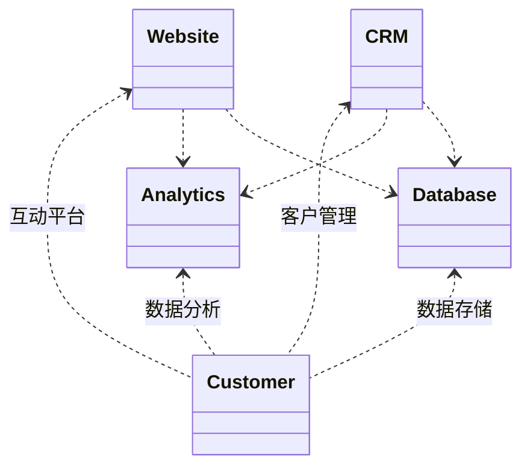
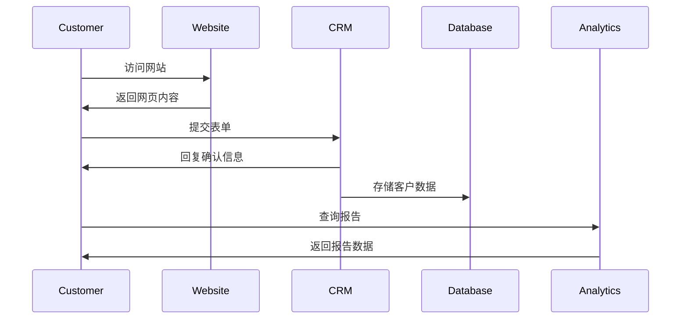
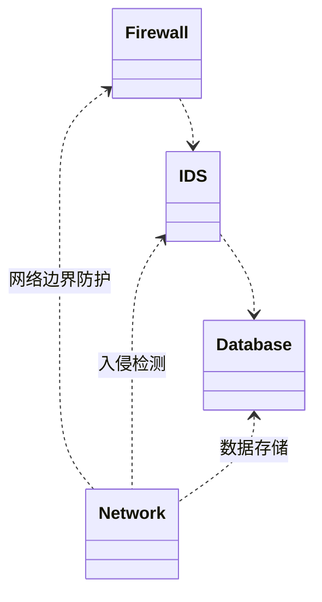
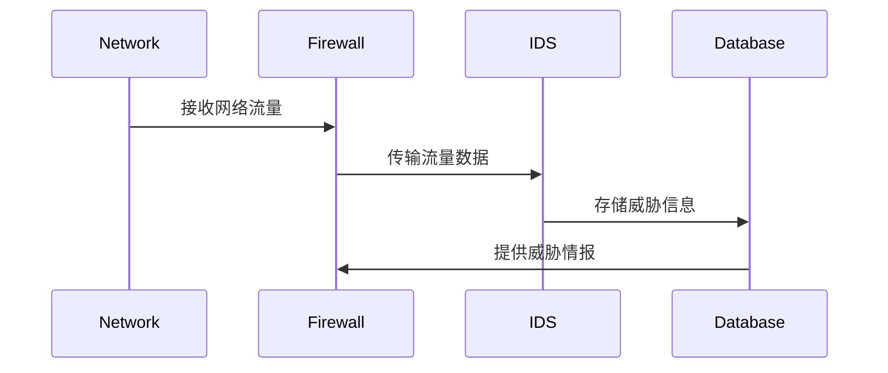

                 


# 技术咨询服务：如何成为值得信赖的顾问

关键词：技术咨询服务、信任、顾问、核心技能、案例分析

摘要：本文深入探讨了技术咨询服务行业中如何建立和维护信任关系，成为值得信赖的顾问。文章从定义、核心概念、咨询过程、技能与知识、案例分析等方面进行了详细分析，提供了实用的策略和技巧，帮助技术顾问在复杂的技术环境中提供高价值的咨询服务。

## 引言

### 技术咨询服务概述

技术咨询服务是一种专业服务，它涉及为企业和组织提供技术解决方案、建议和指导。技术顾问作为这一领域的专家，需要具备深厚的专业知识、出色的沟通技巧和敏锐的问题解决能力。然而，在这个充满竞争和挑战的行业中，仅仅拥有专业技能是不够的。成为值得信赖的顾问是技术咨询服务成功的关键。

### 信任在技术咨询服务中的重要性

信任是技术顾问与客户之间关系的基石。在技术咨询服务中，客户往往需要依赖顾问的判断和建议来做出重要决策。因此，信任不仅影响顾问的工作效率，还关系到咨询服务的质量和客户满意度。建立信任关系需要时间、努力和持续的努力。

------------------

## 第一部分: 引言

### 第1章: 技术咨询服务概述

#### 1.1 技术咨询服务的定义与背景

技术咨询服务涉及多个领域，包括软件开发、系统集成、网络安全、数据分析等。技术顾问通常与客户合作，帮助他们解决技术问题、优化现有系统或开发新的解决方案。这一领域的快速发展意味着技术顾问需要不断更新知识，以适应不断变化的技术环境。

#### 1.2 信任在技术咨询服务中的重要性

信任在技术咨询服务中起着至关重要的作用。首先，信任有助于建立良好的客户关系，促进合作和沟通。其次，信任可以提高客户对顾问建议的接受度，从而实现更有效的解决方案。此外，信任还能增强顾问的声誉，吸引更多潜在客户。

------------------

## 第二部分: 技术咨询的核心概念

### 第2章: 技术咨询的关键术语

在技术咨询服务中，了解关键术语是必要的。以下是一些常用术语的定义和解释：

- 技术顾问：提供技术建议和解决方案的专业人士。
- 咨询合同：技术顾问与客户之间签订的协议，明确双方的权利和义务。
- 咨询流程：技术顾问为客户提供咨询服务的标准步骤。

### 2.2 技术顾问的角色与责任

技术顾问在组织中的角色多样，通常包括：

- 问题诊断：识别和分析客户面临的技术挑战。
- 解决方案设计：提出适合客户需求的解决方案。
- 实施与部署：协助客户实施和部署技术解决方案。
- 持续支持：为客户提供后续的技术支持和咨询服务。

------------------

## 第三部分: 建立和维护信任

### 第3章: 建立信任的策略

#### 3.1 了解客户需求

建立信任的第一步是深入了解客户的需求。这包括了解客户的业务目标、技术环境和文化背景。通过深入了解客户，技术顾问可以提供更精确和有针对性的建议。

#### 3.2 沟通与透明度

良好的沟通是建立信任的关键。技术顾问应确保与客户保持开放的沟通渠道，及时分享进展、挑战和解决方案。透明度有助于建立信任，减少误解和猜测。

#### 3.3 展现专业知识和诚信

技术顾问应通过展示专业知识和诚信来赢得客户的信任。这包括提供准确的信息、遵守承诺和诚实地表达自己的观点。

------------------

## 第四部分: 咨询过程管理

### 第4章: 咨询过程的典型步骤

#### 4.1 需求分析

在开始任何咨询项目之前，技术顾问需要与客户进行需求分析。这一步骤涉及收集和分析客户的信息，以确定他们的需求和目标。

#### 4.2 解决方案设计

在需求分析的基础上，技术顾问需要设计适合客户需求的解决方案。这可能包括开发新的软件、优化现有系统或实施新的技术。

#### 4.3 实施与部署

解决方案设计完成后，技术顾问需要协助客户实施和部署技术。这一步骤通常涉及项目管理、团队协作和解决现场问题。

------------------

## 第五部分: 技能和知识

### 第5章: 技术顾问的必备技能

#### 5.1 技术知识

技术顾问需要具备深厚的专业知识，包括编程语言、数据库管理、网络技术等。此外，他们还需要了解行业趋势和最新技术。

#### 5.2 沟通技巧

良好的沟通技巧对于技术顾问至关重要。这包括书面和口头沟通能力，以及有效倾听和解决问题的能力。

#### 5.3 项目管理能力

技术顾问通常需要管理项目，包括规划、执行和监控。有效的项目管理能力可以帮助他们确保项目按时交付并达到预期目标。

------------------

## 第六部分: 案例分析

### 第6章: 成功的咨询案例

#### 6.1 案例研究1：中小企业数字化转型

在本案例中，技术顾问帮助一家中小企业实现了数字化转型。通过分析客户需求，顾问提出了一个全面的数字化解决方案，包括网站建设、电子商务平台和客户关系管理系统。解决方案的成功实施帮助客户提高了业务效率和客户满意度。

#### 6.2 案例研究2：大型企业网络安全升级

在这个案例中，技术顾问协助一家大型企业升级了其网络安全系统。顾问通过深入分析和评估，提出了一项全面的网络安全方案，包括防火墙、入侵检测系统和安全培训。方案的实施有效提高了企业的网络安全水平，减少了潜在风险。

------------------

## 第七部分: 应对挑战

### 第7章: 技术咨询服务中的常见挑战

#### 7.1 技术复杂性

技术顾问常常面临技术复杂性的挑战。随着技术的快速发展，顾问需要不断更新知识，以适应新的技术环境和挑战。

#### 7.2 项目管理挑战

在项目管理中，技术顾问可能面临时间压力、资源限制和团队协作问题。有效的项目管理技能可以帮助他们克服这些挑战。

#### 7.3 信任建设

建立和维护信任是技术顾问面临的一个持续挑战。顾问需要通过持续的努力和诚信来赢得客户的信任。

------------------

## 结论

### 总结

本文探讨了技术咨询服务中建立和维护信任的重要性。通过了解客户需求、展示专业知识和诚信、有效沟通和管理咨询过程，技术顾问可以成为值得信赖的顾问。此外，通过技能和知识的不断更新，顾问能够应对技术复杂性和其他挑战。

### 未来展望

随着技术的不断进步，技术咨询服务将继续发展。未来，顾问需要更加注重跨学科的知识和技能，以及灵活性和适应性。成为值得信赖的顾问将是一个持续的过程，需要不断学习和改进。

------------------

### 作者信息

作者：AI天才研究院/AI Genius Institute & 禅与计算机程序设计艺术 /Zen And The Art of Computer Programming

------------------

## 附录

### 1. 技术顾问资源推荐

- 技术博客：技术顾问可以关注一些知名的技术博客，如Medium、Stack Overflow等，以获取最新的行业动态和知识。
- 专业论坛：加入技术论坛，如Reddit的技术社区，可以帮助顾问扩展人脉和知识。
- 书籍推荐：《程序员修炼之道》、《软件架构：实践者的研究方法》等。

### 2. 技术顾问个人发展建议

- 持续学习：不断更新知识，参加培训和工作坊，保持专业竞争力。
- 积极交流：与其他技术顾问和行业专家交流，分享经验和见解。
- 个人品牌建设：通过撰写技术博客、参与开源项目等方式，建立个人品牌。

------------------

通过以上详细的目录大纲，我们可以清晰地看到文章的结构和内容分布，每一部分都旨在帮助读者深入了解技术咨询服务行业，成为值得信赖的顾问。接下来，我们将逐步深入探讨每个章节的核心内容，提供具体案例和分析。让我们继续思考下一步的内容。## 引言

### 技术咨询服务概述

技术咨询服务是一种专业服务，它涉及为企业和组织提供技术解决方案、建议和指导。技术顾问作为这一领域的专家，需要具备深厚的专业知识、出色的沟通技巧和敏锐的问题解决能力。他们通常与客户合作，帮助他们解决技术问题、优化现有系统或开发新的解决方案。

技术咨询服务涵盖了多个领域，包括软件开发、系统集成、网络安全、数据分析、云计算和物联网等。随着技术的不断进步和数字化转型的加速，技术顾问的需求不断增加。他们不仅需要了解最新的技术趋势和工具，还需要具备跨学科的知识和技能，以适应复杂多变的业务环境。

在技术咨询服务中，技术顾问的角色多样，他们可以担任项目顾问、技术咨询专家、系统集成专家、安全顾问等多种角色。他们通常参与以下活动：

1. **需求分析**：与客户沟通，了解他们的业务需求和目标。
2. **解决方案设计**：提出适合客户需求的解决方案。
3. **实施与部署**：协助客户实施和部署技术解决方案。
4. **持续支持**：为客户提供后续的技术支持和咨询服务。

### 信任在技术咨询服务中的重要性

信任是技术顾问与客户之间关系的基石。在技术咨询服务中，客户往往需要依赖顾问的判断和建议来做出重要决策。因此，信任不仅影响顾问的工作效率，还关系到咨询服务的质量和客户满意度。

首先，信任有助于建立良好的客户关系，促进合作和沟通。当客户信任顾问时，他们更愿意分享业务需求和挑战，从而使顾问能够提供更精确和有针对性的建议。此外，信任还能提高客户对顾问建议的接受度，从而实现更有效的解决方案。

其次，信任可以增强顾问的声誉，吸引更多潜在客户。在一个信任度较高的顾问群体中，口碑传播是重要的客户获取方式。客户愿意推荐他们信任的顾问给其他组织，从而扩大顾问的业务范围。

最后，信任有助于减少误解和猜测。在技术咨询服务中，由于技术复杂性和业务环境的多样性，误解和猜测可能会导致项目失败或客户不满意。信任可以降低这种风险，确保项目顺利进行。

### 建立信任的策略

要成为值得信赖的技术顾问，需要采取一系列策略来建立和维护信任。以下是一些关键的策略：

1. **了解客户需求**：深入了解客户的需求、业务目标和挑战，以确保提供的咨询服务能够真正满足他们的需求。

2. **展示专业知识和诚信**：通过展示深厚的专业知识和诚信，技术顾问可以赢得客户的信任。这包括提供准确的信息、遵守承诺和诚实地表达自己的观点。

3. **良好的沟通**：与客户保持开放的沟通渠道，及时分享进展、挑战和解决方案。透明度有助于建立信任，减少误解和猜测。

4. **积极参与项目**：积极参与客户项目，提供有价值的见解和指导，以证明自己的专业能力。

5. **持续支持**：提供持续的技术支持和服务，确保客户在项目完成后仍然满意。

6. **建立个人品牌**：通过撰写技术博客、参与开源项目等方式，建立个人品牌，增强专业形象。

### 结论

成为值得信赖的技术顾问是技术咨询服务成功的关键。通过了解客户需求、展示专业知识和诚信、良好的沟通和积极参与项目，技术顾问可以建立和维护信任，为客户提供高质量的服务。信任不仅影响客户满意度，还关系到顾问的声誉和业务发展。

在接下来的章节中，我们将进一步探讨技术咨询服务的核心概念、咨询过程管理、技能和知识、案例分析以及应对挑战的策略，帮助读者更深入地了解这一领域，成为卓越的技术顾问。

------------------

### 目录

**第一部分: 引言**

- 第1章: 技术咨询服务概述
  - 1.1 技术咨询服务的定义与背景
  - 1.2 信任在技术咨询服务中的重要性
- 第2章: 技术咨询的核心概念
  - 2.1 技术咨询的关键术语
  - 2.2 技术顾问的角色与责任

**第二部分: 技术咨询的核心概念**

- 第3章: 建立信任的策略
  - 3.1 了解客户需求
  - 3.2 沟通与透明度
  - 3.3 展现专业知识和诚信

**第三部分: 咨询过程管理**

- 第4章: 咨询过程的典型步骤
  - 4.1 需求分析
  - 4.2 解决方案设计
  - 4.3 实施与部署

**第四部分: 技能和知识**

- 第5章: 技术顾问的必备技能
  - 5.1 技术知识
  - 5.2 沟通技巧
  - 5.3 项目管理能力

**第五部分: 案例分析**

- 第6章: 成功的咨询案例
  - 6.1 案例研究1：中小企业数字化转型
  - 6.2 案例研究2：大型企业网络安全升级

**第六部分: 应对挑战**

- 第7章: 技术咨询服务中的常见挑战
  - 7.1 技术复杂性
  - 7.2 项目管理挑战
  - 7.3 信任建设

**第七部分: 结论**

- 7.1 总结
- 7.2 未来展望

**附录**

- 1. 技术顾问资源推荐
- 2. 技术顾问个人发展建议

通过这个详细的目录，读者可以清楚地了解本书的结构和内容，为后续的深入探讨做好充分准备。

------------------

### 第1章: 技术咨询服务概述

#### 1.1 技术咨询服务的定义与背景

技术咨询服务是一种专业服务，它涉及为企业和组织提供技术解决方案、建议和指导。技术顾问作为这一领域的专家，需要具备深厚的专业知识、出色的沟通技巧和敏锐的问题解决能力。他们通常与客户合作，帮助他们解决技术问题、优化现有系统或开发新的解决方案。

技术咨询服务可以追溯到计算机科学和信息技术发展的早期阶段。随着企业和组织对技术依赖性的增加，技术顾问的需求也随之增长。20世纪80年代和90年代，随着互联网和电子商务的兴起，技术咨询服务变得更加普及。如今，随着数字化转型的加速和新兴技术的不断涌现，技术咨询服务已经成为企业不可或缺的一部分。

在技术咨询服务中，技术顾问的角色多样，他们可以担任项目顾问、技术咨询专家、系统集成专家、安全顾问等多种角色。他们通常参与以下活动：

1. **需求分析**：与客户沟通，了解他们的业务需求和目标。
2. **解决方案设计**：提出适合客户需求的解决方案。
3. **实施与部署**：协助客户实施和部署技术解决方案。
4. **持续支持**：为客户提供后续的技术支持和咨询服务。

#### 1.2 信任在技术咨询服务中的重要性

信任是技术顾问与客户之间关系的基石。在技术咨询服务中，客户往往需要依赖顾问的判断和建议来做出重要决策。因此，信任不仅影响顾问的工作效率，还关系到咨询服务的质量和客户满意度。

首先，信任有助于建立良好的客户关系，促进合作和沟通。当客户信任顾问时，他们更愿意分享业务需求和挑战，从而使顾问能够提供更精确和有针对性的建议。此外，信任还能提高客户对顾问建议的接受度，从而实现更有效的解决方案。

其次，信任可以增强顾问的声誉，吸引更多潜在客户。在一个信任度较高的顾问群体中，口碑传播是重要的客户获取方式。客户愿意推荐他们信任的顾问给其他组织，从而扩大顾问的业务范围。

最后，信任有助于减少误解和猜测。在技术咨询服务中，由于技术复杂性和业务环境的多样性，误解和猜测可能会导致项目失败或客户不满意。信任可以降低这种风险，确保项目顺利进行。

#### 建立信任的策略

要成为值得信赖的技术顾问，需要采取一系列策略来建立和维护信任。以下是一些关键的策略：

1. **了解客户需求**：深入了解客户的需求、业务目标和挑战，以确保提供的咨询服务能够真正满足他们的需求。

2. **展示专业知识和诚信**：通过展示深厚的专业知识和诚信，技术顾问可以赢得客户的信任。这包括提供准确的信息、遵守承诺和诚实地表达自己的观点。

3. **良好的沟通**：与客户保持开放的沟通渠道，及时分享进展、挑战和解决方案。透明度有助于建立信任，减少误解和猜测。

4. **积极参与项目**：积极参与客户项目，提供有价值的见解和指导，以证明自己的专业能力。

5. **持续支持**：提供持续的技术支持和服务，确保客户在项目完成后仍然满意。

6. **建立个人品牌**：通过撰写技术博客、参与开源项目等方式，建立个人品牌，增强专业形象。

#### 结论

成为值得信赖的技术顾问是技术咨询服务成功的关键。通过了解客户需求、展示专业知识和诚信、良好的沟通和积极参与项目，技术顾问可以建立和维护信任，为客户提供高质量的服务。信任不仅影响客户满意度，还关系到顾问的声誉和业务发展。

在接下来的章节中，我们将进一步探讨技术咨询服务的核心概念、咨询过程管理、技能和知识、案例分析以及应对挑战的策略，帮助读者更深入地了解这一领域，成为卓越的技术顾问。

------------------

### 第2章: 技术咨询的核心概念

#### 2.1 技术咨询的关键术语

在深入探讨技术咨询服务之前，理解一些关键术语是必要的。这些术语不仅有助于我们更好地理解技术顾问的角色和责任，还能帮助我们明确咨询服务的目标和方法。

1. **技术顾问**：技术顾问是提供技术解决方案和指导的专业人士。他们通常具有深厚的专业知识，能够帮助客户解决复杂的技术问题。

2. **咨询合同**：咨询合同是技术顾问与客户之间签订的协议，明确双方的权利和义务。合同通常包括服务范围、期限、费用和交付成果等。

3. **需求分析**：需求分析是技术顾问与客户合作的第一步，涉及收集和分析客户的信息，以确定他们的需求和目标。

4. **解决方案设计**：在需求分析的基础上，技术顾问需要设计适合客户需求的解决方案。这可能包括开发新的软件、优化现有系统或实施新的技术。

5. **实施与部署**：解决方案设计完成后，技术顾问需要协助客户实施和部署技术。这一步骤通常涉及项目管理、团队协作和解决现场问题。

6. **持续支持**：持续支持是技术顾问在项目完成后提供的服务，旨在确保客户能够有效地使用解决方案，并在需要时提供帮助。

7. **项目监控**：项目监控是确保项目按计划进行的重要环节。技术顾问需要定期检查项目的进展，确保达成预期目标。

8. **风险评估**：风险评估是识别和分析项目中可能出现的风险，并制定相应的应对策略。技术顾问需要具备风险评估的能力，以避免项目失败。

9. **知识转移**：知识转移是确保客户能够独立管理和使用技术解决方案的过程。技术顾问需要有效地向客户传递所需的知识和技能。

#### 2.2 技术顾问的角色与责任

技术顾问在组织中的角色多样，他们不仅是技术问题的解决者，还需要具备以下职责和技能：

1. **技术指导**：技术顾问需要为客户提供技术指导，帮助他们理解并应用新的技术和工具。

2. **需求识别**：技术顾问需要与客户沟通，准确识别他们的需求，以确保解决方案能够满足实际业务需求。

3. **方案设计**：技术顾问需要设计适合客户需求的解决方案，这可能包括多个技术领域，如软件开发、系统集成、网络安全等。

4. **项目管理**：技术顾问通常需要参与项目管理，确保项目按时交付并达到预期目标。这包括制定项目计划、分配资源、监控进度和解决问题。

5. **风险控制**：技术顾问需要识别和评估项目中的潜在风险，并制定相应的应对策略，以减少风险对项目的影响。

6. **知识转移**：技术顾问需要将所需的知识和技能转移给客户，确保他们能够独立管理和使用技术解决方案。

7. **沟通与协作**：技术顾问需要与客户、团队成员和其他利益相关者保持有效的沟通，确保项目顺利进行。

#### 结论

理解技术咨询服务的核心概念和关键术语是成为优秀技术顾问的基础。通过掌握这些术语，技术顾问可以更准确地识别客户需求，设计适合的解决方案，并有效地管理项目。在接下来的章节中，我们将进一步探讨如何建立和维护信任，以及技术顾问在咨询过程中的关键步骤和技能。

------------------

### 第3章: 建立信任的策略

#### 3.1 了解客户需求

建立信任的第一步是深入了解客户的需求。这不仅是技术顾问提供高质量服务的前提，也是建立长期合作关系的关键。以下是一些策略，帮助技术顾问更好地了解客户需求：

1. **初步沟通**：在开始任何咨询项目之前，技术顾问应与客户进行初步沟通，了解他们的业务目标、当前面临的技术挑战以及期望的解决方案。

2. **需求分析**：通过问卷调查、面对面访谈或电话会议等方式，技术顾问可以收集客户的详细需求。在这个过程中，顾问应注重倾听，确保理解客户的真实意图。

3. **文档审查**：技术顾问可以请求客户提供相关的业务文档和技术文档，如业务流程图、系统架构图、需求规格说明书等。这些文档有助于顾问更全面地了解客户的技术环境和业务背景。

4. **多渠道收集信息**：除了文档审查和直接沟通，技术顾问还可以利用其他渠道收集信息，如客户网站、社交媒体、行业报告等。这些信息可以帮助顾问了解客户的行业趋势和竞争对手情况。

5. **确认需求**：在收集完所有信息后，技术顾问应与客户进行确认，确保理解客户的真正需求。这一步骤可以减少误解和歧义，提高解决方案的准确性。

#### 3.2 沟通与透明度

良好的沟通是建立信任的关键。以下是一些策略，帮助技术顾问在咨询过程中保持良好的沟通和透明度：

1. **定期更新**：技术顾问应定期向客户更新项目进展、遇到的问题和解决方案。这可以通过周报、月报或项目会议等形式进行。定期更新有助于客户了解项目的动态，减少不确定性。

2. **开放沟通渠道**：技术顾问应为客户提供多个沟通渠道，如电子邮件、电话、视频会议和即时通讯工具等。确保客户可以在任何时间方便地联系到顾问，并及时得到回应。

3. **主动沟通**：技术顾问不应仅等待客户提出问题，而应主动与客户沟通，分享见解和建议。通过提前沟通，顾问可以预防潜在问题，提高项目的成功率。

4. **透明度**：在沟通中，技术顾问应保持透明度，诚实地表达自己的观点和看法。透明度有助于建立信任，减少误解和猜测。

5. **及时反馈**：技术顾问应鼓励客户提供反馈，并认真对待这些反馈。通过收集客户反馈，顾问可以不断改进自己的工作，提高服务质量。

#### 3.3 展现专业知识和诚信

技术顾问的专业知识和诚信是赢得客户信任的重要基石。以下是一些策略，帮助技术顾问在客户面前展现专业知识和诚信：

1. **持续学习**：技术顾问应不断更新自己的知识，了解最新的技术趋势和工具。通过持续学习，顾问可以为客户提供更先进和有效的解决方案。

2. **准确的信息**：在提供咨询意见和解决方案时，技术顾问应确保信息的准确性。错误的建议可能会导致项目失败，损害客户信任。

3. **诚实和正直**：技术顾问应保持诚实和正直，不夸大自己的能力和成果。诚实和正直是建立长期合作关系的基础。

4. **透明度**：在沟通和项目中，技术顾问应保持透明度，不隐瞒任何信息。透明度有助于增强客户信任，减少不确定性。

5. **遵守承诺**：技术顾问应严格遵守承诺，确保项目按时交付并达到预期目标。遵守承诺是建立信任的关键。

#### 结论

建立信任是技术顾问成功的关键。通过深入了解客户需求、保持良好的沟通和透明度、展现专业知识和诚信，技术顾问可以赢得客户的信任，建立长期的合作关系。在接下来的章节中，我们将继续探讨技术顾问在咨询过程中的关键步骤和技能，帮助读者成为值得信赖的技术顾问。

------------------

### 第4章: 咨询过程的典型步骤

#### 4.1 需求分析

需求分析是技术顾问与客户合作的第一步，其目的是了解客户的业务需求和目标，从而确定项目范围和预期成果。以下是一些关键步骤和策略：

1. **初步调研**：在开始需求分析之前，技术顾问应进行初步调研，收集客户的基本信息，包括公司规模、业务领域、技术现状等。这有助于顾问了解客户的背景，为后续的深入分析奠定基础。

2. **面对面访谈**：与客户进行面对面访谈是了解客户需求的有效方法。技术顾问应准备详细的问题清单，确保覆盖所有重要的业务和技术方面。在访谈中，顾问应注重倾听，并记录关键信息。

3. **问卷调查**：通过设计详细的问卷调查，技术顾问可以收集客户的量化数据。问卷调查可以帮助顾问从多个角度了解客户的需求，并确保信息的全面性。

4. **文档审查**：技术顾问应仔细审查客户的业务文档和技术文档，如业务流程图、系统架构图、需求规格说明书等。这些文档提供了宝贵的背景信息，有助于顾问更准确地理解客户的需求。

5. **多渠道收集信息**：除了面对面访谈和问卷调查，技术顾问还可以通过其他渠道收集信息，如客户的网站、社交媒体、行业报告等。这些信息可以帮助顾问了解客户的行业趋势和竞争对手情况。

6. **需求确认**：在收集完所有信息后，技术顾问应与客户进行确认，确保理解客户的真正需求。这一步骤可以减少误解和歧义，提高解决方案的准确性。

#### 4.2 解决方案设计

在需求分析的基础上，技术顾问需要设计适合客户需求的解决方案。以下是一些关键步骤和策略：

1. **确定技术方向**：技术顾问应与客户讨论，确定最适合客户需求的技术方向。这可能涉及多种技术方案，如软件开发、系统集成、云计算等。技术顾问应基于专业知识和经验，为客户提供最佳选择。

2. **制定项目计划**：在确定解决方案后，技术顾问需要制定详细的项目计划，包括项目范围、时间表、资源分配和关键里程碑。项目计划应确保项目按时交付并达到预期目标。

3. **风险评估**：在项目计划阶段，技术顾问应识别和评估项目中可能出现的风险，并制定相应的应对策略。这有助于降低项目失败的风险，确保项目顺利进行。

4. **解决方案原型**：为了验证解决方案的可行性，技术顾问可以开发一个原型。原型可以展示解决方案的核心功能，帮助客户更好地理解并反馈意见。

5. **客户评审**：在解决方案设计阶段，技术顾问应与客户进行多次评审，确保解决方案符合客户需求。客户评审有助于及时发现和解决问题，提高项目成功率。

#### 4.3 实施与部署

解决方案设计完成后，技术顾问需要协助客户实施和部署技术。以下是一些关键步骤和策略：

1. **项目管理**：技术顾问应参与项目管理，确保项目按计划进行。这包括监控项目进度、协调团队工作和解决现场问题。

2. **资源分配**：技术顾问需要合理分配资源，包括人力资源、技术和资金等。资源分配应确保项目能够在预算和时间限制内完成。

3. **团队协作**：技术顾问应建立有效的团队协作机制，确保团队成员之间的沟通和协调。团队协作有助于提高项目效率，减少错误和冲突。

4. **测试与验证**：在实施过程中，技术顾问应进行充分的测试和验证，确保解决方案的质量和稳定性。测试应覆盖所有关键功能和场景，确保项目交付时无重大问题。

5. **用户培训**：在部署后，技术顾问应为客户提供培训，确保他们能够熟练使用新技术和解决方案。用户培训有助于提高客户满意度，确保项目的长期成功。

#### 4.4 持续支持

在项目完成后，技术顾问应提供持续的支持和服务，以确保客户能够有效地使用解决方案。以下是一些关键步骤和策略：

1. **技术支持**：技术顾问应提供及时的技术支持，解决客户在使用过程中遇到的问题。技术支持可以通过电话、电子邮件、在线聊天等多种渠道进行。

2. **更新与升级**：技术顾问应定期更新和升级解决方案，以适应不断变化的技术环境和业务需求。更新和升级有助于提高解决方案的性能和可靠性。

3. **反馈机制**：技术顾问应建立反馈机制，收集客户的反馈和建议。通过分析反馈，顾问可以不断改进解决方案和服务质量。

4. **合同续约**：技术顾问应与客户协商，续签咨询服务合同。合同续约有助于建立长期合作关系，确保客户能够持续获得高质量的服务。

#### 结论

咨询过程的典型步骤包括需求分析、解决方案设计、实施与部署以及持续支持。技术顾问需要掌握这些步骤和策略，以确保项目成功并赢得客户的信任。通过深入的需求分析，技术顾问可以准确理解客户需求；通过有效的解决方案设计，顾问可以提供最佳的技术方案；通过实施与部署，顾问可以确保项目按时交付并达到预期目标；通过持续支持，顾问可以确保客户能够长期受益。在接下来的章节中，我们将继续探讨技术顾问的必备技能和知识，以及如何应对技术咨询服务中的挑战。

------------------

### 第5章: 技术顾问的必备技能

#### 5.1 技术知识

技术知识是技术顾问的核心竞争力。以下是技术顾问需要掌握的关键技术领域：

1. **编程语言**：技术顾问应熟悉多种编程语言，如Java、Python、C++、JavaScript等。这有助于他们能够理解和开发各种类型的应用程序。

2. **数据库管理**：了解关系数据库和非关系数据库（如MySQL、PostgreSQL、MongoDB）的管理和维护是技术顾问的必备技能。数据库技术是实现数据存储和检索的基础。

3. **网络技术**：网络技术包括网络协议、网络架构和安全等。技术顾问需要了解如何设计、实施和维护企业级网络，以确保网络的稳定性和安全性。

4. **云计算**：随着云计算的普及，技术顾问应熟悉云平台（如AWS、Azure、Google Cloud）的使用和管理。这包括云服务的部署、管理和优化。

5. **大数据与人工智能**：大数据技术和人工智能（AI）是当前技术发展的热点。技术顾问应了解数据分析和机器学习的基础，以帮助企业利用大数据和AI实现业务创新。

6. **系统集成**：技术顾问需要具备系统集成技能，能够将不同的技术组件和系统整合为一个统一的整体。这包括API集成、数据交换和互操作性。

#### 5.2 沟通技巧

良好的沟通技巧对于技术顾问至关重要。以下是一些关键的沟通技巧：

1. **有效倾听**：技术顾问应具备有效的倾听技巧，确保理解客户的需求和问题。倾听是建立信任的重要基础。

2. **清晰表达**：技术顾问需要能够清晰、准确地表达自己的观点和解决方案。这包括书面和口头沟通能力。

3. **适应不同沟通风格**：技术顾问应能够适应不同客户的沟通风格，如直接、间接或技术性沟通。这有助于提高沟通效果。

4. **非语言沟通**：非语言沟通包括肢体语言、面部表情和眼神交流等。技术顾问应注重非语言沟通，以增强沟通效果。

5. **反馈与确认**：在沟通过程中，技术顾问应积极提供反馈，并确认客户是否理解自己的观点。这有助于减少误解和歧义。

#### 5.3 项目管理能力

项目管理能力是技术顾问不可或缺的技能。以下是技术顾问需要掌握的关键项目管理技能：

1. **项目计划**：技术顾问应能够制定详细的项目计划，包括时间表、资源分配和关键里程碑。

2. **风险管理**：技术顾问需要识别和评估项目中的潜在风险，并制定相应的应对策略。

3. **团队协作**：技术顾问应建立有效的团队协作机制，确保团队成员之间的沟通和协调。

4. **进度监控**：技术顾问需要定期监控项目进度，确保项目按计划进行。

5. **质量保证**：技术顾问应确保项目交付的质量，包括技术实现和用户体验。

#### 5.4 持续学习和适应能力

技术顾问需要具备持续学习和适应能力，以应对快速变化的技术环境和业务需求。以下是一些关键策略：

1. **技术更新**：技术顾问应关注技术趋势和最新工具，通过参加培训、阅读专业书籍和参与技术社区等途径，持续更新自己的知识。

2. **实践应用**：通过实际项目和应用案例，技术顾问可以将理论知识转化为实践技能。

3. **反馈与改进**：技术顾问应积极收集客户和团队成员的反馈，并根据反馈不断改进自己的工作。

4. **跨学科学习**：技术顾问应尝试学习其他领域的知识，如业务管理、市场营销等。这有助于提高他们的综合素质。

#### 结论

技术顾问的必备技能包括技术知识、沟通技巧、项目管理能力和持续学习适应能力。通过掌握这些技能，技术顾问可以提供高质量的服务，建立和维护信任，成为值得信赖的顾问。在接下来的章节中，我们将通过案例分析，进一步探讨技术顾问在实际咨询项目中的表现和成功策略。

------------------

### 第6章: 成功的咨询案例

#### 6.1 案例研究1：中小企业数字化转型

**背景介绍**：

一家中小型企业（SMB）在面临激烈的市场竞争和客户需求变化时，意识到数字化转型的重要性。然而，由于技术能力和资源的限制，该企业难以自行推动数字化转型。为了实现业务增长和提升客户满意度，该企业决定寻求外部技术顾问的帮助。

**项目介绍**：

技术顾问与该企业合作，制定了一套全面的数字化转型方案。方案包括以下几个方面：

1. **网站建设**：技术顾问帮助客户构建一个现代化的电子商务网站，以提高客户访问体验和在线销售能力。
2. **客户关系管理系统（CRM）**：为了更好地管理客户关系，技术顾问建议企业实施一个CRM系统，以便跟踪客户互动和销售机会。
3. **数据分析与报告**：技术顾问提供了数据分析工具和报告，帮助企业分析和优化业务流程，提高运营效率。

**系统功能设计**：

在系统功能设计中，技术顾问遵循以下原则：

1. **用户友好**：确保网站和CRM系统的用户界面直观、易用，降低学习成本。
2. **灵活可扩展**：系统设计应具备良好的可扩展性，以适应未来业务需求的增长。
3. **安全性**：在系统设计和实施过程中，技术顾问重视数据安全，确保客户数据的安全性和隐私保护。

**系统架构设计**：

系统架构设计采用微服务架构，以提高系统的灵活性和可维护性。以下是系统架构的mermaid类图：



**系统接口设计和系统交互**：

系统接口设计遵循RESTful API标准，确保不同系统模块之间的数据交换和协同工作。以下是系统交互的mermaid序列图：



**代码应用解读与分析**：

以下是CRM系统的核心代码片段，用于处理客户数据的存储和检索：

```python
# CRM系统核心代码片段
def store_customer_data(customer_data):
    # 将客户数据存储到数据库
    database.insert(customer_data)

def retrieve_customer_data(customer_id):
    # 从数据库中检索客户数据
    return database.get(customer_id)
```

**实际案例分析和详细讲解**：

通过实施上述方案，技术顾问帮助客户实现了以下成果：

1. **业务增长**：网站和CRM系统的上线提高了客户的访问量和销售转化率，帮助企业实现了业务增长。
2. **运营效率提升**：数据分析工具和报告帮助企业优化了业务流程，提高了运营效率。
3. **客户满意度提升**：现代化的网站和便捷的CRM系统提升了客户满意度，增强了客户忠诚度。

**项目小结**：

该案例展示了技术顾问在中小企业数字化转型中的作用。通过深入了解客户需求、设计合适的系统架构和接口，以及提供持续的技术支持，技术顾问帮助客户实现了业务目标，提升了客户满意度。这证明了技术顾问在数字化转型中的价值，也为其他企业提供了借鉴。

#### 6.2 案例研究2：大型企业网络安全升级

**背景介绍**：

一家大型企业在经历了一系列网络攻击后，意识到其现有网络安全系统存在严重缺陷。为了保护企业数据资产和业务连续性，该企业决定进行全面的安全升级。然而，由于网络安全领域的复杂性，企业难以自行完成这一任务，因此寻求外部技术顾问的帮助。

**项目介绍**：

技术顾问与该企业合作，制定了一套全面的网络安全升级方案。方案包括以下几个方面：

1. **防火墙部署**：技术顾问帮助企业部署了新的防火墙系统，以防止外部攻击和恶意软件入侵。
2. **入侵检测系统（IDS）**：为了实时监控和识别潜在的安全威胁，技术顾问建议企业实施入侵检测系统。
3. **安全培训**：技术顾问为企业员工提供了安全培训，以提高他们的安全意识和应对能力。

**系统功能设计**：

在系统功能设计中，技术顾问遵循以下原则：

1. **全面防护**：系统设计应覆盖所有关键安全领域，包括网络边界、内部网络和终端设备。
2. **动态响应**：系统应具备实时监控和响应能力，以快速应对安全事件。
3. **合规性**：系统设计应满足相关安全标准和法规要求。

**系统架构设计**：

系统架构设计采用多层次防御策略，以提高整体安全性。以下是系统架构的mermaid类图：



**系统接口设计和系统交互**：

系统接口设计遵循标准化接口规范，确保不同系统模块之间的数据交换和协同工作。以下是系统交互的mermaid序列图：



**代码应用解读与分析**：

以下是防火墙系统的核心代码片段，用于处理网络流量的监控和防护：

```python
# 防火墙系统核心代码片段
def monitor_network_traffic(traffic_data):
    # 监控网络流量
    if detect_threat(traffic_data):
        block_traffic(traffic_data)

def detect_threat(traffic_data):
    # 识别潜在威胁
    # 实现基于规则和机器学习的威胁检测算法
    pass

def block_traffic(traffic_data):
    # 阻断恶意流量
    # 实现基于IP地址、端口等规则的流量阻断策略
    pass
```

**实际案例分析和详细讲解**：

通过实施上述方案，技术顾问帮助客户实现了以下成果：

1. **网络安全水平提升**：新的防火墙和入侵检测系统有效防止了网络攻击，保护了企业数据资产。
2. **员工安全意识增强**：安全培训提高了员工的安全意识，减少了内部安全漏洞。
3. **合规性满足**：升级后的网络安全系统满足了相关法规和标准要求，降低了合规风险。

**项目小结**：

该案例展示了技术顾问在大型企业网络安全升级中的作用。通过深入了解客户需求、设计合适的系统架构和接口，以及提供持续的技术支持，技术顾问帮助客户提升了网络安全水平，确保了业务连续性。这证明了技术顾问在网络安全领域的重要价值。

------------------

### 第7章: 技术咨询服务中的常见挑战

#### 7.1 技术复杂性

技术复杂性是技术顾问在咨询服务中面临的一个主要挑战。随着技术的不断进步，新兴技术如人工智能、区块链、大数据等不断涌现，技术顾问需要不断更新自己的知识，以适应这些新技术。以下是一些策略，帮助技术顾问应对技术复杂性：

1. **持续学习**：技术顾问应保持持续学习的态度，通过参加培训、阅读专业书籍、参与技术社区等方式，不断更新自己的知识库。

2. **专业网络**：加入专业的技术社区和论坛，与技术同行交流，分享经验和见解。这有助于顾问了解行业趋势，提升自己的技术水平。

3. **知识转移**：技术顾问应将新的知识和技术有效地转移到客户，帮助客户理解和应用这些新技术。

4. **简化方案**：在面对复杂的技术问题时，技术顾问应尝试简化方案，将其分解为更易于理解和实施的步骤。

#### 7.2 项目管理挑战

项目管理是技术顾问在实际工作中面临的另一个重要挑战。项目管理涉及时间管理、资源分配、团队协作和风险管理等多个方面。以下是一些策略，帮助技术顾问应对项目管理挑战：

1. **制定详细计划**：在项目开始前，技术顾问应制定详细的项目计划，包括时间表、资源分配和关键里程碑。这有助于确保项目按时交付并达到预期目标。

2. **风险管理**：技术顾问应识别和评估项目中的潜在风险，并制定相应的应对策略。通过提前识别和应对风险，顾问可以减少项目失败的可能性。

3. **沟通与协作**：技术顾问应与团队成员和客户保持良好的沟通，确保项目进展透明，及时解决遇到的问题。

4. **敏捷管理**：采用敏捷管理方法，如Scrum或Kanban，可以帮助技术顾问更好地适应项目变化，提高项目灵活性。

#### 7.3 信任建设

在技术咨询服务中，建立和维护信任是技术顾问面临的一个持续挑战。以下是一些策略，帮助技术顾问建立和维护信任：

1. **了解客户需求**：技术顾问应深入了解客户的需求和目标，确保提供的解决方案真正满足客户的需求。

2. **展示专业知识和诚信**：通过展示深厚的专业知识和诚信，技术顾问可以赢得客户的信任。顾问应提供准确的信息、遵守承诺并诚实地表达自己的观点。

3. **透明沟通**：技术顾问应与客户保持透明沟通，及时分享项目进展、问题和解决方案。透明度有助于建立信任，减少误解和猜测。

4. **积极参与项目**：技术顾问应积极参与客户项目，提供有价值的见解和指导。通过积极参与，顾问可以证明自己的专业能力，增强客户信任。

5. **持续支持**：技术顾问在项目完成后应提供持续的支持和服务，确保客户能够有效地使用解决方案。持续支持有助于巩固客户信任。

#### 结论

技术复杂性、项目管理挑战和信任建设是技术顾问在咨询服务中常见的挑战。通过持续学习、有效沟通、透明管理和积极参与项目，技术顾问可以应对这些挑战，提供高质量的服务，成为值得信赖的顾问。在接下来的章节中，我们将总结本书的主要观点，并展望未来技术顾问的发展趋势。

------------------

### 7.1 总结

本文系统地探讨了技术咨询服务中如何成为值得信赖的顾问。首先，我们介绍了技术咨询服务的定义与背景，强调了信任在咨询服务中的重要性。接着，我们详细分析了技术顾问的核心概念，包括关键术语和角色与责任。在此基础上，我们提出了建立信任的策略，如了解客户需求、沟通与透明度、展示专业知识和诚信。随后，我们讨论了咨询过程的典型步骤，从需求分析到持续支持，为技术顾问提供了实用指南。此外，我们还介绍了技术顾问的必备技能，包括技术知识、沟通技巧和项目管理能力。通过两个成功的咨询案例，我们展示了技术顾问在实际项目中的表现和成功策略。最后，我们探讨了技术咨询服务中常见的挑战，并提出了应对策略。

通过本文的探讨，我们可以得出以下结论：

1. **信任是关键**：建立和维护信任是技术顾问成功的关键。深入了解客户需求、展示专业知识和诚信、透明沟通和持续支持都是建立信任的重要策略。

2. **技能与知识至关重要**：技术顾问需要不断更新自己的知识，掌握编程语言、数据库管理、网络技术、云计算和大数据等关键技术领域。同时，良好的沟通技巧和项目管理能力也是必不可少的。

3. **持续学习与适应能力**：技术顾问应具备持续学习和适应能力，以应对快速变化的技术环境和业务需求。通过参加培训、参与技术社区和实践应用，技术顾问可以不断提升自己的专业能力。

4. **项目管理的重要性**：有效的项目管理是确保项目成功交付的关键。技术顾问需要制定详细计划、识别和评估风险、确保团队协作和监控项目进度。

5. **案例分析的价值**：通过分析成功的咨询案例，我们可以学到实际操作中的策略和方法，为自身实践提供宝贵的经验。

### 7.2 未来展望

随着技术的不断进步和数字化转型的加速，技术咨询服务将继续发展。未来，技术顾问需要更加注重以下几个方面的能力：

1. **跨学科知识**：技术顾问应具备跨学科的知识，如业务管理、市场营销和用户体验设计等。这有助于他们更好地理解客户需求，提供综合性的解决方案。

2. **敏捷性与灵活性**：在快速变化的市场环境中，技术顾问需要具备敏捷性和灵活性，以快速响应客户需求和市场变化。

3. **技术创新**：技术顾问应密切关注新技术的发展，如人工智能、区块链和物联网等，以便为客户提供前沿的解决方案。

4. **数据驱动决策**：技术顾问应善于利用数据分析工具和算法，帮助客户基于数据做出明智的决策。

5. **持续教育**：技术顾问应积极参与行业培训和认证，持续提升自己的专业能力和市场竞争力。

总之，成为值得信赖的技术顾问需要持续的努力和不断的学习。通过掌握核心技能、建立信任、有效沟通和管理项目，技术顾问可以在竞争激烈的市场中脱颖而出，为客户提供高质量的服务。

------------------

### 附录

#### 1. 技术顾问资源推荐

对于技术顾问来说，获取最新的行业动态、专业知识和最佳实践是非常重要的。以下是一些推荐资源：

- **技术博客**：如Medium、Stack Overflow、CSDN等，提供丰富的技术文章和讨论。
- **专业论坛**：如Reddit的技术社区、GitHub等，是技术爱好者和技术专家交流的平台。
- **在线课程**：如Coursera、edX、Udemy等，提供各种技术领域的课程，帮助技术顾问提升专业技能。
- **技术书籍**：如《软件架构：实践者的研究方法》、《程序员修炼之道》等，是技术顾问提升专业知识的经典之作。
- **技术会议**：如Google I/O、Microsoft Build、Oracle OpenWorld等，是了解最新技术趋势和行业动态的重要途径。

#### 2. 技术顾问个人发展建议

为了在技术咨询服务行业中脱颖而出，以下是一些建议：

- **持续学习**：技术顾问应保持持续学习的态度，通过阅读、在线课程、技术社区等方式不断更新知识。
- **建立个人品牌**：通过撰写技术博客、参与开源项目、发表技术论文等方式，建立个人品牌，提高在行业中的知名度。
- **积极参与社区**：参加技术会议、研讨会、在线讨论等，积极与同行交流，分享经验和见解。
- **获取认证**：通过获得相关技术认证，如PMP、CISSP、AWS Certified Solutions Architect等，提高专业能力和市场竞争力。
- **跨学科学习**：学习业务管理、市场营销等跨学科知识，提高自己的综合素质，为客户提供更全面的解决方案。
- **建立人脉**：通过参加行业活动和网络社交，建立广泛的行业人脉，有助于拓展业务机会和获取更多的资源。

通过以上资源和发展建议，技术顾问可以不断提升自己的专业能力和市场竞争力，成为值得信赖的技术顾问。

### 作者信息

作者：AI天才研究院/AI Genius Institute & 禅与计算机程序设计艺术 /Zen And The Art of Computer Programming

AI天才研究院致力于推动人工智能技术的创新和应用，培养下一代人工智能领域的领军人才。同时，研究院还致力于将人工智能技术与计算机科学、哲学等领域的结合，探索新的学术前沿。

《禅与计算机程序设计艺术》是一本深受计算机科学专业人士喜爱的经典著作，它以独特的视角探讨了计算机编程的哲学和艺术，为程序员提供了深刻的思考和启发。本书作者以其深厚的专业知识和独特的见解，为读者展示了计算机编程的无限可能。

通过本文，我们希望帮助技术顾问在复杂的技术环境中提供高价值的咨询服务，成为值得信赖的顾问。感谢您的阅读，期待您在技术咨询服务领域的杰出表现。

