                 

### 技术团队文化概述

#### 1.1 技术团队文化的定义

**核心概念原理：**

技术团队文化是指在一个技术团队内部形成的、共同遵守的价值观、行为规范和工作方式。它反映了团队成员对技术的热爱和追求，以及在解决技术问题时所体现的创新精神、协作态度和共同目标。技术团队文化的形成是一个长期的过程，是在团队成员的共同实践中逐步培育和积累起来的。

**概念属性特征对比表格：**

| 特征                 | 传统企业文化                | 技术团队文化                |
|----------------------|-----------------------------|-----------------------------|
| 专业性               | 关注产品和服务整体质量      | 关注技术细节和解决方案的优化 |
| 创新性               | 稳定性和持续性              | 创新思维和技术突破          |
| 协作性               | 基于分工和职能的协作        | 高度依赖团队协作和技术共享   |
| 适应性               | 适应市场变化                | 快速适应技术发展趋势        |

#### 1.2 技术团队文化的特征

**特征一：专业性**

技术团队文化的专业性体现在团队成员对技术领域的深入理解和熟练掌握。团队成员通常具备较高的技术水平，能够快速应对技术挑战，并提出有效的解决方案。他们关注技术细节和优化，追求技术上的卓越。

**特征二：创新性**

创新性是技术团队文化的核心特征之一。团队成员鼓励创新思维，积极探索新技术和新方法。这种文化氛围激发了团队成员的创造力和问题解决能力，有助于推动技术进步和业务发展。

**特征三：协作性**

技术团队文化强调团队协作和知识共享。团队成员之间紧密合作，相互支持，共同解决技术难题。他们通过协作实现资源共享，提高工作效率，确保项目顺利进行。

**特征四：适应性**

技术团队文化具有强烈的适应性，能够快速适应技术发展趋势和市场需求变化。团队成员关注行业动态，具备较强的学习能力和应变能力，能够迅速调整方向，实现技术和业务的协同发展。

#### 1.3 技术团队文化的功能

**功能一：提升团队凝聚力**

技术团队文化有助于增强团队成员之间的凝聚力。共同价值观和行为规范使团队成员在目标上保持一致，增强了团队的团结和协作能力，提高了团队的整体执行力。

**功能二：促进知识共享与创新**

技术团队文化鼓励知识共享，使团队成员能够共同学习和进步。这种文化氛围激发了创新思维，推动了技术的不断突破和业务的发展。

**功能三：提高团队工作效率**

良好的技术团队文化能够提高团队的工作效率。团队成员之间的协作、知识共享和创新能力有助于快速解决技术难题，确保项目按时完成。

**功能四：增强团队竞争力**

技术团队文化有助于增强团队在市场竞争中的竞争力。团队成员的专业性、创新性和协作性使他们能够更好地应对市场挑战，保持技术和业务的领先地位。

### 总结

技术团队文化是一个团队在长期技术研究和开发过程中逐步形成的共同价值观、行为规范和工作方式。它具有专业性、创新性、协作性和适应性等特征，能够提升团队凝聚力、促进知识共享与创新、提高团队工作效率和增强团队竞争力。了解和培育技术团队文化对于团队的发展具有重要意义。

**Mermaid 流程图：**

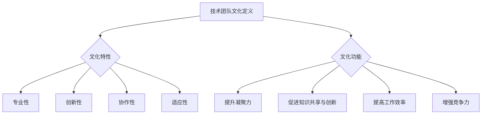

## 第二部分：技术团队文化建设的方法

### 第2章：制定团队文化规划

#### 2.1 分析团队现状

**核心概念原理：**

制定团队文化规划的第一步是分析团队现状。这包括对团队成员的技术能力、工作态度、团队氛围、项目管理等方面进行全面了解。通过分析团队现状，可以找出团队文化的优势与劣势，为后续的团队文化规划提供依据。

**概念属性特征对比表格：**

| 特征                 | 现状分析               | 问题诊断               |
|----------------------|-----------------------|-----------------------|
| 技术能力             | 成员技术水平分析       | 技术短板识别           |
| 工作态度             | 工作积极性与责任心评估   | 消极行为与心态分析     |
| 团队氛围             | 团队合作与沟通情况      | 存在的矛盾与冲突       |
| 项目管理             | 项目进展与效率评估      | 项目瓶颈与改进方向     |

**ER实体关系图架构的 Mermaid 流�程图：**

```mermaid
graph TD
    A{团队现状分析} --> B[技术能力]
    B --> C{技术水平分析}
    B --> D{技术短板识别}
    A --> E[工作态度]
    E --> F{工作积极性评估}
    E --> G{责任心评估}
    E --> H{消极行为分析}
    A --> I[团队氛围]
    I --> J[团队合作分析}
    I --> K{沟通情况分析}
    I --> L{矛盾与冲突分析}
    A --> M[项目管理]
    M --> N{项目进展评估}
    M --> O{效率评估}
    M --> P{瓶颈与改进方向分析}
```

#### 2.2 明确团队愿景与目标

**核心概念原理：**

在分析团队现状的基础上，明确团队愿景与目标是制定团队文化规划的关键。团队愿景是团队长期追求的理想状态，而团队目标是实现愿景的具体步骤。通过明确愿景与目标，可以引导团队成员共同奋斗，形成强大的团队合力。

**概念属性特征对比表格：**

| 特征                 | 团队愿景               | 团队目标               |
|----------------------|-----------------------|-----------------------|
| 长期目标             | 描述团队的理想状态     | 短期内要实现的具体成果 |
| 指导意义             | 明确团队方向和使命     | 确保团队持续发展       |
| 可量化性             | 模糊描述               | 明确具体的指标和数据   |

**Mermaid 流程图：**

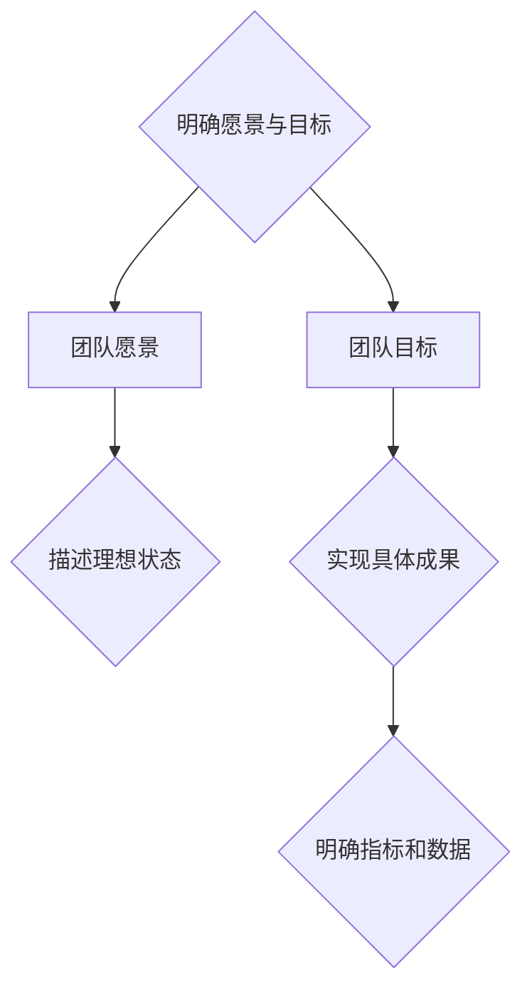

#### 2.3 制定团队文化策略

**核心概念原理：**

制定团队文化策略是将团队愿景与目标转化为实际行动的重要步骤。团队文化策略包括文化理念、核心价值观、行为规范等，旨在引导团队成员的行为和思维，促进团队文化的形成和发展。

**概念属性特征对比表格：**

| 特征                 | 文化理念               | 核心价值观               | 行为规范               |
|----------------------|-----------------------|-----------------------|-----------------------|
| 指导思想             | 描述团队文化的总体方向 | 团队成员共同遵守的价值观 | 团队成员的行为准则     |
| 持续性               | 长期坚守               | 持续传承               | 持续执行             |
| 可操作性             | 理解与认同             | 内化于心               | 外化于行             |

**Mermaid 流程图：**

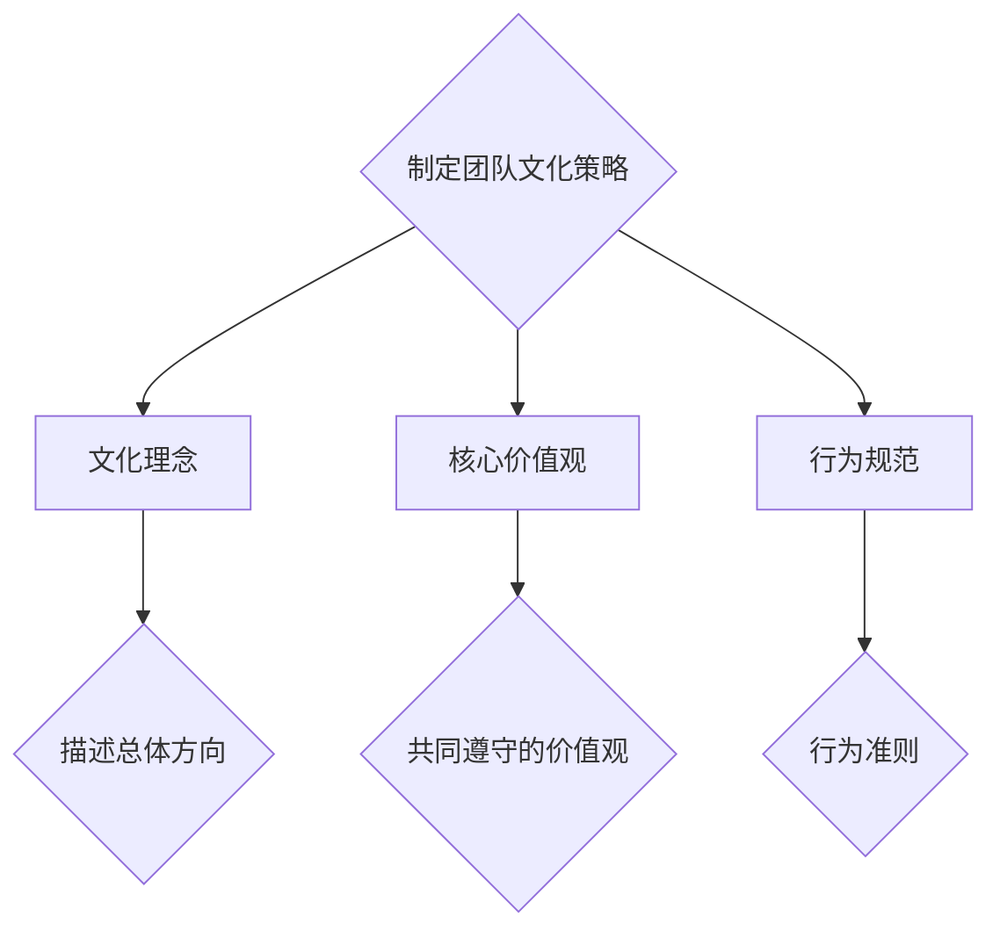

### 总结

通过分析团队现状、明确团队愿景与目标和制定团队文化策略，我们可以为团队文化规划奠定坚实的基础。这一过程有助于团队形成共同的目标和价值观，推动团队成员的协同合作，实现团队的长远发展。

## 第三部分：技术团队文化建设的方法

### 第3章：营造团队文化氛围

#### 3.1 营造积极的工作环境

**核心概念原理：**

营造积极的工作环境是技术团队文化建设的基础。一个积极的工作环境能够激发团队成员的潜能，提高工作效率和团队凝聚力。要营造积极的工作环境，需要从以下几个方面入手：

- **提供良好的办公条件**：确保办公场所的整洁、舒适，提供必要的技术支持，如高速网络、高效的硬件设备等。
- **关注员工福利**：合理安排员工的休息时间和工作任务，提供良好的薪酬待遇和福利制度。
- **建立激励机制**：设立明确的奖励制度，对团队成员的突出贡献给予奖励，激发团队成员的积极性和创造力。

**概念属性特征对比表格：**

| 特征                 | 营造积极工作环境               | 营造消极工作环境               |
|----------------------|------------------------------|------------------------------|
| 办公条件             | 舒适、整洁、高效               | 杂乱、不舒适、效率低下         |
| 员工福利             | 合理、关注、满意               | 不合理、忽视、不满意           |
| 激励机制             | 明确、公平、有效               | 不明确、不公平、无效           |

**Mermaid 流程图：**

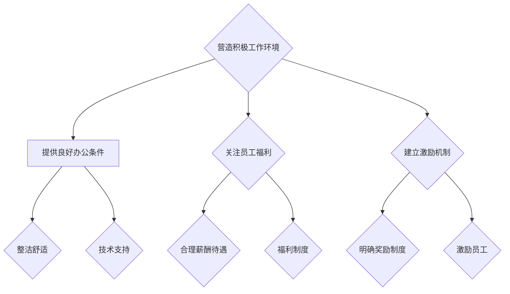

#### 3.2 建立共同价值观

**核心概念原理：**

建立共同价值观是技术团队文化建设的核心。共同价值观能够凝聚团队成员，促进团队成员之间的协作，提高团队的整体执行力。建立共同价值观需要从以下几个方面入手：

- **明确核心价值观**：通过团队讨论和共识，明确团队的核心价值观，如创新、诚信、协作、责任等。
- **传播核心价值观**：通过各种渠道和方式，将核心价值观传递给团队成员，使其内化于心。
- **实践核心价值观**：在团队日常工作和项目管理中，贯彻核心价值观，使其成为团队行为的指南。

**概念属性特征对比表格：**

| 特征                 | 建立共同价值观                | 缺乏共同价值观                |
|----------------------|------------------------------|------------------------------|
| 明确性               | 团队核心价值观清晰明确       | 团队价值观模糊不清           |
| 内化性               | 成员内化于心，自觉遵守       | 成员缺乏认同，行为不一致     |
| 执行力               | 行为一致，执行力强           | 行为不一致，执行力弱         |

**Mermaid 流程图：**

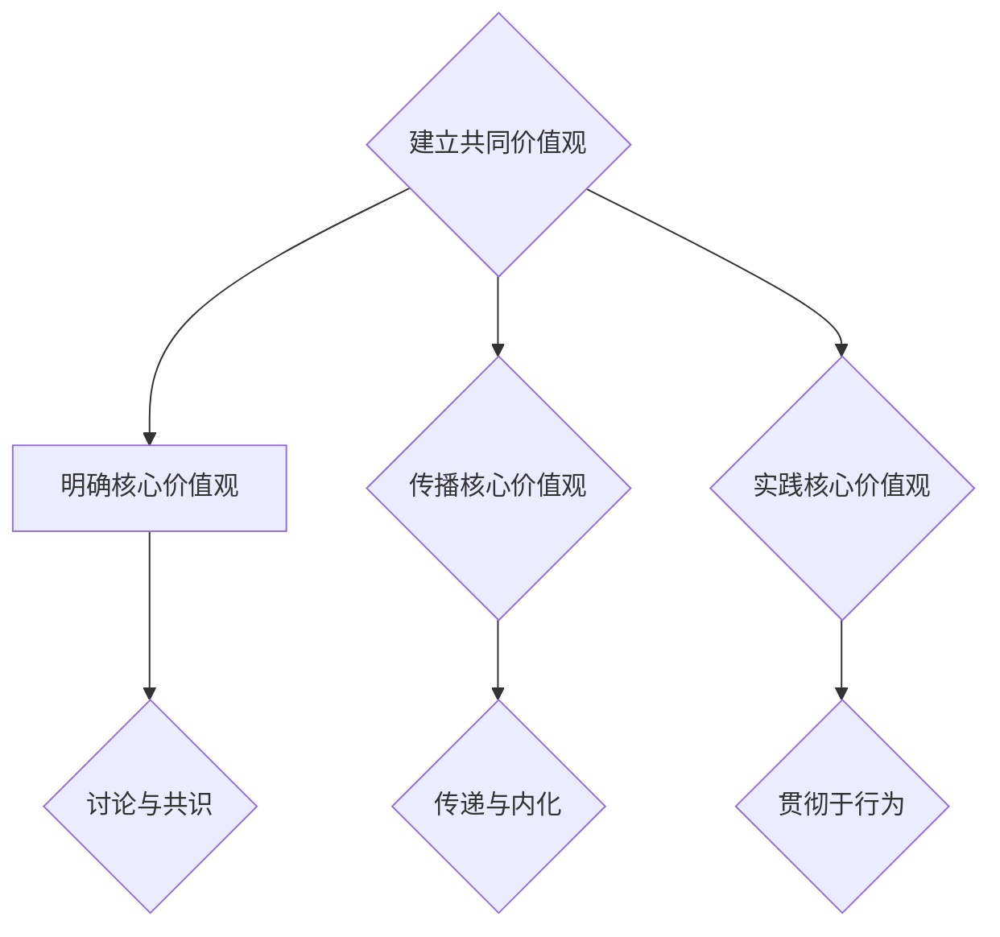

#### 3.3 开展团队文化建设活动

**核心概念原理：**

开展团队文化建设活动是加强团队文化氛围的重要手段。通过丰富多样的文化活动，可以增强团队成员之间的情感联系，提升团队的凝聚力。以下是一些有效的团队文化建设活动：

- **团队建设培训**：组织团队建设培训，提高团队成员的沟通技巧、团队合作能力和领导力。
- **团队拓展活动**：组织户外拓展活动，增强团队成员之间的信任和默契，提升团队凝聚力。
- **技术竞赛与交流活动**：举办技术竞赛和交流活动，激发团队成员的创新热情，促进知识共享。

**概念属性特征对比表格：**

| 特征                 | 有效团队文化建设活动          | 无效团队文化建设活动          |
|----------------------|------------------------------|------------------------------|
| 参与性               | 成员积极参与，活动效果显著   | 成员参与度低，活动效果不明显 |
| 持续性               | 活动持续开展，形成长效机制   | 活动间断，无长效机制         |
| 创新性               | 活动形式多样，富有创意       | 活动形式单一，缺乏创新性     |

**Mermaid 流程图：**

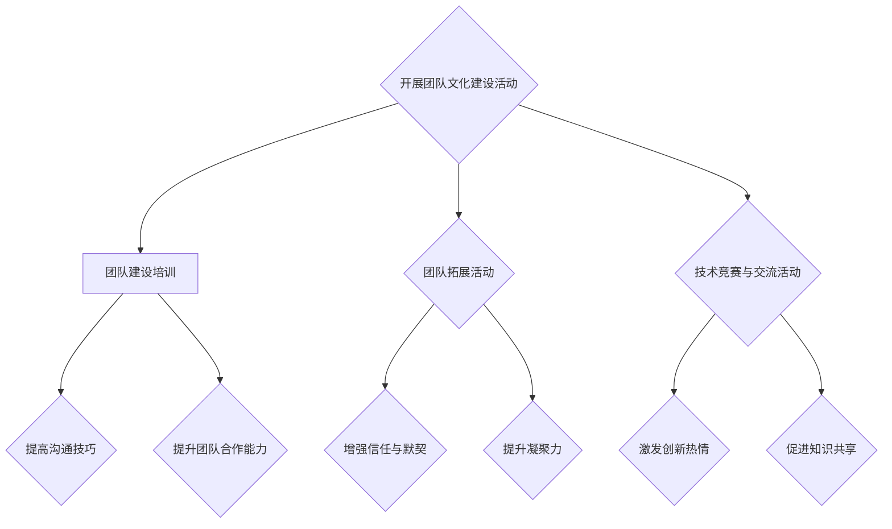

### 总结

通过营造积极的工作环境、建立共同价值观和开展团队文化建设活动，我们可以有效加强技术团队文化。这一过程有助于提升团队凝聚力、激发团队成员的积极性和创造力，为团队的长远发展奠定坚实基础。

## 第四部分：技术团队文化评估与改进

### 第6章：技术团队文化评估

#### 6.1 文化评估的方法

**核心概念原理：**

技术团队文化评估是了解团队文化现状、发现问题并制定改进策略的重要步骤。文化评估的方法多种多样，包括问卷调查、访谈、观察和数据分析等。以下是一些常见的方法：

- **问卷调查**：通过设计针对团队成员的问卷，收集他们对团队文化的认知和感受，了解文化氛围和存在的问题。
- **访谈**：与团队成员进行一对一或小组访谈，深入了解他们对团队文化的看法和感受，获取更详细的反馈信息。
- **观察**：观察团队成员在工作中的行为和表现，了解团队文化在日常工作和项目管理中的体现。
- **数据分析**：通过分析团队成员的工作数据、绩效评估、离职率和员工满意度等，评估团队文化的实际效果。

**概念属性特征对比表格：**

| 方法                 | 优点                  | 缺点                  |
|----------------------|-----------------------|-----------------------|
| 问卷调查             | 覆盖面广，数据量大     | 可能存在主观偏差       |
| 访谈                 | 深度了解，反馈详细     | 耗时长，成本高         |
| 观察                 | 实时了解，直观准确     | 可能存在观察偏差       |
| 数据分析             | 数据客观，量化评估     | 需要专业知识和技能     |

**Mermaid 流程图：**

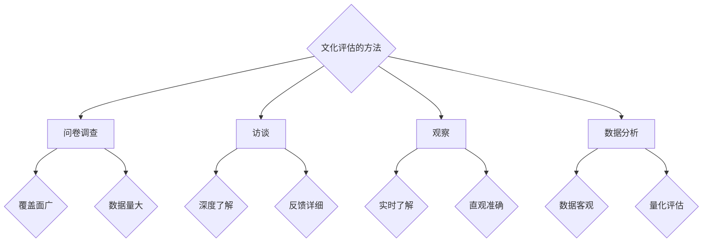

#### 6.2 文化评估的指标体系

**核心概念原理：**

文化评估的指标体系是评估团队文化效果的重要工具。指标体系应涵盖团队文化的各个方面，如团队凝聚力、知识共享、创新氛围、员工满意度等。以下是一个典型的文化评估指标体系：

- **团队凝聚力**：包括团队协作程度、团队成员之间的信任感、团队目标的共识度等。
- **知识共享**：包括团队成员的知识交流频率、知识共享平台的使用情况、知识获取的便利性等。
- **创新氛围**：包括团队成员的创新意识、创新项目的成功率、创新成果的转化率等。
- **员工满意度**：包括员工对工作环境的满意度、对团队文化的认同感、对职业发展的期望等。

**概念属性特征对比表格：**

| 指标                 | 评估内容                | 指标类型             |
|----------------------|------------------------|----------------------|
| 团队凝聚力           | 团队协作、信任感、共识度 | 质量型指标           |
| 知识共享             | 知识交流、共享平台使用   | 数量型指标           |
| 创新氛围             | 创新意识、项目成功率     | 效果型指标           |
| 员工满意度           | 工作环境、文化认同、职业发展 | 主观型指标           |

**Mermaid 流程图：**

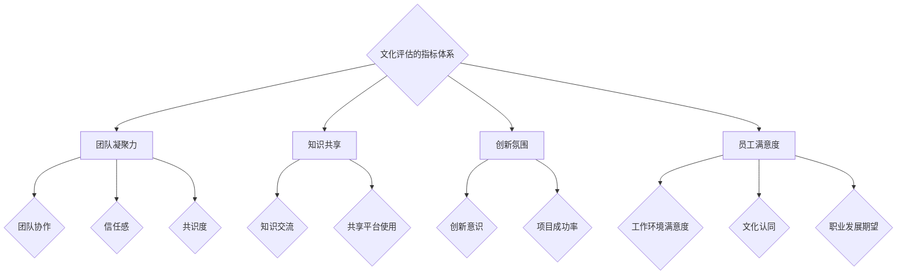

#### 6.3 文化评估的实施步骤

**核心概念原理：**

文化评估的实施步骤包括评估准备、数据收集、数据分析和结果反馈等。以下是一个典型的文化评估实施步骤：

1. **评估准备**：明确评估目的、制定评估计划、设计评估工具等。
2. **数据收集**：通过问卷调查、访谈、观察和数据分析等方式收集文化数据。
3. **数据分析**：对收集的数据进行整理、分析和解读，形成评估报告。
4. **结果反馈**：将评估结果反馈给团队成员，共同讨论改进措施。

**概念属性特征对比表格：**

| 步骤                 | 实施内容                  | 关键要素             |
|----------------------|---------------------------|----------------------|
| 评估准备             | 明确评估目的、制定计划     | 目标明确、计划周详   |
| 数据收集             | 收集文化数据              | 方法多样、数据真实   |
| 数据分析             | 整理和分析数据            | 数据准确、分析深入   |
| 结果反馈             | 反馈评估结果              | 结果真实、沟通有效   |

**Mermaid 流程图：**

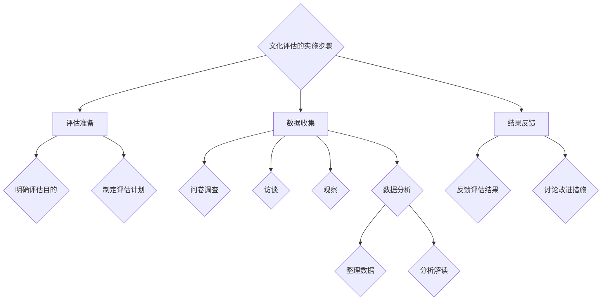

### 总结

通过文化评估的方法、指标体系和实施步骤，我们可以全面了解技术团队文化的现状，发现问题并制定改进措施。这一过程有助于不断提升团队文化，为团队的长远发展提供有力支持。

## 第五部分：技术团队文化建设的方法

### 第5章：培养团队成员文化认同感

#### 5.1 提升个人素养

**核心概念原理：**

提升个人素养是培养团队成员文化认同感的重要环节。个人素养包括技术能力、沟通能力、团队合作能力和领导力等。提升个人素养有助于团队成员更好地适应团队文化，增强文化认同感。

**概念属性特征对比表格：**

| 特征                 | 技术能力提升               | 沟通能力提升               | 团队合作能力提升               | 领导力提升               |
|----------------------|---------------------------|---------------------------|---------------------------|---------------------------|
| 技术能力提升         | 熟练掌握相关技术          | 了解技术发展趋势          | 了解团队成员技术特长          | 引领技术发展方向          |
| 沟通能力提升         | 有效传达信息和理解他人    | 建立良好的沟通渠道        | 协调团队成员沟通和合作        | 提高团队沟通效率和质量    |
| 团队合作能力提升     | 寻求团队成员的帮助和协作   | 建立信任和合作关系        | 共同解决问题和实现目标        | 领导团队协作和共同成长    |
| 领导力提升           | 担任团队角色，承担责任     | 领导团队，制定目标和计划  | 激励团队成员，提升团队士气    | 提升团队整体绩效和成果    |

**Mermaid 流程图：**

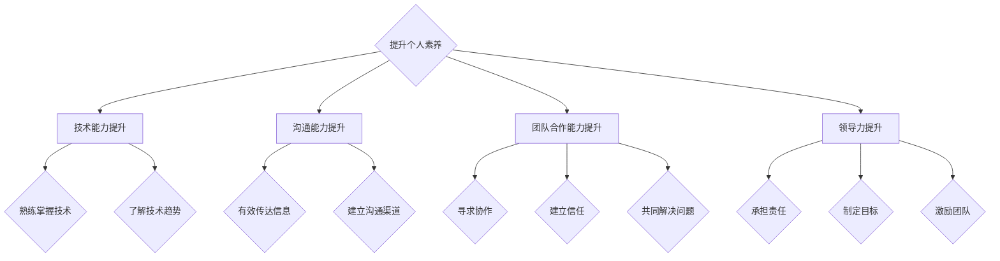

#### 5.2 增强团队意识

**核心概念原理：**

增强团队意识是培养团队成员文化认同感的关键。团队意识是指团队成员对团队的认同感和归属感，包括对团队目标的认同、对团队文化的认同和对团队发展的关注。增强团队意识需要从以下几个方面入手：

- **共同目标**：明确团队目标，确保团队成员对目标有共同的认识和认同，形成团结一心的合力。
- **团队荣誉**：树立团队荣誉感，鼓励团队成员为团队荣誉而努力，增强团队的凝聚力。
- **团队发展**：关注团队的发展，鼓励团队成员积极参与团队建设，共同推动团队成长。

**概念属性特征对比表格：**

| 特征                 | 增强团队意识               | 缺乏团队意识               |
|----------------------|---------------------------|---------------------------|
| 共同目标             | 团队成员对目标有共识       | 团队成员目标不统一         |
| 团队荣誉             | 团队成员有荣誉感           | 团队成员缺乏荣誉感         |
| 团队发展             | 关注团队发展，积极参与建设 | 忽视团队发展，缺乏参与感   |

**Mermaid 流程图：**

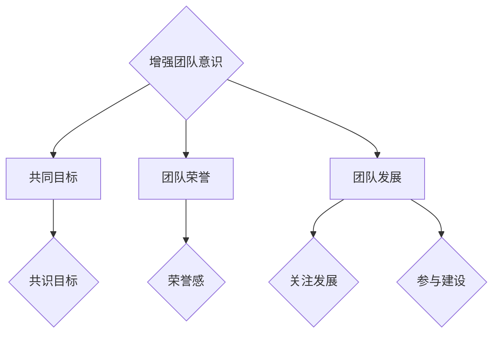

#### 5.3 促进团队沟通与协作

**核心概念原理：**

促进团队沟通与协作是培养团队成员文化认同感的重要手段。有效的沟通与协作能够增强团队成员之间的信任，提高团队的工作效率，形成良好的团队氛围。促进团队沟通与协作可以从以下几个方面入手：

- **建立沟通机制**：设立定期的团队会议和沟通渠道，确保团队成员能够及时交流信息，解决存在的问题。
- **培养协作精神**：通过团队活动和项目合作，培养团队成员的协作精神，提高团队协作能力。
- **鼓励反馈与建议**：鼓励团队成员提出反馈和建议，建立开放、包容的团队文化，增强团队成员的参与感。

**概念属性特征对比表格：**

| 特征                 | 促进沟通与协作             | 阻碍沟通与协作             |
|----------------------|---------------------------|---------------------------|
| 沟通机制             | 定期会议和沟通渠道         | 缺乏有效的沟通机制         |
| 协作精神             | 团队成员积极参与合作       | 团队成员缺乏协作意愿       |
| 反馈与建议           | 鼓励反馈，接受建议         | 忽视反馈，排斥建议         |

**Mermaid 流程图：**

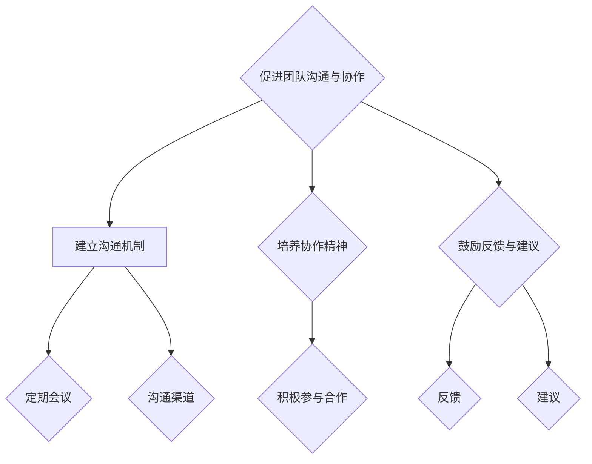

### 总结

通过提升个人素养、增强团队意识和促进团队沟通与协作，我们可以有效培养团队成员的文化认同感。这一过程有助于增强团队的凝聚力、提高工作效率和促进团队文化的形成与发展。

## 第六部分：技术团队文化评估与改进

### 第6章：技术团队文化评估

#### 6.1 文化评估的方法

**核心概念原理：**

技术团队文化评估是确保团队文化健康发展的关键步骤。通过评估，可以了解团队文化的现状，识别存在的问题，并为改进提供依据。文化评估的方法主要包括问卷调查、访谈、观察和数据分析等。

**概念属性特征对比表格：**

| 评估方法 | 优点 | 缺点 |
|----------|------|------|
| 问卷调查 | 覆盖面广，数据量大 | 可能存在主观偏差 |
| 访谈     | 深度了解，反馈详细 | 耗时长，成本高 |
| 观察     | 实时了解，直观准确 | 可能存在观察偏差 |
| 数据分析 | 数据客观，量化评估 | 需要专业知识和技能 |

**Mermaid 流程图：**

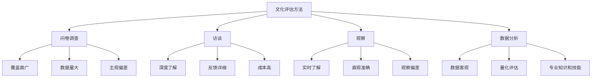

#### 6.2 文化评估的指标体系

**核心概念原理：**

文化评估的指标体系是评估团队文化效果的重要工具。一个全面的指标体系应涵盖团队凝聚力、知识共享、创新氛围、员工满意度等多个维度。以下是一个典型的文化评估指标体系：

| 指标 | 描述 | 类型 |
|------|------|------|
| 团队凝聚力 | 团队协作程度、团队成员之间的信任感、团队目标的共识度 | 质量型指标 |
| 知识共享 | 知识交流频率、知识共享平台使用情况、知识获取的便利性 | 数量型指标 |
| 创新氛围 | 创新意识、创新项目的成功率、创新成果的转化率 | 效果型指标 |
| 员工满意度 | 员工对工作环境的满意度、对团队文化的认同感、对职业发展的期望 | 主观型指标 |

**概念属性特征对比表格：**

| 指标 | 描述 | 类型 | 测量方式 |
|------|------|------|----------|
| 团队凝聚力 | 团队协作程度、团队成员之间的信任感、团队目标的共识度 | 质量型指标 | 问卷调查、访谈 |
| 知识共享 | 知识交流频率、知识共享平台使用情况、知识获取的便利性 | 数量型指标 | 数据分析、问卷调查 |
| 创新氛围 | 创新意识、创新项目的成功率、创新成果的转化率 | 效果型指标 | 项目评估、问卷调查 |
| 员工满意度 | 员工对工作环境的满意度、对团队文化的认同感、对职业发展的期望 | 主观型指标 | 问卷调查、访谈 |

**Mermaid 流程图：**

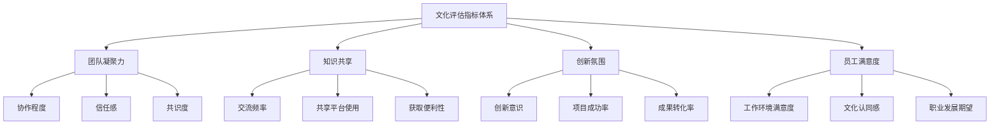

#### 6.3 文化评估的实施步骤

**核心概念原理：**

文化评估的实施步骤包括评估准备、数据收集、数据分析和结果反馈等。以下是一个典型的文化评估实施步骤：

1. **评估准备**：明确评估目的、制定评估计划、设计评估工具等。
2. **数据收集**：通过问卷调查、访谈、观察和数据分析等方式收集文化数据。
3. **数据分析**：对收集的数据进行整理、分析和解读，形成评估报告。
4. **结果反馈**：将评估结果反馈给团队成员，共同讨论改进措施。

**概念属性特征对比表格：**

| 步骤 | 实施内容 | 关键要素 |
|------|----------|----------|
| 评估准备 | 明确评估目的、制定计划、设计评估工具 | 目标明确、计划周详 |
| 数据收集 | 问卷调查、访谈、观察、数据分析 | 方法多样、数据真实 |
| 数据分析 | 整理数据、分析解读、形成报告 | 数据准确、分析深入 |
| 结果反馈 | 反馈评估结果、讨论改进措施 | 结果真实、沟通有效 |

**Mermaid 流程图：**

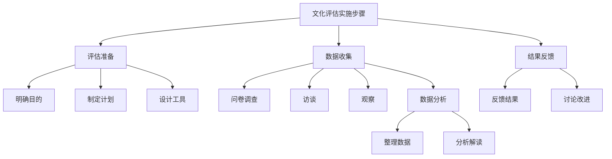

### 总结

通过文化评估的方法、指标体系和实施步骤，我们可以全面了解技术团队文化的现状，发现问题，并为改进提供依据。这一过程有助于不断提升团队文化，为团队的长远发展提供有力支持。

## 第七部分：技术团队文化改进

### 第7章：技术团队文化改进

#### 7.1 发现文化问题

**核心概念原理：**

发现文化问题是技术团队文化改进的第一步。通过评估和反馈，我们可以识别团队文化中存在的问题，包括团队成员的价值观不一致、沟通不畅、知识共享不足等。以下是一些常见的文化问题：

- **价值观不一致**：团队成员对团队目标的认同度不高，导致执行力不统一。
- **沟通不畅**：团队成员之间的沟通不充分，信息传递不及时，影响团队协作。
- **知识共享不足**：团队成员不愿意或无法有效地分享知识和经验，影响团队创新和效率。

**概念属性特征对比表格：**

| 问题 | 表现 | 影响 |
|------|------|------|
| 价值观不一致 | 目标不统一 | 降低团队执行力 |
| 沟通不畅 | 信息传递慢 | 影响团队协作 |
| 知识共享不足 | 缺乏交流 | 降低创新效率和团队效率 |

**Mermaid 流程图：**

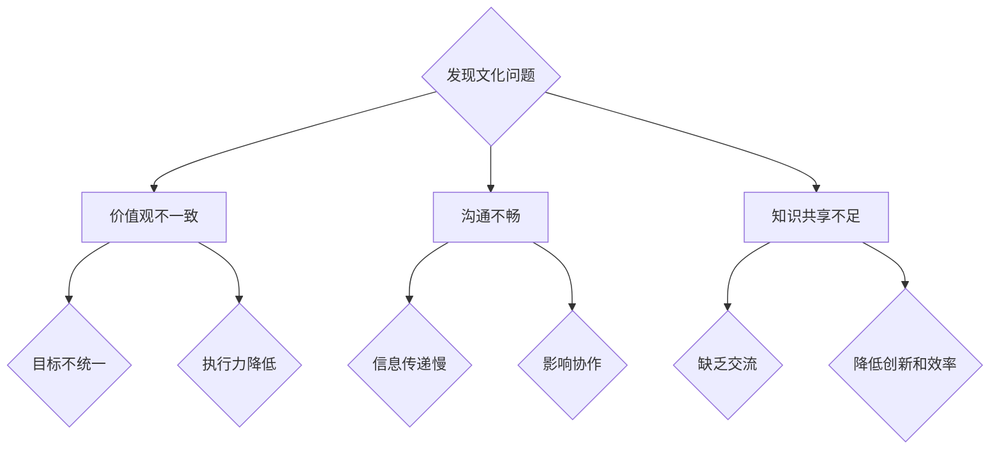

#### 7.2 制定改进策略

**核心概念原理：**

在发现文化问题后，制定改进策略是关键步骤。改进策略应针对发现的问题，提出具体的解决方案和实施措施。以下是一些常见的改进策略：

- **明确价值观**：通过团队讨论和共识，明确团队的核心价值观，确保团队成员对目标有共同的认识和认同。
- **改善沟通**：建立有效的沟通机制，如定期团队会议、沟通工具的使用等，提高信息传递的速度和准确性。
- **促进知识共享**：建立知识共享平台，鼓励团队成员分享知识和经验，提高团队的创新能力和效率。

**概念属性特征对比表格：**

| 改进策略 | 描述 | 预期效果 |
|----------|------|----------|
| 明确价值观 | 通过讨论和共识，明确核心价值观 | 提高团队执行力 |
| 改善沟通 | 建立有效的沟通机制 | 提高团队协作效率 |
| 促进知识共享 | 建立知识共享平台，鼓励分享 | 提高创新能力和团队效率 |

**Mermaid 流程图：**

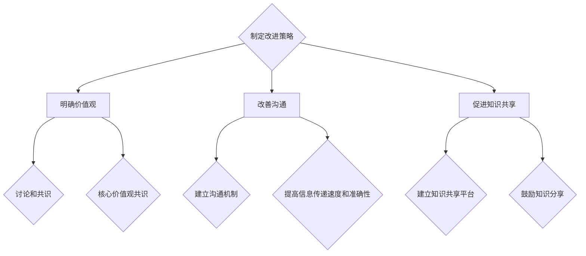

#### 7.3 实施文化改进措施

**核心概念原理：**

实施文化改进措施是将改进策略转化为实际行动的重要步骤。以下是一些常见的实施措施：

- **培训与教育**：组织团队成员参加文化培训，提高他们对团队文化的认知和认同。
- **激励机制**：设立文化改进奖励制度，激励团队成员积极参与文化改进活动。
- **监督与反馈**：建立监督机制，确保文化改进措施得到有效执行，并及时反馈改进效果。

**概念属性特征对比表格：**

| 实施措施 | 描述 | 预期效果 |
|----------|------|----------|
| 培训与教育 | 提高团队成员文化认知 | 增强文化认同感 |
| 激励机制 | 激励团队成员积极参与 | 提高文化执行力度 |
| 监督与反馈 | 确保措施执行效果 | 及时发现和解决问题 |

**Mermaid 流程图：**

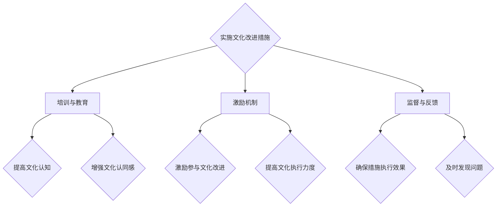

### 总结

通过发现文化问题、制定改进策略和实施文化改进措施，我们可以有效提升技术团队的文化水平，增强团队的凝聚力、协作能力和创新能力，为团队的长远发展奠定坚实基础。

### 成功案例分享

#### 8.1 案例一：团队文化建设在互联网公司中的应用

在一家互联网公司中，团队文化建设取得了显著成效。公司通过明确核心价值观，如“客户至上”、“创新驱动”、“快速响应”，引导团队成员在日常工作中的行为和决策。公司还建立了定期团队沟通机制，通过内部会议、邮件和即时通讯工具，确保团队成员之间信息传递的及时性和准确性。

此外，公司重视员工福利，提供良好的工作环境和丰富的培训机会，提高员工的满意度和忠诚度。在项目管理和团队协作方面，公司通过敏捷开发方法和跨职能团队的组建，提高了团队的创新能力和工作效率。

结果，该公司在市场竞争中取得了优势，项目成功率显著提高，员工流失率降低，团队凝聚力大幅增强。

#### 8.2 案例二：技术团队文化在传统企业中的转型

某传统企业在面对市场变化和技术发展的挑战时，决定进行技术团队文化的转型。公司首先对现有团队文化进行评估，发现团队成员对技术发展的关注不足，缺乏创新意识和协作精神。

为了解决这些问题，公司制定了新的团队文化策略，明确了“技术创新”、“合作共赢”的核心价值观。公司通过引入敏捷开发方法、设立创新激励基金和定期组织技术交流会议，激发团队成员的创新热情和协作意识。

同时，公司还加强了对员工的培训和职业发展支持，提高团队成员的专业素养和团队意识。经过一段时间的努力，该公司的技术团队焕然一新，项目进展顺利，创新成果不断涌现，市场竞争力显著提升。

#### 8.3 案例三：跨文化团队建设的挑战与应对

在跨国公司中，跨文化团队建设面临诸多挑战。不同文化背景的团队成员在价值观、沟通方式和团队合作方面存在差异，可能导致误解和冲突。

为了应对这些挑战，公司采取了以下措施：

1. **文化培训**：组织跨文化培训，帮助团队成员了解和尊重不同文化背景，提高跨文化沟通能力。
2. **共同目标**：明确跨文化团队的目标和期望，确保团队成员在目标上保持一致，增强团队凝聚力。
3. **沟通机制**：建立有效的沟通机制，如定期团队会议、跨部门协作平台等，促进团队成员之间的沟通和协作。
4. **领导支持**：公司领导积极支持和参与跨文化团队建设，提供必要的资源和指导，推动团队文化的融合。

通过这些措施，该公司成功克服了跨文化团队建设的挑战，实现了团队成员之间的有效沟通和协作，提高了团队的整体绩效和竞争力。

### 总结

以上成功案例展示了技术团队文化建设在不同类型企业和跨文化环境中的应用效果。通过明确核心价值观、建立沟通机制、提供培训和支持，企业可以成功提升团队文化水平，增强团队凝聚力、协作能力和创新能力，为企业的长远发展奠定坚实基础。

## 第九章：文化建设实践总结

### 9.1 经验与启示

**核心概念原理：**

技术团队文化建设的实践为我们积累了宝贵的经验，提供了有益的启示。以下是一些关键的经验和启示：

1. **明确核心价值观**：核心价值观是团队文化的核心，它指导团队成员的行为和决策，确保团队成员在目标上保持一致。
2. **建立沟通机制**：有效的沟通机制是团队协作的基石。通过定期会议、沟通工具和反馈机制，可以确保团队成员之间的信息传递及时、准确。
3. **提供培训与支持**：培训和支持是提升团队成员专业素养和团队意识的重要手段。通过文化培训、技术培训和职业发展支持，可以增强团队成员的归属感和认同感。
4. **重视员工福利**：良好的员工福利能够提高员工的工作满意度和忠诚度，为团队文化的建设提供有力保障。
5. **持续改进**：团队文化建设是一个持续的过程。通过定期评估和反馈，可以及时发现和解决团队文化中存在的问题，推动团队文化的不断完善和发展。

### 9.2 小结与展望

**核心概念原理：**

通过技术团队文化建设的实践，我们可以得出以下小结：

1. **团队文化的重要性**：技术团队文化对团队的整体绩效和竞争力具有显著影响。一个健康、积极的团队文化能够提高团队凝聚力、促进知识共享与创新、提升工作效率。
2. **文化建设的多层次性**：团队文化建设涉及多个方面，包括价值观、沟通、培训、员工福利等。每个方面都需要得到充分重视和有效实施。
3. **文化建设的持续性**：团队文化建设不是一蹴而就的，而是一个持续的过程。只有通过持续的努力和改进，才能不断提升团队文化水平。

展望未来，技术团队文化建设面临新的机遇和挑战：

1. **技术发展带来的变革**：随着技术的不断发展，团队文化也需要不断适应新的技术趋势和市场需求，保持创新和竞争力。
2. **跨文化团队的协作**：在全球化的背景下，跨文化团队的协作将成为越来越普遍的现象。如何有效融合不同文化背景的团队成员，将是团队文化建设的重要挑战。
3. **人工智能的应用**：人工智能技术的发展将为团队文化建设带来新的机遇，如通过数据分析优化团队管理、提高决策效率等。

总之，技术团队文化建设是一个长期而重要的任务。通过不断总结经验、改进方法和适应变化，我们可以不断提升团队文化水平，为团队的长远发展奠定坚实基础。

