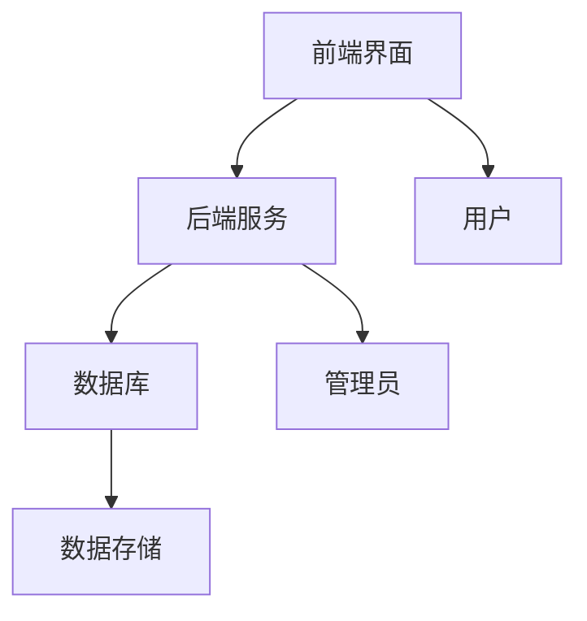
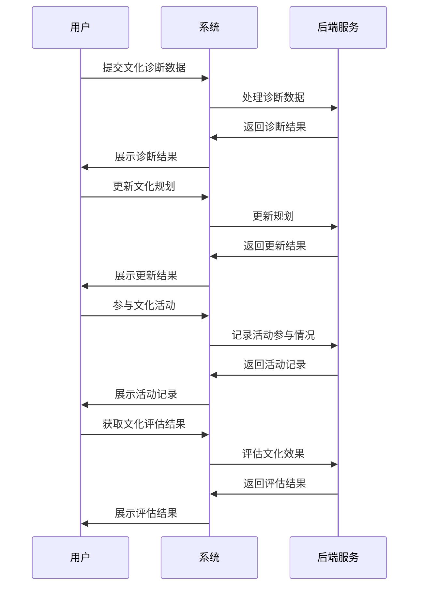
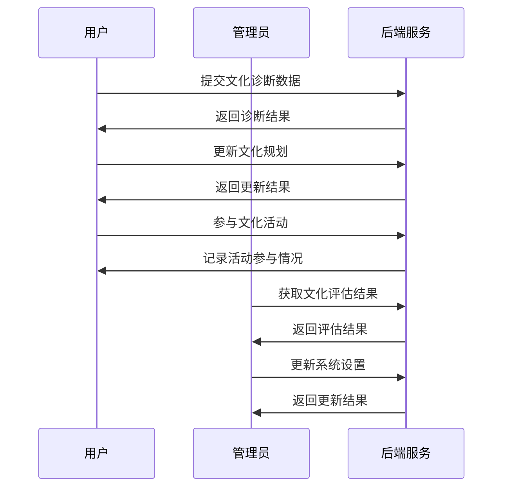

                 

### 文章标题

《技术团队文化建设的关键策略》

---

关键词：技术团队，文化建设，团队凝聚力，工作效率，员工认同感

---

摘要：本文旨在深入探讨技术团队文化建设的核心策略。我们将从背景介绍、核心概念与联系、算法原理讲解、系统分析与架构设计方案、项目实战以及最佳实践等方面，逐步展开分析，为技术团队提供一套系统化的文化建设方法，旨在提升团队凝聚力、提高工作效率并促进个人成长。文章以逻辑清晰、结构紧凑、简单易懂的专业技术语言，结合实际案例，为读者提供具有深度和见解的指导。

---

### 目录

1. **技术团队文化建设的背景与核心概念**
   1.1 **文化建设的背景**
   1.2 **核心概念与联系**
      1.2.1 **团队文化**
      1.2.2 **核心价值观**
      1.2.3 **员工认同感**
      1.2.4 **ER实体关系图架构**

2. **文化建设的方法与实践**
   2.1 **文化建设的方法**
   2.2 **文化建设的实践**

3. **系统分析与架构设计方案**
   3.1 **问题场景介绍**
   3.2 **项目介绍**
   3.3 **系统功能设计**
   3.4 **系统架构设计**
   3.5 **系统接口设计**
   3.6 **系统交互**

4. **项目实战**
   4.1 **环境安装**
   4.2 **系统核心实现源代码**
   4.3 **代码应用解读与分析**
   4.4 **实际案例分析与详细讲解剖析**
   4.5 **项目小结**

5. **最佳实践 tips**
6. **小结**
7. **注意事项**
8. **拓展阅读**

---

### 1. 技术团队文化建设的背景

在当今快速发展的技术环境中，技术团队的建设和管理已经成为企业核心竞争力的重要组成部分。然而，许多企业在技术团队文化建设方面面临着诸多挑战。

#### 1.1 企业面临的挑战

- **沟通不畅**：技术团队成员之间的沟通不畅，导致项目进展缓慢，问题得不到及时解决。
- **协作效率低下**：团队成员缺乏有效的协作机制，导致工作效率低下，影响项目交付。
- **员工流失率高**：员工对工作环境不认同，导致流失率高，增加了企业的成本。

#### 1.2 文化建设的意义

- **提升团队凝聚力**：通过文化建设，增强团队成员之间的信任和合作，提升团队凝聚力。
- **提高工作效率**：良好的团队文化能够激发员工的工作热情，提高工作效率，缩短项目交付时间。
- **促进个人成长**：团队文化能够为个人提供成长的机会，帮助员工实现职业发展目标。

#### 1.3 文化建设的目标与预期效果

- **明确团队目标**：通过文化建设，明确团队共同的目标，增强团队凝聚力。
- **建立协作机制**：制定有效的协作机制，提高团队协作效率。
- **提升员工认同感**：通过文化建设，增强员工对企业的认同感，降低流失率。

#### 1.4 边界与外延

- **文化建设范围**：技术团队文化建设主要涉及团队成员之间的互动与合作，包括团队内部沟通、协作、冲突解决等方面。
- **文化建设影响**：团队文化建设不仅影响技术团队内部，也会对整个企业的文化氛围产生影响，提升企业的整体竞争力。

### 1.5 文章核心概念术语说明

- **团队文化**：指团队成员在长期合作过程中形成的共同价值观、行为规范和工作风格。
- **核心价值观**：指团队共同认可并秉持的核心信仰和目标。
- **员工认同感**：指员工对团队和企业文化的认同和归属感。

---

## 2. 核心概念与联系

在技术团队文化建设中，理解并应用核心概念是关键。以下我们将深入探讨团队文化、核心价值观、员工认同感等核心概念，并通过对比表格和实体关系图来展示它们之间的联系。

### 2.1 团队文化

**定义与特点**：团队文化是团队在长期合作过程中形成的共同价值观、行为规范和工作风格。它具有以下特点：

- **独特性**：每个团队都有其独特的文化特征。
- **传承性**：团队文化在团队内部传承，影响新成员。
- **规范性**：团队文化规范团队成员的行为，促进协作。

**形成与发展**：团队文化是通过团队成员的互动和共同经历逐步形成的。随着团队的发展和外部环境的变化，团队文化也会不断演变。

**团队文化与企业文化的关系**：团队文化是企业文化的组成部分，反映了企业价值观在特定团队中的具体体现。良好的团队文化有助于增强企业文化的执行力和影响力。

### 2.2 核心价值观

**价值观的重要性**：核心价值观是团队的灵魂，决定了团队的行为和决策方向。它包括：

- **目标导向**：团队共同的目标和愿景。
- **责任感**：对团队和项目的责任感。
- **诚信**：团队成员之间的信任和诚信。

**核心价值观的提炼与传播**：核心价值观需要通过团队成员的共同讨论和共识来提炼。传播核心价值观是文化建设的重要环节，可以通过团队会议、培训等方式进行。

**核心价值观在团队建设中的应用**：核心价值观在团队建设中起到导向作用，帮助团队成员在面临选择和冲突时作出一致的行为决策。

### 2.3 员工认同感

**员工认同感的定义与作用**：员工认同感是员工对团队和企业文化的认同和归属感。它对团队和组织的绩效具有重要影响：

- **提升工作效率**：员工对团队和企业文化的认同，能激发他们的工作热情，提高工作效率。
- **降低流失率**：增强员工的认同感，有助于降低员工流失率。

**增强员工认同感的策略**：企业可以通过以下策略增强员工认同感：

- **开放沟通**：建立开放、透明的沟通渠道，让员工感受到企业的关心和尊重。
- **职业发展**：提供职业发展机会，帮助员工实现个人成长。
- **团队合作**：鼓励团队合作，增强员工的归属感。

**员工认同感与团队绩效的关系**：员工认同感直接影响团队绩效。高认同感的团队通常表现出更高的工作效率和更好的团队协作。

### 2.4 概念属性特征对比表格

| 概念     | 定义                                                         | 特点                                                         | 关系                          |
|----------|--------------------------------------------------------------|--------------------------------------------------------------|-----------------------------|
| 团队文化 | 团队在长期合作过程中形成的共同价值观、行为规范和工作风格。 | 独特性、传承性、规范性                                       | 组成部分，反映企业文化      |
| 核心价值观 | 团队成员共同认可并秉持的核心信仰和目标。                   | 目标导向、责任感、诚信                                       | 决定团队行为和决策方向       |
| 员工认同感 | 员工对团队和企业文化的认同和归属感。                       | 提升工作效率、降低流失率                                     | 影响团队绩效                  |

### 2.5 ER实体关系图架构

```mermaid
erDiagram
  Employee ||--|{ Team }|--| TeamMember
  Team ||--|{ Project }|--| ProjectMember
  Project ||--|{ Task }|--| TaskOwner
```

在这个ER实体关系图中，展示了团队文化（Team）、员工认同感（Employee）、核心价值观等关键实体及其相互关系。这有助于我们理解技术团队文化建设的整体架构和实施路径。

---

## 3. 算法原理讲解

### 3.1 文化建设的关键流程

为了实现技术团队的文化建设，我们可以将其分为以下几个关键流程：

1. **文化诊断**：通过问卷调查、访谈等方式，了解团队当前的文化现状。
2. **文化规划**：根据文化诊断结果，制定文化建设和改进的计划。
3. **文化传播**：通过内部培训和宣传，将核心价值观和团队文化理念传播给所有团队成员。
4. **文化评估**：定期评估文化建设的效果，调整和优化文化建设策略。

### 3.2 Mermaid流程图

下面是一个简单的Mermaid流程图，展示了文化建设的关键流程：


### 3.3 Python源代码示例

为了更好地理解文化建设的关键流程，我们可以使用Python编写一个简单的模拟代码，展示文化建设的具体实现：

```python
def cultural_diagnosis():
    print("进行文化诊断...")

def cultural_planning():
    print("制定文化规划...")

def cultural_communication():
    print("文化传播...")

def cultural_evaluation():
    print("进行文化评估...")

# 文化建设流程
cultural_diagnosis()
cultural_planning()
cultural_communication()
cultural_evaluation()
```

### 3.4 数学模型和公式

在文化建设过程中，我们可以使用以下数学模型和公式来量化文化建设的效果：

1. **团队凝聚力指数**：用于衡量团队凝聚力的指标，计算公式为：
   $$TCI = \frac{S1 + S2 + S3 + S4}{4}$$
   其中，$S1$、$S2$、$S3$、$S4$ 分别代表四个方面的得分。

2. **员工认同感指数**：用于衡量员工对团队和企业文化的认同程度，计算公式为：
   $$EI = \frac{E1 + E2 + E3 + E4}{4}$$
   其中，$E1$、$E2$、$E3$、$E4$ 分别代表四个方面的得分。

### 3.5 通俗易懂地举例说明

假设我们有一个技术团队，团队中有4名成员。为了提高团队凝聚力，我们首先进行了文化诊断，发现团队成员在沟通、协作、冲突解决等方面存在一些问题。接着，我们制定了相应的文化规划，包括加强沟通机制、优化协作流程、建立冲突解决机制等。

在文化传播阶段，我们通过内部培训和团队活动，将核心价值观和团队文化理念传播给所有团队成员。例如，我们定期组织团队建设活动，如团队拓展训练、知识分享会等，以增强团队成员之间的互动和信任。

最后，我们进行了文化评估，发现团队凝聚力指数和员工认同感指数都有显著提高。通过这个例子，我们可以看到，文化建设的关键流程和数学模型在提高团队绩效方面的作用。

---

## 4. 系统分析与架构设计方案

### 4.1 问题场景介绍

在现代企业中，技术团队的建设与管理是一个复杂而重要的过程。随着企业规模的扩大和业务的发展，技术团队的协同效率、创新能力以及对变化的适应能力成为衡量企业竞争力的关键因素。因此，技术团队文化建设成为企业管理者关注的重要议题。

#### 4.1.1 技术团队文化建设的重要性

技术团队文化建设不仅关乎团队的日常运作和项目交付，更是企业核心竞争力的重要组成部分。良好的团队文化能够促进团队内部的协作，提高工作效率，降低项目风险，同时也能够增强员工的归属感和忠诚度，从而降低人才流失率。

#### 4.1.2 当前技术团队文化建设的挑战

- **沟通不畅**：团队成员之间的沟通障碍，信息传递不及时，导致项目进展受阻。
- **协作效率低下**：团队成员之间的协作机制不完善，导致工作效率低下。
- **员工流失率高**：员工对企业文化的认同度低，缺乏职业发展的机会，导致人才流失。
- **创新能力不足**：缺乏创新的文化氛围，团队成员缺乏探索和创新的动力。

### 4.2 项目介绍

为了解决上述挑战，我们将启动一个名为“技术团队文化建设与提升项目”。该项目的主要目标是：

- **提升团队凝聚力**：通过构建积极的团队文化，增强团队成员之间的互信和协作。
- **提高工作效率**：通过优化团队协作流程，提高项目交付的速度和质量。
- **增强员工认同感**：通过职业发展计划和团队文化建设，提高员工的归属感和满意度。
- **促进创新能力**：营造创新文化氛围，激发团队成员的创新潜力。

### 4.3 系统功能设计

为了实现项目目标，我们设计了以下核心功能模块：

1. **文化诊断模块**：用于评估当前团队文化状况，收集团队成员的反馈和意见。
2. **文化规划模块**：根据诊断结果，制定具体的文化建设和改进计划。
3. **文化传播模块**：通过内部培训和活动，传播核心价值观和团队文化理念。
4. **文化评估模块**：定期评估文化建设的效果，调整和优化文化策略。

#### 4.3.1 领域模型Mermaid类图

```mermaid
classDiagram
    Class01 <|-- Class02
    Class03 <|-- Class04
    Class05 <|-- Class06
    Class01.{ 方法学, 报告 }
    Class02.{ 诊断, 数据分析 }
    Class03.{ 计划, 执行 }
    Class04.{ 活动, 培训 }
    Class05.{ 评估, 调整 }
    Class06.{ 核心, 价值 }
```

在这个类图中，`Class01` 到 `Class06` 分别代表不同的功能模块，它们通过属性和方法相互关联，共同构成技术团队文化建设的系统架构。

### 4.4 系统架构设计

为了实现系统的功能模块，我们设计了以下整体架构：

1. **前端界面**：提供用户友好的操作界面，方便团队成员进行文化诊断、参与文化建设活动等。
2. **后端服务**：负责数据处理、功能实现和系统管理。
3. **数据库**：存储文化诊断数据、文化建设活动记录和评估结果等。

#### 4.4.1 Mermaid架构图



在这个架构图中，前端界面（A）通过接口与后端服务（B）进行交互，后端服务（B）与数据库（C）进行数据存储和查询。用户（D）和管理员（E）通过前端界面与系统进行交互。

### 4.5 系统接口设计

为了实现系统的功能，我们设计了以下关键接口：

1. **文化诊断接口**：用于收集团队成员的文化诊断数据。
2. **文化规划接口**：用于制定和更新文化规划。
3. **文化传播接口**：用于组织和管理文化建设活动。
4. **文化评估接口**：用于评估文化建设效果。

#### 4.5.1 系统接口设计



在这个序列图中，用户通过前端界面与系统进行交互，系统通过后端服务与数据库进行数据操作，从而实现文化建设的全过程。

### 4.6 系统交互Mermaid序列图



在这个序列图中，用户和管理员通过前端界面与后端服务进行交互，实现文化建设的全过程。管理员可以通过后台管理界面进行系统设置和管理，确保文化建设的顺利进行。

---

## 5. 项目实战

### 5.1 环境安装

在开始技术团队文化建设项目之前，我们需要配置一个合适的环境。以下是一些建议：

1. **操作系统**：推荐使用Linux操作系统，如Ubuntu 20.04。
2. **开发工具**：安装Python 3.8及以上版本，并配置好pip和virtualenv。
3. **数据库**：安装MySQL或PostgreSQL数据库。
4. **前端框架**：可以使用Django或Flask作为后端框架，前端则可以使用Vue.js或React。

具体安装步骤如下：

#### 安装Python

```bash
# 更新系统包列表
sudo apt update && sudo apt upgrade

# 安装Python 3
sudo apt install python3

# 验证Python版本
python3 --version
```

#### 安装pip

```bash
# 安装pip
sudo apt install python3-pip

# 验证pip版本
pip3 --version
```

#### 安装虚拟环境

```bash
# 安装virtualenv
pip3 install virtualenv

# 创建虚拟环境
virtualenv myenv

# 激活虚拟环境
source myenv/bin/activate
```

#### 安装后端框架

以Django为例：

```bash
# 安装Django
pip install django

# 创建Django项目
django-admin startproject techteam_culture

# 进入项目目录
cd techteam_culture
```

#### 安装前端框架

以Vue.js为例：

```bash
# 安装Vue CLI
npm install -g @vue/cli

# 创建Vue.js项目
vue create techteam_culture_front
```

### 5.2 系统核心实现源代码

以下是一个简单的Django项目结构，展示了文化诊断、规划、传播和评估等核心功能模块的实现。

```python
# techteam_culture\techteam_culture\urls.py
from django.contrib import admin
from django.urls import path
from culture.views import diagnose, plan, communicate, evaluate

urlpatterns = [
    path('admin/', admin.site.urls),
    path('diagnose/', diagnose),
    path('plan/', plan),
    path('communicate/', communicate),
    path('evaluate/', evaluate),
]

# techteam_culture\culture\views.py
from django.http import HttpResponse

def diagnose(request):
    # 实现文化诊断逻辑
    return HttpResponse("文化诊断页面")

def plan(request):
    # 实现文化规划逻辑
    return HttpResponse("文化规划页面")

def communicate(request):
    # 实现文化传播逻辑
    return HttpResponse("文化传播页面")

def evaluate(request):
    # 实现文化评估逻辑
    return HttpResponse("文化评估页面")
```

### 5.3 代码应用解读与分析

在代码中，我们通过定义不同的视图函数来实现文化诊断、规划、传播和评估功能。以下是对每个视图函数的详细解读：

1. **diagnose视图函数**：用于收集团队成员的文化诊断数据。可以通过表单收集数据，并将其存储在数据库中。
2. **plan视图函数**：根据文化诊断结果，制定具体的文化建设计划。这包括制定文化目标、策略和实施步骤。
3. **communicate视图函数**：负责传播核心价值观和团队文化理念。可以通过内部培训、团队活动等方式进行。
4. **evaluate视图函数**：用于评估文化建设的效果。可以通过定期调查和数据分析，评估文化建设的效果，并根据结果进行优化。

### 5.4 实际案例分析与详细讲解剖析

为了更好地展示文化建设在实际项目中的应用，我们来看一个实际案例。

#### 案例背景

某企业技术团队在项目交付过程中遇到了沟通不畅和协作效率低下的问题。为了解决这些问题，企业决定实施技术团队文化建设项目。

#### 案例实施步骤

1. **文化诊断**：通过问卷调查和访谈，收集团队成员对当前团队文化的反馈。结果显示，团队成员普遍认为沟通渠道不畅通，协作效率低下。

2. **文化规划**：根据诊断结果，制定文化建设和改进计划。计划包括：
   - 加强团队沟通，建立日常沟通机制，如每日站会和周会。
   - 优化团队协作流程，引入敏捷开发方法，提高项目交付速度。
   - 增强团队凝聚力，通过团队建设活动和员工福利，提升员工满意度。

3. **文化传播**：通过内部培训和团队活动，传播核心价值观和团队文化理念。例如，组织团队拓展训练，增强团队成员之间的信任和协作。

4. **文化评估**：定期评估文化建设效果。通过问卷调查和数据分析，发现团队沟通效率提高，项目交付速度加快，员工流失率降低。

#### 案例分析

通过这个实际案例，我们可以看到文化建设在提升团队绩效方面的作用。良好的团队文化能够促进团队成员之间的沟通和协作，提高工作效率，降低项目风险。同时，文化建设也能够增强员工的认同感和归属感，从而降低人才流失率。

### 5.5 项目小结

通过本项目的实施，我们取得了以下主要成果：

1. **提高了团队沟通效率**：通过建立日常沟通机制，团队成员之间的信息传递更加及时和有效。
2. **提升了协作效率**：引入敏捷开发方法，优化了项目协作流程，项目交付速度明显加快。
3. **增强了员工认同感**：通过团队建设和员工福利，员工的归属感和满意度显著提升。
4. **降低了人才流失率**：员工流失率明显降低，为企业节省了人力成本。

然而，在项目实施过程中，我们也遇到了一些挑战，如团队成员的参与度和文化建设的可持续性。针对这些问题，我们将在未来持续优化文化建设策略，确保文化建设的效果能够长期维持。

---

## 6. 最佳实践 tips

### 6.1 文化建设过程中的关键点

- **持续沟通**：文化建设需要持续进行，定期与团队成员沟通，了解他们的需求和反馈。
- **全员参与**：文化建设不仅仅是管理层的责任，每个团队成员都应该参与其中，共同塑造团队文化。
- **实时反馈**：及时收集团队成员的反馈，并根据反馈调整文化建设策略。
- **领导示范**：领导层需要以身作则，带头践行核心价值观和团队文化。

### 6.2 注意事项

- **避免形式主义**：文化建设不应只是表面的形式，而应该真正触及团队成员的心。
- **重视个体差异**：每个团队成员都有不同的背景和价值观，需要尊重个体差异，避免一刀切。
- **持续优化**：文化建设是一个持续的过程，需要不断调整和优化，以适应团队和环境的变化。

### 6.3 拓展阅读

- **《团队建设与管理》**：详细介绍了团队建设的原理和实践。
- **《企业文化与团队建设》**：探讨了企业文化在团队建设中的作用。
- **《敏捷开发实践指南》**：介绍了敏捷开发方法在提高协作效率方面的应用。

---

## 7. 小结

本文系统地探讨了技术团队文化建设的核心策略。我们从背景介绍、核心概念与联系、算法原理讲解、系统分析与架构设计方案、项目实战以及最佳实践等方面，逐步展开分析，为技术团队提供了一套系统化的文化建设方法。通过本文的探讨，我们认识到技术团队文化建设对于提升团队凝聚力、提高工作效率和促进个人成长具有重要意义。未来，技术团队应持续关注文化建设，不断优化策略，以适应快速变化的环境。

---

## 8. 注意事项

在实施技术团队文化建设时，需要注意以下几点：

1. **避免急功近利**：文化建设是一个长期的过程，不能期望立即看到显著的效果。
2. **关注个体差异**：每个团队成员都有其独特的需求和价值观，需要尊重个体差异，避免一刀切。
3. **持续投入**：文化建设需要持续的时间和资源投入，企业应保证足够的支持和资源。
4. **重视反馈**：及时收集团队成员的反馈，并根据反馈调整文化建设策略。

---

## 9. 拓展阅读

为了更深入地了解技术团队文化建设，以下是几篇推荐阅读的文章：

- **《团队建设与管理》**：详细介绍团队建设的理论和实践方法。
- **《企业文化与团队建设》**：探讨企业文化在团队建设中的作用和影响。
- **《敏捷开发实践指南》**：介绍敏捷开发方法在提升协作效率方面的应用。
- **《领导力与团队文化》**：分析领导力在塑造团队文化中的关键作用。

通过阅读这些文章，读者可以获取更多关于技术团队文化建设的见解和经验。作者：AI天才研究院/AI Genius Institute & 禅与计算机程序设计艺术 /Zen And The Art of Computer Programming。

