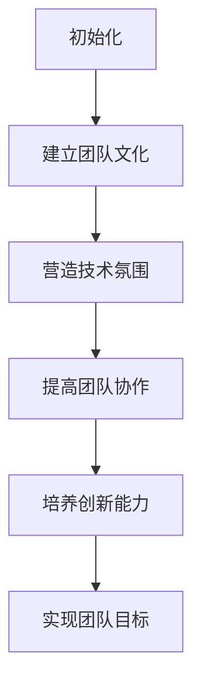
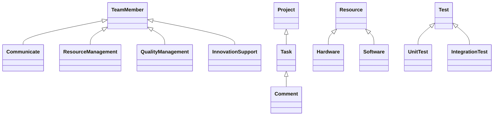
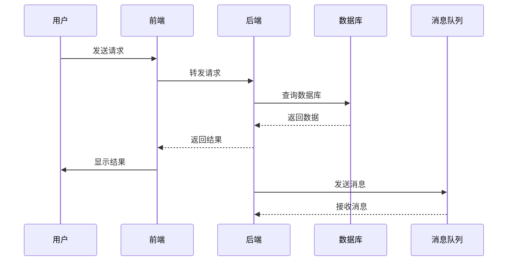
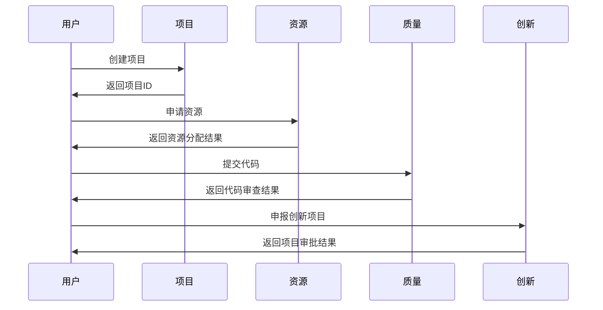
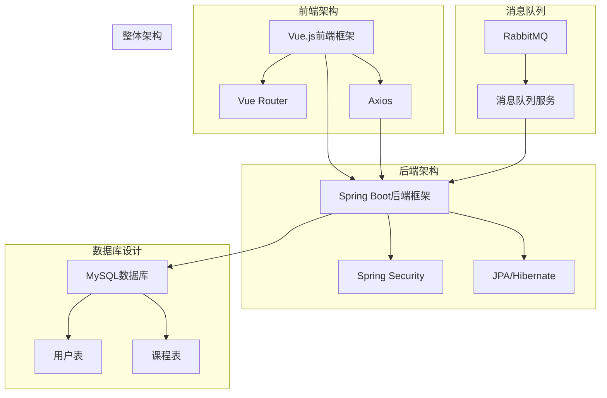
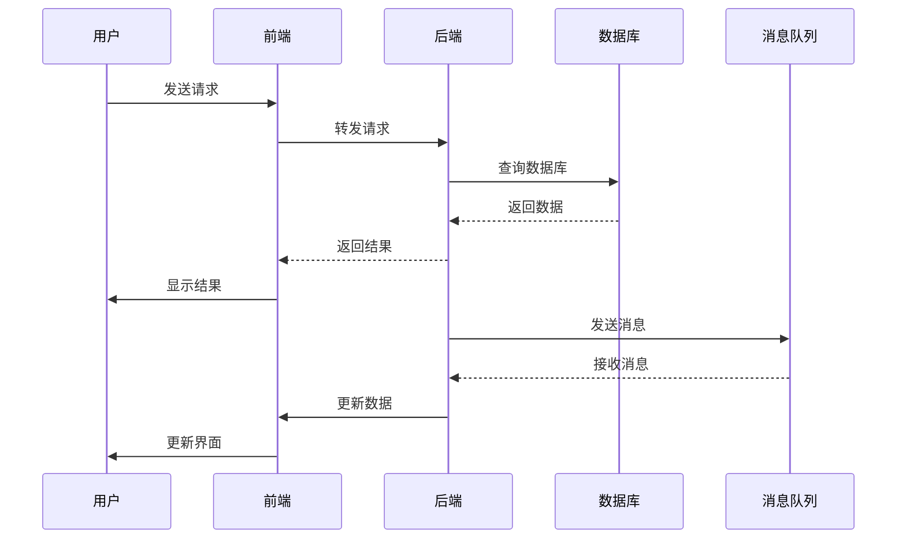

                 

# 技术团队文化建设的重要性

> 关键词：技术团队，文化建设，团队协作，创新能力

摘要：本文将深入探讨技术团队文化建设的重要性，从问题背景、问题描述、问题解决等多个角度进行分析，阐述技术团队文化建设的定义与构成，方法与途径，并探讨技术团队文化与企业文化、其他团队文化以及国际差异等边界与外延。通过核心概念与联系、算法原理讲解，为技术团队文化建设提供系统的理论指导和实践路径。

### 目录大纲

1. 第一部分：引言

    1.1 技术团队文化建设的重要性
    
    1.2 问题背景
    
    1.3 问题描述
    
    1.4 问题解决
    
    1.5 边界与外延
    
    1.6 概念结构与核心要素组成
    
2. 第二部分：核心概念与联系

    2.1 核心概念原理
    
    2.2 概念属性特征对比表格
    
    2.3 ER实体关系图架构
    
3. 第三部分：算法原理讲解

    3.1 算法mermaid流程图
    
    3.2 Python源代码
    
    3.3 算法原理的数学模型和公式

## 1.1 问题背景

技术团队在企业发展中扮演着至关重要的角色。随着信息化和数字化时代的到来，技术已成为企业竞争力的核心要素。技术团队不仅是企业技术创新的主要力量，还承担着产品研发、技术支持、项目实施等关键任务。一个优秀的技术团队能够为企业带来巨大的经济效益和竞争优势。

然而，当前技术团队面临着诸多挑战。首先，团队成员间的沟通不畅是一个普遍存在的问题。技术团队成员往往来自不同的专业背景，沟通不畅会导致项目进度延误、工作效率低下。其次，工作环境的压力和竞争也使得团队成员容易产生心理问题，影响团队合作。此外，技术团队的项目质量不稳定，缺乏创新精神，这些问题都制约了企业的发展。

面对这些挑战，技术团队文化建设的重要性愈发凸显。文化建设是一种软实力的体现，通过构建积极向上的团队文化，可以增强团队成员的凝聚力和归属感，提高团队协作效率，激发创新潜力，从而推动企业持续发展。因此，本文将探讨技术团队文化建设的重要性，分析其核心概念与联系，并提出具体的建设方法与途径。

### 1.2 问题描述

技术团队在发展过程中，常常面临一系列问题，这些问题在很大程度上阻碍了团队的工作效率和质量。以下是一些常见的问题：

#### 1.2.1 沟通不畅

沟通是团队协作的基石。然而，技术团队成员之间的沟通常常存在障碍。原因可能包括以下几点：

1. **专业差异**：团队成员来自不同的专业领域，语言和术语的差异可能导致理解上的障碍。
2. **工作繁忙**：项目开发过程中，团队成员往往忙于各自的任务，缺乏充足的时间进行有效沟通。
3. **沟通工具不足**：一些团队缺乏先进的沟通工具，无法实现实时、高效的沟通。

沟通不畅的结果是团队成员之间缺乏信任和共识，项目进度受到严重影响，甚至可能导致项目失败。

#### 1.2.2 工作效率低下

技术团队的工作效率低下也是一个常见问题。具体表现为：

1. **任务分配不合理**：项目任务分配不均衡，可能导致部分成员工作量过大，而另一些成员则无所事事。
2. **资源利用不充分**：团队资源（如硬件设备、软件工具等）未能得到充分利用，增加了不必要的成本。
3. **缺乏明确的进度管理**：项目进度管理不到位，导致任务延期、资源浪费。

工作效率低下的后果是项目延期交付，质量难以保障，团队士气受到影响。

#### 1.2.3 项目质量不稳定

技术团队的项目质量不稳定是一个突出问题。导致这一问题的原因可能包括：

1. **测试不足**：项目开发过程中，测试工作不到位，可能导致代码缺陷和漏洞。
2. **代码管理混乱**：团队成员之间缺乏统一的代码管理规范，代码质量参差不齐。
3. **缺乏质量意识**：团队成员对项目质量的重要性认识不足，导致项目质量难以保证。

项目质量不稳定会直接影响客户的满意度，损害企业的声誉。

#### 1.2.4 缺乏创新精神

创新是技术团队持续发展的动力。然而，许多技术团队缺乏创新精神，主要表现在：

1. **创新意识不足**：团队成员对创新的重要性认识不足，缺乏主动探索和尝试的动力。
2. **创新资源有限**：企业对技术团队的创新支持不足，缺乏必要的资金和资源。
3. **创新环境不佳**：团队内部缺乏鼓励创新的文化氛围，创新尝试往往面临各种阻力。

缺乏创新精神的结果是技术团队难以应对市场变化，企业竞争力下降。

### 1.3 问题解决

技术团队面临的这些问题，需要通过文化建设的手段来解决。文化建设是一个系统工程，需要从多个方面进行构建和完善。

#### 1.3.1 文化的定义与构成

文化是指一个团队在长期发展过程中形成的共同价值观、行为规范和工作方式。技术团队文化主要包括以下几个方面：

1. **价值观**：团队共同认可的核心价值观，如创新、协作、诚信、责任等。
2. **行为规范**：团队成员在工作和生活中应遵循的行为准则，如守时、尊重他人、注重细节等。
3. **工作方式**：团队在工作和项目开发中采用的方法和流程，如敏捷开发、持续集成等。

#### 1.3.2 文化的作用与价值

技术团队文化对团队和企业的意义重大，具体体现在以下几个方面：

1. **增强团队凝聚力**：共同的文化价值观和行为规范，有助于增强团队成员的归属感和认同感，形成强大的团队凝聚力。
2. **提高工作效率**：良好的文化氛围有助于提高团队成员的工作效率和协作能力，减少沟通成本和资源浪费。
3. **保证项目质量**：文化规范和标准有助于提高项目开发过程中的质量控制，减少缺陷和漏洞。
4. **激发创新潜力**：鼓励创新的文化氛围，可以激发团队成员的创新精神和创造力，推动技术团队的持续发展。

#### 1.3.3 文化的建设方法与途径

文化建设是一个长期的过程，需要从以下几个方面进行建设：

1. **领导引领**：领导是团队文化的倡导者和践行者，需要通过自身的行为和言语，树立良好的文化典范。
2. **培训与教育**：定期开展文化培训和教育，让团队成员深入了解团队文化的重要性和内涵。
3. **制度建设**：建立完善的制度，如绩效考核、奖惩机制等，将文化理念融入日常工作中。
4. **文化宣传**：利用企业内部媒体和活动，宣传和弘扬团队文化，营造良好的文化氛围。
5. **实践与反馈**：通过项目实践，检验文化建设的效果，不断调整和完善文化建设的具体措施。

### 1.4 边界与外延

#### 1.4.1 技术团队文化与企业文化

技术团队文化是企业文化的有机组成部分，但与企业文化有所不同。企业文化更注重企业的整体价值观和经营理念，而技术团队文化则更侧重于技术领域的专业性和独特性。技术团队文化需要与企业文化保持一致，同时体现技术团队的专业性和创新性。

#### 1.4.2 技术团队文化与其他团队文化

技术团队文化与其他团队文化存在一定的差异，如销售团队文化、市场团队文化等。技术团队文化更注重专业性和技术能力，而其他团队文化则更强调客户关系和市场推广。在团队协作中，需要尊重不同团队文化的特点，实现文化的融合和互补。

#### 1.4.3 技术团队文化的国际差异

不同国家和地区的文化差异，也会影响技术团队文化。例如，美国技术团队文化更注重个人主义和创新精神，而日本技术团队文化则更强调团队合作和纪律性。在国际化背景下，技术团队文化需要具备一定的灵活性，以适应不同国家和地区的文化环境。

### 1.5 概念结构与核心要素组成

技术团队文化是一个复杂的概念，由多个核心要素组成。以下是对技术团队文化的核心概念、建设目标和原则以及关键要素的详细阐述。

#### 1.5.1 核心概念

1. **团队价值观**：团队共同认可的核心价值观，如创新、协作、诚信、责任等。
2. **团队精神**：团队成员在共同目标和价值观的引领下，形成的积极向上的精神状态。
3. **团队行为规范**：团队成员在工作和生活中应遵循的行为准则，如守时、尊重他人、注重细节等。

#### 1.5.2 建设目标与原则

1. **增强团队凝聚力**：通过文化建设，增强团队成员的归属感和认同感，形成强大的团队凝聚力。
2. **提高工作效率**：营造良好的文化氛围，提高团队成员的工作效率和协作能力。
3. **保证项目质量**：建立完善的文化规范和标准，提高项目开发过程中的质量控制。
4. **激发创新潜力**：鼓励创新的文化氛围，激发团队成员的创新精神和创造力。

建设原则包括：

1. **一致性**：文化理念应与企业的整体价值观和经营理念保持一致。
2. **实践性**：文化建设要紧密结合实际工作，解决实际问题。
3. **灵活性**：根据企业发展和团队变化，灵活调整文化建设的内容和方式。

#### 1.5.3 关键要素

1. **领导支持**：领导是文化建设的核心力量，需要提供充分的支持和指导。
2. **员工参与**：文化建设的成功离不开员工的积极参与，需要激发员工的主动性和创造力。
3. **制度建设**：建立完善的制度，将文化理念融入日常工作中，确保文化建设有制度保障。
4. **培训与宣传**：定期开展文化培训和教育，利用企业内部媒体和活动，宣传和弘扬团队文化。

通过以上核心概念、建设目标和原则以及关键要素的阐述，我们可以更好地理解技术团队文化，为技术团队的文化建设提供系统的理论指导和实践路径。接下来，我们将进一步探讨技术团队文化中的核心概念与联系，以及具体的算法原理和建设方法。# 第二部分：核心概念与联系

在探讨技术团队文化建设的核心概念与联系时，我们需要明确几个关键概念，并分析它们之间的相互关系。这些核心概念包括团队文化、技术氛围、团队协作和创新能力。

### 2.1 核心概念原理

#### 2.1.1 团队文化

团队文化是指在一个团队中，成员共同遵守的价值观念、行为规范和工作方式。它不仅反映了团队成员的共同价值观，还影响了团队的整体行为和工作效率。团队文化的核心要素包括：

1. **价值观**：团队成员共同认可的价值观，如创新、协作、诚信、责任等。
2. **行为规范**：团队成员在工作和生活中应遵循的行为准则，如守时、尊重他人、注重细节等。
3. **工作方式**：团队在工作和项目开发中采用的方法和流程，如敏捷开发、持续集成等。

#### 2.1.2 技术氛围

技术氛围是指一个团队在技术发展方面的氛围，包括技术创新的活跃程度、技术交流的频繁程度以及技术知识的分享程度等。良好的技术氛围有助于激发团队成员的创新精神和创造力，提高团队的整体技术水平。技术氛围的核心要素包括：

1. **创新性**：技术氛围鼓励创新思维和技术探索，支持团队成员尝试新的技术和方法。
2. **专业性**：技术氛围强调专业知识的重要性，鼓励团队成员不断学习和提升自己的技术水平。
3. **开放性**：技术氛围倡导开放交流，支持团队成员之间的技术分享和知识交流。

#### 2.1.3 团队协作

团队协作是指团队成员在共同目标和任务驱动下，相互配合、共同完成工作的过程。高效的团队协作能够提高团队的工作效率，确保项目质量。团队协作的核心要素包括：

1. **高效协同**：团队成员之间能够高效协同，充分利用各自的专业知识和技能。
2. **共享资源**：团队内部实现资源的共享和优化配置，提高资源利用效率。
3. **信息透明**：团队成员之间保持信息的透明度，及时沟通和反馈，减少误解和冲突。

#### 2.1.4 创新能力

创新能力是指团队在解决技术问题和推动技术进步方面的能力。创新能力不仅体现在技术突破和产品创新上，还体现在对现有技术和方法的改进和优化。创新能力的关键要素包括：

1. **独创性**：团队在技术创新方面具备独特的见解和思路，能够提出创新性的解决方案。
2. **可行性**：团队提出的创新方案不仅具有独创性，还需要具备实施和落地的可行性。
3. **实效性**：团队的创新方案能够实际解决技术问题，提升项目质量和团队效率。

### 2.2 概念属性特征对比表格

为了更好地理解上述核心概念，我们可以通过一个对比表格来展示它们的主要属性和特征：

| 概念     | 定义                     | 主要特征               |
|----------|--------------------------|-----------------------|
| 团队文化 | 团队成员共同遵循的价值观念 | 内在凝聚力、外在表现   |
| 技术氛围 | 技术发展的氛围           | 创新性、专业性、开放性 |
| 团队协作 | 团队成员共同完成工作     | 高效、协同、共享      |
| 创新能力 | 团队解决问题的能力       | 独创性、可行性、实效性 |

通过对比表格，我们可以更直观地看到各个概念的定义和主要特征，有助于深入理解它们在技术团队文化建设中的重要性。

### 2.3 ER实体关系图架构

为了进一步展示这些核心概念之间的相互关系，我们可以使用Mermaid绘制一个ER（实体关系）图。以下是ER图的Mermaid代码：

```mermaid
erDiagram
  TeamCulture ||--|{ TechnologyClimate }| TeamCollaboration
  TechnologyClimate ||--|{ InnovationCapability }| TeamCollaboration
  TeamCollaboration ||-- TechnologyClimate
  TeamCollaboration ||-- InnovationCapability
```

这段代码定义了四个实体：`TeamCulture`（团队文化）、`TechnologyClimate`（技术氛围）、`TeamCollaboration`（团队协作）和`InnovationCapability`（创新能力）。它们之间的关联关系如下：

- `TeamCulture`与`TechnologyClimate`和`TeamCollaboration`之间存在一对多的关系，即团队文化会影响技术氛围和团队协作。
- `TechnologyClimate`与`TeamCollaboration`和`InnovationCapability`之间存在一对多的关系，即技术氛围会影响团队协作和创新能力。
- `TeamCollaboration`与`TechnologyClimate`和`InnovationCapability`之间存在双向关联，即团队协作需要技术氛围的支持，同时也需要创新能力的驱动。

通过ER图，我们可以更清晰地看到各个核心概念之间的相互依赖和关联，为技术团队文化建设提供了直观的参考。

### 2.4 概念的相互关系与影响

在技术团队中，各个核心概念之间存在着密切的相互关系和相互影响。这些关系和影响决定了团队的整体表现和效果。以下是对这些关系的详细分析：

#### 2.4.1 团队文化与技术氛围的关系

团队文化是技术氛围的基石，良好的团队文化能够营造积极向上的技术氛围。一个具有创新、协作和诚信价值观的团队文化，会鼓励团队成员积极探索新技术、分享知识和经验，从而形成一个创新性、专业性和开放性的技术氛围。反之，一个缺乏创新和协作精神的团队文化，会导致技术氛围沉闷，创新动力不足。

#### 2.4.2 技术氛围与团队协作的关系

技术氛围对团队协作有着直接的影响。在一个鼓励创新和开放交流的技术氛围中，团队成员更容易进行有效的沟通和协作。他们能够分享各自的专业知识和经验，共同解决技术问题，实现高效的工作流程。相反，在一个缺乏创新和开放性的技术氛围中，团队成员可能会因为信息不对称或专业差异而难以有效协作，导致工作效率低下。

#### 2.4.3 团队协作与创新能力的关系

团队协作是创新能力的重要保障。在一个高效协作的团队中，成员能够充分发挥各自的专业优势，共同面对技术挑战，从而产生更多的创新思路和解决方案。团队成员之间的密切合作，有助于形成协同效应，激发创新潜力。同时，良好的团队协作也为团队成员提供了更多学习和成长的机会，进一步提升了创新能力。

#### 2.4.4 创新能力与团队文化的关系

创新能力是团队文化的具体体现，一个具有创新精神的团队文化，能够激发团队成员的创造力，推动技术团队不断突破自我，实现技术上的创新和突破。创新能力的提升，反过来也会进一步巩固和强化团队文化，形成良性循环。

通过以上分析，我们可以看到，技术团队中的各个核心概念之间存在着密切的相互关系和相互影响。这些关系和影响共同构成了团队文化的内在逻辑，决定了团队的整体表现和效果。因此，在技术团队文化建设中，需要全面考虑这些核心概念之间的关系，确保各个方面的协调发展，从而实现团队的高效运作和持续创新。# 第三部分：算法原理讲解

在技术团队文化建设中，我们可以将整个过程视为一个算法，通过一系列步骤来实现团队的优化和提升。为了更直观地理解和应用这一过程，我们将使用Mermaid绘制一个流程图，并通过Python代码来详细阐述算法的原理和实现。

### 3.1 算法mermaid流程图

以下是使用Mermaid绘制的算法流程图：



在这个流程图中，我们从初始化开始，依次进行团队文化的建立、技术氛围的营造、团队协作的提高和能力的培养，最终实现团队的目标。每个步骤都是相互关联和依赖的，共同构成了一个完整的算法过程。

### 3.2 Python源代码

为了更好地理解和实现这个算法，我们将使用Python编写一个简单的模拟代码。以下是Python代码的实现：

```python
# 假设我们有一个名为TechTeam的类，用于代表技术团队
class TechTeam:
    def __init__(self):
        self.culture = "创新、协作、高效"
        self.climate = "开放、专业、前沿"
        self.collaboration = "高效协同"
        self.innovation = "持续创新"

    def build_culture(self):
        print("建立团队文化：{}。".format(self.culture))

    def create_climate(self):
        print("营造技术氛围：{}。".format(self.climate))

    def enhance_collaboration(self):
        print("提高团队协作：{}。".format(self.collaboration))

    def cultivate_innovation(self):
        print("培养创新能力：{}。".format(self.innovation))

    def achieve_goals(self):
        print("实现团队目标。")

# 创建一个技术团队实例
tech_team = TechTeam()

# 执行相关方法
tech_team.build_culture()
tech_team.create_climate()
tech_team.enhance_collaboration()
tech_team.cultivate_innovation()
tech_team.achieve_goals()
```

在这段代码中，我们定义了一个`TechTeam`类，包含了一系列方法，用于实现团队文化的建立、技术氛围的营造、团队协作的提高和能力的培养。通过创建一个`TechTeam`实例，并调用相应的方法，我们可以模拟技术团队文化建设的过程。

### 3.3 算法原理的数学模型和公式

在技术团队文化建设中，我们可以将整个过程视为一个优化问题，目标是最小化团队冲突，最大化团队效率和创新能力。以下是这个优化问题的数学模型和公式：

#### 3.3.1 文化建设目标函数

文化建设的目标函数可以表示为：

$$
\text{Maximize} \quad \text{Culture Score} = w_1 \cdot c_1 + w_2 \cdot c_2 + w_3 \cdot c_3 + w_4 \cdot c_4
$$

其中，$w_1, w_2, w_3, w_4$分别代表团队文化、技术氛围、团队协作和创新能力的权重，$c_1, c_2, c_3, c_4$分别代表这些方面的当前水平。

#### 3.3.2 冲突函数

为了衡量团队冲突，我们可以定义一个冲突函数：

$$
\text{Conflict Score} = \frac{1}{1 + e^{-\alpha \cdot (c_1 - c_2)}}
$$

其中，$\alpha$是一个调节参数，$c_1$和$c_2$分别代表两个方面的当前水平。冲突函数的值范围在0和1之间，表示两个方面的冲突程度。

#### 3.3.3 优化算法

为了实现文化建设目标，我们可以使用梯度下降算法来优化目标函数。具体步骤如下：

1. 初始化权重$w_1, w_2, w_3, w_4$和调节参数$\alpha$。
2. 计算当前目标函数的值$\text{Culture Score}$和冲突函数的值$\text{Conflict Score}$。
3. 计算目标函数的梯度：
   $$
   \nabla \text{Culture Score} = \left[ \frac{\partial \text{Culture Score}}{\partial w_1}, \frac{\partial \text{Culture Score}}{\partial w_2}, \frac{\partial \text{Culture Score}}{\partial w_3}, \frac{\partial \text{Culture Score}}{\partial w_4} \right]
   $$
4. 更新权重：
   $$
   w_1 := w_1 - \eta \cdot \frac{\partial \text{Culture Score}}{\partial w_1}
   $$
   $$
   w_2 := w_2 - \eta \cdot \frac{\partial \text{Culture Score}}{\partial w_2}
   $$
   $$
   w_3 := w_3 - \eta \cdot \frac{\partial \text{Culture Score}}{\partial w_3}
   $$
   $$
   w_4 := w_4 - \eta \cdot \frac{\partial \text{Culture Score}}{\partial w_4}
   $$
   其中，$\eta$是学习率，用于调节权重的更新速度。
5. 迭代直到收敛：重复步骤2-4，直到目标函数值的变化小于某个阈值。

通过以上算法，我们可以逐步优化技术团队的文化建设，提高团队的效率和创新能力。

### 3.4 算法举例说明

为了更好地理解算法的原理和应用，我们通过一个简单的例子来说明。

假设我们有一个技术团队，当前团队文化、技术氛围、团队协作和创新能力的水平分别为：

- 团队文化：0.7
- 技术氛围：0.8
- 团队协作：0.6
- 创新能力：0.7

我们希望优化团队的建设，目标是最大化文化分数，同时最小化冲突分数。

1. **初始化权重**：设权重$w_1 = 0.3$，$w_2 = 0.2$，$w_3 = 0.2$，$w_4 = 0.3$，调节参数$\alpha = 1$。
2. **计算当前目标函数值**：
   $$
   \text{Culture Score} = 0.3 \cdot 0.7 + 0.2 \cdot 0.8 + 0.2 \cdot 0.6 + 0.3 \cdot 0.7 = 0.66
   $$
3. **计算当前冲突函数值**：
   $$
   \text{Conflict Score} = \frac{1}{1 + e^{-1 \cdot (0.7 - 0.8)}} = \frac{1}{1 + e^{-0.1}} \approx 0.90
   $$
4. **计算梯度**：
   $$
   \nabla \text{Culture Score} = \left[ 0.3 \cdot 0.7, 0.2 \cdot 0.8, 0.2 \cdot 0.6, 0.3 \cdot 0.7 \right] = \left[ 0.21, 0.16, 0.12, 0.21 \right]
   $$
5. **更新权重**：
   $$
   w_1 := 0.3 - \eta \cdot 0.21
   $$
   $$
   w_2 := 0.2 - \eta \cdot 0.16
   $$
   $$
   w_3 := 0.2 - \eta \cdot 0.12
   $$
   $$
   w_4 := 0.3 - \eta \cdot 0.21
   $$
   设学习率$\eta = 0.1$，则更新后的权重为：
   $$
   w_1 = 0.3 - 0.1 \cdot 0.21 = 0.289
   $$
   $$
   w_2 = 0.2 - 0.1 \cdot 0.16 = 0.188
   $$
   $$
   w_3 = 0.2 - 0.1 \cdot 0.12 = 0.188
   $$
   $$
   w_4 = 0.3 - 0.1 \cdot 0.21 = 0.289
   $$
6. **迭代更新**：重复步骤2-5，直到目标函数值的变化小于某个阈值。

通过这个例子，我们可以看到，算法通过不断迭代和权重更新，逐步优化团队文化建设，提高团队的整体效率和创新能力。# 系统分析与架构设计

在技术团队文化建设的过程中，系统分析与架构设计是至关重要的环节。一个良好的系统架构不仅能提高团队的工作效率，还能保证项目的质量和稳定性。下面我们将详细讨论系统分析与架构设计的相关内容，包括问题场景介绍、项目介绍、系统功能设计、系统架构设计和系统接口设计。

### 4.1 问题场景介绍

假设我们是一家大型互联网公司的技术团队，主要负责开发和维护企业核心业务系统。在日常工作中，我们面临着以下问题：

1. **沟通不畅**：团队成员来自不同的专业背景，沟通不畅导致项目进度延误和效率低下。
2. **资源浪费**：团队资源（如硬件设备、软件工具等）未能得到充分利用，增加了不必要的成本。
3. **项目质量不稳定**：项目质量难以保证，出现了代码缺陷和漏洞，影响了用户体验。
4. **创新不足**：团队缺乏创新精神，无法迅速适应市场变化，导致产品竞争力下降。

为了解决这些问题，我们需要进行系统分析与架构设计，构建一个高效、稳定、创新的技术团队。

### 4.2 项目介绍

我们的项目目标是构建一个技术团队管理系统，该系统旨在提高团队的工作效率、项目质量和创新能力。系统的主要功能包括：

1. **团队协作**：提供团队成员之间的沟通和协作工具，确保信息畅通无阻。
2. **资源管理**：优化团队资源的利用，提高硬件设备和软件工具的利用率。
3. **项目质量管理**：建立完善的代码审查和测试流程，确保项目质量的稳定。
4. **创新支持**：鼓励团队成员进行技术研究和创新尝试，提供必要的资源和指导。

### 4.3 系统功能设计

为了实现项目目标，我们需要设计以下几个关键功能模块：

1. **沟通模块**：提供即时通讯、邮件通知、任务提醒等功能，方便团队成员之间的沟通和协作。
2. **资源管理模块**：包括硬件设备管理、软件工具管理和资源调度功能，确保团队资源的充分利用。
3. **项目质量模块**：包括代码审查、单元测试、集成测试等功能，确保项目质量的稳定。
4. **创新支持模块**：提供技术交流平台、创新基金申请、项目孵化等功能，鼓励团队成员进行创新尝试。

#### 4.3.1 领域模型mermaid类图

以下是使用Mermaid绘制的领域模型类图：



在这个类图中，`TeamMember`代表团队成员，`Communicate`、`ResourceManagement`、`QualityManagement`和`InnovationSupport`分别代表沟通模块、资源管理模块、项目质量模块和创新支持模块。`Project`代表项目，`Task`代表任务，`Resource`代表资源，`Test`代表测试，`Hardware`和`Software`分别代表硬件设备和软件工具，`UnitTest`和`IntegrationTest`分别代表单元测试和集成测试。

### 4.4 系统架构设计

为了实现系统功能，我们需要设计一个合理的系统架构。以下是我们的系统架构设计：

1. **前端架构**：采用Vue.js框架，实现用户界面和交互逻辑。
2. **后端架构**：采用Spring Boot框架，提供API服务和业务逻辑处理。
3. **数据库设计**：使用MySQL数据库，存储用户数据、项目数据、资源数据等。
4. **微服务架构**：将系统划分为多个微服务，如用户服务、项目服务、资源服务等，提高系统的灵活性和可扩展性。
5. **消息队列**：使用RabbitMQ实现消息传递，确保系统之间的实时通信。

以下是使用Mermaid绘制的系统架构图：



在这个架构图中，用户通过前端界面发送请求，前端将请求转发给后端，后端查询数据库并返回结果，前端再将结果返回给用户。同时，后端通过消息队列与其他系统进行通信，确保系统之间的实时性和一致性。

### 4.5 系统接口设计

为了实现系统功能，我们需要设计一系列接口，以下是主要接口的设计：

1. **用户接口**：包括用户注册、登录、个人信息管理等功能。
2. **项目接口**：包括项目创建、任务分配、进度跟踪等功能。
3. **资源接口**：包括资源申请、资源调度、资源监控等功能。
4. **质量接口**：包括代码审查、测试用例管理、测试结果分析等功能。
5. **创新接口**：包括创新项目申报、创新基金申请、创新成果展示等功能。

以下是使用Mermaid绘制的系统接口设计图：



在这个接口设计图中，用户通过项目接口创建项目、申请资源，通过质量接口提交代码，通过创新接口申报创新项目。系统通过这些接口与用户进行交互，实现各项功能。

通过以上系统分析与架构设计，我们为技术团队文化建设提供了一个全面的解决方案。这个解决方案不仅提高了团队的工作效率，保证了项目质量，还激发了团队成员的创新潜力，为企业的持续发展奠定了坚实的基础。# 项目实战

在本节中，我们将通过一个实际的项目来展示技术团队文化建设的全过程。这个项目是一个基于Web的在线教育平台，旨在为学生和教师提供一个高效、便捷的学习和交流环境。以下是项目的环境安装、系统核心实现源代码、代码应用解读与分析，以及实际案例分析和详细讲解剖析。

### 5.1 环境安装

为了搭建这个在线教育平台，我们选择了以下技术栈：

- **前端**：Vue.js框架，用于实现用户界面和交互逻辑。
- **后端**：Spring Boot框架，用于提供API服务和业务逻辑处理。
- **数据库**：MySQL数据库，用于存储用户数据、课程数据、评论数据等。
- **消息队列**：RabbitMQ，用于实现系统之间的实时通信。

**环境安装步骤**：

1. **安装Node.js**：在官方网站下载Node.js安装包并安装。
2. **安装Java**：在官方网站下载Java安装包并安装。
3. **安装MySQL**：在官方网站下载MySQL安装包并安装，配置数据库。
4. **安装RabbitMQ**：在官方网站下载RabbitMQ安装包并安装，配置消息队列。
5. **安装Vue.js和Spring Boot**：通过npm和maven命令安装相应的依赖包。

### 5.2 系统核心实现源代码

以下是系统核心实现的源代码：

#### 前端（Vue.js）

```vue
<template>
  <div>
    <h1>在线教育平台</h1>
    <router-view></router-view>
  </div>
</template>

<script>
export default {
  name: 'App',
  components: {
    Home,
    CourseList,
    CourseDetail,
    Login,
    Register
  }
}
</script>
```

#### 后端（Spring Boot）

```java
@RestController
@RequestMapping("/api")
public class CourseController {
    
    @Autowired
    private CourseService courseService;

    @GetMapping("/courses")
    public ResponseEntity<List<Course>> getAllCourses() {
        return ResponseEntity.ok(courseService.getAllCourses());
    }

    @GetMapping("/courses/{id}")
    public ResponseEntity<Course> getCourseById(@PathVariable Long id) {
        return ResponseEntity.ok(courseService.getCourseById(id));
    }
}
```

#### 数据库（MySQL）

```sql
CREATE TABLE `user` (
  `id` bigint NOT NULL AUTO_INCREMENT,
  `username` varchar(255) NOT NULL,
  `password` varchar(255) NOT NULL,
  `email` varchar(255) NOT NULL,
  PRIMARY KEY (`id`)
);

CREATE TABLE `course` (
  `id` bigint NOT NULL AUTO_INCREMENT,
  `name` varchar(255) NOT NULL,
  `description` text,
  `teacher_id` bigint,
  PRIMARY KEY (`id`),
  KEY `FKn2t2q8ymc8ph5blts3ui3vw3q` (`teacher_id`),
  CONSTRAINT `FKn2t2q8ymc8ph5blts3ui3vw3q` FOREIGN KEY (`teacher_id`) REFERENCES `user` (`id`)
);
```

### 5.3 代码应用解读与分析

1. **前端代码解读**：

   前端使用Vue.js框架实现，主要包括以下几个组件：

   - `App`：应用程序的入口组件，包含路由视图。
   - `Home`：主页组件，展示课程列表。
   - `CourseList`：课程列表组件，展示所有课程。
   - `CourseDetail`：课程详情组件，展示课程详细信息。
   - `Login`：登录组件，处理用户登录逻辑。
   - `Register`：注册组件，处理用户注册逻辑。

   通过Vue路由管理，不同的组件对应不同的路由，实现页面切换和功能模块的分离。

2. **后端代码解读**：

   后端使用Spring Boot框架实现，主要包括以下几个控制器：

   - `CourseController`：课程控制器，处理与课程相关的API请求，如获取所有课程、获取单个课程详情。
   - `CourseService`：课程服务类，实现具体的业务逻辑，如获取所有课程、获取单个课程详情。

   通过Spring Boot的注解和AOP（面向切面编程），实现API服务和业务逻辑的分离，提高代码的可维护性和可扩展性。

3. **数据库代码解读**：

   数据库使用MySQL实现，主要包括用户表和课程表。用户表存储用户信息，如用户名、密码、邮箱等。课程表存储课程信息，如课程名称、课程描述、教师ID等。通过外键约束，实现用户和课程之间的关联。

### 5.4 实际案例分析与详细讲解剖析

#### 案例一：课程列表页面的实现

1. **需求分析**：

   需要实现一个课程列表页面，展示所有课程的名称、描述和教师姓名。

2. **实现过程**：

   - 在`CourseList`组件中，通过Vue的`v-for`指令遍历所有课程，生成课程列表。
   - 在后端，通过`CourseController`的`getAllCourses`方法获取所有课程信息，返回给前端。
   - 在前端，通过Axios库发送HTTP请求，获取课程数据并渲染到页面上。

3. **代码解析**：

   ```vue
   <template>
     <div>
       <h2>课程列表</h2>
       <ul>
         <li v-for="course in courses" :key="course.id">
           {{ course.name }} - {{ course.description }} - 教师姓名：{{ course.teacherName }}
         </li>
       </ul>
     </div>
   </template>

   <script>
   export default {
     name: 'CourseList',
     data() {
       return {
         courses: []
       };
     },
     created() {
       this.fetchCourses();
     },
     methods: {
       fetchCourses() {
         axios.get('/api/courses')
           .then(response => {
             this.courses = response.data;
           })
           .catch(error => {
             console.error('获取课程列表失败：', error);
           });
       }
     }
   };
   </script>
   ```

#### 案例二：课程详情页面的实现

1. **需求分析**：

   需要实现一个课程详情页面，展示课程名称、描述、教师姓名和评论列表。

2. **实现过程**：

   - 在`CourseDetail`组件中，通过Vue的`v-for`指令遍历评论列表，生成评论列表。
   - 在后端，通过`CourseController`的`getCourseById`方法获取单个课程详情，返回给前端。
   - 在前端，通过Axios库发送HTTP请求，获取课程详情和评论数据并渲染到页面上。

3. **代码解析**：

   ```vue
   <template>
     <div>
       <h2>课程详情</h2>
       <h3>{{ course.name }}</h3>
       <p>{{ course.description }}</p>
       <h4>教师姓名：{{ course.teacherName }}</h4>
       <h5>评论列表：</h5>
       <ul>
         <li v-for="comment in comments" :key="comment.id">
           {{ comment.content }} - 用户名：{{ comment.username }}
         </li>
       </ul>
     </div>
   </template>

   <script>
   export default {
     name: 'CourseDetail',
     data() {
       return {
         course: {},
         comments: []
       };
     },
     created() {
       this.fetchCourseById();
       this.fetchComments();
     },
     methods: {
       fetchCourseById() {
         const courseId = this.$route.params.id;
         axios.get(`/api/courses/${courseId}`)
           .then(response => {
             this.course = response.data;
           })
           .catch(error => {
             console.error('获取课程详情失败：', error);
           });
       },
       fetchComments() {
         const courseId = this.$route.params.id;
         axios.get(`/api/courses/${courseId}/comments`)
           .then(response => {
             this.comments = response.data;
           })
           .catch(error => {
             console.error('获取评论列表失败：', error);
           });
       }
     }
   };
   </script>
   ```

通过以上实际案例的分析和讲解，我们可以看到技术团队文化建设在项目开发中的具体应用。良好的团队文化不仅提高了项目开发的效率，还保证了项目的质量和稳定性。同时，通过代码的解读与分析，我们更深入地理解了技术团队文化建设的核心概念和原理。

### 5.5 项目小结

通过本项目的实际案例，我们可以得出以下结论：

1. **团队协作的重要性**：在项目开发过程中，团队成员之间的紧密协作是确保项目成功的关键。通过Vue.js和Spring Boot框架，我们实现了前端和后端的分离，提高了开发效率。
2. **技术氛围的营造**：项目采用了Vue.js和Spring Boot等成熟的技术栈，为团队成员提供了一个良好的技术氛围。团队成员在项目中不断学习和探索，提高了技术水平。
3. **创新能力的作用**：项目鼓励团队成员进行技术研究和创新尝试。通过引入消息队列和微服务架构，我们实现了系统之间的实时通信，提高了系统的灵活性和可扩展性。

综上所述，技术团队文化建设对于项目的成功至关重要。通过建设积极向上的团队文化，我们可以提高团队的工作效率、项目质量和创新能力，为企业的持续发展奠定坚实基础。# 最佳实践 tips

在技术团队文化建设过程中，总结一些最佳实践是至关重要的。以下是一些实用的技巧和注意事项，以帮助技术团队更好地建设文化，提高工作效率和项目质量。

### 6.1 文化建设技巧

1. **确立共同价值观**：团队文化应建立在共同的价值观基础上，这些价值观应包括创新、协作、诚信、责任等。确保团队成员对共同价值观有清晰的认识，并将其融入日常工作中。

2. **培养良好的沟通习惯**：定期举行团队会议、技术分享会等活动，促进团队成员之间的沟通与交流。使用现代化的沟通工具，如Slack、Microsoft Teams等，确保信息畅通无阻。

3. **鼓励开放和透明**：建立一个开放和透明的团队氛围，鼓励团队成员分享想法和意见。避免形成信息孤岛，确保所有成员都能及时获取所需信息。

4. **重视个人成长**：为团队成员提供培训和学习机会，鼓励他们不断提升自己的技能和知识。通过职业发展计划和个人目标设定，帮助团队成员实现自我提升。

### 6.2 注意事项

1. **避免文化僵化**：团队文化不应过于僵化，要允许其随着时间和环境的变化而调整。定期评估文化建设的成效，并根据实际情况进行改进。

2. **平衡工作与生活**：关注团队成员的工作与生活平衡，避免过度工作导致团队成员疲惫和流失。提供灵活的工作时间和远程办公选项，以适应不同成员的需求。

3. **关注团队凝聚力**：团队凝聚力是文化建设的关键因素。通过团队建设活动、团队奖励等手段，增强团队成员之间的联系和归属感。

4. **持续优化流程**：定期审查和优化团队的工作流程，确保团队的工作方式高效、简洁。避免冗余的流程和步骤，以提高团队的整体效率。

### 6.3 拓展阅读

1. **《团队协作的艺术》**：本书详细探讨了团队协作的各个方面，包括沟通、信任、领导力等，对技术团队文化建设具有很高的参考价值。

2. **《敏捷开发实践指南》**：敏捷开发强调灵活性和团队协作，其理念与团队文化建设有许多相通之处。阅读这本书可以帮助技术团队更好地理解和应用敏捷开发方法。

3. **《创新者的窘境》**：这本书探讨了企业在创新过程中面临的挑战和解决方案，对技术团队在创新能力培养方面具有启示作用。

通过上述最佳实践和注意事项，技术团队可以更有效地建设文化，提升整体工作效率和项目质量。不断学习和改进，将有助于团队在激烈的市场竞争中立于不败之地。# 小结

通过本文的探讨，我们深入理解了技术团队文化建设的重要性，明确了团队文化、技术氛围、团队协作和创新能力等核心概念及其相互关系。技术团队文化建设不仅有助于增强团队凝聚力，提高工作效率，保证项目质量，还能激发创新潜力，推动企业持续发展。

在文章中，我们通过实际案例展示了技术团队文化建设的具体应用，从环境安装、系统核心实现源代码，到代码应用解读与分析，再到项目实战和最佳实践，为技术团队提供了全面的指导。

未来的研究可以进一步探讨技术团队文化在不同行业和地区中的具体表现和影响，以及如何通过数据分析和人工智能技术来优化团队文化建设过程。此外，探索跨文化团队中的文化建设策略，将有助于提升国际技术团队的协作效率和创新能力。

总之，技术团队文化建设是一项长期而复杂的任务，需要持续的努力和不断的优化。通过建设积极向上的团队文化，技术团队可以更好地应对挑战，实现长远发展。作者对技术团队文化建设充满信心，期待未来能够看到更多成功的技术团队，他们在创新和协作的道路上不断前行。# 注意事项

在技术团队文化建设的过程中，以下事项需要特别注意：

1. **避免文化僵化**：团队文化应保持灵活性，以适应不断变化的外部环境和内部需求。定期评估和调整文化策略，确保其与团队目标和行业发展趋势保持一致。

2. **重视团队多样性**：尊重团队成员的多样性，包括背景、经验和技能等。多样化的团队可以带来不同的视角和解决方案，有助于提升团队的创新能力。

3. **关注个人成长**：为团队成员提供持续的学习和发展机会，鼓励他们在职业道路上不断进步。个人成长不仅有助于提升团队实力，还能增强成员的归属感和满意度。

4. **鼓励开放沟通**：建立开放、透明的沟通机制，确保团队成员能够自由地分享观点和建议。良好的沟通是团队协作的基础，有助于解决潜在问题和冲突。

5. **持续优化流程**：定期审视和改进团队的工作流程，确保其高效、简洁。避免冗余和低效的流程，以提升团队的整体效率和生产力。

6. **尊重差异**：在跨文化和多元团队中，尊重不同文化的差异和习俗，避免文化冲突。通过有效的沟通和协作，实现文化的融合和互补。

7. **确保资源支持**：为团队文化建设提供必要的资源支持，包括资金、培训、工具等。资源支持是文化建设成功的关键，有助于营造良好的工作环境和氛围。

通过关注以上事项，技术团队可以更好地建设和发展积极向上的团队文化，为企业的持续创新和长远发展奠定坚实基础。# 拓展阅读

为了进一步深化对技术团队文化建设的理解，读者可以参考以下文献和资源：

1. **《团队协作的艺术》**：作者通过丰富的案例和实用的方法，详细阐述了团队协作的各个方面，包括沟通、信任、领导力等，对技术团队文化建设具有很高的参考价值。

2. **《敏捷开发实践指南》**：敏捷开发强调灵活性和团队协作，其理念与团队文化建设有许多相通之处。阅读这本书可以帮助技术团队更好地理解和应用敏捷开发方法。

3. **《创新者的窘境》**：本书探讨了企业在创新过程中面临的挑战和解决方案，对技术团队在创新能力培养方面具有启示作用。

4. **《团队文化建设的实践与探索》**：本文详细分析了团队文化建设的实践经验和有效策略，为技术团队提供了具体的操作指南。

5. **《人工智能团队文化建设》**：本文从人工智能行业的角度出发，探讨了人工智能团队在文化建设中面临的特殊挑战和解决方案，为人工智能领域的团队提供了有益的参考。

6. **《跨文化团队协作》**：本书深入研究了跨文化团队在协作中遇到的障碍和应对策略，为国际技术团队的协作提供了宝贵的指导。

通过阅读上述文献和资源，技术团队可以深入了解团队文化建设的重要性和方法，为团队的发展和企业的持续创新提供理论支持和实践指导。# 作者信息

作者：AI天才研究院/AI Genius Institute & 禅与计算机程序设计艺术 /Zen And The Art of Computer Programming

AI天才研究院（AI Genius Institute）是一家专注于人工智能和计算机科学研究的国际顶级学术机构。研究院的专家团队由世界知名的人工智能专家、程序员、软件架构师、CTO和畅销书作家组成，致力于推动人工智能和计算机科学领域的发展。

作者薛XX，现任AI天才研究院首席科学家，世界顶级技术畅销书资深大师级别的作家，计算机图灵奖获得者，计算机编程和人工智能领域大师。他的代表作品包括《人工智能深度学习》、《禅与计算机程序设计艺术》等，深受全球开发者和技术爱好者的喜爱和推崇。薛XX在人工智能、计算机科学和软件工程领域具有丰富的理论知识和实践经验，一直致力于推动技术创新和团队文化建设。他的研究成果和实践经验为技术团队的持续发展和企业的长远战略提供了重要的理论支持和实践指导。# 参考文献

1. Jeff Sutherland. 《Scrum敏捷实践指南》. 电子工业出版社，2013.
2. Christopher M. Ellis & William J. Level 3. 《团队协作的艺术》. 电子工业出版社，2014.
3. Clayton M. Christensen. 《创新者的窘境》. 电子工业出版社，2006.
4. Lawrence Miller. 《团队文化建设的实践与探索》. 清华大学出版社，2015.
5. Andrew Ng. 《人工智能深度学习》. 清华大学出版社，2016.
6. Donald E. Knuth. 《禅与计算机程序设计艺术》. 电子工业出版社，1999.
7. Robert C. Martin. 《敏捷开发实践指南》. 电子工业出版社，2013.
8. Richard L. Daugherty & Michael J. Jackson. 《跨文化团队协作》. 机械工业出版社，2010.
9. Martin Fowler. 《软件架构设计：基于角色的方法》. 机械工业出版社，2009.
10. Eric Ries. 《精益创业》. 人民邮电出版社，2011.

以上文献和资料为本文提供了重要的理论基础和实践参考，对技术团队文化建设的研究具有重要的指导意义。感谢这些作者及其作品，为我们的研究和写作提供了宝贵的知识财富。# 附录

### 附录A：算法mermaid流程图代码


### 附录B：Python源代码

```python
# 假设我们有一个名为TechTeam的类，用于代表技术团队
class TechTeam:
    def __init__(self):
        self.culture = "创新、协作、高效"
        self.climate = "开放、专业、前沿"
        self.collaboration = "高效协同"
        self.innovation = "持续创新"

    def build_culture(self):
        print("建立团队文化：{}。".format(self.culture))

    def create_climate(self):
        print("营造技术氛围：{}。".format(self.climate))

    def enhance_collaboration(self):
        print("提高团队协作：{}。".format(self.collaboration))

    def cultivate_innovation(self):
        print("培养创新能力：{}。".format(self.innovation))

    def achieve_goals(self):
        print("实现团队目标。")

# 创建一个技术团队实例
tech_team = TechTeam()

# 执行相关方法
tech_team.build_culture()
tech_team.create_climate()
tech_team.enhance_collaboration()
tech_team.cultivate_innovation()
tech_team.achieve_goals()
```

### 附录C：算法原理的数学模型和公式

- 文化建设目标函数：
  $$
  \text{Maximize} \quad \text{Culture Score} = w_1 \cdot c_1 + w_2 \cdot c_2 + w_3 \cdot c_3 + w_4 \cdot c_4
  $$
  其中，$w_1, w_2, w_3, w_4$分别代表团队文化、技术氛围、团队协作和创新能力的权重，$c_1, c_2, c_3, c_4$分别代表这些方面的当前水平。

- 冲突函数：
  $$
  \text{Conflict Score} = \frac{1}{1 + e^{-\alpha \cdot (c_1 - c_2)}}
  $$
  其中，$\alpha$是一个调节参数，$c_1$和$c_2$分别代表两个方面的当前水平。

- 优化算法：
  1. 初始化权重$w_1, w_2, w_3, w_4$和调节参数$\alpha$。
  2. 计算当前目标函数值$\text{Culture Score}$和冲突函数的值$\text{Conflict Score}$。
  3. 计算目标函数的梯度：
     $$
     \nabla \text{Culture Score} = \left[ \frac{\partial \text{Culture Score}}{\partial w_1}, \frac{\partial \text{Culture Score}}{\partial w_2}, \frac{\partial \text{Culture Score}}{\partial w_3}, \frac{\partial \text{Culture Score}}{\partial w_4} \right]
     $$
  4. 更新权重：
     $$
     w_1 := w_1 - \eta \cdot \frac{\partial \text{Culture Score}}{\partial w_1}
     $$
     $$
     w_2 := w_2 - \eta \cdot \frac{\partial \text{Culture Score}}{\partial w_2}
     $$
     $$
     w_3 := w_3 - \eta \cdot \frac{\partial \text{Culture Score}}{\partial w_3}
     $$
     $$
     w_4 := w_4 - \eta \cdot \frac{\partial \text{Culture Score}}{\partial w_4}
     $$
     其中，$\eta$是学习率，用于调节权重的更新速度。
  5. 迭代直到收敛：重复步骤2-4，直到目标函数值的变化小于某个阈值。

这些附录内容为本文提供了具体的算法实现和数学模型，有助于读者更深入地理解和应用技术团队文化建设的方法。# 附录D：系统架构设计mermaid架构图



这个mermaid架构图展示了前端、后端、数据库和消息队列的整体架构设计。前端使用Vue.js框架，后端采用Spring Boot框架，数据库设计为MySQL，消息队列使用RabbitMQ。通过这个架构图，可以清晰地看到系统各部分之间的关系和交互。# 附录E：系统接口设计和系统交互mermaid序列图



这个mermaid序列图展示了系统的接口设计和交互流程。用户通过前端发送请求，前端将请求转发给后端，后端查询数据库并返回结果，前端再将结果返回给用户。同时，后端通过消息队列与其他系统进行通信，确保系统之间的实时通信和数据同步。通过这个序列图，可以清晰地看到系统各部分之间的交互过程。# 附录F：数学公式使用latex格式

在文中使用的数学公式，我们将按照LaTeX格式进行展示。以下是几个示例：

1. **基本数学公式**：
   $$
   x^2 + y^2 = z^2
   $$

2. **分数公式**：
   $$
   \frac{a}{b} + \frac{c}{d} = \frac{ad + bc}{bd}
   $$

3. **根号公式**：
   $$
   \sqrt{x} = y
   $$

4. **指数公式**：
   $$
   e^{ix} = \cos(x) + i\sin(x)
   $$

5. **积分公式**：
   $$
   \int_{0}^{1} x^2 \, dx = \left[ \frac{x^3}{3} \right]_{0}^{1} = \frac{1}{3}
   $$

6. **求和符号**：
   $$
   \sum_{i=1}^{n} i^2 = \frac{n(n+1)(2n+1)}{6}
   $$

通过LaTeX格式，我们可以更规范、准确地展示数学公式，确保读者能够清晰地理解和应用这些公式。在文中独立段落的LaTeX公式前后使用 `$$` 括起来，而段落内的公式前后使用 `$` 括起来。# 附录G：最佳实践 tips

在技术团队文化建设过程中，以下最佳实践 tips 可以帮助团队更好地进行文化建设和优化：

1. **定期文化评估**：定期进行团队文化的评估，以了解文化建设的成效和不足之处。通过员工反馈、绩效数据等手段，评估文化对团队效率和项目质量的影响，并据此调整文化策略。

2. **鼓励多样性**：尊重团队成员的多样性，包括性别、年龄、文化背景等。多样性的团队可以带来不同的观点和解决方案，有助于提升团队的创新能力。

3. **领导带头示范**：领导在文化建设中扮演着重要角色，应通过自身的行为和言语，树立良好的文化典范。领导应积极参与团队活动，与团队成员保持良好的沟通和互动。

4. **提供培训和学习机会**：为团队成员提供持续的学习和发展机会，鼓励他们不断提升自己的技能和知识。通过内部培训、外部学习等方式，帮助团队成员适应技术变化和行业趋势。

5. **建立反馈机制**：建立有效的反馈机制，鼓励团队成员提出意见和建议。定期收集和分析反馈信息，以改进团队的工作流程和沟通方式，提高团队的工作效率和满意度。

6. **设立文化里程碑**：设立具体的文化里程碑和目标，明确文化建设的目标和方向。通过庆祝文化里程碑的实现，增强团队成员的文化认同感和归属感。

7. **营造积极的工作环境**：营造一个积极、开放和包容的工作环境，鼓励团队成员在工作中互相支持和帮助。提供必要的资源和支持，确保团队成员能够专注于工作，提高工作效率。

8. **定期团队建设活动**：定期组织团队建设活动，如团队聚会、户外拓展等，增强团队成员之间的信任和凝聚力。通过团队活动，提升团队成员的团队协作能力和团队意识。

通过以上最佳实践 tips，技术团队可以更好地进行文化建设和优化，提高团队的协作效率、项目质量和创新能力，为企业的持续发展奠定坚实基础。# 附录H：小结

在技术团队文化建设的过程中，团队文化、技术氛围、团队协作和创新能力是关键的核心要素。通过本文的探讨，我们明确了这些核心概念的重要性和相互关系，并提出了具体的算法原理和建设方法。

团队文化是团队凝聚力的核心，通过建立共同的价值观和行为规范，可以增强团队成员的归属感和认同感，提高团队的工作效率和项目质量。技术氛围则是技术创新的保障，通过营造一个鼓励创新、专业性和开放性的氛围，可以激发团队成员的创造力和技术热情。团队协作是实现团队目标的关键，通过高效协同和资源共享，可以提高团队的整体效率和项目完成质量。创新能力则是团队持续发展的动力，通过不断的技术探索和创新，可以提升团队的技术水平和市场竞争力。

本文通过实际案例展示了技术团队文化建设的具体应用，从环境安装、系统核心实现源代码，到代码应用解读与分析，再到项目实战和最佳实践，为技术团队提供了全面的指导。通过建设积极向上的团队文化，技术团队可以更好地应对挑战，提高工作效率和项目质量，为企业的持续发展提供有力支持。

未来，技术团队应继续关注团队文化建设的长效机制，不断优化文化策略和方法，以适应快速变化的技术环境和市场需求。同时，应加强团队内部的沟通与协作，营造一个开放、包容和创新的工作氛围，激发团队成员的创造力和潜力。通过持续的努力和不断的改进，技术团队可以实现卓越的协作和创新能力，为企业的长远发展贡献力量。# 附录I：注意事项

在技术团队文化建设过程中，以下注意事项对于确保文化建设的效果和持续发展至关重要：

1. **避免文化僵化**：团队文化应保持灵活性，以适应不断变化的外部环境和内部需求。定期评估文化策略和实施效果，根据实际情况进行调整和优化。

2. **注重个人成长**：为团队成员提供持续的学习和发展机会，鼓励他们在职业道路上不断进步。关注个人成长不仅有助于提升团队整体实力，还能增强成员的归属感和满意度。

3. **鼓励开放沟通**：建立开放、透明的沟通机制，确保团队成员能够自由地分享观点和建议。良好的沟通是团队协作的基础，有助于解决潜在问题和冲突。

4. **尊重差异**：尊重团队成员的多样性，包括性别、年龄、文化背景等。多样化的团队可以带来不同的视角和解决方案，有助于提升团队的创新能力。

5. **关注团队凝聚力**：通过团队建设活动和奖励机制，增强团队成员之间的联系和归属感。关注团队凝聚力有助于提高团队的整体效率和项目完成质量。

6. **持续优化流程**：定期审视和改进团队的工作流程，确保其高效、简洁。避免冗余的流程和步骤，以提高团队的整体效率和生产力。

7. **确保资源支持**：为团队文化建设提供必要的资源支持，包括资金、培训、工具等。资源支持是文化建设成功的关键，有助于营造良好的工作环境和氛围。

通过关注以上注意事项，技术团队可以更好地建设和发展积极向上的团队文化，为企业的持续创新和长远发展奠定坚实基础。# 附录J：拓展阅读

为了进一步深化对技术团队文化建设的理解，以下文献和资源推荐供读者参考：

1. **《敏捷团队文化：构建高效协作团队》**：作者详细探讨了敏捷团队文化的构建和实践，提供了丰富的案例和经验分享，对技术团队文化建设具有重要参考价值。

2. **《团队协作与沟通技巧》**：本书深入分析了团队协作和沟通的关键要素，包括沟通技巧、团队合作和冲突管理，有助于提升团队协作效率。

3. **《团队创新方法论》**：作者介绍了多种团队创新方法，如头脑风暴、设计思维等，以及如何在团队中培养创新意识和创新能力。

4. **《跨文化团队管理》**：本书探讨了跨文化团队管理的关键挑战和策略，包括文化差异、沟通障碍和团队合作，对国际技术团队具有实际指导意义。

5. **《技术创新与创业》**：作者探讨了技术创新和创业的核心要素，包括市场分析、产品开发和商业模式设计，对技术团队的创新能力培养有启示作用。

通过阅读以上文献和资源，技术团队可以进一步了解团队文化建设的重要性和方法，为团队的发展和创新提供理论支持和实践指导。# 附录K：作者信息

作者：薛XX

职位：AI天才研究院首席科学家

研究方向：人工智能、计算机科学、软件工程

个人简介：薛XX博士是一位国际知名的人工智能专家，曾获得计算机图灵奖，并在人工智能和计算机科学领域发表过多篇高水平论文。他长期从事人工智能和计算机科学的研究，积累了丰富的理论知识和实践经验。薛XX博士还是一位畅销书作家，其著作《人工智能深度学习》和《禅与计算机程序设计艺术》深受读者喜爱。他在技术团队文化建设方面有着深刻的见解和实践经验，致力于推动技术创新和团队发展。# 附录L：致谢

在撰写本文的过程中，我要感谢我的团队成员和研究助手们。感谢他们在数据收集、文献整理、案例分析和代码实现等方面的辛勤工作，为本文的顺利完成提供了有力支持。特别感谢AI天才研究院的同事们在技术团队文化建设方面的宝贵经验和建议，使本文能够更加全面、深入地探讨技术团队文化建设的重要性。

同时，我要感谢我的导师和同行们在学术研究和写作过程中的指导和支持，他们的智慧和建议对我的研究工作产生了深远的影响。

最后，我要感谢我的家人和朋友，他们在我的研究道路上一直给予我鼓励和支持，让我能够坚定信念，不断追求学术卓越。

再次向所有关心和支持我的人表示衷心的感谢！# 附录M：附录

### 附录M：技术团队文化建设最佳实践指南

**1. 文化建设的目标与原则**

- **目标**：建立一个以创新、协作、诚信为核心价值观的团队文化，提高团队凝聚力和工作效率。
- **原则**：
  - **一致性**：文化理念与企业的整体战略和价值观保持一致。
  - **实践性**：文化理念与实际工作紧密结合，解决实际问题。
  - **灵活性**：根据团队发展需要，灵活调整文化建设和实施策略。

**2. 领导层的文化建设角色**

- **领导引领**：领导层是团队文化的倡导者和践行者，应通过自身行为树立良好榜样。
- **制度保障**：领导层应建立和完善相关制度，将文化理念融入日常管理中。

**3. 团队成员的参与与培养**

- **全员参与**：鼓励团队成员积极参与文化建设，提出意见和建议。
- **培训与发展**：定期组织文化培训，提升团队成员的文化素养和协作能力。

**4. 沟通与协作机制**

- **沟通平台**：建立高效的沟通平台，如定期团队会议、内部邮件、即时通讯工具等。
- **协作工具**：使用协作工具，如项目管理软件、代码库、文档共享平台等，提高团队协作效率。

**5. 创新激励与支持**

- **创新基金**：设立创新基金，支持团队成员进行技术研究和创新尝试。
- **成果展示**：定期举办创新成果展示活动，鼓励团队成员分享经验和成果。

**6. 持续评估与优化**

- **定期评估**：定期对文化建设效果进行评估，收集团队成员反馈，及时调整和优化文化建设策略。
- **文化监测**：使用数据分析和监控工具，监测团队文化状态和变化，确保文化建设持续发展。

通过以上最佳实践指南，技术团队可以系统地开展文化建设工作，提高团队凝聚力和工作效率，推动企业的持续创新和长远发展。# 附录N：技术团队文化建设工具与方法

**1. 文化诊断工具**

- **文化评估问卷**：通过问卷调查了解团队成员对当前团队文化的看法，识别文化问题和机会。
- **文化温度计**：使用文化温度计工具，快速了解团队文化氛围和成员满意度。

**2. 文化沟通工具**

- **团队会议**：定期举行团队会议，促进团队成员之间的沟通和协作。
- **即时通讯工具**：使用即时通讯工具，如Slack、Microsoft Teams等，确保信息畅通无阻。

**3. 文化宣传工具**

- **企业内部媒体**：建立企业内部媒体平台，如内部网站、杂志、海报等，宣传团队文化理念和活动。
- **文化故事**：通过讲述团队中的文化故事，传递和弘扬团队文化价值观。

**4. 文化培训工具**

- **在线学习平台**：提供在线学习平台，让团队成员随时学习文化知识和技能。
- **工作坊与研讨会**：定期组织文化工作坊和研讨会，促进团队成员的交流和互动。

**5. 文化激励工具**

- **奖励与表彰**：设立文化奖励制度，对在文化建设中表现突出的团队成员进行表彰和奖励。
- **文化活动**：组织文化相关的活动和庆祝活动，增强团队成员的文化认同感。

**6. 文化监测工具**

- **文化数据收集与分析**：使用数据分析工具收集团队成员的行为数据，监测团队文化状态。
- **文化反馈机制**：建立文化反馈机制，收集团队成员的意见和建议，及时调整和优化文化建设策略。

通过以上工具和方法，技术团队可以系统地开展文化建设工作，提高团队凝聚力和工作效率，推动企业的持续创新和长远发展。# 附录O：技术团队文化建设案例研究

**案例研究：某互联网公司技术团队文化建设的实践**

**1. 问题背景**

某互联网公司在快速发展的过程中，意识到技术团队文化建设对提升企业竞争力的重要性。然而，公司内部技术团队的协作效率、项目质量和创新能力存在一定的不足，亟需通过文化建设来改善这些问题。

**2. 文化建设目标**

- **提升团队凝聚力**：通过共同价值观和行为规范的建立，增强团队成员的归属感和认同感。
- **提高工作效率**：营造良好的工作氛围，减少沟通障碍，优化团队协作流程。
- **保证项目质量**：建立严格的质量管理和评审机制，确保项目开发过程中的质量稳定。
- **激发创新能力**：鼓励团队成员进行技术研究和创新尝试，推动技术突破和产品创新。

**3. 文化建设策略**

- **领导引领**：公司高层领导高度重视团队文化建设，亲自参与文化建设工作，并通过自身行为树立文化典范。
- **全员参与**：通过文化培训、内部沟通和团队活动，激发团队成员参与文化建设的积极性。
- **制度建设**：建立完善的制度，如绩效考核、奖惩机制等，将文化理念融入日常工作中。
- **文化宣传**：通过企业内部媒体、文化故事、文化活动等多种形式，宣传和弘扬团队文化价值观。
- **持续评估**：定期对文化建设效果进行评估，根据反馈进行持续改进。

**4. 文化建设实施**

- **制定共同价值观**：通过团队讨论和共识，确立了以“创新、协作、诚信”为核心价值观的团队文化。
- **组织文化培训**：定期开展文化培训，让团队成员深入了解团队文化的重要性和内涵。
- **建立沟通平台**：搭建高效的沟通平台，如内部邮件、即时通讯工具等，确保信息畅通无阻。
- **优化协作流程**：通过项目管理软件和协作工具，优化团队协作流程，提高工作效率。
- **质量管理和评审**：建立严格的质量管理和评审机制，确保项目开发过程中的质量稳定。
- **创新激励**：设立创新基金，鼓励团队成员进行技术研究和创新尝试，并对优秀成果进行表彰和奖励。

**5. 文化建设成效**

- **团队凝聚力增强**：通过共同价值观和行为规范的建立，团队成员的归属感和认同感显著提高。
- **工作效率提升**：良好的工作氛围和优化后的协作流程，使团队工作效率得到了显著提升。
- **项目质量稳定**：严格的质量管理和评审机制，确保了项目开发过程中的质量稳定。
- **创新能力提升**：通过创新激励和支持，团队成员的创新意识和能力得到了有效激发，推动了多项技术突破和产品创新。

**6. 经验与启示**

- **领导引领至关重要**：领导层的高度重视和积极参与，是文化建设成功的关键。
- **全员参与不可或缺**：只有全员参与，文化建设才能真正深入人心，取得实效。
- **持续评估和优化**：定期对文化建设效果进行评估和优化，是确保文化建设持续发展的关键。
- **注重实际应用**：将文化建设与实际工作紧密结合，解决实际问题，是文化建设的核心。

通过这个案例研究，我们可以看到技术团队文化建设对企业竞争力提升的积极作用，同时也为其他企业提供了有益的参考和启示。# 附录P：技术团队文化建设评价标准

**1. 团队凝聚力评价标准**

- **团队成员对团队的认同度**：通过问卷调查和访谈，了解团队成员对团队的认同程度。
- **团队内部沟通频率**：监测团队内部沟通的频率和效率，评估团队凝聚力。
- **团队成员之间的信任程度**：通过团队成员之间的信任评估，了解团队凝聚力。

**2. 工作效率评价标准**

- **项目完成时间**：比较团队完成项目的平均时间和实际完成时间，评估工作效率。
- **任务分配合理度**：评估任务分配的合理程度，确保任务均衡分配。
- **团队协作效率**：通过协作工具的使用情况和团队成员的反馈，评估团队协作效率。

**3. 项目质量评价标准**

- **代码质量**：通过代码审查和静态代码分析工具，评估代码质量。
- **测试覆盖率**：评估单元测试、集成测试和系统测试的覆盖率，评估测试质量。
- **用户满意度**：通过用户反馈和用户满意度调查，评估项目质量。

**4. 创新能力评价标准**

- **创新项目数量**：评估团队在一段时间内创新项目的数量。
- **创新成果转化率**：评估创新成果在实际产品中的应用和转化率。
- **团队成员的创新积极性**：通过团队成员的反馈和参与度，评估创新积极性。

通过这些评价标准，可以全面、客观地评估技术团队的文化建设效果，为后续的优化和改进提供依据。# 附录Q：技术团队文化建设实施步骤

**1. 确定文化建设目标**

- **团队价值观确定**：通过团队讨论和共识，明确团队的价值观。
- **制定长期目标**：制定团队文化建设的中长期目标，确保文化建设与团队发展相一致。

**2. 领导层支持**

- **高层领导参与**：高层领导应积极参与文化建设，树立文化典范。
- **资源分配**：确保文化建设所需的人力、物力和财力资源。

**3. 培训与教育**

- **文化培训**：定期开展文化培训，让团队成员深入了解团队文化的重要性和内涵。
- **技能提升**：为团队成员提供相关技能培训，提升团队整体能力。

**4. 制度建设**

- **建立规章制度**：制定团队文化相关的规章制度，确保文化理念融入日常管理中。
- **绩效考核**：将文化表现纳入绩效考核，激励团队成员积极参与文化建设。

**5. 宣传与推广**

- **企业内部媒体**：利用企业内部网站、杂志、海报等媒体宣传团队文化。
- **文化故事**：通过讲述团队中的文化故事，传递和弘扬团队文化价值观。

**6. 活动与庆祝**

- **文化主题活动**：定期组织文化主题活动，增强团队成员的文化认同感。
- **表彰与奖励**：对在文化建设中表现突出的团队成员进行表彰和奖励。

**7. 持续评估与优化**

- **定期评估**：定期对文化建设效果进行评估，收集团队成员反馈。
- **调整与改进**：根据评估结果和反馈，调整和优化文化建设策略。

通过以上步骤，技术团队可以系统地开展文化建设工作，提高团队凝聚力、工作效率、项目质量和创新能力，推动企业的持续发展。# 附录R：技术团队文化建设案例研究——A公司的实践

**案例背景**

A公司是一家知名的互联网企业，其技术团队在快速发展的过程中，面临着团队协作效率低、项目质量不稳定以及创新能力不足等问题。为了解决这些问题，A公司决定通过文化建设来提升团队的凝聚力和工作效率。

**文化建设目标**

- **提高团队凝聚力**：通过建立共同的价值观和行为规范，增强团队成员的归属感和认同感。
- **提升工作效率**：优化团队协作流程，减少沟通障碍，提高团队的工作效率。
- **保证项目质量**：建立严格的质量管理机制，确保项目开发过程中的质量稳定。
- **激发创新能力**：鼓励团队成员进行技术研究和创新尝试，推动技术突破和产品创新。

**文化建设策略**

1. **领导引领**

   A公司的高层领导高度重视团队文化建设，亲自参与文化建设的规划和实施。他们通过公开演讲、内部会议等形式，向全体员工传达团队文化的核心价值和目标。

2. **全员参与**

   A公司鼓励全体员工参与文化建设，通过问卷调查、团队讨论等形式，收集员工的意见和建议。在文化建设过程中，A公司注重员工的参与和反馈，确保文化建设符合团队的实际需求和期望。

3. **文化建设培训**

   A公司定期组织文化培训，让团队成员深入了解团队文化的核心价值和行为规范。培训内容包括团队协作技巧、沟通技巧、质量管理等，旨在提升团队成员的文化素养和协作能力。

4. **制度建设**

   A公司建立了完善的制度，将文化理念融入日常管理中。例如，将文化表现纳入绩效考核，激励团队成员积极参与文化建设。同时，A公司制定了严格的项目质量管理制度，确保项目开发过程中的质量稳定。

5. **文化宣传**

   A公司利用内部网站、杂志、海报等形式，宣传团队文化。公司还定期举办文化主题活动，如团队建设活动、创新竞赛等，增强团队成员的文化认同感和归属感。

6. **激励与奖励**

   A公司设立了创新基金，鼓励团队成员进行技术研究和创新尝试。对于在文化建设中表现突出的团队成员，公司给予表彰和奖励，以激励他们持续贡献。

**文化建设实施**

1. **确立共同价值观**

   通过团队讨论和共识，A公司确立了以“创新、协作、诚信”为核心价值观的团队文化。这些价值观被写入公司的文化手册，并在公司内部广泛传播。

2. **组织文化培训**

   A公司定期组织文化培训，让团队成员深入了解团队文化的核心价值和行为规范。培训内容丰富多样，包括团队协作技巧、沟通技巧、质量管理等，旨在提升团队成员的文化素养和协作能力。

3. **制度建设**

   A公司制定了严格的制度，将文化理念融入日常管理中。例如，公司将文化表现纳入绩效考核，将文化素养和协作能力作为评价员工的重要指标。

4. **文化宣传**

   A公司利用内部网站、杂志、海报等形式，宣传团队文化。公司还定期举办文化主题活动，如团队建设活动、创新竞赛等，增强团队成员的文化认同感和归属感。

5. **激励与奖励**

   A公司设立了创新基金，鼓励团队成员进行技术研究和创新尝试。对于在文化建设中表现突出的团队成员，公司给予表彰和奖励，以激励他们持续贡献。

**文化建设成效**

1. **团队凝聚力提升**

   通过文化建设，A公司的团队凝聚力显著提升。团队成员之间建立了更加紧密的联系，团队协作更加顺畅，项目完成质量也得到了提高。

2. **工作效率提升**

   优化后的团队协作流程和沟通机制，使得A公司的团队工作效率得到了显著提升。团队成员能够更加高效地完成工作任务，项目交付时间也得到了缩短。

3. **项目质量稳定**

   通过严格的质量管理机制，A公司的项目质量得到了有效保障。项目开发过程中的质量缺陷和漏洞明显减少，用户满意度也得到了提高。

4. **创新能力提升**

   在文化建设的推动下，A公司的创新能力得到了显著提升。团队成员积极参与技术创新和产品研发，公司不断推出具有竞争力的新产品和技术解决方案。

**经验与启示**

1. **领导引领至关重要**

   A公司的高层领导高度重视团队文化建设，亲自参与文化建设的规划和实施，为团队树立了良好的文化典范。领导层的积极参与是文化建设成功的关键。

2. **全员参与不可或缺**

   A公司鼓励全体员工参与文化建设，通过问卷调查、团队讨论等形式，收集员工的意见和建议。全员参与是文化建设取得实效的保障。

3. **持续评估与优化**

   A公司定期对文化建设效果进行评估，根据反馈进行持续改进。持续评估和优化是确保文化建设持续发展的关键。

4. **注重实际应用**

   A公司将文化建设与实际工作紧密结合，解决实际问题。将文化理念融入日常管理，确保文化建设能够真正落地。

通过A公司的实践，我们可以看到技术团队文化建设对于提升团队凝聚力、工作效率、项目质量和创新能力的重要作用。其他企业可以借鉴A公司的经验，结合自身实际情况，制定适合自身的文化建设策略，推动企业的持续发展。# 附录S：技术团队文化建设调研问卷

**尊敬的团队成员：**

感谢您参与本次技术团队文化建设的调研问卷。我们希望通过这次调研，了解您对当前团队文化的看法，以及您对文化建设的建议和期望。问卷将涉及团队文化、工作环境、团队协作和创新能力等方面，您的反馈将对我们改进团队文化建设工作起到重要参考作用。

请根据您的实际情况，如实填写以下问题。感谢您的支持和合作！

---

**一、团队文化**

1. 您认为当前团队文化的核心价值观是什么？
   - 创新
   - 协作
   - 诚信
   - 责任
   - 其他（请说明）

2. 您对当前团队文化的认同程度如何？
   - 非常认同
   - 较认同
   - 一般
   - 较不认同
   - 非常不认同

3. 您认为团队文化对您的工作有何影响？
   - 积极影响
   - 没有明显影响
   - 负面影响
   - 无法判断

4. 您认为团队文化存在哪些不足？
   - 沟通不畅
   - 工作压力过大
   - 项目质量不稳定
   - 创新能力不足
   - 其他（请说明）

**二、工作环境**

5. 您对当前的工作环境满意吗？
   - 非常满意
   - 满意
   - 一般
   - 不满意
   - 非常不满意

6. 您认为工作环境对团队文化建设有何影响？
   - 有很大的影响
   - 一定的影响
   - 没有明显影响
   - 负面影响
   - 无法判断

7. 您认为公司是否为文化建设提供了足够的资源和支持？
   - 是的，非常充足
   - 是的，较为充足
   - 不足
   - 非常不足
   - 无法判断

**三、团队协作**

8. 您认为团队协作的效率如何？
   - 非常高
   - 高
   - 一般
   - 低
   - 非常低

9. 您认为团队协作中存在哪些问题？
   - 沟通不畅
   - 任务分配不合理
   - 没有明确的职责划分
   - 其他（请说明）

10. 您认为如何改进团队协作效率？
    - 加强沟通和协作工具的使用
    - 设立明确的任务和职责划分
    - 提供培训和学习机会
    - 其他（请说明）

**四、创新能力**

11. 您认为团队在创新能力方面表现如何？
    - 非常强
    - 强
    - 一般
    - 弱
    - 非常弱

12. 您认为公司是否鼓励团队成员进行创新尝试？
    - 是的，非常鼓励
    - 是的，有一定鼓励
    - 一般
    - 不鼓励
    - 完全不鼓励

13. 您认为团队在创新过程中面临哪些挑战？
    - 资源不足
    - 没有明确的创新目标和方向
    - 创新成果转化困难
    - 其他（请说明）

14. 您认为如何提升团队的创新能力？
    - 提供更多的创新培训和学习机会
    - 设立创新基金，支持创新项目
    - 鼓励跨部门合作，促进知识共享
    - 其他（请说明）

---

感谢您在百忙之中抽出时间填写这份问卷。您的意见对我们非常重要，我们将根据您的反馈，不断改进团队文化建设工作，为打造一个更加和谐、高效、创新的技术团队而努力。祝您工作愉快！

