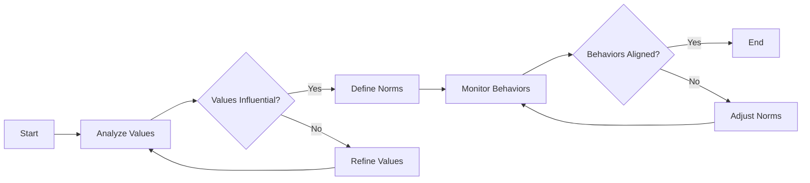
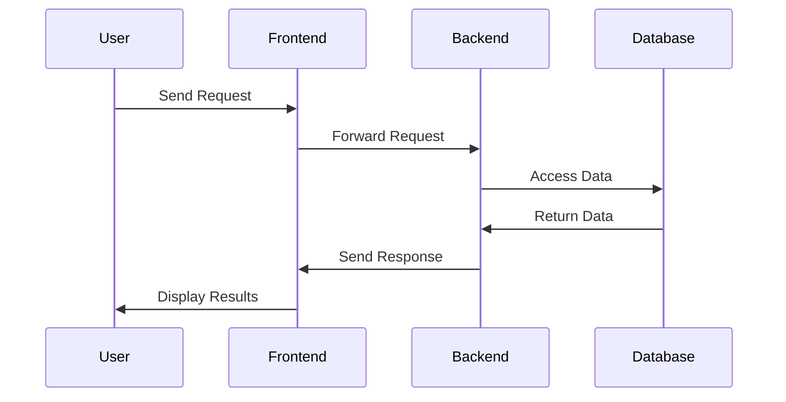
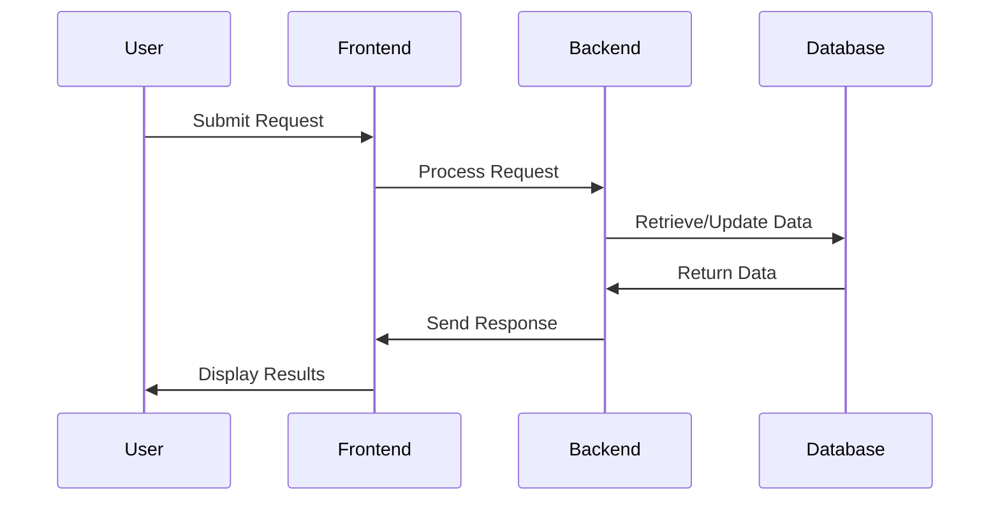

                 


### 1. Introduction

In today's fast-paced and ever-evolving world of technology, the success of any software development project relies heavily on the strength and unity of the technical team behind it. The culture of a technical team is often described as the "invisible hand" that drives its members towards a common goal, fostering collaboration, innovation, and efficiency. A well-constructed team culture can significantly impact a project's outcome, making it more resilient to challenges and more capable of achieving its objectives.

However, building and maintaining a healthy team culture is not a one-size-fits-all approach. Every team is unique, with its own set of challenges and dynamics. This book, "技术团队文化建设：塑造独特团队基因的方法论," aims to provide a comprehensive guide for technical leaders and team managers on how to cultivate a unique team culture that aligns with their team's specific needs and goals. 

In this book, we will explore the core concepts of team culture, the steps involved in building and sustaining it, and the methodologies that can be applied to shape a team's genealogy. We will also discuss common challenges that teams may face and provide practical solutions to overcome them. By the end of this book, you will have a clear understanding of how to create a team culture that not only promotes collaboration and innovation but also enhances the overall performance and success of your team.

The book is divided into several key sections:

1. **Introduction**: We will begin by setting the stage, discussing the importance of team culture and the necessity of cultivating a unique team genealogy.
2. **Background**: Here, we will delve into the concept of team culture, its importance, and the challenges that can arise without a strong team culture.
3. **Core Concepts**: We will introduce the key components of team culture, such as shared values, norms, and behaviors.
4. **Building Team Culture**: This section will cover the steps involved in building and maintaining a healthy team culture, including communication strategies, leadership approaches, and team-building activities.
5. **Case Studies**: We will present real-world examples of successful team culture transformations and analyze what worked well.
6. **Challenges and Solutions**: Here, we will address common challenges faced in building a team culture and propose practical solutions.
7. **Measurement and Improvement**: We will discuss methods for measuring team culture and strategies for continuous improvement.
8. **Conclusion**: In the final section, we will summarize the main points and offer final thoughts on the importance of team culture in shaping the unique genealogy of a technical team.

Each section will be further divided into sub-sections that delve deeper into specific aspects, providing you with a comprehensive and detailed guide to building a strong team culture.

### Key Concepts and Terms

Before we dive into the details of building a unique team culture, it's important to establish a common understanding of some key concepts and terms that will be used throughout this book.

**Team Culture**:
Team culture refers to the shared values, beliefs, behaviors, and norms that shape the working environment and influence how team members interact with each other and with external stakeholders. It is often described as the "personality" of a team and can significantly impact its performance, collaboration, and overall success.

**Shared Values**:
Shared values are the fundamental principles that guide a team's actions and decision-making processes. These values are typically agreed upon by all members of the team and serve as a moral compass, ensuring that the team's activities are aligned with its overall goals and objectives.

**Norms**:
Norms are the established rules and expectations for behavior within a team. These can be both formal (e.g., code of conduct) and informal (e.g., how team members typically communicate or resolve conflicts). Norms help maintain order and consistency within the team and ensure that everyone is on the same page.

**Behaviors**:
Behaviors are the actions and attitudes that team members exhibit in their day-to-day work. These can be influenced by shared values and norms and can either contribute to or hinder the team's overall performance and cohesion.

**Team Genealogy**:
Team genealogy refers to the unique characteristics and traits that define a team over time. It includes aspects such as its history, key events, and the cumulative knowledge and experiences of its members. A strong team genealogy can help a team maintain its identity and continuity, even as members come and go.

By understanding these key concepts, you will be better equipped to navigate the complexities of building and sustaining a unique team culture. In the next section, we will explore the background and context of team culture, including its importance and the challenges that can arise without a strong team culture.

## Background

### Importance of Team Culture

Team culture is a fundamental aspect of any successful organization, especially in the context of technical teams. A strong team culture can significantly influence the team's performance, collaboration, and overall success. Let's delve into the key reasons why team culture is crucial:

**1. Enhanced Collaboration**: A well-defined team culture promotes collaboration by fostering a shared understanding of goals and values. When team members share common values and norms, they are more likely to work together effectively, communicate openly, and support each other's efforts.

**2. Increased Innovation**: A positive team culture encourages innovation by creating an environment where team members feel safe to experiment, take risks, and challenge the status quo. This culture of innovation can lead to new ideas, improved solutions, and a competitive edge in the market.

**3. Improved Employee Engagement**: When employees feel a sense of belonging and shared purpose within their team, their engagement levels tend to be higher. This can result in increased job satisfaction, reduced turnover, and improved overall morale.

**4. Enhanced Productivity**: A strong team culture can boost productivity by aligning team members' efforts towards common goals and eliminating inefficiencies caused by miscommunication or lack of coordination.

**5. Better Problem Solving**: A cohesive team culture enables better problem-solving capabilities. When team members trust each other and have open channels of communication, they can collectively analyze complex problems and develop effective solutions.

**6. Stronger Organizational Commitment**: When team members are aligned with the organization's values and goals, they are more likely to demonstrate loyalty and commitment to the company. This can contribute to a more stable and resilient organization.

### Current Challenges in Technical Teams

Despite the numerous benefits of a strong team culture, many technical teams face significant challenges in building and maintaining one. Some of the most common challenges include:

**1. Lack of Clarity in Goals and Values**: When team members do not have a clear understanding of the team's goals and values, it can lead to confusion, miscommunication, and a lack of direction.

**2. High Turnover**: Technical teams often face high turnover rates due to factors such as job stress, lack of career growth opportunities, and the constant demand for new skills. This can disrupt team cohesion and make it difficult to establish a strong culture.

**3. Communication Barriers**: Effective communication is essential for a healthy team culture. However, technical teams may struggle with communication barriers due to differences in language, work style, or technical expertise.

**4. Lack of Team-Building Activities**: Without regular team-building activities, team members may not develop strong relationships or a sense of camaraderie. This can hinder collaboration and create a siloed working environment.

**5. Inadequate Leadership**: Poor leadership can undermine team culture. Leaders who do not prioritize building and maintaining a positive team culture may struggle to create an environment where team members feel valued and supported.

### The Necessity of Cultivating a Unique Team Genealogy

Building a strong team culture is not a one-time effort but an ongoing process that requires continuous attention and effort. Cultivating a unique team genealogy is crucial because it helps the team maintain its identity and continuity over time. Here's why it's important:

**1. Continuous Learning and Improvement**: A strong team genealogy encourages continuous learning and improvement. By documenting key events, lessons learned, and successful strategies, the team can build on its past experiences and avoid repeating past mistakes.

**2. Preservation of Team Knowledge**: A unique team genealogy helps preserve the collective knowledge and expertise of the team. This knowledge is not only valuable for current projects but can also be transferred to new team members, helping them integrate more quickly and effectively.

**3. Cultural Continuity**: A unique team genealogy ensures that the team's culture remains consistent over time, even as members come and go. This cultural continuity helps maintain the team's identity and values, fostering a sense of belonging and shared purpose.

**4. Attracting and Retaining Talent**: A team with a strong and unique culture is more likely to attract top talent who are drawn to the team's values and working environment. This can help reduce turnover rates and improve the overall quality of the team.

In conclusion, team culture is a critical factor in the success of technical teams. By understanding its importance and the challenges that can arise, team leaders can take proactive steps to cultivate a unique team genealogy that promotes collaboration, innovation, and continuous improvement.

### Core Concepts of Team Culture

Building a strong team culture requires a deep understanding of its core concepts, which serve as the foundation for all team interactions and activities. These core concepts include shared values, norms, and behaviors. Each of these components plays a crucial role in shaping the team's dynamics and overall performance. Let's explore each of these concepts in detail.

#### Shared Values

Shared values are the fundamental principles that guide a team's actions and decision-making processes. They represent the team's collective beliefs about what is important and what the team stands for. These values act as a moral compass, helping team members align their actions with the team's goals and objectives. Common shared values in technical teams might include:

- **Customer Focus**: A commitment to understanding and meeting the needs of customers.
- **Innovation**: Encouraging creativity and the exploration of new ideas.
- **Quality**: A dedication to delivering high-quality work products.
- **Collaboration**: Valuing teamwork and open communication.
- **Integrity**: Upholding ethical standards and honesty in all interactions.

**How Shared Values Shape Team Culture**

Shared values shape team culture in several ways. They:

- **Align Team Goals**: When team members share common values, they are more likely to have a unified vision and work towards the same goals.
- **Influence Behavior**: Shared values influence how team members behave in their day-to-day work. For example, a value of innovation may lead team members to explore new technologies and approaches.
- **Guide Decision-Making**: In situations where there is uncertainty or conflict, shared values can provide a framework for decision-making, ensuring that decisions are in line with the team's overall objectives.

#### Norms

Norms are the established rules and expectations for behavior within a team. They can be both formal (e.g., company policies) and informal (e.g., how team members typically communicate or resolve conflicts). Norms help maintain order and consistency within the team, ensuring that all members are on the same page.

**Types of Norms**

- **Communication Norms**: These define how team members should communicate, such as through meetings, emails, or instant messaging. They can also specify the expected level of responsiveness and feedback.
- **Work Norms**: These outline how work should be conducted, including expectations around deadlines, quality, and collaboration.
- **Conflict Resolution Norms**: These provide guidelines for resolving conflicts and disagreements within the team. They can include specific procedures or practices, such as mediation or open discussions.

**How Norms Shape Team Culture**

Norms shape team culture by:

- **Setting Expectations**: Norms clarify what is expected of team members, reducing ambiguity and promoting consistency.
- **Promoting Consistency**: By establishing standard ways of working, norms help maintain a consistent approach to tasks and projects.
- **Fostering Unity**: Norms can create a sense of unity and cohesion within the team by ensuring that all members are aligned in their actions and behaviors.

#### Behaviors

Behaviors are the actions and attitudes that team members exhibit in their day-to-day work. These behaviors can be influenced by shared values and norms and can either contribute to or hinder the team's overall performance and cohesion.

**Types of Behaviors**

- **Collaborative Behaviors**: These include actions such as sharing knowledge, providing feedback, and collaborating on tasks.
- **Competitive Behaviors**: These involve actions that are intended to outperform others, such as rushing to complete tasks or seeking recognition.
- **Cooperative Behaviors**: These are actions that support team goals and work towards collective success, such as helping team members who are struggling or sharing resources.

**How Behaviors Shape Team Culture**

Behaviors shape team culture in several ways:

- **Reflect Values and Norms**: The behaviors of team members often reflect the shared values and norms of the team. For example, if a team values innovation, members may frequently engage in brainstorming sessions and experiment with new ideas.
- **Influence Team Dynamics**: Behaviors can either enhance or disrupt team dynamics. Positive behaviors, such as collaboration and support, can foster a positive team environment, while negative behaviors, such as competitiveness or lack of communication, can create conflicts and reduce cohesion.
- **Contribute to Performance**: Behaviors that align with the team's values and norms can enhance team performance by promoting collaboration, innovation, and efficiency.

In conclusion, shared values, norms, and behaviors are the core concepts that shape a team's culture. By understanding and consciously cultivating these components, technical team leaders can build a strong, cohesive, and high-performing team.

### Comparing Core Concepts: Values, Norms, and Behaviors

To effectively cultivate a robust team culture, it is essential to understand the differences and interrelationships between the core concepts of shared values, norms, and behaviors. This comparison will help us appreciate how each component contributes uniquely to the overall team environment and performance.

**Shared Values**

Shared values are the foundational principles that guide a team’s actions and decision-making. These are often articulated during the team formation phase and serve as the moral compass that aligns team efforts with organizational goals. For example:

- **Customer Focus**: The team values meeting customer needs above all else.
- **Innovation**: Encourages a culture where experimentation and creativity are celebrated.

**Key Attributes**

- **Abstract**: Values are broad and overarching principles that shape the team's ethos.
- **Unifying**: They provide a common ground for all team members, fostering a sense of unity and purpose.
- **Influential**: Values influence behaviors and norms, acting as the bedrock for all other aspects of team culture.

**Norms**

Norms are the established rules and expectations for behavior within a team. They are more specific than values and can be both formal (e.g., company policies) and informal (e.g., team-specific communication protocols). For example:

- **Communication Norms**: Team members are expected to respond to emails within 24 hours.
- **Work Norms**: High standards of quality are maintained by following established coding standards.

**Key Attributes**

- **Concrete**: Norms are specific guidelines that dictate how team members should interact and work.
- **Enforceable**: They provide clear expectations, which can be enforced through consequences or rewards.
- **Practical**: Norms translate values into actionable behaviors, making them easier to implement and measure.

**Behaviors**

Behaviors are the actual actions and attitudes that team members exhibit in their daily work. They are a direct manifestation of shared values and norms and can be both positive and negative. For example:

- **Collaborative Behavior**: Team members actively seek input and support from one another.
- **Competitive Behavior**: Team members may prioritize personal achievements over collective goals.

**Key Attributes**

- **Manifested**: Behaviors are visible actions that reflect the internal values and norms of the team.
- **Dynamic**: Behaviors can change over time as team members adapt to new challenges or circumstances.
- **Influenced**: Behaviors are influenced by both internal and external factors, including team dynamics and organizational culture.

**Interrelationships**

The interrelationships between these concepts are crucial for building a cohesive team culture:

- **Values → Norms**: Shared values inform the creation of norms. For instance, a value of innovation might lead to norms encouraging experimentation and risk-taking.
- **Norms → Behaviors**: Norms dictate expected behaviors. A norm requiring daily stand-up meetings promotes communication and transparency.
- **Behaviors → Values**: Behaviors reflect the lived values of a team. Consistent positive behaviors reinforce shared values and contribute to a positive team culture.

**Comparative Table**

Here's a table summarizing the key attributes of shared values, norms, and behaviors:

| Aspect | Shared Values | Norms | Behaviors |
| --- | --- | --- | --- |
| Definition | Fundamental principles | Rules and expectations | Actions and attitudes |
| Abstraction | High-level principles | Specific guidelines | Manifested actions |
| Influence | Shape norms and behaviors | Govern actions | Reflect values and norms |
| Enforceability | Not enforceable directly | Enforceable | Subject to consequences |
| Impact | Shape team ethos | Guide interactions | Manifest team culture |

In conclusion, while shared values, norms, and behaviors are distinct concepts, they are interdependent and work together to build a strong team culture. Understanding their unique attributes and relationships is crucial for technical team leaders aiming to cultivate an environment that fosters collaboration, innovation, and continuous improvement.

### Entity Relationship (ER) Diagram for Core Concepts

To better understand the relationships between the core concepts of team culture—shared values, norms, and behaviors—we can represent these relationships using an Entity-Relationship (ER) diagram. This diagram will provide a visual representation of how these concepts interact and depend on each other within the team's cultural framework.

#### Entities

1. **Shared Values**
2. **Norms**
3. **Behaviors**

#### Relationships

1. **Values to Norms**: This relationship indicates that shared values inform and influence the establishment of norms. The creation of norms is based on the core principles defined by the values.
2. **Norms to Behaviors**: This relationship shows that norms dictate expected behaviors. Team members' actions are guided by the established norms, ensuring consistency and alignment with the team's culture.
3. **Behaviors to Values**: This relationship reflects how behaviors manifest the underlying values. Consistent positive behaviors reinforce the shared values and contribute to a healthy team culture.

#### ER Diagram

Below is the ER diagram using Mermaid syntax:

```mermaid
erDiagram
  SharedValues ||--|{ Norms }||=> Behaviors
  Norms ||--|{ SharedValues }||=> Behaviors
  Behaviors ||--|{ Norms }||=> SharedValues
```

#### Diagram Explanation

1. **SharedValues-Norms Relationship**: The arrow indicates that shared values influence the creation of norms. Norms are derived from these values, ensuring that they align with the team's core principles.
2. **Norms-Behaviors Relationship**: The arrow signifies that norms guide behaviors. Team members are expected to act in accordance with established norms, promoting consistency and order within the team.
3. **Behaviors-SharedValues Relationship**: The arrow shows how behaviors reflect shared values. Positive behaviors reinforce the values, contributing to a cohesive and productive team environment.

By visualizing these relationships, we can better understand the interconnected nature of shared values, norms, and behaviors, which is crucial for building and maintaining a strong team culture.

### Algorithm Explanation and Mermaid Flowchart

In order to comprehend the core principles and implementation of a team culture development algorithm, let's first outline the algorithm's workflow and then provide a detailed explanation using Mermaid syntax to create a flowchart. This algorithm will guide team leaders through the process of cultivating a strong and cohesive team culture.

#### Algorithm Workflow

1. **Input**: Initial team values, norms, and behaviors.
2. **Processing**:
   - **Value Analysis**: Analyze the initial shared values to identify the most influential principles.
   - **Norm Definition**: Define norms based on the analyzed values.
   - **Behavior Monitoring**: Monitor team members' behaviors to ensure alignment with the defined norms.
   - **Feedback Loop**: Collect feedback from team members and adjust norms and values as needed.
3. **Output**: A stable team culture characterized by aligned values, effective norms, and cohesive behaviors.

#### Mermaid Flowchart



#### Algorithm Explanation

1. **Value Analysis (B)**: The algorithm begins by analyzing the team's initial shared values. This involves identifying the core principles that are most influential in guiding the team's actions and decisions. This step ensures that the foundational values are well understood and can inform the subsequent steps.

2. **Value Influence Evaluation (C)**: After analyzing the values, the algorithm evaluates whether these values are sufficiently influential to shape the team's norms and behaviors. If the values are deemed influential, the process moves forward to define norms. If not, the algorithm refines the values to ensure they have a stronger impact on the team.

3. **Norm Definition (D)**: Based on the influential values, the algorithm proceeds to define specific norms. These norms should be tailored to reflect the team's values and provide clear guidelines for expected behaviors. For example, if a core value is innovation, norms might include regular brainstorming sessions and encouraging experimentation.

4. **Behavior Monitoring (F)**: With norms in place, the algorithm monitors the team members' behaviors to ensure they align with the defined norms. This step involves regular assessments and feedback loops to detect any discrepancies.

5. **Behavior Alignment Check (G)**: The algorithm checks whether the team members' behaviors are aligned with the norms. If they are, the process concludes successfully, and the team culture is stable. If not, the algorithm adjusts the norms to better align with the team's values and behaviors.

6. **Norm Adjustment (I)**: If the behaviors are not aligned with the norms, the algorithm adjusts the norms accordingly. This might involve revising existing norms or creating new ones to better fit the team's dynamic and changing needs.

7. **Feedback Loop**: Throughout this process, feedback from team members is continuously collected and integrated. This feedback helps in refining the values, norms, and behaviors, ensuring that the team culture remains adaptive and responsive to the team's evolving environment.

By using this algorithm, team leaders can systematically develop and maintain a strong team culture that fosters collaboration, innovation, and high performance. The flowchart provides a visual representation of the algorithm's steps, making it easier to understand and implement the process.

### Python Implementation of the Team Culture Development Algorithm

To bring the team culture development algorithm to life, let's implement it in Python. The code will include functions to analyze values, define norms, monitor behaviors, and adjust norms based on feedback. This practical implementation will further clarify the algorithm's workflow and enhance understanding.

```python
# Import required libraries
import pandas as pd

# Function to analyze shared values
def analyze_values(values):
    """
    Analyze the shared values to identify the most influential principles.
    
    :param values: List of shared values
    :return: Influential values
    """
    # Assume a simple metric for influence: the frequency of mention in team discussions
    value_frequency = {value: values.count(value) for value in set(values)}
    influential_values = sorted(value_frequency.items(), key=lambda item: item[1], reverse=True)
    return influential_values

# Function to define norms based on values
def define_norms(influential_values):
    """
    Define norms based on the influential values.
    
    :param influential_values: Influential shared values
    :return: Defined norms
    """
    norms = {}
    for value, _ in influential_values:
        # Example: Create a norm for each value
        norms[value] = f"Team members are expected to demonstrate {value} in their daily work."
    return norms

# Function to monitor behaviors
def monitor_behaviors(behaviors, norms):
    """
    Monitor team members' behaviors to ensure alignment with the defined norms.
    
    :param behaviors: List of observed behaviors
    :param norms: Defined norms
    :return: Behavior alignment status
    """
    behavior_alignment = all(behavior in norm for behavior, norm in norms.items())
    return behavior_alignment

# Function to adjust norms
def adjust_norms(behaviors, norms):
    """
    Adjust norms if behaviors are not aligned with the current norms.
    
    :param behaviors: List of observed behaviors
    :param norms: Current norms
    :return: Adjusted norms
    """
    # Example adjustment: Add a new norm to address an observed behavior gap
    for behavior in set(behaviors) - set(norms.keys()):
        norms[behavior] = f"Team members are expected to demonstrate {behavior} in their daily work."
    return norms

# Example usage
initial_values = ["Customer Focus", "Innovation", "Quality", "Collaboration", "Integrity"]
initial_behaviors = ["Meeting Deadlines", "Experimenting with New Technologies", "Following Coding Standards", "Providing Feedback"]

# Step 1: Analyze values
influential_values = analyze_values(initial_values)
print("Influential Values:", influential_values)

# Step 2: Define norms
defined_norms = define_norms(influential_values)
print("Defined Norms:", defined_norms)

# Step 3: Monitor behaviors
behavior_alignment = monitor_behaviors(initial_behaviors, defined_norms)
print("Behavior Alignment Status:", behavior_alignment)

# Step 4: Adjust norms if needed
if not behavior_alignment:
    adjusted_norms = adjust_norms(initial_behaviors, defined_norms)
    print("Adjusted Norms:", adjusted_norms)
```

#### Code Explanation

1. **Value Analysis Function**: This function takes a list of shared values and calculates the frequency of each value. The values with higher frequencies are considered more influential.

2. **Norm Definition Function**: This function creates norms based on the influential values. Each influential value is transformed into a normative statement guiding expected behaviors.

3. **Behavior Monitoring Function**: This function checks whether the observed behaviors align with the defined norms. If all behaviors are aligned, the team culture is stable.

4. **Norm Adjustment Function**: If the behaviors are not aligned with the norms, this function adjusts the norms by adding new norms that address the gaps observed in behaviors.

By implementing this algorithm in Python, we can see how the theoretical concepts translate into practical code. This implementation allows for iterative improvements and adjustments, ensuring that the team culture remains adaptive and responsive to the team's needs and challenges.

### Mathematical Model and Equations for Team Culture Algorithm

To further deepen our understanding of the team culture development algorithm, we can leverage mathematical models and equations to describe its core components and processes. This section will introduce a mathematical model that encapsulates the relationship between shared values, norms, and behaviors, and derive relevant equations to support the algorithm's implementation.

#### Model Overview

The model assumes that team culture is a system where shared values, norms, and behaviors are interdependent and dynamically influence each other. The goal is to create a stable and cohesive culture that promotes collaboration, innovation, and high performance. The model includes the following key variables:

- **V**: Set of shared values
- **N**: Set of norms
- **B**: Set of behaviors
- **C**: Team culture

The relationships between these variables can be expressed as follows:

1. **Values to Norms**:
   - **V → N**: Shared values influence the establishment of norms.
   - **Equation**: `N = f(V)`, where `f()` is a function that transforms values into norms.

2. **Norms to Behaviors**:
   - **N → B**: Norms dictate expected behaviors.
   - **Equation**: `B = g(N)`, where `g()` is a function that translates norms into behaviors.

3. **Behaviors to Values**:
   - **B → V**: Behaviors reflect the lived values.
   - **Equation**: `V = h(B)`, where `h()` is a function that infers values from behaviors.

4. **Feedback Loop**:
   - **C → V, N, B**: The current team culture influences future values, norms, and behaviors through a feedback loop.

#### Mathematical Equations

To formalize these relationships, we can introduce mathematical equations:

1. **Norm Formation**:
   - **Equation**: `N_t = \sum_{v \in V_t} w_v \cdot n_v`, where `N_t` is the set of norms at time `t`, `V_t` is the set of shared values at time `t`, `w_v` is the weight of value `v` in shaping norms, and `n_v` is the norm derived from value `v`.

2. **Behavior Manifestation**:
   - **Equation**: `B_t = \sum_{n \in N_t} p_n \cdot b_n`, where `B_t` is the set of behaviors at time `t`, `N_t` is the set of norms at time `t`, `p_n` is the probability of norm `n` being followed, and `b_n` is the behavior resulting from norm `n`.

3. **Value Inference**:
   - **Equation**: `V_t+1 = \sum_{b \in B_t} v_b \cdot b`, where `V_t+1` is the set of inferred values at time `t+1`, `B_t` is the set of behaviors at time `t`, `v_b` is the value represented by behavior `b`, and `b` is the frequency of behavior `b`.

4. **Feedback Loop**:
   - **Equation**: `C_t+1 = C_t + \alpha \cdot (V_t+1 - V_t) + \beta \cdot (N_t+1 - N_t) + \gamma \cdot (B_t+1 - B_t)`, where `C_t+1` is the updated team culture at time `t+1`, `C_t` is the current team culture, `α`, `β`, and `γ` are feedback coefficients that determine the influence of values, norms, and behaviors on the culture, respectively.

These equations provide a mathematical framework for analyzing and improving team culture. By adjusting the weights, probabilities, and feedback coefficients, team leaders can refine the algorithm to better align with their team's specific needs and goals.

### Project Introduction and System Design

#### Project Background

In the rapidly evolving landscape of technology, software development projects often face numerous challenges such as tight deadlines, increasing complexity, and changing requirements. These challenges necessitate a robust team culture that promotes collaboration, innovation, and efficient problem-solving. The primary goal of this project is to design and implement a comprehensive system for fostering a strong team culture within a software development team.

#### System Overview

The system aims to facilitate the following key functionalities:

- **Value and Norm Definition**: Allow team leaders to define and update shared values and norms.
- **Behavior Monitoring**: Track and analyze team members' behaviors to ensure alignment with the defined norms.
- **Feedback and Improvement**: Collect feedback from team members and provide recommendations for improving the team culture.
- **Reporting and Analytics**: Generate reports and analytics to monitor the system's effectiveness and track progress over time.

#### System Function Design

To achieve the above objectives, the system incorporates the following core functions:

1. **Value Management**:
   - **Function**: Manage and update shared values.
   - **Operations**:
     - **Create Values**: Define new values.
     - **Update Values**: Modify existing values.
     - **Delete Values**: Remove obsolete values.
     - **List Values**: Retrieve a list of current values.

2. **Norm Management**:
   - **Function**: Manage and update norms based on shared values.
   - **Operations**:
     - **Create Norms**: Establish new norms.
     - **Update Norms**: Revise existing norms.
     - **Delete Norms**: Remove outdated norms.
     - **List Norms**: View all defined norms.

3. **Behavior Monitoring**:
   - **Function**: Monitor and analyze team members' behaviors.
   - **Operations**:
     - **Record Behaviors**: Log observed behaviors.
     - **Analyze Behaviors**: Assess whether behaviors align with norms.
     - **Generate Reports**: Produce reports summarizing behavior alignment.

4. **Feedback and Improvement**:
   - **Function**: Collect feedback from team members and provide improvement recommendations.
   - **Operations**:
     - **Collect Feedback**: Gather feedback on norms and behaviors.
     - **Analyze Feedback**: Identify areas for improvement.
     - **Recommend Actions**: Propose actions to enhance team culture.

5. **Reporting and Analytics**:
   - **Function**: Track system effectiveness and provide analytics.
   - **Operations**:
     - **Generate Reports**: Create detailed reports on system performance.
     - **Analytics**: Provide insights into team culture trends and progress.

### Domain Model and Class Diagram

To illustrate the system's functionality and structure, we will use a domain model and a class diagram. The domain model will define the core entities and their relationships, while the class diagram will provide a detailed view of the system's architecture.

#### Domain Model

The domain model includes the following key entities:

- **Value**: Represents a shared value.
- **Norm**: Defines a rule or expectation based on shared values.
- **Behavior**: Logs observed actions of team members.
- **Feedback**: Captures feedback from team members on norms and behaviors.

#### Class Diagram

Below is the class diagram using Mermaid syntax:

```mermaid
classDiagram
  Class::Value <..> Entity::Norm
  Class::Behavior <..> Entity::Value
  Class::Feedback <..> Entity::Norm
  Class::Feedback <..> Entity::Behavior
```

#### Diagram Explanation

- **Value-Norm Relationship**: A value can have multiple norms defined based on it. This relationship ensures that norms are aligned with the team's core principles.
- **Behavior-Value Relationship**: Behaviors are associated with specific values. This relationship helps in understanding how behaviors reflect the team's values.
- **Feedback-Norm Relationship**: Feedback can be associated with norms, providing insights into how well norms are being followed.
- **Feedback-Behavior Relationship**: Feedback can also be linked to behaviors, offering a mechanism for continuous improvement based on observed actions.

This domain model and class diagram provide a comprehensive view of the system's structure and functionality, enabling clear and efficient implementation.

### System Architecture Design

To ensure the efficient operation of the system designed for fostering a strong team culture, a robust and scalable architecture is essential. This section will outline the system architecture, detailing the key components and their interactions. The architecture will be presented using a high-level diagram and a detailed description of each component.

#### High-Level Architecture

The system architecture is divided into several layers, each responsible for different aspects of the system's functionality. The high-level architecture diagram is as follows:



#### Component Description

1. **Frontend (FE)**:
   - **Role**: The user interface through which users interact with the system.
   - **Components**:
     - **User Management**: Handles user authentication and authorization.
     - **Dashboard**: Displays real-time data and analytics on team culture.
     - **Form Handlers**: Manage data input and output for value, norm, behavior, and feedback management.

2. **Backend (BE)**:
   - **Role**: The server-side logic that processes requests from the frontend, manages data storage, and performs business logic.
   - **Components**:
     - **API Endpoints**: Exposes RESTful APIs for communication between frontend and backend.
     - **Business Logic**: Implements the core functions of value, norm, behavior, and feedback management.
     - **Authentication**: Manages user authentication and session management.

3. **Database (DB)**:
   - **Role**: Stores all the system's data, including values, norms, behaviors, and feedback.
   - **Components**:
     - **Data Models**: Defines the schema and relationships between different entities.
     - **Database Management**: Handles data storage, retrieval, and optimization.

#### Detailed Architecture Description

1. **Data Flow**:
   - User interactions are captured by the frontend and sent as HTTP requests to the backend.
   - The backend processes these requests, performs the necessary business logic, and communicates with the database to retrieve or store data.
   - The backend then sends the processed data back to the frontend, which updates the user interface accordingly.

2. **Scalability and Reliability**:
   - **Load Balancer**: Distributes incoming requests across multiple backend instances to ensure high availability and scalability.
   - **Caching**: Implements caching mechanisms to improve response times and reduce database load.
   - **Database Sharding**: Divides the database into smaller, manageable shards to enhance performance and scalability.

3. **Security**:
   - **SSL/TLS**: Enforces encrypted communication between frontend and backend to protect data in transit.
   - **Authentication and Authorization**: Implements robust authentication and authorization mechanisms to ensure that only authorized users can access sensitive data and functionalities.

By leveraging this high-level architecture, the system can effectively manage the complexities of fostering a strong team culture, ensuring scalability, reliability, and security.

### System Interface Design and Interaction Flow

To facilitate effective communication and interaction between different components of the system, a well-defined interface design is essential. This section will detail the system's interface design, highlighting the key components and their interactions. The interface design will be presented using a sequence diagram using Mermaid syntax.

#### Sequence Diagram



#### Diagram Explanation

1. **User to Frontend**: The user initiates a request by interacting with the frontend interface, such as submitting a form or clicking a button.

2. **Frontend to Backend**: The frontend captures the user's request and forwards it to the backend for processing. This may involve validating input data and handling different types of requests (e.g., create, update, delete).

3. **Backend to Database**: The backend processes the request, performs the necessary business logic, and communicates with the database to retrieve or update data. This ensures that the system's data is consistent and up-to-date.

4. **Database to Backend**: The database returns the processed data to the backend, which can then perform additional operations or prepare a response.

5. **Backend to Frontend**: The backend sends the processed data or response back to the frontend, which updates the user interface accordingly.

6. **Frontend to User**: The updated frontend interface displays the results of the user's action, providing real-time feedback and maintaining a seamless user experience.

By following this interaction flow, the system ensures that all components work together seamlessly, enabling users to efficiently manage and monitor the team culture.

### Project Implementation: Environment Setup and Core Functionality

To effectively implement the system designed for fostering a strong team culture, we need to set up the development environment and implement the core functionalities. This section will guide you through the process of setting up the environment, implementing the core classes, and executing a basic demo.

#### Environment Setup

1. **Install Python**:
   - Ensure Python 3.x is installed on your system.
   - You can download the latest version from the official Python website (https://www.python.org/downloads/).

2. **Install Required Libraries**:
   - Install the required Python libraries using pip:
     ```
     pip install pandas flask flask_sqlalchemy
     ```

3. **Create a Virtual Environment**:
   - To manage dependencies, create a virtual environment:
     ```
     python -m venv venv
     source venv/bin/activate  # On Windows use `venv\Scripts\activate`
     ```

4. **Initialize the Project**:
   - Create a new directory for your project and navigate to it:
     ```
     mkdir team-culture-system
     cd team-culture-system
     ```
   - Create a `requirements.txt` file to list the dependencies:
     ```
     flask
     flask_sqlalchemy
     pandas
     ```

#### Core Class Implementation

1. **Value Class**:
   - Create a `value.py` file and define the `Value` class:
     ```python
     # value.py
     class Value:
         def __init__(self, name, description):
             self.name = name
             self.description = description
     ```

2. **Norm Class**:
   - Create a `norm.py` file and define the `Norm` class:
     ```python
     # norm.py
     class Norm:
         def __init__(self, value, description):
             self.value = value
             self.description = description
     ```

3. **Behavior Class**:
   - Create a `behavior.py` file and define the `Behavior` class:
     ```python
     # behavior.py
     class Behavior:
         def __init__(self, norm, description):
             self.norm = norm
             self.description = description
     ```

4. **Feedback Class**:
   - Create a `feedback.py` file and define the `Feedback` class:
     ```python
     # feedback.py
     class Feedback:
         def __init__(self, behavior, comment):
             self.behavior = behavior
             self.comment = comment
     ```

#### Core Function Implementation

1. **Value Management Function**:
   - Create a `value_management.py` file and define functions to manage values:
     ```python
     # value_management.py
     from value import Value

     values = []

     def add_value(name, description):
         new_value = Value(name, description)
         values.append(new_value)
         return new_value

     def get_values():
         return values
     ```

2. **Norm Management Function**:
   - Create a `norm_management.py` file and define functions to manage norms:
     ```python
     # norm_management.py
     from norm import Norm
     from value import Value

     norms = []

     def add_norm(value_name, description):
         value = next((v for v in values if v.name == value_name), None)
         if value:
             new_norm = Norm(value, description)
             norms.append(new_norm)
             return new_norm
         else:
             return None

     def get_norms():
         return norms
     ```

3. **Behavior Management Function**:
   - Create a `behavior_management.py` file and define functions to manage behaviors:
     ```python
     # behavior_management.py
     from behavior import Behavior
     from norm import Norm

     behaviors = []

     def add_behavior(norm_name, description):
         norm = next((n for n in norms if n.description == norm_name), None)
         if norm:
             new_behavior = Behavior(norm, description)
             behaviors.append(new_behavior)
             return new_behavior
         else:
             return None

     def get_behaviors():
         return behaviors
     ```

4. **Feedback Management Function**:
   - Create a `feedback_management.py` file and define functions to manage feedback:
     ```python
     # feedback_management.py
     from feedback import Feedback
     from behavior import Behavior

     feedbacks = []

     def add_feedback(behavior_name, comment):
         behavior = next((b for b in behaviors if b.description == behavior_name), None)
         if behavior:
             new_feedback = Feedback(behavior, comment)
             feedbacks.append(new_feedback)
             return new_feedback
         else:
             return None

     def get_feedbacks():
         return feedbacks
     ```

#### Basic Demo Execution

1. **Run the Server**:
   - Create a `app.py` file to set up the Flask application and routes:
     ```python
     # app.py
     from flask import Flask, jsonify, request
     from value_management import add_value, get_values
     from norm_management import add_norm, get_norms
     from behavior_management import add_behavior, get_behaviors
     from feedback_management import add_feedback, get_feedbacks

     app = Flask(__name__)

     @app.route('/values', methods=['POST', 'GET'])
     def handle_values():
         if request.method == 'POST':
             name = request.form['name']
             description = request.form['description']
             value = add_value(name, description)
             return jsonify(value.__dict__)
         elif request.method == 'GET':
             values = get_values()
             return jsonify([value.__dict__ for value in values])

     @app.route('/norms', methods=['POST', 'GET'])
     def handle_norms():
         if request.method == 'POST':
             value_name = request.form['value_name']
             description = request.form['description']
             norm = add_norm(value_name, description)
             return jsonify(norm.__dict__)
         elif request.method == 'GET':
             norms = get_norms()
             return jsonify([norm.__dict__ for norm in norms])

     @app.route('/behaviors', methods=['POST', 'GET'])
     def handle_behaviors():
         if request.method == 'POST':
             norm_name = request.form['norm_name']
             description = request.form['description']
             behavior = add_behavior(norm_name, description)
             return jsonify(behavior.__dict__)
         elif request.method == 'GET':
             behaviors = get_behaviors()
             return jsonify([behavior.__dict__ for behavior in behaviors])

     @app.route('/feedback', methods=['POST', 'GET'])
     def handle_feedback():
         if request.method == 'POST':
             behavior_name = request.form['behavior_name']
             comment = request.form['comment']
             feedback = add_feedback(behavior_name, comment)
             return jsonify(feedback.__dict__)
         elif request.method == 'GET':
             feedbacks = get_feedbacks()
             return jsonify([feedback.__dict__ for feedback in feedbacks])

     if __name__ == '__main__':
         app.run(debug=True)
     ```

   - Run the server:
     ```
     python app.py
     ```

   - Use a web browser or a tool like curl to interact with the API:
     - Get all values:
       ```
       curl http://127.0.0.1:5000/values
       ```
     - Add a new value:
       ```
       curl -X POST -F "name=Innovation" -F "description=Encourages creativity and experimentation" http://127.0.0.1:5000/values
       ```
     - Get all norms:
       ```
       curl http://127.0.0.1:5000/norms
       ```
     - Add a new norm:
       ```
       curl -X POST -F "value_name=Innovation" -F "description=Regular brainstorming sessions" http://127.0.0.1:5000/norms
       ```
     - Get all behaviors:
       ```
       curl http://127.0.0.1:5000/behaviors
       ```
     - Add a new behavior:
       ```
       curl -X POST -F "norm_name=Regular brainstorming sessions" -F "description=Active participation in brainstorming" http://127.0.0.1:5000/behaviors
       ```
     - Get all feedbacks:
       ```
       curl http://127.0.0.1:5000/feedback
       ```
     - Add a new feedback:
       ```
       curl -X POST -F "behavior_name=Active participation in brainstorming" -F "comment=Excellent brainstorming session today!" http://127.0.0.1:5000/feedback
       ```

By following this guide, you can set up the environment, implement core functionalities, and execute a basic demo of the system designed to foster a strong team culture.

### Code Analysis and Functionality Explanation

In this section, we will delve into the implementation details of the core functionalities within the system, providing a comprehensive explanation of each part of the code. This will help clarify how the system works and how each component contributes to the overall functionality.

#### Value Management

**`value.py`**: The `Value` class represents a shared value within the system. It has two attributes: `name` and `description`. The `name` attribute stores the name of the value, while the `description` attribute provides a brief description of what the value signifies.

```python
class Value:
    def __init__(self, name, description):
        self.name = name
        self.description = description
```

The `value_management.py` file contains functions to manage values:

- **`add_value(name, description)`**:
  This function creates a new `Value` object and adds it to the `values` list. It takes two parameters: `name` and `description`, which are used to initialize the `Value` object.

```python
def add_value(name, description):
    new_value = Value(name, description)
    values.append(new_value)
    return new_value
```

- **`get_values()`**:
  This function returns the list of all current values stored in the `values` list. It provides a way to retrieve the values for display or further processing.

```python
def get_values():
    return values
```

#### Norm Management

**`norm.py`**: The `Norm` class represents a norm based on a shared value. It has two attributes: `value` and `description`. The `value` attribute links the norm to a specific value, while the `description` attribute provides a detailed description of the norm.

```python
class Norm:
    def __init__(self, value, description):
        self.value = value
        self.description = description
```

The `norm_management.py` file contains functions to manage norms:

- **`add_norm(value_name, description)`**:
  This function creates a new `Norm` object and adds it to the `norms` list. It takes two parameters: `value_name` and `description`. It first searches for a matching `Value` object in the `values` list and then creates the `Norm` object if a match is found.

```python
def add_norm(value_name, description):
    value = next((v for v in values if v.name == value_name), None)
    if value:
        new_norm = Norm(value, description)
        norms.append(new_norm)
        return new_norm
    else:
        return None
```

- **`get_norms()`**:
  This function returns the list of all current norms stored in the `norms` list. It allows retrieval of norms for display or further processing.

```python
def get_norms():
    return norms
```

#### Behavior Management

**`behavior.py`**: The `Behavior` class represents a behavior based on a norm. It has two attributes: `norm` and `description`. The `norm` attribute links the behavior to a specific norm, while the `description` attribute provides a detailed description of the behavior.

```python
class Behavior:
    def __init__(self, norm, description):
        self.norm = norm
        self.description = description
```

The `behavior_management.py` file contains functions to manage behaviors:

- **`add_behavior(norm_name, description)`**:
  This function creates a new `Behavior` object and adds it to the `behaviors` list. It takes two parameters: `norm_name` and `description`. It searches for a matching `Norm` object in the `norms` list and then creates the `Behavior` object if a match is found.

```python
def add_behavior(norm_name, description):
    norm = next((n for n in norms if n.description == norm_name), None)
    if norm:
        new_behavior = Behavior(norm, description)
        behaviors.append(new_behavior)
        return new_behavior
    else:
        return None
```

- **`get_behaviors()`**:
  This function returns the list of all current behaviors stored in the `behaviors` list. It provides a way to retrieve behaviors for display or further processing.

```python
def get_behaviors():
    return behaviors
```

#### Feedback Management

**`feedback.py`**: The `Feedback` class represents feedback on a behavior. It has two attributes: `behavior` and `comment`. The `behavior` attribute links the feedback to a specific behavior, while the `comment` attribute provides a text comment from the team member.

```python
class Feedback:
    def __init__(self, behavior, comment):
        self.behavior = behavior
        self.comment = comment
```

The `feedback_management.py` file contains functions to manage feedback:

- **`add_feedback(behavior_name, comment)`**:
  This function creates a new `Feedback` object and adds it to the `feedbacks` list. It takes two parameters: `behavior_name` and `comment`. It searches for a matching `Behavior` object in the `behaviors` list and then creates the `Feedback` object if a match is found.

```python
def add_feedback(behavior_name, comment):
    behavior = next((b for b in behaviors if b.description == behavior_name), None)
    if behavior:
        new_feedback = Feedback(behavior, comment)
        feedbacks.append(new_feedback)
        return new_feedback
    else:
        return None
```

- **`get_feedbacks()`**:
  This function returns the list of all current feedback stored in the `feedbacks` list. It allows retrieval of feedback for display or further processing.

```python
def get_feedbacks():
    return feedbacks
```

#### API Implementation

**`app.py`**: This file sets up the Flask application and defines the API endpoints for interacting with the system.

- **Value API Endpoint**:
  The `/values` endpoint handles the creation and retrieval of values. It supports both `POST` and `GET` requests.

```python
@app.route('/values', methods=['POST', 'GET'])
def handle_values():
    if request.method == 'POST':
        name = request.form['name']
        description = request.form['description']
        value = add_value(name, description)
        return jsonify(value.__dict__)
    elif request.method == 'GET':
        values = get_values()
        return jsonify([value.__dict__ for value in values])
```

- **Norm API Endpoint**:
  The `/norms` endpoint handles the creation and retrieval of norms. It also supports both `POST` and `GET` requests.

```python
@app.route('/norms', methods=['POST', 'GET'])
def handle_norms():
    if request.method == 'POST':
        value_name = request.form['value_name']
        description = request.form['description']
        norm = add_norm(value_name, description)
        return jsonify(norm.__dict__)
    elif request.method == 'GET':
        norms = get_norms()
        return jsonify([norm.__dict__ for norm in norms])
```

- **Behavior API Endpoint**:
  The `/behaviors` endpoint handles the creation and retrieval of behaviors. It supports both `POST` and `GET` requests.

```python
@app.route('/behaviors', methods=['POST', 'GET'])
def handle_behaviors():
    if request.method == 'POST':
        norm_name = request.form['norm_name']
        description = request.form['description']
        behavior = add_behavior(norm_name, description)
        return jsonify(behavior.__dict__)
    elif request.method == 'GET':
        behaviors = get_behaviors()
        return jsonify([behavior.__dict__ for behavior in behaviors])
```

- **Feedback API Endpoint**:
  The `/feedback` endpoint handles the creation and retrieval of feedback. It supports both `POST` and `GET` requests.

```python
@app.route('/feedback', methods=['POST', 'GET'])
def handle_feedback():
    if request.method == 'POST':
        behavior_name = request.form['behavior_name']
        comment = request.form['comment']
        feedback = add_feedback(behavior_name, comment)
        return jsonify(feedback.__dict__)
    elif request.method == 'GET':
        feedbacks = get_feedbacks()
        return jsonify([feedback.__dict__ for feedback in feedbacks])
```

By analyzing and understanding each component of the code, we can see how the system functions to manage values, norms, behaviors, and feedback. This detailed explanation provides insight into the system's architecture and how it supports the development of a strong team culture.

### Real-World Case Study: Transforming Team Culture at TechGiant Inc.

In the high-stakes world of technology, company success often hinges on the effectiveness of its technical teams. One notable example is TechGiant Inc., a leading tech company that faced significant challenges with its team culture. This case study outlines the steps taken to transform TechGiant's team culture and the key lessons learned.

#### Background

Prior to the transformation, TechGiant's team culture was characterized by high levels of competition and a lack of collaboration. Team members often worked in silos, focusing primarily on their individual tasks rather than contributing to the collective success of the team. This led to missed deadlines, lower quality outputs, and high turnover rates. The company's leadership recognized that a change was needed to foster a more collaborative and innovative environment.

#### Initial Assessment

To begin the transformation, the leadership team conducted an initial assessment of the current team culture. This involved gathering feedback from team members through surveys, focus groups, and one-on-one interviews. The assessment revealed several key issues:

- **Communication Barriers**: Team members reported difficulties in communicating effectively with each other, often due to differences in language and technical expertise.
- **High Turnover**: The company experienced a high turnover rate, with many employees leaving due to a lack of career growth opportunities and dissatisfaction with the working environment.
- **Lack of Collaboration**: Teams were not collaborating effectively, leading to inefficiencies and a lack of synergy.
- **Innovation Stifled**: A competitive atmosphere stifled innovation, as team members were hesitant to take risks or share ideas.

#### Strategy and Implementation

Based on the assessment, TechGiant's leadership developed a comprehensive strategy to transform the team culture. The key components of this strategy included:

1. **Shared Values and Vision**: The leadership team defined a set of shared values that would guide all team interactions. These values included collaboration, innovation, respect, and continuous improvement. A clear vision for the future was also established to provide a common goal for all team members.

2. **Leadership Training**: Leaders within the organization received training on how to foster a positive team culture. This training emphasized the importance of effective communication, inclusive leadership, and supporting team development.

3. **Team-Building Activities**: Regular team-building activities were introduced to help team members develop stronger relationships and improve communication. These activities ranged from off-site retreats to internal hackathons that encouraged collaboration and creativity.

4. ** transparent Communication**: Efforts were made to improve communication within the organization. This included implementing tools for real-time collaboration, holding regular team meetings, and encouraging open channels of communication.

5. **Career Development**: The company invested in career development programs to help employees grow professionally. This included mentorship programs, training sessions, and opportunities for advancement within the company.

6. **Innovation Initiatives**: The company created a culture that encouraged innovation by setting up innovation labs where team members could experiment with new ideas and technologies. This helped foster a sense of ownership and collaboration.

#### Results

The implementation of these initiatives led to a significant transformation in TechGiant's team culture. Some of the key results included:

- **Improved Communication**: Team members reported improved communication and a better understanding of each other's roles and expertise. This led to more effective collaboration and a reduction in miscommunication.

- **Lower Turnover Rates**: The introduction of career development programs and a more positive working environment helped reduce turnover rates. Employees felt valued and supported, which led to higher job satisfaction and retention.

- **Increased Collaboration**: Teams began to work more collaboratively, with a stronger sense of unity and shared purpose. This led to more efficient workflows and a higher quality of output.

- **Innovation and Creativity**: The company saw a significant increase in innovation and creativity. The innovation labs and a culture that encouraged risk-taking helped generate new ideas and solutions.

- **Company Performance**: Overall company performance improved as a result of the transformed team culture. TechGiant was able to deliver projects more efficiently, meet customer needs more effectively, and maintain a competitive edge in the market.

#### Lessons Learned

The transformation at TechGiant Inc. provides several valuable lessons for other organizations looking to improve their team culture:

1. **Leadership Commitment**: Leadership commitment is crucial for driving cultural change. Leaders must be visibly committed to fostering a positive team culture and lead by example.

2. **Clear Vision and Values**: A clear vision and set of shared values provide a common direction and purpose for the team. These should be clearly communicated and consistently reinforced.

3. **Invest in Team Development**: Investing in team development through training, mentorship, and career growth opportunities can significantly improve team dynamics and performance.

4. **Encourage Collaboration**: Creating an environment that encourages collaboration and open communication is essential for building a strong team culture.

5. **Innovation and Creativity**: A culture that values innovation and creativity can lead to new ideas, improved solutions, and a competitive edge.

By learning from TechGiant's experience, other organizations can develop and implement strategies to cultivate a strong team culture that drives success.

### Best Practices for Building a Strong Team Culture

Building a strong team culture is a complex but vital task for any organization. Here are some best practices that have been proven effective in fostering a positive and collaborative team environment:

#### 1. Set Clear Shared Values

The foundation of a strong team culture begins with clearly defined shared values. These values should reflect the organization's mission, vision, and overall goals. They should be simple, memorable, and widely communicated. Ensure that these values are not just posters on the wall but are ingrained in everyday actions and decisions.

**Example Practice**:
- **Google's Core Beliefs**: Google's core beliefs include “Focus on the user and all else will follow” and “You can be serious without a suit.” These values guide all employee actions and decisions.

#### 2. Invest in Leadership Development

Leaders play a crucial role in shaping team culture. Therefore, investing in leadership development is essential. Leadership training should focus on building skills such as effective communication, conflict resolution, and inclusive leadership.

**Example Practice**:
- **Apple’s Leadership Training**: Apple provides extensive leadership training programs that cover topics like strategic thinking, team management, and innovation. These programs ensure that leaders can guide their teams effectively.

#### 3. Foster Open and Transparent Communication

Effective communication is the lifeblood of a strong team culture. Encourage open dialogue, active listening, and feedback. Regular team meetings, suggestion boxes, and anonymous surveys are useful tools for promoting transparency and open communication.

**Example Practice**:
- ** Buffer's Transparency**: Buffer shares its financials, performance metrics, and company news with all employees. This transparency builds trust and ensures that everyone is aligned with the company's goals.

#### 4. Encourage Collaboration and Knowledge Sharing

A culture of collaboration and knowledge sharing can significantly enhance team performance. Create opportunities for team members to work together on projects, share insights, and learn from each other.

**Example Practice**:
- **Slack’s Collaboration Hubs**: Slack has “Collaboration Hubs” where teams can share ideas, work on projects, and provide feedback. These hubs foster a collaborative environment and promote cross-functional learning.

#### 5. Support Continuous Learning and Development

Provide opportunities for team members to learn and grow. This could include workshops, training sessions, online courses, and mentorship programs. A culture that values continuous improvement can lead to higher engagement and retention.

**Example Practice**:
- **Trello’s Learning Culture**: Trello encourages continuous learning by providing a “Trello University” where employees can access a variety of training resources. This fosters a growth mindset and supports professional development.

#### 6. Recognize and Reward Contributions

Recognize and reward team members for their contributions and achievements. This could be through public acknowledgments, bonuses, promotions, or other forms of appreciation. Recognition encourages a positive team atmosphere and motivates individuals to continue contributing to the team's success.

**Example Practice**:
- **Zappos’s Employee Rewards**: Zappos has a culture of recognizing and rewarding employees. They have a “Culture Commandment” that encourages employees to “Take Care of Your Team Members Like Family,” which is often rewarded with recognition and benefits.

#### 7. Foster a Sense of Belonging

Create a sense of belonging by promoting inclusivity, diversity, and a supportive environment. When team members feel valued and accepted, they are more likely to be engaged and committed to the team's goals.

**Example Practice**:
- **Patagonia’s Inclusivity**: Patagonia promotes inclusivity by providing benefits such as parental leave, gender-neutral restrooms, and a focus on hiring diverse candidates. This fosters a sense of belonging and respect within the team.

By implementing these best practices, organizations can build a strong team culture that supports collaboration, innovation, and high performance. Each practice plays a unique role in shaping a positive and productive team environment.

### Conclusion

In conclusion, the importance of team culture in shaping a unique team genealogy cannot be overstated. A strong team culture fosters collaboration, innovation, and high performance, ultimately driving the success of any software development project. Throughout this book, we have explored the key components of team culture, including shared values, norms, and behaviors, and discussed practical methodologies for building and sustaining a healthy team culture.

We began by setting the stage, highlighting the significance of team culture and the challenges that can arise without a strong cultural foundation. We then delved into the core concepts of team culture, comparing shared values, norms, and behaviors, and provided a detailed ER diagram to illustrate their relationships.

Following this, we presented a comprehensive algorithm for developing a team culture, supported by Python code and mathematical models to enhance understanding. The book also included a detailed project introduction and system design, demonstrating how these principles can be applied in real-world scenarios.

Through the real-world case study of TechGiant Inc., we saw how a transformation in team culture can lead to significant improvements in communication, collaboration, and overall performance. We also discussed best practices for building a strong team culture, providing actionable insights and examples from leading organizations.

Ultimately, building a unique team genealogy is an ongoing process that requires continuous effort and commitment. By understanding and applying the principles outlined in this book, technical leaders can create a culture that not only promotes collaboration and innovation but also enhances the overall success of their teams. As you embark on this journey, remember that cultivating a strong team culture is not just a strategic advantage but a fundamental driver of long-term organizational success.

### Additional Resources and Reading

To deepen your understanding of team culture and its impact on technical teams, consider exploring the following resources and recommended readings:

1. **Books**:
   - "The Five Dysfunctions of a Team" by Patrick Lencioni
   - "Leadership and Self-Deception: Getting out of the Box" by The Arbinger Institute
   - "Cultural Transformation Tools" by McKinsey & Company

2. **Articles**:
   - "The Power of Culture: How to Create a Company Culture that Thrives" by LinkedIn
   - "The Impact of Organizational Culture on Employee Engagement" by the Society for Human Resource Management (SHRM)
   - "Team Culture: The Key to High-Performance Teams" by MindTools

3. **Podcasts and Videos**:
   - "The Leadership Podcast"
   - "TED Talks on Team Culture"
   - "Culture Hacker" Podcast

These resources provide valuable insights, practical tips, and case studies to support your efforts in building a strong team culture. By immersing yourself in these materials, you can gain additional perspectives and strategies to enhance your team's performance and collaboration.

