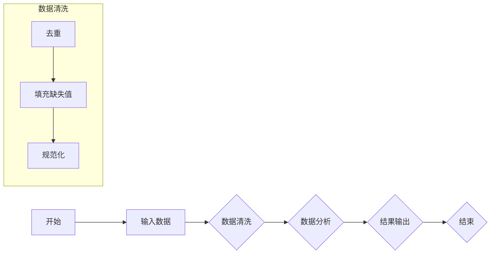
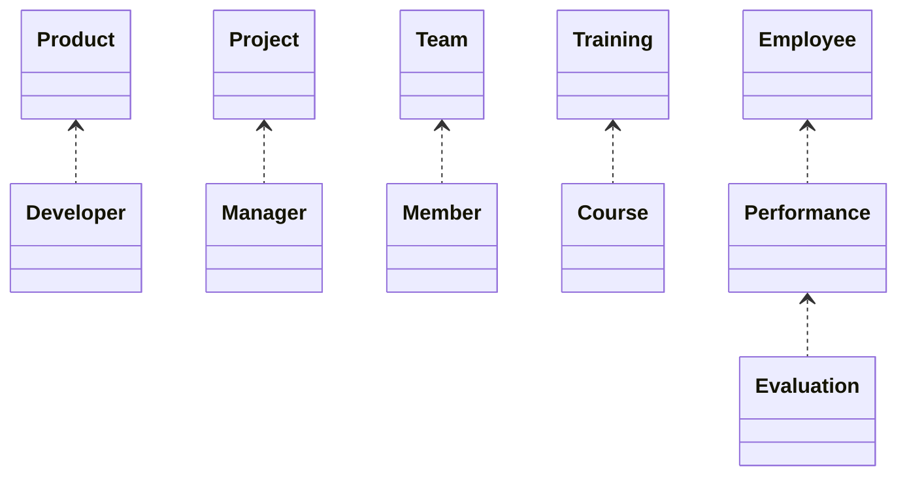
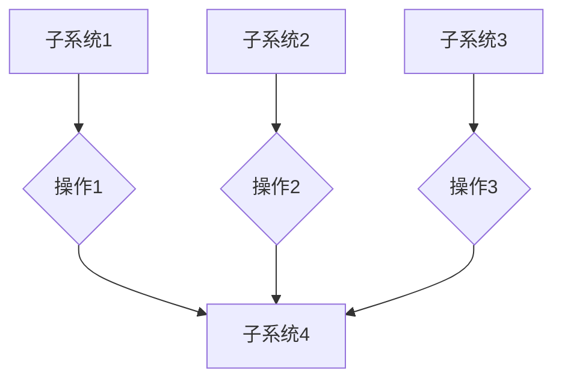
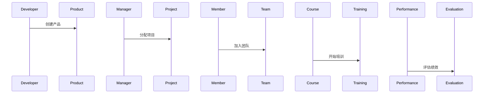
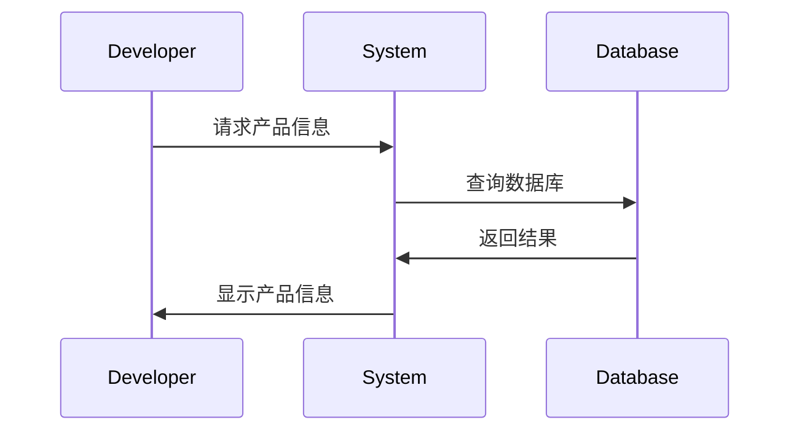

                 

### 文章标题

技术团队梯队建设：培养全方位人才

---

关键词：技术团队建设、人才评估、多元化团队、技能培训、领导力发展

摘要：本文深入探讨了技术团队梯队建设的各个方面，包括团队建设概述、人才评估与选拔、多元化团队构建、技术人才梯队建设、全方位人才培养策略、案例分析与实践等。通过系统化的分析，本文为读者提供了全面、详细的技术团队建设指南，助力企业打造高效、创新的技术团队。

---

### 目录大纲

```markdown
----------------------------------------------------------------

# 技术团队梯队建设：培养全方位人才

# 第一部分：团队建设与人才评估

## 第1章：技术团队建设概述

### 1.1 问题背景与需求分析

### 1.2 团队建设的核心目标

### 1.3 团队建设的挑战与机遇

## 第2章：人才评估与选拔

### 2.1 人才评估的原则与方法

### 2.2 人才选拔的标准与流程

### 2.3 如何识别和挖掘潜力人才

## 第3章：构建多元化团队

### 3.1 多元化团队的优势

### 3.2 多元化团队的构建策略

### 3.3 多元文化在团队管理中的应用

## 第4章：技术人才梯队建设

### 4.1 技术人才梯队的定义与层次

### 4.2 不同层级技术人才的培养路径

### 4.3 如何建立有效的技术人才梯队

# 第二部分：全方位人才培养策略

## 第5章：技能培训与发展

### 5.1 技能培训的重要性

### 5.2 技能培训的内容与方法

### 5.3 技能发展路径的规划与实施

## 第6章：项目管理与团队协作

### 6.1 项目管理的核心要素

### 6.2 团队协作的技巧与方法

### 6.3 如何提高项目成功的概率

## 第7章：领导力与职业发展

### 7.1 领导力的内涵与作用

### 7.2 领导力的发展路径与培养方法

### 7.3 职业发展规划与实施策略

## 第8章：人才激励机制与文化建设

### 8.1 人才激励机制的设计原则

### 8.2 人才激励机制的实践案例

### 8.3 企业文化在人才建设中的作用

# 第三部分：案例分析与实践

## 第9章：技术团队建设的成功案例

### 9.1 案例一：从零开始建立高效技术团队

### 9.2 案例二：多元化团队推动企业创新

### 9.3 案例三：全方位人才培养提升团队竞争力

## 第10章：技术团队建设实践指南

### 10.1 实践指南一：构建技术人才库

### 10.2 实践指南二：开展技能提升计划

### 10.3 实践指南三：实施领导力发展计划

## 第11章：技术团队建设面临的挑战与应对策略

### 11.1 挑战一：人才流失问题

### 11.2 挑战二：技能更新速度跟不上技术发展

### 11.3 应对策略与解决方案

----------------------------------------------------------------
```

通过以上大纲，读者可以清晰地看到本文的结构和内容分布，为接下来的深入探讨奠定了基础。

### 第一部分：团队建设与人才评估

#### 第1章：技术团队建设概述

##### 1.1 问题背景与需求分析

在现代信息技术快速发展的背景下，技术团队在企业中的地位愈发重要。一个高效、稳定、创新的技术团队不仅是企业发展的核心动力，也是企业竞争力的体现。然而，技术团队建设并非易事，面临着诸多挑战。

首先，技术团队的成员往往具有不同的专业背景和技能水平，如何实现团队成员间的有效沟通与协作是一个重要问题。其次，技术发展日新月异，团队需要不断更新知识和技能，以适应快速变化的技术环境。此外，企业内部的管理机制和外部市场环境也会对技术团队的建设产生重要影响。

因此，技术团队建设的核心需求在于构建一个高效、稳定、创新的组织结构，确保团队成员能够充分发挥各自的优势，共同推动企业的发展。

##### 1.2 团队建设的核心目标

技术团队建设的核心目标可以归纳为以下几个方面：

1. **提高团队的整体工作效率**：通过合理的组织架构和流程设计，减少冗余的工作环节，提高团队的工作效率。
2. **提升技术实力与创新能力**：确保团队具备前沿技术的掌握能力，推动技术创新和产品迭代。
3. **培养团队协作精神**：促进团队成员之间的沟通与合作，增强团队的凝聚力和执行力。
4. **优化人才结构**：合理配置不同技能水平和背景的成员，形成多元化的团队结构。
5. **建立持续的人才培养机制**：通过培训、激励等手段，不断提升团队成员的综合素质。

##### 1.3 团队建设的挑战与机遇

在技术团队建设的过程中，企业将面临一系列的挑战和机遇。

**挑战**：

1. **人才流失**：随着市场竞争的加剧，优秀人才更容易被高薪和更好的发展机会吸引，导致人才流失。
2. **技能更新速度慢**：技术更新迅速，团队需要不断学习和更新技能，否则容易被市场淘汰。
3. **团队管理难度大**：技术团队通常具有高度的专业性，管理起来相对复杂，需要具备较强的技术背景和领导能力。
4. **沟通障碍**：团队成员来自不同的专业背景，沟通和理解上可能存在障碍，影响团队协作效果。

**机遇**：

1. **技术发展带来的新机会**：新技术的出现为企业提供了更多的创新机会，技术团队可以围绕这些机会进行产品研发和市场拓展。
2. **数字化转型**：数字化转型成为企业发展的趋势，技术团队在这个过程中可以发挥重要作用，推动企业实现数字化转型。
3. **人才储备**：通过有效的团队建设，企业可以培养和储备一批优秀的技术人才，为未来的发展奠定基础。
4. **市场竞争优势**：拥有高效、创新的技术团队，企业可以在市场中获得更强的竞争力。

##### 1.4 小结

技术团队建设是一项系统工程，涉及到人才评估、团队协作、技能培训等多个方面。通过明确团队建设的核心目标，应对挑战和抓住机遇，企业可以打造出一支高效、创新的技术团队，为企业的持续发展提供强有力的支持。

---

在接下来的章节中，我们将进一步探讨人才评估与选拔、多元化团队构建、技术人才梯队建设等关键议题，为技术团队建设提供详细的实践指南。

### 第2章：人才评估与选拔

技术团队的成功离不开对人才的准确评估与选拔。正确的人才评估与选拔不仅能够确保团队整体水平的提升，还能激发团队成员的潜力，促进团队的长期发展。

##### 2.1 人才评估的原则与方法

在进行人才评估时，企业需要遵循以下原则：

1. **客观公正**：评估过程应基于客观的数据和事实，避免主观偏见和情绪影响。
2. **全面性**：评估应涵盖技术能力、团队合作、领导力等多方面，确保全面了解人才的综合素质。
3. **发展性**：评估应关注人才的成长潜力，为未来的发展提供参考。
4. **差异化**：不同岗位和层级的人才评估应有所区别，以适应不同的需求。

人才评估的方法主要包括：

1. **绩效考核**：通过定期的绩效考核，评估员工的工作表现和业绩成果。
2. **能力测试**：通过技术能力测试、心理测试等方式，评估员工的专业能力和心理素质。
3. **360度评估**：邀请团队成员、上级领导、下属等不同层面对员工进行评估，全面了解员工的表现和潜力。
4. **工作样本测试**：通过让员工完成实际工作中的任务，评估其实际工作能力。

##### 2.2 人才选拔的标准与流程

人才选拔的标准主要包括：

1. **专业技能**：具备扎实的专业知识和技能，能够胜任岗位要求。
2. **团队合作能力**：能够与团队成员良好沟通、协作，共同完成任务。
3. **学习能力**：具备持续学习的能力，能够快速掌握新技术和新知识。
4. **领导力**：对于管理岗位，需要具备一定的领导能力，能够带领团队实现目标。

人才选拔的流程通常包括以下几个步骤：

1. **需求分析**：明确岗位需求，确定所需技能和素质。
2. **招聘渠道**：选择合适的招聘渠道，如内部推荐、外部招聘网站、猎头等。
3. **简历筛选**：根据岗位要求，筛选出符合条件的简历。
4. **面试评估**：通过面试，评估候选人的专业技能、团队合作能力和领导力。
5. **评估和决策**：根据评估结果，确定最终录用人员。
6. **入职培训**：为新员工提供入职培训，帮助其快速融入团队和工作环境。

##### 2.3 如何识别和挖掘潜力人才

识别和挖掘潜力人才是技术团队建设的重要环节。以下是一些有效的方法：

1. **定期评估**：通过定期评估，了解员工的成长潜力和发展方向。
2. **项目考核**：通过参与重要项目，观察员工在项目中的表现，评估其潜力和能力。
3. **跨部门交流**：鼓励员工跨部门交流，发掘其在不同领域的能力和潜力。
4. **人才储备库**：建立人才储备库，记录员工的成长历程和潜力评估结果，为未来的发展提供参考。
5. **导师制度**：通过导师制度，帮助潜力人才快速成长，提升其专业能力和领导力。

##### 2.4 小结

人才评估与选拔是技术团队建设的基础工作，通过科学的方法和流程，企业可以选拔出具备专业技能、团队合作能力和领导力的人才，为团队的长期发展提供强有力的支持。在后续的章节中，我们将进一步探讨如何构建多元化团队和进行技术人才梯队建设，以提升技术团队的整体实力。

### 第3章：构建多元化团队

在技术团队的建设过程中，多元化团队的构建至关重要。多元化不仅能够带来不同的视角和思维方式，还能提高团队的创造力和创新能力，从而增强企业在市场中的竞争力。

##### 3.1 多元化团队的优势

多元化团队的优势主要体现在以下几个方面：

1. **增强创造力**：团队成员来自不同的背景和专业领域，能够带来多样化的观点和想法，促进创新和问题解决。
2. **提高决策质量**：多元化的团队能够从不同的角度分析问题，减少偏见和盲点，提高决策的准确性和质量。
3. **拓宽市场视野**：多元化的团队成员能够更好地理解和适应不同市场的需求和趋势，帮助企业抓住市场机会。
4. **提升员工满意度**：多元化的团队为员工提供了更多的成长机会和职业发展路径，提高员工的满意度和忠诚度。
5. **降低风险**：多元化团队能够减少单一思维模式带来的风险，提高企业对不确定性的应对能力。

##### 3.2 多元化团队的构建策略

要构建一个成功的多元化团队，企业可以采取以下策略：

1. **招聘多元化**：在招聘过程中，不仅关注候选人的专业能力和技术背景，还要考虑其性格特点、教育背景、工作经验等多方面的多样性。
2. **培训与培养**：为团队成员提供跨部门的培训和培养机会，帮助他们拓宽视野和提升技能，增强团队的整体协作能力。
3. **建立沟通机制**：建立有效的沟通机制，鼓励团队成员分享观点和经验，促进知识的交流和融合。
4. **重视文化差异**：尊重和包容团队成员的文化差异，建立包容性的企业文化，促进团队的和谐与协作。
5. **激励机制**：通过激励机制，鼓励团队成员积极参与团队活动和创新项目，提高团队的凝聚力和创造力。

##### 3.3 多元文化在团队管理中的应用

多元文化在团队管理中的应用主要体现在以下几个方面：

1. **文化融合**：通过组织团队建设活动和文化交流，促进不同文化背景的团队成员之间的相互理解和融合，建立共同的目标和价值观。
2. **领导风格**：领导者应具备适应多元文化的管理能力，能够根据团队成员的不同特点和需求，采取灵活的领导风格，提高团队的协作效果。
3. **冲突管理**：在多元化团队中，冲突是不可避免的。领导者应具备有效的冲突管理能力，通过沟通和协商，找到解决问题的最佳方式。
4. **激励机制**：建立多元化的激励机制，尊重和认可团队成员的不同贡献和特点，提高团队的凝聚力和工作效率。

##### 3.4 多元化团队建设的挑战与应对策略

多元化团队建设过程中，企业可能会面临以下挑战：

1. **沟通障碍**：团队成员来自不同的文化背景，沟通和理解上可能存在障碍，影响团队的协作效果。
2. **管理难度**：多元化团队的管理相对复杂，需要领导者具备更高的管理能力和跨文化沟通能力。
3. **文化冲突**：团队成员之间的文化差异可能导致冲突，影响团队的工作氛围和效率。

为应对这些挑战，企业可以采取以下策略：

1. **加强沟通**：通过定期的沟通活动和跨部门的项目合作，增强团队成员之间的沟通和理解。
2. **培养领导力**：为领导者提供跨文化管理培训，提高其跨文化沟通和管理能力。
3. **建立共识**：通过共同的目标和价值观，建立团队的共识，增强团队的凝聚力和执行力。

##### 3.5 小结

构建多元化团队是技术团队建设的重要组成部分。通过有效的策略和措施，企业可以充分发挥多元化团队的优势，提高团队的创造力和创新能力，为企业的长期发展提供强有力的支持。在后续的章节中，我们将进一步探讨技术人才梯队建设和全方位人才培养策略，以全面提升技术团队的整体实力。

### 第4章：技术人才梯队建设

技术人才梯队建设是技术团队建设的重要环节，它不仅关系到当前的技术能力和项目进展，更关乎企业的长期竞争力和可持续发展。科学合理的技术人才梯队建设，能够确保团队在不同层级拥有合适的技能和知识储备，从而应对各种技术挑战和市场需求。

##### 4.1 技术人才梯队的定义与层次

技术人才梯队是指按照技术能力、经验和职责的不同，将技术人才分为不同的层级，形成一个层次分明、结构合理的人才队伍。通常，技术人才梯队可以划分为以下几个层次：

1. **初级技术人才**：这类人才通常是刚毕业或工作不久的工程师，具备基本的技术知识和编程能力，但经验相对较少，需要通过培训和项目实践逐步提升技能。
2. **中级技术人才**：这类人才具备一定的技术深度和项目经验，能够独立负责项目的开发和管理，是团队的中坚力量。
3. **高级技术人才**：这类人才拥有丰富的技术经验和深厚的专业背景，能够解决复杂的技术难题，并在团队中担任技术指导或项目管理角色。
4. **技术领导人才**：这类人才不仅具备卓越的技术能力，还具备优秀的领导能力和管理经验，能够带领团队实现目标，推动企业的技术进步和创新。

##### 4.2 不同层级技术人才的培养路径

针对不同层级的技术人才，企业需要制定相应的培养路径，以提升其技能和综合素质。

**初级技术人才**：

1. **基础知识培训**：为初级技术人才提供计算机基础、编程语言基础等培训，确保其具备必要的技术知识。
2. **实战项目经验**：通过参与实际项目，让初级技术人才在实践中积累经验，提升解决问题的能力。
3. **导师制度**：为初级技术人才配备经验丰富的导师，通过一对一的指导，帮助其快速成长。

**中级技术人才**：

1. **专业深化**：鼓励中级技术人才深入学习专业领域的知识，成为某一领域的专家。
2. **项目管理培训**：提供项目管理相关的培训，帮助中级技术人才掌握项目管理的核心技能，提升其领导力。
3. **跨部门交流**：通过跨部门的交流和合作，拓宽中级技术人才的视野，提升其综合能力。

**高级技术人才**：

1. **技术创新**：鼓励高级技术人才参与技术创新和研发项目，推动企业的技术进步。
2. **领导力发展**：提供领导力和管理技能的培训，帮助高级技术人才提升领导力，为未来的晋升做好准备。
3. **外部交流与合作**：鼓励高级技术人才参加行业会议、研讨会等，与业界精英交流，提升其专业影响力和行业地位。

**技术领导人才**：

1. **战略规划**：提供战略规划和业务管理相关的培训，帮助技术领导人才从技术角度出发，为企业制定长远的战略规划。
2. **人才培养**：承担起培养下一代技术人才的责任，通过传帮带的方式，提升团队的整体素质。
3. **企业文化建设**：参与企业文化的建设，推动企业形成积极向上、创新进取的企业文化。

##### 4.3 如何建立有效的技术人才梯队

建立有效的技术人才梯队，需要企业采取以下措施：

1. **明确人才发展路径**：制定清晰的职业发展路径，让不同层级的技术人才明确自己的发展方向和目标。
2. **建立人才培养机制**：通过内部培训和外部引进相结合的方式，建立系统的人才培养机制，确保人才不断更新和提升。
3. **激励机制**：建立激励机制，鼓励技术人才不断提升自己的技能和能力，为团队和企业的贡献得到认可和回报。
4. **团队协作**：通过团队协作和跨部门合作，促进技术人才的全面发展，提升团队的整体竞争力。

##### 4.4 小结

技术人才梯队建设是技术团队建设的重要组成部分，通过明确的技术人才层次划分和科学的培养路径，企业可以确保团队在不同层级拥有合适的技能和知识储备，提升整体的技术实力和竞争力。在后续的章节中，我们将进一步探讨全方位人才培养策略，以全面提升技术团队的综合素质和创新能力。

### 第二部分：全方位人才培养策略

技术团队的成功不仅依赖于优秀的人才，还需要对人才进行全方位的培养和发展。全方位人才培养策略包括技能培训、项目管理与团队协作、领导力与职业发展等多个方面，旨在提升团队成员的综合素质，推动团队的整体进步。

#### 第5章：技能培训与发展

技能培训是全方位人才培养的重要一环，它不仅能够帮助团队成员提升专业技能，还能增强团队的创新能力和竞争力。

##### 5.1 技能培训的重要性

1. **提升工作效率**：通过专业技能的培训，团队成员能够更高效地完成任务，减少因技能不足导致的重复劳动和错误。
2. **增强团队凝聚力**：技能培训可以增强团队成员之间的相互理解和信任，提高团队协作的效果。
3. **适应技术发展**：技术更新迅速，定期进行技能培训能够帮助团队成员跟上行业发展的步伐，保持技术领先地位。
4. **提高员工满意度**：提供持续的职业发展机会，增强员工的职业成就感，提升员工的工作满意度和忠诚度。

##### 5.2 技能培训的内容与方法

**技能培训的内容**：

1. **基础知识培训**：包括编程语言基础、数据结构与算法等，为团队成员提供必要的理论基础。
2. **专业领域培训**：根据团队成员的专业背景，提供相关领域的深度培训，提升其专业能力。
3. **新技术培训**：针对新兴技术和行业趋势，进行新技术和工具的培训，帮助团队成员掌握前沿技术。
4. **软技能培训**：包括沟通技巧、时间管理、团队合作等，提升团队成员的综合素质。

**技能培训的方法**：

1. **内部培训**：通过内部讲师或专家分享，组织定期培训课程，针对团队成员的技能短板进行有针对性的培训。
2. **外部培训**：邀请外部培训机构或专家，开展定制化的培训课程，提升团队成员的专业能力。
3. **在线学习**：利用在线学习平台，提供丰富的学习资源，方便团队成员随时随地学习。
4. **项目实践**：通过实际项目的开发，将理论知识应用到实践中，提升团队成员的实战能力。

##### 5.3 技能发展路径的规划与实施

**技能发展路径的规划**：

1. **个人发展计划**：根据团队成员的职业规划和技能需求，制定个人技能发展计划。
2. **职业晋升路径**：明确不同层级的技术人才的晋升路径，确保团队成员有清晰的职业发展前景。
3. **技能评估体系**：建立技能评估体系，定期对团队成员的技能进行评估，了解其技能水平和成长情况。

**技能发展路径的实施**：

1. **培训资源分配**：合理分配培训资源，确保每位团队成员都能获得必要的培训机会。
2. **培训效果跟踪**：对培训效果进行跟踪和评估，根据反馈调整培训内容和方式。
3. **激励机制**：建立激励机制，鼓励团队成员积极参与培训和学习，提升其学习动力。

##### 5.4 小结

技能培训与发展是全方位人才培养的关键环节，通过科学合理的培训内容和方式，企业可以提升团队成员的专业技能和综合素质，增强团队的整体竞争力。在后续的章节中，我们将继续探讨项目管理与团队协作、领导力与职业发展等方面的培养策略。

#### 第6章：项目管理与团队协作

项目管理与团队协作是技术团队成功的关键因素。有效的项目管理能够确保项目按时、按质、按预算完成，而良好的团队协作则能够提高团队的执行力和创造力。

##### 6.1 项目管理的核心要素

**项目目标**：明确项目目标，确保团队成员对项目方向和预期成果有清晰的认识。

**项目范围**：界定项目的范围，明确项目包含的工作内容和排除的事项。

**项目团队**：组建高效的项目团队，确保团队成员具备所需的专业技能和经验。

**项目进度**：监控项目进度，确保项目按照计划进行，及时发现和解决问题。

**项目质量**：确保项目成果符合质量标准，满足客户需求和预期。

**项目成本**：控制项目成本，确保项目在预算范围内完成。

**项目风险**：识别和评估项目风险，制定相应的风险应对策略。

##### 6.2 团队协作的技巧与方法

**沟通技巧**：

- **明确沟通目标**：在沟通前明确目的和要点，确保沟通高效。
- **主动倾听**：倾听对方的观点和建议，避免打断和误解。
- **有效表达**：清晰、简洁地表达自己的想法和意见。

**协作工具**：

- **任务管理工具**：如Trello、JIRA等，帮助团队成员跟踪任务进度和分配任务。
- **协作平台**：如Slack、Microsoft Teams等，提供实时的沟通和协作空间。
- **文档共享工具**：如Google Docs、Dropbox等，方便团队成员共享和编辑文档。

**协作方法**：

- **Scrum**：通过短周期迭代和每日站会，提高团队的工作效率和协作能力。
- **看板**：通过可视化看板，实时展示项目进度和任务状态，帮助团队进行透明化管理。
- **敏捷开发**：采用敏捷开发方法，灵活应对项目变化，提高团队的响应速度和创新能力。

##### 6.3 如何提高项目成功的概率

**明确项目目标**：确保项目目标清晰、具体，避免目标模糊导致的方向偏离。

**合理分工与协作**：根据团队成员的技能和兴趣，合理分配任务，促进团队协作。

**风险管理**：提前识别潜在风险，制定应对策略，降低项目风险。

**持续监控与反馈**：定期监控项目进度和质量，及时调整计划，确保项目按预期进行。

**激励与认可**：通过激励和认可，提升团队成员的工作积极性和创造力。

**持续改进**：通过项目总结和反思，不断改进项目管理方法和团队协作模式。

##### 6.4 小结

项目管理与团队协作是技术团队成功的关键。通过明确项目核心要素、掌握团队协作技巧，以及采取有效的项目管理方法，企业可以大幅提高项目成功的概率，推动技术团队的持续发展和进步。

#### 第7章：领导力与职业发展

领导力与职业发展是技术团队建设中不可或缺的部分。一个优秀的领导者不仅能够带领团队达成目标，还能够激发团队成员的潜力，促进团队的成长和进步。

##### 7.1 领导力的内涵与作用

**领导力的内涵**：

领导力是指领导者通过影响力、激励和指导，引导团队成员达成共同目标的能力。它包括以下几个方面：

- **影响力**：领导者通过个人魅力和专业知识，影响团队成员的态度和行为。
- **激励**：领导者能够激发团队成员的积极性和创造力，推动团队向前发展。
- **指导**：领导者通过经验和知识，指导团队成员解决问题和提升技能。

**领导力的作用**：

- **提高团队执行力**：领导者能够明确目标，制定计划，并带领团队高效执行。
- **促进团队协作**：领导者能够建立有效的沟通机制，促进团队成员之间的协作与信任。
- **推动团队创新**：领导者能够鼓励创新思维，激发团队成员的创造力和创新潜力。
- **提升团队凝聚力**：领导者通过关心和支持团队成员，增强团队的凝聚力和归属感。

##### 7.2 领导力的发展路径与培养方法

**领导力的发展路径**：

1. **自我认知**：领导者首先需要了解自己的优势和不足，明确自己的价值观和目标。
2. **知识积累**：通过不断学习和积累专业知识，提升自己的技术能力和领导力。
3. **实践经验**：通过实际工作中的领导实践，提升自己的领导能力和管理技能。
4. **反思与总结**：不断反思和总结自己的领导实践，从成功和失败中学习经验。
5. **持续成长**：保持学习和成长的态度，不断追求卓越，提升领导力水平。

**领导力的培养方法**：

1. **领导力培训**：参加专业的领导力培训课程，学习领导力理论和实践方法。
2. **导师指导**：寻找经验丰富的导师，通过一对一的指导，获取实用的领导经验。
3. **实战锻炼**：通过实际工作项目和领导任务，积累领导经验，提升自己的领导能力。
4. **自我反思**：定期进行自我反思，分析自己在领导实践中的表现和不足，制定改进计划。
5. **阅读与研究**：阅读相关书籍和研究报告，了解领导力的最新理论和实践成果。

##### 7.3 职业发展规划与实施策略

**职业发展规划**：

职业发展规划是指个人根据自己的兴趣、能力和市场需求，设定职业目标和发展路径。它包括以下几个方面：

1. **自我评估**：了解自己的兴趣、优势和劣势，明确职业发展方向。
2. **市场调研**：了解行业趋势和市场需求，确定自己的职业定位和发展机会。
3. **目标设定**：设定清晰的职业目标，制定具体的发展计划和时间表。
4. **行动实施**：根据职业发展规划，采取实际行动，不断提升自己的专业技能和领导力。
5. **反馈调整**：定期评估职业发展进程，根据反馈调整发展计划。

**实施策略**：

1. **制定长期和短期目标**：明确长期职业目标和短期里程碑，确保发展的可持续性。
2. **持续学习和成长**：通过学习新知识、参加培训、实践项目等方式，不断提升自己的综合素质。
3. **建立人际关系网**：通过参加行业活动、社交聚会等方式，建立广泛的人际关系网，为职业发展提供支持。
4. **主动寻求挑战**：勇于接受新的挑战和任务，通过实践提升自己的能力。
5. **定期评估与调整**：定期评估职业发展进程，根据反馈调整发展策略和方向。

##### 7.4 小结

领导力和职业发展是技术团队建设的重要组成部分。通过提升领导力和制定明确的职业发展规划，企业可以培养出一批优秀的领导者，推动团队的成长和进步。在后续的章节中，我们将继续探讨人才激励机制与文化建设，为技术团队建设提供更加全面的策略和指导。

#### 第8章：人才激励机制与文化建设

在技术团队的建设中，人才激励机制与文化建设的有效性直接关系到团队的工作氛围、成员的积极性和企业的长远发展。合理的人才激励机制能够激发员工的潜能，提高工作效率；而积极向上的企业文化则能够增强团队的凝聚力，促进员工的职业发展。

##### 8.1 人才激励机制的设计原则

**1. 公平性**：激励机制的设定应公平公正，确保每位员工都能公平地获得激励，避免因不公平导致的员工不满和流失。

**2. 明确性**：激励机制的目标、标准和结果应明确具体，让员工清楚知道自己的努力和贡献会带来什么样的回报。

**3. 可行性**：激励机制的设定应考虑企业的实际情况，确保激励机制能够在预算范围内实施。

**4. 持续性**：激励机制应具有持续性，通过定期评估和调整，确保激励机制能够长期有效。

**5. 多样性**：激励形式应多样化，结合物质激励和精神激励，满足员工的不同需求，提高激励效果。

##### 8.2 人才激励机制的实践案例

**案例一：绩效考核奖金制度**

某互联网公司通过制定绩效考核奖金制度，对员工的绩效进行量化评估，并根据评估结果发放奖金。具体做法包括：

- **明确考核指标**：根据公司战略和部门目标，设定绩效指标，如项目完成率、产品质量、客户满意度等。
- **定期考核**：每月对员工的工作绩效进行评估，评估结果作为奖金发放的依据。
- **奖金分配**：根据考核结果，将奖金分配给表现优秀的员工，激励其继续保持高水平的工作状态。

**案例二：股权激励计划**

某科技公司实施股权激励计划，将公司部分股份分配给核心员工，使员工成为公司的股东，与公司的利益紧密结合。具体做法包括：

- **股权分配**：根据员工的职位、绩效和公司战略需要，分配不同比例的股权。
- **股权收益**：员工通过持有公司股份，享受公司发展的红利，增强其归属感和积极性。
- **股权流转**：制定股权流转规则，确保员工在公司内部有明确的职业发展路径。

**案例三：员工福利计划**

某科技公司通过丰富的员工福利计划，提高员工的满意度和忠诚度。具体做法包括：

- **健康福利**：为员工提供健康体检、医疗保险等福利，关心员工身体健康。
- **家庭福利**：为员工的家庭提供福利，如子女教育补贴、家庭意外险等，增强员工的归属感。
- **休闲福利**：组织团队活动、旅游、休闲活动等，缓解员工的工作压力，提升团队凝聚力。

##### 8.3 企业文化在人才建设中的作用

**1. 强化团队凝聚力**：企业文化是团队共同价值观和行为规范的体现，通过共同的价值观，能够增强团队的凝聚力和协作精神。

**2. 促进员工认同**：积极向上的企业文化能够让员工感受到企业的关爱和支持，增强员工的认同感和归属感。

**3. 引导员工行为**：企业文化通过行为规范和价值导向，引导员工形成积极向上的行为模式，提升工作积极性和工作效率。

**4. 提升企业竞争力**：企业文化不仅是员工行为的指南，也是企业核心竞争力的一部分。积极向上的企业文化能够提升企业的品牌形象和市场份额。

##### 8.4 小结

人才激励机制和文化建设是技术团队建设的重要组成部分。通过设计合理的人才激励机制，企业可以激发员工的潜力，提高工作效率和满意度；而积极向上的企业文化则能够增强团队的凝聚力，促进员工的职业发展。在后续的章节中，我们将继续探讨技术团队建设的具体实践案例，为企业的技术团队建设提供更加详细的指导和参考。

### 第三部分：案例分析与实践

在技术团队建设的道路上，许多企业已经取得了显著的成果。通过分析这些成功案例，我们可以了解到技术团队建设的具体实践方法，为其他企业提供有益的参考。

#### 第9章：技术团队建设的成功案例

##### 9.1 案例一：从零开始建立高效技术团队

**企业背景**：

某初创科技公司，专注于人工智能领域的技术研发。在成立初期，企业面临着技术团队建设的重要挑战，需要从零开始构建一个高效的技术团队。

**实践过程**：

1. **明确团队目标**：企业首先明确了技术团队的使命，即推动人工智能技术的创新和应用，提升企业的核心竞争力。

2. **搭建团队架构**：企业聘请了一位拥有丰富人工智能研发经验的技术总监，负责团队的架构搭建和核心人才的引进。同时，建立了明确的技术岗位和职责，确保团队结构合理。

3. **人才选拔与培养**：企业采用多渠道招聘，选拔了一批具有潜力和创新精神的优秀人才。同时，通过内部培训和外部交流，不断提升团队成员的技能和综合素质。

4. **构建激励机制**：企业制定了具有竞争力的薪酬福利制度，并通过股权激励计划，激发员工的积极性和创造力。

5. **推动团队协作**：企业鼓励团队成员之间的交流和合作，通过敏捷开发方法和看板管理，提高团队的工作效率和协作效果。

**成果**：

经过一年的努力，该初创科技公司成功搭建了一个高效、创新的技术团队。团队成员在多个项目中取得了显著的成绩，为企业赢得了市场声誉和客户信任。

##### 9.2 案例二：多元化团队推动企业创新

**企业背景**：

某大型互联网公司，在技术团队建设过程中，重视多元化团队的构建，通过吸纳不同背景和文化的成员，推动企业的技术创新和业务拓展。

**实践过程**：

1. **多元化招聘**：公司在招聘过程中，注重多样性和包容性，聘请了来自不同国家、具有不同专业背景的员工，形成了一个多元化的团队。

2. **跨文化培训**：为了增强团队成员之间的理解和沟通，公司组织了跨文化培训，帮助员工了解不同文化背景的思维方式和工作习惯。

3. **创新项目推动**：公司成立了多个创新实验室，鼓励团队成员参与跨部门的创新项目，通过协作和交流，推动企业的技术创新。

4. **激励机制**：公司通过多样化的激励机制，如项目奖金、晋升机会等，激发团队成员的创新热情。

5. **企业文化建设**：公司倡导开放、包容、创新的企业文化，通过团队活动、文化活动等，增强团队成员的归属感和凝聚力。

**成果**：

通过多元化团队的构建，该公司在多个领域实现了技术创新，推出了多个具有市场影响力的产品，显著提升了企业的竞争力。

##### 9.3 案例三：全方位人才培养提升团队竞争力

**企业背景**：

某传统制造企业，在数字化转型过程中，意识到技术团队的重要性，通过全方位人才培养策略，提升团队的整体竞争力。

**实践过程**：

1. **技能培训**：公司定期组织技能培训，帮助团队成员掌握最新的技术知识和工具，提升专业能力。

2. **项目管理培训**：为团队成员提供项目管理培训，提高其项目管理和团队协作能力。

3. **领导力发展**：公司通过领导力发展计划，培养了一批具备领导力和管理能力的核心员工。

4. **激励机制**：通过绩效激励、晋升机会等，激励团队成员不断提升自己的能力和业绩。

5. **文化塑造**：公司注重企业文化塑造，通过建立开放、透明、尊重的创新氛围，增强团队成员的归属感和凝聚力。

**成果**：

通过全方位人才培养，该公司的技术团队在短时间内实现了能力的显著提升。团队成员的专业技能和综合素质得到了大幅提高，企业也在数字化转型中取得了突破性进展。

##### 9.4 小结

以上成功案例表明，通过科学合理的团队建设策略，企业可以构建一个高效、创新、稳定的技术团队。无论是从零开始建立团队，还是通过多元化团队推动创新，亦或是对团队成员进行全方位培养，都有助于提升技术团队的竞争力。在接下来的章节中，我们将提供具体的实践指南，帮助企业更好地进行技术团队建设。

### 第10章：技术团队建设实践指南

在技术团队建设的道路上，企业不仅需要了解理论和方法，更需要具体的实践指南。以下是一些实用的实践指南，帮助企业构建高效、稳定、创新的技术团队。

##### 10.1 实践指南一：构建技术人才库

**1. 人才库建立**

- **收集信息**：收集内部员工的技术背景、专业领域、项目经验等信息。
- **外部引进**：从外部市场招聘优秀的技术人才，补充人才库。
- **数据整合**：将收集到的信息整合到一个统一的数据库中。

**2. 人才评估**

- **定期评估**：根据员工的工作表现、项目贡献等因素，定期进行评估。
- **360度反馈**：邀请团队成员、上级领导和下属对员工进行全方位评估。

**3. 人才发展**

- **培训计划**：根据评估结果，制定个性化培训计划，提升员工的技能和素质。
- **职业规划**：与员工共同制定职业发展计划，明确职业目标和路径。

##### 10.2 实践指南二：开展技能提升计划

**1. 技能评估**

- **技能水平评估**：通过笔试、面试等方式，评估员工的技术能力和知识水平。
- **技能需求分析**：根据项目需求和技术发展趋势，分析员工的技能短板和提升需求。

**2. 技能培训**

- **内部培训**：由公司内部的技术专家进行培训，分享专业知识和经验。
- **外部培训**：邀请外部培训机构或专家，进行定制化的培训课程。
- **在线学习**：利用在线学习平台，提供丰富的学习资源，方便员工自主学习。

**3. 实践项目**

- **实战演练**：通过实际项目，让员工将理论知识应用到实践中，提升实战能力。
- **跨部门合作**：鼓励员工跨部门合作，拓宽视野，提升综合能力。

##### 10.3 实践指南三：实施领导力发展计划

**1. 领导力培训**

- **基础培训**：为初级管理者提供基础管理培训，提升其管理能力和领导力。
- **高级培训**：为高级管理者提供战略管理、团队领导等高级培训，提升其领导力和决策能力。

**2. 实战锻炼**

- **项目管理**：让管理者参与实际项目管理，提升其项目管理和团队领导能力。
- **跨部门领导**：鼓励管理者跨部门领导，提升其跨部门沟通和协调能力。

**3. 反馈与改进**

- **定期反馈**：定期对管理者的领导行为和工作效果进行评估和反馈，帮助其不断改进。
- **持续学习**：鼓励管理者持续学习和成长，不断提升领导力和管理能力。

##### 10.4 小结

通过构建技术人才库、开展技能提升计划和实施领导力发展计划，企业可以系统地培养和提升技术团队的素质和能力。这些实践指南不仅为企业提供了具体的操作方法，也为企业的技术团队建设提供了有力支持。在未来的技术团队建设中，企业可以结合自身实际情况，灵活运用这些实践指南，不断提升团队的整体实力。

### 第11章：技术团队建设面临的挑战与应对策略

尽管技术团队建设的重要性已被广泛认可，但在实际操作过程中，企业仍然会面临诸多挑战。了解这些挑战并采取有效的应对策略，对于成功构建高效的技术团队至关重要。

##### 11.1 挑战一：人才流失问题

**原因分析**：

1. **市场吸引力**：高薪和更好的职业发展机会吸引了部分优秀人才。
2. **工作压力**：技术工作往往伴随着高强度和压力，部分员工可能无法长期承受。
3. **职业发展受限**：企业在职业发展规划和激励机制上可能存在不足，导致员工看不到长期的发展前景。

**应对策略**：

1. **提升薪酬福利**：通过提高薪酬福利和福利待遇，增加对人才的吸引力。
2. **职业发展规划**：制定清晰的职业发展路径，为员工提供明确的发展方向和机会。
3. **员工关怀**：关注员工的工作压力和心理状态，提供必要的支持和帮助，营造良好的工作环境。
4. **激励机制**：建立多元化的激励机制，包括绩效考核奖金、股权激励等，激励员工的积极性和创造力。

##### 11.2 挑战二：技能更新速度跟不上技术发展

**原因分析**：

1. **培训不足**：企业可能没有足够的培训资源和计划，导致员工无法及时更新技能。
2. **技术变化迅速**：技术更新速度极快，企业难以跟上最新技术的发展。
3. **内部知识转移不畅**：内部知识管理和转移机制不完善，导致新技术的应用和推广受限。

**应对策略**：

1. **加强培训**：定期组织内部培训和技术研讨会，提升员工的技能水平。
2. **外部学习**：鼓励员工参加行业会议、研讨会等，了解最新的技术趋势和研究成果。
3. **知识共享**：建立内部知识库和分享平台，促进知识和经验的交流与共享。
4. **技术创新机制**：建立技术创新机制，鼓励员工参与新技术的研究和应用，提升企业的技术竞争力。

##### 11.3 挑战三：团队管理难度大

**原因分析**：

1. **专业背景差异**：团队成员可能来自不同的专业背景，沟通和理解上存在障碍。
2. **管理经验不足**：部分管理者可能缺乏技术背景和团队管理经验，难以有效管理技术团队。
3. **团队规模扩大**：随着团队规模的扩大，管理复杂度增加，管理难度加大。

**应对策略**：

1. **跨部门交流**：鼓励团队成员跨部门交流，提升跨专业沟通和理解能力。
2. **领导力培养**：为管理者提供领导力和管理培训，提升其团队管理能力。
3. **扁平化管理**：采用扁平化的管理结构，减少管理层次，提高决策效率和团队协作效果。
4. **激励机制**：建立合理的激励机制，激励团队成员积极参与团队建设和管理工作。

##### 11.4 挑战四：企业文化与团队建设不匹配

**原因分析**：

1. **企业文化滞后**：企业文化可能未能及时适应技术团队建设的需求，导致团队凝聚力不强。
2. **价值观冲突**：不同背景的员工可能在价值观上存在差异，影响团队的和谐与协作。
3. **企业文化建设不足**：企业可能未能有效推进企业文化建设，导致团队缺乏共同的价值观和行为规范。

**应对策略**：

1. **企业文化宣导**：加强企业文化的宣传和引导，确保团队成员理解和认同企业文化。
2. **价值观融合**：通过团队活动和沟通，促进不同背景的员工在价值观上的融合，建立共同的目标和愿景。
3. **文化建设活动**：定期组织企业文化建设和团队建设活动，增强团队的凝聚力和归属感。
4. **反馈机制**：建立员工反馈机制，及时了解员工对企业文化建设的意见和建议，不断优化和改进。

##### 11.5 小结

技术团队建设过程中，企业会面临多种挑战。通过了解和分析这些挑战，并采取相应的应对策略，企业可以更好地应对挑战，推动技术团队的持续发展。在技术快速发展的今天，企业需要不断创新和优化团队建设策略，以适应市场变化和技术进步，为企业的长期发展奠定坚实基础。

### 总结与展望

通过本文的深入探讨，我们全面了解了技术团队梯队建设的重要性以及全方位人才培养策略的必要性。从团队建设概述、人才评估与选拔、多元化团队构建、技术人才梯队建设，到全方位人才培养策略、项目管理与团队协作、领导力与职业发展，以及人才激励机制与文化建设的各个方面，我们提出了系统的实践指南和成功案例。

技术团队的建设不仅仅是技术和项目的成功，更是企业文化和团队精神的体现。一个高效、创新、稳定的技术团队，能够为企业带来持续的市场竞争力，推动企业的数字化转型和业务增长。因此，企业需要从战略高度出发，重视技术团队的建设，不断完善和优化团队建设策略。

展望未来，技术发展日新月异，企业面临的挑战也将更加复杂。我们需要不断学习和创新，紧跟技术发展趋势，培养和储备一批具备前沿技术能力和领导力的优秀人才。同时，企业应持续关注员工的需求和成长，构建积极向上的企业文化，提升团队的凝聚力和创新力。

最后，让我们共同期待，通过科学合理的技术团队建设，企业能够实现更高的目标和更大的成功。在未来的道路上，技术团队将成为企业发展的核心动力，推动企业迈向新的辉煌。

### 附录

为了更好地理解本文中涉及的概念和技术，我们提供了以下附录，包括核心概念术语说明、概念属性特征对比表格、ER实体关系图架构、算法流程图、数学公式和系统分析与架构设计等内容。

#### 附录A：核心概念术语说明

1. **技术团队建设**：指企业为实现特定目标，对技术团队进行组织、管理、培养和优化的过程。
2. **人才评估**：通过对员工的技术能力、工作表现、潜力等多方面进行评估，以确定其岗位匹配度和职业发展潜力。
3. **多元化团队**：由来自不同背景、专业和文化背景的成员组成的团队，能够提供多样化的视角和解决方案。
4. **技能培训**：为提升员工的技术能力和综合素质，提供的一系列培训和教育活动。
5. **领导力**：领导者通过影响力、激励和指导，引导团队成员达成共同目标的能力。

#### 附录B：概念属性特征对比表格

| 概念      | 属性特征                     |
|-----------|-----------------------------|
| 技术团队建设 | 组织结构、管理体系、技能培训、人才培养 |
| 人才评估   | 技术能力、工作表现、潜力         |
| 多元化团队 | 背景多样性、视角多样性、创新力      |
| 技能培训   | 专业技能、综合素质、职业发展      |
| 领导力     | 影响力、激励、指导              |

#### 附录C：ER实体关系图架构

```mermaid
erDiagram
    Product ||--|{ Developer }|  
    Project ||--|{ Manager }|  
    Team ||--|{ Member }|  
    Training ||--|{ Course }|
    Employee ||--|{ Performance }|
    Performance ||--|{ Evaluation }|
```

#### 附录D：算法流程图



#### 附录E：数学公式

1. **线性回归模型**：
   $$ y = \beta_0 + \beta_1x + \epsilon $$
2. **二分类逻辑回归**：
   $$ P(y=1) = \frac{1}{1 + e^{-(\beta_0 + \beta_1x)}} $$

#### 附录F：系统分析与架构设计

**系统功能设计（领域模型类图）**：



**系统架构设计（架构图）**：



**系统接口设计（接口图）**：



**系统交互（序列图）**：



通过以上附录，读者可以更深入地理解本文的核心概念和技术细节，为实际应用提供参考。

