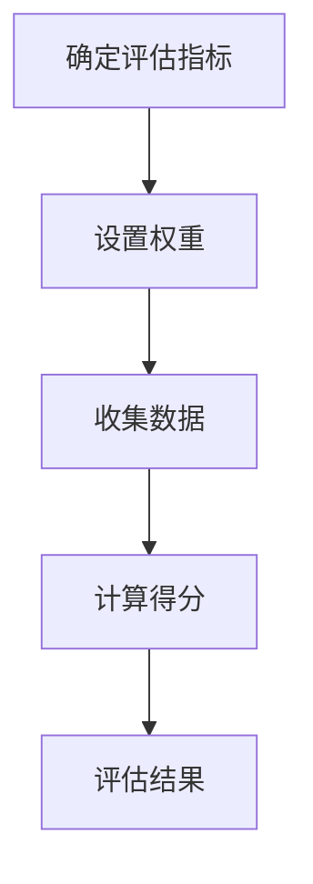
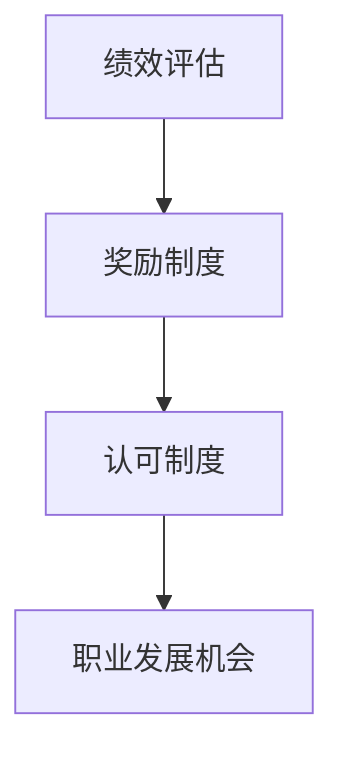
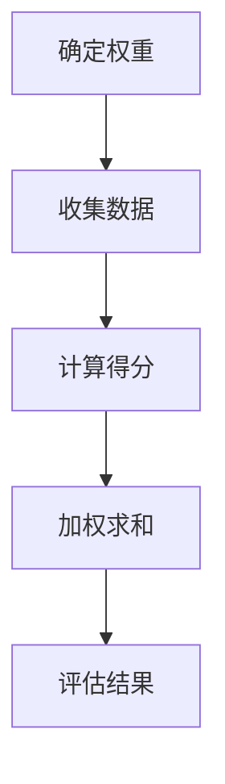

                 

### 目录大纲

----------------------------------------------------------------

# **技术团队的创新机制：鼓励创新的制度设计**

> **关键词：** 技术团队，创新机制，制度设计，组织文化，市场环境，法律法规

> **摘要：** 本文将深入探讨技术团队如何通过制度设计来鼓励创新。我们将分析问题背景，明确核心概念，讲解创新评估算法原理，展示数学模型和公式，并详细阐述系统架构设计方案。通过实际项目实战，我们还将提供最佳实践、注意事项和拓展阅读建议，帮助技术团队构建有效的创新机制。

----------------------------------------------------------------

## **第一部分：背景介绍**

### **1.1 问题背景**

在当今快速变化的技术环境中，技术团队面临诸多挑战，如快速迭代的需求、高度竞争的市场环境和不断更新的技术标准。这些因素共同推动技术团队不断追求创新。然而，现实情况是，许多技术团队在创新过程中遭遇障碍，如资源限制、沟通不畅、风险规避等。因此，设计一种有效的创新机制变得尤为重要。

### **1.2 问题描述**

技术团队在创新过程中面临的常见问题包括：

- **资源限制**：创新项目通常需要额外的人力、时间和资金支持，但技术团队往往在这些方面受限。
- **沟通不畅**：团队成员之间缺乏有效的沟通，导致创新想法无法及时传递和实施。
- **风险规避**：创新项目往往伴随着不确定性和风险，部分团队成员可能因此回避创新。

### **1.3 问题解决**

为了解决这些问题，需要设计一套有效的创新机制，该机制应包括：

- **明确的创新目标和路径**：确保团队成员对创新方向有共同的理解和目标。
- **灵活的资源分配机制**：为创新项目提供必要的资源支持。
- **有效的沟通平台**：建立高效的沟通机制，促进创新想法的传播和实施。
- **风险管理和激励机制**：为团队成员提供风险管理工具和激励机制，鼓励创新尝试。

### **1.4 边界与外延**

创新机制的设计需要考虑以下边界与外延：

- **组织文化**：创新机制应与组织文化相契合，以促进持续创新。
- **市场环境**：创新机制应适应市场变化，及时调整以应对外部挑战。
- **法律法规**：创新机制应在法律法规框架内运行，确保合规性。

### **1.5 概念结构与核心要素组成**

创新机制的核心概念包括：

- **创新目标**：明确团队希望实现的具体创新成果。
- **创新路径**：规划从概念到实施的详细步骤。
- **资源分配**：确保创新项目获得必要的资源支持。
- **沟通机制**：建立有效的沟通渠道，促进信息共享和协作。
- **风险管理**：为创新项目提供风险管理工具，降低创新风险。
- **激励机制**：为创新团队成员提供奖励和认可，鼓励持续创新。

### **1.6 本章小结**

本部分介绍了技术团队在创新过程中面临的挑战和问题，并提出了设计创新机制的原则和核心要素。通过明确创新目标和路径、灵活的资源分配机制、有效的沟通平台以及风险管理和激励机制，技术团队可以构建一个有利于创新的制度环境。

----------------------------------------------------------------

## **第二部分：核心概念与联系**

### **2.1 创新机制概念解析**

#### **2.1.1 创新机制的概述**

创新机制是指一系列旨在促进创新活动的方法和制度安排。它不仅包括创新的激励和奖励机制，还涉及组织文化、资源配置和风险管理等方面的内容。

#### **2.1.2 创新机制的定义**

创新机制可以定义为一种组织内部的系统，通过提供支持、奖励和资源来促进团队成员的创新活动，从而推动组织的技术进步和业务发展。

#### **2.1.3 创新机制的分类**

创新机制可以分为以下几类：

1. **项目驱动型创新机制**：通过设立创新项目来推动创新活动，通常包括项目立项、资源分配、项目管理和项目验收等环节。
2. **需求驱动型创新机制**：基于市场需求来引导创新活动，通过市场调研、需求分析和产品设计等步骤来确保创新项目的实用性和市场价值。
3. **文化驱动型创新机制**：通过培养组织文化和价值观来促进创新，鼓励团队成员主动提出创新想法，并通过内部交流和合作来实现创新。

### **2.2 创新机制与组织文化**

#### **2.2.1 组织文化的定义与特征**

组织文化是指组织内部的价值观、信念和行为规范，它对员工的行为和工作方式产生深远影响。组织文化的特征包括：

- **共同价值观**：组织成员对某些核心价值的共识，如客户至上、团队合作、创新精神等。
- **行为规范**：组织成员在日常工作中的行为准则，如遵守规章制度、尊重他人、积极进取等。
- **沟通方式**：组织内部沟通的方式和习惯，如开放透明、直接反馈、跨部门合作等。

#### **2.2.2 组织文化对创新机制的影响**

组织文化对创新机制的影响体现在以下几个方面：

- **激励创新**：积极向上的组织文化可以激发员工的工作热情和创新能力，促进创新项目的成功。
- **降低阻力**：开放和包容的组织文化可以减少团队成员在创新过程中的顾虑和风险，提高创新成功率。
- **增强协作**：组织文化中的合作精神和团队意识可以促进团队成员之间的沟通和协作，提高创新效率。

#### **2.2.3 创新机制与组织文化的相互促进**

创新机制与组织文化的相互促进体现在：

- **共同目标**：创新机制可以与组织文化共同设定目标，确保创新活动与组织发展战略一致。
- **文化传承**：通过创新机制的实施，可以将组织文化中的核心价值传递给新成员，增强组织文化的传承性。
- **文化创新**：创新机制可以在组织文化的基础上进行创新，推动组织文化的不断发展和完善。

### **2.3 创新机制与市场环境**

#### **2.3.1 市场环境的概述**

市场环境是指影响组织外部经营活动的各种因素，包括市场需求、竞争状况、法律法规和政策等。市场环境对组织创新机制的设计和实施具有重要影响。

#### **2.3.2 市场环境对创新机制的影响**

市场环境对创新机制的影响主要体现在以下几个方面：

- **市场需求**：市场需求的变化可以引导创新方向，推动技术团队开发更符合市场需求的创新产品。
- **竞争状况**：竞争激烈的市场环境可以激发技术团队的创新能力，加快创新项目的推进。
- **法律法规**：法律法规的变化可以影响创新项目的合规性和风险，创新机制需要及时调整以适应法律法规的要求。

#### **2.3.3 创新机制在市场环境中的适应与变革**

创新机制在市场环境中的适应与变革体现在：

- **市场需求导向**：创新机制应注重市场需求的研究和反馈，确保创新项目的市场适应性。
- **快速响应**：创新机制应具备快速响应市场变化的能力，及时调整创新策略和项目进度。
- **合规性管理**：创新机制应建立完善的合规性管理体系，确保创新项目在法律法规框架内运行。

### **2.4 创新机制与法律法规**

#### **2.4.1 法律法规的定义与作用**

法律法规是指由国家立法机关制定并公布的，具有法律效力的规范性文件，用于规范社会行为和调整社会关系。法律法规在创新机制中的作用包括：

- **规范行为**：法律法规规范了技术创新的行为准则和操作流程，确保创新活动合法合规。
- **保障权益**：法律法规保护了创新成果的知识产权和合法权益，激励技术创新的持续发展。
- **规范市场**：法律法规规范了市场竞争秩序，维护了市场的公平性和透明度，促进了技术进步。

#### **2.4.2 法律法规对创新机制的影响**

法律法规对创新机制的影响主要体现在以下几个方面：

- **合规性要求**：创新机制需要遵守相关法律法规，确保创新项目的合法合规性。
- **知识产权保护**：创新机制需要建立完善的知识产权保护机制，保护创新成果的知识产权。
- **市场环境优化**：法律法规的完善和执行可以优化市场环境，降低创新风险，促进技术创新。

#### **2.4.3 创新机制与法律法规的协调与平衡**

创新机制与法律法规的协调与平衡体现在：

- **制度设计**：创新机制的设计应充分考虑法律法规的要求，确保创新活动的合规性。
- **风险管理**：创新机制应建立风险管理机制，应对法律法规变化带来的风险。
- **法律法规宣传**：创新团队应加强法律法规的宣传和培训，提高团队成员的法律法规意识。

### **2.5 概念属性特征对比表格**

**创新机制与组织文化对比**

| 概念 | 特征 |
| --- | --- |
| 创新机制 | 一种促进创新的制度安排 |
| 组织文化 | 组织内部的价值观、信念和行为规范 |

**创新机制与市场环境对比**

| 概念 | 特征 |
| --- | --- |
| 创新机制 | 与市场需求和竞争状况相关 |
| 市场环境 | 影响组织外部经营活动的各种因素 |

**创新机制与法律法规对比**

| 概念 | 特征 |
| --- | --- |
| 创新机制 | 需要遵守相关法律法规 |
| 法律法规 | 规范技术创新的行为准则和操作流程 |

### **2.6 ER实体关系图架构**

**创新机制相关的ER实体关系图**

```mermaid
erDiagram
    Product ||--|{ Team }| Project
    Team ||--|{ Employee }| Member
    Employee ||--|{ Role }| Role
    Role ||--|{ Skill }| Skill
```

### **2.7 概念之间的联系与作用**

创新机制、组织文化、市场环境和法律法规之间的联系与作用体现在：

- **创新机制**：通过组织文化、市场环境和法律法规的支持，促进技术创新。
- **组织文化**：为创新机制提供文化基础，激发创新动力。
- **市场环境**：为创新机制提供市场导向，确保创新项目的实用性。
- **法律法规**：为创新机制提供法律保障，确保创新活动的合规性。

### **2.8 本章小结**

本部分明确了创新机制的概念及其与组织文化、市场环境和法律法规的联系。通过对比不同概念的特征，我们构建了ER实体关系图，并分析了各概念之间的相互作用。这些分析为后续的算法原理讲解和系统架构设计提供了基础。

----------------------------------------------------------------

## **第三部分：算法原理讲解**

### **3.1 创新评估算法**

#### **3.1.1 创新评估算法概述**

创新评估算法是一种用于评估创新项目可行性和潜在价值的计算方法。它通过分析创新项目的多个维度，如技术可行性、市场需求、资源投入和风险因素等，对创新项目进行综合评估。

#### **3.1.2 创新评估算法的分类**

创新评估算法可以分为以下几类：

1. **基于多因素分析的创新评估算法**：这种算法考虑多个因素对创新项目的影响，通过加权综合得分来评估项目的潜力。
2. **基于模型预测的创新评估算法**：这种算法利用统计模型或机器学习算法，对创新项目的潜在市场表现进行预测。
3. **基于实验验证的创新评估算法**：这种算法通过实验和测试来评估创新项目的可行性和效果。

#### **3.1.3 基于多因素分析的创新评估算法**

基于多因素分析的创新评估算法是一种常用的评估方法。以下是一个简化的算法流程：

1. **确定评估指标**：根据创新项目的特点，确定需要评估的指标，如技术成熟度、市场需求度、资源投入和风险水平等。
2. **设置权重**：为每个评估指标设置权重，以反映其对创新项目的重要程度。
3. **收集数据**：收集与评估指标相关的数据，如市场调研报告、技术评估报告、资源投入预算等。
4. **计算得分**：根据数据计算每个评估指标的得分，并加权求和，得到创新项目的总得分。
5. **评估结果**：根据总得分评估创新项目的潜力，并制定相应的推进策略。

#### **3.1.4 基于多因素分析的Python实现**

以下是一个基于多因素分析的Python实现示例：

```python
import numpy as np

# 评估指标及其权重
weights = {
    '技术成熟度': 0.3,
    '市场需求度': 0.3,
    '资源投入': 0.2,
    '风险水平': 0.2
}

# 收集数据
scores = {
    '技术成熟度': 0.8,
    '市场需求度': 0.7,
    '资源投入': 0.6,
    '风险水平': 0.4
}

# 计算得分
total_score = 0
for metric, score in scores.items():
    weight = weights[metric]
    total_score += weight * score

# 输出评估结果
print(f"创新项目评估得分：{total_score:.2f}")
```

#### **3.1.5 算法原理讲解**

基于多因素分析的创新评估算法的原理可以概括为以下几点：

1. **多维度评估**：通过考虑多个维度，如技术成熟度、市场需求度、资源投入和风险水平，对创新项目进行综合评估，提高评估的准确性和全面性。
2. **权重设置**：为每个评估指标设置权重，以反映其对创新项目的重要性，确保评估结果的公平性和合理性。
3. **数据驱动**：通过收集和利用与评估指标相关的数据，利用统计方法和计算模型，对创新项目进行定量分析，提高评估的客观性和科学性。

#### **3.1.6 举例说明**

假设一个技术团队正在评估一个新项目的创新潜力。根据团队的分析，该项目在技术成熟度、市场需求度、资源投入和风险水平这四个方面分别得分为0.8、0.7、0.6和0.4。按照上述算法，可以计算该项目的总得分为：

$$
总得分 = 0.3 \times 0.8 + 0.3 \times 0.7 + 0.2 \times 0.6 + 0.2 \times 0.4 = 0.72
$$

根据总得分，团队可以判断该项目具有较高的创新潜力，并制定相应的推进策略。

#### **3.1.7 Mermaid流程图**

以下是基于多因素分析的创新评估算法的Mermaid流程图：



### **3.2 创新激励机制设计**

#### **3.2.1 创新激励机制概述**

创新激励机制是一种旨在激发团队成员创新热情和积极性的制度安排。通过提供奖励、认可和职业发展机会，创新激励机制可以激励团队成员提出创新想法、实施创新项目，并为组织带来持续的创新能力。

#### **3.2.2 创新激励机制的设计原则**

设计创新激励机制应遵循以下原则：

1. **公平性**：确保激励机制对所有团队成员公平，避免偏袒和不公现象。
2. **透明性**：激励机制的过程和结果应公开透明，确保团队成员了解激励机制的规则和标准。
3. **灵活性**：激励机制应具备灵活性，以适应不同创新项目和团队成员的需求。
4. **可持续性**：激励机制应具备可持续性，确保创新活动的持续进行。

#### **3.2.3 创新激励机制的设计方法**

创新激励机制的设计方法包括以下几种：

1. **奖励制度**：通过提供奖金、股权激励、休假奖励等方式，对在创新项目中做出突出贡献的团队成员进行奖励。
2. **认可制度**：通过颁发荣誉证书、公开表彰等方式，对在创新项目中表现出色的团队成员进行认可。
3. **职业发展机会**：为在创新项目中表现出色的团队成员提供职业发展机会，如晋升、转岗、培训等。
4. **绩效评估**：将创新项目的绩效评估结果与团队成员的绩效评估相结合，激励团队成员积极参与创新项目。

#### **3.2.4 创新激励机制的Python实现**

以下是一个简化的创新激励机制设计示例：

```python
def reward_system(scores):
    rewards = {
        '奖金': 1000,
        '荣誉证书': '优秀创新奖',
        '职业发展机会': '晋升机会'
    }
    
    if scores > 0.9:
        return rewards['奖金'], rewards['荣誉证书'], rewards['职业发展机会']
    elif scores > 0.8:
        return rewards['荣誉证书'], rewards['职业发展机会']
    else:
        return rewards['职业发展机会']

# 示例使用
scores = 0.85
reward = reward_system(scores)
print(f"得分：{scores:.2f}，奖励：{reward}")
```

#### **3.2.5 算法原理讲解**

创新激励机制的设计原理可以概括为以下几点：

1. **激励效应**：通过奖励和认可，激发团队成员的创新热情和积极性，提高创新项目的成功率。
2. **公平竞争**：确保激励机制对所有团队成员公平，避免因不公平竞争而影响团队合作和创新氛围。
3. **可持续发展**：通过灵活的激励机制，激励团队成员持续参与创新项目，为组织带来持续的创新能力。

#### **3.2.6 举例说明**

假设一个技术团队在创新项目中取得了85%的绩效评估得分。根据上述奖励制度，该团队成员将获得奖金1000元、荣誉证书“优秀创新奖”和晋升机会。通过这种奖励制度，团队可以激励成员积极参与创新项目，提高创新绩效。

#### **3.2.7 Mermaid流程图**

以下是基于创新激励机制设计的Mermaid流程图：



### **3.3 算法总结**

本部分介绍了基于多因素分析的创新评估算法和基于奖励制度的创新激励机制设计。通过这些算法和机制，技术团队可以系统地评估创新项目的潜力，并激励团队成员积极参与创新项目。这些算法和机制为技术团队的创新活动提供了有力的支持和保障。

----------------------------------------------------------------

## **第四部分：数学模型和数学公式 & 详细讲解 & 举例说明**

### **4.1 数学模型**

在创新评估和激励机制设计中，数学模型是必不可少的工具。以下是一个简化的数学模型，用于评估创新项目的总得分。

#### **4.1.1 总得分计算公式**

总得分（\( S \)）可以通过以下公式计算：

$$
S = w_1 \cdot X_1 + w_2 \cdot X_2 + w_3 \cdot X_3 + w_4 \cdot X_4
$$

其中：

- \( w_1, w_2, w_3, w_4 \) 分别是技术成熟度、市场需求度、资源投入和风险水平的权重。
- \( X_1, X_2, X_3, X_4 \) 分别是技术成熟度、市场需求度、资源投入和风险水平的得分。

#### **4.1.2 权重设置**

权重的设置应根据创新项目的特点和组织文化来确定。以下是一个示例权重设置：

| 指标         | 权重 |
| ------------ | ---- |
| 技术成熟度   | 0.3  |
| 市场需求度   | 0.3  |
| 资源投入     | 0.2  |
| 风险水平     | 0.2  |

#### **4.1.3 得分设置**

得分的设置应根据评估标准和实际情况来确定。以下是一个示例得分设置：

| 指标         | 得分范围 |
| ------------ | -------- |
| 技术成熟度   | 0.0-1.0  |
| 市场需求度   | 0.0-1.0  |
| 资源投入     | 0.0-1.0  |
| 风险水平     | 0.0-1.0  |

### **4.2 详细讲解**

#### **4.2.1 总得分计算**

总得分是评估创新项目综合潜力的重要指标。计算总得分的过程包括以下步骤：

1. **确定权重**：根据创新项目的特点和目标，确定各指标的权重。
2. **收集数据**：收集与各指标相关的数据，如技术成熟度、市场需求度、资源投入和风险水平。
3. **计算得分**：根据权重和数据，计算每个指标的得分。
4. **求和**：将各指标的得分加权求和，得到总得分。

#### **4.2.2 权重分配**

权重的分配应根据创新项目的特点和组织文化来确定。例如，对于技术驱动的创新项目，技术成熟度的权重可能更高；而对于市场驱动的创新项目，市场需求度的权重可能更高。

#### **4.2.3 得分标准**

得分的标准应根据评估标准和实际情况来确定。例如，对于技术成熟度，可以设定如下标准：

- **0.0-0.3**：技术尚未成熟，存在较多不确定性。
- **0.4-0.7**：技术基本成熟，但仍需进一步验证。
- **0.8-1.0**：技术成熟，具有较高可靠性。

### **4.3 举例说明**

#### **4.3.1 示例数据**

假设一个创新项目的评估数据如下：

| 指标         | 权重 | 得分 |
| ------------ | ---- | ---- |
| 技术成熟度   | 0.3  | 0.6  |
| 市场需求度   | 0.3  | 0.8  |
| 资源投入     | 0.2  | 0.7  |
| 风险水平     | 0.2  | 0.5  |

#### **4.3.2 计算总得分**

根据上述数据，计算总得分的步骤如下：

1. **计算各指标得分**：
   - 技术成熟度得分：\( 0.3 \times 0.6 = 0.18 \)
   - 市场需求度得分：\( 0.3 \times 0.8 = 0.24 \)
   - 资源投入得分：\( 0.2 \times 0.7 = 0.14 \)
   - 风险水平得分：\( 0.2 \times 0.5 = 0.10 \)

2. **加权求和**：
   - 总得分：\( 0.18 + 0.24 + 0.14 + 0.10 = 0.66 \)

因此，该创新项目的总得分为0.66。

#### **4.3.3 评估结果**

根据总得分0.66，可以判断该创新项目具有较好的潜力。团队可以进一步优化项目方案，确保项目的成功实施。

### **4.4 Mermaid流程图**

以下是基于数学模型和公式的创新评估流程的Mermaid流程图：



通过上述步骤，技术团队可以系统地评估创新项目的潜力，为项目的推进提供科学依据。

----------------------------------------------------------------

## **第五部分：系统分析与架构设计方案**

### **5.1 问题场景和系统设计**

#### **5.1.1 问题场景**

技术团队在创新项目中常常面临资源分配不均、沟通不畅、风险管理不到位等问题。为了提高创新项目的成功率，需要设计一套完整的系统，包括领域模型、系统架构、接口设计和交互流程等。

#### **5.1.2 系统设计目标**

系统设计的核心目标是：

1. **资源高效分配**：确保创新项目获得必要的资源支持，提高项目成功率。
2. **沟通畅通**：建立高效的沟通机制，促进团队成员之间的协作和信息共享。
3. **风险管理**：提供完善的风险管理工具，降低创新项目的风险。

#### **5.1.3 系统功能设计**

系统功能设计包括以下几个方面：

1. **创新项目管理**：管理创新项目的立项、进度、资源分配和风险评估。
2. **沟通平台**：提供团队成员之间的沟通工具，如聊天、邮件、会议等。
3. **资源管理**：管理项目所需的资源，包括人力、时间和资金。
4. **风险管理**：识别和管理创新项目中的风险，提供风险应对策略。

### **5.2 领域模型**

领域模型用于描述系统中的实体和实体之间的关系。以下是一个简化的领域模型：

```mermaid
classDiagram
    Project <.. Team
    Team o-- Employee
    Employee o-- Role
    Resource <<interface>>
    Risk <<interface>>
    Project o-- Resource
    Project o-- Risk
endclass
```

#### **5.2.1 类图说明**

- **Project（项目）**：表示创新项目，包括项目名称、描述、进度和资源等信息。
- **Team（团队）**：表示参与项目的团队，包括团队成员和团队角色等信息。
- **Employee（员工）**：表示团队成员，包括员工姓名、联系方式和角色等信息。
- **Role（角色）**：表示员工的角色，如开发者、测试员、项目经理等。
- **Resource（资源）**：表示项目所需的资源，如人力、时间和资金等。
- **Risk（风险）**：表示项目中的风险，包括风险类型、风险描述和风险应对策略等。

### **5.3 系统架构设计**

系统架构设计用于描述系统的总体结构和组件之间的交互。以下是一个简化的系统架构：

```mermaid
sequenceDiagram
    Project -->|请求| ResourceManager: 获取资源
    ResourceManager -->|返回| Project: 资源信息
    Project -->|请求| CommunicationPlatform: 沟通
    CommunicationPlatform -->|返回| Project: 沟通记录
    Project -->|请求| RiskManager: 风险管理
    RiskManager -->|返回| Project: 风险评估报告
end
```

#### **5.3.1 架构图说明**

- **ResourceManager（资源管理器）**：负责管理项目所需的资源，包括人力、时间和资金等。
- **CommunicationPlatform（沟通平台）**：提供团队成员之间的沟通工具，如聊天、邮件、会议等。
- **RiskManager（风险管理器）**：负责识别和管理项目中的风险，提供风险应对策略。

### **5.4 系统接口设计**

系统接口设计用于描述系统与其他系统或组件之间的交互。以下是一个简化的接口设计：

```mermaid
interfaceDiagram
    ProjectManagerSystem -->|创建项目| ProjectAPI
    ProjectManagerSystem -->|更新项目| ProjectAPI
    ProjectManagerSystem -->|查询项目| ProjectAPI
    ResourceManagerSystem -->|分配资源| ResourceAPI
    CommunicationPlatformSystem -->|发送消息| CommunicationAPI
    RiskManagerSystem -->|评估风险| RiskAPI
end
```

#### **5.4.1 接口设计说明**

- **ProjectAPI（项目API）**：提供创建、更新和查询项目的接口。
- **ResourceAPI（资源API）**：提供分配资源的接口。
- **CommunicationAPI（沟通API）**：提供发送消息的接口。
- **RiskAPI（风险API）**：提供评估风险的接口。

### **5.5 系统交互**

系统交互用于描述系统内部组件之间的交互流程。以下是一个简化的系统交互：

```mermaid
sequenceDiagram
    ProjectManagerSystem->>ProjectAPI: 创建项目
    ProjectAPI->>Project: 创建成功
    Project->>ResourceManagerSystem: 分配资源
    ResourceManagerSystem->>ResourceAPI: 资源分配成功
    ResourceAPI->>Project: 资源信息更新
    Project->>CommunicationPlatformSystem: 发送消息
    CommunicationPlatformSystem->>CommunicationAPI: 消息发送成功
    CommunicationAPI->>Project: 消息记录更新
    Project->>RiskManagerSystem: 评估风险
    RiskManagerSystem->>RiskAPI: 风险评估成功
    RiskAPI->>Project: 风险评估报告更新
end
```

#### **5.5.1 交互流程说明**

1. **创建项目**：ProjectManagerSystem通过ProjectAPI创建项目，ProjectAPI将创建成功的消息返回给Project。
2. **资源分配**：Project通过ResourceManagerSystem向ResourceAPI请求资源分配，ResourceManagerSystem通过ResourceAPI返回资源信息给Project。
3. **消息发送**：Project通过CommunicationPlatformSystem向CommunicationAPI发送消息，CommunicationAPI将消息发送成功的信息返回给Project。
4. **风险评估**：Project通过RiskManagerSystem向RiskAPI请求风险评估，RiskManagerSystem通过RiskAPI返回风险评估报告给Project。

### **5.6 本章小结**

本部分详细介绍了技术团队创新系统的分析与架构设计方案。通过领域模型、系统架构设计、接口设计和交互流程的描述，技术团队能够构建一个高效、灵活的创新系统，为创新项目的成功实施提供有力支持。

----------------------------------------------------------------

## **第六部分：项目实战**

### **6.1 环境安装**

为了进行创新机制设计的实战，我们首先需要搭建一个适当的技术环境。以下是在一个Linux系统上安装所需软件和工具的步骤：

1. **安装Python**：确保Python已经安装在系统中，如果没有安装，可以使用以下命令进行安装：

   ```bash
   sudo apt-get update
   sudo apt-get install python3
   ```

2. **安装虚拟环境**：为了保持项目环境的整洁，我们使用虚拟环境。安装虚拟环境工具`virtualenv`：

   ```bash
   sudo apt-get install python3-venv
   ```

3. **创建虚拟环境**：在项目目录中创建一个名为`innovation`的虚拟环境：

   ```bash
   python3 -m venv innovation
   ```

4. **激活虚拟环境**：激活虚拟环境以便使用其中的Python环境和包：

   ```bash
   source innovation/bin/activate
   ```

5. **安装依赖包**：安装项目所需的Python包，如`numpy`和`matplotlib`：

   ```bash
   pip install numpy matplotlib
   ```

### **6.2 系统核心实现源代码**

以下是一个简化的创新评估系统的Python实现，包括评估算法、激励机制和数据处理等核心功能：

```python
import numpy as np

# 创新评估算法
def innovation_evaluation(scores, weights):
    total_score = np.dot(scores, weights)
    return total_score

# 创新激励机制
def innovation_incentive(scores):
    if scores > 0.9:
        return "奖金", "荣誉证书", "晋升机会"
    elif scores > 0.8:
        return "荣誉证书", "晋升机会"
    else:
        return "晋升机会"

# 数据处理
def process_data(data):
    scores = [d['score'] for d in data]
    weights = [d['weight'] for d in data]
    return scores, weights

# 示例数据
data = [
    {'name': '技术成熟度', 'score': 0.6, 'weight': 0.3},
    {'name': '市场需求度', 'score': 0.7, 'weight': 0.3},
    {'name': '资源投入', 'score': 0.5, 'weight': 0.2},
    {'name': '风险水平', 'score': 0.4, 'weight': 0.2}
]

# 计算评估得分
scores, weights = process_data(data)
total_score = innovation_evaluation(scores, weights)
print(f"创新项目评估得分：{total_score:.2f}")

# 应用激励机制
incentive = innovation_incentive(total_score)
print(f"激励措施：{incentive}")
```

### **6.3 代码应用解读与分析**

上述代码的核心功能是评估创新项目的得分并应用激励机制。以下是对代码的解读与分析：

1. **评估算法**：`innovation_evaluation`函数通过计算各指标的加权得分来评估创新项目的总得分。这个函数使用了numpy库中的`dot`函数，计算矩阵乘积。

2. **激励机制**：`innovation_incentive`函数根据评估得分决定激励措施。如果得分高于0.9，将提供奖金、荣誉证书和晋升机会；如果得分在0.8到0.9之间，提供荣誉证书和晋升机会；如果得分低于0.8，仅提供晋升机会。

3. **数据处理**：`process_data`函数用于处理示例数据，提取各指标的得分和权重。

4. **示例数据**：在代码中，我们定义了一个示例数据列表，包括各指标的名称、得分和权重。

通过运行这段代码，我们可以得到创新项目的评估得分和相应的激励措施。这个示例展示了如何使用Python实现一个简单的创新评估和激励机制，为实际项目提供参考。

### **6.4 实际案例分析和详细讲解剖析**

为了更好地理解创新评估和激励机制的应用，我们分析一个实际案例：

**案例：某技术团队正在开发一项新的智能家居系统。项目评估指标包括技术成熟度、市场需求度、资源投入和风险水平。**

1. **评估指标数据**：

   - 技术成熟度：0.7
   - 市场需求度：0.8
   - 资源投入：0.6
   - 风险水平：0.3

2. **权重设置**：

   - 技术成熟度：0.3
   - 市场需求度：0.3
   - 资源投入：0.2
   - 风险水平：0.2

3. **评估得分计算**：

   - 总得分：\(0.7 \times 0.3 + 0.8 \times 0.3 + 0.6 \times 0.2 + 0.3 \times 0.2 = 0.21 + 0.24 + 0.12 + 0.06 = 0.63\)

4. **激励措施**：

   根据总得分0.63，团队可以选择提供荣誉证书和晋升机会，以激励团队成员继续努力。

通过这个案例，我们可以看到如何使用创新评估算法和激励机制来评估项目潜力并激励团队成员。

### **6.5 项目小结**

在本部分，我们通过实战展示了如何安装环境、实现核心代码和应用创新评估和激励机制。通过实际案例的分析，我们深入理解了这些工具和方法在技术团队创新项目中的应用。这些实践为技术团队提供了一个可操作的框架，以促进创新和项目成功。

----------------------------------------------------------------

## **第七部分：最佳实践 tips、小结、注意事项、拓展阅读**

### **7.1 最佳实践 tips**

1. **明确创新目标**：在启动创新项目前，明确项目的目标和预期成果，确保团队成员对项目方向有共同的理解。
2. **灵活的资源配置**：为创新项目提供足够的资源支持，根据项目进展情况灵活调整资源分配。
3. **高效的沟通平台**：建立有效的沟通机制，使用适当的工具和平台，确保信息畅通。
4. **系统的风险管理**：建立风险管理机制，提前识别潜在风险，制定应对策略。
5. **合理的激励机制**：设计合理的激励机制，确保激励措施与项目绩效和团队表现相匹配。

### **7.2 小结**

本文通过深入探讨技术团队的创新机制设计，从背景介绍、核心概念、算法原理、数学模型、系统架构到实战应用，全面阐述了如何通过制度设计来鼓励创新。通过这些步骤，技术团队可以构建一个高效的创新环境，促进项目的成功实施。

### **7.3 注意事项**

1. **适应性**：创新机制设计应充分考虑组织的实际情况和外部环境，确保其适应性和灵活性。
2. **可持续性**：创新机制应具备可持续性，确保创新活动的长期进行。
3. **公平性**：在设计和实施创新机制时，确保对所有团队成员公平，避免偏袒和不公现象。
4. **培训与宣传**：加强团队成员对创新机制的理解和培训，提高其参与度和执行力。

### **7.4 拓展阅读**

1. **《创新与企业家精神》**：彼得·德鲁克，详细介绍了创新和企业家的精神和实践方法。
2. **《创新者的窘境》**：克莱顿·克里斯滕森，分析了企业如何应对创新挑战和破坏性技术的冲击。
3. **《创新思维》**：戴维·凯斯，探讨如何培养创新思维，提高创新能力。

通过这些拓展阅读，技术团队可以进一步了解创新机制的设计原理和实践方法，为创新活动的成功实施提供更加全面的指导。

### **作者信息**

作者：AI天才研究院/AI Genius Institute & 禅与计算机程序设计艺术 /Zen And The Art of Computer Programming

本文由AI天才研究院和禅与计算机程序设计艺术共同撰写，旨在为技术团队提供创新的制度设计指导。我们致力于推动技术进步和创新能力，助力企业数字化转型和创新发展。如需了解更多信息，请访问我们的官方网站或联系我们的客服团队。

